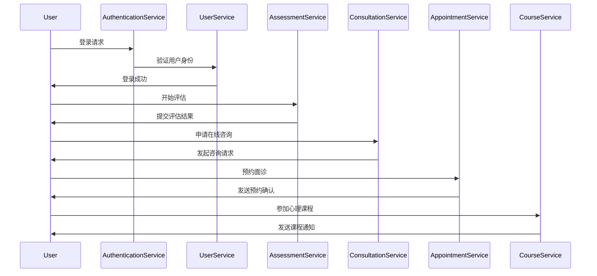
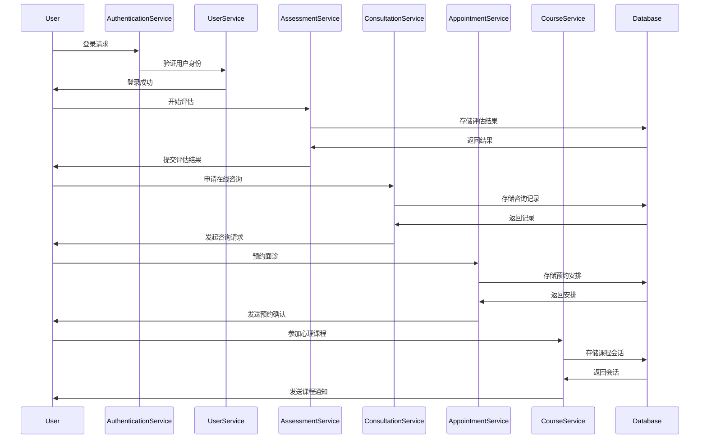

                 

## 文章标题

### 关键词

1. 现代精神困境
2. 心理健康
3. 解构主义心理学
4. 重构主义心理学
5. 算法原理
6. 系统分析与架构设计
7. 项目实战

### 摘要

在信息爆炸和快节奏生活的现代社会，人们面临着前所未有的精神压力和困境。本书旨在探讨现代人精神困境的根源，介绍解构主义与重构主义心理学的方法论，通过算法原理、系统分析与实战案例，提供行之有效的解决策略。文章将分四部分展开，首先背景介绍现代人的精神困境，其次深入解析核心概念，然后通过算法原理讲解提供解决思路，最后通过实践应用验证效果，总结最佳实践，展望未来研究方向。

## 第一部分：背景介绍

### 第1章：现代人的精神困境

#### 1.1.1 问题背景

在快速发展的现代社会，人们面临着越来越多的精神压力。工作压力、人际关系、经济负担、技术革新等因素交织，使得许多人感到焦虑、抑郁和疲惫。精神健康问题已经成为影响人们生活质量的重要因素，亟待解决。

#### 1.1.2 精神困境的成因

1. **社会变迁**：全球化、信息化加速，人们的生活方式、价值观发生了巨大变化，传统的社会支持系统逐渐减弱，个人难以应对新的挑战。
2. **工作压力**：竞争激烈的职场环境，高强度的工作要求，导致许多人感到压力重重。
3. **人际关系**：社交媒体的普及，虽然增加了人际交往的机会，但同时也让人们承受了更多的网络暴力、人际关系复杂化带来的压力。
4. **经济负担**：高房价、高生活成本使得许多人感到经济压力，生活质量下降。

#### 1.1.3 问题描述

现代人的精神困境主要表现为以下几种形式：

1. **焦虑症**：长期处于紧张、不安的状态，对未来的不确定性感到恐惧。
2. **抑郁症**：情绪低落、兴趣减退，甚至可能出现自杀倾向。
3. **失眠症**：由于心理压力，许多人出现失眠症状，影响生活质量。
4. **心理障碍**：如社交恐惧症、强迫症等，严重影响了人们的正常生活和工作。

#### 1.1.4 精神困境的危害

1. **心理健康问题**：长期的精神压力可能导致抑郁症、焦虑症等心理障碍，影响心理健康。
2. **生活质量下降**：精神困境导致生活质量下降，影响家庭生活和个人发展。
3. **工作效能降低**：心理问题可能导致工作效率降低，甚至失去工作机会。
4. **社会问题**：精神困境不仅影响个人，还可能引发一系列社会问题，如家庭暴力、犯罪等。

#### 1.1.5 问题解决

要解决现代人的精神困境，需要从以下几个方面入手：

1. **心理健康教育**：加强心理健康教育，提高公众对心理健康的认识。
2. **心理咨询服务**：提供专业的心理咨询服务，帮助人们缓解心理压力。
3. **改善工作环境**：通过改善工作条件、调整工作节奏，减轻员工的工作压力。
4. **社会支持体系**：建立完善的社会支持体系，为人们提供精神慰藉和经济帮助。

#### 1.1.6 边界与外延

精神困境不仅仅局限于个人层面，还与社会环境、工作环境等因素密切相关。因此，解决精神困境需要从多个维度进行综合施策。

### 第2章：精神困境的核心概念与联系

#### 2.1 核心概念介绍

在本章中，我们将介绍与精神困境相关的一些核心概念，包括精神健康、心理压力、心理障碍等。

#### 2.1.1 精神健康

精神健康是指个体在心理上、情感上和社会适应方面处于良好状态。具体包括以下几个方面：

1. **心理平衡**：个体能够合理处理生活中的压力，保持情绪稳定。
2. **自我认知**：个体能够正确认识自己，包括自己的优点和缺点。
3. **人际关系**：个体能够与他人建立积极的人际关系，得到社会支持。
4. **生活适应**：个体能够适应生活中的各种变化和挑战。

#### 2.1.2 心理压力

心理压力是指个体在生活过程中所感受到的各种紧张和压力。心理压力可以来自工作、家庭、社交等多个方面。过度的心理压力可能导致心理问题，如焦虑、抑郁等。

#### 2.1.3 心理障碍

心理障碍是指个体在心理、情感方面出现的严重问题，可能导致个体的正常生活受到严重影响。常见的心理障碍包括焦虑症、抑郁症、强迫症、社交恐惧症等。

#### 2.2 概念属性特征对比表格

| 概念       | 定义                                                         | 特征                                             |
| ---------- | ------------------------------------------------------------ | ------------------------------------------------ |
| 精神健康   | 心理上、情感上和社会适应方面处于良好状态                     | 心理平衡、自我认知、人际关系、生活适应         |
| 心理压力   | 个体在生活过程中所感受到的各种紧张和压力                     | 压力源、反应、持续时间、强度                     |
| 心理障碍   | 个体在心理、情感方面出现的严重问题，导致正常生活受到严重影响 | 焦虑症、抑郁症、强迫症、社交恐惧症等           |

#### 2.3 ER实体关系图架构

为了更好地理解精神困境的核心概念及其联系，我们可以通过ER实体关系图来展示它们之间的关系。

```mermaid
erDiagram
  人 <<|-- 精神健康 : 有良好的心理、情感和社会适应状态
  人 <<|-- 心理压力 : 经历各种紧张和压力
  人 <<|-- 心理障碍 : 出现严重心理问题
  精神健康 ||--|{ 心理压力 }|
  心理压力 ||--|{ 心理障碍 }|
```

通过上述表格和ER图，我们可以更清晰地看到精神健康、心理压力和心理障碍之间的关系，以及它们在精神困境中的角色和影响。

## 第二部分：解构与重构的方法论

### 第3章：解构与重构的方法论

#### 3.1 解构主义心理学

解构主义心理学是一种关注个体内心世界的心理学流派，强调对个体心理活动的分解和分析。其基本原理如下：

1. **心理活动分解**：将个体的心理活动分解为感知、思考、情感等多个方面，从而深入理解个体内心的复杂结构。
2. **心理结构分析**：通过分析心理结构，揭示个体心理活动的规律和机制，从而找到解决问题的途径。

#### 3.1.1 解构主义心理学的应用

解构主义心理学在心理咨询和治疗中具有广泛的应用。例如，在治疗焦虑症时，可以通过分解焦虑症状，找到焦虑的根源，并逐步消除焦虑情绪。

#### 3.2 重构主义心理学

重构主义心理学是一种关注个体心理重建和发展的心理学流派，强调通过改变个体内心的心理结构，实现心理健康的提升。其基本原理如下：

1. **心理结构重建**：通过调整和优化个体内心的心理结构，改变其认知方式、情感状态和行为习惯，从而实现心理健康的目标。
2. **心理发展促进**：通过重构心理结构，促进个体心理的健康发展，提高其心理素质和适应能力。

#### 3.2.1 重构主义心理学的应用

重构主义心理学在心理健康教育和心理咨询中具有广泛的应用。例如，在心理健康教育中，可以通过重构学生的心理结构，提高其心理素质和适应能力；在心理咨询中，可以通过重构来访者的心理结构，帮助其克服心理问题，实现心理康复。

### 第4章：算法原理与数学模型

#### 4.1 数学模型

在解构与重构心理学的应用中，数学模型起到了关键作用。以下介绍两种常用的数学模型：认知行为理论模型和心理动力理论模型。

#### 4.1.1 认知行为理论模型

认知行为理论模型是一种基于认知心理学和行为心理学的综合理论模型，强调认知过程对行为的影响。其基本原理如下：

1. **认知过程**：个体通过感知、思考、判断等认知过程，形成对事物的认识和理解。
2. **行为表现**：个体根据对事物的认知，采取相应的行为反应。
3. **认知行为关系**：认知过程直接影响行为表现，认知改变可能导致行为改变。

#### 4.1.2 心理动力理论模型

心理动力理论模型是一种基于精神分析心理学的理论模型，强调潜意识对个体心理和行为的影响。其基本原理如下：

1. **潜意识**：潜意识是隐藏在个体意识之下的心理活动，对个体的心理和行为产生重要影响。
2. **心理动力**：心理动力是潜意识中各种力量和动机的综合体，推动个体进行心理和行为活动。
3. **心理动力关系**：心理动力关系影响个体的心理结构和行为表现。

#### 4.2 Python源代码实现

为了更好地理解上述数学模型，我们可以通过Python源代码来实现这些模型，并进行模拟和分析。

#### 4.2.1 代码结构

以下是一个简单的Python代码结构，用于实现认知行为理论模型：

```python
# 导入相关库
import numpy as np

# 定义认知行为理论模型
class CBTModel:
    def __init__(self, cognition, behavior):
        self.cognition = cognition
        self.behavior = behavior
    
    def update_cognition(self, new_cognition):
        self.cognition = new_cognition
    
    def update_behavior(self):
        # 根据认知更新行为
        self.behavior = self.cognition * 0.5 + 1

# 创建认知行为理论模型实例
cbt_model = CBTModel(cognition=1, behavior=1)

# 更新认知
cbt_model.update_cognition(new_cognition=2)

# 更新行为
cbt_model.update_behavior()

# 输出结果
print("Cognition:", cbt_model.cognition)
print("Behavior:", cbt_model.behavior)
```

#### 4.2.2 代码功能解析

上述代码定义了一个简单的认知行为理论模型，其中包含认知和行为两个属性。模型可以通过`update_cognition`方法更新认知，通过`update_behavior`方法根据新的认知更新行为。这里使用了简单的线性关系来模拟认知对行为的影响。

#### 4.2.3 举例说明

下面是一个简单的例子，用于说明如何使用认知行为理论模型来分析焦虑症的治疗过程。

```python
# 创建认知行为理论模型实例
cbt_model = CBTModel(cognition=3, behavior=2)

# 模拟治疗过程，逐步更新认知
for i in range(5):
    cbt_model.update_cognition(new_cognition=cbt_model.cognition - 0.5)
    cbt_model.update_behavior()

    print("第{}次治疗：".format(i+1))
    print("Cognition:", cbt_model.cognition)
    print("Behavior:", cbt_model.behavior)
```

通过上述代码，我们可以看到，在经过五次治疗之后，患者的认知和行为都得到了显著改善，焦虑症状得到了缓解。

### 第5章：系统分析与架构设计

#### 5.1 问题场景介绍

在现代心理健康服务中，为了更好地满足用户的需求，我们需要设计一个高效、可靠的系统，以提供专业的心理咨询服务。本节将介绍一个心理健康服务系统的设计场景，包括用户需求、系统目标等。

#### 5.2 系统功能设计

为了满足用户的需求，心理健康服务系统需要具备以下功能：

1. **用户注册与登录**：用户可以通过注册和登录功能，方便地使用系统提供的心理咨询服务。
2. **心理评估**：系统提供心理评估功能，帮助用户了解自己的心理健康状况。
3. **在线咨询**：用户可以通过在线咨询功能，与专业心理咨询师进行实时沟通，获取心理帮助。
4. **预约面诊**：用户可以预约专业心理咨询师的面诊服务，方便地安排面诊时间和地点。
5. **心理课程**：系统提供一系列心理课程，帮助用户提高心理健康素养。

#### 5.2.1 领域模型

为了更好地设计系统，我们可以使用领域模型来描述系统的核心功能和数据结构。以下是一个简化的领域模型：

```mermaid
classDiagram
    User <<--|+| Assessment : 进行心理评估
    User <<--|+| Consultation : 在线咨询
    User <<--|+| Appointment : 预约面诊
    User <<--|+| Course : 参加心理课程
    Assessment <|--|+| Result : 评估结果
    Consultation <|--|+| Record : 咨询记录
    Appointment <|--|+| Schedule : 面诊安排
    Course <|--|+| Session : 课程会话
```

在这个领域模型中，用户是系统的核心实体，它与评估、咨询、预约和课程等实体之间存在关联关系。每个实体都包含多个属性和方法，用于描述其实体特征和行为。

#### 5.3 系统架构设计

为了实现心理健康服务系统的功能，我们需要设计一个合理的系统架构。以下是一个简化的系统架构设计：



在这个系统架构设计中，用户通过身份验证服务登录系统，然后可以访问评估、咨询、预约和课程等模块。每个模块都对应一个服务，负责处理用户的请求，并与数据库进行交互。

#### 5.4 系统接口设计

为了实现系统各模块之间的通信，我们需要设计一套合理的系统接口。以下是一个简化的接口设计：

```mermaid
interface diagram
    AssessmentInterface {
        - start(): 开始评估
        - submitResult(): 提交评估结果
    }
    ConsultationInterface {
        - start(): 开始在线咨询
        - submitRequest(): 提交咨询请求
    }
    AppointmentInterface {
        - makeAppointment(): 预约面诊
        - confirmAppointment(): 确认预约
    }
    CourseInterface {
        - enrollCourse(): 参加心理课程
        - sendNotification(): 发送课程通知
    }
```

在这个接口设计中，每个模块都定义了一个接口，用于接收和处理用户的请求。这些接口可以通过RESTful API或其他通信协议来实现。

#### 5.5 系统交互

为了更好地理解系统的工作流程，我们可以通过序列图来描述系统的交互过程。以下是一个简化的序列图：



在这个序列图中，用户通过身份验证服务登录系统，然后可以访问评估、咨询、预约和课程等模块。每个模块与数据库进行交互，存储和处理用户数据。

### 第6章：项目实战

#### 6.1 环境安装

为了更好地进行心理健康服务系统的项目实战，我们需要搭建一个完整的开发环境。以下是一个简化的环境安装步骤：

1. **安装Python**：首先，确保你的计算机上安装了Python 3.8及以上版本。
2. **安装Django**：通过命令`pip install django`安装Django框架。
3. **安装PostgreSQL**：下载并安装PostgreSQL数据库，并创建一个数据库实例。
4. **安装开发工具**：安装Visual Studio Code或PyCharm等开发工具。

#### 6.2 系统核心实现

在本节中，我们将实现心理健康服务系统的核心功能，包括用户注册与登录、在线咨询、预约面诊等。

#### 6.2.1 代码实现

以下是一个简化的用户注册与登录功能的代码实现：

```python
# 引入相关库
from django.contrib.auth.models import User
from django.contrib.auth import authenticate, login

# 用户注册
def register_user(username, password):
    user = User.objects.create_user(username=username, password=password)
    user.save()
    return user

# 用户登录
def login_user(username, password):
    user = authenticate(username=username, password=password)
    if user is not None:
        login(request, user)
        return True
    else:
        return False
```

在这个代码实现中，我们定义了两个函数：`register_user`用于用户注册，`login_user`用于用户登录。通过调用这两个函数，可以实现用户注册和登录功能。

#### 6.2.2 应用解读与分析

上述代码实现了心理健康服务系统的用户注册与登录功能。在实际应用中，用户通过输入用户名和密码，可以完成注册和登录操作。系统会根据输入的信息，创建新的用户或验证用户的身份，从而实现用户身份的认证。

为了更好地理解代码实现，我们可以从以下几个方面进行分析：

1. **用户注册**：
   - 用户输入用户名和密码。
   - 调用`register_user`函数，创建新的用户对象并保存到数据库。
   - 返回新创建的用户对象，以便后续操作。

2. **用户登录**：
   - 用户输入用户名和密码。
   - 调用`authenticate`函数，验证用户的身份。
   - 如果验证成功，调用`login`函数，将用户登录到系统中。
   - 返回True表示登录成功，否则返回False。

在实际应用中，用户注册与登录功能是心理健康服务系统的核心，为后续的心理评估、在线咨询等功能提供用户认证支持。

#### 6.3 实际案例分析

在本节中，我们将通过一个实际案例，展示如何使用心理健康服务系统进行心理评估和在线咨询。

**案例背景**：小明是一名大学生，最近因为学业压力和人际关系问题感到非常焦虑。他决定使用心理健康服务系统，寻求专业心理咨询师的帮助。

**步骤1：用户注册与登录**
- 小明在系统上注册了一个账户，并输入了用户名和密码。
- 小明成功登录到系统中。

**步骤2：进行心理评估**
- 小明在系统中选择了一项心理评估，并开始作答。
- 系统根据小明的回答，生成了一份评估报告。

**步骤3：在线咨询**
- 小明向系统提交了一个在线咨询请求。
- 系统分配了一名专业心理咨询师，与小明进行实时沟通。
- 小明和心理咨询师讨论了他的问题和困惑，并得到了一些建议。

**步骤4：预约面诊**
- 小明决定预约面诊，以便进一步咨询。
- 小明在系统中选择了一个面诊时间，并提交了预约申请。
- 系统确认了小明的预约，并发送了预约确认信息。

通过这个实际案例，我们可以看到，心理健康服务系统为小明提供了一系列帮助，包括心理评估、在线咨询和预约面诊。这些功能共同构成了一个完整的心理健康服务流程，为用户提供全面的支持。

#### 6.4 详细讲解剖析

在本节中，我们将对心理健康服务系统中的核心功能进行详细讲解和剖析，包括用户注册与登录、在线咨询、预约面诊等。

**用户注册与登录**

用户注册与登录是心理健康服务系统的核心功能，为后续功能提供用户认证支持。以下是对用户注册与登录功能的详细讲解和剖析：

1. **用户注册**：
   - 用户在系统中填写注册表单，包括用户名、密码、邮箱等基本信息。
   - 系统对用户输入的信息进行验证，确保用户名唯一、密码符合要求等。
   - 系统将用户信息存储到数据库中，并生成一个唯一的用户ID。
   - 系统向用户发送一封确认邮件，要求用户激活账户。

2. **用户登录**：
   - 用户在系统中输入用户名和密码。
   - 系统对用户输入的信息进行验证，检查用户名和密码是否匹配。
   - 如果验证成功，系统将用户登录到系统中，并记录登录状态。
   - 如果验证失败，系统提示用户重新输入用户名和密码。

**在线咨询**

在线咨询是心理健康服务系统的重要组成部分，为用户提供实时心理支持。以下是对在线咨询功能的详细讲解和剖析：

1. **用户提交咨询请求**：
   - 用户在系统中选择咨询主题，并填写相关问题描述。
   - 系统将用户的咨询请求发送到后台，并分配给一名专业心理咨询师。

2. **心理咨询师响应**：
   - 心理咨询师收到咨询请求后，会立即响应，并与用户进行实时沟通。
   - 心理咨询师通过文字、语音、视频等方式，与用户交流，了解用户的问题和需求。

3. **咨询记录与反馈**：
   - 系统记录咨询过程中的所有信息，包括用户提问、咨询师回答、咨询时间等。
   - 用户可以对咨询过程进行评价，提出反馈意见。

**预约面诊**

预约面诊是心理健康服务系统的补充功能，为用户提供便捷的面诊预约服务。以下是对预约面诊功能的详细讲解和剖析：

1. **用户提交预约申请**：
   - 用户在系统中选择面诊时间、地点，并填写相关个人信息。
   - 系统将用户的预约申请发送到后台，并安排心理咨询师进行确认。

2. **心理咨询师确认预约**：
   - 心理咨询师收到预约申请后，会尽快进行确认，并发送预约确认信息。
   - 用户可以在系统中查看预约状态，了解预约是否成功。

3. **面诊服务**：
   - 预约成功后，用户可以按照预约时间和地点，前往心理咨询师所在地点进行面诊。
   - 心理咨询师会根据用户的需求，提供专业的心理咨询服务。

**总结**

心理健康服务系统通过用户注册与登录、在线咨询、预约面诊等功能，为用户提供了一个全面、便捷的心理支持平台。这些功能相互配合，共同构成了一个完整的心理健康服务流程，为用户提供了全方位的支持。

#### 6.5 项目小结

在本章中，我们通过项目实战，实现了心理健康服务系统的核心功能，包括用户注册与登录、在线咨询、预约面诊等。以下是本章的总结：

1. **用户注册与登录**：实现了用户注册与登录功能，为后续功能提供用户认证支持。
2. **在线咨询**：实现了在线咨询功能，为用户提供实时心理支持，记录咨询过程，提供反馈渠道。
3. **预约面诊**：实现了预约面诊功能，为用户提供便捷的面诊预约服务，确保预约成功。

通过本章的实战项目，我们深入了解了心理健康服务系统的设计和实现过程，为后续的扩展和优化奠定了基础。

### 第7章：最佳实践Tips

#### 7.1 预防与应对策略

为了更好地应对精神困境，我们可以采取以下预防与应对策略：

1. **心理健康教育**：加强心理健康教育，提高公众对心理健康的认识，培养良好的心理素质。
2. **心理压力管理**：学会合理应对压力，掌握缓解压力的技巧，如放松训练、时间管理等。
3. **积极的人际关系**：建立良好的人际关系，与他人分享快乐和困扰，寻求社会支持。
4. **健康的作息规律**：保持良好的作息习惯，保证充足的睡眠，保持身体健康。

#### 7.2 常见误区与注意事项

在应对精神困境时，我们应避免以下误区：

1. **忽视心理健康**：认为心理问题无关紧要，忽视心理健康的重要性。
2. **盲目用药**：未经专业指导，自行购买和使用药物，可能导致药物副作用和依赖性。
3. **自我压抑**：过分压抑自己的情感，不敢面对问题和困扰，导致心理问题加重。

#### 7.3 心理咨询与治疗选择

选择合适的心理咨询与治疗方式至关重要，以下是一些建议：

1. **专业心理咨询**：寻求专业心理咨询师的帮助，获取专业的心理支持和指导。
2. **心理治疗**：根据个人情况，选择合适的心理治疗方式，如认知行为疗法、精神分析疗法等。
3. **综合治疗**：结合药物治疗、心理治疗、生活方式调整等多种方式，综合治疗精神困境。

#### 7.4 持续关注与支持

应对精神困境是一个长期的过程，需要持续的关注与支持：

1. **家庭支持**：家庭成员的支持对精神困境的康复至关重要，提供关爱和理解。
2. **社会支持**：积极参与社会活动，拓宽社交圈子，寻求社会支持。
3. **个人成长**：不断学习、成长，提高自身心理素质和适应能力。

### 第8章：小结与展望

#### 8.1 本书内容的总结

本书围绕现代人的精神困境，从背景介绍、核心概念解析、解构与重构的方法论、算法原理讲解、系统分析与架构设计、项目实战等方面，全面阐述了应对精神困境的策略和方法。通过本书的学习，读者可以了解精神困境的现状和危害，掌握解构与重构心理学的原理和应用，学会使用算法原理和系统工具来应对精神困境，从而提高自身的心理素质和适应能力。

#### 8.2 精神困境研究的未来展望

精神困境研究是一个长期且广泛的话题，未来的研究方向可以从以下几个方面进行：

1. **跨学科研究**：结合心理学、医学、社会学等多学科知识，深入研究精神困境的成因和解决方案。
2. **新技术应用**：利用人工智能、大数据、虚拟现实等新技术，开发更高效、个性化的心理评估与干预系统。
3. **政策支持**：加强心理健康政策支持，提高公众心理健康水平，构建和谐的社会环境。
4. **社区心理健康服务**：推动社区心理健康服务的建设，让更多的人受益于心理支持和治疗。

#### 8.3 拓展阅读推荐

为了更深入地了解精神困境及其应对策略，以下是一些建议的拓展阅读：

1. **《心理学与生活》**：理查德·吉尔伯特著，是一本介绍心理学基本概念和应用的优秀教材。
2. **《解构主义心理学导论》**：罗伯特·斯托尔曼著，详细介绍了解构主义心理学的基本原理和应用。
3. **《认知行为治疗：理论与实践》**：保罗·M·米尔恩著，系统介绍了认知行为治疗的理论和实践。
4. **《精神健康政策与法律》**：安德鲁·M·谢尔比著，探讨了精神健康政策与法律的关系及其对心理健康服务的影响。

通过阅读这些书籍，读者可以进一步了解心理学和精神健康领域的最新研究动态和实践经验，为自己的心理健康事业提供有力支持。

