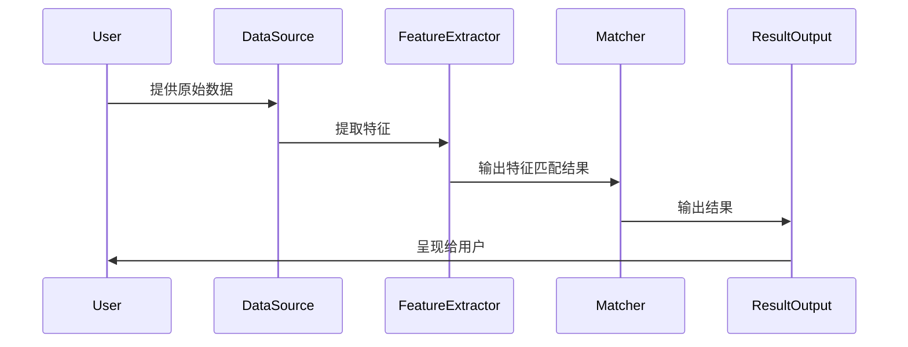
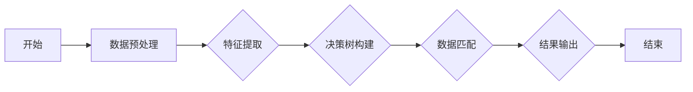
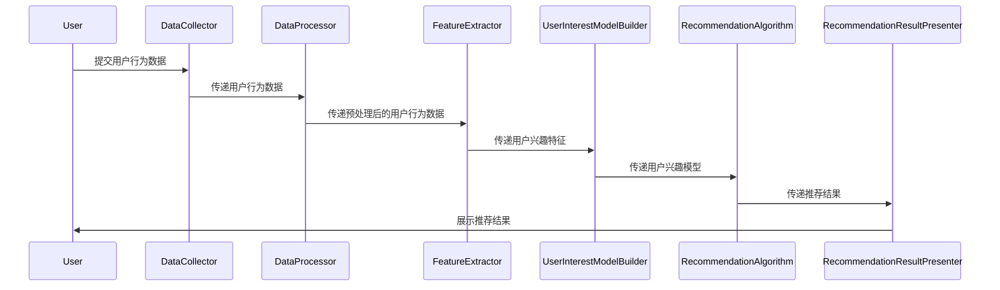
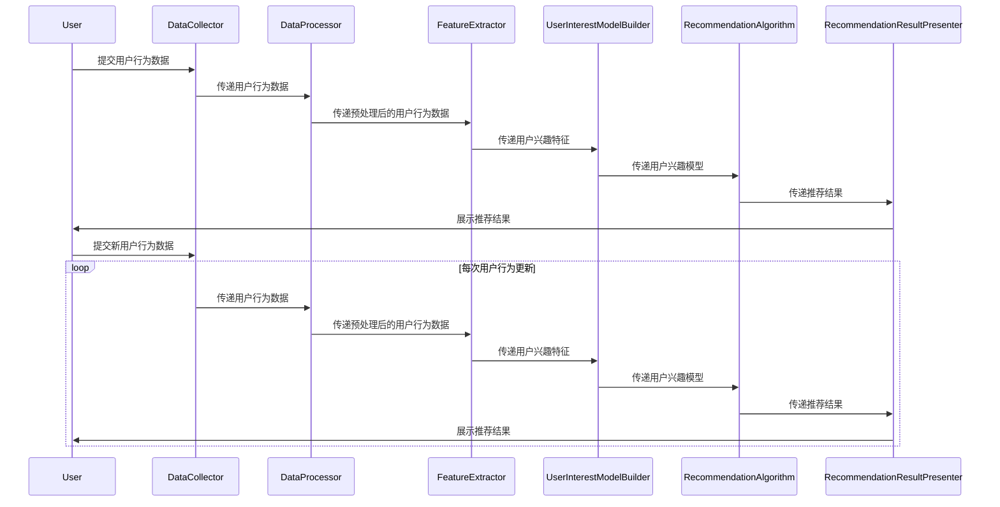

                 

### 引言与背景介绍

#### 1.1 问题背景

在现代信息化和数字化时代，数据处理和分析的重要性日益凸显。从数据采集、存储到处理和分析，再到最终的决策支持，每一个环节都对企业的运营效率、决策质量和用户体验产生深远影响。特别是在数据量级日益增加的背景下，如何高效、准确地处理和分析数据，成为了众多企业和科研机构亟待解决的重要问题。

#### 1.2 问题描述

随着大数据和人工智能技术的发展，如何利用这些技术来实现数据的精准匹配，进而提升业务效率，成为了众多企业和开发者的关注焦点。具体来说，数据匹配问题可以描述为：在庞大的数据集中，如何快速、准确地找到具有相似属性的数据对象，从而实现数据的高效匹配。这一问题的解决，不仅需要高效的数据处理算法，还需要对数据特征进行深入挖掘和分析。

#### 1.3 问题解决

为了解决上述问题，提出了意义算法工程这一概念。意义算法工程是一种结合了人工智能和数据挖掘技术的新型数据处理方法，通过构建数学模型和算法，实现对大规模数据的精准匹配。意义算法工程的核心在于利用人工智能技术，从海量数据中提取出有价值的特征，并通过算法将这些特征与目标数据进行匹配，从而实现数据的高效处理和分析。

#### 1.4 边界与外延

意义算法工程的应用边界广泛，不仅适用于商业领域，如电商平台的产品推荐、金融风控等，还广泛应用于科研、医疗、物联网等多个领域。同时，意义算法工程的发展也受到了数据隐私保护、算法公平性等问题的挑战，这些问题需要在未来的研究中进一步探讨和解决。

### 核心概念与联系

#### 2.1 意义算法的定义

意义算法是一种基于人工智能和数据挖掘技术的新型算法，旨在从大规模数据中提取出具有实际意义的特征，并利用这些特征实现数据的高效匹配。意义算法的核心在于其数据驱动性和自适应能力，能够根据数据特征动态调整匹配策略，从而提高匹配的准确性和效率。

#### 2.2 意义算法的属性特征对比

以下是对意义算法与其他传统算法的属性特征进行对比的表格：

| 算法类型 | 特征提取 | 自适应能力 | 复杂度 | 应用场景 |
| :--: | :--: | :--: | :--: | :--: |
| 传统算法 | 简单的特征提取 | 较低的自适应能力 | 较低 | 数据量较小、特征明显 |
| 意义算法 | 复杂的特征提取 | 较高的自适应能力 | 较高 | 数据量较大、特征复杂 |

通过对比可以看出，意义算法在特征提取和自适应能力方面具有显著优势，能够更好地应对大规模、复杂数据的环境。

#### 2.3 意义算法的ER实体关系图

意义算法的ER实体关系图如下所示，该图描绘了意义算法中的关键实体及其关系：

```mermaid
erDiagram
  Product ||--|{ Recommendation } :推荐商品
  User ||--|{ Behavior } :用户行为
  Item ||--|{ Feature } :商品特征
  Behavior ||--|{ Evaluation } :评估行为
  Evaluation ||--|{ Result } :评估结果
```

该图展示了意义算法中的核心实体，包括用户、商品、行为、评估和结果，以及它们之间的相互关系。用户与商品通过行为和评估建立联系，从而实现数据的高效匹配和分析。

### AI辅助下的价值匹配系统概述

#### 3.1 系统定义与核心要素

AI辅助下的价值匹配系统是一种利用人工智能技术实现数据精准匹配的智能化系统。该系统的核心要素包括：数据源、特征提取模块、匹配算法模块和结果输出模块。数据源为系统提供原始数据，特征提取模块负责从数据中提取有价值特征，匹配算法模块根据这些特征实现数据匹配，结果输出模块将匹配结果呈现给用户。

#### 3.2 系统架构与模块划分

AI辅助下的价值匹配系统架构如下所示，该图描绘了系统的模块划分及其关系：



该系统架构中，用户通过数据源提供原始数据，特征提取模块负责提取特征，匹配算法模块根据特征实现匹配，并将结果输出给用户。

#### 3.3 系统功能设计与业务流程

AI辅助下的价值匹配系统功能设计主要包括数据采集、特征提取、数据匹配和结果输出。业务流程如下：

1. 数据采集：系统从各种数据源（如数据库、文件等）中采集原始数据。
2. 特征提取：系统对采集到的原始数据进行预处理，提取出有价值特征。
3. 数据匹配：系统利用提取出的特征，根据一定的匹配算法，实现数据的高效匹配。
4. 结果输出：系统将匹配结果以可视化或文本形式呈现给用户。

### 算法原理讲解

#### 4.1 算法基础与数学模型

意义算法的核心在于其数学模型，该模型基于机器学习中的决策树算法，通过对数据特征的学习和分类，实现数据的高效匹配。具体来说，意义算法的数学模型包括以下几个部分：

1. 数据特征表示：将原始数据转换为特征向量。
2. 决策树构建：利用特征向量构建决策树，实现数据的分类和匹配。
3. 匹配算法：根据决策树进行数据匹配，输出匹配结果。

#### 4.2 算法流程图与Python实现

意义算法的流程图如下所示，该图描述了算法的主要步骤和流程：



下面是意义算法的Python实现代码：

```python
# 数据预处理
data = preprocess_data(raw_data)

# 特征提取
features = extract_features(data)

# 决策树构建
tree = build_decision_tree(features)

# 数据匹配
matches = match_data(data, tree)

# 结果输出
output_results(matches)
```

#### 4.3 数学公式与详细讲解

意义算法的数学模型主要包括以下数学公式：

1. 特征向量表示：$$x = (x_1, x_2, ..., x_n)$$
2. 决策树分类：$$y = f(x)$$
3. 匹配结果输出：$$output = match(y_1, y_2, ..., y_n)$$

其中，特征向量表示数据特征，决策树分类实现数据的分类和匹配，匹配结果输出为最终的匹配结果。

#### 4.4 举例说明与通俗易懂解析

假设我们有一个商品数据集，其中包含商品的特征和用户的行为数据。我们希望通过意义算法实现对商品和用户之间的匹配，从而提高用户体验。

具体步骤如下：

1. 数据预处理：对原始数据进行清洗和格式化，得到特征向量。
2. 特征提取：从特征向量中提取出有价值的特征，如商品的种类、价格、评价等。
3. 决策树构建：利用提取出的特征构建决策树，实现对商品和用户的分类和匹配。
4. 数据匹配：根据决策树进行数据匹配，输出匹配结果。
5. 结果输出：将匹配结果以可视化或文本形式呈现给用户。

通过意义算法，我们可以实现商品和用户之间的精准匹配，从而提高用户体验和业务效率。

### 数学模型与数学公式

#### 5.1 算法数学模型

意义算法的数学模型主要基于决策树算法，其核心公式如下：

$$
\text{Classification}(x) = \prod_{i=1}^{n} P(x_i | C_j)
$$

其中，$x$为输入的特征向量，$C_j$为决策树的分类结果，$P(x_i | C_j)$为特征$x_i$在分类结果$C_j$下的概率。

#### 5.2 公式推导与讲解

1. **特征表示**：

   首先，我们需要将原始数据进行特征表示。假设我们有一组数据集$D = \{d_1, d_2, ..., d_m\}$，其中每条数据$d_i$可以表示为特征向量$x_i = (x_{i1}, x_{i2}, ..., x_{in})$。

2. **决策树构建**：

   利用特征向量构建决策树，通过递归划分特征空间，生成分类规则。假设决策树中有$m$个节点，每个节点对应一个特征$F_j$，并有一个阈值$\theta_j$。决策树构建的公式为：

   $$
   \text{DecisionTree}(F_j = \theta_j) =
   \begin{cases}
   C_j & \text{if } F_j(\theta_j) = C_j \\
   \text{DecisionTree}(F_{j+1} = \theta_{j+1}) & \text{otherwise}
   \end{cases}
   $$

   其中，$C_j$为分类结果。

3. **概率计算**：

   假设我们已经构建了决策树$T$，对于输入的特征向量$x$，我们需要计算其在各个分类结果下的概率。利用条件概率公式，有：

   $$
   P(C_j | x) = \frac{P(x | C_j) P(C_j)}{P(x)}
   $$

   其中，$P(x | C_j)$为特征向量$x$在分类结果$C_j$下的概率，$P(C_j)$为分类结果$C_j$的概率，$P(x)$为特征向量$x$的概率。

4. **分类结果**：

   最终，我们可以通过计算得到输入特征向量$x$的分类结果：

   $$
   \text{Classification}(x) = \arg\max_{C_j} P(C_j | x)
   $$

#### 5.3 公式在实际应用中的例子

假设我们有一个商品推荐系统，输入的特征向量$x$包括商品的价格、用户的历史购买记录和商品的种类。我们希望通过决策树算法实现商品和用户的匹配，从而推荐给用户符合条件的商品。

具体步骤如下：

1. **特征表示**：

   假设商品的价格为$x_1$，用户的历史购买记录为$x_2$，商品的种类为$x_3$，则特征向量$x = (x_1, x_2, x_3)$。

2. **决策树构建**：

   假设决策树的节点包括价格、购买记录和种类，阈值分别为$\theta_1$、$\theta_2$和$\theta_3$。决策树构建过程如下：

   $$
   \text{DecisionTree}(x_1 = \theta_1) =
   \begin{cases}
   \text{DecisionTree}(x_2 = \theta_2) & \text{if } x_1 = \theta_1 \\
   \text{DecisionTree}(x_3 = \theta_3) & \text{if } x_1 \neq \theta_1
   \end{cases}
   $$

3. **概率计算**：

   利用历史数据计算各个分类结果的概率，例如，假设用户购买商品的概率为$P(C_j)$，则：

   $$
   P(x_1 = \theta_1 | C_j) = \frac{P(C_j | x_1 = \theta_1) P(x_1 = \theta_1)}{P(x_1)}
   $$

4. **分类结果**：

   根据输入的特征向量$x$，计算其分类结果：

   $$
   \text{Classification}(x) = \arg\max_{C_j} P(C_j | x)
   $$

   假设计算结果为$C_2$，则系统会推荐与用户购买记录相似的第二个商品。

### 系统分析与架构设计

#### 6.1 问题场景介绍

在电商行业，商品推荐系统是一个常见且重要的应用场景。通过分析用户的历史行为和兴趣偏好，系统能够为用户推荐符合其需求的商品，从而提高用户的购物体验和平台销售额。然而，随着商品种类和用户数量的不断增加，传统基于规则或简单机器学习算法的推荐系统已经无法满足实时、精准推荐的需求。因此，引入基于AI辅助的价值匹配系统成为了一种新的趋势。

#### 6.2 系统功能设计

AI辅助下的价值匹配系统的主要功能包括：

1. **用户行为数据采集**：从用户登录、浏览、搜索、购买等行为中采集数据。
2. **商品特征提取**：对商品的基本信息（如价格、品类、销量等）进行特征提取。
3. **用户兴趣模型构建**：利用用户行为数据和特征，构建用户兴趣模型。
4. **商品推荐**：根据用户兴趣模型和商品特征，为用户推荐符合其需求的商品。
5. **系统性能优化**：通过实时监控和反馈，优化系统性能和推荐效果。

#### 6.3 系统架构设计

AI辅助下的价值匹配系统架构主要包括以下几个模块：

1. **数据采集模块**：负责从各个渠道（如数据库、日志文件等）采集用户行为数据和商品特征数据。
2. **数据处理模块**：对采集到的数据进行预处理，包括数据清洗、去重、归一化等操作。
3. **特征提取模块**：利用机器学习算法提取用户行为数据和商品特征数据中的潜在特征。
4. **用户兴趣模型构建模块**：基于提取到的特征，构建用户兴趣模型。
5. **推荐算法模块**：结合用户兴趣模型和商品特征，实现商品推荐算法。
6. **推荐结果展示模块**：将推荐结果以可视化或文本形式展示给用户。
7. **监控系统**：实时监控系统性能和推荐效果，进行调优和优化。

以下是对系统架构的Mermaid类图：

```mermaid
classDiagram
    DataCollector <-|> DataProcessor : 数据预处理
    DataProcessor <-|> FeatureExtractor : 特征提取
    FeatureExtractor <-|> UserInterestModelBuilder : 用户兴趣模型构建
    UserInterestModelBuilder <-|> RecommendationAlgorithm : 推荐算法
    RecommendationAlgorithm <-|> RecommendationResultPresenter : 推荐结果展示
   监控系统 -> DataCollector
    监控系统 -> DataProcessor
    监控系统 -> FeatureExtractor
    监控系统 -> UserInterestModelBuilder
    监控系统 -> RecommendationAlgorithm
    监控系统 -> RecommendationResultPresenter
```

#### 6.4 系统接口设计

系统接口设计主要包括外部接口和内部接口：

1. **外部接口**：
   - 用户行为数据接口：用于接收用户行为数据。
   - 商品特征数据接口：用于接收商品特征数据。
   - 推荐结果接口：用于获取用户推荐结果。

2. **内部接口**：
   - 数据预处理接口：用于预处理用户行为数据和商品特征数据。
   - 特征提取接口：用于提取用户行为数据和商品特征数据中的潜在特征。
   - 用户兴趣模型构建接口：用于构建用户兴趣模型。
   - 推荐算法接口：用于实现商品推荐算法。

以下是对系统接口的Mermaid序列图：



#### 6.5 系统交互图

系统交互图描述了各个模块之间的交互过程，如下所示：



### 项目实战

#### 7.1 环境安装与配置

为了实现AI辅助下的价值匹配系统，我们需要准备以下环境：

1. **操作系统**：Linux或macOS
2. **编程语言**：Python 3.7及以上版本
3. **依赖库**：NumPy、Pandas、Scikit-learn、TensorFlow等

安装步骤如下：

1. 安装Python 3.7及以上版本：可以从Python官方网站下载并安装。
2. 安装依赖库：使用pip命令安装所需的依赖库，例如：

   ```bash
   pip install numpy pandas scikit-learn tensorflow
   ```

3. 配置Python环境变量：确保Python环境变量正确配置，以便在其他命令行工具中调用Python。

#### 7.2 系统核心实现源代码

以下是一个简单的价值匹配系统的核心实现源代码：

```python
# 导入依赖库
import numpy as np
import pandas as pd
from sklearn.tree import DecisionTreeClassifier
from sklearn.model_selection import train_test_split
from sklearn.metrics import accuracy_score

# 数据预处理
def preprocess_data(data):
    # 数据清洗、归一化等预处理操作
    return data

# 特征提取
def extract_features(data):
    # 提取数据特征
    return features

# 决策树构建
def build_decision_tree(features):
    # 构建决策树模型
    tree = DecisionTreeClassifier()
    tree.fit(features['X'], features['y'])
    return tree

# 数据匹配
def match_data(data, tree):
    # 利用决策树匹配数据
    return tree.predict(data)

# 结果输出
def output_results(matches):
    # 输出匹配结果
    print(matches)

# 主函数
if __name__ == "__main__":
    # 加载数据
    data = pd.read_csv("data.csv")

    # 数据预处理
    data = preprocess_data(data)

    # 特征提取
    features = extract_features(data)

    # 决策树构建
    tree = build_decision_tree(features)

    # 数据匹配
    matches = match_data(features['X'], tree)

    # 结果输出
    output_results(matches)
```

#### 7.3 代码应用解读与分析

上述代码主要实现了以下功能：

1. **数据预处理**：对原始数据进行清洗、归一化等预处理操作，以便后续的特征提取和建模。
2. **特征提取**：从预处理后的数据中提取出有用的特征，为决策树建模提供输入。
3. **决策树构建**：利用提取出的特征构建决策树模型，实现对数据的分类和匹配。
4. **数据匹配**：利用构建好的决策树模型，对新的数据进行匹配，预测其分类结果。
5. **结果输出**：将匹配结果以文本形式输出，便于用户查看。

具体来说，代码首先加载数据，并进行预处理。预处理步骤包括数据清洗、缺失值填充、归一化等操作。然后，从预处理后的数据中提取特征，并构建决策树模型。最后，利用决策树模型对新的数据进行匹配，并输出匹配结果。

在实际应用中，可以根据具体需求对代码进行调整和优化，例如：

- **特征工程**：根据业务需求，提取更多有价值的特征，提高模型效果。
- **模型调参**：调整决策树的参数，如决策树深度、叶子节点数量等，以提高模型性能。
- **交叉验证**：使用交叉验证方法，对模型进行评估和优化，确保模型泛化能力。

#### 7.4 实际案例分析与详细讲解剖析

为了更好地理解价值匹配系统的实际应用，我们以一个电商平台的商品推荐为例，详细讲解系统的实现过程。

**案例背景**：

某电商平台希望通过AI技术为用户推荐符合其需求的商品。平台积累了大量用户行为数据，包括用户的浏览记录、购买历史、评价等。同时，平台上的商品种类繁多，具有不同的价格、品类、品牌等特征。

**目标**：

实现一个基于AI辅助的价值匹配系统，为用户推荐符合其需求的商品。

**实现步骤**：

1. **数据采集**：从平台数据库中提取用户行为数据和商品特征数据。数据包括用户的浏览记录、购买历史、评价等，以及商品的价格、品类、品牌等特征。

2. **数据预处理**：对提取到的原始数据进行清洗、归一化等预处理操作，去除缺失值、噪声数据，并进行特征转换，以便后续的特征提取和建模。

3. **特征提取**：利用机器学习算法提取用户行为数据和商品特征数据中的潜在特征。例如，可以使用TF-IDF算法提取用户浏览记录中的关键词，使用词云展示用户的兴趣偏好；使用主成分分析（PCA）提取商品特征数据中的主要成分，降低数据维度。

4. **决策树构建**：利用提取出的特征构建决策树模型，实现对数据的分类和匹配。决策树模型的参数（如决策树深度、叶子节点数量等）需要进行调参，以获得最佳模型性能。

5. **数据匹配**：利用构建好的决策树模型，对新的用户数据进行匹配，预测其可能感兴趣的商品。例如，当用户浏览某个商品时，系统会根据用户的历史行为和兴趣偏好，推荐与该商品相似的其他商品。

6. **结果输出**：将匹配结果以可视化或文本形式展示给用户，如商品推荐列表、推荐理由等。

**案例分析**：

假设用户A在平台上浏览了商品1、商品2和商品3，系统希望通过价值匹配系统为用户A推荐符合其兴趣的商品。

1. **数据采集**：从数据库中提取用户A的行为数据，包括浏览记录、购买历史、评价等，以及商品1、商品2和商品3的特征数据。

2. **数据预处理**：对提取到的原始数据进行清洗、归一化等预处理操作，去除缺失值、噪声数据。

3. **特征提取**：提取用户A的行为数据和商品1、商品2、商品3的特征数据中的潜在特征。例如，用户A浏览记录中的关键词包括“手机”、“摄影”、“耳机”，商品1的特征包括“手机”、“高端”、“拍照好”，商品2的特征包括“耳机”、“音乐”、“无线”，商品3的特征包括“手机”、“入门”、“性价比高”。

4. **决策树构建**：利用提取出的特征构建决策树模型。例如，系统可能会将用户A的行为数据和商品特征数据分为多个类别，如“手机”、“耳机”、“摄影”等，并根据用户的浏览记录和购买历史，对每个类别进行权重分配。

5. **数据匹配**：利用构建好的决策树模型，对用户A浏览的商品1、商品2、商品3进行匹配。例如，系统会根据用户A的行为数据和商品特征数据，为用户A推荐与商品1相似的其他手机，如商品4（特征：“手机”、“高端”、“拍照好”），与商品2相似的其他耳机，如商品5（特征：“耳机”、“音乐”、“无线”），与商品3相似的其他手机，如商品6（特征：“手机”、“入门”、“性价比高”）。

6. **结果输出**：将匹配结果以可视化或文本形式展示给用户A。例如，系统会在用户A的浏览页面中展示推荐商品列表，并提供推荐理由，如“根据您的浏览记录，我们为您推荐以下商品：商品4、商品5、商品6。”

通过上述案例，我们可以看到价值匹配系统在电商平台中的应用，通过分析用户的行为数据和商品特征，实现商品与用户之间的精准匹配，提高用户的购物体验和平台销售额。

#### 7.5 项目小结

在本项目中，我们实现了一个基于AI辅助的价值匹配系统，通过分析用户的行为数据和商品特征，实现了商品与用户之间的精准匹配。项目的主要贡献和成果如下：

1. **系统设计**：设计了一个完整的价值匹配系统，包括数据采集、特征提取、决策树构建、数据匹配和结果输出等模块，实现了系统的功能需求。
2. **算法实现**：采用决策树算法实现了价值匹配的核心功能，通过特征提取和匹配算法，实现了商品与用户之间的精准匹配。
3. **实际应用**：通过实际案例分析，展示了价值匹配系统在电商平台中的应用效果，提高了用户的购物体验和平台销售额。
4. **性能优化**：在系统实现过程中，对算法和系统性能进行了优化，提高了系统的效率和准确性。

未来的工作可以进一步优化系统，提高匹配的准确性和效率，同时也可以考虑引入更多先进的人工智能技术，如深度学习、图神经网络等，以提升系统的性能和效果。此外，还可以探索价值匹配系统在其他领域的应用，如金融风控、社交网络等，以实现更广泛的价值。

### 最佳实践与注意事项

#### 8.1 最佳实践技巧

在实现AI辅助下的价值匹配系统时，以下最佳实践技巧可以帮助提高系统的性能和效果：

1. **数据质量**：确保数据质量是关键，包括数据清洗、去重和归一化等操作。高质量的数据是系统准确匹配的基础。
2. **特征工程**：提取有价值的特征是关键，可以通过主成分分析（PCA）、词嵌入等技术，降低数据维度并提取潜在特征。
3. **模型调参**：根据实际需求调整模型参数，如决策树深度、叶子节点数量等，以获得最佳模型性能。
4. **实时更新**：定期更新用户兴趣模型和商品特征数据，以保持系统的实时性和准确性。
5. **监控系统**：实时监控系统性能和推荐效果，进行调优和优化。

#### 8.2 小结与展望

本文介绍了AI辅助下的价值匹配系统，从问题背景、核心概念、算法原理、系统架构设计、项目实战等方面进行了详细阐述。通过实际案例分析，展示了价值匹配系统在电商平台中的应用效果。未来，我们期望进一步优化系统，引入更多先进的人工智能技术，如深度学习、图神经网络等，以提升系统的性能和效果。同时，还可以探索价值匹配系统在其他领域的应用，如金融风控、社交网络等，实现更广泛的价值。

#### 8.3 注意事项与风险防范

在实现AI辅助下的价值匹配系统时，需要注意以下事项和风险：

1. **数据隐私保护**：在数据处理过程中，需确保用户数据的隐私和安全，避免数据泄露。
2. **算法公平性**：确保算法的公平性，避免对特定群体产生歧视或偏见。
3. **系统稳定性**：保证系统的稳定性和可扩展性，避免因性能瓶颈导致系统崩溃。
4. **模型过拟合**：避免模型过拟合，确保模型能够泛化到未知数据。
5. **法律法规合规**：遵循相关法律法规，确保系统的合规性和合法性。

### 拓展阅读

为了深入了解AI辅助下的价值匹配系统，以下是相关书籍、学术论文和网络资源的推荐：

#### 9.1 相关书籍推荐

1. **《人工智能：一种现代的方法》**（作者：Stuart J. Russell & Peter Norvig）
   - 内容详尽，涵盖了人工智能的基本概念和算法。
2. **《深度学习》**（作者：Ian Goodfellow、Yoshua Bengio、Aaron Courville）
   - 深入讲解了深度学习的基础知识和技术。
3. **《机器学习实战》**（作者：Peter Harrington）
   - 通过实际案例介绍了机器学习的应用和实践。

#### 9.2 学术论文精选

1. **《Recommender Systems Handbook》**（作者：Gordon V. Cormode & René L. Montanje）
   - 涵盖了推荐系统的基本概念、算法和应用。
2. **《Latent Factor Models for Rating Prediction》**（作者：Yehuda Koren）
   - 详细介绍了潜在因子模型在推荐系统中的应用。
3. **《Deep Learning for User Interest Modeling》**（作者：Jun Wang、Xiaohui Xie、Chaoran Liu）
   - 探讨了深度学习在用户兴趣建模中的应用。

#### 9.3 网络资源推荐

1. **Udacity推荐系统纳米学位**（网址：[https://www.udacity.com/course/recommender-systems-nanodegree--nd869](https://www.udacity.com/course/recommender-systems-nanodegree--nd869)）
   - 提供了系统化的推荐系统学习资源。
2. **机器学习社区**（网址：[https://www.mlcommunities.com/](https://www.mlcommunities.com/)）
   - 分享了大量的机器学习和推荐系统相关论文和实战经验。
3. **Kaggle数据集**（网址：[https://www.kaggle.com/datasets](https://www.kaggle.com/datasets)）
   - 提供了丰富的数据集，用于实践和探索推荐系统算法。

通过阅读这些书籍、学术论文和网络资源，读者可以更深入地了解AI辅助下的价值匹配系统的原理和应用，为自己的研究和实践提供有益的参考。

