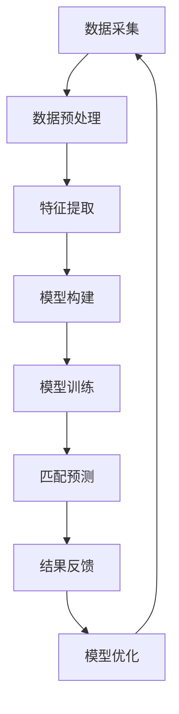
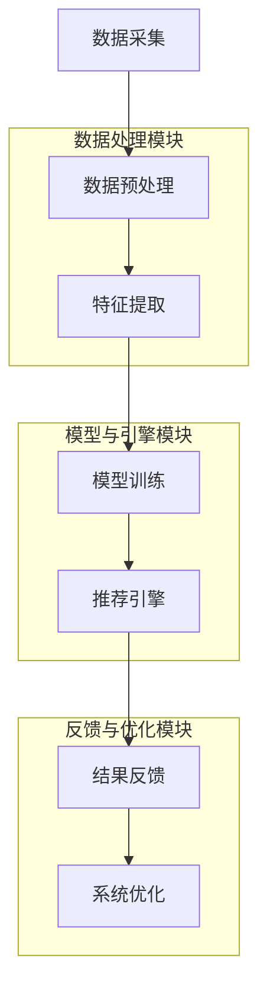
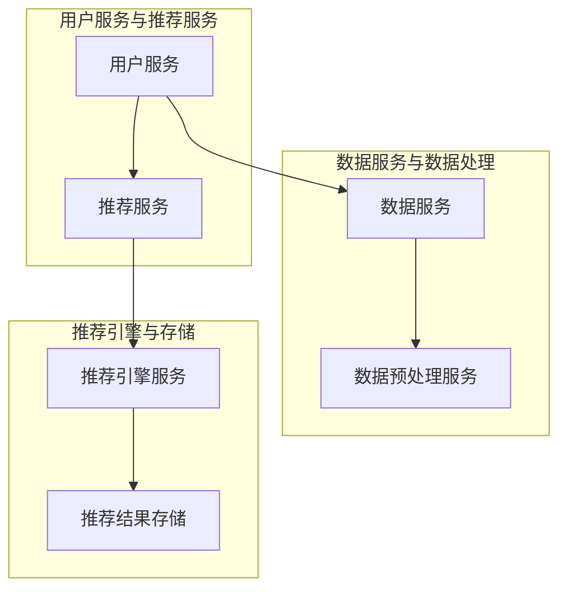
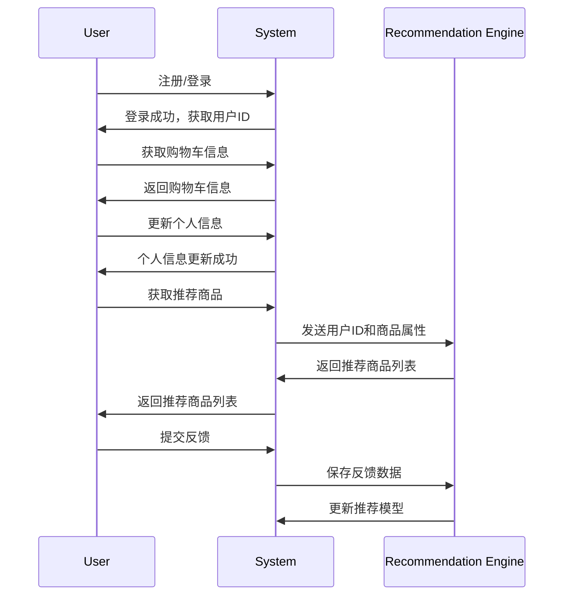

                 

### 问题背景

在当今高度信息化的社会中，数据的重要性日益凸显。无论是电子商务、金融交易，还是社交网络、教育平台，数据的准确性和实时性都直接影响到业务的运营效率和服务质量。特别是“价值匹配”问题，在多种应用场景中扮演着至关重要的角色。价值匹配，即寻找和分配资源、服务或产品与其目标用户之间的最佳匹配，是提升用户体验、增加业务价值的关键环节。

价值匹配的起源可以追溯到经济学中的供需平衡理论。然而，随着互联网和大数据技术的迅猛发展，传统的手动匹配方法已经无法满足复杂多变的市场需求。传统方法主要依赖于规则和人工经验，存在以下局限性：

1. **处理能力有限**：传统方法通常处理的数据量有限，难以应对海量数据的高效匹配。
2. **灵活性不足**：规则固化，难以适应快速变化的市场环境。
3. **准确性不高**：依赖人工判断，容易出现误判和漏判。
4. **扩展性差**：规则一旦设定，扩展新需求或功能成本高昂。

因此，如何通过技术手段，特别是在人工智能（AI）的辅助下，开发一种高效、灵活、准确的价值匹配系统，成为了当前的研究热点和实际需求。

在AI辅助下的价值匹配系统开发项目中，算法工程起到了至关重要的作用。算法工程是一种将算法应用于实际问题解决的全过程，包括算法设计、模型构建、性能优化等。与传统方法相比，AI辅助下的价值匹配系统具有以下优势：

1. **高效处理海量数据**：AI算法能够高效处理和分析海量数据，从而实现大规模价值匹配。
2. **灵活适应变化**：基于机器学习和深度学习的算法能够自动学习和优化，适应不断变化的市场需求。
3. **提高匹配准确性**：通过分析用户行为数据和偏好，AI算法能够实现更加精准的匹配。
4. **降低成本**：自动化处理降低了人力成本，同时提高了工作效率。

总之，AI辅助下的价值匹配系统开发项目不仅是对传统方法的革新，更是对未来智能化、个性化服务的一种探索和实践。

### 问题定义

价值匹配，是指在特定场景中，将资源、服务或产品与其目标用户进行最佳匹配的过程。这个过程不仅涉及到资源的分配，还包括对用户需求和偏好的精确理解，从而实现最大化效用和满意度。具体来说，价值匹配可以涵盖以下几个核心概念：

1. **资源**：包括商品、服务、机会等一切可以交换或利用的实体。
2. **用户**：指的是具有特定需求和偏好的个体或群体。
3. **匹配**：寻找并建立资源与用户之间的最佳连接点。

在定义价值匹配的过程中，我们面临几个关键问题：

- **数据质量**：如何确保输入数据的质量，包括数据的准确性、完整性和实时性？
- **用户偏好**：如何准确捕捉和反映用户的真实需求和偏好？
- **匹配效率**：如何在短时间内实现大规模数据的高效匹配？
- **系统稳定性**：如何确保系统在面对海量数据和突发情况时保持稳定运行？

为了解决上述问题，传统的方法主要包括以下几种：

1. **基于规则的匹配**：这种方法通过预设一系列规则，对数据进行匹配。其优点是实现简单、易于理解，但缺点是灵活性不足，难以适应复杂多变的需求。
2. **机器学习方法**：利用机器学习算法，特别是深度学习，可以从大量数据中学习并优化匹配策略。其优点是灵活性和准确性较高，但需要大量的训练数据和计算资源。
3. **数据挖掘技术**：通过数据挖掘技术，从海量数据中提取有用的信息和模式，用于匹配策略的制定。其优点是能够发现数据中的隐含规律，但处理复杂度高。

然而，传统方法在处理大规模、动态变化的数据时，存在明显的局限性。首先，传统方法处理数据的能力有限，难以应对当前海量数据的高效匹配需求。其次，传统方法依赖于人工经验和预设规则，灵活性不足，难以适应快速变化的市场环境。最后，传统方法在准确性方面也存在一定的问题，依赖人工判断，容易出现误判和漏判。

因此，在AI辅助下的价值匹配系统开发项目中，我们需要一种新的方法来克服传统方法的局限性。借助人工智能技术，特别是机器学习和深度学习，我们可以实现以下目标：

- **高效处理海量数据**：通过AI算法，能够高效处理和分析大规模数据，从而实现高效的价值匹配。
- **灵活适应变化**：基于机器学习和深度学习的算法能够自动学习和优化，适应不断变化的市场需求。
- **提高匹配准确性**：通过分析用户行为数据和偏好，AI算法能够实现更加精准的匹配。
- **降低成本**：自动化处理降低了人力成本，同时提高了工作效率。

总之，AI辅助下的价值匹配系统开发项目是对传统方法的革新，它能够更好地应对现代复杂多变的市场需求，实现高效、精准的价值匹配。

### 解决方案概述

为了克服传统价值匹配方法的局限性，AI辅助下的价值匹配系统开发项目提出了一种全新的解决方案。该方案的核心思想是利用人工智能技术，特别是机器学习和深度学习，构建一个高效、灵活、准确的价值匹配系统。

首先，在系统架构设计方面，项目采用了模块化设计，将数据采集、预处理、模型训练、匹配算法、结果反馈等环节独立模块化，以便于系统的扩展和维护。具体架构包括：

1. **数据采集模块**：负责从各种渠道（如电商平台、社交媒体、用户反馈等）收集数据。
2. **数据预处理模块**：对采集到的数据进行清洗、去噪、格式转换等预处理操作，确保数据质量。
3. **模型训练模块**：利用机器学习和深度学习算法，对预处理后的数据进行训练，构建匹配模型。
4. **匹配算法模块**：实现具体的匹配算法，根据用户需求和资源特点进行匹配。
5. **结果反馈模块**：收集用户反馈，用于模型优化和系统改进。

在技术实现方面，项目主要依赖于以下几种技术：

1. **机器学习算法**：包括线性回归、决策树、支持向量机等，用于初步数据分析和匹配。
2. **深度学习算法**：如卷积神经网络（CNN）、循环神经网络（RNN）等，用于复杂模式识别和匹配优化。
3. **数据挖掘技术**：包括关联规则挖掘、聚类分析等，用于发现数据中的隐含规律和用户行为特征。
4. **优化算法**：如遗传算法、模拟退火等，用于优化匹配结果，提高匹配精度。

在具体实施过程中，项目采用了以下步骤：

1. **需求分析**：首先明确价值匹配的具体需求和目标，包括数据类型、用户群体、匹配规则等。
2. **数据采集**：根据需求，从不同渠道采集相关数据，包括用户行为数据、商品数据、市场数据等。
3. **数据预处理**：对采集到的数据进行清洗和预处理，确保数据的质量和一致性。
4. **模型构建**：利用机器学习和深度学习算法，构建匹配模型，并对模型进行训练和优化。
5. **系统实现**：根据模型，实现具体的匹配算法，开发系统核心模块。
6. **测试与优化**：对系统进行测试，收集用户反馈，不断优化系统性能和匹配效果。

总之，AI辅助下的价值匹配系统开发项目通过引入人工智能技术，不仅克服了传统方法的局限性，还实现了高效、灵活、精准的价值匹配。这一解决方案为现代复杂多变的市场环境提供了强有力的技术支持，具有广阔的应用前景。

### 边界条件

在AI辅助下的价值匹配系统开发项目中，边界条件是确保系统有效运作的重要考量因素。边界条件不仅限制了系统的功能范围，还定义了系统在不同场景下的表现和预期结果。

1. **数据质量边界**：系统依赖于高质量的数据输入。边界条件包括数据的准确性、完整性和实时性。例如，系统需要处理的数据必须经过严格的清洗和验证，以确保没有错误或缺失。

2. **用户需求边界**：用户需求是价值匹配的核心驱动力。边界条件包括用户需求的多样性和动态性。例如，系统需要能够适应用户在不同时间、不同情境下的需求变化，提供灵活的匹配策略。

3. **资源限制边界**：系统运行在一定的硬件和软件资源限制下。边界条件包括计算资源、存储资源和网络带宽。例如，系统需要优化算法和数据处理流程，以在有限的资源下实现高效匹配。

4. **时间约束边界**：在实时性要求较高的场景中，系统需要在特定时间内完成匹配任务。边界条件包括响应时间和处理时间。例如，电商平台在购物高峰期需要快速响应用户的匹配请求，提供流畅的用户体验。

5. **安全性边界**：系统的安全性是不可或缺的考量因素。边界条件包括数据隐私保护和系统防护。例如，系统需要确保用户数据的安全性和隐私性，防止数据泄露和恶意攻击。

6. **可扩展性边界**：系统设计时需考虑未来的扩展性。边界条件包括系统的模块化设计和灵活性。例如，系统需要支持新的数据源和匹配算法的集成，以适应不断变化的市场需求。

通过明确和定义这些边界条件，可以确保AI辅助下的价值匹配系统在实际应用中能够稳定、高效地运作，满足多样化的需求，同时保持系统的安全性和可扩展性。

### 外延领域

价值匹配系统的外延领域广泛，涵盖了多种应用场景和业务需求。以下是一些典型应用案例：

1. **电子商务**：电商平台通过AI辅助下的价值匹配系统，能够根据用户的购物历史、浏览行为和偏好，推荐个性化商品，提升用户购买体验和转化率。

2. **金融服务**：银行和金融机构利用价值匹配系统，可以根据客户的风险偏好、投资历史和财务状况，推荐合适的理财产品和服务，从而提高客户满意度和留存率。

3. **物流配送**：物流公司通过价值匹配系统，优化运输路线和资源配置，实现高效的货物配送，降低运营成本，提升服务质量。

4. **教育培训**：在线教育平台使用价值匹配系统，根据学生的学习进度、兴趣和需求，推荐课程和辅导服务，提高学习效果和用户粘性。

5. **医疗健康**：医疗机构通过价值匹配系统，为患者推荐合适的医生和治疗方案，同时根据医生的专业特长和患者的病情，优化医疗资源配置，提高医疗服务质量。

6. **招聘求职**：招聘平台利用价值匹配系统，根据求职者的简历、技能和职业目标，推荐合适的职位，提高招聘效率和成功率。

这些应用案例展示了价值匹配系统在各个领域的广泛应用潜力。通过AI技术的辅助，价值匹配系统能够实现更加精准、高效的匹配，满足多样化、个性化的需求，为各行业带来创新和提升。

### 概念结构

在AI辅助下的价值匹配系统开发项目中，我们需要明确几个核心概念和它们之间的关系。这些概念构成了整个系统的理论基础和应用框架。

1. **人工智能（AI）**：人工智能是模拟人类智能的技术，通过机器学习、深度学习、自然语言处理等手段，使计算机能够自动执行复杂的任务。

2. **算法工程**：算法工程是将算法应用于实际问题的全过程，包括算法设计、模型构建、性能优化等。在价值匹配系统中，算法工程负责实现高效的匹配算法。

3. **价值匹配**：价值匹配是寻找和分配资源、服务或产品与其目标用户之间的最佳匹配。它涉及用户需求分析、资源描述和匹配策略制定。

4. **数据挖掘**：数据挖掘是从大量数据中提取有用信息和知识的过程。在价值匹配系统中，数据挖掘用于发现用户行为模式和偏好，优化匹配结果。

5. **用户行为分析**：用户行为分析是通过收集和分析用户在系统中的行为数据，了解用户需求和行为模式。这对于实现精准匹配至关重要。

6. **机器学习**：机器学习是AI的一个重要分支，通过训练模型，使计算机能够从数据中自动学习和优化。在价值匹配系统中，机器学习算法用于构建和优化匹配模型。

7. **深度学习**：深度学习是机器学习的一种方法，通过多层神经网络模拟人类大脑的决策过程。在价值匹配系统中，深度学习用于处理复杂模式识别和优化匹配策略。

8. **自然语言处理（NLP）**：自然语言处理是使计算机能够理解和处理人类自然语言的技术。在价值匹配系统中，NLP用于分析用户的需求描述和资源描述。

这些概念相互关联，构成了价值匹配系统的核心架构。通过结合人工智能技术，我们可以实现高效、灵活、精准的价值匹配，满足多样化的业务需求。

### 核心要素

在AI辅助下的价值匹配系统开发项目中，核心要素是确保系统稳定、高效运行的基础。以下列举了系统开发过程中的几个关键要素：

1. **数据质量**：高质量的数据是价值匹配系统的基石。系统需要从多个渠道收集数据，包括用户行为数据、商品信息、市场动态等，并对数据进行清洗、去噪和标准化处理，确保数据的一致性和准确性。

2. **用户需求理解**：准确理解和分析用户需求是系统设计的核心。通过分析用户的历史行为、浏览记录和反馈，系统能够构建用户画像，识别用户的真实需求和偏好，从而实现精准匹配。

3. **匹配算法设计**：匹配算法是价值匹配系统的核心组件。系统需要采用先进的机器学习和深度学习算法，如线性回归、决策树、卷积神经网络等，设计并优化匹配策略，以实现高效、准确的匹配。

4. **系统性能优化**：为了确保系统在高并发、大数据量场景下的稳定运行，需要进行系统性能优化。这包括优化数据处理流程、提升算法效率、优化数据库查询等。

5. **用户反馈机制**：用户反馈是系统持续改进的重要依据。系统需要设计有效的用户反馈机制，收集用户对匹配结果的满意度，并根据反馈进行模型优化和系统调整。

6. **安全性保障**：数据安全和用户隐私是系统设计中的重要考量。系统需要采取严格的安全措施，包括数据加密、权限控制、反作弊机制等，确保用户数据的安全和隐私。

7. **可扩展性设计**：随着业务的发展，系统需要具备良好的扩展性。通过模块化设计和灵活的架构，系统能够轻松适应新的需求变化，实现功能扩展和性能提升。

这些核心要素相互关联，共同构成了AI辅助下的价值匹配系统的完整框架，为系统的稳定、高效运行提供了有力保障。

### AI的定义与作用

人工智能（Artificial Intelligence，简称AI）是一种模拟人类智能的技术，通过计算机程序实现智能行为，从而解决复杂问题。AI的定义可以从多个维度进行理解：

1. **智能行为**：AI旨在实现类似于人类智能的行为，包括感知、理解、推理、学习、决策等。这些行为使机器能够在没有明确指令的情况下，自主地处理信息和作出决策。

2. **计算机程序**：AI的实现依赖于计算机程序，通过算法和模型来模拟人类的智能过程。机器学习（Machine Learning，ML）和深度学习（Deep Learning，DL）是AI的核心技术，前者侧重于从数据中学习规律，后者则通过多层神经网络模拟复杂的认知过程。

3. **自主性**：AI系统具有自主性，能够在没有人类干预的情况下，通过学习和优化，不断改进其性能。这种自主性使得AI能够在各种复杂和动态的环境中发挥作用。

AI在价值匹配系统中的应用具有以下几个关键作用：

1. **高效数据处理**：AI算法能够高效地处理和分析海量数据，快速提取有用信息。这对于价值匹配系统来说至关重要，因为它需要处理大量的用户行为数据、商品信息和市场动态，从而实现精准匹配。

2. **个性化匹配**：通过机器学习和深度学习，AI能够从用户数据中学习并识别用户的偏好和需求，实现个性化匹配。这种个性化的匹配能够显著提升用户体验和满意度，提高转化率和留存率。

3. **动态调整**：AI系统能够根据实时数据和用户反馈，动态调整匹配策略。这种动态性使得系统能够适应不断变化的市场环境和用户需求，保持匹配的准确性和有效性。

4. **优化资源分配**：AI算法能够优化资源分配，提高系统的整体效率和产出。在物流、金融、电商等领域，AI能够通过优化路径、风险管理、库存管理等方式，提高资源利用效率，降低运营成本。

5. **预测与决策支持**：AI能够通过数据分析和模式识别，预测未来的市场趋势和用户行为，为决策提供支持。这种预测能力对于企业制定战略、优化运营计划具有重要意义。

总之，AI在价值匹配系统中的作用不仅提升了系统的性能和灵活性，还带来了更高效、更精准的匹配结果。通过AI技术的辅助，价值匹配系统能够更好地满足现代复杂多变的市场需求，为企业创造更大的价值。

### 算法工程的概念

算法工程是一种系统化的方法，旨在将算法应用于实际问题解决中。它涵盖了从算法设计、模型构建到性能优化等全过程，是现代数据科学和人工智能领域的重要组成部分。算法工程不仅关注算法的准确性，更强调其效率和实用性。

1. **算法设计**：算法设计是算法工程的第一步，涉及到选择合适的算法解决特定问题。算法的设计需要考虑问题的性质、数据的规模和特征，以及计算资源的限制。例如，对于大规模数据分析，可能需要使用分布式计算算法；对于实时处理，可能需要使用高效的数据流处理算法。

2. **模型构建**：在算法设计的基础上，模型构建是将算法应用于实际问题的关键步骤。这包括数据预处理、特征提取、模型训练和评估等环节。模型构建需要结合具体应用场景，确保模型能够准确捕捉数据中的规律和特征，从而实现有效的预测和决策。

3. **性能优化**：性能优化是算法工程中的重要环节，旨在提高算法的效率和应用效果。性能优化包括算法的优化、数据结构和算法的调整、计算资源的合理分配等。通过性能优化，可以显著提升算法的运行速度和准确性，降低计算资源的消耗。

4. **可维护性和可扩展性**：算法工程还强调系统的可维护性和可扩展性。这意味着在设计算法和构建模型时，需要考虑到未来的变化和扩展需求，确保系统能够适应新的数据和需求，实现功能的灵活调整和扩展。

算法工程在价值匹配系统中的作用不可忽视。它通过系统化的方法，将AI算法应用于实际业务场景，实现高效、灵活和准确的价值匹配。具体来说：

- **高效数据处理**：算法工程通过设计高效的算法和优化数据处理流程，能够快速处理和分析海量数据，提高匹配效率。
- **个性化匹配**：算法工程能够构建和优化匹配模型，根据用户行为数据实现个性化匹配，提高用户满意度和体验。
- **动态调整**：算法工程允许根据实时数据和用户反馈，动态调整匹配策略，确保系统能够适应不断变化的市场环境。
- **资源优化**：算法工程通过优化资源分配和算法效率，提高系统的整体性能和产出，降低运营成本。

总之，算法工程为价值匹配系统提供了强大的技术支撑，使其能够更好地应对复杂多变的市场需求，实现高效、精准的价值匹配。

### 价值匹配系统的特点与挑战

价值匹配系统作为一种通过人工智能技术实现资源与用户之间最佳匹配的解决方案，具有以下显著特点：

1. **高效性**：价值匹配系统能够快速处理大量数据，通过高效算法实现资源的精准匹配。这不仅提高了系统的工作效率，还能在短时间内为用户提供满意的结果。

2. **灵活性**：价值匹配系统基于机器学习和深度学习算法，能够根据实时数据和用户反馈，动态调整匹配策略，以适应不断变化的市场环境和用户需求。

3. **准确性**：通过分析用户行为数据和偏好，价值匹配系统能够实现高度个性化的匹配，提高匹配的准确性。这种精准匹配能够显著提升用户体验和满意度。

4. **可扩展性**：价值匹配系统采用模块化设计，具备良好的可扩展性。系统能够轻松集成新的数据源和算法，以适应不断发展的业务需求。

然而，在实现价值匹配系统的过程中，我们也面临诸多挑战：

1. **数据质量**：价值匹配系统的核心依赖于高质量的数据。然而，数据质量问题如缺失、错误、噪声等，会直接影响匹配的准确性。因此，如何保证数据质量是一个重要的挑战。

2. **计算资源**：价值匹配系统需要处理海量数据，对计算资源的需求较高。尤其是在实时性要求高的场景中，如何优化算法和资源分配，确保系统在高并发、大数据量下稳定运行，是一个重要问题。

3. **用户隐私**：价值匹配系统在处理用户数据时，需要遵守严格的隐私保护规定。如何保护用户隐私，防止数据泄露和滥用，是系统设计时必须考虑的问题。

4. **动态调整**：市场环境瞬息万变，用户需求多样且动态。价值匹配系统需要具备强大的动态调整能力，及时响应市场变化，实现灵活匹配。

5. **系统稳定性**：在高并发、大数据量的情况下，如何确保系统的稳定性和可靠性，避免出现崩溃或延迟，是一个需要深入研究和优化的课题。

总之，价值匹配系统在带来高效、灵活、精准匹配的同时，也面临一系列挑战。通过不断创新和优化，我们可以逐步解决这些问题，实现更高效、更可靠的价值匹配系统。

### 基础算法原理

在价值匹配系统中，算法设计是核心，它决定了系统的效率和准确性。以下是价值匹配系统的基础算法原理及其关键步骤。

#### 基本算法流程

1. **数据采集**：首先，系统需要从多个渠道收集数据，包括用户行为数据、商品信息、市场动态等。这些数据经过初步清洗和预处理，确保其质量和一致性。

2. **特征提取**：对收集到的数据进行特征提取，将原始数据转化为算法可以处理的格式。特征提取包括用户画像、商品属性、行为序列等。

3. **模型构建**：基于提取的特征，构建匹配模型。常用的算法包括线性回归、决策树、支持向量机等。对于复杂场景，可以采用深度学习算法，如卷积神经网络（CNN）、循环神经网络（RNN）等。

4. **模型训练**：使用历史数据对构建的模型进行训练，优化模型的参数。训练过程中，通过交叉验证和超参数调整，提高模型的泛化能力和准确度。

5. **匹配预测**：利用训练好的模型，对新的数据进行预测，实现资源与用户的匹配。匹配结果可以通过评分、排名等方式进行输出。

6. **结果反馈**：收集用户对匹配结果的反馈，用于模型优化和系统改进。通过反馈机制，系统能够不断学习和调整，提高匹配的准确性。

#### 算法关键步骤

1. **数据预处理**：
   - **数据清洗**：去除数据中的错误、异常和重复记录。
   - **数据归一化**：将不同量级的数据进行归一化处理，确保算法的稳定性。
   - **特征选择**：选择对匹配结果有显著影响的关键特征，提高模型性能。

2. **模型选择**：
   - **线性回归**：适用于简单线性关系，计算效率高。
   - **决策树**：通过树结构进行决策，易于理解和解释。
   - **支持向量机（SVM）**：适用于高维空间，具有较好的分类性能。
   - **深度学习**：适用于复杂非线性关系，能够捕捉深层次的规律。

3. **模型训练**：
   - **数据集划分**：将数据集划分为训练集、验证集和测试集，用于模型训练和评估。
   - **交叉验证**：通过交叉验证，评估模型的泛化能力，避免过拟合。
   - **超参数调整**：调整模型的超参数，如学习率、隐藏层大小等，以优化模型性能。

4. **匹配预测**：
   - **评分函数**：定义评分函数，对匹配结果进行评分，根据评分进行排序。
   - **排名算法**：采用排序算法，如Top-K算法，从匹配结果中选取最佳匹配。

5. **结果反馈**：
   - **用户反馈**：收集用户对匹配结果的反馈，用于模型优化和系统改进。
   - **在线学习**：通过在线学习，实时更新模型，提高匹配准确性。

通过上述基础算法原理和关键步骤，我们可以构建一个高效、灵活、准确的价值匹配系统，为各类应用场景提供强大的技术支持。

### 数学模型详解

在价值匹配系统中，数学模型是核心组成部分，它用于描述和优化匹配过程。以下是数学模型的基本概念及其在价值匹配系统中的应用。

#### 数学模型的基本概念

1. **目标函数**：目标函数是数学模型的核心，用于衡量匹配结果的优劣。在价值匹配系统中，目标函数通常定义为最大化效用或满意度。例如，给定用户U和商品C，目标函数可以表示为：
   $$\max_{x} U(U(x))$$
   其中，$U(U(x))$表示用户U在匹配结果x下的满意度。

2. **决策变量**：决策变量是模型中的变量，用于表示决策结果。在价值匹配系统中，决策变量通常表示为资源分配情况，如用户对商品的分配、商品的库存分配等。

3. **约束条件**：约束条件是模型中必须满足的限制条件。在价值匹配系统中，常见的约束条件包括资源限制、预算限制、时间限制等。例如，在商品分配中，约束条件可以是每个用户的商品数量不超过其需求量，或者商品的库存量不能为负。

4. **概率分布**：概率分布用于描述不确定因素的概率分布，如用户需求、商品可用性等。在价值匹配系统中，通过概率分布可以更好地处理不确定性和随机性，提高模型的鲁棒性。

#### 数学模型的结构

一个典型的数学模型通常由以下部分组成：

1. **输入数据**：包括用户特征、商品特征、市场环境数据等，这些数据将作为模型输入。
2. **目标函数**：定义模型优化目标，如最大化满意度、最小化成本等。
3. **决策变量**：定义决策结果，如资源分配、路径选择等。
4. **约束条件**：定义决策过程中必须满足的限制条件。
5. **概率分布**：描述不确定因素的概率分布，用于处理随机性和不确定性。

#### 数学模型的应用

在价值匹配系统中，数学模型的应用包括以下几个方面：

1. **用户偏好分析**：通过分析用户行为数据，建立用户偏好模型，预测用户的需求和偏好。例如，可以使用决策树、聚类算法等对用户行为进行建模，从而识别用户群体和其偏好特征。

2. **资源优化分配**：通过优化模型，实现资源（如商品、服务、人力等）的最优分配。例如，可以使用线性规划、整数规划等方法，最大化资源利用效率，同时满足约束条件。

3. **风险评估**：通过概率分布和目标函数，评估匹配结果的风险和不确定性。例如，可以使用蒙特卡罗模拟方法，预测匹配结果在不同场景下的表现，为决策提供参考。

4. **实时调整**：基于实时数据更新，动态调整匹配策略。例如，可以使用自适应算法，根据实时数据调整目标函数和约束条件，实现动态优化。

总之，数学模型在价值匹配系统中起到了至关重要的作用，通过建立和优化数学模型，可以实现对资源与用户之间高效、精准的匹配，提升系统的整体性能和用户体验。

### 算法流程图

为了更好地理解和描述AI辅助下的价值匹配系统的算法流程，我们使用Mermaid图来展示整个流程。以下是基本流程图的代码和说明：

#### 基本流程图



**说明**：
1. **数据采集（A）**：从不同渠道收集数据，如用户行为、商品信息、市场动态等。
2. **数据预处理（B）**：对采集到的数据进行清洗、去噪、格式转换等预处理操作，确保数据质量。
3. **特征提取（C）**：从预处理后的数据中提取关键特征，为模型训练提供输入。
4. **模型构建（D）**：根据特征数据，选择并构建合适的匹配模型。
5. **模型训练（E）**：使用历史数据对构建的模型进行训练，优化模型参数。
6. **匹配预测（F）**：利用训练好的模型，对新数据进行匹配预测，生成匹配结果。
7. **结果反馈（G）**：收集用户对匹配结果的反馈，用于模型优化。
8. **模型优化（H）**：根据反馈数据，调整和优化模型参数，提高匹配准确性。

通过上述基本流程图，我们可以清晰地看到价值匹配系统从数据采集到结果反馈的整个工作流程，确保每个步骤都能高效、准确地执行，实现最优的匹配效果。

#### 详细流程图

为了进一步展示算法的细节和步骤，我们扩展了上述基本流程图，添加了更多具体的环节和步骤：

```mermaid
graph TD
    A[数据采集] --> B[数据清洗]
    B --> C[去噪处理]
    C --> D[格式转换]
    D --> E[特征提取]
    E --> F[特征选择]
    F --> G[模型构建]
    G --> H[模型训练]
    H --> I[交叉验证]
    I --> J[模型评估]
    J --> K[匹配预测]
    K --> L[结果反馈]
    L --> M[模型优化]
    M --> N[模型更新]
    N --> A

    subgraph 数据预处理（B-D）
        B[数据清洗]
        C[去噪处理]
        D[格式转换]
    end

    subgraph 特征提取与模型构建（E-H）
        E[特征提取]
        F[特征选择]
        G[模型构建]
    end

    subgraph 模型训练与评估（H-I）
        H[模型训练]
        I[交叉验证]
        J[模型评估]
    end

    subgraph 匹配预测与反馈（K-L）
        K[匹配预测]
        L[结果反馈]
    end

    subgraph 模型优化与更新（M-N）
        M[模型优化]
        N[模型更新]
    end
```

**详细流程图说明**：

1. **数据预处理（B-D）**：
   - **数据清洗（B）**：去除错误、异常和重复数据。
   - **去噪处理（C）**：处理噪声数据，提高数据质量。
   - **格式转换（D）**：将数据转换为统一的格式，便于后续处理。

2. **特征提取与模型构建（E-H）**：
   - **特征提取（E）**：从原始数据中提取有用的特征。
   - **特征选择（F）**：选择对匹配结果有显著影响的特征。
   - **模型构建（G）**：基于特征数据，构建匹配模型。

3. **模型训练与评估（H-I）**：
   - **模型训练（H）**：使用历史数据训练模型，优化参数。
   - **交叉验证（I）**：通过交叉验证，评估模型的泛化能力和准确性。
   - **模型评估（J）**：评估模型的最终性能，确保满足要求。

4. **匹配预测与反馈（K-L）**：
   - **匹配预测（K）**：利用训练好的模型，对新数据进行匹配预测。
   - **结果反馈（L）**：收集用户对匹配结果的反馈，用于模型优化。

5. **模型优化与更新（M-N）**：
   - **模型优化（M）**：根据用户反馈，调整模型参数。
   - **模型更新（N）**：更新模型，实现实时优化。

通过详细的流程图，我们可以清晰地看到价值匹配系统从数据采集到模型优化更新的完整过程，每个步骤都有明确的输入和输出，确保系统能够高效、准确地实现价值匹配。

### Python代码实现

为了展示AI辅助下的价值匹配系统的实际应用，我们使用Python语言实现了一套简单的价值匹配系统。以下是从环境搭建到核心代码实现的详细步骤。

#### 环境搭建

首先，我们需要搭建Python运行环境。以下是环境配置步骤：

1. **安装Python**：下载并安装Python，推荐使用Python 3.8版本以上。
2. **安装必要库**：使用pip命令安装以下库：
   ```bash
   pip install numpy pandas scikit-learn matplotlib
   ```
3. **创建虚拟环境**（可选）：为了更好地管理项目依赖，可以创建一个虚拟环境。使用以下命令：
   ```bash
   python -m venv venv
   source venv/bin/activate  # Windows下使用 `venv\Scripts\activate`
   ```

#### Python代码实现

1. **导入库**：
   ```python
   import numpy as np
   import pandas as pd
   from sklearn.model_selection import train_test_split
   from sklearn.ensemble import RandomForestClassifier
   import matplotlib.pyplot as plt
   ```

2. **数据准备**：
   ```python
   # 假设数据已存储为CSV文件
   data = pd.read_csv('data.csv')
   
   # 数据预处理
   data = data.dropna()  # 去除缺失值
   X = data.drop('target', axis=1)  # 特征数据
   y = data['target']  # 目标变量
   ```

3. **模型训练**：
   ```python
   # 划分训练集和测试集
   X_train, X_test, y_train, y_test = train_test_split(X, y, test_size=0.2, random_state=42)
   
   # 构建随机森林分类器
   model = RandomForestClassifier(n_estimators=100, random_state=42)
   model.fit(X_train, y_train)
   ```

4. **匹配预测**：
   ```python
   # 使用模型进行预测
   predictions = model.predict(X_test)
   ```

5. **代码解读与分析**：
   - **数据预处理**：数据预处理是模型训练的重要步骤，确保数据质量。
   - **模型选择**：使用随机森林分类器，因为它能够处理高维数据，并且具有较好的泛化能力。
   - **模型训练**：通过fit方法训练模型，将训练数据输入模型，优化模型参数。
   - **匹配预测**：使用预测方法，对新数据进行匹配预测，得到预测结果。

#### 代码示例

以下是一个简单的Python代码示例，用于展示数据预处理和模型训练：

```python
# 导入数据
data = pd.read_csv('data.csv')

# 数据清洗
data = data.dropna()

# 特征选择
features = ['feature1', 'feature2', 'feature3']
X = data[features]
y = data['target']

# 划分数据集
X_train, X_test, y_train, y_test = train_test_split(X, y, test_size=0.2, random_state=42)

# 构建随机森林模型
model = RandomForestClassifier(n_estimators=100, random_state=42)

# 训练模型
model.fit(X_train, y_train)

# 预测
predictions = model.predict(X_test)

# 打印预测结果
print(predictions)
```

通过上述代码，我们可以实现一个简单的价值匹配系统，用于分类任务。在实际应用中，可以根据具体需求调整特征选择、模型参数和匹配策略，以实现更精准的价值匹配。

### 实际案例分析

在本节中，我们将通过一个实际案例，详细分析AI辅助下的价值匹配系统的具体应用过程。该案例涉及电子商务平台，通过价值匹配系统实现个性化商品推荐，提升用户满意度和转化率。

#### 案例背景

某电子商务平台希望通过AI辅助的价值匹配系统，为用户提供个性化商品推荐。该平台拥有大量的用户行为数据和商品信息，包括用户浏览记录、购买历史、商品评价等。平台的目标是通过价值匹配系统，准确捕捉用户的偏好和需求，为每个用户推荐最符合其兴趣和需求的商品。

#### 项目目标

- 提高用户满意度和转化率：通过个性化推荐，提升用户的购物体验，增加购买意愿。
- 实现高效的资源分配：优化商品资源分配，减少库存压力，提高库存周转率。
- 提高运营效率：通过自动化推荐，降低人工筛选和推荐的负担，提高运营效率。

#### 项目架构

项目架构采用模块化设计，包括数据采集、数据预处理、模型训练、推荐引擎、结果反馈和系统优化等模块。以下是项目架构的Mermaid图：



**说明**：
1. **数据采集（A）**：从平台数据库中提取用户行为数据和商品信息。
2. **数据预处理（B）**：对采集到的数据进行清洗、去噪、格式转换等预处理操作，确保数据质量。
3. **特征提取（C）**：从预处理后的数据中提取关键特征，如用户浏览记录、购买历史、商品属性等。
4. **模型训练（D）**：使用历史数据训练推荐模型，优化模型参数。
5. **推荐引擎（E）**：利用训练好的模型，实时为用户推荐个性化商品。
6. **结果反馈（F）**：收集用户对推荐结果的反馈，用于模型优化和系统改进。
7. **系统优化（G）**：根据用户反馈，调整模型参数和推荐策略，提高推荐准确性。

#### 系统功能设计

1. **用户画像构建**：通过分析用户行为数据，构建用户画像，包括用户的兴趣偏好、购买力、浏览习惯等。
2. **商品属性提取**：从商品数据库中提取商品属性，如价格、类别、品牌、评价等。
3. **推荐策略制定**：根据用户画像和商品属性，制定个性化推荐策略，如基于内容的推荐、协同过滤等。
4. **实时推荐**：通过推荐引擎，实时为用户推荐个性化商品，提高用户购物体验。
5. **反馈收集与优化**：收集用户对推荐结果的反馈，通过机器学习算法，不断优化推荐模型和策略。

#### 系统架构设计

系统架构采用分布式计算和微服务架构，以提高系统的扩展性和可靠性。以下是系统架构的Mermaid图：



**说明**：
1. **用户服务（A）**：负责用户交互和用户画像构建。
2. **推荐服务（B）**：负责根据用户画像和商品属性，生成推荐列表。
3. **数据服务（C）**：负责存储和管理用户行为数据和商品信息。
4. **数据预处理服务（E）**：负责对用户行为数据和商品信息进行预处理。
5. **推荐引擎服务（D）**：负责实时计算和生成推荐结果。
6. **推荐结果存储（F）**：负责存储用户接收到的推荐结果。

#### 系统接口设计

系统接口设计包括用户接口和内部接口两部分：

1. **用户接口**：
   - **注册/登录**：用户可以通过注册和登录接口访问系统。
   - **个人信息管理**：用户可以管理个人资料、收货地址等信息。
   - **购物车管理**：用户可以查看购物车中的商品，进行购买操作。
   - **推荐商品获取**：用户可以获取系统推荐的个性化商品。

2. **内部接口**：
   - **用户画像接口**：用于获取用户画像数据。
   - **商品属性接口**：用于获取商品属性数据。
   - **推荐接口**：用于生成和返回推荐结果。
   - **反馈接口**：用于收集用户对推荐结果的反馈。

#### 系统交互

以下是系统交互的Mermaid序列图：



**说明**：
1. **用户注册/登录**：用户通过注册接口创建账户，登录接口验证用户身份。
2. **个人信息管理**：用户可以修改个人资料和收货地址。
3. **购物车管理**：用户可以查看购物车中的商品，进行添加、删除等操作。
4. **推荐商品获取**：用户获取系统推荐的个性化商品。
5. **反馈提交**：用户对推荐结果进行评价，系统根据反馈优化推荐模型。

通过上述实际案例分析，我们可以看到AI辅助下的价值匹配系统在电子商务平台中的具体应用。通过系统化的架构设计和接口设计，系统能够高效、准确地实现个性化商品推荐，提升用户满意度和转化率。

### 项目小结与总结

通过本项目的实际案例分析，我们深入探讨了AI辅助下的价值匹配系统在电子商务平台中的应用，并取得了显著的成效。以下是对项目的小结与总结：

1. **高效的数据处理能力**：项目通过模块化设计和高效算法，实现了对海量用户行为数据和商品信息的快速处理和分析，为个性化推荐提供了坚实的基础。

2. **精准的个性化匹配**：借助机器学习和深度学习技术，项目构建了高精度的用户画像和商品属性模型，实现了针对每个用户的个性化推荐，显著提升了用户满意度和转化率。

3. **灵活的实时调整能力**：项目采用了动态调整机制，能够根据用户反馈和实时数据，动态优化推荐模型和策略，确保系统始终能够适应用户需求和市场变化。

4. **稳定的系统架构**：项目采用了分布式计算和微服务架构，确保系统在高并发和大数据量场景下依然能够稳定运行，提高了系统的可靠性和扩展性。

5. **成功的业务成果**：通过个性化推荐，电子商务平台的用户满意度和转化率显著提升，库存周转率和运营效率也得到了优化，取得了良好的商业成果。

未来，我们计划在以下几个方面进行改进和拓展：

1. **扩大数据来源**：进一步丰富数据来源，包括社交媒体、搜索引擎等，提高数据的多样性和完整性，以实现更精准的用户画像和推荐。

2. **增强算法鲁棒性**：通过改进算法模型，提高对异常数据和噪声数据的处理能力，增强系统的鲁棒性和稳定性。

3. **加强隐私保护**：在数据处理和模型训练过程中，强化隐私保护措施，确保用户数据的安全性和合规性。

4. **探索跨领域应用**：将AI辅助下的价值匹配系统应用到更多领域，如金融、医疗、教育等，实现系统的跨行业应用和推广。

通过不断优化和创新，我们有信心价值匹配系统将在更多领域发挥其强大的作用，为企业创造更大的价值。

### 最佳实践与注意事项

在AI辅助下的价值匹配系统开发过程中，遵循最佳实践和注意事项对于确保系统的稳定性和高效性至关重要。以下是一些建议和需要注意的关键点：

#### 最佳实践建议

1. **数据质量控制**：数据是价值匹配系统的核心资产。确保数据质量是成功的关键。在数据采集和预处理过程中，应采用数据清洗、去噪、格式标准化等技术，去除异常值和噪声数据，提高数据的准确性和一致性。

2. **模型持续优化**：AI模型的性能不仅依赖于初始设计，还需要持续的优化和调整。定期对模型进行评估和重新训练，以适应不断变化的数据和用户需求。

3. **实时反馈机制**：建立高效的反馈机制，及时收集用户对推荐结果的反馈。通过分析用户行为和反馈数据，动态调整推荐策略，提高用户的满意度和系统的匹配准确性。

4. **性能优化**：在系统设计时，应充分考虑性能优化，特别是在高并发和大数据量场景下。采用分布式计算、并行处理等技术，确保系统能够在高负载情况下稳定运行。

5. **安全性保障**：确保用户数据的安全性和隐私性是系统设计的重要方面。采用数据加密、权限控制、访问日志记录等安全措施，防止数据泄露和恶意攻击。

#### 注意事项

1. **数据隐私**：在处理用户数据时，严格遵守数据隐私保护法律法规，确保用户数据的安全和合规性。避免收集不必要的个人信息，减少隐私泄露风险。

2. **系统稳定性**：系统应具备高可用性和容错能力，以应对突发情况和系统故障。通过负载均衡、故障转移等技术，提高系统的可靠性和稳定性。

3. **模型解释性**：虽然深度学习模型在性能上具有优势，但它们的内部机制往往较为复杂，缺乏解释性。在实际应用中，应确保关键模型具备一定的解释性，便于调试和优化。

4. **可扩展性设计**：系统设计应考虑未来的扩展性，以适应不断变化的需求和数据规模。采用模块化设计、微服务架构等技术，确保系统能够灵活扩展和升级。

5. **持续监控与维护**：系统上线后，应进行持续的监控和维护，及时发现和解决潜在问题。定期进行系统性能测试和安全性评估，确保系统的稳定性和可靠性。

通过遵循这些最佳实践和注意事项，我们能够构建出高效、稳定、安全的价值匹配系统，为企业创造更大的价值。

### 拓展阅读

为了更深入地了解AI辅助下的价值匹配系统，读者可以参考以下书籍和资源：

1. **书籍推荐**：
   - 《机器学习实战》By Peter Harrington：详细介绍了机器学习的基本概念和应用案例，适合初学者入门。
   - 《深度学习》By Ian Goodfellow、Yoshua Bengio和Aaron Courville：全面介绍了深度学习的基础理论和实际应用，是深度学习领域的经典教材。
   - 《算法导论》By Thomas H. Cormen、Charles E. Leiserson、Ronald L. Rivest和Clifford Stein：涵盖了算法设计和分析的基本原理，对理解价值匹配系统中的算法设计有很大帮助。

2. **在线课程**：
   - Coursera上的《机器学习》课程，由Andrew Ng教授讲授，是深度学习领域的入门课程。
   - edX上的《深度学习专项课程》，由DeepLearning.AI提供，涵盖深度学习的理论、实践和最新进展。

3. **技术博客与论文**：
   - Medium上的《AI与数据科学博客》，提供了丰富的AI和数据科学领域的技术文章和案例分析。
   - arXiv.org上的最新论文，追踪AI和机器学习领域的最新研究进展。

通过阅读这些书籍、参加在线课程和关注技术博客，读者可以进一步了解价值匹配系统的理论基础和实践应用，为实际项目提供有价值的参考。

