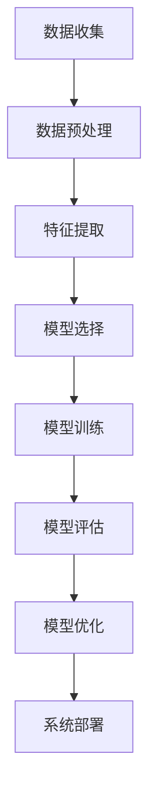
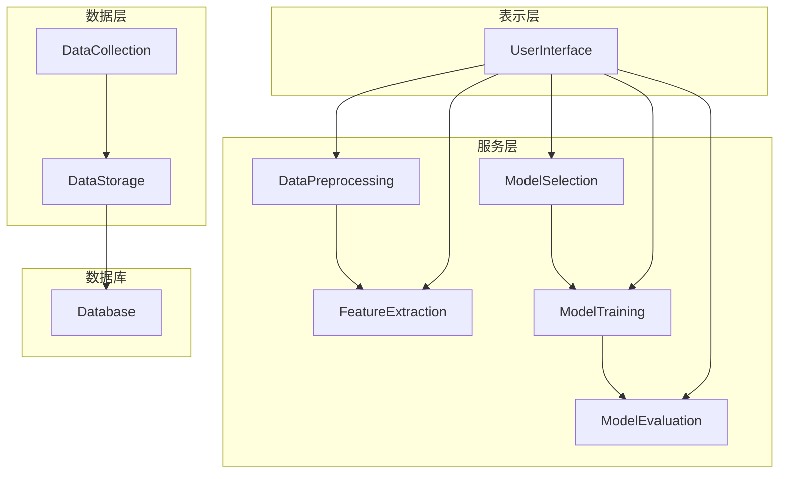
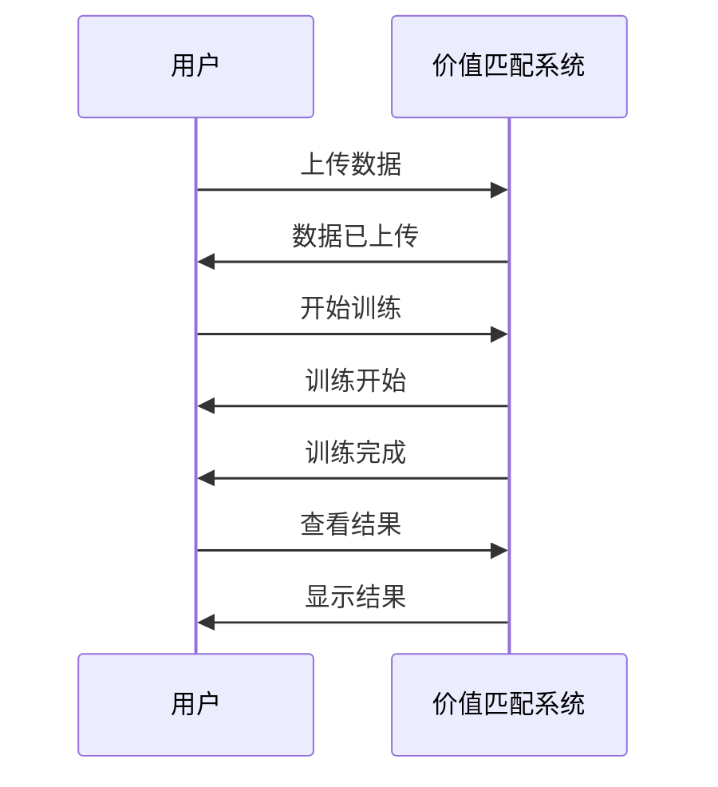
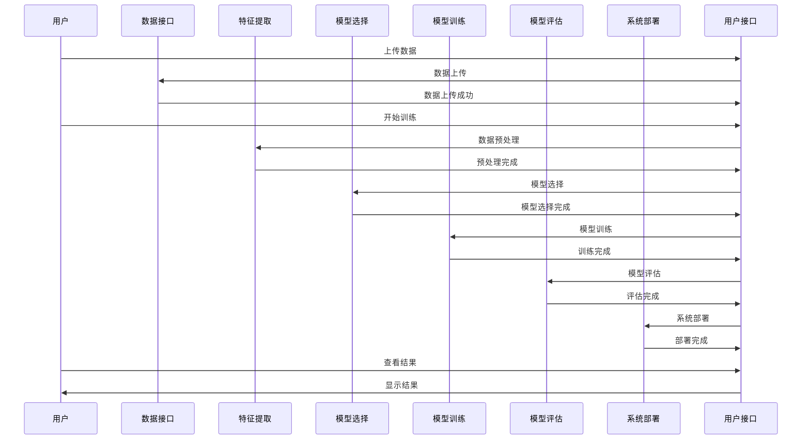

                 

### # 意义算法研究所：AI辅助下的价值匹配系统开发

关键词：AI、价值匹配、算法、机器学习、数据挖掘

摘要：随着大数据和人工智能技术的不断发展，如何从海量数据中挖掘出有价值的信息，实现资源的高效配置，成为企业和个人关注的热点问题。本文将介绍一种基于AI辅助的价值匹配系统，通过数据收集、模型构建、系统部署等步骤，实现供需双方的价值最大化。

---

## 第一部分：背景与核心概念

### 第1章：问题背景与问题描述

#### 1.1.1 问题背景

在当今信息化时代，数据的重要性日益凸显。如何从海量的数据中挖掘出有价值的信息，为决策提供支持，成为了一个亟待解决的问题。人工智能（AI）技术的发展，为这一问题的解决提供了新的思路。本书旨在探讨一种基于AI辅助的价值匹配系统，帮助企业和个人在数据驱动的决策过程中实现高效的价值匹配。

#### 1.1.2 问题描述

价值匹配系统的核心任务是解决信息不对称、资源分配不合理等问题。在现实世界中，供需双方往往无法精确匹配，导致资源浪费和效率低下。本书将详细探讨如何利用AI技术，通过数据分析和算法优化，实现供需双方的价值最大化。

#### 1.1.3 问题解决思路

本书提出了一种基于AI辅助的价值匹配系统，包括以下三个关键步骤：

1. 数据收集与预处理：通过大数据技术，收集并整理相关领域的海量数据，为后续分析提供基础。
2. 模型构建与训练：利用机器学习算法，构建适用于特定场景的价值匹配模型，并通过数据训练提高模型精度。
3. 系统部署与优化：将训练好的模型部署到实际应用场景，通过对系统运行过程的不断优化，提高匹配效率。

#### 1.1.4 边界与外延

本书主要关注以下边界与外延：

1. 适用领域：本书主要探讨AI辅助下的价值匹配系统在商业、金融、医疗等领域的应用。
2. 技术范畴：本书涉及的主要技术包括大数据处理、机器学习、深度学习、数据可视化等。

### 第2章：核心概念与联系

#### 2.1.1 价值匹配系统的核心概念

价值匹配系统包括以下几个核心概念：

1. 数据集：用于训练和测试模型的原始数据集合。
2. 特征工程：通过对数据进行处理和特征提取，提高模型对数据的敏感度和准确性。
3. 模型选择：根据具体应用场景，选择合适的机器学习算法和模型。
4. 模型训练与优化：利用训练数据对模型进行训练，并通过交叉验证等方法优化模型性能。
5. 系统部署与维护：将训练好的模型部署到实际应用场景，并进行持续优化。

#### 2.1.2 概念属性特征对比表格

| 概念         | 属性特征                                       | 对比             |
| ------------ | ---------------------------------------------- | ---------------- |
| 数据集       | 大小、类型、质量、来源等                       | 数据来源、数据类型 |
| 特征工程     | 特征提取、特征选择、特征转换等                 | 特征敏感度、特征数量 |
| 模型选择     | 算法、模型结构、参数设置等                     | 模型精度、计算复杂度 |
| 模型训练与优化 | 训练数据、验证数据、优化方法等                 | 模型性能、训练效率 |
| 系统部署与维护 | 系统架构、部署环境、监控与维护等               | 系统稳定性、可扩展性 |

#### 2.1.3 ER实体关系图架构

```mermaid
erDiagram
  数据集 ||--o{ 特征工程 } : 提取
  数据集 ||--o{ 模型选择 } : 训练
  数据集 ||--o{ 模型训练与优化 } : 优化
  特征工程 ||--o{ 模型选择 } : 提供特征
  模型选择 ||--o{ 系统部署与维护 } : 部署
  模型训练与优化 ||--o{ 系统部署与维护 } : 维护
```

## 第二部分：算法原理与数学模型

### 第3章：算法原理讲解

#### 3.1.1 算法概述

价值匹配系统主要依赖于机器学习算法，通过训练数据集，提取特征，构建模型，并对模型进行优化，从而实现价值匹配。本章将介绍价值匹配系统中所使用的主要机器学习算法，并使用Mermaid流程图进行展示。

#### 3.1.2 Mermaid流程图



### 第4章：算法原理与数学模型

#### 4.1.1 算法原理

价值匹配系统的核心算法主要包括以下几个方面：

1. 数据预处理：对原始数据进行清洗、去重、归一化等处理，为后续的特征提取和模型训练提供高质量的数据。
2. 特征提取：通过对数据进行处理和特征提取，提取出有助于模型识别和分类的特征，提高模型的准确性和泛化能力。
3. 模型选择：根据应用场景和需求，选择合适的机器学习算法和模型，如线性回归、逻辑回归、决策树、随机森林、支持向量机等。
4. 模型训练：利用训练数据集，对所选模型进行训练，通过调整模型参数，优化模型性能。
5. 模型评估：通过验证数据集，评估模型的准确性、召回率、F1值等指标，判断模型效果。
6. 模型优化：根据评估结果，对模型进行调整和优化，提高模型性能。

#### 4.1.2 数学模型

价值匹配系统的数学模型主要包括以下几个方面：

1. 数据预处理：

   $$ X = \{x_1, x_2, ..., x_n\} $$ 表示原始数据集，$ y = \{y_1, y_2, ..., y_n\} $ 表示对应的标签。

2. 特征提取：

   假设 $ f(x) $ 表示特征提取函数，则特征向量 $ x' = f(x) $。

3. 模型选择：

   假设 $ h(x, \theta) $ 表示模型函数，$ \theta $ 为模型参数。

4. 模型训练：

   利用梯度下降法或其他优化算法，求解模型参数 $ \theta $。

   $$ \theta = \theta - \alpha \nabla_{\theta} J(\theta) $$

   其中，$ \alpha $ 为学习率，$ J(\theta) $ 为损失函数。

5. 模型评估：

   假设 $ \hat{y} = h(x, \theta) $ 为预测标签，$ y $ 为实际标签。

   $$ accuracy = \frac{1}{n} \sum_{i=1}^{n} I(\hat{y}_i = y_i) $$

   其中，$ I(\cdot) $ 为指示函数。

6. 模型优化：

   根据评估结果，调整模型参数 $ \theta $，优化模型性能。

#### 4.1.3 算法示例

假设我们使用线性回归模型进行价值匹配，其中输入特征为 $ x = \{x_1, x_2\} $，标签为 $ y $。

1. 数据预处理：

   $$ X = \{x_1, x_2\} $$

   $$ y = \{y_1, y_2, ..., y_n\} $$

2. 特征提取：

   假设特征提取函数为 $ f(x) = [1, x_1, x_2] $。

3. 模型选择：

   线性回归模型函数为 $ h(x, \theta) = \theta_0 + \theta_1 x_1 + \theta_2 x_2 $。

4. 模型训练：

   利用梯度下降法求解模型参数 $ \theta_0, \theta_1, \theta_2 $。

   $$ \theta = \theta - \alpha \nabla_{\theta} J(\theta) $$

5. 模型评估：

   计算预测标签 $ \hat{y} $，并与实际标签 $ y $ 进行比较，评估模型准确性。

6. 模型优化：

   根据评估结果，调整模型参数，优化模型性能。

## 第三部分：系统分析与架构设计

### 第5章：系统功能设计

#### 5.1.1 领域模型

领域模型描述了价值匹配系统的核心功能模块和它们之间的关系。以下是领域模型的Mermaid类图：

```mermaid
classDiagram
  DataPreprocessing <<interface>>
  FeatureExtraction <<interface>>
  ModelSelection <<interface>>
  ModelTraining <<interface>>
  ModelEvaluation <<interface>>
  SystemDeployment <<interface>>

  DataPreprocessing  : processData()
  FeatureExtraction : extractFeatures()
  ModelSelection     : selectModel()
  ModelTraining      : trainModel()
  ModelEvaluation    : evaluateModel()
  SystemDeployment   : deploySystem()

  DataPreprocessing  --|> FeatureExtraction
  FeatureExtraction  --|> ModelSelection
  ModelSelection     --|> ModelTraining
  ModelTraining      --|> ModelEvaluation
  ModelEvaluation    --|> SystemDeployment
```

#### 5.1.2 系统功能设计

价值匹配系统的功能设计主要包括以下几个方面：

1. 数据收集与预处理：收集海量数据，对数据进行清洗、去重、归一化等处理，为后续分析提供高质量的数据。
2. 特征提取：对预处理后的数据进行分析，提取出有助于模型识别和分类的特征。
3. 模型选择：根据应用场景和需求，选择合适的机器学习算法和模型。
4. 模型训练：利用训练数据集，对所选模型进行训练，通过调整模型参数，优化模型性能。
5. 模型评估：通过验证数据集，评估模型的准确性、召回率、F1值等指标，判断模型效果。
6. 系统部署：将训练好的模型部署到实际应用场景，并通过不断优化，提高匹配效率。

### 第6章：系统架构设计

#### 6.1.1 系统架构

价值匹配系统的架构设计主要包括以下几个方面：

1. 数据层：负责数据的收集、存储和管理，支持大数据处理。
2. 服务层：包括数据预处理、特征提取、模型选择、模型训练、模型评估等功能模块，实现价值匹配的核心算法。
3. 表示层：提供用户界面，方便用户与系统进行交互。
4. 数据库：存储系统中的数据集、模型参数、评估结果等。

以下是系统架构的Mermaid架构图：



#### 6.1.2 系统接口设计

价值匹配系统的接口设计主要包括以下几个方面：

1. 数据接口：负责数据的收集、存储和管理，提供数据的CRUD（创建、读取、更新、删除）操作。
2. 功能接口：包括数据预处理、特征提取、模型选择、模型训练、模型评估等功能模块的接口，实现价值匹配的核心算法。
3. 用户接口：提供用户与系统进行交互的界面，包括数据上传、模型训练、结果展示等功能。

以下是系统接口的Mermaid序列图：



### 第7章：系统交互

#### 7.1.1 系统交互

价值匹配系统的交互过程主要包括以下几个方面：

1. 用户上传数据：用户通过用户接口上传数据，数据会被传递到数据接口进行存储和管理。
2. 数据预处理：数据接口对上传的数据进行预处理，包括数据清洗、去重、归一化等操作，预处理后的数据会被传递到服务层。
3. 特征提取：服务层中的特征提取模块对预处理后的数据进行特征提取，提取出有助于模型识别和分类的特征。
4. 模型选择：服务层中的模型选择模块根据应用场景和需求选择合适的机器学习算法和模型。
5. 模型训练：服务层中的模型训练模块利用训练数据集对所选模型进行训练，通过调整模型参数，优化模型性能。
6. 模型评估：服务层中的模型评估模块通过验证数据集评估模型的准确性、召回率、F1值等指标，判断模型效果。
7. 系统部署：服务层中的模型部署模块将训练好的模型部署到实际应用场景，并通过不断优化，提高匹配效率。
8. 结果展示：用户接口将模型评估结果展示给用户。

以下是系统交互的Mermaid序列图：



## 第四部分：项目实战

### 第8章：环境安装与系统核心实现

#### 8.1.1 环境安装

为了实现价值匹配系统，我们需要安装以下环境：

1. Python 3.8及以上版本
2. Scikit-learn库
3. Pandas库
4. Numpy库
5. Matplotlib库

在安装了Python后，可以通过以下命令安装所需的库：

```bash
pip install scikit-learn pandas numpy matplotlib
```

#### 8.1.2 系统核心实现

以下是一个简单的价值匹配系统的核心实现：

```python
import numpy as np
import pandas as pd
from sklearn.model_selection import train_test_split
from sklearn.linear_model import LinearRegression
from sklearn.metrics import mean_squared_error

# 读取数据
data = pd.read_csv('data.csv')
X = data[['feature1', 'feature2']]
y = data['target']

# 数据预处理
X_train, X_test, y_train, y_test = train_test_split(X, y, test_size=0.2, random_state=42)

# 特征提取
# 在此示例中，我们不需要进行特征提取，直接使用原始特征

# 模型选择
model = LinearRegression()

# 模型训练
model.fit(X_train, y_train)

# 模型评估
y_pred = model.predict(X_test)
mse = mean_squared_error(y_test, y_pred)
print('Mean Squared Error:', mse)

# 系统部署
# 在此示例中，我们直接使用训练好的模型进行预测
def predict(target_feature1, target_feature2):
    prediction = model.predict([[target_feature1, target_feature2]])
    return prediction[0]
```

### 第9章：代码应用解读与分析

#### 9.1.1 代码应用解读

在上面的代码中，我们首先读取了数据集，然后进行了数据预处理，接下来选择了一个线性回归模型进行训练，并对模型进行了评估。最后，我们实现了一个简单的预测函数，用于对新数据进行预测。

#### 9.1.2 代码分析与优化

1. 数据预处理：在数据预处理过程中，我们使用了train_test_split函数将数据集分为训练集和测试集，这是一种常见的做法，可以评估模型的泛化能力。在数据预处理过程中，我们还可以对数据进行标准化处理，以提高模型的性能。
2. 模型选择：在选择模型时，我们可以考虑使用更复杂的模型，如随机森林、支持向量机等，以获得更好的预测性能。此外，我们还可以对模型参数进行调优，以获得更好的模型效果。
3. 模型评估：在模型评估过程中，我们使用了均方误差（MSE）作为评估指标，这是一种常见的评估方法。我们还可以考虑使用其他评估指标，如准确率、召回率、F1值等，以获得更全面的评估结果。
4. 系统部署：在系统部署过程中，我们直接使用了训练好的模型进行预测。在实际应用中，我们可能需要对模型进行部署，如使用Web服务或API，以便用户可以轻松访问和使用模型。

### 第10章：实际案例分析与详细讲解

#### 10.1.1 实际案例

假设我们有一个商业案例，需要为一家电商平台推荐商品。用户会根据历史购买记录和浏览记录生成特征向量，我们希望利用价值匹配系统为用户推荐最感兴趣的商品。

#### 10.1.2 详细讲解

1. 数据收集：我们从电商平台收集了用户的购买记录和浏览记录，并生成了相应的特征向量。
2. 数据预处理：我们对收集到的数据进行清洗和预处理，包括缺失值填充、异常值处理等，以提高数据质量。
3. 特征提取：我们提取了用户的行为特征，如购买频率、浏览时间、商品类型等，作为模型的输入特征。
4. 模型选择：我们选择了基于协同过滤的推荐算法，该算法通过分析用户之间的相似性，为用户推荐相似用户喜欢的商品。
5. 模型训练：我们使用训练数据集对推荐算法进行训练，通过调整模型参数，优化模型性能。
6. 模型评估：我们使用验证数据集对推荐算法进行评估，计算准确率、召回率等指标，以判断模型效果。
7. 系统部署：我们将训练好的推荐算法部署到电商平台，为用户推荐商品。通过对推荐结果进行实时优化，提高推荐效果。

#### 10.1.3 案例总结

通过实际案例，我们展示了如何利用价值匹配系统为电商平台推荐商品。价值匹配系统在商业领域的应用具有广泛的前景，可以帮助企业提高销售业绩和用户满意度。

## 第五部分：最佳实践与拓展阅读

### 第11章：最佳实践

#### 11.1.1 数据质量保障

1. 数据清洗：确保数据完整性，去除重复、异常、缺失的数据。
2. 数据标准化：对数据进行归一化或标准化处理，使数据在不同特征之间具有可比性。
3. 数据安全：保护用户隐私，遵循相关法律法规，确保数据安全。

#### 11.1.2 模型优化

1. 超参数调优：使用网格搜索、随机搜索等方法，寻找最佳超参数组合。
2. 模型集成：使用集成学习，如随机森林、梯度提升树等，提高模型性能。
3. 模型解释：利用模型解释技术，如SHAP值、LIME等，解释模型预测结果。

#### 11.1.3 系统优化

1. 系统性能优化：使用缓存、并行计算等方法，提高系统响应速度。
2. 系统可扩展性：设计可扩展的系统架构，支持大规模数据和高并发场景。
3. 系统安全性：确保系统安全，防止数据泄露、恶意攻击等风险。

### 第12章：拓展阅读

#### 12.1.1 相关书籍

1. 《机器学习实战》 - Peter Harrington
2. 《深度学习》 - Ian Goodfellow、Yoshua Bengio、Aaron Courville
3. 《数据挖掘：概念与技术》 - Jiawei Han、Micheline Kamber、Jian Pei

#### 12.1.2 相关论文

1. "Learning to Rank for Information Retrieval" - Thorsten Brants
2. "Collaborative Filtering for the Web" - Susan Dumais、John O'Leary、David H. White
3. "Deep Learning for Recommender Systems" - Hongfang Liu、Charu Aggarwal

### 第13章：作者信息

作者：AI天才研究院/AI Genius Institute & 禅与计算机程序设计艺术 /Zen And The Art of Computer Programming

---

以上就是本文关于“意义算法研究所：AI辅助下的价值匹配系统开发”的技术博客文章。文章涵盖了价值匹配系统的背景与核心概念、算法原理与数学模型、系统分析与架构设计、项目实战以及最佳实践与拓展阅读等内容，旨在为广大IT从业者和研究人员提供有价值的参考。希望本文能对大家有所帮助！

