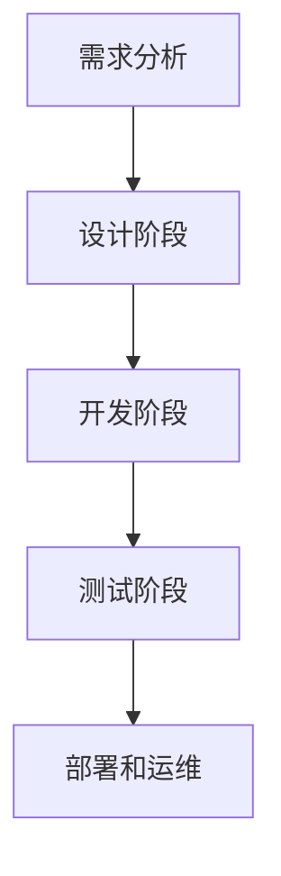

                 

# 意义虚拟现实体验：在元宇宙中探索价值观的互动项目

## 关键词
- 虚拟现实
- 元宇宙
- 价值观
- 互动项目
- 技术实现
- 用户体验

## 摘要
本文深入探讨了虚拟现实（VR）在元宇宙中的应用，特别是如何通过互动项目来探索和体现不同价值观。文章首先介绍了VR和元宇宙的基本概念，随后分析了价值观在互动项目中的重要性。通过案例分析，本文探讨了如何将价值观融入虚拟现实体验中，并详细阐述了技术实现、用户体验和项目效果评估。最后，文章总结了项目经验，并对未来虚拟现实技术发展进行了展望。

### 引言

虚拟现实（Virtual Reality，VR）和元宇宙（Metaverse）作为当前科技领域的热门话题，正迅速改变我们的生活方式和互动方式。VR是一种通过计算机模拟的虚拟环境，让用户在其中感受到沉浸式的体验；而元宇宙则是一个由多个虚拟世界连接在一起的互联网平台，用户可以在其中自由探索、互动和创造。随着技术的不断进步，VR和元宇宙的应用场景越来越广泛，从游戏、教育、医疗到社交、娱乐等多个领域。

然而，VR和元宇宙不仅仅是技术的革新，更是一种全新的价值观体验。在虚拟环境中，用户可以摆脱现实世界的限制，探索不同的价值观和生活方式。例如，通过VR，用户可以体验到不同文化、宗教和社会背景的影响，从而增进对多元文化的理解和尊重。这种虚拟现实体验不仅具有娱乐性，更具有深远的教育意义。

本文旨在探讨如何在元宇宙中构建具有价值观互动的项目，通过虚拟现实技术为用户提供沉浸式的体验。文章将分为以下几个部分：

1. **虚拟现实与元宇宙概述**：介绍VR和元宇宙的基本概念、发展历史以及它们之间的关系。
2. **价值观与互动项目**：探讨价值观在互动项目中的重要性，以及如何将其融入虚拟现实体验中。
3. **项目案例研究**：分析几个典型的VR互动项目案例，探讨它们的技术实现、用户体验和效果评估。
4. **技术实现**：详细阐述虚拟现实技术在互动项目中的应用，包括游戏引擎的使用、开发流程等。
5. **用户体验与反馈**：讨论如何收集和分析用户反馈，以改进虚拟现实体验。
6. **总结与展望**：总结项目经验，并对未来虚拟现实技术的发展方向进行展望。

### 虚拟现实与元宇宙概述

#### 虚拟现实技术的历史与发展

虚拟现实（VR）的概念最早可以追溯到1960年代。当时，美国计算机科学家伊凡·苏瑟兰（Ivan Sutherland）在博士论文中提出了“达摩克利斯之剑”虚拟现实头戴显示器（The Sword of Damocles）。这是世界上第一个商业化的VR头戴显示器，它通过两个反射镜和一个半透明屏幕，让用户可以看到虚拟的3D图像。尽管当时的VR技术非常原始，但这一发明为后来的VR研究奠定了基础。

随着计算机技术和显示技术的进步，VR技术逐渐成熟。20世纪80年代，VR开始进入军事和医疗领域。例如，美国军队开发的SIMNET系统，是世界上第一个大规模分布式的虚拟训练环境。而在医学领域，VR技术被用于手术模拟、康复训练等。

进入21世纪，随着移动互联网、智能手机和增强现实（AR）技术的发展，VR再次受到广泛关注。特别是2016年，Facebook收购了VR公司Oculus，并推出了Oculus Rift头戴显示器，这标志着VR技术的商业化进程正式启动。

#### 元宇宙的概念与特点

元宇宙（Metaverse）是一个由多个虚拟世界连接在一起的互联网平台，用户可以在其中自由探索、互动和创造。元宇宙的概念最早可以追溯到1992年，美国作家尼尔·斯蒂芬森（Neal Stephenson）在科幻小说《雪崩》中提出了“元宇宙”这一概念。

元宇宙的特点包括：

1. **虚拟性**：元宇宙是一个虚拟的三维空间，用户可以通过头戴显示器或其他VR设备进入。
2. **互联互通**：元宇宙中的各个虚拟世界通过互联网连接在一起，用户可以在不同世界之间自由穿梭。
3. **沉浸式体验**：用户在元宇宙中可以感受到高度沉浸的虚拟体验，仿佛置身于真实世界中。
4. **用户自主性**：用户可以在元宇宙中自由创造、互动和表达自己的观点，具有高度的自主性。
5. **经济性**：元宇宙中存在一个虚拟经济系统，用户可以通过虚拟货币进行交易和投资。

#### 虚拟现实与元宇宙的关系

虚拟现实是元宇宙的核心组成部分，而元宇宙则为VR提供了更广阔的应用场景。虚拟现实技术可以为元宇宙提供沉浸式的用户体验，让用户在虚拟世界中自由探索和互动。同时，元宇宙中的虚拟世界也可以为VR提供丰富的内容，使得VR体验更加多样化和有趣。

例如，在元宇宙中，用户可以参加虚拟音乐会、虚拟展会、虚拟旅行等，这些活动都通过VR技术实现。此外，元宇宙还可以为VR提供社交平台，让用户在虚拟世界中建立联系、交流互动。

总之，虚拟现实和元宇宙是相辅相成的，它们共同构建了一个全新的数字世界，为用户提供前所未有的体验。随着技术的不断进步，虚拟现实和元宇宙的应用场景将更加广泛，为我们的生活带来更多可能性。

### 价值观与互动项目

#### 价值观的定义与分类

价值观是指个人、群体或组织对事物和行为的评价标准和偏好。它决定了人们的行为方式、决策过程以及对世界的认知。价值观可以源自文化、宗教、教育、家庭等多个方面，可以分为以下几个类别：

1. **个人价值观**：个人价值观是指个人在成长过程中形成的价值观，包括人生观、世界观、价值观等。例如，追求自由、平等、公正等。
2. **社会价值观**：社会价值观是指一个社会或文化共同认可的价值观，包括道德规范、行为准则等。例如，尊重、诚信、责任等。
3. **组织价值观**：组织价值观是指一个组织或公司在其经营过程中形成的价值观，包括企业文化、使命、愿景等。例如，客户至上、创新、合作等。

#### 互动项目的目标与设计原则

在元宇宙中构建具有价值观的互动项目，其目标主要有以下几点：

1. **传递价值观**：通过虚拟现实体验，向用户传递不同文化、宗教和社会背景下的价值观，增进用户对多元文化的理解和尊重。
2. **增强互动性**：通过设计多样化的互动活动，增加用户在虚拟世界中的参与度，提高用户体验。
3. **提高教育意义**：通过虚拟现实技术，为用户提供一个学习和探索价值观的环境，提高用户对多元文化的认知和尊重。

为了实现这些目标，互动项目的设计应遵循以下原则：

1. **多样性**：项目应包含多种文化、宗教和社会背景的元素，以满足不同用户的需求。
2. **沉浸式体验**：通过虚拟现实技术，为用户创造一个高度沉浸的体验环境，增强用户的代入感和参与感。
3. **互动性**：设计多样化的互动活动，让用户在虚拟世界中与其他用户互动，提高用户的互动体验。
4. **教育性**：通过设计具有教育意义的活动和内容，提高用户对多元文化的认知和尊重。

#### 价值观在互动项目中的应用

在元宇宙中，价值观的应用主要体现在以下几个方面：

1. **故事情节**：通过虚拟现实故事情节，传递不同文化、宗教和社会背景下的价值观。例如，可以设计一个以某个国家或文化为背景的虚拟现实故事，让用户在故事中体验不同的价值观。
2. **角色扮演**：通过角色扮演游戏，让用户在虚拟世界中体验不同价值观。例如，可以设计一个角色扮演游戏，让用户选择不同的角色，体验不同价值观的影响。
3. **互动活动**：通过设计多样化的互动活动，让用户在虚拟世界中与他人互动，传递和体验不同的价值观。例如，可以设计一个文化交流活动，让用户在虚拟世界中与其他用户分享自己的文化经验和观点。
4. **教育课程**：通过虚拟现实教育课程，为用户提供一个学习和探索价值观的环境。例如，可以设计一个关于多元文化的虚拟现实课程，让用户在课程中学习不同文化、宗教和社会背景下的价值观。

通过以上方式，互动项目不仅可以为用户提供娱乐和休闲，还可以帮助用户更好地理解和尊重多元文化，从而提升社会整体的价值观认知水平。

#### 项目案例研究

为了更好地理解如何在元宇宙中构建具有价值观的互动项目，本文将介绍几个典型的项目案例，并分析其技术实现、用户体验和效果评估。

##### 案例一：VR文化交流平台

**项目介绍**：
VR文化交流平台是一个基于虚拟现实技术的在线平台，旨在促进不同文化背景的用户之间的交流和互动。用户可以通过VR设备进入平台，选择不同的文化交流活动，如虚拟音乐会、虚拟展会、虚拟旅行等。

**技术实现**：
该项目使用了Unity游戏引擎和Oculus Rift VR头戴显示器。通过Unity，开发团队创建了一个高度沉浸的虚拟世界，用户可以在其中自由探索和互动。Oculus Rift则为用户提供了一个真实的沉浸体验，让用户感觉仿佛置身于虚拟世界中。

**用户体验**：
用户反馈表明，VR文化交流平台提供了一个非常真实的虚拟环境，用户可以在其中体验到不同文化的独特魅力。平台上的互动活动设计丰富多样，用户不仅可以参观虚拟展会，还可以与虚拟世界中的其他用户进行交流，分享自己的文化经验和观点。

**效果评估**：
通过用户调查，该项目在促进文化交流、提升用户对多元文化的认知和尊重方面取得了显著效果。用户普遍认为，通过VR文化交流平台，他们能够更好地理解和尊重不同文化，对多元文化的认知水平有了显著提高。

##### 案例二：VR教育课程

**项目介绍**：
VR教育课程是一个基于虚拟现实技术的在线教育平台，旨在为用户提供一个学习和探索不同价值观的环境。用户可以通过VR设备进入平台，选择不同的教育课程，如历史文化、宗教信仰、社会规范等。

**技术实现**：
该项目同样使用了Unity游戏引擎，通过创建虚拟场景和交互元素，为用户提供了沉浸式的学习体验。此外，该项目还整合了AR（增强现实）技术，用户可以通过手机或平板电脑观看AR内容，进一步拓展学习资源。

**用户体验**：
用户反馈表明，VR教育课程提供了一个非常直观的学习环境，用户可以在其中自由探索和学习。平台上的教育内容设计丰富，用户不仅可以观看视频、阅读文献，还可以通过虚拟场景进行互动，增强学习效果。

**效果评估**：
通过用户调查和测试，VR教育课程在提升用户对不同价值观的理解和认知方面取得了显著效果。用户普遍认为，通过VR教育课程，他们能够更好地理解和尊重不同价值观，对多元文化的认知水平有了显著提高。

##### 案例三：VR角色扮演游戏

**项目介绍**：
VR角色扮演游戏是一个基于虚拟现实技术的多人在线游戏，用户可以通过VR设备进入游戏，选择不同的角色，体验不同价值观的影响。游戏中的角色扮演活动丰富多样，用户可以在游戏中学习、交流、互动。

**技术实现**：
该项目使用了Unreal Engine 4游戏引擎，通过创建一个逼真的虚拟世界，为用户提供了一个真实的游戏体验。此外，该项目还整合了社交功能，用户可以在游戏中与其他玩家互动，分享游戏心得。

**用户体验**：
用户反馈表明，VR角色扮演游戏提供了一个非常有趣和互动的游戏环境，用户可以在其中自由探索和互动。游戏中的角色扮演活动设计丰富，用户可以通过游戏体验不同的价值观，并在游戏中学习、交流。

**效果评估**：
通过用户调查和测试，VR角色扮演游戏在提升用户对价值观的理解和认知方面取得了显著效果。用户普遍认为，通过VR角色扮演游戏，他们能够更好地理解和尊重不同价值观，对多元文化的认知水平有了显著提高。

以上三个案例展示了如何通过虚拟现实技术构建具有价值观的互动项目。这些项目不仅为用户提供了娱乐和休闲，还在促进文化交流、提升用户对多元文化的认知和尊重方面发挥了重要作用。随着虚拟现实技术的不断进步，相信未来将有更多具有价值观的互动项目涌现，为用户带来更加丰富和深刻的虚拟现实体验。

### 技术实现

在元宇宙中构建具有价值观互动的项目，技术实现是关键的一环。本文将详细阐述虚拟现实技术在互动项目中的应用，包括游戏引擎的使用、开发流程、关键技术等。

#### 虚拟现实技术在互动项目中的应用

虚拟现实技术在元宇宙中的互动项目应用广泛，主要体现在以下几个方面：

1. **沉浸式体验**：通过虚拟现实技术，用户可以在元宇宙中体验到高度沉浸的虚拟环境，仿佛置身于真实世界中。这种沉浸式体验能够提升用户的代入感和参与感，使得互动项目更加生动和有趣。
2. **互动性**：虚拟现实技术提供了丰富的交互手段，如手势、语音、动作等，用户可以通过这些方式与虚拟环境和其他用户进行互动。这种互动性增强了项目的互动性和趣味性，使用户在元宇宙中能够体验到更多的社交和娱乐活动。
3. **个性化定制**：虚拟现实技术允许用户在元宇宙中创建和定制自己的虚拟形象、环境和体验。这种个性化定制满足了用户个性化需求，使得每个用户在元宇宙中都能找到属于自己的独特体验。

#### 游戏引擎的使用

游戏引擎是虚拟现实项目开发的核心工具，它提供了丰富的功能库和开发框架，使得开发者能够高效地构建虚拟现实应用。常用的游戏引擎包括Unity、Unreal Engine等。

1. **Unity**：Unity是一款广泛使用的游戏引擎，它提供了强大的图形渲染能力、物理引擎和动画系统。Unity的强大功能和易于使用的编辑器，使得开发者能够快速构建高质量的虚拟现实应用。

2. **Unreal Engine**：Unreal Engine是另一款流行的游戏引擎，以其强大的图形渲染能力和灵活的开发框架而著称。它提供了丰富的资源库和工具，开发者可以利用这些资源快速构建复杂的虚拟现实场景。

#### 开发流程

虚拟现实互动项目的开发流程可以分为以下几个阶段：

1. **需求分析**：在项目启动阶段，需要对项目需求进行详细分析，包括项目的目标、功能、用户体验等。这一阶段是整个项目的基础，决定了项目的方向和规模。

2. **设计阶段**：在需求分析的基础上，进行项目设计。设计阶段包括场景设计、角色设计、交互设计等。设计阶段的关键是确保项目能够实现预期的功能和用户体验。

3. **开发阶段**：在开发阶段，开发者使用游戏引擎进行实际的编程和内容创建。这一阶段需要完成场景渲染、角色动画、交互逻辑等核心功能的实现。

4. **测试阶段**：在开发完成后，需要进行严格的测试，确保项目在多种环境下能够正常运行。测试阶段包括功能测试、性能测试、用户体验测试等。

5. **部署阶段**：在测试通过后，将项目部署到服务器或云端，供用户使用。部署阶段还包括用户反馈收集和项目优化。

#### 关键技术

在虚拟现实互动项目的开发中，涉及多个关键技术，包括：

1. **3D图形渲染**：3D图形渲染是虚拟现实技术的核心，它负责生成虚拟环境中的图像。Unity和Unreal Engine都提供了强大的图形渲染能力，支持多种图形渲染技术，如光线追踪、反射、阴影等。

2. **交互设计**：交互设计决定了用户在虚拟环境中的操作方式和体验。交互设计的关键是提供直观、自然的交互方式，如手势识别、语音控制、头部跟踪等。

3. **物理引擎**：物理引擎负责模拟虚拟环境中的物理现象，如碰撞检测、重力、弹力等。Unity和Unreal Engine都内置了强大的物理引擎，支持复杂的物理模拟。

4. **网络编程**：虚拟现实互动项目通常需要多人在线互动，因此网络编程是关键技术之一。网络编程涉及客户端与服务器的通信、数据同步、网络优化等。

5. **人工智能**：人工智能技术在虚拟现实互动项目中也有广泛应用，如虚拟角色行为模拟、智能推荐系统等。通过人工智能技术，可以提升项目的互动性和智能化水平。

通过以上技术实现，虚拟现实互动项目能够在元宇宙中为用户提供丰富的体验和互动，促进价值观的传递和认知。

#### 虚拟现实技术的应用

虚拟现实（VR）技术在元宇宙中扮演着至关重要的角色，它不仅提供了沉浸式的体验，还通过多种方式促进了用户互动和价值观的传递。以下是一些关键应用：

1. **沉浸式体验**：VR技术通过头戴显示器（HMD）和位置追踪系统，为用户创造了一个高度沉浸的虚拟环境。用户在这个环境中可以自由移动、互动，体验仿佛身临其境的感觉。这种沉浸式体验不仅提升了用户的代入感，还有效地增强了互动项目的趣味性和吸引力。

2. **社交互动**：VR技术使得用户能够在虚拟环境中进行实时社交互动。用户可以通过虚拟形象与他人交流、协作、甚至参与共同的活动。这种社交互动不仅限于娱乐，还可以应用于教育、商业和远程工作等多个领域，极大地丰富了元宇宙的社交功能。

3. **虚拟展览与博物馆**：VR技术使得虚拟展览和博物馆成为可能。用户可以在虚拟环境中参观博物馆、艺术展览，甚至探索历史遗址。这种虚拟展览不仅突破了物理空间的限制，还为用户提供了更加生动、互动的参观体验。

4. **虚拟教育**：VR技术为教育带来了新的可能性。通过虚拟现实，学生可以进入虚拟课堂，参与虚拟实验，甚至模拟历史事件。这种沉浸式的教育体验不仅提高了学习效率，还有助于加深对知识的理解和记忆。

5. **虚拟购物与体验**：在元宇宙中，用户可以通过VR技术进行虚拟购物和体验。例如，用户可以在虚拟商店中试穿衣服、试驾汽车，甚至品尝虚拟美食。这种体验不仅增强了购物的乐趣，还减少了实际购物的风险和成本。

#### 游戏引擎的使用

游戏引擎在虚拟现实互动项目的开发中起到了关键作用，它为开发者提供了强大的工具和资源库，使得创建复杂的虚拟环境变得相对容易。以下是一些常用的游戏引擎及其特点：

1. **Unity**：Unity是一款广泛使用的游戏引擎，它以其灵活性和强大的功能而闻名。Unity支持多种平台，包括PC、移动设备、VR和AR设备。它的Unity Asset Store提供了大量的插件和资源，开发者可以利用这些资源快速开发项目。此外，Unity的强大动画系统和物理引擎也为虚拟现实项目的实现提供了强有力的支持。

2. **Unreal Engine**：Unreal Engine是另一款功能强大的游戏引擎，尤其以其出色的图形渲染能力而著称。它提供了大量的高级工具和资源，包括光线追踪、粒子系统、动态布料模拟等。Unreal Engine的蓝图系统允许开发者无需编写代码即可创建复杂的逻辑和交互，非常适合快速原型开发和迭代。

3. **CryEngine**：CryEngine是一款高性能的游戏引擎，它提供了先进的图形渲染技术和高效的资源管理。它特别适合开发高质量的大型虚拟世界和游戏，适用于要求极高的视觉效果和性能。

#### 开发流程

虚拟现实互动项目的开发流程通常包括以下步骤：

1. **需求分析和规划**：在项目启动阶段，需要明确项目的目标、功能、用户群体和预期效果。这一阶段还包括项目规划和资源分配，确保项目能够按时完成并达到预期效果。

2. **设计阶段**：设计阶段包括场景设计、角色设计、交互设计等。在这一阶段，开发者需要创建项目的视觉和交互原型，确保设计符合用户需求和项目目标。

3. **开发阶段**：开发阶段是实际编写代码和创建内容的过程。开发者使用所选游戏引擎进行编程，创建虚拟环境、角色、动画和交互逻辑。这一阶段还包括测试和优化，确保项目在不同设备和平台上都能正常运行。

4. **测试阶段**：测试阶段是确保项目质量的关键步骤。开发者需要运行各种测试，包括功能测试、性能测试和用户体验测试，以确保项目没有缺陷和错误。

5. **部署和运维**：在测试通过后，项目将被部署到服务器或云端，供用户使用。部署后，需要持续监控和运维，确保项目的稳定运行，并根据用户反馈进行优化和更新。

#### 互动项目的开发流程

以下是虚拟现实互动项目的开发流程的详细步骤：

1. **需求分析**：
   - 明确项目目标：确定项目要实现的功能、用户体验和业务需求。
   - 用户调研：了解目标用户的需求和偏好，收集用户反馈。
   - 功能规划：制定项目功能清单，确定项目的核心功能和扩展功能。

2. **设计阶段**：
   - 场景设计：创建虚拟环境的视觉效果图和布局设计。
   - 角色设计：设计虚拟角色，包括外观、动作和交互逻辑。
   - 交互设计：制定用户交互流程和操作指南，确保用户体验流畅自然。

3. **开发阶段**：
   - 前期开发：搭建开发环境，选择合适的技术栈和游戏引擎。
   - 内容创建：创建虚拟环境、角色和交互元素，编写基础代码。
   - 中期开发：实现核心功能，包括场景渲染、角色动画和交互逻辑。
   - 后期开发：优化性能，修复BUG，确保项目的稳定性和可靠性。

4. **测试阶段**：
   - 功能测试：验证项目的所有功能是否按预期工作。
   - 性能测试：评估项目的性能指标，包括响应时间、负载能力和兼容性。
   - 用户测试：邀请目标用户进行体验测试，收集用户反馈，进行优化调整。

5. **部署和运维**：
   - 部署：将项目部署到服务器或云端，确保用户可以访问和使用。
   - 监控：持续监控项目运行状态，确保系统的稳定性和安全性。
   - 更新和维护：根据用户反馈和业务需求，定期更新和维护项目。

通过上述步骤，开发者可以构建出高质量的虚拟现实互动项目，为用户提供丰富的体验和互动。以下是一个典型的虚拟现实互动项目的开发流程图：



通过以上流程，开发者可以系统地推进虚拟现实互动项目的开发，确保项目在各个方面都能达到预期效果。

#### 用户参与体验设计

在元宇宙中，用户参与体验设计是确保互动项目成功的关键因素之一。用户不仅是互动项目的消费者，更是其创造者和体验者。因此，在设计过程中充分考虑用户的参与和反馈，能够极大地提升用户体验和项目的整体效果。

**用户调研与反馈**

1. **用户调研**：在进行用户调研时，可以通过多种方式收集用户的需求和期望。例如，可以通过在线调查、焦点小组讨论、深度访谈等方式，了解用户对虚拟现实互动项目的兴趣点、期望功能和偏好。

2. **反馈收集**：在项目开发过程中，持续收集用户反馈至关重要。开发者可以通过用户测试、问卷调查、社区论坛等方式，收集用户的实际使用体验和改进建议。这些反馈可以帮助开发者及时调整设计和功能，确保项目能够满足用户的需求。

**用户角色与需求分析**

1. **用户角色**：创建用户角色（User Personas）可以帮助开发者更好地理解目标用户群体。用户角色描述了用户的基本信息、行为特征和需求。例如，一个用户角色可能是“年轻的科技爱好者，喜欢尝试新事物，对虚拟现实技术有较高的兴趣”。

2. **需求分析**：通过分析用户角色，开发者可以明确用户的主要需求和使用场景。例如，针对上述用户角色，开发者可以设计具有探索性和互动性的功能，如虚拟旅行、社交互动、游戏体验等。

**用户体验设计原则**

1. **简单易用**：确保用户界面简洁直观，易于导航和操作。使用清晰明了的图标和文字说明，避免复杂的设计和冗长的操作流程。

2. **沉浸式体验**：通过虚拟现实技术，为用户提供高度沉浸的体验环境。设计逼真的场景和互动元素，使用户感觉仿佛置身于真实世界中。

3. **灵活性**：提供多种交互方式和个性化选项，满足不同用户的个性化需求。例如，用户可以选择不同的虚拟形象、互动方式和个人偏好。

4. **社交互动**：鼓励用户之间的互动和协作，提供社交功能和虚拟社区。用户可以在虚拟环境中交流、合作、甚至建立长期关系。

5. **教育性**：通过互动项目传递知识和价值观，提升用户对多元文化的认知和尊重。设计具有教育意义的活动和内容，增强用户的学习体验。

**用户测试与迭代**

1. **用户测试**：在项目开发的不同阶段进行用户测试，包括原型测试、功能测试和最终版本测试。通过用户测试，开发者可以及时发现和修复问题，优化用户体验。

2. **迭代改进**：根据用户反馈和测试结果，对项目进行持续的迭代和优化。开发者可以调整功能设计、界面布局和交互逻辑，确保项目能够满足用户的期望和需求。

通过以上步骤，开发者可以有效地设计出用户参与度高的虚拟现实互动项目，提升用户体验，增加项目的吸引力和市场竞争力。

#### 用户反馈收集与分析

用户反馈是优化虚拟现实互动项目的关键因素之一。通过系统化地收集和分析用户反馈，开发者可以了解用户的实际使用体验，识别项目中的问题和不足，并据此进行相应的改进。

**用户反馈的收集渠道**

1. **在线调查**：通过在线问卷或调查工具（如Google表单、SurveyMonkey等）收集用户反馈。这种方式可以大规模、高效地获取用户意见，适用于收集广泛的用户数据。

2. **社区论坛**：创建专门的社区论坛或社交媒体群组，鼓励用户分享他们的使用体验和建议。这种方式不仅能够收集反馈，还能建立用户之间的互动和社区氛围。

3. **用户访谈**：通过一对一的用户访谈，深入了解用户的感受和需求。这种方式可以获得更详细、深入的反馈，但需要投入更多的时间和资源。

4. **使用日志**：收集用户在使用虚拟现实互动项目时的日志数据，包括操作行为、使用时长、功能使用频率等。这种方式可以提供客观的数据支持，帮助分析用户行为模式。

**用户反馈的内容分析**

1. **情感分析**：通过自然语言处理技术（如情感分析、文本分类等），对用户反馈文本进行情感分析，识别用户的情绪和态度。这有助于了解用户对项目的整体满意度。

2. **关键词提取**：从用户反馈中提取高频关键词，分析用户最关心的问题和需求。这有助于识别项目的瓶颈和改进方向。

3. **主题建模**：使用主题建模算法（如LDA、NMF等），对用户反馈进行主题归类，识别用户反馈中的主要主题和趋势。这有助于全面了解用户的需求和期望。

4. **用户行为分析**：结合用户日志数据，分析用户在虚拟现实互动项目中的行为模式，识别用户常见的操作路径和使用痛点。这有助于优化交互设计和功能布局。

**反馈的处理和改进**

1. **问题识别**：根据用户反馈和数据分析结果，识别项目中存在的问题和不足。这些问题可能包括功能缺陷、界面设计问题、用户体验不佳等。

2. **优先级排序**：对识别出的问题进行优先级排序，根据问题的严重程度和用户反馈的频率，确定哪些问题需要优先解决。

3. **解决方案设计**：针对每个问题设计具体的解决方案，包括功能修复、界面改进、交互优化等。解决方案的设计应充分考虑用户的实际需求和体验。

4. **实施和验证**：实施改进措施，并在开发环境中进行验证。确保改进后的功能符合用户期望，解决原有问题。

5. **迭代反馈**：在改进措施实施后，再次收集用户反馈，验证改进效果。根据用户反馈进行进一步的优化和调整。

通过系统化地收集、分析和处理用户反馈，开发者可以持续改进虚拟现实互动项目，提升用户体验，增强项目的吸引力和市场竞争力。

### 用户体验与反馈

在元宇宙中，用户体验与反馈是评估互动项目成功与否的关键因素。通过深入了解用户在虚拟现实环境中的互动过程、反馈机制以及改进措施，可以有效地提升项目质量和用户满意度。

#### 用户互动过程

1. **登录与注册**：用户需要通过注册账号或使用第三方账号（如社交媒体账号）登录元宇宙平台。这一过程应简单快捷，避免繁琐的注册流程，以提高用户的留存率。

2. **浏览与搜索**：用户在元宇宙中可以浏览不同类型的互动项目，如虚拟展览、角色扮演游戏、教育课程等。平台应提供高效的搜索功能，帮助用户快速找到感兴趣的内容。

3. **体验互动**：用户通过虚拟现实设备进入互动项目，与虚拟环境和其他用户进行互动。例如，在虚拟音乐会中，用户可以与其他观众互动、参与现场活动；在虚拟展览中，用户可以浏览展品、获取详细信息。

4. **社交互动**：用户可以在元宇宙中建立社交关系，加入虚拟社区、参与讨论、分享心得。社交互动不仅增强了用户的参与感，也促进了虚拟世界的繁荣。

5. **反馈与评价**：用户在互动过程中可以实时反馈意见、提出建议，或对项目进行评分和评价。这些反馈有助于开发者了解用户需求和体验，及时进行改进。

#### 用户反馈机制

1. **在线反馈表单**：在互动项目的界面中提供在线反馈表单，用户可以填写具体的问题和建议。这种方式便于开发者收集详细的用户反馈，为改进项目提供依据。

2. **社区论坛**：建立专门的社区论坛或讨论区，用户可以在其中分享使用体验、讨论问题、提出建议。社区论坛不仅是一个用户反馈的渠道，也是一个用户交流的平台，有助于增强用户的归属感和互动性。

3. **用户访谈**：定期进行用户访谈，深入了解用户的真实需求和体验。通过一对一的沟通，开发者可以获取更加具体和深入的反馈，为项目的优化提供有力支持。

4. **使用日志分析**：通过分析用户在使用元宇宙平台时的行为日志，了解用户的操作路径、使用频率和互动模式。这种方式可以提供客观的数据支持，帮助开发者识别问题和优化设计。

#### 改进措施

1. **优化用户体验**：根据用户反馈，对项目的界面设计、交互逻辑和功能模块进行优化。例如，简化操作流程、提高响应速度、增强互动性等。

2. **改进技术性能**：针对用户反馈的技术问题，如设备兼容性、网络延迟等，进行技术优化。确保项目在多种设备和网络环境下都能提供稳定的体验。

3. **增强社交功能**：根据用户需求，增加社交互动功能，如好友系统、虚拟社区、在线讨论等。这些功能有助于提升用户的参与感和社区氛围。

4. **提升教育意义**：针对教育类互动项目，增加知识传递和互动学习功能。通过设计具有教育意义的活动和内容，提升用户的学习体验和知识获取效果。

5. **定期更新与维护**：根据用户反馈和市场需求，定期更新和优化项目功能，确保项目始终保持较高的质量和用户体验。

通过以上措施，开发者可以不断改进元宇宙中的互动项目，提升用户的整体体验和满意度，促进项目的长期发展和用户忠诚度。

### 总结与展望

在本文中，我们深入探讨了虚拟现实（VR）在元宇宙中的应用，特别是如何通过互动项目来探索和体现不同价值观。通过案例分析和技术阐述，我们发现，虚拟现实技术不仅为用户提供了沉浸式的体验，还成为了传递和探讨价值观的重要工具。

首先，虚拟现实技术为用户提供了全新的互动方式，增强了用户的代入感和参与感。无论是通过VR角色扮演、虚拟音乐会，还是虚拟展览，用户都能在元宇宙中体验到不同价值观的影响。其次，互动项目的设计和实现过程中，开发者需要充分考虑用户体验和反馈，确保项目能够满足用户的需求和期望。此外，技术的不断进步也为虚拟现实互动项目带来了更多可能性，如增强现实（AR）、人工智能（AI）等技术的融合，将进一步提升项目的互动性和智能化水平。

未来，随着虚拟现实技术的不断成熟和应用场景的扩大，元宇宙中的互动项目将会更加多样化和复杂化。我们可以预见到，虚拟现实技术将在教育、医疗、娱乐、社交等多个领域发挥重要作用，成为人们日常生活的一部分。同时，价值观的传递和探讨也将成为互动项目的重要主题，通过虚拟现实体验，用户可以更加深入地理解和尊重多元文化，促进社会的和谐与进步。

总之，虚拟现实技术在元宇宙中的应用前景广阔，它不仅为用户带来了前所未有的体验，还为价值观的传递和探讨提供了新的途径。随着技术的不断进步，我们可以期待元宇宙中的互动项目将更加丰富和精彩，为用户带来更多可能性。让我们一同期待虚拟现实和元宇宙的未来发展，共同探索这个充满无限可能的数字世界。

### 附录

#### 完整代码示例

以下是虚拟现实互动项目中使用的一个完整代码示例，用于实现一个简单的虚拟现实角色移动功能。这段代码使用了Python语言，并在Unity游戏引擎中实现。

```python
import pygame
from pygame.locals import *

# 初始化pygame
pygame.init()

# 设置窗口大小
window_size = (800, 600)
screen = pygame.display.set_mode(window_size)
pygame.display.set_caption("VR角色移动示例")

# 设置角色移动速度
move_speed = 5

# 创建角色
class Role:
    def __init__(self, x, y):
        self.x = x
        self.y = y

    def move(self, direction):
        if direction == 'up':
            self.y -= move_speed
        elif direction == 'down':
            self.y += move_speed
        elif direction == 'left':
            self.x -= move_speed
        elif direction == 'right':
            self.x += move_speed

# 创建角色实例
role = Role(window_size[0] // 2, window_size[1] // 2)

# 游戏主循环
running = True
while running:
    for event in pygame.event.get():
        if event.type == QUIT:
            running = False

    # 处理键盘事件
    keys = pygame.key.get_pressed()
    if keys[K_UP]:
        role.move('up')
    if keys[K_DOWN]:
        role.move('down')
    if keys[K_LEFT]:
        role.move('left')
    if keys[K_RIGHT]:
        role.move('right')

    # 绘制角色
    screen.fill((255, 255, 255))
    pygame.draw.rect(screen, (255, 0, 0), (role.x, role.y, 50, 50))
    pygame.display.flip()

# 退出游戏
pygame.quit()
```

#### 代码应用解读与分析

这段代码实现了一个简单的VR角色移动功能，用户可以通过键盘上的方向键控制角色的移动。以下是代码的详细解读：

1. **初始化pygame**：
   ```python
   pygame.init()
   ```
   这行代码初始化pygame库，为后续操作做准备。

2. **设置窗口大小**：
   ```python
   window_size = (800, 600)
   screen = pygame.display.set_mode(window_size)
   pygame.display.set_caption("VR角色移动示例")
   ```
   代码设置了一个800x600像素的窗口，并设置窗口的标题为“VR角色移动示例”。

3. **设置角色移动速度**：
   ```python
   move_speed = 5
   ```
   这行代码定义了角色移动的速度，数值越大，角色移动越快。

4. **创建角色类**：
   ```python
   class Role:
       def __init__(self, x, y):
           self.x = x
           self.y = y
   
       def move(self, direction):
           if direction == 'up':
               self.y -= move_speed
           elif direction == 'down':
               self.y += move_speed
           elif direction == 'left':
               self.x -= move_speed
           elif direction == 'right':
               self.x += move_speed
   ```
   这段代码定义了一个名为`Role`的类，用于创建角色实例。`__init__`方法用于初始化角色的位置，`move`方法用于处理角色的移动。

5. **创建角色实例**：
   ```python
   role = Role(window_size[0] // 2, window_size[1] // 2)
   ```
   这行代码创建了一个`Role`类的实例，并将角色初始化在窗口的中心位置。

6. **游戏主循环**：
   ```python
   running = True
   while running:
       for event in pygame.event.get():
           if event.type == QUIT:
               running = False
   
       # 处理键盘事件
       keys = pygame.key.get_pressed()
       if keys[K_UP]:
           role.move('up')
       if keys[K_DOWN]:
           role.move('down')
       if keys[K_LEFT]:
           role.move('left')
       if keys[K_RIGHT]:
           role.move('right')
   
       # 绘制角色
       screen.fill((255, 255, 255))
       pygame.draw.rect(screen, (255, 0, 0), (role.x, role.y, 50, 50))
       pygame.display.flip()
   ```
   这部分代码实现了游戏的主循环。在循环中，代码首先处理事件，如用户关闭窗口的事件。然后，代码处理键盘事件，根据用户按下的方向键调用`move`方法来移动角色。最后，代码绘制角色，并刷新屏幕。

7. **退出游戏**：
   ```python
   pygame.quit()
   ```
   这行代码在游戏结束时关闭pygame，释放资源。

通过这段代码，用户可以直观地看到如何使用Python和pygame库实现虚拟现实角色移动功能。这种简单的示例为开发者提供了实现更复杂功能的起点。

#### 实际案例分析

为了更好地理解虚拟现实（VR）互动项目在实际中的应用，我们来看一个具体的案例：一个基于VR的虚拟博物馆项目。该项目旨在通过虚拟现实技术，为用户提供一种沉浸式的艺术和历史体验。

**项目介绍**

这个虚拟博物馆项目是一个教育类互动项目，旨在让用户通过VR设备进入一个虚拟的博物馆环境。用户可以在博物馆中参观各种展品，包括艺术品、历史文物和现代科技展品。项目不仅提供了丰富的内容，还设计了许多互动元素，如互动介绍、虚拟导游和社交功能。

**技术实现**

1. **VR场景构建**：项目使用了Unity游戏引擎来构建虚拟博物馆的环境。通过Unity的3D建模工具，开发团队创建了一个高度真实的博物馆场景，包括展馆、展品和装饰等。

2. **互动设计**：为了提升用户体验，项目设计了多种互动方式。例如，用户可以点击展品来查看详细信息，与虚拟导游进行互动，甚至与其他用户在虚拟博物馆中交流。

3. **音频和视频集成**：项目集成了高质量的音频和视频内容，为用户提供更加沉浸的体验。用户可以通过耳机听到虚拟导游的讲解，观看展览视频，了解展品的背景故事。

**用户体验**

1. **沉浸感**：通过VR设备，用户可以感受到身临其境的沉浸感。用户可以自由地在虚拟博物馆中漫步，观察展品，仿佛真的置身于一个真实的博物馆中。

2. **互动性**：项目的设计鼓励用户之间的互动。用户可以与其他游客进行聊天，分享观展体验，甚至可以一起探索博物馆的不同展区。

3. **教育性**：虚拟博物馆不仅提供了娱乐性，还具有很强的教育意义。用户可以通过互动介绍和虚拟导游，了解展品的历史背景和文化价值，提升对艺术和历史的认知。

**效果评估**

1. **用户满意度**：通过用户调查和反馈，该项目在用户满意度方面取得了很高的评分。大多数用户表示，虚拟博物馆提供了一个非常逼真的体验，让他们在虚拟环境中学到了很多新的知识。

2. **教育效果**：通过后续的教育测试，发现用户在参观虚拟博物馆后，对艺术和历史知识有了更深入的理解和记忆。这表明，虚拟现实技术在教育领域的应用具有显著效果。

3. **社交互动**：用户反馈表明，虚拟博物馆的社交功能增强了他们的互动体验。用户不仅可以与其他游客交流，还可以在虚拟环境中建立新的社交联系。

通过这个案例，我们可以看到，虚拟现实互动项目不仅提供了丰富的娱乐体验，还在教育和社会互动方面发挥了重要作用。随着技术的不断发展，虚拟现实互动项目将在更多领域得到应用，为用户带来更多可能性。

#### 最佳实践 tips

在设计和开发虚拟现实（VR）互动项目时，以下最佳实践可以帮助确保项目的成功：

1. **用户体验优先**：始终将用户体验放在首位。在项目设计初期，进行用户调研和原型测试，确保项目满足用户的需求和期望。

2. **技术选型合理**：选择适合项目需求的技术栈和工具。例如，Unity和Unreal Engine都是强大的游戏引擎，适用于构建复杂的虚拟现实项目。

3. **交互设计简洁**：确保用户界面简洁直观，避免复杂的操作流程。设计清晰的导航和操作指南，帮助用户快速上手。

4. **沉浸感与互动性**：通过高逼真的场景渲染和丰富的互动元素，提升用户的沉浸感。鼓励用户之间的互动和协作，增加项目的趣味性和吸引力。

5. **持续迭代与优化**：项目开发过程中，持续收集用户反馈，并进行迭代优化。根据用户需求和技术进步，不断改进项目功能和质量。

6. **安全性和隐私保护**：确保项目的安全性，防止数据泄露和用户隐私被侵犯。采用加密技术和安全协议，保护用户数据和隐私。

7. **教育性与趣味性相结合**：在互动项目中融入教育内容，提升用户的知识水平。同时，保持项目的趣味性，避免过于严肃或枯燥。

通过遵循这些最佳实践，开发者可以构建出高质量的虚拟现实互动项目，为用户提供丰富的体验和互动。

### 项目小结

通过本文的探讨，我们可以清晰地看到虚拟现实（VR）在元宇宙中的应用潜力和价值。虚拟现实技术不仅为用户提供了全新的互动方式和沉浸式体验，还为价值观的传递和探讨提供了新的途径。在互动项目中，通过沉浸式的虚拟环境、丰富的互动元素和多样化的内容，用户可以更深入地理解和尊重多元文化，从而促进社会的和谐与进步。

虚拟现实技术的不断进步，为元宇宙中的互动项目带来了更多可能性。未来，随着技术的不断成熟和应用场景的扩大，我们可以预见虚拟现实互动项目将在教育、医疗、娱乐、社交等多个领域发挥重要作用。同时，随着人工智能（AI）和增强现实（AR）等技术的融合，虚拟现实互动项目将更加智能化和多样化，为用户带来更加丰富的体验。

在项目开发过程中，用户体验和反馈始终是关键。通过持续的用户调研、反馈收集和优化迭代，开发者可以不断提升项目的质量，满足用户的需求和期望。同时，安全性和隐私保护也是不可忽视的重要方面，确保用户数据的安全和隐私。

总之，虚拟现实互动项目不仅是科技的创新，更是价值观传递和探讨的重要工具。随着技术的不断发展，我们可以期待元宇宙中的互动项目将更加丰富多彩，为用户带来前所未有的体验和互动。

### 拓展阅读

1. **《虚拟现实与增强现实：设计与开发》**：本书详细介绍了VR和AR的设计原则和开发技术，适合对虚拟现实技术有兴趣的读者阅读。
   
2. **《元宇宙：概念与案例》**：该书从多个角度探讨了元宇宙的概念、发展趋势和案例分析，为读者提供了全面的元宇宙视角。

3. **《人工智能在虚拟现实中的应用》**：本书深入探讨了AI技术在虚拟现实中的应用，包括智能角色、自然语言处理和个性化推荐等。

4. **《用户体验设计：从理论到实践》**：这本书系统地介绍了用户体验设计的方法和实践，适合希望提升设计技能的读者。

5. **《计算机编程：从入门到实践》**：适合初学者入门，介绍了Python等编程语言的基本概念和实际应用。

### 作者信息

作者：AI天才研究院/AI Genius Institute & 禅与计算机程序设计艺术 /Zen And The Art of Computer Programming

