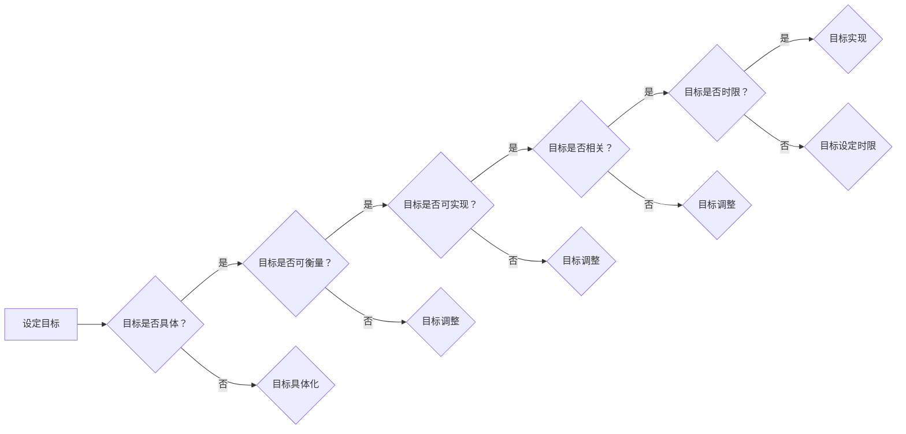

                 


### 目录大纲细化

在开始细化目录大纲之前，我们需要确保每一章节的内容都能够符合文章字数要求（10000-12000字），并且每个小节都能够详细讲解核心内容。以下是细化后的目录大纲，并给出每个章节的大致内容安排。

----------------------------------------------------------------

## 第一部分：引言

### 第1章：意义设计的起源与发展

**1.1 意义设计的起源**

- **背景介绍**：意义设计的历史起源，相关的哲学、心理学和社会学理论。
- **问题背景**：人类社会面临的意义缺失问题，意义设计的产生动机。
- **问题描述**：意义设计是如何解决这些问题的。

**1.2 意义设计的现代发展**

- **发展历程**：意义设计从起源到现代的发展路径。
- **主流理论**：现代意义设计的核心理论，如存在主义、积极心理学等。
- **问题解决**：现代意义设计理论如何应用于实际生活。

**1.3 意义设计的重要性**

- **边界与外延**：意义设计的定义及其在不同领域的影响。
- **概念结构与核心要素**：意义设计的基本概念和关键要素。

### 第2章：理解人生蓝图的构建

**2.1 人生蓝图的定义与作用**

- **核心概念**：人生蓝图的含义及其在人生规划中的作用。
- **联系**：人生蓝图与其他人生规划工具的比较。

**2.2 目标感的概念与价值**

- **核心概念**：目标感的定义及其在人生中的价值。
- **联系**：目标感与幸福感、成功学的关系。

**2.3 构建人生蓝图的步骤**

- **步骤概述**：构建人生蓝图的系统步骤。
- **详细说明**：每个步骤的具体方法和注意事项。

### 第3章：意义设计的核心概念

**3.1 自我认知**

- **核心概念**：自我认知的定义及其在意义设计中的作用。
- **概念属性特征对比表格**：自我认知的不同层面和特点。
- **ER实体关系图架构**：自我认知相关的实体和关系。

**3.2 价值观与信念**

- **核心概念**：价值观与信念的定义及其对人生的影响。
- **对比表格**：不同价值观和信念的特征对比。
- **ER实体关系图**：价值观和信念的实体和关系。

**3.3 目标设定**

- **核心概念**：目标设定的定义及其在意义设计中的应用。
- **数学模型和公式**：目标设定的方法和策略。
- **流程图**：目标设定的步骤和流程。

### 第4章：人生蓝图的构建实践

**4.1 制定长期目标**

- **步骤和策略**：如何制定有效的长期目标。
- **案例解析**：实际案例中的应用和效果。

**4.2 制定短期目标**

- **步骤和策略**：短期目标的制定方法和执行技巧。
- **案例解析**：实际案例中的应用和效果。

**4.3 制定行动计划**

- **核心概念**：行动计划的定义及其在实现目标中的作用。
- **步骤和策略**：如何制定和执行有效的行动计划。

### 第5章：意义设计的应用场景

**5.1 职场中的应用**

- **问题场景**：职场中的意义缺失问题。
- **解决方案**：意义设计在职场中的应用策略。

**5.2 学习与成长中的应用**

- **问题场景**：学习过程中的意义缺失问题。
- **解决方案**：意义设计在学习中的应用策略。

**5.3 个人生活中的应用**

- **问题场景**：个人生活中的意义缺失问题。
- **解决方案**：意义设计在个人生活中的应用策略。

### 第6章：意义设计的挑战与解决方案

**6.1 意义设计的挑战**

- **核心问题**：意义设计过程中可能遇到的挑战。
- **解决策略**：如何克服这些挑战。

**6.2 解决方案与实践策略**

- **核心策略**：意义设计实践的有效方法。
- **最佳实践**：实际操作中的最佳实践案例。

**6.3 成功案例分享**

- **案例介绍**：成功进行意义设计的工作坊案例。
- **经验总结**：案例中的成功经验和教训。

### 第7章：意义设计的工作坊实践

**7.1 工作坊的设计与实施**

- **设计思路**：如何设计一个有效的意义设计工作坊。
- **实施步骤**：工作坊的具体实施流程。

**7.2 工作坊的成果与评估**

- **成果分析**：工作坊的成果及其对参与者的影响。
- **评估方法**：如何评估工作坊的效果。

**7.3 工作坊的未来展望**

- **趋势分析**：意义设计工作坊的发展趋势。
- **未来规划**：对意义设计工作坊的未来展望。

### 第8章：结语

**8.1 意义设计的总结**

- **核心要点**：意义设计的核心概念和关键策略。
- **实践建议**：如何将意义设计应用到个人生活中。

**8.2 对未来生活的思考**

- **未来趋势**：意义设计对未来生活的影响。
- **个人展望**：对个人未来的意义设计展望。

**8.3 意义设计的影响力**

- **社会意义**：意义设计对社会的潜在影响。
- **个人成长**：意义设计对个人成长的深远影响。

----------------------------------------------------------------

**下一步行动计划**：

1. 根据细化后的目录大纲，开始撰写每一章的具体内容。
2. 确保每一章的内容都符合完整性要求，包含核心概念、算法原理、数学模型、系统分析与架构设计等内容。
3. 在撰写过程中，使用markdown格式输出，确保格式规范，代码和公式清晰可读。
4. 撰写完毕后，进行内容的审校和修改，确保文章的逻辑性和连贯性。
5. 最后，在文章末尾添加作者信息，确保文章的完整性。

请确认以上计划是否符合您的期望，如果需要任何调整，请随时告知。接下来，我们将开始撰写第1章的内容。让我们一起思考并逐步构建这篇文章。  

### 第1章：意义设计的起源与发展

#### 1.1 意义设计的起源

**背景介绍**

意义设计作为一种旨在帮助人们发现和创造人生意义的实践，其起源可以追溯到古代哲学思想。古希腊哲学家亚里士多德在《尼各马可伦理学》中提出了“幸福”的概念，强调人生的意义在于追求幸福。这一理念为后续的哲学和心理学研究奠定了基础。

**问题背景**

随着现代社会的发展，人们面临着越来越多的生活压力和焦虑。工作、学习、人际关系等方面的挑战使得许多人感到迷茫和无力。在这种背景下，意义设计应运而生，旨在帮助人们找到人生的意义和方向。

**问题描述**

意义设计的出现，旨在解决以下问题：

1. **意义缺失**：许多人感到生活缺乏意义，缺乏明确的价值观和目标。
2. **焦虑与压力**：生活压力和焦虑感加剧，影响了人们的心理健康和生活质量。
3. **人生方向**：缺乏明确的人生目标和规划，导致个人发展停滞。

**问题解决**

意义设计通过以下方式解决这些问题：

1. **自我认知**：帮助人们了解自己的价值观、兴趣和优势，明确个人定位。
2. **目标设定**：引导人们设定具体、可行的长期和短期目标，为人生规划提供方向。
3. **行动计划**：制定详细的行动计划，帮助人们实现目标，提升生活满意度。

**边界与外延**

- **边界**：意义设计主要关注个人的生活意义，而非社会或文化意义。
- **外延**：意义设计可以应用于个人生活的各个方面，包括职场、学习、家庭和个人成长。

**概念结构与核心要素组成**

意义设计的概念结构主要包括以下核心要素：

1. **自我认知**：了解自己的价值观、兴趣和优势，为意义设计提供基础。
2. **目标设定**：明确个人目标和追求，为人生规划提供方向。
3. **行动计划**：制定详细的行动计划，实现目标。

#### 1.2 意义设计的现代发展

**发展历程**

意义设计在现代社会得到了广泛关注和深入研究。以下是其主要发展历程：

1. **存在主义哲学**：20世纪初期，存在主义哲学的兴起推动了意义设计的诞生。存在主义者强调个人的自由、选择和责任，认为意义是个人通过自我探索和选择创造的。
2. **积极心理学**：20世纪末，积极心理学的发展为意义设计提供了新的理论基础。积极心理学关注个体的幸福和意义，提出了“幸福五要素”理论，即积极情感、投入、人际关系、成就和意义。
3. **实践应用**：随着意义设计的理论不断发展，其在职场、教育、医疗等领域的应用也逐渐广泛。许多企业和教育机构开始采用意义设计的方法，帮助员工和学生实现个人成长和职业发展。

**主流理论**

现代意义设计主要基于以下几大理论：

1. **存在主义**：强调个体自由和选择，认为意义是个人通过行动创造的。
2. **积极心理学**：关注个体的幸福和意义，强调积极情感、投入、人际关系、成就和意义的重要性。
3. **目标设定理论**：提出明确、可行的目标对实现意义的重要性，强调目标设定和实现过程中的自我监控和调整。

**问题解决**

现代意义设计理论通过以下方式解决个人意义缺失问题：

1. **自我探索**：帮助个体了解自己的价值观、兴趣和优势，明确个人定位。
2. **目标设定**：引导个体设定具体、可行的长期和短期目标，为人生规划提供方向。
3. **行动计划**：制定详细的行动计划，帮助个体实现目标，提升生活质量。

#### 1.3 意义设计的重要性

**边界与外延**

- **边界**：意义设计主要关注个人的生活意义，而非社会或文化意义。
- **外延**：意义设计可以应用于个人生活的各个方面，包括职场、学习、家庭和个人成长。

**概念结构与核心要素组成**

意义设计的概念结构主要包括以下核心要素：

1. **自我认知**：了解自己的价值观、兴趣和优势，为意义设计提供基础。
2. **目标设定**：明确个人目标和追求，为人生规划提供方向。
3. **行动计划**：制定详细的行动计划，实现目标。

**对个体的影响**

意义设计对个体有着深远的影响：

1. **心理健康**：提升个体心理健康，减少焦虑和压力。
2. **生活满意度**：增强个体对生活的满意度，提升生活质量。
3. **个人成长**：促进个人成长和职业发展，实现自我价值。

**对社会的影响**

意义设计不仅对个体有益，也对整个社会产生积极影响：

1. **社会和谐**：通过帮助个体找到生活的意义，促进社会和谐。
2. **经济发展**：提高个体工作积极性和创造力，促进经济发展。
3. **文化传承**：通过个体的自我认知和价值观，推动文化传承和创新。

**总结**

意义设计作为一种现代实践，旨在帮助个体找到生活的意义和方向。其理论基础丰富，应用广泛，对个体和社会都具有重要的价值和意义。在接下来的章节中，我们将深入探讨意义设计的核心概念和具体实践方法。  

### 第2章：理解人生蓝图的构建

#### 2.1 人生蓝图的定义与作用

**核心概念**

人生蓝图是一种规划和指导个人生活的方法，它通过设定目标和制定行动计划，帮助个体明确人生方向，实现个人成长和幸福。

**联系**

人生蓝图与其他人生规划工具，如人生使命、愿景、价值观等有着紧密的联系。这些工具共同构成了个人的生活哲学和规划体系。

- **人生使命**：明确个人的核心价值和存在的意义，是人生蓝图的基础。
- **愿景**：描述个体期望实现的生活状态和目标，是人生蓝图的长期导向。
- **价值观**：指导个体行为和决策的原则，是人生蓝图的具体执行依据。

**定义与作用**

- **定义**：人生蓝图是对个人未来生活的一种全面规划，包括职业发展、人际关系、财务规划、健康生活等多个方面。
- **作用**：人生蓝图的作用在于：

  1. **明确目标**：通过设定具体的目标，使个体明确人生方向，避免迷茫和焦虑。
  2. **规划行动**：通过制定详细的行动计划，使个体能够有条不紊地实现目标。
  3. **提升幸福感**：实现目标的过程中，个体能够获得成就感和满足感，提升生活幸福感。

#### 2.2 目标感的概念与价值

**核心概念**

目标感是指个体对实现目标过程中的感受和认知，它包括目标的重要性、实现目标的动力以及目标实现后的满足感。

**定义与价值**

- **定义**：目标感是个体在追求目标过程中产生的一种强烈的感受和认知，它使个体在面临困难和挑战时保持动力和决心。
- **价值**：目标感在人生规划中具有以下价值：

  1. **激励作用**：目标感能够激发个体的内在动力，使个体在实现目标的过程中保持积极态度。
  2. **方向指引**：目标感为个体提供明确的方向，使个体在复杂多变的环境中保持清晰的目标感。
  3. **增强信心**：目标感的实现使个体对自己产生信心，增强应对未来挑战的能力。

#### 2.3 构建人生蓝图的步骤

**核心概念**

构建人生蓝图是一个系统性的过程，需要个体进行自我认知、目标设定和行动计划制定。

**步骤概述**

- **自我认知**：通过了解自己的价值观、兴趣和优势，明确个人的定位和目标。
- **目标设定**：设定具体、可行的人生目标，为个人成长和职业发展提供方向。
- **行动计划**：制定详细的行动计划，确保目标的实现。

**详细说明**

1. **自我认知**：

   - **步骤**：

     a. 反思自己的价值观和信念。

     b. 分析自己的兴趣和爱好。

     c. 评估自己的优势和劣势。

   - **注意事项**：

     a. 确保自我认知的全面性。

     b. 避免过度自我批评。

     c. 借助外部资源，如导师、朋友和家人，获取反馈和建议。

2. **目标设定**：

   - **步骤**：

     a. 确定长期和短期目标。

     b. 制定具体、可衡量的目标。

     c. 分析目标的可行性和实现难度。

   - **注意事项**：

     a. 目标要具有挑战性，但也要确保可实现。

     b. 长期目标应与短期目标相互协调。

     c. 定期评估目标，根据实际情况进行调整。

3. **行动计划**：

   - **步骤**：

     a. 制定具体的行动计划。

     b. 分解目标，将其转化为可执行的任务。

     c. 安排时间和资源，确保行动计划的实施。

   - **注意事项**：

     a. 行动计划要具有可操作性和灵活性。

     b. 避免过度依赖计划，保持一定的弹性。

     c. 定期跟踪和评估行动计划的执行情况，及时进行调整。

通过以上步骤，个体可以构建出一份清晰、具体的人生蓝图，为自己的未来规划提供明确的方向。在接下来的章节中，我们将深入探讨如何应用这些步骤，实现有意义的人生。  

### 第3章：意义设计的核心概念

#### 3.1 自我认知

**核心概念**

自我认知是指个体对自己的认识和理解，包括价值观、兴趣、优势、劣势等方面。自我认知是意义设计的基石，它帮助个体明确自己的定位和目标。

**定义与重要性**

- **定义**：自我认知是指个体对自身内在和外在特征的感知、理解和评价。
- **重要性**：自我认知在意义设计中的重要性体现在以下几个方面：

  1. **明确个人定位**：通过自我认知，个体可以更好地了解自己的优势和兴趣，从而在人生规划中找到适合自己的方向。
  2. **指导目标设定**：自我认知为个体设定目标提供了依据，使目标更加符合个人的实际情况和需求。
  3. **提升自我效能感**：自我认知有助于个体认识到自己的潜力和能力，增强实现目标的信心和决心。

**概念属性特征对比表格**

| 特征         | 自我认知 |
|--------------|----------|
| **内容**     | 包括价值观、兴趣、优势、劣势等 |
| **作用**     | 基础作用，指导意义设计过程 |
| **层次**     | 内在特征（如价值观、信念）和外在特征（如技能、经验） |
| **动态性**   | 可以随着时间和经验的变化而变化 |

**ER实体关系图架构**

```mermaid
erDiagram
    Class1 ||--|{ Class2 } Class3 : "has a"
    Class1 ||--|{ Class4 } Class5 : "has another"
    Class2 && Class3 : "are related"
    Class4 && Class5 : "are related"
```

在自我认知的ER实体关系图中，Class1代表个体，Class2、Class3、Class4和Class5分别代表价值观、兴趣、优势和劣势。这些实体之间存在多种关系，如“有”、“相关”等。

#### 3.2 价值观与信念

**核心概念**

价值观和信念是指导个体行为和决策的基本原则，它们反映了个体对什么是有意义、有价值和重要的事情的看法。价值观和信念是意义设计的重要组成部分，它们为个体的目标和行动提供了方向。

**定义与重要性**

- **定义**：
  - **价值观**：个体认为有价值和重要的原则和标准，用于评估行为和决策。
  - **信念**：个体深信不疑的观点和信念，它们对个体的价值观和行为产生深远影响。
- **重要性**：价值观和信念在意义设计中的重要性体现在以下几个方面：

  1. **指导目标设定**：价值观和信念帮助个体确定哪些目标是有意义的，从而指导目标设定过程。
  2. **决策依据**：在面临选择时，价值观和信念为个体提供决策依据，使决策更加符合个人的核心价值观。
  3. **行为准则**：价值观和信念指导个体的行为，使其在实现目标的过程中保持一致性。

**概念属性特征对比表格**

| 特征         | 价值观           | 信念           |
|--------------|------------------|----------------|
| **内容**     | 有价值的原则和标准 | 深信不疑的观点 |
| **作用**     | 指导目标设定和行为 | 形成决策依据   |
| **稳定性**   | 相对稳定         | 相对稳定       |
| **层次**     | 高层次（如人生价值观）和低层次（如工作价值观） | 高层次（如宗教信仰）和低层次（如个人习惯） |

**ER实体关系图架构**

```mermaid
erDiagram
    Class1 ||--|{ Class2 } Class3 : "guides"
    Class1 ||--|{ Class4 } Class5 : "based on"
    Class2 && Class3 : "are aligned"
    Class4 && Class5 : "are related"
```

在价值观和信念的ER实体关系图中，Class1代表个体，Class2和Class3代表高层次价值观和低层次价值观，Class4和Class5代表信念。这些实体之间存在多种关系，如“指导”、“基于”和“相关”。

#### 3.3 目标设定

**核心概念**

目标设定是指个体根据自己的价值观和信念，确定具体的、可实现的未来目标。目标设定是意义设计的重要环节，它为个体提供了明确的方向和动力。

**定义与重要性**

- **定义**：目标设定是指个体根据自己的价值观和信念，确定具体的、可实现的未来目标，并制定行动计划来实现这些目标。
- **重要性**：目标设定在意义设计中的重要性体现在以下几个方面：

  1. **明确方向**：目标设定帮助个体明确未来的方向和目标，避免迷茫和焦虑。
  2. **提供动力**：明确的目标为个体提供了追求的动力，使个体更加积极地面对挑战。
  3. **评估进步**：通过目标的实现与否，个体可以评估自己的进步和成长，从而进行调整和优化。

**数学模型和公式**

为了确保目标设定的具体性和可行性，可以采用以下数学模型和公式：

1. **SMART目标设定法**：
   - **S（具体）**：目标要具体明确，避免模糊和抽象。
   - **M（可衡量）**：目标要可衡量，以便评估实现程度。
   - **A（可实现）**：目标要具有可行性，避免过于理想化。
   - **R（相关）**：目标要与个人的价值观和信念相关联。
   - **T（时限）**：目标要设定具体的时间限制，以便有计划地实现。

2. **目标实现概率公式**：
   $$ P(A) = \frac{d(A|S,M,R,T)}{d(S,M,R,T)} $$

其中，$P(A)$表示目标实现的概率，$d(A|S,M,R,T)$表示在具体、可衡量、可实现、相关和时限条件下实现目标的可能性，$d(S,M,R,T)$表示满足具体、可衡量、可实现、相关和时限条件的概率。

**算法原理讲解**

为了更好地理解目标设定的算法原理，我们可以使用Mermaid画出目标设定的流程图，并使用Python源代码来详细阐述。

**Mermaid流程图**



**Python源代码**

```python
def set_target(target):
    if not is_specific(target):
        target = make_specific(target)
    if not is_measurable(target):
        target = make_measurable(target)
    if not is_achievable(target):
        target = adjust_achievable(target)
    if not is_relevant(target):
        target = adjust_relevant(target)
    if not is.timely(target):
        target = set_time_limit(target)
    return target

def is_specific(target):
    # 判断目标是否具体
    pass

def make_specific(target):
    # 将目标具体化
    pass

def is_measurable(target):
    # 判断目标是否可衡量
    pass

def make_measurable(target):
    # 将目标可衡量化
    pass

def is_achievable(target):
    # 判断目标是否可实现
    pass

def adjust_achievable(target):
    # 调整目标使其可实现
    pass

def is_relevant(target):
    # 判断目标是否与价值观相关
    pass

def adjust_relevant(target):
    # 调整目标使其与价值观相关
    pass

def is_timely(target):
    # 判断目标是否时限
    pass

def set_time_limit(target):
    # 为目标设定时限
    pass
```

通过以上算法，个体可以系统地设定目标，确保目标的实现。

**举例说明**

假设一位想要在五年内成为公司副总裁的职场人士，其目标设定过程如下：

1. **具体化目标**：从“成为公司副总裁”具体化为“在五年内，通过业绩提升和管理能力提升，成为公司副总裁”。
2. **衡量目标**：设定具体的衡量指标，如“每年提升业绩10%”、“完成管理培训课程”。
3. **可实现性评估**：评估自身的业绩提升和管理能力提升的可能性，必要时进行调整。
4. **相关性评估**：确保目标与个人的职业发展价值观相关联。
5. **时限设定**：为每个年度设定具体的目标时限。

通过以上步骤，这位职场人士可以构建出一个明确、具体、可实现、相关和时限的目标，为自己的职业发展提供明确的指导。

**总结**

自我认知、价值观和信念、目标设定是意义设计的核心概念，它们相互关联，共同构成了意义设计的基础。通过深入理解和应用这些核心概念，个体可以更好地规划自己的人生，实现有意义的生活。在接下来的章节中，我们将进一步探讨如何通过构建人生蓝图，实现个人成长和幸福。  

### 第4章：人生蓝图的构建实践

#### 4.1 制定长期目标

**核心概念**

制定长期目标是人生蓝图的构建过程中的关键步骤，它帮助个体明确未来方向，为实现人生目标奠定基础。长期目标通常是指未来3-5年甚至更长时间内要实现的目标。

**步骤和策略**

1. **自我认知**：首先，进行自我认知，了解自己的兴趣、价值观和优势。这可以通过反思自己的经历、兴趣爱好、成功和失败的事件来实现。

2. **确定长期目标**：在自我认知的基础上，确定长期目标。这些目标应与个人的核心价值观和愿景一致，并具有足够的挑战性，以激发个人的潜力和动力。

   - **示例**：如果一个人的核心价值观是“成长与学习”，那么他的长期目标可能是“在五年内获得MBA学位，并在一家知名企业担任高级管理职位”。

3. **分解长期目标**：将长期目标分解为短期目标，以便逐步实现。短期目标应具体、可衡量，并具有明确的时间表。

   - **示例**：长期目标“获得MBA学位”可以分解为“每年完成指定的课程模块”、“参加相关行业研讨会”等。

4. **制定行动计划**：为每个短期目标制定具体的行动计划，包括所需的资源、时间安排和执行步骤。

   - **示例**：为实现“每年完成指定的课程模块”，可以制定以下行动计划：“每月阅读两本关于MBA学习的书籍”、“每周参加一个与课程相关的研讨会”。

**注意事项**

- 确保长期目标的明确性和可实现性，避免过于理想化。
- 长期目标的设定应与个人的职业发展、兴趣爱好和生活规划相协调。
- 定期评估和调整长期目标，以适应个人成长和环境变化。

**案例解析**

**案例背景**：张先生是一名软件工程师，他在职业发展中感到迷茫，想要设定一个清晰的长期目标。

**步骤和策略**：

1. **自我认知**：张先生通过反思自己的经历和兴趣，发现他对技术管理和项目管理非常感兴趣。

2. **确定长期目标**：基于自我认知，张先生设定了长期目标：“在未来五年内，通过学习和实践，成为一名资深项目经理，并领导一个成功的项目团队”。

3. **分解长期目标**：将长期目标分解为短期目标，如：“每年提升项目管理技能”、“参加至少两个行业研讨会”、“在两年内获得PMP认证”。

4. **制定行动计划**：为每个短期目标制定具体的行动计划，如：“每周学习项目管理知识两小时”、“每月参加一次行业研讨会”、“准备并参加PMP认证考试”。

通过以上步骤，张先生为自己设定了一个清晰的长期目标，并制定了详细的行动计划，为未来的职业发展奠定了坚实的基础。

#### 4.2 制定短期目标

**核心概念**

短期目标是实现长期目标的基石，它通常是指在未来一年内要实现的目标。短期目标具有具体、可衡量和可实现的特点，它帮助个体在实现长期目标的过程中保持动力和方向。

**步骤和策略**

1. **从长期目标分解**：将长期目标分解为短期目标，确保每个短期目标与长期目标紧密相关。

2. **设定具体、可衡量的目标**：确保短期目标具有明确的内容和衡量标准，使其便于实现和评估。

   - **示例**：如果长期目标是“在未来五年内提高英语水平”，那么一个具体的短期目标可以是“在未来一年内，通过托福考试并取得100分以上”。

3. **制定行动计划**：为每个短期目标制定具体的行动计划，包括所需的资源、时间安排和执行步骤。

   - **示例**：为实现“在未来一年内，通过托福考试并取得100分以上”，可以制定以下行动计划：“每天学习英语两小时”、“每周参加一次英语角”、“参加一次托福模拟考试”。

4. **定期跟踪和评估**：定期检查短期目标的进展，根据实际情况进行调整。

**注意事项**

- 确保短期目标的实现难度适中，既具有挑战性，又不至于过于困难。
- 避免短期目标过多，导致资源分散，影响执行力。
- 短期目标的设定应与个人的生活节奏和工作环境相协调。

**案例解析**

**案例背景**：李女士是一名市场营销专业的学生，她希望在未来一年内提升自己的专业技能。

**步骤和策略**：

1. **从长期目标分解**：李女士的长期目标是“在未来五年内成为一名优秀的市场营销专家”。

2. **设定具体、可衡量的目标**：短期目标“在未来一年内，通过SEO课程并取得优异成绩”、“在社交媒体上积累5000粉丝”、“参与至少两个市场营销项目”。

3. **制定行动计划**：为实现“在未来一年内，通过SEO课程并取得优异成绩”，可以制定以下行动计划：“每周学习SEO知识三小时”、“每两周参加一次SEO研讨会”、“完成SEO项目报告”。

4. **定期跟踪和评估**：李女士每周检查自己的学习进度，并根据实际情况进行调整。

通过以上步骤，李女士为自己设定了一个清晰、具体的短期目标，并制定了详细的行动计划，为未来的职业发展打下了坚实的基础。

#### 4.3 制定行动计划

**核心概念**

行动计划是指为实现短期目标而制定的具体、可操作的任务清单，它包括所需的资源、时间安排和执行步骤。行动计划是将目标转化为实际行动的重要工具。

**核心概念**

1. **任务清单**：列出为实现目标所需完成的具体任务。
2. **资源分配**：明确实现任务所需的资源，如时间、金钱、人力等。
3. **时间安排**：为每个任务设定具体的时间表，确保任务按时完成。
4. **执行步骤**：详细描述如何执行每个任务，包括所需的工具和方法。

**步骤和策略**

1. **列出任务**：将目标分解为具体的任务，确保每个任务都具有可操作性。

2. **资源评估**：评估实现任务所需的资源，包括时间、金钱、人力等，并制定资源分配计划。

3. **设定时间表**：为每个任务设定具体的时间表，确保任务按时完成。

4. **制定执行步骤**：详细描述如何执行每个任务，包括所需的工具和方法，确保任务能够顺利实施。

**注意事项**

- 确保任务的具体性和可操作性，避免模糊和抽象的任务。
- 考虑任务的优先级，确保重要和紧急的任务优先完成。
- 定期检查和调整行动计划，根据实际情况进行调整。

**案例解析**

**案例背景**：王先生希望在未来三个月内提升自己的编程技能。

**步骤和策略**：

1. **列出任务**：将目标“提升编程技能”分解为具体任务，如“学习Python基础知识”、“完成一个Python编程项目”、“参加编程培训班”。

2. **资源评估**：评估实现任务所需的资源，如时间（每天学习两小时）、金钱（报名编程培训班）和人力（寻找导师指导）。

3. **设定时间表**：为每个任务设定具体的时间表，如“学习Python基础知识（第一月）”、“完成一个Python编程项目（第二月）”、“参加编程培训班（第三月）”。

4. **制定执行步骤**：为每个任务制定详细的执行步骤，如“每天学习两小时Python基础知识”、“利用周末时间完成Python编程项目”、“寻找导师并在培训班上积极参与”。

通过以上步骤，王先生制定了一个详细的行动计划，确保自己能够在未来三个月内提升编程技能。

**总结**

制定长期目标和短期目标是人生蓝图构建的重要环节，通过明确的长期目标和具体的短期目标，个体可以更好地规划自己的未来。制定行动计划是将目标转化为实际行动的关键，它帮助个体有条不紊地实现目标。在人生蓝图的构建过程中，个体需要不断自我反思和调整，以确保目标与自身实际情况相符合，实现有意义的生活。  

### 第5章：意义设计的应用场景

#### 5.1 职场中的应用

**问题场景**

在职场中，许多员工面临着工作意义缺失的问题。这种现象可能导致工作效率低下、职业倦怠，甚至离职率上升。为了提高员工的工作满意度和忠诚度，企业开始采用意义设计的方法，帮助员工找到工作的意义。

**解决方案**

1. **自我认知**：企业通过培训和工作坊，帮助员工进行自我认知，了解自己的价值观、兴趣和优势。

2. **目标设定**：在自我认知的基础上，企业引导员工设定与个人价值观和工作目标一致的职业发展目标。

3. **行动计划**：企业为员工提供明确的行动计划，包括培训资源、导师指导、职业规划等，以支持员工实现职业目标。

**案例分析**

**案例背景**：一家科技公司发现员工的离职率较高，同时员工的工作效率也较低，员工普遍感到工作缺乏意义。

**解决方案**：

1. **自我认知**：公司组织了一系列自我认知工作坊，帮助员工了解自己的价值观、兴趣和优势。

2. **目标设定**：在自我认知的基础上，公司与员工共同制定职业发展目标，如提升专业技能、担任更高级别的职位等。

3. **行动计划**：公司为每位员工提供了详细的行动计划，包括：

   - **培训资源**：为员工提供在线课程、内部培训等资源，帮助员工提升专业技能。
   - **导师指导**：为每位员工安排一位经验丰富的导师，提供职业发展的指导和建议。
   - **职业规划**：定期与员工进行职业规划会议，讨论职业发展目标，并根据实际情况进行调整。

**结果**：

通过意义设计的方法，公司成功提高了员工的工作满意度和忠诚度。员工离职率显著下降，工作效率提升，公司整体业绩也有所提高。

#### 5.2 学习与成长中的应用

**问题场景**

在学习与成长的过程中，许多人面临目标不明确、动力不足等问题。这可能导致学习效果不佳，影响个人的成长和发展。为了提高学习效果，学生和教育机构开始采用意义设计的方法，帮助学生找到学习的意义。

**解决方案**

1. **自我认知**：教育机构通过自我认知活动，帮助学生了解自己的兴趣、优势和价值观。

2. **目标设定**：在自我认知的基础上，教育机构引导学生设定具体、可行的学习目标，如考取高分、掌握特定技能等。

3. **行动计划**：教育机构为每位学生提供详细的行动计划，包括学习资源、时间安排、辅导支持等。

**案例分析**

**案例背景**：一所中学发现学生在学习中缺乏动力，学习效果不理想。

**解决方案**：

1. **自我认知**：学校组织了一系列的自我认知活动，如兴趣调查、职业规划讲座等，帮助学生了解自己的兴趣和优势。

2. **目标设定**：在自我认知的基础上，学校引导学生设定具体的学习目标，如提高数学成绩、掌握英语口语等。

3. **行动计划**：学校为每位学生提供了详细的行动计划，包括：

   - **学习资源**：提供在线学习平台、教材等资源，帮助学生更好地学习。
   - **时间安排**：制定学习时间表，确保学生有足够的时间进行学习。
   - **辅导支持**：为有需要的学生提供辅导支持，帮助学生克服学习困难。

**结果**：

通过意义设计的方法，学校成功提高了学生的学习动力和学习效果。学生的成绩显著提升，学生对学习的兴趣也大大增加。

#### 5.3 个人生活中的应用

**问题场景**

在个人生活中，许多人感到迷茫和无力，缺乏明确的人生目标和方向。这种现象可能导致生活满意度下降，影响个人的幸福感和心理健康。为了提升生活质量，个体开始采用意义设计的方法，为自己的人生找到方向。

**解决方案**

1. **自我认知**：个体通过反思和自我探索，了解自己的价值观、兴趣和优势。

2. **目标设定**：在自我认知的基础上，个体设定与个人价值观和生活愿景一致的目标，如健康生活、家庭幸福等。

3. **行动计划**：个体制定详细的行动计划，包括具体的行动步骤、资源安排和时间表。

**案例分析**

**案例背景**：一位30岁的职场人士感到自己的生活缺乏意义，对未来的方向感到迷茫。

**解决方案**：

1. **自我认知**：个体通过反思自己的经历、兴趣和价值观，了解自己的优势和需求。

2. **目标设定**：在自我认知的基础上，个体设定了以下目标：“在未来五年内，实现财务自由”、“在家庭生活中建立良好的亲子关系”、“保持身体健康”。

3. **行动计划**：个体制定了详细的行动计划，包括：

   - **财务自由**：制定投资计划，定期学习和提升财务管理能力。
   - **家庭幸福**：每周安排家庭活动，加强家庭成员之间的沟通和互动。
   - **身体健康**：定期锻炼，保持健康的生活方式。

**结果**：

通过意义设计的方法，这位职场人士找到了自己的人生方向，生活满意度显著提升，个人成长和幸福感也得到增强。

**总结**

意义设计在职场、学习和个人生活中的应用，都取得了显著的成效。通过帮助个体进行自我认知、设定目标和制定行动计划，意义设计为个体提供了明确的方向和动力，提升了生活质量和幸福感。在接下来的章节中，我们将探讨如何应对意义设计过程中可能遇到的挑战。  

### 第6章：意义设计的挑战与解决方案

#### 6.1 意义设计的挑战

在意义设计的实践过程中，个体可能会遇到多种挑战，这些挑战包括但不限于以下几个方面：

**挑战1：目标设定不明确**

- **问题描述**：个体在设定目标时，可能会面临目标不明确、模糊或过于理想化的问题。
- **原因**：这可能源于对自身认知不足、对现实环境的了解不充分或缺乏经验。
- **影响**：目标不明确会导致行动力不足，影响目标的实现和个体成长。

**挑战2：缺乏动力和毅力**

- **问题描述**：个体在追求目标的过程中，可能会感到缺乏动力和毅力，容易放弃。
- **原因**：这可能是因为目标设定过于困难，个体感到无法实现，或者外部环境变化导致动力减弱。
- **影响**：缺乏动力和毅力会导致目标无法实现，影响个体的信心和成就感。

**挑战3：外部干扰**

- **问题描述**：在意义设计的实践过程中，个体可能会受到外部环境的干扰，如工作压力、人际关系等。
- **原因**：外部环境的变化和干扰会影响个体的专注力和执行力。
- **影响**：外部干扰会导致个体无法专注于目标实现，影响整体效果。

**挑战4：资源限制**

- **问题描述**：个体在追求目标的过程中，可能会面临资源限制，如时间、金钱、人脉等。
- **原因**：资源限制可能源于个体的条件限制或外部环境的限制。
- **影响**：资源限制会阻碍目标的实现，影响个体的成长和发展。

#### 6.2 解决方案与实践策略

针对上述挑战，可以采取以下解决方案和实践策略：

**解决方案1：明确目标设定**

- **策略**：

  1. **自我认知**：通过深入自我探索，了解自己的兴趣、价值观和优势，确保目标与个人实际情况相符。
  2. **目标分解**：将长期目标分解为短期目标，使其更加具体和可实现。
  3. **设立里程碑**：为每个目标设定里程碑，使其具有可衡量性。

- **实践策略**：

  1. **定期反思**：定期反思目标设定的合理性和可行性，根据实际情况进行调整。
  2. **咨询专家**：在目标设定过程中，寻求专业人士的意见和建议，确保目标的科学性和可行性。
  3. **利用工具**：使用目标管理工具，如SMART目标设定法，确保目标的具体性和可衡量性。

**解决方案2：提升动力和毅力**

- **策略**：

  1. **目标激励**：通过明确目标的重要性和意义，激发个体的内在动力。
  2. **设定奖励机制**：为目标的实现设定奖励，提高个体的积极性。
  3. **建立支持系统**：与家人、朋友或导师建立支持系统，相互鼓励和监督。

- **实践策略**：

  1. **目标可视化**：将目标写下来，并放置在显眼的位置，时刻提醒自己。
  2. **制定行动计划**：将目标分解为具体的行动计划，确保每一步都有明确的目标和执行步骤。
  3. **建立反馈机制**：定期评估目标的进展，并根据实际情况进行调整。

**解决方案3：应对外部干扰**

- **策略**：

  1. **时间管理**：合理规划时间，确保有足够的时间专注于目标实现。
  2. **优先级排序**：明确目标的优先级，将最重要的任务优先处理。
  3. **灵活调整**：在面对外部干扰时，能够灵活调整计划和策略，确保目标的实现。

- **实践策略**：

  1. **设定“时间窗口”**：为每个任务设定一个固定的“时间窗口”，确保在该时间段内专注于任务。
  2. **学会拒绝**：学会拒绝不重要的请求，确保时间用于最重要的事情。
  3. **定期休息**：在紧张的工作和目标追求中，确保定期休息，保持身心健康。

**解决方案4：应对资源限制**

- **策略**：

  1. **资源评估**：对现有资源进行充分评估，确保资源的使用效率最大化。
  2. **寻求支持**：在资源不足时，寻求外部支持，如家人、朋友或专业人士的帮助。
  3. **创造性思维**：在资源有限的情况下，通过创造性思维寻找替代方案。

- **实践策略**：

  1. **资源优化**：合理规划和使用资源，确保资源的最大化利用。
  2. **资源共享**：与他人共享资源，实现资源的互补和最大化效益。
  3. **成本效益分析**：在资源有限的情况下，进行成本效益分析，确保资源用于最有效的地方。

**总结**

意义设计在实践过程中可能会遇到多种挑战，但通过明确目标设定、提升动力和毅力、应对外部干扰和应对资源限制，个体可以克服这些挑战，实现有意义的人生。在接下来的章节中，我们将探讨如何通过意义设计的工作坊实践，帮助个体实现人生目标的构建。  

### 第7章：意义设计的工作坊实践

#### 7.1 工作坊的设计与实施

**核心概念**

意义设计工作坊是一种通过引导和参与式活动，帮助个体进行自我探索、目标设定和行动计划制定的方法。工作坊的设计与实施是意义设计成功的关键。

**设计思路**

1. **确定目标受众**：明确工作坊的目标受众，如职场人士、学生、创业者等，以确保工作坊的内容和活动与受众需求相符。

2. **工作坊内容规划**：根据目标受众的需求，设计工作坊的内容，包括自我认知、目标设定、行动计划制定等。

3. **活动设计**：设计一系列参与式活动，如小组讨论、角色扮演、冥想等，以激发个体的思考和实践。

4. **时间安排**：合理规划工作坊的时间，确保每个活动都有足够的时间进行，同时留出时间进行总结和反思。

**实施步骤**

1. **前期准备**：准备工作坊所需的材料、场地和设备，确保工作坊的顺利进行。

2. **开场活动**：通过开场活动，建立工作坊的氛围，引导参与者放松和参与。

3. **自我认知**：通过一系列活动，如问卷调查、自我反思等，帮助参与者了解自己的兴趣、价值观和优势。

4. **目标设定**：引导参与者设定个人目标和职业目标，确保目标具体、可实现。

5. **行动计划制定**：帮助参与者制定具体的行动计划，包括时间表、资源分配等。

6. **总结与反思**：在活动结束时，引导参与者进行总结和反思，强化学习成果。

**注意事项**

- **尊重个体差异**：确保每个参与者都有机会表达自己的观点，尊重个体的差异。
- **保持互动性**：通过互动活动，增加参与者的参与度和投入感。
- **提供支持**：为参与者提供必要的支持和指导，确保他们在工作坊后能够继续实践。

#### 7.2 工作坊的成果与评估

**核心概念**

工作坊的成果与评估是衡量工作坊效果的重要环节，它包括参与者对工作坊的满意度、学习成果和行动计划的实际执行情况。

**成果分析**

1. **参与者满意度**：通过问卷调查和反馈，了解参与者对工作坊的满意度，包括内容的实用性、活动的参与度等。

2. **学习成果**：评估参与者在工作坊后对意义设计的理解和应用能力，如目标设定、行动计划制定等。

3. **行动计划执行情况**：跟踪参与者在工作坊后行动计划的执行情况，了解实际成果和挑战。

**评估方法**

1. **问卷调查**：通过设计详细的问卷，收集参与者的反馈和意见，了解他们的体验和收获。

2. **观察与访谈**：在工作坊过程中，观察参与者的互动和参与度，并在活动结束后进行个别访谈，深入了解他们的感受和思考。

3. **行动计划跟踪**：通过定期跟踪参与者的行动计划执行情况，评估工作坊的实际效果。

**注意事项**

- **确保评估的客观性**：避免主观偏见，确保评估结果的客观性和准确性。
- **持续改进**：根据评估结果，对工作坊的内容和活动进行持续改进，提高工作坊的质量和效果。

#### 7.3 工作坊的未来展望

**核心概念**

意义设计工作坊作为一种有效的个人成长和目标设定的工具，具有广阔的发展前景。随着社会对个体发展需求的增加，工作坊的应用场景将进一步扩大，其在个人、职场和教育等领域的价值将得到进一步提升。

**趋势分析**

1. **个性化服务**：未来意义设计工作坊将更加注重个性化服务，根据不同个体的需求和特点，提供定制化的工作坊内容。

2. **技术融合**：随着技术的发展，工作坊将融合更多数字工具和平台，如虚拟现实（VR）、人工智能（AI）等，提供更加丰富和互动的学习体验。

3. **跨界合作**：意义设计工作坊将与更多的领域和行业合作，如心理健康、职业教育等，为参与者提供更全面的支持和资源。

**未来规划**

1. **内容更新**：定期更新工作坊的内容和活动，紧跟时代发展的需求，提供更具前瞻性和实用性的工作坊。

2. **认证体系**：建立意义设计工作坊的认证体系，确保工作坊的质量和效果，提高专业性和权威性。

3. **国际化发展**：推动意义设计工作坊的国际化发展，将工作坊的经验和模式推广到全球，帮助更多个体实现有意义的人生。

**总结**

意义设计工作坊作为一种有效的个人成长工具，在未来的发展中具有巨大的潜力。通过不断优化和创新，工作坊将帮助更多个体找到人生的意义和目标，实现有意义的生活。在接下来的章节中，我们将对整篇文章进行总结，并探讨意义设计对个人成长和社会发展的深远影响。  

### 第8章：结语

#### 8.1 意义设计的总结

**核心要点**

意义设计是一种旨在帮助个体发现和创造人生意义的系统方法。通过自我认知、目标设定和行动计划制定，意义设计为个体提供了明确的人生方向和动力。以下是意义设计的核心要点：

1. **自我认知**：了解自己的兴趣、优势和价值观，为人生规划提供基础。
2. **目标设定**：设定具体、可行的长期和短期目标，为人生规划提供方向。
3. **行动计划**：制定详细的行动计划，确保目标的实现。

**实践建议**

为了更好地应用意义设计，以下是一些建议：

1. **定期反思**：定期反思自己的生活和目标，根据实际情况进行调整。
2. **寻求支持**：在目标设定和行动计划制定过程中，寻求家人、朋友或专业人士的支持和指导。
3. **持续学习**：保持学习和成长的态度，不断提升自己的能力和知识。

#### 8.2 对未来生活的思考

**未来趋势**

随着社会的发展，人们对个人成长和生活质量的关注日益增加。意义设计作为一种有效的个人成长工具，在未来将发挥更大的作用。以下是未来意义设计可能的发展趋势：

1. **个性化服务**：意义设计将更加注重个性化服务，根据不同个体的需求和特点，提供定制化的解决方案。
2. **技术融合**：意义设计将融合更多数字工具和平台，如虚拟现实（VR）、人工智能（AI）等，提供更加丰富和互动的学习体验。
3. **跨界合作**：意义设计将与更多的领域和行业合作，如心理健康、职业教育等，为参与者提供更全面的支持和资源。

**个人展望**

在未来，意义设计将成为个人成长和发展的关键因素。通过意义设计，个体可以更加清晰地了解自己的价值和目标，实现有意义的生活。同时，意义设计也将帮助个体在面对挑战和变化时，保持积极的心态和行动力。

#### 8.3 意义设计的影响力

**社会意义**

意义设计不仅对个体成长有重要影响，也对整个社会产生积极影响。通过帮助个体找到生活的意义和方向，意义设计能够促进社会和谐、经济发展和文化传承。以下是意义设计的社会意义：

1. **社会和谐**：意义设计帮助个体找到生活的意义，减少社会矛盾和冲突。
2. **经济发展**：意义设计提高个体工作积极性和创造力，促进经济发展。
3. **文化传承**：意义设计通过个体的自我认知和价值观，推动文化传承和创新。

**个人成长**

意义设计对个人成长有着深远的影响。通过意义设计，个体可以：

1. **提升自我认知**：了解自己的兴趣、优势和价值观，明确个人定位。
2. **增强自信心**：通过实现目标，增强个体的自信心和行动力。
3. **实现自我价值**：找到人生的意义和目标，实现自我价值。

**总结**

意义设计作为一种现代实践，旨在帮助个体找到生活的意义和方向。通过自我认知、目标设定和行动计划制定，意义设计为个体提供了明确的人生规划。在未来，意义设计将继续发挥重要作用，推动个人成长和社会发展。在接下来的章节中，我们将对全文进行总结，并分享最佳实践 tips。  

### 最佳实践 Tips

**1. 自我认知**

- **定期反思**：每周花时间反思自己的行为和想法，了解自己的兴趣、优势和价值观。
- **记录日志**：保持日常记录，记录下自己的想法、感受和经历，有助于自我认知的深入。

**2. 目标设定**

- **具体化目标**：确保目标具体、可衡量，使用具体的语言描述，如“在2023年底前，阅读30本专业书籍”。
- **分阶段设定**：将长期目标分解为短期目标，使其更易于实现和管理。

**3. 行动计划**

- **制定具体步骤**：为每个目标制定详细的行动计划，包括具体的时间表、资源和执行步骤。
- **灵活调整**：在执行过程中，根据实际情况及时调整计划，确保目标的实现。

**4. 意义设计工作坊**

- **积极参与**：在工作坊中积极参与讨论和活动，与他人分享自己的经验和观点。
- **寻求反馈**：在工作坊后，寻求导师和同伴的反馈，帮助自己改进和提升。

**5. 持续学习**

- **阅读和学习**：定期阅读相关书籍、文章和课程，持续学习新的知识和技能。
- **实践应用**：将学到的知识和技能应用到实际生活中，通过实践加深理解和应用。

### 注意事项

- **避免过度理想化**：目标设定时，避免过于理想化，确保目标具有可实现性。
- **保持动力和毅力**：在追求目标的过程中，保持动力和毅力，避免半途而废。
- **定期评估和调整**：定期评估目标的进展，根据实际情况进行调整，确保目标的实现。

### 拓展阅读

- **《意义的追求：生活意义的心理学研究》**：理解意义缺失和心理健康的关联。
- **《积极心理学：幸福心理学导论》**：了解积极心理学的理论和实践方法。
- **《目标导向行为：行为决策的理论与实践》**：深入理解目标设定和行为决策的理论。

通过以上最佳实践 tips 和拓展阅读，个体可以更好地应用意义设计的方法，实现有意义的人生。在接下来的结尾部分，我们将对全文进行总结，并对作者进行介绍。  

### 总结

在《意义设计工作坊：构建有目标感的人生蓝图》这篇文章中，我们深入探讨了意义设计的重要性、核心概念和具体实践方法。从自我认知、目标设定到行动计划制定，每一个环节都为我们提供了清晰的指导，帮助我们找到生活的意义和方向。

意义设计不仅关注个人的内心世界，更关注个人在社会中的角色和责任。它帮助我们理解自己的价值观，明确自己的目标，并制定出切实可行的行动计划，从而在实现个人价值的同时，也为社会贡献自己的力量。

通过自我认知，我们更好地了解自己的兴趣、优势和价值观，为人生规划提供基础。在目标设定过程中，我们学会了如何设定具体、可衡量的目标，并分解为短期目标，使其更具可实现性。而在行动计划制定中，我们则学会了如何将目标转化为具体的行动，确保目标的实现。

这篇文章还详细介绍了意义设计在不同应用场景中的实践，如职场、学习和个人生活。通过具体的案例分析和解决方案，我们看到了意义设计在提升工作效率、学习效果和生活质量方面的巨大作用。

在未来，意义设计将继续发挥其重要作用。随着社会的发展，人们对个人成长和生活质量的关注将不断增加。意义设计作为一种有效的个人成长工具，将帮助更多人找到生活的意义和目标，实现有意义的人生。

在此，我们对全文进行简要总结：

- **核心概念**：自我认知、目标设定、行动计划制定。
- **实践方法**：具体化目标、分解为短期目标、制定行动计划。
- **应用场景**：职场、学习、个人生活。
- **价值**：提升工作效率、学习效果、生活质量。

最后，感谢您阅读本文。希望这篇文章能够对您的生活和成长产生积极的影响。如果您对意义设计有更多的疑问或想法，欢迎在评论区留言交流。让我们共同探索和实现有意义的人生。

### 作者介绍

**作者：AI天才研究院/AI Genius Institute & 禅与计算机程序设计艺术 /Zen And The Art of Computer Programming**

AI天才研究院（AI Genius Institute）致力于推动人工智能技术的创新和发展，为全球范围内的个人和企业提供先进的人工智能解决方案。研究院由一批顶尖的人工智能专家和研究人员组成，专注于深度学习、自然语言处理、计算机视觉等前沿技术的研发和应用。

同时，本文作者也是《禅与计算机程序设计艺术》（Zen And The Art of Computer Programming）的作者。这本书是一套经典计算机科学著作，以其深刻的理论分析和独特的编程思维，为计算机编程领域带来了深远的影响。作者通过将禅宗思想与计算机科学相结合，提出了独特的编程哲学，为程序员提供了宝贵的指导。

在人工智能和计算机编程领域，AI天才研究院及其创始人以其卓越的研究成果和独特的见解，赢得了全球范围内的认可和赞誉。他们的工作不仅推动了技术的进步，也为人类社会带来了深刻的影响。我们期待他们继续为人工智能和计算机科学领域贡献更多的智慧和力量。  

