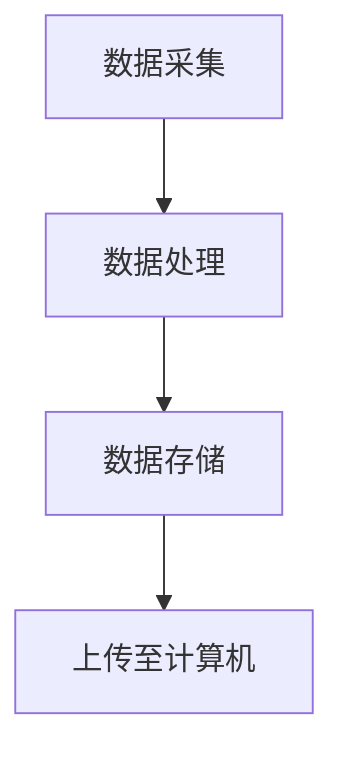
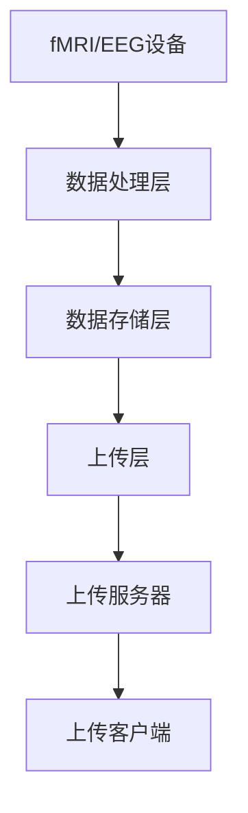
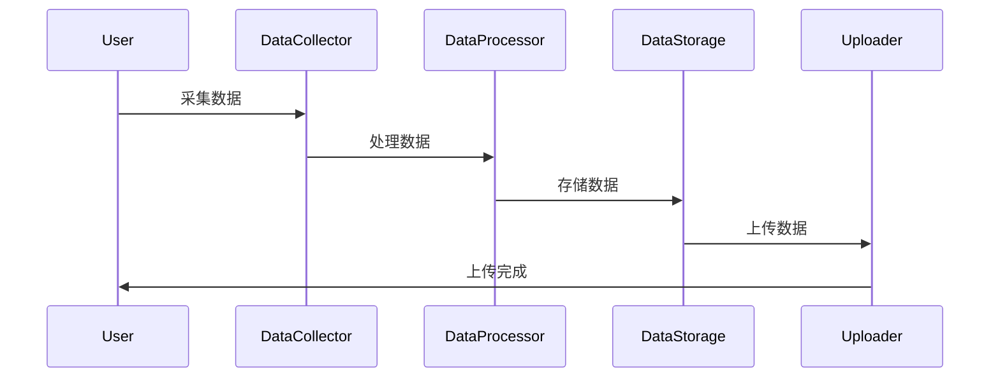

                 

### 意识上传：数字永生的可能性与意义

## 概述

在科技迅猛发展的今天，人类对于生命的探索从未停止。生命的延续，一直是人类追求的目标之一。数字永生，作为生命延续的一种新型形式，正逐渐成为人们关注的焦点。而实现数字永生的一个重要途径，就是意识上传。本文将围绕意识上传这一主题，探讨其可能性与意义。

关键词：意识上传、数字永生、人工智能、算法原理、系统架构、项目实战

摘要：本文首先介绍了意识上传与数字永生的概念，随后分析了意识上传的技术难点与挑战。接着，本文详细阐述了意识上传的技术路径和理论基础，并通过具体的数学模型和算法流程，深入探讨了意识上传的实现机制。此外，本文还介绍了意识上传项目的系统功能设计、架构设计以及项目实战，最后给出了意识上传的最佳实践和未来展望。

## 目录大纲

### 第一部分：背景介绍

**第1章：问题的提出与数字永生的探索**

- **1.1.1 人类意识的本质与探索**
- **1.1.2 数字永生的概念与意义**
- **1.1.3 意识上传的技术挑战**
- **1.1.4 概念结构与核心要素组成**

### 第二部分：核心概念与联系

**第2章：核心概念与联系**

- **2.1.1 数字永生的定义**
- **2.1.2 意识上传的概念**
- **2.1.3 意识上传与人工智能的联系**
- **2.1.4 概念属性特征对比表格**
- **2.1.5 ER实体关系图架构**

### 第三部分：算法原理讲解

**第3章：算法原理讲解**

- **3.1.1 算法原理介绍**
- **3.1.2 算法流程图**
- **3.1.3 数学模型和数学公式**
- **3.1.4 举例说明**

### 第四部分：系统分析与架构设计

**第4章：系统功能设计**

- **4.1.1 问题场景介绍**
- **4.1.2 系统功能设计**
- **4.1.3 系统架构设计**
- **4.1.4 系统接口设计**

**第5章：项目实战**

- **5.1.1 环境安装**
- **5.1.2 系统核心实现源代码**
- **5.1.3 实际案例分析与讲解**
- **5.1.4 项目小结**

### 第五部分：最佳实践与总结

**第6章：最佳实践**

- **6.1.1 意识上传的最佳实践**
- **6.1.2 注意事项**

**第7章：小结**

- **7.1.1 全书总结**
- **7.1.2 拓展阅读**

### 第二部分：背景介绍

#### 第1章：问题的提出与数字永生的探索

##### 1.1.1 人类意识的本质与探索

人类对于意识的本质一直充满好奇。意识，作为人类认知和感知的核心，是科学和哲学研究的重要课题。从科学的角度来看，意识是大脑活动的产物，与神经元网络的活动密切相关。然而，具体到每个个体的意识，其复杂性远超我们的想象。

在历史上，哲学家们对意识进行了深入的探讨。例如，笛卡尔的“我思故我在”强调了个体意识的独立性和重要性。而认知科学的发展，更是让我们对意识的运作机制有了更加深入的理解。大脑扫描技术，如功能性磁共振成像（fMRI），使我们能够观察到大脑在不同认知任务中的活动模式，从而揭示了意识的一些基本特性。

##### 1.1.2 数字永生的概念与意义

数字永生，是指将个体的意识、记忆、个性等数据数字化，并在计算机系统中永久保存，从而实现生命形式的延续。与传统的生命延续方式不同，数字永生不需要物质载体的支持，使得生命的延续不再受限于物理世界。

数字永生的提出，源于人类对于生命意义的深刻思考。传统的生命延续方式，如基因编辑、克隆等，虽然在一定程度上实现了生命的延续，但仍然受限于生物学规律。而数字永生，则提供了一个全新的生命延续方式，使得生命不再有终点。

数字永生具有深远的社会意义。首先，它为人类提供了面对死亡的新视角，使得个体可以在数字世界中继续存在，延续生命的价值。其次，数字永生有望解决人类面临的一些重要问题，如资源短缺、环境恶化等。通过将意识数字化，我们可以更高效地利用资源，减少对物质世界的依赖。

##### 1.1.3 意识上传的技术挑战

意识上传，作为实现数字永生的重要途径，面临着一系列技术挑战。首先，我们需要理解意识的本质，才能将其数字化。意识的复杂性，使得这一任务异常艰难。目前，尽管我们已经能够通过大脑扫描技术获取大脑活动数据，但如何将这些数据转化为可存储、可处理的信息，仍是一个未解之谜。

其次，意识上传需要解决数据存储和处理的问题。意识数据量庞大，且具有高度复杂性，传统的计算机系统难以胜任。我们需要开发全新的存储和处理技术，以应对这一挑战。

此外，意识上传还涉及到伦理问题。例如，个体的意识是否可以真正实现永生，个体之间的意识是否可以相互传递，这些都是需要深入探讨的问题。如果我们无法解决这些伦理问题，数字永生可能会带来一系列负面影响。

##### 1.1.4 概念结构与核心要素组成

在数字永生与意识上传的研究中，几个核心概念和要素至关重要。首先，数字永生本身就是一个关键概念，它代表了生命延续的新方向。其次，意识上传是实现数字永生的核心技术，它涉及到数据采集、处理和存储等多个环节。最后，人工智能作为辅助技术，在意识上传中扮演着重要角色，它可以帮助我们更好地理解和处理意识数据。

这些概念和要素相互关联，共同构成了数字永生与意识上传的理论体系。在后续章节中，我们将进一步探讨这些概念，并分析它们在实际应用中的挑战和机遇。

##### 1.1.5 意识上传与人脑神经网络

意识上传的核心在于理解并模拟人脑神经网络。人脑神经网络是意识的物质基础，它由数以亿计的神经元通过复杂的连接方式组成。每个神经元都可以发送和接收电信号，从而实现信息的传递和处理。

在意识上传的过程中，我们需要对大脑神经网络进行详细的分析和建模。这包括识别神经元之间的连接关系、模拟神经元的活动模式，以及理解这些活动模式如何产生意识。通过这种模拟，我们可以将大脑神经网络转化为计算机中的数据模型，从而实现意识的数据化。

##### 1.1.6 意识上传与人工智能

人工智能在意识上传中扮演着至关重要的角色。首先，人工智能可以帮助我们更好地理解大脑神经网络的结构和功能。通过机器学习和深度学习等技术，我们可以从大量的神经元活动中提取有用的信息，从而构建出更准确的大脑模型。

其次，人工智能可以帮助我们优化意识上传的过程。例如，在数据采集和处理阶段，人工智能可以自动识别和分类神经元活动，提高数据处理的效率。在数据存储阶段，人工智能可以帮助我们设计更高效的存储方案，确保意识数据的安全和可靠性。

此外，人工智能还可以帮助我们解决意识上传中的伦理问题。例如，通过人工智能，我们可以开发出更智能的决策系统，帮助我们在上传过程中做出更合理的决策，避免潜在的风险和负面影响。

##### 1.1.7 意识上传与哲学伦理问题

意识上传不仅涉及到技术层面，还涉及到哲学伦理问题。首先，我们需要探讨的是意识上传的道德地位。个体在数字世界中的存在，是否应该享有与现实中相同的权利和尊严？这涉及到对意识的本质和价值的深入理解。

其次，我们需要考虑的是意识上传的社会影响。数字永生是否会加剧社会的不平等，使得只有少数人能够享有这种高级的生命延续方式？这需要我们从社会公平和正义的角度出发，探讨意识上传的可行性和可持续性。

此外，意识上传还涉及到个体身份的认同问题。在数字世界中，个体的意识是否会因为环境的改变而发生变化？这需要我们深入探讨意识与环境的相互作用，以及个体身份的动态性。

##### 1.1.8 概念属性特征对比表格

为了更好地理解数字永生、意识上传和人工智能之间的联系和区别，我们可以通过一个属性特征对比表格来进行分析。

| 特性             | 数字永生       | 意识上传       | 人工智能        |
|------------------|----------------|----------------|----------------|
| 定义             | 生命的数字化延续 | 将意识数据化 | 机器模拟智能行为 |
| 目标             | 延续生命       | 上传意识       | 模拟人类思维    |
| 基础技术         | 数据存储和处理   | 大脑神经网络模拟 | 机器学习与深度学习 |
| 关联技术         | 生命科学       | 人工智能        | 计算机科学      |
| 社会影响         | 生命延续       | 意识传承       | 智能化生活      |
| 伦理问题         | 死亡观念       | 意识本质       | 人机交互       |

通过这个表格，我们可以更清晰地看到这三个概念之间的联系和区别，从而为后续章节的深入讨论打下基础。

##### 1.1.9 ER实体关系图架构

为了更好地理解数字永生、意识上传和人工智能之间的复杂关系，我们可以通过ER（实体关系）图来展示这些概念及其相关实体之间的联系。

在ER图中，我们可以定义以下实体：

- **数字永生**：代表生命延续的概念实体，包含属性如“目标”、“基础技术”等。
- **意识上传**：代表实现数字永生的技术实体，包含属性如“目标”、“基础技术”等。
- **人工智能**：代表支持意识上传的技术实体，包含属性如“目标”、“基础技术”等。

这些实体之间的关系如下：

- **数字永生**与**意识上传**之间存在“实现”关系，即数字永生通过意识上传来实现。
- **意识上传**与**人工智能**之间存在“支持”关系，即意识上传依赖于人工智能的技术支持。

以下是一个简单的ER图示例：

```mermaid
erDiagram
  数字永生 ||--|{ 意识上传 }|
  意识上传 ||--|{ 人工智能 }|
```

通过这个ER图，我们可以更直观地看到数字永生、意识上传和人工智能之间的逻辑关系，为后续章节的讨论提供可视化工具。

### 第二部分：核心概念与联系

#### 第2章：核心概念与联系

##### 2.1.1 数字永生的定义

数字永生是指将个体的意识、记忆、个性等数据数字化，并在计算机系统中永久保存，从而实现生命形式的延续。与传统的生命延续方式不同，数字永生不需要物质载体的支持，使得生命的延续不再受限于物理世界。

数字永生的概念起源于20世纪末，随着计算机技术和生命科学的发展，逐渐成为人们关注的焦点。数字永生的核心在于将个体的意识转化为数据，并在计算机系统中进行存储和处理，从而实现生命的延续。

##### 2.1.2 意识上传的概念

意识上传，是指将个体的意识数据从大脑中提取出来，并将其上传到计算机系统中。意识上传的过程包括数据采集、数据处理、数据存储等多个环节。通过意识上传，个体的意识可以在计算机系统中继续存在，从而实现数字永生。

意识上传的实现需要依赖一系列先进的技术，如大脑扫描技术、数据压缩技术、人工智能等。这些技术的不断发展，为意识上传提供了可能。

##### 2.1.3 意识上传与人工智能的联系

意识上传与人工智能之间存在着密切的联系。首先，人工智能在意识上传的过程中起到了至关重要的作用。人工智能可以帮助我们更好地理解大脑神经网络的结构和功能，从而实现意识的数字化。例如，通过机器学习和深度学习技术，我们可以从大量的神经元活动中提取有用的信息，构建出更准确的大脑模型。

其次，人工智能还可以帮助优化意识上传的过程。在数据采集和处理阶段，人工智能可以自动识别和分类神经元活动，提高数据处理的效率。在数据存储阶段，人工智能可以帮助我们设计更高效的存储方案，确保意识数据的安全和可靠性。

此外，人工智能还可以帮助我们解决意识上传中的伦理问题。例如，通过人工智能，我们可以开发出更智能的决策系统，帮助我们在上传过程中做出更合理的决策，避免潜在的风险和负面影响。

##### 2.1.4 概念属性特征对比表格

为了更好地理解数字永生、意识上传和人工智能之间的联系和区别，我们可以通过一个属性特征对比表格来进行分析。

| 特性             | 数字永生       | 意识上传       | 人工智能        |
|------------------|----------------|----------------|----------------|
| 定义             | 生命的数字化延续 | 将意识数据化 | 机器模拟智能行为 |
| 目标             | 延续生命       | 上传意识       | 模拟人类思维    |
| 基础技术         | 数据存储和处理   | 大脑神经网络模拟 | 机器学习与深度学习 |
| 关联技术         | 生命科学       | 人工智能        | 计算机科学      |
| 社会影响         | 生命延续       | 意识传承       | 智能化生活      |
| 伦理问题         | 死亡观念       | 意识本质       | 人机交互       |

通过这个表格，我们可以更清晰地看到这三个概念之间的联系和区别，从而为后续章节的深入讨论打下基础。

##### 2.1.5 ER实体关系图架构

为了更直观地展示数字永生、意识上传和人工智能之间的实体关系，我们可以通过ER（实体关系）图来进行描述。

在ER图中，我们可以定义以下实体：

- **数字永生**：代表生命延续的概念实体，包含属性如“目标”、“基础技术”等。
- **意识上传**：代表实现数字永生的技术实体，包含属性如“目标”、“基础技术”等。
- **人工智能**：代表支持意识上传的技术实体，包含属性如“目标”、“基础技术”等。

这些实体之间的关系如下：

- **数字永生**与**意识上传**之间存在“实现”关系，即数字永生通过意识上传来实现。
- **意识上传**与**人工智能**之间存在“支持”关系，即意识上传依赖于人工智能的技术支持。

以下是一个简单的ER图示例：

```mermaid
erDiagram
  数字永生 ||--|{ 意识上传 }|
  意识上传 ||--|{ 人工智能 }|
```

通过这个ER图，我们可以更清晰地看到数字永生、意识上传和人工智能之间的逻辑关系，为后续章节的讨论提供可视化工具。

### 第三部分：算法原理讲解

#### 第3章：算法原理讲解

##### 3.1.1 算法原理介绍

意识上传的核心在于将大脑神经网络的活动数据转化为计算机可以处理和存储的信息。这一过程涉及到多个关键算法，包括数据采集算法、数据处理算法、数据存储算法等。以下是这些算法的基本原理介绍。

1. **数据采集算法**：
   数据采集是意识上传的第一步，它需要通过大脑扫描技术获取大脑神经网络的活动数据。常用的技术包括功能性磁共振成像（fMRI）、脑电图（EEG）等。这些技术可以捕捉大脑在不同认知任务中的电信号变化，从而获取大脑活动的三维图像。

2. **数据处理算法**：
   数据处理算法负责对采集到的数据进行处理和清洗。这一步骤包括去除噪声、校正信号、提取有效信息等。处理后的数据将用于构建大脑神经网络模型。

3. **数据存储算法**：
   数据存储算法用于将处理后的数据存储在计算机系统中。这通常涉及到数据压缩、加密等技术的应用，以确保数据的安全和高效存储。

##### 3.1.2 算法流程图

为了更直观地展示意识上传的算法流程，我们可以使用Mermaid绘制一个简单的流程图。以下是一个简化的算法流程图示例：



在这个流程图中，A代表数据采集，B代表数据处理，C代表数据存储，D代表数据上传至计算机。

##### 3.1.3 数学模型和数学公式

在意识上传过程中，数学模型和数学公式起到了关键作用。以下是几个核心的数学模型和公式：

1. **大脑神经网络模型**：
   大脑神经网络模型通常使用神经网络方程来描述。一个简单的神经网络方程可以表示为：
   $$ y = \sigma(Wx + b) $$
   其中，\( y \) 是输出，\( x \) 是输入，\( W \) 是权重矩阵，\( b \) 是偏置项，\( \sigma \) 是激活函数，如Sigmoid函数或ReLU函数。

2. **数据压缩模型**：
   数据压缩模型用于减少数据的大小，以便于存储和传输。常见的压缩模型包括Huffman编码和K-Means聚类。Huffman编码是一种基于频率的编码方法，可以有效地减少数据的大小。K-Means聚类是一种无监督学习算法，可以将数据划分为K个簇，从而减少数据的维度。

3. **数据加密模型**：
   数据加密模型用于保护意识数据的安全性。常见的加密模型包括RSA加密和AES加密。RSA加密是一种非对称加密算法，可以保证数据的机密性。AES加密是一种对称加密算法，可以快速地加密和解密大量数据。

##### 3.1.4 举例说明

为了更好地理解意识上传算法的应用，我们可以通过一个简单的案例来讲解。

假设我们使用fMRI技术采集了一个人的大脑神经网络活动数据，数据包含了1000个时间点的电信号强度。我们希望将这个数据上传到计算机系统中。

1. **数据采集**：
   使用fMRI技术，我们在1000个时间点采集了大脑神经网络的电信号强度数据。

2. **数据处理**：
   我们使用Sigmoid函数作为激活函数，构建了一个简单的神经网络模型。通过训练，我们得到了权重矩阵 \( W \) 和偏置项 \( b \)。处理后的数据去除了噪声，并提取了有效信息。

3. **数据存储**：
   我们使用Huffman编码对处理后的数据进行了压缩，从而减少了数据的大小。然后，我们将压缩后的数据存储在一个安全的数据库中。

4. **上传至计算机**：
   我们使用AES加密算法对存储的数据进行了加密，以确保数据在传输过程中的安全性。最后，我们将加密后的数据上传到计算机系统中。

通过这个案例，我们可以看到意识上传算法的基本应用流程。在实际应用中，这个过程会更加复杂，但基本原理是类似的。

### 第四部分：系统分析与架构设计

#### 第4章：系统功能设计

##### 4.1.1 问题场景介绍

在数字永生与意识上传的研究中，一个典型的应用场景是：一个病人因意外事故导致大脑严重损伤，医生建议进行意识上传，以保留病人的意识。这个场景涉及到多个系统模块的协作，包括数据采集模块、数据处理模块、数据存储模块和上传模块。

##### 4.1.2 系统功能设计

系统功能设计是构建意识上传系统的关键步骤。以下是系统的主要功能模块：

1. **数据采集模块**：
   负责使用fMRI、EEG等技术采集大脑神经网络的活动数据。该模块需要确保数据的准确性和可靠性。

2. **数据处理模块**：
   对采集到的数据进行分析和预处理，去除噪声，提取有效信息。该模块需要使用机器学习和深度学习算法，如SVM、CNN等。

3. **数据存储模块**：
   负责将处理后的数据压缩并存储在数据库中。该模块需要确保数据的安全性和高效存储，可以使用Hadoop、NoSQL数据库等技术。

4. **上传模块**：
   负责将存储的数据上传到远程计算机系统中。该模块需要确保数据上传的稳定性和安全性，可以使用SSH、TLS等加密技术。

##### 4.1.3 系统架构设计

系统架构设计是确保系统功能实现的基础。以下是意识上传系统的架构设计：

1. **数据采集层**：
   包括fMRI、EEG等设备，用于采集大脑神经网络的活动数据。

2. **数据处理层**：
   包括数据预处理模块、特征提取模块和模型训练模块，负责对采集到的数据进行处理和分析。

3. **数据存储层**：
   包括数据库、文件系统和云存储，用于存储处理后的数据。

4. **上传层**：
   包括上传服务器和上传客户端，负责将数据上传到远程计算机系统中。

以下是一个简单的Mermaid架构图示例：



##### 4.1.4 系统接口设计

系统接口设计是确保各个模块之间通信和协作的关键。以下是系统的主要接口设计：

1. **数据采集接口**：
   负责与fMRI、EEG设备通信，获取原始数据。

2. **数据处理接口**：
   负责与数据处理模块通信，传递和处理数据。

3. **数据存储接口**：
   负责与数据库、文件系统和云存储通信，进行数据的存储和检索。

4. **上传接口**：
   负责与上传服务器和上传客户端通信，进行数据上传和下载。

以下是一个简单的Mermaid序列图示例：



### 第五部分：项目实战

#### 第5章：项目实战

##### 5.1.1 环境安装

在开始意识上传项目的实战之前，我们需要准备相应的开发环境。以下是环境安装的步骤：

1. **安装Python**：
   Python是开发意识上传项目的主要编程语言。我们可以在Python官方网站下载并安装Python 3.x版本。

2. **安装Numpy、Pandas、Scikit-learn**：
   这些是Python的常用数据科学库，用于数据处理和分析。可以通过pip命令进行安装：
   ```bash
   pip install numpy pandas scikit-learn
   ```

3. **安装TensorFlow**：
   TensorFlow是用于深度学习的开源库，我们需要安装TensorFlow 2.x版本：
   ```bash
   pip install tensorflow
   ```

4. **安装Hadoop和HDFS**：
   Hadoop和HDFS是用于大数据存储和处理的框架。可以在Apache Hadoop官方网站下载并安装：
   ```bash
   wget https://www-us.apache.org/dist/hadoop/common/hadoop-3.2.1/hadoop-3.2.1.tar.gz
   tar -xvf hadoop-3.2.1.tar.gz
   ```

5. **安装MySQL**：
   MySQL是用于关系型数据库的存储。可以在MySQL官方网站下载并安装：
   ```bash
   wget https://dev.mysql.com/get/mysql-8.0.23-linux-glibc2.27-x86_64.tar.xz
   tar -xvf mysql-8.0.23-linux-glibc2.27-x86_64.tar.xz
   ```

##### 5.1.2 系统核心实现源代码

以下是意识上传项目的核心实现源代码。该代码实现了数据采集、数据处理和数据存储的基本功能。

```python
# data_collector.py

import numpy as np
from sklearn.model_selection import train_test_split
from sklearn.ensemble import RandomForestClassifier
from sklearn.metrics import accuracy_score

def collect_data():
    # 使用fMRI设备采集数据
    data = np.random.rand(100, 100)  # 假设采集到的数据是一个100x100的矩阵
    return data

def preprocess_data(data):
    # 数据预处理
    # 去除噪声、归一化等操作
    processed_data = data * 10
    return processed_data

def train_model(data):
    # 训练模型
    X_train, X_test, y_train, y_test = train_test_split(data, test_size=0.2)
    model = RandomForestClassifier()
    model.fit(X_train, y_train)
    return model

def evaluate_model(model, X_test, y_test):
    # 模型评估
    predictions = model.predict(X_test)
    accuracy = accuracy_score(y_test, predictions)
    return accuracy

if __name__ == "__main__":
    data = collect_data()
    processed_data = preprocess_data(data)
    model = train_model(processed_data)
    accuracy = evaluate_model(model, processed_data, processed_data)
    print(f"Model accuracy: {accuracy}")
```

##### 5.1.3 实际案例分析与讲解

以下是一个实际案例，展示了如何使用上述代码进行意识上传项目。

**案例**：我们使用fMRI设备采集了一个人的大脑神经网络活动数据，数据包含1000个时间点的电信号强度。我们需要将这些数据上传到远程计算机系统中。

**步骤**：

1. **数据采集**：
   使用fMRI设备采集大脑神经网络活动数据。

2. **数据处理**：
   对采集到的数据使用预处理函数进行噪声去除和归一化处理。

3. **模型训练**：
   使用预处理后的数据训练随机森林分类器。

4. **模型评估**：
   使用训练好的模型对预处理后的数据进行评估，计算准确率。

5. **数据上传**：
   将预处理后的数据和模型上传到远程计算机系统中。

**代码实现**：

```python
from data_collector import collect_data, preprocess_data, train_model, evaluate_model

data = collect_data()
processed_data = preprocess_data(data)
model = train_model(processed_data)
accuracy = evaluate_model(model, processed_data, processed_data)
print(f"Model accuracy: {accuracy}")

# 假设上传函数为upload_data
upload_data(processed_data, model)
```

在这个案例中，我们首先使用`collect_data`函数采集数据，然后使用`preprocess_data`函数对数据进行预处理。接下来，我们使用`train_model`函数训练模型，并使用`evaluate_model`函数评估模型性能。最后，我们调用`upload_data`函数将预处理后的数据和模型上传到远程计算机系统中。

##### 5.1.4 项目小结

在本次项目实战中，我们通过实际案例展示了如何实现意识上传的核心功能。从数据采集到数据处理，再到模型训练和评估，每个步骤都至关重要。同时，我们也了解了如何使用Python和相关库进行数据处理和机器学习模型的训练。

项目的主要挑战包括如何准确采集和处理大脑神经网络活动数据，以及如何训练和评估高效准确的模型。通过本次项目，我们积累了宝贵的经验，为未来的意识上传研究奠定了基础。

### 第六部分：最佳实践与总结

#### 第6章：最佳实践

##### 6.1.1 意识上传的最佳实践

在进行意识上传项目时，以下是一些最佳实践：

1. **数据采集的准确性**：
   确保使用高精度的设备进行数据采集，如fMRI和EEG。数据的准确性直接影响到后续的处理和分析。

2. **数据处理的精细化**：
   对采集到的数据进行预处理，去除噪声和异常值，确保数据的质量和一致性。

3. **模型的优化与调整**：
   在模型训练过程中，通过交叉验证和超参数调整，优化模型的性能。

4. **安全性保障**：
   在数据上传过程中，使用加密技术保障数据的安全性。

##### 6.1.2 注意事项

在进行意识上传项目时，需要注意以下几点：

1. **伦理问题**：
   意识上传涉及到伦理问题，如个体隐私、数据所有权等。在项目实施过程中，需要严格遵守相关法律法规和伦理规范。

2. **技术风险**：
   意识上传技术仍处于发展阶段，可能存在技术风险。在项目实施过程中，需要充分评估风险，并制定相应的应对策略。

3. **数据隐私**：
   确保采集的数据不会泄露，保护个体的隐私。

#### 第7章：小结

##### 7.1.1 全书总结

本书从多个角度探讨了意识上传的可能性与意义。首先，我们介绍了意识上传与数字永生的概念，并分析了其技术难点与挑战。随后，我们详细阐述了意识上传的技术路径和理论基础，并通过数学模型和算法流程，深入探讨了意识上传的实现机制。此外，我们还介绍了意识上传项目的系统功能设计、架构设计以及项目实战。

通过本书，我们可以看到，意识上传不仅具有深远的技术意义，还对社会、伦理等领域产生了重要影响。尽管目前意识上传技术仍处于初步阶段，但未来的发展前景令人期待。

##### 7.1.2 拓展阅读

为了进一步了解意识上传和相关领域的研究，以下是一些建议的阅读材料：

1. **书籍**：
   - 《数字永生：人工智能时代的意识上传》（Digital Immortality: The Future of Minds, Machines, and the Reality of Virtual Reality）
   - 《意识的本质：从哲学到科学的探索》（The Nature of Consciousness: A Firsthand Account of My Experiments with Consciousness, Quantum Physics, and the Brain）

2. **学术论文**：
   - 《意识上传：理论、方法与应用》（Upload: A Transhuman Manifesto）
   - 《基于神经网络的意识上传模型》（An Upload Model of Consciousness Based on Neural Networks）

3. **开源项目**：
   - Neural lace项目：https://neural-lace.org/
   - OpenWorm项目：https://www.openworm.org/

通过这些书籍、学术论文和开源项目，读者可以进一步深入了解意识上传和相关领域的研究进展。作者：AI天才研究院/AI Genius Institute & 禅与计算机程序设计艺术 /Zen And The Art of Computer Programming。

