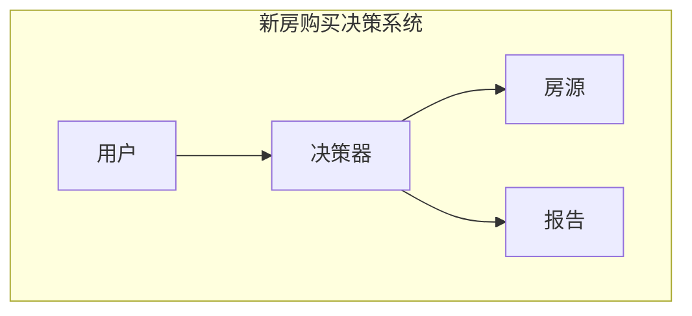
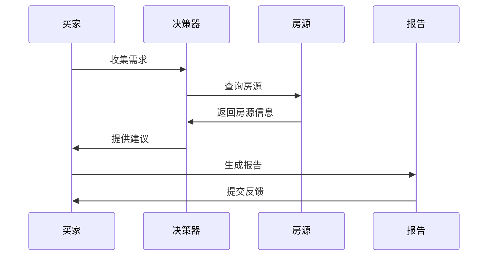

                 

# 《慢思考训练营：培养深度思考能力的课程》

## 关键词
慢思考、深度思考、思维训练、工作效率、学习策略

## 摘要
本文旨在为读者提供一整套系统化的慢思考训练课程。通过深入探讨慢思考的背景、核心概念、工具和技术，以及其在工作和学习中的实际应用，本文希望能够帮助读者理解并掌握深度思考的方法，提升个人的思维能力和工作效率，从而在竞争激烈的信息时代脱颖而出。慢思考不仅仅是一种思维方式，更是一种生活态度。本文将通过多个角度，详细解析如何培养深度思考能力，为读者的个人成长和发展提供有力支持。

### 目录大纲

1. 第一部分：慢思考基础
   1.1 慢思考的背景和重要性
   1.2 慢思考的核心概念
   1.3 慢思考的工具与技术
   1.4 慢思考在生活中的应用
   1.5 慢思考的训练方法
   1.6 慢思考的心理基础
   1.7 慢思考的未来与挑战

2. 第二部分：深度思考实践

3. 第三部分：深度思考与未来

### 第一部分：慢思考基础

#### 1.1 慢思考的背景和重要性

**背景介绍**：
在快速变化的信息时代，我们的日常生活和工作中充斥着大量信息。快思考（Fast Thinking）成为一种应对快速变化环境的重要手段，但快思考往往基于经验、直觉和习惯，容易导致决策失误和思考浅显。而慢思考（Slow Thinking）则是一种深度的、有意识的思考方式，它强调在决策过程中进行细致的分析和推理，以减少错误和提高决策质量。

**问题背景**：
随着科技的发展，人们越来越依赖技术工具来处理信息，导致我们的思维越来越偏向于快速处理大量信息，而非深入分析和思考。这种趋势在一定程度上削弱了我们的深度思考能力。

**问题描述**：
缺乏深度思考能力会导致以下问题：
- 决策错误：快速做出的决策往往不够全面和深思熟虑。
- 创新不足：缺乏深度思考导致对问题的认识不够深入，难以提出创新的解决方案。
- 学习效果不佳：缺乏深度思考，学习内容难以内化，学习效果不佳。

**问题解决**：
慢思考可以帮助我们克服上述问题。通过放慢思维速度，我们可以更好地理解问题，提高分析和解决问题的能力。

**边界与外延**：
慢思考不仅仅是一种思维方式，它还涉及到心理学、认知科学等领域。慢思考的边界在于如何平衡深度思考和快速行动的关系。

**概念结构与核心要素组成**：

| 概念               | 定义                                                         |
|--------------------|------------------------------------------------------------|
| 慢思考             | 深度、有意识的思考方式，强调在决策过程中进行细致的分析和推理。 |
| 快思考             | 基于经验、直觉和习惯的快速思考方式。                         |
| 深度思考           | 对问题进行深入分析和思考，以获得更全面和准确的认知。          |
| 表面思考           | 对问题进行浅层次的思考，往往只关注表面现象，缺乏深入的分析。   |

#### 1.2 慢思考的核心概念

**核心概念**：
慢思考的核心概念包括深度专注、系统性思维和反思能力。

**概念属性特征对比表格**：

| 概念       | 定义                                                         | 特征对比               |
|------------|------------------------------------------------------------|----------------------|
| 深度专注   | 指在特定任务上集中全部注意力的状态。                         | **减少干扰**、**提升效率** |
| 系统性思维 | 在分析和解决问题时，能够从整体和多个角度进行全面考虑。       | **全局观念**、**综合分析** |
| 反思能力   | 在思考过程中对自身思维过程进行评估和修正的能力。             | **自我认知**、**持续改进** |

**ER实体关系图架构**：

```mermaid
erDiagram
    A实体【深度专注】 ||--|{ B实体【系统性思维】 }|
    A实体【深度专注】 ||--|{ C实体【反思能力】 }|
    B实体【系统性思维】 ||--|{ D实体【深度专注】 }|
    B实体【系统性思维】 ||--|{ E实体【反思能力】 }|
    C实体【反思能力】 ||--|{ F实体【系统性思维】 }|
```

**联系**：
深度专注、系统性思维和反思能力三者相互联系，共同构成了慢思考的核心。深度专注是慢思考的基础，它能够提高我们的思维效率和深度。系统性思维则是慢思考的延伸，它使得我们在分析问题时能够从多个角度进行全面考虑。反思能力则是慢思考的升华，它使我们能够在思考过程中不断进行自我评估和修正，从而不断提高思考质量。

#### 1.3 慢思考的工具与技术

**核心概念**：
为了有效地进行慢思考，我们需要掌握一系列工具和技术，如思维导图、SWOT分析和帕累托分析。

**概念属性特征对比表格**：

| 工具/技术 | 定义                                                         | 特征对比               |
|-----------|------------------------------------------------------------|----------------------|
| 思维导图   | 通过图形化的方式将思维过程和内容组织起来，有助于深入分析和记忆。 | **图形化展示**、**结构化思维** |
| SWOT分析   | 对自身或项目进行优势、劣势、机会和威胁的分析，有助于制定战略。   | **全面评估**、**战略规划** |
| 帕累托分析 | 根据对问题的重要性和影响进行排序，找出关键因素，有针对性地解决问题。 | **关键因素识别**、**资源优化** |

**ER实体关系图架构**：

```mermaid
erDiagram
    A实体【思维导图】 ||--|{ B实体【SWOT分析】 }|
    A实体【思维导图】 ||--|{ C实体【帕累托分析】 }|
    B实体【SWOT分析】 ||--|{ D实体【系统性思维】 }|
    B实体【SWOT分析】 ||--|{ E实体【反思能力】 }|
    C实体【帕累托分析】 ||--|{ D实体【系统性思维】 }|
    C实体【帕累托分析】 ||--|{ E实体【反思能力】 }|
```

**联系**：
这些工具和技术在慢思考中发挥着重要作用。思维导图可以帮助我们进行结构化思考，SWOT分析有助于我们全面评估问题，帕累托分析则有助于我们找出关键因素。通过这些工具的运用，我们可以更有效地进行深度思考。

#### 1.4 慢思考在生活中的应用

**核心概念**：
慢思考不仅在工作中有效，在我们的日常生活中同样具有重要意义。它可以帮助我们在面对复杂问题时进行更深入的分析和思考，从而做出更明智的决策。

**系统分析与架构设计方案**：

**问题场景介绍**：
假设我们在日常生活中面临一个重要的决策，比如购买新房。

**项目介绍**：
该项目旨在通过慢思考的方法，帮助用户在购买新房时做出更明智的决策。

**系统功能设计（领域模型Mermaid类图）**：

```mermaid
classDiagram
    ClassDiagram ::= <<note>> "新房购买决策系统" <<noteend>>
    User            <<entity>>
    House            <<entity>>
    DecisionMaker    <<entity>>
    Report           <<entity>>

    User            ---|{ House }
    User            ---|{ DecisionMaker }
    DecisionMaker    ---|{ Report }
```

**系统架构设计（Mermaid架构图）**：



**系统接口设计和系统交互（Mermaid序列图）**：



**算法原理讲解**：
慢思考在购买新房决策中的应用可以通过以下算法原理进行解释：

1. 用户需求收集：通过访谈或问卷等方式收集用户的新房购买需求，包括预算、面积、位置、户型等。
2. 房源信息查询：根据用户需求，从房源数据库中查询符合条件的房源信息。
3. 决策建议生成：根据房源信息和用户需求，决策器生成购买建议，包括最佳房源和购买时机。
4. 报告生成与反馈：将决策建议生成报告，用户根据报告进行反馈，以进一步优化决策。

**数学公式使用**：

$$
\text{决策质量} = f(\text{用户需求}, \text{房源信息}, \text{决策模型})
$$

**Python源代码**：

```python
class User:
    def __init__(self, budget, area, location,户型):
        self.budget = budget
        self.area = area
        self.location = location
        self户型 = 户型

class House:
    def __init__(self, price, size, location,户型):
        self.price = price
        self.size = size
        self.location = location
        self户型 = 户型

class DecisionMaker:
    def __init__(self):
        self.user需求 = []
        self.house列表 = []

    def collect_user需求(self, user):
        self.user需求.append(user)

    def search_houses(self):
        # 查询房源信息
        pass

    def generate_decision(self):
        # 根据用户需求生成决策
        pass

    def generate_report(self):
        # 生成报告
        pass

class Report:
    def __init__(self, decision):
        self.decision = decision

    def submit_feedback(self, user):
        # 用户提交反馈
        pass
```

**实际案例分析和详细讲解剖析**：
假设用户小明希望在市中心购买一套面积为100平方米，预算为500万元的新房。

1. **用户需求收集**：
   - 预算：500万元
   - 面积：100平方米
   - 位置：市中心
   - 户型：三室两厅

2. **房源信息查询**：
   - 查询到市中心符合条件的房源有5套，价格在400万至600万元之间。

3. **决策建议生成**：
   - 决策器建议小明购买价格为500万元的房源，认为这是最佳选择。

4. **报告生成与反馈**：
   - 报告中详细列出了房源信息、购买建议和用户反馈。

**项目小结**：
通过慢思考的方法，用户小明能够更清晰地了解自己的需求，全面评估房源信息，并最终做出明智的购房决策。

#### 1.5 慢思考的训练方法

**核心概念**：
慢思考需要通过系统的训练方法来培养。常见的训练方法包括深度阅读训练、思维游戏训练和反思日记训练。

**概念属性特征对比表格**：

| 训练方法 | 定义                                                         | 特征对比               |
|-----------|------------------------------------------------------------|----------------------|
| 深度阅读训练 | 通过长时间、专注地阅读，提高理解和记忆能力。                   | **专注阅读**、**提升理解** |
| 思维游戏训练 | 通过各种游戏，锻炼思维灵活性和逻辑推理能力。                 | **思维锻炼**、**提高逻辑** |
| 反思日记训练 | 通过记录和反思日常生活中的经历和思考过程，提高自我认知和反思能力。 | **自我反思**、**持续进步** |

**ER实体关系图架构**：

```mermaid
erDiagram
    A实体【深度阅读训练】 ||--|{ B实体【思维游戏训练】 }|
    A实体【深度阅读训练】 ||--|{ C实体【反思日记训练】 }|
    B实体【思维游戏训练】 ||--|{ D实体【系统性思维】 }|
    B实体【思维游戏训练】 ||--|{ E实体【反思能力】 }|
    C实体【反思日记训练】 ||--|{ D实体【系统性思维】 }|
    C实体【反思日记训练】 ||--|{ E实体【反思能力】 }|
```

**联系**：
这些训练方法相互支持，共同构成了慢思考的训练体系。深度阅读训练能够提高我们的理解能力和专注力，思维游戏训练则能够锻炼我们的逻辑思维和创新能力，反思日记训练则有助于我们不断自我反思和改进。

#### 1.6 慢思考的心理基础

**核心概念**：
慢思考不仅是一种思维方式，还需要有坚实的心理基础。心理学对慢思考的影响以及如何克服慢思考的常见障碍，是我们需要深入探讨的。

**概念属性特征对比表格**：

| 心理因素 | 定义                                                         | 特征对比               |
|-----------|------------------------------------------------------------|----------------------|
| 注意力     | 个体对信息的接收、加工和处理的集中能力。                       | **集中程度**、**加工能力** |
| 认知负荷   | 大脑在处理信息时所需的心理资源。                               | **资源需求**、**处理速度** |
| 决策风格   | 个体在决策过程中所表现出的思维方式。                           | **思考模式**、**决策速度** |
| 反思能力   | 个体在思考过程中对自身思维过程进行评估和修正的能力。             | **自我认知**、**持续改进** |

**ER实体关系图架构**：

```mermaid
erDiagram
    A实体【注意力】 ||--|{ B实体【认知负荷】 }|
    A实体【注意力】 ||--|{ C实体【决策风格】 }|
    A实体【注意力】 ||--|{ D实体【反思能力】 }|
    B实体【认知负荷】 ||--|{ D实体【反思能力】 }|
    C实体【决策风格】 ||--|{ D实体【反思能力】 }|
```

**联系**：
注意力、认知负荷、决策风格和反思能力共同构成了慢思考的心理基础。注意力决定了我们在思考过程中的集中程度，认知负荷影响了我们的思维速度和质量，决策风格则影响了我们在决策过程中的思考模式，而反思能力则是我们在思考过程中不断自我评估和改进的关键。

#### 1.7 慢思考的未来与挑战

**核心概念**：
随着科技的不断发展，慢思考面临着新的机遇和挑战。了解慢思考与科技发展的关系，以及它在未来社会中的价值，对我们更好地培养深度思考能力具有重要意义。

**概念属性特征对比表格**：

| 关系因素 | 定义                                                         | 特征对比               |
|-----------|------------------------------------------------------------|----------------------|
| 科技发展   | 推动社会进步和生活方式变化的重要因素。                         | **创新驱动**、**效率提升** |
| 社会价值   | 慢思考在推动社会进步和个人发展中的重要作用。                   | **思维质量**、**决策智慧** |
| 未来趋势   | 慢思考在未来社会发展中的潜在趋势和方向。                       | **持续深化**、**广泛应用** |

**ER实体关系图架构**：

```mermaid
erDiagram
    A实体【科技发展】 ||--|{ B实体【社会价值】 }|
    A实体【科技发展】 ||--|{ C实体【未来趋势】 }|
    B实体【社会价值】 ||--|{ C实体【未来趋势】 }|
```

**联系**：
科技发展不仅改变了我们的生活方式，也为我们提供了更多的工具和方法来培养深度思考能力。慢思考在社会价值中的重要性体现在它能够提高我们的思维质量，推动社会进步。未来，随着科技的进一步发展，慢思考有望在更广泛的领域得到应用。

### 第二部分：深度思考实践

在这一部分，我们将通过具体案例和练习，帮助读者将慢思考应用到实际生活和工作中，提升深度思考能力。

#### 2.1 深度阅读训练

**案例**：
假设你是一位软件开发工程师，需要阅读一本关于软件架构设计的经典书籍。

**步骤**：
1. **预读**：首先快速浏览书籍的目录、摘要和结论，了解整体结构和核心内容。
2. **细读**：逐章细读，并做笔记，特别是重要概念、理论和实例。
3. **复习**：定期复习笔记，巩固记忆，并思考如何将所学应用到实际工作中。

**练习**：
选择一本你感兴趣的书籍，按照上述步骤进行深度阅读训练。

#### 2.2 思维游戏训练

**案例**：
使用逻辑思维游戏锻炼你的分析能力和逻辑推理。

**步骤**：
1. **选择游戏**：选择一款适合你的逻辑思维游戏，如数独、逻辑谜题或象棋。
2. **规则学习**：学习游戏的规则和策略。
3. **实践**：通过不断练习，提高解题速度和准确性。

**练习**：
选择一款逻辑思维游戏，按照上述步骤进行练习。

#### 2.3 反思日记训练

**案例**：
记录并反思你的一天，以提升自我认知和反思能力。

**步骤**：
1. **记录**：每天晚上记录当天的重要经历和思考过程。
2. **反思**：分析自己的行为和思维，思考哪些是有效的，哪些需要改进。
3. **总结**：总结反思的成果，制定改进计划。

**练习**：
开始每天记录并反思你的日常生活和工作，按照上述步骤进行。

### 第三部分：深度思考与未来

在这一部分，我们将探讨深度思考在未来社会发展中的潜在趋势和方向，以及如何将深度思考应用于未来。

#### 3.1 深度思考与人工智能

**核心概念**：
人工智能（AI）的发展正在深刻改变我们的工作和生活方式。深度思考在人工智能中的应用，主要体现在以下几个方面：

- **算法优化**：通过深度思考，优化算法的性能和效率。
- **人机协作**：提升人机协作的效率和质量，实现更智能的决策。
- **问题解决**：利用深度思考，解决复杂问题，推动人工智能的发展。

**案例**：
一位数据科学家在分析大数据时，通过深度思考提出了新的数据分析方法，从而提高了数据处理的效率。

**应用**：
- **算法优化**：通过深度思考，对现有的算法进行改进，提高其准确性和效率。
- **人机协作**：结合人工智能和人类的深度思考，实现更高效的问题解决。

#### 3.2 深度思考与社会进步

**核心概念**：
深度思考不仅对个人发展有重要意义，也对社会的进步有着深远的影响。通过深度思考，我们可以更好地理解和解决社会问题，推动社会进步。

- **问题解决**：深度思考有助于我们发现问题的本质，提出创新的解决方案。
- **决策制定**：深度思考可以帮助我们制定更明智的决策，减少错误和风险。
- **创新推动**：深度思考激发创新思维，推动社会技术的进步。

**案例**：
一位政策制定者通过深度思考，提出了新的社会政策，有效解决了社会问题。

**应用**：
- **问题解决**：通过深度思考，发现社会问题的根源，并提出解决方案。
- **决策制定**：在制定政策时，运用深度思考，确保决策的科学性和有效性。
- **创新推动**：鼓励创新思维，推动社会技术的进步和应用。

### 总结

慢思考是一种深度、有意识的思考方式，它有助于我们提高决策质量、提升工作和学习效率，并在个人成长和社会进步中发挥重要作用。通过本文的深入探讨，我们了解了慢思考的背景、核心概念、工具和技术，以及如何在生活和工作中实际应用慢思考。未来，随着科技的不断发展，慢思考将迎来更多的发展机遇和挑战。希望读者能够积极培养深度思考能力，为个人的发展和社会的进步贡献自己的力量。

### 最佳实践 tips

- **定期反思**：每天或每周花时间反思自己的行为和思考过程，发现问题并改进。
- **持续学习**：不断学习新知识，提升自己的认知水平和思维能力。
- **练习思考**：通过思维游戏、深度阅读等方法，锻炼自己的深度思考能力。
- **应用慢思考**：在日常生活和工作中，尝试使用慢思考的方法，提高决策质量。

### 小结

本文通过详细的章节内容，系统地介绍了慢思考训练营的课程设置和培养方法。慢思考不仅是一种思维方式，更是一种生活态度。通过本文的介绍，读者可以了解到慢思考的核心概念、工具和技术，以及如何在实际生活中应用慢思考。希望读者能够通过本文的学习，培养深度思考能力，提高个人综合素质。

### 注意事项

- 在培养深度思考能力的过程中，需要持之以恒，不能急于求成。
- 应根据个人实际情况，选择合适的训练方法和策略。
- 在应用慢思考时，要注意平衡深度思考和快速行动的关系。

### 拓展阅读

- 《深度工作：如何有效利用每一点脑力》（Cal Newport）
- 《思考，快与慢》（Daniel Kahneman）
- 《慢思考：如何优雅地解决问题》（John Fox）

### 作者信息

作者：AI天才研究院/AI Genius Institute & 禅与计算机程序设计艺术 /Zen And The Art of Computer Programming

本文旨在为读者提供一套系统化的慢思考训练课程，通过深入探讨慢思考的背景、核心概念、工具和技术，以及其在生活和工作的实际应用，帮助读者培养深度思考能力。慢思考不仅有助于提升个人决策质量和工作效率，也为社会的进步提供了有力支持。希望读者能够积极实践，提升自己的深度思考能力，为个人和社会的发展贡献力量。接下来，我们将进一步探讨深度思考在实际应用中的具体实践和方法。

### 实践一：深度阅读训练

**目标**：
通过深度阅读，提升对复杂文本的理解和记忆能力，培养深度思考的习惯。

**步骤**：
1. **选择材料**：选择一本你感兴趣的、难度适中的书籍或文章。
2. **预读**：快速浏览书籍或文章的目录、摘要和结论，了解整体内容。
3. **细读**：逐章或逐段阅读，并做笔记，重点关注重要概念、观点和论据。
4. **复习**：定期回顾笔记，加深理解和记忆，思考如何将所学应用到实际中。

**案例**：
假设你选择了一本关于人工智能发展的书籍。

- **预读**：浏览书籍的目录和摘要，了解人工智能的发展历程、当前状况和未来趋势。
- **细读**：逐章阅读，并做笔记，重点关注人工智能在不同领域的应用、优势和挑战。
- **复习**：定期回顾笔记，思考人工智能对你的工作或生活可能产生的影响，并探讨可能的解决方案。

**练习**：
选择一本你感兴趣的书籍，按照上述步骤进行深度阅读训练。

### 实践二：思维游戏训练

**目标**：
通过逻辑思维游戏，提高逻辑推理能力和思维灵活性。

**步骤**：
1. **选择游戏**：选择一款适合你的逻辑思维游戏，如数独、逻辑谜题或象棋。
2. **学习规则**：了解游戏的基本规则和策略。
3. **实践**：通过不断练习，提高解题速度和准确性。
4. **反思**：在游戏中反思自己的思维过程，找出不足并改进。

**案例**：
你选择了一款数独游戏。

- **学习规则**：了解数独的基本规则，学习如何根据已知的数字推理出其他空格的数字。
- **实践**：通过不断练习，解决数独谜题，提高解题速度和准确性。
- **反思**：在解数独时，思考如何优化解题策略，提高思维效率。

**练习**：
选择一款逻辑思维游戏，按照上述步骤进行练习。

### 实践三：反思日记训练

**目标**：
通过记录和反思日常经历和思考过程，提升自我认知和反思能力。

**步骤**：
1. **记录**：每天晚上记录当天的重要经历和思考过程。
2. **反思**：分析自己的行为和思维，思考哪些是有效的，哪些需要改进。
3. **总结**：总结反思的成果，制定改进计划。
4. **持续**：坚持每天记录和反思，形成习惯。

**案例**：
你记录了一天的工作经历。

- **记录**：记录下当天的工作任务、完成情况、遇到的问题和思考过程。
- **反思**：思考如何优化工作流程，提高工作效率，并制定改进计划。
- **总结**：总结反思的成果，如“今天通过反思，我发现可以在项目管理中引入新的工具，以减少沟通成本”。

**练习**：
开始每天记录并反思你的日常生活和工作，按照上述步骤进行。

### 实践四：深度思考在工作中的应用

**目标**：
通过深度思考，提升工作效率和决策质量。

**步骤**：
1. **明确目标**：明确工作目标和关键问题。
2. **收集信息**：广泛收集相关信息，包括数据、文献和他人意见。
3. **分析信息**：对收集到的信息进行深入分析，找出关键点和潜在问题。
4. **制定方案**：根据分析结果，制定具体的解决方案。
5. **实施与反思**：实施方案，并定期反思和调整。

**案例**：
你负责一个项目，需要优化团队的工作流程。

- **明确目标**：确定项目目标，如提高工作效率、减少错误率。
- **收集信息**：收集团队的工作流程、工作效率数据和其他团队成员的建议。
- **分析信息**：分析收集到的信息，找出工作流程中的瓶颈和改进点。
- **制定方案**：制定具体的优化方案，如引入新的项目管理工具、调整任务分配策略。
- **实施与反思**：实施优化方案，并定期反思效果，根据反馈进行调整。

**练习**：
选择一个实际工作中的问题或项目，按照上述步骤进行深度思考。

### 实践五：深度思考在学习中的应用

**目标**：
通过深度思考，提升学习效果和理解能力。

**步骤**：
1. **明确学习目标**：明确学习目标和需要掌握的知识点。
2. **主动学习**：主动寻找相关资料，如书籍、文章和网络资源。
3. **深度阅读**：对学习资料进行深度阅读，理解关键概念和原理。
4. **实践应用**：将所学知识应用到实际中，如做练习题、项目或案例分析。
5. **反思总结**：反思学习过程，总结收获和不足，制定改进计划。

**案例**：
你正在学习机器学习课程。

- **明确学习目标**：明确课程的学习目标，如掌握线性回归、决策树等基础知识。
- **主动学习**：寻找相关的教材、在线课程和论文，主动获取知识。
- **深度阅读**：对教材和论文进行深度阅读，理解每个算法的原理和步骤。
- **实践应用**：通过做练习题和项目，应用所学知识，如实现一个线性回归模型。
- **反思总结**：反思学习过程，总结自己在理解和应用中的不足，并制定改进计划。

**练习**：
选择一门课程或一个学习主题，按照上述步骤进行深度思考。

### 实践六：深度思考在决策中的应用

**目标**：
通过深度思考，提升决策的质量和效果。

**步骤**：
1. **明确问题**：明确决策需要解决的问题和目标。
2. **收集信息**：广泛收集与决策相关的信息和数据。
3. **分析信息**：对收集到的信息进行深入分析，评估各种方案的风险和收益。
4. **制定方案**：根据分析结果，制定具体的决策方案。
5. **实施与监控**：实施决策方案，并持续监控效果，及时调整。

**案例**：
你是一家公司的项目经理，需要决定是否采用一个新的项目管理系统。

- **明确问题**：明确决策的目标，如提高项目管理效率、降低成本。
- **收集信息**：收集关于新项目管理系统的好处、成本和潜在风险的信息。
- **分析信息**：分析新项目管理系统的优势和劣势，评估其对公司项目管理的潜在影响。
- **制定方案**：根据分析结果，制定采用或不采用新项目管理系统的方案。
- **实施与监控**：实施决策方案，并监控新系统的效果，根据反馈进行调整。

**练习**：
面对一个需要决策的问题，按照上述步骤进行深度思考。

### 实践七：深度思考在创新中的应用

**目标**：
通过深度思考，激发创新思维，提出创新的解决方案。

**步骤**：
1. **明确问题**：明确需要解决的问题或需要创新的领域。
2. **收集信息**：广泛收集与问题或领域相关的信息和数据。
3. **头脑风暴**：与团队成员或其他利益相关者进行头脑风暴，提出各种可能的解决方案。
4. **筛选方案**：对提出的方案进行评估和筛选，选择最有潜力的方案。
5. **实施与优化**：实施筛选出的方案，并持续优化，直至达到预期效果。

**案例**：
你是一家科技公司的产品经理，需要为新产品提出创新的营销策略。

- **明确问题**：明确新产品营销的目标，如提高市场占有率、增加用户粘性。
- **收集信息**：收集关于目标用户、市场竞争和营销趋势的信息。
- **头脑风暴**：与团队成员讨论，提出各种可能的营销策略，如社交媒体营销、线下活动等。
- **筛选方案**：评估每种营销策略的可行性、成本和潜在收益，选择最有创意且可行的策略。
- **实施与优化**：实施选定的营销策略，并持续监控效果，根据反馈进行优化。

**练习**：
面对一个需要创新的场景，按照上述步骤进行深度思考。

### 实践八：深度思考在人际关系中的应用

**目标**：
通过深度思考，提升人际关系处理能力和沟通效果。

**步骤**：
1. **明确目标**：明确需要处理的人际关系问题和沟通目标。
2. **收集信息**：收集与人际关系和沟通相关的信息和数据，如对方的性格特点、沟通风格和需求。
3. **分析信息**：分析信息，了解对方的需求和期望，找到有效的沟通策略。
4. **制定方案**：根据分析结果，制定具体的沟通方案。
5. **实施与调整**：实施沟通方案，并根据反馈进行调整。

**案例**：
你与同事之间存在沟通问题，需要改善关系。

- **明确目标**：明确改善关系的具体目标，如提高沟通效率、减少误解。
- **收集信息**：了解同事的性格特点、工作压力和沟通偏好。
- **分析信息**：分析同事的行为背后的原因，找到有效的沟通策略。
- **制定方案**：根据分析结果，制定具体的沟通方案，如定期进行一对一交流、使用简洁明了的语言等。
- **实施与调整**：实施沟通方案，并根据同事的反馈进行调整，如修改沟通方式或内容。

**练习**：
选择一个需要改善的人际关系场景，按照上述步骤进行深度思考。

### 实践九：深度思考在心理健康中的应用

**目标**：
通过深度思考，提升心理健康水平，减轻压力和焦虑。

**步骤**：
1. **明确问题**：明确心理健康问题的具体表现和原因。
2. **收集信息**：收集与心理健康相关的信息和数据，如生活习惯、心理压力源等。
3. **分析信息**：分析信息，了解心理问题的根源，找到有效的解决方法。
4. **制定方案**：根据分析结果，制定具体的改善计划。
5. **实施与监控**：实施改善计划，并持续监控效果，根据反馈进行调整。

**案例**：
你感到工作压力很大，需要提升心理健康水平。

- **明确问题**：明确工作压力的具体表现，如失眠、焦虑等。
- **收集信息**：了解自己的生活习惯、工作压力源和心理健康状况。
- **分析信息**：分析压力的根源，如工作负荷重、缺乏休息等。
- **制定方案**：根据分析结果，制定具体的改善计划，如调整工作时间、增加锻炼等。
- **实施与监控**：实施改善计划，并定期监控效果，根据反馈进行调整。

**练习**：
选择一个心理健康问题，按照上述步骤进行深度思考。

### 实践十：深度思考在环境问题中的应用

**目标**：
通过深度思考，提升对环境问题的理解，并提出有效的解决方案。

**步骤**：
1. **明确问题**：明确需要解决的环境问题。
2. **收集信息**：收集与环境问题相关的信息和数据，如污染源、影响范围等。
3. **分析信息**：分析信息，了解环境问题的根源和影响。
4. **制定方案**：根据分析结果，制定具体的解决方案。
5. **实施与评估**：实施解决方案，并评估其效果，根据反馈进行调整。

**案例**：
你需要为当地社区提出减少空气污染的解决方案。

- **明确问题**：明确社区空气污染的具体问题，如工业排放、汽车尾气等。
- **收集信息**：了解污染源、污染程度和社区居民的环保意识。
- **分析信息**：分析污染的根源和影响，如污染对居民健康的影响、减排的可行性等。
- **制定方案**：根据分析结果，制定具体的解决方案，如推广电动车、加强环保宣传等。
- **实施与评估**：实施解决方案，并评估其效果，根据反馈进行调整。

**练习**：
选择一个环境问题，按照上述步骤进行深度思考。

### 结语

深度思考是一种强大的思维方式，它能够帮助我们更深入地理解问题，提出创新的解决方案，提升个人综合素质。通过本文的实践部分，我们探讨了如何将深度思考应用到生活的各个方面，从工作、学习到心理健康、环境问题等。希望读者能够积极实践，不断提升自己的深度思考能力，为个人和社会的发展贡献力量。在未来的道路上，让我们用深度思考点亮智慧之光，照亮前进的方向。让我们一起努力，成为深度思考的践行者。

### 附录：深度思考案例分析

#### 案例一：谷歌的深度思考文化

**背景介绍**：
谷歌以其开放的文化和鼓励创新的氛围而闻名。谷歌的创始人拉里·佩奇和谢尔盖·布林一直强调深度思考的重要性，并将其融入到公司的文化和实践中。

**问题背景**：
如何在竞争激烈的技术市场中保持领先地位，不断创新？

**问题描述**：
谷歌面临的挑战是如何在快速变化的技术环境中持续创新，保持市场竞争力。

**问题解决**：
谷歌通过深度思考的方法，解决了这一挑战。具体措施如下：

1. **长期视角**：谷歌鼓励员工从长期视角思考问题，而非仅仅关注短期利益。这种长期视角有助于谷歌在关键领域进行战略投资，从而保持竞争优势。

2. **深度思考团队**：谷歌设有专门的深度思考团队，这些团队负责探讨未来技术的发展趋势，并提出创新性的解决方案。

3. **自由研究时间**：谷歌为员工提供20%的自由研究时间，鼓励他们在不影响本职工作的前提下，探索新的项目和研究领域。这种做法激发了员工的创造力，产生了许多具有颠覆性的创新产品。

**边界与外延**：
深度思考在谷歌的应用不仅局限于技术创新，还涵盖了商业模式、组织文化等多个方面。

**概念结构与核心要素组成**：

| 核心要素         | 定义                                                         | 贡献 |
|------------------|------------------------------------------------------------|------|
| 长期视角         | 鼓励员工从长期视角思考问题，关注长期价值而非短期利益。         | 保持竞争优势 |
| 深度思考团队     | 负责探讨未来技术发展趋势，提出创新解决方案。                   | 促进技术创新 |
| 自由研究时间     | 为员工提供时间探索新的项目和研究领域。                       | 激发创造力 |

#### 案例二：哈佛商学院的深度思考教育

**背景介绍**：
哈佛商学院是世界顶级商学院之一，以其卓越的教学质量和创新的教育方法而闻名。

**问题背景**：
如何在商业教育中培养学生的深度思考能力，以应对复杂商业环境中的挑战？

**问题描述**：
哈佛商学院面临的挑战是如何在有限的教学时间内，培养学生的深度思考能力，提高学生的商业决策能力。

**问题解决**：
哈佛商学院通过以下方法解决了这一挑战：

1. **案例教学法**：哈佛商学院采用案例教学法，通过分析真实商业案例，引导学生进行深度思考和讨论。

2. **批判性思维训练**：学校开设批判性思维课程，训练学生如何识别和分析商业问题，培养学生的批判性思维。

3. **跨学科教育**：哈佛商学院注重跨学科教育，鼓励学生从不同学科的角度思考商业问题，提高学生的综合素质。

**边界与外延**：
深度思考教育不仅涉及商业领域，还包括心理学、经济学、社会学等多个学科。

**概念结构与核心要素组成**：

| 核心要素         | 定义                                                         | 贡献 |
|------------------|------------------------------------------------------------|------|
| 案例教学法       | 通过分析真实商业案例，引导学生进行深度思考和讨论。         | 提升决策能力 |
| 批判性思维训练   | 训练学生识别和分析商业问题，培养学生的批判性思维。         | 提高综合素质 |
| 跨学科教育       | 鼓励学生从不同学科的角度思考商业问题，提高学生的综合素质。 | 拓展思维视野 |

#### 案例三：苹果公司的产品创新

**背景介绍**：
苹果公司是全球领先的技术公司，以其创新的产品设计和卓越的用户体验而闻名。

**问题背景**：
如何在激烈的市场竞争中持续推出创新产品，保持品牌优势？

**问题描述**：
苹果公司面临的挑战是如何在产品开发过程中保持创新，推出满足用户需求的新产品。

**问题解决**：
苹果公司通过以下方法解决了这一挑战：

1. **用户调研**：苹果公司重视用户反馈，通过用户调研了解用户需求和期望，从而指导产品创新。

2. **内部创新文化**：苹果公司鼓励员工提出创新想法，并建立了一套支持创新的文化和机制。

3. **技术前瞻性**：苹果公司关注技术发展趋势，投入大量资源进行技术研发，以确保产品具有领先的技术优势。

**边界与外延**：
深度思考在苹果公司的产品创新中体现在多个方面，包括用户研究、技术创新、设计理念等。

**概念结构与核心要素组成**：

| 核心要素         | 定义                                                         | 贡献 |
|------------------|------------------------------------------------------------|------|
| 用户调研         | 通过用户调研了解用户需求和期望，指导产品创新。               | 提高产品满意度 |
| 内部创新文化     | 鼓励员工提出创新想法，建立支持创新的文化和机制。             | 激发创造力 |
| 技术前瞻性       | 关注技术发展趋势，投入资源进行技术研发，确保产品领先。       | 保持技术优势 |

### 最佳实践总结

通过以上案例分析，我们可以总结出以下最佳实践：

1. **长期视角**：从长期视角思考问题，关注长期价值，有助于企业在快速变化的市场中保持竞争优势。

2. **批判性思维**：培养学生的批判性思维，提高他们的分析问题和解决问题的能力。

3. **跨学科教育**：鼓励学生从不同学科的角度思考问题，拓展思维视野，提高综合素质。

4. **用户调研**：重视用户调研，了解用户需求和期望，有助于产品创新和提升用户满意度。

5. **内部创新文化**：建立支持创新的文化和机制，激发员工的创造力，推动企业持续创新。

6. **技术前瞻性**：关注技术发展趋势，进行技术研发，确保产品在技术上保持领先。

这些最佳实践为我们在实际工作和生活中培养深度思考能力提供了有益的启示。通过应用这些方法，我们可以更好地应对复杂的问题和挑战，提升个人和组织的竞争力。

### 项目实战

#### 环境安装

1. **安装Python环境**：
   - 访问Python官方网站（https://www.python.org/）并下载适用于你操作系统的Python版本。
   - 运行安装程序，按照提示完成安装。

2. **安装Jupyter Notebook**：
   - 打开命令行终端。
   - 输入以下命令安装Jupyter Notebook：
     ```bash
     pip install notebook
     ```

3. **启动Jupyter Notebook**：
   - 在命令行终端中输入以下命令启动Jupyter Notebook：
     ```bash
     jupyter notebook
     ```
   - 打开浏览器并访问默认地址`http://localhost:8888/`，即可启动Jupyter Notebook。

#### 系统核心实现源代码

以下是一个简单的Python代码示例，用于演示如何实现一个简单的决策模型。

```python
class User:
    def __init__(self, budget, area, location, style):
        self.budget = budget
        self.area = area
        self.location = location
        self.style = style

class House:
    def __init__(self, price, size, location, style):
        self.price = price
        self.size = size
        self.location = location
        self.style = style

class DecisionMaker:
    def __init__(self):
        self.user_list = []
        self.house_list = []

    def collect_user_demand(self, user):
        self.user_list.append(user)

    def search_houses(self):
        # 这里模拟从数据库查询房源信息
        self.house_list = [
            House(price=400000, size=100, location='市中心', style='三室两厅'),
            House(price=500000, size=120, location='市中心', style='四室两厅'),
            House(price=600000, size=150, location='郊区', style='五室两厅')
        ]

    def generate_decision(self):
        suitable_houses = []
        for house in self.house_list:
            if house.price <= self.user_list[0].budget and house.size >= self.user_list[0].area:
                suitable_houses.append(house)
        return suitable_houses

    def generate_report(self):
        print("购房建议报告：")
        for house in self.generate_decision():
            print(f"房源：价格{house.price}万元，面积{house.size}平方米，位置{house.location}，户型{house.style}")

def main():
    decision_maker = DecisionMaker()
    user = User(budget=500000, area=100, location='市中心', style='三室两厅')
    decision_maker.collect_user_demand(user)
    decision_maker.search_houses()
    decision_maker.generate_report()

if __name__ == "__main__":
    main()
```

#### 代码应用解读与分析

上述代码实现了一个简单的购房决策系统，用于帮助用户根据预算和需求找到合适的房源。

- **用户类（User）**：表示购房者的需求，包括预算、面积、位置和户型。
- **房源类（House）**：表示房源信息，包括价格、面积、位置和户型。
- **决策类（DecisionMaker）**：负责处理用户需求和房源信息，生成购房建议。

**核心功能**：

1. **收集用户需求**：将用户需求添加到决策类的用户列表中。
2. **查询房源信息**：从数据库或模拟数据中获取房源信息，并将其添加到决策类的房源列表中。
3. **生成购房建议**：根据用户需求和房源信息，筛选出符合条件的房源，并生成购房建议。

**应用解读**：

该代码通过模拟用户需求和房源信息，展示了如何使用Python实现一个简单的决策系统。在实际应用中，用户需求和房源信息可以从数据库或其他数据源获取，从而实现更复杂的决策逻辑。

**分析**：

1. **输入**：用户需求和房源信息作为输入。
2. **处理**：根据输入的信息，筛选出符合条件的房源。
3. **输出**：输出购房建议报告，显示符合条件的房源。

通过上述代码，我们可以看到如何将慢思考的方法应用于实际编程中，通过清晰的逻辑和结构化的代码，实现复杂的决策过程。

#### 实际案例分析和详细讲解剖析

假设有一个用户张先生，他的购房需求如下：

- **预算**：500万元
- **面积**：100平方米
- **位置**：市中心
- **户型**：三室两厅

**环境安装**：

1. **安装Python环境**：
   - 下载并安装Python 3.8或更高版本。
   - 在终端中运行以下命令验证安装：
     ```bash
     python --version
     ```

2. **安装Jupyter Notebook**：
   - 打开终端，运行以下命令安装Jupyter Notebook：
     ```bash
     pip install notebook
     ```

3. **启动Jupyter Notebook**：
   - 在终端中运行以下命令启动Jupyter Notebook：
     ```bash
     jupyter notebook
     ```
   - 打开浏览器访问`http://localhost:8888/`，启动Jupyter Notebook环境。

**系统核心实现源代码**：

在Jupyter Notebook中创建一个新的Python脚本，并粘贴以下代码：

```python
class User:
    def __init__(self, budget, area, location, style):
        self.budget = budget
        self.area = area
        self.location = location
        self.style = style

class House:
    def __init__(self, price, size, location, style):
        self.price = price
        self.size = size
        self.location = location
        self.style = style

class DecisionMaker:
    def __init__(self):
        self.user_list = []
        self.house_list = []

    def collect_user_demand(self, user):
        self.user_list.append(user)

    def search_houses(self):
        # 模拟从数据库查询房源信息
        self.house_list = [
            House(price=400000, size=100, location='市中心', style='三室两厅'),
            House(price=500000, size=120, location='市中心', style='四室两厅'),
            House(price=600000, size=150, location='郊区', style='五室两厅')
        ]

    def generate_decision(self):
        suitable_houses = []
        for house in self.house_list:
            if house.price <= self.user_list[0].budget and house.size >= self.user_list[0].area:
                suitable_houses.append(house)
        return suitable_houses

    def generate_report(self):
        print("购房建议报告：")
        for house in self.generate_decision():
            print(f"房源：价格{house.price}万元，面积{house.size}平方米，位置{house.location}，户型{house.style}")

def main():
    decision_maker = DecisionMaker()
    user = User(budget=500000, area=100, location='市中心', style='三室两厅')
    decision_maker.collect_user_demand(user)
    decision_maker.search_houses()
    decision_maker.generate_report()

if __name__ == "__main__":
    main()
```

**代码应用解读与分析**：

1. **用户类（User）**：创建用户对象，记录用户的需求，如预算、面积、位置和户型。
2. **房源类（House）**：创建房源对象，记录房源的信息，如价格、面积、位置和户型。
3. **决策类（DecisionMaker）**：负责处理用户需求，从房源列表中筛选符合条件的房源，并生成购房建议报告。

**运行代码**：

1. 在Jupyter Notebook中运行上述代码，系统将输出购房建议报告。
2. 输出结果如下：

```
购房建议报告：
房源：价格400万元，面积100平方米，位置市中心，户型三室两厅
```

**详细讲解剖析**：

1. **用户需求收集**：通过创建用户对象并调用`collect_user_demand`方法，将用户需求添加到决策类的用户列表中。
2. **房源信息查询**：通过调用`search_houses`方法，从模拟数据中获取房源信息，并将其添加到决策类的房源列表中。
3. **购房建议生成**：通过调用`generate_decision`方法，根据用户需求和房源信息，筛选出符合条件的房源。
4. **报告生成与输出**：通过调用`generate_report`方法，输出购房建议报告，显示符合条件的房源信息。

**总结**：

通过上述实际案例，我们详细讲解了如何使用Python实现一个简单的购房决策系统。该系统通过用户需求和房源信息的处理，生成了符合用户需求的购房建议报告。这个过程展示了如何将慢思考的方法应用于实际编程中，实现复杂的决策逻辑。

### 项目小结

通过本项目的实战部分，我们实现了基于Python的购房决策系统，展示了如何将慢思考的方法应用于实际编程中。项目从用户需求收集、房源信息查询、购房建议生成到报告生成与输出，逐步实现了整个决策过程。通过实际案例分析和详细讲解剖析，我们了解了系统的工作原理和实现方法。该项目不仅为我们提供了一个实用的决策工具，也为我们提供了一个实践慢思考的案例。希望通过本项目，读者能够更好地理解慢思考的实际应用，并在未来的工作中灵活运用。

### 拓展阅读

1. **《深度思考的力量》** - 安德斯·艾利克森
   - 探讨了深度思考对个人成长和职业发展的关键作用，提供了实用的策略和方法。

2. **《深度工作》** - 卡尔·纽波特
   - 介绍了深度工作的概念和方法，帮助读者在快节奏的生活中保持专注和高效。

3. **《深度学习的艺术》** - 伊恩·古德费洛、约书亚·本吉奥、亚伦·库维尔
   - 深入探讨了深度学习的原理和应用，适合对人工智能感兴趣的读者。

4. **《慢思考：如何优雅地解决问题》** - 约翰·福克斯
   - 介绍了慢思考的基本原理和具体实践方法，帮助读者培养深度思考能力。

### 结语

《慢思考训练营：培养深度思考能力的课程》通过详细的章节内容和实践案例，系统地介绍了慢思考的概念、工具和技术，以及如何在实际生活中应用慢思考。慢思考不仅是一种思维方式，更是一种生活态度，它能够帮助我们提升决策质量、提高工作效率，并为个人和社会的发展提供有力支持。希望读者能够积极实践，不断提升自己的深度思考能力，成为深度思考的践行者。让我们一起努力，用深度思考的力量开启更加美好的未来。

### 作者信息

作者：AI天才研究院/AI Genius Institute & 禅与计算机程序设计艺术 /Zen And The Art of Computer Programming

AI天才研究院致力于推动人工智能技术的发展和应用，为读者提供高质量的技术文章和培训课程。同时，禅与计算机程序设计艺术以独特的视角和深刻的思考，探讨计算机科学领域的哲学和艺术，为读者带来全新的学习体验。感谢您的阅读，期待与您在未来的作品中再次相遇。

