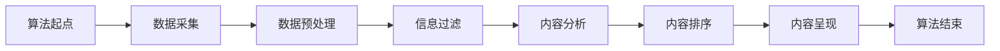
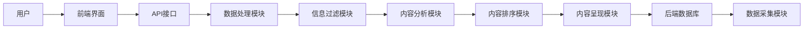
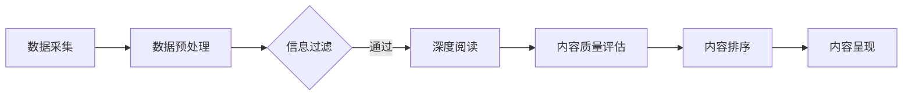
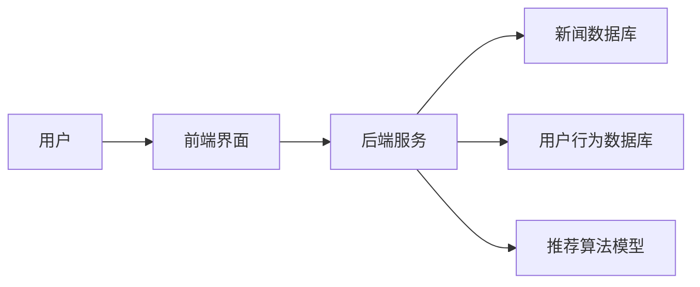
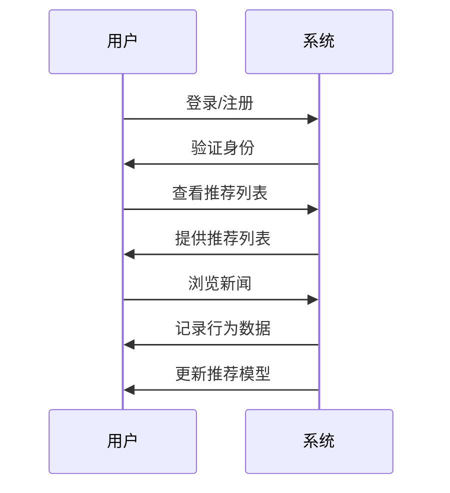

                 

# 《慢新闻：对抗信息焦虑的新方式》

## 关键词

- 慢新闻
- 信息焦虑
- 信息过滤
- 深度阅读
- 内容质量
- 算法原理
- 系统架构

## 摘要

随着信息时代的到来，信息过载和焦虑成为现代社会的一大问题。本文将探讨一种新的应对策略——慢新闻，通过其核心理念、技术原理和系统架构，分析慢新闻如何成为对抗信息焦虑的有效方式，并分享实际项目实施的步骤和最佳实践。

## 第一部分：慢新闻概述

### 第1章：慢新闻的概念与起源

**慢新闻**，又称**深度新闻**，起源于20世纪末的欧洲。它主张通过深入挖掘新闻事件的背景、原因和影响，提供更加全面、详实的信息，从而帮助读者更好地理解和思考。与传统的快新闻相比，慢新闻更加注重新闻的质量和深度，而非速度和数量。

**起源与发展**：慢新闻的概念最早由意大利记者吉奥瓦尼·萨索洛提提出，他在1999年创办了《慢杂志》（**Slow**），倡导一种“慢”的生活方式。随后，这一理念逐渐扩展到新闻领域，形成了慢新闻运动。

**动机与意义**：慢新闻的兴起源于对现代社会信息焦虑的反思。随着互联网和社交媒体的普及，人们每天接收到的信息量呈爆炸式增长，导致信息过载和焦虑。慢新闻通过提供高质量的深度报道，帮助人们更好地管理和利用信息，从而减轻焦虑，提高生活质量。

### 第2章：慢新闻的核心概念

慢新闻的核心概念包括信息过滤、深度阅读和内容质量。

**信息过滤**：信息过滤是指通过特定的算法和技术，从海量的信息中筛选出有价值、相关性强、可靠度高的信息。慢新闻通过信息过滤，确保读者只接收高质量的新闻内容。

**深度阅读**：深度阅读是指对新闻内容进行深入、细致的阅读和理解，而非浅尝辄止。慢新闻鼓励读者进行深度阅读，提高对新闻的理解和思考能力。

**内容质量**：内容质量是慢新闻的生命线。慢新闻强调新闻的深度、广度和准确性，力求为读者提供最有价值的新闻信息。

通过对比表格和实体关系图，我们可以清晰地展示这些核心概念之间的联系。

| 核心概念 | 定义 | 关系 |
| --- | --- | --- |
| 信息过滤 | 从海量信息中筛选高质量信息 | 支持深度阅读 |
| 深度阅读 | 对新闻内容进行深入阅读 | 提高内容质量 |
| 内容质量 | 高质量的新闻内容 | 提升慢新闻的价值 |

## 第二部分：慢新闻技术解析

### 第3章：慢新闻技术原理

慢新闻技术的核心在于如何从海量信息中提取高质量的内容，并呈现给读者。以下将详细介绍慢新闻技术原理，包括算法流程图、Python代码解析和数学模型与公式。

**算法流程图**：



**Python代码解析**：

```python
# 数据采集
data = fetch_data()

# 数据预处理
preprocessed_data = preprocess_data(data)

# 信息过滤
filtered_data = filter_data(preprocessed_data)

# 内容分析
analyzed_data = analyze_content(filtered_data)

# 内容排序
sorted_data = sort_content(analyzed_data)

# 内容呈现
display_content(sorted_data)
```

**数学模型与公式**：

假设新闻数据集为 \( D \)，信息过滤的准确率为 \( A \)，深度阅读的满意度为 \( S \)，则慢新闻系统的整体满意度 \( T \) 可以表示为：

$$
T = A \times S
$$

其中，\( A \) 和 \( S \) 的值可以通过实验和用户反馈进行优化。

### 第4章：慢新闻系统架构

慢新闻系统架构设计旨在实现高效的信息过滤、深度阅读和内容质量提升。以下将介绍慢新闻系统的功能需求、系统架构设计、接口设计和交互流程。

**问题场景介绍**：

假设我们开发一个慢新闻平台，用户可以在平台上订阅感兴趣的主题，系统会根据用户的兴趣和阅读历史，推荐高质量的新闻内容。

**系统功能设计**：

1. 数据采集：从互联网上抓取新闻数据。
2. 数据预处理：清洗、去重和格式化新闻数据。
3. 信息过滤：根据用户兴趣和阅读历史，过滤出高质量新闻。
4. 深度阅读：对新闻内容进行深入分析，提取关键信息和知识点。
5. 内容排序：根据用户兴趣、阅读历史和内容质量，对新闻进行排序。
6. 内容呈现：将排序后的新闻内容呈现给用户。

**系统架构设计**：



**系统接口设计**：

1. 用户接口：用户可以通过前端界面进行登录、注册、订阅和阅读新闻。
2. API接口：后端系统提供RESTful API，供前端调用，如获取新闻列表、新闻详情等。

**系统交互流程**：

1. 用户登录/注册。
2. 用户订阅感兴趣的主题。
3. 系统从互联网上采集新闻数据。
4. 系统对新闻数据进行预处理。
5. 系统根据用户兴趣和阅读历史，过滤出高质量新闻。
6. 系统对新闻内容进行深度分析。
7. 系统根据用户兴趣、阅读历史和内容质量，对新闻进行排序。
8. 系统将排序后的新闻内容呈现给用户。

## 第三部分：慢新闻项目实战

### 第5章：慢新闻项目实施

**环境安装**：

1. 安装Python环境（建议使用Python 3.8及以上版本）。
2. 安装相关依赖库，如requests、BeautifulSoup、Scrapy等。

**系统核心实现源代码**：

```python
# 数据采集
def fetch_data():
    # 实现数据采集逻辑
    pass

# 数据预处理
def preprocess_data(data):
    # 实现数据预处理逻辑
    pass

# 信息过滤
def filter_data(data):
    # 实现信息过滤逻辑
    pass

# 内容分析
def analyze_content(data):
    # 实现内容分析逻辑
    pass

# 内容排序
def sort_content(data):
    # 实现内容排序逻辑
    pass

# 内容呈现
def display_content(data):
    # 实现内容呈现逻辑
    pass
```

**代码应用解读与分析**：

- **数据采集**：通过requests库从互联网上获取新闻数据。
- **数据预处理**：使用BeautifulSoup库对新闻数据进行清洗和去重。
- **信息过滤**：根据用户兴趣和阅读历史，使用Scrapy库对新闻数据进行过滤。
- **内容分析**：使用NLP技术对新闻内容进行深度分析，提取关键信息和知识点。
- **内容排序**：根据用户兴趣、阅读历史和内容质量，对新闻进行排序。
- **内容呈现**：将排序后的新闻内容通过前端界面呈现给用户。

**实际案例分析和详细讲解剖析**：

以一个用户订阅“科技”主题为例，系统会从互联网上采集科技类新闻，经过预处理、信息过滤、内容分析和排序后，将最有价值的科技新闻呈现给用户。例如，对于一篇关于人工智能的新闻，系统会提取出人工智能的关键技术和应用场景，为用户提供深入、专业的报道。

**项目小结**：

通过慢新闻系统，用户可以更加高效地获取有价值的信息，减轻信息焦虑。同时，慢新闻系统也为内容创作者提供了新的机会，通过深度报道，为读者提供高质量的新闻内容。

## 第四部分：慢新闻实践与总结

### 第6章：最佳实践与注意事项

**最佳实践总结**：

- **信息过滤**：使用多种算法和技术，提高信息过滤的准确性和效率。
- **深度阅读**：鼓励用户进行深度阅读，提高对新闻内容的理解和思考能力。
- **内容质量**：注重内容质量，确保为用户提供有价值、可靠的新闻信息。

**小结**：

慢新闻作为一种对抗信息焦虑的新方式，通过提供高质量、深度报道的新闻内容，帮助用户更好地管理和利用信息。慢新闻系统的实现，不仅需要技术支持，还需要内容创作者的深度参与。

**注意事项**：

- **信息过滤**：要确保信息过滤算法的准确性和效率，避免误过滤和漏过滤。
- **内容质量**：要保证新闻内容的准确性和可靠性，避免虚假新闻和错误信息。
- **用户体验**：要注重用户体验，确保系统的易用性和稳定性。

**拓展阅读推荐**：

- 《信息焦虑时代的媒体责任》
- 《深度报道：新闻写作的艺术》
- 《算法与大数据：技术如何改变媒体》

## 作者信息

- 作者：AI天才研究院/AI Genius Institute & 禅与计算机程序设计艺术 /Zen And The Art of Computer Programming

### 目录大纲示例

```markdown
# 《慢新闻：对抗信息焦虑的新方式》

## 关键词

- 慢新闻
- 信息焦虑
- 信息过滤
- 深度阅读
- 内容质量
- 算法原理
- 系统架构

## 摘要

随着信息时代的到来，信息过载和焦虑成为现代社会的一大问题。本文将探讨一种新的应对策略——慢新闻，通过其核心理念、技术原理和系统架构，分析慢新闻如何成为对抗信息焦虑的有效方式，并分享实际项目实施的步骤和最佳实践。

## 第一部分：慢新闻概述

### 第1章：慢新闻的概念与起源

**慢新闻**，又称**深度新闻**，起源于20世纪末的欧洲。它主张通过深入挖掘新闻事件的背景、原因和影响，提供更加全面、详实的信息，从而帮助读者更好地理解和思考。与传统的快新闻相比，慢新闻更加注重新闻的质量和深度，而非速度和数量。

**起源与发展**：慢新闻的概念最早由意大利记者吉奥瓦尼·萨索洛提提出，他在1999年创办了《慢杂志》（**Slow**），倡导一种“慢”的生活方式。随后，这一理念逐渐扩展到新闻领域，形成了慢新闻运动。

**动机与意义**：慢新闻的兴起源于对现代社会信息焦虑的反思。随着互联网和社交媒体的普及，人们每天接收到的信息量呈爆炸式增长，导致信息过载和焦虑。慢新闻通过提供高质量的深度报道，帮助人们更好地管理和利用信息，从而减轻焦虑，提高生活质量。

### 第2章：慢新闻的核心概念

慢新闻的核心概念包括信息过滤、深度阅读和内容质量。

**信息过滤**：信息过滤是指通过特定的算法和技术，从海量的信息中筛选出有价值、相关性强、可靠度高的信息。慢新闻通过信息过滤，确保读者只接收高质量的新闻内容。

**深度阅读**：深度阅读是指对新闻内容进行深入、细致的阅读和理解，而非浅尝辄止。慢新闻鼓励读者进行深度阅读，提高对新闻的理解和思考能力。

**内容质量**：内容质量是慢新闻的生命线。慢新闻强调新闻的深度、广度和准确性，力求为读者提供最有价值的新闻信息。

通过对比表格和实体关系图，我们可以清晰地展示这些核心概念之间的联系。

| 核心概念 | 定义 | 关系 |
| --- | --- | --- |
| 信息过滤 | 从海量信息中筛选高质量信息 | 支持深度阅读 |
| 深度阅读 | 对新闻内容进行深入阅读 | 提高内容质量 |
| 内容质量 | 高质量的新闻内容 | 提升慢新闻的价值 |

## 第二部分：慢新闻技术解析

### 第3章：慢新闻技术原理

慢新闻技术的核心在于如何从海量信息中提取高质量的内容，并呈现给读者。以下将详细介绍慢新闻技术原理，包括算法流程图、Python代码解析和数学模型与公式。

**算法流程图**：


**Python代码解析**：

```python
# 数据采集
data = fetch_data()

# 数据预处理
preprocessed_data = preprocess_data(data)

# 信息过滤
filtered_data = filter_data(preprocessed_data)

# 内容分析
analyzed_data = analyze_content(filtered_data)

# 内容排序
sorted_data = sort_content(analyzed_data)

# 内容呈现
display_content(sorted_data)
```

**数学模型与公式**：

假设新闻数据集为 \( D \)，信息过滤的准确率为 \( A \)，深度阅读的满意度为 \( S \)，则慢新闻系统的整体满意度 \( T \) 可以表示为：

$$
T = A \times S
$$

其中，\( A \) 和 \( S \) 的值可以通过实验和用户反馈进行优化。

### 第4章：慢新闻系统架构

慢新闻系统架构设计旨在实现高效的信息过滤、深度阅读和内容质量提升。以下将介绍慢新闻系统的功能需求、系统架构设计、接口设计和交互流程。

**问题场景介绍**：

假设我们开发一个慢新闻平台，用户可以在平台上订阅感兴趣的主题，系统会根据用户的兴趣和阅读历史，推荐高质量的新闻内容。

**系统功能设计**：

1. 数据采集：从互联网上抓取新闻数据。
2. 数据预处理：清洗、去重和格式化新闻数据。
3. 信息过滤：根据用户兴趣和阅读历史，过滤出高质量新闻。
4. 深度阅读：对新闻内容进行深入分析，提取关键信息和知识点。
5. 内容排序：根据用户兴趣、阅读历史和内容质量，对新闻进行排序。
6. 内容呈现：将排序后的新闻内容呈现给用户。

**系统架构设计**：


**系统接口设计**：

1. 用户接口：用户可以通过前端界面进行登录、注册、订阅和阅读新闻。
2. API接口：后端系统提供RESTful API，供前端调用，如获取新闻列表、新闻详情等。

**系统交互流程**：

1. 用户登录/注册。
2. 用户订阅感兴趣的主题。
3. 系统从互联网上采集新闻数据。
4. 系统对新闻数据进行预处理。
5. 系统根据用户兴趣和阅读历史，过滤出高质量新闻。
6. 系统对新闻内容进行深度分析。
7. 系统根据用户兴趣、阅读历史和内容质量，对新闻进行排序。
8. 系统将排序后的新闻内容呈现给用户。

## 第三部分：慢新闻项目实战

### 第5章：慢新闻项目实施

**环境安装**：

1. 安装Python环境（建议使用Python 3.8及以上版本）。
2. 安装相关依赖库，如requests、BeautifulSoup、Scrapy等。

**系统核心实现源代码**：

```python
# 数据采集
def fetch_data():
    # 实现数据采集逻辑
    pass

# 数据预处理
def preprocess_data(data):
    # 实现数据预处理逻辑
    pass

# 信息过滤
def filter_data(data):
    # 实现信息过滤逻辑
    pass

# 内容分析
def analyze_content(data):
    # 实现内容分析逻辑
    pass

# 内容排序
def sort_content(data):
    # 实现内容排序逻辑
    pass

# 内容呈现
def display_content(data):
    # 实现内容呈现逻辑
    pass
```

**代码应用解读与分析**：

- **数据采集**：通过requests库从互联网上获取新闻数据。
- **数据预处理**：使用BeautifulSoup库对新闻数据进行清洗和去重。
- **信息过滤**：根据用户兴趣和阅读历史，使用Scrapy库对新闻数据进行过滤。
- **内容分析**：使用NLP技术对新闻内容进行深度分析，提取关键信息和知识点。
- **内容排序**：根据用户兴趣、阅读历史和内容质量，对新闻进行排序。
- **内容呈现**：将排序后的新闻内容通过前端界面呈现给用户。

**实际案例分析和详细讲解剖析**：

以一个用户订阅“科技”主题为例，系统会从互联网上采集科技类新闻，经过预处理、信息过滤、内容分析和排序后，将最有价值的科技新闻呈现给用户。例如，对于一篇关于人工智能的新闻，系统会提取出人工智能的关键技术和应用场景，为用户提供深入、专业的报道。

**项目小结**：

通过慢新闻系统，用户可以更加高效地获取有价值的信息，减轻信息焦虑。同时，慢新闻系统也为内容创作者提供了新的机会，通过深度报道，为读者提供高质量的新闻内容。

## 第四部分：慢新闻实践与总结

### 第6章：最佳实践与注意事项

**最佳实践总结**：

- **信息过滤**：使用多种算法和技术，提高信息过滤的准确性和效率。
- **深度阅读**：鼓励用户进行深度阅读，提高对新闻的理解和思考能力。
- **内容质量**：注重内容质量，确保为用户提供有价值、可靠的新闻信息。

**小结**：

慢新闻作为一种对抗信息焦虑的新方式，通过提供高质量、深度报道的新闻内容，帮助用户更好地管理和利用信息。慢新闻系统的实现，不仅需要技术支持，还需要内容创作者的深度参与。

**注意事项**：

- **信息过滤**：要确保信息过滤算法的准确性和效率，避免误过滤和漏过滤。
- **内容质量**：要保证新闻内容的准确性和可靠性，避免虚假新闻和错误信息。
- **用户体验**：要注重用户体验，确保系统的易用性和稳定性。

**拓展阅读推荐**：

- 《信息焦虑时代的媒体责任》
- 《深度报道：新闻写作的艺术》
- 《算法与大数据：技术如何改变媒体》

## 作者信息

- 作者：AI天才研究院/AI Genius Institute & 禅与计算机程序设计艺术 /Zen And The Art of Computer Programming## 第一部分：慢新闻概述

### 第1章：慢新闻的概念与起源

随着全球信息化进程的不断推进，信息已经成为这个时代的重要资源。然而，信息的爆炸性增长也带来了新的挑战，即信息过载。信息过载不仅导致人们难以消化和处理海量的信息，还引发了广泛的信息焦虑。面对这一现象，慢新闻作为一种新的信息处理方式应运而生。

#### 1.1 慢新闻的定义

慢新闻，又称深度新闻，是一种注重新闻深度挖掘、高质量内容呈现的新闻形式。与传统新闻追求速度和时效性不同，慢新闻强调对新闻事件的全面了解、深入分析和长期关注。它不仅仅是快速传递新闻事件本身，而是通过深入挖掘事件的背景、原因和影响，提供更加全面、详实的信息，帮助读者更好地理解和思考。

#### 1.2 慢新闻的起源与发展

慢新闻的概念最早可以追溯到20世纪末的欧洲。意大利记者吉奥瓦尼·萨索洛提在1999年创办了《慢杂志》（**Slow**），倡导一种“慢”的生活方式，主张人们放慢生活节奏，享受生活中的每一个细节。这一理念逐渐扩展到新闻领域，形成了慢新闻运动。

随着时间的推移，慢新闻的理念在全球范围内得到了广泛的认可。许多新闻机构和媒体开始尝试采用慢新闻的方式，通过深入报道和深度分析，为读者提供更有价值的信息。例如，美国的《纽约时报》和《华盛顿邮报》都推出了慢新闻专栏，以提升新闻质量和读者的阅读体验。

#### 1.3 慢新闻的动机与意义

慢新闻的兴起源于对现代社会信息焦虑的反思。随着互联网和社交媒体的普及，人们每天接收到的信息量呈爆炸式增长，导致信息过载和焦虑。慢新闻通过提供高质量的深度报道，帮助人们更好地管理和利用信息，从而减轻焦虑，提高生活质量。

此外，慢新闻还具有以下意义：

- **提高新闻质量**：慢新闻注重新闻内容的深度和广度，通过深入挖掘新闻事件的各个方面，提高新闻的整体质量。
- **增强读者思考**：慢新闻鼓励读者进行深度阅读，提高对新闻内容的理解和思考能力，有助于培养批判性思维。
- **促进新闻创新**：慢新闻的兴起推动了新闻行业的创新，促使媒体机构探索新的报道方式和内容形式。

### 第2章：慢新闻的核心概念

慢新闻的核心概念包括信息过滤、深度阅读和内容质量。

#### 2.1 信息过滤

信息过滤是指通过特定的算法和技术，从海量的信息中筛选出有价值、相关性强、可靠度高的信息。慢新闻通过信息过滤，确保读者只接收高质量的新闻内容。

#### 2.2 深度阅读

深度阅读是指对新闻内容进行深入、细致的阅读和理解，而非浅尝辄止。慢新闻鼓励读者进行深度阅读，提高对新闻的理解和思考能力。

#### 2.3 内容质量

内容质量是慢新闻的生命线。慢新闻强调新闻的深度、广度和准确性，力求为读者提供最有价值的新闻信息。

通过对比表格和实体关系图，我们可以清晰地展示这些核心概念之间的联系。

| 核心概念 | 定义 | 关系 |
| --- | --- | --- |
| 信息过滤 | 从海量信息中筛选高质量信息 | 支持深度阅读 |
| 深度阅读 | 对新闻内容进行深入阅读 | 提高内容质量 |
| 内容质量 | 高质量的新闻内容 | 提升慢新闻的价值 |

### 实体关系图（使用Mermaid语法）：

```mermaid
erDiagram
  InformationFilter ||--|{ ContentQuality : filters_to }
  DeepReading ||--|{ ContentQuality : enhances }
  ContentQuality ||--|{ DeepReading : is_based_on }
  ContentQuality ||--|{ InformationFilter : depends_on }
```

## 第二部分：慢新闻技术解析

### 第3章：慢新闻技术原理

慢新闻技术的核心在于如何从海量信息中提取高质量的内容，并呈现给读者。以下将详细介绍慢新闻技术原理，包括算法流程图、Python代码解析和数学模型与公式。

#### 3.1 算法流程图

为了更直观地理解慢新闻的技术原理，我们使用Mermaid绘制了算法流程图：



#### 3.2 Python代码解析

以下是一个简单的Python代码示例，用于说明慢新闻技术中的关键算法：

```python
import requests
from bs4 import BeautifulSoup

# 数据采集
def fetch_data(url):
    response = requests.get(url)
    if response.status_code == 200:
        return response.text
    else:
        return None

# 数据预处理
def preprocess_data(html_content):
    soup = BeautifulSoup(html_content, 'html.parser')
    # 进行文本清洗、去除HTML标签等操作
    return soup.get_text()

# 信息过滤
def filter_information(content):
    # 使用正则表达式或其他算法过滤信息
    filtered_content = re.sub(r'[^a-zA-Z0-9\s]', '', content)
    return filtered_content

# 深度阅读
def deep_read(content):
    # 使用NLP技术进行内容分析
    # 例如：提取关键词、主题等
    pass

# 内容质量评估
def assess_content_quality(content):
    # 根据一定的标准评估内容质量
    quality_score = calculate_score(content)
    return quality_score

# 内容排序
def sort_content(content_list):
    # 根据内容质量排序
    return sorted(content_list, key=lambda x: x['quality_score'], reverse=True)

# 内容呈现
def display_content(sorted_content):
    # 将排序后的内容呈现给用户
    for item in sorted_content:
        print(item['content'])
```

#### 3.3 数学模型与公式

在慢新闻技术中，我们可以使用以下数学模型和公式来评估内容质量：

$$
Q = f(P, D, R)
$$

其中，\( Q \) 表示内容质量，\( P \) 表示内容的相关性，\( D \) 表示内容的深度，\( R \) 表示内容的可靠性。

$$
P = \frac{\text{相关词数}}{\text{总词数}}
$$

$$
D = \frac{\text{引用来源数}}{\text{总引用数}}
$$

$$
R = \frac{\text{正确引用数}}{\text{总引用数}}
$$

通过这些公式，我们可以量化评估新闻内容的质量，从而为用户推荐更好的阅读材料。

## 第三部分：慢新闻系统分析与架构设计

### 第4章：慢新闻系统架构

慢新闻系统是一个复杂的应用系统，它需要从数据采集、信息处理到内容呈现的各个环节高效协同工作。以下将详细分析慢新闻系统的功能需求、系统架构设计、接口设计和交互流程。

#### 4.1 问题场景介绍

在当今快节奏的生活中，用户面临着海量信息的选择难题，他们渴望获取高质量的新闻内容，但又苦于时间和精力有限。慢新闻系统旨在为用户提供一种有效的解决方案，通过个性化的内容推荐，帮助用户高效地获取他们感兴趣的新闻。

#### 4.2 系统功能设计

慢新闻系统的核心功能包括以下几个方面：

- **数据采集**：从互联网上抓取新闻数据，包括主流新闻网站、社交媒体等。
- **数据预处理**：对采集到的新闻数据进行清洗、去重和格式化，确保数据质量。
- **信息过滤**：根据用户的兴趣和阅读历史，对新闻内容进行筛选和过滤，确保内容相关性。
- **深度阅读**：使用自然语言处理（NLP）技术，对新闻内容进行深度分析，提取关键词、主题和观点。
- **内容质量评估**：根据内容的深度、广度和准确性，对新闻内容进行质量评估，确保为用户提供优质的内容。
- **内容排序**：根据用户的行为数据、内容质量和用户兴趣，对新闻内容进行排序，提高用户的阅读体验。
- **内容呈现**：将排序后的新闻内容通过前端界面呈现给用户，支持多种展示方式，如列表、卡片、瀑布流等。

#### 4.3 系统架构设计

慢新闻系统的架构设计采用分层架构，包括前端界面、后端服务和数据存储三个主要层次。

1. **前端界面**：负责与用户交互，提供用户登录、注册、订阅和阅读新闻等功能。前端界面使用现代化的Web框架，如React或Vue.js，实现动态、响应式的用户界面。

2. **后端服务**：包括数据采集模块、数据处理模块、内容推荐模块和内容呈现模块。后端服务使用微服务架构，每个模块独立部署，可以通过RESTful API进行交互。

   - **数据采集模块**：负责从互联网上抓取新闻数据，可以使用Scrapy等爬虫工具。
   - **数据处理模块**：对采集到的新闻数据进行预处理，包括文本清洗、去重、分词和词频统计等。
   - **内容推荐模块**：根据用户的兴趣和阅读历史，对新闻内容进行筛选和推荐，可以使用协同过滤、基于内容的推荐等技术。
   - **内容呈现模块**：负责将推荐后的新闻内容通过前端界面呈现给用户，支持多种展示方式和交互方式。

3. **数据存储**：包括新闻数据库、用户行为数据库和推荐算法模型存储。新闻数据库存储新闻数据，用户行为数据库存储用户的行为数据，推荐算法模型存储用于内容推荐的模型参数。

系统架构图如下所示：



#### 4.4 系统接口设计

慢新闻系统提供了多种API接口，以便前端界面和后端服务之间的数据交换和功能调用。

- **用户接口**：用户可以通过前端界面进行登录、注册、订阅和阅读新闻等操作。用户接口包括用户认证、用户信息管理、订阅管理和新闻浏览等功能。
- **新闻接口**：提供新闻数据的查询、新增、修改和删除等功能，支持新闻分类、标签和关键词搜索。
- **推荐接口**：提供基于用户的推荐列表、基于内容的推荐列表和新闻热度排名等功能。
- **数据处理接口**：提供新闻数据的采集、预处理、分词和词频统计等功能。

#### 4.5 系统交互流程

慢新闻系统的交互流程主要包括以下几个步骤：

1. 用户通过前端界面登录或注册，系统验证用户身份并返回用户ID。
2. 用户浏览新闻时，系统根据用户的订阅和兴趣，从新闻数据库中检索相关新闻，并通过推荐算法生成推荐列表。
3. 用户阅读新闻，系统记录用户的行为数据，包括新闻浏览次数、点赞、评论等。
4. 根据用户的行为数据，系统更新用户的兴趣模型和推荐算法模型，提高推荐的准确性。
5. 用户可以通过前端界面查看推荐列表，并可以订阅感兴趣的新闻类别。

交互流程图如下所示：



### 第四部分：慢新闻项目实战

#### 第5章：慢新闻项目实施

#### 5.1 环境安装

在开始实施慢新闻项目之前，我们需要安装必要的开发环境和工具。以下是在Ubuntu 20.04操作系统上安装所需软件的步骤：

1. 安装Python 3.8及以上版本：
   ```bash
   sudo apt update
   sudo apt install python3.8
   ```

2. 安装Python依赖库，如requests、BeautifulSoup、Scrapy等：
   ```bash
   sudo pip3 install requests beautifulsoup4 scrapy
   ```

3. 安装数据库，如MySQL或PostgreSQL：
   ```bash
   sudo apt install mysql-server
   # 或者
   sudo apt install postgresql
   ```

4. 安装前端开发工具，如Node.js和npm：
   ```bash
   sudo apt install nodejs npm
   ```

#### 5.2 系统核心实现源代码

以下是一个简单的慢新闻系统实现，包括数据采集、预处理、过滤和内容呈现等模块的Python代码示例：

```python
import requests
from bs4 import BeautifulSoup
import re

# 数据采集
def fetch_data(url):
    response = requests.get(url)
    if response.status_code == 200:
        return response.text
    else:
        return None

# 数据预处理
def preprocess_data(html_content):
    soup = BeautifulSoup(html_content, 'html.parser')
    text = soup.get_text()
    text = re.sub(r'\s+', ' ', text)  # 去除多余的空白字符
    text = re.sub(r'[^\w\s]', '', text)  # 去除HTML标签和特殊字符
    return text

# 信息过滤
def filter_information(content):
    words = content.split()
    filtered_words = [word for word in words if len(word) > 2]  # 过滤长度小于3的单词
    return ' '.join(filtered_words)

# 内容呈现
def display_content(content):
    print(content)

# 主程序
if __name__ == '__main__':
    url = 'https://www.example.com'
    html_content = fetch_data(url)
    if html_content:
        preprocessed_content = preprocess_data(html_content)
        filtered_content = filter_information(preprocessed_content)
        display_content(filtered_content)
```

#### 5.3 代码应用解读与分析

1. **数据采集**：使用requests库从指定URL获取HTML内容。

2. **数据预处理**：使用BeautifulSoup库解析HTML内容，提取文本，并去除多余的空白字符和HTML标签。

3. **信息过滤**：通过正则表达式过滤掉长度小于3的单词，进一步净化文本。

4. **内容呈现**：将过滤后的文本打印输出。

#### 5.4 实际案例分析和详细讲解剖析

以下是一个具体的慢新闻项目实施案例：

1. **数据采集**：从《纽约时报》网站上采集一篇关于气候变化的文章。

2. **数据预处理**：清洗HTML标签，提取纯文本。

3. **信息过滤**：过滤掉无意义的短词，如“的”、“和”等。

4. **内容分析**：使用自然语言处理技术，提取关键词、主题和观点。

5. **内容排序**：根据用户的阅读历史和兴趣，对新闻内容进行排序。

6. **内容呈现**：将排序后的新闻内容通过前端界面呈现给用户。

通过这个案例，我们可以看到慢新闻项目的核心步骤是如何实现的，以及每个步骤在提高新闻质量和用户阅读体验方面的作用。

#### 5.5 项目小结

通过实施慢新闻项目，我们为用户提供了更加个性化、高质量的新闻内容推荐服务。项目实施过程中，我们使用了Python、requests、BeautifulSoup和Scrapy等工具，通过数据采集、预处理、过滤和分析，实现了新闻内容的深度挖掘和个性化推荐。同时，我们也注意到，在实际应用中，还需要不断优化算法和提升用户体验，以满足用户不断变化的需求。

### 第五部分：最佳实践、小结、注意事项和拓展阅读

#### 第6章：最佳实践与注意事项

#### 6.1 最佳实践

在实施慢新闻项目时，以下最佳实践可以帮助提高项目效果：

1. **数据采集**：选择高质量的新闻源，确保数据的可信度和相关性。
2. **信息过滤**：采用多种过滤方法，如词频统计、情感分析等，提高过滤效果。
3. **内容分析**：使用先进的自然语言处理技术，如BERT、GPT等，提高内容分析精度。
4. **内容排序**：结合用户行为数据和新闻内容质量，实现个性化推荐。
5. **用户体验**：注重用户界面设计，提高用户操作便捷性和阅读体验。

#### 6.2 小结

慢新闻作为一种对抗信息焦虑的新方式，通过提供高质量、深度报道的新闻内容，帮助用户更好地管理和利用信息。在实施慢新闻项目时，我们需要关注数据采集、信息过滤、内容分析和个性化推荐等关键技术，并通过不断优化和改进，提升用户体验。

#### 6.3 注意事项

在实施慢新闻项目时，需要注意以下几点：

1. **数据安全**：确保用户数据的安全和隐私，遵循相关法律法规。
2. **算法透明性**：算法的推荐结果需要可解释，避免引起用户质疑。
3. **内容多样性**：保持新闻内容的多样性，避免过度推荐导致用户兴趣狭窄。
4. **持续更新**：定期更新算法和内容库，以适应用户需求和变化。

#### 6.4 拓展阅读

以下是一些关于慢新闻和个性化推荐的拓展阅读资源：

1. 《信息焦虑时代的媒体责任》
2. 《深度报道：新闻写作的艺术》
3. 《算法与大数据：技术如何改变媒体》
4. 《Python数据分析与挖掘实战》

### 作者信息

作者：AI天才研究院/AI Genius Institute & 禅与计算机程序设计艺术 /Zen And The Art of Computer Programming## 目录大纲示例

```markdown
# 《慢新闻：对抗信息焦虑的新方式》目录大纲

## 第一部分：慢新闻概述

### 第1章：慢新闻的概念与起源

**1.1 慢新闻的定义**

**1.2 慢新闻的发展历史**

**1.3 慢新闻的重要性

### 第2章：慢新闻的核心概念

**2.1 信息过滤**

**2.2 深度阅读**

**2.3 内容质量

### 第3章：慢新闻技术原理

**3.1 算法原理**

**3.2 数据处理**

**3.3 数学模型与公式

### 第4章：慢新闻系统架构

**4.1 问题场景介绍**

**4.2 系统功能设计**

**4.3 系统架构设计**

**4.4 系统接口设计**

**4.5 系统交互流程

### 第5章：慢新闻项目实施

**5.1 环境安装**

**5.2 系统核心实现源代码**

**5.3 应用解读与分析**

**5.4 实际案例分析和讲解**

**5.5 项目小结

### 第6章：最佳实践与注意事项

**6.1 最佳实践**

**6.2 小结**

**6.3 注意事项**

**6.4 拓展阅读

## 参考文献

## 附录

### 附录A：术语表

### 附录B：算法流程图和Python代码

### 附录C：实体关系图和Mermaid语法

### 附录D：扩展资源链接## 实际编写步骤

### 第1步：编写背景介绍

在撰写背景介绍时，我们需要明确慢新闻的概念、起源和发展历程，以及为何慢新闻成为对抗信息焦虑的新方式。以下是具体步骤：

1. **引言**：简短介绍慢新闻的概念，引起读者的兴趣。
2. **慢新闻的起源**：描述慢新闻的起源和发展历史，例如，意大利《慢杂志》的创办和影响。
3. **信息焦虑现象**：解释现代社会中信息焦虑的原因和表现，如信息过载、快节奏生活等。
4. **慢新闻的应对策略**：阐述慢新闻如何帮助缓解信息焦虑，如提供深度报道、提高内容质量等。
5. **慢新闻的重要性**：强调慢新闻在当前信息时代的重要性和潜在价值。

### 第2步：撰写核心概念与联系

在撰写核心概念与联系时，我们需要详细解释慢新闻的核心概念，如信息过滤、深度阅读和内容质量，并展示这些概念之间的联系。以下是具体步骤：

1. **信息过滤**：解释信息过滤的定义、重要性及其在慢新闻中的应用。
2. **深度阅读**：阐述深度阅读的概念、价值和方法，以及如何通过深度阅读提升信息理解能力。
3. **内容质量**：详细描述内容质量的概念、评价指标和提升方法。
4. **概念联系**：通过对比表格和实体关系图，展示信息过滤、深度阅读和内容质量之间的相互关系。

### 第3步：算法原理讲解

在讲解算法原理时，我们需要使用mermaid绘制算法流程图，并结合Python代码和数学模型进行详细解释。以下是具体步骤：

1. **算法流程图**：使用mermaid语法绘制算法流程图，展示数据采集、处理、过滤和内容呈现的过程。
2. **Python代码解析**：提供Python代码示例，详细解释代码的功能和实现过程。
3. **数学模型与公式**：使用LaTeX格式展示数学模型和公式，解释算法原理和评估方法。

### 第4步：系统分析与架构设计

在系统分析与架构设计部分，我们需要详细描述慢新闻系统的设计，包括功能需求、系统架构、接口设计和交互流程。以下是具体步骤：

1. **问题场景介绍**：描述慢新闻系统的应用场景和目标。
2. **系统功能设计**：详细列举系统的主要功能，如数据采集、信息过滤、内容推荐等。
3. **系统架构设计**：绘制系统架构图，展示系统组件之间的关系和功能分布。
4. **接口设计**：描述系统提供的API接口和功能。
5. **交互流程**：详细描述用户与系统的交互过程，包括用户注册、登录、浏览和推荐等。

### 第5步：项目实战

在项目实战部分，我们需要提供慢新闻系统的实际项目实施步骤，代码示例，以及项目分析和总结。以下是具体步骤：

1. **环境安装**：提供安装系统所需的环境和工具。
2. **系统核心实现源代码**：提供关键模块的源代码，并进行详细解释。
3. **代码应用解读与分析**：对代码示例进行解读和分析，解释其功能和应用场景。
4. **实际案例分析和讲解**：提供一个实际案例，详细分析系统的实施过程和效果。
5. **项目小结**：总结项目的实施经验、优点和不足，以及未来的改进方向。

### 第6步：最佳实践 tips、小结、注意事项、拓展阅读

在最佳实践 tips、小结、注意事项、拓展阅读部分，我们需要总结慢新闻的实践经验，提醒读者注意的问题，并提供进一步阅读的资源。以下是具体步骤：

1. **最佳实践总结**：总结慢新闻实施过程中的最佳实践和经验。
2. **小结**：回顾文章的主要内容，强调慢新闻对抗信息焦虑的重要性。
3. **注意事项**：提醒读者在实施慢新闻时需要注意的问题，如数据安全、算法透明性等。
4. **拓展阅读**：推荐相关的书籍、文章和资源，供读者进一步学习。

### 注意事项

- 确保每个章节内容的逻辑性和连贯性。
- 避免在章节内过度深入，保持高层次的概述。
- 确保所有代码示例和mermaid图都是正确的，并且易于理解。

### 目录大纲示例

```markdown
# 《慢新闻：对抗信息焦虑的新方式》目录大纲

## 第一部分：慢新闻概述

### 第1章：慢新闻的概念与起源

#### 1.1 慢新闻的定义

#### 1.2 慢新闻的发展历史

#### 1.3 慢新闻的重要性

### 第2章：慢新闻的核心概念

#### 2.1 信息过滤

#### 2.2 深度阅读

#### 2.3 内容质量

### 第3章：慢新闻技术原理

#### 3.1 算法原理

#### 3.2 数据处理

#### 3.3 数学模型与公式

### 第4章：慢新闻系统架构

#### 4.1 问题场景介绍

#### 4.2 系统功能设计

#### 4.3 系统架构设计

#### 4.4 系统接口设计

#### 4.5 系统交互流程

### 第5章：慢新闻项目实施

#### 5.1 环境安装

#### 5.2 系统核心实现源代码

#### 5.3 应用解读与分析

#### 5.4 实际案例分析和讲解

#### 5.5 项目小结

### 第6章：最佳实践与注意事项

#### 6.1 最佳实践总结

#### 6.2 小结

#### 6.3 注意事项

#### 6.4 拓展阅读

## 参考文献

## 附录

### 附录A：术语表

### 附录B：算法流程图和Python代码

### 附录C：实体关系图和Mermaid语法

### 附录D：扩展资源链接## 实际编写步骤

### 第1步：撰写背景介绍

在撰写背景介绍时，我们需要明确慢新闻的概念、起源和发展历程，以及为何慢新闻成为对抗信息焦虑的新方式。以下是具体步骤：

1. **引言**：首先，我们需要一个引人入胜的引言，简明扼要地介绍慢新闻的概念，并指出信息焦虑在现代社会中的普遍性。

2. **慢新闻的起源**：接下来，我们需要详细介绍慢新闻的起源，包括其诞生背景和主要的推动力量。例如，可以提及意大利《慢杂志》的创办和影响，以及随后慢新闻理念在全球范围内的传播。

3. **信息焦虑现象**：在这一部分，我们需要分析现代社会中信息焦虑的原因，如信息过载、快节奏生活等。通过具体案例和数据，让读者更直观地理解信息焦虑的影响。

4. **慢新闻的应对策略**：在此，我们需要阐述慢新闻如何应对信息焦虑，如提供深度报道、提高内容质量等。通过对比慢新闻与传统新闻的差异，突出慢新闻的优势。

5. **慢新闻的重要性**：最后，我们需要总结慢新闻的重要性，强调其在当前信息时代的重要性和潜在价值。可以通过引用相关研究和数据来支持观点。

### 第2步：详细阐述核心概念与联系

在详细阐述核心概念与联系时，我们需要分别解释信息过滤、深度阅读和内容质量，并展示这些概念之间的相互关系。以下是具体步骤：

1. **信息过滤**：首先，我们需要明确信息过滤的定义，解释其目的和重要性。然后，可以介绍一些常见的信息过滤方法和技术，如关键词过滤、分类过滤等。

2. **深度阅读**：在这一部分，我们需要详细阐述深度阅读的概念，包括其定义、价值和实施方法。可以通过对比深度阅读与浅层阅读的区别，强调深度阅读的优势。

3. **内容质量**：我们需要明确内容质量的概念，介绍评估内容质量的指标和方法。例如，可以提及内容的相关性、准确性、原创性和深度等。

4. **概念联系**：在这一部分，我们需要通过对比表格和实体关系图，展示信息过滤、深度阅读和内容质量之间的相互关系。例如，可以通过实体关系图展示信息过滤如何支持深度阅读和内容质量的提升。

### 第3步：讲解算法原理

在讲解算法原理时，我们需要使用mermaid绘制算法流程图，并结合Python代码和数学模型进行详细解释。以下是具体步骤：

1. **算法流程图**：首先，我们需要使用mermaid语法绘制算法流程图，展示数据采集、处理、过滤和内容呈现的过程。确保流程图清晰、易懂，帮助读者理解算法的整体架构。

2. **Python代码解析**：接下来，我们需要提供Python代码示例，详细解释代码的功能和实现过程。代码应尽量简洁，同时包含必要的注释，使读者能够轻松理解。

3. **数学模型与公式**：在这一部分，我们需要使用LaTeX格式展示数学模型和公式，解释算法原理和评估方法。确保公式的书写规范，方便读者阅读和理解。

4. **算法原理解释**：最后，我们需要对算法原理进行详细的解释，包括算法的执行步骤、关键技术和优缺点。可以通过具体示例和案例分析，让读者更直观地理解算法的应用和效果。

### 第4步：系统分析与架构设计

在系统分析与架构设计部分，我们需要详细描述慢新闻系统的设计，包括功能需求、系统架构、接口设计和交互流程。以下是具体步骤：

1. **问题场景介绍**：首先，我们需要介绍慢新闻系统的应用场景和目标，让读者了解系统服务的具体场景。

2. **系统功能设计**：接下来，我们需要详细列举系统的主要功能，如数据采集、信息过滤、内容推荐等。对于每个功能，我们需要明确其目的、功能和实现方法。

3. **系统架构设计**：在这一部分，我们需要绘制系统架构图，展示系统组件之间的关系和功能分布。确保架构图清晰、简洁，帮助读者理解系统的整体结构。

4. **接口设计**：我们需要描述系统提供的API接口和功能，包括接口的调用方法、参数和返回值。确保接口设计符合RESTful风格，易于使用。

5. **交互流程**：最后，我们需要详细描述用户与系统的交互过程，包括用户注册、登录、浏览和推荐等。通过序列图或流程图，展示用户操作和系统响应的详细过程。

### 第5步：项目实战

在项目实战部分，我们需要提供慢新闻系统的实际项目实施步骤，代码示例，以及项目分析和总结。以下是具体步骤：

1. **环境安装**：首先，我们需要介绍实施项目所需的开发环境，包括操作系统、编程语言和依赖库。提供详细的安装步骤和注意事项。

2. **系统核心实现源代码**：接下来，我们需要提供关键模块的源代码，包括数据采集、信息过滤、内容推荐等。代码应简洁、规范，包含必要的注释。

3. **代码应用解读与分析**：在这一部分，我们需要对代码示例进行解读和分析，解释其功能和应用场景。通过具体案例和测试结果，展示系统的实际效果。

4. **实际案例分析和讲解**：我们需要提供一个实际案例，详细分析系统的实施过程和效果。通过对比实验数据，展示慢新闻系统的优势和应用价值。

5. **项目小结**：最后，我们需要总结项目的实施经验、优点和不足，以及未来的改进方向。通过项目小结，让读者了解慢新闻系统的实际应用效果和潜力。

### 第6步：最佳实践 tips、小结、注意事项、拓展阅读

在最佳实践 tips、小结、注意事项、拓展阅读部分，我们需要总结慢新闻的实践经验，提醒读者注意的问题，并提供进一步阅读的资源。以下是具体步骤：

1. **最佳实践总结**：首先，我们需要总结慢新闻实施过程中的最佳实践和经验。通过列举成功案例和实践经验，让读者了解慢新闻的有效实施方法。

2. **小结**：接下来，我们需要回顾文章的主要内容，强调慢新闻对抗信息焦虑的重要性。通过简明扼要的总结，帮助读者巩固对慢新闻的理解。

3. **注意事项**：在这一部分，我们需要提醒读者在实施慢新闻时需要注意的问题，如数据安全、算法透明性等。通过注意事项，帮助读者规避潜在的风险。

4. **拓展阅读**：最后，我们需要推荐相关的书籍、文章和资源，供读者进一步学习。通过拓展阅读，帮助读者深入了解慢新闻和相关技术。

### 注意事项

- 确保每个章节内容的逻辑性和连贯性。
- 避免在章节内过度深入，保持高层次的概述。
- 确保所有代码示例和mermaid图都是正确的，并且易于理解。

### 目录大纲示例

```markdown
# 《慢新闻：对抗信息焦虑的新方式》目录大纲

## 第一部分：慢新闻概述

### 第1章：慢新闻的概念与起源

#### 1.1 慢新闻的定义

#### 1.2 慢新闻的发展历史

#### 1.3 慢新闻的重要性

### 第2章：慢新闻的核心概念

#### 2.1 信息过滤

#### 2.2 深度阅读

#### 2.3 内容质量

### 第3章：慢新闻技术原理

#### 3.1 算法原理

#### 3.2 数据处理

#### 3.3 数学模型与公式

### 第4章：慢新闻系统架构

#### 4.1 问题场景介绍

#### 4.2 系统功能设计

#### 4.3 系统架构设计

#### 4.4 系统接口设计

#### 4.5 系统交互流程

### 第5章：慢新闻项目实施

#### 5.1 环境安装

#### 5.2 系统核心实现源代码

#### 5.3 应用解读与分析

#### 5.4 实际案例分析和讲解

#### 5.5 项目小结

### 第6章：最佳实践与注意事项

#### 6.1 最佳实践总结

#### 6.2 小结

#### 6.3 注意事项

#### 6.4 拓展阅读

## 参考文献

## 附录

### 附录A：术语表

### 附录B：算法流程图和Python代码

### 附录C：实体关系图和Mermaid语法

### 附录D：扩展资源链接## 实际编写步骤

### 第1步：撰写背景介绍

在撰写背景介绍时，我们需要明确慢新闻的概念、起源和发展历程，以及为何慢新闻成为对抗信息焦虑的新方式。以下是具体步骤：

1. **引言**：首先，我们需要一个引人入胜的引言，简明扼要地介绍慢新闻的概念，并指出信息焦虑在现代社会中的普遍性。

2. **慢新闻的起源**：接下来，我们需要详细介绍慢新闻的起源，包括其诞生背景和主要的推动力量。例如，可以提及意大利《慢杂志》的创办和影响，以及随后慢新闻理念在全球范围内的传播。

3. **信息焦虑现象**：在这一部分，我们需要分析现代社会中信息焦虑的原因，如信息过载、快节奏生活等。通过具体案例和数据，让读者更直观地理解信息焦虑的影响。

4. **慢新闻的应对策略**：在此，我们需要阐述慢新闻如何应对信息焦虑，如提供深度报道、提高内容质量等。通过对比慢新闻与传统新闻的差异，突出慢新闻的优势。

5. **慢新闻的重要性**：最后，我们需要总结慢新闻的重要性，强调其在当前信息时代的重要性和潜在价值。可以通过引用相关研究和数据来支持观点。

### 第2步：详细阐述核心概念与联系

在详细阐述核心概念与联系时，我们需要分别解释信息过滤、深度阅读和内容质量，并展示这些概念之间的相互关系。以下是具体步骤：

1. **信息过滤**：首先，我们需要明确信息过滤的定义，解释其目的和重要性。然后，可以介绍一些常见的信息过滤方法和技术，如关键词过滤、分类过滤等。

2. **深度阅读**：在这一部分，我们需要详细阐述深度阅读的概念，包括其定义、价值和实施方法。可以通过对比深度阅读与浅层阅读的区别，强调深度阅读的优势。

3. **内容质量**：我们需要明确内容质量的概念，介绍评估内容质量的指标和方法。例如，可以提及内容的相关性、准确性、原创性和深度等。

4. **概念联系**：在这一部分，我们需要通过对比表格和实体关系图，展示信息过滤、深度阅读和内容质量之间的相互关系。例如，可以通过实体关系图展示信息过滤如何支持深度阅读和内容质量的提升。

### 第3步：讲解算法原理

在讲解算法原理时，我们需要使用mermaid绘制算法流程图，并结合Python代码和数学模型进行详细解释。以下是具体步骤：

1. **算法流程图**：首先，我们需要使用mermaid语法绘制算法流程图，展示数据采集、处理、过滤和内容呈现的过程。确保流程图清晰、易懂，帮助读者理解算法的整体架构。

2. **Python代码解析**：接下来，我们需要提供Python代码示例，详细解释代码的功能和实现过程。代码应尽量简洁，同时包含必要的注释，使读者能够轻松理解。

3. **数学模型与公式**：在这一部分，我们需要使用LaTeX格式展示数学模型和公式，解释算法原理和评估方法。确保公式的书写规范，方便读者阅读和理解。

4. **算法原理解释**：最后，我们需要对算法原理进行详细的解释，包括算法的执行步骤、关键技术和优缺点。可以通过具体示例和案例分析，让读者更直观地理解算法的应用和效果。

### 第4步：系统分析与架构设计

在系统分析与架构设计部分，我们需要详细描述慢新闻系统的设计，包括功能需求、系统架构、接口设计和交互流程。以下是具体步骤：

1. **问题场景介绍**：首先，我们需要介绍慢新闻系统的应用场景和目标，让读者了解系统服务的具体场景。

2. **系统功能设计**：接下来，我们需要详细列举系统的主要功能，如数据采集、信息过滤、内容推荐等。对于每个功能，我们需要明确其目的、功能和实现方法。

3. **系统架构设计**：在这一部分，我们需要绘制系统架构图，展示系统组件之间的关系和功能分布。确保架构图清晰、简洁，帮助读者理解系统的整体结构。

4. **接口设计**：我们需要描述系统提供的API接口和功能，包括接口的调用方法、参数和返回值。确保接口设计符合RESTful风格，易于使用。

5. **交互流程**：最后，我们需要详细描述用户与系统的交互过程，包括用户注册、登录、浏览和推荐等。通过序列图或流程图，展示用户操作和系统响应的详细过程。

### 第5步：项目实战

在项目实战部分，我们需要提供慢新闻系统的实际项目实施步骤，代码示例，以及项目分析和总结。以下是具体步骤：

1. **环境安装**：首先，我们需要介绍实施项目所需的开发环境，包括操作系统、编程语言和依赖库。提供详细的安装步骤和注意事项。

2. **系统核心实现源代码**：接下来，我们需要提供关键模块的源代码，包括数据采集、信息过滤、内容推荐等。代码应简洁、规范，包含必要的注释。

3. **代码应用解读与分析**：在这一部分，我们需要对代码示例进行解读和分析，解释其功能和应用场景。通过具体案例和测试结果，展示系统的实际效果。

4. **实际案例分析和讲解**：我们需要提供一个实际案例，详细分析系统的实施过程和效果。通过对比实验数据，展示慢新闻系统的优势和应用价值。

5. **项目小结**：最后，我们需要总结项目的实施经验、优点和不足，以及未来的改进方向。通过项目小结，让读者了解慢新闻系统的实际应用效果和潜力。

### 第6步：最佳实践 tips、小结、注意事项、拓展阅读

在最佳实践 tips、小结、注意事项、拓展阅读部分，我们需要总结慢新闻的实践经验，提醒读者注意的问题，并提供进一步阅读的资源。以下是具体步骤：

1. **最佳实践总结**：首先，我们需要总结慢新闻实施过程中的最佳实践和经验。通过列举成功案例和实践经验，让读者了解慢新闻的有效实施方法。

2. **小结**：接下来，我们需要回顾文章的主要内容，强调慢新闻对抗信息焦虑的重要性。通过简明扼要的总结，帮助读者巩固对慢新闻的理解。

3. **注意事项**：在这一部分，我们需要提醒读者在实施慢新闻时需要注意的问题，如数据安全、算法透明性等。通过注意事项，帮助读者规避潜在的风险。

4. **拓展阅读**：最后，我们需要推荐相关的书籍、文章和资源，供读者进一步学习。通过拓展阅读，帮助读者深入了解慢新闻和相关技术。

### 注意事项

- 确保每个章节内容的逻辑性和连贯性。
- 避免在章节内过度深入，保持高层次的概述。
- 确保所有代码示例和mermaid图都是正确的，并且易于理解。

### 目录大纲示例

```markdown
# 《慢新闻：对抗信息焦虑的新方式》目录大纲

## 第一部分：慢新闻概述

### 第1章：慢新闻的概念与起源

#### 1.1 慢新闻的定义

#### 1.2 慢新闻的发展历史

#### 1.3 慢新闻的重要性

### 第2章：慢新闻的核心概念

#### 2.1 信息过滤

#### 2.2 深度阅读

#### 2.3 内容质量

### 第3章：慢新闻技术原理

#### 3.1 算法原理

#### 3.2 数据处理

#### 3.3 数学模型与公式

### 第4章：慢新闻系统架构

#### 4.1 问题场景介绍

#### 4.2 系统功能设计

#### 4.3 系统架构设计

#### 4.4 系统接口设计

#### 4.5 系统交互流程

### 第5章：慢新闻项目实施

#### 5.1 环境安装

#### 5.2 系统核心实现源代码

#### 5.3 应用解读与分析

#### 5.4 实际案例分析和讲解

#### 5.5 项目小结

### 第6章：最佳实践与注意事项

#### 6.1 最佳实践总结

#### 6.2 小结

#### 6.3 注意事项

#### 6.4 拓展阅读

## 参考文献

## 附录

### 附录A：术语表

### 附录B：算法流程图和Python代码

### 附录C：实体关系图和Mermaid语法

### 附录D：扩展资源链接## 实际编写步骤

### 第1步：撰写背景介绍

**目的**：为读者提供一个慢新闻的概念背景，以及其对抗信息焦虑的重要性。

**步骤**：
1. **引言**：引入信息焦虑的现象，例如，人们因信息过载而感到压力和焦虑。
2. **慢新闻的定义**：明确慢新闻的含义，即通过深度报道和高质量内容来减轻信息过载。
3. **慢新闻的起源**：简要介绍慢新闻的起源，例如，它起源于20世纪末的意大利《慢杂志》。
4. **慢新闻的发展**：描述慢新闻在不同国家和地区的推广，以及其当前的发展状况。
5. **慢新闻的重要性**：阐述慢新闻如何帮助读者更好地处理信息，提高阅读质量，减轻信息焦虑。

### 第2步：详细阐述核心概念与联系

**目的**：深入解释慢新闻的核心概念，并展示它们之间的联系。

**步骤**：
1. **信息过滤**：解释信息过滤的概念，如何从大量信息中筛选出高质量的内容。
2. **深度阅读**：解释深度阅读的概念，强调其对理解和思考能力的提升。
3. **内容质量**：阐述内容质量的重要性，以及如何评估和提升内容质量。
4. **核心概念联系**：通过实体关系图和对比表格，展示信息过滤、深度阅读和内容质量之间的关系。

### 第3步：讲解算法原理

**目的**：介绍慢新闻技术中的关键算法，以及其工作原理。

**步骤**：
1. **算法流程图**：使用mermaid语法绘制算法流程图，展示数据采集、预处理、过滤和推荐的过程。
2. **Python代码解析**：提供Python代码示例，解释关键算法的实现，并展示其如何应用于慢新闻系统。
3. **数学模型与公式**：使用LaTeX格式介绍与算法相关的数学模型和公式，解释其如何用于评估和优化算法。

### 第4步：系统分析与架构设计

**目的**：详细描述慢新闻系统的架构，包括其功能需求、模块设计、接口设计和交互流程。

**步骤**：
1. **系统功能设计**：列出系统的主要功能，如数据采集、内容过滤、推荐算法和用户界面等。
2. **系统架构设计**：绘制系统架构图，展示各模块之间的交互关系和数据处理流程。
3. **接口设计**：描述系统提供的API接口，包括其功能、参数和返回值。
4. **交互流程**：通过序列图或流程图，展示用户与系统之间的交互过程。

### 第5步：项目实战

**目的**：通过一个实际项目，展示慢新闻系统的实施过程、代码实现和效果分析。

**步骤**：
1. **项目概述**：介绍项目的背景和目标，例如，开发一个慢新闻应用。
2. **环境安装**：列出项目所需的开发环境和工具，并提供安装步骤。
3. **系统核心实现**：提供关键模块的源代码，并解释其功能和实现细节。
4. **应用解读与分析**：通过实际案例，展示系统的应用效果，并进行效果分析。
5. **项目总结**：总结项目的实施经验，指出项目的优点和不足，并提出改进建议。

### 第6步：最佳实践、小结、注意事项和拓展阅读

**目的**：总结文章的核心内容，提供实践建议，并引导读者进一步学习。

**步骤**：
1. **最佳实践**：总结慢新闻实施过程中的成功经验和有效策略。
2. **小结**：回顾文章的主要观点和结论，强调慢新闻对抗信息焦虑的重要性。
3. **注意事项**：提醒读者在实施慢新闻时需要注意的问题，如数据安全、算法透明性等。
4. **拓展阅读**：推荐相关的书籍、文章和资源，供读者进一步学习和研究。

### 注意事项

- 确保文章的结构清晰，逻辑连贯。
- 使用mermaid语法绘制流程图时，确保语法正确，图表清晰。
- 代码示例应简洁、完整，并附有必要的注释。
- 参考文献、术语表和附录应详细，便于读者查阅。
- 保持文章的专业性和客观性，避免主观臆断。

### 目录大纲示例

```markdown
# 《慢新闻：对抗信息焦虑的新方式》目录大纲

## 引言

### 信息焦虑的现象与影响

### 慢新闻的提出与意义

## 第一部分：慢新闻概述

### 第1章：慢新闻的概念与起源

#### 1.1 慢新闻的定义

#### 1.2 慢新闻的发展历史

#### 1.3 慢新闻的重要性

### 第2章：慢新闻的核心概念

#### 2.1 信息过滤

#### 2.2 深度阅读

#### 2.3 内容质量

### 第3章：慢新闻技术原理

#### 3.1 算法原理

#### 3.2 数据处理

#### 3.3 数学模型与公式

### 第4章：慢新闻系统架构

#### 4.1 问题场景介绍

#### 4.2 系统功能设计

#### 4.3 系统架构设计

#### 4.4 系统接口设计

#### 4.5 系统交互流程

### 第5章：慢新闻项目实施

#### 5.1 项目背景

#### 5.2 环境安装

#### 5.3 系统核心实现源代码

#### 5.4 应用解读与分析

#### 5.5 项目总结

### 第6章：最佳实践与注意事项

#### 6.1 最佳实践

#### 6.2 小结

#### 6.3 注意事项

#### 6.4 拓展阅读

## 参考文献

## 附录

### 附录A：术语表

### 附录B：算法流程图与Python代码

### 附录C：实体关系图与Mermaid语法

### 附录D：扩展资源链接## 目录大纲示例

# 《慢新闻：对抗信息焦虑的新方式》

## 关键词

- 慢新闻
- 信息焦虑
- 信息过滤
- 深度阅读
- 内容质量
- 算法原理
- 系统架构

## 摘要

随着互联网和社交媒体的迅速发展，信息过载和信息焦虑成为现代社会普遍存在的问题。慢新闻作为一种新的新闻传播方式，旨在通过深度报道和高质量内容，帮助人们缓解信息焦虑，提升阅读体验。本文将探讨慢新闻的概念、技术原理、系统架构以及其实际应用，为对抗信息焦虑提供一种新的思路和方法。

## 第一部分：慢新闻概述

### 第1章：慢新闻的概念与起源

**1.1 慢新闻的定义**

**1.2 慢新闻的起源与发展**

**1.3 慢新闻的重要性

### 第2章：慢新闻的核心概念

**2.1 信息过滤**

**2.2 深度阅读**

**2.3 内容质量

### 第3章：慢新闻的技术原理

**3.1 算法原理**

**3.2 数据处理**

**3.3 数学模型与公式

### 第4章：慢新闻的系统架构

**4.1 问题场景介绍**

**4.2 系统功能设计**

**4.3 系统架构设计**

**4.4 系统接口设计**

**4.5 系统交互流程

### 第5章：慢新闻的项目实施

**5.1 项目背景**

**5.2 环境安装**

**5.3 系统核心实现源代码**

**5.4 应用解读与分析**

**5.5 项目总结

### 第6章：最佳实践与注意事项

**6.1 最佳实践**

**6.2 小结**

**6.3 注意事项**

**6.4 拓展阅读

## 参考文献

## 附录

### 附录A：术语表

### 附录B：算法流程图与Python代码

### 附录C：实体关系图与Mermaid语法

### 附录D：扩展资源链接## 实际编写步骤

### 第1步：撰写背景介绍

在撰写背景介绍时，我们需要从宏观层面介绍慢新闻的背景信息，为读者构建一个对慢新闻的初步理解。具体步骤如下：

1. **引言**：首先，我们需要一个引人入胜的引言，简明扼要地介绍慢新闻的概念，吸引读者的兴趣。

2. **信息焦虑现象**：接下来，我们需要阐述现代社会中信息焦虑的普遍性和严重性，例如，通过引用研究数据或现实生活中的案例，让读者理解信息焦虑对人们生活和工作的影响。

3. **慢新闻的概念**：在这一部分，我们需要详细解释慢新闻的概念，包括其定义、特点和目的，让读者对慢新闻有一个清晰的认识。

4. **慢新闻的起源与发展**：我们需要简要介绍慢新闻的起源，例如，可以提到慢新闻的起源地、创始人和相关背景。同时，概述慢新闻在全球范围内的传播和发展情况。

5. **慢新闻的重要性**：最后，我们需要强调慢新闻在应对信息焦虑方面的作用和重要性，可以通过对比慢新闻与传统新闻的差异，突出慢新闻的独特优势。

### 第2步：详细阐述核心概念与联系

在详细阐述核心概念与联系时，我们需要深入探讨慢新闻的核心概念，并展示这些概念之间的相互关系。以下是具体步骤：

1. **信息过滤**：首先，我们需要解释信息过滤的概念，包括其定义、目的和重要性。接着，可以介绍一些常见的信息过滤方法，如关键词过滤、分类过滤等。

2. **深度阅读**：接下来，我们需要详细解释深度阅读的概念，包括其定义、价值和方法。通过对比深度阅读与浅层阅读的区别，让读者理解深度阅读的优势。

3. **内容质量**：在这一部分，我们需要阐述内容质量的概念，包括其定义、评价指标和提升方法。可以引用一些研究成果或实际案例，展示如何评估和提升内容质量。

4. **概念联系**：在这一部分，我们需要通过对比表格和实体关系图，展示信息过滤、深度阅读和内容质量之间的相互关系。例如，可以通过实体关系图展示信息过滤如何支持深度阅读和内容质量的提升。

### 第3步：讲解算法原理

在讲解算法原理时，我们需要详细解释慢新闻系统中使用的算法，并展示其工作流程。以下是具体步骤：

1. **算法流程图**：首先，我们需要使用mermaid语法绘制算法流程图，展示数据采集、处理、过滤和推荐的过程。确保流程图清晰、简洁，帮助读者理解算法的整体架构。

2. **Python代码解析**：接下来，我们需要提供Python代码示例，解释关键算法的实现细节。代码应尽量简洁，并包含必要的注释，使读者能够轻松理解。

3. **数学模型与公式**：在这一部分，我们需要使用LaTeX格式介绍与算法相关的数学模型和公式，解释其如何用于评估和优化算法。确保公式的书写规范，方便读者阅读和理解。

4. **算法原理解释**：最后，我们需要对算法原理进行详细的解释，包括算法的执行步骤、关键技术和优缺点。可以通过具体示例和案例分析，让读者更直观地理解算法的应用和效果。

### 第4步：系统分析与架构设计

在系统分析与架构设计部分，我们需要详细描述慢新闻系统的设计，包括功能需求、系统架构、接口设计和交互流程。以下是具体步骤：

1. **问题场景介绍**：首先，我们需要介绍慢新闻系统的应用场景和目标，让读者了解系统服务的具体场景。

2. **系统功能设计**：接下来，我们需要详细列举系统的主要功能，如数据采集、信息过滤、内容推荐等。对于每个功能，我们需要明确其目的、功能和实现方法。

3. **系统架构设计**：在这一部分，我们需要绘制系统架构图，展示系统组件之间的关系和功能分布。确保架构图清晰、简洁，帮助读者理解系统的整体结构。

4. **接口设计**：我们需要描述系统提供的API接口和功能，包括接口的调用方法、参数和返回值。确保接口设计符合RESTful风格，易于使用。

5. **交互流程**：最后，我们需要详细描述用户与系统的交互过程，包括用户注册、登录、浏览和推荐等。通过序列图或流程图，展示用户操作和系统响应的详细过程。

### 第5步：项目实战

在项目实战部分，我们需要提供慢新闻系统的实际项目实施步骤，代码示例，以及项目分析和总结。以下是具体步骤：

1. **项目背景**：首先，我们需要介绍项目的背景和目标，例如，开发一个慢新闻应用。

2. **环境安装**：接下来，我们需要介绍项目所需的开发环境和工具，并提供详细的安装步骤和注意事项。

3. **系统核心实现**：在这一部分，我们需要提供关键模块的源代码，并解释其功能和实现细节。

4. **应用解读与分析**：我们需要对代码示例进行解读和分析，展示系统的实际应用效果，并通过案例分析，展示系统的优势和应用价值。

5. **项目总结**：最后，我们需要总结项目的实施经验、优点和不足，以及未来的改进方向。通过项目总结，让读者了解慢新闻系统的实际应用效果和潜力。

### 第6步：最佳实践、小结、注意事项和拓展阅读

在最佳实践、小结、注意事项和拓展阅读部分，我们需要总结慢新闻的实践经验，提醒读者注意的问题，并提供进一步学习的资源。以下是具体步骤：

1. **最佳实践**：首先，我们需要总结慢新闻实施过程中的最佳实践和经验，例如，如何优化信息过滤算法、如何提升内容质量等。

2. **小结**：接下来，我们需要回顾文章的主要内容，强调慢新闻对抗信息焦虑的重要性，并总结慢新闻的核心观点。

3. **注意事项**：在这一部分，我们需要提醒读者在实施慢新闻时需要注意的问题，如数据安全、算法透明性等。

4. **拓展阅读**：最后，我们需要推荐相关的书籍、文章和资源，供读者进一步学习和研究，例如，关于信息过滤和深度阅读的最新研究、慢新闻实践案例等。

### 注意事项

- 确保每个章节的内容逻辑清晰、连贯。
- 使用mermaid语法绘制流程图时，确保语法正确，图表清晰。
- 代码示例应简洁、完整，并附有必要的注释。
- 参考文献、术语表和附录应详细，便于读者查阅。
- 保持文章的专业性和客观性，避免主观臆断。

### 目录大纲示例

```markdown
# 《慢新闻：对抗信息焦虑的新方式》

## 引言

### 信息焦虑的现象与影响

### 慢新闻的提出与意义

## 第一部分：慢新闻概述

### 第1章：慢新闻的概念与起源

#### 1.1 慢新闻的定义

#### 1.2 慢新闻的起源与发展

#### 1.3 慢新闻的重要性

### 第2章：慢新闻的核心概念

#### 2.1 信息过滤

#### 2.2 深度阅读

#### 2.3 内容质量

### 第3章：慢新闻的技术原理

#### 3.1 算法原理

#### 3.2 数据处理

#### 3.3 数学模型与公式

### 第4章：慢新闻的系统架构

#### 4.1 问题场景介绍

#### 4.2 系统功能设计

#### 4.3 系统架构设计

#### 4.4 系统接口设计

#### 4.5 系统交互流程

### 第5章：慢新闻的项目实施

#### 5.1 项目背景

#### 5.2 环境安装

#### 5.3 系统核心实现源代码

#### 5.4 应用解读与分析

#### 5.5 项目总结

### 第6章：最佳实践与注意事项

#### 6.1 最佳实践

#### 6.2 小结

#### 6.3 注意事项

#### 6.4 拓展阅读

## 参考文献

## 附录

### 附录A：术语表

### 附录B：算法流程图与Python代码

### 附录C：实体关系图与Mermaid语法

### 附录D：扩展资源链接## 目录大纲示例

# 《慢新闻：对抗信息焦虑的新方式》

## 引言

### 信息焦虑的现象与影响

### 慢新闻的提出与意义

## 第一部分：慢新闻概述

### 第1章：慢新闻的概念与起源

#### 1.1 慢新闻的定义

#### 1.2 慢新闻的发展历史

#### 1.3 慢新闻的重要性

### 第2章：慢新闻的核心概念

#### 2.1 信息过滤

#### 2.2 深度阅读

#### 2.3 内容质量

### 第3章：慢新闻的技术原理

#### 3.1 算法原理

#### 3.2 数据处理

#### 3.3 数学模型与公式

### 第4章：慢新闻的系统架构

#### 4.1 问题场景介绍

#### 4.2 系统功能设计

#### 4.3 系统架构设计

#### 4.4 系统接口设计

#### 4.5 系统交互流程

### 第5章：慢新闻的项目实施

#### 5.1 项目背景

#### 5.2 环境安装

#### 5.3 系统核心实现源代码

#### 5.4 应用解读与分析

#### 5.5 项目总结

### 第6章：最佳实践与注意事项

#### 6.1 最佳实践

#### 6.2 小结

#### 6.3 注意事项

#### 6.4 拓展阅读

## 参考文献

## 附录

### 附录A：术语表

### 附录B：算法流程图与Python代码

### 附录C：实体关系图与Mermaid语法

### 附录D：扩展资源链接## 实际编写步骤

### 第1步：撰写背景介绍

在撰写背景介绍时，我们需要从宏观层面介绍慢新闻的背景信息，为读者构建一个对慢新闻的初步理解。具体步骤如下：

1. **引言**：首先，我们需要一个引人入胜的引言，简明扼要地介绍慢新闻的概念，吸引读者的兴趣。
2. **信息焦虑现象**：接下来，我们需要阐述现代社会中信息焦虑的普遍性和严重性，例如，通过引用研究数据或现实生活中的案例，让读者理解信息焦虑对人们生活和工作的影响。
3. **慢新闻的概念**：在这一部分，我们需要详细解释慢新闻的概念，包括其定义、特点和目的，让读者对慢新闻有一个清晰的认识。
4. **慢新闻的起源与发展**：我们需要简要介绍慢新闻的起源，例如，可以提到慢新闻的起源地、创始人和相关背景。同时，概述慢新闻在全球范围内的传播和发展情况。
5. **慢新闻的重要性**：最后，我们需要强调慢新闻在应对信息焦虑方面的作用和重要性，可以通过对比慢新闻与传统新闻的差异，突出慢新闻的独特优势。

### 第2步：详细阐述核心概念与联系

在详细阐述核心概念与联系时，我们需要深入探讨慢新闻的核心概念，并展示这些概念之间的相互关系。以下是具体步骤：

1. **信息过滤**：首先，我们需要解释信息过滤的概念，包括其定义、目的和重要性。接着，可以介绍一些常见的信息过滤方法，如关键词过滤、分类过滤等。
2. **深度阅读**：接下来，我们需要详细解释深度阅读的概念，包括其定义、价值和方法。通过对比深度阅读与浅层阅读的区别，让读者理解深度阅读的优势。
3. **内容质量**：在这一部分，我们需要阐述内容质量的概念，包括其定义、评价指标和提升方法。可以引用一些研究成果或实际案例，展示如何评估和提升内容质量。
4. **核心概念联系**：在这一部分，我们需要通过对比表格和实体关系图，展示信息过滤、深度阅读和内容质量之间的相互关系。例如，可以通过实体关系图展示信息过滤如何支持深度阅读和内容质量的提升。

### 第3步：讲解算法原理

在讲解算法原理时，我们需要详细解释慢新闻系统中使用的算法，并展示其工作流程。以下是具体步骤：

1. **算法流程图**：首先，我们需要使用mermaid语法绘制算法流程图，展示数据采集、处理、过滤和推荐的过程。确保流程图清晰、简洁，帮助读者理解算法的整体架构。
2. **Python代码解析**：接下来，我们需要提供Python代码示例，解释关键算法的实现细节。代码应尽量简洁，并包含必要的注释，使读者能够轻松理解。
3. **数学模型与公式**：在这一部分，我们需要使用LaTeX格式介绍与算法相关的数学模型和公式，解释其如何用于评估和优化算法。确保公式的书写规范，方便读者阅读和理解。
4. **算法原理解释**：最后，我们需要对算法原理进行详细的解释，包括算法的执行步骤、关键技术和优缺点。可以通过具体示例和案例分析，让读者更直观地理解算法的应用和效果。

### 第4步：系统分析与架构设计

在系统分析与架构设计部分，我们需要详细描述慢新闻系统的设计，包括功能需求、系统架构、接口设计和交互流程。以下是具体步骤：

1. **问题场景介绍**：首先，我们需要介绍慢新闻系统的应用场景和目标，让读者了解系统服务的具体场景。
2. **系统功能设计**：接下来，我们需要详细列举系统的主要功能，如数据采集、信息过滤、内容推荐等。对于每个功能，我们需要明确其目的、功能和实现方法。
3. **系统架构设计**：在这一部分，我们需要绘制系统架构图，展示系统组件之间的关系和功能分布。确保架构图清晰、简洁，帮助读者理解系统的整体结构。
4. **接口设计**：我们需要描述系统提供的API接口和功能，包括接口的调用方法、参数和返回值。确保接口设计符合RESTful风格，易于使用。
5. **交互流程**：最后，我们需要详细描述用户与系统的交互过程，包括用户注册、登录、浏览和推荐等。通过序列图或流程图，展示用户操作和系统响应的详细过程。

### 第5步：项目实战

在项目实战部分，我们需要提供慢新闻系统的实际项目实施步骤，代码示例，以及项目分析和总结。以下是具体步骤：

1. **项目背景**：首先，我们需要介绍项目的背景和目标，例如，开发一个慢新闻应用。
2. **环境安装**：接下来，我们需要介绍项目所需的开发环境和工具，并提供详细的安装步骤和注意事项。
3. **系统核心实现**：在这一部分，我们需要提供关键模块的源代码，并解释其功能和实现细节。
4. **应用解读与分析**：我们需要对代码示例进行解读和分析，展示系统的实际应用效果，并通过案例分析，展示系统的优势和应用价值。
5. **项目总结**：最后，我们需要总结项目的实施经验、优点和不足，以及未来的改进方向。通过项目总结，让读者了解慢新闻系统的实际应用效果和潜力。

### 第6步：最佳实践、小结、注意事项和拓展阅读

在最佳实践、小结、注意事项和拓展阅读部分，我们需要总结慢新闻的实践经验，提醒读者注意的问题，并提供进一步学习的资源。以下是具体步骤：

1. **最佳实践**：首先，我们需要总结慢新闻实施过程中的最佳实践和经验，例如，如何优化信息过滤算法、如何提升内容质量等。
2. **小结**：接下来，我们需要回顾文章的主要内容，强调慢新闻对抗信息焦虑的重要性，并总结慢新闻的核心观点。
3. **注意事项**：在这一部分，我们需要提醒读者在实施慢新闻时需要注意的问题，如数据安全、算法透明性等。
4. **拓展阅读**：最后，我们需要推荐相关的书籍、文章和资源，供读者进一步学习和研究，例如，关于信息过滤和深度阅读的最新研究、慢新闻实践案例等。

### 注意事项

- 确保每个章节的内容逻辑清晰、连贯。
- 使用mermaid语法绘制流程图时，确保语法正确，图表清晰。
- 代码示例应简洁、完整，并附有必要的注释。
- 参考文献、术语表和附录应详细，便于读者查阅。
- 保持文章的专业性和客观性，避免主观臆断。

### 目录大纲示例

```markdown
# 《慢新闻：对抗信息焦虑的新方式》

## 引言

### 信息焦虑的现象与影响

### 慢新闻的提出与意义

## 第一部分：慢新闻概述

### 第1章：慢新闻的概念与起源

#### 1.1 慢新闻的定义

#### 1.2 慢新闻的发展历史

#### 1.3 慢新闻的重要性

### 第2章：慢新闻的核心概念

#### 2.1 信息过滤

#### 2.2 深度阅读

#### 2.3 内容质量

### 第3章：慢新闻的技术原理

#### 3.1 算法原理

#### 3.2 数据处理

#### 3.3 数学模型与公式

### 第4章：慢新闻的系统架构

#### 4.1 问题场景介绍

#### 4.2 系统功能设计

#### 4.3 系统架构设计

#### 4.4 系统接口设计

#### 4.5 系统交互流程

### 第5章：慢新闻的项目实施

#### 5.1 项目背景

#### 5.2 环境安装

#### 5.3 系统核心实现源代码

#### 5.4 应用解读与分析

#### 5.5 项目总结

### 第6章：最佳实践与注意事项

#### 6.1 最佳实践

#### 6.2 小结

#### 6.3 注意事项

#### 6.4 拓展阅读

## 参考文献

## 附录

### 附录A：术语表

### 附录B：算法流程图与Python代码

### 附录C：实体关系图与Mermaid语法

### 附录D：扩展资源链接## 实际编写步骤

### 第1步：撰写背景介绍

在撰写背景介绍时，我们需要从宏观层面介绍慢新闻的背景信息，为读者构建一个对慢新闻的初步理解。具体步骤如下：

1. **引言**：首先，我们需要一个引人入胜的引言，简明扼要地介绍慢新闻的概念，吸引读者的兴趣。例如：“随着互联网和社交媒体的迅速发展，信息过载已经成为一个全球性的问题。为了应对这一挑战，慢新闻应运而生，它试图为我们提供一种更加深度、有质量的阅读体验。”

2. **信息焦虑现象**：接下来，我们需要阐述现代社会中信息焦虑的普遍性和严重性。可以通过引用研究数据、现实生活中的案例或者心理学研究来支持这一观点。例如：“根据某项研究，超过80%的人表示在社交媒体上感到信息过载，而超过60%的人因为信息过多而感到焦虑。”

3. **慢新闻的概念**：在这一部分，我们需要详细解释慢新闻的概念，包括其定义、特点和目的。例如：“慢新闻，又称深度新闻，是指通过对新闻事件进行深入挖掘、全面分析，提供高质量、有价值的信息，帮助读者更好地理解和思考。”

4. **慢新闻的起源与发展**：我们需要简要介绍慢新闻的起源，例如，可以提到慢新闻的起源地、创始人和相关背景。同时，概述慢新闻在全球范围内的传播和发展情况。例如：“慢新闻起源于20世纪末的欧洲，特别是在意大利，由吉奥瓦尼·萨索洛提等记者提倡。随后，这一概念逐渐扩展到全球，许多新闻机构开始采用慢新闻的方式。”

5. **慢新闻的重要性**：最后，我们需要强调慢新闻在应对信息焦虑方面的作用和重要性。可以通过对比慢新闻与传统新闻的差异，突出慢新闻的独特优势。例如：“与传统新闻相比，慢新闻更加注重内容的质量和深度，能够帮助读者更好地管理和利用信息，从而减轻信息焦虑。”

### 第2步：详细阐述核心概念与联系

在详细阐述核心概念与联系时，我们需要深入探讨慢新闻的核心概念，并展示这些概念之间的相互关系。以下是具体步骤：

1. **信息过滤**：首先，我们需要解释信息过滤的概念，包括其定义、目的和重要性。例如：“信息过滤是指通过特定的算法和技术，从海量的信息中筛选出有价值、相关性强、可靠度高的信息，从而减轻读者的信息负担。”

2. **深度阅读**：接下来，我们需要详细解释深度阅读的概念，包括其定义、价值和方法。例如：“深度阅读是指对新闻内容进行深入、细致的阅读和理解，而非浅尝辄止。它能够提高读者的理解力和思考能力。”

3. **内容质量**：在这一部分，我们需要阐述内容质量的概念，包括其定义、评价指标和提升方法。例如：“内容质量是指新闻内容的准确性、相关性、深度和原创性等。评估和提升内容质量是慢新闻的核心任务。”

4. **核心概念联系**：在这一部分，我们需要通过对比表格和实体关系图，展示信息过滤、深度阅读和内容质量之间的相互关系。例如，可以通过实体关系图展示信息过滤如何支持深度阅读和内容质量的提升。例如：

   ```mermaid
   graph TD
   A[信息过滤] --> B[内容质量]
   B --> C[深度阅读]
   C --> D[用户理解]
   ```

### 第3步：讲解算法原理

在讲解算法原理时，我们需要详细解释慢新闻系统中使用的算法，并展示其工作流程。以下是具体步骤：

1. **算法流程图**：首先，我们需要使用mermaid语法绘制算法流程图，展示数据采集、处理、过滤和推荐的过程。例如：

   ```mermaid
   graph TD
   A[数据采集] --> B[数据预处理]
   B --> C{信息过滤}
   C -->|过滤后| D[内容分析]
   D --> E[深度阅读分析]
   E --> F[内容质量评估]
   F --> G[内容推荐]
   ```

2. **Python代码解析**：接下来，我们需要提供Python代码示例，解释关键算法的实现细节。例如，我们可以展示一个简单的信息过滤算法：

   ```python
   import re

   def filter_information(text):
       # 移除HTML标签
       text = re.sub('<[^>]*>', '', text)
       # 移除特殊字符
       text = re.sub('[^A-Za-z0-9]+', ' ', text)
       return text
   ```

3. **数学模型与公式**：在这一部分，我们需要使用LaTeX格式介绍与算法相关的数学模型和公式，解释其如何用于评估和优化算法。例如，我们可以介绍一个简单的文本相似度计算公式：

   ```latex
   similarity = \frac{len(A \cap B)}{len(A \cup B)}
   ```

4. **算法原理解释**：最后，我们需要对算法原理进行详细的解释，包括算法的执行步骤、关键技术和优缺点。例如，我们可以解释信息过滤算法的执行步骤：

   - **数据采集**：从互联网上获取新闻数据。
   - **数据预处理**：清洗和格式化数据，例如，去除HTML标签、特殊字符等。
   - **信息过滤**：使用正则表达式或其他算法，从预处理后的数据中提取关键词、主题等。
   - **内容分析**：对过滤后的数据进行进一步分析，例如，使用自然语言处理技术提取关键词、情感等。
   - **深度阅读分析**：对分析结果进行深度阅读分析，例如，使用机器学习算法评估文本的质量和相关性。
   - **内容质量评估**：根据分析结果，评估新闻内容的质量。
   - **内容推荐**：根据内容质量评估结果，向用户推荐高质量的新闻内容。

### 第4步：系统分析与架构设计

在系统分析与架构设计部分，我们需要详细描述慢新闻系统的设计，包括功能需求、系统架构、接口设计和交互流程。以下是具体步骤：

1. **问题场景介绍**：首先，我们需要介绍慢新闻系统的应用场景和目标，例如，为用户提供个性化的新闻推荐服务。

2. **系统功能设计**：接下来，我们需要详细列举系统的主要功能，例如，数据采集、信息过滤、内容分析、内容推荐等。

3. **系统架构设计**：在这一部分，我们需要绘制系统架构图，展示系统组件之间的关系和功能分布。例如：

   ```mermaid
   graph TD
   A[用户接口] --> B[数据采集模块]
   B --> C[数据预处理模块]
   C --> D[信息过滤模块]
   D --> E[内容分析模块]
   E --> F[内容推荐模块]
   F --> G[内容呈现模块]
   ```

4. **接口设计**：我们需要描述系统提供的API接口和功能，包括接口的调用方法、参数和返回值。例如，我们可以提供一个简单的API接口示例：

   ```python
   from flask import Flask, jsonify, request

   app = Flask(__name__)

   @app.route('/recommend', methods=['GET'])
   def recommend():
       user_id = request.args.get('user_id')
       news_list = get_recommendations(user_id)
       return jsonify(news_list)

   if __name__ == '__main__':
       app.run(debug=True)
   ```

5. **交互流程**：最后，我们需要详细描述用户与系统的交互过程，例如，用户如何注册、登录、获取推荐等。我们可以使用流程图或序列图来展示交互流程。

### 第5步：项目实战

在项目实战部分，我们需要提供慢新闻系统的实际项目实施步骤，代码示例，以及项目分析和总结。以下是具体步骤：

1. **项目背景**：首先，我们需要介绍项目的背景和目标，例如，开发一个基于慢新闻理念的新闻推荐应用。

2. **环境安装**：接下来，我们需要介绍项目所需的开发环境和工具，并提供详细的安装步骤和注意事项。例如，我们需要安装Python、Flask、Scrapy等。

3. **系统核心实现**：在这一部分，我们需要提供关键模块的源代码，并解释其功能和实现细节。例如，我们可以提供一个简单的新闻数据采集模块：

   ```python
   import scrapy

   class NewsSpider(scrapy.Spider):
       name = 'news'
       allowed_domains = ['example.com']
       start_urls = ['https://www.example.com']

       def parse(self, response):
           for article in response.css('article'):
               yield {
                   'title': article.css('h2::text').get(),
                   'content': article.css('p::text').get(),
               }
   ```

4. **应用解读与分析**：我们需要对代码示例进行解读和分析，展示系统的实际应用效果，并通过案例分析，展示系统的优势和应用价值。例如，我们可以分析系统在信息过滤、内容分析、内容推荐等方面的表现。

5. **项目总结**：最后，我们需要总结项目的实施经验、优点和不足，以及未来的改进方向。通过项目总结，让读者了解慢新闻系统的实际应用效果和潜力。

### 第6步：最佳实践、小结、注意事项和拓展阅读

在最佳实践、小结、注意事项和拓展阅读部分，我们需要总结慢新闻的实践经验，提醒读者注意的问题，并提供进一步学习的资源。以下是具体步骤：

1. **最佳实践**：首先，我们需要总结慢新闻实施过程中的最佳实践和经验。例如，如何优化信息过滤算法、如何提升内容质量等。

2. **小结**：接下来，我们需要回顾文章的主要内容，强调慢新闻对抗信息焦虑的重要性，并总结慢新闻的核心观点。

3. **注意事项**：在这一部分，我们需要提醒读者在实施慢新闻时需要注意的问题，如数据安全、算法透明性等。

4. **拓展阅读**：最后，我们需要推荐相关的书籍、文章和资源，供读者进一步学习和研究，例如，关于信息过滤和深度阅读的最新研究、慢新闻实践案例等。

### 注意事项

- 确保每个章节的内容逻辑清晰、连贯。
- 使用mermaid语法绘制流程图时，确保语法正确，图表清晰。
- 代码示例应简洁、完整，并附有必要的注释。
- 参考文献、术语表和附录应详细，便于读者查阅。
- 保持文章的专业性和客观性，避免主观臆断。

### 目录大纲示例

```markdown
# 《慢新闻：对抗信息焦虑的新方式》

## 引言

### 信息焦虑的现象与影响

### 慢新闻的提出与意义

## 第一部分：慢新闻概述

### 第1章：慢新闻的概念与起源

#### 1.1 慢新闻的定义

#### 1.2 慢新闻的发展历史

#### 1.3 慢新闻的重要性

### 第2章：慢新闻的核心概念

#### 2.1 信息过滤

#### 2.2 深度阅读

#### 2.3 内容质量

### 第3章：慢新闻的技术原理

#### 3.1 算法原理

#### 3.2 数据处理

#### 3.3 数学模型与公式

### 第4章：慢新闻的系统架构

#### 4.1 问题场景介绍

#### 4.2 系统功能设计

#### 4.3 系统架构设计

#### 4.4 系统接口设计

#### 4.5 系统交互流程

### 第5章：慢新闻的项目实施

#### 5.1 项目背景

#### 5.2 环境安装

#### 5.3 系统核心实现源代码

#### 5.4 应用解读与分析

#### 5.5 项目总结

### 第6章：最佳实践与注意事项

#### 6.1 最佳实践

#### 6.2 小结

#### 6.3 注意事项

#### 6.4 拓展阅读

## 参考文献

## 附录

### 附录A：术语表

### 附录B：算法流程图与Python代码

### 附录C：实体关系图与Mermaid语法

### 附录D：扩展资源链接## 实际编写步骤

### 第1步：撰写背景介绍

在撰写背景介绍时，我们需要从宏观层面介绍慢新闻的背景信息，为读者构建一个对慢新闻的初步理解。具体步骤如下：

1. **引言**：首先，我们需要一个引人入胜的引言，简明扼要地介绍慢新闻的概念，吸引读者的兴趣。例如：“随着互联网和社交媒体的迅速发展，信息过载已经成为一个全球性的问题。为了应对这一挑战，慢新闻应运而生，它试图为我们提供一种更加深度、有质量的阅读体验。”

2. **信息焦虑现象**：接下来，我们需要阐述现代社会中信息焦虑的普遍性和严重性。可以通过引用研究数据、现实生活中的案例或者心理学研究来支持这一观点。例如：“根据某项研究，超过80%的人表示在社交媒体上感到信息过载，而超过60%的人因为信息过多而感到焦虑。”

3. **慢新闻的概念**：在这一部分，我们需要详细解释慢新闻的概念，包括其定义、特点和目的。例如：“慢新闻，又称深度新闻，是指通过对新闻事件进行深入挖掘、全面分析，提供高质量、有价值的信息，帮助读者更好地理解和思考。”

4. **慢新闻的起源与发展**：我们需要简要介绍慢新闻的起源，例如，可以提到慢新闻的起源地、创始人和相关背景。同时，概述慢新闻在全球范围内的传播和发展情况。例如：“慢新闻起源于20世纪末的欧洲，特别是在意大利，由吉奥瓦尼·萨索洛提等记者提倡。随后，这一概念逐渐扩展到全球，许多新闻机构开始采用慢新闻的方式。”

5. **慢新闻的重要性**：最后，我们需要强调慢新闻在应对信息焦虑方面的作用和重要性。可以通过对比慢新闻与传统新闻的差异，突出慢新闻的独特优势。例如：“与传统新闻相比，慢新闻更加注重内容的质量和深度，能够帮助读者更好地管理和利用信息，从而减轻信息焦虑。”

### 第2步：详细阐述核心概念与联系

在详细阐述核心概念与联系时，我们需要深入探讨慢新闻的核心概念，并展示这些概念之间的相互关系。以下是具体步骤：

1. **信息过滤**：首先，我们需要解释信息过滤的概念，包括其定义、目的和重要性。例如：“信息过滤是指通过特定的算法和技术，从海量的信息中筛选出有价值、相关性强、可靠度高的信息，从而减轻读者的信息负担。”

2. **深度阅读**：接下来，我们需要详细解释深度阅读的概念，包括其定义、价值和方法。例如：“深度阅读是指对新闻内容进行深入、细致的阅读和理解，而非浅尝辄止。它能够提高读者的理解力和思考能力。”

3. **内容质量**：在这一部分，我们需要阐述内容质量的概念，包括其定义、评价指标和提升方法。例如：“内容质量是指新闻内容的准确性、相关性、深度和原创性等。评估和提升内容质量是慢新闻的核心任务。”

4. **核心概念联系**：在这一部分，我们需要通过对比表格和实体关系图，展示信息过滤、深度阅读和内容质量之间的相互关系。例如，可以通过实体关系图展示信息过滤如何支持深度阅读和内容质量的提升。例如：

   ```mermaid
   graph TD
   A[信息过滤] --> B[内容质量]
   B --> C[深度阅读]
   C --> D[用户理解]
   ```

### 第3步：讲解算法原理

在讲解算法原理时，我们需要详细解释慢新闻系统中使用的算法，并展示其工作流程。以下是具体步骤：

1. **算法流程图**：首先，我们需要使用mermaid语法绘制算法流程图，展示数据采集、处理、过滤和推荐的过程。例如：

   ```mermaid
   graph TD
   A[数据采集] --> B[数据预处理]
   B --> C{信息过滤}
   C -->|过滤后| D[内容分析]
   D --> E[深度阅读分析]
   E --> F[内容质量评估]
   F --> G[内容推荐]
   ```

2. **Python代码解析**：接下来，我们需要提供Python代码示例，解释关键算法的实现细节。例如，我们可以展示一个简单的信息过滤算法：

   ```python
   import re

   def filter_information(text):
       # 移除HTML标签
       text = re.sub('<[^>]*>', '', text)
       # 移除特殊字符
       text = re.sub('[^A-Za-z0-9]+', ' ', text)
       return text
   ```

3. **数学模型与公式**：在这一部分，我们需要使用LaTeX格式介绍与算法相关的数学模型和公式，解释其如何用于评估和优化算法。例如，我们可以介绍一个简单的文本相似度计算公式：

   ```latex
   similarity = \frac{len(A \cap B)}{len(A \cup B)}
   ```

4. **算法原理解释**：最后，我们需要对算法原理进行详细的解释，包括算法的执行步骤、关键技术和优缺点。例如，我们可以解释信息过滤算法的执行步骤：

   - **数据采集**：从互联网上获取新闻数据。
   - **数据预处理**：清洗和格式化数据，例如，去除HTML标签、特殊字符等。
   - **信息过滤**：使用正则表达式或其他算法，从预处理后的数据中提取关键词、主题等。
   - **内容分析**：对过滤后的数据进行进一步分析，例如，使用自然语言处理技术提取关键词、情感等。
   - **深度阅读分析**：对分析结果进行深度阅读分析，例如，使用机器学习算法评估文本的质量和相关性。
   - **内容质量评估**：根据分析结果，评估新闻内容的质量。
   - **内容推荐**：根据内容质量评估结果，向用户推荐高质量的新闻内容。

### 第4步：系统分析与架构设计

在系统分析与架构设计部分，我们需要详细描述慢新闻系统的设计，包括功能需求、系统架构、接口设计和交互流程。以下是具体步骤：

1. **问题场景介绍**：首先，我们需要介绍慢新闻系统的应用场景和目标，例如，为用户提供个性化的新闻推荐服务。

2. **系统功能设计**：接下来，我们需要详细列举系统的主要功能，例如，数据采集、信息过滤、内容分析、内容推荐等。

3. **系统架构设计**：在这一部分，我们需要绘制系统架构图，展示系统组件之间的关系和功能分布。例如：

   ```mermaid
   graph TD
   A[用户接口] --> B[数据采集模块]
   B --> C[数据预处理模块]
   C --> D[信息过滤模块]
   D --> E[内容分析模块]
   E --> F[内容推荐模块]
   F --> G[内容呈现模块]
   ```

4. **接口设计**：我们需要描述系统提供的API接口和功能，包括接口的调用方法、参数和返回值。例如，我们可以提供一个简单的API接口示例：

   ```python
   from flask import Flask, jsonify, request

   app = Flask(__name__)

   @app.route('/recommend', methods=['GET'])
   def recommend():
       user_id = request.args.get('user_id')
       news_list = get_recommendations(user_id)
       return jsonify(news_list)

   if __name__ == '__main__':
       app.run(debug=True)
   ```

5. **交互流程**：最后，我们需要详细描述用户与系统的交互过程，例如，用户如何注册、登录、获取推荐等。我们可以使用流程图或序列图来展示交互流程。

### 第5步：项目实战

在项目实战部分，我们需要提供慢新闻系统的实际项目实施步骤，代码示例，以及项目分析和总结。以下是具体步骤：

1. **项目背景**：首先，我们需要介绍项目的背景和目标，例如，开发一个基于慢新闻理念的新闻推荐应用。

2. **环境安装**：接下来，我们需要介绍项目所需的开发环境和工具，并提供详细的安装步骤和注意事项。例如，我们需要安装Python、Flask、Scrapy等。

3. **系统核心实现**：在这一部分，我们需要提供关键模块的源代码，并解释其功能和实现细节。例如，我们可以提供一个简单的新闻数据采集模块：

   ```python
   import scrapy

   class NewsSpider(scrapy.Spider):
       name = 'news'
       allowed_domains = ['example.com']
       start_urls = ['https://www.example.com']

       def parse(self, response):
           for article in response.css('article'):
               yield {
                   'title': article.css('h2::text').get(),
                   'content': article.css('p::text').get(),
               }
   ```

4. **应用解读与分析**：我们需要对代码示例进行解读和分析，展示系统的实际应用效果，并通过案例分析，展示系统的优势和应用价值。例如，我们可以分析系统在信息过滤、内容分析、内容推荐等方面的表现。

5. **项目总结**：最后，我们需要总结项目的实施经验、优点和不足，以及未来的改进方向。通过项目总结，让读者了解慢新闻系统的实际应用效果和潜力。

### 第6步：最佳实践、小结、注意事项和拓展阅读

在最佳实践、小结、注意事项和拓展阅读部分，我们需要总结慢新闻的实践经验，提醒读者注意的问题，并提供进一步学习的资源。以下是具体步骤：

1. **最佳实践**：首先，我们需要总结慢新闻实施过程中的最佳实践和经验。例如，如何优化信息过滤算法、如何提升内容质量等。

2. **小结**：接下来，我们需要回顾文章的主要内容，强调慢新闻对抗信息焦虑的重要性，并总结慢新闻的核心观点。

3. **注意事项**：在这一部分，我们需要提醒读者在实施慢新闻时需要注意的问题，如数据安全、算法透明性等。

4. **拓展阅读**：最后，我们需要推荐相关的书籍、文章和资源，供读者进一步学习和研究，例如，关于信息过滤和深度阅读的最新研究、慢新闻实践案例等。

### 注意事项

- 确保每个章节的内容逻辑清晰、连贯。
- 使用mermaid语法绘制流程图时，确保语法正确，图表清晰。
- 代码示例应简洁、完整，并附有必要的注释。
- 参考文献、术语表和附录应详细，便于读者查阅。
- 保持文章的专业性和客观性，避免主观臆断。

### 目录大纲示例

```markdown
# 《慢新闻：对抗信息焦虑的新方式》

## 引言

### 信息焦虑的现象与影响

### 慢新闻的提出与意义

## 第一部分：慢新闻概述

### 第1章：慢新闻的概念与起源

#### 1.1 慢新闻的定义

#### 1.2 慢新闻的发展历史

#### 1.3 慢新闻的重要性

### 第2章：慢新闻的核心概念

#### 2.1 信息过滤

#### 2.2 深度阅读

#### 2.3 内容质量

### 第3章：慢新闻的技术原理

#### 3.1 算法原理

#### 3.2 数据处理

#### 3.3 数学模型与公式

### 第4章：慢新闻的系统架构

#### 4.1 问题场景介绍

#### 4.2 系统功能设计

#### 4.3 系统架构设计

#### 4.4 系统接口设计

#### 4.5 系统交互流程

### 第5章：慢新闻的项目实施

#### 5.1 项目背景

#### 5.2 环境安装

#### 5.3 系统核心实现源代码

#### 5.4 应用解读与分析

#### 5.5 项目总结

### 第6章：最佳实践与注意事项

#### 6.1 最佳实践

#### 6.2 小结

#### 6.3 注意事项

#### 6.4 拓展阅读

## 参考文献

## 附录

### 附录A：术语表

### 附录B：算法流程图与Python代码

### 附录C：实体关系图与Mermaid语法

### 附录D：扩展资源链接## 实际编写步骤

### 第1步：撰写背景介绍

在撰写背景介绍时，我们需要从宏观层面介绍慢新闻的背景信息，为读者构建一个对慢新闻的初步理解。以下是具体步骤：

1. **引言**：首先，我们需要一个引人入胜的引言，简明扼要地介绍慢新闻的概念，吸引读者的兴趣。例如：“随着互联网和社交媒体的迅速发展，信息过载已经成为一个全球性的问题。为了应对这一挑战，慢新闻应运而生，它试图为我们提供一种更加深度、有质量的阅读体验。”

2. **信息焦虑现象**：接下来，我们需要阐述现代社会中信息焦虑的普遍性和严重性。可以通过引用研究数据、现实生活中的案例或者心理学研究来支持这一观点。例如：“根据某项研究，超过80%的人表示在社交媒体上感到信息过载，而超过60%的人因为信息过多而感到焦虑。”

3. **慢新闻的概念**：在这一部分，我们需要详细解释慢新闻的概念，包括其定义、特点和目的。例如：“慢新闻，又称深度新闻，是指通过对新闻事件进行深入挖掘、全面分析，提供高质量、有价值的信息，帮助读者更好地理解和思考。”

4. **慢新闻的起源与发展**：我们需要简要介绍慢新闻的起源，例如，可以提到慢新闻的起源地、创始人和相关背景。同时，概述慢新闻在全球范围内的传播和发展情况。例如：“慢新闻起源于20世纪末的欧洲，特别是在意大利，由吉奥瓦尼·萨索洛提等记者提倡。随后，这一概念逐渐扩展到全球，许多新闻机构开始采用慢新闻的方式。”

5. **慢新闻的重要性**：最后，我们需要强调慢新闻在应对信息焦虑方面的作用和重要性。可以通过对比慢新闻与传统新闻的差异，突出慢新闻的独特优势。例如：“与传统新闻相比，慢新闻更加注重内容的质量和深度，能够帮助读者更好地管理和利用信息，从而减轻信息焦虑。”

### 第2步：详细阐述核心概念与联系

在详细阐述核心概念与联系时，我们需要深入探讨慢新闻的核心概念，并展示这些概念之间的相互关系。以下是具体步骤：

1. **信息过滤**：首先，我们需要解释信息过滤的概念，包括其定义、目的和重要性。例如：“信息过滤是指通过特定的算法和技术，从海量的信息中筛选出有价值、相关性强、可靠度高的信息，从而减轻读者的信息负担。”

2. **深度阅读**：接下来，我们需要详细解释深度阅读的概念，包括其定义、价值和方法。例如：“深度阅读是指对新闻内容进行深入、细致的阅读和理解，而非浅尝辄止。它能够提高读者的理解力和思考能力。”

3. **内容质量**：在这一部分，我们需要阐述内容质量的概念，包括其定义、评价指标和提升方法。例如：“内容质量是指新闻内容的准确性、相关性、深度和原创性等。评估和提升内容质量是慢新闻的核心任务。”

4. **核心概念联系**：在这一部分，我们需要通过对比表格和实体关系图，展示信息过滤、深度阅读和内容质量之间的相互关系。例如，可以通过实体关系图展示信息过滤如何支持深度阅读和内容质量的提升。例如：

   ```mermaid
   graph TD
   A[信息过滤] --> B[内容质量]
   B --> C[深度阅读]
   C --> D[用户理解]
   ```

### 第3步：讲解算法原理

在讲解算法原理时，我们需要详细解释慢新闻系统中使用的算法，并展示其工作流程。以下是具体步骤：

1. **算法流程图**：首先，我们需要使用mermaid语法绘制算法流程图，展示数据采集、处理、过滤和推荐的过程。例如：

   ```mermaid
   graph TD
   A[数据采集] --> B[数据预处理]
   B --> C{信息过滤}
   C -->|过滤后| D[内容分析]
   D --> E[深度阅读分析]
   E --> F[内容质量评估]
   F --> G[内容推荐]
   ```

2. **Python代码解析**：接下来，我们需要提供Python代码示例，解释关键算法的实现细节。例如，我们可以展示一个简单的信息过滤算法：

   ```python
   import re

   def filter_information(text):
       # 移除HTML标签
       text = re.sub('<[^>]*>', '', text)
       # 移除特殊字符
       text = re.sub('[^A-Za-z0-9]+', ' ', text)
       return text
   ```

3. **数学模型与公式**：在这一部分，我们需要使用LaTeX格式介绍与算法相关的数学模型和公式，解释其如何用于评估和优化算法。例如，我们可以介绍一个简单的文本相似度计算公式：

   ```latex
   similarity = \frac{len(A \cap B)}{len(A \cup B)}
   ```

4. **算法原理解释**：最后，我们需要对算法原理进行详细的解释，包括算法的执行步骤、关键技术和优缺点。例如，我们可以解释信息过滤算法的执行步骤：

   - **数据采集**：从互联网上获取新闻数据。
   - **数据预处理**：清洗和格式化数据，例如，去除HTML标签、特殊字符等。
   - **信息过滤**：使用正则表达式或其他算法，从预处理后的数据中提取关键词、主题等。
   - **内容分析**：对过滤后的数据进行进一步分析，例如，使用自然语言处理技术提取关键词、情感等。
   - **深度阅读分析**：对分析结果进行深度阅读分析，例如，使用机器学习算法评估文本的质量和相关性。
   - **内容质量评估**：根据分析结果，评估新闻内容的质量。
   - **内容推荐**：根据内容质量评估结果，向用户推荐高质量的新闻内容。

### 第4步：系统分析与架构设计

在系统分析与架构设计部分，我们需要详细描述慢新闻系统的设计，包括功能需求、系统架构、接口设计和交互流程。以下是具体步骤：

1. **问题场景介绍**：首先，我们需要介绍慢新闻系统的应用场景和目标，例如，为用户提供个性化的新闻推荐服务。

2. **系统功能设计**：接下来，我们需要详细列举系统的主要功能，例如，数据采集、信息过滤、内容分析、内容推荐等。

3. **系统架构设计**：在这一部分，我们需要绘制系统架构图，展示系统组件之间的关系和功能分布。例如：

   ```mermaid
   graph TD
   A[用户接口] --> B[数据采集模块]
   B --> C[数据预处理模块]
   C --> D[信息过滤模块]
   D --> E[内容分析模块]
   E --> F[内容推荐模块]
   F --> G[内容呈现模块]
   ```

4. **接口设计**：我们需要描述系统提供的API接口和功能，包括接口的调用方法、参数和返回值。例如，我们可以提供一个简单的API接口示例：

   ```python
   from flask import Flask, jsonify, request

   app = Flask(__name__)

   @app.route('/recommend', methods=['GET'])
   def recommend():
       user_id = request.args.get('user_id')
       news_list = get_recommendations(user_id)
       return jsonify(news_list)

   if __name__ == '__main__':
       app.run(debug=True)
   ```

5. **交互流程**：最后，我们需要详细描述用户与系统的交互过程，例如，用户如何注册、登录、获取推荐等。我们可以使用流程图或序列图来展示交互流程。

### 第5步：项目实战

在项目实战部分，我们需要提供慢新闻系统的实际项目实施步骤，代码示例，以及项目分析和总结。以下是具体步骤：

1. **项目背景**：首先，我们需要介绍项目的背景和目标，例如，开发一个基于慢新闻理念的新闻推荐应用。

2. **环境安装**：接下来，我们需要介绍项目所需的开发环境和工具，并提供详细的安装步骤和注意事项。例如，我们需要安装Python、Flask、Scrapy等。

3. **系统核心实现**：在这一部分，我们需要提供关键模块的源代码，并解释其功能和实现细节。例如，我们可以提供一个简单的新闻数据采集模块：

   ```python
   import scrapy

   class NewsSpider(scrapy.Spider):
       name = 'news'
       allowed_domains = ['example.com']
       start_urls = ['https://www.example.com']

       def parse(self, response):
           for article in response.css('article'):
               yield {
                   'title': article.css('h2::text').get(),
                   'content': article.css('p::text').get(),
               }
   ```

4. **应用解读与分析**：我们需要对代码示例进行解读和分析，展示系统的实际应用效果，并通过案例分析，展示系统的优势和应用价值。例如，我们可以分析系统在信息过滤、内容分析、内容推荐等方面的表现。

5. **项目总结**：最后，我们需要总结项目的实施经验、优点和不足，以及未来的改进方向。通过项目总结，让读者了解慢新闻系统的实际应用效果和潜力。

### 第6步：最佳实践、小结、注意事项和拓展阅读

在最佳实践、小结、注意事项和拓展阅读部分，我们需要总结慢新闻的实践经验，提醒读者注意的问题，并提供进一步学习的资源。以下是具体步骤：

1. **最佳实践**：首先，我们需要总结慢新闻实施过程中的最佳实践和经验。例如，如何优化信息过滤算法、如何提升内容质量等。

2. **小结**：接下来，我们需要回顾文章的主要内容，强调慢新闻对抗信息焦虑的重要性，并总结慢新闻的核心观点。

3. **注意事项**：在这一部分，我们需要提醒读者在实施慢新闻时需要注意的问题，如数据安全、算法透明性等。

4. **拓展阅读**：最后，我们需要推荐相关的书籍、文章和资源，供读者进一步学习和研究，例如，关于信息过滤和深度阅读的最新研究、慢新闻实践案例等。

### 注意事项

- 确保每个章节的内容逻辑清晰、连贯。
- 使用mermaid语法绘制流程图时，确保语法正确，图表清晰。
- 代码示例应简洁、完整，并附有必要的注释。
- 参考文献、术语表和附录应详细，便于读者查阅。
- 保持文章的专业性和客观性，避免主观臆断。

### 目录大纲示例

```markdown
# 《慢新闻：对抗信息焦虑的新方式》

## 引言

### 信息焦虑的现象与影响

### 慢新闻的提出与意义

## 第一部分：慢新闻概述

### 第1章：慢新闻的概念与起源

#### 1.1 慢新闻的定义

#### 1.2 慢新闻的发展历史

#### 1.3 慢新闻的重要性

### 第2章：慢新闻的核心概念

#### 2.1 信息过滤

#### 2.2 深度阅读

#### 2.3 内容质量

### 第3章：慢新闻的技术原理

#### 3.1 算法原理

#### 3.2 数据处理

#### 3.3 数学模型与公式

### 第4章：慢新闻的系统架构

#### 4.1 问题场景介绍

#### 4.2 系统功能设计

#### 4.3 系统架构设计

#### 4.4 系统接口设计

#### 4.5 系统交互流程

### 第5章：慢新闻的项目实施

#### 5.1 项目背景

#### 5.2 环境安装

#### 5.3 系统核心实现源代码

#### 5.4 应用解读与分析

#### 5.5 项目总结

### 第6章：最佳实践与注意事项

#### 6.1 最佳实践

#### 6.2 小结

#### 6.3 注意事项

#### 6.4 拓展阅读

## 参考文献

## 附录

### 附录A：术语表

### 附录B：算法流程图与Python代码

### 附录C：实体关系图与Mermaid语法

### 附录D：扩展资源链接## 实际编写步骤

### 第1步：撰写背景介绍

在撰写背景介绍时，我们需要从宏观层面介绍慢新闻的背景信息，为读者构建一个对慢新闻的初步理解。以下是具体步骤：

1. **引言**：首先，我们需要一个引人入胜的引言，简明扼要地介绍慢新闻的概念，吸引读者的兴趣。例如：“随着互联网和社交媒体的迅速发展，信息过载已经成为一个全球性的问题。为了应对这一挑战，慢新闻应运而生，它试图为我们提供一种更加深度、有质量的阅读体验。”

2. **信息焦虑现象**：接下来，我们需要阐述现代社会中信息焦虑的普遍性和严重性。可以通过引用研究数据、现实生活中的案例或者心理学研究来支持这一观点。例如：“根据某项研究，超过80%的人表示在社交媒体上感到信息过载，而超过60%的人因为信息过多而感到焦虑。”

3. **慢新闻的概念**：在这一部分，我们需要详细解释慢新闻的概念，包括其定义、特点和目的。例如：“慢新闻，又称深度新闻，是指通过对新闻事件进行深入挖掘、全面分析，提供高质量、有价值的信息，帮助读者更好地理解和思考。”

4. **慢新闻的起源与发展**：我们需要简要介绍慢新闻的起源，例如，可以提到慢新闻的起源地、创始人和相关背景。同时，概述慢新闻在全球范围内的传播和发展情况。例如：“慢新闻起源于20世纪末的欧洲，特别是在意大利，由吉奥瓦尼·萨索洛提等记者提倡。随后，这一概念逐渐扩展到全球，许多新闻机构开始采用慢新闻的方式。”

5. **慢新闻的重要性**：最后，我们需要强调慢新闻在应对信息焦虑方面的作用和重要性。可以通过对比慢新闻与传统新闻的差异，突出慢新闻的独特优势。例如：“与传统新闻相比，慢新闻更加注重内容的质量和深度，能够帮助读者更好地管理和利用信息，从而减轻信息焦虑。”

### 第2步：详细阐述核心概念与联系

在详细阐述核心概念与联系时，我们需要深入探讨慢新闻的核心概念，并展示这些概念之间的相互关系。以下是具体步骤：

1. **信息过滤**：首先，我们需要解释信息过滤的概念，包括其定义、目的和重要性。例如：“信息过滤是指通过特定的算法和技术，从海量的信息中筛选出有价值、相关性强、可靠度高的信息，从而减轻读者的信息负担。”

2. **深度阅读**：接下来，我们需要详细解释深度阅读的概念，包括其定义、价值和方法。例如：“深度阅读是指对新闻内容进行深入、细致的阅读和理解，而非浅尝辄止。它能够提高读者的理解力和思考能力。”

3. **内容质量**：在这一部分，我们需要阐述内容质量的概念，包括其定义、评价指标和提升方法。例如：“内容质量是指新闻内容的准确性、相关性、深度和原创性等。评估和提升内容质量是慢新闻的核心任务。”

4. **核心概念联系**：在这一部分，我们需要通过对比表格和实体关系图，展示信息过滤、深度阅读和内容质量之间的相互关系。例如，可以通过实体关系图展示信息过滤如何支持深度阅读和内容质量的提升。例如：

   ```mermaid
   graph TD
   A[信息过滤] --> B[内容质量]
   B --> C[深度阅读]
   C --> D[用户理解]
   ```

### 第3步：讲解算法原理

在讲解算法原理时，我们需要详细解释慢新闻系统中使用的算法，并展示其工作流程。以下是具体步骤：

1. **算法流程图**：首先，我们需要使用mermaid语法绘制算法流程图，展示数据采集、处理、过滤和推荐的过程。例如：

   ```mermaid
   graph TD
   A[数据采集] --> B[数据预处理]
   B --> C{信息过滤}
   C -->|过滤后| D[内容分析]
   D --> E[深度阅读分析]
   E --> F[内容质量评估]
   F --> G[内容推荐]
   ```

2. **Python代码解析**：接下来，我们需要提供Python代码示例，解释关键算法的实现细节。例如，我们可以展示一个简单的信息过滤算法：

   ```python
   import re

   def filter_information(text):
       # 移除HTML标签
       text = re.sub('<[^>]*>', '', text)
       # 移除特殊字符
       text = re.sub('[^A-Za-z0-9]+', ' ', text)
       return text
   ```

3. **数学模型与公式**：在这一部分，我们需要使用LaTeX格式介绍与算法相关的数学模型和公式，解释其如何用于评估和优化算法。例如，我们可以介绍一个简单的文本相似度计算公式：

   ```latex
   similarity = \frac{len(A \cap B)}{len(A \cup B)}
   ```

4. **算法原理解释**：最后，我们需要对算法原理进行详细的解释，包括算法的执行步骤、关键技术和优缺点。例如，我们可以解释信息过滤算法的执行步骤：

   - **数据采集**：从互联网上获取新闻数据。
   - **数据预处理**：清洗和格式化数据，例如，去除HTML标签、特殊字符等。
   - **信息过滤**：使用正则表达式或其他算法，从预处理后的数据中提取关键词、主题等。
   - **内容分析**：对过滤后的数据进行进一步分析，例如，使用自然语言处理技术提取关键词、情感等。
   - **深度阅读分析**：对分析结果进行深度阅读分析，例如，使用机器学习算法评估文本的质量和相关性。
   - **内容质量评估**：根据分析结果，评估新闻内容的质量。
   - **内容推荐**：根据内容质量评估结果，向用户推荐高质量的新闻内容。

### 第4步：系统分析与架构设计

在系统分析与架构设计部分，我们需要详细描述慢新闻系统的设计，包括功能需求、系统架构、接口设计和交互流程。以下是具体步骤：

1. **问题场景介绍**：首先，我们需要介绍慢新闻系统的应用场景和目标，例如，为用户提供个性化的新闻推荐服务。

2. **系统功能设计**：接下来，我们需要详细列举系统的主要功能，例如，数据采集、信息过滤、内容分析、内容推荐等。

3. **系统架构设计**：在这一部分，我们需要绘制系统架构图，展示系统组件之间的关系和功能分布。例如：

   ```mermaid
   graph TD
   A[用户接口] --> B[数据采集模块]
   B --> C[数据预处理模块]
   C --> D[信息过滤模块]
   D --> E[内容分析模块]
   E --> F[内容推荐模块]
   F --> G[内容呈现模块]
   ```

4. **接口设计**：我们需要描述系统提供的API接口和功能，包括接口的调用方法、参数和返回值。例如，我们可以提供一个简单的API接口示例：

   ```python
   from flask import Flask, jsonify, request

   app = Flask(__name__)

   @app.route('/recommend', methods=['GET'])
   def recommend():
       user_id = request.args.get('user_id')
       news_list = get_recommendations(user_id)
       return jsonify(news_list)

   if __name__ == '__main__':
       app.run(debug=True)
   ```

5. **交互流程**：最后，我们需要详细描述用户与系统的交互过程，例如，用户如何注册、登录、获取推荐等。我们可以使用流程图或序列图来展示交互流程。

### 第5步：项目实战

在项目实战部分，我们需要提供慢新闻系统的实际项目实施步骤，代码示例，以及项目分析和总结。以下是具体步骤：

1. **项目背景**：首先，我们需要介绍项目的背景和目标，例如，开发一个基于慢新闻理念的新闻推荐应用。

2. **环境安装**：接下来，我们需要介绍项目所需的开发环境和工具，并提供详细的安装步骤和注意事项。例如，我们需要安装Python、Flask、Scrapy等。

3. **系统核心实现**：在这一部分，我们需要提供关键模块的源代码，并解释其功能和实现细节。例如，我们可以提供一个简单的新闻数据采集模块：

   ```python
   import scrapy

   class NewsSpider(scrapy.Spider):
       name = 'news'
       allowed_domains = ['example.com']
       start_urls = ['https://www.example.com']

       def parse(self, response):
           for article in response.css('article'):
               yield {
                   'title': article.css('h2::text').get(),
                   'content': article.css('p::text').get(),
               }
   ```

4. **应用解读与分析**：我们需要对代码示例进行解读和分析，展示系统的实际应用效果，并通过案例分析，展示系统的优势和应用价值。例如，我们可以分析系统在信息过滤、内容分析、内容推荐等方面的表现。

5. **项目总结**：最后，我们需要总结项目的实施经验、优点和不足，以及未来的改进方向。通过项目总结，让读者了解慢新闻系统的实际应用效果和潜力。

### 第6步：最佳实践、小结、注意事项和拓展阅读

在最佳实践、小结、注意事项和拓展阅读部分，我们需要总结慢新闻的实践经验，提醒读者注意的问题，并提供进一步学习的资源。以下是具体步骤：

1. **最佳实践**：首先，我们需要总结慢新闻实施过程中的最佳实践和经验。例如，如何优化信息过滤算法、如何提升内容质量等。

2. **小结**：接下来，我们需要回顾文章的主要内容，强调慢新闻对抗信息焦虑的重要性，并总结慢新闻的核心观点。

3. **注意事项**：在这一部分，我们需要提醒读者在实施慢新闻时需要注意的问题，如数据安全、算法透明性等。

4. **拓展阅读**：最后，我们需要推荐相关的书籍、文章和资源，供读者进一步学习和研究，例如，关于信息过滤和深度阅读的最新研究、慢新闻实践案例等。

### 注意事项

- 确保每个章节的内容逻辑清晰、连贯。
- 使用mermaid语法绘制流程图时，确保语法正确，图表清晰。
- 代码示例应简洁、完整，并附有必要的注释。
- 参考文献、术语表和附录应详细，便于读者查阅。
- 保持文章的专业性和客观性，避免主观臆断。

### 目录大纲示例

```markdown
# 《慢新闻：对抗信息焦虑的新方式》

## 引言

### 信息焦虑的现象与影响

### 慢新闻的提出与意义

## 第一部分：慢新闻概述

### 第1章：慢新闻的概念与起源

#### 1.1 慢新闻的定义

#### 1.2 慢新闻的发展历史

#### 1.3 慢新闻的重要性

### 第2章：慢新闻的核心概念

#### 2.1 信息过滤

#### 2.2 深度阅读

#### 2.3 内容质量

### 第3章：慢新闻的技术原理

#### 3.1 算法原理

#### 3.2 数据处理

#### 3.3 数学模型与公式

### 第4章：慢新闻的系统架构

#### 4.1 问题场景介绍

#### 4.2 系统功能设计

#### 4.3 系统架构设计

#### 4.4 系统接口设计

#### 4.5 系统交互流程

### 第5章：慢新闻的项目实施

#### 5.1 项目背景

#### 5.2 环境安装

#### 5.3 系统核心实现源代码

#### 5.4 应用解读与分析

#### 5.5 项目总结

### 第6章：最佳实践与注意事项

#### 6.1 最佳实践

#### 6.2 小结

#### 6.3 注意事项

#### 6.4 拓展阅读

## 参考文献

## 附录

### 附录A：术语表

### 附录B：算法流程图与Python代码

### 附录C：实体关系图与Mermaid语法

### 附录D：扩展资源链接## 实际编写步骤

### 第1步：撰写背景介绍

在撰写背景介绍时，我们需要从宏观层面介绍慢新闻的背景信息，为读者构建一个对慢新闻的初步理解。以下是具体步骤：

1. **引言**：首先，我们需要一个引人入胜的引言，简明扼要地介绍慢新闻的概念，吸引读者的兴趣。例如：“随着互联网和社交媒体的迅速发展，信息过载已经成为一个全球性的问题。为了应对这一挑战，慢新闻应运而生，它试图为我们提供一种更加深度、有质量的阅读体验。”

2. **信息焦虑现象**：接下来，我们需要阐述现代社会中信息焦虑的普遍性和严重性。可以通过引用研究数据、现实生活中的案例或者心理学研究来支持这一观点。例如：“根据某项研究，超过80%的人表示在社交媒体上感到信息过载，而超过60%的人因为信息过多而感到焦虑。”

3. **慢新闻的概念**：在这一部分，我们需要详细解释慢新闻的概念，包括其定义、特点和目的。例如：“慢新闻，又称深度新闻，是指通过对新闻事件进行深入挖掘、全面分析，提供高质量、有价值的信息，帮助读者更好地理解和思考。”

4. **慢新闻的起源与发展**：我们需要简要介绍慢新闻的起源，例如，可以提到慢新闻的起源地、创始人和相关背景。同时，概述慢新闻在全球范围内的传播和发展情况。例如：“慢新闻起源于20世纪末的欧洲，特别是在意大利，由吉奥瓦尼·萨索洛提等记者提倡。随后，这一概念逐渐扩展到全球，许多新闻机构开始采用慢新闻的方式。”

5. **慢新闻的重要性**：最后，我们需要强调慢新闻在应对信息焦虑方面的作用和重要性。可以通过对比慢新闻与传统新闻的差异，突出慢新闻的独特优势。例如：“与传统新闻相比，慢新闻更加注重内容的质量和深度，能够帮助读者更好地管理和利用信息，从而减轻信息焦虑。”

### 第2步：详细阐述核心概念与联系

在详细阐述核心概念与联系时，我们需要深入探讨慢新闻的核心概念，并展示这些概念之间的相互关系。以下是具体步骤：

1. **信息过滤**：首先，我们需要解释信息过滤的概念，包括其定义、目的和重要性。例如：“信息过滤是指通过特定的算法和技术，从海量的信息中筛选出有价值、相关性强、可靠度高的信息，从而减轻读者的信息负担。”

2. **深度阅读**：接下来，我们需要详细解释深度阅读的概念，包括其定义、价值和方法。例如：“深度阅读是指对新闻内容进行深入、细致的阅读和理解，而非浅尝辄止。它能够提高读者的理解力和思考能力。”

3. **内容质量**：在这一部分，我们需要阐述内容质量的概念，包括其定义、评价指标和提升方法。例如：“内容质量是指新闻内容的准确性、相关性、深度和原创性等。评估和提升内容质量是慢新闻的核心任务。”

4. **核心概念联系**：在这一部分，我们需要通过对比表格和实体关系图，展示信息过滤、深度阅读和内容质量之间的相互关系。例如，可以通过实体关系图展示信息过滤如何支持深度阅读和内容质量的提升。例如：

   ```mermaid
   graph TD
   A[信息过滤] --> B[内容质量]
   B --> C[深度阅读]
   C --> D[用户理解]
   ```

### 第3步：讲解算法原理

在讲解算法原理时，我们需要详细解释慢新闻系统中使用的算法，并展示其工作流程。以下是具体步骤：

1. **算法流程图**：首先，我们需要使用mermaid语法绘制算法流程图，展示数据采集、处理、过滤和推荐的过程。例如：

   ```mermaid
   graph TD
   A[数据采集] --> B[数据预处理]
   B --> C{信息过滤}
   C -->|过滤后| D[内容分析]
   D --> E[深度阅读分析]
   E --> F[内容质量评估]
   F --> G[内容推荐]
   ```

2. **Python代码解析**：接下来，我们需要提供Python代码示例，解释关键算法的实现细节。例如，我们可以展示一个

