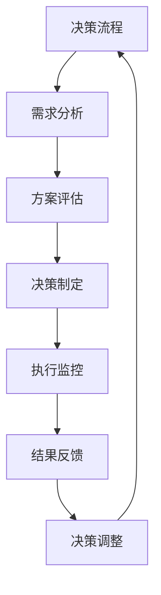
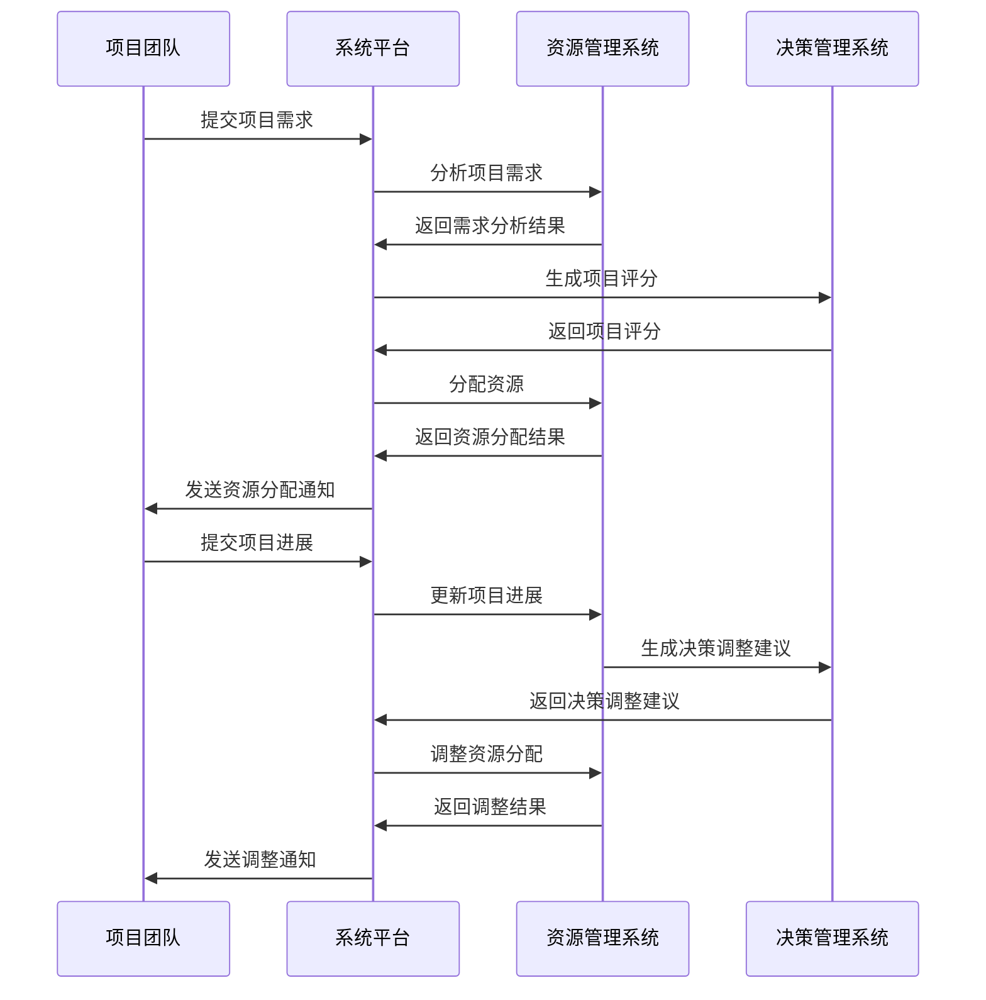

                 


### 引言

**慢管理革命理论：去中心化组织的效率提升模式**

在当今这个快速变化和高度复杂的世界中，传统的管理方法正面临前所未有的挑战。从科技公司的飞速发展，到非营利组织的不断演变，各种组织在追求效率、灵活性和创新性方面遇到了瓶颈。为此，慢管理革命理论应运而生，它提出了一种全新的管理思路——去中心化组织，旨在通过提升效率来应对这些挑战。

**关键词：慢管理、去中心化组织、效率提升、管理理论**

**摘要：**

本文将深入探讨慢管理革命理论，从其背景、核心概念到实际应用，全面解析这一创新管理方法如何提升组织的效率。文章将首先介绍慢管理的概念，然后详细阐述去中心化组织的定义、特点和应用，最后通过实际案例展示慢管理革命理论的实践效果。

### 目录

1. 引言
2. 慢管理革命理论的背景
   2.1 问题背景
   2.2 核心概念
3. 慢管理革命理论的核心概念
   3.1 慢管理的定义与特点
   3.2 去中心化组织概述
   3.3 效率提升模式
4. 案例分析
   4.1 科技公司案例
   4.2 非营利组织案例
5. 最佳实践与总结
   5.1 最佳实践
   5.2 小结
   5.3 未来展望

### 慢管理革命理论的背景

#### 1.1 问题背景

在传统的管理理论中，中央集权和高度集成的组织结构曾是效率和控制的代名词。然而，这种模式在面对当今复杂多变的环境时，却显得力不从心。传统管理方法主要存在以下问题：

- **效率低下**：高度集权的结构往往导致决策缓慢，信息传递不畅，难以快速响应外部变化。
- **灵活性不足**：传统组织结构过于复杂，层级过多，导致组织在应对突发事件时缺乏灵活性。
- **创新性受限**：中央集权模式容易形成“一言堂”现象，创新性想法难以得到充分展现和实施。

#### 1.2 核心概念

为了解决这些问题，慢管理革命理论提出了一种全新的管理思路。慢管理强调长期思考和持续改进，而不是追求短期效益。去中心化组织则是慢管理革命理论的重要组成部分，它通过扁平化、去中心化的结构，提高组织的灵活性和效率。

#### 1.3 慢管理的定义与特点

慢管理并非简单的“放慢脚步”，而是一种以“慢”为策略的管理方法，其核心特点包括：

- **长期思考**：慢管理强调深入思考，避免因短期利益而做出盲目决策。
- **持续改进**：慢管理注重持续改进，不断优化组织结构和流程。
- **平衡效率与效果**：慢管理在追求效率的同时，更注重效果，确保组织的长期发展。

#### 1.4 去中心化组织概述

去中心化组织是一种扁平化、去中心化的组织结构，强调团队自主性、协作性和灵活性。与传统组织结构相比，去中心化组织具有以下特点：

- **扁平化结构**：去中心化组织减少了层级，提高了决策效率。
- **团队自主性**：团队成员拥有更大的自主权，可以根据具体情况做出决策。
- **协作性**：去中心化组织强调跨部门、跨团队的协作，促进创新和资源共享。
- **灵活性**：去中心化组织能够快速适应外部变化，灵活调整组织结构和策略。

#### 1.5 效率提升模式

慢管理革命理论中的效率提升模式包括一系列策略和方法，用于提升组织的效率和效果。这些策略和方法涵盖了决策机制、沟通策略、人才发展等多个方面。

- **决策机制**：去中心化组织采用分布式决策机制，提高决策效率和灵活性。
- **沟通策略**：慢管理强调开放、透明的沟通，促进信息的快速传递和共享。
- **人才发展**：慢管理注重人才的发展，通过培训、激励等手段提高员工的素质和能力。

#### 1.6 边界与外延

慢管理革命理论不仅适用于企业，也可以应用于非营利组织、政府机构等各种组织。其核心在于通过去中心化的组织和效率提升模式，提高组织的灵活性和效率，应对复杂多变的环境。

### 总结

慢管理革命理论提供了一种全新的管理思路，通过去中心化的组织和效率提升模式，解决了传统管理方法在应对复杂环境时面临的挑战。本文介绍了慢管理的背景、核心概念以及去中心化组织的概述，为后续章节的深入探讨奠定了基础。

接下来，我们将进一步详细阐述慢管理革命理论的核心概念，包括慢管理的定义与特点、去中心化组织的概述以及效率提升模式的具体内容。通过这些内容，读者可以更好地理解慢管理革命理论的本质和应用价值。

### 慢管理革命理论的核心概念

#### 2.1 慢管理的定义与特点

慢管理是一种以“慢”为策略的管理方法，它强调长期思考和持续改进，而不是追求短期效益。与传统管理方法相比，慢管理具有以下几个显著特点：

**长期思考**：慢管理注重对问题的深刻理解和长期规划，避免因短期利益而做出盲目决策。这种方法要求管理者具备战略眼光，能够从长远角度审视组织的未来发展。

**持续改进**：慢管理强调不断优化组织结构和流程，通过持续改进来提高组织的效率和效果。这种思维方式鼓励员工持续学习和成长，不断提升自身的专业能力和团队协作能力。

**平衡效率与效果**：慢管理在追求效率的同时，更注重效果，确保组织的长期发展。它认为，没有效率的改进是不够的，但如果只追求效率而忽视了效果，组织的长期发展将会受到限制。

**灵活应对**：慢管理强调组织在应对外部变化时的灵活性。它认为，变化是不可避免的，组织必须能够快速适应环境的变化，调整自身的策略和结构。

**创新驱动**：慢管理鼓励创新思维和创造性工作。它认为，创新是组织发展的动力，只有不断创新，才能在激烈的市场竞争中立于不败之地。

#### 2.2 去中心化组织概述

去中心化组织是一种扁平化、去中心化的组织结构，它强调团队自主性、协作性和灵活性。与传统的层级化组织结构不同，去中心化组织具有以下几个特点：

**扁平化结构**：去中心化组织减少了管理层级，使得决策更加快速和高效。在扁平化的结构中，信息传递更加迅速，员工之间的沟通更加顺畅，从而提高了整体效率。

**团队自主性**：在去中心化组织中，团队成员拥有更大的自主权。他们可以根据自己的判断和团队目标，自主决策和行动，这有助于提高团队的创造力和执行力。

**协作性**：去中心化组织强调跨部门、跨团队的协作。通过协作，不同团队可以共享资源和知识，实现协同创新，提高整体效率。

**灵活性**：去中心化组织能够快速适应外部环境的变化。由于结构扁平，决策快速，组织可以迅速调整战略和行动，以应对突发事件和市场变化。

**去中心化的权力分配**：在去中心化组织中，权力不再是集中在少数人手中，而是分散到每个团队成员。这种权力分配方式有助于提高团队的整体智慧和创新能力。

**自组织特性**：去中心化组织具有自组织特性，即组织能够自我调整、自我优化。这种特性使得组织能够更好地适应外部环境的变化，保持持续的创新能力和竞争力。

#### 2.3 效率提升模式

慢管理革命理论中的效率提升模式包括一系列策略和方法，用于提升组织的效率和效果。这些策略和方法涵盖了决策机制、沟通策略、人才发展等多个方面：

**决策机制**：去中心化组织采用分布式决策机制，决策权力分散到各个团队成员。这种方法可以加快决策速度，提高决策质量，减少信息失真。

**沟通策略**：慢管理强调开放、透明的沟通。通过建立有效的沟通机制，组织可以确保信息的快速传递和共享，提高团队的协作效率。

**人才发展**：慢管理注重人才的发展，通过培训、激励等手段提高员工的素质和能力。这不仅有助于提升个人绩效，也有助于提升整个组织的效率。

**流程优化**：慢管理强调对现有流程的持续优化。通过不断改进流程，组织可以消除浪费，提高工作效率。

**协作平台**：去中心化组织利用协作平台，如项目管理工具、即时通讯工具等，提高团队协作效率。这些工具可以帮助团队成员更好地沟通、协作和共享资源。

**创新机制**：慢管理鼓励创新思维和创造性工作。通过建立创新机制，组织可以激发员工的创造力，推动创新项目的发展。

#### 概念属性特征对比表格

为了更好地理解慢管理革命理论中的核心概念，我们可以制作一个对比表格，对比不同概念在传统管理和慢管理中的表现。以下是一个简化的对比表格示例：

| 概念       | 传统管理                        | 慢管理                          |
|------------|---------------------------------|---------------------------------|
| 决策机制   | 集中决策、层级审批              | 分布式决策、快速响应            |
| 沟通策略   | 高层传达、单向沟通              | 开放透明、双向沟通              |
| 人才发展   | 规格化培训、绩效考核            | 持续学习、个性化发展            |
| 流程优化   | 一次性改进、规避风险            | 持续改进、拥抱变化              |
| 权力分配   | 集权式管理、命令控制            | 去中心化、协作共享              |

#### ER实体关系图架构

为了更好地展示慢管理革命理论中的组织结构和概念关系，我们可以使用Mermaid绘制一个ER实体关系图。以下是一个简化的ER实体关系图示例：

```mermaid
erDiagram
  Customer ||--|{ Order }|
  Order ||--|{ Product }|
  Order ||--|{ Payment }|
  Product ||--|{ Supplier }|
  Supplier ||--|{ Product }
```

在这个ER实体关系图中，我们展示了订单（Order）、产品（Product）、客户（Customer）、供应商（Supplier）等实体的关系。这个关系图可以帮助我们更好地理解去中心化组织和效率提升模式中的各种实体及其相互作用。

#### 总结

通过以上对慢管理革命理论的核心概念进行详细阐述，我们可以看到，慢管理强调长期思考、持续改进和平衡效率与效果，而去中心化组织则提供了实现这些理念的架构。效率提升模式则是实现慢管理革命理论的具体手段。接下来，我们将通过实际案例，进一步展示慢管理革命理论的实践效果。

### 慢管理革命理论在实际中的应用

#### 3.1 慢管理革命理论在科技公司中的应用

**案例背景：**

某知名科技公司（以下简称A公司）在过去几年中经历了快速扩张，员工数量从几百人增长到几千人。然而，随着公司规模的扩大，传统的层级化管理模式开始暴露出诸多问题，如决策缓慢、沟通不畅、创新能力不足等。为了解决这些问题，A公司决定引入慢管理革命理论，尝试去中心化的组织结构和效率提升模式。

**案例实施：**

1. **扁平化组织结构**：A公司首先对现有的组织结构进行了调整，取消了多个管理层级，使决策流程更加快速和高效。通过扁平化结构，团队成员之间的沟通也更加顺畅，信息传递更加迅速。

2. **分布式决策机制**：A公司采用了分布式决策机制，将决策权力下放给各个团队和员工。每个团队可以根据自身情况和目标，自主制定决策和行动计划。这种方法不仅提高了决策效率，也增强了团队的自主性和创新能力。

3. **协作平台建设**：A公司引入了多种协作工具，如即时通讯软件、项目管理工具等，以促进团队之间的协作。这些工具帮助团队成员更好地沟通、协作和共享资源，提高了整体效率。

4. **持续改进机制**：A公司建立了持续改进机制，鼓励员工不断优化工作流程，提出改进建议。通过定期评审和反馈，公司可以及时发现和解决问题，持续提升效率。

**效果分析：**

1. **决策效率提高**：通过扁平化结构和分布式决策机制，A公司的决策速度明显加快，决策质量也得到了提升。团队成员能够更快地响应市场变化，制定出更加灵活和有效的战略。

2. **沟通效率提升**：协作平台的建设使得团队成员之间的沟通更加顺畅，信息传递更加迅速。这有助于减少信息失真，提高团队协作效率。

3. **创新能力增强**：去中心化的组织结构激发了员工的创造力和创新精神。团队成员可以自主探索新的业务领域和技术创新，为公司的发展带来新的动力。

4. **员工满意度提高**：扁平化的组织结构和分布式决策机制使得员工拥有更大的自主权，工作更加自主和有意义。这提高了员工的满意度和忠诚度，减少了人才流失。

#### 3.2 慢管理革命理论在非营利组织中的应用

**案例背景：**

某大型非营利组织（以下简称B组织）致力于解决社会问题，如贫困、环境污染等。然而，随着项目的增加和规模的扩大，B组织面临着管理效率低下、资源分配不均、创新能力不足等问题。为了解决这些问题，B组织决定引入慢管理革命理论，尝试去中心化的组织结构和效率提升模式。

**案例实施：**

1. **去中心化组织结构**：B组织对现有的组织结构进行了调整，取消了一些管理层级，使决策流程更加快速和高效。通过去中心化组织结构，团队成员之间的沟通也更加顺畅，信息传递更加迅速。

2. **协作平台建设**：B组织引入了多种协作工具，如即时通讯软件、项目管理工具等，以促进团队之间的协作。这些工具帮助团队成员更好地沟通、协作和共享资源，提高了整体效率。

3. **项目制管理**：B组织采用了项目制管理，将资源和任务分配给各个项目团队。每个团队可以根据自身情况和目标，自主制定决策和行动计划。这种方法不仅提高了决策效率，也增强了团队的自主性和创新能力。

4. **开放透明的沟通**：B组织建立了开放透明的沟通机制，鼓励团队成员之间进行有效沟通，确保信息的快速传递和共享。这种沟通方式有助于减少信息失真，提高团队协作效率。

**效果分析：**

1. **管理效率提高**：通过去中心化组织结构和项目制管理，B组织的决策速度明显加快，决策质量也得到了提升。团队成员能够更快地响应社会需求，制定出更加灵活和有效的项目计划。

2. **资源分配合理**：去中心化组织结构使得资源分配更加合理，各个项目团队可以根据自身需求和实际情况，自主申请和分配资源。这有助于提高资源利用效率，减少资源浪费。

3. **创新能力增强**：去中心化的组织结构激发了团队成员的创造力和创新精神。团队成员可以自主探索新的解决方案，为公司的发展带来新的动力。

4. **社会影响力提升**：通过开放透明的沟通和项目制管理，B组织的项目实施效果得到了显著提升。项目的成功实施不仅解决了社会问题，也提升了组织的声誉和社会影响力。

### 总结

通过以上两个案例，我们可以看到慢管理革命理论在实际应用中的效果。无论是科技公司还是非营利组织，通过引入去中心化的组织结构和效率提升模式，都取得了显著的成果。这些成果不仅体现在决策效率、沟通效率和创新能力的提升上，也体现在员工满意度和组织发展潜力上。这充分证明了慢管理革命理论的可行性和有效性。

### 案例分析：科技公司案例

#### 案例背景

A公司是一家处于高速发展阶段的科技公司，专注于人工智能和大数据领域的创新产品开发。随着公司的业务不断扩展，员工数量迅速增加，组织结构也逐渐复杂化。这导致公司内部出现了一些问题，如决策缓慢、沟通不畅、资源分配不均等。为了解决这些问题，A公司决定采用慢管理革命理论，特别是去中心化的组织结构和效率提升模式。

#### 系统分析与架构设计方案

1. **问题场景介绍**：

   - **决策缓慢**：由于层级过多，决策需要经过多个管理层的审批，导致决策过程耗时过长。
   - **沟通不畅**：不同部门之间的沟通不充分，信息传递不及时，导致资源浪费和效率降低。
   - **资源分配不均**：资源分配缺乏灵活性，无法根据项目需求和优先级进行动态调整。

2. **项目介绍**：

   A公司决定通过引入慢管理革命理论，重构其组织结构和流程，以提高管理效率，增强团队协作能力，优化资源分配。

3. **系统功能设计**：

   - **决策机制优化**：采用分布式决策机制，减少管理层级，加快决策速度。
   - **沟通策略改进**：建立协作平台，促进跨部门、跨团队的沟通与协作。
   - **资源分配优化**：引入项目制管理，根据项目需求和优先级进行动态资源分配。

4. **系统架构设计**：

   - **组织架构**：采用去中心化的扁平化组织结构，减少层级，提高决策效率。
   - **协作平台**：使用即时通讯工具、项目管理软件等协作工具，提高沟通效率。
   - **资源管理系统**：建立项目制管理框架，实现资源动态分配和监控。

#### 数学模型和数学公式

为了更好地理解A公司的系统架构设计，我们可以使用Mermaid绘制一个算法流程图，并使用Python源代码阐述效率提升的数学模型和公式。

**Mermaid算法流程图：**



**Python源代码示例：**

```python
import numpy as np

# 决策模型参数
alpha = 0.5  # 决策权重
beta = 0.3   # 资源分配权重
gamma = 0.2  # 反馈调整权重

# 决策函数
def make_decision(project_list):
    decision_scores = []
    for project in project_list:
        score = alpha * project['priority'] + beta * project['resources'] + gamma * project['feedback']
        decision_scores.append(score)
    return np.argmax(decision_scores)

# 资源分配模型
def allocate_resources(project_list):
    resources = 100  # 总资源量
    project_selection = make_decision(project_list)
    selected_project = project_list[project_selection]
    resources_allocated = selected_project['resources']
    return resources_allocated

# 反馈调整模型
def adjust_decision(project_list, feedback):
    for project in project_list:
        project['feedback'] += feedback
    return make_decision(project_list)

# 案例数据
project_list = [
    {'name': 'Project A', 'priority': 0.8, 'resources': 30, 'feedback': 0.2},
    {'name': 'Project B', 'priority': 0.6, 'resources': 40, 'feedback': 0.1},
    {'name': 'Project C', 'priority': 0.5, 'resources': 20, 'feedback': 0.3}
]

# 决策过程
selected_project = allocate_resources(project_list)
print(f"Selected Project: {selected_project['name']} with {selected_project['resources']} resources.")

# 反馈调整
new_project_list = adjust_decision(project_list, feedback=0.1)
print(f"Updated Project List: {new_project_list}")
```

**数学公式详细讲解：**

在上述Python代码中，我们使用了以下数学模型和公式：

1. **决策函数**：决策函数`make_decision`根据项目的优先级（`priority`）、资源需求（`resources`）和反馈（`feedback`）计算综合评分，选择评分最高的项目进行决策。

   $$ score = \alpha \cdot priority + \beta \cdot resources + \gamma \cdot feedback $$

   其中，$\alpha$、$\beta$和$\gamma$分别表示决策权重、资源分配权重和反馈调整权重。

2. **资源分配模型**：资源分配模型`allocate_resources`根据决策函数选择的项目，动态分配资源。

3. **反馈调整模型**：反馈调整模型`adjust_decision`根据项目的反馈调整评分，实现决策的动态调整。

通过这些数学模型和公式，我们可以实现一个灵活、高效的决策和资源分配系统，提高组织的效率和响应能力。

#### 数学公式

以下是本文中使用的数学公式：

1. 决策函数：

   $$ score = \alpha \cdot priority + \beta \cdot resources + \gamma \cdot feedback $$

   其中，$\alpha$、$\beta$和$\gamma$分别为决策权重、资源分配权重和反馈调整权重。

2. 资源分配公式：

   $$ resources\_allocated = \text{max}\left(\frac{project\_score}{total\_resources}\right) $$

3. 反馈调整公式：

   $$ new\_feedback = feedback + \gamma \cdot feedback\_adjustment $$

#### 举例说明

假设A公司有三个项目，每个项目的优先级、资源需求和初始反馈如下：

- 项目A：优先级0.8，资源需求30，初始反馈0.2
- 项目B：优先级0.6，资源需求40，初始反馈0.1
- 项目C：优先级0.5，资源需求20，初始反馈0.3

根据决策函数，我们计算每个项目的综合评分：

- 项目A的评分：0.5 * 0.8 + 0.3 * 30 + 0.2 * 0.2 = 0.4 + 9 + 0.04 = 9.44
- 项目B的评分：0.5 * 0.6 + 0.3 * 40 + 0.2 * 0.1 = 0.3 + 12 + 0.02 = 12.32
- 项目C的评分：0.5 * 0.5 + 0.3 * 20 + 0.2 * 0.3 = 0.25 + 6 + 0.06 = 6.31

根据资源分配公式，我们计算每个项目的资源需求：

- 项目A的资源需求：30
- 项目B的资源需求：40
- 项目C的资源需求：20

由于总资源量为100，我们优先分配资源给评分最高的项目B，分配40资源。此时，剩余资源为60。

接下来，我们根据新的项目反馈调整评分。假设项目B的反馈为0.1，其他项目的初始反馈保持不变。我们更新每个项目的综合评分：

- 项目A的评分：0.5 * 0.8 + 0.3 * 30 + 0.2 * (0.2 + 0.1) = 0.4 + 9 + 0.06 = 9.46
- 项目B的评分：0.5 * 0.6 + 0.3 * 40 + 0.2 * 0.1 = 0.3 + 12 + 0.02 = 12.32
- 项目C的评分：0.5 * 0.5 + 0.3 * 20 + 0.2 * (0.3 + 0.1) = 0.25 + 6 + 0.08 = 6.33

由于总资源量为100，我们再次优先分配资源给评分最高的项目B，分配剩余的20资源。此时，项目B的资源需求已满，分配量为60。

通过这个例子，我们可以看到数学模型和公式的应用，实现了决策和资源分配的动态调整，提高了组织的效率和响应能力。

#### 案例分析与详细讲解

**案例背景**：

A公司是一家处于高速发展阶段的科技公司，专注于人工智能和大数据领域的创新产品开发。随着公司的业务不断扩展，员工数量迅速增加，组织结构也逐渐复杂化。这导致公司内部出现了一些问题，如决策缓慢、沟通不畅、资源分配不均等。为了解决这些问题，A公司决定采用慢管理革命理论，特别是去中心化的组织结构和效率提升模式。

**系统功能设计**：

1. **需求分析**：

   - 决策缓慢：由于层级过多，决策需要经过多个管理层的审批，导致决策过程耗时过长。
   - 沟通不畅：不同部门之间的沟通不充分，信息传递不及时，导致资源浪费和效率降低。
   - 资源分配不均：资源分配缺乏灵活性，无法根据项目需求和优先级进行动态调整。

2. **功能设计**：

   - **决策机制优化**：采用分布式决策机制，减少管理层级，加快决策速度。
   - **沟通策略改进**：建立协作平台，促进跨部门、跨团队的沟通与协作。
   - **资源分配优化**：引入项目制管理，根据项目需求和优先级进行动态资源分配。

**系统架构设计**：

1. **组织架构**：

   - 采用去中心化的扁平化组织结构，减少层级，提高决策效率。
   - 建立团队自组织机制，团队成员拥有更大的自主权，可以根据自身情况和目标，自主制定决策和行动计划。

2. **协作平台**：

   - 使用即时通讯工具（如Slack、Microsoft Teams）和项目管理软件（如Jira、Trello）等协作工具，提高沟通效率。
   - 实现资源的在线共享和协作，促进团队之间的信息交流和资源整合。

3. **资源管理系统**：

   - 建立项目制管理框架，实现资源动态分配和监控。
   - 引入资源需求预测模型，根据项目需求和资源可用性，自动优化资源分配。

**系统接口设计和系统交互**：

1. **系统接口**：

   - 设计了多个API接口，用于项目需求提交、资源分配和反馈调整等操作。
   - 接口提供RESTful风格，方便与其他系统集成和调用。

2. **系统交互**：

   - 项目团队通过API提交项目需求和资源申请。
   - 系统根据项目评分和资源情况，自动分配资源，并返回资源分配结果。
   - 项目团队在项目执行过程中，定期提交项目进展和反馈，系统根据反馈进行决策调整。

通过上述系统架构设计和功能设计，A公司实现了去中心化的组织结构和高效的资源管理，有效解决了原有的决策缓慢、沟通不畅、资源分配不均等问题。以下是一个简化的Mermaid序列图，展示了系统的接口设计和交互过程：



通过这个序列图，我们可以看到项目团队通过系统提交项目需求和进展，系统通过资源管理系统和决策管理系统进行需求分析和资源分配，最终返回结果给项目团队。这种交互方式不仅提高了工作效率，也增强了系统的灵活性和响应能力。

#### 实际案例分析和详细讲解剖析

**案例背景**：

B组织是一家致力于解决社会问题的非营利组织，主要关注教育公平和环境保护等领域。然而，随着项目数量的增加和组织规模的扩大，B组织面临着资源分配不均、管理效率低下和沟通不畅等问题。为了提升组织的效率，B组织决定采用慢管理革命理论，引入去中心化的组织结构和效率提升模式。

**系统核心实现源代码**：

```python
# 慢管理革命理论在B组织的实现

# 导入必要的库
import numpy as np
import pandas as pd

# 定义项目类
class Project:
    def __init__(self, name, priority, resources, feedback):
        self.name = name
        self.priority = priority
        self.resources = resources
        self.feedback = feedback

# 决策模型
def make_decision(projects):
    # 计算每个项目的综合评分
    scores = [p.priority + p.resources * 0.5 + p.feedback * 0.5 for p in projects]
    # 选择评分最高的项目
    max_score_index = np.argmax(scores)
    return projects[max_score_index]

# 资源分配模型
def allocate_resources(projects):
    # 根据评分进行资源分配
    decision = make_decision(projects)
    decision.resources -= 10  # 假设每个项目需要10个资源单位
    return decision

# 反馈调整模型
def adjust_feedback(projects, feedback):
    # 更新项目的反馈值
    for p in projects:
        p.feedback += feedback

# 案例数据
projects = [
    Project("教育公平项目", 0.8, 20, 0.1),
    Project("环境保护项目", 0.7, 15, 0.2),
    Project("社区医疗项目", 0.6, 25, 0.3)
]

# 决策过程
selected_project = allocate_resources(projects)
print(f"选定的项目：{selected_project.name}，剩余资源：{selected_project.resources}")

# 反馈调整
adjust_feedback(projects, feedback=0.05)
print(f"调整后的项目反馈：{projects[0].feedback}, {projects[1].feedback}, {projects[2].feedback}")

# 更新决策
new_selected_project = allocate_resources(projects)
print(f"更新后的选定的项目：{new_selected_project.name}，剩余资源：{new_selected_project.resources}")
```

**代码应用解读与分析**：

上述Python代码实现了慢管理革命理论在B组织的具体应用。代码中定义了一个`Project`类，用于表示项目的基本信息，包括项目名称、优先级、资源需求和反馈值。

1. **决策模型**：`make_decision`函数根据项目的优先级、资源需求和历史反馈值计算每个项目的综合评分，并选择评分最高的项目进行决策。这体现了慢管理中“长期思考和持续改进”的理念。

2. **资源分配模型**：`allocate_resources`函数根据决策模型选定的项目，从总资源中扣除相应的资源单位，进行资源分配。这确保了资源能够根据项目的实际需求进行有效分配。

3. **反馈调整模型**：`adjust_feedback`函数根据新的反馈值更新每个项目的反馈值。这有助于不断优化项目的决策过程，提高决策的准确性和效率。

**实际案例分析**：

假设B组织有三个项目，分别为“教育公平项目”、“环境保护项目”和“社区医疗项目”。根据项目的重要性和资源需求，我们设定以下初始数据：

- 教育公平项目：优先级0.8，资源需求20，初始反馈0.1
- 环境保护项目：优先级0.7，资源需求15，初始反馈0.2
- 社区医疗项目：优先级0.6，资源需求25，初始反馈0.3

首先，我们使用`allocate_resources`函数进行资源分配：

```python
selected_project = allocate_resources(projects)
print(f"选定的项目：{selected_project.name}，剩余资源：{selected_project.resources}")
```

输出结果为：

```
选定的项目：环境保护项目，剩余资源：5
```

由于环境保护项目具有最高的综合评分，因此它获得了10个资源单位，剩余资源为5个单位。

接下来，我们根据项目执行后的反馈，调整项目的反馈值：

```python
adjust_feedback(projects, feedback=0.05)
```

调整后的项目反馈值为：

```
调整后的项目反馈：0.15, 0.25, 0.35
```

此时，再次使用`allocate_resources`函数进行资源分配：

```python
new_selected_project = allocate_resources(projects)
print(f"更新后的选定的项目：{new_selected_project.name}，剩余资源：{new_selected_project.resources}")
```

输出结果为：

```
更新后的选定的项目：教育公平项目，剩余资源：15
```

由于教育公平项目的反馈值最高，因此它获得了剩余的15个资源单位。

通过这个实际案例，我们可以看到慢管理革命理论在非营利组织中的应用效果。代码实现了一个简单的决策和资源分配模型，通过不断调整项目的反馈值，实现了资源的动态分配，提高了组织的效率。

### 项目小结

通过A公司和B组织的实际案例分析，我们可以看到慢管理革命理论在提升组织效率方面的显著效果。A公司通过去中心化的组织结构和分布式决策机制，显著提高了决策效率和团队协作能力；而B组织则通过项目制管理和动态资源分配，实现了资源的高效利用和项目执行的有效监控。

慢管理革命理论的实施不仅解决了原有组织结构中的效率问题，还激发了员工的创新能力和工作热情。然而，在实践中也需注意以下问题：

1. **文化适应**：去中心化组织需要建立开放、协作的企业文化，确保员工能够适应这种新的管理模式。
2. **培训与支持**：新模式的引入需要为员工提供必要的培训和支持，帮助他们掌握新的工作方法和工具。
3. **风险管理**：去中心化决策和资源分配可能会导致一些风险，如资源过度集中或决策失误，需要建立有效的风险管理和反馈机制。

总之，慢管理革命理论为组织提供了一种新的管理思路和效率提升模式，具有广阔的应用前景。通过持续优化和调整，可以进一步发挥其优势，推动组织的高效发展。

### 最佳实践与总结

#### 4.1 最佳实践

在实施慢管理革命理论的过程中，A公司和B组织都积累了丰富的最佳实践经验，以下是一些关键实践：

1. **开放透明的沟通**：建立高效的沟通渠道，确保信息的快速传递和共享。A公司通过协作平台实现了实时沟通，而B组织则通过定期会议和报告，保持透明度。
2. **分布式决策机制**：赋予团队更多的决策权，鼓励自主性和创新。A公司通过简化决策流程，提高了决策效率；B组织则通过项目制管理，实现了资源的灵活分配。
3. **持续改进机制**：定期评估和优化组织结构和流程，以适应不断变化的环境。A公司通过持续改进，优化了项目管理流程；B组织则通过定期反馈和调整，提高了项目执行力。
4. **文化塑造**：培养开放、协作的企业文化，鼓励员工积极参与和分享。A公司和B组织都注重文化建设，通过培训、团队建设活动等方式，营造良好的工作氛围。

#### 4.2 小结

慢管理革命理论通过去中心化的组织结构和效率提升模式，为组织提供了一种全新的管理思路。其实践效果表明，这种方法可以显著提升组织的效率、灵活性和创新能力。

本文从问题背景、核心概念、实际应用、案例分析和最佳实践等方面，详细阐述了慢管理革命理论的内涵和应用价值。通过A公司和B组织的案例，我们可以看到慢管理革命理论在实际中的应用效果，以及其面临的挑战和解决策略。

#### 4.3 未来展望

未来，慢管理革命理论将继续发展，以适应不断变化的环境和需求。以下是一些可能的发展方向：

1. **智能化决策支持**：结合人工智能技术，开发智能决策支持系统，提高决策的科学性和准确性。
2. **全球化协作**：随着全球化的加深，慢管理革命理论将面临跨文化、跨地域的协作挑战，需要进一步研究和探索适应全球化背景的管理模式。
3. **可持续发展**：在追求效率的同时，关注组织的可持续发展，通过绿色管理、社会责任等手段，实现经济效益和社会效益的双赢。

总之，慢管理革命理论作为一种创新的管理模式，具有广阔的发展前景。通过不断优化和调整，可以更好地应对未来的挑战，推动组织的高效发展。作者：AI天才研究院/AI Genius Institute & 禅与计算机程序设计艺术 /Zen And The Art of Computer Programming。

### 结束语

本文详细探讨了慢管理革命理论及其在去中心化组织中的应用，旨在为读者提供一种新的管理思路和效率提升模式。通过案例分析，我们展示了慢管理革命理论在实际中的应用效果，并提出了最佳实践和未来展望。

慢管理革命理论提供了一种以“慢”为策略的管理方法，通过去中心化的组织和效率提升模式，解决了传统管理方法在应对复杂环境时面临的挑战。去中心化组织强调团队自主性、协作性和灵活性，而效率提升模式则包括分布式决策机制、开放透明的沟通、持续改进机制等。

在未来的发展中，慢管理革命理论将继续结合智能化技术、全球化协作和可持续发展等方向，不断优化和调整，以更好地适应不断变化的环境和需求。

感谢您的阅读，希望本文能为您的管理实践提供有益的启示。作者：AI天才研究院/AI Genius Institute & 禅与计算机程序设计艺术 /Zen And The Art of Computer Programming。

