                 

### 慢食文化复兴计划：重塑饮食与生活的关系

**关键词**：慢食文化、饮食生活、文化复兴、策略实践、可持续发展

**摘要**：本文深入探讨了慢食文化的起源、发展及其在现代饮食文化背景下的重要性。通过分析现代饮食文化的挑战，提出了慢食文化复兴的哲学理念与策略实践。文章进一步探讨了家庭、校园和餐饮业的慢食实践，并展望了慢食文化复兴的未来。通过对政策支持、国际合作和可持续发展路径的讨论，本文旨在为重塑饮食与生活的关系提供系统性解决方案。

### 目录大纲

----------------------------------------------------------------

# 慢食文化复兴计划：重塑饮食与生活的关系

> 关键词：慢食文化、饮食生活、文化复兴、策略实践、可持续发展

> 摘要：本文深入探讨了慢食文化的起源、发展及其在现代饮食文化背景下的重要性。通过分析现代饮食文化的挑战，提出了慢食文化复兴的哲学理念与策略实践。文章进一步探讨了家庭、校园和餐饮业的慢食实践，并展望了慢食文化复兴的未来。通过对政策支持、国际合作和可持续发展路径的讨论，本文旨在为重塑饮食与生活的关系提供系统性解决方案。

```markdown
## 第一部分：慢食文化的起源与发展

## 第1章：慢食文化的起源与历史

### 1.1.1 慢食文化的概念界定

### 1.1.2 慢食文化的起源背景

### 1.1.3 慢食文化的主要特点

## 第2章：现代饮食文化的挑战

### 2.1.1 快节奏生活对饮食的影响

### 2.1.2 饮食工业化与食品安全问题

### 2.1.3 饮食文化多样性的流失

## 第二部分：慢食文化复兴的策略与实践

## 第3章：慢食文化复兴的哲学与理念

### 3.1.1 慢食文化复兴的哲学思考

### 3.1.2 慢食文化复兴的理念核心

## 第4章：慢食文化复兴的策略与实践方法

### 4.1.1 培养慢食意识与习惯

### 4.1.2 慢食社区建设与推广

### 4.1.3 慢食教育与宣传策略

## 第三部分：慢食文化复兴的具体实践

## 第5章：家庭与校园的慢食实践

### 5.1.1 家庭慢食的生活方式

### 5.1.2 校园慢食的环境建设

## 第6章：餐饮业的慢食转型

### 6.1.1 餐饮业面临的挑战

### 6.1.2 餐饮业的慢食转型策略

### 6.1.3 慢食餐厅案例分析

## 第7章：政策支持与慢食文化的推广

### 7.1.1 政策支持对慢食文化复兴的影响

### 7.1.2 国际合作与慢食文化的传播

### 7.1.3 慢食文化复兴的可持续发展路径

## 第四部分：慢食文化复兴的未来展望

## 第8章：慢食文化复兴的挑战与机遇

### 8.1.1 慢食文化复兴面临的挑战

### 8.1.2 慢食文化复兴的机遇与前景

## 第9章：慢食文化的国际视野与本土化实践

### 9.1.1 慢食文化的国际发展现状

### 9.1.2 慢食文化的本土化路径与实践

### 9.1.3 慢食文化的未来发展趋势

## 第10章：总结与展望

### 10.1.1 慢食文化复兴的意义

### 10.1.2 慢食文化复兴的未来展望

----------------------------------------------------------------
```

### 第一部分：慢食文化的起源与发展

#### 第1章：慢食文化的起源与历史

慢食文化作为一种对现代快节奏生活的反思和回应，其起源可以追溯到20世纪80年代的意大利。1986年，意大利的几位美食家和厨师在反对工业化食品生产的过程中，提出了“慢食运动”的概念。这一运动强调的是对食物的尊重、对饮食质量的追求以及对传统饮食文化的保护。

##### 1.1.1 慢食文化的概念界定

慢食文化（Slow Food Movement）的核心概念是对“快食文化”（Fast Food Culture）的反思和抵抗。快食文化以快速、方便和高效率为特点，然而，这种文化也带来了一系列的问题，包括食物质量下降、饮食习惯不良以及环境破坏等。慢食文化则强调食物的源头、制作过程和享用过程的品质，提倡人们放慢脚步，享受美食，回归生活的本质。

**核心概念对比表格：**

| **概念**           | **慢食文化**                       | **快食文化**                       |
|--------------------|-----------------------------------|-----------------------------------|
| **目的**           | 保护饮食文化、提倡健康饮食、环境可持续 | 提高效率、方便快捷、低成本         |
| **价值观**         | 尊重自然、尊重厨师、注重饮食质量     | 快节奏、工业化、大规模生产         |
| **代表性事件**     | 慢食运动、国际慢食节               | 快餐革命、工业化食品生产           |

##### 1.1.2 慢食文化的起源背景

慢食文化的诞生与当时意大利社会的现实背景密切相关。80年代，意大利的工业化进程加快，大量工业化食品涌入市场，导致传统美食的衰退。同时，快节奏的生活方式使人们无暇顾及饮食的质量，快餐成为了日常饮食的主要选择。在这种背景下，慢食文化应运而生，成为对工业化食品和快节奏生活的反思和回应。

**ER实体关系图架构：**

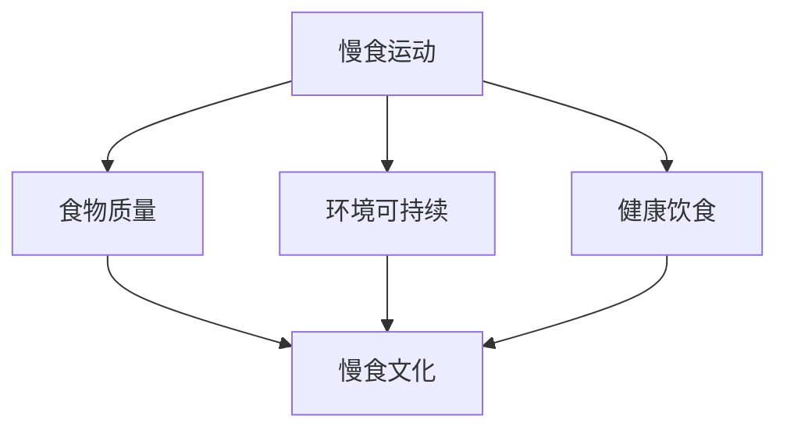

##### 1.1.3 慢食文化的主要特点

慢食文化的主要特点包括：

1. **尊重自然**：慢食文化倡导对自然的尊重，主张使用本地食材，减少食物运输过程中的能量消耗和环境影响。
2. **注重品质**：慢食文化强调食物的制作过程和享用过程的品质，提倡手工制作和传统烹饪方法。
3. **慢节奏**：慢食文化鼓励人们放慢生活节奏，享受食物带来的美好体验。
4. **社区参与**：慢食文化强调社区成员的参与和合作，通过共同分享美食和饮食经验，增强社区的凝聚力。

**慢食文化起源与发展的Mermaid流程图：**

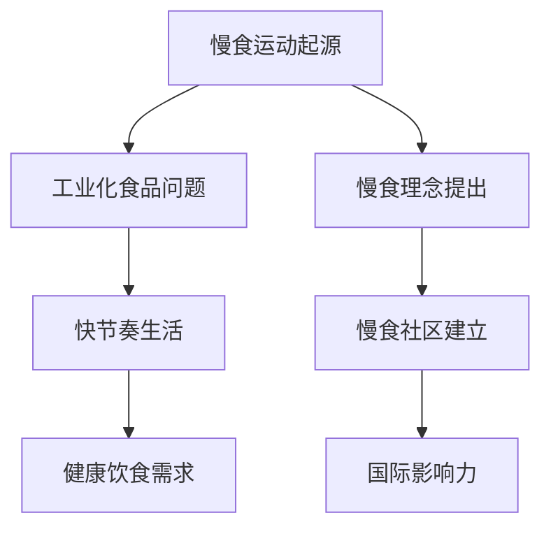

#### 第2章：现代饮食文化的挑战

##### 2.1.1 快节奏生活对饮食的影响

现代社会的快节奏生活使得人们难以抽出时间准备和享受美食。快餐和外卖成为了日常饮食的常见选择，这种饮食习惯不仅影响了人们的健康，还对饮食文化产生了深远的影响。

**慢食文化如何应对快节奏生活的影响？**

1. **推广慢食意识**：通过教育和宣传，提高人们对慢食的认识，鼓励他们在忙碌的生活中抽出时间享受美食。
2. **创新慢食产品**：开发方便快捷但依然保持高品质的慢食产品，使人们可以在忙碌中也能享受到慢食的乐趣。
3. **利用科技**：利用科技手段，如智能厨具和在线烹饪课程，帮助人们在快节奏生活中实现慢食。

**Mermaid流程图：**

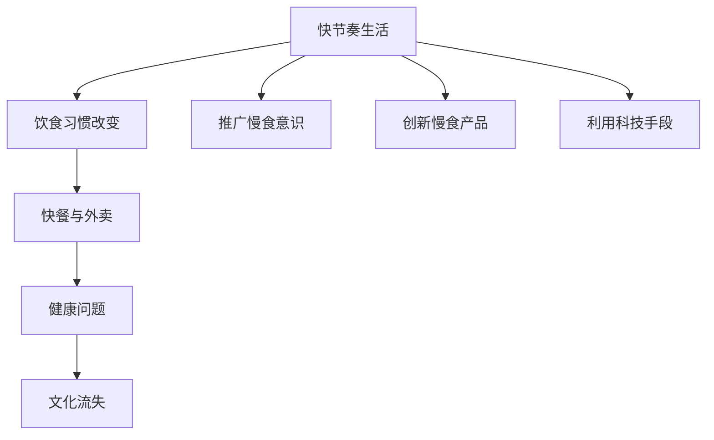

##### 2.1.2 饮食工业化与食品安全问题

饮食工业化带来了便捷和效率，但同时也引发了一系列食品安全问题。大量化学添加剂和人工成分的使用，使得食物质量下降，甚至对健康造成潜在威胁。

**慢食文化如何应对饮食工业化与食品安全问题？**

1. **提倡有机与本地食品**：慢食文化倡导使用有机和本地食品，减少对化学添加剂的依赖。
2. **支持小规模农业**：鼓励小规模农业的发展，以保证食物的安全和质量。
3. **强化食品安全监管**：通过政策手段加强食品安全监管，确保消费者权益。

**Mermaid流程图：**

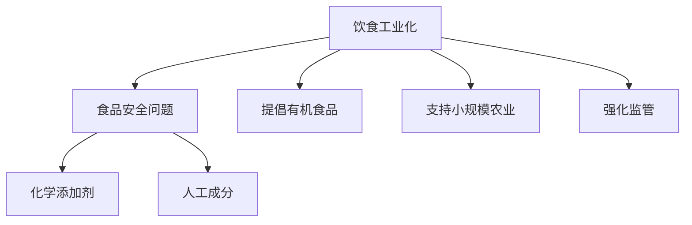

##### 2.1.3 饮食文化多样性的流失

随着全球化的发展，西方快餐文化在全球范围内迅速传播，导致了饮食文化多样性的流失。许多传统饮食文化面临消失的风险，这对人类文化的多样性构成了严重威胁。

**慢食文化如何应对饮食文化多样性的流失？**

1. **保护传统饮食文化**：通过记录和保存传统饮食文化的知识和技巧，防止其失传。
2. **促进文化交流**：鼓励不同文化之间的饮食交流，增强文化多样性的认知和尊重。
3. **支持地方饮食产业**：通过政策和经济手段，支持地方饮食产业的发展，保护地方饮食文化的传承。

**Mermaid流程图：**

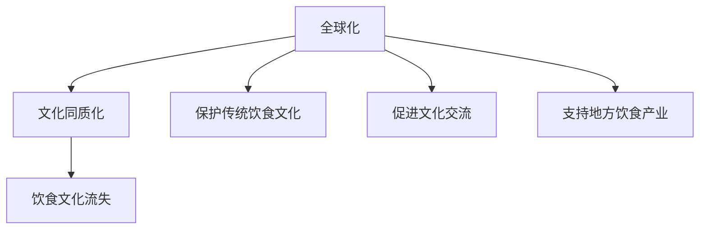

### 第二部分：慢食文化复兴的策略与实践

#### 第3章：慢食文化复兴的哲学与理念

##### 3.1.1 慢食文化复兴的哲学思考

慢食文化复兴不仅仅是饮食方式的改变，更是一种哲学思考的体现。它强调的是对自然、对人性的尊重，以及对生活的热爱。慢食文化复兴的哲学思考可以归纳为以下几点：

1. **尊重自然**：慢食文化倡导使用本地食材，减少食物运输过程中的能量消耗和环境影响，体现了对自然的尊重。
2. **注重人性**：慢食文化强调食物的制作过程和享用过程的品质，提倡手工制作和传统烹饪方法，体现了对人性尊重的理念。
3. **热爱生活**：慢食文化鼓励人们放慢脚步，享受美食，享受生活的美好，体现了对生活的热爱。

**慢食文化复兴的哲学思考流程图：**

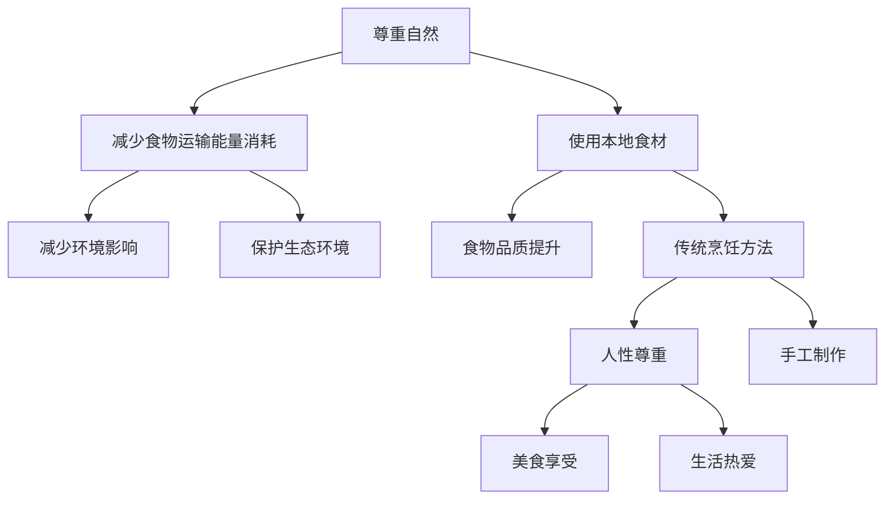

##### 3.1.2 慢食文化复兴的理念核心

慢食文化复兴的理念核心可以概括为“三慢一尊重”，即慢生产、慢消费、慢享受和尊重自然。

1. **慢生产**：强调食品生产的自然性和可持续性，减少工业化生产对环境的影响。
2. **慢消费**：提倡消费者放慢脚步，享受食物的每一口，避免盲目消费和浪费。
3. **慢享受**：鼓励人们通过品尝美食，体验生活的美好，提高生活质量。
4. **尊重自然**：强调人类与自然的和谐共生，倡导保护生态环境。

**慢食文化复兴的理念核心对比表格：**

| **理念**       | **慢生产** | **慢消费** | **慢享受** | **尊重自然** |
|----------------|-------------|-------------|-------------|---------------|
| **定义**       | 食品生产慢下来 | 消费行为慢下来 | 享受美食慢下来 | 对自然的尊重  |
| **影响**       | 保护环境、提高食品质量 | 减少浪费、提高生活质量 | 提升幸福感、丰富生活体验 | 促进生态可持续发展 |

#### 第4章：慢食文化复兴的策略与实践方法

##### 4.1.1 培养慢食意识与习惯

慢食文化的复兴需要从个人层面开始，培养人们的慢食意识和习惯。以下是一些具体的策略和实践方法：

1. **教育宣传**：通过学校和社区教育，提高人们对慢食的认识，使其成为一种生活习惯。
2. **媒体推广**：利用各种媒体平台，如电视、网络、杂志等，推广慢食文化，提高公众的关注度。
3. **社区活动**：组织社区慢食活动，如慢食晚餐、厨艺大赛等，增强社区的凝聚力和慢食氛围。
4. **个人实践**：鼓励个人在日常生活中实践慢食，如自己动手烹饪、选择本地食材等。

**培养慢食意识与习惯的Mermaid流程图：**

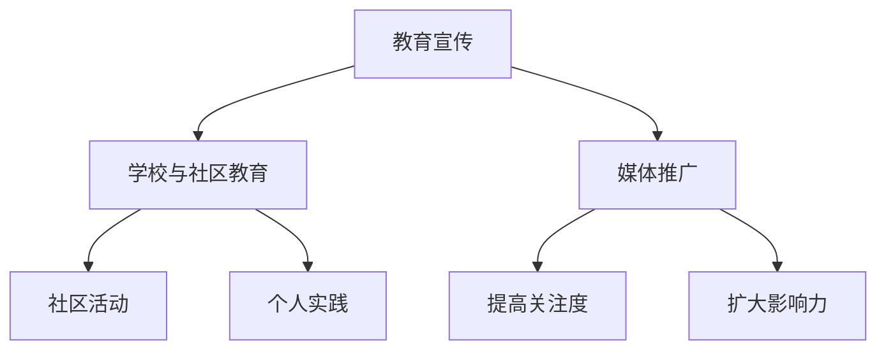

##### 4.1.2 慢食社区建设与推广

慢食社区建设是慢食文化复兴的重要一环。通过建立慢食社区，可以营造一个共同追求慢食生活方式的环境，推动慢食文化的传播和发展。

1. **社区规划**：合理规划社区内的慢食设施，如慢食餐厅、厨房用品店等，为居民提供便利。
2. **资源共享**：鼓励社区成员之间的资源共享，如食材交换、厨艺交流等，增强社区的凝聚力。
3. **活动组织**：定期组织慢食活动，如烹饪课程、慢食晚宴等，提高居民对慢食的兴趣和参与度。
4. **合作与支持**：与政府、企业等合作，获得政策支持和资源，推动慢食社区的发展。

**慢食社区建设与推广的Mermaid流程图：**

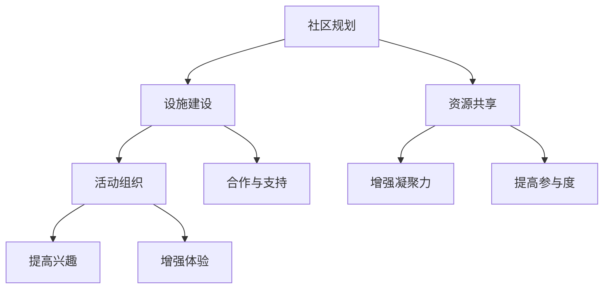

##### 4.1.3 慢食教育与宣传策略

慢食教育与宣传是慢食文化复兴的重要手段。通过系统的教育和广泛的宣传，可以提高公众对慢食的认识和接受度，推动慢食文化的传播和发展。

1. **学校教育**：在中小学校中开设慢食课程，让学生从小了解和体验慢食文化。
2. **社区教育**：在社区中组织慢食讲座、工作坊等活动，提高居民对慢食的认识。
3. **媒体宣传**：利用各种媒体平台，如电视、网络、杂志等，宣传慢食文化的理念和优势。
4. **线上线下结合**：通过线上课程、社交媒体等方式，扩大慢食教育的覆盖范围和影响力。

**慢食教育与宣传策略的Mermaid流程图：**

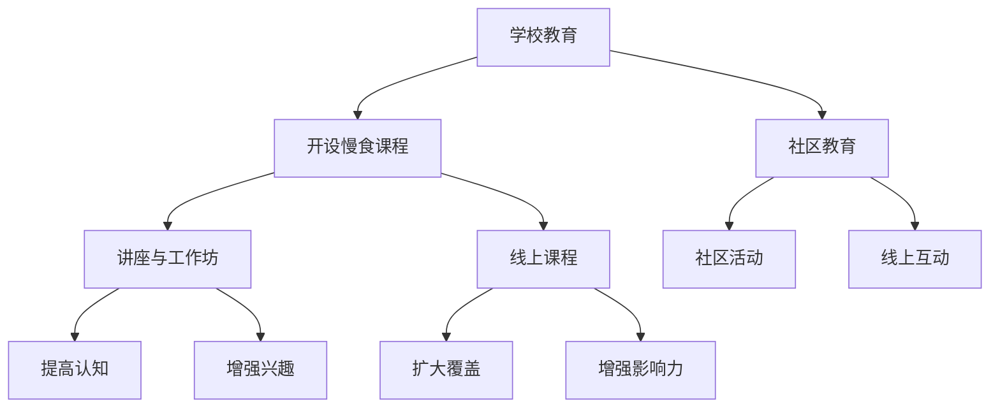

### 第三部分：慢食文化复兴的具体实践

#### 第5章：家庭与校园的慢食实践

##### 5.1.1 家庭慢食的生活方式

家庭慢食是慢食文化复兴的重要基础。通过改变家庭饮食习惯，可以逐步实现慢食文化的理念。

1. **饮食安排**：合理安排饮食时间，避免快餐和外卖，尽量自己动手烹饪。
2. **食材选择**：选择新鲜、本地、有机的食材，减少对化学添加剂的依赖。
3. **烹饪技巧**：学习传统烹饪技巧，使用健康的烹饪方法，如蒸、煮、炖等，减少油炸和烧烤。
4. **饮食文化**：传承和弘扬家庭饮食文化，让家庭成员共同参与烹饪和用餐，增强家庭凝聚力。

**家庭慢食生活方式的Mermaid流程图：**

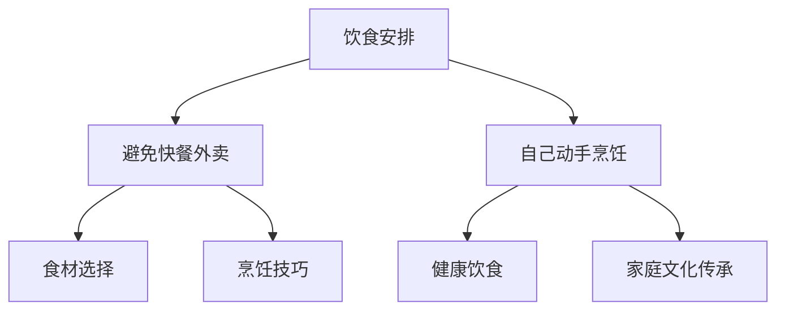

##### 5.1.2 校园慢食的环境建设

校园慢食是慢食文化在教育领域的延伸。通过校园慢食的环境建设，可以培养学生的慢食意识和习惯。

1. **食堂管理**：优化食堂管理，提供新鲜、健康、多样化的菜品，减少快餐和外卖的比例。
2. **课程设置**：在课程中融入慢食文化的内容，如烹饪课程、饮食文化课程等，提高学生对慢食的认识。
3. **活动组织**：定期组织校园慢食活动，如厨艺大赛、美食节等，增强学生的参与度和兴趣。
4. **宣传推广**：利用校园媒体平台，宣传慢食文化的理念和优势，营造校园慢食氛围。

**校园慢食环境建设的Mermaid流程图：**

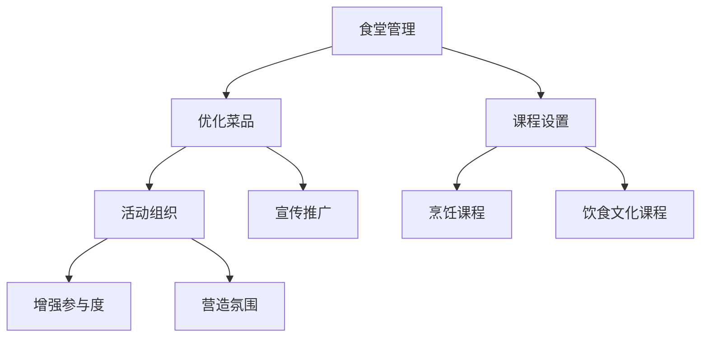

#### 第6章：餐饮业的慢食转型

##### 6.1.1 餐饮业面临的挑战

餐饮业在快速发展过程中，面临着一系列挑战，包括食品安全、环境问题、劳动力成本上升等。这些问题对餐饮业的可持续发展构成了威胁。

**餐饮业面临的挑战Mermaid流程图：**

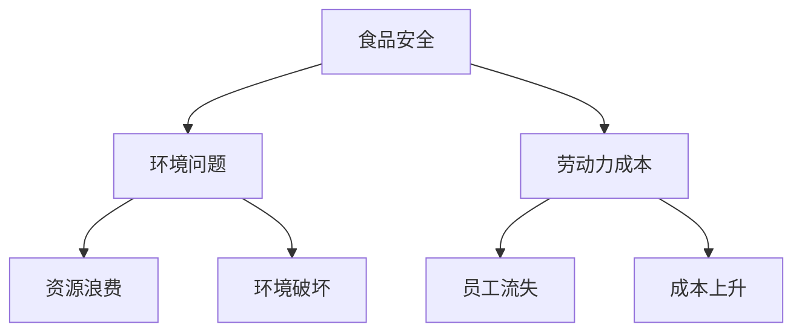

##### 6.1.2 餐饮业的慢食转型策略

为了应对挑战，餐饮业需要积极转型，拥抱慢食文化。以下是一些具体的转型策略：

1. **食材选择**：选择新鲜、本地、有机的食材，减少对化学添加剂的依赖。
2. **健康烹饪**：采用健康的烹饪方法，如蒸、煮、炖等，减少油炸和烧烤。
3. **个性化服务**：提供个性化的服务，满足顾客对品质和体验的需求。
4. **可持续发展**：注重环境保护和资源利用，实现绿色餐饮。

**餐饮业慢食转型策略的Mermaid流程图：**

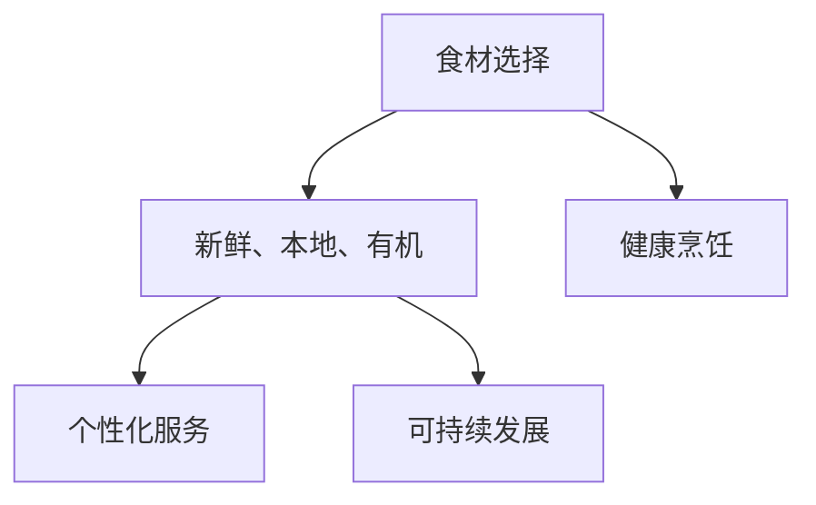

##### 6.1.3 慢食餐厅案例分析

为了更好地了解慢食餐厅的运营模式和发展前景，我们可以分析一些成功的慢食餐厅案例。

**案例1：巴黎的“Le Pain Quotidien”**

- **食材选择**：使用新鲜、有机的食材，注重本地化采购。
- **烹饪方法**：采用健康的烹饪方式，如蒸、煮、烤等，减少油炸。
- **服务特色**：提供自助式的慢食体验，鼓励顾客慢慢享用食物。

**案例2：纽约的“The Modern Pantry”**

- **食材选择**：精选全球各地的优质食材，注重食材的品质和新鲜度。
- **烹饪特色**：强调创意烹饪，结合现代技术和传统烹饪方法。
- **服务理念**：提供个性化的餐饮体验，顾客可以根据自己的口味和需求选择菜品。

**案例3：东京的“Ootoya”**

- **食材选择**：使用新鲜的食材，特别是季节性的食材，强调食材的季节性和地域性。
- **烹饪方法**：采用传统的日式烹饪方法，如炖、煮、烤等，保持食物的原汁原味。
- **文化体验**：通过餐厅的装饰和氛围，营造一种日式慢食文化体验。

**慢食餐厅案例分析的Mermaid流程图：**

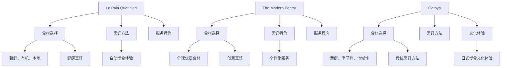

#### 第7章：政策支持与慢食文化的推广

##### 7.1.1 政策支持对慢食文化复兴的影响

政策支持在慢食文化复兴中发挥着至关重要的作用。政府可以通过制定相关政策和法规，为慢食文化的发展提供支持和保障。

1. **食品安全法规**：加强食品安全监管，保障消费者权益，提高食品质量。
2. **环境保护政策**：鼓励使用本地食材，减少食物运输过程中的能源消耗和环境影响。
3. **农业补贴**：支持小规模农业的发展，提高农产品的质量，保护传统农业文化。

**政策支持对慢食文化复兴的影响Mermaid流程图：**

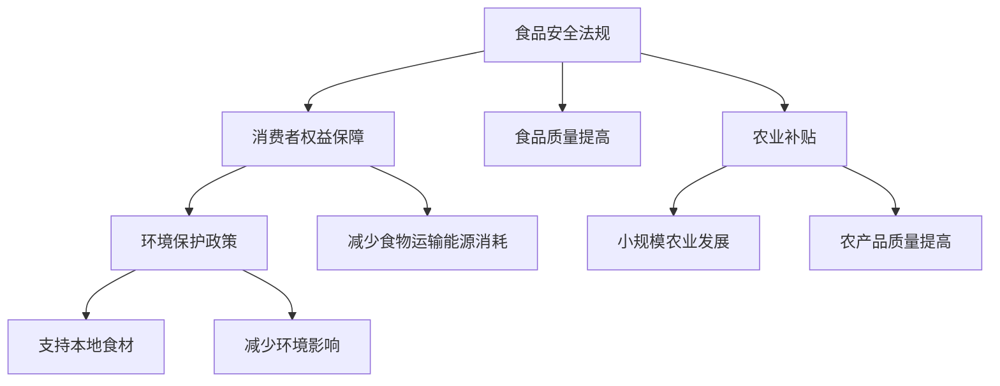

##### 7.1.2 国际合作与慢食文化的传播

国际合作在慢食文化的推广中具有重要意义。通过国际合作，可以促进不同国家和地区之间的慢食文化交流，共同推动慢食文化的发展。

1. **国际慢食节**：举办国际慢食节，吸引各国美食家和消费者参与，提高慢食文化的国际知名度。
2. **跨国合作项目**：与国外慢食组织合作，共同开展慢食推广项目，分享经验，互相学习。
3. **国际交流会议**：定期举办国际交流会议，讨论慢食文化的发展趋势和挑战，为慢食文化提供新的思路和方向。

**国际合作与慢食文化传播的Mermaid流程图：**

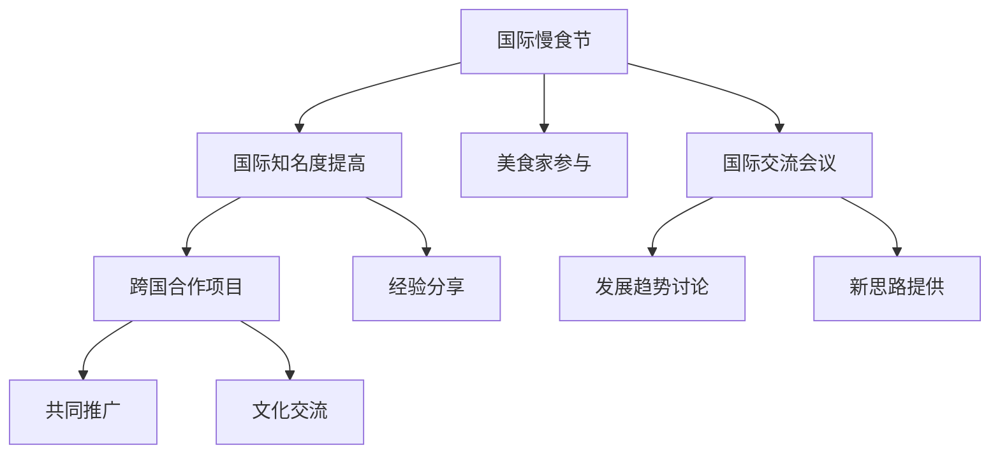

##### 7.1.3 慢食文化复兴的可持续发展路径

慢食文化复兴的可持续发展需要从多个方面进行考虑，包括经济、社会和环境等方面。以下是一些具体的可持续发展路径：

1. **经济可持续发展**：通过发展慢食产业，创造就业机会，提高农民收入，促进地方经济发展。
2. **社会可持续发展**：通过慢食教育，提高公众对慢食的认识和接受度，增强社会凝聚力。
3. **环境可持续发展**：通过减少食物运输和浪费，保护生态环境，实现可持续发展。

**慢食文化复兴的可持续发展路径Mermaid流程图：**

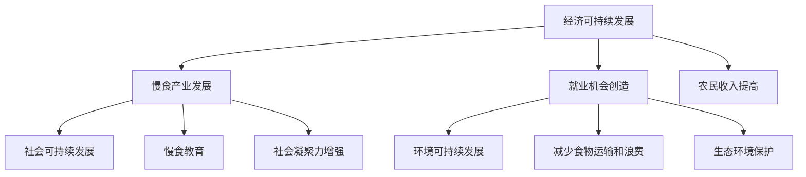

### 第四部分：慢食文化复兴的未来展望

#### 第8章：慢食文化复兴的挑战与机遇

##### 8.1.1 慢食文化复兴面临的挑战

慢食文化复兴虽然充满希望，但同时也面临着诸多挑战。

1. **文化认同**：在全球化的背景下，不同文化之间的认同差异可能影响慢食文化的推广。
2. **经济成本**：慢食文化倡导使用新鲜、本地、有机的食材，可能增加食品的成本，对低收入人群造成压力。
3. **资源配置**：慢食文化需要大量的时间和精力投入，如何平衡工作与生活，提高慢食的便利性，是一个挑战。

**慢食文化复兴面临的挑战Mermaid流程图：**

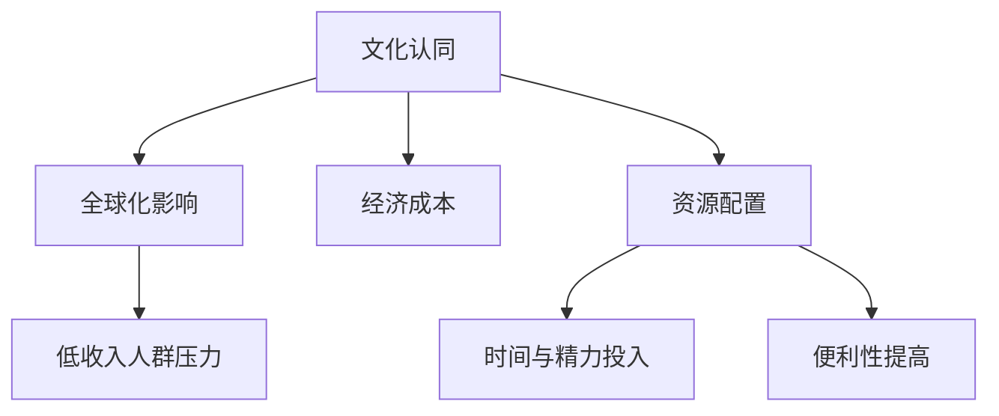

##### 8.1.2 慢食文化复兴的机遇与前景

尽管面临挑战，慢食文化复兴也拥有巨大的机遇和光明的前景。

1. **健康意识提升**：随着人们对健康饮食的关注度提高，慢食文化的市场需求不断增加。
2. **可持续发展需求**：环保意识的增强和可持续发展的需求，为慢食文化的推广提供了良好的社会环境。
3. **科技创新**：科技的进步为慢食文化提供了新的工具和方法，如智能厨具和在线烹饪课程，提高了慢食的便利性。

**慢食文化复兴的机遇与前景Mermaid流程图：**

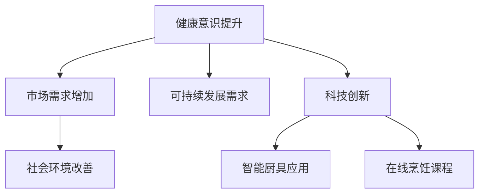

#### 第9章：慢食文化的国际视野与本土化实践

##### 9.1.1 慢食文化的国际发展现状

慢食文化在国际上已经得到了广泛的认可和发展。各国纷纷成立了慢食组织，举办了国际慢食节，推动了慢食文化的传播和交流。

1. **欧洲**：意大利作为慢食文化的发源地，慢食运动在欧洲得到了广泛的发展。许多国家如法国、德国、西班牙等都有慢食组织的活动。
2. **美洲**：美国和加拿大也积极推广慢食文化，成立了多个慢食组织，举办了多次国际慢食节。
3. **亚洲**：日本、韩国、中国等地也逐渐兴起慢食文化，通过各种形式的宣传和推广，提高公众对慢食的认识。

**慢食文化的国际发展现状Mermaid流程图：**

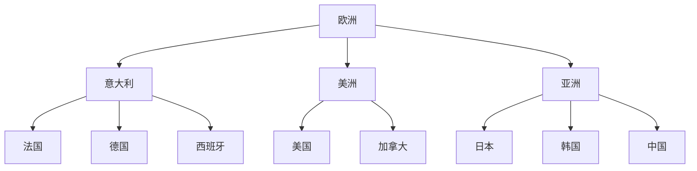

##### 9.1.2 慢食文化的本土化路径与实践

在不同国家和地区，慢食文化有着不同的本土化路径和实践。以下是一些具体的案例：

1. **日本**：日本的慢食文化强调季节性和地域性，注重食材的新鲜度和品质。许多家庭和餐馆都会根据季节变化调整菜单，提供时令美食。
2. **韩国**：韩国的慢食文化融入了传统韩食的元素，如泡菜、石锅拌饭等。韩国政府也积极推广慢食文化，通过政策支持和文化活动，提高公众对慢食的认识。
3. **中国**：中国的慢食文化融合了各地的饮食特色，如四川的麻辣、广东的清淡、北方的面食等。中国的慢食运动也通过推广传统烹饪技巧和美食文化，得到了广泛的关注和参与。

**慢食文化的本土化路径与实践Mermaid流程图：**

```mermaid
graph TD
    A[日本] --> B[季节性食材]
    A --> C[传统烹饪技巧]
    A --> D[家庭餐馆]
    B --> E[新鲜食材]
    B --> F[时令美食]
    
    G[韩国] --> H[传统韩食]
    G --> I[政策支持]
    G --> J[文化活动]
    H --> K[泡菜、石锅拌饭]
    
    L[中国] --> M[各地饮食特色]
    L --> N[传统烹饪技巧]
    L --> O[美食文化推广]
    M --> P[四川麻辣]
    M --> Q[广东清淡]
    M --> R[北方面食]
```

##### 9.1.3 慢食文化的未来发展趋势

随着全球对健康、环保和可持续发展的关注度不断提升，慢食文化的未来发展趋势也将呈现出以下特点：

1. **全球化**：慢食文化将继续在全球范围内推广，不同国家和地区之间的交流与合作将更加频繁。
2. **科技融合**：科技的进步将为慢食文化提供新的工具和方法，如智能厨具、在线烹饪课程等，提高慢食的便利性和可及性。
3. **多元化**：随着文化多样性的增加，慢食文化也将更加多元化，各地独特的饮食文化和烹饪技巧将被更多人了解和接受。

**慢食文化的未来发展趋势Mermaid流程图：**

```mermaid
graph TD
    A[全球化] --> B[国际交流与合作]
    A --> C[科技融合]
    B --> D[智能厨具]
    B --> E[在线烹饪课程]
    C --> F[全球化推广]
    C --> G[多元化发展]
```

### 第10章：总结与展望

#### 10.1.1 慢食文化复兴的意义

慢食文化复兴不仅是对现代快节奏生活的反思和回应，更是一种对自然、对人性和对生活的热爱。它强调对食物的尊重、对饮食质量的追求以及对传统饮食文化的保护，对人们的健康、环境保护和社会文化传承都有着深远的影响。

**慢食文化复兴的意义总结：**

1. **健康饮食**：慢食文化倡导新鲜、有机、本地食材，减少了化学添加剂和人工成分的摄入，有助于提高人们的健康水平。
2. **环境保护**：慢食文化减少了食物运输和浪费，降低了能源消耗和环境影响，有利于生态可持续发展。
3. **文化传承**：慢食文化保护和弘扬了传统饮食文化，增强了社会凝聚力和文化认同感。

#### 10.1.2 慢食文化复兴的未来展望

慢食文化复兴的未来充满希望。随着全球对健康、环保和可持续发展的关注度不断提升，慢食文化将继续发展壮大。在未来，我们可以期待：

1. **更广泛的推广**：慢食文化将在全球范围内得到更广泛的推广，不同国家和地区之间的交流与合作将更加频繁。
2. **科技融合**：科技的进步将为慢食文化提供新的工具和方法，如智能厨具、在线烹饪课程等，提高慢食的便利性和可及性。
3. **多元化发展**：慢食文化将更加多元化，各地独特的饮食文化和烹饪技巧将被更多人了解和接受。

**慢食文化复兴的未来展望总结：**

1. **全球性推广**：慢食文化将在全球范围内得到更广泛的认可和接受，成为全球饮食文化的重要组成部分。
2. **科技助力**：科技的发展将使慢食文化更加便捷和普及，更多的人将能够享受到慢食的乐趣。
3. **多元化融合**：慢食文化将融合各地的饮食特色，形成多元化的饮食文化体系，推动全球饮食文化的交流与共享。

### 作者信息

**作者：AI天才研究院/AI Genius Institute & 禅与计算机程序设计艺术 /Zen And The Art of Computer Programming**

