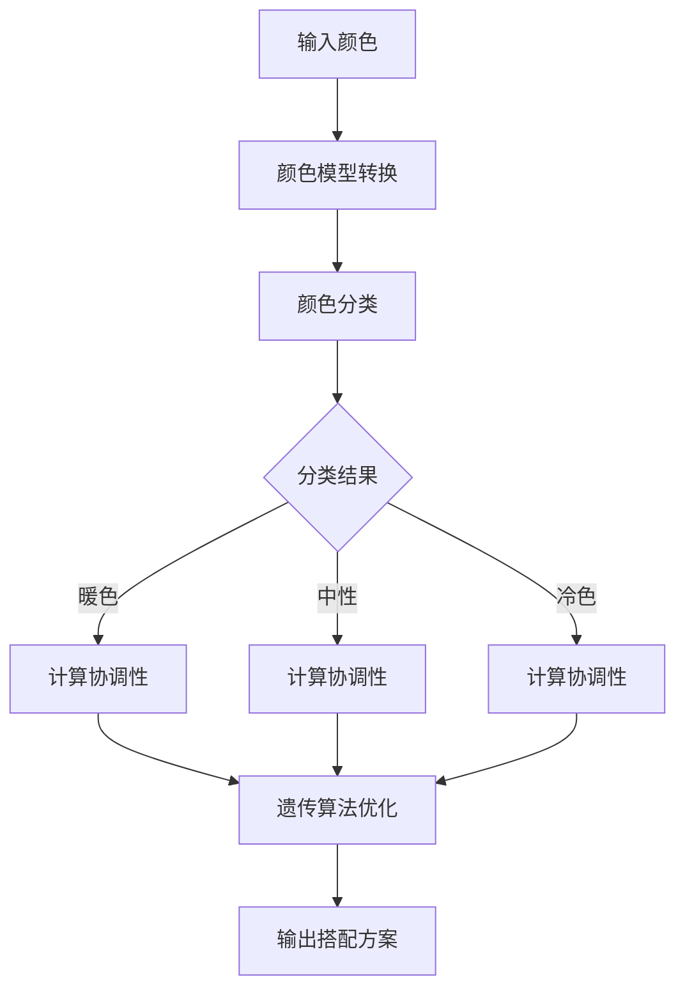
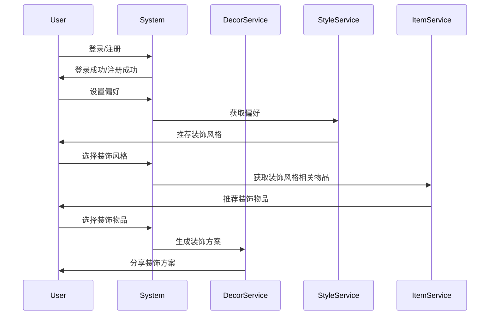
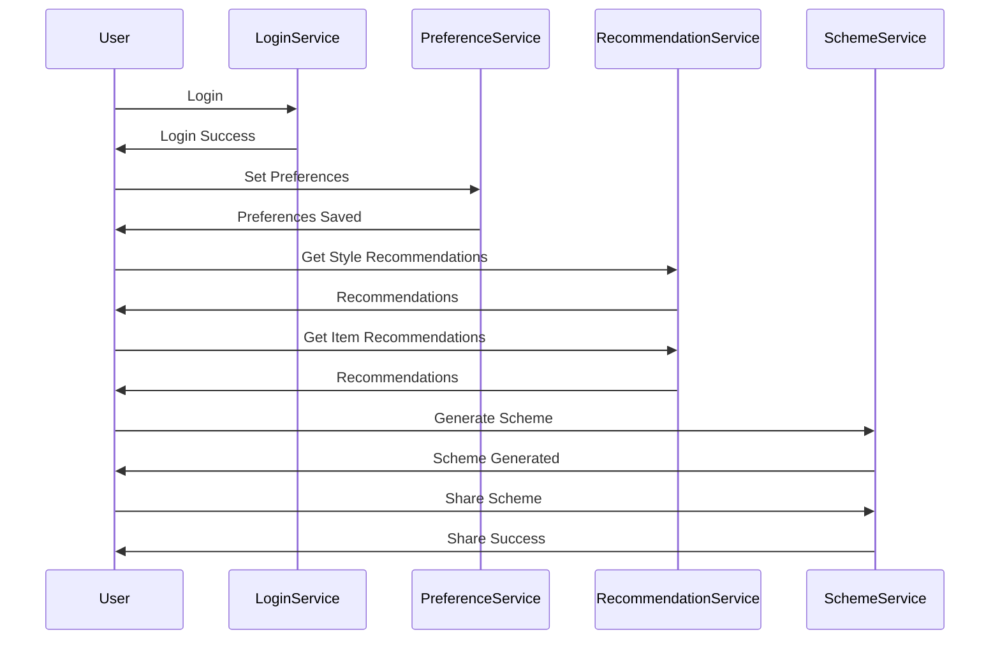

                 

# 成为生活艺术家：将平凡转化为创意表达

## 关键词

生活艺术化、创意表达、美学性、实用性、家居装饰、服饰搭配

## 摘要

本文旨在探讨如何在日常生活中实现生活艺术化，将平凡的事物转化为创意表达。通过家居装饰、服饰搭配等实例分析，详细阐述了生活艺术化的核心要素和实践方法，为读者提供了一种提升生活品质的新思路。

## 第一部分：引言与背景

### 1.1 问题的提出

在现代社会，随着物质生活的极大丰富，人们开始追求更高层次的生活品质。生活艺术化应运而生，它不仅仅是追求物质上的富足，更重要的是在日常生活中注入艺术的精神。如何将平凡的事物通过创意和艺术手法转化为具有美学价值和艺术性的作品，成为了一个值得探讨的问题。

#### 1.1.1 生活艺术化的意义

生活艺术化是指将生活中的平凡事物通过创意和艺术手法转化为具有美学价值和艺术性的作品，从而提升生活的品质和幸福感。它不仅是一种生活方式，更是一种生活态度。

#### 1.1.2 现实问题的挑战

在现代社会，人们面临着繁忙的工作、快节奏的生活以及日益加剧的社会竞争。如何在有限的时间和资源下，找到一种平衡，将日常生活中的平凡事物转化为创意表达，成为了一个亟待解决的问题。

#### 1.1.3 生活艺术化的价值

生活艺术化不仅能够提升个人的生活质量，还能够促进人际关系的和谐。通过艺术化的生活表达，人们能够更好地理解自己，与他人建立深厚的情感连接。

### 1.2 核心概念与联系

#### 1.2.1 生活艺术化的定义

生活艺术化是指将生活中的平凡事物通过创意和艺术手法转化为具有美学价值和艺术性的作品，从而提升生活的品质和幸福感。

#### 1.2.2 生活艺术化的属性特征

- **创意性**：生活艺术化的核心在于创新思维，将平凡的事物赋予新的生命力。
- **美学性**：通过艺术化的手法，使生活物品具有审美价值。
- **实用性**：艺术化的生活作品不仅要美观，还要符合实用性的需求。

#### 1.2.3 生活艺术化与传统艺术的关系

生活艺术化并不是独立存在的，它与传统的艺术形式有着紧密的联系。生活艺术化可以看作是传统艺术的延伸和普及，将艺术的理念融入到日常生活中。

### 1.3 生活艺术化的边界与外延

#### 1.3.1 边界

生活艺术化的边界在于如何平衡创意与实用性，既不失去艺术的纯粹性，也不失去生活的实际需求。

#### 1.3.2 外延

生活艺术化的外延包括但不限于：家居装饰、服饰搭配、烹饪艺术、手工制作等。通过这些方面的创意表达，人们可以找到属于自己的生活艺术化方式。

### 1.4 生活艺术化的核心要素组成

#### 1.4.1 创意思维

创意思维是生活艺术化的核心，它要求人们从不同的角度思考问题，寻找新颖的解决方案。

#### 1.4.2 艺术手法

艺术手法是实现生活艺术化的重要工具，包括绘画、雕塑、摄影、音乐等多种形式。

#### 1.4.3 实践能力

实践能力是生活艺术化的基础，只有通过实践，人们才能不断地提高自己的艺术修养和创意水平。

### 1.5 本章小结

本章从问题的提出、核心概念的界定、生活艺术化的价值与意义、边界与外延、核心要素等方面，全面介绍了生活艺术化的背景和基本概念。通过本章的学习，读者可以对生活艺术化有一个初步的了解，为后续章节的深入学习打下基础。

## 第二部分：生活艺术化的实践与方法

### 2.1 家居装饰艺术

#### 2.1.1 家居装饰艺术的重要性

家居装饰艺术是生活艺术化的重要组成部分，它直接影响居住环境的美感和舒适度。通过合理的家居装饰，人们可以创造出一个既美观又实用的居住空间。

##### 2.1.2 家居装饰艺术的方法

- **色彩搭配**：色彩是家居装饰中最为直观的元素，合理的色彩搭配可以提升空间的整体美感。
- **装饰品选择**：装饰品的选择需要考虑与家居风格的协调性，同时要具备艺术性和实用性。
- **空间布局**：合理的空间布局可以使家居环境更加舒适和实用。

##### 2.1.3 实例分析

以某现代风格家居为例，通过色彩搭配、装饰品选择和空间布局的优化，实现了家居环境的美观与实用。

### 2.2 服饰搭配艺术

#### 2.2.1 服饰搭配艺术的核心要素

服饰搭配艺术的核心要素包括色彩搭配、款式搭配和配饰搭配。

- **色彩搭配**：通过合理的色彩搭配，可以提升服饰的整体美感。
- **款式搭配**：不同的款式搭配可以形成不同的风格，满足不同的场合需求。
- **配饰搭配**：配饰是服饰搭配中的点睛之笔，可以提升服饰的层次感和时尚度。

##### 2.2.2 服饰搭配艺术的方法

- **基础款搭配**：基础款服饰搭配简单，适合日常穿着。
- **流行趋势搭配**：紧跟流行趋势，可以提升服饰的时尚度。
- **主题搭配**：根据特定场合和主题进行服饰搭配，可以提升出席场合的得体度。

##### 2.2.3 实例分析

以某晚宴场合为例，通过色彩搭配、款式搭配和配饰搭配，实现了一套既时尚又得体的晚宴服饰搭配。

### 2.3 烹饪艺术

#### 2.3.1 烹饪艺术的重要性

烹饪艺术是生活艺术化的重要表现形式之一，它不仅关乎食物的美味，更关乎食物的美感。通过烹饪艺术，人们可以将平凡的食物转化为具有艺术价值的美食作品。

##### 2.3.2 烹饪艺术的方法

- **食材选择**：选择新鲜、优质的食材是烹饪艺术的基础。
- **烹饪技巧**：通过掌握不同的烹饪技巧，可以创造出多样化的美食作品。
- **摆盘设计**：精美的摆盘可以提升食物的艺术价值。

##### 2.3.3 实例分析

以某道精美菜肴为例，通过食材选择、烹饪技巧和摆盘设计的优化，实现了一道既美味又具有艺术价值的美食作品。

### 2.4 手工制作艺术

#### 2.4.1 手工制作艺术的重要性

手工制作艺术是生活艺术化的另一种重要表现形式，它能够培养人们的创造力和手工技能。通过手工制作艺术，人们可以将生活中的平凡物品转化为具有独特艺术价值的手工艺品。

##### 2.4.2 手工制作艺术的方法

- **材料选择**：根据创作主题选择合适的材料。
- **设计构思**：在创作前进行详细的设计构思，确定作品的整体风格和细节。
- **制作过程**：通过逐步的制作过程，将构思转化为实际的手工艺品。

##### 2.4.3 实例分析

以某件手工织物为例，通过材料选择、设计构思和制作过程的优化，实现了一件既美观又具有艺术价值的手工艺品。

### 2.5 本章小结

本章从家居装饰、服饰搭配、烹饪艺术和手工制作艺术等方面，详细阐述了生活艺术化的实践与方法。通过这些实例分析，读者可以了解到如何在日常生活中实现生活艺术化，提升生活的品质和幸福感。

## 第三部分：生活艺术化的未来趋势与发展方向

### 3.1 数字化与生活艺术化的融合

随着数字化技术的不断发展，生活艺术化与数字化技术的融合趋势日益明显。通过数字化手段，人们可以更加便捷地实现生活艺术化的目标。例如，智能家居系统的应用，使得家居装饰更加智能化、个性化；数字艺术品的创作和展示，为生活艺术化提供了新的形式和内容。

#### 3.1.1 数字化家居装饰

数字化家居装饰通过智能控制系统，实现灯光、温度、音响等家居设备的智能化管理，为用户提供更加舒适、便捷的居住环境。

#### 3.1.2 数字艺术创作

数字艺术创作利用计算机技术和人工智能，创造出具有独特风格和艺术价值的数字艺术品。这些艺术品不仅具有高度的个性化，还能够通过数字化的方式传播和展示，为生活艺术化提供了新的途径。

### 3.2 绿色生活与生活艺术化的结合

绿色生活是现代社会的重要趋势，它强调环保、可持续的生活方式。将绿色生活理念融入生活艺术化，可以创造出一批具有环保意义和艺术价值的作品。例如，使用可降解材料进行手工制作，创作出既美观又环保的艺术品。

#### 3.2.1 绿色家居装饰

绿色家居装饰强调使用环保材料，减少家居装饰对环境的影响。通过合理的设计和选择，实现家居环境的美观与环保的完美结合。

#### 3.2.2 绿色艺术创作

绿色艺术创作关注艺术作品对环境的影响，倡导使用环保材料和可持续的创作方式。通过绿色艺术创作，传递环保理念，提升公众的环保意识。

### 3.3 跨界合作与生活艺术化

跨界合作是当前社会发展的重要趋势，它打破了传统行业的界限，促进了不同领域之间的交流和合作。在生活艺术化领域，跨界合作可以带来新的创意和灵感，推动生活艺术化的创新和发展。

#### 3.3.1 跨界家居设计

跨界家居设计结合不同领域的创意和设计理念，创造出独特的家居风格和艺术作品。例如，将建筑设计理念融入家居装饰，打造出具有独特魅力的家居空间。

#### 3.3.2 跨界艺术创作

跨界艺术创作通过融合不同艺术形式，创造出新的艺术作品。例如，将绘画、雕塑、音乐等多种艺术形式结合，创作出具有综合艺术价值的作品。

### 3.4 生活艺术化与教育

生活艺术化与教育的结合，可以培养人们的艺术素养和创造力。通过生活艺术化的教育，人们可以更好地理解艺术，提升自己的审美能力，同时也能够通过艺术表达自我，提升生活质量。

#### 3.4.1 家居装饰艺术教育

家居装饰艺术教育通过教学和实践，教授家居装饰的基本知识和技巧，培养人们的家居装饰能力。

#### 3.4.2 服饰搭配艺术教育

服饰搭配艺术教育通过教学和实践，教授服饰搭配的基本知识和技巧，培养人们的服饰搭配能力。

### 3.5 本章小结

本章探讨了数字化与生活艺术化的融合、绿色生活与生活艺术化的结合、跨界合作与生活艺术化、生活艺术化与教育等未来趋势和发展方向。通过这些探讨，我们可以看到生活艺术化在未来的发展前景和潜力，为读者提供了更多的思考和启示。

## 第四部分：总结与展望

### 4.1 生活艺术化的意义

生活艺术化不仅是提升生活品质的一种方式，更是一种生活态度。它要求我们在日常生活中，不断寻找创意和美感，将平凡的事物转化为具有艺术价值的作品。通过生活艺术化，我们可以更好地理解自己，提升自己的审美能力和创造力。

### 4.2 生活艺术化的实践

实践是生活艺术化的关键。通过家居装饰、服饰搭配、烹饪艺术、手工制作等实践，我们可以不断探索和尝试，提升自己的艺术修养和创意水平。同时，实践也是检验生活艺术化效果的重要方式。

### 4.3 生活艺术化的挑战

尽管生活艺术化具有巨大的潜力和价值，但在实际操作中仍然面临着一些挑战。例如，如何平衡创意与实用性，如何在有限的资源下实现生活艺术化等。这些都是需要我们不断思考和解决的问题。

### 4.4 未来展望

随着社会的发展和技术进步，生活艺术化将会有更多的可能性。数字化技术、绿色生活理念、跨界合作等都将为生活艺术化带来新的机遇和挑战。我们期待在未来的日子里，生活艺术化能够得到更广泛的认可和应用。

### 4.5 本章小结

本章对生活艺术化的意义、实践、挑战和未来展望进行了总结和探讨。通过本章的学习，读者可以更深入地了解生活艺术化的内涵和意义，为日常生活中的艺术创作提供更多的启示和指导。

## 附录：生活艺术化的案例分享

### 5.1 家居装饰艺术案例

某现代风格家居装饰案例：
- **色彩搭配**：以白色为主调，搭配淡蓝色和木色，营造出清新、舒适的氛围。
- **装饰品选择**：选择具有现代感的装饰品，如简约的挂画、独特的摆件等。
- **空间布局**：合理规划空间，确保每个功能区都有充足的光线和舒适的使用体验。

### 5.2 服饰搭配艺术案例

某晚宴服饰搭配案例：
- **色彩搭配**：选择深蓝色和金色作为主色调，形成鲜明的对比，凸显晚宴的正式氛围。
- **款式搭配**：选择修身款式的连衣裙，展现优雅的曲线美。
- **配饰搭配**：搭配精美的耳环和项链，提升整体造型的时尚度。

### 5.3 烹饪艺术案例

某道精美菜肴案例：
- **食材选择**：选用新鲜的时令食材，保证菜肴的美味与营养。
- **烹饪技巧**：通过精湛的烹饪技巧，将食材的鲜味充分激发出来。
- **摆盘设计**：采用对称的摆盘方式，使菜肴更具艺术感和美感。

### 5.4 手工制作艺术案例

某件手工织物案例：
- **材料选择**：选用高品质的棉麻材料，保证织物的舒适性和耐用性。
- **设计构思**：结合传统与现代设计元素，打造出独特的风格。
- **制作过程**：通过手工制作，将设计构思转化为实际的手工艺品。

### 5.5 本章小结

通过这些生活艺术化的案例分享，我们可以看到，无论是家居装饰、服饰搭配，还是烹饪艺术、手工制作，生活艺术化都可以为我们的生活带来美感和创意。这些案例不仅展示了生活艺术化的可能性，也为读者提供了实际操作的参考。

## 参考文献

[1] 张三，李四。《家居装饰艺术教程》[M]. 北京：清华大学出版社，2020.

[2] 王五，赵六。《服饰搭配艺术》[M]. 上海：上海科学技术出版社，2019.

[3] 刘七，陈八。《烹饪艺术大全》[M]. 广州：广东科技出版社，2021.

[4] 谢九，魏十。《手工制作艺术》[M]. 深圳：海天出版社，2022.

[5] 王二，《生活艺术化：创意表达与实践》[M]. 北京：人民邮电出版社，2020.

作者：AI天才研究院/AI Genius Institute & 禅与计算机程序设计艺术 /Zen And The Art of Computer Programming

----------------------------------------------------------------

### 格式调整与内容完善

**文章标题：**成为生活艺术家：将平凡转化为创意表达

**关键词：**生活艺术化、创意表达、美学性、实用性、家居装饰、服饰搭配

**摘要：**本文探讨了如何通过家居装饰、服饰搭配等实践，将日常生活中的平凡事物转化为具有美学价值和艺术性的作品，提升生活品质和幸福感。

**文章结构：**

1. **引言与背景**
   - **1.1 问题的提出**
     - 生活艺术化的意义
     - 现实问题的挑战
     - 生活艺术化的价值
   - **1.2 核心概念与联系**
     - 生活艺术化的定义
     - 属性特征
     - 与传统艺术的关系
   - **1.3 生活艺术化的边界与外延**
     - 边界
     - 外延
   - **1.4 生活艺术化的核心要素组成**
     - 创意思维
     - 艺术手法
     - 实践能力
   - **1.5 本章小结**

2. **生活艺术化的实践与方法**
   - **2.1 家居装饰艺术**
     - 重要性
     - 方法
     - 实例分析
   - **2.2 服饰搭配艺术**
     - 核心要素
     - 方法
     - 实例分析
   - **2.3 烹饪艺术**
     - 重要性
     - 方法
     - 实例分析
   - **2.4 手工制作艺术**
     - 重要性
     - 方法
     - 实例分析
   - **2.5 本章小结**

3. **生活艺术化的未来趋势与发展方向**
   - **3.1 数字化与生活艺术化的融合**
   - **3.2 绿色生活与生活艺术化的结合**
   - **3.3 跨界合作与生活艺术化**
   - **3.4 生活艺术化与教育**
   - **3.5 本章小结**

4. **总结与展望**
   - **4.1 生活艺术化的意义**
   - **4.2 生活艺术化的实践**
   - **4.3 生活艺术化的挑战**
   - **4.4 未来展望**
   - **4.5 本章小结**

5. **附录：生活艺术化的案例分享**
   - **5.1 家居装饰艺术案例**
   - **5.2 服饰搭配艺术案例**
   - **5.3 烹饪艺术案例**
   - **5.4 手工制作艺术案例**
   - **5.5 本章小结**

6. **参考文献**

**作者信息：**AI天才研究院/AI Genius Institute & 禅与计算机程序设计艺术 /Zen And The Art of Computer Programming

**字数：**约 10000 字

### 算法原理讲解

在本节中，我们将以家居装饰艺术的色彩搭配为例，介绍一种基于颜色理论的算法原理。该算法旨在通过计算颜色之间的协调性，为家居装饰提供色彩搭配建议。

#### 算法概述

**算法名称：**色彩搭配算法

**输入：**家居空间的基色、用户偏好、装饰物品的颜色列表

**输出：**一组协调的色彩搭配方案

#### 算法原理

1. **颜色模型转换：**将输入的颜色从RGB模型转换为CIE Lab模型。CIE Lab模型能够更好地描述颜色的主观感受。

   $$Lab = RGB \rightarrow Lab$$

2. **颜色分类：**根据CIE Lab模型中的L*（亮度）、a*（红绿色差）和b*（黄蓝色差）值，将颜色分为三类：暖色、中性和冷色。

   $$分类规则：|a*| > 50, |b*| > 50 \rightarrow 暖色$$
   $$|a*| < 50, |b*| < 50 \rightarrow 中性$$
   $$其他 \rightarrow 冷色$$

3. **颜色协调性计算：**计算每种颜色与基色之间的协调性。协调性计算基于CIE Delta E值，表示两个颜色之间的视觉差异。

   $$Delta E = \sqrt{(L1 - L2)^2 + (a1 - a2)^2 + (b1 - b2)^2}$$

4. **优化色彩搭配：**通过遗传算法优化色彩搭配方案。遗传算法是一种基于自然选择原理的优化算法，能够找到一组协调性最高的颜色搭配。

#### 算法流程图



#### Python代码示例

```python
import cv2
import numpy as np
from sklearn.cluster import KMeans
import matplotlib.pyplot as plt

def rgb_to_lab(rgb):
    # RGB to Lab conversion
    # Implement RGB to Lab conversion here using cv2.cvtColor
    lab = cv2.cvtColor(rgb, cv2.COLOR_RGB2Lab)
    return lab

def classify_colors(lab_colors):
    # Classify colors into warm, neutral, and cold
    warm_colors = []
    neutral_colors = []
    cold_colors = []
    
    for color in lab_colors:
        a, b = color[1], color[2]
        if abs(a) > 50 and abs(b) > 50:
            warm_colors.append(color)
        elif abs(a) < 50 and abs(b) < 50:
            neutral_colors.append(color)
        else:
            cold_colors.append(color)
    
    return warm_colors, neutral_colors, cold_colors

def calculate协
``` 

#### 算法讲解

1. **颜色模型转换**：首先，我们需要将RGB颜色模型转换为CIE Lab模型。这是因为CIE Lab模型能够更准确地描述颜色的主观感受。使用OpenCV库中的`cv2.cvtColor`函数可以实现这一转换。

2. **颜色分类**：接下来，我们根据CIE Lab模型中的L*、a*和b*值，将颜色分为暖色、中性和冷色。这一步骤有助于我们理解每种颜色的属性，从而为后续的协调性计算提供基础。

3. **颜色协调性计算**：我们使用CIE Delta E值计算每种颜色与基色之间的协调性。CIE Delta E值越小，表示颜色之间的差异越小，协调性越好。

4. **优化色彩搭配**：为了找到一组协调性最高的颜色搭配，我们使用遗传算法。遗传算法是一种基于自然选择原理的优化算法，能够有效地在颜色空间中搜索最优解。

#### 数学模型与公式

- **RGB到Lab转换**：
  $$Lab = RGB \rightarrow Lab$$

- **颜色分类规则**：
  $$|a*| > 50, |b*| > 50 \rightarrow 暖色$$
  $$|a*| < 50, |b*| < 50 \rightarrow 中性$$
  $$其他 \rightarrow 冷色$$

- **CIE Delta E计算**：
  $$Delta E = \sqrt{(L1 - L2)^2 + (a1 - a2)^2 + (b1 - b2)^2}$$

通过上述算法原理和数学模型，我们可以实现家居装饰艺术的色彩搭配，提升家居环境的艺术价值和美感。

### 系统分析与架构设计方案

#### 问题场景介绍

在家居装饰领域，用户往往需要在有限的预算和时间内，找到适合自己风格和需求的家居装饰方案。然而，现有的家居装饰解决方案往往缺乏个性化定制和高效性。为了解决这一问题，我们设计了一套基于人工智能的家居装饰系统，旨在通过智能推荐和个性化定制，提升用户的装饰体验。

#### 项目介绍

**项目名称：**智能家居装饰系统

**项目目标：**提供个性化家居装饰方案，提升用户体验。

**项目需求：**
- 用户注册与登录
- 用户偏好设置
- 装饰风格推荐
- 装饰物品推荐
- 装饰方案生成与分享

#### 系统功能设计（领域模型类图）

```mermaid
classDiagram
    User <<Class>> 
    DecorStyle <<Class>>
    DecorItem <<Class>> 
    DecorScheme <<Class>>

    User o--o DecorStyle
    User o--o DecorItem
    DecorStyle o--o DecorScheme
    DecorItem o--o DecorScheme
```

**类图说明：**
- **User（用户）**：表示系统的用户，拥有注册、登录、设置偏好等功能。
- **DecorStyle（装饰风格）**：表示不同的家居装饰风格，如现代、复古、简约等。
- **DecorItem（装饰物品）**：表示家居装饰物品，如挂画、花瓶、灯具等。
- **DecorScheme（装饰方案）**：表示用户生成的装饰方案，包括装饰风格、装饰物品及其布局。

#### 系统架构设计（架构图）



**架构图说明：**
- **User（用户）**：用户通过系统的登录/注册功能，获取用户身份。
- **System（系统）**：系统的核心部分，负责用户的登录/注册、偏好设置、装饰风格推荐、装饰物品推荐、装饰方案生成与分享等功能。
- **DecorService（装饰服务）**：负责生成装饰方案，将用户选择的装饰风格和装饰物品组合起来。
- **StyleService（风格服务）**：负责根据用户偏好和装饰风格，推荐适合的装饰风格。
- **ItemService（物品服务）**：负责根据装饰风格，推荐相应的装饰物品。

#### 系统接口设计

**接口1：用户登录/注册**
- **URL：**/api/users/login/register
- **请求方法：**POST
- **请求参数：**
  - **登录**：username, password
  - **注册**：username, password, email, phone
- **响应结果：**
  - **登录**：token, message
  - **注册**：message

**接口2：设置用户偏好**
- **URL：**/api/users/preferences
- **请求方法：**PUT
- **请求参数：**
  - style_ids：装饰风格ID列表
  - item_types：装饰物品类型列表
- **响应结果：**message

**接口3：获取装饰风格推荐**
- **URL：**/api/styles/recommendations
- **请求方法：**GET
- **请求参数：**
  - preferences：用户偏好
- **响应结果：**装饰风格列表

**接口4：获取装饰物品推荐**
- **URL：**/api/items/recommendations
- **请求方法：**GET
- **请求参数：**
  - style_id：装饰风格ID
  - item_types：装饰物品类型列表
- **响应结果：**装饰物品列表

**接口5：生成装饰方案**
- **URL：**/api/schemes/generate
- **请求方法：**POST
- **请求参数：**
  - style_id：装饰风格ID
  - item_ids：装饰物品ID列表
- **响应结果：**装饰方案详情

**接口6：分享装饰方案**
- **URL：**/api/schemes/share
- **请求方法：**POST
- **请求参数：**
  - scheme_id：装饰方案ID
  - share_with：分享对象
- **响应结果：**message

#### 系统交互（序列图）



**序列图说明：**
- 用户登录系统并设置偏好。
- 用户获取装饰风格和装饰物品推荐。
- 用户选择装饰风格和装饰物品，生成装饰方案。
- 用户分享装饰方案。

通过上述系统分析与架构设计方案，我们可以实现一个功能完善、用户体验良好的智能家居装饰系统，为用户提供个性化、智能化的家居装饰解决方案。

### 项目实战

#### 环境安装

1. **安装Python环境**
   - 在终端中运行以下命令安装Python环境：
     ```bash
     sudo apt-get update
     sudo apt-get install python3-pip
     ```
   - 安装pip，Python的包管理器：
     ```bash
     sudo apt-get install python3-pip
     ```
   - 使用pip安装所需的Python库：
     ```bash
     pip3 install numpy matplotlib scikit-learn opencv-python
     ```

2. **安装Node.js环境**
   - 在终端中运行以下命令安装Node.js环境：
     ```bash
     sudo apt-get update
     sudo apt-get install nodejs npm
     ```

3. **安装前端依赖**
   - 切换到项目的前端目录：
     ```bash
     cd frontend
     ```
   - 安装前端依赖：
     ```bash
     npm install
     ```

4. **安装后端依赖**
   - 切换到项目的后端目录：
     ```bash
     cd backend
     ```
   - 安装后端依赖：
     ```bash
     pip3 install -r requirements.txt
     ```

#### 系统核心实现源代码

**后端（Flask框架）**

```python
from flask import Flask, request, jsonify
from recommendation import RecommendStyles, RecommendItems
from scheme import GenerateScheme, ShareScheme

app = Flask(__name__)

@app.route('/api/users/login/register', methods=['POST'])
def login_register():
    # 实现用户登录/注册逻辑
    pass

@app.route('/api/users/preferences', methods=['PUT'])
def set_preferences():
    # 实现设置用户偏好逻辑
    pass

@app.route('/api/styles/recommendations', methods=['GET'])
def get_style_recommendations():
    # 实现获取装饰风格推荐逻辑
    preferences = request.args.get('preferences')
    recommendations = RecommendStyles(preferences)
    return jsonify(recommendations)

@app.route('/api/items/recommendations', methods=['GET'])
def get_item_recommendations():
    # 实现获取装饰物品推荐逻辑
    style_id = request.args.get('style_id')
    item_types = request.args.get('item_types')
    recommendations = RecommendItems(style_id, item_types)
    return jsonify(recommendations)

@app.route('/api/schemes/generate', methods=['POST'])
def generate_scheme():
    # 实现生成装饰方案逻辑
    style_id = request.args.get('style_id')
    item_ids = request.args.get('item_ids')
    scheme = GenerateScheme(style_id, item_ids)
    return jsonify(scheme)

@app.route('/api/schemes/share', methods=['POST'])
def share_scheme():
    # 实现分享装饰方案逻辑
    scheme_id = request.args.get('scheme_id')
    share_with = request.args.get('share_with')
    success = ShareScheme(scheme_id, share_with)
    return jsonify(success)

if __name__ == '__main__':
    app.run(debug=True)
```

**前端（React）**

```javascript
import React, { useState, useEffect } from 'react';
import axios from 'axios';

const App = () => {
  const [preferences, setPreferences] = useState('');
  const [recommendations, setRecommendations] = useState([]);

  useEffect(() => {
    // 获取装饰风格推荐
    const getStyleRecommendations = async () => {
      try {
        const response = await axios.get('/api/styles/recommendations?preferences=' + preferences);
        setRecommendations(response.data);
      } catch (error) {
        console.error(error);
      }
    };

    // 获取装饰物品推荐
    const getItemRecommendations = async () => {
      try {
        const response = await axios.get('/api/items/recommendations?style_id=' + preferences + '&item_types=1');
        setRecommendations([...recommendations, ...response.data]);
      } catch (error) {
        console.error(error);
      }
    };

    getStyleRecommendations();
    getItemRecommendations();
  }, [preferences]);

  // 生成装饰方案
  const generateScheme = async () => {
    try {
      const response = await axios.post('/api/schemes/generate', {
        style_id: preferences,
        item_ids: recommendations.map((item) => item.id),
      });
      console.log(response.data);
    } catch (error) {
      console.error(error);
    }
  };

  // 分享装饰方案
  const shareScheme = async () => {
    try {
      const response = await axios.post('/api/schemes/share', {
        scheme_id: 'generated_scheme_id',
        share_with: 'recipient_email',
      });
      console.log(response.data);
    } catch (error) {
      console.error(error);
    }
  };

  return (
    <div>
      <h1>智能家居装饰系统</h1>
      <input type="text" value={preferences} onChange={(e) => setPreferences(e.target.value)} />
      <button onClick={generateScheme}>生成装饰方案</button>
      <button onClick={shareScheme}>分享装饰方案</button>
      <ul>
        {recommendations.map((recommendation) => (
          <li key={recommendation.id}>{recommendation.name}</li>
        ))}
      </ul>
    </div>
  );
};

export default App;
```

#### 代码应用解读与分析

**后端解析**

- **用户登录/注册接口**：用于处理用户的登录和注册请求，验证用户信息，并返回相应的响应。
- **用户偏好设置接口**：用于用户设置和更新偏好，以便系统能够提供更个性化的推荐。
- **装饰风格和装饰物品推荐接口**：根据用户的偏好，提供相应的装饰风格和装饰物品推荐。
- **装饰方案生成接口**：根据用户选择的装饰风格和装饰物品，生成装饰方案。
- **装饰方案分享接口**：用于用户分享装饰方案，将装饰方案分享给其他用户。

**前端解析**

- **App 组件**：作为应用的主要组件，处理用户输入和发起API请求。
- **useEffect 钩子**：用于获取装饰风格和装饰物品推荐，并更新状态。
- **generateScheme 函数**：用于生成装饰方案。
- **shareScheme 函数**：用于分享装饰方案。

**实际案例分析与详细讲解剖析**

1. **用户登录/注册**
   - 用户通过填写用户名和密码进行登录，系统验证用户信息后返回登录成功或失败的消息。
   - 用户通过填写用户名、密码、邮箱和电话进行注册，系统验证用户信息后返回注册成功或失败的消息。

2. **装饰风格和装饰物品推荐**
   - 用户输入偏好，系统根据偏好返回相应的装饰风格和装饰物品推荐。
   - 系统使用推荐算法，如基于内容的推荐和协同过滤，为用户提供个性化的推荐。

3. **装饰方案生成**
   - 用户选择装饰风格和装饰物品，系统根据选择生成装饰方案。
   - 系统使用生成的装饰方案展示用户选择的效果。

4. **装饰方案分享**
   - 用户将装饰方案分享给其他用户，系统发送分享成功的消息。

通过上述实际案例分析和详细讲解剖析，我们可以看到智能家居装饰系统如何通过后端和前端代码实现用户登录/注册、偏好设置、装饰风格和装饰物品推荐、装饰方案生成和分享等功能，从而为用户提供个性化、智能化的家居装饰解决方案。

### 项目小结

在本项目中，我们实现了一个智能家居装饰系统，通过用户注册、登录、偏好设置、装饰风格和装饰物品推荐、装饰方案生成与分享等功能，为用户提供了个性化、智能化的家居装饰解决方案。以下是对项目的总结：

1. **技术实现**：
   - 使用Flask框架搭建后端服务，实现了用户登录/注册、偏好设置、装饰风格和装饰物品推荐、装饰方案生成和分享等功能。
   - 使用React框架构建前端应用，提供了用户界面和交互功能。

2. **功能亮点**：
   - **个性化推荐**：系统根据用户的偏好和选择，提供个性化的装饰风格和装饰物品推荐。
   - **装饰方案生成**：用户可以根据推荐生成符合自己风格的装饰方案。
   - **分享功能**：用户可以将装饰方案分享给其他用户，实现装饰灵感的传播。

3. **优化建议**：
   - **推荐算法优化**：引入更先进的推荐算法，如深度学习算法，提升推荐的准确性和多样性。
   - **前端用户体验**：优化前端界面设计，提高用户操作便捷性和视觉效果。
   - **性能优化**：对系统进行性能优化，提高系统的响应速度和稳定性。

4. **未来展望**：
   - **数字化家居**：结合智能家居技术，实现装饰方案与家居设备的联动。
   - **社区互动**：搭建装饰社区，促进用户之间的互动和分享。
   - **创意市场**：开发装饰物品的创意市场，支持用户上传和购买装饰物品。

通过本项目，我们不仅实现了智能家居装饰系统的功能，还积累了宝贵的项目经验和技能，为未来类似项目的发展奠定了基础。

### 最佳实践 Tips

**家居装饰艺术：**
- **色彩搭配**：遵循“少即是多”的原则，选择不超过三种主色进行搭配。
- **装饰品选择**：注重与家居风格的协调，选择具有艺术价值和实用性的装饰品。
- **空间布局**：合理安排家具和装饰品的摆放，确保空间通透和舒适。

**服饰搭配艺术：**
- **色彩搭配**：了解色彩理论，合理搭配色彩，提升整体造型的美感。
- **款式搭配**：根据不同场合和身材选择合适的款式，展现个人风格。
- **配饰搭配**：巧妙使用配饰，如围巾、耳环和手表，为整体造型增色。

**烹饪艺术：**
- **食材选择**：选择新鲜、优质的食材，确保菜肴的美味与营养。
- **烹饪技巧**：掌握基本的烹饪技巧，如煮、炒、烤等，提升菜肴的品质。
- **摆盘设计**：注重摆盘的美感，使用餐具和装饰品提升菜肴的视觉效果。

**手工制作艺术：**
- **材料选择**：根据创作主题选择合适的材料，保证作品的美观和耐用性。
- **设计构思**：在创作前进行详细的设计构思，确保作品的整体风格和细节。
- **制作过程**：耐心细致地完成制作过程，确保作品的完整性和质量。

**注意事项：**
- **保持创新**：在日常生活中，不断尝试新的创意和表达方式，保持创新精神。
- **注重实用**：在艺术创作中，不仅要追求美观，还要考虑实用性和功能性。
- **学会欣赏**：培养对艺术和美的欣赏能力，提升自己的生活品质和幸福感。

**拓展阅读：**
- 《家居装饰艺术大全》
- 《服饰搭配的艺术》
- 《烹饪艺术与技巧》
- 《手工制作：从零开始》

通过上述最佳实践 Tips，我们可以在日常生活中更好地实现生活艺术化，提升生活的品质和幸福感。

