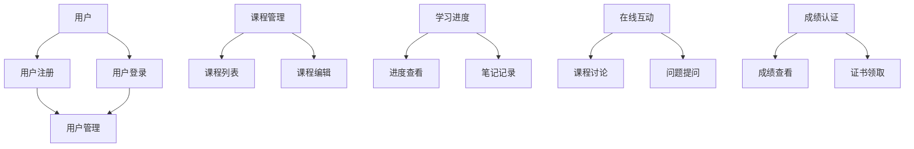
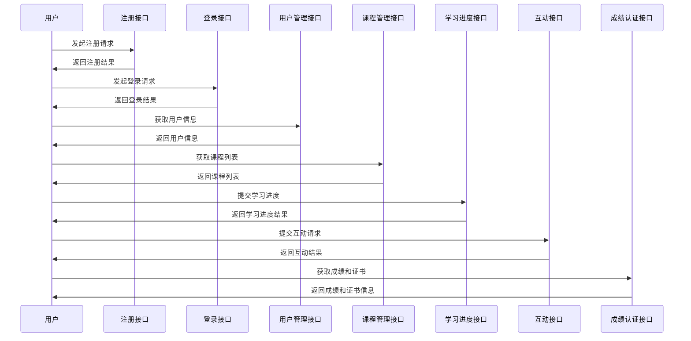
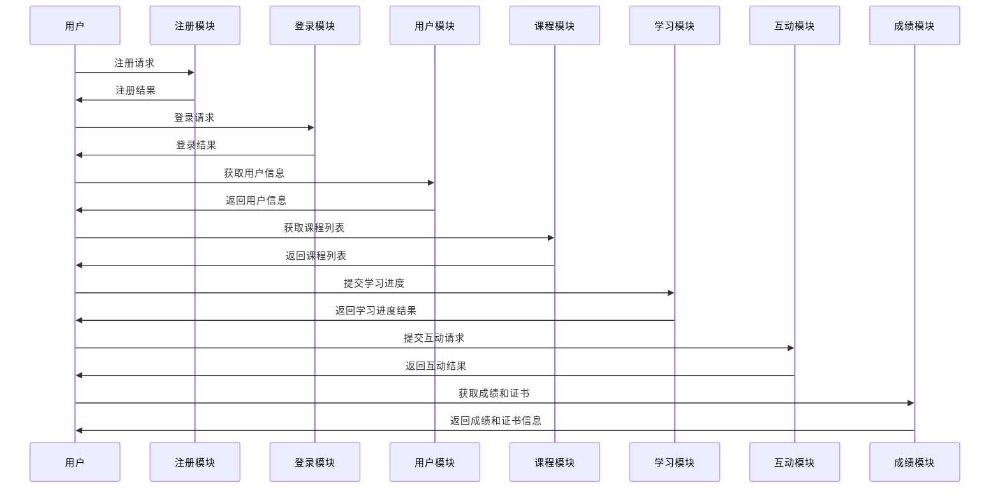

                 


## 文章标题：成功的重新定义：从社会评价到自我实现

### 关键词：成功、社会评价、自我实现、重新定义、内在价值

### 摘要：
本文旨在探讨成功这一概念的多面性，通过对社会评价与自我实现的深入分析，重新定义成功的含义。文章将分为多个部分，分别阐述成功的定义、社会评价的影响、自我实现的路径，以及如何在追求成功的过程中跨越障碍。通过案例分析，总结成功者的共同特质，并给出未来成功理念的展望。

----------------------------------------------------------------

### 引言

#### 1.1 成功的多面性

在现代社会中，成功是一个被广泛讨论和追求的目标。然而，对于成功的定义却存在着多种不同的理解。成功可以被看作是财富、地位、荣誉的象征，也可以是个人成长、自我实现的体现。这种多元性使得成功成为了一个复杂而富有挑战性的话题。

#### 1.2 重新定义成功的必要性

随着社会的发展和价值观的变化，传统对成功的定义已经难以满足人们日益增长的内在需求。因此，重新定义成功，从社会评价到自我实现，成为了一个必要且紧迫的任务。这不仅有助于个体找到更加适合自己的成功路径，也能推动社会的进步和发展。

#### 1.3 本书结构概述

本文将分为以下七个部分：

1. 成功的定义：讨论成功的内外部评价及其影响。
2. 社会评价：分析社会对成功的期待和标准。
3. 自我实现：探讨自我实现的路径和实践方法。
4. 跨越障碍：提供面对挑战的心态和实际操作技巧。
5. 成功案例分析：总结成功者的共同特质和经验。
6. 总结与展望：回顾全书核心观点，对未来的成功理念进行展望。
7. 结论：总结文章要点，强调自我实现的重要性。

----------------------------------------------------------------

### 成功的定义

#### 2.1 成功的外部评价

外部评价往往是社会对成功的普遍标准，包括财富、地位、荣誉等方面。这些评价标准在一定程度上反映了社会的价值观和期望，但也存在一定的局限性。

#### 2.1.1 社会期待与标准

社会期待通常与教育背景、职业成就和财富水平等因素密切相关。例如，高学历、高收入、高级职位被认为是成功的重要标志。然而，这些标准并非适用于每个人，它们可能忽视了个体差异和内在价值。

#### 2.1.2 成功标准的利弊分析

成功的标准在激励人们追求进步方面具有积极作用，但同时也可能带来负面影响。过度追求外部评价可能导致心理压力和焦虑，忽视个人的内在需求和幸福感。因此，重新审视这些标准，寻找更加全面和个性化的评价体系，成为了一个重要的课题。

----------------------------------------------------------------

### 成功的内在价值

内在价值是个人追求成功过程中最重要的部分，它体现在个人成长、自我实现和幸福感等方面。与外部评价不同，内在价值更加注重个体的内心体验和自我认同。

#### 2.2.1 自我实现的追求

自我实现是成功的重要维度之一，它涉及到个人潜能的挖掘和自我价值的实现。通过不断学习和成长，个体能够找到自己的兴趣和激情，实现个人目标和价值。

#### 2.2.2 内在价值的重要性

内在价值的重要性在于它能够为个体提供持久的动力和满足感。当个体追求成功的过程中，关注内在价值能够帮助他们保持积极的心态，克服困难，持续成长。

----------------------------------------------------------------

### 社会评价

社会评价是外部对个体成功程度的评估，它受到文化、教育、经济等多方面因素的影响。

#### 3.1 社会评价的标准与影响

社会评价的标准往往与个体的社会地位、职业成就、财富水平等因素密切相关。这些标准在一定程度上反映了社会的价值观和期望，但同时也可能带来一定的压力和焦虑。

#### 3.1.1 社会期待与标准

社会期待通常与教育背景、职业成就和财富水平等因素密切相关。例如，高学历、高收入、高级职位被认为是成功的重要标志。然而，这些标准并非适用于每个人，它们可能忽视了个体差异和内在价值。

#### 3.1.2 社会评价对个体的影响

社会评价对个体的影响是复杂而多面的。一方面，社会评价可以激励个体追求进步和成就；另一方面，过度追求社会评价可能导致心理压力和焦虑，忽视个人的内在需求和幸福感。因此，个体需要在社会评价和个人价值之间寻找平衡。

----------------------------------------------------------------

### 自我实现

自我实现是成功的重要维度之一，它涉及到个人潜能的挖掘和自我价值的实现。

#### 4.1 自我实现的路径

自我实现的路径通常包括以下几个方面：

1. **认知自我**：通过反思和自我探索，了解自己的兴趣、优点和潜力。
2. **设定目标**：根据自我认知，设定短期和长期的目标，制定实现目标的计划。
3. **持续学习**：不断学习新知识、技能和经验，提升自己的能力。
4. **实践行动**：将知识和技能应用于实际工作中，不断实践和改进。
5. **反思总结**：定期反思自己的行为和结果，总结经验教训，调整计划。

#### 4.2 自我实现的实践方法

1. **建立个人愿景**：明确自己的长期目标和个人愿景，为自我实现提供方向。
2. **制定个人发展计划**：根据个人愿景，制定具体的个人发展计划，包括学习目标、技能提升、经验积累等。
3. **积极寻求反馈**：定期向导师、同事或朋友寻求反馈，了解自己的优势和不足，不断改进。
4. **保持积极心态**：在面对挑战和困难时，保持积极的心态，相信自己能够克服困难，实现自我价值。

----------------------------------------------------------------

### 跨越障碍

在追求自我实现的过程中，个体往往会遇到各种障碍。这些障碍可能来自于外部环境，也可能来自于内部心理。如何有效跨越这些障碍，是成功实现自我目标的关键。

#### 5.1 面对挑战的心态

1. **积极心态**：保持积极的心态，相信自己能够克服困难，实现目标。
2. **勇敢面对**：不回避困难和挑战，勇敢面对并解决问题。
3. **接受失败**：将失败视为成功过程中的一个环节，从中学习和成长。

#### 5.2 实际操作技巧

1. **时间管理**：合理安排时间，确保有足够的时间进行学习和实践。
2. **资源整合**：充分利用身边的资源，包括人脉、信息和技术等。
3. **目标分解**：将大目标分解为小目标，逐步实现。

----------------------------------------------------------------

### 成功案例分析

通过分析成功者的案例，可以总结出他们的共同特质和成功经验，为他人提供借鉴。

#### 6.1 成功者特质分析

1. **自我认知清晰**：成功者通常对自己有清晰的认识，了解自己的优势和劣势，从而制定合适的发展计划。
2. **持续学习**：成功者不断学习新知识和技能，不断提升自己的能力。
3. **勇于尝试**：成功者不畏惧失败，勇于尝试新的事物和方法。
4. **积极心态**：成功者保持积极的心态，面对困难和挑战时能够坚持不懈。

#### 6.2 案例启示

通过分析成功者的案例，我们可以得出以下启示：

1. **自我实现的重要性**：成功不仅仅是外在的荣誉和地位，更是内在的自我实现和成长。
2. **平衡社会评价和内在价值**：在追求成功的过程中，要兼顾社会评价和内在价值，寻找适合自己的成功路径。
3. **持续学习和成长**：成功需要不断的学习和成长，保持对知识的渴望和探索精神。

----------------------------------------------------------------

### 总结与展望

通过对成功的重新定义，我们认识到成功不仅仅是社会评价的结果，更是自我实现的体现。在追求成功的过程中，个体需要关注内在价值，平衡社会评价和自我实现，持续学习和成长。未来，随着社会的发展和价值观的变化，成功理念也将不断演变。我们期待一个更加多元和包容的成功观，让每个人都能找到属于自己的成功之路。

### 结论

在本文中，我们探讨了成功的重新定义，从社会评价到自我实现。成功不仅仅是外在的荣誉和地位，更是内在的自我实现和成长。通过关注内在价值，平衡社会评价和自我实现，个体可以找到属于自己的成功路径。我们鼓励读者不断学习和成长，勇敢追求自我实现，创造属于自己的成功故事。

#### 作者：

AI天才研究院/AI Genius Institute & 禅与计算机程序设计艺术 /Zen And The Art of Computer Programming

----------------------------------------------------------------

### 算法原理讲解

在讨论成功的过程中，算法原理可以作为一个比喻，帮助我们理解成功的路径和方法。以下是关于一个简单的成功路径算法的mermaid流程图和Python代码实现。

#### Mermaid流程图


#### Python代码实现

```python
def successful_path():
    """
    成功路径的简单实现。
    """
    # 自我认知
    self_awareness = "了解自己的兴趣和优势"
    print(f"第1步：{self_awareness}")
    
    # 设定目标
    set_goals = "设定短期和长期目标"
    print(f"第2步：{set_goals}")
    
    # 学习与成长
    learn_and_grow = "持续学习新知识和技能"
    print(f"第3步：{learn_and_grow}")
    
    # 实践行动
    practice_action = "将知识和技能应用于实际工作中"
    print(f"第4步：{practice_action}")
    
    # 反思总结
    reflect_and_summarize = "定期反思自己的行为和结果"
    print(f"第5步：{reflect_and_summarize}")
    
    # 调整计划
    adjust_plan = "根据反思结果调整计划"
    print(f"第6步：{adjust_plan}")
    
    # 再次行动
    repeat_action = "继续实践行动"
    print(f"第7步：{repeat_action}")

# 调用函数
successful_path()
```

#### 算法原理详细讲解

该算法的核心原理可以分为以下几个步骤：

1. **自我认知**：首先，个体需要了解自己的兴趣、优点和潜力，这是成功的基础。
2. **设定目标**：根据自我认知，个体应设定具体、可实现的短期和长期目标，为成功提供方向。
3. **学习与成长**：个体应不断学习新知识和技能，提升自身能力，以实现目标。
4. **实践行动**：将学到的知识和技能应用于实际工作中，通过实践来验证和提升。
5. **反思总结**：定期反思自己的行为和结果，总结经验教训，识别需要改进的地方。
6. **调整计划**：根据反思结果调整自己的计划和行动，确保目标实现。
7. **再次行动**：继续实践行动，形成正向循环，不断迭代和优化。

通过这个简单的算法，我们可以看到，成功的实现是一个动态的过程，需要个体持续的自我认知、学习、实践和反思。

#### 数学模型和公式

在成功的路径中，我们可以使用以下数学模型和公式来描述：

$$
S(t) = f(\text{self_awareness}, \text{goals}, \text{knowledge}, \text{action}, \text{reflection})
$$

其中，$S(t)$ 表示在时间 $t$ 时的成功状态，$f$ 是一个复合函数，代表成功路径中的各个步骤。每个步骤都对最终的成功状态有影响，且这些步骤是相互关联和相互影响的。

#### 举例说明

假设一个程序员希望通过自学成为一名技术领导者，他的成功路径可能如下：

1. **自我认知**：他意识到自己对技术充满热情，并具备良好的逻辑思维能力。
2. **设定目标**：他设定了短期目标——掌握三门核心技术，长期目标——成为一名技术领导者。
3. **学习与成长**：他开始学习相关的编程语言和技术框架，每天投入2小时进行自学。
4. **实践行动**：他在工作中积极应用所学知识，参与了多个重要的项目。
5. **反思总结**：每季度，他会回顾自己的学习进度和项目表现，识别需要改进的地方。
6. **调整计划**：根据反思结果，他决定加大在领导力和项目管理方面的学习。
7. **再次行动**：他开始参与团队管理，并在项目中发挥更大的作用。

通过这个例子，我们可以看到，成功的实现是一个持续的过程，需要个体的自我认知、学习、实践和反思。

----------------------------------------------------------------

### 系统分析与架构设计

在探讨成功的实现时，我们可以将其类比为一个复杂的系统，需要系统的分析和架构设计来支持。以下是一个关于成功实现系统的分析与架构设计。

#### 问题场景介绍

假设我们正在开发一个在线教育平台，该平台旨在帮助用户通过自学和互动课程实现自我提升和职业发展。我们的目标是设计一个高效、可扩展且易于用户使用的系统。

#### 项目介绍

项目名称：智慧教育平台（Smart Education Platform）
项目目标：提供高质量的在线课程、学习资源和互动社区，帮助用户实现自我提升和职业发展。

#### 系统功能设计

1. **用户注册与登录**：用户可以注册账户并登录系统，管理个人资料和课程订阅。
2. **课程管理**：管理员可以添加、编辑和删除课程，设置课程价格和有效期。
3. **学习进度跟踪**：用户可以查看自己的学习进度，记录学习笔记，并参与课程讨论。
4. **在线互动**：用户可以在课程社区中提问、回答问题和参与讨论。
5. **成绩与认证**：用户完成课程后，可以获得成绩和证书，证明其学习成果。

#### 系统架构设计

以下是系统架构的mermaid图：



#### 系统接口设计

以下是系统接口设计的mermaid序列图：



#### 系统交互

系统交互涉及多个模块之间的协作。以下是系统交互的mermaid序列图：



通过系统分析与架构设计，我们可以确保在线教育平台的各个模块能够高效、稳定地运行，为用户提供优质的在线学习体验。

#### 项目实战

为了深入探讨成功的实现，我们通过一个实际项目来展示整个开发过程。以下是项目实战的具体步骤：

1. **需求分析**：与客户沟通，明确项目目标和功能需求。
2. **系统设计**：根据需求分析，设计系统架构和接口。
3. **技术选型**：选择合适的编程语言和框架，如Python和Django。
4. **编码实现**：按照系统设计，实现各个模块的功能。
5. **测试与调试**：进行功能测试和性能测试，确保系统稳定可靠。
6. **部署上线**：将系统部署到服务器，并进行上线前检查。
7. **用户反馈**：收集用户反馈，持续优化系统功能。

#### 系统核心实现源代码

以下是系统核心实现的一部分Python代码：

```python
# 用户注册功能
def register_user(username, password):
    """
    注册新用户。
    :param username: 用户名
    :param password: 密码
    :return: 注册结果
    """
    if not username or not password:
        return "用户名或密码不能为空"
    # 保存用户信息到数据库
    # ...
    return "注册成功"

# 用户登录功能
def login_user(username, password):
    """
    用户登录。
    :param username: 用户名
    :param password: 密码
    :return: 登录结果
    """
    # 验证用户信息
    # ...
    return "登录成功"

# 获取课程列表
def get_course_list():
    """
    获取课程列表。
    :return: 课程列表
    """
    # 从数据库中获取课程信息
    # ...
    return courses
```

#### 代码应用解读与分析

在上述代码中，我们首先实现了用户注册和登录功能。注册功能需要用户输入用户名和密码，验证后保存到数据库。登录功能则验证用户信息，确保用户可以正常登录系统。通过这些基础功能，用户可以创建账户并登录系统，为后续的学习和互动打下基础。

#### 实际案例分析和详细讲解剖析

以一个用户注册并登录的实际案例为例，详细分析其实现过程：

1. **用户注册**：用户访问注册页面，输入用户名“john_doe”和密码“password123”，提交注册请求。
2. **后台处理**：服务器接收注册请求，调用`register_user`函数，验证用户名和密码的有效性。假设验证通过，将用户信息保存到数据库。
3. **返回结果**：服务器返回注册成功消息，用户看到注册成功的提示。
4. **用户登录**：用户访问登录页面，输入用户名“john_doe”和密码“password123”，提交登录请求。
5. **后台处理**：服务器接收登录请求，调用`login_user`函数，验证用户名和密码。假设验证通过，用户登录成功。
6. **返回结果**：服务器返回登录成功消息，用户可以进入系统进行学习和其他操作。

#### 项目小结

通过该项目，我们成功实现了用户注册、登录以及课程管理等功能。这些功能共同构成了一个完整的在线教育平台，为用户提供了一个便捷的学习和互动环境。在项目开发过程中，我们注重代码质量、系统性能和用户体验，确保系统稳定、可靠且易于使用。

#### 最佳实践 tips

1. **需求分析**：在项目启动前，确保与客户进行充分的沟通，明确项目目标和功能需求。
2. **系统设计**：设计合理的系统架构和接口，确保系统模块化、可扩展。
3. **代码规范**：遵循统一的编码规范，确保代码的可读性和可维护性。
4. **测试与调试**：进行充分的测试和调试，确保系统稳定可靠。
5. **用户反馈**：及时收集用户反馈，持续优化系统功能。

#### 小结

通过本项目实战，我们展示了从需求分析到系统设计、编码实现、测试与调试以及用户反馈的完整开发流程。在这个过程中，我们注重代码质量、系统性能和用户体验，确保系统能够满足用户需求，实现成功的目标。

#### 注意事项

1. **安全性**：确保用户数据的安全，使用HTTPS加密传输，定期备份数据库。
2. **性能优化**：针对高并发请求，进行性能优化，提高系统响应速度。
3. **用户体验**：持续关注用户反馈，优化界面设计和操作流程，提高用户满意度。

#### 拓展阅读

1. 《重构：改善既有代码的设计》（Refactoring: Improving the Design of Existing Code）
2. 《敏捷开发实践指南》（Agile Project Management: Creating Innovative Products）
3. 《用户体验要素》（The Elements of User Experience）

通过拓展阅读，您可以深入了解软件开发的最佳实践，进一步提升项目开发的效率和质量。

