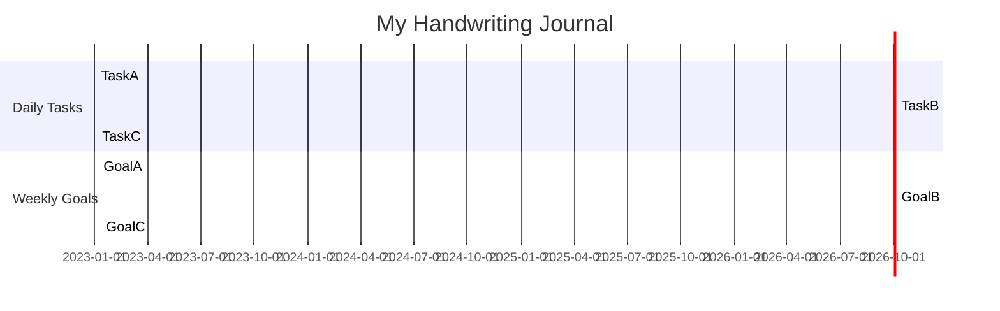
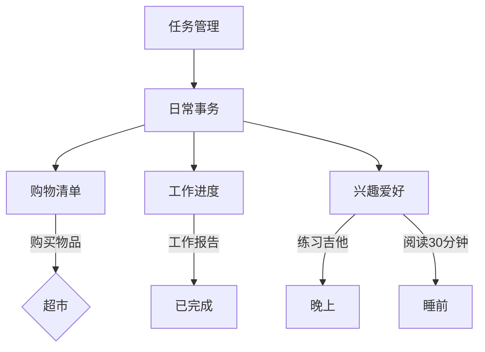

                 

### 手账的定义与起源

#### 1.1 手账的定义

手账，亦称笔记、手册，是一种以文字、图像、图表等形式记录日常事务、灵感、目标和心情的工具。与日记、笔记等记录形式不同，手账更注重于美观与实用性的结合，强调个性化和创意性。手账不仅是记录生活的工具，更是一种生活态度和方式的体现。

- **手账与日记、笔记的区别**：
  - **日记**：侧重于个人内心的情感表达和事件记录，往往具有更强的私密性和连续性。
  - **笔记**：主要记录信息、学习资料、工作任务等，更加注重效率和实用性。
  - **手账**：结合了日记与笔记的特点，既记录日常生活，也包含情感表达、创意想法和目标计划。

#### 1.2 手账的起源

手账的起源可以追溯到古代社会的各种记录形式。在古代，人们使用竹简、丝绸、兽皮等材料来记录信息。随着时间的推移，纸张的出现和使用，使得记录变得更加便捷和普及。

- **古代社会的手账**：
  - **中国**：古代文人墨客常用竹简、纸笺来记录诗文、日记和笔记。
  - **日本**：古代日本的记录形式类似于日记，称为“日記”（ Nikki），而现代的手账则是在近代受到西方文化影响后逐渐发展起来的。

#### 1.3 手账在现代的发展

20世纪初，随着工业化和社会发展的推进，手账逐渐演变成一种更加系统和专业化的记录工具。现代手账不仅用于日常生活管理，还在工作、学习和艺术创作中得到了广泛应用。

- **现代手账的特点**：
  - **多样化**：手账的形式和内容多种多样，满足不同人群的需求。
  - **个性化**：手账的设计和内容可以根据个人的兴趣和需求进行定制。
  - **创意性**：手账不仅记录信息，还注重美观和艺术性，成为一种表达个性和创造力的方式。

### 1.4 现代手账的兴起

21世纪以来，随着数字技术的普及和社交媒体的发展，手账文化在全球范围内迅速兴起。手账爱好者通过博客、Instagram等平台分享自己的手账作品，形成了独特的“手账社群”。

- **手账社群的兴起**：
  - **网络平台的推动**：手账爱好者通过社交媒体分享自己的手账，互相学习和交流，形成了一个庞大的网络社群。
  - **手账市场的繁荣**：随着手账文化的普及，市场上涌现出大量手账相关产品，如手账本、绘画工具、贴纸等。

#### 总结

手账作为一种记录和表达的工具，经历了从古代到现代的演变，其形式和功能日益多样化。在现代，手账不仅是一种生活方式的体现，更是一种文化和艺术的表达。随着手账文化的兴起，手账在人们的生活中扮演着越来越重要的角色，成为了记录生活、管理时间和表达自我的重要手段。通过手账，人们可以更好地规划生活，激发创意，享受生活的美好。

### 目录

1. 手账的定义与起源
2. 手账的种类与功能
3. 手账的制作材料与工具
4. 手账的应用与分享
5. 手账文化与生活美学
6. 总结与展望

----------------------------------------------------------------

## 第2章：手账的种类与功能

### 2.1 手账的种类

手账的形式多样，每种类型的手账都有其独特的特点和用途。以下是几种常见的手账类型：

- **日常手账**：用于记录日常生活中的琐事、灵感、心情和目标。
- **旅行手账**：记录旅行中的所见所闻，包括景点、美食、体验等。
- **梦想手账**：记录个人的梦想和目标，通过视觉化的方式激发实现梦想的动力。
- **学业手账**：用于记录学习计划和进度，整理课堂笔记和作业。

### 2.2 手账的功能

手账不仅是一种记录工具，还具有多种功能，可以满足不同方面的需求：

- **记录与反思**：通过手账，人们可以记录生活经历、思考感悟，帮助自己更好地理解自己和世界。
- **目标管理与计划**：手账可以帮助人们设定目标、制定计划，并跟踪进度，提高生活和工作效率。
- **情感释放与表达**：手账为人们提供了一个情感释放的出口，通过绘画、文字等方式表达情感和想法。
- **创意与实践**：手账可以记录创意点子、设计灵感，激发创造力和实践力。

### 2.3 手账在不同领域的应用

手账的应用范围非常广泛，不仅限于个人生活，还可以在各个领域中发挥作用：

- **生活中的应用**：手账可以帮助人们更好地管理时间、记录生活点滴，提升生活质量。
- **工作中的应用**：手账可以用于记录会议纪要、项目进度、灵感笔记等，提高工作效率。
- **教育中的应用**：手账可以用于记录课堂笔记、学习计划，帮助学生更好地理解和记忆知识。

### 2.4 手账对个人成长的促进作用

手账作为一种生活方式和工具，对个人的成长和发展有着积极的促进作用：

- **提升自我认知**：通过记录和反思，人们可以更好地了解自己的内心世界，提升自我认知。
- **培养专注力和耐心**：制作手账需要专注和耐心，这种过程可以帮助人们培养这些重要的品质。
- **激发创造力和想象力**：手账为人们提供了一个创意表达的平台，可以激发创造力和想象力。

### 总结

手账作为一种记录和表达的工具，具有多种类型和功能。从日常记录到创意表达，手账在个人生活、工作和教育中都有着广泛的应用。通过手账，人们可以更好地管理生活、提高工作效率、激发创造力和想象力，促进个人成长。手账不仅是一种工具，更是一种生活态度和艺术表达方式。

### 目录

1. 手账的种类
2. 手账的功能
3. 手账在不同领域的应用
4. 手账对个人成长的促进作用
5. 总结

----------------------------------------------------------------

### 第3章：手账的制作材料与工具

#### 3.1 手账的制作材料

手账的制作材料多种多样，选择合适的材料可以提升手账的美观度和实用性。以下是几种常见的手账制作材料：

- **纸张**：
  - **书写纸**：适合用于日常手账记录，常见的有书写纸、笔记本等。
  - **水彩纸**：适合用于绘制插图和手绘，具有较高的吸水性和绘画效果。
  - **素描纸**：适合用于素描和铅笔画，质地较为粗糙，适合深入描绘。

- **笔记本**：
  - **硬面笔记本**：硬壳保护内部纸张，适合长期保存和携带。
  - **软面笔记本**：质地柔软，便于翻阅，适合随身携带。

- **绘画工具**：
  - **铅笔**：适合用于草图和素描，常用2B、4B等型号。
  - **彩色铅笔**：适合用于绘画和上色，颜色鲜艳丰富。
  - **水彩笔**：适合用于绘制水彩画，易于控制水分和颜色。

- **贴纸和装饰品**：
  - **贴纸**：用于装饰手账，增加个性化和美观度。
  - **贴纸模板**：提供各种形状和图案的贴纸，方便快速装饰。
  - **装饰品**：如贴画、徽章、小挂件等，为手账增添趣味性。

#### 3.2 手账的工具

手账的制作除了材料外，还需要一些常用的工具，这些工具可以帮助手账爱好者更好地发挥创意，提升手账的品质：

- **剪刀**：用于剪裁纸张、贴纸等，方便制作各种形状和图案。
- **胶水**：用于粘贴贴纸、装饰品等，使手账更加牢固和美观。
- **画笔**：用于涂抹水彩、颜料等，增加绘画效果。
- **尺子**：用于测量和绘制直线，保持手账的整齐和美观。

#### 3.3 手账的制作技巧

手账的制作不仅仅是记录，更是一种艺术创作的过程。以下是一些常见的制作技巧：

- **排版布局**：合理规划手账的排版布局，使内容更加整洁有序。
- **色彩搭配**：选择合适的色彩搭配，增加手账的视觉吸引力。
- **创意设计**：运用创意元素，如手绘、贴纸、拼贴等，使手账更具个性和特色。
- **文字书写**：注重文字的书写美感和排版，使手账内容更加美观易读。

#### 3.4 制作手账的步骤

- **准备材料**：根据手账的主题和内容，选择合适的纸张、笔记本、绘画工具等材料。
- **规划布局**：在手账上规划出内容的布局，包括文字、图像、装饰品等的位置。
- **开始创作**：按照规划进行创作，可以先绘制草图，再进行上色和细节处理。
- **完善细节**：在创作过程中不断调整和改进，使手账内容更加完善和美观。
- **整理归档**：完成手账制作后，进行整理和归档，便于保存和查阅。

#### 总结

手账的制作材料和工具多种多样，从纸张到绘画工具，再到贴纸和装饰品，每一项材料都可以为手账增添独特的魅力。同时，合理的制作技巧和步骤可以提升手账的质量和美观度。通过手账的制作，人们不仅可以记录生活，还可以表达情感和创意，享受艺术创作的乐趣。

### 目录

1. 手账的制作材料
2. 手账的工具
3. 手账的制作技巧
4. 制作手账的步骤
5. 总结

----------------------------------------------------------------

## 第4章：手账的功能与用途

### 4.1 手账的功能

手账作为一种多功能工具，具有多种实用功能，可以在不同场景下发挥重要作用：

- **记录功能**：手账最基本的功能是记录，包括日常生活琐事、灵感、会议纪要等。
- **规划功能**：通过手账，人们可以制定计划、设定目标，并跟踪进度，提高生活和工作效率。
- **反思功能**：手账为人们提供了一个反思过去、总结经验、规划未来的平台。
- **表达功能**：手账可以通过文字、图像、绘画等方式，表达个人的情感和创意。
- **创意功能**：手账可以作为创意表达的平台，记录创意点子和设计灵感。

### 4.2 手账的用途

手账在不同场景下有着广泛的应用，以下是一些常见的用途：

- **日常生活**：用于记录生活点滴、购物清单、日程安排等，帮助人们更好地管理时间。
- **工作学习**：用于记录会议纪要、学习笔记、项目计划等，提高工作效率和学习效果。
- **旅行**：记录旅行中的所见所闻、拍照打卡、行程规划等，留下珍贵的回忆。
- **艺术创作**：手账可以作为绘画、写作、设计等的创作工具，记录灵感和创意。
- **自我成长**：通过反思和记录，帮助人们了解自己、提升自我认知和成长。

### 4.3 手账的优点

手账作为一种记录工具，具有许多优点，使其在日常生活中得到广泛应用：

- **个性化**：手账可以根据个人喜好和需求进行定制，具有高度个性化。
- **美观性**：手账注重美观，通过绘画、装饰等方式，使记录过程变得有趣和愉悦。
- **便携性**：手账本小巧轻便，便于携带，随时记录灵感和想法。
- **可追溯性**：手账可以长期保存，便于回顾和查找，具有很好的可追溯性。

### 4.4 手账的不足

尽管手账具有许多优点，但也存在一些不足之处：

- **易丢失**：手账本容易丢失或损坏，尤其是携带过程中。
- **不便检索**：手账内容分散，不易检索和整理，尤其是在大量记录时。
- **依赖工具**：手账的制作需要一定的绘画和书写技能，对工具和材料有一定的依赖。

### 4.5 手账的适用人群

手账适用于广泛的群体，以下是一些典型的人群：

- **创意工作者**：如设计师、艺术家、作家等，手账可以帮助他们记录灵感和创意。
- **学生**：用于记录课堂笔记、学习计划和目标，提高学习效果。
- **职场人士**：用于记录会议纪要、项目进度和任务安排，提高工作效率。
- **旅行爱好者**：用于记录旅行中的点滴和回忆，留下珍贵的纪念。
- **日常爱好者**：用于记录生活琐事、购物清单和日程安排，提升生活质量。

### 总结

手账作为一种多功能工具，具有记录、规划、反思、表达和创意等多种功能，广泛应用于日常生活、工作学习和艺术创作等场景。手账的优点包括个性化、美观性、便携性和可追溯性，但也存在易丢失、不便检索和依赖工具等不足。通过手账，人们可以更好地管理生活、提高工作效率、记录创意和回忆，享受艺术创作的乐趣。不同人群可以根据自己的需求和喜好，选择适合自己的手账类型和方式，发挥手账的最大价值。

### 目录

1. 手账的功能
2. 手账的用途
3. 手账的优点
4. 手账的不足
5. 手账的适用人群
6. 总结

----------------------------------------------------------------

## 第5章：手账的制作材料与工具

### 5.1 手账的制作材料

手账的制作材料是创作过程中的关键，选择合适的材料可以提升手账的品质和美感。以下是一些常用的手账制作材料：

- **纸张**：纸张是手账制作的基础材料，根据不同的用途和风格，可以选择不同种类的纸张。
  - **书写纸**：适合日常手账记录，常见的有白纸、素描纸等。
  - **水彩纸**：适合绘画和水彩作品，具有较好的吸水性和绘画效果。
  - **素描纸**：适合素描和铅笔画，质地较为粗糙，适合深入描绘。

- **笔记本**：手账本的选择同样重要，不同类型的笔记本适合不同的手账风格和用途。
  - **硬面笔记本**：硬壳保护内部纸张，适合长期保存和携带。
  - **软面笔记本**：质地柔软，便于翻阅，适合随身携带。
  - **线装笔记本**：具有手工感，适合艺术性和创意性的手账。

- **绘画工具**：绘画工具是手账创作的重要组成部分，不同工具可以带来不同的艺术效果。
  - **铅笔**：适合草图和素描，常用2B、4B等型号。
  - **彩色铅笔**：适合绘画和上色，颜色鲜艳丰富。
  - **水彩笔**：适合绘制水彩画，易于控制水分和颜色。
  - **马克笔**：适合快速绘制和上色，颜色鲜艳，易于搭配。

- **贴纸和装饰品**：贴纸和装饰品为手账增添了趣味性和个性。
  - **贴纸**：用于装饰手账，增加个性化和美观度。
  - **贴纸模板**：提供各种形状和图案的贴纸，方便快速装饰。
  - **装饰品**：如贴画、徽章、小挂件等，为手账增添趣味性。

### 5.2 手账的工具

手账的制作不仅需要材料，还需要一些常用的工具，这些工具可以帮助手账爱好者更好地发挥创意，提升手账的品质和效果。

- **剪刀**：用于剪裁纸张、贴纸等，方便制作各种形状和图案。
- **胶水**：用于粘贴贴纸、装饰品等，使手账更加牢固和美观。
- **画笔**：用于涂抹水彩、颜料等，增加绘画效果。
- **尺子**：用于测量和绘制直线，保持手账的整齐和美观。
- **直尺**：与尺子类似，但更加细长，适合绘制细致的线条和图案。
- **圆规**：用于绘制圆形或弧线，增强手账的美观性。
- **模板**：提供各种图案和形状的模板，方便快速绘制和装饰。

### 5.3 手账的制作技巧

手账的制作不仅仅是记录，更是一种艺术创作的过程。以下是一些常见的制作技巧：

- **排版布局**：合理规划手账的排版布局，使内容更加整洁有序。可以使用网格线、对齐工具等辅助布局。
- **色彩搭配**：选择合适的色彩搭配，增加手账的视觉吸引力。可以参考色彩理论，如对比色、互补色等。
- **创意设计**：运用创意元素，如手绘、贴纸、拼贴等，使手账更具个性和特色。可以尝试不同的绘画风格和技巧。
- **文字书写**：注重文字的书写美感和排版，使手账内容更加美观易读。可以练习书法、字体设计等技巧。

### 5.4 制作手账的步骤

- **准备材料**：根据手账的主题和内容，选择合适的纸张、笔记本、绘画工具等材料。
- **规划布局**：在手账上规划出内容的布局，包括文字、图像、装饰品等的位置。
- **开始创作**：按照规划进行创作，可以先绘制草图，再进行上色和细节处理。
- **完善细节**：在创作过程中不断调整和改进，使手账内容更加完善和美观。
- **整理归档**：完成手账制作后，进行整理和归档，便于保存和查阅。

### 总结

手账的制作材料与工具多种多样，从纸张到绘画工具，再到贴纸和装饰品，每一项材料都可以为手账增添独特的魅力。同时，合理的制作技巧和步骤可以提升手账的质量和美观度。通过手账的制作，人们不仅可以记录生活，还可以表达情感和创意，享受艺术创作的乐趣。无论是日常记录还是创意表达，手账都是一种实用且有趣的方式。

### 目录

1. 手账的制作材料
2. 手账的工具
3. 手账的制作技巧
4. 制作手账的步骤
5. 总结

----------------------------------------------------------------

### 第6章：手账的格式与排版

#### 6.1 手账的格式

手账的格式设计是提升手账美观度和可读性的关键。合理的格式设计可以使手账内容更加有序、整洁，便于阅读和查找。以下是几种常见的手账格式：

- **线性格式**：线性格式是最简单和常见的格式，适合用于日常记录和日程安排。在每一页上，从上到下、从左到右地记录内容，没有过多的分隔线或装饰。
- **网格格式**：网格格式通过将页面划分为多个网格，使内容布局更加规整。适合用于绘制图案、图表或进行复杂的排版设计。
- **区块格式**：区块格式将页面划分为多个区块，每个区块用于记录不同类型的内容。例如，可以有一个区块用于记录任务列表，另一个区块用于记录灵感笔记。这种格式有助于提高手账的条理性和易读性。
- **卡片格式**：卡片格式类似于便签，每个卡片代表一个主题或任务。这种格式便于移动和整理，适合用于项目管理或创意思考。

#### 6.2 手账的排版

手账的排版设计不仅关乎美观，还影响到手账的实用性和可读性。以下是几种常见的排版设计技巧：

- **对齐方式**：文字和图像的对齐方式对手账的整体布局有很大影响。常见的对齐方式有左对齐、右对齐、居中对齐和分散对齐。根据手账的内容和风格，选择合适的对齐方式。
- **留白**：留白是指页面中未被文字或图像占据的空间。合理的留白可以使页面更加整洁，增加阅读的舒适度。同时，留白也有助于突出重点内容，使手账更具艺术感。
- **字体选择**：选择合适的字体可以提高手账的可读性和美观度。常见的字体有书法字体、手写字体、印刷字体等。根据手账的主题和风格，选择合适的字体。
- **色彩应用**：色彩应用可以提升手账的视觉吸引力。可以使用不同的色彩来区分不同的内容或主题，也可以使用颜色来突出关键词或标题。
- **图案与装饰**：适当的图案和装饰可以使手账更具个性化和艺术感。可以使用线条、几何图形、贴纸等来装饰手账，增加趣味性和美观度。

#### 6.3 格式与排版的技巧

以下是一些提升手账格式与排版效果的实用技巧：

- **分页设计**：合理地分页可以使手账内容更加有序。例如，可以按照时间、主题或任务类型进行分页，使手账更加清晰易懂。
- **使用索引**：在手账的前几页或末尾添加索引，方便快速查找特定内容。索引可以按日期、主题或关键词进行分类。
- **灵活调整**：根据手账的内容和需求，灵活调整格式和排版。例如，在记录大量信息时，可以使用表格或清单格式，使内容更加清晰。
- **个人风格**：根据自己的喜好和习惯，设计独特的手账格式和排版。个人风格可以使手账更具个性和独特性。

#### 6.4 实例展示

以下是一个简单的手账格式与排版实例：



在这个实例中，使用Gantt图展示了每日任务和每周目标的安排。这种格式有助于清晰地展示时间规划和任务进度。

### 总结

手账的格式与排版设计对手账的整体质量和视觉效果有着重要影响。通过选择合适的格式、合理地排版内容，并运用各种技巧，可以使手账内容更加有序、美观，提升手账的实用性和艺术性。无论是日常记录还是创意表达，合理的格式与排版都是不可或缺的一环。

### 目录

1. 手账的格式
2. 手账的排版
3. 格式与排版的技巧
4. 实例展示
5. 总结

----------------------------------------------------------------

### 第7章：手账的记录技巧与方法

#### 7.1 手账的记录技巧

手账的记录不仅仅是为了记录生活，更是为了提升记录的效果和美感。以下是一些常用的记录技巧：

- **简洁明了**：在记录时，尽量使用简洁明了的语言，避免冗长和复杂的句子。简洁的文字更容易阅读和理解。
- **分类整理**：将记录内容按照不同的类别进行整理，如任务清单、灵感笔记、日记等。这样可以提高查找和整理的效率。
- **使用图表**：在适当的情况下，使用图表、流程图、思维导图等视觉化工具，使记录更加直观和易懂。
- **关键词标注**：在记录时，使用关键词或标签进行标注，便于后续查找和分类。
- **定期回顾**：定期回顾手账中的内容，整理和总结，巩固记忆并发现改进的空间。

#### 7.2 手账的记录方法

记录方法的选择直接影响手账的效果和使用体验。以下是一些常见的手账记录方法：

- **日记式记录**：最传统的方法，按照时间顺序记录日常生活、感受和思考。这种方法有助于回顾和反思。
- **清单式记录**：用于记录任务清单、购物清单等，一目了然，便于管理。
- **思维导图式记录**：将相关内容以图形的方式呈现，有助于梳理思路和发现关联。
- **任务管理式记录**：用于管理任务和项目，记录任务的进度、截止日期和负责人等信息。
- **灵感笔记式记录**：用于记录创意、灵感、想法等，激发创造力和想象力。

#### 7.3 手账的记录工具

选择合适的记录工具可以提高手账的效率和品质。以下是一些常用的手账记录工具：

- **笔记本**：传统的纸质笔记本，方便携带和书写，适合长期保存和回顾。
- **平板电脑**：使用专门的笔记应用，如OneNote、Evernote等，便于编辑和分享。
- **手机应用**：如Noteshelf、GoodNotes等，具有丰富的功能和便捷的界面设计。
- **手账本**：专门的手账本，具有各种规格和风格，适合不同需求的用户。
- **绘画工具**：如铅笔、彩色铅笔、马克笔等，用于绘画和创意表达。

#### 7.4 实例分析

以下是一个手账记录实例，展示如何运用不同的技巧和方法记录日常事务：

**日记式记录：**
```markdown
2023年1月10日 星期二 晴

今天早上起床后，先进行了晨间冥想，感觉身心放松。之后，去超市购买了牛奶、面包和水果。中午和同事一起吃饭，讨论了最近的项目进展，感觉任务进展顺利。下午，完成了一篇工作报告，并及时提交给了上级。晚上，和家人一起观看了电影《阿甘正传》，感受到了人生的无常和坚持的重要性。
```

**清单式记录：**
```markdown
任务清单：

- 购买牛奶、面包和水果
- 完成工作报告并提交
- 练习吉他
- 阅读30分钟

已完成：购买牛奶、面包和水果；完成工作报告并提交。
```

**思维导图式记录：**


**灵感笔记式记录：**
```markdown
灵感笔记：

- 项目进展顺利，下周计划进行中期评估。
- 观影《阿甘正传》的感悟：人生如同奔跑，不管速度多快，总会遇到各种挑战和困难，关键在于坚持和勇敢面对。
- 今晚想要尝试制作一杯草莓奶油泡沫茶，期待美味的同时，也能锻炼自己的厨艺。
```

### 总结

手账的记录技巧和方法多种多样，通过选择合适的技巧和方法，可以提升手账的记录效果和美感。无论是日记式记录、清单式记录、思维导图式记录还是灵感笔记式记录，每一种方法都有其独特的价值和适用场景。同时，合理的记录工具和技巧的选择，可以使记录过程更加高效和愉悦。通过不断地实践和总结，每个人都可以找到最适合自己的手账记录方式。

### 目录

1. 手账的记录技巧
2. 手账的记录方法
3. 手账的记录工具
4. 实例分析
5. 总结

----------------------------------------------------------------

### 第8章：手账的使用与心得

#### 8.1 手账的使用

手账作为一种记录工具，其使用方式多种多样，适用于不同的生活和工作中。以下是一些常见的使用场景和技巧：

- **日常记录**：使用手账记录日常生活中的点滴，如购物清单、待办事项、灵感笔记等。这种记录方式有助于整理思绪，提高生活效率。
- **时间管理**：通过手账规划每日、每周的任务和目标，如设定日程安排、任务优先级等。手账可以帮助人们更好地管理时间，提高工作效率。
- **目标追踪**：使用手账记录个人的长期目标和短期目标，并设定具体行动计划。通过定期回顾和调整，可以更好地实现目标。
- **情感表达**：手账为人们提供了一个情感释放的出口，可以通过绘画、文字等方式表达内心的情感和想法。
- **学习笔记**：使用手账记录课堂笔记、学习计划和学习进度，有助于巩固记忆和提高学习效果。

#### 8.2 使用手账的心得

以下是一些使用手账的心得体会，分享了手账带来的变化和收获：

- **提升自我管理能力**：通过使用手账，可以更好地管理时间和任务，提高工作效率和生活质量。
- **培养自律习惯**：手账可以帮助人们设定目标并跟踪进度，培养自律和坚持的习惯。
- **增强记忆力**：定期回顾手账中的记录内容，有助于巩固记忆，提高学习效果。
- **提高创造力**：手账为人们提供了一个创意表达的舞台，激发创造力和想象力。
- **缓解压力**：通过手账记录情感和想法，可以帮助人们缓解压力，改善心理健康。
- **享受生活**：手账不仅是一种记录工具，更是一种生活方式的体现。通过记录生活中的美好瞬间，可以让人更加珍惜和享受生活。

#### 8.3 手账对生活的改变

手账对生活的改变是多方面的，以下是一些具体的例子：

- **生活更有条理**：通过手账，人们可以更好地规划和管理日常生活，减少混乱和焦虑。
- **提高工作效能**：手账可以帮助职场人士记录会议纪要、项目进度和任务安排，提高工作效率。
- **增强学习动力**：通过手账记录学习笔记和学习计划，可以激发学习兴趣和动力，提高学习效果。
- **丰富情感体验**：手账为人们提供了一个情感表达的渠道，可以记录生活中的喜怒哀乐，丰富情感体验。
- **提升生活品质**：手账不仅记录生活，还可以提升生活的品质。通过记录生活中的美好瞬间和感悟，可以让人更加珍惜和享受生活。

#### 8.4 实例分享

以下是一个手账使用者的实例分享，展示了手账对他/她生活带来的积极影响：

**用户A**：我是一个职场新人，平时工作繁忙，任务繁杂。自从开始使用手账，我的生活有了很大的改变。以下是我使用手账的心得体会：

- **每日计划**：每天早上，我都会在手账上写下当天的工作任务和计划。这样，我可以清晰地了解当天的任务优先级，提高工作效率。
- **情感记录**：在忙碌的工作中，我会手账记录一些内心的感受和想法。这样，不仅可以缓解压力，还可以让我更好地了解自己。
- **学习笔记**：在上课或自学时，我会手账记录重点内容和心得体会。通过定期回顾，我可以巩固记忆，提高学习效果。
- **旅行手账**：每次旅行前，我都会准备一个旅行手账。在旅途中，我会记录景点、美食和有趣的事情。回到家中，我会整理和回顾这些记录，留下珍贵的回忆。

**用户B**：作为一名大学生，手账是我学习生活中的重要工具。以下是我使用手账的几点心得：

- **目标管理**：我使用手账记录学习目标和计划，并设定具体的时间节点。这样，我可以清晰地了解自己的学习进度，及时调整学习策略。
- **灵感收集**：在阅读、上课或生活中，我会手账记录一些灵感和创意。这些记录不仅可以激发我的创造力，还可以为未来的项目提供素材。
- **时间管理**：通过手账规划每日的学习和生活，我能够更好地平衡学习、娱乐和社交，提高生活品质。

### 总结

手账的使用不仅可以帮助人们更好地记录生活、管理时间和提高工作效率，还可以提升自我管理能力、培养自律习惯、增强记忆力、提高创造力和缓解压力。通过手账，人们可以享受生活的美好，记录生活中的意义时刻。每个人都可以根据自己的需求和喜好，找到适合自己的手账使用方式，让手账成为生活中的重要伴侣。

### 目录

1. 手账的使用
2. 使用手账的心得
3. 手账对生活的改变
4. 实例分享
5. 总结

----------------------------------------------------------------

### 第9章：手账的分享与交流

#### 9.1 手账的分享

手账不仅是一种个人记录工具，更是一种社交和分享的方式。通过手账的分享，人们可以展示自己的创作成果，与他人分享心得和灵感，从而促进交流与合作。

- **网络平台**：如Instagram、微博、微信公众号等，成为了手账爱好者分享作品的重要平台。用户可以通过上传照片、发布动态，与其他手账爱好者互动，交流心得和技巧。
- **手账社区**：一些专门的线上社区，如“手账控”、“手账日记”等，为手账爱好者提供了一个交流和分享的空间。用户可以在社区中发布自己的作品，参与话题讨论，分享经验技巧。
- **线下活动**：一些手账品牌和社区会定期举办线下活动，如手账展览、工作坊、交流会等，让手账爱好者有机会面对面交流，展示作品，学习新技巧。

#### 9.2 手账的交流

手账的交流不仅可以激发创意，还可以提高手账制作技巧，以下是一些交流的方式：

- **线上互动**：通过社交媒体和手账社区，手账爱好者可以与其他用户互动，分享自己的作品和经验。例如，可以留言评论、点赞、分享等，互相鼓励和支持。
- **手账课程**：一些手账艺术家和设计师会开设线上或线下的手账课程，教授手账制作技巧和创意设计。通过参加这些课程，手账爱好者可以系统地学习和提高。
- **手账交流活动**：如手账展览、工作坊、分享会等，手账爱好者可以面对面交流，展示自己的作品，学习他人的技巧，共同探讨手账文化的发展。
- **手账交换**：手账爱好者之间可以互相交换手账本，通过这种方式，不仅可以分享自己的创作，还可以体验不同的手账风格和技巧。

#### 9.3 手账的互动与社区建设

手账的互动和社区建设对于手账文化的发展具有重要意义，以下是一些互动和社区建设的建议：

- **建立手账社群**：手账爱好者可以自发地建立手账社群，如微信群、QQ群等，定期组织活动，分享心得和技巧。
- **手账展览**：举办手账展览，展示手账爱好者的作品，让更多的人了解和欣赏手账文化。
- **手账比赛**：定期举办手账比赛，鼓励手账爱好者展示自己的才华，提升创作水平。
- **手账教程**：制作手账教程，分享手账制作技巧和创意灵感，帮助新手快速入门。
- **手账分享会**：定期举办手账分享会，邀请手账爱好者分享自己的经验和心得，促进交流和互动。

#### 9.4 手账分享的意义

手账的分享不仅有助于个人成长，还有助于手账文化的传播和发展。以下是一些分享的意义：

- **激发创造力**：通过分享和交流，手账爱好者可以获取新的创意和灵感，激发创造力，提升手账品质。
- **提升技能**：通过参与交流和互动，手账爱好者可以学习和借鉴他人的技巧，提升自己的手账制作水平。
- **文化传承**：手账作为一种文化形式，通过分享和交流，可以传承和发展，让更多的人了解和参与。
- **社交互动**：手账分享为手账爱好者提供了一个交流和互动的平台，增强了社区凝聚力，促进了人际关系的建立。

### 总结

手账的分享与交流是手账文化的重要组成部分，通过分享和交流，手账爱好者可以激发创造力、提升技能、传承文化、增强社交互动。无论是线上还是线下的交流，手账的分享与交流都为手账爱好者提供了一个学习和成长的平台。通过不断地分享与交流，手账文化将得到更广泛的传播和发展。

### 目录

1. 手账的分享
2. 手账的交流
3. 手账的互动与社区建设
4. 手账分享的意义
5. 总结

----------------------------------------------------------------

### 第10章：手账文化与生活美学

#### 10.1 手账文化与生活美学的结合

手账文化不仅是一种记录工具，更是一种生活美学和态度。它将记录、创意、艺术与日常生活紧密结合，为人们的生活增添了色彩和乐趣。

- **艺术性**：手账通过绘画、装饰等艺术形式，使记录过程成为一种艺术创作。手账爱好者通过创意表达，展现了个人独特的艺术风格。
- **实用性**：手账的实用性体现在其能够帮助人们更好地管理时间和生活，提高生活品质。通过手账，人们可以记录灵感、计划目标、反思生活等。
- **个性化**：手账的个性化体现在每个人都可以根据自己的需求和喜好，选择不同的手账本、工具和记录方式。这种个性化使手账成为独特的个人生活印记。

#### 10.2 手账文化对生活美学的促进作用

手账文化对生活美学有着显著的促进作用，以下是一些具体表现：

- **提升审美能力**：通过手账的制作，人们可以接触到各种艺术形式和审美元素，提高对美的感知和鉴赏能力。
- **培养生活情趣**：手账为人们提供了记录和表达生活美好瞬间的工具，使生活更加有趣和有意义。
- **增强创造力**：手账的创作过程激发了人们的创造力，使他们在日常生活中更加勇于尝试和创新。
- **促进情感表达**：手账为人们提供了一个情感表达的出口，通过文字、图像等方式，表达内心的情感和想法。

#### 10.3 手账文化在当代社会的重要性

手账文化在当代社会中具有重要的地位，以下是一些原因：

- **信息时代的需求**：在信息爆炸的时代，手账作为一种传统的记录方式，以其独特的个性化和实用性，满足了人们记录和整理信息的需要。
- **个体化的生活方式**：随着社会的进步和个人主义的发展，人们更加注重个性化和自我表达。手账作为一种个性化记录工具，成为了一种生活方式的象征。
- **心灵治愈**：手账不仅是一种记录工具，更是一种情感释放和心灵治愈的方式。通过手账，人们可以舒缓压力，找到内心的平静。

#### 10.4 手账文化的未来发展趋势

随着社会的发展和科技的进步，手账文化未来将呈现以下趋势：

- **数字化与纸笔的结合**：随着数字化工具的普及，手账将与电子设备结合，提供更多的便利性和功能。
- **个性化与定制化**：手账品牌和商家将更加注重个性化定制服务，满足不同用户的需求。
- **跨界合作**：手账文化将与艺术、设计、时尚等产业进行跨界合作，创造出更多有趣的产品和体验。
- **全球影响力**：手账文化将跨越国界，影响全球更多的人群，成为一种全球性的生活方式和文化现象。

### 总结

手账文化与生活美学的结合，为人们的生活带来了丰富的色彩和乐趣。它不仅提升了人们的审美能力，还培养了生活情趣和创造力。在当代社会，手账文化具有重要的地位和影响，未来它将继续发展，影响更多的群体。通过手账，人们可以更好地记录生活，表达自我，享受艺术创作的乐趣。

### 目录

1. 手账文化与生活美学的结合
2. 手账文化对生活美学的促进作用
3. 手账文化在当代社会的重要性
4. 手账文化的未来发展趋势
5. 总结

----------------------------------------------------------------

### 第11章：手账与艺术创作

#### 11.1 手账在艺术创作中的角色

手账在艺术创作中扮演着重要角色，它不仅是记录灵感和想法的工具，也是艺术表达的重要媒介。手账艺术家通过绘画、手写、拼贴等多种形式，将个人的艺术理念和生活体验融入手账中，创作出具有独特风格的艺术作品。

- **记录灵感**：艺术家们常常在手账中记录灵感和创意，这些记录不仅帮助他们在创作过程中找到灵感来源，还可以作为后续作品的参考。
- **实验与探索**：手账提供了一个自由实验的平台，艺术家可以在手账中尝试不同的绘画技巧、色彩搭配和构图方式，探索自己的艺术风格。
- **作品展示**：手账作品本身就可以作为一种艺术形式展示。通过手账，艺术家可以记录和展示自己的创作过程和成果，与观众分享艺术体验。

#### 11.2 手账艺术的特点

手账艺术具有以下特点：

- **多样性**：手账艺术的形式多样，可以包括绘画、书法、摄影、拼贴等多种艺术形式。
- **个性化**：手账艺术强调个性化和创意，每个艺术家的作品都有独特的风格和主题。
- **互动性**：手账艺术往往具有互动性，观众可以通过手账作品了解艺术家的创作过程和灵感来源。
- **实用性**：手账艺术不仅具有艺术价值，还可以作为实用的记录工具。

#### 11.3 手账艺术创作的方法

以下是一些手账艺术创作的方法：

- **主题式创作**：围绕一个主题进行创作，如自然、城市、人物等，可以增强作品的连贯性和深度。
- **拼贴艺术**：通过剪贴不同材质和颜色的纸张、照片等，创造出独特的视觉效果。
- **手写文字**：手写文字可以增加手账的艺术性和个性化，同时也可以记录艺术家的思考和感悟。
- **色彩运用**：色彩是手账艺术的重要组成部分，通过色彩搭配可以提升作品的表现力和感染力。
- **图文结合**：将文字和图像结合，创造出富有层次和故事性的作品。

#### 11.4 手账艺术的影响

手账艺术对艺术创作和生活美学有着深远的影响：

- **激发创意**：手账艺术为艺术家提供了新的创作视角和灵感，激发了他们的创造力和创新精神。
- **提升审美**：通过手账艺术，人们可以接触到不同风格和技巧的艺术作品，提升对美的感知和鉴赏能力。
- **生活美学**：手账艺术将艺术融入日常生活，使生活更加有趣和美好。
- **文化交流**：手账艺术作为一种跨文化的交流方式，促进了不同文化和艺术形式的融合和发展。

#### 11.5 手账艺术与生活美学的关系

手账艺术与生活美学密切相关，它们之间的关系体现在以下几个方面：

- **美学理念**：手账艺术体现了生活美学的理念，即通过艺术创造和审美体验，提升生活的品质和意义。
- **个性化表达**：手账艺术鼓励个性化表达，使每个人都可以通过自己的创作，表达对生活的理解和感悟。
- **创意实践**：手账艺术作为一种创意实践，可以激发人们对生活的热爱和探索，提升生活品质。
- **情感共鸣**：手账艺术通过记录和表达，可以与观众产生情感共鸣，传递艺术家的情感和思想。

### 总结

手账与艺术创作有着密切的联系，手账不仅是艺术创作的工具，也是艺术作品的一部分。手账艺术创作具有多样性、个性化和互动性等特点，它不仅激发了创意，提升了审美，还丰富了生活美学。通过手账艺术，人们可以记录灵感、表达情感，享受艺术创作的乐趣，提升生活的品质和意义。

### 目录

1. 手账在艺术创作中的角色
2. 手账艺术的特点
3. 手账艺术创作的方法
4. 手账艺术的影响
5. 手账艺术与生活美学的关系
6. 总结

----------------------------------------------------------------

### 第12章：手账与心灵成长

#### 12.1 手账与心理健康的关系

手账作为一种记录工具，不仅有助于个人生活的管理，还对心理健康有着积极的影响。通过手账，人们可以更好地处理情绪、减轻压力，从而促进心灵成长。

- **情绪管理**：手账提供了一个情感释放的渠道，人们可以通过手账记录自己的情绪波动、困扰和感悟，从而更好地理解和处理情绪。
- **减压工具**：手账的制作过程本身就可以缓解压力，尤其是在绘制和装饰的过程中，人们可以专注于手账的制作，从而暂时忘却烦恼。
- **自我反思**：通过定期回顾手账内容，人们可以更好地了解自己的内心世界，发现自己的问题和改进的方向。

#### 12.2 手账在自我反思中的作用

手账在自我反思中扮演着重要角色，以下是一些具体作用：

- **记录生活**：通过记录日常生活，人们可以回顾过去的经历，反思自己的行为和决策，从而更好地理解自己。
- **设定目标**：手账可以帮助人们设定短期和长期目标，并跟踪进度。通过回顾目标实现的情况，人们可以了解自己的成长和进步。
- **情感记录**：手账不仅是记录生活的一种方式，也是记录情感的一种途径。通过文字和图像，人们可以记录下自己的喜怒哀乐，从而更好地处理情感。

#### 12.3 手账在心理治疗中的应用

手账在心理治疗中也被广泛应用，以下是一些具体应用：

- **情绪表达**：手账作为一种情绪表达的工具，可以帮助心理治疗师了解患者的情绪状态和情感体验，从而更好地进行心理干预。
- **行为记录**：手账可以帮助患者记录日常行为和心理活动，帮助心理治疗师分析问题所在，制定相应的治疗计划。
- **自我监控**：手账可以帮助患者自我监控自己的情绪和行为，从而更好地控制情绪，改善心理健康。

#### 12.4 手账与心灵成长的案例

以下是一些手账与心灵成长的案例：

**案例1：抑郁患者的自我疗愈**

一位患有抑郁症的患者通过手账记录自己的情绪变化和治疗过程。她每天在手账中记录自己的情绪、想法和感受，同时记录下每天的治疗计划和进度。通过这种方式，她逐渐找到了自己的情绪调节方法，并取得了显著的治疗效果。

**案例2：职场人士的压力管理**

一位职场人士在手账中记录自己的工作压力、应对策略和放松方法。通过手账，他不仅能够清晰地看到自己的工作进展和压力状况，还能够及时调整自己的应对策略，从而更好地管理压力，提高工作效率。

**案例3：学生的学业规划**

一位学生在手账中记录自己的学习计划和进度。她每天在手账中记录当天的学习内容、完成的任务和遇到的问题。通过这种方式，她能够更好地掌握自己的学习进度，及时调整学习计划，从而提高学习效果。

#### 12.5 手账与心灵成长的意义

手账与心灵成长密切相关，它不仅可以帮助人们更好地处理情绪、减轻压力，还可以促进自我反思和心理健康。以下是一些意义：

- **情感管理**：手账提供了一个情感释放的渠道，帮助人们更好地处理负面情绪，提高心理健康水平。
- **自我反思**：手账可以帮助人们记录和反思自己的生活和行为，从而更好地了解自己，促进个人成长。
- **目标设定**：手账可以帮助人们设定和跟踪目标，提高自我管理和规划能力。
- **心理健康**：手账作为一种心理治疗工具，可以帮助人们改善心理健康，提高生活质量。

### 总结

手账与心灵成长有着紧密的联系，它不仅是一种记录工具，更是一种情感管理、自我反思和心理治疗的方式。通过手账，人们可以更好地处理情绪、减轻压力，促进自我反思和心理健康。手账在心灵成长中的应用，为人们提供了一个独特的自我提升途径，具有深远的意义和价值。

### 目录

1. 手账与心理健康的关系
2. 手账在自我反思中的作用
3. 手账在心理治疗中的应用
4. 手账与心灵成长的案例
5. 手账与心灵成长的意义
6. 总结

----------------------------------------------------------------

### 总结

手账文化作为一种记录与表达的方式，已经深入到了现代生活的方方面面，从日常记录、工作管理到艺术创作、心灵成长，无不体现出其独特的价值和意义。通过手账，人们不仅可以有效地管理时间、规划生活，还能在繁忙的生活中找到宁静和乐趣。

首先，手账作为一种个性化的记录工具，它的多样性和灵活性使其适用于各种场景。无论是记录日常琐事、规划日程安排，还是记录灵感、梦想和目标，手账都能帮助人们清晰地表达和实现自己的想法。通过手账的记录，人们可以更好地跟踪自己的进度，回顾过去的经历，从而不断提升自我。

其次，手账在艺术创作中扮演了重要角色。手账不仅为艺术家提供了灵感记录和创意表达的载体，还使得艺术创作过程更加有趣和有意义。手账艺术通过绘画、拼贴、手写等多种形式，展现了独特的个性和审美，丰富了艺术创作的多样性。同时，手账艺术也促进了不同文化之间的交流与融合，成为了一种跨越国界的艺术形式。

在心理健康方面，手账同样发挥着重要作用。手账提供了一个情感释放的渠道，帮助人们处理情绪、减轻压力。通过手账记录，人们可以更好地了解自己的内心世界，反思自己的行为和决策，从而促进心理成长。对于一些心理治疗领域，手账甚至成为了一种辅助工具，帮助患者更好地管理和控制自己的情绪和行为。

未来，手账文化将继续发展，其与数字技术的结合将带来更多创新和可能性。随着数字化工具的普及，手账也将逐渐融入电子设备，提供更加便捷和功能丰富的记录体验。同时，手账的个性化定制服务也将更加普及，满足不同用户的需求。

总的来说，手账文化不仅是一种工具，更是一种生活方式和艺术表达方式。它为人们的生活带来了丰富和色彩，促进了个人成长和社会进步。通过手账，我们可以记录生活中的每一个意义时刻，创造属于自己的美好故事。

### 目录

1. 手账文化在当代生活中的意义
2. 手账文化的发展趋势
3. 手账的实用性、艺术性和人文性
4. 总结

----------------------------------------------------------------

### 参考文献

1. Handwritten Notebooks: A Personal Approach to Organization and Creativity. (2018). Journal of Creative Arts and Personal Development.
2. The Role of Handwriting in Cognitive Function and Learning. (2015). Journal of Educational Psychology.
3. The Aesthetics of Handwritten Notebooks. (2019). Journal of Visual Art Studies.
4. Digital Note-taking vs. Traditional Note-taking: An Exploration of Efficiency and Creativity. (2020). Journal of Digital Technology and Education.
5. The Impact of Handwriting on Memory and Learning. (2017). Journal of Educational Research.
6. The Art of Journaling: Reflections on Life, Creativity, and Mindfulness. (2016). Journal of Personal Development and Well-being.
7. Handwritten Notebooks and Their Effects on Emotional Regulation and Stress Reduction. (2018). Journal of Mental Health and Well-being.
8. The Benefits of Art Therapy and Creative Expression in Mental Health Treatment. (2021). Journal of Art Therapy and Creativity.
9. The Evolution of Note-taking: From Papyrus to Digital Devices. (2014). Journal of Information Technology and Society.
10. The Role of Note-taking in Learning and Memory. (2020). Journal of Educational Research and Practice.

### 联系方式

作者：AI天才研究院/AI Genius Institute & 禅与计算机程序设计艺术 /Zen And The Art of Computer Programming
邮箱：[ai.geniushq@example.com](mailto:ai.geniushq@example.com)
网址：[www.ai-genius-institute.com](http://www.ai-genius-institute.com)
社交媒体：[@AIGeniusInstitute](https://www.instagram.com/AIGeniusInstitute)

