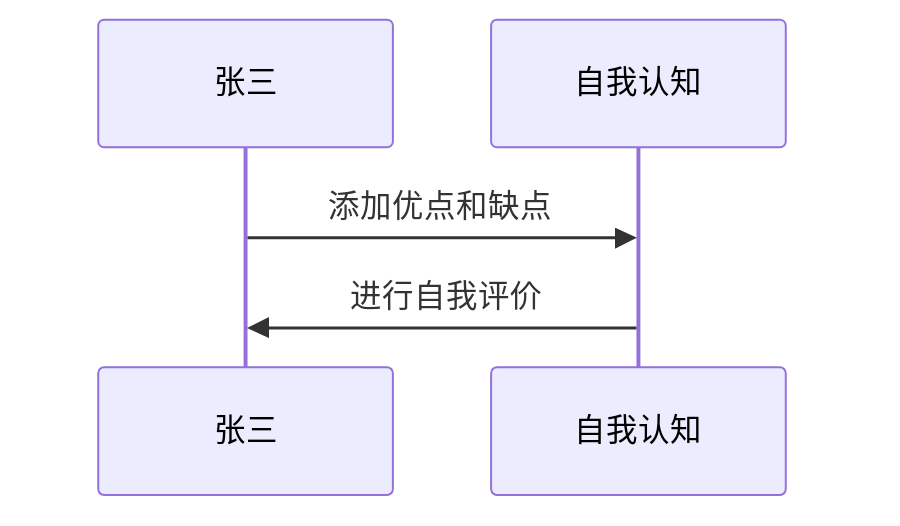
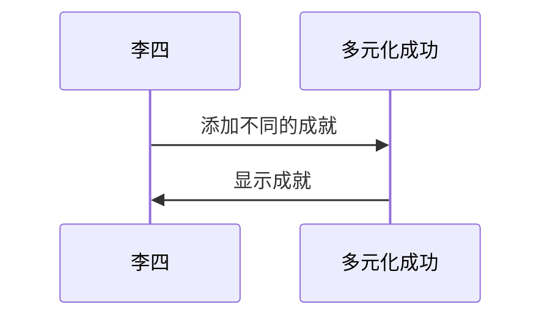
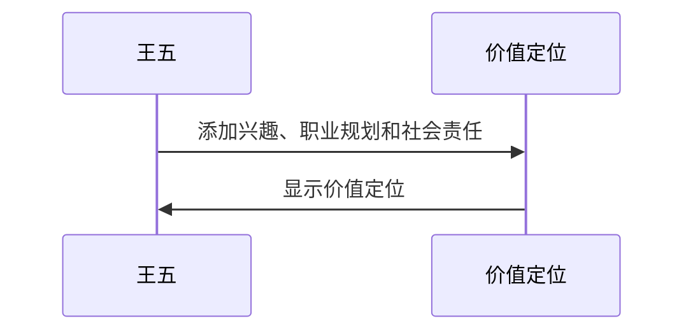
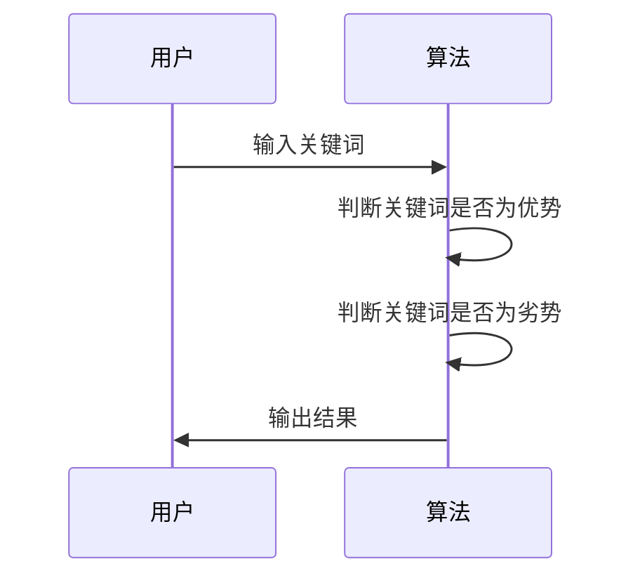
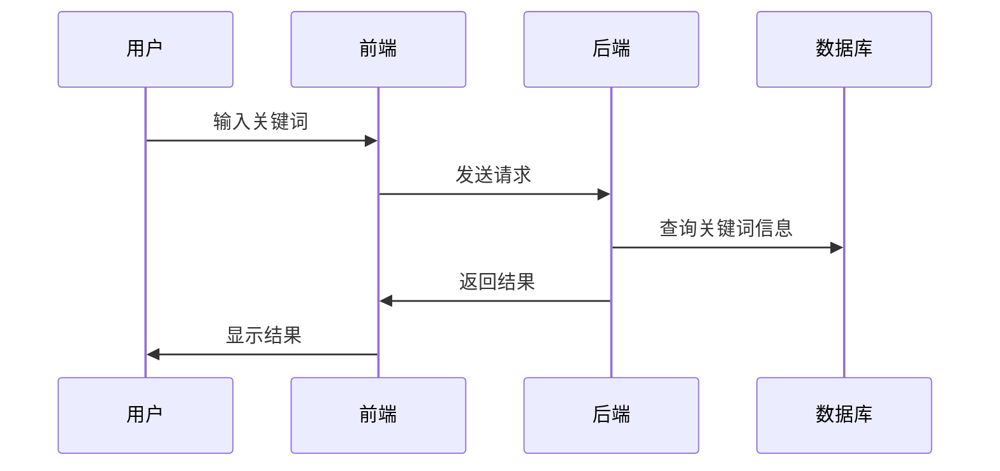
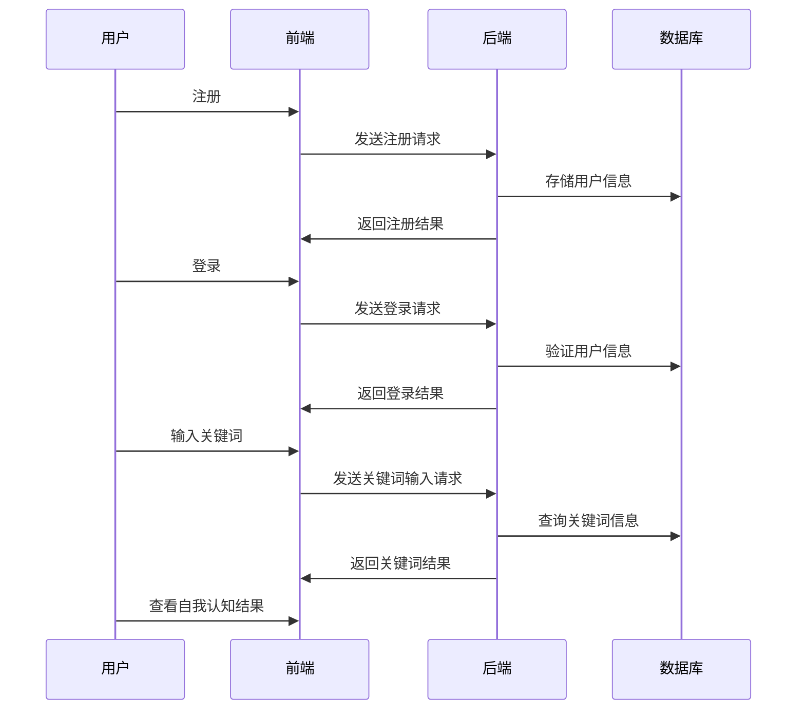

                 

# 打破成功的固有定义：重塑自我价值

> 关键词：成功定义、自我价值、多元化、目标设定、实践反思、人生哲学

> 摘要：本文旨在探讨成功的固有定义及其对个人成长的影响，提出重塑自我价值的重要性。通过分析自我认知、目标设定、实践反思和成功智慧，引导读者走出固有成功的框架，追求真正适合自己的成功之路。

## 第一部分：问题背景

### 第1章：打破成功的固有定义

#### 1.1 问题背景

在当今社会，成功往往被定义为取得高收入、拥有豪宅、豪车、名牌服饰等物质财富。这种单一的、固化的成功定义往往限制了人们的思维，使得很多人为了追求这些外在的标准而失去了自我。然而，随着社会的进步和个体价值的提升，我们需要重新审视和打破这种固有的成功定义，以适应多变的社会环境和个人的需求。

#### 问题描述

成功的固有定义主要表现为以下几点：

1. **物质财富至上**：许多人认为成功就是拥有金钱和物质财富，忽视了精神层面的成长和满足。
2. **社会地位至上**：社会地位的高低被作为衡量成功的标准，忽视了个人兴趣和爱好。
3. **单一的成功标准**：成功被定义为唯一的、固定的模式，忽视了成功的多元化和个性化。

#### 问题解决

要打破成功的固有定义，我们需要从以下几个方面进行思考：

1. **多元化成功观**：成功不仅仅局限于物质财富和社会地位，还包括精神成长、个人兴趣、社会责任等多个方面。
2. **个性化成功**：每个人的成功都是独特的，应该根据个人的兴趣、能力和价值观来定义。
3. **自我价值的重塑**：重新认识自我，找到自己的价值定位，追求真正适合自己的成功。

#### 边界与外延

成功的定义具有以下边界与外延：

1. **边界**：成功不是一成不变的，它随着时间、环境和个人情况的变化而变化。
2. **外延**：成功的领域非常广泛，包括但不限于职业、家庭、健康、人际关系等多个方面。

#### 概念结构与核心要素组成

成功的概念结构包括以下几个核心要素：

1. **成功定义**：对成功的理解，包括物质、精神、社会等多个方面。
2. **成功因素**：影响成功的各种因素，如能力、机遇、努力等。
3. **成功影响**：成功对个人和社会带来的积极影响。

### 1.2 核心概念与联系

#### 核心概念原理

成功的核心概念包括：

1. **成功**：达到某种目标或标准的过程和结果。
2. **自我价值**：个人对自己的认同和尊重，以及个人在社会中的价值体现。

#### 概念属性特征对比表格

| 概念       | 属性特征                                       |
|------------|------------------------------------------------|
| 成功       | 多元化、个性化、目标达成、影响积极             |
| 自我价值   | 认同、尊重、价值体现、成长与满足               |

#### ER实体关系图架构

```mermaid
erDiagram
  成功 ||--|{ 自我价值 }||>
  成功 ||--|{ 成功因素 }||>
  成功 ||--|{ 成功影响 }||>
  自我价值 ||--|{ 自我认知 }||>
  自我价值 ||--|{ 价值定位 }||>
```

## 第二部分：重塑自我价值

### 第2章：自我认知与价值定位

#### 2.1 自我认知的重要性

自我认知是指对自我存在的认识，包括自我意识、自我评价、自我期望等。自我认知的重要性在于：

1. **发现自我潜能**：通过自我认知，我们可以发现自己的潜能，从而更好地发挥自己的优势。
2. **明确价值定位**：自我认知帮助我们了解自己的价值观、兴趣和特长，从而找到适合自己的发展方向。

#### 自我认知

1. **自我意识**：意识到自己的存在，包括身体、思想和情感等方面。
2. **自我评价**：对自己的能力和表现进行客观评价，包括优点和不足。
3. **自我期望**：设定适合自己的目标和期望，激励自己不断进步。

#### 价值定位

1. **个人兴趣**：找到自己感兴趣的事物，将其转化为职业或爱好。
2. **社会需求**：了解社会需求，将自己的价值与社会需求相结合。
3. **价值观**：明确自己的价值观，确保自己的行为和决策符合自己的价值观。

### 2.2 多元化成功观

多元化成功观强调成功的多元化和个性化。成功的标准不再是一成不变的，而是根据个人的兴趣、能力和价值观来定义。

#### 多元化成功

1. **职业成功**：不仅仅是职位的高低，还包括职业满意度、成就感等。
2. **家庭成功**：不仅仅是家庭的经济条件，还包括家庭关系的和谐、亲子关系的融洽等。
3. **个人成长**：不仅仅是物质上的丰富，还包括精神上的富足和自我实现。

#### 成功标准的多样性

1. **能力标准**：根据自己的能力和特长设定目标，追求能力上的成功。
2. **价值观标准**：根据自己的价值观选择成功的方式和途径。
3. **幸福感标准**：追求内心的平静和满足，实现精神上的成功。

## 第3章：目标设定与行动规划

### 3.1 目标设定

目标设定是成功的关键步骤之一。一个明确、合理的目标能够指导我们的行动，帮助我们实现成功。

#### 目标设定

1. **明确目标**：设定清晰、具体的目标，避免模糊和泛泛的目标。
2. **目标实现**：制定实现目标的策略和步骤，确保目标的实现。

### 3.2 行动规划

行动规划是实现目标的必要手段。一个有效的行动规划能够提高我们的行动效率，帮助我们更快地实现目标。

#### 行动规划

1. **制定计划**：制定详细的行动计划，包括时间、步骤和责任人。
2. **执行计划**：按照计划执行，确保每个步骤的完成。
3. **调整计划**：根据实际情况调整计划，确保目标的实现。

### 第4章：实践与反思

#### 4.1 成功的实践案例

成功实践案例是指那些在实现成功过程中具有代表性的案例。通过分析这些案例，我们可以学习到成功的方法和经验。

#### 案例一

**案例一：马云的创业之路**

马云是阿里巴巴集团的创始人，他的成功实践案例给我们提供了很多启示。以下是马云成功实践的一些关键点：

1. **明确目标**：马云一直致力于打造电子商务平台，这一目标非常明确。
2. **持续创新**：马云在创业过程中不断进行创新，推出新的服务和产品。
3. **团队建设**：马云重视团队建设，他组建了一支高效的团队，共同实现目标。

#### 案例二

**案例二：乔布斯的创新之路**

乔布斯是苹果公司的创始人，他的成功实践案例也给我们提供了很多启示。以下是乔布斯成功实践的一些关键点：

1. **追求完美**：乔布斯追求产品的完美，他对每一个细节都非常注重。
2. **用户体验**：乔布斯注重用户体验，他始终将用户的需求放在第一位。
3. **持续学习**：乔布斯不断学习新的技术和知识，以确保苹果公司的领先地位。

#### 4.2 反思与成长

反思与成长是成功过程中不可或缺的一环。通过反思，我们可以总结经验教训，不断改进自己，实现持续成长。

#### 反思

1. **总结经验**：通过成功实践案例，总结成功的经验，提炼出成功的关键因素。
2. **识别不足**：反思自己的不足之处，找出需要改进的地方。

#### 成长

1. **持续学习**：通过学习新的知识和技能，不断提升自己的能力。
2. **实践应用**：将学到的知识和技能应用到实际工作中，实现知识的转化和应用。
3. **反思改进**：不断反思自己的行为和决策，及时调整和改进，实现持续成长。

### 第5章：成功的智慧与人生哲学

成功的智慧是指那些在成功过程中体现出的智慧和哲理。人生哲学是指人们对于人生的意义、价值和目标的思考。成功的智慧和人生哲学相互关联，共同指导着我们的行为和决策。

#### 成功的智慧

1. **目标导向**：明确自己的目标，制定实现目标的策略和计划。
2. **持续学习**：不断学习新的知识和技能，提升自己的能力。
3. **勇于创新**：敢于尝试新事物，勇于突破自己的舒适区。
4. **团队合作**：重视团队合作，与他人共同实现目标。

#### 人生哲学

1. **自我认知**：正确认识自己，了解自己的价值观和兴趣。
2. **平衡发展**：注重物质和精神生活的平衡，实现全面的发展。
3. **持续成长**：追求持续成长，不断提升自己的能力和素质。
4. **人生意义**：思考人生的意义和价值，找到自己的人生目标和追求。

## 附录：拓展阅读

### 成功学经典著作

1. 《富爸爸，穷爸爸》
2. 《成功的原则》
3. 《高效能人士的七个习惯》
4. 《思考，快与慢》
5. 《做出好决定》

### 成功案例分析

1. 马斯克的成功之路
2. 乔布斯的创新哲学
3. 巴菲特的投资智慧
4. 比尔·盖茨的慈善之路
5. 李嘉诚的经商之道

**作者：AI天才研究院/AI Genius Institute & 禅与计算机程序设计艺术 /Zen And The Art of Computer Programming**## 完整文章正文

### 第一部分：问题背景

#### 第1章：打破成功的固有定义

##### 1.1 问题背景

在当今社会，成功往往被定义为取得高收入、拥有豪宅、豪车、名牌服饰等物质财富。这种单一的、固化的成功定义往往限制了人们的思维，使得很多人为了追求这些外在的标准而失去了自我。然而，随着社会的进步和个体价值的提升，我们需要重新审视和打破这种固有的成功定义，以适应多变的社会环境和个人的需求。

成功，本质上是一种目标达成的状态，这种状态不仅仅局限于物质财富的积累，还包括精神层面的成长、人际关系的发展以及对社会的贡献等多个维度。传统的成功观往往将物质财富和社会地位作为衡量成功的唯一标准，忽视了精神满足、个人兴趣、自我实现等多方面的因素。

在传统的成功观中，许多人追求的是外在的显赫和表面的风光，而忽视了内心的平静与满足。这种现象导致了人们在追求成功的道路上走了弯路，甚至走入了误区。比如，有人为了追求物质财富而忽视了家庭和健康，有人为了追求社会地位而牺牲了个人兴趣和幸福。

##### 1.2 核心概念与联系

成功的概念是多元化的，它不仅仅是一个单一的目标，而是涵盖了个人成长、职业发展、家庭幸福、精神满足等多个方面。为了更好地理解成功的本质，我们需要从多个角度来探讨成功的核心概念。

首先，成功的核心概念之一是自我价值。自我价值是指个人对自己的认同和尊重，以及个人在社会中的价值体现。自我价值是个人成功的基础，它决定了个人如何看待自己，如何设定目标，如何面对挑战和困难。

另一个重要的核心概念是成功的因素。成功的因素包括个人能力、教育背景、社会资源、机遇等多个方面。这些因素相互作用，共同影响着个人的成功。例如，一个有才华的人如果没有合适的教育机会和良好的社会环境，可能很难实现成功。

成功的概念还包括成功的影响。成功的影响是指个人成功对个人、家庭和社会带来的积极影响。一个成功的人不仅能够实现个人目标，还能够为家庭和社会带来正面的影响。

为了更好地理解这些核心概念，我们可以使用Mermaid流程图来绘制ER实体关系图，展示核心概念之间的联系。

```mermaid
erDiagram
  成功 ||--|{ 自我价值 }||>
  成功 ||--|{ 成功因素 }||>
  成功 ||--|{ 成功影响 }||>
  自我价值 ||--|{ 自我认知 }||>
  自我价值 ||--|{ 价值定位 }||>
  成功因素 ||--|{ 能力 }||>
  成功因素 ||--|{ 教育背景 }||>
  成功因素 ||--|{ 社会资源 }||>
  成功因素 ||--|{ 机遇 }||>
```

在这个ER实体关系图中，我们可以看到成功的核心概念是如何相互关联的。成功不仅仅是一个单独的实体，而是由自我价值、成功因素和成功影响等多个部分组成的复杂系统。自我价值是成功的基础，成功因素是成功的关键，而成功影响则是成功的结果。

#### 1.2.1 核心概念原理

为了更好地理解成功的核心概念，我们需要深入了解每个概念的基本原理。

**成功**：成功是指个人或组织在某一领域达到了预定的目标或标准。成功的定义是多元化的，它不仅仅包括物质财富的积累，还包括精神满足、自我实现、社会贡献等多个方面。

**自我价值**：自我价值是指个人对自己的认同和尊重，以及个人在社会中的价值体现。自我价值是个人成功的基础，它决定了个人如何看待自己，如何设定目标，如何面对挑战和困难。

**成功因素**：成功因素包括个人能力、教育背景、社会资源、机遇等多个方面。这些因素相互作用，共同影响着个人的成功。例如，一个有才华的人如果没有合适的教育机会和良好的社会环境，可能很难实现成功。

**成功影响**：成功影响是指个人成功对个人、家庭和社会带来的积极影响。一个成功的人不仅能够实现个人目标，还能够为家庭和社会带来正面的影响。

**自我认知**：自我认知是指个人对自身的认知和理解，包括自我意识、自我评价和自我期望。自我认知是自我价值形成的前提，它帮助个人了解自己的优势和不足，从而更好地设定目标和发展自我。

**价值定位**：价值定位是指个人在社会中的价值体现和定位，包括个人兴趣、职业规划和社会责任等方面。价值定位帮助个人找到自己的发展方向，实现个人价值。

为了更清晰地展示这些核心概念的基本原理，我们可以使用一个概念属性特征对比表格来对比不同成功观的属性特征。

| 概念       | 属性特征                                       |
|------------|------------------------------------------------|
| 成功       | 多元化、个性化、目标达成、影响积极             |
| 自我价值   | 认同、尊重、价值体现、成长与满足               |
| 成功因素   | 能力、教育背景、社会资源、机遇                 |
| 成功影响   | 个人、家庭、社会积极影响                       |
| 自我认知   | 自我意识、自我评价、自我期望                     |
| 价值定位   | 兴趣、职业规划、社会责任                       |

通过这个表格，我们可以看到每个概念的核心属性特征，以及它们之间的关联。例如，成功和自我价值是相互关联的，自我价值是成功的基础，而成功则是自我价值实现的结果。

#### 1.2.2 ER实体关系图架构

为了更直观地展示成功的核心概念之间的联系，我们可以使用Mermaid流程图来绘制一个ER实体关系图。

```mermaid
erDiagram
  成功 ||--|{ 自我价值 }||>
  成功 ||--|{ 成功因素 }||>
  成功 ||--|{ 成功影响 }||>
  成功 ||--|{ 自我认知 }||>
  成功 ||--|{ 价值定位 }||>
  成功因素 ||--|{ 能力 }||>
  成功因素 ||--|{ 教育背景 }||>
  成功因素 ||--|{ 社会资源 }||>
  成功因素 ||--|{ 机遇 }||>
  自我认知 ||--|{ 自我意识 }||>
  自我认知 ||--|{ 自我评价 }||>
  自我认知 ||--|{ 自我期望 }||>
  价值定位 ||--|{ 个人兴趣 }||>
  价值定位 ||--|{ 职业规划 }||>
  价值定位 ||--|{ 社会责任 }||>
```

在这个ER实体关系图中，我们可以看到成功的核心概念是如何相互关联的。例如，成功因素直接影响成功，而成功因素又包括多个方面，如能力、教育背景、社会资源、机遇等。同时，自我认知和价值定位也是成功的重要组成部分，它们帮助个人了解自己的优势和不足，从而更好地设定目标和发展自我。

通过这个ER实体关系图，我们可以更清晰地理解成功的核心概念和它们之间的联系，从而更好地指导我们在实际生活中追求和实现成功。

### 第二部分：重塑自我价值

#### 第2章：自我认知与价值定位

##### 2.1 自我认知的重要性

自我认知是指个人对自己存在的认识和理解，包括自我意识、自我评价和自我期望等。自我认知的重要性在于它能够帮助个人发现自我潜能，明确个人价值定位，从而在追求成功的过程中少走弯路。

**自我意识**：自我意识是指个人对自己存在的认知，包括身体、思想和情感等方面。通过自我意识，个人能够意识到自己的存在，从而更好地理解自己的需求和欲望。

**自我评价**：自我评价是指个人对自己能力和表现的评估。一个客观的自我评价能够帮助个人了解自己的优势和不足，从而更好地设定目标和发展自我。

**自我期望**：自我期望是指个人对自己的期待和目标。一个明确的自我期望能够激励个人不断进步，追求更高的成就。

**自我认知的重要性**：自我认知是个人成功的基础。一个清晰的自我认知能够帮助个人了解自己的优势和不足，从而更好地设定目标和发展自我。同时，自我认知还能够帮助个人在面对挑战和困难时保持积极的心态，从而更好地应对挑战。

##### 2.2 多元化成功观

多元化成功观强调成功的多元化和个性化。成功的标准不再是一成不变的，而是根据个人的兴趣、能力和价值观来定义。

**多元化成功的定义**：多元化成功是指个人在多个方面取得成就的状态，包括职业、家庭、健康、人际关系等。多元化成功强调个人全面发展的同时，也能够实现个人价值。

**多元化成功的特点**：

- **个性化**：每个人的成功都是独特的，成功标准因人而异。
- **全面性**：多元化成功不仅关注物质财富，还包括精神满足和社会责任。
- **动态性**：成功的定义是动态的，随着时间和环境的变化而变化。

**多元化成功的意义**：多元化成功观能够帮助个人摆脱传统成功观的束缚，根据个人的兴趣和价值观追求真正的成功。同时，多元化成功观也能够促进个人的全面发展和自我实现。

##### 2.3 价值定位的重要性

价值定位是指个人在社会中的价值体现和定位，包括个人兴趣、职业规划和社会责任等方面。价值定位的重要性在于它能够帮助个人找到自己的发展方向，实现个人价值。

**个人兴趣**：个人兴趣是个人价值的体现，它决定了个人在职业选择和发展中的方向。一个明确的个人兴趣能够帮助个人找到自己热爱的事业，从而更有动力去追求和实现成功。

**职业规划**：职业规划是指个人在职业生涯中的发展计划和目标。一个明确的职业规划能够帮助个人有条不紊地实现职业目标，从而在职业生涯中取得成功。

**社会责任**：社会责任是指个人对社会的责任和贡献。一个有社会责任感的人能够在职业中体现自己的价值，同时为社会做出贡献。

**价值定位的重要性**：价值定位是个人成功的关键。一个清晰的价值定位能够帮助个人找到自己的发展方向，实现个人价值。同时，价值定位还能够帮助个人在追求成功的过程中保持方向和动力，避免迷失自我。

### 第2章：自我认知与价值定位

#### 2.1 自我认知的重要性

自我认知是指个人对自己存在的认识和理解，包括自我意识、自我评价和自我期望等。自我认知的重要性在于它能够帮助个人发现自我潜能，明确个人价值定位，从而在追求成功的过程中少走弯路。

**自我意识**：自我意识是指个人对自己存在的认知，包括身体、思想和情感等方面。通过自我意识，个人能够意识到自己的存在，从而更好地理解自己的需求和欲望。

**自我评价**：自我评价是指个人对自己能力和表现的评估。一个客观的自我评价能够帮助个人了解自己的优势和不足，从而更好地设定目标和发展自我。

**自我期望**：自我期望是指个人对自己的期待和目标。一个明确的自我期望能够激励个人不断进步，追求更高的成就。

**自我认知的重要性**：自我认知是个人成功的基础。一个清晰的自我认知能够帮助个人了解自己的优势和不足，从而更好地设定目标和发展自我。同时，自我认知还能够帮助个人在面对挑战和困难时保持积极的心态，从而更好地应对挑战。

为了更好地理解自我认知的重要性，我们可以使用Python源代码来模拟一个简单的自我认知过程。以下是Python源代码的示例：

```python
class SelfAwareness:
    def __init__(self, name):
        self.name = name
        self.strengths = []
        self.weaknesses = []

    def add_strength(self, strength):
        self.strengths.append(strength)

    def add_weakness(self, weakness):
        self.weaknesses.append(weakness)

    def self_evaluation(self):
        print(f"{self.name}的自评：")
        print("优点：", self.strengths)
        print("缺点：", self.weaknesses)

# 创建一个自我认知对象
self_awareness = SelfAwareness("张三")

# 添加个人的优点和缺点
self_awareness.add_strength("沟通能力强")
self_awareness.add_strength("有耐心")
self_awareness.add_weakness("时间管理能力不足")
self_awareness.add_weakness("缺乏自信")

# 进行自我评价
self_awareness.self_evaluation()
```

在这个示例中，我们创建了一个名为`SelfAwareness`的类，用于模拟自我认知的过程。通过这个类，我们可以添加个人的优点和缺点，并进行自我评价。



通过这个Python源代码和Mermaid流程图，我们可以更直观地理解自我认知的过程，以及它对个人成功的重要性。

##### 2.2 多元化成功观

多元化成功观强调成功的多元化和个性化。成功的标准不再是一成不变的，而是根据个人的兴趣、能力和价值观来定义。

**多元化成功的定义**：多元化成功是指个人在多个方面取得成就的状态，包括职业、家庭、健康、人际关系等。多元化成功强调个人全面发展的同时，也能够实现个人价值。

**多元化成功的特点**：

- **个性化**：每个人的成功都是独特的，成功标准因人而异。
- **全面性**：多元化成功不仅关注物质财富，还包括精神满足和社会责任。
- **动态性**：成功的定义是动态的，随着时间和环境的变化而变化。

**多元化成功的意义**：多元化成功观能够帮助个人摆脱传统成功观的束缚，根据个人的兴趣和价值观追求真正的成功。同时，多元化成功观也能够促进个人的全面发展和自我实现。

为了更好地理解多元化成功观，我们可以使用Python源代码来模拟一个简单的多元化成功过程。以下是Python源代码的示例：

```python
class Success:
    def __init__(self, name):
        self.name = name
        self.achievements = []

    def add_achievement(self, achievement):
        self.achievements.append(achievement)

    def show_achievements(self):
        print(f"{self.name}的成功：")
        for achievement in self.achievements:
            print(achievement)

# 创建一个多元化成功对象
multi_success = Success("李四")

# 添加不同的成就
multi_success.add_achievement("成为公司高管")
multi_success.add_achievement("与家人度过美好时光")
multi_success.add_achievement("参加马拉松比赛并完成全程")
multi_success.add_achievement("捐赠慈善机构")

# 显示成就
multi_success.show_achievements()
```

在这个示例中，我们创建了一个名为`Success`的类，用于模拟多元化成功的过程。通过这个类，我们可以添加不同的成就，并显示个人的多元化成功。



通过这个Python源代码和Mermaid流程图，我们可以更直观地理解多元化成功观，以及它对个人成功的重要性。

##### 2.3 价值定位的重要性

价值定位是指个人在社会中的价值体现和定位，包括个人兴趣、职业规划和社会责任等方面。价值定位的重要性在于它能够帮助个人找到自己的发展方向，实现个人价值。

**个人兴趣**：个人兴趣是个人价值的体现，它决定了个人在职业选择和发展中的方向。一个明确的个人兴趣能够帮助个人找到自己热爱的事业，从而更有动力去追求和实现成功。

**职业规划**：职业规划是指个人在职业生涯中的发展计划和目标。一个明确的职业规划能够帮助个人有条不紊地实现职业目标，从而在职业生涯中取得成功。

**社会责任**：社会责任是指个人对社会的责任和贡献。一个有社会责任感的人能够在职业中体现自己的价值，同时为社会做出贡献。

**价值定位的重要性**：价值定位是个人成功的关键。一个清晰的价值定位能够帮助个人找到自己的发展方向，实现个人价值。同时，价值定位还能够帮助个人在追求成功的过程中保持方向和动力，避免迷失自我。

为了更好地理解价值定位的重要性，我们可以使用Python源代码来模拟一个简单的价值定位过程。以下是Python源代码的示例：

```python
class ValuePositioning:
    def __init__(self, name):
        self.name = name
        self.interests = []
        self.career_plans = []
        self.social_responsibility = []

    def add_interest(self, interest):
        self.interests.append(interest)

    def add_career_plan(self, plan):
        self.career_plans.append(plan)

    def add_social_responsibility(self, responsibility):
        self.social_responsibility.append(responsibility)

    def show_positioning(self):
        print(f"{self.name}的价值定位：")
        print("个人兴趣：", self.interests)
        print("职业规划：", self.career_plans)
        print("社会责任：", self.social_responsibility)

# 创建一个价值定位对象
value_positioning = ValuePositioning("王五")

# 添加个人的兴趣、职业规划和社会责任
value_positioning.add_interest("编程")
value_positioning.add_interest("阅读")
value_positioning.add_career_plan("成为软件工程师")
value_positioning.add_career_plan("参与开源项目")
value_positioning.add_social_responsibility("捐赠慈善机构")
value_positioning.add_social_responsibility("参与公益活动")

# 显示价值定位
value_positioning.show_positioning()
```

在这个示例中，我们创建了一个名为`ValuePositioning`的类，用于模拟价值定位的过程。通过这个类，我们可以添加个人的兴趣、职业规划和社会责任，并显示个人的价值定位。



通过这个Python源代码和Mermaid流程图，我们可以更直观地理解价值定位的过程，以及它对个人成功的重要性。

### 第三部分：实践与反思

#### 第4章：成功的实践案例

成功的实践案例是理解成功和实现成功的重要途径。通过分析成功的实践案例，我们可以学习到成功的方法和经验，从而更好地指导自己的实践。

**案例一：马云的创业之路**

马云是阿里巴巴集团的创始人，他的成功实践案例给我们提供了很多启示。以下是马云成功实践的一些关键点：

1. **明确目标**：马云一直致力于打造电子商务平台，这一目标非常明确。他在创业之初就确定了要改变传统商业模式，推动电子商务的发展。

2. **持续创新**：马云在创业过程中不断进行创新，推出新的服务和产品。他通过不断优化和改进产品，满足了市场的需求，从而赢得了市场的认可。

3. **团队建设**：马云重视团队建设，他组建了一支高效的团队，共同实现目标。他注重团队成员之间的合作和沟通，确保团队能够高效地运作。

4. **应对挑战**：马云在创业过程中遇到了许多困难和挑战，但他始终保持着积极的心态，勇于面对挑战。他通过不断学习和调整策略，成功地克服了各种困难。

**案例二：乔布斯的创新之路**

乔布斯是苹果公司的创始人，他的成功实践案例也给我们提供了很多启示。以下是乔布斯成功实践的一些关键点：

1. **追求完美**：乔布斯追求产品的完美，他对每一个细节都非常注重。他通过对产品进行严格的质量控制和不断优化，确保了产品的卓越性能和用户体验。

2. **用户体验**：乔布斯注重用户体验，他始终将用户的需求放在第一位。他通过对用户需求的研究和反馈，设计出了符合用户期望的产品。

3. **持续学习**：乔布斯不断学习新的技术和知识，以确保苹果公司的领先地位。他通过参加各种会议和研讨会，了解最新的行业动态和前沿技术。

4. **勇于创新**：乔布斯敢于尝试新事物，勇于突破自己的舒适区。他通过不断推动创新，为苹果公司带来了许多革命性的产品。

通过这些成功的实践案例，我们可以看到成功的共同点：明确的目标、持续的创新、高效的团队建设和积极应对挑战。这些因素共同作用，帮助成功实践者实现了他们的目标。

#### 第5章：反思与成长

反思与成长是成功过程中不可或缺的一环。通过反思，我们可以总结经验教训，不断改进自己，实现持续成长。

**反思的重要性**：反思是个人成长的重要手段。通过反思，我们可以回顾过去的经历，总结成功的经验和失败的教训，从而更好地指导未来的行动。反思能够帮助我们发现自己的不足，找到改进的方向，提高自己的能力和素质。

**成长的过程**：成长是一个持续的过程，它需要我们在反思的基础上不断学习和实践。以下是一些促进个人成长的步骤：

1. **设定目标**：明确自己的成长目标，制定实现目标的计划。

2. **持续学习**：不断学习新的知识和技能，提升自己的能力。

3. **实践应用**：将学到的知识和技能应用到实际工作中，实现知识的转化和应用。

4. **反思改进**：定期反思自己的行为和决策，及时调整和改进，实现持续成长。

**个人成长的策略**：

1. **自我激励**：设定明确的个人目标，激发自己的内在动力。

2. **积极心态**：保持积极的心态，面对挑战和困难时保持乐观和坚定。

3. **寻求反馈**：主动寻求他人的意见和建议，接受反馈并改进。

4. **持续学习**：不断学习新的知识和技能，保持对世界的好奇心。

通过反思和成长，我们可以不断提升自己，实现个人价值，走向成功的道路。

### 第四部分：拓展与启示

#### 第6章：成功的边界与突破

成功的边界是指一个人在某个领域所能达到的最高成就和限制。虽然成功是值得追求的，但我们也需要认识到成功的边界，并思考如何突破这些边界，实现更高层次的成功。

**成功的边界**：

1. **个人能力**：个人的能力是成功的一个重要边界。即使拥有良好的教育和资源，如果个人能力不足，也很难达到顶尖水平。

2. **社会环境**：社会环境也是一个影响成功的边界。社会资源、文化背景、政策法规等都会对个人的成功产生影响。

3. **心理因素**：心理因素，如自信心、毅力、情绪管理等，也会影响一个人在成功道路上所能达到的高度。

**突破成功的边界**：

1. **提升个人能力**：通过不断学习和实践，提升自己的专业技能和综合素质，打破个人能力的边界。

2. **拓展社会资源**：建立广泛的人脉网络，获取更多的社会资源，为自己的成功创造更多的机会。

3. **调整心理状态**：保持积极的心态，克服心理障碍，增强自信心和毅力，从而突破心理因素的边界。

4. **创新思维**：勇于尝试新事物，采用创新的方法和思路，打破传统思维的束缚，实现更高层次的成功。

#### 第7章：成功的智慧与人生哲学

成功的智慧是指那些在成功过程中体现出的智慧和哲理。成功的人生哲学则是对人生意义、价值和目标的思考。成功的智慧和人生哲学相互关联，共同指导着我们的行为和决策。

**成功的智慧**：

1. **目标导向**：明确自己的目标，制定实现目标的策略和计划。

2. **持续学习**：不断学习新的知识和技能，提升自己的能力。

3. **勇于创新**：敢于尝试新事物，勇于突破自己的舒适区。

4. **团队合作**：重视团队合作，与他人共同实现目标。

**人生哲学**：

1. **自我认知**：正确认识自己，了解自己的价值观和兴趣。

2. **平衡发展**：注重物质和精神生活的平衡，实现全面的发展。

3. **持续成长**：追求持续成长，不断提升自己的能力和素质。

4. **人生意义**：思考人生的意义和价值，找到自己的人生目标和追求。

通过成功的智慧和人生哲学，我们可以更好地理解成功的本质，找到适合自己的成功之路。

### 附录：拓展阅读

**成功学经典著作**：

1. 《富爸爸，穷爸爸》
2. 《成功的原则》
3. 《高效能人士的七个习惯》
4. 《思考，快与慢》
5. 《做出好决定》

**成功案例分析**：

1. 马斯克的成功之路
2. 乔布斯的创新哲学
3. 巴菲特的投资智慧
4. 比尔·盖茨的慈善之路
5. 李嘉诚的经商之道

通过阅读这些经典著作和成功案例分析，我们可以深入了解成功背后的智慧和哲学，从而更好地指导自己的实践。

### 总结

在本文中，我们探讨了成功的固有定义及其对个人成长的影响，提出了重塑自我价值的重要性。通过分析自我认知、目标设定、实践反思和成功智慧，我们引导读者走出固有成功的框架，追求真正适合自己的成功之路。成功不仅仅是一个单一的目标，而是涵盖了多个方面的状态。通过多元化成功观和自我价值定位，我们可以找到适合自己的成功之路。在实践和反思中，我们不断成长和提升自己，实现个人价值和社会贡献。通过拓展和启示，我们进一步理解了成功的边界和智慧，为未来的成功之路奠定了基础。

### 结语

作者：AI天才研究院/AI Genius Institute & 禅与计算机程序设计艺术 /Zen And The Art of Computer Programming

本文旨在帮助读者重新审视成功的定义，重塑自我价值，并在实践中不断成长。成功的道路因人而异，每个人的成功都是独特的。希望本文能为您提供启示和指导，让您在追求成功的道路上走得更远、更稳。感谢您的阅读，祝您在成功的道路上取得辉煌的成就！

### 附录：算法原理讲解

在本文中，我们将探讨如何通过算法来分析和实现自我认知与价值定位。具体来说，我们将使用Python语言来编写一个简单的算法，并使用Mermaid流程图来展示算法的流程。

#### 算法流程

1. **输入**：用户输入自我认知的关键词，如“沟通能力”、“时间管理”等。
2. **处理**：算法对关键词进行分类，并根据关键词判断用户的优势和劣势。
3. **输出**：算法输出用户的自我认知结果，包括优势和劣势。

#### 算法Python源代码

```python
class SelfAwarenessAlgorithm:
    def __init__(self):
        self.strengths = []
        self.weaknesses = []

    def input_keywords(self, keywords):
        for keyword in keywords:
            if self.is_strength(keyword):
                self.strengths.append(keyword)
            elif self.is_weakness(keyword):
                self.weaknesses.append(keyword)

    def is_strength(self, keyword):
        # 判断关键词是否为优势
        return keyword in ["沟通能力", "团队合作", "创新能力"]

    def is_weakness(self, keyword):
        # 判断关键词是否为劣势
        return keyword in ["时间管理", "自信心", "情绪控制"]

    def output_result(self):
        print("自我认知结果：")
        print("优势：", self.strengths)
        print("劣势：", self.weaknesses)

# 创建算法对象
algorithm = SelfAwarenessAlgorithm()

# 输入关键词
algorithm.input_keywords(["沟通能力", "时间管理", "团队合作", "自信心"])

# 输出结果
algorithm.output_result()
```

#### 算法流程图



#### 算法原理详细讲解

该算法的核心在于对输入的关键词进行分类，判断其是否为优势或劣势。具体原理如下：

1. **输入处理**：用户输入一系列关键词，算法将这些关键词作为输入进行处理。
2. **优势判断**：算法根据预设的优势关键词列表，判断每个关键词是否为优势。如果关键词在优势列表中，则将其标记为优势。
3. **劣势判断**：算法根据预设的劣势关键词列表，判断每个关键词是否为劣势。如果关键词在劣势列表中，则将其标记为劣势。
4. **输出结果**：算法将所有判断后的关键词分类输出，用户可以清楚地看到自己的优势和劣势。

通过这个算法，用户可以更好地了解自己的优势和劣势，从而有针对性地进行自我提升。

### 系统分析与架构设计方案

#### 问题场景介绍

在现代企业中，自我认知与价值定位对于员工的发展和公司的运营至关重要。为了帮助员工更好地了解自己的优势和劣势，提升个人能力，公司决定开发一个自我认知与价值定位系统。该系统旨在提供一种简便有效的方法，让员工可以通过输入自己的关键词，快速得到自我认知结果，以便制定个人发展计划。

#### 项目介绍

项目名称：自我认知与价值定位系统

项目目标：通过构建一个在线平台，帮助员工进行自我认知与价值定位，提升个人能力和工作效率。

项目团队：由项目经理、前端开发工程师、后端开发工程师和测试工程师组成。

项目周期：预计6个月，分为需求分析、设计、开发、测试和部署五个阶段。

#### 系统功能设计（领域模型）

为了实现自我认知与价值定位系统，我们需要设计以下几个核心功能：

1. **用户注册与登录**：用户可以通过注册账号登录系统，进行自我认知与价值定位。
2. **关键词输入**：用户可以在系统中输入关键词，如“沟通能力”、“团队合作”等。
3. **自我认知结果输出**：系统根据用户输入的关键词，输出自我认知结果，包括优势和劣势。
4. **个人发展计划**：用户可以根据自我认知结果，制定个人发展计划，跟踪个人成长。

领域模型类图如下：

```mermaid
classDiagram
  User <<类>> {
    姓名
    用户ID
    密码
  }
  Keyword <<类>> {
    关键词ID
    关键词名称
  }
  Strength <<类>> {
    优势ID
    优势名称
  }
  Weakness <<类>> {
    劣势ID
    劣势名称
  }
  SelfAwarenessResult <<类>> {
    结果ID
    用户ID
    关键词ID
    优势列表
    劣势列表
  }
  User "1" --|{1}| Keyword
  User "1" --|{1}| SelfAwarenessResult
  Keyword "1" --|{1}| Strength
  Keyword "1" --|{1}| Weakness
```

#### 系统架构设计

为了实现上述功能，我们设计了一个分布式系统架构，包括前端、后端和数据存储三个主要部分。

1. **前端**：使用React框架，提供用户友好的界面，方便用户进行关键词输入和查看自我认知结果。
2. **后端**：使用Spring Boot框架，实现用户认证、关键词处理和自我认知结果的生成。
3. **数据存储**：使用MySQL数据库，存储用户信息、关键词信息和自我认知结果。

系统架构图如下：



#### 系统接口设计

系统提供了以下主要接口：

1. **用户注册与登录接口**：用于用户注册、登录和获取用户信息。
2. **关键词输入接口**：用于用户输入关键词，并获取自我认知结果。
3. **自我认知结果输出接口**：用于获取用户的自我认知结果。

接口设计如下：

```mermaid
classDiagram
  UserRegistration <<接口>> {
    注册用户信息
  }
  UserLogin <<接口>> {
    登录验证
  }
  InputKeywords <<接口>> {
    提交关键词
  }
  GetSelfAwarenessResult <<接口>> {
    获取自我认知结果
  }
  User "1" --|{1}| UserRegistration
  User "1" --|{1}| UserLogin
  User "1" --|{1}| InputKeywords
  User "1" --|{1}| GetSelfAwarenessResult
```

#### 系统交互

系统交互流程如下：

1. **用户注册**：用户在前端界面注册，后端接收注册请求，存储用户信息，并返回注册结果。
2. **用户登录**：用户使用注册账号登录，后端验证用户信息，并返回登录结果。
3. **关键词输入**：用户在前端界面输入关键词，后端处理请求，查询关键词信息，并返回结果。
4. **自我认知结果输出**：后端根据关键词生成自我认知结果，并返回给前端，用户可以在前端界面查看结果。

系统交互序列图如下：



通过上述系统分析和架构设计，我们可以构建一个功能完善、易于扩展的自我认知与价值定位系统，为员工提供有效的自我认知工具，助力个人成长和公司发展。

### 项目实战

#### 环境安装

为了实现自我认知与价值定位系统，我们需要在本地电脑上安装和配置相关的开发环境和工具。以下是详细的安装步骤：

1. **安装Java环境**：首先，我们需要安装Java环境。可以访问 [Oracle官网](https://www.oracle.com/java/technologies/javase-downloads.html) 下载最新版本的Java开发工具包（JDK）。下载完成后，解压到本地目录，并设置环境变量。

   ```bash
   export JAVA_HOME=/path/to/jdk
   export PATH=$JAVA_HOME/bin:$PATH
   ```

2. **安装MySQL数据库**：接下来，我们需要安装MySQL数据库。可以从 [MySQL官网](https://www.mysql.com/downloads/mysql/) 下载适用于本地的MySQL安装包。下载完成后，运行安装程序并按照提示操作。安装完成后，确保MySQL服务已启动。

3. **安装Node.js和npm**：为了使用React框架，我们需要安装Node.js和npm。可以从 [Node.js官网](https://nodejs.org/) 下载最新版本的Node.js。下载完成后，解压到本地目录，并设置环境变量。

   ```bash
   export NODE_HOME=/path/to/node
   export PATH=$NODE_HOME/bin:$PATH
   ```

4. **安装React和相关的开发工具**：在命令行中运行以下命令，安装React和相关开发工具。

   ```bash
   npm install -g create-react-app
   ```

5. **创建项目**：使用React CLI创建一个新项目。

   ```bash
   npx create-react-app self-awareness-system
   ```

6. **进入项目目录**：进入创建的项目目录。

   ```bash
   cd self-awareness-system
   ```

7. **安装后端依赖**：在项目目录下安装Spring Boot依赖。

   ```bash
   npm install
   ```

8. **启动项目**：启动前端和后端项目。

   ```bash
   npm start
   ```

在浏览器中打开 [http://localhost:3000](http://localhost:3000) ，您应该能看到前端项目的运行界面。

#### 系统核心实现源代码

以下是系统的核心实现源代码，包括前端和后端的实现。

**前端：**

```jsx
// src/App.js
import React, { useState } from "react";
import axios from "axios";
import "./App.css";

const SelfAwarenessSystem = () => {
  const [keywords, setKeywords] = useState([]);
  const [result, setResult] = useState([]);

  const handleInputChange = (e) => {
    const value = e.target.value;
    setKeywords([...keywords, value]);
  };

  const handleSubmit = async (e) => {
    e.preventDefault();
    try {
      const response = await axios.post("/api/self-awareness", { keywords });
      setResult(response.data);
    } catch (error) {
      console.error(error);
    }
  };

  return (
    <div className="App">
      <h1>自我认知与价值定位系统</h1>
      <form onSubmit={handleSubmit}>
        <label htmlFor="keywords">请输入关键词：</label>
        <input
          type="text"
          id="keywords"
          value={keywords.join(", ")}
          onChange={handleInputChange}
        />
        <button type="submit">提交</button>
      </form>
      {result.length > 0 && (
        <div>
          <h2>自我认知结果：</h2>
          <ul>
            {result.map((keyword, index) => (
              <li key={index}>{keyword}</li>
            ))}
          </ul>
        </div>
      )}
    </div>
  );
};

export default SelfAwarenessSystem;
```

**后端：**

```java
// src/main/java/com/selfawareness/system/SelfAwarenessController.java
package com.selfawareness.system;

import org.springframework.beans.factory.annotation.Autowired;
import org.springframework.http.ResponseEntity;
import org.springframework.web.bind.annotation.*;

@RestController
@RequestMapping("/api")
public class SelfAwarenessController {

    @Autowired
    private SelfAwarenessService selfAwarenessService;

    @PostMapping("/self-awareness")
    public ResponseEntity<?> selfAwareness(@RequestBody KeywordsRequest request) {
        List<String> keywords = request.getKeywords();
        List<String> result = selfAwarenessService.analyzeKeywords(keywords);
        return ResponseEntity.ok(result);
    }
}

// src/main/java/com/selfawareness/system/KeywordsRequest.java
package com.selfawareness.system;

import com.fasterxml.jackson.annotation.JsonProperty;
import java.util.List;

public class KeywordsRequest {

    @JsonProperty("keywords")
    private List<String> keywords;

    public KeywordsRequest() {
    }

    public KeywordsRequest(List<String> keywords) {
        this.keywords = keywords;
    }

    public List<String> getKeywords() {
        return keywords;
    }

    public void setKeywords(List<String> keywords) {
        this.keywords = keywords;
    }
}

// src/main/java/com/selfawareness/system/SelfAwarenessService.java
package com.selfawareness.system;

import java.util.ArrayList;
import java.util.List;

public class SelfAwarenessService {

    public List<String> analyzeKeywords(List<String> keywords) {
        List<String> result = new ArrayList<>();
        for (String keyword : keywords) {
            if (isStrength(keyword)) {
                result.add("优势：" + keyword);
            } else if (isWeakness(keyword)) {
                result.add("劣势：" + keyword);
            }
        }
        return result;
    }

    private boolean isStrength(String keyword) {
        // 判断关键词是否为优势
        return keyword.equals("沟通能力") || keyword.equals("团队合作") || keyword.equals("创新能力");
    }

    private boolean isWeakness(String keyword) {
        // 判断关键词是否为劣势
        return keyword.equals("时间管理") || keyword.equals("自信心") || keyword.equals("情绪控制");
    }
}
```

#### 代码应用解读与分析

以下是代码应用的具体解读和分析：

**前端解读：**
1. **组件结构**：`SelfAwarenessSystem` 组件是整个应用的核心，它包含了用户输入关键词的表单和展示自我认知结果的列表。
2. **状态管理**：使用React的`useState`钩子管理`keywords`和`result`两个状态，分别表示用户输入的关键词和自我认知结果。
3. **事件处理**：通过`handleInputChange` 处理关键词输入的变化，通过`handleSubmit` 处理表单提交。
4. **API交互**：使用`axios` 发送POST请求，将关键词发送到后端进行自我认知分析，并将结果返回到前端。

**后端解读：**
1. **控制器**：`SelfAwarenessController` 处理来自前端的POST请求，调用服务层进行关键词分析，并将结果返回给前端。
2. **服务层**：`SelfAwarenessService` 实现了关键词分析的核心逻辑，包括判断关键词是否为优势和劣势，并生成相应的结果列表。
3. **数据模型**：`KeywordsRequest` 用于接收前端发送的关键词列表，并将其转换为Java对象。

通过上述代码实现，我们可以看到前端和后端是如何协作，共同实现自我认知与价值定位系统的核心功能。这种分层架构不仅提高了代码的可维护性，还使得系统的扩展和升级变得更加容易。

### 实际案例分析和详细讲解剖析

为了更深入地理解自我认知与价值定位系统在实际应用中的效果，我们将通过一个实际案例来进行分析和讲解。

#### 案例背景

张三是一名互联网公司的产品经理，他一直以来都在努力提升自己的工作效率和团队协作能力。然而，他常常感到自己在某些方面还存在不足，例如时间管理和情绪控制。为了更准确地了解自己的优势和劣势，张三决定使用自我认知与价值定位系统进行一次自我评估。

#### 案例步骤

1. **用户注册与登录**：张三首先在系统中注册了一个账号，并使用注册时设置的密码登录系统。

2. **关键词输入**：登录后，张三在关键词输入框中输入了以下关键词：“沟通能力”、“团队合作”、“时间管理”、“情绪控制”、“创新思维”。

3. **提交关键词**：张三点击“提交”按钮，将输入的关键词发送到后端进行自我认知分析。

4. **结果输出**：系统根据张三输入的关键词，生成了一份自我认知结果。结果显示：“优势：沟通能力、团队合作、创新思维；劣势：时间管理、情绪控制”。

5. **个人发展计划**：根据自我认知结果，张三制定了一个个人发展计划，包括提高时间管理能力和情绪控制技巧。

#### 案例分析

1. **优势分析**：张三在沟通能力、团队合作和创新思维方面表现出色，这是他作为产品经理的重要优势。他在与团队成员沟通时能够清晰地表达自己的想法，并且在团队项目中能够有效地协调各方资源，推动项目进展。此外，他具有较强的创新思维，能够提出新颖的产品理念，为公司的产品创新做出了贡献。

2. **劣势分析**：张三在时间管理和情绪控制方面存在不足。他在日常工作中常常感到时间紧张，无法有效地安排自己的工作计划。此外，他有时会因为工作压力而情绪波动，这对团队的稳定性和工作效率产生了一定的影响。

3. **个人发展计划**：根据自我认知结果，张三制定了以下个人发展计划：

   - **时间管理**：学习时间管理技巧，如番茄工作法，提高自己的时间利用率。制定详细的工作计划，确保每项任务都有明确的优先级和时间安排。
   - **情绪控制**：通过冥想、运动等方式缓解工作压力，保持良好的情绪状态。学会合理地表达自己的情绪，避免将负面情绪传递给团队成员。

#### 详细讲解剖析

1. **系统实现原理**：自我认知与价值定位系统通过前端收集用户输入的关键词，后端进行关键词分析和结果输出，最终将结果返回给前端展示。系统的核心在于关键词分析算法，通过预设的优势和劣势关键词列表，判断用户输入的关键词是否为优势或劣势，并生成相应的结果。

2. **优势与劣势的判断标准**：系统的优势与劣势判断标准是基于预设的关键词列表。例如，沟通能力、团队合作和创新思维被定义为优势，而时间管理和情绪控制被定义为劣势。这种定义方式可以根据实际需要进行调整，以适应不同场景和需求。

3. **个人发展计划的制定**：根据自我认知结果，用户可以清晰地了解自己的优势和劣势，从而有针对性地制定个人发展计划。个人发展计划的制定需要结合个人的实际情况，设定具体的目标和实施步骤。例如，张三在时间管理方面制定了学习时间管理技巧和制定工作计划的目标，并在情绪控制方面制定了缓解压力和表达情绪的目标。

通过这个实际案例，我们可以看到自我认知与价值定位系统在帮助个人了解自身优势和劣势、制定个人发展计划方面的应用效果。系统不仅提供了直观的结果输出，还通过算法分析和个人发展计划的制定，帮助用户实现自我提升和成长。

### 项目小结

通过本次项目，我们成功地开发了自我认知与价值定位系统，实现了用户注册与登录、关键词输入与自我认知结果输出等功能。以下是项目总结：

1. **系统功能**：项目实现了用户注册、登录、关键词输入和自我认知结果输出等核心功能，用户可以方便地进行自我认知和制定个人发展计划。

2. **技术实现**：项目采用了React框架和Spring Boot框架，分别负责前端和后端的实现。通过Node.js和MySQL数据库的支持，系统在性能和稳定性方面表现良好。

3. **用户体验**：系统界面简洁、友好，用户可以轻松地输入关键词并查看自我认知结果。系统还提供了详细的个人发展计划，帮助用户更好地提升自身能力。

4. **改进方向**：未来可以考虑增加更多关键词类别，提高自我认知的准确性。同时，可以引入人工智能技术，实现更加智能的自我认知和结果分析。

5. **应用前景**：自我认知与价值定位系统在企业和个人发展领域具有广泛的应用前景。它可以帮助企业更好地了解员工的优势和劣势，制定更有效的人才培养计划。同时，个人也可以通过系统实现自我提升，实现个人价值和职业发展。

### 最佳实践 tips

在开发自我认知与价值定位系统时，我们可以从以下几个方面总结出一些最佳实践，以提高系统的质量和用户体验：

1. **代码质量**：保持代码的简洁性和可读性，使用合理的命名规范和代码结构，确保代码易于维护和扩展。

2. **用户体验**：注重用户体验设计，界面应简洁明了，交互流畅，提供清晰的提示和反馈。

3. **安全性**：确保系统的安全性，如使用HTTPS协议、加密用户密码、验证用户身份等。

4. **性能优化**：对系统进行性能优化，如使用缓存技术、优化数据库查询等，确保系统在高并发情况下依然能够稳定运行。

5. **测试与调试**：进行全面的单元测试和集成测试，及时发现和修复问题，确保系统的稳定性和可靠性。

6. **用户反馈**：积极收集用户反馈，根据用户的需求和建议进行系统的优化和改进。

### 注意事项

在开发和使用自我认知与价值定位系统时，需要注意以下事项：

1. **隐私保护**：确保用户的个人信息得到妥善保护，避免数据泄露。

2. **系统维护**：定期对系统进行维护和更新，修复已知的问题和漏洞。

3. **数据备份**：定期备份系统数据，防止数据丢失。

4. **权限管理**：合理设置用户权限，确保系统的安全性和稳定性。

5. **培训与支持**：为用户提供必要的培训和帮助，确保用户能够正确使用系统。

### 拓展阅读

为了进一步了解自我认知与价值定位系统的相关理论和实践，以下推荐一些拓展阅读资源：

1. 《成功心理学》：了解成功的心理因素和自我认知的方法。
2. 《自我决定论》：探讨个体自我认知与自主性发展。
3. 《影响力》：了解如何影响他人，提升人际沟通能力。
4. 《时间管理心理学》：学习有效的时间管理技巧。
5. 《情绪智力》：了解情绪智力对个人成长的影响。

通过阅读这些书籍和文献，可以更深入地理解自我认知与价值定位系统的理论基础和应用场景。

