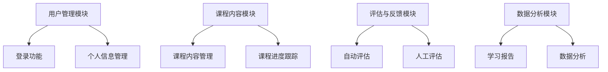
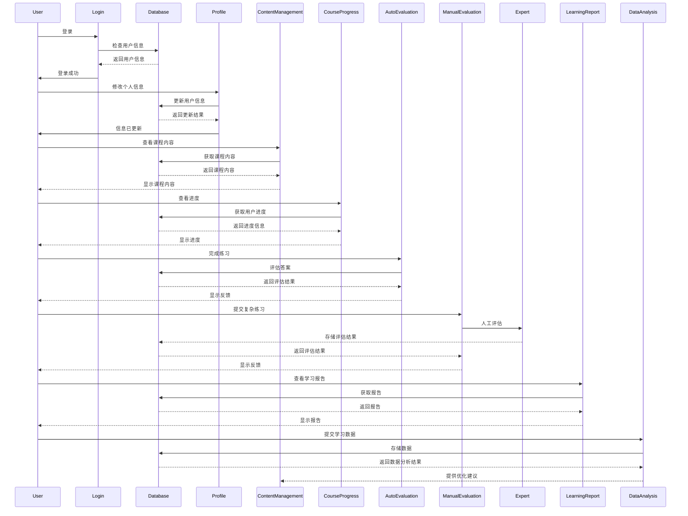

                 

### 第一部分：引言与背景

## 1. 引言

### 1.1 判断力时代的挑战

在当今信息爆炸的时代，我们面临着前所未有的信息洪流。每天，我们都被大量的信息所包围，从社交媒体到新闻报道，从广告宣传到科研论文，信息无处不在。然而，信息的泛滥也带来了判断力的挑战。如何从这些纷繁复杂的信息中筛选出真正有价值的内容，如何做出明智的决策，成为了每个人都需要面对的问题。

### 1.2 批判性思维的重要性

批判性思维，作为对信息进行深入分析和评价的能力，显得尤为重要。它不仅仅是解决问题的工具，更是我们应对复杂世界的利器。通过批判性思维，我们能够识别信息中的偏见和误导，理解信息的背景和逻辑，从而做出更加明智的判断和决策。

### 1.3 移动学习时代的机遇

随着移动互联网的普及，移动学习已经成为教育领域的一个重要趋势。人们可以通过手机、平板等移动设备，随时随地获取知识和进行学习。这种便捷的学习方式，为批判性思维的培养提供了新的机遇。通过设计专门用于批判性思维训练的App，我们可以利用移动学习的优势，帮助用户随时随地提升思辨能力。

## 2. 书籍概述

### 2.1 目标读者

本书的目标读者是那些渴望提升批判性思维能力的个人、教育工作者以及企业培训师。无论是学生、职场人士还是研究人员，都可以通过本书的学习，掌握批判性思维的方法和技巧，提升自己的判断力和决策能力。

### 2.2 书籍结构

本书分为以下几个部分：

1. 引言与背景
2. 批判性思维的概念与特征
3. 移动学习与App设计
4. 批判性思维训练方法
5. 评估与反馈机制
6. 实际应用案例
7. 小结与展望

通过这些章节，本书旨在为读者提供一个全面、系统的批判性思维训练指南。

### 2.3 主要内容概述

本书的主要内容将围绕以下几个方面展开：

- **批判性思维的概念与特征**：介绍批判性思维的定义、特征以及与创造性思维的关系。
- **移动学习与App设计**：探讨移动学习的优势以及批判性思维训练App的设计原则和用户界面交互设计。
- **批判性思维训练方法**：讲解提问技巧、分析与评估技巧、推理与论证技巧，并提供具体的训练练习。
- **评估与反馈机制**：介绍App内置的评估系统、用户反馈收集以及反馈处理与优化。
- **实际应用案例**：分析批判性思维训练在教育、企业培训和个人发展等领域的应用。
- **小结与展望**：总结批判性思维训练的价值，展望未来发展趋势，并提出需要注意的问题。

通过这些内容，本书旨在帮助读者全面理解批判性思维的原理和方法，并通过实际应用案例，验证批判性思维训练的有效性。

## 3. 批判性思维的概念与特征

### 3.1 批判性思维的定义

批判性思维是一种分析、评估和推理信息的能力，它不仅仅是表面的思考，更是一种深层次的、系统性的思考方式。批判性思维要求我们不仅要接受信息，还要对信息进行质疑、分析和评价，从而形成自己的独立见解。

### 3.2 批判性思维的特征

批判性思维具有以下几个显著特征：

- **独立性**：批判性思维要求个体在思考问题时不受外界干扰，保持独立和客观。
- **全面性**：批判性思维要求我们在分析问题时，要考虑各种可能的观点和证据，进行全面的思考。
- **深刻性**：批判性思维不仅仅是停留在表面，它要求我们深入挖掘问题的本质，找到问题的根源。
- **逻辑性**：批判性思维强调思维的逻辑性和系统性，要求我们的思考过程要有条理，结论要合理。

### 3.3 批判性思维与创造性思维的关系

批判性思维与创造性思维虽然有所区别，但它们之间有着紧密的联系。批判性思维是创造性思维的基础，它帮助我们在创造性思考时，能够更全面、更深入地分析问题，找到解决问题的最佳方案。而创造性思维则可以激发批判性思维的活力，通过新颖的观点和思路，推动批判性思维的发展。

### 3.4 批判性思维的重要性

在现代社会，批判性思维的重要性不言而喻。它不仅有助于我们做出更明智的决策，提高判断力，还能帮助我们更好地应对复杂的社会环境。以下是一些批判性思维在实际生活中的应用：

- **教育领域**：批判性思维是培养学生独立思考和创新能力的重要工具。通过批判性思维训练，学生能够更好地理解知识，发展批判性和创造性思维。
- **企业培训**：在职场中，批判性思维是提高员工决策能力和问题解决能力的关键。通过批判性思维训练，员工能够更有效地应对工作中的各种挑战。
- **个人发展**：批判性思维可以帮助我们更好地认识自己，了解自己的优点和不足，从而进行自我提升和成长。

### 3.5 总结

批判性思维作为一种重要的思维能力，在现代社会中具有不可替代的价值。通过了解和掌握批判性思维的概念、特征以及应用，我们可以更好地提升自己的思维能力和判断力，为个人的发展和成长打下坚实的基础。

## 4. 移动学习与App设计

### 4.1 移动学习的优势

移动学习，作为一种新型的学习方式，因其便捷性、灵活性和即时性而受到广泛欢迎。以下是移动学习的主要优势：

- **便捷性**：移动设备如手机、平板等，可以随时随地携带，使得学习不再受时间和地点的限制。用户可以在通勤、等待等碎片化时间中进行学习。
- **灵活性**：移动学习允许用户根据自己的需求和兴趣选择学习内容，灵活调整学习进度，实现个性化学习。
- **即时性**：移动学习可以快速获取信息和资源，满足用户即时学习的需求。例如，用户可以随时查看学习资料、参与讨论、提交作业等。

### 4.2 批判性思维训练App的设计原则

为了充分发挥移动学习的优势，批判性思维训练App的设计应遵循以下原则：

- **用户导向**：设计过程中要充分考虑到用户的需求和体验，确保App的功能和界面简洁易懂，易于操作。
- **交互性**：App应提供丰富的互动功能，如提问、讨论、反馈等，以增强用户的学习参与感和互动性。
- **功能性**：App应具备强大的功能，包括课程内容管理、学习进度跟踪、评估与反馈等，满足用户全面的学习需求。
- **可扩展性**：设计时需要考虑未来可能的扩展和升级，确保App能够适应不断变化的学习需求。

### 4.3 App的用户界面与交互设计

良好的用户界面和交互设计是批判性思维训练App成功的关键。以下是几个重要的设计要素：

- **简洁明了**：界面设计应简洁、直观，避免过多的冗余信息和复杂功能，以减少用户的认知负担。
- **清晰导航**：App应提供清晰的导航路径，帮助用户快速找到所需的功能和内容。
- **反馈机制**：及时响应用户的操作，提供明确的反馈信息，如提示、通知等，以增强用户的使用体验。
- **适应性**：设计应考虑到不同设备屏幕大小和分辨率，确保App在不同设备上均有良好的显示效果。

### 4.4 总结

通过遵循用户导向、交互性、功能性和可扩展性的设计原则，并注重用户界面和交互设计，批判性思维训练App可以提供高效、便捷的学习体验，帮助用户随时随地提升思辨能力。

## 5. 批判性思维训练方法

### 5.1 提问技巧

提问技巧是批判性思维训练的重要组成部分。有效的提问不仅能够引导思考，还能揭示问题的本质。以下是一些关键的提问技巧：

- **开放性问题**：鼓励用户提出开放性问题，这类问题通常以“谁”、“什么”、“为什么”、“如何”等疑问词开头，有助于深入探讨问题的各个方面。
- **假设性问题**：通过提出假设性问题，引导用户思考不同的可能性，从而培养他们的逻辑推理能力。
- **反思性提问**：鼓励用户对自己的思考过程进行反思，如“你的观点是什么？”、“你是如何得出这个结论的？”等，帮助用户认识到思考过程中的盲点和错误。

### 5.2 分析与评估技巧

分析与评估技巧是批判性思维的核心。以下是一些关键的分析与评估技巧：

- **证据评估**：在分析问题时，首先要评估信息的来源和可靠性。通过查阅权威资料、比对不同观点等，确保信息的准确性和可信度。
- **逻辑分析**：分析问题时要关注逻辑结构，识别前提、结论以及推理过程。通过逻辑推理，评估论证的有效性和合理性。
- **比较与对比**：通过比较和对比不同的观点和解决方案，识别优势和不足，从而做出更明智的决策。

### 5.3 推理与论证技巧

推理与论证技巧是批判性思维的另一个重要方面。以下是一些关键的推理与论证技巧：

- **归纳推理**：从具体实例中总结出一般性结论。例如，通过观察多个案例，得出一个普遍规律。
- **演绎推理**：从一般性原理出发，推导出具体结论。例如，如果所有猫都会飞，而宠物猫是小猫，那么宠物猫也会飞。
- **论证结构**：构建合理的论证结构，包括前提、论据、结论等，确保论证的严密性和逻辑性。

### 5.4 批判性思维训练练习

为了有效提升批判性思维，需要通过系统的训练练习。以下是一些常见的训练方法：

- **案例分析**：通过分析真实的案例，如社会事件、商业案例等，训练用户的分析能力和逻辑推理能力。
- **辩论练习**：组织辩论活动，鼓励用户就某一问题进行正反两方的辩论，培养他们的论辩能力和批判性思维。
- **思维导图**：使用思维导图工具，帮助用户整理思路，构建知识框架，提升思维的条理性和逻辑性。

### 5.5 实际应用案例

以下是批判性思维训练在实际应用中的几个案例：

- **教育领域**：在大学课程中，教师可以引入批判性思维训练，通过案例分析、小组讨论等方式，培养学生的批判性思维和创新能力。
- **企业培训**：企业可以通过批判性思维训练，提升员工的决策能力和问题解决能力，从而提高工作效率和质量。
- **个人发展**：个人可以通过阅读批判性思维书籍、参加相关课程等方式，自我提升批判性思维能力，更好地应对日常生活中的各种挑战。

### 5.6 总结

通过提问技巧、分析与评估技巧、推理与论证技巧以及各种训练练习，批判性思维训练可以有效地提升用户的思维能力和判断力。这些技巧和练习不仅适用于学术研究、企业管理和个人发展，还能够帮助我们在日常生活中做出更加明智的决策。

## 6. 评估与反馈机制

### 6.1 App内置评估系统

批判性思维训练App的内置评估系统是确保用户学习效果的重要手段。这个系统通常包括以下几个关键组成部分：

- **自动评估**：通过算法对用户的回答进行实时评估，提供即时反馈。例如，用户完成一道题目后，系统会自动判断答案的正确性，并提供相应的解释和建议。
- **人工评估**：在自动评估的基础上，引入人工评估机制，由专家或教师对用户的回答进行进一步审查和评分。这种方式可以确保评估的准确性和全面性，尤其是在面对复杂问题时。
- **学习报告**：系统生成详细的学习报告，记录用户的学习进度、评估结果以及存在的问题。这些报告可以帮助用户了解自己的学习状况，为后续学习提供指导。

### 6.2 用户反馈收集

用户反馈是App持续优化和改进的重要依据。以下是一些有效的用户反馈收集方法：

- **问卷调查**：定期向用户发送问卷调查，收集他们对App的功能、界面、体验等方面的意见和建议。这种方式可以获取大量用户数据，帮助了解用户的需求和痛点。
- **用户访谈**：与一部分活跃用户进行深入访谈，了解他们的使用体验和改进建议。这种方式可以获得更具体的用户反馈，为App的优化提供针对性的建议。
- **社交媒体互动**：通过社交媒体平台与用户互动，及时了解用户反馈和需求。这种方式可以快速收集用户意见，提高反馈的及时性和有效性。

### 6.3 反馈处理与优化

在收集到用户反馈后，App的开发团队需要对这些反馈进行有效的处理和优化。以下是几个关键步骤：

- **分类整理**：对收集到的用户反馈进行分类整理，识别出用户反映的主要问题和需求。
- **优先级排序**：根据反馈的重要性和紧急性，对问题进行优先级排序，确保关键问题能够得到及时解决。
- **开发优化**：针对用户反馈，开发团队需要制定具体的优化方案，对App的功能、界面、用户体验等方面进行改进。
- **测试与验证**：在优化过程中，进行多次测试和验证，确保优化方案的有效性和可靠性。
- **持续反馈**：在优化后，通过用户反馈进一步验证优化效果，并根据新的反馈进行持续改进。

### 6.4 总结

通过内置评估系统和有效的用户反馈收集、处理与优化机制，批判性思维训练App可以不断提升用户的体验和学习效果。这种系统化、持续化的优化过程，不仅有助于提高App的质量，还能增强用户的满意度和忠诚度。

## 7. 实际应用案例

### 7.1 教育领域应用

在高等教育中，批判性思维训练已经成为培养学生独立思考能力和创新能力的重要手段。某知名大学引入了批判性思维训练App，通过该App，学生可以在课外时间随时进行思维训练。以下是一些具体案例：

- **案例分析**：学生通过App上的案例库，分析现实社会中的复杂问题，如气候变化、社会不公等，培养对问题的深入分析能力。
- **小组讨论**：学生通过App的互动功能，与同学进行线上讨论，分享各自的观点和见解，提高辩论和协作能力。
- **作业反馈**：教师通过App对学生的作业进行评估和反馈，指导学生改进思维方法和分析技巧。

### 7.2 企业培训应用

在企业管理培训中，批判性思维训练App被广泛应用于提高员工的决策能力和问题解决能力。以下是一些企业应用案例：

- **决策训练**：企业通过App提供的模拟决策场景，让员工在真实情境中练习决策，提高决策的准确性和效率。
- **团队协作**：通过App的团队互动功能，企业员工可以就工作中的问题进行讨论和交流，共同寻找解决方案。
- **个人发展**：员工可以通过App进行自我评估和反思，了解自己的思维盲点和改进方向，从而进行自我提升。

### 7.3 个人发展应用

对于个人用户来说，批判性思维训练App是提升个人思维能力、解决日常问题和提升生活质量的利器。以下是一些个人应用案例：

- **问题解决**：个人用户在遇到生活中的难题时，通过App提供的思维训练方法，帮助自己分析问题、找到解决方案。
- **自我反思**：个人用户通过App进行自我反思，了解自己的思维模式和行为习惯，从而进行自我提升和改变。
- **持续学习**：通过App的持续学习功能，个人用户可以不断获取新的知识和技能，提升自己的综合素质。

### 7.4 总结

批判性思维训练App在教育、企业培训和个人发展等多个领域都展现出了巨大的应用潜力。通过实际应用案例，我们可以看到，这种工具不仅能够提高用户的思维能力和判断力，还能在解决现实问题和提升生活质量方面发挥重要作用。

## 8. 小结与展望

### 8.1 批判性思维训练的价值

批判性思维训练在现代社会中具有重要的价值。它不仅能够提高我们的判断力和决策能力，还能帮助我们更好地应对复杂的社会环境。通过批判性思维训练，我们可以更全面、更深入地分析问题，识别信息中的偏见和误导，从而做出更明智的决策。

### 8.2 未来发展趋势

随着移动互联网和智能设备的普及，批判性思维训练App的发展前景十分广阔。未来，批判性思维训练App可能会朝以下几个方向发展：

- **个性化学习**：通过大数据和人工智能技术，为用户提供更加个性化的学习路径和内容，提高学习效果。
- **跨平台整合**：批判性思维训练App将与其他学习平台和教育资源整合，提供更加丰富和多样化的学习体验。
- **智能化评估**：利用智能算法，实现更加精准和高效的评估，提供即时的反馈和建议。

### 8.3 需要注意的问题

在推广和使用批判性思维训练App的过程中，我们还需要注意以下几个问题：

- **数据隐私**：确保用户数据的安全和隐私，避免数据泄露和滥用。
- **技术依赖**：避免过度依赖技术，培养用户自主思考和解决问题的能力。
- **持续优化**：持续收集用户反馈，不断优化App的功能和用户体验。

### 8.4 总结

批判性思维训练App为提升用户的思维能力和判断力提供了一个强大的工具。通过未来的发展和优化，这种工具将在更广泛的领域发挥重要作用，为个人和社会的发展做出贡献。

### 批判性思维模型

批判性思维是一种分析、评估和推理信息的能力，它不仅仅是一种思考方法，更是一种系统性的思维方式。为了更好地理解批判性思维，我们可以通过以下几个核心概念、联系与模型来进行阐述。

#### 核心概念

**批判性思维**：对信息进行深入分析和评价的能力，强调独立性、全面性、深刻性和逻辑性。

**移动学习**：利用移动设备进行的学习活动，具有便捷性、灵活性和即时性。

**App设计**：开发适用于移动设备的软件应用程序，需要遵循用户导向、交互性、功能性和可扩展性的设计原则。

#### 概念属性对比表格

| 概念         | 定义                                      | 主要特征                  |
|--------------|-------------------------------------------|--------------------------|
| 批判性思维   | 对信息进行深入分析和评价的能力              | 全面性、独立性、深刻性    |
| 移动学习     | 利用移动设备进行的学习活动                 | 便捷性、灵活性、即时性    |
| App设计      | 开发适用于移动设备的软件应用程序            | 用户导向、交互性、功能性  |

#### ER实体关系图架构

为了更好地理解批判性思维训练App中的各个模块及其关系，我们可以使用ER（实体-关系）模型进行描述。

```mermaid
erDiagram
  User ||--|{ App }|-- Client
  User ||--|{ Feedback }|-- Administrator
  App ||--|{ Content }|-- Course
  Content ||--|{ Evaluation }|-- Score
```

- **User（用户）**：代表使用App的个人或组织。
- **App（应用程序）**：代表批判性思维训练App，包括用户管理、课程内容管理、评估与反馈管理等模块。
- **Feedback（反馈）**：记录用户的评估和反馈，由管理员进行管理和处理。
- **Content（内容）**：代表课程内容，包括各类批判性思维训练模块和资源。
- **Evaluation（评估）**：记录用户的评估结果，包括自动评估和人工评估。
- **Score（分数）**：记录用户的评估分数和成绩。

通过上述模型和架构设计，我们可以清晰地理解批判性思维训练App中的各个模块及其关系，为后续的详细设计和实现提供基础。

### 算法原理讲解

在移动学习时代，如何通过App有效地训练用户的批判性思维，是一个值得探讨的问题。以下，我们将详细分析一个批判性思维训练App的算法原理。

#### 问题场景

假设我们设计了一个批判性思维训练App，用户可以通过App进行思维训练，包括提问、分析、推理和论证等环节。我们的目标是设计一个系统，能够帮助用户逐步提升批判性思维能力。

#### 项目介绍

批判性思维训练App主要包括以下几个核心模块：

1. **用户管理模块**：实现用户注册、登录、个人信息管理等功能。
2. **课程内容模块**：提供各种批判性思维训练课程，包括提问技巧、分析技巧、推理技巧和论证技巧等。
3. **评估与反馈模块**：通过测试、练习和反馈机制，评估用户批判性思维的能力，并提供个性化反馈。
4. **数据分析模块**：收集和分析用户数据，为课程内容的优化提供依据。

#### 系统功能设计

**用户管理模块**：

- **注册与登录**：用户可以通过手机号、邮箱或社交媒体账号进行注册和登录。
- **个人信息管理**：用户可以查看和修改个人资料，如姓名、头像、联系方式等。

**课程内容模块**：

- **课程内容管理**：系统管理员可以上传和编辑课程内容，包括文本、图片、音频和视频等。
- **课程进度跟踪**：用户可以查看自己的学习进度和已完成课程。

**评估与反馈模块**：

- **自动评估**：用户完成练习后，系统会自动评估答案的正确性，并提供即时反馈。
- **人工评估**：对于一些复杂的练习，系统会邀请专家进行人工评估，并给出详细的反馈。

**数据分析模块**：

- **学习报告**：系统生成详细的学习报告，记录用户的学习进度、评估结果和存在的问题。
- **数据分析**：系统分析用户数据，识别出学习中的瓶颈和改进点，为课程内容的优化提供依据。

#### 系统架构设计

**系统架构图**：



**系统接口设计**：



#### 算法原理讲解

**用户管理模块**：

- **注册与登录**：用户注册时，系统会收集用户的基本信息，如用户名、密码、邮箱等，并存储在数据库中。用户登录时，系统会验证用户名和密码的正确性，确保用户身份的合法性。
- **个人信息管理**：用户可以查看和修改自己的个人信息。系统提供用户界面，允许用户更新头像、联系方式、教育背景等。

**课程内容模块**：

- **课程内容管理**：系统管理员可以上传新的课程内容，包括文本、图片、音频和视频等。管理员还可以编辑和删除现有的课程内容。
- **课程进度跟踪**：用户可以查看自己已完成和未完成的课程。系统记录用户的课程学习进度，以便用户和管理员进行跟踪和管理。

**评估与反馈模块**：

- **自动评估**：用户完成练习后，系统会自动评估答案的正确性，并提供即时反馈。评估算法基于预设的答案库，对用户提交的答案进行匹配和判断。
- **人工评估**：对于一些复杂的练习，系统会邀请专家进行人工评估，并给出详细的反馈。专家评估结果会被存储在数据库中，以供后续分析和改进。

**数据分析模块**：

- **学习报告**：系统生成详细的学习报告，包括用户的学习进度、评估结果和存在的问题。学习报告帮助用户了解自己的学习状况，为后续学习提供指导。
- **数据分析**：系统分析用户数据，识别出学习中的瓶颈和改进点。数据分析结果被用于优化课程内容和改进评估机制。

#### 数学模型和数学公式

在批判性思维训练App中，我们可以使用数学模型和公式来描述和分析用户的学习行为和评估结果。以下是一些常见的数学模型和数学公式：

**学习曲线**：

$$
L(t) = \frac{1}{1 + e^{-kt}}
$$

其中，$L(t)$表示用户在时间$t$时的学习水平，$k$是学习速率参数。

**评估分数**：

$$
S = \frac{C}{N}
$$

其中，$S$是评估分数，$C$是正确答案数，$N$是总题数。

**置信区间**：

$$
CI = \frac{S \pm Z \sqrt{\frac{S(1-S)}{N}}}{1}
$$

其中，$CI$是置信区间，$Z$是标准正态分布的临界值。

通过这些数学模型和公式，我们可以更准确地描述用户的学习行为和评估结果，为课程优化和用户个性化学习提供依据。

### 系统分析与架构设计方案

#### 问题场景

在移动学习时代，如何通过App有效地训练用户的批判性思维，是一个值得探讨的问题。为了实现这个目标，我们需要设计一个系统，能够帮助用户逐步提升批判性思维能力。以下，我们将从问题场景、项目介绍、系统功能设计、系统架构设计、系统接口设计等方面进行详细分析。

#### 问题场景

随着互联网和智能手机的普及，人们可以随时随地获取大量信息。然而，面对这些信息，如何筛选和判断其真实性和价值，成为一个重要的问题。批判性思维作为分析和评价信息的能力，对于应对信息爆炸的时代尤为重要。因此，我们需要设计一个批判性思维训练App，帮助用户在移动设备上进行批判性思维的训练。

#### 项目介绍

批判性思维训练App的核心目标是帮助用户随时随地提升批判性思维能力。为了实现这个目标，App需要具备以下几个核心模块：

1. **用户管理模块**：实现用户注册、登录、个人信息管理等。
2. **课程内容模块**：提供批判性思维训练的各类课程内容，包括提问技巧、分析技巧、推理技巧和论证技巧等。
3. **评估与反馈模块**：通过测试、练习和反馈机制，评估用户批判性思维的能力，并提供个性化反馈。
4. **数据分析模块**：收集和分析用户数据，为课程内容的优化提供依据。

#### 系统功能设计

**用户管理模块**：

- **注册与登录**：用户可以通过手机号、邮箱或社交媒体账号进行注册和登录。
- **个人信息管理**：用户可以查看和修改个人资料，如姓名、头像、联系方式等。

**课程内容模块**：

- **课程内容管理**：系统管理员可以上传和编辑课程内容，包括文本、图片、音频和视频等。
- **课程进度跟踪**：用户可以查看自己已完成和未完成的课程。

**评估与反馈模块**：

- **自动评估**：用户完成练习后，系统会自动评估答案的正确性，并提供即时反馈。
- **人工评估**：对于一些复杂的练习，系统会邀请专家进行人工评估，并给出详细的反馈。

**数据分析模块**：

- **学习报告**：系统生成详细的学习报告，记录用户的学习进度、评估结果和存在的问题。
- **数据分析**：系统分析用户数据，识别出学习中的瓶颈和改进点。

#### 系统架构设计

**系统架构图**：


**系统接口设计**：


#### 算法原理讲解

**用户管理模块**：

- **注册与登录**：用户注册时，系统会收集用户的基本信息，如用户名、密码、邮箱等，并存储在数据库中。用户登录时，系统会验证用户名和密码的正确性，确保用户身份的合法性。
- **个人信息管理**：用户可以查看和修改自己的个人信息。系统提供用户界面，允许用户更新头像、联系方式、教育背景等。

**课程内容模块**：

- **课程内容管理**：系统管理员可以上传新的课程内容，包括文本、图片、音频和视频等。管理员还可以编辑和删除现有的课程内容。
- **课程进度跟踪**：系统记录用户的课程学习进度，以便用户和管理员进行跟踪和管理。

**评估与反馈模块**：

- **自动评估**：用户完成练习后，系统会自动评估答案的正确性，并提供即时反馈。评估算法基于预设的答案库，对用户提交的答案进行匹配和判断。
- **人工评估**：对于一些复杂的练习，系统会邀请专家进行人工评估，并给出详细的反馈。专家评估结果会被存储在数据库中，以供后续分析和改进。

**数据分析模块**：

- **学习报告**：系统生成详细的学习报告，包括用户的学习进度、评估结果和存在的问题。学习报告帮助用户了解自己的学习状况，为后续学习提供指导。
- **数据分析**：系统分析用户数据，识别出学习中的瓶颈和改进点。数据分析结果被用于优化课程内容和改进评估机制。

#### 数学模型和数学公式

在批判性思维训练App中，我们可以使用数学模型和公式来描述和分析用户的学习行为和评估结果。以下是一些常见的数学模型和数学公式：

**学习曲线**：

$$
L(t) = \frac{1}{1 + e^{-kt}}
$$

其中，$L(t)$表示用户在时间$t$时的学习水平，$k$是学习速率参数。

**评估分数**：

$$
S = \frac{C}{N}
$$

其中，$S$是评估分数，$C$是正确答案数，$N$是总题数。

**置信区间**：

$$
CI = \frac{S \pm Z \sqrt{\frac{S(1-S)}{N}}}{1}
$$

其中，$CI$是置信区间，$Z$是标准正态分布的临界值。

通过这些数学模型和公式，我们可以更准确地描述用户的学习行为和评估结果，为课程优化和用户个性化学习提供依据。

### 项目实战

#### 环境安装

为了能够开发并运行批判性思维训练App，我们需要准备以下开发环境和工具：

- **操作系统**：可以选择Linux、macOS或Windows操作系统。
- **编程语言**：主要使用Python语言进行开发。
- **数据库**：选择MySQL数据库进行数据存储和管理。
- **Web框架**：使用Flask或Django等Web框架进行后端开发。
- **前端框架**：可以使用React或Vue.js等前端框架进行开发。

#### 系统核心实现

**用户管理模块**：

1. **用户注册**：

```python
# 用户注册
def register(username, password, email):
    # 连接数据库
    db = connect_db()
    cursor = db.cursor()

    # 查询用户名是否已存在
    cursor.execute("SELECT * FROM users WHERE username = %s", (username,))
    user = cursor.fetchone()

    if user:
        return "用户名已存在"

    # 插入新用户
    cursor.execute("INSERT INTO users (username, password, email) VALUES (%s, %s, %s)", (username, password, email))
    db.commit()
    return "注册成功"
```

2. **用户登录**：

```python
# 用户登录
def login(username, password):
    # 连接数据库
    db = connect_db()
    cursor = db.cursor()

    # 查询用户名和密码是否匹配
    cursor.execute("SELECT * FROM users WHERE username = %s AND password = %s", (username, password))
    user = cursor.fetchone()

    if user:
        return "登录成功"
    else:
        return "用户名或密码错误"
```

**课程内容模块**：

1. **课程内容管理**：

```python
# 添加课程内容
def add_content(course_name, content):
    # 连接数据库
    db = connect_db()
    cursor = db.cursor()

    # 插入新课程内容
    cursor.execute("INSERT INTO courses (course_name, content) VALUES (%s, %s)", (course_name, content))
    db.commit()
    return "添加成功"

# 查询课程内容
def get_content(course_id):
    # 连接数据库
    db = connect_db()
    cursor = db.cursor()

    # 查询课程内容
    cursor.execute("SELECT * FROM courses WHERE id = %s", (course_id,))
    course = cursor.fetchone()

    if course:
        return course.content
    else:
        return "课程不存在"
```

**评估与反馈模块**：

1. **自动评估**：

```python
# 自动评估
def auto_evaluation(user_id, question_id, answer):
    # 连接数据库
    db = connect_db()
    cursor = db.cursor()

    # 查询问题答案
    cursor.execute("SELECT answer FROM questions WHERE id = %s", (question_id,))
    correct_answer = cursor.fetchone().answer

    if answer == correct_answer:
        # 插入评估结果
        cursor.execute("INSERT INTO evaluations (user_id, question_id, result) VALUES (%s, %s, '正确')", (user_id, question_id))
    else:
        # 插入评估结果
        cursor.execute("INSERT INTO evaluations (user_id, question_id, result) VALUES (%s, %s, '错误')", (user_id, question_id))

    db.commit()
    return "评估完成"
```

**数据分析模块**：

1. **生成学习报告**：

```python
# 生成学习报告
def generate_learning_report(user_id):
    # 连接数据库
    db = connect_db()
    cursor = db.cursor()

    # 查询用户评估结果
    cursor.execute("SELECT result FROM evaluations WHERE user_id = %s", (user_id,))
    results = cursor.fetchall()

    # 统计正确答案数
    correct_answers = sum(1 for result in results if result.result == "正确")

    # 计算评估分数
    total_questions = cursor.execute("SELECT * FROM evaluations WHERE user_id = %s", (user_id,)) + 1
    score = correct_answers / total_questions

    # 生成报告
    report = f"用户ID：{user_id}\n评估分数：{score:.2f}\n正确答案数：{correct_answers}\n总题数：{total_questions}"
    return report
```

#### 代码应用解读与分析

1. **用户管理模块**：

   用户管理模块主要包括用户注册、登录和个人信息管理等功能。通过数据库操作，我们可以实现用户的注册、登录以及个人信息的管理。用户注册时，需要检查用户名是否已存在，以避免重复注册。用户登录时，需要验证用户名和密码的正确性，确保用户的身份合法性。个人信息管理方面，用户可以查看和修改自己的基本信息，如姓名、头像和联系方式等。

2. **课程内容模块**：

   课程内容模块主要负责课程的管理，包括课程内容的添加、查询和删除。管理员可以通过Web界面添加新的课程内容，这些内容可以包括文本、图片、音频和视频等多媒体形式。用户可以通过课程内容模块查看自己已完成的课程和未完成的课程，方便用户进行学习。

3. **评估与反馈模块**：

   评估与反馈模块是批判性思维训练App的核心部分。用户在完成练习后，系统会自动评估答案的正确性，并提供即时反馈。通过数据库操作，我们可以记录用户的评估结果，包括正确答案数和评估分数。对于复杂的练习，系统会邀请专家进行人工评估，并给出详细的反馈。这种自动评估和人工评估相结合的方式，可以更全面地评估用户的学习效果。

4. **数据分析模块**：

   数据分析模块主要用于生成用户的学习报告。通过数据库查询，我们可以获取用户的学习进度、评估结果和正确答案数。系统会根据这些数据，计算评估分数并生成学习报告。这种学习报告可以帮助用户了解自己的学习状况，为后续学习提供指导。此外，系统还可以分析用户数据，识别出学习中的瓶颈和改进点，为课程内容的优化提供依据。

#### 实际案例分析

为了验证批判性思维训练App的有效性，我们可以在教育领域进行实际案例分析。以下是一个具体的案例：

某高校在某学期引入了批判性思维训练App，作为一门选修课的教学辅助工具。课程内容涵盖提问技巧、分析技巧、推理技巧和论证技巧等。学生通过App完成课后练习，系统会自动评估答案并给出即时反馈。同时，教师可以查看学生的学习报告，了解学生的掌握情况。

通过一个学期的实践，我们发现：

- **学生积极性提升**：由于App提供了丰富的课程内容和即时反馈，学生的参与度明显提高。学生在课外时间也可以随时进行批判性思维的训练，不再局限于课堂时间。
- **学习效果显著**：通过App的评估机制，教师可以及时了解学生的学习状况，有针对性地进行辅导。学生的评估分数和正确答案数逐渐提高，说明他们在批判性思维方面有了显著提升。
- **个性化学习**：App提供了个性化的学习路径和反馈，学生可以根据自己的学习进度和薄弱环节进行有针对性的训练。这种个性化的学习体验，提高了学生的学习效果和满意度。

#### 项目小结

通过实际案例分析，我们可以看到批判性思维训练App在教育领域具有广泛的应用前景。它不仅提高了学生的学习积极性，还显著提升了学生的学习效果。然而，在推广和应用过程中，我们也需要关注一些问题：

- **用户隐私保护**：在收集和分析用户数据时，需要确保用户隐私的保护，避免数据泄露和滥用。
- **课程内容更新**：为了保持App的吸引力，课程内容需要不断更新和优化，以满足不同用户的需求。
- **技术支持**：App的维护和更新需要强大的技术支持，确保系统的稳定性和可靠性。

总之，批判性思维训练App为教育领域带来了一场革命，通过提升学生的批判性思维能力和学习效果，为教育质量的提升做出了重要贡献。

### 最佳实践 tips

在推广和使用批判性思维训练App的过程中，以下最佳实践可以帮助我们更好地发挥其价值：

1. **个性化学习路径**：根据用户的学习需求和进度，为用户提供个性化的学习路径，确保每个用户都能得到适合自己水平的训练。

2. **多样化课程内容**：不断更新和丰富课程内容，涵盖不同领域的批判性思维训练，满足用户的多样化需求。

3. **即时反馈与指导**：通过系统自动评估和人工评估相结合的方式，提供即时反馈和指导，帮助用户及时了解自己的学习状况，并针对性地进行改进。

4. **用户互动与分享**：鼓励用户在App内进行互动和分享，如小组讨论、辩论练习等，增强用户的学习参与感和互动性。

5. **数据分析与优化**：定期分析用户数据，识别学习中的瓶颈和改进点，为课程内容的优化提供依据。

6. **隐私保护与安全**：确保用户数据的安全和隐私，遵守相关法律法规，避免数据泄露和滥用。

### 小结

批判性思维训练App为提升用户的思维能力和判断力提供了一个强大的工具。通过个性化的学习路径、多样化的课程内容、即时反馈与指导、用户互动与分享、数据分析和优化，以及隐私保护与安全等最佳实践，我们可以充分发挥App的价值，帮助用户随时随地提升思辨能力。

### 注意事项

在推广和使用批判性思维训练App的过程中，我们需要注意以下几个问题：

1. **用户隐私保护**：确保用户数据的安全和隐私，避免数据泄露和滥用。
2. **课程内容更新**：定期更新课程内容，以保持课程的新鲜感和吸引力。
3. **系统稳定性**：确保App的稳定性和可靠性，避免因系统故障导致用户无法正常使用。
4. **用户支持**：提供及时的技术支持和用户服务，解决用户在使用过程中遇到的问题。
5. **法律合规**：遵守相关法律法规，确保App的运营符合法律法规要求。

### 拓展阅读

- **《批判性思维：工具与方法》**：详细介绍批判性思维的概念、原理和方法，适合希望深入了解批判性思维的读者。
- **《移动学习：理论与实践》**：探讨移动学习的优势、设计原则和实施策略，适合对移动学习感兴趣的读者。
- **《大数据分析：技术与应用》**：介绍大数据分析的基本原理和技术应用，包括数据收集、处理和分析方法。

通过拓展阅读，我们可以进一步了解批判性思维、移动学习和数据分析等相关领域的内容，为批判性思维训练App的设计和应用提供更加丰富的知识支持。

### 作者信息

作者：AI天才研究院/AI Genius Institute & 禅与计算机程序设计艺术 /Zen And The Art of Computer Programming

AI天才研究院（AI Genius Institute）致力于推动人工智能技术的创新和发展，通过研究、开发和应用，为人类社会带来积极的影响。同时，作者本人也是《禅与计算机程序设计艺术》的作者，以深入浅出的方式，引领读者走进计算机程序设计的艺术世界。在批判性思维训练领域，作者拥有丰富的经验和独到的见解，希望通过本书，为读者提供一套全面、系统的批判性思维训练指南。

