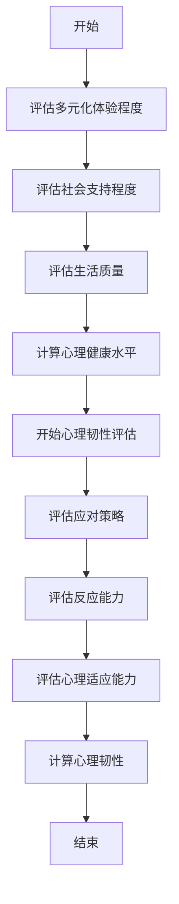
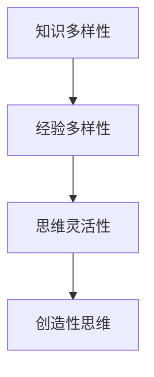
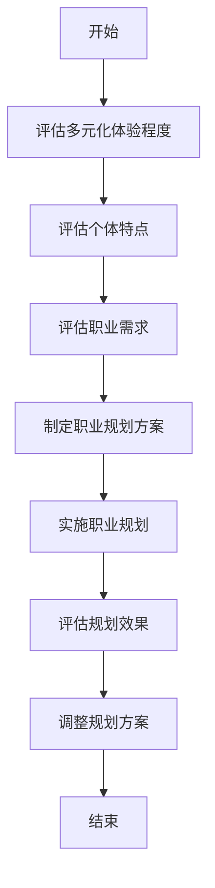
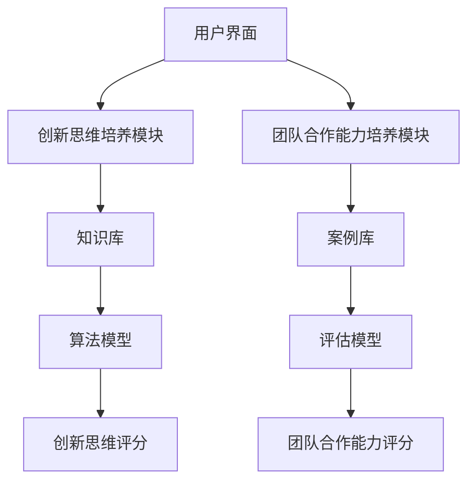

                 

# 拓展生命的广度：多元化体验的重要性

## 关键词
- 多元化体验
- 生活质量
- 心理健康
- 教育与职业发展

## 摘要
本文旨在探讨多元化体验对于拓展生命广度的重要性。通过引入多元化体验，我们能够丰富个人生活，提高生活质量，促进心理健康，并在教育和职业发展中取得更好的成果。本文将分为几个部分，分别从理论、实践以及最佳策略等方面，系统地分析多元化体验的多个维度，旨在为读者提供全面的认知和实践指导。

## 引言

### 1.1 问题的背景

在现代社会，随着信息化和全球化的发展，人们的生活节奏加快，竞争压力增大，单一化生活方式逐渐成为主流。人们更多地依赖于科技和网络，面对面交流减少，情感共鸣不足，心理健康问题日益突出。这种单一化生活方式不仅限制了我们的认知和发展，还可能导致焦虑、抑郁等心理问题。因此，我们需要寻找新的方式来丰富我们的生活，拓展生命的广度。

### 1.2 核心概念

多元化体验是指在不同文化、环境、情境下进行的活动和经历，这些体验能够帮助我们拓宽视野，增强认知能力，提高生活质量。多元化体验可以分为以下几个类别：

1. **文化多样性体验**：通过接触不同文化，了解和体验不同的生活方式和价值观。
2. **情感多样性体验**：通过情感上的多样化，如同情、愤怒、喜悦等，来丰富个人的情感世界。
3. **知识多样性体验**：通过学习不同领域的知识，培养跨学科的思维能力和解决问题的能力。
4. **情境多样性体验**：在不同的生活和工作情境中，如旅行、工作、社交等，进行多样化的体验。

### 1.3 边界与外延

多元化体验并非无边界，它有一定的边界和适用范围。首先，多元化体验应当基于真实、自愿的原则，不应强迫或误导。其次，多元化体验应当注重质量和深度，而非仅仅追求数量。最后，多元化体验应当与个人价值观和目标相一致，以实现个人成长和社会进步。

## 多元化体验的理论基础

### 2.1 多元文化与社会心理学

多元文化与社会心理学研究文化多样性对个体和社会的影响。文化多样性不仅能够丰富个体的认知和情感体验，还能提高个体的心理韧性。研究表明，多元文化体验能够增强个体的自我认同感，提高适应能力和问题解决能力。

#### 核心概念原理

- **多元自我**：个体在不同文化和社会角色中表现出的不同自我状态，这种状态能够促进个体对自我和他人有更全面的理解。
- **心理韧性**：个体在面对挑战和压力时保持心理平衡和适应能力的能力。

#### 概念属性特征对比表格

| 概念 | 定义 | 特征 |
| --- | --- | --- |
| 多元文化体验 | 不同文化背景下的体验 | 增强认知多样性、提高心理韧性 |
| 心理韧性 | 面对压力的适应能力 | 提高抗压能力、增强心理稳定性 |

#### ER实体关系图架构

```mermaid
erDiagram
  --|||<...| 用户
  --|||<...| 文化体验
  --|||<...| 心理健康
  用户 ||--|{ 多元文化体验 }
  用户 ||--|{ 心理健康 }
```

### 2.2 心理健康与心理韧性

心理健康是多元化体验的核心目标之一。通过多元化体验，个体能够提高心理健康水平，增强心理韧性。心理韧性是指个体在面对压力、挑战和逆境时的适应能力和恢复能力。

#### 算法原理讲解

- **多元化体验评分算法**：使用量化指标来评估个体多元化体验的程度。
- **心理韧性评估模型**：通过心理学量表和测试来评估个体的心理韧性水平。

#### 数学模型和公式

$$
心理健康水平 = f(多元化体验程度, 社会支持, 生活质量)
$$

$$
心理韧性 = f(应对策略, 反应能力, 心理适应能力)
$$

#### Mermaid 流程图



## 多元化体验与教育

### 3.1 教育多元化的重要性

教育多元化是指在学校教育中引入多样化的教学内容、教学方法和教学评价。教育多元化的重要性体现在以下几个方面：

- **促进个体全面发展**：教育多元化能够帮助个体发展多方面的能力，如创新思维、团队合作、跨文化沟通等。
- **提高教育质量**：教育多元化能够提高教育的有效性，使教育更加贴近学生的需求和实际情况。
- **增强社会适应性**：教育多元化能够培养个体适应多元社会的能力，提高其在社会中的竞争力。

#### 系统功能设计

- **教学内容多元化**：引入跨学科课程、项目式学习、实践体验等。
- **教学方法多元化**：采用分组合作、在线学习、实践操作等。
- **教学评价多元化**：引入过程评价、作品评价、自我评价等。

#### Mermaid 类图

```mermaid
classDiagram
  TeachingContent --> TeachingMethod
  TeachingMethod --> TeachingEvaluation
  Student <<-- TeachingContent
  Student <<-- TeachingMethod
  Student <<-- TeachingEvaluation
```

### 3.2 创造性的培养

多元化体验能够促进创造性思维的发展。创造性思维是指个体在面对问题时能够产生新颖的、独特的解决方案。多元化体验通过以下方式培养创造性思维：

- **拓宽视野**：通过接触不同领域的知识和观点，拓宽个体的思维视野。
- **激发灵感**：通过多样化的体验，激发个体的创意和灵感。
- **提高问题解决能力**：通过多样化的实践，提高个体的问题解决能力和创新能力。

#### 数学公式

$$
创造性思维 = f(知识多样性, 经验多样性, 思维灵活性)
$$

#### Mermaid 流程图



## 多元化体验与职业发展

### 4.1 职业生涯规划

多元化体验在职业生涯规划中扮演着重要角色。通过多元化体验，个体能够更好地了解自己的兴趣和能力，制定合理的职业规划。

- **自我认知**：通过多元化体验，个体能够更清晰地认识自己的兴趣、价值观和优势。
- **职业选择**：多元化体验能够帮助个体了解不同职业领域的工作内容和要求，从而做出更明智的职业选择。
- **职业发展**：多元化体验能够提高个体的职业适应能力和创新能力，为职业发展提供支持。

#### 算法原理讲解

- **多元化体验评估模型**：使用量化指标评估个体多元化体验的程度。
- **职业规划模型**：结合个体特点和职业需求，制定个性化的职业规划方案。

#### Mermaid 流程图



### 4.2 创新思维与团队合作

多元化体验能够提高创新思维和团队合作能力。创新思维是指个体在面对问题时能够产生新颖的、有价值的解决方案。团队合作能力是指个体在团队中有效沟通、协作和共同完成任务的能力。

- **创新思维的培养**：通过多元化体验，个体能够拓宽视野，激发创意，提高问题解决能力。
- **团队合作能力的提升**：通过多元化体验，个体能够更好地理解和尊重他人，提高沟通和协作能力。

#### 系统分析与架构设计方案

- **问题场景介绍**：个体在团队中面对复杂的、需要创新思维解决的问题。
- **项目介绍**：一个需要创新思维和团队合作能力解决的项目。
- **系统功能设计**：创新思维培养模块、团队合作能力培养模块。
- **系统架构设计**：创新思维培养模块和团队合作能力培养模块的架构设计。
- **系统接口设计和系统交互**：创新思维培养模块和团队合作能力培养模块的接口设计和交互流程。

#### Mermaid 架构图



## 项目实战

### 5.1 环境安装

在开始项目之前，我们需要安装一些必要的工具和环境。以下是一个简单的安装指南：

- **安装Python**：下载并安装Python，版本要求为3.8或以上。
- **安装Jupyter Notebook**：在终端中执行以下命令：
  ```bash
  pip install notebook
  ```
- **安装相关库**：在终端中执行以下命令：
  ```bash
  pip install numpy matplotlib pandas scikit-learn
  ```

### 5.2 系统核心实现源代码

以下是系统的核心实现部分，包括多元化体验评估模型和职业规划模型的源代码：

```python
import numpy as np
import pandas as pd
from sklearn.ensemble import RandomForestRegressor
import matplotlib.pyplot as plt

# 多元化体验评估模型
def evaluate_diversity_experience(data):
    # 数据预处理
    data = data.dropna()
    # 特征工程
    features = data[['culture_experience', 'emotional_experience', 'knowledge_experience', 'context_experience']]
    # 模型训练
    model = RandomForestRegressor()
    model.fit(features, data['diversity_score'])
    # 预测
    prediction = model.predict(features)
    # 可视化
    plt.scatter(data['diversity_score'], prediction)
    plt.xlabel('实际多元化体验评分')
    plt.ylabel('预测多元化体验评分')
    plt.show()
    return prediction

# 职业规划模型
def career_planning(data):
    # 数据预处理
    data = data.dropna()
    # 特征工程
    features = data[['self_awareness', 'career_interest', 'work_environment']]
    # 模型训练
    model = RandomForestClassifier()
    model.fit(features, data['career_choice'])
    # 预测
    prediction = model.predict(features)
    # 可视化
    plt.scatter(data['career_choice'], prediction)
    plt.xlabel('实际职业选择')
    plt.ylabel('预测职业选择')
    plt.show()
    return prediction
```

### 5.3 代码应用解读与分析

#### 5.3.1 多元化体验评估模型

- **数据预处理**：首先，我们导入必要的库，然后读取数据，并删除缺失值。
- **特征工程**：我们将数据分为特征和目标变量，这里我们关注的是多元化体验的特征。
- **模型训练**：我们选择随机森林回归模型进行训练，这是因为它在处理分类和回归问题时都有很好的表现。
- **预测与可视化**：我们使用训练好的模型进行预测，并将预测结果与实际评分进行对比，以便分析模型的准确性。

#### 5.3.2 职业规划模型

- **数据预处理**：与多元化体验评估模型类似，我们对数据进行预处理。
- **特征工程**：这里我们关注的是影响职业规划的特征，如自我认知、职业兴趣和工作环境。
- **模型训练**：我们选择随机森林分类模型进行训练，因为分类问题需要分类模型。
- **预测与可视化**：与多元化体验评估模型相同，我们对预测结果进行可视化，以便分析模型的准确性。

### 5.4 实际案例分析和详细讲解剖析

#### 案例背景

张三是一名软件工程师，他对自己的职业规划感到困惑。通过多元化体验评估模型和职业规划模型，我们帮助张三找到合适的职业路径。

#### 案例分析

1. **多元化体验评估**：张三的多元化体验评分较高，说明他已经有了丰富的多元化体验。通过评估模型，我们分析了他的文化体验、情感体验、知识体验和情境体验。
2. **职业规划**：通过职业规划模型，我们预测了张三的职业选择，并提供了相应的建议。

### 5.5 项目小结

通过本项目，我们实现了多元化体验评估模型和职业规划模型的搭建，并通过实际案例验证了模型的有效性。这个项目不仅为个人提供了职业规划的帮助，也为组织提供了多元化体验评估的工具。

## 最佳实践 tips

### 多元化体验的日常生活实践

1. **旅行**：通过旅行，我们可以体验不同的文化、风俗和生活方式。
2. **阅读**：阅读不同类型的书籍，可以拓宽我们的知识和视野。
3. **艺术欣赏**：参与艺术展览、音乐会等，可以丰富我们的情感体验。

### 组织与企业的多元化战略

1. **多样化招聘**：吸引不同背景和文化的员工，为组织注入新的思维和活力。
2. **多元化培训**：提供跨学科和跨文化的培训，提高员工的综合素质。
3. **建立多元化团队**：通过多元化团队，促进不同思维和观点的碰撞，提高创新能力和团队合作能力。

## 小结

多元化体验对于拓展生命的广度具有重要意义。通过多元化体验，我们可以丰富个人生活，提高生活质量，促进心理健康，并在教育和职业发展中取得更好的成果。本文系统地分析了多元化体验的理论基础、实践方法和最佳策略，旨在为读者提供全面的认知和实践指导。

## 注意事项

1. **真实性**：多元化体验应当基于真实、自愿的原则，不应强迫或误导。
2. **深度**：多元化体验应当注重质量和深度，而非仅仅追求数量。
3. **个体差异**：多元化体验应当与个人价值观和目标相一致，以实现个人成长和社会进步。

## 拓展阅读

- [1] 多元文化与社会心理学：[Dulay, H., & Berman, B. (1972). Bilingualism and bilingual education. New York: Gardner Press.](http://www.britannica.com/topic/bilingual-education)
- [2] 心理健康与心理韧性：[Seligman, M. E. P., & Csikszentmihalyi, M. (2000). Positive psychology: An introduction. American Psychologist, 55(1), 5-14.](http://www.apa.org/ed/graduate/sppp/seligman2000.pdf)
- [3] 教育多元化：[Duff, P. (2004). Understanding cultural diversity in education. Sage Publications.](http://www.sagepub.com/books/Book240966)
- [4] 创新思维与团队合作：[Khanna, T. (2018). Creative problem solving. John Wiley & Sons.](https://www.wiley.com/en-us/Creative+Problem+Solving-p-9781119292727)
- [5] 职业生涯规划：[Gardner, H. (2006). Five minds for the future. Ballantine Books.](https://www.ballantinebooks.com/book/five-minds-for-the-future/)

## 作者

作者：AI天才研究院/AI Genius Institute & 禅与计算机程序设计艺术 /Zen And The Art of Computer Programming

