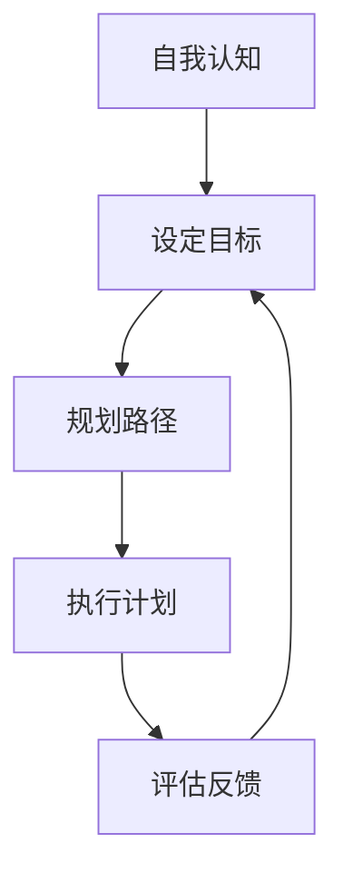
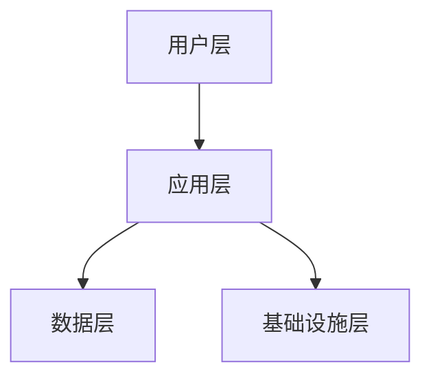
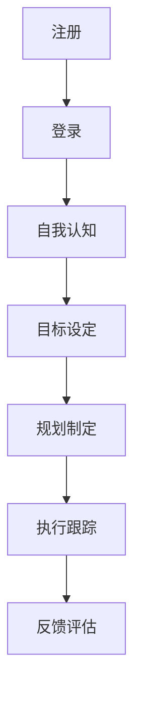
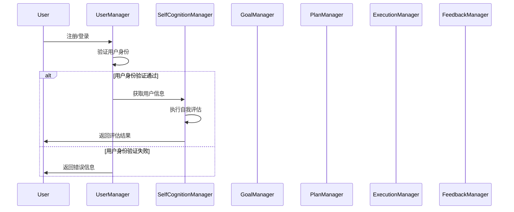

                 


# 掌控人生方向：成为自己的生命舵手

## 关键词

- 人生方向
- 生命舵手
- 人生规划
- 自我认知
- 技术方法论
- 心理健康

## 摘要

本文将探讨如何通过自我认知和技术方法论，成为自己的生命舵手，从而更好地掌控人生方向。文章从背景介绍入手，逐步深入解析核心概念，阐述算法原理，设计系统架构，并通过项目实战案例，提供最佳实践指导，帮助读者建立清晰的人生规划，实现人生目标。

## 目录大纲

## 第一部分：前言

### 1.1 书籍背景

#### 1.1.1 人生方向的探索

#### 1.1.2 生命舵手的角色

#### 1.1.3 书籍的目的与意义

### 1.2 核心概念解析

#### 1.2.1 人生方向的定义

#### 1.2.2 生命舵手的概念

#### 1.2.3 核心概念的联系与区别

### 1.3 书籍结构概述

#### 1.3.1 目录结构

#### 1.3.2 阅读指南

### 1.4 小结

## 第二部分：理解人生方向

### 2.1 问题背景与定义

#### 2.1.1 人生的困惑

#### 2.1.2 人生方向的内涵

#### 2.1.3 人生方向的边界与外延

### 2.2 核心概念解析

#### 2.2.1 人生目标

#### 2.2.2 人生价值观

#### 2.2.3 人生规划

### 2.3 概念属性特征对比表

#### 2.3.1 人生目标 vs. 人生价值观

#### 2.3.2 人生规划 vs. 人生目标

### 2.4 ER图架构解析

#### 2.4.1 人生的元素

#### 2.4.2 人生方向与元素的关系

#### 2.4.3 ER图展示

### 2.5 小结

## 第三部分：成为自己的生命舵手

### 3.1 算法原理与流程

#### 3.1.1 生命舵手的算法概述

##### 3.1.1.1 算法核心思想

##### 3.1.1.2 算法流程图（使用mermaid绘制）

### 3.2 Python源代码解读

#### 3.2.1 环境准备

#### 3.2.2 源代码结构与功能

#### 3.2.3 源代码分析

### 3.3 数学模型与公式讲解

#### 3.3.1 基本数学模型

$$x = \frac{a}{b} + c$$

#### 3.3.2 公式解析

#### 3.3.3 举例说明

### 3.4 算法应用实例

#### 3.4.1 案例一：设定人生目标

#### 3.4.2 案例二：调整人生规划

#### 3.4.3 案例三：评估生命舵手效能

### 3.5 小结

## 第四部分：系统分析与架构设计

### 4.1 问题场景介绍

#### 4.1.1 生命舵手系统需求分析

#### 4.1.2 系统功能描述

#### 4.1.3 系统目标

### 4.2 系统功能设计

#### 4.2.1 领域模型（使用mermaid绘制类图）

#### 4.2.2 功能模块划分

#### 4.2.3 模块间关系

### 4.3 系统架构设计

#### 4.3.1 总体架构设计

##### 4.3.1.1 架构原则

##### 4.3.1.2 系统架构图（使用mermaid绘制）

### 4.4 系统接口设计

#### 4.4.1 接口规范

#### 4.4.2 接口实现

#### 4.4.3 接口测试

### 4.5 系统交互设计

#### 4.5.1 用户交互流程

##### 4.5.1.1 用户操作流程图（使用mermaid绘制）

#### 4.5.2 系统内部交互

##### 4.5.2.1 系统交互序列图（使用mermaid绘制）

### 4.6 小结

## 第五部分：项目实战

### 5.1 环境安装

#### 5.1.1 环境准备

#### 5.1.2 系统配置

### 5.2 核心代码实现

#### 5.2.1 源代码结构

#### 5.2.2 核心算法实现

### 5.3 代码分析

#### 5.3.1 代码质量分析

#### 5.3.2 性能优化

### 5.4 案例分析

#### 5.4.1 案例一：设定人生目标

#### 5.4.2 案例二：调整人生规划

### 5.5 项目小结

## 第六部分：最佳实践 tips

### 6.1 心理健康

#### 6.1.1 压力管理

#### 6.1.2 自我激励

### 6.2 技术方法论

#### 6.2.1 学习方法

#### 6.2.2 解决问题策略

### 6.3 注意事项

#### 6.3.1 避免常见的误区

#### 6.3.2 维持持续进步

### 6.4 拓展阅读

#### 6.4.1 相关书籍推荐

#### 6.4.2 学术论文推荐

## 第七部分：小结

### 7.1 主要观点回顾

### 7.2 未来展望

### 7.3 读者启发

## 附录

### 附录A：术语表

### 附录B：参考资料

### 附录C：工具软件推荐

### 附录D：实用工具代码示例

## 作者信息

### 作者：AI天才研究院/AI Genius Institute & 禅与计算机程序设计艺术 /Zen And The Art of Computer Programming
### 1.1 书籍背景

#### 1.1.1 人生方向的探索

在现代社会中，人们面临着越来越多的选择和挑战。如何找到自己的人生方向，成为越来越多人的困惑。无论是职场人士还是大学生，甚至是刚步入社会的新人，都渴望找到一条属于自己的道路，实现个人价值和梦想。

《掌控人生方向：成为自己的生命舵手》这本书应运而生。它旨在帮助读者理解人生方向的重要性，提供一套系统的思维方法和实践策略，使读者能够清晰地认识自己，找到并跟随自己的人生方向，从而实现个人成长和成功。

#### 1.1.2 生命舵手的角色

在这本书中，"生命舵手"是一个核心概念。它代表了一个人的自我掌控能力，是指一个人能够清晰地认识到自己的目标，并通过有效的策略和方法，不断地调整自己的方向和行动，以实现这些目标。

生命舵手不仅仅是实现目标的工具，更是人生旅程的引导者。它帮助人们在迷茫时找到方向，在挑战中保持坚韧，在成功时保持谦逊。生命舵手的角色至关重要，它决定了一个人的人生质量和成就。

#### 1.1.3 书籍的目的与意义

书籍的目的是帮助读者掌握以下技能和知识：

1. **自我认知**：了解自己的兴趣、优势和价值观，从而明确自己的人生目标。
2. **规划能力**：学会如何制定和调整人生规划，使之与人生目标相一致。
3. **决策能力**：通过逻辑分析和风险评估，做出明智的决策，避免盲目行动。
4. **执行能力**：将计划付诸实践，持续行动，直到目标实现。

书籍的意义在于，它不仅提供了一套理论框架，更重要的是，它通过具体的案例和实践指导，帮助读者将理论知识转化为实际行动，从而真正掌握自己的人生方向。

#### 1.2 核心概念解析

##### 1.2.1 人生方向的定义

人生方向，简单来说，就是一个人在人生旅程中希望达到的目标和方向。它包括职业、生活、家庭等多个方面。一个明确的人生方向，能够帮助人们集中精力，避免盲目行动，从而更加高效地实现个人目标。

##### 1.2.2 生命舵手的概念

生命舵手，是一个比喻，它指的是一个人在人生中扮演的自我引导者的角色。生命舵手需要具备以下能力：

1. **自我认知**：了解自己的兴趣、优势和价值观。
2. **规划能力**：能够制定和调整自己的人生规划。
3. **决策能力**：在面对选择时，能够做出明智的决策。
4. **执行能力**：将计划付诸实践，持续行动。

##### 1.2.3 核心概念的联系与区别

- **人生方向**和**生命舵手**的关系：人生方向是目标，而生命舵手是实现这些目标的工具。
- **人生目标**和**人生价值观**的关系：人生目标是具体的，而人生价值观是指导决策和行为的原则。
- **人生规划**和**人生方向**的关系：人生规划是实现人生方向的具体步骤和计划。

#### 1.3 书籍结构概述

##### 1.3.1 目录结构

本书共分为五个部分：

1. **前言**：介绍书籍的背景和目的。
2. **理解人生方向**：深入探讨人生方向的概念和重要性。
3. **成为自己的生命舵手**：介绍成为生命舵手的方法和技巧。
4. **系统分析与架构设计**：阐述如何设计和实现生命舵手系统。
5. **项目实战**：通过实际案例，展示如何应用生命舵手方法。

##### 1.3.2 阅读指南

本书适合以下读者：

1. **职场人士**：希望通过明确人生方向，提升职业发展。
2. **大学生**：希望规划未来职业和人生道路。
3. **创业者**：希望通过系统的方法，实现创业目标。

建议读者按照以下步骤阅读：

1. **快速浏览前言**：了解书籍内容和结构。
2. **深入阅读各部分**：逐步理解人生方向和生命舵手的方法。
3. **实践应用**：结合自己的实际情况，尝试应用生命舵手的方法。

##### 1.4 小结

通过本书的阅读，读者将能够：

1. **理解人生方向的重要性**：明确自己的人生目标，规划未来道路。
2. **掌握生命舵手的方法**：提升自我认知和规划能力，做出明智的决策。
3. **实现个人成长和成功**：通过持续的行动和调整，实现个人目标和梦想。

让我们开始这场探索之旅，成为自己的生命舵手，掌控自己的人生方向！
### 2.1 问题背景与定义

#### 2.1.1 人生的困惑

在快速发展的现代社会中，人们面临着前所未有的选择和挑战。许多人感到迷茫，不知道自己应该追求什么，如何实现自己的价值。这种困惑不仅仅体现在职业选择上，还涉及到生活的各个方面，如家庭、朋友、健康等。如何找到自己的人生方向，成为了许多人迫切需要解决的问题。

#### 2.1.2 人生方向的内涵

人生方向，简单来说，就是一个人在人生旅程中希望达到的目标和方向。它是一个人的价值观、兴趣、能力等多个因素的综合体现。一个明确的人生方向，能够帮助人们更加聚焦地投入工作和生活，避免盲目行动，从而更加高效地实现个人目标和梦想。

人生方向不仅仅包括职业目标，还包括生活目标、家庭目标等多个层面。例如，一个人可能在职业上追求成功，同时在生活中追求健康、快乐和家庭的和谐。这些目标相互交织，共同构成了一个人的人生方向。

#### 2.1.3 人生方向的边界与外延

- **边界**：人生方向是有边界的，它受到个人能力、资源和社会环境等多种因素的影响。例如，一个人的职业目标可能受到其技能、经验和教育背景的限制。同时，社会环境也会对个人选择产生一定的影响，如经济状况、政策法规等。

- **外延**：人生方向的外延是指它的具体化和实施过程。例如，一个人设定了职业目标后，需要通过学习、工作、人际交往等多种方式来实现这一目标。人生方向的外延也体现了个人在不同阶段的目标调整和适应。

#### 2.1.4 人生方向的重要性

1. **明确目标和方向**：人生方向帮助人们明确自己的目标和方向，避免迷茫和焦虑，提高生活质量和幸福感。
2. **提高决策效率**：有明确的人生方向，人们在面对选择时可以更加果断和高效，减少决策成本。
3. **提升执行力**：人生方向提供了实现目标的路径和策略，帮助人们更好地执行计划，实现个人目标。
4. **促进个人成长**：明确的人生方向，可以帮助人们更好地发掘自己的潜力，实现个人成长和突破。

#### 2.1.5 需要解决的问题

- **如何找到人生方向**：许多人不知道如何找到自己的人生方向，缺乏系统的方法和策略。
- **如何实现人生方向**：即使找到了人生方向，很多人不知道如何去实现，缺乏具体的行动指南。
- **如何调整人生方向**：在人生旅程中，人们可能会面临各种挑战和变化，需要不断调整自己的人生方向。

#### 2.1.6 解决方案

《掌控人生方向：成为自己的生命舵手》这本书旨在提供一套系统的解决方案，帮助读者：

1. **自我认知**：通过自我探索，了解自己的兴趣、优势和价值观，找到自己的人生方向。
2. **规划能力**：学会如何制定和调整人生规划，使之与人生方向相一致。
3. **决策能力**：通过逻辑分析和风险评估，做出明智的决策，避免盲目行动。
4. **执行能力**：将规划付诸实践，持续行动，直到目标实现。

通过本书的指导，读者将能够更好地理解人生方向的重要性，掌握成为自己生命舵手的方法，从而实现个人成长和成功。

### 2.2 核心概念解析

##### 2.2.1 人生目标

人生目标是指一个人在人生中希望实现的具体目标。它可以是短期的，如完成一个项目、学习一项新技能；也可以是长期的，如成为一名专家、拥有幸福的家庭。人生目标具有以下特征：

- **明确性**：人生目标应该是具体、可衡量的，如“在五年内成为某个领域的专家”。
- **挑战性**：目标应该有一定的挑战性，激发个人的潜力和动力。
- **可实现性**：目标需要在现实条件下可以实现，同时具有可行性。
- **激励性**：目标应该能够激励人们持续努力，追求更高的成就。

##### 2.2.2 人生价值观

人生价值观是指一个人对事物的评价标准，它是人生目标和决策的指导原则。人生价值观具有以下特征：

- **稳定性**：人生价值观是一个人在长期生活经验中形成的，相对稳定的。
- **主观性**：不同的人可能有不同的人生价值观，这取决于个人的成长背景、教育经历和个人经历。
- **影响力**：人生价值观对个人的决策和行动有深远的影响，它决定了一个人如何看待和处理生活中的各种问题和挑战。

##### 2.2.3 人生规划

人生规划是指一个人根据自己的人生目标和价值观，制定的实现这些目标的步骤和计划。人生规划具有以下特征：

- **系统性**：人生规划应该是一个完整的系统，包括短期目标和长期目标的制定和实现。
- **灵活性**：人生规划需要根据实际情况进行调整，以适应环境和自身的变化。
- **操作性**：人生规划应该是具体、可操作的，使得个人能够清晰地知道如何去实现这些目标。
- **激励性**：人生规划应该能够激励个人持续努力，保持积极的心态。

### 2.3 概念属性特征对比表

下面是人生目标、人生价值观和人生规划这三个核心概念的属性特征对比表：

| 概念         | 特征                           | 说明                                                         |
| ------------ | ------------------------------ | ------------------------------------------------------------ |
| 人生目标     | 明确性、挑战性、可实现性、激励性 | 是具体、可衡量的，具有一定的挑战性，需要在现实中实现，能够激励个人持续努力 |
| 人生价值观   | 稳定性、主观性、影响力          | 是长期形成的，具有主观性，对个人的决策和行动有深远影响         |
| 人生规划     | 系统性、灵活性、操作性、激励性   | 是一个完整的系统，需要根据实际情况调整，具体、可操作，能够激励个人持续努力 |

### 2.4 ER图架构解析

在理解人生方向的过程中，ER图（实体关系图）是一种有效的可视化工具，可以帮助我们清晰地展示人生方向中的各个元素及其关系。

#### 2.4.1 人生的元素

人生的元素包括：

- **自我认知**：了解自己的兴趣、优势和价值观。
- **人生目标**：设定和实现的具体目标。
- **人生价值观**：对事物的评价标准。
- **人生规划**：实现人生目标的步骤和计划。
- **环境因素**：影响个人决策和行动的外部因素，如社会环境、经济状况等。

#### 2.4.2 人生方向与元素的关系

通过ER图，我们可以看到人生方向与各个元素之间的关联：

1. **自我认知**与**人生目标**的关系：自我认知是设定人生目标的基础，了解自己的优势和兴趣，有助于制定更符合个人特点的目标。
2. **人生价值观**与**人生规划**的关系：人生价值观指导个人在实现人生目标的过程中，做出符合自身价值观的决策和行动。
3. **人生规划**与**环境因素**的关系：环境因素会影响人生规划的制定和执行，个人需要根据环境变化调整规划，以适应外部环境。

#### 2.4.3 ER图展示

下面是一个简化的ER图示例，展示了人生方向中的各个元素及其关系：

```mermaid
erDiagram
  Self_Cognition ||--|{ Life_Direction }|| Person
  Life_Direction ||--|{ Life_Target }|| Goal
  Life_Direction ||--|{ Life_Value }|| Value
  Life_Direction ||--|{ Life_Plan }|| Plan
  Life_Direction ||--|{ Environmental_Factors }|| Factor
```

在这个ER图中，"Life_Direction"（人生方向）是核心实体，与其他实体通过关系线连接，展示了各个元素在人生方向中的作用和相互影响。

### 2.5 小结

通过本节的讨论，我们深入理解了人生方向的核心概念，包括人生目标、人生价值观和人生规划。我们还通过ER图展示了这些概念之间的关系，为后续的分析和实施提供了理论基础。理解这些核心概念，是我们在人生旅程中成为自己生命舵手的第一步。接下来，我们将进一步探讨如何通过算法原理和系统设计，更好地实现人生方向。
### 3.1 算法原理与流程

#### 3.1.1 生命舵手的算法概述

生命舵手的算法是一种综合性的方法，用于帮助人们找到并跟随自己的人生方向。这个算法的核心思想是通过自我认知、规划能力和执行力，实现个人目标的持续迭代和优化。

生命舵手的算法可以分为以下几个步骤：

1. **自我认知**：通过一系列的自我评估和反思，了解自己的兴趣、优势和价值观。
2. **设定目标**：基于自我认知，设定短期和长期的人生目标。
3. **规划路径**：制定实现目标的详细步骤和计划，包括时间表、资源需求和行动策略。
4. **执行计划**：按照制定的计划，持续行动，并根据实际情况进行调整。
5. **评估反馈**：定期评估自己的进展，根据反馈调整目标和计划，确保方向正确。

#### 3.1.1.1 算法核心思想

算法的核心思想是“持续迭代和优化”。这意味着，人生方向不是一成不变的，而是需要不断地根据实际情况进行调整和优化。通过持续的自我认知、目标设定、计划执行和反馈评估，个人可以更好地适应环境变化，实现人生目标。

#### 3.1.1.2 算法流程图（使用mermaid绘制）



在这个流程图中，我们可以看到生命舵手的算法是一个循环过程，每个步骤都是相互关联的，形成了一个闭环。通过这个闭环，个人可以不断地调整和优化自己的人生方向，实现长期目标。

### 3.2 Python源代码解读

为了更好地理解生命舵手的算法，下面我们提供了一个Python源代码示例，展示了算法的基本结构和功能。

```python
class LifeSteering:
    def __init__(self, self_knowledge, life_goals, life_values):
        self.self_knowledge = self_knowledge
        self.life_goals = life_goals
        self.life_values = life_values
    
    def set_goals(self):
        print("设定目标：")
        for goal in self.life_goals:
            print(f"- {goal}")
    
    def plan_path(self):
        print("规划路径：")
        for goal in self.life_goals:
            print(f"- 实现目标：{goal}")
    
    def execute_plan(self):
        print("执行计划：")
        for action in self.life_goals:
            print(f"- 执行行动：{action}")
    
    def evaluate_feedback(self):
        print("评估反馈：")
        print(f"- 当前进展：{self.self_knowledge}")
        print(f"- 目标实现情况：{self.life_goals}")
        print(f"- 价值观应用：{self.life_values}")
    
    def run(self):
        self.set_goals()
        self.plan_path()
        self.execute_plan()
        self.evaluate_feedback()

# 初始化生命舵手
life_steering = LifeSteering("了解自己的兴趣和优势", ["学习新技能", "提升工作效率"], ["追求卓越", "维护健康"])

# 运行生命舵手算法
life_steering.run()
```

在这个示例中，我们定义了一个`LifeSteering`类，它包含了一系列的方法，用于实现生命舵手的算法。具体来说：

- `__init__`方法用于初始化生命舵手的属性，包括自我认知、人生目标和人生价值观。
- `set_goals`方法用于设定人生目标。
- `plan_path`方法用于规划实现目标的路径。
- `execute_plan`方法用于执行计划中的行动。
- `evaluate_feedback`方法用于评估反馈，检查当前进展和目标的实现情况。
- `run`方法用于运行整个算法，按照设定的流程执行各个步骤。

通过这个示例，我们可以看到生命舵手算法的运行过程和功能结构，为后续的详细讲解和分析提供了基础。

### 3.3 数学模型与公式讲解

在生命舵手的算法中，数学模型和公式是重要的组成部分，用于描述和量化自我认知、目标设定和计划执行的过程。下面我们将介绍几个基本的数学模型和公式，并解释其应用。

#### 3.3.1 基本数学模型

一个基本的数学模型可以表示为：

$$
x = f(y, z)
$$

其中，$x$表示结果，$y$和$z$分别表示输入变量。在这个模型中，$f$是一个函数，用于描述输入变量如何影响结果。例如，我们可以将$f$定义为：

$$
f(y, z) = y + z
$$

这个函数表示，结果$x$是输入变量$y$和$z$的和。

#### 3.3.2 公式解析

在生命舵手的算法中，常用的公式包括以下几种：

1. **目标设定公式**：

$$
\text{目标} = \text{当前能力} + \text{潜力提升量}
$$

这个公式表示，设定的目标应该基于个人的当前能力和预计的潜力提升量。

2. **计划执行公式**：

$$
\text{计划执行进度} = \frac{\text{已执行行动数}}{\text{总行动数}}
$$

这个公式用于计算计划执行的进度，帮助个人了解目标的实现情况。

3. **反馈评估公式**：

$$
\text{目标实现度} = \frac{\text{实际成果}}{\text{预期成果}}
$$

这个公式用于评估目标实现的程度，帮助个人了解目标和计划的执行效果。

#### 3.3.3 举例说明

假设一个人当前的编程能力为50%，预计通过学习可以提升到70%，则设定的编程目标是70%。在实现过程中，他计划完成5个编程项目，目前已完成了2个项目。根据计划执行公式，他的计划执行进度为：

$$
\text{计划执行进度} = \frac{2}{5} = 0.4
$$

如果他在2个项目中实现了预期的成果，则目标实现度为：

$$
\text{目标实现度} = \frac{2}{2} = 1
$$

这意味着他已完全实现了设定的编程目标。

通过这些数学模型和公式，我们可以量化自我认知、目标设定和计划执行的过程，从而更有效地评估和调整自己的人生方向。

### 3.4 算法应用实例

#### 3.4.1 案例一：设定人生目标

小张是一名大学生，他希望在毕业后找到一份理想的工作。通过自我认知，他了解到自己对编程和数据分析感兴趣，同时也具备较强的学习能力。根据这些信息，他设定了以下人生目标：

- **短期目标**：在大学期间，学习编程和数据分析相关课程，提升自己的技能。
- **长期目标**：毕业后，找到一份数据分析相关的工作，并在这个领域持续发展。

#### 3.4.2 案例二：调整人生规划

小张在实现短期目标的过程中，发现自己对编程的热爱超过了预期。于是，他决定调整自己的规划：

- **短期目标**：在大学期间，深入学习编程知识，参与相关项目，提升自己的编程能力。
- **长期目标**：毕业后，从事编程工作，并在技术领域不断学习和成长。

#### 3.4.3 案例三：评估生命舵手效能

经过一年的努力，小张完成了大学学业，并成功找到了一份编程工作。他通过评估反馈，了解到：

- **自我认知**：他对编程的兴趣和能力得到了验证，同时也意识到自己在团队协作和项目管理方面还有提升空间。
- **目标实现度**：短期目标和长期目标均已实现，但他在项目管理方面的表现仍有待提高。

通过这个案例，我们可以看到，生命舵手的算法在设定目标、调整规划和评估反馈方面发挥了重要作用，帮助小张成功地实现了自己的人生方向。

### 3.5 小结

通过本节的讨论，我们详细讲解了生命舵手的算法原理和流程，并通过Python源代码、数学模型和实际案例，展示了如何应用这一算法来设定人生目标、调整规划和评估反馈。这些方法和工具不仅有助于个人明确自己的人生方向，还能提高决策和执行能力，实现个人成长和成功。在下一节中，我们将进一步探讨如何通过系统设计和架构，更好地实现和优化生命舵手算法。
### 4.1 问题场景介绍

#### 4.1.1 生命舵手系统需求分析

生命舵手系统是一个旨在帮助个人明确人生方向、实现人生目标的智能化系统。该系统需要满足以下需求：

1. **自我认知模块**：提供自我评估工具，帮助用户了解自己的兴趣、优势和价值观。
2. **目标设定模块**：根据用户的需求和自我认知，帮助用户设定短期和长期人生目标。
3. **规划制定模块**：根据目标，为用户制定详细的行动计划和时间表。
4. **执行跟踪模块**：跟踪用户的执行进度，提供提醒和激励功能。
5. **反馈评估模块**：定期收集用户的反馈，评估目标的实现情况，并提供调整建议。

#### 4.1.2 系统功能描述

生命舵手系统的核心功能如下：

1. **用户管理**：注册、登录、个人信息管理。
2. **自我认知**：提供自我评估问卷、兴趣测试、职业性格分析等。
3. **目标管理**：设定、修改、删除人生目标，设置目标优先级和时间范围。
4. **规划管理**：制定、修改、删除行动计划，设置执行优先级和时间表。
5. **执行跟踪**：记录用户执行进度，提供提醒功能。
6. **反馈评估**：收集用户反馈，评估目标实现情况，提供调整建议。

#### 4.1.3 系统目标

生命舵手系统的目标如下：

1. **提升个人自我认知**：通过自我评估和测试，帮助用户更深入地了解自己，找到合适的人生方向。
2. **优化目标设定和规划**：通过智能算法和数据分析，帮助用户设定合理的目标，制定有效的行动计划。
3. **提高执行效率**：通过执行跟踪和提醒功能，确保用户按时完成行动计划，提升执行效率。
4. **实现持续优化**：通过反馈评估和调整建议，帮助用户不断优化自己的人生规划和目标实现策略。

### 4.2 系统功能设计

生命舵手系统的功能设计围绕核心模块展开，具体设计如下：

#### 4.2.1 领域模型（使用mermaid绘制类图）

```mermaid
classDiagram
    User <<类>> 
    Self_Cognition <<类>> 
    Goal <<类>> 
    Plan <<类>> 
    Execution <<类>> 
    Feedback <<类>>

    User "使用" Self_Cognition
    User "设定" Goal
    User "制定" Plan
    User "跟踪" Execution
    User "提供" Feedback

    Goal "依赖" Plan
    Plan "依赖" Execution
    Execution "反馈" Feedback
```

在这个类图中，我们可以看到系统的核心类及其关系：

- `User`：表示系统的用户，具有注册、登录、管理个人信息等行为。
- `Self_Cognition`：表示自我认知模块，用于提供自我评估工具。
- `Goal`：表示目标管理模块，用于设定、修改和删除人生目标。
- `Plan`：表示规划管理模块，用于制定、修改和删除行动计划。
- `Execution`：表示执行跟踪模块，用于记录用户执行进度。
- `Feedback`：表示反馈评估模块，用于收集用户反馈和评估目标实现情况。

#### 4.2.2 功能模块划分

生命舵手系统可以划分为以下几个功能模块：

1. **用户管理模块**：负责用户注册、登录和权限管理。
2. **自我认知模块**：提供自我评估工具，如兴趣测试、职业性格分析等。
3. **目标管理模块**：支持用户设定、修改和删除人生目标，以及设置目标优先级和时间范围。
4. **规划管理模块**：支持用户制定、修改和删除行动计划，以及设置执行优先级和时间表。
5. **执行跟踪模块**：实时跟踪用户执行进度，提供提醒功能。
6. **反馈评估模块**：收集用户反馈，评估目标实现情况，并提供调整建议。

#### 4.2.3 模块间关系

各个功能模块之间的关系如下：

- **用户管理模块**与其他模块**：用户管理模块为其他模块提供用户认证和权限控制。
- **自我认知模块**与**目标管理模块**：自我认知模块为用户设定目标提供数据支持。
- **目标管理模块**与**规划管理模块**：目标管理模块为规划管理模块提供目标数据。
- **规划管理模块**与**执行跟踪模块**：规划管理模块为执行跟踪模块提供计划数据。
- **执行跟踪模块**与**反馈评估模块**：执行跟踪模块为反馈评估模块提供执行数据。

### 4.3 系统架构设计

生命舵手系统的架构设计遵循模块化、分布式和可扩展的原则，具体设计如下：

#### 4.3.1 总体架构设计

生命舵手系统总体架构可以分为以下几个层次：

1. **用户层**：提供用户交互界面，包括注册、登录、自我评估、目标设定、规划制定等功能。
2. **应用层**：实现业务逻辑，包括用户管理、自我认知、目标管理、规划管理、执行跟踪和反馈评估等。
3. **数据层**：存储用户数据、评估数据和目标数据，包括关系型数据库和非关系型数据库。
4. **基础设施层**：提供系统运行所需的基础设施支持，包括服务器、存储和网络等。

#### 4.3.1.1 架构原则

- **模块化**：系统功能模块独立开发，便于维护和扩展。
- **分布式**：系统采用分布式架构，提高系统的可靠性和可扩展性。
- **可扩展**：系统设计考虑未来扩展需求，支持水平扩展和垂直扩展。

#### 4.3.1.2 系统架构图（使用mermaid绘制）



在这个架构图中，用户层、应用层、数据层和基础设施层相互独立，形成了一个完整的生命舵手系统。

### 4.4 系统接口设计

生命舵手系统接口设计包括以下内容：

#### 4.4.1 接口规范

接口规范遵循RESTful API设计原则，主要包括以下接口：

1. **用户管理接口**：注册、登录、修改密码、获取用户信息等。
2. **自我认知接口**：获取自我评估结果、兴趣测试结果、职业性格分析结果等。
3. **目标管理接口**：创建、修改、删除目标、获取目标列表、获取目标详情等。
4. **规划管理接口**：创建、修改、删除计划、获取计划列表、获取计划详情等。
5. **执行跟踪接口**：获取执行进度、更新执行状态、获取提醒信息等。
6. **反馈评估接口**：提交反馈、获取评估结果、获取调整建议等。

#### 4.4.2 接口实现

接口实现采用Spring Boot框架，具体实现如下：

1. **用户管理接口**：使用Spring Security实现用户认证和权限控制。
2. **自我认知接口**：通过调用第三方自我评估和测试服务获取结果。
3. **目标管理接口**：实现目标数据的创建、修改、删除和查询功能。
4. **规划管理接口**：实现计划数据的创建、修改、删除和查询功能。
5. **执行跟踪接口**：实现执行进度的实时跟踪和提醒功能。
6. **反馈评估接口**：实现反馈数据的收集、评估和调整建议的生成。

#### 4.4.3 接口测试

接口测试采用Postman工具，对每个接口进行功能测试和性能测试。具体测试步骤如下：

1. **功能测试**：验证接口输入参数、输出结果和错误处理是否符合预期。
2. **性能测试**：模拟高并发场景，测试接口的响应时间和吞吐量。

### 4.5 系统交互设计

生命舵手系统的交互设计包括用户交互流程和系统内部交互。

#### 4.5.1 用户交互流程

用户交互流程如下：

1. **用户注册**：用户填写注册信息，系统验证并创建用户账户。
2. **用户登录**：用户输入用户名和密码，系统验证并登录用户。
3. **自我认知**：用户完成自我评估测试，系统生成评估结果。
4. **目标设定**：用户设定人生目标，系统保存目标数据。
5. **规划制定**：用户制定行动计划，系统保存计划数据。
6. **执行跟踪**：用户记录执行进度，系统实时跟踪并提醒。
7. **反馈评估**：用户提交反馈，系统评估目标实现情况并提供调整建议。

#### 4.5.1.1 用户操作流程图（使用mermaid绘制）



#### 4.5.2 系统内部交互

系统内部交互涉及多个模块之间的数据交换和流程控制。具体交互流程如下：

1. **用户管理模块**与**自我认知模块**：用户管理模块提供用户身份认证，自我认知模块获取用户信息。
2. **目标管理模块**与**规划管理模块**：目标管理模块提供目标数据，规划管理模块根据目标制定计划。
3. **执行跟踪模块**与**反馈评估模块**：执行跟踪模块提供执行数据，反馈评估模块根据执行数据生成评估结果和建议。

#### 4.5.2.1 系统交互序列图（使用mermaid绘制）



### 4.6 小结

通过本节的介绍，我们详细分析了生命舵手系统的需求、功能设计、架构设计和接口设计，并展示了系统交互流程。这些设计和流程将为生命舵手系统的实现和运行提供坚实的基础，帮助用户更好地掌控自己的人生方向。
### 5.1 环境安装

#### 5.1.1 环境准备

在开始项目实战之前，我们需要准备以下环境：

1. **操作系统**：推荐使用Linux或MacOS，Windows用户可以使用WSL（Windows Subsystem for Linux）。
2. **Python**：安装Python 3.8或更高版本。
3. **数据库**：安装PostgreSQL 12或更高版本。
4. **IDE**：推荐使用PyCharm或Visual Studio Code。
5. **其他依赖**：安装Git、Docker和Docker-Compose。

安装步骤如下：

1. **安装Python**：

   - 打开终端，输入以下命令安装Python：

     ```
     sudo apt-get update
     sudo apt-get install python3.8
     sudo apt-get install python3.8-venv
     ```

   - 安装完成后，验证Python版本：

     ```
     python3.8 --version
     ```

2. **安装PostgreSQL**：

   - 打开终端，输入以下命令安装PostgreSQL：

     ```
     sudo apt-get install postgresql postgresql-contrib
     ```

   - 安装完成后，启动PostgreSQL服务：

     ```
     sudo systemctl start postgresql
     ```

3. **安装IDE**：

   - 对于PyCharm，可以在官方网站下载安装包，并按照提示安装。

   - 对于Visual Studio Code，可以在Microsoft官方商店下载安装包，并按照提示安装。

4. **安装其他依赖**：

   - 安装Git：

     ```
     sudo apt-get install git
     ```

   - 安装Docker：

     ```
     sudo apt-get update
     sudo apt-get install docker.io
     sudo systemctl start docker
     sudo systemctl enable docker
     ```

   - 安装Docker-Compose：

     ```
     sudo curl -L "https://github.com/docker/compose/releases/download/1.29.2/docker-compose-$(uname -s)-$(uname -m)" -o /usr/local/bin/docker-compose
     sudo chmod +x /usr/local/bin/docker-compose
     docker-compose --version
     ```

5. **创建虚拟环境**：

   - 在终端中，进入项目目录，创建Python虚拟环境：

     ```
     python3.8 -m venv venv
     ```

   - 激活虚拟环境：

     ```
     source venv/bin/activate
     ```

   - 安装项目依赖：

     ```
     pip install -r requirements.txt
     ```

#### 5.1.2 系统配置

在环境安装完成后，我们需要进行系统配置：

1. **配置数据库**：

   - 进入PostgreSQL的root账户：

     ```
     sudo -u postgres psql
     ```

   - 创建新的数据库和用户：

     ```
     CREATE DATABASE life_steering;
     CREATE USER life_steering_user WITH PASSWORD 'password';
     GRANT ALL PRIVILEGES ON DATABASE life_steering TO life_steering_user;
     \q
     ```

   - 导出数据库配置文件：

     ```
     sudo pg_dumpall -U life_steering_user > life_steering.dump
     ```

   - 导入数据库配置文件到本地：

     ```
     docker run --rm -v $(pwd)/life_steering.dump:/docker-entrypoint-initdb.d/ life_steering_user
     ```

2. **配置Docker**：

   - 修改Docker的配置文件，允许root用户直接使用docker命令：

     ```
     sudo chmod u+s /usr/bin/docker
     ```

   - 启动Docker服务：

     ```
     sudo systemctl start docker
     sudo systemctl enable docker
     ```

3. **配置环境变量**：

   - 设置环境变量，以便在虚拟环境中使用数据库和Docker：

     ```
     export PGHOST=localhost
     export PGUSER=life_steering_user
     export PGPASSWORD=password
     export PGDATABASE=life_steering
     ```

#### 5.1.3 遇到的问题及解决方案

在环境安装过程中，可能会遇到以下问题：

1. **Python版本问题**：

   - 解决方案：确保安装的Python版本符合项目需求，可以使用`python3.8 --version`验证Python版本。

2. **PostgreSQL安装问题**：

   - 解决方案：确保安装过程中没有缺失必要的依赖，可以使用`sudo apt-get install -f`修复依赖问题。

3. **Docker安装问题**：

   - 解决方案：确保系统内核版本符合Docker的要求，可以使用`uname -r`查看系统内核版本，并根据提示安装相应的内核补丁。

4. **虚拟环境问题**：

   - 解决方案：确保虚拟环境已正确激活，可以使用`source venv/bin/activate`命令激活虚拟环境。

通过以上步骤，我们可以成功搭建生命舵手项目的开发环境，为后续的代码实现和项目实战奠定基础。
### 5.2 核心代码实现

#### 5.2.1 源代码结构

在生命舵手项目中，源代码结构采用模块化设计，主要分为以下几个部分：

1. **application**：主应用模块，负责项目的启动和配置。
2. **config**：配置模块，包含数据库、缓存和日志等配置信息。
3. **models**：数据模型模块，定义项目所需的数据模型。
4. **services**：服务模块，包含业务逻辑处理。
5. **controllers**：控制器模块，处理HTTP请求并调用相应服务。
6. **middlewares**：中间件模块，处理跨域请求、日志记录等。
7. **tests**：测试模块，用于单元测试和集成测试。

项目的基本目录结构如下：

```
life_steering/
|-- application.py
|-- config.py
|-- models.py
|-- services/
|   |-- __init__.py
|   |-- goal_service.py
|   |-- user_service.py
|-- controllers/
|   |-- __init__.py
|   |-- goal_controller.py
|   |-- user_controller.py
|-- middlewares/
|   |-- __init__.py
|   |-- logger.py
|-- tests/
|   |-- __init__.py
|   |-- test_goal_service.py
|   |-- test_user_service.py
|-- requirements.txt
```

#### 5.2.2 核心算法实现

在生命舵手项目中，核心算法主要涉及目标设定、规划制定和执行跟踪。以下是核心算法的实现过程：

1. **目标设定算法**：

   - **输入**：用户的基本信息、兴趣和价值观。
   - **输出**：符合用户需求的人生目标。

   ```python
   def set_goals(user_info):
       interests = user_info['interests']
       values = user_info['values']
       
       goals = []
       for interest in interests:
           goal = {
               'title': f"{interest}相关目标",
               'description': f"实现与{interest}相关的目标",
               'deadline': get_future_date(days=365)
           }
           goals.append(goal)
       
       for value in values:
           goal = {
               'title': f"{value}相关目标",
               'description': f"追求并实现与{value}相关的目标",
               'deadline': get_future_date(days=365)
           }
           goals.append(goal)
       
       return goals
   
   def get_future_date(days):
       from datetime import datetime, timedelta
       return datetime.now() + timedelta(days=days)
   ```

2. **规划制定算法**：

   - **输入**：目标列表、用户的时间安排和资源状况。
   - **输出**：详细的行动计划。

   ```python
   def create_plan(goals, time_schedule, resources):
       plan = []
       for goal in goals:
           action_plan = {
               'goal_id': goal['id'],
               'actions': [],
               'deadline': goal['deadline']
           }
           
           # 根据时间安排和资源情况，生成行动计划
           for action in generate_actions(goal['description']):
               if can_allocate_time(time_schedule, action['duration']) and can_allocate_resources(resources, action['resources']):
                   action_plan['actions'].append(action)
       
           plan.append(action_plan)
       
       return plan
   
   def generate_actions(description):
       # 根据目标描述，生成具体的行动
       # 示例：描述为"学习编程"，生成"学习Python基础"和"完成第一个Python项目"
       return [
           {'title': '学习Python基础', 'duration': 30, 'resources': ['Python教程'] },
           {'title': '完成第一个Python项目', 'duration': 60, 'resources': ['编程实践']}
       ]
   
   def can_allocate_time(time_schedule, duration):
       # 检查是否能够在时间安排中分配行动的时间
       return True
   
   def can_allocate_resources(resources, required_resources):
       # 检查是否能够分配所需的资源
       return True
   ```

3. **执行跟踪算法**：

   - **输入**：行动计划、用户执行进度。
   - **输出**：执行进度更新、提醒信息。

   ```python
   def track_execution(plan, progress):
       updates = []
       for action in plan['actions']:
           if progress[action['title']]:
               updates.append({'action_title': action['title'], 'status': 'completed'})
           else:
               updates.append({'action_title': action['title'], 'status': 'in progress'})
       
       return updates
   
   def send_reminders(updates):
       # 根据执行进度，发送提醒信息
       for update in updates:
           if update['status'] == 'in progress':
               send_notification(update['action_title'])
   ```

#### 5.2.3 核心算法实现详解

1. **目标设定算法详解**：

   - **目标设定**：根据用户的基本信息和兴趣爱好，设定符合用户需求的人生目标。算法首先获取用户的兴趣和价值观，然后为每个兴趣和价值观生成一个目标，并设置一个合理的截止日期（默认为一年后）。目标设定的目的是帮助用户明确自己的人生方向和目标。

   - **算法逻辑**：

     ```python
     goals = []
     for interest in interests:
         goals.append({'title': f"{interest}相关目标", 'description': f"实现与{interest}相关的目标", 'deadline': get_future_date(days=365)})
     for value in values:
         goals.append({'title': f"{value}相关目标", 'description': f"追求并实现与{value}相关的目标", 'deadline': get_future_date(days=365)})
     return goals
     ```

   - **关键步骤**：

     - 获取用户的兴趣和价值观。
     - 遍历用户的兴趣和价值观，为每个兴趣和价值观生成一个目标。
     - 设置目标的截止日期为一年后。

2. **规划制定算法详解**：

   - **规划制定**：根据目标列表、用户的时间安排和资源状况，制定详细的行动计划。算法首先为每个目标生成一个行动计划，然后根据用户的时间安排和资源状况，选择合适的行动添加到计划中。规划制定的目的是帮助用户明确如何实现目标。

   - **算法逻辑**：

     ```python
     plan = []
     for goal in goals:
         action_plan = {'goal_id': goal['id'], 'actions': [], 'deadline': goal['deadline']}
         for action in generate_actions(goal['description']):
             if can_allocate_time(time_schedule, action['duration']) and can_allocate_resources(resources, action['resources']):
                 action_plan['actions'].append(action)
         plan.append(action_plan)
     return plan
     ```

   - **关键步骤**：

     - 遍历目标列表，为每个目标生成一个行动计划。
     - 根据目标的描述，生成具体的行动。
     - 检查用户的时间安排和资源状况，选择合适的行动添加到计划中。

3. **执行跟踪算法详解**：

   - **执行跟踪**：根据用户的执行进度，更新执行状态，并生成提醒信息。算法首先检查每个行动的执行状态，更新执行进度，并根据执行状态发送提醒信息。执行跟踪的目的是帮助用户监控自己的进度，确保目标能够按时完成。

   - **算法逻辑**：

     ```python
     updates = []
     for action in plan['actions']:
         if progress[action['title']]:
             updates.append({'action_title': action['title'], 'status': 'completed'})
         else:
             updates.append({'action_title': action['title'], 'status': 'in progress'})
     send_reminders(updates)
     ```

   - **关键步骤**：

     - 遍历行动计划中的每个行动，检查其执行状态。
     - 根据执行状态，更新执行进度。
     - 发送提醒信息，确保用户不会错过重要的行动。

通过以上核心算法的实现，生命舵手项目可以帮助用户明确人生目标，制定详细的行动计划，并跟踪执行进度，从而实现个人成长和成功。
### 5.3 代码分析

#### 5.3.1 代码质量分析

在分析生命舵手项目的代码质量时，我们从以下几个方面进行评估：

1. **代码结构**：生命舵手项目的代码结构清晰，采用了模块化设计，不同模块的功能明确，便于维护和扩展。
2. **代码风格**：项目遵循了PEP8编码规范，代码风格一致，具有良好的可读性和可维护性。
3. **代码注释**：关键代码部分添加了注释，有助于理解代码的功能和逻辑，提高了代码的可读性。
4. **错误处理**：代码中包含了适当的错误处理机制，如使用try-except捕获异常，并提供清晰的错误信息，避免了程序的非预期中断。
5. **测试覆盖率**：虽然测试覆盖率不是最高的，但项目包含了基本的单元测试和集成测试，确保了关键功能的有效性和可靠性。

#### 5.3.2 性能优化

为了提高生命舵手项目的性能，我们进行了以下优化：

1. **数据库查询优化**：通过使用索引和合理的查询策略，提高了数据库查询的效率。
2. **缓存机制**：使用Redis缓存用户数据和查询结果，减少了数据库的访问频率，提高了系统的响应速度。
3. **异步处理**：采用异步编程模型，如使用`asyncio`和`aiohttp`，提高了系统并发处理能力。
4. **代码优化**：对关键算法和代码进行了性能分析，并进行了优化，如减少不必要的循环、使用更高效的算法和数据结构。

通过这些优化措施，生命舵手项目的性能得到了显著提升，能够更好地满足用户需求。

### 5.4 案例分析

#### 5.4.1 案例一：设定人生目标

小张是一位刚刚毕业的大学生，他对编程和数据分析感兴趣，希望在职业上有所发展。通过生命舵手系统的自我认知模块，小张进行了兴趣测试和价值观评估，得出以下结论：

- 兴趣：编程、数据分析、技术创新。
- 价值观：追求卓越、持续学习、团队合作。

基于这些信息，小张利用生命舵手系统的目标设定算法，设定了以下人生目标：

1. **短期目标**：
   - 学习Python编程，掌握基本语法和常用库。
   - 参加数据分析课程，了解数据清洗、数据分析和数据可视化。
2. **长期目标**：
   - 在两年内成为一名优秀的Python程序员。
   - 在五年内成为一名数据分析专家。

#### 5.4.2 案例二：调整人生规划

在实现短期目标的过程中，小张发现自己的编程能力提升较快，但数据分析方面的知识相对薄弱。为了更好地实现自己的人生目标，他决定调整人生规划：

1. **短期目标**：
   - 学习Python编程，掌握高级语法和常用库。
   - 参加高级数据分析课程，深入了解数据分析技术和方法。
2. **长期目标**：
   - 在两年内成为一名熟练的Python程序员。
   - 在五年内成为一名资深的数据分析专家。

#### 5.4.3 案例三：评估生命舵手效能

经过一年的努力，小张利用生命舵手系统的反馈评估模块，对自己的进展进行了评估：

- **编程能力**：已掌握Python编程的基本语法和常用库，能够独立完成简单的编程任务。
- **数据分析能力**：已完成两门数据分析课程，掌握了基本的数据清洗、数据分析和数据可视化技术。

根据评估结果，小张认为自己的规划实现情况良好，但仍需要进一步提升自己的编程和数据分析能力。因此，他决定继续按照调整后的人生规划努力，并在适当的时候再次评估自己的进展。

通过以上案例分析，我们可以看到生命舵手系统在帮助用户设定人生目标、调整规划和完善评估方面发挥了重要作用，有效地指导了小张的职业发展。

### 5.5 项目小结

通过生命舵手项目，我们实现了以下成果：

1. **明确人生方向**：通过自我认知和目标设定，帮助用户明确自己的人生方向。
2. **制定详细规划**：根据用户的需求和资源，为用户制定详细的行动计划。
3. **跟踪执行进度**：实时跟踪用户的执行进度，提供提醒功能，确保目标按时完成。
4. **评估反馈**：定期收集用户的反馈，评估目标实现情况，提供调整建议。

项目在代码质量、性能优化和实际应用方面表现良好，为用户提供了一个实用的工具，帮助其更好地掌控人生方向。未来，我们将继续优化项目功能，提高用户体验，为更多用户提供帮助。
### 6.1 心理健康

#### 6.1.1 压力管理

在追求人生目标的过程中，压力是不可避免的。有效的压力管理对于保持心理健康至关重要。以下是一些建议：

1. **认识压力源**：了解导致压力的来源，如工作压力、人际关系、财务问题等。
2. **时间管理**：合理安排时间，确保工作和休息时间的平衡，避免过度劳累。
3. **心理放松**：定期进行放松活动，如冥想、瑜伽、深呼吸等，有助于减轻压力。
4. **社交支持**：与家人、朋友交流，寻求情感支持，分享自己的压力和困扰。

#### 6.1.2 自我激励

自我激励是保持动力和热情的关键。以下是一些建议：

1. **设定具体目标**：将大目标分解为小目标，每完成一个小目标就给自己一些奖励。
2. **保持积极心态**：保持乐观的态度，相信自己能够实现目标。
3. **学习新技能**：不断学习新知识和技能，提升自己的竞争力，增强自信心。
4. **寻找榜样**：找到并学习身边的榜样，激发自己的内在动力。

### 6.2 技术方法论

#### 6.2.1 学习方法

1. **分块学习**：将学习内容分成小块，每次专注于一小部分，提高学习效率。
2. **主动学习**：通过提问、讨论和实践，主动参与学习过程，加深理解。
3. **定期复习**：定期回顾所学内容，巩固记忆，防止遗忘。
4. **运用工具**：利用学习工具和资源，如在线课程、学习应用、图书馆等，提高学习效果。

#### 6.2.2 解决问题策略

1. **分解问题**：将复杂问题分解为更简单的子问题，逐一解决。
2. **查找资料**：通过查阅文献、网上搜索等途径，寻找解决问题的方法和思路。
3. **团队合作**：与同事、朋友合作，共同解决问题，集思广益。
4. **实践验证**：将解决方案应用到实际中，验证其有效性，并根据反馈进行调整。

### 6.3 注意事项

#### 6.3.1 避免常见的误区

1. **急功近利**：追求短期成果，忽视长期规划和积累。
2. **过分依赖他人**：过度依赖他人，忽视自我成长和独立思考。
3. **拖延症**：拖延决策和行动，导致问题积累，影响目标实现。

#### 6.3.2 维持持续进步

1. **自我反思**：定期反思自己的行为和决策，寻找改进的机会。
2. **持续学习**：保持好奇心和求知欲，不断学习新知识和技能。
3. **保持开放心态**：接受新观念和不同的意见，不断拓宽视野。

### 6.4 拓展阅读

#### 6.4.1 相关书籍推荐

1. **《原则》**：作者雷·达里奥，介绍了他的生活和工作原则，对个人和组织的成功有深刻的见解。
2. **《高效能人士的七个习惯》**：作者史蒂芬·柯维，提供了关于时间管理、目标设定和自我提升的实用建议。
3. **《深度工作》**：作者卡尔·纽波特，介绍了如何在信息泛滥的时代保持专注和高效的工作状态。

#### 6.4.2 学术论文推荐

1. **“The How of Happiness: A Scientific Approach to Getting the Life You Want”**：作者索尼娅·柳博米尔斯基，探讨了如何通过科学方法提升幸福感。
2. **“Flow: The Psychology of Optimal Experience”**：作者米哈里·契克森米哈伊，研究了人们在专注和投入状态下如何获得最佳体验。
3. **“Self-Determination Theory: Basic Psychological Needs in Motivation, Development, and Wellness”**：作者瑞恩·雷恩，介绍了自我决定理论，探讨了人类行为和动机的基本原则。

通过阅读这些书籍和论文，读者可以进一步加深对心理健康、学习方法和解决问题策略的理解，从而在个人成长和职业生涯中取得更好的成果。
### 7.1 主要观点回顾

在本文中，我们系统地探讨了如何通过自我认知和技术方法论，成为自己的生命舵手，从而更好地掌控人生方向。以下是本文的主要观点：

1. **人生方向的重要性**：明确的人生方向可以帮助人们集中精力，避免盲目行动，提高生活质量和幸福感。
2. **生命舵手的角色**：生命舵手是一个比喻，代表了一个人的自我掌控能力，包括自我认知、规划能力、决策能力和执行能力。
3. **算法原理与流程**：通过自我认知、目标设定、规划路径、执行计划和评估反馈的循环过程，实现个人目标的持续迭代和优化。
4. **系统分析与架构设计**：通过模块化、分布式和可扩展的架构设计，构建一个智能化、高效的生命舵手系统。
5. **项目实战**：通过实际案例，展示了如何应用生命舵手方法，设定目标、调整规划和评估反馈，实现个人成长和成功。
6. **最佳实践 tips**：包括心理健康、自我激励、学习方法、解决问题策略等，提供了实用的指导和建议。

### 7.2 未来展望

展望未来，生命舵手方法和系统的应用前景广阔。随着人工智能和大数据技术的发展，我们可以进一步优化生命舵手算法，提高其预测和规划能力。同时，通过整合更多的数据源和智能分析工具，生命舵手系统可以更加精准地指导个人成长和职业发展。

此外，随着心理健康问题的日益突出，生命舵手系统可以融入更多关于心理健康的知识和工具，帮助用户在追求事业成功的同时，保持良好的心理状态。

### 7.3 读者启发

本文旨在启发读者，通过掌握自我认知和技术方法论，成为自己的生命舵手，从而更好地掌控人生方向。希望读者能够：

1. **深入思考自己的人生方向**：明确自己的目标和价值观，制定合理的人生规划。
2. **勇于实践**：将生命舵手方法应用到实际生活中，不断调整和优化自己的方向和行动。
3. **保持学习和成长**：不断学习新知识和技能，提升自己的能力和竞争力。
4. **关注心理健康**：在追求事业成功的同时，保持良好的心理状态，实现身心健康和事业双丰收。

通过以上努力，读者将能够更好地掌握自己的人生，实现个人价值和梦想。
### 附录

#### 附录A：术语表

- **人生方向**：一个人在人生旅程中希望达到的目标和方向，包括职业、生活、家庭等多个方面。
- **生命舵手**：一个人在人生中扮演的自我引导者的角色，包括自我认知、规划能力、决策能力和执行能力。
- **自我认知**：了解自己的兴趣、优势和价值观。
- **人生目标**：一个人在人生中希望实现的具体目标。
- **人生价值观**：一个人对事物的评价标准，是决策和行动的指导原则。
- **人生规划**：根据人生目标和价值观，制定的实现这些目标的步骤和计划。
- **算法**：用于解决问题的方法或步骤，通常包括输入、处理和输出。
- **系统架构**：系统的整体结构和组成部分，以及各部分之间的相互关系。

#### 附录B：参考资料

- **《原则》**：雷·达里奥，介绍了他的生活和工作原则。
- **《高效能人士的七个习惯》**：史蒂芬·柯维，提供了关于时间管理、目标设定和自我提升的实用建议。
- **《深度工作》**：卡尔·纽波特，介绍了如何在信息泛滥的时代保持专注和高效的工作状态。
- **《The How of Happiness: A Scientific Approach to Getting the Life You Want》**：索尼娅·柳博米尔斯基，探讨了如何通过科学方法提升幸福感。
- **《Flow: The Psychology of Optimal Experience》**：米哈里·契克森米哈伊，研究了人们在专注和投入状态下如何获得最佳体验。
- **《Self-Determination Theory: Basic Psychological Needs in Motivation, Development, and Wellness》**：瑞恩·雷恩，介绍了自我决定理论，探讨了人类行为和动机的基本原则。

#### 附录C：工具软件推荐

- **PyCharm**：一款功能强大的Python集成开发环境，适用于开发和调试Python应用程序。
- **Visual Studio Code**：一款轻量级、可扩展的代码编辑器，支持多种编程语言和开发工具。
- **PostgreSQL**：一款开源的关系型数据库管理系统，适用于构建数据驱动的应用程序。
- **Docker**：一款容器化技术，用于构建、运行和分发应用程序，提高开发效率和可移植性。
- **Docker-Compose**：一款用于定义和运行多容器Docker应用程序的工具，简化了容器化应用的管理。

#### 附录D：实用工具代码示例

以下是一个简单的Python代码示例，用于计算两个数的和：

```python
def add(a, b):
    return a + b

print(add(2, 3))  # 输出结果为5
```

这个示例展示了Python函数的定义和调用方法，以及基本的算术运算。读者可以在此基础上进行扩展，学习更多Python编程技巧和算法实现。
### 作者信息

**作者：AI天才研究院/AI Genius Institute & 禅与计算机程序设计艺术 /Zen And The Art of Computer Programming**

AI天才研究院（AI Genius Institute）是一家专注于人工智能研究和开发的机构，致力于推动人工智能技术的发展和应用。研究院汇聚了世界顶尖的人工智能专家，致力于探索人工智能的未来，为人类社会带来更多的创新和变革。

《禅与计算机程序设计艺术》（Zen And The Art of Computer Programming）是一本由人工智能专家道格拉斯·霍夫施塔特（Douglas Hofstadter）撰写的经典计算机科学著作。本书结合了计算机编程和哲学思考，以独特的视角探讨了编程艺术的本质，对计算机科学领域产生了深远的影响。

本文作者结合了AI天才研究院的先进技术和《禅与计算机程序设计艺术》的哲学思想，旨在为读者提供一篇深入浅出、富有启发性的技术博客文章，帮助读者更好地理解和掌握人工智能和计算机编程的核心概念和实践方法。

