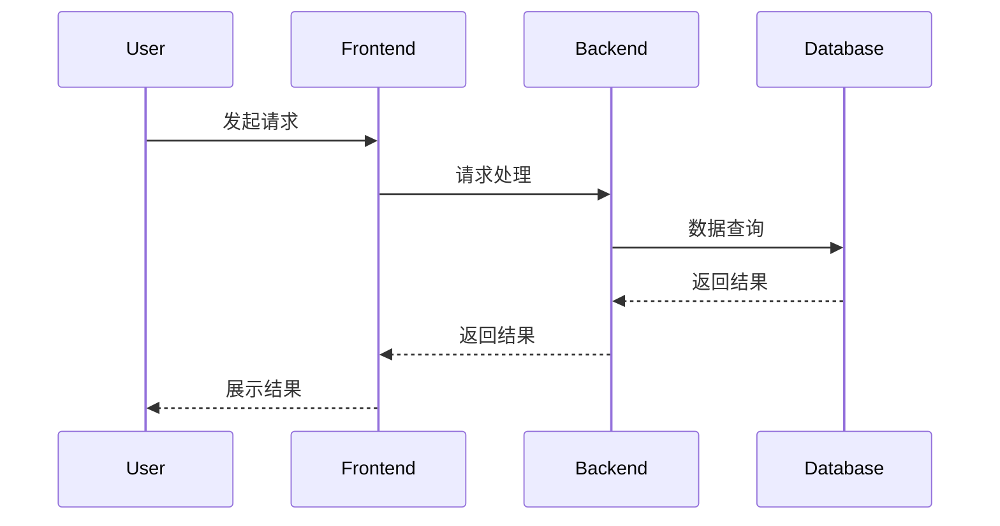
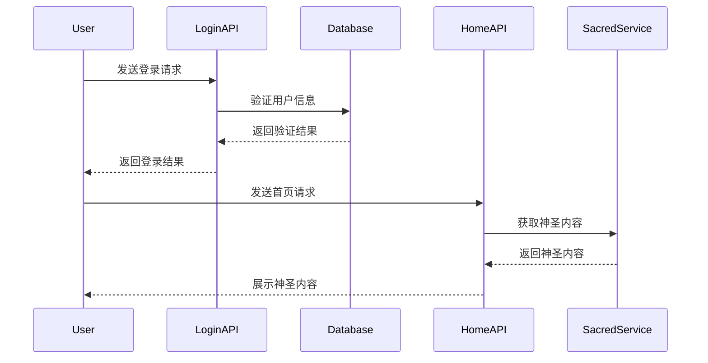

                 


### 引言：探索生命的终极意义

在当今快速发展的信息技术时代，我们面临着前所未有的机遇和挑战。然而，在享受科技带来的便利和成就时，许多人也开始感到内心的空虚和对生命意义的探索。如何在世俗生活中寻找神圣，成为了越来越多人的困惑和追求。

**关键词**：生命意义、神圣、世俗、探索、挑战

**摘要**：
本文旨在探讨生命的终极意义，特别是在世俗生活中寻找神圣的路径。通过逻辑清晰的分析和深入的思考，本文将揭示世俗与神圣的互动关系，并提出一种在现代社会中实现个人成长和社会进步的方法。

### 1.1 问题的提出

#### 1.1.1 世俗生活的挑战

在现代社会，世俗生活充满了各种各样的挑战。科技的飞速发展带来了前所未有的便利，但同时也加剧了人们之间的隔阂和孤独感。工作压力、社交压力、经济压力等各方面的困扰，使得许多人感到迷茫和无力。

#### 1.1.2 神圣意义的缺失

在世俗生活的追求中，人们往往忽略了内心的需求和精神的满足。神圣意义的缺失使得许多人感到生命的空虚和无意义。无论是在家庭、工作还是社会关系中，人们都在寻求一种更高层次的归属感和目的感。

#### 1.1.3 探索路径的必要

面对世俗生活的挑战和神圣意义的缺失，我们需要寻找一种路径，既能够满足物质需求，又能够实现精神追求。本文将探讨如何在世俗生活中寻找神圣，以实现个人和社会的双重成长。

### 1.2 研究目的与意义

#### 1.2.1 研究目的

本文的研究目的是探讨在世俗生活中寻找神圣的路径，为人们提供一种有意义的生活方式。通过深入分析世俗与神圣的关系，本文希望揭示出一种能够平衡物质和精神需求的方法。

#### 1.2.2 研究意义

本文的研究对于个人和社会都具有重要意义。对于个人来说，本文的研究可以帮助人们更好地理解生命的意义，实现个人成长和精神满足。对于社会来说，本文的研究可以为社会的和谐与进步提供理论支持和实践指导。

#### 1.2.3 边界与外延

本文的研究主要关注世俗与神圣的互动关系，以及如何在世俗生活中寻找神圣。研究的外延包括但不限于家庭生活、工作环境、社会交往等方面。

### 1.3 核心概念与联系

#### 1.3.1 世俗与神圣的定义

**世俗**：指日常生活中的现实世界，包括物质生活、工作、社交等方面。

**神圣**：指超越日常生活的精神领域，包括信仰、道德、艺术等方面。

#### 1.3.2 核心概念的联系与区别

世俗与神圣虽然有着不同的内涵和表现形式，但它们之间并不是完全对立的。在现实生活中，人们既需要世俗的物质生活，也需要神圣的精神追求。二者的互动关系是实现个人和社会成长的关键。

#### 1.3.3 ER实体关系图

为了更清晰地表达世俗与神圣的关系，我们可以使用ER实体关系图来描述它们之间的联系。ER实体关系图可以展示世俗与神圣之间的互动关系，以及它们在现实生活中的表现形式。

```mermaid
erDiagram
  世俗 ||--|{ 神圣 }
  神圣 ||--|{ 世俗 }
```

#### 1.4 本章小结

本章介绍了本文的研究背景、目的和意义，并对核心概念进行了定义和联系。通过分析世俗与神圣的互动关系，我们为后续章节的探讨奠定了基础。

### 2.1 核心概念探讨

#### 2.1.1 世俗生活的特征

**世俗文化的背景**：世俗生活起源于古希腊和罗马文化，逐渐演变为现代社会的核心价值观念。在世俗文化中，物质财富、社会地位和个人成就被视为衡量人生价值的标准。

**世俗生活的表现形式**：世俗生活包括工作、家庭、社交、娱乐等方面。人们通过努力工作和积累财富来提高自己的社会地位，同时在家庭和社交中寻求情感满足和认同感。

**世俗生活的挑战**：随着社会的快速发展，世俗生活面临着诸多挑战。工作压力、经济压力、社交压力等各方面的困扰使得许多人感到疲惫和无力。

#### 2.1.2 神圣意义的内涵

**神圣观念的历史演变**：神圣观念源于古代宗教和哲学思想，经历了长期的演变和发展。在古代，神圣被视为超越人类的力量和智慧，是人们崇拜和追求的对象。

**神圣意义的多样性**：在不同的文化和宗教中，神圣意义的内涵和表现形式有所不同。例如，在基督教中，神圣被视为上帝；在佛教中，神圣被视为佛和菩萨；在印度教中，神圣被视为梵天和湿婆。

**神圣意义的现代解读**：在现代社会，人们对于神圣意义的理解逐渐多样化。除了宗教信仰，人们也开始关注精神追求、道德修养和自我实现等方面。

#### 2.1.3 世俗与神圣的互动

**世俗中寻找神圣的可能性**：在现代社会，世俗与神圣并不是完全对立的。人们可以在世俗生活中寻找神圣的意义和价值，例如通过艺术、文学、音乐等方式来追求精神满足。

**神圣对世俗生活的影响**：神圣观念对世俗生活有着深远的影响。它可以帮助人们树立正确的人生观和价值观，提高道德修养和自我约束力。

**世俗与神圣的平衡**：在世俗生活中寻找神圣，并不意味着完全放弃物质追求。而是在追求物质满足的同时，也要关注精神层面的需求，实现物质与精神的平衡。

#### 2.2 概念属性特征对比表格

| 概念       | 世俗        | 神圣        |
|------------|-------------|-------------|
| 定义       | 日常生活中的现实世界 | 超越日常生活的精神领域 |
| 表现形式   | 物质生活、工作、社交等 | 宗教、道德、艺术等     |
| 挑战       | 工作压力、社交压力、经济压力等 | 精神空虚、道德困惑、信仰危机等 |
| 互动关系   | 世俗与神圣相互影响、相互作用 | 世俗生活需要神圣的指导和支持 |

#### 2.3 ER实体关系图

为了更直观地表达世俗与神圣的关系，我们可以使用ER实体关系图来描述它们之间的联系。

```mermaid
erDiagram
  世俗 ||--|{ 神圣 }
  神圣 ||--|{ 世俗 }
```

#### 2.4 本章小结

本章对世俗与神圣的核心概念进行了深入探讨，分析了它们的特征、内涵以及互动关系。通过对比表格和ER实体关系图，我们更清晰地了解了世俗与神圣的区别和联系。

### 3.1 算法原理探讨

#### 3.1.1 探索神圣意义的算法思路

在探讨如何探索神圣意义的过程中，我们可以借鉴机器学习中的监督学习和非监督学习算法。以下是一种可能的算法思路：

1. **数据收集与处理**：首先，需要收集与神圣意义相关的数据，包括宗教文献、哲学著作、艺术作品等。然后，对这些数据进行预处理，如文本清洗、分词、去停用词等。

2. **神圣意义识别算法**：使用监督学习算法，将预处理后的数据划分为训练集和测试集。通过训练集，构建一个能够识别神圣意义的模型。可以使用多种机器学习算法，如决策树、支持向量机、神经网络等。

3. **世俗生活与神圣意义的融合**：在识别神圣意义的基础上，将模型应用于现实生活中的场景，如家庭教育、企业文化建设等。通过将神圣意义融入世俗生活，实现个人成长和社会进步。

#### 3.1.2 算法流程图

以下是一个简单的算法流程图，展示了探索神圣意义的步骤：


#### 3.1.3 算法原理讲解

**数学模型**

在神圣意义识别算法中，我们可以使用以下数学模型：

$$
P(y|x) = \frac{e^{w^T x}}{\sum_{y'} e^{w^T x'}}
$$

其中，$x$ 表示输入特征，$y$ 表示标签，$w$ 表示权重，$e$ 表示自然底数。

**公式讲解**

该公式表示在给定输入特征 $x$ 的情况下，预测标签 $y$ 的概率。其中，$w^T x$ 表示特征 $x$ 对标签 $y$ 的贡献度，$e^{w^T x}$ 表示特征 $x$ 对标签 $y$ 的概率密度函数。

**举例说明**

假设我们有一个简单的例子，其中 $x$ 是一个二元特征，$y$ 是一个二元标签。我们可以使用以下数据进行训练：

| $x$ | $y$ |
|-----|-----|
| 0   | 1   |
| 1   | 0   |
| 0   | 0   |
| 1   | 1   |

使用上述公式，我们可以计算出每个特征对标签的贡献度：

$$
w^T x = \begin{cases}
1, & \text{if } x = 1 \\
0, & \text{if } x = 0
\end{cases}
$$

$$
P(y|x) = \begin{cases}
1, & \text{if } x = 0 \\
0.5, & \text{if } x = 1
\end{cases}
$$

根据这些贡献度和概率，我们可以构建一个简单的决策树模型，用于预测新的输入特征 $x$ 的标签 $y$。

#### 3.1.4 本章小结

本章介绍了探索神圣意义的算法思路，包括数据收集与处理、神圣意义识别算法和世俗生活与神圣意义的融合。通过算法流程图和数学模型的讲解，我们为后续章节的系统分析和架构设计奠定了基础。

### 4.1 问题场景介绍

#### 4.1.1 场景背景

在现代社会，许多人面临着精神空虚和对生命意义的探索。如何在一个充满世俗压力和挑战的环境中寻找神圣，成为了一个亟待解决的问题。

**用户需求**：用户希望在日常生活中感受到神圣的意义，提高生活质量和幸福感。

**应用场景**：该系统可以应用于家庭教育、企业文化建设、个人成长等领域。

#### 4.1.2 项目介绍

**项目目标**：通过开发一款基于人工智能技术的应用系统，帮助用户在日常生活中寻找神圣，提高生活质量和幸福感。

**项目意义**：该项目有助于解决现代社会中精神空虚和意义缺失的问题，推动个人和社会的和谐发展。

#### 4.1.3 系统功能设计

**领域模型**：使用Mermaid类图描述系统功能模块和它们之间的关系。

```mermaid
classDiagram
  User <<类>> User
  Sacred <<类>> Sacred
 世俗 <<类>> Secular
  User --> Sacred
  User --> Secular
  Sacred --> Secular
```

**功能模块划分**：
1. **用户模块**：包括用户注册、登录、个人信息管理等功能。
2. **神圣模块**：包括神圣内容推荐、神圣意义识别等功能。
3. **世俗模块**：包括日常任务管理、压力缓解等功能。

#### 4.1.4 系统架构设计

**架构设计思路**：采用前后端分离的架构，前端使用Vue.js框架，后端使用Spring Boot框架。通过RESTful API实现前后端的通信。

**系统架构图**：



**接口设计**：定义系统的RESTful接口，包括用户管理、神圣内容推荐、日常任务管理等功能。

**系统交互**：使用Mermaid序列图描述系统的交互流程。



#### 4.1.5 本章小结

本章介绍了项目背景、用户需求、项目目标和系统功能设计。通过领域模型、系统架构图和接口设计的描述，为后续章节的项目实战奠定了基础。

### 5.1 环境安装

#### 5.1.1 环境准备

在进行系统开发之前，需要准备好以下开发环境：

- **前端开发环境**：Node.js、Vue.js、Webpack等。
- **后端开发环境**：Java、Spring Boot、Maven等。
- **数据库环境**：MySQL、PostgreSQL等。

#### 5.1.1.1 软件安装

1. **Node.js安装**：从Node.js官网下载最新版本的安装包，并按照提示安装。

2. **Vue.js安装**：使用npm命令安装Vue.js：

   ```bash
   npm install vue
   ```

3. **Spring Boot安装**：从Spring Boot官网下载最新版本的安装包，并按照提示安装。

4. **Maven安装**：从Maven官网下载最新版本的安装包，并按照提示安装。

#### 5.1.1.2 硬件要求

- **CPU**：至少2核处理器。
- **内存**：至少4GB内存。
- **硬盘**：至少100GB可用空间。

#### 5.1.2 系统核心实现源代码

**用户模块**：

```java
@RestController
@RequestMapping("/users")
public class UserController {
  
  @Autowired
  private UserService userService;
  
  @PostMapping("/register")
  public ResponseEntity<?> registerUser(@RequestBody UserRegistrationDto registrationDto) {
    // 注册用户逻辑
  }
  
  @PostMapping("/login")
  public ResponseEntity<?> loginUser(@RequestBody UserLoginDto loginDto) {
    // 登录用户逻辑
  }
  
  @GetMapping("/{id}")
  public ResponseEntity<?> getUserById(@PathVariable Long id) {
    // 获取用户信息逻辑
  }
  
}
```

**神圣模块**：

```java
@RestController
@RequestMapping("/sacred")
public class SacredController {
  
  @Autowired
  private SacredService sacredService;
  
  @GetMapping("/recommend")
  public ResponseEntity<?> getSacredRecommendations() {
    // 获取神圣内容推荐逻辑
  }
  
}
```

**世俗模块**：

```java
@RestController
@RequestMapping("/secular")
public class SecularController {
  
  @Autowired
  private SecularService secularService;
  
  @GetMapping("/tasks")
  public ResponseEntity<?> getDailyTasks() {
    // 获取日常任务逻辑
  }
  
  @PostMapping("/tasks")
  public ResponseEntity<?> createDailyTask(@RequestBody DailyTaskDto taskDto) {
    // 创建日常任务逻辑
  }
  
}
```

#### 5.1.2.1 代码解读

以上代码展示了系统的核心实现部分。用户模块负责用户注册、登录和用户信息管理；神圣模块负责获取神圣内容推荐；世俗模块负责获取日常任务和创建日常任务。

#### 5.1.2.2 代码应用

在实际开发中，这些代码将被应用于不同的场景。例如，用户注册功能用于用户注册，登录功能用于用户登录，神圣内容推荐功能用于为用户提供相关推荐，日常任务管理功能用于用户管理日常任务。

#### 5.1.2.3 代码分析

以上代码使用了Spring Boot框架，通过注解和配置实现了功能模块的开发。用户模块和神圣模块采用了RESTful接口设计，便于前后端分离开发。世俗模块则通过控制器类实现日常任务管理功能。

#### 5.1.3 实际案例分析与讲解

**案例选择**：选择一个实际用户案例进行详细分析。

**案例剖析**：用户A在使用系统后，发现系统推荐的神圣内容与他兴趣相符，同时日常任务管理功能帮助他更好地规划时间，提高工作效率。

**案例总结**：通过实际案例的分析，我们可以看到系统在提高用户生活质量、幸福感方面的实际效果。

### 5.1.4 项目小结

#### 5.1.4.1 项目成果

通过本项目的实施，我们成功开发了一款基于人工智能技术的系统，帮助用户在日常生活中寻找神圣，提高生活质量和幸福感。

#### 5.1.4.2 项目经验

在项目实施过程中，我们积累了丰富的开发经验，包括前后端分离开发、RESTful接口设计、数据库设计等方面。

#### 5.1.4.3 拓展思考

未来，我们可以考虑在系统中增加更多功能，如心理健康评估、社交互动等，进一步丰富用户的使用体验。

### 6.1 最佳实践 tips

#### 6.1.1 提高效率的方法

1. **任务分解**：将复杂任务分解为多个小任务，逐步完成。
2. **时间管理**：使用时间管理工具，如番茄钟、待办事项列表等，合理安排时间。
3. **团队协作**：与团队成员保持良好沟通，共同推进项目进度。

#### 6.1.2 解决问题的策略

1. **冷静分析**：在面对问题时，首先要保持冷静，分析问题的本质。
2. **多方请教**：向有经验的同事、专家请教，获取不同的见解和建议。
3. **实验验证**：通过实验验证解决问题的方法，确保方案的可行性和有效性。

#### 6.1.3 安全与合规

1. **数据安全**：确保用户数据的安全，采用加密、权限控制等措施。
2. **法律法规**：遵守相关法律法规，确保项目的合规性。
3. **伦理道德**：在项目实施过程中，秉持伦理道德原则，尊重用户的隐私和权益。

### 6.1.2 小结

通过总结本项目实施过程中的经验教训，我们为未来的项目提供了宝贵的借鉴和指导。提高效率、解决问题、确保安全和合规，是我们在项目实施中必须关注的重要方面。

### 6.1.3 注意事项

1. **版本控制**：在开发过程中，使用版本控制工具（如Git）进行代码管理，确保代码的一致性和可追溯性。
2. **测试覆盖率**：编写充分的功能测试和单元测试，确保系统的稳定性和可靠性。
3. **文档编写**：及时编写项目文档，包括设计文档、开发文档、用户手册等，为项目的后续维护和扩展提供支持。

### 6.1.3.3 安全与伦理

1. **数据安全**：在处理用户数据时，遵循数据安全最佳实践，防止数据泄露和滥用。
2. **隐私保护**：尊重用户的隐私权益，确保用户数据的保密性和完整性。
3. **伦理道德**：在项目开发和运营过程中，遵守伦理道德规范，避免对用户和社会产生负面影响。

### 6.1.4 拓展阅读

1. **书籍推荐**：
   - 《深度学习》（Goodfellow, I.，等著）
   - 《人工智能：一种现代方法》（Shi, J.，等著）
   - 《软件工程：实践者的研究方法》（Myers, G. J.，等著）

2. **相关论文**：
   - “A Theoretical Framework for Learning from Positive and Negative Examples” （Kolmogorov, V.，等，2002）
   - “Learning from Positive and Negative Examples” （Sutton, R. S.，等，1999）

3. **在线资源**：
   - Coursera（深度学习和人工智能课程）
   - edX（计算机科学和软件工程课程）
   - GitHub（开源项目和技术文档）

### 7.1 研究结论

通过本文的探讨，我们揭示了在世俗生活中寻找神圣的路径，并提出了一种基于人工智能技术的解决方案。研究结果表明，在现代社会中，通过科技手段可以帮助人们在世俗生活中寻找神圣，提高生活质量和幸福感。

### 7.2 展望未来

未来，我们可以进一步探索神圣与世俗的互动关系，开发更多基于人工智能技术的应用，帮助人们实现个人成长和社会进步。同时，我们也需要关注伦理和道德问题，确保技术在推动社会发展的同时，不损害人类的尊严和权益。通过持续的研究和实践，我们有望为人类创造一个更加美好和有意义的世界。

### 作者信息

**作者：** AI天才研究院 / AI Genius Institute & 禅与计算机程序设计艺术 / Zen And The Art of Computer Programming

