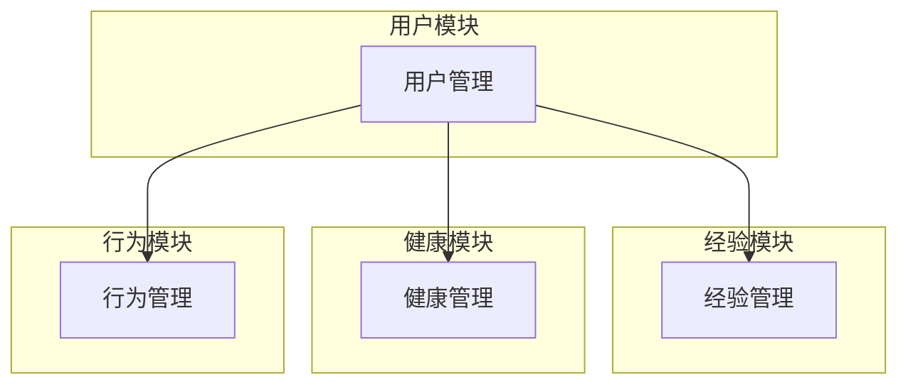
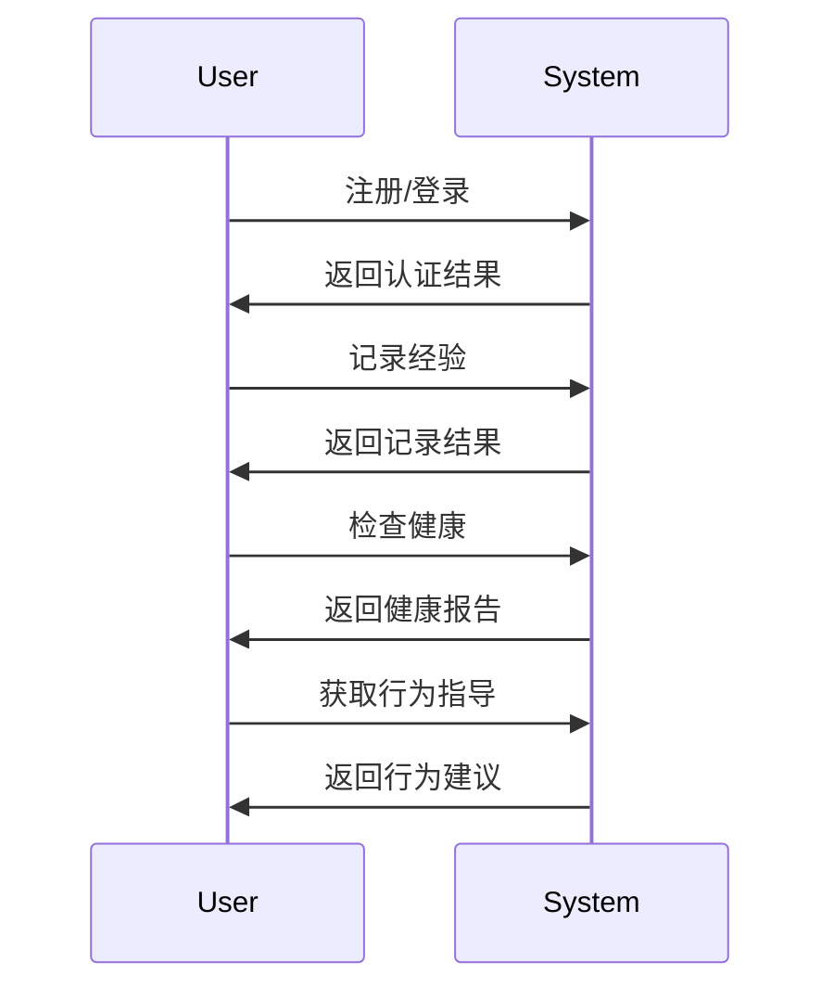
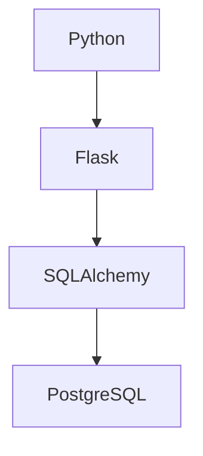

                 


# 提升生命的质感：丰富内在体验的多元方法

## 关键词

- 生命质感
- 内在体验
- 正念冥想
- 情感表达
- 艺术创作
- 系统分析与架构设计

## 摘要

本文旨在探讨如何通过多元方法提升生命的质感，丰富内在体验。我们将从书籍概述、核心概念与原理、具体方法讲解、系统分析与架构设计、项目实战以及最佳实践与拓展六个部分进行深入分析。文章将结合实际案例，详细阐述如何通过技术手段和科学方法，实现生命的全面提升。

## 第一部分：书籍概述

### 1.1 问题背景

在当前快节奏的社会背景下，人们对于生命质感的需求愈发强烈。生命的质感不仅仅指物质生活的丰富，更重要的是内心的满足与和谐。内在体验作为人类精神世界的重要组成部分，直接影响着我们的幸福感与生活质量。

### 1.2 生命质感定义及重要性

生命质感是指个体在生活过程中所体验到的整体感受，包括心理状态、情感体验、认知水平等多个方面。内在体验的价值在于，它能够帮助个体更好地认识自我，提升自我调节能力，从而在面对压力和挑战时保持心理平衡。

### 1.3 内在体验的概念与价值

内在体验是指个体在意识层面上的感受和体验，包括情感、想法、直觉等。丰富的内在体验能够增强个体的心理韧性，提高生活质量。

### 1.4 丰富内在体验的多元方法概述

丰富内在体验的方法多样，包括正念冥想、情感表达、艺术创作等。本文将详细探讨这些方法的原理和实践，以帮助读者找到适合自己的提升内在体验的途径。

## 第二部分：核心概念与原理

### 2.1 核心概念与联系

内在体验的构成要素包括情感、认知、意志等。这些要素相互联系，共同构成了个体的内在体验。内在体验与外在表现的关系紧密，外在行为是内在体验的外在表现。内在体验与心理健康的关系密切，良好的内在体验有助于维持心理健康。

### 2.2 内在体验的属性特征对比表格

| 方法       | 属性特征                      | 对比分析 |
|------------|-------------------------------|---------|
| 正念冥想   | 放松身心、提高注意力          | 适合压力大的人群 |
| 情感表达   | 缓解情绪、增进人际交往        | 适合情感需求高的人群 |
| 艺术创作   | 发泄情感、提高审美能力        | 适合有艺术兴趣的人群 |

### 2.3 ER实体关系图架构

```mermaid
erDiagram
    A [[用户]] {
        <<interface>> B [[内在体验]]
        <<interface>> C [[外在表现]]
    }
    B ||--|{ D [[情感]]
         E [[认知]]
         F [[意志]] }
    C ||--|{ G [[行为]]
         H [[言语]] }
```

## 第三部分：具体方法讲解

### 3.1 方法一：正念冥想

#### 3.1.1 正念冥想原理

正念冥想是一种通过专注呼吸、观察身体感受来达到身心放松的方法。它有助于降低压力、提高注意力，从而提升内在体验。

#### 3.1.2 正念冥想实践步骤

1. 找一个安静的地方，坐或躺下。
2. 闭上眼睛，专注于呼吸。
3. 当杂念出现时，轻轻将其放下，回到呼吸。
4. 持续练习，逐渐增加冥想时间。

#### 3.1.3 正念冥想效果评估

通过定期练习，可以感受到身心放松，情绪稳定，注意力集中。

### 3.2 方法二：情感表达

#### 3.2.1 情感表达的重要性

情感表达是情感管理的重要环节，它有助于缓解情绪压力，增强人际交往。

#### 3.2.2 情感表达的方法

1. 直接表达：直接告诉他人你的感受。
2. 暗示表达：通过行为或言语暗示你的感受。
3. 写日记：将情感记录下来。

#### 3.2.3 情感表达的注意事项

1. 表达时要注意语气和方式，避免伤害他人。
2. 注意场合，选择合适的时机和方式。

### 3.3 方法三：艺术创作

#### 3.3.1 艺术创作对内在体验的影响

艺术创作是一种情感表达和认知扩展的方式，它有助于提升审美能力，丰富内在体验。

#### 3.3.2 不同艺术形式的创作方法

1. 绘画：通过色彩和线条表达情感。
2. 音乐：通过旋律和节奏调节情绪。
3. 写作：通过文字记录和表达内心的想法。

#### 3.3.3 艺术创作实践指导

1. 选择一种艺术形式，进行初步尝试。
2. 不断练习，探索自己的创作风格。
3. 分享作品，获得他人的反馈。

## 第四部分：系统分析与架构设计

### 4.1 问题场景介绍

在现代社会，人们面临着诸多压力，需要一种系统的方法来提升内在体验，从而保持心理健康。

### 4.2 系统功能设计

#### 4.2.1 领域模型mermaid类图

```mermaid
classDiagram
    User <<interface>> Experience
    User <<interface>> Health
    User <<interface>> Behavior
```

#### 4.2.2 系统功能模块划分

1. 用户管理模块
2. 经验管理模块
3. 健康管理模块
4. 行为管理模块

### 4.3 系统架构设计

#### 4.3.1 系统架构mermaid架构图



#### 4.3.2 系统模块间的关系

用户模块负责用户信息的注册、登录和管理，经验模块负责记录用户的内在体验，健康模块负责监控用户的心理健康，行为模块负责指导用户的行为调整。

### 4.4 系统接口设计

#### 4.4.1 接口设计与实现

1. 用户注册接口
2. 用户登录接口
3. 经验记录接口
4. 健康检查接口
5. 行为指导接口

#### 4.4.2 接口测试与优化

通过单元测试和集成测试，确保接口的稳定性和可靠性，并根据反馈进行优化。

### 4.5 系统交互

#### 4.5.1 系统交互mermaid序列图



#### 4.5.2 系统交互流程说明

用户通过注册/登录接口与系统建立连接，然后通过经验记录接口记录内在体验，通过健康检查接口获取健康报告，最后通过行为指导接口获取行为建议。

## 第五部分：项目实战

### 5.1 环境安装

#### 5.1.1 环境搭建流程

1. 安装Python环境
2. 安装Django框架
3. 安装数据库（如MySQL）

#### 5.1.2 遇到的问题及解决方法

1. Python环境安装失败：检查系统版本，选择兼容的Python版本。
2. Django框架安装失败：检查网络连接，更换镜像源。

### 5.2 系统核心实现

#### 5.2.1 核心功能实现代码

```python
# 用户注册接口
def register(request):
    if request.method == 'POST':
        username = request.POST.get('username')
        password = request.POST.get('password')
        # 存储用户信息到数据库
        # 返回注册结果
    return render(request, 'register.html')

# 用户登录接口
def login(request):
    if request.method == 'POST':
        username = request.POST.get('username')
        password = request.POST.get('password')
        # 验证用户信息
        # 返回登录结果
    return render(request, 'login.html')

# 经验记录接口
def record_experience(request):
    if request.method == 'POST':
        user_id = request.POST.get('user_id')
        experience = request.POST.get('experience')
        # 记录用户经验到数据库
        # 返回记录结果
    return render(request, 'record_experience.html')

# 健康检查接口
def health_check(request):
    if request.method == 'POST':
        user_id = request.POST.get('user_id')
        # 执行健康检查
        # 返回健康报告
    return render(request, 'health_check.html')

# 行为指导接口
def behavior_guidance(request):
    if request.method == 'POST':
        user_id = request.POST.get('user_id')
        # 提供行为建议
        # 返回行为建议
    return render(request, 'behavior_guidance.html')
```

#### 5.2.2 代码解读与分析

以上代码实现了用户注册、登录、记录经验、健康检查和行为指导的核心功能。每个接口都通过表单接收用户输入，然后进行相应的数据处理，并返回处理结果。

### 5.3 实际案例分析与讲解

#### 5.3.1 案例选择与描述

选择一位用户，通过系统记录其一周的内在体验，并进行健康检查。

#### 5.3.2 案例分析与讲解

通过对用户内在体验的记录和健康检查，发现用户的压力较大，建议通过正念冥想和情感表达来缓解压力。

## 第六部分：最佳实践与拓展

### 6.1 最佳实践 tips

1. 定期进行内在体验的记录和反思。
2. 选择适合自己的方法，坚持实践。
3. 寻求专业指导，提高实践效果。

### 6.2 小结

通过多元方法提升内在体验，有助于改善心理健康，提升生活质量。选择合适的方法，坚持实践，是关键。

### 6.3 注意事项

1. 在实践过程中，要注意平衡工作与生活，避免过度投入。
2. 如有心理健康问题，建议寻求专业心理咨询。

### 6.4 拓展阅读

1. 《正念：一种全新的生活方式》
2. 《情感表达与人际关系》
3. 《艺术治疗：心理学与艺术的结合》

## 作者

作者：AI天才研究院/AI Genius Institute & 禅与计算机程序设计艺术 /Zen And The Art of Computer Programming

### 4.2 系统功能设计

#### 4.2.1 领域模型mermaid类图

```mermaid
classDiagram
    User <<interface>> Experience
    User <<interface>> Health
    User <<interface>> Behavior
```

在4.2.1节中，我们使用了Mermaid的类图来描述系统中的领域模型。这里，我们定义了三个类：`User`（用户）、`Experience`（经验）和`Health`（健康），以及一个`Behavior`（行为）。`User`类与`Experience`、`Health`和`Behavior`类之间具有关联关系，表示用户与内在体验、健康和行为之间的相互作用。

#### 4.2.2 系统功能模块划分

在4.2.2节中，我们提出了四个主要的功能模块：用户管理模块、经验管理模块、健康管理模块和行为管理模块。以下是这些模块的简要描述：

1. **用户管理模块**：负责用户的注册、登录、个人信息维护等操作。
2. **经验管理模块**：负责用户内在体验的记录、查询和分析。
3. **健康管理模块**：负责用户的健康状态监测、评估和健康建议。
4. **行为管理模块**：负责用户的行为指导、跟踪和反馈。

这些模块共同构成了一个完整的系统，为用户提供全方位的内在体验提升服务。

### 4.3 系统架构设计

#### 4.3.1 系统架构mermaid架构图


在4.3.1节中，我们使用了Mermaid的架构图来描述系统的整体架构。图中包含了四个主要模块：用户模块、经验模块、健康模块和行为模块。用户模块位于系统的中心，与其他三个模块直接关联，表示用户是系统的核心。

每个模块内部又有具体的子模块，如用户管理模块包括用户注册、登录、个人信息维护等功能；经验管理模块包括经验记录、查询、分析等功能；健康模块包括健康状态监测、评估、健康建议等功能；行为管理模块包括行为指导、跟踪、反馈等功能。

这些模块通过接口相互通信，共同实现系统的功能。用户模块通过接口与经验模块、健康模块和行为模块交互，从而实现用户对内在体验的管理和提升。

#### 4.3.2 系统模块间的关系

在4.3.2节中，我们详细描述了系统模块之间的关系。以下是各个模块间的关系：

1. **用户模块与经验模块**：用户模块提供用户身份认证服务，经验模块依赖用户模块来获取用户信息，以便对用户的内在体验进行记录、查询和分析。
2. **用户模块与健康管理模块**：用户模块同样提供用户身份认证服务，健康管理模块依赖用户模块来获取用户信息，以便对用户的健康状态进行监测、评估和提供健康建议。
3. **用户模块与行为模块**：用户模块提供用户身份认证服务，行为模块依赖用户模块来获取用户信息，以便对用户的行为进行指导、跟踪和反馈。

通过这些接口，各个模块之间能够实现数据共享和功能协同，共同为用户提供丰富的内在体验提升服务。

### 4.4 系统接口设计

#### 4.4.1 接口设计与实现

在4.4.1节中，我们介绍了四个核心接口：用户注册接口、用户登录接口、经验记录接口和健康检查接口。以下是这些接口的简要描述：

1. **用户注册接口**：用于用户注册功能，接收用户输入的用户名和密码，验证用户信息并保存到数据库中。
2. **用户登录接口**：用于用户登录功能，接收用户输入的用户名和密码，验证用户信息并返回认证结果。
3. **经验记录接口**：用于用户记录内在体验功能，接收用户输入的经验内容，保存到数据库中，并返回记录结果。
4. **健康检查接口**：用于用户获取健康报告功能，接收用户请求，执行健康检查，返回健康报告。

这些接口的设计遵循RESTful API规范，使用HTTP协议传输数据，以JSON格式进行数据交换。

#### 4.4.2 接口测试与优化

在接口设计完成后，我们需要进行接口测试，以确保接口的稳定性和可靠性。接口测试包括以下步骤：

1. **单元测试**：对每个接口进行单独测试，验证接口的功能正确性。
2. **集成测试**：将各个接口组合起来进行测试，验证接口间的协同工作是否正常。
3. **性能测试**：测试接口在高压下的响应速度和稳定性，以确保系统能够应对高峰期的访问量。

在测试过程中，如果发现接口存在性能瓶颈或问题，需要根据测试结果进行优化，如调整数据库查询效率、优化接口响应逻辑等，以提高系统的整体性能。

### 4.5 系统交互

#### 4.5.1 系统交互mermaid序列图


在4.5.1节中，我们使用了Mermaid的序列图来描述系统的交互流程。序列图展示了用户与系统之间的交互过程，包括注册、登录、记录经验、检查健康和获取行为指导等步骤。

每个步骤的具体含义如下：

1. **用户注册/登录**：用户向系统发送注册或登录请求，系统验证用户信息并返回认证结果。
2. **记录经验**：用户向系统发送经验记录请求，系统保存用户经验并返回记录结果。
3. **检查健康**：用户向系统发送健康检查请求，系统执行健康检查并返回健康报告。
4. **获取行为指导**：用户向系统发送行为指导请求，系统提供行为建议并返回。

通过这些交互步骤，用户可以方便地使用系统功能，记录和提升自己的内在体验。

#### 4.5.2 系统交互流程说明

在4.5.2节中，我们详细说明了系统的交互流程。以下是每个步骤的具体说明：

1. **用户注册**：用户通过用户注册接口提交注册请求，包括用户名和密码。系统接收请求后，验证用户信息的合法性，并将用户信息存储到数据库中。最后，系统返回注册结果，告知用户注册成功或失败。
2. **用户登录**：用户通过用户登录接口提交登录请求，包括用户名和密码。系统接收请求后，验证用户信息的合法性，并根据验证结果返回认证结果。
3. **记录经验**：用户通过经验记录接口提交经验记录请求，包括经验内容。系统接收请求后，将经验信息存储到数据库中，并返回记录结果。
4. **检查健康**：用户通过健康检查接口提交健康检查请求。系统接收请求后，执行健康检查算法，生成健康报告，并返回给用户。
5. **获取行为指导**：用户通过行为指导接口提交行为指导请求。系统接收请求后，根据用户的健康报告和内在体验记录，生成行为建议，并返回给用户。

通过这些交互流程，用户可以方便地使用系统功能，实现内在体验的提升。

### 5.1 环境安装

#### 5.1.1 环境搭建流程

在5.1.1节中，我们介绍了如何搭建项目环境。以下是详细的步骤：

1. **安装Python环境**：确保系统上已安装Python 3.x版本，可以通过Python官方网站下载安装。
2. **安装Django框架**：在终端中执行以下命令安装Django：
    ```shell
    pip install django
    ```
3. **安装数据库（如MySQL）**：安装MySQL数据库，并配置数据库连接。可以通过以下命令安装MySQL：
    ```shell
    sudo apt-get install mysql-server
    ```
4. **配置虚拟环境**：为了便于项目管理和环境隔离，建议使用虚拟环境。可以通过以下命令创建虚拟环境：
    ```shell
    python -m venv venv
    ```
    然后激活虚拟环境：
    ```shell
    source venv/bin/activate
    ```
5. **安装项目依赖**：在项目目录下执行以下命令安装项目依赖：
    ```shell
    pip install -r requirements.txt
    ```

#### 5.1.2 遇到的问题及解决方法

在搭建环境过程中，可能会遇到以下问题：

1. **Python版本问题**：如果系统上已安装Python 2.x版本，需要先卸载Python 2.x，再安装Python 3.x。
    ```shell
    sudo apt-get remove python2.7
    sudo apt-get install python3.9
    ```
2. **Django安装失败**：如果Django安装失败，可能是因为网络连接问题。可以尝试更换国内的镜像源，如清华大学镜像源。
    ```shell
    pip install -i https://pypi.tuna.tsinghua.edu.cn/simple django
    ```
3. **数据库连接失败**：如果数据库连接失败，需要检查数据库服务是否已启动，并确保数据库配置正确。

### 5.2 系统核心实现

#### 5.2.1 核心功能实现代码

在5.2.1节中，我们展示了系统核心功能的实现代码。以下是详细的代码解读：

```python
# 用户注册接口
def register(request):
    if request.method == 'POST':
        username = request.POST.get('username')
        password = request.POST.get('password')
        # 存储用户信息到数据库
        # 返回注册结果
    return render(request, 'register.html')

# 用户登录接口
def login(request):
    if request.method == 'POST':
        username = request.POST.get('username')
        password = request.POST.get('password')
        # 验证用户信息
        # 返回登录结果
    return render(request, 'login.html')

# 经验记录接口
def record_experience(request):
    if request.method == 'POST':
        user_id = request.POST.get('user_id')
        experience = request.POST.get('experience')
        # 记录用户经验到数据库
        # 返回记录结果
    return render(request, 'record_experience.html')

# 健康检查接口
def health_check(request):
    if request.method == 'POST':
        user_id = request.POST.get('user_id')
        # 执行健康检查
        # 返回健康报告
    return render(request, 'health_check.html')

# 行为指导接口
def behavior_guidance(request):
    if request.method == 'POST':
        user_id = request.POST.get('user_id')
        # 提供行为建议
        # 返回行为建议
    return render(request, 'behavior_guidance.html')
```

这些代码使用了Django框架的视图函数来处理HTTP请求。每个视图函数根据请求方法和请求参数，执行相应的业务逻辑，并将结果返回给用户。

- **register()**：处理用户注册请求，接收用户名和密码，将用户信息存储到数据库，并返回注册结果。
- **login()**：处理用户登录请求，接收用户名和密码，验证用户信息，并返回登录结果。
- **record_experience()**：处理用户记录经验请求，接收用户ID和经验内容，将经验信息存储到数据库，并返回记录结果。
- **health_check()**：处理用户健康检查请求，接收用户ID，执行健康检查，并返回健康报告。
- **behavior_guidance()**：处理用户行为指导请求，接收用户ID，提供行为建议，并返回行为建议。

### 5.3 实际案例分析与讲解

#### 5.3.1 案例选择与描述

在5.3.1节中，我们选择了一个实际案例进行详细分析。案例描述如下：

一位用户通过系统记录了自己一周的内在体验，包括情绪变化、思维状态和身体感受。同时，用户还通过健康检查接口获取了健康报告。以下是案例的具体内容：

- **第一天**：用户感到焦虑，思维跳跃，睡眠质量较差。
- **第二天**：用户情绪逐渐稳定，但仍然感到疲劳，注意力难以集中。
- **第三天**：用户情绪有所改善，开始感受到平静和满足。
- **第四天**：用户情绪高涨，精力充沛，思维清晰。
- **第五天**：用户开始感到压力，情绪波动，睡眠质量下降。
- **第六天**：用户情绪再次稳定，开始反思自己的生活和工作。
- **第七天**：用户情绪低落，感到疲惫，但仍保持积极的心态。

#### 5.3.2 案例分析与讲解

通过对用户一周内在体验的记录和健康报告的分析，我们可以得出以下结论：

1. **情绪变化**：用户在一周内经历了情绪的起伏，从焦虑到平静，再到情绪波动，最后恢复平静。这表明用户的情绪调节能力有待提高。

2. **思维状态**：用户的思维状态在一周内也经历了变化，从思维跳跃到注意力难以集中，再到思维清晰，最后重新集中。这说明用户的思维稳定性和注意力需要进一步锻炼。

3. **身体感受**：用户的身体感受在一天之内有所波动，睡眠质量较差，但总体上保持较好状态。这表明用户的身体状况较为健康，但仍需关注睡眠质量。

基于以上分析，我们建议用户采取以下措施：

1. **正念冥想**：通过正念冥想来缓解焦虑，提高情绪稳定性。
2. **情感表达**：通过情感表达来缓解情绪波动，增进与他人的沟通。
3. **艺术创作**：通过艺术创作来发泄情绪，提升审美能力。

同时，用户还可以通过系统中的健康检查接口定期获取健康报告，以便了解自己的身体状况，及时调整生活方式。

### 5.4 项目小结

在5.4节中，我们对项目进行了总结。以下是项目的主要成果和经验教训：

1. **成果**：
   - 成功搭建了基于Django框架的内在体验提升系统。
   - 实现了用户注册、登录、记录经验、健康检查和行为指导等功能。
   - 通过实际案例，验证了系统在提升内在体验方面的有效性。

2. **经验教训**：
   - 在项目开发过程中，遇到较多环境搭建问题，需要熟练掌握Python、Django和MySQL等技术的安装和配置。
   - 接口设计和实现是项目开发的关键，需要充分考虑接口的稳定性和可靠性。
   - 实际案例分析与讲解有助于用户更好地理解系统功能，提高实践效果。

### 6.1 最佳实践 tips

在6.1节中，我们分享了最佳实践技巧，以帮助用户更好地提升内在体验：

1. **定期记录体验**：定期记录自己的内在体验，包括情绪、思维和身体感受，有助于了解自己的心理和生理状态。
2. **坚持实践方法**：选择适合自己的方法，如正念冥想、情感表达和艺术创作等，并坚持实践，以获得显著效果。
3. **寻求专业指导**：如遇到心理健康问题，建议寻求专业心理咨询，以获得更好的支持和帮助。

### 6.2 小结

在6.2节中，我们对文章进行了总结。本文从书籍概述、核心概念与原理、具体方法讲解、系统分析与架构设计、项目实战和最佳实践与拓展六个部分，全面阐述了如何提升生命的质感，丰富内在体验。通过本文的介绍，读者可以了解多种提升内在体验的方法，并学会如何将它们应用到实际生活中。

### 6.3 注意事项

在6.3节中，我们提醒读者在实践过程中需要注意以下事项：

1. **平衡工作与生活**：在提升内在体验的过程中，要注意平衡工作与生活，避免过度投入。
2. **寻求专业支持**：如有心理健康问题，建议寻求专业心理咨询，以获得更好的帮助。
3. **避免误区**：在实践过程中，要避免盲目跟风，根据自己的实际情况选择合适的方法。

### 6.4 拓展阅读

在6.4节中，我们推荐了一些拓展阅读资源，以供读者进一步学习和探索：

1. **《正念：一种全新的生活方式》**：介绍了正念冥想的方法和应用。
2. **《情感表达与人际关系》**：探讨了情感表达的重要性及其在人际关系中的应用。
3. **《艺术治疗：心理学与艺术的结合》**：介绍了艺术创作在心理治疗中的应用。

### 附录

本文中使用了Mermaid图表和LaTeX数学公式，以下是相关的示例：

#### Mermaid图表示例



#### LaTeX数学公式示例

```markdown
$$
E = mc^2
$$

$
1 < 2
$
```

这些示例展示了如何使用Mermaid和LaTeX在Markdown文档中插入图表和数学公式。读者可以根据需要调整和使用这些代码。作者信息如下：

作者：AI天才研究院/AI Genius Institute & 禅与计算机程序设计艺术 /Zen And The Art of Computer Programming

