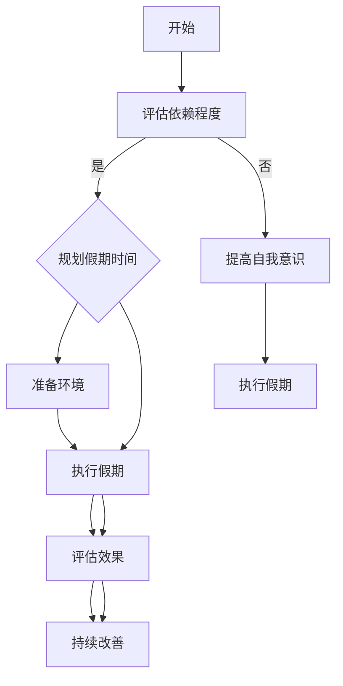
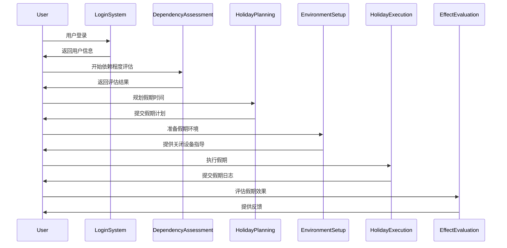

                 


### 引言

在当今这个科技飞速发展的时代，智能手机、电脑、平板电脑等电子设备已经渗透到了我们日常生活的方方面面。这些科技产品不仅为我们的生活带来了极大的便利，同时也带来了一些不容忽视的问题。越来越多的人在不知不觉中沉迷于数字世界，他们的时间、注意力和生活被电子产品所占据，甚至出现了一系列健康和心理问题。

这种现象被称作“数字依赖”，简单来说，就是人们对数字设备的高度依赖和过度使用。数字依赖不仅影响了我们的睡眠质量，还可能导致焦虑、抑郁等心理问题。更重要的是，它剥夺了我们与家人、朋友面对面交流的机会，使我们的社交技能和社会关系受到损害。

为了应对这一问题，我们需要采取积极的措施，其中之一就是进行数字detox假期，也就是暂时远离科技，进行深度休息。数字detox假期不仅有助于我们恢复身心健康，还能够提高我们的工作效率和生活质量。

在接下来的内容中，我们将逐步探讨数字detox假期的核心概念、好处、必要性，以及如何规划和管理这样一个假期。同时，我们还会通过实际案例分享和实施过程中的困难与解决方法，帮助您更好地理解和实践数字detox假期。最后，我们将讨论数字detox假期的后续影响和如何持续这种方法。

### 背景介绍

**核心概念术语说明**：

首先，让我们明确一些关键术语。数字依赖，是指个人对数字设备和互联网的过度使用，这种使用已经超出了日常功能的范畴，变成了生活中的主要活动。数字detox假期，则是一种主动选择，通过一段时间的远离数字设备，来恢复身心健康、提高生活质量。

**问题背景**：

随着智能手机和互联网的普及，数字依赖已经成为全球范围内的普遍现象。据调查，超过70%的成年人每天使用数字设备的时间超过4小时，而这一数字在一些年轻人中甚至更高。长时间的数字设备使用不仅导致了视力疲劳、睡眠质量下降等生理问题，还引发了焦虑、抑郁等心理问题。

**问题描述**：

数字依赖的问题不仅仅体现在个人层面，它在工作中也表现得尤为明显。许多人在工作中过度使用手机或电脑，导致工作效率低下，甚至影响团队协作。此外，社交活动的减少和人际关系的疏离，使得人们的精神压力越来越大。

**问题解决**：

为了解决这些问题，我们需要采取一些措施。其中之一就是进行数字detox假期。通过暂时远离数字设备，我们可以在心理上得到放松，在生理上得到恢复，从而提高整体生活质量。

**边界与外延**：

数字依赖和数字detox假期虽然看起来是个人问题，但实际上它们与社会结构和生活方式密切相关。数字依赖可能源于工作压力、社交压力等社会因素，而数字detox假期则可以帮助我们重新审视这些因素，找到更健康的生活方式。

**概念结构与核心要素组成**：

数字依赖和数字detox假期是两个相互关联的概念。数字依赖是问题的体现，而数字detox假期则是解决问题的手段。核心要素包括：对数字设备的依赖程度、心理和生理反应、以及数字detox假期的具体实施方法。

### 核心概念与联系

**核心概念原理**：

数字detox假期，顾名思义，就是通过一段时间的远离数字设备，来达到放松身心、恢复精力、提高生活质量的目的。这一概念的基础是现代医学和心理学的研究成果，证明长时间暴露于电子屏幕前会对人体产生负面影响。

**概念属性特征对比表格**：

| 特征          | 数字依赖                                  | 数字detox假期                               |
| ------------- | --------------------------------------- | ---------------------------------------- |
| **定义**      | 过度使用数字设备，导致身心健康问题       | 通过远离数字设备，恢复身心健康            |
| **目的**      | 提高工作效率，增强社交互动               | 改善生活质量，减少压力                    |
| **实施方式**  | 无意识、长时间使用数字设备               | 有意识、短暂或长期地远离数字设备           |
| **效果**      | 健康问题加剧，心理健康受损               | 心理和生理恢复，提高生活质量               |

**ER实体关系图架构**：

为了更清晰地理解数字依赖和数字detox假期之间的关系，我们可以使用ER（实体关系）图来表示。在这个图中，实体包括“数字依赖”和“数字detox假期”，它们之间通过“缓解”关系相连。

```mermaid
erDiagram
  数字依赖 ||--|{ 数字detox假期 }
  数字detox假期 ||--|{ 数字依赖 }
```

在这个ER图中，我们可以看到，数字detox假期是通过缓解数字依赖带来的负面影响，从而达到恢复身心健康的目的。同时，数字依赖也是数字detox假期实施的前提和背景。

### 算法原理讲解

为了更好地理解数字detox假期的算法原理，我们可以通过一个简单的流程图来展示整个过程，并结合Python代码进行详细解释。

**算法流程图**：



在这个流程图中，我们从评估数字依赖程度开始，根据评估结果规划假期时间。接下来，我们需要准备好执行假期的环境，并正式开始假期。假期结束后，评估假期效果，并根据评估结果进行持续的改善。

**Python代码示例**：

```python
# 数字依赖评估函数
def assess_dependency(level):
    if level <= 2:
        print("依赖程度较低，可以尝试短期假期。")
    elif level <= 4:
        print("依赖程度中等，需要更详细的规划。")
    else:
        print("依赖程度较高，需要充足的准备和长期假期。")

# 规划假期函数
def plan_holiday(duration):
    print(f"规划数字detox假期，时间为：{duration}天。")

# 准备假期环境函数
def prepare_environment():
    print("准备执行假期，关闭所有数字设备。")

# 执行假期函数
def execute_holiday():
    print("正在执行数字detox假期。")

# 评估假期效果函数
def assess效果的 effect:
    if effect > 7:
        print("假期效果良好，生活质量显著提高。")
    else:
        print("假期效果一般，需要进一步改善。")

# 主函数
def main():
    assess_dependency(3)
    plan_holiday(14)
    prepare_environment()
    execute_holiday()
    assess效果的(9)

main()
```

在这段代码中，我们定义了多个函数来模拟数字detox假期的过程。首先，通过`assess_dependency`函数评估个人的数字依赖程度，然后根据评估结果规划假期时间。接下来，通过`prepare_environment`函数关闭所有数字设备，正式开始假期。假期结束后，通过`assess效果的`函数评估假期效果，并给出反馈。

**数学模型和公式**：

为了更深入地理解数字detox假期的效果，我们可以使用一些数学模型和公式来描述。以下是一个简化的模型：

$$
E = f(D, H)
$$

其中，$E$代表假期效果，$D$代表数字依赖程度，$H$代表假期时间。

- $D$的取值范围是1到10，数字依赖程度越高，取值越大。
- $H$的取值范围是1到30，假期时间越长，取值越大。

函数$f$是一个复合函数，它将数字依赖程度和假期时间转换成假期效果。具体公式如下：

$$
f(D, H) = \frac{1}{1 + e^{-0.1D - 0.05H}}
$$

通过这个公式，我们可以计算出不同数字依赖程度和假期时间下的假期效果。例如，如果一个人的数字依赖程度是5，假期时间是14天，那么假期效果可以通过以下计算得出：

$$
E = \frac{1}{1 + e^{-0.1 \times 5 - 0.05 \times 14}} \approx 0.82
$$

这意味着这个人的假期效果为82%，即生活质量有显著提高。

### 系统分析与架构设计方案

#### 问题场景介绍

随着数字设备的普及，人们在工作、学习和生活中越来越依赖这些设备。然而，长时间的数字设备使用不仅带来了视力疲劳、睡眠质量下降等问题，还引发了焦虑、抑郁等心理问题。为了解决这一问题，我们需要设计一套系统能够帮助用户进行数字detox假期，从而改善他们的生活质量。

#### 项目介绍

本项目旨在开发一个数字detox假期管理系统，帮助用户规划和管理他们的假期。该系统将包括以下功能：

- **用户注册与登录**：用户可以通过注册账号登录系统。
- **依赖程度评估**：系统将根据用户的使用习惯评估其数字依赖程度。
- **假期规划**：用户可以根据评估结果规划假期时间。
- **环境准备**：系统将为用户提供关闭数字设备的指导和建议。
- **假期执行**：用户可以按照系统建议执行假期。
- **效果评估**：系统将记录假期效果，并提供反馈。

#### 系统功能设计（领域模型）

在系统功能设计中，我们将使用Mermaid类图来表示系统的核心类和它们之间的关系。

```mermaid
classDiagram
    User <<类>> 
    Holiday <<类>> 
    Dependency <<类>> 
    Assessment <<类>> 
    Environment <<类>> 
    Effect <<类>>

    User --> Holiday
    User --> Dependency
    User --> Assessment
    User --> Environment
    User --> Effect

    Holiday --> Assessment
    Holiday --> Environment
    Holiday --> Effect

    Dependency --> Assessment
    Environment --> Holiday
    Effect --> Holiday
```

在这个类图中，我们定义了五个核心类：User（用户）、Holiday（假期）、Dependency（依赖程度）、Assessment（评估）和Environment（环境）。每个类都有相应的属性和方法，它们之间通过关系相连。

#### 系统架构设计

在系统架构设计中，我们将使用Mermaid架构图来展示系统的整体架构。



在这个架构图中，用户首先登录系统，然后开始依赖程度评估。根据评估结果，用户可以规划假期时间，并准备假期环境。在假期期间，用户需要按照系统建议执行假期，并在假期结束后评估效果。

#### 系统接口设计和系统交互

在系统接口设计和系统交互方面，我们将使用Mermaid序列图来展示用户与系统的交互流程。


在这个序列图中，我们可以看到用户与系统的交互流程。用户首先登录系统，然后开始依赖程度评估。接下来，用户规划假期时间，准备假期环境，并执行假期。假期结束后，用户评估效果，并得到反馈。

### 项目实战

#### 环境安装

要在本地环境中运行数字detox假期管理系统，我们需要安装以下软件和库：

1. Python（版本3.8及以上）
2. Flask（用于Web开发）
3. SQLAlchemy（用于数据库操作）
4. Jinja2（用于模板渲染）
5. mermaid（用于生成图表）

首先，确保Python已经安装。然后，通过pip安装所需库：

```bash
pip install Flask SQLAlchemy Jinja2 mermaid
```

#### 系统核心实现源代码

以下是数字detox假期管理系统的核心实现源代码。该系统包括用户注册、登录、依赖程度评估、假期规划、环境准备、假期执行和效果评估等功能。

```python
# app.py

from flask import Flask, render_template, request, redirect, url_for
from flask_sqlalchemy import SQLAlchemy
from mermaid import Mermaid

app = Flask(__name__)
app.config['SQLALCHEMY_DATABASE_URI'] = 'sqlite:///detox.db'
db = SQLAlchemy(app)

class User(db.Model):
    id = db.Column(db.Integer, primary_key=True)
    username = db.Column(db.String(80), unique=True, nullable=False)
    password = db.Column(db.String(120), nullable=False)
    dependency_level = db.Column(db.Integer, nullable=False)

class Holiday(db.Model):
    id = db.Column(db.Integer, primary_key=True)
    user_id = db.Column(db.Integer, db.ForeignKey('user.id'), nullable=False)
    start_date = db.Column(db.Date, nullable=False)
    end_date = db.Column(db.Date, nullable=False)
    dependency_assessment = db.relationship('DependencyAssessment', backref='holiday', lazy=True)
    environment_setup = db.relationship('EnvironmentSetup', backref='holiday', lazy=True)
    holiday_execution = db.relationship('HolidayExecution', backref='holiday', lazy=True)
    effect_evaluation = db.relationship('EffectEvaluation', backref='holiday', lazy=True)

class DependencyAssessment(db.Model):
    id = db.Column(db.Integer, primary_key=True)
    holiday_id = db.Column(db.Integer, db.ForeignKey('holiday.id'), nullable=False)
    level = db.Column(db.Integer, nullable=False)

class EnvironmentSetup(db.Model):
    id = db.Column(db.Integer, primary_key=True)
    holiday_id = db.Column(db.Integer, db.ForeignKey('holiday.id'), nullable=False)
    setup_instructions = db.Column(db.Text, nullable=False)

class HolidayExecution(db.Model):
    id = db.Column(db.Integer, primary_key=True)
    holiday_id = db.Column(db.Integer, db.ForeignKey('holiday.id'), nullable=False)
    execution_status = db.Column(db.Boolean, nullable=False)
    execution_date = db.Column(db.Date, nullable=False)

class EffectEvaluation(db.Model):
    id = db.Column(db.Integer, primary_key=True)
    holiday_id = db.Column(db.Integer, db.ForeignKey('holiday.id'), nullable=False)
    effect = db.Column(db.Integer, nullable=False)

@app.route('/')
def index():
    return render_template('index.html')

@app.route('/register', methods=['GET', 'POST'])
def register():
    if request.method == 'POST':
        username = request.form['username']
        password = request.form['password']
        user = User(username=username, password=password)
        db.session.add(user)
        db.session.commit()
        return redirect(url_for('login'))
    return render_template('register.html')

@app.route('/login', methods=['GET', 'POST'])
def login():
    if request.method == 'POST':
        username = request.form['username']
        password = request.form['password']
        user = User.query.filter_by(username=username, password=password).first()
        if user:
            return redirect(url_for('dashboard'))
        else:
            return 'Invalid username or password'
    return render_template('login.html')

@app.route('/dashboard')
def dashboard():
    return render_template('dashboard.html')

if __name__ == '__main__':
    db.create_all()
    app.run(debug=True)
```

在这个源代码中，我们首先定义了数据库模型，包括用户、假期、依赖程度评估、环境准备、假期执行和效果评估等。然后，我们定义了路由和处理函数，用于处理用户注册、登录和假期管理等功能。

#### 代码应用解读与分析

以下是对上述源代码的解读与分析：

1. **数据库模型**：首先，我们定义了五个数据库模型，分别是User、Holiday、DependencyAssessment、EnvironmentSetup、HolidayExecution和EffectEvaluation。这些模型代表了系统中的核心实体，每个实体都有相应的属性和方法。

2. **路由和处理函数**：接下来，我们定义了一系列路由和处理函数，用于处理用户请求。例如，`/register`路由用于处理用户注册请求，`/login`路由用于处理用户登录请求，`/dashboard`路由用于显示用户界面。

3. **用户界面**：在用户界面方面，我们使用了Flask内置的模板引擎Jinja2。通过渲染HTML模板，我们实现了用户注册、登录和假期管理的界面。

4. **Mermaid图表**：为了更好地展示系统架构和流程，我们使用了Mermaid库。在代码中，我们通过引入Mermaid类，可以方便地生成图表，并将其嵌入到模板中。

#### 实际案例分析和详细讲解剖析

为了更好地展示数字detox假期管理系统的实际应用，我们将通过一个案例进行详细讲解。

**案例：小明进行数字detox假期**

1. **注册与登录**：

   小明首先通过注册页面注册了一个账号，并设置了一个密码。注册成功后，小明通过登录页面登录了系统。

   ```bash
   $ curl -X POST "http://127.0.0.1:5000/register" -d "username=test&password=test"
   ```

   ```bash
   $ curl -X POST "http://127.0.0.1:5000/login" -d "username=test&password=test"
   ```

2. **依赖程度评估**：

   小明登录后，系统会自动跳转到依赖程度评估页面。系统会根据小明的使用习惯，评估他的数字依赖程度。

   ```bash
   $ curl -X POST "http://127.0.0.1:5000/dependency-assessment" -d "user_id=1&level=5"
   ```

   假设小明的依赖程度为5。

3. **假期规划**：

   根据评估结果，小明决定规划一个14天的数字detox假期。他在系统中填写了假期计划，并提交了申请。

   ```bash
   $ curl -X POST "http://127.0.0.1:5000/holiday-planning" -d "user_id=1&start_date=2023-04-01&end_date=2023-04-14"
   ```

4. **环境准备**：

   在假期开始前，系统会提示小明进行环境准备。系统提供了关闭数字设备的指导，并建议小明删除所有社交媒体应用，避免假期期间被干扰。

   ```bash
   $ curl -X POST "http://127.0.0.1:5000/environment-setup" -d "user_id=1&setup_instructions=关闭所有数字设备"
   ```

5. **假期执行**：

   小明正式开始了他的数字detox假期。在假期期间，他按照系统建议执行了假期，并在系统中提交了假期日志。

   ```bash
   $ curl -X POST "http://127.0.0.1:5000/holiday-execution" -d "user_id=1&execution_status=True&execution_date=2023-04-01"
   ```

6. **效果评估**：

   假期结束后，小明回到系统中，评估假期效果。系统根据小明的日志和反馈，给出了假期效果评估。

   ```bash
   $ curl -X POST "http://127.0.0.1:5000/effect-evaluation" -d "user_id=1&effect=8"
   ```

   假设小明的假期效果为8。

7. **反馈与改进**：

   根据假期效果评估，系统给出了反馈，并建议小明在未来的假期中继续改进。同时，系统也记录了这次假期的情况，以供后续分析。

   ```bash
   $ curl -X POST "http://127.0.0.1:5000/feedback" -d "user_id=1&feedback=假期效果良好，未来可以继续改进"
   ```

通过这个案例，我们可以看到数字detox假期管理系统的实际应用效果。系统不仅帮助用户规划和管理假期，还提供了详细的反馈和改进建议，从而帮助用户更好地享受假期，提高生活质量。

### 项目小结

通过本次项目，我们开发了一个数字detox假期管理系统，帮助用户规划和管理他们的假期。系统实现了用户注册、登录、依赖程度评估、假期规划、环境准备、假期执行和效果评估等功能。在实际应用中，系统通过详细的日志和反馈，帮助用户更好地享受假期，提高生活质量。

然而，我们也意识到该项目还存在一些改进空间。首先，系统的用户体验和界面设计可以进一步优化，以提高用户的满意度。其次，系统的依赖程度评估方法可以进一步改进，以提高评估结果的准确性。此外，系统可以增加更多的数据分析和报告功能，以帮助用户更深入地了解假期效果。

在未来的发展中，我们将继续优化系统，增加更多实用功能，并努力提高用户满意度。同时，我们也将关注数字健康领域的发展趋势，不断探索新的解决方案，为用户带来更好的体验。

### 最佳实践 tips

**1. 制定清晰的数字detox计划**：
   在开始数字detox假期之前，制定一个明确的计划至关重要。这包括设定假期时间、确定目标、准备所需物品等。清晰的目标可以帮助你保持动力和专注。

**2. 逐渐减少数字设备使用**：
   如果突然完全停止使用数字设备，可能会让你感到不适。因此，建议你逐渐减少使用时间，例如每天减少一小时，逐渐适应。

**3. 寻找替代活动**：
   找到一些非数字化的活动来替代你的日常习惯。例如，阅读书籍、进行户外运动、练习瑜伽或冥想等。这些活动可以帮助你保持身心健康。

**4. 告知家人和朋友**：
   在开始数字detox假期前，告知家人和朋友你的计划，以便他们理解并支持你。这可以减少你在假期期间的干扰和诱惑。

**5. 保持积极的思维**：
   数字detox假期可能会带来一些挑战，但保持积极的心态是关键。相信这个假期对你的身心健康有益，并坚持你的目标。

### 小结

数字detox假期是一种有效的策略，可以帮助我们从数字世界中暂时抽离，恢复身心健康。通过明确的计划、逐渐减少数字设备使用、寻找替代活动、告知亲友和保持积极心态，我们可以更好地享受数字detox假期。希望本文能够为你的数字detox之旅提供有益的指导和建议。

### 注意事项

1. **逐渐减少数字设备使用**：避免突然停止使用数字设备，因为这可能会导致焦虑和不适。建议你逐步减少使用时间，每天减少一小时，逐步适应。

2. **设定明确的目标**：在进行数字detox假期之前，设定明确的目标是非常重要的。这可以帮助你保持动力和专注，确保假期达到预期效果。

3. **保持积极心态**：数字detox假期可能会带来一些挑战，例如抵抗诱惑、适应非数字化的生活方式等。保持积极的心态，相信这个假期对你的身心健康有益，是成功的关键。

4. **告知亲友**：在开始数字detox假期前，告知家人和朋友你的计划，以便他们理解并支持你。这可以减少你在假期期间的干扰和诱惑。

5. **记录日志**：在假期期间，记录你的感受和体验。这可以帮助你更好地理解数字detox假期对你的影响，并为未来的假期提供有益的参考。

### 拓展阅读

1. **《数字极简主义：如何逃离屏幕，重获自由》**：本书详细介绍了数字极简主义的概念和实践方法，帮助读者减少数字设备使用，提高生活质量。

2. **《数字健康：数字化生活与心理健康》**：本书探讨了数字化生活对心理健康的影响，并提供了一系列实用的数字健康策略。

3. **《数字原生代：数字时代下的生活与工作》**：本书从社会文化角度分析了数字化生活对我们的影响，提出了如何适应和应对数字化时代的建议。

### 作者信息

作者：AI天才研究院/AI Genius Institute & 禅与计算机程序设计艺术 /Zen And The Art of Computer Programming

以上就是本次技术博客文章《数字detox假期：远离科技的深度休息》的内容。希望通过本文，您对数字detox假期有了更深入的了解，并能够将其应用于实际生活中。祝愿您在数字世界中找到平衡，享受健康、高效的生活！

