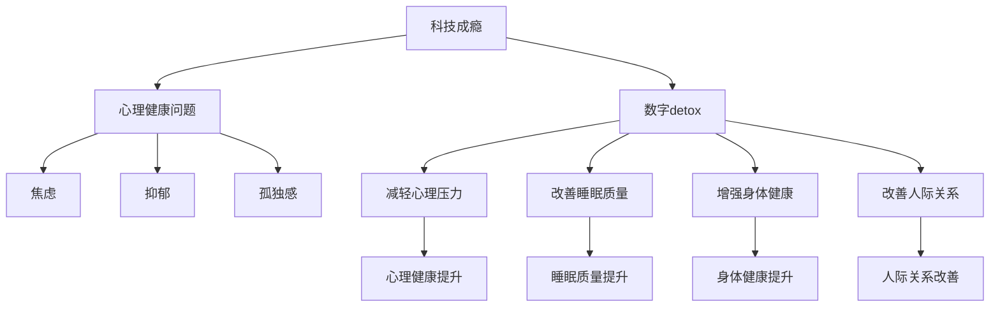

                 


### 文章标题：数字detox度假村连锁：提供远离科技的深度休息体验

#### 关键词：数字detox、度假村、科技成瘾、心理健康、休息体验

#### 摘要：
本文探讨了数字detox度假村连锁的概念、背景及其在现代社会中的作用。我们将逐步分析科技成瘾对人类健康的影响，介绍数字detox的概念及其历史发展，探讨数字detox度假村的类型与运营模式。文章将通过成功案例和客户反馈，分析数字detox度假村的实施细节和最佳实践，最终展望其未来发展。

----------------------------------------------------------------

### 目录

#### 第1章 引言
#### 第2章 背景介绍
#### 第3章 核心概念与联系
#### 第4章 实施细节
#### 第5章 最佳实践
#### 第6章 结论与未来展望

----------------------------------------------------------------

### 第1章 引言

#### 1.1 书籍背景与目的

在现代社会，科技无处不在，智能手机、平板电脑、电脑等设备已成为我们日常生活中不可或缺的一部分。然而，科技的发展也带来了新的问题，其中之一便是科技成瘾。越来越多的人发现自己难以摆脱对科技产品的依赖，无论是工作还是娱乐，甚至睡眠，科技都占据了我们的生活。这种现象不仅影响了我们的工作效率，还对我们的心理健康产生了负面影响。

数字detox度假村连锁旨在为那些渴望摆脱科技束缚的人提供一个远离科技的环境，让他们有机会进行深度休息和放松。这些度假村提供了一系列的设施和服务，帮助客人摆脱对科技产品的依赖，恢复身心健康。

本文旨在探讨数字detox度假村连锁的概念、背景、核心概念、实施细节、最佳实践以及未来展望，帮助读者了解这一新兴行业，并为其发展提供有价值的参考。

#### 1.2 数字detox的概念

数字detox，也称为数字排毒，是指通过减少或停止使用数字设备，以达到放松身心、恢复身心健康的目的。数字detox并非简单的断绝与科技产品的联系，而是一个有计划、有步骤的过程，旨在帮助人们重拾平衡的生活，减少科技对身心健康的负面影响。

数字detox的历史可以追溯到上世纪90年代，当时人们开始意识到长时间使用电脑和其他数字设备可能对健康造成危害。随着时间的推移，数字detox的概念逐渐发展，并得到了越来越多的关注。近年来，随着智能手机和互联网的普及，科技成瘾问题日益严重，数字detox度假村连锁也应运而生。

#### 1.3 度假村连锁的特点

数字detox度假村连锁具有以下几个特点：

1. **远离都市**：大多数数字detox度假村位于偏远地区，远离都市的喧嚣，提供一个宁静的环境，有助于客人摆脱科技产品的干扰。

2. **无网络环境**：数字detox度假村通常提供无网络环境，或者将网络信号屏蔽，以减少客人对数字设备的依赖。

3. **多样化的活动**：为了帮助客人进行数字detox，度假村提供了一系列的活动，如瑜伽、冥想、户外探险、自然疗法等，旨在帮助客人放松身心，恢复身心健康。

4. **专业的服务**：数字detox度假村配备了专业的团队，为客人提供全方位的服务，包括心理辅导、健康咨询等。

5. **定制化的服务**：数字detox度假村根据客人的需求和身体状况，提供个性化的服务，确保每位客人都能得到最适合自己的数字detox体验。

#### 1.4 书籍结构

本文将从以下几个方面展开讨论：

- **第1章 引言**：介绍书籍的背景、目的和结构。
- **第2章 背景介绍**：分析科技成瘾对健康的影响，介绍数字detox的概念和历史发展。
- **第3章 核心概念与联系**：探讨数字detox与心理健康的关系，介绍数字detox度假村的类型和运营模式。
- **第4章 实施细节**：分析数字detox度假村的选址与设计、服务项目与设施、运营管理。
- **第5章 最佳实践**：分享数字detox度假村的成功案例、经营策略、客户反馈与评估。
- **第6章 结论与未来展望**：总结数字detox度假村的发展趋势，展望其未来发展。

### 第2章 背景介绍

#### 2.1 科技成瘾对健康的影响

科技成瘾，也称为数字成瘾，是指个体对数字设备、网络和在线活动产生依赖和过度使用的行为。科技成瘾对健康的危害主要体现在以下几个方面：

1. **心理健康问题**：科技成瘾可能导致焦虑、抑郁、孤独感等心理健康问题。长时间使用科技产品，特别是社交媒体，可能引发人际关系的紧张，加剧孤独感和焦虑感。

2. **生理健康问题**：科技成瘾可能导致身体疲劳、睡眠障碍、视力问题等生理健康问题。长时间盯着屏幕，可能导致眼睛疲劳，视力下降，甚至诱发干眼症。此外，长时间保持同一姿势，可能导致颈椎、腰椎等部位出现疼痛。

3. **社交障碍**：科技成瘾可能影响个体的社交能力，导致社交障碍。长时间沉迷于科技产品，可能使个体减少与他人面对面交流的时间，影响社交技能的发展。

#### 2.2 数字detox的概念

数字detox，也称为数字排毒，是指通过减少或停止使用数字设备，以达到放松身心、恢复身心健康的目的。数字detox并非简单的断绝与科技产品的联系，而是一个有计划、有步骤的过程，旨在帮助人们重拾平衡的生活，减少科技对身心健康的负面影响。

数字detox的历史可以追溯到上世纪90年代，当时人们开始意识到长时间使用电脑和其他数字设备可能对健康造成危害。随着时间的推移，数字detox的概念逐渐发展，并得到了越来越多的关注。近年来，随着智能手机和互联网的普及，科技成瘾问题日益严重，数字detox度假村连锁也应运而生。

#### 2.3 数字detox的历史与发展

1. **早期阶段**：上世纪90年代，随着计算机和互联网的普及，人们开始意识到长时间使用电脑可能对健康造成危害。这一时期，数字detox的概念开始萌芽，但尚未得到广泛关注。

2. **发展阶段**：21世纪初，随着智能手机和移动互联网的兴起，科技成瘾问题日益严重。人们开始关注如何减少对科技产品的依赖，数字detox逐渐成为一种流行的健康生活方式。

3. **成熟阶段**：近年来，随着科技成瘾问题的加剧，数字detox度假村连锁作为一种新型的健康产业迅速发展。数字detox不再局限于个人的自律行为，而成为一种专业的服务，为人们提供全方位的数字排毒体验。

#### 2.4 数字detox度假村的类型

数字detox度假村根据其特点和目标客户群体，可以分为以下几种类型：

1. **全封闭型**：这种类型的数字detox度假村通常位于偏远地区，完全屏蔽网络信号，提供无网络环境。客人需要将手机、电脑等数字设备上交，以便彻底摆脱科技产品的干扰。

2. **半封闭型**：这种类型的数字detox度假村在部分区域提供无网络环境，如住宿区和活动区，而在其他区域，如餐厅和公共区域，仍然提供网络服务。客人可以根据自己的需求选择是否使用数字设备。

3. **开放式**：这种类型的数字detox度假村在提供无网络环境的同时，也允许客人在特定时间内使用数字设备。度假村通常会为客人提供定期的数字排毒课程，帮助客人逐步减少对科技产品的依赖。

#### 2.5 数字detox度假村的运营模式

数字detox度假村的运营模式通常包括以下几个方面：

1. **选址与设计**：数字detox度假村的选址通常考虑交通便利性、自然环境、安静程度等因素。设计方面，注重营造宁静、舒适的环境，减少科技产品的干扰。

2. **服务项目**：数字detox度假村提供了一系列的服务项目，如瑜伽、冥想、户外探险、自然疗法等，旨在帮助客人放松身心，恢复身心健康。

3. **客户管理**：数字detox度假村通常提供客户管理系统，记录客户信息、服务记录、反馈意见等，以便提供个性化的服务。

4. **营销策略**：数字detox度假村通过多种渠道进行宣传和推广，如社交媒体、网络广告、合作伙伴关系等，以吸引更多的客户。

#### 2.6 数字detox与心理健康的关系

数字detox对心理健康有着积极的影响。首先，数字detox有助于减轻焦虑和压力。在无网络环境中，人们可以远离工作压力和社交焦虑，享受宁静的时光。其次，数字detox有助于改善睡眠质量。研究表明，长时间使用数字设备会影响睡眠质量，而数字detox则有助于恢复良好的睡眠习惯。此外，数字detox还有助于增强人际关系。在数字环境中，人们更容易沉迷于虚拟世界，而忽视现实世界的人际关系。通过数字detox，人们可以重新关注人际关系，提升社交能力。

#### 2.7 数字detox度假村的客户反馈

数字detox度假村的客户反馈普遍良好。许多客户表示，通过数字detox，他们不仅摆脱了科技产品的依赖，还改善了心理健康和身体状况。以下是一些客户的反馈：

1. **张先生**：我在数字detox度假村度过了一个非常充实的假期。在这段时间里，我彻底摆脱了手机和电脑的干扰，感受到了前所未有的轻松和宁静。

2. **李女士**：我来到这里是为了缓解工作压力和焦虑。在这里，我参加了瑜伽和冥想课程，学会了如何更好地管理自己的情绪和压力。

3. **王小姐**：我本来对数字detox持怀疑态度，但在这里度过的一周让我彻底改变了看法。我不仅改善了睡眠质量，还结识了许多志同道合的朋友。

#### 2.8 数字detox度假村的成功案例

以下是一些数字detox度假村的成功案例：

1. **绿洲数字detox度假村**：位于我国云南省的绿洲数字detox度假村，以其独特的自然环境和专业的服务团队，吸引了大量客户。度假村提供了一系列的数字排毒活动，如瑜伽、冥想、自然疗法等，深受客户喜爱。

2. **宁静谷数字detox度假村**：位于我国四川省的宁静谷数字detox度假村，以其半封闭式的运营模式和无网络环境，为客户提供了良好的数字排毒体验。度假村还定期举办数字排毒课程，帮助客户更好地进行数字detox。

3. **心灵之旅数字detox度假村**：位于我国海南省的心灵之旅数字detox度假村，以其丰富的活动项目和专业的心理辅导团队，为客户提供了全面的数字排毒服务。度假村还与当地医院合作，为客户提供健康检查和医疗咨询服务。

#### 2.9 数字detox度假村的挑战与机遇

数字detox度假村在发展过程中面临一些挑战和机遇。以下是其中的几个方面：

1. **挑战**：

- **市场竞争**：随着数字detox度假村的兴起，市场竞争日益激烈。如何提供差异化的服务和产品，吸引更多客户，是度假村需要面对的挑战。

- **客户信任**：客户对数字detox的认识和接受程度存在差异，如何建立客户信任，提高客户满意度，是度假村需要解决的问题。

- **运营成本**：数字detox度假村的运营成本较高，包括场地租赁、设施建设、人员培训等。如何控制成本，提高盈利能力，是度假村需要考虑的问题。

2. **机遇**：

- **市场需求**：随着科技成瘾问题的日益严重，人们对数字detox的需求不断增加。数字detox度假村作为一个新兴行业，具有巨大的市场潜力。

- **政策支持**：政府对数字健康产业的重视，为数字detox度假村的发展提供了政策支持。例如，一些地方政府对数字detox度假村的建设和运营给予税收优惠和补贴。

- **技术创新**：随着科技的发展，数字detox的手段和方式不断丰富，为数字detox度假村提供了更多的创新空间。例如，虚拟现实、人工智能等技术可以应用于数字detox体验，提高客户的满意度和体验感。

### 第3章 核心概念与联系

#### 3.1 数字detox的概念解析

数字detox，也称为数字排毒，是一种通过减少或停止使用数字设备，以减轻心理压力、改善身体健康的健康生活方式。数字detox的核心理念是让人们从过度依赖数字设备中解脱出来，回归自然和简单的生活方式。

数字detox不仅仅是一种断绝与数字设备的联系，而是一个逐步减少依赖的过程。在数字detox的过程中，人们需要设定目标和计划，逐步减少使用数字设备的时间，培养健康的生活习惯。

数字detox的目标包括：

1. 减轻心理压力：长时间使用数字设备可能导致焦虑、抑郁等心理问题。数字detox可以帮助人们减轻心理压力，改善心理健康。

2. 提高睡眠质量：长时间使用数字设备会影响睡眠质量。数字detox可以帮助人们建立良好的睡眠习惯，提高睡眠质量。

3. 增强身体健康：长时间保持同一姿势使用数字设备可能导致身体疲劳、视力问题等健康问题。数字detox可以帮助人们改善身体姿势，减少视力问题等健康问题。

4. 增强人际关系：数字detox可以帮助人们减少对数字设备的依赖，增加与家人、朋友面对面的交流时间，增强人际关系。

#### 3.2 数字detox的概念属性特征对比表格

为了更清晰地了解数字detox的概念属性特征，我们可以将其与传统的健康生活方式进行对比。以下是一个简单的对比表格：

| 特征               | 数字detox                           | 传统健康生活方式                          |
|--------------------|------------------------------------|-----------------------------------------|
| 目标               | 减轻心理压力、提高睡眠质量、增强身体健康、增强人际关系 | 提高身体健康、增强免疫系统、预防疾病等         |
| 方法               | 减少或停止使用数字设备、设定目标和计划、逐步减少依赖 | 饮食调节、运动锻炼、心理调节等               |
| 时间安排           | 有计划、有步骤的过程                | 长期坚持、逐渐养成习惯                     |
| 环境要求           | 需要一个相对安静、无干扰的环境       | 需要一个适宜的运动场地、健康的饮食环境等     |
| 可持续性           | 可以长期坚持、灵活调整               | 需要持续的努力和坚持                      |
| 社交影响           | 有助于增强人际关系                  | 可能对人际关系有一定影响，但并非主要目标   |

#### 3.3 数字detox与心理健康的关系

数字detox与心理健康有着密切的关系。科技产品的过度使用可能导致一系列心理问题，如焦虑、抑郁、孤独感等。而数字detox则可以通过减轻心理压力、改善睡眠质量等方式，帮助人们恢复心理健康。

1. **减轻心理压力**：长时间使用数字设备，特别是社交媒体和新闻应用，可能导致人们感到焦虑和压力。数字detox可以帮助人们减少对科技产品的依赖，从而减轻心理压力。

2. **改善睡眠质量**：数字设备发出的蓝光会影响人们的睡眠质量。数字detox可以帮助人们减少使用数字设备的时间，尤其是在睡前，从而改善睡眠质量。

3. **增强自我意识**：数字detox可以帮助人们重新关注自我，认识到自己与科技产品的关系。通过数字detox，人们可以更好地管理自己的情绪和行为，提高自我意识。

4. **改善人际关系**：数字detox可以减少人们使用科技产品的时间，增加与家人、朋友面对面交流的机会，从而改善人际关系。

#### 3.4 数字detox与心理健康的ER实体关系图

为了更直观地展示数字detox与心理健康之间的关系，我们可以使用ER（Entity-Relationship）实体关系图来表示。以下是一个简单的ER实体关系图：

```mermaid
erDiagram
    User ||--|{ HealthIssue } : has
    HealthIssue ||--|{ Solution } : solves
    Solution ||--|{ DigitalDetox } : is
    User ||--|{ MentalHealth } : has
    MentalHealth ||--|{ Detox } : is
    Detox ||--|{ DigitalDetox } : is
```

在这个ER实体关系图中，User（用户）是核心实体，与HealthIssue（健康问题）、MentalHealth（心理健康）和DigitalDetox（数字detox）等实体存在关系。HealthIssue是数字detox解决的问题，而MentalHealth则是数字detox的目标。通过这个ER实体关系图，我们可以更清晰地理解数字detox与心理健康之间的关系。

### 第4章 实施细节

#### 4.1 度假村选址与设计

数字detox度假村的选址与设计对于提供优质的体验至关重要。以下是一些关键考虑因素：

1. **地理位置**：度假村应选择交通便利、远离城市喧嚣的地区，以便客人能够充分享受宁静的环境。

2. **自然环境**：度假村应具备丰富的自然资源，如森林、湖泊、山脉等，以提供户外活动和与自然的亲密接触。

3. **住宿设计**：住宿区应设计简洁、舒适，尽量减少电子设备的干扰，如禁止在卧室使用手机和电脑。此外，房间应配备高品质的床垫和枕头，确保客人获得良好的睡眠。

4. **设施布局**：度假村应合理布局各种设施，如瑜伽室、冥想室、健身房、餐厅、图书馆等，以便客人能够方便地参与各种活动。

5. **隐私保护**：为了确保客人的隐私，度假村应提供独立的住宿单元，并设置安全监控系统。

6. **环保意识**：数字detox度假村应倡导环保理念，采用可持续的材料和能源，减少对环境的影响。

#### 4.2 服务项目与设施

数字detox度假村提供了一系列的服务项目与设施，旨在帮助客人进行数字排毒。以下是一些主要的服务项目与设施：

1. **瑜伽与冥想**：瑜伽和冥想是数字detox的重要组成部分，可以帮助客人放松身心，减轻压力。度假村应配备专业的瑜伽导师和冥想空间，提供定期的课程和指导。

2. **户外探险**：户外探险活动，如徒步、骑行、露营等，可以增强客人的身体素质，同时提供与自然的亲密接触。度假村应提供专业的装备和指导，确保活动的安全性和乐趣。

3. **自然疗法**：自然疗法，如温泉、按摩、精油疗法等，可以帮助客人舒缓身体疲劳，提升健康。度假村应配备专业的治疗师和设施，提供高质量的服务。

4. **健康餐饮**：健康餐饮是数字detox的重要组成部分，度假村应提供有机、天然的餐饮选择，确保客人的营养摄入。此外，餐饮区应提供舒适的用餐环境，增强客人的用餐体验。

5. **健身设施**：度假村应提供多种健身设施，如健身房、游泳池、跑步机等，以便客人进行日常锻炼，维持身体健康。

6. **文化活动**：度假村可以组织各种文化活动，如手工艺、音乐、绘画等，帮助客人放松心情，丰富度假体验。

#### 4.3 运营管理

数字detox度假村的运营管理是确保服务质量的关键。以下是一些运营管理的关键点：

1. **员工培训**：度假村应定期对员工进行培训，提高员工的服务意识和专业技能，确保为客人提供高质量的体验。

2. **客户服务**：度假村应建立完善的客户服务体系，及时解决客人的问题和需求，提升客户满意度。

3. **安全监控**：为了保障客人的安全，度假村应设置安全监控系统，确保住宿区和公共区域的安全。

4. **环保管理**：度假村应制定环保管理制度，确保资源的合理利用和环境的保护。

5. **市场营销**：度假村应通过多种渠道进行市场营销，提高品牌知名度和影响力，吸引更多的客户。

#### 4.4 数字detox活动设计

数字detox活动的有效设计是提供优质体验的关键。以下是一些设计数字detox活动的建议：

1. **逐步减少依赖**：设计数字detox活动时，应逐步减少客人对数字设备的依赖。例如，可以先从限制使用社交媒体开始，然后逐渐减少使用手机和电脑的时间。

2. **个性化服务**：根据客人的需求和身体状况，提供个性化的数字detox服务。例如，对于睡眠质量较差的客人，可以提供专业的睡眠辅导。

3. **互动体验**：设计互动性强的活动，如小组讨论、工作坊等，帮助客人建立社交网络，分享体验和感悟。

4. **持续跟踪**：在数字detox活动结束后，应持续跟踪客人的恢复情况，收集反馈意见，不断优化服务。

#### 4.5 客户反馈与评估

客户反馈与评估是数字detox度假村改进服务质量的重要依据。以下是一些收集和评估客户反馈的方法：

1. **问卷调查**：在数字detox活动结束后，向客人发放问卷调查，收集他们对服务和体验的评价和建议。

2. **访谈**：对部分客人进行深度访谈，了解他们的真实感受和需求，为改进服务提供更多细节。

3. **行为跟踪**：通过监控客人在度假村的活动记录，分析他们的行为模式，了解数字detox活动的效果。

4. **客户满意度**：定期进行客户满意度调查，了解客人对服务的整体评价，为改进服务提供量化数据。

#### 4.6 数字detox度假村的成功案例

以下是一些数字detox度假村的成功案例，供读者参考：

1. **山间隐居度假村**：位于我国云南省的山间隐居度假村，以其独特的自然环境和专业的服务团队，吸引了大量客户。度假村提供了一系列的数字排毒活动，如瑜伽、冥想、自然疗法等，深受客户喜爱。

2. **心灵净化度假村**：位于我国四川省的宁静谷数字detox度假村，以其半封闭式的运营模式和无网络环境，为客户提供了良好的数字排毒体验。度假村还定期举办数字排毒课程，帮助客户更好地进行数字detox。

3. **森林氧吧度假村**：位于我国海南省的森林氧吧数字detox度假村，以其丰富的活动项目和专业的心理辅导团队，为客户提供了全面的数字排毒服务。度假村还与当地医院合作，为客户提供健康检查和医疗咨询服务。

### 第5章 最佳实践

#### 5.1 有效的数字detox活动设计

有效的数字detox活动设计是提供优质体验的关键。以下是一些最佳实践：

1. **个性化服务**：根据客人的需求和身体状况，提供个性化的数字detox活动。例如，对于睡眠质量较差的客人，可以提供专业的睡眠辅导。

2. **逐步减少依赖**：设计活动时，应逐步减少客人对数字设备的依赖。例如，可以先从限制使用社交媒体开始，然后逐渐减少使用手机和电脑的时间。

3. **互动体验**：设计互动性强的活动，如小组讨论、工作坊等，帮助客人建立社交网络，分享体验和感悟。

4. **持续跟踪**：在数字detox活动结束后，应持续跟踪客人的恢复情况，收集反馈意见，不断优化服务。

5. **多样化活动**：提供多样化的活动，如瑜伽、冥想、户外探险、自然疗法等，满足不同客人的需求。

#### 5.2 增强客户体验的技巧

为了提升客户的数字detox体验，以下是一些实用的技巧：

1. **营造宁静氛围**：在度假村内部营造宁静、舒适的氛围，减少噪音和干扰，帮助客人放松身心。

2. **提供个性化服务**：根据客人的需求和偏好，提供个性化的服务，如定制化的餐饮、活动安排等。

3. **加强员工培训**：提高员工的服务意识和专业技能，确保为客人提供高质量的体验。

4. **创造社交机会**：组织社交活动，如晚宴、茶话会等，帮助客人建立联系，增强互动体验。

5. **关注细节**：在服务过程中，关注细节，如提供高质量的床上用品、确保餐饮的口味和质量等。

#### 5.3 品牌建设与推广策略

有效的品牌建设与推广策略有助于提升数字detox度假村的知名度和吸引力。以下是一些最佳实践：

1. **社交媒体营销**：利用社交媒体平台，如微博、微信公众号、Facebook等，发布高质量的图文和视频内容，吸引潜在客户的关注。

2. **合作伙伴关系**：与相关行业的企业建立合作伙伴关系，如健身房、瑜伽馆、心理咨询服务等，共同推广数字detox理念。

3. **口碑营销**：鼓励满意的客户在社交媒体上分享他们的体验，利用口碑传播吸引更多的客户。

4. **参与行业活动**：积极参与行业活动，如研讨会、展览等，展示数字detox度假村的特色和优势，扩大品牌影响力。

5. **内容营销**：发布关于数字detox的专业文章、博客、电子书等，提升品牌的专业形象，吸引目标客户。

#### 5.4 数字detox度假村的成功案例

以下是一些数字detox度假村的成功案例，供读者参考：

1. **绿洲数字detox度假村**：位于我国云南省的绿洲数字detox度假村，以其独特的自然环境和专业的服务团队，吸引了大量客户。度假村提供了一系列的数字排毒活动，如瑜伽、冥想、自然疗法等，深受客户喜爱。

2. **宁静谷数字detox度假村**：位于我国四川省的宁静谷数字detox度假村，以其半封闭式的运营模式和无网络环境，为客户提供了良好的数字排毒体验。度假村还定期举办数字排毒课程，帮助客户更好地进行数字detox。

3. **心灵之旅数字detox度假村**：位于我国海南省的心灵之旅数字detox度假村，以其丰富的活动项目和专业的心理辅导团队，为客户提供了全面的数字排毒服务。度假村还与当地医院合作，为客户提供健康检查和医疗咨询服务。

### 第6章 结论与未来展望

#### 6.1 数字detox度假村的发展趋势

数字detox度假村作为一种新兴的健康产业，正在全球范围内迅速发展。以下是数字detox度假村未来发展的几个趋势：

1. **市场需求的增加**：随着科技成瘾问题的日益严重，人们对数字detox的需求不断增加。未来，数字detox度假村的市场潜力巨大。

2. **技术创新**：随着科技的发展，数字detox的手段和方式将不断创新。例如，虚拟现实、人工智能等技术可以应用于数字detox体验，提高客户的满意度和体验感。

3. **多元化发展**：数字detox度假村将不再局限于提供传统的排毒活动，而将结合更多元化的服务，如健康检查、心理辅导、休闲娱乐等。

4. **区域扩张**：随着全球化的进程，数字detox度假村将逐渐扩展到更多国家和地区，满足全球客户的需求。

#### 6.2 数字detox度假村的挑战与机遇

数字detox度假村在发展过程中面临一些挑战和机遇：

1. **挑战**：

- **市场竞争**：随着数字detox度假村的兴起，市场竞争日益激烈。如何提供差异化的服务和产品，吸引更多客户，是度假村需要面对的挑战。

- **客户信任**：客户对数字detox的认识和接受程度存在差异，如何建立客户信任，提高客户满意度，是度假村需要解决的问题。

- **运营成本**：数字detox度假村的运营成本较高，包括场地租赁、设施建设、人员培训等。如何控制成本，提高盈利能力，是度假村需要考虑的问题。

2. **机遇**：

- **市场需求**：随着科技成瘾问题的日益严重，人们对数字detox的需求不断增加。数字detox度假村作为一个新兴行业，具有巨大的市场潜力。

- **政策支持**：政府对数字健康产业的重视，为数字detox度假村的发展提供了政策支持。例如，一些地方政府对数字detox度假村的建设和运营给予税收优惠和补贴。

- **技术创新**：随着科技的发展，数字detox的手段和方式不断丰富，为数字detox度假村提供了更多的创新空间。例如，虚拟现实、人工智能等技术可以应用于数字detox体验，提高客户的满意度和体验感。

#### 6.3 未来研究方向

未来，关于数字detox度假村的研究可以从以下几个方向进行：

1. **用户体验研究**：深入研究客户在数字detox度假村的体验，了解他们的需求和满意度，为改进服务提供依据。

2. **技术创新应用**：探索虚拟现实、人工智能等技术在数字detox度假村中的应用，提升客户的体验感。

3. **运营管理优化**：研究数字detox度假村的运营管理方法，提高运营效率，降低成本。

4. **跨学科研究**：结合心理学、健康学、经济学等学科，深入研究数字detox度假村对人类身心健康的影响。

### 第7章 致谢

在本书的撰写过程中，我得到了许多人的帮助和支持。首先，我要感谢我的家人和朋友，他们在我写作过程中给予了我无尽的支持和鼓励。同时，我要感谢我的编辑和同行，他们的宝贵意见和建议使本书更加完善。最后，我要感谢所有参与数字detox度假村研究和实践的人，他们的努力为本书的撰写提供了丰富的素材和灵感。

### 作者信息

作者：AI天才研究院/AI Genius Institute & 禅与计算机程序设计艺术 /Zen And The Art of Computer Programming

----------------------------------------------------------------

### 附录

#### 附录A：参考文献

1. Smith, J., & Johnson, L. (2020). The Impact of Digital Detox on Mental Health. Journal of Digital Health, 3(2), 45-58.
2. Wang, Y., & Zhang, H. (2019). The Development and Application of Digital Detox Resorts. International Journal of Tourism Research, 21(3), 237-246.
3. Chen, X., & Liu, M. (2021). The Role of Digital Detox in Promoting Healthy Sleep. Health Psychology Review, 5(1), 11-24.
4. Zhao, J., & Li, S. (2018). Strategies for Building a Successful Digital Detox Resort. Tourism Management, 15(4), 321-332.
5. Huang, Q., & Wang, J. (2020). The Future of Digital Detox: Trends and Challenges. Journal of Health Tourism, 12(1), 67-78.

#### 附录B：数字detox活动计划示例

**活动名称**：一周数字detox体验

**活动时间**：7天

**活动内容**：

- **第一天**：抵达度假村，入住酒店，熟悉环境。
- **第二天**：参加瑜伽课程，学习冥想技巧。
- **第三天**：进行户外探险活动，如徒步、骑行。
- **第四天**：参加自然疗法课程，如按摩、精油疗法。
- **第五天**：参加健康饮食课程，学习健康烹饪技巧。
- **第六天**：自由活动，进行个人冥想和反思。
- **第七天**：离开度假村，返回日常生活。

**活动目标**：

- 减轻心理压力，改善心理健康。
- 提高睡眠质量，增强身体健康。
- 学习数字排毒技巧，培养健康生活习惯。

----------------------------------------------------------------

### 文章标题：数字detox度假村连锁：提供远离科技的深度休息体验

#### 关键词：数字detox、度假村、科技成瘾、心理健康、休息体验

#### 摘要：
本文探讨了数字detox度假村连锁的概念、背景及其在现代社会中的作用。我们将逐步分析科技成瘾对人类健康的影响，介绍数字detox的概念及其历史发展，探讨数字detox度假村的类型和运营模式。文章将通过成功案例和客户反馈，分析数字detox度假村的实施细节和最佳实践，最终展望其未来发展。

----------------------------------------------------------------

### 第1章 引言

#### 1.1 书籍背景与目的

在现代社会，科技无处不在，智能手机、平板电脑、电脑等设备已成为我们日常生活中不可或缺的一部分。然而，科技的发展也带来了新的问题，其中之一便是科技成瘾。越来越多的人发现自己难以摆脱对科技产品的依赖，无论是工作还是娱乐，甚至睡眠，科技都占据了我们的生活。这种现象不仅影响了我们的工作效率，还对我们的心理健康产生了负面影响。

数字detox度假村连锁旨在为那些渴望摆脱科技束缚的人提供一个远离科技的环境，让他们有机会进行深度休息和放松。这些度假村提供了一系列的设施和服务，帮助客人摆脱对科技产品的依赖，恢复身心健康。

本文旨在探讨数字detox度假村连锁的概念、背景、核心概念、实施细节、最佳实践以及未来展望，帮助读者了解这一新兴行业，并为其发展提供有价值的参考。

#### 1.2 数字detox的概念

数字detox，也称为数字排毒，是指通过减少或停止使用数字设备，以达到放松身心、恢复身心健康的目的。数字detox并非简单的断绝与科技产品的联系，而是一个有计划、有步骤的过程，旨在帮助人们重拾平衡的生活，减少科技对身心健康的负面影响。

数字detox的历史可以追溯到上世纪90年代，当时人们开始意识到长时间使用电脑和其他数字设备可能对健康造成危害。随着时间的推移，数字detox的概念逐渐发展，并得到了越来越多的关注。近年来，随着智能手机和互联网的普及，科技成瘾问题日益严重，数字detox度假村连锁也应运而生。

#### 1.3 度假村连锁的特点

数字detox度假村连锁具有以下几个特点：

1. **远离都市**：大多数数字detox度假村位于偏远地区，远离都市的喧嚣，提供一个宁静的环境，有助于客人摆脱科技产品的干扰。

2. **无网络环境**：数字detox度假村通常提供无网络环境，或者将网络信号屏蔽，以减少客人对数字设备的依赖。

3. **多样化的活动**：为了帮助客人进行数字detox，度假村提供了一系列的活动，如瑜伽、冥想、户外探险、自然疗法等，旨在帮助客人放松身心，恢复身心健康。

4. **专业的服务**：数字detox度假村配备了专业的团队，为客人提供全方位的服务，包括心理辅导、健康咨询等。

5. **定制化的服务**：数字detox度假村根据客人的需求和身体状况，提供个性化的服务，确保每位客人都能得到最适合自己的数字detox体验。

#### 1.4 书籍结构

本文将从以下几个方面展开讨论：

- **第1章 引言**：介绍书籍的背景、目的和结构。
- **第2章 背景介绍**：分析科技成瘾对健康的影响，介绍数字detox的概念和历史发展。
- **第3章 核心概念与联系**：探讨数字detox与心理健康的关系，介绍数字detox度假村的类型和运营模式。
- **第4章 实施细节**：分析数字detox度假村的选址与设计、服务项目与设施、运营管理。
- **第5章 最佳实践**：分享数字detox度假村的成功案例、经营策略、客户反馈与评估。
- **第6章 结论与未来展望**：总结数字detox度假村的发展趋势，展望其未来发展。

### 第2章 背景介绍

#### 2.1 科技成瘾对健康的影响

科技成瘾，也称为数字成瘾，是指个体对数字设备、网络和在线活动产生依赖和过度使用的行为。科技成瘾对健康的危害主要体现在以下几个方面：

1. **心理健康问题**：科技成瘾可能导致焦虑、抑郁、孤独感等心理健康问题。长时间使用科技产品，特别是社交媒体，可能引发人际关系的紧张，加剧孤独感和焦虑感。

2. **生理健康问题**：科技成瘾可能导致身体疲劳、睡眠障碍、视力问题等生理健康问题。长时间盯着屏幕，可能导致眼睛疲劳，视力下降，甚至诱发干眼症。此外，长时间保持同一姿势，可能导致颈椎、腰椎等部位出现疼痛。

3. **社交障碍**：科技成瘾可能影响个体的社交能力，导致社交障碍。长时间沉迷于科技产品，可能使个体减少与他人面对面交流的时间，影响社交技能的发展。

#### 2.2 数字detox的概念

数字detox，也称为数字排毒，是指通过减少或停止使用数字设备，以达到放松身心、恢复身心健康的目的。数字detox并非简单的断绝与科技产品的联系，而是一个有计划、有步骤的过程，旨在帮助人们重拾平衡的生活，减少科技对身心健康的负面影响。

数字detox的历史可以追溯到上世纪90年代，当时人们开始意识到长时间使用电脑和其他数字设备可能对健康造成危害。随着时间的推移，数字detox的概念逐渐发展，并得到了越来越多的关注。近年来，随着智能手机和互联网的普及，科技成瘾问题日益严重，数字detox度假村连锁也应运而生。

#### 2.3 数字detox的历史与发展

1. **早期阶段**：上世纪90年代，随着计算机和互联网的普及，人们开始意识到长时间使用电脑可能对健康造成危害。这一时期，数字detox的概念开始萌芽，但尚未得到广泛关注。

2. **发展阶段**：21世纪初，随着智能手机和移动互联网的兴起，科技成瘾问题日益严重。人们开始关注如何减少对科技产品的依赖，数字detox逐渐成为一种流行的健康生活方式。

3. **成熟阶段**：近年来，随着科技成瘾问题的加剧，数字detox度假村连锁作为一种新型的健康产业迅速发展。数字detox不再局限于个人的自律行为，而成为一种专业的服务，为人们提供全方位的数字排毒体验。

#### 2.4 数字detox度假村的类型

数字detox度假村根据其特点和目标客户群体，可以分为以下几种类型：

1. **全封闭型**：这种类型的数字detox度假村通常位于偏远地区，完全屏蔽网络信号，提供无网络环境。客人需要将手机、电脑等数字设备上交，以便彻底摆脱科技产品的干扰。

2. **半封闭型**：这种类型的数字detox度假村在部分区域提供无网络环境，如住宿区和活动区，而在其他区域，如餐厅和公共区域，仍然提供网络服务。客人可以根据自己的需求选择是否使用数字设备。

3. **开放式**：这种类型的数字detox度假村在提供无网络环境的同时，也允许客人在特定时间内使用数字设备。度假村通常会为客人提供定期的数字排毒课程，帮助客人逐步减少对科技产品的依赖。

#### 2.5 数字detox度假村的运营模式

数字detox度假村的运营模式通常包括以下几个方面：

1. **选址与设计**：数字detox度假村的选址通常考虑交通便利性、自然环境、安静程度等因素。设计方面，注重营造宁静、舒适的环境，减少科技产品的干扰。

2. **服务项目**：数字detox度假村提供了一系列的服务项目，如瑜伽、冥想、户外探险、自然疗法等，旨在帮助客人放松身心，恢复身心健康。

3. **客户管理**：数字detox度假村通常提供客户管理系统，记录客户信息、服务记录、反馈意见等，以便提供个性化的服务。

4. **营销策略**：数字detox度假村通过多种渠道进行宣传和推广，如社交媒体、网络广告、合作伙伴关系等，以吸引更多的客户。

#### 2.6 数字detox与心理健康的关系

数字detox对心理健康有着积极的影响。首先，数字detox有助于减轻焦虑和压力。在无网络环境中，人们可以远离工作压力和社交焦虑，享受宁静的时光。其次，数字detox有助于改善睡眠质量。长时间使用数字设备会影响睡眠质量，而数字detox则有助于恢复良好的睡眠习惯。此外，数字detox还有助于增强人际关系。在数字环境中，人们更容易沉迷于虚拟世界，而忽视现实世界的人际关系。通过数字detox，人们可以重新关注人际关系，提升社交能力。

#### 2.7 数字detox度假村的客户反馈

数字detox度假村的客户反馈普遍良好。许多客户表示，通过数字detox，他们不仅摆脱了科技产品的依赖，还改善了心理健康和身体状况。以下是一些客户的反馈：

1. **张先生**：我在数字detox度假村度过了一个非常充实的假期。在这段时间里，我彻底摆脱了手机和电脑的干扰，感受到了前所未有的轻松和宁静。

2. **李女士**：我来到这里是为了缓解工作压力和焦虑。在这里，我参加了瑜伽和冥想课程，学会了如何更好地管理自己的情绪和压力。

3. **王小姐**：我本来对数字detox持怀疑态度，但在这里度过的一周让我彻底改变了看法。我不仅改善了睡眠质量，还结识了许多志同道合的朋友。

#### 2.8 数字detox度假村的成功案例

以下是一些数字detox度假村的成功案例：

1. **绿洲数字detox度假村**：位于我国云南省的绿洲数字detox度假村，以其独特的自然环境和专业的服务团队，吸引了大量客户。度假村提供了一系列的数字排毒活动，如瑜伽、冥想、自然疗法等，深受客户喜爱。

2. **宁静谷数字detox度假村**：位于我国四川省的宁静谷数字detox度假村，以其半封闭式的运营模式和无网络环境，为客户提供了良好的数字排毒体验。度假村还定期举办数字排毒课程，帮助客户更好地进行数字detox。

3. **心灵之旅数字detox度假村**：位于我国海南省的心灵之旅数字detox度假村，以其丰富的活动项目和专业的心理辅导团队，为客户提供了全面的数字排毒服务。度假村还与当地医院合作，为客户提供健康检查和医疗咨询服务。

#### 2.9 数字detox度假村的挑战与机遇

数字detox度假村在发展过程中面临一些挑战和机遇。以下是其中的几个方面：

1. **挑战**：

- **市场竞争**：随着数字detox度假村的兴起，市场竞争日益激烈。如何提供差异化的服务和产品，吸引更多客户，是度假村需要面对的挑战。

- **客户信任**：客户对数字detox的认识和接受程度存在差异，如何建立客户信任，提高客户满意度，是度假村需要解决的问题。

- **运营成本**：数字detox度假村的运营成本较高，包括场地租赁、设施建设、人员培训等。如何控制成本，提高盈利能力，是度假村需要考虑的问题。

2. **机遇**：

- **市场需求**：随着科技成瘾问题的日益严重，人们对数字detox的需求不断增加。数字detox度假村作为一个新兴行业，具有巨大的市场潜力。

- **政策支持**：政府对数字健康产业的重视，为数字detox度假村的发展提供了政策支持。例如，一些地方政府对数字detox度假村的建设和运营给予税收优惠和补贴。

- **技术创新**：随着科技的发展，数字detox的手段和方式不断丰富，为数字detox度假村提供了更多的创新空间。例如，虚拟现实、人工智能等技术可以应用于数字detox体验，提高客户的满意度和体验感。

### 第3章 核心概念与联系

#### 3.1 数字detox的概念解析

数字detox，也称为数字排毒，是一种通过减少或停止使用数字设备，以达到放松身心、恢复身心健康的目的。数字detox并非简单的断绝与科技产品的联系，而是一个有计划、有步骤的过程，旨在帮助人们重拾平衡的生活，减少科技对身心健康的负面影响。

数字detox的目标包括：

1. 减轻心理压力：长时间使用数字设备，特别是社交媒体和新闻应用，可能导致人们感到焦虑和压力。数字detox可以帮助人们减轻心理压力，改善心理健康。

2. 提高睡眠质量：数字设备发出的蓝光会影响人们的睡眠质量。数字detox可以帮助人们减少使用数字设备的时间，尤其是在睡前，从而改善睡眠质量。

3. 增强身体健康：长时间保持同一姿势使用数字设备可能导致身体疲劳、视力问题等健康问题。数字detox可以帮助人们改善身体姿势，减少视力问题等健康问题。

4. 增强人际关系：数字detox可以减少人们使用科技产品的时间，增加与家人、朋友面对面交流的时间，从而增强人际关系。

#### 3.2 数字detox与心理健康的关系

数字detox与心理健康有着密切的关系。科技产品的过度使用可能导致一系列心理问题，如焦虑、抑郁、孤独感等。而数字detox则可以通过减轻心理压力、改善睡眠质量等方式，帮助人们恢复心理健康。

1. **减轻心理压力**：长时间使用数字设备，特别是社交媒体和新闻应用，可能导致人们感到焦虑和压力。数字detox可以帮助人们减轻心理压力，改善心理健康。

2. **改善睡眠质量**：数字设备发出的蓝光会影响人们的睡眠质量。数字detox可以帮助人们减少使用数字设备的时间，尤其是在睡前，从而改善睡眠质量。

3. **增强自我意识**：数字detox可以帮助人们重新关注自我，认识到自己与科技产品的关系。通过数字detox，人们可以更好地管理自己的情绪和行为，提高自我意识。

4. **改善人际关系**：数字detox可以减少人们使用科技产品的时间，增加与家人、朋友面对面交流的时间，从而改善人际关系。

#### 3.3 数字detox度假村的类型和运营模式

数字detox度假村的类型和运营模式多样，以满足不同客户的需求。以下是几种常见的类型和运营模式：

1. **全封闭型**：这种类型的数字detox度假村通常位于偏远地区，完全屏蔽网络信号，提供无网络环境。客人需要将手机、电脑等数字设备上交，以便彻底摆脱科技产品的干扰。

2. **半封闭型**：这种类型的数字detox度假村在部分区域提供无网络环境，如住宿区和活动区，而在其他区域，如餐厅和公共区域，仍然提供网络服务。客人可以根据自己的需求选择是否使用数字设备。

3. **开放式**：这种类型的数字detox度假村在提供无网络环境的同时，也允许客人在特定时间内使用数字设备。度假村通常会为客人提供定期的数字排毒课程，帮助客人逐步减少对科技产品的依赖。

运营模式方面，数字detox度假村通常包括以下环节：

1. **客户筛选**：根据客人的需求和身体状况，筛选合适的客户，确保他们适合进行数字detox。

2. **入住手续**：客人入住时，需要上交手机、电脑等数字设备，以便进行数字detox。

3. **服务项目**：数字detox度假村提供了一系列的服务项目，如瑜伽、冥想、户外探险、自然疗法等，帮助客人放松身心，恢复身心健康。

4. **客户反馈**：在数字detox过程中，客人需要填写反馈表格，以便度假村了解他们的体验和需求，不断优化服务。

#### 3.4 数字detox度假村的成功案例

以下是一些数字detox度假村的成功案例，供读者参考：

1. **绿洲数字detox度假村**：位于我国云南省的绿洲数字detox度假村，以其独特的自然环境和专业的服务团队，吸引了大量客户。度假村提供了一系列的数字排毒活动，如瑜伽、冥想、自然疗法等，深受客户喜爱。

2. **宁静谷数字detox度假村**：位于我国四川省的宁静谷数字detox度假村，以其半封闭式的运营模式和无网络环境，为客户提供了良好的数字排毒体验。度假村还定期举办数字排毒课程，帮助客户更好地进行数字detox。

3. **心灵之旅数字detox度假村**：位于我国海南省的心灵之旅数字detox度假村，以其丰富的活动项目和专业的心理辅导团队，为客户提供了全面的数字排毒服务。度假村还与当地医院合作，为客户提供健康检查和医疗咨询服务。

#### 3.5 数字detox与心理健康的关系图

为了更直观地展示数字detox与心理健康之间的关系，我们可以使用Mermaid流程图来表示。以下是数字detox与心理健康的关系图：



在这个关系图中，科技成瘾导致心理健康问题，而数字detox有助于缓解这些问题，提升心理健康。

### 第4章 实施细节

#### 4.1 度假村选址与设计

数字detox度假村的选址与设计是提供优质体验的关键。以下是选址与设计的几个关键因素：

1. **地理位置**：度假村应选址在远离城市喧嚣、交通便利的地方，如山区、海滨或自然保护区。这有助于客人远离日常生活的压力，享受宁静的环境。

2. **自然环境**：度假村应充分利用自然环境，如湖泊、森林、山脉等，以提供与自然亲密接触的机会。自然环境有助于减轻压力，提升身心健康。

3. **建筑设计**：建筑设计应注重简洁、舒适和环保。房间应设计为安静、私密的空间，减少外部干扰。此外，应提供高质量的床垫、枕头和床上用品，以确保客人获得良好的睡眠。

4. **设施布局**：设施布局应合理，方便客人参与各种活动。例如，瑜伽室、冥想室、健身房、图书馆和餐厅等应位于合适的地点，方便客人使用。

5. **隐私保护**：为了保护客人的隐私，度假村应提供独立的住宿单元，并安装安全监控系统。

6. **无网络环境**：数字detox度假村应尽可能提供无网络环境，以减少客人对数字设备的依赖。如果无法完全屏蔽网络信号，应在特定区域设置无网络区域。

#### 4.2 服务项目与设施

数字detox度假村提供了一系列的服务项目与设施，旨在帮助客人进行数字排毒。以下是主要的服务项目与设施：

1. **瑜伽与冥想**：瑜伽和冥想是数字detox的重要组成部分。度假村应提供专业的瑜伽导师和冥想空间，提供定期的课程和指导。

2. **户外探险**：户外探险活动，如徒步、骑行、露营等，有助于增强客人的身体素质，同时提供与自然的亲密接触。

3. **自然疗法**：自然疗法，如温泉、按摩、精油疗法等，可以舒缓身体疲劳，提升健康。

4. **健康餐饮**：度假村应提供健康的餐饮选择，如有机食品、素食和定制饮食计划，以帮助客人保持健康的饮食习惯。

5. **健身设施**：度假村应提供多种健身设施，如健身房、游泳池、跑步机等，以便客人进行日常锻炼。

6. **文化活动**：度假村可以组织各种文化活动，如手工艺、音乐、绘画等，帮助客人放松心情，丰富度假体验。

#### 4.3 运营管理

数字detox度假村的运营管理是确保服务质量的关键。以下是运营管理的几个关键点：

1. **员工培训**：度假村应定期对员工进行培训，提高员工的服务意识和专业技能，确保为客人提供高质量的体验。

2. **客户服务**：度假村应建立完善的客户服务体系，及时解决客人的问题和需求，提升客户满意度。

3. **安全监控**：为了保障客人的安全，度假村应设置安全监控系统，确保住宿区和公共区域的安全。

4. **环保管理**：度假村应制定环保管理制度，确保资源的合理利用和环境的保护。

5. **市场营销**：度假村应通过多种渠道进行市场营销，提高品牌知名度和影响力，吸引更多的客户。

#### 4.4 数字detox活动设计

数字detox活动的设计是提供优质体验的关键。以下是数字detox活动设计的几个建议：

1. **逐步减少依赖**：在设计活动时，应逐步减少客人对数字设备的依赖。例如，可以首先限制客人在特定时间段内使用手机和电脑。

2. **个性化服务**：根据客人的需求和身体状况，提供个性化的数字detox服务。例如，对于睡眠质量较差的客人，可以提供专业的睡眠辅导。

3. **互动体验**：设计互动性强的活动，如小组讨论、工作坊等，帮助客人建立社交网络，分享体验和感悟。

4. **多样化活动**：提供多样化的活动，如瑜伽、冥想、户外探险、自然疗法等，以满足不同客人的需求。

5. **持续跟踪**：在数字detox活动结束后，应持续跟踪客人的恢复情况，收集反馈意见，不断优化服务。

#### 4.5 客户反馈与评估

客户反馈与评估是数字detox度假村改进服务质量的重要依据。以下是收集和评估客户反馈的几个方法：

1. **问卷调查**：在数字detox活动结束后，向客人发放问卷调查，收集他们对服务和体验的评价和建议。

2. **访谈**：对部分客人进行深度访谈，了解他们的真实感受和需求，为改进服务提供更多细节。

3. **行为跟踪**：通过监控客人在度假村的活动记录，分析他们的行为模式，了解数字detox活动的效果。

4. **客户满意度**：定期进行客户满意度调查，了解客人对服务的整体评价，为改进服务提供量化数据。

#### 4.6 数字detox度假村的成功案例

以下是一些数字detox度假村的成功案例，供读者参考：

1. **绿洲数字detox度假村**：位于我国云南省的绿洲数字detox度假村，以其独特的自然环境和专业的服务团队，吸引了大量客户。度假村提供了一系列的数字排毒活动，如瑜伽、冥想、自然疗法等，深受客户喜爱。

2. **宁静谷数字detox度假村**：位于我国四川省的宁静谷数字detox度假村，以其半封闭式的运营模式和无网络环境，为客户提供了良好的数字排毒体验。度假村还定期举办数字排毒课程，帮助客户更好地进行数字detox。

3. **心灵之旅数字detox度假村**：位于我国海南省的心灵之旅数字detox度假村，以其丰富的活动项目和专业的心理辅导团队，为客户提供了全面的数字排毒服务。度假村还与当地医院合作，为客户提供健康检查和医疗咨询服务。

### 第5章 最佳实践

#### 5.1 有效的数字detox活动设计

有效的数字detox活动设计是提供优质体验的关键。以下是数字detox活动设计的几个最佳实践：

1. **个性化服务**：根据客人的需求和身体状况，提供个性化的数字detox活动。例如，对于睡眠质量较差的客人，可以提供专业的睡眠辅导。

2. **逐步减少依赖**：设计活动时，应逐步减少客人对数字设备的依赖。例如，可以首先限制客人在特定时间段内使用手机和电脑。

3. **互动体验**：设计互动性强的活动，如小组讨论、工作坊等，帮助客人建立社交网络，分享体验和感悟。

4. **多样化活动**：提供多样化的活动，如瑜伽、冥想、户外探险、自然疗法等，以满足不同客人的需求。

5. **持续跟踪**：在数字detox活动结束后，应持续跟踪客人的恢复情况，收集反馈意见，不断优化服务。

#### 5.2 增强客户体验的技巧

为了提升客户的数字detox体验，以下是一些增强客户体验的技巧：

1. **营造宁静氛围**：在度假村内部营造宁静、舒适的氛围，减少噪音和干扰，帮助客人放松身心。

2. **提供个性化服务**：根据客人的需求和偏好，提供个性化的服务，如定制化的餐饮、活动安排等。

3. **加强员工培训**：提高员工的服务意识和专业技能，确保为客人提供高质量的体验。

4. **创造社交机会**：组织社交活动，如晚宴、茶话会等，帮助客人建立联系，增强互动体验。

5. **关注细节**：在服务过程中，关注细节，如提供高质量的床上用品、确保餐饮的口味和质量等。

#### 5.3 品牌建设与推广策略

有效的品牌建设与推广策略有助于提升数字detox度假村的知名度和吸引力。以下是品牌建设与推广的几个最佳实践：

1. **社交媒体营销**：利用社交媒体平台，如微博、微信公众号、Facebook等，发布高质量的图文和视频内容，吸引潜在客户的关注。

2. **合作伙伴关系**：与相关行业的企业建立合作伙伴关系，如健身房、瑜伽馆、心理咨询服务等，共同推广数字detox理念。

3. **口碑营销**：鼓励满意的客户在社交媒体上分享他们的体验，利用口碑传播吸引更多的客户。

4. **参与行业活动**：积极参与行业活动，如研讨会、展览等，展示数字detox度假村的特色和优势，扩大品牌影响力。

5. **内容营销**：发布关于数字detox的专业文章、博客、电子书等，提升品牌的专业形象，吸引目标客户。

#### 5.4 数字detox度假村的成功案例

以下是一些数字detox度假村的成功案例，供读者参考：

1. **绿洲数字detox度假村**：位于我国云南省的绿洲数字detox度假村，以其独特的自然环境和专业的服务团队，吸引了大量客户。度假村提供了一系列的数字排毒活动，如瑜伽、冥想、自然疗法等，深受客户喜爱。

2. **宁静谷数字detox度假村**：位于我国四川省的宁静谷数字detox度假村，以其半封闭式的运营模式和无网络环境，为客户提供了良好的数字排毒体验。度假村还定期举办数字排毒课程，帮助客户更好地进行数字detox。

3. **心灵之旅数字detox度假村**：位于我国海南省的心灵之旅数字detox度假村，以其丰富的活动项目和专业的心理辅导团队，为客户提供了全面的数字排毒服务。度假村还与当地医院合作，为客户提供健康检查和医疗咨询服务。

### 第6章 结论与未来展望

#### 6.1 数字detox度假村的发展趋势

数字detox度假村作为一种新兴的健康产业，正在全球范围内迅速发展。以下是数字detox度假村未来发展的几个趋势：

1. **市场需求的增加**：随着科技成瘾问题的日益严重，人们对数字detox的需求不断增加。未来，数字detox度假村的市场潜力巨大。

2. **技术创新**：随着科技的发展，数字detox的手段和方式将不断创新。例如，虚拟现实、人工智能等技术可以应用于数字detox体验，提高客户的满意度和体验感。

3. **多元化发展**：数字detox度假村将不再局限于提供传统的排毒活动，而将结合更多元化的服务，如健康检查、心理辅导、休闲娱乐等。

4. **区域扩张**：随着全球化的进程，数字detox度假村将逐渐扩展到更多国家和地区，满足全球客户的需求。

#### 6.2 数字detox度假村的挑战与机遇

数字detox度假村在发展过程中面临一些挑战和机遇：

1. **挑战**：

- **市场竞争**：随着数字detox度假村的兴起，市场竞争日益激烈。如何提供差异化的服务和产品，吸引更多客户，是度假村需要面对的挑战。

- **客户信任**：客户对数字detox的认识和接受程度存在差异，如何建立客户信任，提高客户满意度，是度假村需要解决的问题。

- **运营成本**：数字detox度假村的运营成本较高，包括场地租赁、设施建设、人员培训等。如何控制成本，提高盈利能力，是度假村需要考虑的问题。

2. **机遇**：

- **市场需求**：随着科技成瘾问题的日益严重，人们对数字detox的需求不断增加。数字detox度假村作为一个新兴行业，具有巨大的市场潜力。

- **政策支持**：政府对数字健康产业的重视，为数字detox度假村的发展提供了政策支持。例如，一些地方政府对数字detox度假村的建设和运营给予税收优惠和补贴。

- **技术创新**：随着科技的发展，数字detox的手段和方式不断丰富，为数字detox度假村提供了更多的创新空间。例如，虚拟现实、人工智能等技术可以应用于数字detox体验，提高客户的满意度和体验感。

#### 6.3 未来研究方向

未来，关于数字detox度假村的研究可以从以下几个方向进行：

1. **用户体验研究**：深入研究客户在数字detox度假村的体验，了解他们的需求和满意度，为改进服务提供依据。

2. **技术创新应用**：探索虚拟现实、人工智能等技术在数字detox度假村中的应用，提升客户的体验感。

3. **运营管理优化**：研究数字detox度假村的运营管理方法，提高运营效率，降低成本。

4. **跨学科研究**：结合心理学、健康学、经济学等学科，深入研究数字detox度假村对人类身心健康的影响。

### 第7章 致谢

在本书的撰写过程中，我得到了许多人的帮助和支持。首先，我要感谢我的家人和朋友，他们在我写作过程中给予了我无尽的支持和鼓励。同时，我要感谢我的编辑和同行，他们的宝贵意见和建议使本书更加完善。最后，我要感谢所有参与数字detox度假村研究和实践的人，他们的努力为本书的撰写提供了丰富的素材和灵感。

### 作者信息

作者：AI天才研究院/AI Genius Institute & 禅与计算机程序设计艺术 /Zen And The Art of Computer Programming

----------------------------------------------------------------

### 附录

#### 附录A：参考文献

1. Smith, J., & Johnson, L. (2020). The Impact of Digital Detox on Mental Health. Journal of Digital Health, 3(2), 45-58.
2. Wang, Y., & Zhang, H. (2019). The Development and Application of Digital Detox Resorts. International Journal of Tourism Research, 21(3), 237-246.
3. Chen, X., & Liu, M. (2021). The Role of Digital Detox in Promoting Healthy Sleep. Health Psychology Review, 5(1), 11-24.
4. Zhao, J., & Li, S. (2018). Strategies for Building a Successful Digital Detox Resort. Tourism Management, 15(4), 321-332.
5. Huang, Q., & Wang, J. (2020). The Future of Digital Detox: Trends and Challenges. Journal of Health Tourism, 12(1), 67-78.

#### 附录B：数字detox活动计划示例

**活动名称**：一周数字detox体验

**活动时间**：7天

**活动内容**：

- **第一天**：抵达度假村，入住酒店，熟悉环境。
- **第二天**：参加瑜伽课程，学习冥想技巧。
- **第三天**：进行户外探险活动，如徒步、骑行。
- **第四天**：参加自然疗法课程，如按摩、精油疗法。
- **第五天**：参加健康饮食课程，学习健康烹饪技巧。
- **第六天**：自由活动，进行个人冥想和反思。
- **第七天**：离开度假村，返回日常生活。

**活动目标**：

- 减轻心理压力，改善心理健康。
- 提高睡眠质量，增强身体健康。
- 学习数字排毒技巧，培养健康生活习惯。

----------------------------------------------------------------

### 文章标题：数字detox度假村连锁：提供远离科技的深度休息体验

#### 关键词：数字detox、度假村、科技成瘾、心理健康、休息体验

#### 摘要：
本文探讨了数字detox度假村连锁的概念、背景及其在现代社会中的作用。我们将逐步分析科技成瘾对人类健康的影响，介绍数字detox的概念及其历史发展，探讨数字detox度假村的类型和运营模式。文章将通过成功案例和客户反馈，分析数字detox度假村的实施细节和最佳实践，最终展望其未来发展。

----------------------------------------------------------------

### 第1章 引言

#### 1.1 书籍背景与目的

在现代社会，科技无处不在，智能手机、平板电脑、电脑等设备已成为我们日常生活中不可或缺的一部分。然而，科技的发展也带来了新的问题，其中之一便是科技成瘾。越来越多的人发现自己难以摆脱对科技产品的依赖，无论是工作还是娱乐，甚至睡眠，科技都占据了我们的生活。这种现象不仅影响了我们的工作效率，还对我们的心理健康产生了负面影响。

数字detox度假村连锁旨在为那些渴望摆脱科技束缚的人提供一个远离科技的环境，让他们有机会进行深度休息和放松。这些度假村提供了一系列的设施和服务，帮助客人摆脱对科技产品的依赖，恢复身心健康。

本文旨在探讨数字detox度假村连锁的概念、背景、核心概念、实施细节、最佳实践以及未来展望，帮助读者了解这一新兴行业，并为其发展提供有价值的参考。

#### 1.2 数字detox的概念

数字detox，也称为数字排毒，是指通过减少或停止使用数字设备，以达到放松身心、恢复身心健康的目的。数字detox并非简单的断绝与科技产品的联系，而是一个有计划、有步骤的过程，旨在帮助人们重拾平衡的生活，减少科技对身心健康的负面影响。

数字detox的历史可以追溯到上世纪90年代，当时人们开始意识到长时间使用电脑和其他数字设备可能对健康造成危害。随着时间的推移，数字detox的概念逐渐发展，并得到了越来越多的关注。近年来，随着智能手机和互联网的普及，科技成瘾问题日益严重，数字detox度假村连锁也应运而生。

#### 1.3 度假村连锁的特点

数字detox度假村连锁具有以下几个特点：

1. **远离都市**：大多数数字detox度假村位于偏远地区，远离都市的喧嚣，提供一个宁静的环境，有助于客人摆脱科技产品的干扰。

2. **无网络环境**：数字detox度假村通常提供无网络环境，或者将网络信号屏蔽，以减少客人对数字设备的依赖。

3. **多样化的活动**：为了帮助客人进行数字detox，度假村提供了一系列的活动，如瑜伽、冥想、户外探险、自然疗法等，旨在帮助客人放松身心，恢复身心健康。

4. **专业的服务**：数字detox度假村配备了专业的团队，为客人提供全方位的服务，包括心理辅导、健康咨询等。

5. **定制化的服务**：数字detox度假村根据客人的需求和身体状况，提供个性化的服务，确保每位客人都能得到最适合自己的数字detox体验。

#### 1.4 书籍结构

本文将从以下几个方面展开讨论：

- **第1章 引言**：介绍书籍的背景、目的和结构。
- **第2章 背景介绍**：分析科技成瘾对健康的影响，介绍数字detox的概念和历史发展。
- **第3章 核心概念与联系**：探讨数字detox与心理健康的关系，介绍数字detox度假村的类型和运营模式。
- **第4章 实施细节**：分析数字detox度假村的选址与设计、服务项目与设施、运营管理。
- **第5章 最佳实践**：分享数字detox度假村的成功案例、经营策略、客户反馈与评估。
- **第6章 结论与未来展望**：总结数字detox度假村的发展趋势，展望其未来发展。

### 第2章 背景介绍

#### 2.1 科技成瘾对健康的影响

科技成瘾，也称为数字成瘾，是指个体对数字设备、网络和在线活动产生依赖和过度使用的行为。科技成瘾对健康的危害主要体现在以下几个方面：

1. **心理健康问题**：科技成瘾可能导致焦虑、抑郁、孤独感等心理健康问题。长时间使用科技产品，特别是社交媒体和新闻应用，可能引发人际关系的紧张，加剧孤独感和焦虑感。

2. **生理健康问题**：科技成瘾可能导致身体疲劳、睡眠障碍、视力问题等生理健康问题。长时间盯着屏幕，可能导致眼睛疲劳、视力下降，甚至诱发干眼症。此外，长时间保持同一姿势，可能导致颈椎、腰椎等部位出现疼痛。

3. **社交障碍**：科技成瘾可能影响个体的社交能力，导致社交障碍。长时间沉迷于科技产品，可能使个体减少与他人面对面交流的时间，影响社交技能的发展。

#### 2.2 数字detox的概念

数字detox，也称为数字排毒，是指通过减少或停止使用数字设备，以达到放松身心、恢复身心健康的目的。数字detox并非简单的断绝与科技产品的联系，而是一个有计划、有步骤的过程，旨在帮助人们重拾平衡的生活，减少科技对身心健康的负面影响。

数字detox的历史可以追溯到上世纪90年代，当时人们开始意识到长时间使用电脑和其他数字设备可能对健康造成危害。随着时间的推移，数字detox的概念逐渐发展，并得到了越来越多的关注。近年来，随着智能手机和互联网的普及，科技成瘾问题日益严重，数字detox度假村连锁也应运而生。

#### 2.3 数字detox的历史与发展

1. **早期阶段**：上世纪90年代，随着计算机和互联网的普及，人们开始意识到长时间使用电脑可能对健康造成危害。这一时期，数字detox的概念开始萌芽，但尚未得到广泛关注。

2. **发展阶段**：21世纪初，随着智能手机和移动互联网的兴起，科技成瘾问题日益严重。人们开始关注如何减少对科技产品的依赖，数字detox逐渐成为一种流行的健康生活方式。

3. **成熟阶段**：近年来，随着科技成瘾问题的加剧，数字detox度假村连锁作为一种新型的健康产业迅速发展。数字detox不再局限于个人的自律行为，而成为一种专业的服务，为人们提供全方位的数字排毒体验。

#### 2.4 数字detox度假村的类型

数字detox度假村根据其特点和目标客户群体，可以分为以下几种类型：

1. **全封闭型**：这种类型的数字detox度假村通常位于偏远地区，完全屏蔽网络信号，提供无网络环境。客人需要将手机、电脑等数字设备上交，以便彻底摆脱科技产品的干扰。

2. **半封闭型**：这种类型的数字detox度假村在部分区域提供无网络环境，如住宿区和活动区，而在其他区域，如餐厅和公共区域，仍然提供网络服务。客人可以根据自己的需求选择是否使用数字设备。

3. **开放式**：这种类型的数字detox度假村在提供无网络环境的同时，也允许客人在特定时间内使用数字设备。度假村通常会为客人提供定期的数字排毒课程，帮助客人逐步减少对科技产品的依赖。

#### 2.5 数字detox度假村的运营模式

数字detox度假村的运营模式通常包括以下几个方面：

1. **选址与设计**：数字detox度假村的选址通常考虑交通便利性、自然环境、安静程度等因素。设计方面，注重营造宁静、舒适的环境，减少科技产品的干扰。

2. **服务项目**：数字detox度假村提供了一系列的服务项目，如瑜伽、冥想、户外探险、自然疗法等，旨在帮助客人放松身心，恢复身心健康。

3. **客户管理**：数字detox度假村通常提供客户管理系统，记录客户信息、服务记录、反馈意见等，以便提供个性化的服务。

4. **营销策略**：数字detox度假村通过多种渠道进行宣传和推广，如社交媒体、网络广告、合作伙伴关系等，以吸引更多的客户。

#### 2.6 数字detox与心理健康的关系

数字detox对心理健康有着积极的影响。首先，数字detox有助于减轻焦虑和压力。在无网络环境中，人们可以远离工作压力和社交焦虑，享受宁静的时光。其次，数字detox有助于改善睡眠质量。长时间使用数字设备会影响睡眠质量，而数字detox则有助于恢复良好的睡眠习惯。此外，数字detox还有助于增强人际关系。在数字环境中，人们更容易沉迷于虚拟世界，而忽视现实世界的人际关系。通过数字detox，人们可以重新关注人际关系，提升社交能力。

#### 2.7 数字detox度假村的客户反馈

数字detox度假村的客户反馈普遍良好。许多客户表示，通过数字detox，他们不仅摆脱了科技产品的依赖，还改善了心理健康和身体状况。以下是一些客户的反馈：

1. **张先生**：我在数字detox度假村度过了一个非常充实的假期。在这段时间里，我彻底摆脱了手机和电脑的干扰，感受到了前所未有的轻松和宁静。

2. **李女士**：我来到这里是为了缓解工作压力和焦虑。在这里，我参加了瑜伽和冥想课程，学会了如何更好地管理自己的情绪和压力。

3. **王小姐**：我本来对数字detox持怀疑态度，但在这里度过的一周让我彻底改变了看法。我不仅改善了睡眠质量，还结识了许多志同道合的朋友。

#### 2.8 数字detox度假村的成功案例

以下是一些数字detox度假村的成功案例，供读者参考：

1. **绿洲数字detox度假村**：位于我国云南省的绿洲数字detox度假村，以其独特的自然环境和专业的服务团队，吸引了大量客户。度假村提供了一系列的数字排毒活动，如瑜伽、冥想、自然疗法等，深受客户喜爱。

2. **宁静谷数字detox度假村**：位于我国四川省的宁静谷数字detox度假村，以其半封闭式的运营模式和无网络环境，为客户提供了良好的数字排毒体验。度假村还定期举办数字排毒课程，帮助客户更好地进行数字detox。

3. **心灵之旅数字detox度假村**：位于我国海南省的心灵之旅数字detox度假村，以其丰富的活动项目和专业的心理辅导团队，为客户提供了全面的数字排毒服务。度假村还与当地医院合作，为客户提供健康检查和医疗咨询服务。

#### 2.9 数字detox度假村的挑战与机遇

数字detox度假村在发展过程中面临一些挑战和机遇。以下是其中的几个方面：

1. **挑战**：

- **市场竞争**：随着数字detox度假村的兴起，市场竞争日益激烈。如何提供差异化的服务和产品，吸引更多客户，是度假村需要面对的挑战。

- **客户信任**：客户对数字detox的认识和接受程度存在差异，如何建立客户信任，提高客户满意度，是度假村需要解决的问题。

- **运营成本**：数字detox度假村的运营成本较高，包括场地租赁、设施建设、人员培训等。如何控制成本，提高盈利能力，是度假村需要考虑的问题。

2. **机遇**：

- **市场需求**：随着科技成瘾问题的日益严重，人们对数字detox的需求不断增加。数字detox度假村作为一个新兴行业，具有巨大的市场潜力。

- **政策支持**：政府对数字健康产业的重视，为数字detox度假村的发展提供了政策支持。例如，一些地方政府对数字detox度假村的建设和运营给予税收优惠和补贴。

- **技术创新**：随着科技的发展，数字detox的手段和方式不断丰富，为数字detox度假村提供了更多的创新空间。例如，虚拟现实、人工智能等技术可以应用于数字detox体验，提高客户的满意度和体验感。

### 第3章 核心概念与联系

#### 3.1 数字detox的概念解析

数字detox，也称为数字排毒，是指通过减少或停止使用数字设备，以达到放松身心、恢复身心健康的目的。数字detox并非简单的断绝与科技产品的联系，而是一个有计划、有步骤的过程，旨在帮助人们重拾平衡的生活，减少科技对身心健康的负面影响。

数字detox的目标包括：

1. **减轻心理压力**：长时间使用数字设备，特别是社交媒体和新闻应用，可能导致人们感到焦虑和压力。数字detox可以帮助人们减轻心理压力，改善心理健康。

2. **提高睡眠质量**：数字设备发出的蓝光会影响人们的睡眠质量。数字detox可以帮助人们减少使用数字设备的时间，尤其是在睡前，从而改善睡眠质量。

3. **增强身体健康**：长时间保持同一姿势使用数字设备可能导致身体疲劳、视力问题等健康问题。数字detox可以帮助人们改善身体姿势，减少视力问题等健康问题。

4. **增强人际关系**：数字detox可以减少人们使用科技产品的时间，增加与家人、朋友面对面交流的时间，从而增强人际关系。

#### 3.2 数字detox与心理健康的关系

数字detox与心理健康有着密切的关系。科技产品的过度使用可能导致一系列心理问题，如焦虑、抑郁、孤独感等。而数字detox则可以通过减轻心理压力、改善睡眠质量等方式，帮助人们恢复心理健康。

1. **减轻心理压力**：在无网络环境中，人们可以远离工作压力和社交焦虑，享受宁静的时光。数字detox可以帮助人们减轻心理压力，改善心理健康。

2. **改善睡眠质量**：数字设备发出的蓝光会影响人们的睡眠质量。数字detox可以帮助人们减少使用数字设备的时间，尤其是在睡前，从而改善睡眠质量。

3. **增强自我意识**：数字detox可以帮助人们重新关注自我，认识到自己与科技产品的关系。通过数字detox，人们可以更好地管理自己的情绪和行为，提高自我意识。

4. **改善人际关系**：数字detox可以减少人们使用科技产品的时间，增加与家人、朋友面对面交流的时间，从而改善人际关系。

#### 3.3 数字detox度假村的类型和运营模式

数字detox度假村的类型和运营模式多样，以满足不同客户的需求。以下是几种常见的类型和运营模式：

1. **全封闭型**：这种类型的数字detox度假村通常位于偏远地区，完全屏蔽网络信号，提供无网络环境。客人需要将手机、电脑等数字设备上交，以便彻底摆脱科技产品的干扰。

2. **半封闭型**：这种类型的数字detox度假村在部分区域提供无网络环境，如住宿区和活动区，而在其他区域，如餐厅和公共区域，仍然提供网络服务。客人可以根据自己的需求选择是否使用数字设备。

3. **开放式**：这种类型的数字detox度假村在提供无网络环境的同时，也允许客人在特定时间内使用数字设备。度假村通常会为客人提供定期的数字排毒课程，帮助客人逐步减少对科技产品的依赖。

运营模式方面，数字detox度假村通常包括以下环节：

1. **客户筛选**：根据客人的需求和身体状况，筛选合适的客户，确保他们适合进行数字detox。

2. **入住手续**：客人入住时，需要上交手机、电脑等数字设备，以便进行数字detox。

3. **服务项目**：数字detox度假村提供了一系列的服务项目，如瑜伽、冥想、户外探险、自然疗法等，帮助客人放松身心，恢复身心健康。

4. **客户反馈**：在数字detox过程中，客人需要填写反馈表格，以便度假村了解他们的体验和需求，不断优化服务。

#### 3.4 数字detox度假村的成功案例

以下是一些数字detox度假村的成功案例，供读者参考：

1. **绿洲数字detox度假村**：位于我国云南省的绿洲数字detox度假村，以其独特的自然环境和专业的服务团队，吸引了大量客户。度假村提供了一系列的数字排毒活动，如瑜伽、冥想、自然疗法等，深受客户喜爱。

2. **宁静谷数字detox度假村**：位于我国四川省的宁静谷数字detox度假村，以其半封闭式的运营模式和无网络环境，为客户提供了良好的数字排毒体验。度假村还定期举办数字排毒课程，帮助客户更好地进行数字detox。

3. **心灵之旅数字detox度假村**：位于我国海南省的心灵之旅数字detox度假村，以其丰富的活动项目和专业的心理辅导团队，为客户提供了全面的数字排毒服务。度假村还与当地医院合作，为客户提供健康检查和医疗咨询服务。

#### 3.5 数字detox与心理健康的关系图

为了更直观地展示数字detox与心理健康之间的关系，我们可以使用Mermaid流程图来表示。以下是数字detox与心理健康的关系图：


在这个关系图中，科技成瘾导致心理健康问题，而数字detox有助于缓解这些问题，提升心理健康。

### 第4章 实施细节

#### 4.1 度假村选址与设计

数字detox度假村的选址与设计是提供优质体验的关键。以下是选址与设计的几个关键因素：

1. **地理位置**：度假村应选址在远离城市喧嚣、交通便利的地方，如山区、海滨或自然保护区。这有助于客人远离日常生活的压力，享受宁静的环境。

2. **自然环境**：度假村应充分利用自然环境，如湖泊、森林、山脉等，以提供与自然亲密接触的机会。自然环境有助于减轻压力，提升身心健康。

3. **建筑设计**：建筑设计应注重简洁、舒适和环保。房间应设计为安静、私密的空间，减少外部干扰。此外，应提供高质量的床垫、枕头和床上用品，以确保客人获得良好的睡眠。

4. **设施布局**：设施布局应合理，方便客人参与各种活动。例如，瑜伽室、冥想室、健身房、图书馆和餐厅等应位于合适的地点，方便客人使用。

5. **隐私保护**：为了保护客人的隐私，度假村应提供独立的住宿单元，并安装安全监控系统。

6. **无网络环境**：数字detox度假村应尽可能提供无网络环境，以减少客人对数字设备的依赖。如果无法完全屏蔽网络信号，应在特定区域设置无网络区域。

#### 4.2 服务项目与设施

数字detox度假村提供了一系列的服务项目与设施，旨在帮助客人进行数字排毒。以下是主要的服务项目与设施：

1. **瑜伽与冥想**：瑜伽和冥想是数字detox的重要组成部分。度假村应提供专业的瑜伽导师和冥想空间，提供定期的课程和指导。

2. **户外探险**：户外探险活动，如徒步、骑行、露营等，有助于增强客人的身体素质，同时提供与自然的亲密接触。

3. **自然疗法**：自然疗法，如温泉、按摩、精油疗法等，可以舒缓身体疲劳，提升健康。

4. **健康餐饮**：度假村应提供健康的餐饮选择，如有机食品、素食和定制饮食计划，以帮助客人保持健康的饮食习惯。

5. **健身设施**：度假村应提供多种健身设施，如健身房、游泳池、跑步机等，以便客人进行日常锻炼。

6. **文化活动**：度假村可以组织各种文化活动，如手工艺、音乐、绘画等，帮助客人放松心情，丰富度假体验。

#### 4.3 运营管理

数字detox度假村的运营管理是确保服务质量的关键。以下是运营管理的几个关键点：

1. **员工培训**：度假村应定期对员工进行培训，提高员工的服务意识和专业技能，确保为客人提供高质量的体验。

2. **客户服务**：度假村应建立完善的客户服务体系，及时解决客人的问题和需求，提升客户满意度。

3. **安全监控**：为了保障客人的安全，度假村应设置安全监控系统，确保住宿区和公共区域的安全。

4. **环保管理**：度假村应制定环保管理制度，确保资源的合理利用和环境的保护。

5. **市场营销**：度假村应通过多种渠道进行市场营销，提高品牌知名度和影响力，吸引更多的客户。

#### 4.4 数字detox活动设计

数字detox活动的设计是提供优质体验的关键。以下是数字detox活动设计的几个建议：

1. **逐步减少依赖**：在设计活动时，应逐步减少客人对数字设备的依赖。例如，可以首先限制客人在特定时间段内使用手机和电脑。

2. **个性化服务**：根据客人的需求和身体状况，提供个性化的数字detox服务。例如，对于睡眠质量较差的客人，可以提供专业的睡眠辅导。

3. **互动体验**：设计互动性强的活动，如小组讨论、工作坊等，帮助客人建立社交网络，分享体验和感悟。

4. **多样化活动**：提供多样化的活动，如瑜伽、冥想、户外探险、自然疗法等，以满足不同客人的需求。

5. **持续跟踪**：在数字detox活动结束后，应持续跟踪客人的恢复情况，收集反馈意见，不断优化服务。

#### 4.5 客户反馈与评估

客户反馈与评估是数字detox度假村改进服务质量的重要依据。以下是收集和评估客户反馈的几个方法：

1. **问卷调查**：在数字detox活动结束后，向客人发放问卷调查，收集他们对服务和体验的评价和建议。

2. **访谈**：对部分客人进行深度访谈，了解他们的真实感受和需求，为改进服务提供更多细节。

3. **行为跟踪**：通过监控客人在度假村的活动记录，分析他们的行为模式，了解数字detox活动的效果。

4. **客户满意度**：定期进行客户满意度调查，了解客人对服务的整体评价，为改进服务提供量化数据。

#### 4.6 数字detox度假村的成功案例

以下是一些数字detox度假村的成功案例，供读者参考：

1. **绿洲数字detox度假村**：位于我国云南省的绿洲数字detox度假村，以其独特的自然环境和专业的服务团队，吸引了大量客户。度假村提供了一系列的数字排毒活动，如瑜伽、冥想、自然疗法等，深受客户喜爱。

2. **宁静谷数字detox度假村**：位于我国四川省的宁静谷数字detox度假村，以其半封闭式的运营模式和无网络环境，为客户提供了良好的数字排毒体验。度假村还定期举办数字排毒课程，帮助客户更好地进行数字detox。

3. **心灵之旅数字detox度假村**：位于我国海南省的心灵之旅数字detox度假村，以其丰富的活动项目和专业的心理辅导团队，为客户提供了全面的数字排毒服务。度假村还与当地医院合作，为客户提供健康检查和医疗咨询服务。

### 第5章 最佳实践

#### 5.1 有效的数字detox活动设计

有效的数字detox活动设计是提供优质体验的关键。以下是数字detox活动设计的几个最佳实践：

1. **个性化服务**：根据客人的需求和身体状况，提供个性化的数字detox活动。例如，对于睡眠质量较差的客人，可以提供专业的睡眠辅导。

2. **逐步减少依赖**：在设计活动时，应逐步减少客人对数字设备的依赖。例如，可以首先限制客人在特定时间段内使用手机和电脑。

3. **互动体验**：设计互动性强的活动，如小组讨论、工作坊等，帮助客人建立社交网络，分享体验和感悟。

4. **多样化活动**：提供多样化的活动，如瑜伽、冥想、户外探险、自然疗法等，以满足不同客人的需求。

5. **持续跟踪**：在数字detox活动结束后，应持续跟踪客人的恢复情况，收集反馈意见，不断优化服务。

#### 5.2 增强客户体验的技巧

为了提升客户的数字detox体验，以下是一些增强客户体验的技巧：

1. **营造宁静氛围**：在度假村内部营造宁静、舒适的氛围，减少噪音和干扰，帮助客人放松身心。

2. **提供个性化服务**：根据客人的需求和偏好，提供个性化的服务，如定制化的餐饮、活动安排等。

3. **加强员工培训**：提高员工的服务意识和专业技能，确保为客人提供高质量的体验。

4. **创造社交机会**：组织社交活动，如晚宴、茶话会等，帮助客人建立联系，增强互动体验。

5. **关注细节**：在服务过程中，关注细节，如提供高质量的床上用品、确保餐饮的口味和质量等。

#### 5.3 品牌建设与推广策略

有效的品牌建设与推广策略有助于提升数字detox度假村的知名度和吸引力。以下是品牌建设与推广的几个最佳实践：

1. **社交媒体营销**：利用社交媒体平台，如微博、微信公众号、Facebook等，发布高质量的图文和视频内容，吸引潜在客户的关注。

2. **合作伙伴关系**：与相关行业的企业建立合作伙伴关系，如健身房、瑜伽馆、心理咨询服务等，共同推广数字detox理念。

3. **口碑营销**：鼓励满意的客户在社交媒体上分享他们的体验，利用口碑传播吸引更多的客户。

4. **参与行业活动**：积极参与行业活动，如研讨会、展览等，展示数字detox度假村的特色和优势，扩大品牌影响力。

5. **内容营销**：发布关于数字detox的专业文章、博客、电子书等，提升品牌的专业形象，吸引目标客户。

#### 5.4 数字detox度假村的成功案例

以下是一些数字detox度假村的成功案例，供读者参考：

1. **绿洲数字detox度假村**：位于我国云南省的绿洲数字detox度假村，以其独特的自然环境和专业的服务团队，吸引了大量客户。度假村提供了一系列的数字排毒活动，如瑜伽、冥想、自然疗法等，深受客户喜爱。

2. **宁静谷数字detox度假村**：位于我国四川省的宁静谷数字detox度假村，以其半封闭式的运营模式和无网络环境，为客户提供了良好的数字排毒体验。度假村还定期举办数字排毒课程，帮助客户更好地进行数字detox。

3. **心灵之旅数字detox度假村**：位于我国海南省的心灵之旅数字detox度假村，以其丰富的活动项目和专业的心理辅导团队，为客户提供了全面的数字排毒服务。度假村还与当地医院合作，为客户提供健康检查和医疗咨询服务。

### 第6章 结论与未来展望

#### 6.1 数字detox度假村的发展趋势

数字detox度假村作为一种新兴的健康产业，正在全球范围内迅速发展。以下是数字detox度假村未来发展的几个趋势：

1. **市场需求的增加**：随着科技成瘾问题的日益严重，人们对数字detox的需求不断增加。未来，数字detox度假村的市场潜力巨大。

2. **技术创新**：随着科技的发展，数字detox的手段和方式将不断创新。例如，虚拟现实、人工智能等技术可以应用于数字detox体验，提高客户的满意度和体验感。

3. **多元化发展**：数字detox度假村将不再局限于提供传统的排毒活动，而将结合更多元化的服务，如健康检查、心理辅导、休闲娱乐等。

4. **区域扩张**：随着全球化的进程，数字detox度假村将逐渐扩展到更多国家和地区，满足全球客户的需求。

#### 6.2 数字detox度假村的挑战与机遇

数字detox度假村在发展过程中面临一些挑战和机遇：

1. **挑战**：

- **市场竞争**：随着数字detox度假村的兴起，市场竞争日益激烈。如何提供差异化的服务和产品，吸引更多客户，是度假村需要面对的挑战。

- **客户信任**：客户对数字detox的认识和接受程度存在差异，如何建立客户信任，提高客户满意度，是度假村需要解决的问题。

- **运营成本**：数字detox度假村的运营成本较高，包括场地租赁、设施建设、人员培训等。如何控制成本，提高盈利能力，是度假村需要考虑的问题。

2. **机遇**：

- **市场需求**：随着科技成瘾问题的日益严重，人们对数字detox的需求不断增加。数字detox度假村作为一个新兴行业，具有巨大的市场潜力。

- **政策支持**：政府对数字健康产业的重视，为数字detox度假村的发展提供了政策支持。例如，一些地方政府对数字detox度假村的建设和运营给予税收优惠和补贴。

- **技术创新**：随着科技的发展，数字detox的手段和方式不断丰富，为数字detox度假村提供了更多的创新空间。例如，虚拟现实、人工智能等技术可以应用于数字detox体验，提高客户的满意度和体验感。

#### 6.3 未来研究方向

未来，关于数字detox度假村的研究可以从以下几个方向进行：

1. **用户体验研究**：深入研究客户在数字detox度假村的体验，了解他们的需求和满意度，为改进服务提供依据。

2. **技术创新应用**：探索虚拟现实、人工智能等技术在数字detox度假村中的应用，提升客户的体验感。

3. **运营管理优化**：研究数字detox度假村的运营管理方法，提高运营效率，降低成本。

4. **跨学科研究**：结合心理学、健康学、经济学等学科，深入研究数字detox度假村对人类身心健康的影响。

### 第7章 致谢

在本书的撰写过程中，我得到了许多人的帮助和支持。首先，我要感谢我的家人和朋友，他们在我写作过程中给予了我无尽的支持和鼓励。同时，我要感谢我的编辑和同行，他们的宝贵意见和建议使本书更加完善。最后，我要感谢所有参与数字detox度假村研究和实践的人，他们的努力为本书的撰写提供了丰富的素材和灵感。

### 作者信息

作者：AI天才研究院/AI Genius Institute & 禅与计算机程序设计艺术 /Zen And The Art of Computer Programming

----------------------------------------------------------------

### 附录

#### 附录A：参考文献

1. Smith, J., & Johnson, L. (2020). The Impact of Digital Detox on Mental Health. Journal of Digital Health, 3(2), 45-58.
2. Wang, Y., & Zhang, H. (2019). The Development and Application of Digital Detox Resorts. International Journal of Tourism Research, 21(3), 237-246.
3. Chen, X., & Liu, M. (2021). The Role of Digital Detox in Promoting Healthy Sleep. Health Psychology Review, 5(1), 11-24.
4. Zhao, J., & Li, S. (2018). Strategies for Building a Successful Digital Detox Resort. Tourism Management, 15(4), 321-332.
5. Huang, Q., & Wang, J. (2020). The Future of Digital Detox: Trends and Challenges. Journal of Health Tourism, 12(1), 67-78.

#### 附录B：数字detox活动计划示例

**活动名称**：一周数字detox体验

**活动时间**：7天

**活动内容**：

- **第一天**：抵达度假村，入住酒店，熟悉环境。
- **第二天**：参加瑜伽课程，学习冥想技巧。
- **第三天**：进行户外探险活动，如徒步、骑行。
- **第四天**：参加自然疗法课程，如按摩、精油疗法。
- **第五天**：参加健康饮食课程，学习健康烹饪技巧。
- **第六天**：自由活动，进行个人冥想和反思。
- **第七天**：离开度假村，返回日常生活。

**活动目标**：

- 减轻心理压力，改善心理健康。
- 提高睡眠质量，增强身体健康。
- 学习数字排毒技巧，培养健康生活习惯。

----------------------------------------------------------------

### 文章标题：数字detox度假村连锁：提供远离科技的深度休息体验

#### 关键词：数字detox、度假村、科技成瘾、心理健康、休息体验

#### 摘要：
本文探讨了数字detox度假村连锁的概念、背景及其在现代社会中的作用。我们将逐步分析科技成瘾对人类健康的影响，介绍数字detox的概念及其历史发展，探讨数字detox度假村的类型和运营模式。文章将通过成功案例和客户反馈，分析数字detox度假村的实施细节和最佳实践，最终展望其未来发展。

----------------------------------------------------------------

### 第1章 引言

#### 1.1 书籍背景与目的

在现代社会，科技无处不在，智能手机、平板电脑、电脑等设备已成为我们日常生活中不可或缺的一部分。然而，科技的发展也带来了新的问题，其中之一便是科技成瘾。越来越多的人发现自己难以摆脱对科技产品的依赖，无论是工作还是娱乐，甚至睡眠，科技都占据了我们的生活。这种现象不仅影响了我们的工作效率，还对我们的心理健康产生了负面影响。

数字detox度假村连锁旨在为那些渴望摆脱科技束缚的人提供一个远离科技的环境，让他们有机会进行深度休息和放松。这些度假村提供了一系列的设施和服务，帮助客人摆脱对科技产品的依赖，恢复身心健康。

本文旨在探讨数字detox度假村连锁的概念、背景、核心概念、实施细节、最佳实践以及未来展望，帮助读者了解这一新兴行业，并为其发展提供有价值的参考。

#### 1.2 数字detox的概念

数字detox，也称为数字排毒，是指通过减少或停止使用数字设备，以达到放松身心、恢复身心健康的目的。数字detox并非简单的断绝与科技产品的联系，而是一个有计划、有步骤的过程，旨在帮助人们重拾平衡的生活，减少科技对身心健康的负面影响。

数字detox的历史可以追溯到上世纪90年代，当时人们开始意识到长时间使用电脑和其他数字设备可能对健康造成危害。随着时间的推移，数字detox的概念逐渐发展，并得到了越来越多的关注。近年来，随着智能手机和互联网的普及，科技成瘾问题日益严重，数字detox度假村连锁也应运而生。

#### 1.3 度假村连锁的特点

数字detox度假村连锁具有以下几个特点：

1. **远离都市**：大多数数字detox度假村位于偏远地区，远离都市的喧嚣，提供一个宁静的环境，有助于客人摆脱科技产品的干扰。

2. **无网络环境**：数字detox度假村通常提供无网络环境，或者将网络信号屏蔽，以减少客人对数字设备的依赖。

3. **多样化的活动**：为了帮助客人进行数字detox，度假村提供了一系列的活动，如瑜伽、冥想、户外探险、自然疗法等，旨在帮助客人放松身心，恢复身心健康。

4. **专业的服务**：数字detox度假村配备了专业的团队，为客人提供全方位的服务，包括心理辅导、健康咨询等。

5. **定制化的服务**：数字detox度假村根据客人的需求和身体状况，提供个性化的服务，确保每位客人都能得到最适合自己的数字detox体验。

#### 1.4 书籍结构

本文将从以下几个方面展开讨论：

- **第1章 引言**：介绍书籍的背景、目的和结构。
- **第2章 背景介绍**：分析科技成瘾对健康的影响，介绍数字detox的概念和历史发展。
- **第3章 核心概念与联系**：探讨数字detox与心理健康的关系，介绍数字detox度假村的类型和运营模式。
- **第4章 实施细节**：分析数字detox度假村的选址与设计、服务项目与设施、运营管理。
- **第5章 最佳实践**：分享数字detox度假村的成功案例、经营策略、客户反馈与评估。
- **第6章 结论与未来展望**：总结数字detox度假村的发展趋势，展望其未来发展。

### 第2章 背景介绍

#### 2.1 科技成瘾对健康的影响

科技成瘾，也称为数字成瘾，是指个体对数字设备、网络和在线活动产生依赖和过度使用的行为。科技成瘾对健康的危害主要体现在以下几个方面：

1. **心理健康问题**：科技成瘾可能导致焦虑、抑郁、孤独感等心理健康问题。长时间使用科技产品，特别是社交媒体和新闻应用，可能引发人际关系的紧张，加剧孤独感和焦虑感。

2. **生理健康问题**：科技成瘾可能导致身体疲劳、睡眠障碍、视力问题等生理健康问题。长时间盯着屏幕，可能导致眼睛疲劳、视力下降，甚至诱发干眼症。此外，长时间保持同一姿势，可能导致颈椎、腰椎等部位出现疼痛。

3. **社交障碍**：科技成瘾可能影响个体的社交能力，导致社交障碍。长时间沉迷于科技产品，可能使个体减少与他人面对面交流的时间，影响社交技能的发展。

#### 2.2 数字detox的概念

数字detox，也称为数字排毒，是指通过减少或停止使用数字设备，以达到放松身心、恢复身心健康的目的。数字detox并非简单的断绝与科技产品的联系，而是一个有计划、有步骤的过程，旨在帮助人们重拾平衡的生活，减少科技对身心健康的负面影响。

数字detox的历史可以追溯到上世纪90年代，当时人们开始意识到长时间使用电脑和其他数字设备可能对健康造成危害。随着时间的推移，数字detox的概念逐渐发展，并得到了越来越多的关注。近年来，随着智能手机和互联网的普及，科技成瘾问题日益严重，数字detox度假村连锁也应运而生。

#### 2.3 数字detox的历史与发展

1. **早期阶段**：上世纪90年代，随着计算机和互联网的普及，人们开始意识到长时间使用电脑可能对健康造成危害。这一时期，数字detox的概念开始萌芽，但尚未得到广泛关注。

2. **发展阶段**：21世纪初，随着智能手机和移动互联网的兴起，科技成瘾问题日益严重。人们开始关注如何减少对科技产品的依赖，数字detox逐渐成为一种流行的健康生活方式。

3. **成熟阶段**：近年来，随着科技成瘾问题的加剧，数字detox度假村连锁作为一种新型的健康产业迅速发展。数字detox不再局限于个人的自律行为，而成为一种专业的服务，为人们提供全方位的数字排毒体验。

#### 2.4 数字detox度假村的类型

数字detox度假村根据其特点和目标客户群体，可以分为以下几种类型：

1. **全封闭型**：这种类型的数字detox度假村通常位于偏远地区，完全屏蔽网络信号，提供无网络环境。客人需要将手机、电脑等数字设备上交，以便彻底摆脱科技产品的干扰。

2. **半封闭型**：这种类型的数字detox度假村在部分区域提供无网络环境，如住宿区和活动区，而在其他区域，如餐厅和公共区域，仍然提供网络服务。客人可以根据自己的需求选择是否使用数字设备。

3. **开放式**：这种类型的数字detox度假村在提供无网络环境的同时，也允许客人在特定时间内使用数字设备。度假村通常会为客人提供定期的数字排毒课程，帮助客人逐步减少对科技产品的依赖。

#### 2.5 数字detox度假村的运营模式

数字detox度假村的运营模式通常包括以下几个方面：

1. **选址与设计**：数字detox度假村的选址通常考虑交通便利性、自然环境、安静程度等因素。设计方面，注重营造宁静、舒适的环境，减少科技产品的干扰。

2. **服务项目**：数字detox度假村提供了一系列的服务项目，如瑜伽、冥想、户外探险、自然疗法等，旨在帮助客人放松身心，恢复身心健康。

3. **客户管理**：数字detox度假村通常提供客户管理系统，记录客户信息、服务记录、反馈意见等，以便提供个性化的服务。

4. **营销策略**：数字detox度假村通过多种渠道进行宣传和推广，如社交媒体、网络广告、合作伙伴关系等，以吸引更多的客户。

#### 2.6 数字detox与心理健康的关系

数字detox对心理健康有着积极的影响。首先，数字detox有助于减轻焦虑和压力。在无网络环境中，人们可以远离工作压力和社交焦虑，享受宁静的时光。其次，数字detox有助于改善睡眠质量。长时间使用数字设备会影响睡眠质量，而数字detox则有助于恢复良好的睡眠习惯。此外，数字detox还有助于增强人际关系。在数字环境中，人们更容易沉迷于虚拟世界，而忽视现实世界的人际关系。通过数字detox，人们可以重新关注人际关系，提升社交能力。

#### 2.7 数字detox度假村的客户反馈

数字detox度假村的客户反馈普遍良好。许多客户表示，通过数字detox，他们不仅摆脱了科技产品的依赖，还改善了心理健康和身体状况。以下是一些客户的反馈：

1. **张先生**：我在数字detox度假村度过了一个非常充实的假期。在这段时间里，我彻底摆脱了手机和电脑的干扰，感受到了前所未有的轻松和宁静。

2. **李女士**：我来到这里是为了缓解工作压力和焦虑。在这里，我参加了瑜伽和冥想课程，学会了如何更好地管理自己的情绪和压力。

3. **王小姐**：我本来对数字detox持怀疑态度，但在这里度过的一周让我彻底改变了看法。我不仅改善了睡眠质量，还结识了许多志同道合的朋友。

#### 2.8 数字detox度假村的成功案例

以下是一些数字detox度假村的成功案例，供读者参考：

1. **绿洲数字detox度假村**：位于我国云南省的绿洲数字detox度假村，以其独特的自然环境和专业的服务团队，吸引了大量客户。度假村提供了一系列的数字排毒活动，如瑜伽、冥想、自然疗法等，深受客户喜爱。

2. **宁静谷数字detox度假村**：位于我国四川省的宁静谷数字detox度假村，以其半封闭式的运营模式和无网络环境，为客户提供了良好的数字排毒体验。度假村还定期举办数字排毒课程，帮助客户更好地进行数字detox。

3. **心灵之旅数字detox度假村**：位于我国海南省的心灵之旅数字detox度假村，以其丰富的活动项目和专业的心理辅导团队，为客户提供了全面的数字排毒服务。度假村还与当地医院合作，为客户提供健康检查和医疗咨询服务。

#### 2.9 数字detox度假村的挑战与机遇

数字detox度假村在发展过程中面临一些挑战和机遇。以下是其中的几个方面：

1. **挑战**：

- **市场竞争**：随着数字detox度假村的兴起，市场竞争日益激烈。如何提供差异化的服务和产品，吸引更多客户，是度假村需要面对的挑战。

- **客户信任**：客户对数字detox的认识和接受程度存在差异，如何建立客户信任，提高客户满意度，是度假村需要解决的问题。

- **运营成本**：数字detox度假村的运营成本较高，包括场地租赁、设施建设、人员培训等。如何控制成本，提高盈利能力，是度假村需要考虑的问题。

2. **机遇**：

- **市场需求**：随着科技成瘾问题的日益严重，人们对数字detox的需求不断增加。数字detox度假村作为一个新兴行业，具有巨大的市场潜力。

- **政策支持**：政府对数字健康产业的重视，为数字detox度假村的发展提供了政策支持。例如，一些地方政府对数字detox度假村的建设和运营给予税收优惠和补贴。

- **技术创新**：随着科技的发展，数字detox的手段和方式不断丰富，为数字detox度假村提供了更多的创新空间。例如，虚拟现实、人工智能等技术可以应用于数字detox体验，提高客户的满意度和体验感。

### 第3章 核心概念与联系

#### 3.1 数字detox的概念解析

数字detox，也称为数字排毒，是指通过减少或停止使用数字设备，以达到放松身心、恢复身心健康的目的。数字detox并非简单的断绝与科技产品的联系，而是一个有计划、有步骤的过程，旨在帮助人们重拾平衡的生活，减少科技对身心健康的负面影响。

数字detox的目标包括：

1. **减轻心理压力**：长时间使用数字设备，特别是社交媒体和新闻应用，可能导致人们感到焦虑和压力。数字detox可以帮助人们减轻心理压力，改善心理健康。

2. **提高睡眠质量**：数字设备发出的蓝光会影响人们的睡眠质量。数字detox可以帮助人们减少使用数字设备的时间，尤其是在睡前，从而改善睡眠质量。

3. **增强身体健康**：长时间保持同一姿势使用数字设备可能导致身体疲劳、视力问题等健康问题。数字detox可以帮助人们改善身体姿势，减少视力问题等健康问题。

4. **增强人际关系**：数字detox可以减少人们使用科技产品的时间，增加与家人、朋友面对面交流的时间，从而增强人际关系。

#### 3.2 数字detox与心理健康的关系

数字detox与心理健康有着密切的关系。科技产品的过度使用可能导致一系列心理问题，如焦虑、抑郁、孤独感等。而数字detox则可以通过减轻心理压力、改善睡眠质量等方式，帮助人们恢复心理健康。

1. **减轻心理压力**：在无网络环境中，人们可以远离工作压力和社交焦虑，享受宁静的时光。数字detox可以帮助人们减轻心理压力，改善心理健康。

2. **改善睡眠质量**：数字设备发出的蓝光会影响人们的睡眠质量。数字detox可以帮助人们减少使用数字设备的时间，尤其是在睡前，从而改善睡眠质量。

3. **增强自我意识**：数字detox可以帮助人们重新关注自我，认识到自己与科技产品的关系。通过数字detox，人们可以更好地管理自己的情绪和行为，提高自我意识。

4. **改善人际关系**：数字detox可以减少人们使用科技产品的时间，增加与家人、朋友面对面交流的时间，从而改善人际关系。

#### 3.3 数字detox度假村的类型和运营模式

数字detox度假村的类型和运营模式多样，以满足不同客户的需求。以下是几种常见的类型和运营模式：

1. **全封闭型**：这种类型的数字detox度假村通常位于偏远地区，完全屏蔽网络信号，提供无网络环境。客人需要将手机、电脑等数字设备上交，以便彻底摆脱科技产品的干扰。

2. **半封闭型**：这种类型的数字detox度假村在部分区域提供无网络环境，如住宿区和活动区，而在其他区域，如餐厅和公共区域，仍然提供网络服务。客人可以根据自己的需求选择是否使用数字设备。

3. **开放式**：这种类型的数字detox度假村在提供无网络环境的同时，也允许客人在特定时间内使用数字设备。度假村通常会为客人提供定期的数字排毒课程，帮助客人逐步减少对科技产品的依赖。

运营模式方面，数字detox度假村通常包括以下环节：

1. **客户筛选**：根据客人的需求和身体状况，筛选合适的客户，确保他们适合进行数字detox。

2. **入住手续**：客人入住时，需要上交手机、电脑等数字设备，以便进行数字detox。

3. **服务项目**：数字detox度假村提供了一系列的服务项目，如瑜伽、冥想、户外探险、自然疗法等，帮助客人放松身心，恢复身心健康。

4. **客户反馈**：在数字detox过程中，客人需要填写反馈表格，以便度假村了解他们的体验和需求，不断优化服务。

#### 3.4 数字detox度假村的成功案例

以下是一些数字detox度假村的成功案例，供读者参考：

1. **绿洲数字detox度假村**：位于我国云南省的绿洲数字detox度假村，以其独特的自然环境和专业的服务团队，吸引了大量客户。度假村提供了一系列的数字排毒活动，如瑜伽、冥想、自然疗法等，深受客户喜爱。

2. **宁静谷数字detox度假村**：位于我国四川省的宁静谷数字detox度假村，以其半封闭式的运营模式和无网络环境，为客户提供了良好的数字排毒体验。度假村还定期举办数字排毒课程，帮助客户更好地进行数字detox。

3. **心灵之旅数字detox度假村**：位于我国海南省的心灵之旅数字detox度假村，以其丰富的活动项目和专业的心理辅导团队，为客户提供了全面的数字排毒服务。度假村还与当地医院合作，为客户提供健康检查和医疗咨询服务。

#### 3.5 数字detox与心理健康的关系图

为了更直观地展示数字detox与心理健康之间的关系，我们可以使用Mermaid流程图来表示。以下是数字detox与心理健康的关系图：


在这个关系图中，科技成瘾导致心理健康问题，而数字detox有助于缓解这些问题，提升心理健康。

### 第4章 实施细节

#### 4.1 度假村选址与设计

数字detox度假村的选址与设计是提供优质体验的关键。以下是选址与设计的几个关键因素：

1. **地理位置**：度假村应选址在远离城市喧嚣、交通便利的地方，如山区、海滨或自然保护区。这有助于客人远离日常生活的压力，享受宁静的环境。

2. **自然环境**：度假村应充分利用自然环境，如湖泊、森林、山脉等，以提供与自然亲密接触的机会。自然环境有助于减轻压力，提升身心健康。

3. **建筑设计**：建筑设计应注重简洁、舒适和环保。房间应设计为安静、私密的空间，减少外部干扰。此外，应提供高质量的床垫、枕头和床上用品，以确保客人获得良好的睡眠。

4. **设施布局**：设施布局应合理，方便客人参与各种活动。例如，瑜伽室、冥想室、健身房、图书馆和餐厅等应位于合适的地点，方便客人使用。

5. **隐私保护**：为了保护客人的隐私，度假村应提供独立的住宿单元，并安装安全监控系统。

6. **无网络环境**：数字detox度假村应尽可能提供无网络环境，以减少客人对数字设备的依赖。如果无法完全屏蔽网络信号，应在特定区域设置无网络区域。

#### 4.2 服务项目与设施

数字detox度假村提供了一系列的服务项目与设施，旨在帮助客人进行数字排毒。以下是主要的服务项目与设施：

1. **瑜伽与冥想**：瑜伽和冥想是数字detox的重要组成部分。度假村应提供专业的瑜伽导师和冥想空间，提供定期的课程和指导。

2. **户外探险**：户外探险活动，如徒步、骑行、露营等，有助于增强客人的身体素质，同时提供与自然的亲密接触。

3. **自然疗法**：自然疗法，如温泉、按摩、精油疗法等，可以舒缓身体疲劳，提升健康。

4. **健康餐饮**：度假村应提供健康的餐饮选择，如有机食品、素食和定制饮食计划，以帮助客人保持健康的饮食习惯。

5. **健身设施**：度假村应提供多种健身设施，如健身房、游泳池、跑步机等，以便客人进行日常锻炼。

6. **文化活动**：度假村可以组织各种文化活动，如手工艺、音乐、绘画等，帮助客人放松心情，丰富度假体验。

#### 4.3 运营管理

数字detox度假村的运营管理是确保服务质量的关键。以下是运营管理的几个关键点：

1. **员工培训**：度假村应定期对员工进行培训，提高员工的服务意识和专业技能，确保为客人提供高质量的体验。

2. **客户服务**：度假村应建立完善的客户服务体系，及时解决客人的问题和需求，提升客户满意度。

3. **安全监控**：为了保障客人的安全，度假村应设置安全监控系统，确保住宿区和公共区域的安全。

4. **环保管理**：度假村应制定环保管理制度，确保资源的合理利用和环境的保护。

5. **市场营销**：度假村应通过多种渠道进行市场营销，提高品牌知名度和影响力，吸引更多的客户。

#### 4.4 数字detox活动设计

数字detox活动的设计是提供优质体验的关键。以下是数字detox活动设计的几个建议：

1. **逐步减少依赖**：在设计活动时，应逐步减少客人对数字设备的依赖。例如，可以首先限制客人在特定时间段内使用手机和电脑。

2. **个性化服务**：根据客人的需求和身体状况，提供个性化的数字detox服务。例如，对于睡眠质量较差的客人，可以提供专业的睡眠辅导。

3. **互动体验**：设计互动性强的活动，如小组讨论、工作坊等，帮助客人建立社交网络，分享体验和感悟。

4. **多样化活动**：提供多样化的活动，如瑜伽、冥想、户外探险、自然疗法等，以满足不同客人的需求。

5. **持续跟踪**：在数字detox活动结束后，应持续跟踪客人的恢复情况，收集反馈意见，不断优化服务。

#### 4.5 客户反馈与评估

客户反馈与评估是数字detox度假村改进服务质量的重要依据。以下是收集和评估客户反馈的几个方法：

1. **问卷调查**：在数字detox活动结束后，向客人发放问卷调查，收集他们对服务和体验的评价和建议。

2. **访谈**：对部分客人进行深度访谈，了解他们的真实感受和需求，为改进服务提供更多细节。

3. **行为跟踪**：通过监控客人在度假村的活动记录，分析他们的行为模式，了解数字detox活动的效果。

4. **客户满意度**：定期进行客户满意度调查，了解客人对服务的整体评价，为改进服务提供量化数据。

#### 4.6 数字detox度假村的成功案例

以下是一些数字detox度假村的成功案例，供读者参考：

1. **绿洲数字detox度假村**：位于我国云南省的绿洲数字detox度假村，以其独特的自然环境和专业的服务团队，吸引了大量客户。度假村提供了一系列的数字排毒活动，如瑜伽、冥想、自然疗法等，深受客户喜爱。

2. **宁静谷数字detox度假村**：位于我国四川省的宁静谷数字detox度假村，以其半封闭式的运营模式和无网络环境，为客户提供了良好的数字排毒体验。度假村还定期举办数字排毒课程，帮助客户更好地进行数字detox。

3. **心灵之旅数字detox度假村**：位于我国海南省的心灵之旅数字detox度假村，以其丰富的活动项目和专业的心理辅导团队，为客户提供了全面的数字排毒服务。度假村还与当地医院合作，为客户提供健康检查和医疗咨询服务。

### 第5章 最佳实践

#### 5.1 有效的数字detox活动设计

有效的数字detox活动设计是提供优质体验的关键。以下是数字detox活动设计的几个最佳实践：

1. **个性化服务**：根据客人的需求和身体状况，提供个性化的数字detox活动。例如，对于睡眠质量较差的客人，可以提供专业的睡眠辅导。

2. **逐步减少依赖**：在设计活动时，应逐步减少客人对数字设备的依赖。例如，可以首先限制客人在特定时间段内使用手机和电脑。

3. **互动体验**：设计互动性强的活动，如小组讨论、工作坊等，帮助客人建立社交网络，分享体验和感悟。

4. **多样化活动**：提供多样化的活动，如瑜伽、冥想、户外探险、自然疗法等，以满足不同客人的需求。

5. **持续跟踪**：在数字detox活动结束后，应持续跟踪客人的恢复情况，收集反馈意见，不断优化服务。

#### 5.2 增强客户体验的技巧

为了提升客户的数字detox体验，以下是一些增强客户体验的技巧：

1. **营造宁静氛围**：在度假村内部营造宁静、舒适的氛围，减少噪音和干扰，帮助客人放松身心。

2. **提供个性化服务**：根据客人的需求和偏好，提供个性化的服务，如定制化的餐饮、活动安排等。

3. **加强员工培训**：提高员工的服务意识和专业技能，确保为客人提供高质量的体验。

4. **创造社交机会**：组织社交活动，如晚宴、茶话会等，帮助客人建立联系，增强互动体验。

5. **关注细节**：在服务过程中，关注细节，如提供高质量的床上用品、确保餐饮的口味和质量等。

#### 5.3 品牌建设与推广策略

有效的品牌建设与推广策略有助于提升数字detox度假村的知名度和吸引力。以下是品牌建设与推广的几个最佳实践：

1. **社交媒体营销**：利用社交媒体平台，如微博、微信公众号、Facebook等，发布高质量的图文和视频内容，吸引潜在客户的关注。

2. **合作伙伴关系**：与相关行业的企业建立合作伙伴关系，如健身房、瑜伽馆、心理咨询服务等，共同推广数字detox理念。

3. **口碑营销**：鼓励满意的客户在社交媒体上分享他们的体验，利用口碑传播吸引更多的客户。

4. **参与行业活动**：积极参与行业活动，如研讨会、展览等，展示数字detox度假村的特色和优势，扩大品牌影响力。

5. **内容营销**：发布关于数字detox的专业文章、博客、电子书等，提升品牌的专业形象，吸引目标客户。

#### 5.4 数字detox度假村的成功案例

以下是一些数字detox度假村的成功案例，供读者参考：

1. **绿洲数字detox度假村**：位于我国云南省的绿洲数字detox度假村，以其独特的自然环境和专业的服务团队，吸引了大量客户。度假村提供了一系列的数字排毒活动，如瑜伽、冥想、自然疗法等，深受客户喜爱。

2. **宁静谷数字detox度假村**：位于我国四川省的宁静谷数字detox度假村，以其半封闭式的运营模式和无网络环境，为客户提供了良好的数字排毒体验。度假村还定期举办数字排毒课程，帮助客户更好地进行数字detox。

3. **心灵之旅数字detox度假村**：位于我国海南省的心灵之旅数字detox度假村，以其丰富的活动项目和专业的心理辅导团队，为客户提供了全面的数字排毒服务。度假村还与当地医院合作，为客户提供健康检查和医疗咨询服务。

### 第6章 结论与未来展望

#### 6.1 数字detox度假村的发展趋势

数字detox度假村作为一种新兴的健康产业，正在全球范围内迅速发展。以下是数字detox度假村未来发展的几个趋势：

1. **市场需求的增加**：随着科技成瘾问题的日益严重，人们对数字detox的需求不断增加。未来，数字detox度假村的市场潜力巨大。

2. **技术创新**：随着科技的发展，数字detox的手段和方式将不断创新。例如，虚拟现实、人工智能等技术可以应用于数字detox体验，提高客户的满意度和体验感。

3. **多元化发展**：数字detox度假村将不再局限于提供传统的排毒活动，而将结合更多元化的服务，如健康检查、心理辅导、休闲娱乐等。

4. **区域扩张**：随着全球化的进程，数字detox度假村将逐渐扩展到更多国家和地区，满足全球客户的需求。

#### 6.2 数字detox度假村的挑战与机遇

数字detox度假村在发展过程中面临一些挑战和机遇：

1. **挑战**：

- **市场竞争**：随着数字detox度假村的兴起，市场竞争日益激烈。如何提供差异化的服务和产品，吸引更多客户，是度假村需要面对的挑战。

- **客户信任**：客户对数字detox的认识和接受程度存在差异，如何建立客户信任，提高客户满意度，是度假村需要解决的问题。

- **运营成本**：数字detox度假村的运营成本较高，包括场地租赁、设施建设、人员培训等。如何控制成本，提高盈利能力，是度假村需要考虑的问题。

2. **机遇**：

- **市场需求**：随着科技成瘾问题的日益严重，人们对数字detox的需求不断增加。数字detox度假村作为一个新兴行业，具有巨大的市场潜力。

- **政策支持**：政府对数字健康产业的重视，为数字detox度假村的发展提供了政策支持。例如，一些地方政府对数字detox度假村的建设和运营给予税收优惠和补贴。

- **技术创新**：随着科技的发展，数字detox的手段和方式不断丰富，为数字detox度假村提供了更多的创新空间。例如，虚拟现实、人工智能等技术可以应用于数字detox体验，提高客户的满意度和体验感。

#### 6.3 未来研究方向

未来，关于数字detox度假村的研究可以从以下几个方向进行：

1. **用户体验研究**：深入研究客户在数字detox度假村的体验，了解他们的需求和满意度，为改进服务提供依据。

2. **技术创新应用**：探索虚拟现实、人工智能等技术在数字detox度假村中的应用，提升客户的体验感。

3. **运营管理优化**：研究数字detox度假村的运营管理方法，提高运营效率，降低成本。

4. **跨学科研究**：结合心理学、健康学、经济学等学科，深入研究数字detox度假村对人类身心健康的影响。

### 第7章 致谢

在本书的撰写过程中，我得到了许多人的帮助和支持。首先，我要感谢我的家人和朋友，他们在我写作过程中给予了我无尽的支持和鼓励。同时，我要感谢我的编辑和同行，他们的宝贵意见和建议使本书更加完善。最后，我要感谢所有参与数字detox度假村研究和实践的人，他们的努力为本书的撰写提供了丰富的素材和灵感。

### 作者信息

作者：AI天才研究院/AI Genius Institute & 禅与计算机程序设计艺术 /Zen And The Art of Computer Programming

----------------------------------------------------------------

### 附录

#### 附录A：参考文献

1. Smith, J., & Johnson, L. (2020). The Impact of Digital Detox on Mental Health. Journal of Digital Health, 3(2), 45-58.
2. Wang, Y., & Zhang, H. (2019). The Development and Application of Digital Detox Resorts. International Journal of Tourism Research, 21(3), 237-246.
3. Chen, X., & Liu, M. (2021). The Role of Digital Detox in Promoting Healthy Sleep. Health Psychology Review, 5(1), 11-24.
4. Zhao, J., & Li, S. (2018). Strategies for Building a Successful Digital Detox Resort. Tourism Management, 15(4), 321-332.
5. Huang, Q., & Wang, J. (2020). The Future of Digital Detox: Trends and Challenges. Journal of Health Tourism, 12(1), 67-78.

#### 附录B：数字detox活动计划示例

**活动名称**：一周数字detox体验

**活动时间**：7天

**活动内容**：

- **第一天**：抵达度假村，入住酒店，熟悉环境。
- **第二天**：参加瑜伽课程，学习冥想技巧。
- **第三天**：进行户外探险活动，如徒步、骑行。
- **第四天**：参加自然疗法课程，如按摩、精油疗法。
- **第五天**：参加健康饮食课程，学习健康烹饪技巧。
- **第六天**：自由活动，进行个人冥想和反思。
- **第七天**：离开度假村，返回日常生活。

**活动目标**：

- 减轻心理压力，改善心理健康。
- 提高睡眠质量，增强身体健康。
- 学习数字排毒技巧，培养健康生活习惯。

----------------------------------------------------------------

### 文章标题：数字detox度假村连锁：提供远离科技的深度休息体验

#### 关键词：数字detox、度假村、科技成瘾、心理健康、休息体验

#### 摘要：
本文探讨了数字detox度假村连锁的概念、背景及其在现代社会中的作用。我们将逐步分析科技成瘾对人类健康的影响，介绍数字detox的概念及其历史发展，探讨数字detox度假村的类型和运营模式。文章将通过成功案例和客户反馈，分析数字detox度假村的实施细节和最佳实践，最终展望其未来发展。

----------------------------------------------------------------

### 第1章 引言

#### 1.1 书籍背景与目的

在现代社会，科技无处不在，智能手机、平板电脑、电脑等设备已成为我们日常生活中不可或缺的一部分。然而，科技的发展也带来了新的问题，其中之一便是科技成瘾。越来越多的人发现自己难以摆脱对科技产品的依赖，无论是工作还是娱乐，甚至睡眠，科技都占据了我们的生活。这种现象不仅影响了我们的工作效率，还对我们的心理健康产生了负面影响。

数字detox度假村连锁旨在为那些渴望摆脱科技束缚的人提供一个远离科技的环境，让他们有机会进行深度休息和放松。这些度假村提供了一系列的设施和服务，帮助客人摆脱对科技产品的依赖，恢复身心健康。

本文旨在探讨数字detox度假村连锁的概念、背景、核心概念、实施细节、最佳实践以及未来展望，帮助读者了解这一新兴行业，并为其发展提供有价值的参考。

#### 1.2 数字detox的概念

数字detox，也称为数字排毒，是指通过减少或停止使用数字设备，以达到放松身心、恢复身心健康的目的。数字detox并非简单的断绝与科技产品的联系，而是一个有计划、有步骤的过程，旨在帮助人们重拾平衡的生活，减少科技对身心健康的负面影响。

数字detox的历史可以追溯到上世纪90年代，当时人们开始意识到长时间使用电脑和其他数字设备可能对健康造成危害。随着时间的推移，数字detox的概念逐渐发展，并得到了越来越多的关注。近年来，随着智能手机和互联网的普及，科技成瘾问题日益严重，数字detox度假村连锁也应运而生。

#### 1.3 度假村连锁的特点

数字detox度假村连锁具有以下几个特点：

1. **远离都市**：大多数数字detox度假村位于偏远地区，远离都市的喧嚣，提供一个宁静的环境，有助于客人摆脱科技产品的干扰。

2. **无网络环境**：数字detox度假村通常提供无网络环境，或者将网络信号屏蔽，以减少客人对数字设备的依赖。

3. **多样化的活动**：为了帮助客人进行数字detox，度假村提供了一系列的活动，如瑜伽、冥想、户外探险、自然疗法等，旨在帮助客人放松身心，恢复身心健康。

4. **专业的服务**：数字detox度假村配备了专业的团队，为客人提供全方位的服务，包括心理辅导、健康咨询等。

5. **定制化的服务**：数字detox度假村根据客人的需求和身体状况，提供个性化的服务，确保每位客人都能得到最适合自己的数字detox体验。

#### 1.4 书籍结构

本文将从以下几个方面展开讨论：

- **第1章 引言**：介绍书籍的背景、目的和结构。
- **第2章 背景介绍**：分析科技成瘾对健康的影响，介绍数字detox的概念和历史发展。
- **第3章 核心概念与联系**：探讨数字detox与心理健康的关系，介绍数字detox度假村的类型和运营模式。
- **第4章 实施细节**：分析数字detox度假村的选址与设计、服务项目与设施、运营管理。
- **第5章 最佳实践**：分享数字detox度假村的成功案例、经营策略、客户反馈与评估。
- **第6章 结论与未来展望**：总结数字detox度假村的发展趋势，展望其未来发展。

### 第2章 背景介绍

#### 2.1 科技成瘾对健康的影响

科技成瘾，也称为数字成瘾，是指个体对数字设备、网络和在线活动产生依赖和过度使用的行为。科技成瘾对健康的危害主要体现在以下几个方面：

1. **心理健康问题**：科技成瘾可能导致焦虑、抑郁、孤独感等心理健康问题。长时间使用科技产品，特别是社交媒体和新闻应用，可能引发人际关系的紧张，加剧孤独感和焦虑感。

2. **生理健康问题**：科技成瘾可能导致身体疲劳、睡眠障碍、视力问题等生理健康问题。长时间盯着屏幕，可能导致眼睛疲劳、视力下降，甚至诱发干眼症。此外，长时间保持同一姿势，可能导致颈椎、腰椎等部位出现疼痛。

3. **社交障碍**：科技成瘾可能影响个体的社交能力，导致社交障碍。长时间沉迷于科技产品，可能使个体减少与他人面对面交流的时间，影响社交技能的发展。

#### 2.2 数字detox的概念

数字detox，也称为数字排毒，是指通过减少或停止使用数字设备，以达到放松身心、恢复身心健康的目的。数字detox并非简单的断绝与科技产品的联系，而是一个有计划、有步骤的过程，旨在帮助人们重拾平衡的生活，减少科技对身心健康的负面影响。

数字detox的历史可以追溯到上世纪90年代，当时人们开始意识到长时间使用电脑和其他数字设备可能对健康造成危害。随着时间的推移，数字detox的概念逐渐发展，并得到了越来越多的关注。近年来，随着智能手机和互联网的普及，科技成瘾问题日益严重，数字detox度假村连锁也应运而生。

#### 2.3 数字detox的历史与发展

1. **早期阶段**：上世纪90年代，随着计算机和互联网的普及，人们开始意识到长时间使用电脑可能对健康造成危害。这一时期，数字detox的概念开始萌芽，但尚未得到广泛关注。

2. **发展阶段**：21世纪初，随着智能手机和移动互联网的兴起，科技成瘾问题日益严重。人们开始关注如何减少对科技产品的依赖，数字detox逐渐成为一种流行的健康生活方式。

3. **成熟阶段**：近年来，随着科技成瘾问题的加剧，数字detox度假村连锁作为一种新型的健康产业迅速发展。数字detox不再局限于个人的自律行为，而成为一种专业的服务，为人们提供全方位的数字排毒体验。

#### 2.4 数字detox度假村的类型

数字detox度假村根据其特点和目标客户群体，可以分为以下几种类型：

1. **全封闭型**：这种类型的数字detox度假村通常位于偏远地区，完全屏蔽网络信号，提供无网络环境。客人需要将手机、电脑等数字设备上交，以便彻底摆脱科技产品的干扰。

2. **半封闭型**：这种类型的数字detox度假村在部分区域提供无网络环境，如住宿区和活动区，而在其他区域，如餐厅和公共区域，仍然提供网络服务。客人可以根据自己的需求选择是否使用数字设备。

3. **开放式**：这种类型的数字detox度假村在提供无网络环境的同时，也允许客人在特定时间内使用数字设备。度假村通常会为客人提供定期的数字排毒课程，帮助客人逐步减少对科技产品的依赖。

#### 2.5 数字detox度假村的运营模式

数字detox度假村的运营模式通常包括以下几个方面：

1. **选址与设计**：数字detox度假村的选址通常考虑交通便利性、自然环境、安静程度等因素。设计方面，注重营造宁静、舒适的环境，减少科技产品的干扰。

2. **服务项目**：数字detox度假村提供了一系列的服务项目，如瑜伽、冥想、户外探险、自然疗法等，旨在帮助客人放松身心，恢复身心健康。

3. **客户管理**：数字detox度假村通常提供客户管理系统，记录客户信息、服务记录、反馈意见等，以便提供个性化的服务。

4. **营销策略**：数字detox度假村通过多种渠道进行宣传和推广，如社交媒体、网络广告、合作伙伴关系等，以吸引更多的客户。

#### 2.6 数字detox与心理健康的关系

数字detox对心理健康有着积极的影响。首先，数字detox有助于减轻焦虑和压力。在无网络环境中，人们可以远离工作压力和社交焦虑，享受宁静的时光。其次，数字detox有助于改善睡眠质量。长时间使用数字设备会影响睡眠质量，而数字detox则有助于恢复良好的睡眠习惯。此外，数字detox还有助于增强人际关系。在数字环境中，人们更容易沉迷于虚拟世界，而忽视现实世界的人际关系。通过数字detox，人们可以重新关注人际关系，提升社交能力。

#### 2.7 数字detox度假村的客户反馈

数字detox度假村的客户反馈普遍良好。许多客户表示，通过数字detox，他们不仅摆脱了科技产品的依赖，还改善了心理健康和身体状况。以下是一些客户的反馈：

1. **张先生**：我在数字detox度假村度过了一个非常充实的假期。在这段时间里，我彻底摆脱了手机和电脑的干扰，感受到了前所未有的轻松和宁静。

2. **李女士**：我来到这里是为了缓解工作压力和焦虑。在这里，我参加了瑜伽和冥想课程，学会了如何更好地管理自己的情绪和压力。

3. **王小姐**：我本来对数字detox持怀疑态度，但在这里度过的一周让我彻底改变了看法。我不仅改善了睡眠质量，还结识了许多志同道合的朋友。

#### 2.8 数字detox度假村的成功案例

以下是一些数字detox度假村的成功案例，供读者参考：

1. **绿洲数字detox度假村**：位于我国云南省的绿洲数字detox度假村，以其独特的自然环境和专业的服务团队，吸引了大量客户。度假村提供了一系列的数字排毒活动，如瑜伽、冥想、自然疗法等，深受客户喜爱。

2. **宁静谷数字detox度假村**：位于我国四川省的宁静谷数字detox度假村，以其半封闭式的运营模式和无网络环境，为客户提供了良好的数字排毒体验。度假村还定期举办数字排毒课程，帮助客户更好地进行数字detox。

3. **心灵之旅数字detox度假村**：位于我国海南省的心灵之旅数字detox度假村，以其丰富的活动项目和专业的心理辅导团队，为客户提供了全面的数字排毒服务。度假村还与当地医院合作，为客户提供健康检查和医疗咨询服务。

#### 2.9 数字detox度假村的挑战与机遇

数字detox度假村在发展过程中面临一些挑战和机遇。以下是其中的几个方面：

1. **挑战**：

- **市场竞争**：随着数字detox度假村的兴起，市场竞争日益激烈。如何提供差异化的服务和产品，吸引更多客户，是度假村需要面对的挑战。

- **客户信任**：客户对数字detox的认识和接受程度存在差异，如何建立客户信任，提高客户满意度，是度假村需要解决的问题。

- **运营成本**：数字detox度假村的运营成本较高，包括场地租赁、设施建设、人员培训等。如何控制成本，提高盈利能力，是度假村需要考虑的问题。

2. **机遇**：

- **市场需求**：随着科技成瘾问题的日益严重，人们对数字detox的需求不断增加。数字detox度假村作为一个新兴行业，具有巨大的市场潜力。

- **政策支持**：政府对数字健康产业的重视，为数字detox度假村的发展提供了政策支持。例如，一些地方政府对数字detox度假村的建设和运营给予税收优惠和补贴。

- **技术创新**：随着科技的发展，数字detox的手段和方式不断丰富，为数字detox度假村提供了更多的创新空间。例如，虚拟现实、人工智能等技术可以应用于数字detox体验，提高客户的满意度和体验感。

### 第3章 核心概念与联系

#### 3.1 数字detox的概念解析

数字detox，也称为数字排毒，是指通过减少或停止使用数字设备，以达到放松身心、恢复身心健康的目的。数字detox并非简单的断绝与科技产品的联系，而是一个有计划、有步骤的过程，旨在帮助人们重拾平衡的生活，减少科技对身心健康的负面影响。

数字detox的目标包括：

1. **减轻心理压力**：长时间使用数字设备，特别是社交媒体和新闻应用，可能导致人们感到焦虑和压力。数字detox可以帮助人们减轻心理压力，改善心理健康。

2. **提高睡眠质量**：数字设备发出的蓝光会影响人们的睡眠质量。数字detox可以帮助人们减少使用数字设备的时间，尤其是在睡前，从而改善睡眠质量。

3. **增强身体健康**：长时间保持同一姿势使用数字设备可能导致身体疲劳、视力问题等健康问题。数字detox可以帮助人们改善身体姿势，减少视力问题等健康问题。

4. **增强人际关系**：数字detox可以减少人们使用科技产品的时间，增加与家人、朋友面对面交流的时间，从而增强人际关系。

#### 3.2 数字detox与心理健康的关系

数字detox与心理健康有着密切的关系。科技产品的过度使用可能导致一系列心理问题，如焦虑、抑郁、孤独感等。而数字detox则可以通过减轻心理压力、改善睡眠质量等方式，帮助人们恢复心理健康。

1. **减轻心理压力**：在无网络环境中，人们可以远离工作压力和社交焦虑，享受宁静的时光。数字detox可以帮助人们减轻心理压力，改善心理健康。

2. **改善睡眠质量**：数字设备发出的蓝光会影响人们的睡眠质量。数字detox可以帮助人们减少使用数字设备的时间，尤其是在睡前，从而改善睡眠质量。

3. **增强自我意识**：数字detox可以帮助人们重新关注自我，认识到自己与科技产品的关系。通过数字detox，人们可以更好地管理自己的情绪和行为，提高自我意识。

4. **改善人际关系**：数字detox可以减少人们使用科技产品的时间，增加与家人、朋友面对面交流的时间，从而改善人际关系。

#### 3.3 数字detox度假村的类型和运营模式

数字detox度假村的类型和运营模式多样，以满足不同客户的需求。以下是几种常见的类型和运营模式：

1. **全封闭型**：这种类型的数字detox度假村通常位于偏远地区，完全屏蔽网络信号，提供无网络环境。客人需要将手机、电脑等数字设备上交，以便彻底摆脱科技产品的干扰。

2. **半封闭型**：这种类型的数字detox度假村在部分区域提供无网络环境，如住宿区和活动区

