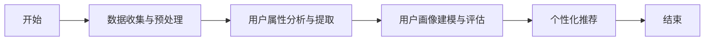

                 

# 数字detox度假村预订系统：便捷预约远离科技体验的在线平台

## 关键词

- 数字脱毒
- 度假村预订系统
- 个性化推荐算法
- 数据安全
- 心理健康

## 摘要

本文深入探讨了数字detox度假村预订系统的设计原理、功能需求及其技术实现。随着现代科技对人们生活影响的日益加深，数字依赖问题日益严重，对心理健康产生了负面影响。数字脱毒作为一种解决方案，正逐渐受到关注。本文首先介绍了数字脱毒的概念及其与心理健康的联系，然后详细阐述了数字detox度假村预订系统的功能需求和技术架构，包括用户画像、个性化推荐算法和数据安全隐私保护等方面。通过本文的探讨，旨在为读者提供一个清晰、全面的技术视角，理解数字脱毒度假村预订系统的工作原理及其在促进心理健康方面的潜在价值。

## 第一部分：背景介绍

### 1.1 问题背景

#### 1.1.1 科技对现代生活的深远影响

在现代社会，科技已经深深嵌入到人们的生活中，从智能手机到智能家居，从在线购物到社交媒体，科技正不断改变着我们的生活方式。然而，这种无处不在的科技同时也带来了一系列问题，最显著的便是数字依赖。研究表明，长期过度使用电子设备会导致心理压力增加，注意力难以集中，社交能力下降，甚至可能引发焦虑和抑郁等心理健康问题。

#### 1.1.2 数字依赖与心理健康的联系

数字依赖不仅仅是使用时间的问题，更是对个体心理健康产生深远影响的行为模式。越来越多的研究表明，过度使用社交媒体和电子设备会导致个体对现实世界的逃避，从而影响其社交技能和情感表达能力。此外，数字依赖还可能引发“数字疲劳”，导致个体在工作和生活中的效率下降。

#### 1.1.3 数字脱毒的概念与必要性

数字脱毒，即通过一定方式减少或中断对数字设备的使用，以改善个体的心理健康状况。数字脱毒并不是完全禁止使用数字设备，而是通过有意识地控制使用时间和内容，帮助个体重新建立与科技的健康关系。数字脱毒的必要性在于，它能够帮助个体减轻心理压力，提升专注力和工作效率，改善睡眠质量，从而促进整体心理健康。

### 1.2 问题描述

#### 1.2.1 现有数字脱毒解决方案的不足

目前，市场上的数字脱毒解决方案主要包括应用软件和自我管理方法。应用软件如“手机管控器”和“社交媒体限制器”等，能够帮助用户设定使用时间和内容限制，但往往缺乏个性化推荐功能，难以满足用户的多样化需求。自我管理方法如设定“无手机时段”和“科技节”等，虽然理论上有助于用户减轻数字依赖，但在实际操作中往往难以坚持。

#### 1.2.2 度假村预订系统在数字脱毒中的作用

度假村预订系统可以作为数字脱毒的一种新型解决方案。通过提供远离数字设备的自然环境和丰富多彩的户外活动，度假村预订系统能够帮助用户有效减少对数字设备的使用。此外，系统还可以通过个性化推荐功能，引导用户在度假期间进行有益的数字脱毒活动，从而更好地实现心理健康改善。

#### 1.2.3 系统的目标和设计原则

系统的目标在于为用户提供一个便捷、高效的数字脱毒平台，通过以下设计原则实现：

1. **用户友好性**：系统界面简洁直观，易于操作，确保用户能够快速上手。
2. **个性化推荐**：根据用户画像和偏好，提供个性化的度假活动和推荐，提升用户满意度。
3. **数据安全与隐私保护**：确保用户数据的安全性和隐私性，增强用户信任。
4. **系统稳定性**：保证系统的高可用性和可靠性，确保用户在预约和预订过程中无障碍体验。

### 1.3 问题解决

#### 1.3.1 数字脱毒度假村的独特吸引力

数字脱毒度假村以其远离喧嚣、宁静自然的环境和丰富的户外活动，成为用户逃离数字世界的理想去处。与传统度假村不同，数字脱毒度假村特别强调对数字设备的限制，提供无干扰的自然环境，帮助用户在心理上实现真正的放松和恢复。

#### 1.3.2 系统的功能需求分析

系统需要具备以下核心功能：

1. **用户注册与登录**：用户可以通过注册账号登录系统，进行个人信息管理和预约。
2. **个人信息管理**：用户可以管理个人基本信息、偏好和预约历史等。
3. **个性化推荐**：系统根据用户画像和偏好，推荐符合其需求的度假活动和套餐。
4. **预订与支付**：用户可以在线预订度假房间和活动，并完成支付。
5. **活动预约**：用户可以预约参与度假村提供的各类活动，如瑜伽、徒步、野营等。
6. **评论与反馈**：用户可以对自己参与的度假活动和住宿体验进行评价和反馈。
7. **数据安全与隐私保护**：系统需要提供数据加密、隐私保护等功能，确保用户信息安全。

#### 1.3.3 技术选型和系统架构设计

系统采用前后端分离的架构设计，前端采用Vue.js框架，实现响应式界面，提高用户体验。后端采用Spring Boot框架，实现业务逻辑和数据处理。数据库采用MySQL，存储用户信息、预订信息和活动信息。为了提高系统性能和可扩展性，系统还采用Redis进行缓存，Nginx进行负载均衡。在数据安全方面，系统采用HTTPS协议加密数据传输，并使用JWT（JSON Web Token）进行用户身份验证。

#### 1.4 边界与外延

##### 1.4.1 系统适用范围

系统适用于希望进行数字脱毒的用户，特别是长期依赖数字设备的人群。此外，系统还可以为度假村管理者提供管理平台，帮助其优化运营和提升服务质量。

##### 1.4.2 非适用场景

系统不适用于需要长时间使用数字设备的用户，如软件开发人员、设计师等。此外，对于不希望参与户外活动的用户，数字脱毒度假村可能不是一个合适的选择。

##### 1.4.3 相关概念的延伸与讨论

数字脱毒不仅仅是度假村的专利，还可以应用于其他场景，如健康中心、自然公园等。未来，随着技术的不断发展，数字脱毒方案将更加多样化，为用户提供更多选择。

### 1.5 概念结构与核心要素组成

##### 1.5.1 数字脱毒与度假村服务的关系

数字脱毒度假村通过提供远离数字设备的自然环境和服务，帮助用户实现心理健康改善。度假村服务包括住宿、餐饮、活动和护理等，与数字脱毒目标紧密结合。

##### 1.5.2 度假村预订系统的主要功能模块

度假村预订系统主要包括用户注册与登录模块、个人信息管理模块、个性化推荐模块、预订与支付模块、活动预约模块和评论与反馈模块。

##### 1.5.3 用户画像与个性化推荐机制

用户画像是指通过收集和分析用户的基本信息、行为数据和偏好，构建出用户的全貌。个性化推荐机制根据用户画像，为用户提供个性化的度假活动和推荐，提升用户体验。

### 1.6 本章小结

本文首先介绍了数字依赖对心理健康的影响以及数字脱毒的必要性。然后，详细阐述了数字脱毒度假村预订系统的功能需求和技术架构，包括用户友好性、个性化推荐、数据安全与隐私保护等方面。通过本文的探讨，读者可以了解数字脱毒度假村预订系统的工作原理及其在促进心理健康方面的潜在价值。

## 第二部分：核心概念与联系

### 2.1 数字脱毒的概念与原理

##### 2.1.1 数字脱毒的定义

数字脱毒，是指在意识到数字依赖对心理健康产生负面影响的基础上，通过减少或中断对数字设备的使用，以达到改善心理健康状态的目的。

##### 2.1.2 数字脱毒的原理

数字脱毒的原理主要包括两个方面：一是减少数字设备的使用时间，二是改变数字设备使用的环境和内容。通过减少使用时间，可以减轻因过度使用数字设备而导致的心理压力；通过改变环境和内容，可以提高使用数字设备的效率和愉悦感。

##### 2.1.3 数字脱毒与心理健康的关联

数字脱毒与心理健康之间存在密切关联。长期过度使用数字设备可能导致心理压力增加、注意力难以集中、社交能力下降等问题，而数字脱毒可以帮助缓解这些问题，从而改善心理健康。

### 2.2 度假村的属性与特点

##### 2.2.1 度假村的定义

度假村是指为游客提供住宿、餐饮、娱乐等服务设施，通常位于风景优美、环境宁静的地区。

##### 2.2.2 度假村的特点

度假村的特点包括：

1. **环境优美**：度假村通常位于风景优美的自然环境中，为游客提供远离城市喧嚣的宁静体验。
2. **服务全面**：度假村提供包括住宿、餐饮、娱乐、活动等在内的全方位服务，满足游客的各种需求。
3. **设施完善**：度假村拥有完善的设施，如游泳池、健身房、SPA中心等，为游客提供高质量的度假体验。

##### 2.2.3 度假村的分类

度假村可以按照不同的标准进行分类，如按地理位置分为海滨度假村、山景度假村等；按服务类型分为豪华度假村、经济型度假村等。

### 2.3 在线预订系统的概念

##### 2.3.1 在线预订系统的定义

在线预订系统是指通过互联网，为用户提供商品或服务的在线预约和支付平台。

##### 2.3.2 在线预订系统的功能

在线预订系统的主要功能包括：

1. **用户注册与登录**：用户可以通过注册账号登录系统，进行个人信息管理和预约。
2. **商品展示与搜索**：系统展示各种商品信息，用户可以通过关键词搜索找到所需商品。
3. **购物车与结算**：用户将商品添加到购物车，进行结算并完成支付。
4. **订单管理**：系统记录用户的订单信息，用户可以查看订单状态和物流信息。
5. **评论与反馈**：用户可以对购买的商品进行评价和反馈。

##### 2.3.3 在线预订系统的技术架构

在线预订系统的技术架构主要包括前端、后端和数据库三部分。前端负责用户界面的展示和交互，后端负责业务逻辑的处理和数据存储，数据库负责存储用户信息和订单数据。

### 2.4 数字脱毒度假村预订系统的核心概念

##### 2.4.1 用户画像

用户画像是指通过对用户的基本信息、行为数据和偏好进行分析，构建出用户的全貌。用户画像用于帮助系统更好地了解用户需求，提供个性化的推荐和服务。

##### 2.4.2 个性化推荐算法

个性化推荐算法是指根据用户画像和偏好，为用户推荐符合其需求的商品或服务。个性化推荐算法可以显著提升用户满意度，提高购物体验。

##### 2.4.3 数据安全与隐私保护

数据安全与隐私保护是指采取措施确保用户数据的安全性和隐私性。数据安全与隐私保护是建立用户信任的重要基础。

### 2.5 核心概念属性特征对比表格

| 核心概念     | 定义                                                         | 属性特征                                                   |
| ------------ | ------------------------------------------------------------ | ---------------------------------------------------------- |
| 数字脱毒     | 减少或中断对数字设备的使用，以改善心理健康状态                 | 减少使用时间、改变使用环境和内容                           |
| 度假村       | 提供住宿、餐饮、娱乐等服务设施的自然环境优美的地区             | 环境优美、服务全面、设施完善                               |
| 在线预订系统 | 通过互联网为用户提供商品或服务的在线预约和支付平台             | 用户注册与登录、商品展示与搜索、购物车与结算、订单管理等 |
| 用户画像     | 通过分析用户基本信息、行为数据和偏好，构建用户全貌             | 基本信息、行为数据、偏好分析                               |
| 个性化推荐   | 根据用户画像和偏好，为用户推荐符合需求的商品或服务             | 推荐准确性、用户满意度、个性化程度                           |
| 数据安全与隐私保护 | 确保用户数据的安全性和隐私性 | 加密传输、权限管理、隐私保护策略等                         |

### 2.6 ER实体关系图架构

```mermaid
erDiagram
    User ||--|{ Reservation } : makes
    User ||--|{ Profile } : holds
    VacationCamp ||--|{ Reservation } : occurs
    VacationCamp ||--|{ Activity } : has
    Activity ||--|{ Recommendation } : for
```

### 2.7 本章小结

本文详细介绍了数字脱毒、度假村和在线预订系统的核心概念和特点，并通过对比表格和ER实体关系图架构，展示了这些概念之间的关联和相互作用。这些核心概念的深入理解，为后续的算法原理讲解和系统实现提供了坚实的基础。

## 第三部分：算法原理讲解

### 3.1 个性化推荐算法原理

#### 3.1.1 推荐系统概述

推荐系统是一种信息过滤技术，旨在根据用户的历史行为、兴趣和偏好，向用户推荐其可能感兴趣的商品、服务或内容。推荐系统广泛应用于电子商务、社交媒体、视频流媒体等领域，极大地提升了用户满意度和参与度。

#### 3.1.2 协同过滤算法

协同过滤算法是推荐系统中最常用的算法之一，它通过分析用户之间的共同行为模式，预测用户对未知项目的评分或偏好。协同过滤算法主要分为以下两类：

##### 3.1.2.1 用户基于内容的推荐

用户基于内容的推荐（User-Based Content-Based Recommendation）通过分析用户之间的相似性，找到与目标用户相似的其他用户，然后推荐这些用户喜欢的项目。这种方法依赖于用户的行为数据，如购买历史、浏览记录等。

##### 3.1.2.2 项目基于内容的推荐

项目基于内容的推荐（Item-Based Content-Based Recommendation）通过分析项目之间的相似性，为用户推荐与其当前项目相似的其他项目。这种方法依赖于项目的特征数据，如商品描述、标签、类别等。

#### 3.1.3 协同过滤算法的优缺点

协同过滤算法的优点包括：

1. **个性化强**：能够根据用户的历史行为和偏好提供个性化的推荐。
2. **实时性好**：用户行为的更新可以即时反映在推荐结果中。

协同过滤算法的缺点包括：

1. **冷启动问题**：对于新用户或新项目，由于缺乏足够的历史数据，推荐效果较差。
2. **数据稀疏性**：大规模系统中用户和项目之间的交互数据非常稀疏，导致算法效果下降。

### 3.2 用户画像构建算法

#### 3.2.1 用户画像概述

用户画像是指通过对用户的基本信息、行为数据和偏好进行分析，构建出用户的全貌。用户画像能够帮助系统更好地了解用户需求，提供个性化的推荐和服务。

#### 3.2.2 用户画像构建流程

用户画像构建流程主要包括以下步骤：

1. **数据收集与预处理**：收集用户的基本信息、行为数据和偏好数据，并进行预处理，如数据清洗、格式统一等。
2. **用户属性分析与提取**：对用户的基本信息、行为数据和偏好进行深入分析，提取关键属性和特征。
3. **用户画像建模与评估**：根据提取的属性和特征，构建用户画像模型，并进行评估和优化。

#### 3.2.3 用户画像构建算法的细节

1. **数据收集与预处理**：数据收集主要包括用户的基本信息（如年龄、性别、职业等），行为数据（如购买历史、浏览记录等）和偏好数据（如兴趣标签、评分等）。预处理步骤包括数据去重、缺失值填充、数据规范化等。

2. **用户属性分析与提取**：用户属性分析主要包括用户的基本属性（如年龄、性别等）和行为属性（如购买频率、浏览时长等）。行为属性分析可以通过统计分析和机器学习算法（如聚类、回归等）进行。

3. **用户画像建模与评估**：用户画像建模可以通过特征工程和机器学习算法（如决策树、神经网络等）实现。建模后的用户画像需要通过评估指标（如准确率、召回率等）进行评估和优化。

### 3.3 算法mermaid流程图



### 3.4 算法原理详细讲解与举例说明

#### 3.4.1 协同过滤算法原理

协同过滤算法的核心思想是通过分析用户之间的相似性或项目之间的相似性，预测用户对未知项目的评分。其基本原理可以概括为以下公式：

$$
\text{预测评分} = \frac{\sum_{u' \in N(u)} r_{u',v} \cdot sim(u,u')}{\sum_{u' \in N(u)} sim(u,u')}
$$

其中，$r_{u',v}$ 表示用户 $u'$ 对项目 $v$ 的评分，$sim(u,u')$ 表示用户 $u$ 和用户 $u'$ 之间的相似度。

##### 3.4.1.1 相似度计算方法

相似度计算是协同过滤算法的核心，常用的相似度计算方法包括：

1. **余弦相似度**：

$$
sim(u,u') = \frac{\sum_{v \in I} r_{u,v} \cdot r_{u',v}}{\sqrt{\sum_{v \in I} r_{u,v}^2} \cdot \sqrt{\sum_{v \in I} r_{u',v}^2}}
$$

其中，$I$ 表示用户 $u$ 和用户 $u'$ 都评分过的项目集合。

2. **皮尔逊相关系数**：

$$
sim(u,u') = \frac{cov(u,u')}{\sigma_u \cdot \sigma_{u'}}
$$

其中，$cov(u,u')$ 表示用户 $u$ 和用户 $u'$ 评分的协方差，$\sigma_u$ 和 $\sigma_{u'}$ 分别表示用户 $u$ 和用户 $u'$ 评分的标准差。

##### 3.4.1.2 用户基于内容的推荐

用户基于内容的推荐通过分析项目之间的相似性，为用户推荐与其历史行为相似的项目。具体实现方法如下：

1. **计算项目相似度**：使用余弦相似度或皮尔逊相关系数计算项目之间的相似度。

2. **推荐项目**：为用户推荐与用户已购买或浏览过的项目相似的其他项目。推荐项目的相似度越高，推荐的概率越大。

##### 3.4.1.3 项目基于内容的推荐

项目基于内容的推荐通过分析用户之间的相似性，为用户推荐与用户相似的其他用户喜欢的项目。具体实现方法如下：

1. **计算用户相似度**：使用余弦相似度或皮尔逊相关系数计算用户之间的相似度。

2. **推荐项目**：为用户推荐与其相似的用户喜欢的项目。推荐项目的评分越高，推荐的概率越大。

#### 3.4.2 用户画像构建原理

用户画像构建是指通过对用户的基本信息、行为数据和偏好进行分析，构建出用户的全貌。用户画像的基本结构如下：

$$
\text{用户画像} = \{ \text{基本信息}, \text{行为特征}, \text{兴趣偏好} \}
$$

其中，基本信息包括用户的年龄、性别、职业等；行为特征包括用户的购买历史、浏览记录等；兴趣偏好包括用户的兴趣标签、评分等。

用户画像的构建过程主要包括以下步骤：

1. **数据收集与预处理**：收集用户的基本信息、行为数据和偏好数据，并进行预处理，如数据清洗、格式统一等。

2. **特征提取**：对用户的基本信息、行为数据和偏好数据进行特征提取，如用户年龄、购买频率、浏览时长等。

3. **特征选择**：选择对用户画像构建有重要影响的特征，去除冗余特征。

4. **特征融合**：将提取的特征进行融合，形成用户画像。

5. **画像建模与评估**：使用机器学习算法（如决策树、神经网络等）对用户画像进行建模，并进行评估和优化。

#### 3.4.3 协同过滤算法与用户画像构建的整合

协同过滤算法和用户画像构建可以整合，以提高推荐系统的效果。具体实现方法如下：

1. **用户画像嵌入协同过滤算法**：在协同过滤算法中，将用户画像嵌入预测模型，以增强模型的预测能力。例如，在基于模型的协同过滤算法中，可以加入用户画像特征作为模型的输入。

2. **基于用户画像的协同过滤**：在协同过滤算法中，使用用户画像来调整用户和项目之间的相似度计算。例如，对于新用户或新项目，可以结合用户画像来估计其评分。

通过整合协同过滤算法和用户画像构建，推荐系统可以更好地应对冷启动问题，提高推荐效果。

### 3.5 本章小结

本文详细介绍了个性化推荐算法和用户画像构建算法的原理和实现方法。个性化推荐算法通过分析用户和项目之间的相似性，为用户推荐其可能感兴趣的内容。用户画像构建则通过对用户的基本信息、行为数据和偏好进行分析，构建出用户的全貌。通过整合协同过滤算法和用户画像构建，推荐系统可以更好地满足用户需求，提高用户体验。在后续章节中，将介绍数字detox度假村预订系统的具体实现和实战案例。

