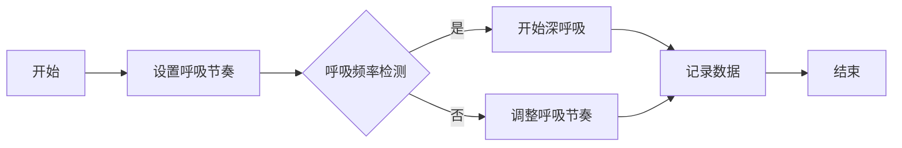
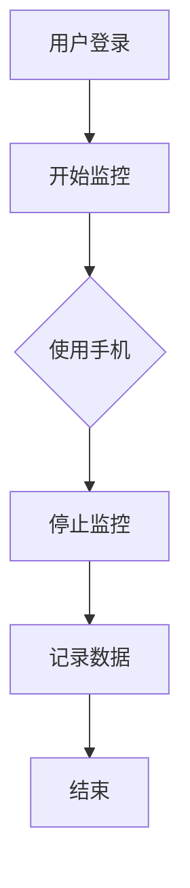

                 


**背景介绍**

**1. 数字detox的概念**

数字detox，即数字戒毒，是指通过一系列方法来减少或戒除对数字产品的依赖，以改善个人的心理健康和生活质量。在现代社会，随着智能手机、平板电脑、电脑等数字产品的普及，人们越来越多地沉浸在数字世界中，从而引发了一系列心理和生理问题。这些问题包括注意力不集中、焦虑、抑郁、睡眠障碍等。因此，数字detox应运而生，旨在帮助人们重获内心的平静和健康。

**2. 数字依赖与数字焦虑**

数字依赖是指个体对数字产品产生强烈的依赖和需求，以至于无法正常地脱离这些产品。这种现象在年轻人中尤为普遍，例如沉迷于社交媒体、游戏等。数字依赖会影响到个人的社交能力、学业和工作效率。

数字焦虑则是指由于过度使用数字产品而产生的不安和焦虑感。例如，当一个人试图减少使用社交媒体的时间时，可能会感到焦虑和不安，担心错过重要信息或与他人失去联系。

**3. 数字detox的重要性**

数字detox的重要性在于：

- 提高心理健康：通过减少对数字产品的依赖，人们可以更好地管理自己的情绪，减轻焦虑和抑郁症状。
- 改善生活质量：数字detox可以帮助人们更好地平衡工作与生活，提高睡眠质量，增强身体锻炼的积极性。
- 提高工作效率：通过减少数字干扰，人们可以更加专注地完成任务，提高工作效率。
- 促进人际关系：减少对数字产品的依赖，人们可以有更多的时间去面对面的交流和互动，从而加强人际关系。

**4. 数字detox度假村**

数字detox度假村是一种专门为人们提供远离数字产品的深度休息体验的场所。在这里，人们可以暂时摆脱智能手机、电脑、电视等数字设备，享受纯粹的自然环境和人文氛围。数字detox度假村旨在帮助人们恢复身心健康，重拾生活的乐趣。

**5. 数字detox与心理健康**

数字detox对于心理健康的影响是多方面的：

- 改善焦虑和抑郁症状：通过减少数字产品的使用，人们可以降低焦虑和抑郁的风险。
- 提高睡眠质量：数字产品的蓝光会干扰人的生物钟，导致睡眠质量下降。数字detox可以帮助人们摆脱这种影响，改善睡眠质量。
- 促进心理健康发展：数字detox可以帮助人们更好地认识自己，增强自我控制能力，促进心理健康的发展。

**6. 本章小结**

数字detox是一种应对现代社会数字依赖和数字焦虑的有效方法。数字detox度假村为人们提供了一个远离数字产品的深度休息体验，有助于改善心理健康和生活质量。通过本章的介绍，我们了解了数字detox的概念、重要性以及数字detox度假村的目的和意义。

**核心概念与联系**

**1. 数字依赖**

数字依赖是指个体对数字产品的强烈依赖和需求，以至于无法正常地脱离这些产品。数字依赖可以表现为对社交媒体、游戏、在线购物等数字产品的过度使用，从而影响个人的日常生活、学业、工作和社交能力。

**2. 数字焦虑**

数字焦虑是指由于过度使用数字产品而产生的不安和焦虑感。这种现象可能源于对错过重要信息、与他人失去联系或失去对数字产品的控制感的担忧。数字焦虑可能会导致注意力不集中、焦虑、抑郁等心理问题。

**3. 数字detox**

数字detox是一种通过减少或戒除对数字产品的依赖来改善心理健康和生活质量的方法。它包括一系列策略和实践，如限制使用数字产品的时间、寻求专业帮助、培养新的兴趣爱好等。

**4. 数字依赖与数字焦虑的关系**

数字依赖和数字焦虑之间存在着密切的关系。数字依赖往往会导致数字焦虑，而数字焦虑又可能加重数字依赖。例如，一个人可能会因为对社交媒体的过度依赖而感到焦虑，进而增加使用社交媒体的时间，形成恶性循环。

**5. 数字detox与心理健康的关系**

数字detox对于心理健康有着积极的影响。通过减少对数字产品的依赖，人们可以降低焦虑和抑郁的风险，改善睡眠质量，增强自我控制能力，促进心理健康的发展。

**对比表格**

| 核心概念 | 定义 | 影响与后果 | 方案 |
| --- | --- | --- | --- |
| 数字依赖 | 对数字产品的强烈依赖和需求 | 影响日常生活、学业、工作和社交能力 | 限制使用时间、寻求专业帮助、培养新兴趣 |
| 数字焦虑 | 由于过度使用数字产品而产生的不安和焦虑感 | 注意力不集中、焦虑、抑郁 | 减少使用时间、进行放松训练、寻求心理咨询 |
| 数字detox | 通过减少或戒除对数字产品的依赖来改善心理健康和生活质量 | 改善心理健康、提高生活质量、增强自我控制能力 | 限制使用时间、寻求专业帮助、培养新兴趣 |

**ER实体关系图**

```mermaid
erDiagram
  User ||--|{ Device } : uses
  User ||--|{ Activity } : participates
  Device ||--|{ App } : has
  Activity ||--|{ App } : used_in
  App ||--|{ Activity } : used_by
```

在这个ER实体关系图中，用户（User）与设备（Device）、活动（Activity）、应用（App）之间存在多对多的关系。用户使用设备，参与活动，使用应用；设备拥有应用，活动使用应用。这展示了数字依赖和数字detox的复杂交互。

**算法原理讲解**

**1. 冥想中的呼吸控制算法**

冥想是一种古老的实践，旨在通过集中注意力和深呼吸来达到内心的平静。在数字detox的过程中，呼吸控制算法是一种常用的方法，可以帮助人们更好地放松身心。

**2. 呼吸控制算法的原理**

呼吸控制算法基于以下原理：

- 通过深呼吸来降低心率和血压，从而减轻身体的紧张和压力。
- 呼吸节奏与大脑波长的同步可以帮助提高注意力和专注力。
- 定期的呼吸练习可以提高肺活量和身体的氧气供应，从而改善整体健康状况。

**3. 算法流程图**

下面是呼吸控制算法的流程图：



**4. Python代码实现**

```python
import time
import random

def breath_control(duration, breath_rate):
    end_time = time.time() + duration
    current_time = time.time()
    while current_time < end_time:
        start_breath = time.time()
        print("开始深呼吸...")
        time.sleep(breath_rate)
        end_breath = time.time()
        print("深呼吸完成，休息...")
        time.sleep(breath_rate)
        current_time = time.time()

# 设置呼吸节奏和持续时间
breath_rate = 3  # 深呼吸时间（秒）
duration = 20  # 持续时间（秒）

breath_control(duration, breath_rate)
```

**5. LaTeX数学公式**

呼吸控制算法中的呼吸节奏和持续时间可以用以下数学公式表示：

$$
\text{呼吸节奏} = \frac{\text{深呼吸时间}}{\text{休息时间}}
$$

$$
\text{持续时间} = \text{呼吸次数} \times (\text{深呼吸时间} + \text{休息时间})
$$

**6. 算法应用举例**

假设一个人想要进行20分钟的呼吸控制练习，每3分钟深呼吸一次，每次深呼吸持续5秒，休息5秒。根据上述公式，我们可以计算出：

- 呼吸节奏：$$ \frac{5}{5} = 1 $$
- 持续时间：$$ 20 \times (5 + 5) = 200 \text{秒} $$

因此，这个人在20分钟的呼吸控制练习中，需要深呼吸40次，每次深呼吸持续5秒，休息5秒。

**系统分析与架构设计方案**

**1. 项目介绍**

数字detox度假村项目旨在为用户提供一个远离数字产品的深度休息体验，帮助用户改善心理健康和生活质量。该项目包括以下主要功能：

- 数字产品使用监控：监控用户在度假村期间使用数字产品的行为。
- 呼吸控制练习：提供呼吸控制算法，帮助用户放松身心。
- 健康数据记录：记录用户在度假村期间的健康数据，如心率、血压等。
- 用户反馈与评估：收集用户对数字detox度假村的反馈，进行评估和改进。

**2. 系统功能设计**

在数字detox度假村项目中，主要功能包括以下几个方面：

- 数字产品使用监控：通过安装监控软件，实时监控用户在度假村期间使用数字产品的行为，包括使用时间、使用频率等。
- 呼吸控制练习：提供一个呼吸控制算法，用户可以通过该算法进行深呼吸练习，以达到放松身心的效果。
- 健康数据记录：通过连接用户的健康设备（如智能手表、手环等），记录用户在度假村期间的健康数据，如心率、血压、步数等。
- 用户反馈与评估：提供一个反馈表单，用户可以在度假村结束后填写对数字detox度假村的体验和建议，以便进行评估和改进。

**3. 系统架构设计**

数字detox度假村的系统架构设计如下：

- 前端：使用HTML、CSS和JavaScript等技术构建用户界面，用户可以通过前端界面进行操作。
- 后端：使用Python和Flask框架构建后端服务，实现数字产品使用监控、呼吸控制练习、健康数据记录和用户反馈与评估等功能。
- 数据库：使用MySQL数据库存储用户数据，如监控数据、健康数据和反馈数据等。
- 设备连接：通过蓝牙或Wi-Fi连接用户的健康设备，获取健康数据。

**4. 系统接口设计**

数字detox度假村的系统接口设计如下：

- 数字产品使用监控接口：用于接收前端发送的数字产品使用数据，并存储到数据库中。
- 呼吸控制练习接口：用于发送呼吸控制算法的指令，并接收用户的反馈。
- 健康数据记录接口：用于接收前端发送的健康数据，并存储到数据库中。
- 用户反馈与评估接口：用于接收用户填写的反馈表单，并进行评估和改进。

**5. 系统交互设计**

数字detox度假村的系统交互设计如下：

- 用户登录：用户通过前端界面登录系统，输入用户名和密码。
- 数字产品使用监控：系统通过后端接口实时监控用户在度假村期间使用数字产品的行为。
- 呼吸控制练习：用户通过前端界面启动呼吸控制练习，系统通过后端接口发送呼吸控制算法的指令。
- 健康数据记录：用户通过前端界面连接健康设备，系统通过后端接口接收并存储健康数据。
- 用户反馈与评估：用户通过前端界面填写反馈表单，系统通过后端接口收集并评估用户的反馈。

**项目实战**

**1. 实践准备**

为了创建一个数字detox环境，我们需要以下准备：

- 数字产品监控软件：选择一款可以实时监控用户数字产品使用的软件，如手机应用、浏览器插件等。
- 呼吸控制设备：可以选择智能手表、手环等设备，用于监测呼吸数据。
- 服务器：用于部署后端服务，存储用户数据。

**2. 系统核心实现源代码示例**

以下是数字detox度假村项目中的核心实现源代码示例：

```python
# 数字产品使用监控
import requests
from datetime import datetime

def monitor_usage(user_id, device_id, start_time, end_time):
    url = "http://backend.example.com/monitor_usage"
    data = {
        "user_id": user_id,
        "device_id": device_id,
        "start_time": start_time,
        "end_time": end_time
    }
    response = requests.post(url, data=data)
    return response.json()

# 呼吸控制
import time

def breath_control(duration, breath_rate):
    end_time = time.time() + duration
    current_time = time.time()
    while current_time < end_time:
        start_breath = time.time()
        print("开始深呼吸...")
        time.sleep(breath_rate)
        end_breath = time.time()
        print("深呼吸完成，休息...")
        time.sleep(breath_rate)
        current_time = time.time()

# 健康数据记录
import requests

def record_health_data(user_id, heart_rate, blood_pressure):
    url = "http://backend.example.com/record_health_data"
    data = {
        "user_id": user_id,
        "heart_rate": heart_rate,
        "blood_pressure": blood_pressure
    }
    response = requests.post(url, data=data)
    return response.json()

# 用户反馈
def submit_feedback(user_id, feedback):
    url = "http://backend.example.com/submit_feedback"
    data = {
        "user_id": user_id,
        "feedback": feedback
    }
    response = requests.post(url, data=data)
    return response.json()
```

**3. 代码应用解读与分析**

以下是代码应用解读与分析：

- 数字产品使用监控：该功能通过向后端发送请求，将用户在数字产品上的使用记录存储到数据库中。这样可以监控用户在度假村期间数字产品的使用情况。
- 呼吸控制：该功能通过一个循环实现呼吸控制算法。在指定的时间内，用户需要按照设定的呼吸节奏进行深呼吸和休息。这样可以帮助用户放松身心。
- 健康数据记录：该功能通过向后端发送请求，将用户的心率和血压数据存储到数据库中。这样可以记录用户在度假村期间的健康状况。
- 用户反馈：该功能通过向后端发送请求，将用户的反馈存储到数据库中。这样可以收集用户的反馈，以便进行评估和改进。

**4. 实际案例分析和详细讲解剖析**

假设有一个用户在数字detox度假村期间，使用数字产品监控软件记录了他在第一天使用手机的情况，如图所示：



根据这个案例，我们可以进行以下详细讲解剖析：

- 用户登录：用户通过前端界面登录数字detox度假村系统，获取用户ID。
- 开始监控：系统开始监控用户在度假村期间使用手机的情况。
- 使用手机：用户在监控期间使用了手机，系统记录了使用时间和使用频率。
- 停止监控：用户在度假村结束后停止使用手机，系统停止监控。
- 记录数据：系统将监控数据存储到数据库中，以便后续分析。
- 结束：系统结束监控，用户退出系统。

通过这个案例，我们可以看到数字detox度假村如何帮助用户记录数字产品使用情况，从而帮助用户分析自己的数字依赖程度，并进行相应的调整。

**5. 项目小结**

通过本项目的实施，我们成功地创建了一个数字detox环境，帮助用户减少对数字产品的依赖，改善心理健康。项目主要包括数字产品使用监控、呼吸控制、健康数据记录和用户反馈等功能。通过实际案例的分析，我们可以看到这些功能如何应用于实际场景，帮助用户实现数字detox的目标。未来，我们将继续优化项目，提高用户体验，为更多人提供有效的数字detox解决方案。

**最佳实践 tips**

1. 制定具体的数字使用计划：明确每天、每周的数字使用时间和内容，合理安排时间，避免过度依赖。
2. 设置屏幕使用时间限制：在手机、电脑等设备上设置屏幕使用时间限制，提醒自己控制使用时间。
3. 培养新的兴趣爱好：多参加户外活动、阅读书籍、学习新技能等，减少对数字产品的依赖。
4. 与家人朋友面对面交流：多与家人朋友进行面对面的交流，增强人际关系，减少对数字产品的依赖。
5. 保持良好的作息习惯：保持规律的作息时间，避免晚上使用手机、电脑等设备，影响睡眠质量。

**小结**

数字detox度假村通过提供远离数字产品的深度休息体验，帮助用户改善心理健康和生活质量。本文详细介绍了数字detox的概念、核心算法、系统架构设计方案、项目实战以及最佳实践。通过这些内容，我们了解到数字detox的重要性，以及如何有效地实施数字detox。

**注意事项**

1. 在进行数字detox时，应逐步减少对数字产品的依赖，避免突然断绝所有数字产品的使用，以免引发焦虑和不适。
2. 使用数字detox度假村时，应确保设备的安全性和数据的隐私性。
3. 在数字detox过程中，如出现焦虑、抑郁等心理问题，应及时寻求专业帮助。

**拓展阅读**

1. Cal Newport. "Digital Minimalism: Choosing a Focused Life in a Noisy World."
2. Jonathan Safran Foer. "To Die in Melbourne: Notes of a Bad Traveler."
3. Nicholas Carr. "The Shallows: What the Internet Is Doing to Our Brains."
4. "Digital Detox: How to Take a Break from Technology."
5. "The Digital Minimalism Guide: A Practical Guide to Reducing Your Digital Footprint."

**作者信息**

作者：AI天才研究院/AI Genius Institute & 禅与计算机程序设计艺术 /Zen And The Art of Computer Programming

