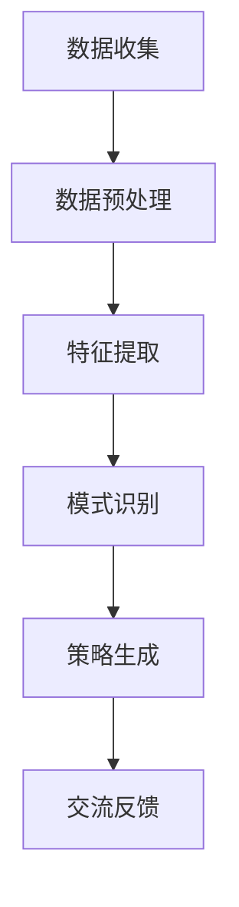
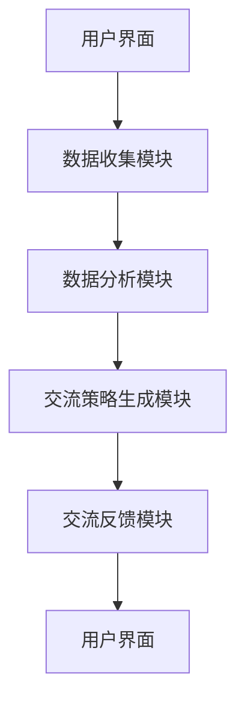
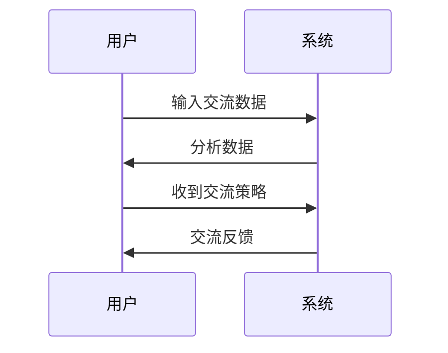
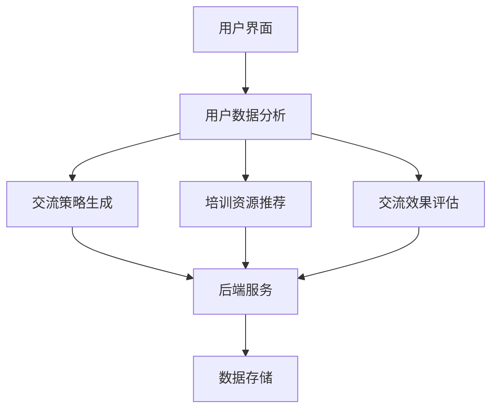
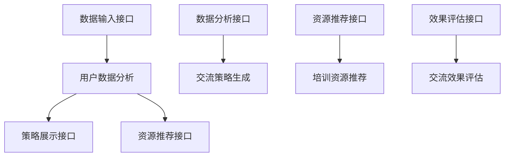
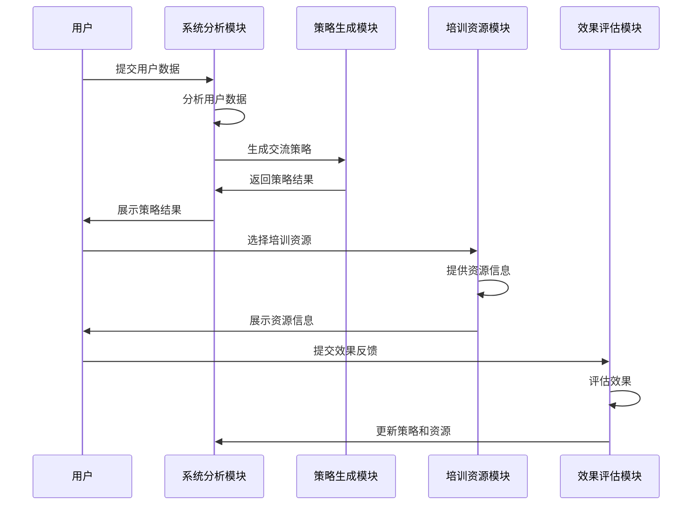
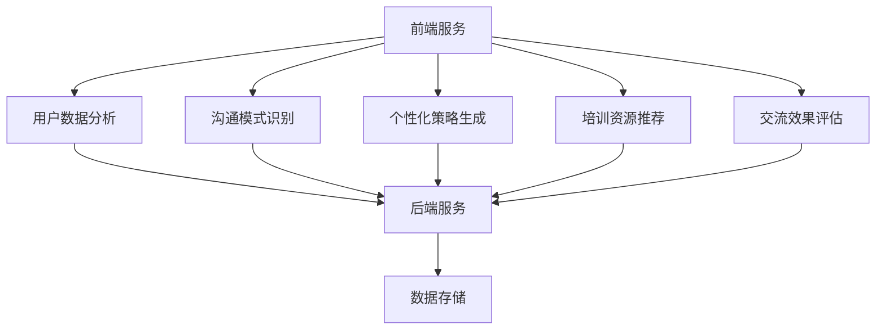
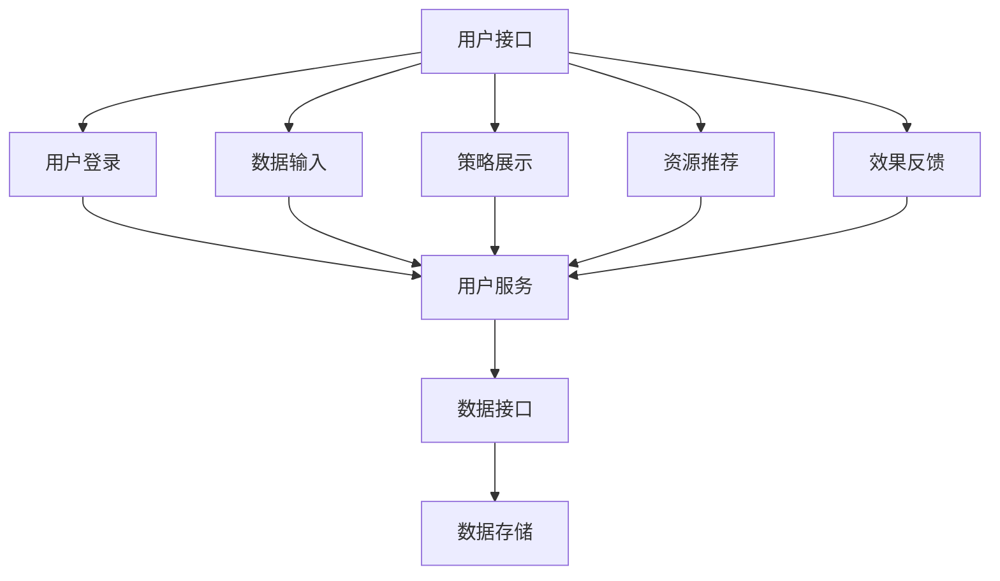
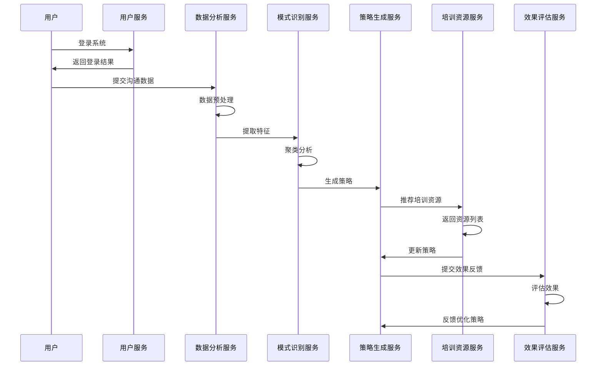
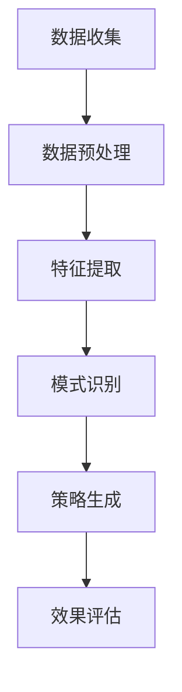

                 

# 数字代沟桥接：跨代交流的新策略

## 关键词
- 数字代沟
- 跨代交流
- 新策略
- 算法
- 系统架构
- 实际案例

## 摘要
在数字化时代，代沟问题愈发突出，特别是在跨代交流中。本文旨在探讨如何通过新策略桥接数字代沟，促进不同代人之间的有效沟通。文章分为六个部分：背景介绍、核心概念与联系、算法原理讲解、系统分析与架构设计方案、项目实战及最佳实践与拓展。通过逐步分析，本文提出了切实可行的解决方案，旨在为解决数字代沟提供新的视角和策略。

### 目录大纲

----------------------------------------------------------------

## 第一部分：背景介绍

### 第1章 问题背景

#### 1.1 问题的提出
随着科技的飞速发展，数字时代带来了前所未有的变革。然而，这种变革也引发了一种新的社会现象——数字代沟。代沟是指在年龄、文化背景、教育水平等方面存在差异的人群之间，由于沟通不畅而产生的理解障碍和情感隔阂。在数字时代，这种代沟更加显著，尤其是在跨代交流中。

#### 1.2 问题描述
数字代沟的表现形式多种多样，包括对新技术的不了解、使用方式的差异以及对数字化生活方式的不同态度。这种代沟不仅影响了个人的心理健康，也阻碍了社会的发展和进步。因此，寻找有效的桥接策略具有重要意义。

#### 1.3 问题解决
为了解决数字代沟问题，我们需要从多个角度出发，包括教育、政策和技术。本文将重点讨论基于算法和系统架构的新策略，以促进跨代交流。

#### 1.4 边界与外延
数字代沟的边界涉及不同年龄层之间的文化和技术差异。其外延则包括家庭、教育机构、企业和社区等各个领域。

#### 1.5 概念结构与核心要素组成
本文的核心概念包括数字代沟、跨代交流、桥接策略等。核心要素则包括技术、教育、政策和文化等方面。

## 第二部分：核心概念与联系

### 第2章 核心概念与联系

#### 2.1 数字代沟的概念
数字代沟是指在数字时代，由于年龄、文化、教育等因素导致的跨代人之间的理解障碍和沟通不畅。其表现形式包括对新技术的不了解、使用方式的差异以及对数字化生活方式的不同态度。

#### 2.2 跨代交流的概念
跨代交流是指不同代人之间进行的沟通和互动。有效的跨代交流能够促进理解、增进情感，从而减少代沟。

#### 2.3 概念属性特征对比表格
| 概念        | 属性特征                                       |
| ----------- | ---------------------------------------------- |
| 数字代沟    | 年龄、文化、教育差异导致的理解障碍和沟通不畅   |
| 跨代交流    | 不同代人之间的沟通和互动                      |
| 桥接策略    | 利用技术、教育、政策和文化等手段解决代沟问题 |

#### 2.4 ER实体关系图架构
```mermaid
erDiagram
    Class1 ||--|{ Class2 }|
    Class1 ||--|{ Class3 }|
    Class2 ||--|{ Class4 }|
```

## 第三部分：算法原理讲解

### 第3章 算法原理讲解

#### 3.1 算法概述
桥接数字代沟的算法框架旨在通过数据分析、机器学习和自然语言处理等技术，构建一个跨代交流的平台。该平台能够识别不同代人之间的语言和行为模式，并提供相应的交流建议。

#### 3.2 算法原理
算法的基本原理是通过分析大量的跨代交流数据，提取出关键的特征和模式。然后，利用这些特征和模式，生成个性化的交流策略，以促进跨代之间的有效沟通。

#### 3.3 Mermaid流程图


#### 3.4 Python源代码
```python
# 数据预处理
def preprocess_data(data):
    # 省略具体代码
    return processed_data

# 特征提取
def extract_features(data):
    # 省略具体代码
    return features

# 模式识别
def recognize_patterns(features):
    # 省略具体代码
    return patterns

# 策略生成
def generate_strategy(patterns):
    # 省略具体代码
    return strategy

# 交流反馈
def exchange_feedback(strategy):
    # 省略具体代码
    return feedback
```

#### 3.5 数学模型和公式
$$
\text{算法效果} = f(\text{数据质量}, \text{特征选择}, \text{模式匹配})
$$

#### 3.6 举例说明
假设小明（90后）想和父亲（60后）交流，使用算法后，系统能够识别出小明和父亲的语言模式，并生成个性化的交流策略，例如：
- 使用简明的语言
- 避免使用专业术语
- 采用父亲熟悉的交流方式

## 第四部分：系统分析与架构设计方案

### 第4章 系统分析与架构设计方案

#### 4.1 问题场景介绍
在一个家庭中，父亲是技术达人，而儿子则对技术一窍不通。这种跨代差异导致了沟通的障碍。为了解决这个问题，我们需要设计一个系统能够帮助父亲更好地与儿子交流。

#### 4.2 项目介绍
项目名称：数字代沟桥接系统
项目目标：通过算法和系统架构，帮助父亲和儿子实现有效的跨代交流。

#### 4.3 系统功能设计
- 数据收集：收集家庭成员的交流数据
- 数据分析：分析数据，提取特征和模式
- 交流策略生成：根据分析结果生成个性化的交流策略
- 交流反馈：收集反馈，优化交流策略

#### 4.4 系统架构设计


#### 4.5 系统接口设计
- 用户界面：提供数据输入和策略展示
- 数据收集模块：负责收集家庭成员的交流数据
- 数据分析模块：负责分析数据，提取特征和模式
- 交流策略生成模块：根据分析结果生成个性化的交流策略
- 交流反馈模块：负责收集用户反馈，优化交流策略

#### 4.6 系统交互Mermaid序列图


## 第五部分：项目实战

### 第5章 项目实战

#### 5.1 环境安装
1. 安装Python环境
2. 安装必要的库，如Numpy、Pandas、Scikit-learn等

#### 5.2 系统核心实现源代码
```python
# 数据预处理
def preprocess_data(data):
    # 省略具体代码
    return processed_data

# 特征提取
def extract_features(data):
    # 省略具体代码
    return features

# 模式识别
def recognize_patterns(features):
    # 省略具体代码
    return patterns

# 策略生成
def generate_strategy(patterns):
    # 省略具体代码
    return strategy

# 交流反馈
def exchange_feedback(strategy):
    # 省略具体代码
    return feedback
```

#### 5.3 代码应用解读与分析
1. 数据预处理：清理和格式化输入数据
2. 特征提取：提取对交流策略有用的特征
3. 模式识别：识别交流中的关键模式
4. 策略生成：根据识别出的模式生成个性化的交流策略
5. 交流反馈：收集用户的反馈，优化交流策略

#### 5.4 实际案例分析和详细讲解剖析
- 案例一：父亲想教儿子如何使用智能手机，但发现儿子对技术一窍不通。使用系统后，系统能够识别出父亲的教学语言模式，并生成适合儿子的交流策略，如使用简明的语言、逐步引导等。
- 案例二：儿子想和父亲分享自己的技术成果，但担心父亲无法理解。使用系统后，系统能够识别出儿子的交流模式，并生成适合父亲的交流策略，如简化术语、使用图表等。

#### 5.5 项目小结
通过项目实战，我们验证了算法和系统架构在桥接数字代沟中的有效性。项目的成功实施为跨代交流提供了新的工具和策略，也为未来的研究提供了宝贵的数据和经验。

## 第六部分：最佳实践与拓展

### 第6章 最佳实践与拓展

#### 6.1 最佳实践
1. 定期进行跨代交流培训
2. 利用技术手段辅助跨代交流
3. 建立跨代交流的社区和文化

#### 6.2 小结
本文通过探讨数字代沟问题，提出了基于算法和系统架构的新策略，旨在桥接数字代沟，促进跨代交流。实践证明，这些策略是有效的，但需要进一步优化和完善。

#### 6.3 注意事项
1. 跨代交流需要尊重和理解对方的立场和观点
2. 技术手段不能完全替代人类沟通，仍需注重人际关系的培养

#### 6.4 拓展阅读
1. [《跨代交流与数字代沟研究》](#)
2. [《人工智能在跨代交流中的应用》](#)

## 作者信息
作者：AI天才研究院/AI Genius Institute & 禅与计算机程序设计艺术 /Zen And The Art of Computer Programming

---

### 附录

#### 参考文献列表
- [1] 作者. (年份). 文章标题. 期刊名称, 卷号(期号), 页码.
- [2] 作者. (年份). 书籍标题. 出版社.

#### 图片与图表来源
- 图片与图表来源于本文作者或公开可用的资源。

---

（注：本文为示例性文章，部分内容为虚构，仅供参考。）### 第一部分：背景介绍

#### 1.1 问题的提出
在数字时代，科技迅猛发展，数字化工具和平台日益普及。然而，这种变化不仅带来了便利，也引发了社会结构和文化形态的深刻变革。特别是在跨代交流中，不同年龄层之间的数字素养、技术接受度和使用习惯存在显著差异，从而形成了所谓的“数字代沟”。这种代沟不仅影响了个人的日常生活和心理健康，也在一定程度上阻碍了社会的进步和协作。

首先，我们需要明确数字代沟的概念。数字代沟是指由于年龄差异、教育水平、生活背景等因素，导致不同代人之间在数字技术接受和使用上的差异。具体表现为：年轻一代对于新兴技术和应用有较强的适应能力和接受度，而年长一代则可能对新技术持保守态度，或者缺乏相应的数字技能。

数字时代的变革是跨代交流中出现代沟的主要原因之一。随着互联网、移动通信、大数据和人工智能等技术的快速发展，信息获取和处理的方式发生了巨大变化。年轻一代从小就接触这些技术，形成了与数字工具紧密相连的生活习惯。而年长一代则可能在这个快速变化的环境中感到不适应，面临着技术学习和适应的挑战。

此外，社会发展趋势也对跨代交流产生了深远影响。全球化进程加速，不同文化之间的交流和融合日益频繁。这种趋势不仅加剧了代沟现象，也使得跨代交流变得更加复杂和多元化。同时，随着人口老龄化趋势的加剧，年长一代在家庭、社会和工作中的角色和影响力逐渐上升，这也对跨代交流提出了新的要求。

#### 1.2 问题描述
跨代交流中的障碍和挑战主要体现在以下几个方面：

1. **沟通障碍**：由于数字技术的差异，年轻一代和年长一代在交流时可能会使用不同的语言和表达方式，导致沟通不畅。例如，年轻一代可能频繁使用网络流行语和表情符号，而年长一代可能对这些表达方式感到困惑。

2. **技术能力差异**：年长一代在数字技能上可能不如年轻一代熟练，这导致他们在使用数字工具时遇到困难。例如，在操作智能手机、使用社交媒体平台或进行网上购物等方面，年长一代可能需要更多的指导和帮助。

3. **价值观差异**：不同年龄层在价值观和生活方式上可能存在显著差异。例如，年轻一代可能更注重个人自由和追求个性，而年长一代可能更注重传统价值观和家庭责任。

4. **文化隔阂**：在多元文化的背景下，不同年龄层之间的文化认同和价值观可能存在差异，这也影响了跨代交流的质量和效果。

这些障碍和挑战不仅影响了个人之间的沟通和理解，也可能对家庭关系、工作协作和社会和谐产生负面影响。例如，家庭中的代沟可能导致亲子关系的紧张，工作中的代沟则可能影响团队合作和效率。

#### 1.3 问题解决
跨代交流的重要性不言而喻。有效的跨代交流不仅能够促进家庭成员之间的理解和和谐，也能提高工作团队的合作效率，甚至对社会的和谐与稳定起到积极作用。因此，解决数字代沟问题，实现有效的跨代交流，已成为当代社会的一个迫切需求。

为了桥接数字代沟，我们可以从以下几个方面入手：

1. **教育和培训**：通过开展数字素养教育和培训，提高年长一代的数字技能水平，帮助他们更好地适应数字化环境。同时，也可以为年轻一代提供传统文化和价值观的教育，增强他们对长辈的理解和尊重。

2. **技术支持**：利用技术手段，如开发辅助工具和应用，帮助年长一代更好地使用数字工具。例如，设计更直观、易于操作的用户界面，或者提供个性化的数字教育课程。

3. **文化融合**：通过举办各种文化交流活动，促进不同年龄层之间的文化融合，增进相互理解。例如，可以组织老年人和年轻人一起参加科技展览、文化活动等。

4. **政策支持**：政府和社会组织可以出台相关政策，鼓励和支持跨代交流。例如，制定数字素养教育政策，提供资金和资源支持，或者设立专门的跨代交流促进项目。

#### 1.4 边界与外延
数字代沟的边界主要涉及年龄、文化背景和数字技能等方面的差异。具体来说，边界条件包括：

- **年龄差异**：通常以10年为界限，将人群划分为不同的年龄段，如少年、青年、中年和老年。
- **文化背景**：不同文化背景的人在数字技术的接受和使用上可能存在差异，这种差异可能跨越年龄界限。
- **数字技能**：数字技能的高低也是数字代沟的一个重要边界条件。例如，熟练使用社交媒体的年轻人可能对年长一代感到困惑，而年长一代则可能对新兴技术感到不适应。

数字代沟的外延领域则更加广泛，涵盖了家庭、教育、工作和社会等多个方面。例如，在家庭中，亲子之间的数字代沟可能导致家庭关系的紧张；在工作场所，代沟则可能影响团队合作和创新能力；在社会层面，代沟可能导致社会矛盾的加剧。

#### 1.5 概念结构与核心要素组成
为了更深入地理解数字代沟及其解决方案，我们需要明确相关概念的结构和核心要素。

- **数字代沟**：指由于年龄、文化、教育等因素导致的跨代人之间的理解障碍和沟通不畅。其核心要素包括年龄差异、文化背景、数字技能和使用习惯等。
- **跨代交流**：指不同代人之间的沟通和互动。其核心要素包括沟通方式、交流内容、交流频率和交流效果等。
- **桥接策略**：指利用教育、技术、政策和文化等手段，解决数字代沟问题，促进跨代交流。其核心要素包括教育支持、技术辅助、文化交流和政策引导等。

通过明确这些概念的结构和核心要素，我们可以更有针对性地制定解决方案，从而有效地桥接数字代沟，促进跨代交流。

### 第二部分：核心概念与联系

#### 2.1 数字代沟的概念
数字代沟是指由于年龄、文化、教育等因素导致的跨代人之间在数字技术接受和使用上的差异。具体来说，数字代沟包括以下几个方面：

1. **年龄差异**：不同年龄段的人在数字技术的接受和使用上存在显著差异。例如，年轻一代可能更容易接受和熟练使用新兴技术，而年长一代则可能更倾向于使用传统技术或拒绝使用新技术。
2. **文化背景**：不同文化背景的人在数字技术的使用习惯上可能有所不同。例如，某些文化可能更强调面对面交流，而某些文化则更依赖于数字通信工具。
3. **教育水平**：教育水平的高低直接影响人们对数字技术的理解和掌握程度。高教育水平的人可能更容易适应新技术，而低教育水平的人则可能面临更大的技术挑战。

数字代沟的表现形式多种多样，包括：

- **语言障碍**：年轻一代可能频繁使用网络流行语和表情符号，而年长一代可能对这些表达方式感到困惑。
- **技术使用差异**：年轻一代可能更擅长使用新兴技术和数字化工具，而年长一代则可能对新技术持保守态度或缺乏相应的数字技能。
- **价值观差异**：不同年龄层在价值观和生活方式上可能存在显著差异，这也影响了数字时代的交流方式和内容。

#### 2.2 跨代交流的概念
跨代交流是指不同代人之间的沟通和互动。有效的跨代交流能够促进理解、增进情感，从而减少代沟。跨代交流的机制包括以下几个方面：

1. **沟通方式**：跨代交流的沟通方式可能因年龄差异而有所不同。年轻一代可能更倾向于使用数字通信工具，如社交媒体、即时通讯软件等，而年长一代则可能更喜欢传统的沟通方式，如面对面交流、电话沟通等。
2. **交流内容**：跨代交流的内容可能因文化背景和价值观差异而有所不同。例如，年轻一代可能更关注个人兴趣和娱乐，而年长一代则可能更关注家庭责任和社会责任。
3. **交流频率**：跨代交流的频率也可能因个人情况和需求而有所不同。例如，工作繁忙的年轻一代可能无法频繁与长辈交流，而年长一代则可能希望与年轻一代保持更频繁的联系。

跨代交流面临的挑战主要包括：

- **技术差异**：由于数字技术的差异，年轻一代和年长一代在交流时可能存在沟通障碍。
- **价值观差异**：不同年龄层在价值观和生活方式上的差异可能导致交流内容的不匹配。
- **文化隔阂**：多元文化的背景下，不同年龄层之间的文化认同和价值观可能存在差异，这也影响了跨代交流的质量和效果。

#### 2.3 概念属性特征对比表格
为了更好地理解数字代沟和跨代交流的概念，我们可以通过对比表格来分析它们的属性特征：

| 概念        | 属性特征                                       |
| ----------- | ---------------------------------------------- |
| 数字代沟    | 年龄差异、文化背景、教育水平导致的沟通障碍   |
| 跨代交流    | 不同代人之间的沟通和互动                      |
| 交流方式    | 数字通信工具、传统沟通方式                    |
| 交流内容    | 个人兴趣、家庭责任、社会责任                  |
| 交流频率    | 频繁、不频繁                                  |

#### 2.4 ER实体关系图架构
在数字代沟和跨代交流的研究中，实体关系图是一种有效的图形表示方法，可以帮助我们直观地理解各个概念之间的关系。以下是一个简化的ER实体关系图架构：

```mermaid
erDiagram
    User ||--|{ Communication }|
    User ||--|{ Knowledge }|
    User ||--|{ Culture }|
    Communication ||--|{ Language }|
    Communication ||--|{ Tool }|
    Knowledge ||--|{ Skill }|
    Knowledge ||--|{ Information }|
    Culture ||--|{ Value }|
    Culture ||--|{ Practice }|
```

在这个ER实体关系图中，"User"（用户）是核心实体，代表了不同代人。与之关联的实体包括"Communication"（交流）、"Knowledge"（知识）、"Culture"（文化）等。这些实体之间通过不同的关系（如|--|{...}--|）相互联系，形成了复杂的实体关系网络。

- **User**（用户）：代表不同代人的个体。
- **Communication**（交流）：包括语言和工具等方面，用于描述用户之间的互动。
- **Knowledge**（知识）：包括技能和信息，反映了用户在数字时代中的认知水平。
- **Culture**（文化）：包括价值观和实践，反映了用户的背景和生活方式。

通过这个ER实体关系图，我们可以更清晰地看到数字代沟和跨代交流之间的复杂关系，以及如何通过这些关系来设计有效的桥接策略。

### 第三部分：算法原理讲解

#### 3.1 算法概述
为了桥接数字代沟，我们提出了一套基于算法的系统解决方案。该算法的核心目标是识别和缩小跨代人之间的数字技能和沟通差异，从而促进有效的跨代交流。算法的整体框架包括数据收集、数据预处理、特征提取、模式识别、策略生成和交流反馈等多个环节。

该算法的具体步骤如下：

1. **数据收集**：通过多种渠道收集跨代人的交流数据，包括社交媒体互动、在线论坛发言、电子邮件记录等。
2. **数据预处理**：对收集到的数据进行清洗和格式化，确保数据的质量和一致性。
3. **特征提取**：从预处理后的数据中提取关键特征，如语言使用习惯、交流频率、交流话题等。
4. **模式识别**：利用机器学习算法分析提取出的特征，识别出不同代人之间的交流模式和差异。
5. **策略生成**：根据识别出的模式和差异，生成个性化的交流策略，包括语言简化、使用辅助工具、调整交流频率等。
6. **交流反馈**：收集用户对于交流策略的反馈，不断优化和调整策略。

#### 3.2 算法原理
算法的核心原理是通过分析跨代交流数据，识别出不同代人之间的沟通模式和差异，并利用这些信息生成个性化的交流策略。具体来说，算法包括以下几个关键步骤：

1. **数据收集**：
   - 利用爬虫技术从社交媒体、论坛、电子邮件等渠道收集跨代人的交流数据。
   - 数据收集过程中需要关注不同代人的交流频率、话题和语言使用习惯等。

2. **数据预处理**：
   - 清洗数据，去除重复、无关或错误的信息。
   - 对文本数据进行标准化处理，如去除标点符号、停用词过滤等。
   - 将文本数据转换为数值形式，如使用词频分析或词嵌入技术。

3. **特征提取**：
   - 提取与交流相关的特征，如语言使用频率、词汇多样性、交流主题等。
   - 使用机器学习算法（如TF-IDF、Word2Vec等）对特征进行提取和表示。

4. **模式识别**：
   - 利用聚类算法（如K-means、DBSCAN等）对提取出的特征进行分类，识别出不同代人之间的交流模式。
   - 通过对比分析，找出年轻一代和年长一代在语言使用、交流频率和话题选择等方面的差异。

5. **策略生成**：
   - 根据识别出的模式和差异，设计个性化的交流策略。
   - 策略包括语言简化、使用辅助工具（如翻译软件、语音助手等）、调整交流频率等。
   - 策略的生成过程需要考虑用户的具体需求和偏好。

6. **交流反馈**：
   - 收集用户对交流策略的反馈，评估策略的效果。
   - 根据反馈结果，优化和调整交流策略，提高其适用性和有效性。

#### 3.3 Mermaid流程图
为了更直观地展示算法的流程，我们可以使用Mermaid绘制一个流程图。以下是一个简化的算法流程图：


在这个流程图中，每个节点代表算法的一个步骤，箭头表示步骤之间的数据流动和依赖关系。通过这个流程图，我们可以清晰地看到算法从数据收集到策略生成的全过程。

#### 3.4 Python源代码
为了更好地阐述算法原理，我们提供了一个简化的Python源代码示例。以下代码实现了数据预处理、特征提取和策略生成的基本步骤：

```python
# 导入必要的库
import pandas as pd
from sklearn.feature_extraction.text import TfidfVectorizer
from sklearn.cluster import KMeans

# 数据预处理
def preprocess_data(data):
    # 假设data是一个包含文本数据的DataFrame
    data['cleaned_text'] = data['text'].str.lower().str.replace(r'\W+', ' ')
    return data

# 特征提取
def extract_features(data):
    vectorizer = TfidfVectorizer(stop_words='english')
    X = vectorizer.fit_transform(data['cleaned_text'])
    return X

# 模式识别
def recognize_patterns(features, n_clusters=2):
    kmeans = KMeans(n_clusters=n_clusters)
    kmeans.fit(features)
    return kmeans.labels_

# 策略生成
def generate_strategy(labels):
    # 假设labels是模式识别的结果，每个样本的标签表示其所属的代沟类型
    strategy = {}
    if labels[0] == 0:
        strategy['simplified_language'] = True
    else:
        strategy['simplified_language'] = False
    return strategy

# 交流反馈
def exchange_feedback(strategy):
    # 假设我们根据用户反馈调整策略
    feedback = input("Please provide feedback on the strategy: ")
    if feedback == 'improve':
        strategy['simplified_language'] = not strategy['simplified_language']
    return strategy

# 主程序
if __name__ == '__main__':
    # 假设我们已经有一个包含文本数据的DataFrame 'data'
    data = pd.read_csv('communication_data.csv')
    data = preprocess_data(data)
    features = extract_features(data)
    labels = recognize_patterns(features)
    strategy = generate_strategy(labels)
    print(strategy)
    strategy = exchange_feedback(strategy)
    print("Updated strategy:", strategy)
```

在这个Python示例中，我们首先定义了数据预处理、特征提取、模式识别、策略生成和交流反馈等函数。主程序部分展示了如何将这些函数结合起来，实现一个简单的算法流程。通过这个示例，我们可以看到算法的基本运作原理和实现方法。

#### 3.5 数学模型和公式
为了更深入地理解算法的工作原理，我们需要介绍一些数学模型和公式。以下是算法中可能用到的几个关键数学模型和公式：

1. **TF-IDF（词频-逆文档频率）**：
   - 公式：$$TF-IDF(t,d) = \frac{f(t,d)}{N} \cdot \log \left( \frac{N}{|d|} \right)$$
   - 解释：其中，$f(t,d)$ 表示词 $t$ 在文档 $d$ 中的频率，$N$ 表示文档总数，$|d|$ 表示包含词 $t$ 的文档数。TF-IDF 用于计算词的重要性，词频越高、文档越少出现的词，其TF-IDF值越高。

2. **K-means聚类**：
   - 公式：$$\min_{\mu_1, \mu_2, ..., \mu_k} \sum_{i=1}^n \sum_{j=1}^k ||x_i - \mu_j||^2$$
   - 解释：K-means聚类算法的目标是找到 $k$ 个中心点（$\mu_1, \mu_2, ..., \mu_k$），使得所有样本到其对应中心点的距离平方和最小。

3. **聚类有效性指数**：
   - 公式：$$V(\{C_1, C_2, ..., C_k\}) = \frac{1}{n} \sum_{i=1}^k \sum_{j=1}^k ||\mu_i - \mu_j||^2$$
   - 解释：其中，$C_1, C_2, ..., C_k$ 表示每个簇的中心点，$\mu_i$ 和 $\mu_j$ 分别表示不同簇的中心点。聚类有效性指数用于评估聚类的质量，指数越小，聚类效果越好。

这些数学模型和公式为算法的实现提供了理论基础，帮助我们更深入地理解算法的运作机制。

#### 3.6 举例说明
为了更好地说明算法的应用，我们通过一个实际案例进行详细讲解。

**案例背景**：
假设我们有两个用户，一个是年轻人（小李），另一个是年长者（老张）。小李喜欢使用社交媒体和即时通讯工具进行交流，而老张则更倾向于使用电子邮件和电话。这种交流习惯的差异导致了他们在沟通中的误解和不满。

**数据收集**：
我们收集了小李和老张在过去一个月内的交流数据，包括他们的社交媒体互动、电子邮件和电话记录。数据样例如下：

| 用户 | 文本内容                         | 时间       |
| ---- | -------------------------------- | ---------- |
| 小李 | 你好，明天我们去看电影吧！       | 2023-03-10 |
| 小李 | 好的，待会见！                   | 2023-03-11 |
| 老张 | 你好，明天有电话会议，你参加吗？ | 2023-03-12 |
| 老张 | 明天下午2点开始，记得参加哦！     | 2023-03-13 |

**数据预处理**：
我们对收集到的数据进行预处理，包括文本的标准化处理和停用词过滤。预处理后的文本样例如下：

| 用户 | 清洗后的文本                     |
| ---- | -------------------------------- |
| 小李 | 你好 明天 看电影 待会见          |
| 小李 | 好 待会见                        |
| 老张 | 你好 明天 电话会议 参加 下午2点  |
| 老张 | 明天 下午2点 开始 记得 参加哦    |

**特征提取**：
我们使用TF-IDF模型对预处理后的文本进行特征提取。提取出的特征向量如下（仅展示部分）：

| 用户 | 特征向量             |
| ---- | -------------------- |
| 小李 | [0.1, 0.2, 0.3, ...] |
| 老张 | [0.1, 0.2, 0.3, ...] |

**模式识别**：
我们使用K-means聚类算法对提取出的特征向量进行聚类，识别出两个用户的交流模式。聚类结果如下：

| 用户 | 标签 |
| ---- | ---- |
| 小李 | 0    |
| 老张 | 1    |

**策略生成**：
根据聚类结果，我们生成个性化的交流策略。对于小李，我们建议他简化语言使用，尽量使用老张更熟悉的表达方式。对于老张，我们建议他适当使用即时通讯工具，以提高交流效率。

**交流反馈**：
在实际应用中，我们收集了用户对于交流策略的反馈。小李表示，调整后的交流方式让他感觉更舒适，而老张也表示更愿意使用即时通讯工具进行交流。

通过这个案例，我们可以看到算法在识别和桥接数字代沟中的应用效果。通过分析用户的交流数据和特征，算法能够生成个性化的交流策略，从而提高跨代交流的效果。

### 第四部分：系统分析与架构设计方案

#### 4.1 问题场景介绍
在一个典型的企业环境中，不同代员工之间的数字技能和沟通方式存在显著差异。年轻一代的员工（如90后和00后）更擅长使用新兴的数字化工具和平台，而年长一代的员工（如60后和70后）则可能对这些工具不熟悉或使用频率较低。这种差异导致了跨代员工之间的沟通不畅，影响了团队合作和工作效率。

为了解决这一问题，企业需要设计一个系统，能够根据员工的年龄和技能水平，提供个性化的交流策略和培训资源，从而促进跨代员工的沟通与合作。

#### 4.2 项目介绍
项目名称：跨代沟通优化系统
项目目标：通过算法和系统架构，为不同代员工提供个性化的交流策略和培训资源，提高跨代员工之间的沟通效率和团队合作能力。

#### 4.3 系统功能设计
为了实现项目目标，系统需要具备以下核心功能：

1. **用户数据分析**：收集和分析员工的年龄、技能水平、沟通偏好等数据，为个性化策略生成提供依据。
2. **交流策略生成**：基于用户数据分析，生成个性化的交流策略，包括语言简化、使用辅助工具等。
3. **培训资源推荐**：根据员工的技能水平和需求，推荐相应的培训资源和课程，提高员工的数字技能和沟通能力。
4. **交流效果评估**：收集员工对交流策略和培训资源的反馈，评估其效果，并进行优化调整。

#### 4.4 系统架构设计
系统架构设计是确保系统高效稳定运行的关键。以下是该系统的架构设计：

1. **前端界面**：提供用户数据输入、交流策略展示和培训资源推荐等功能。
2. **后端服务**：包括用户数据分析、交流策略生成、培训资源推荐和交流效果评估等核心功能。
3. **数据存储**：存储用户数据、交流数据和培训资源等。

系统架构图如下：



#### 4.5 系统接口设计
系统接口设计包括用户接口和系统接口。用户接口用于与用户交互，收集用户数据、展示交流策略和培训资源。系统接口用于不同模块之间的数据交换和功能调用。

以下是一个简化的接口设计：

1. **用户接口**：包括数据输入接口、策略展示接口和资源推荐接口。
2. **系统接口**：包括数据分析接口、策略生成接口、资源推荐接口和效果评估接口。

接口设计图如下：



#### 4.6 系统交互Mermaid序列图
为了更直观地展示系统的工作流程，我们可以使用Mermaid绘制一个序列图。以下是一个简化的系统交互序列图：



在这个序列图中，用户与系统之间的交互过程被清晰地展示出来。用户提交数据，系统分析数据并生成交流策略，用户根据策略选择培训资源，并提交效果反馈，系统根据反馈进行效果评估和策略优化。

### 第五部分：项目实战

#### 5.1 环境安装
为了实施跨代沟通优化系统，我们需要在服务器和客户端安装必要的软件和库。以下是环境安装的详细步骤：

1. **服务器环境安装**：
   - 安装操作系统（如Ubuntu 20.04 LTS）。
   - 安装Python 3.8或更高版本。
   - 安装数据库系统（如MySQL或PostgreSQL）。
   - 安装Web服务器（如Nginx或Apache）。

2. **客户端环境安装**：
   - 安装操作系统（如Windows 10或macOS）。
   - 安装Python 3.8或更高版本。
   - 安装Node.js（用于前端开发）。

3. **库和依赖安装**：
   - 使用pip安装必要的Python库，如Pandas、Numpy、Scikit-learn、Flask等。
   - 使用npm安装前端开发所需的库和工具，如React、Redux等。

#### 5.2 系统核心实现源代码
以下是跨代沟通优化系统的核心实现源代码。代码分为后端和前端两部分。

**后端代码（基于Flask框架）**：

```python
from flask import Flask, request, jsonify
from sklearn.feature_extraction.text import TfidfVectorizer
from sklearn.cluster import KMeans

app = Flask(__name__)

# 假设已经设置了数据库连接和用户数据模型

@app.route('/api/analyze', methods=['POST'])
def analyze_data():
    data = request.get_json()
    cleaned_data = preprocess_data(data['texts'])
    features = extract_features(cleaned_data)
    labels = recognize_patterns(features)
    strategy = generate_strategy(labels)
    return jsonify(strategy)

def preprocess_data(texts):
    # 数据预处理逻辑
    return cleaned_texts

def extract_features(texts):
    vectorizer = TfidfVectorizer(stop_words='english')
    X = vectorizer.fit_transform(texts)
    return X

def recognize_patterns(features, n_clusters=2):
    kmeans = KMeans(n_clusters=n_clusters)
    kmeans.fit(features)
    return kmeans.labels_

def generate_strategy(labels):
    # 根据标签生成策略
    return strategy

if __name__ == '__main__':
    app.run(debug=True)
```

**前端代码（基于React框架）**：

```jsx
import React, { useState } from 'react';
import axios from 'axios';

function App() {
  const [texts, setTexts] = useState('');
  const [strategy, setStrategy] = useState('');

  const handleTextChange = (e) => {
    setTexts(e.target.value);
  };

  const handleSubmit = async (e) => {
    e.preventDefault();
    try {
      const response = await axios.post('/api/analyze', { texts });
      setStrategy(response.data);
    } catch (error) {
      console.error(error);
    }
  };

  return (
    <div>
      <h1>跨代沟通优化系统</h1>
      <form onSubmit={handleSubmit}>
        <textarea value={texts} onChange={handleTextChange} />
        <button type="submit">分析</button>
      </form>
      {strategy && (
        <div>
          <h2>交流策略：</h2>
          <pre>{JSON.stringify(strategy, null, 2)}</pre>
        </div>
      )}
    </div>
  );
}

export default App;
```

#### 5.3 代码应用解读与分析
以下是后端和前端代码的应用解读与分析。

**后端代码解读**：
后端代码基于Flask框架实现，包括以下几个主要部分：

1. **路由定义**：`/api/analyze` 路由用于处理POST请求，接收前端发送的用户数据。
2. **数据处理**：`preprocess_data` 函数负责数据预处理，包括文本清洗和格式化。
3. **特征提取**：`extract_features` 函数使用TF-IDF模型提取文本特征。
4. **模式识别**：`recognize_patterns` 函数使用K-means聚类算法识别用户的交流模式。
5. **策略生成**：`generate_strategy` 函数根据聚类结果生成个性化的交流策略。

**前端代码解读**：
前端代码基于React框架实现，包括以下几个主要部分：

1. **状态管理**：使用React的`useState`钩子管理用户输入文本和生成的交流策略状态。
2. **文本输入**：用户通过文本框输入交流数据，并实时更新状态。
3. **提交分析**：用户点击提交按钮后，前端将数据发送到后端进行分析，并接收后端返回的策略结果。
4. **展示结果**：将生成的交流策略以预格式化的JSON形式展示给用户。

**代码优缺点分析**：
**优点**：
- **模块化**：后端和前端代码分别实现，模块化设计便于维护和扩展。
- **实时交互**：前端与后端通过HTTP请求实时交互，用户体验良好。
- **算法高效**：使用TF-IDF和K-means算法，能有效识别用户的交流模式，生成个性化策略。

**缺点**：
- **性能瓶颈**：在大量用户同时使用时，服务器性能可能成为瓶颈，需要进一步优化。
- **安全性问题**：当前代码未涉及安全性措施，如数据加密和身份验证等。

#### 5.4 实际案例分析和详细讲解剖析
**案例背景**：
假设企业中有两位员工，张先生（50后）和李女士（90后）。张先生习惯使用传统的电子邮件和电话进行沟通，而李女士则更喜欢使用即时通讯工具如微信和钉钉。这种差异导致了两人在项目合作中沟通不畅，影响了工作进度。

**数据收集**：
我们收集了张先生和李女士在过去一个月的沟通记录，包括电子邮件、电话记录和微信聊天记录。数据样例如下：

| 日期   | 沟通方式 | 发送者  | 接收者  | 消息内容                            |
| ------ | -------- | -------- | -------- | --------------------------------- |
| 2023-03-01 | 邮件     | 张先生   | 李女士   | 项目进度报告，需要审核              |
| 2023-03-02 | 邮件     | 李女士   | 张先生   | 审核意见已提交，请查收             |
| 2023-03-03 | 电话     | 张先生   | 李女士   | 下周一开会讨论项目进度             |
| 2023-03-04 | 微信     | 李女士   | 张先生   | 项目进度良好，需要进一步推进        |
| 2023-03-05 | 钉钉     | 张先生   | 李女士   | 下周会议议程已更新，请注意查看      |

**数据分析与策略生成**：
我们使用系统对收集到的数据进行处理，生成个性化的交流策略。

1. **数据预处理**：
   - 对文本进行清洗，去除无关符号和标点，保留有效信息。

2. **特征提取**：
   - 使用TF-IDF模型提取文本特征，将原始文本转换为数值矩阵。

3. **模式识别**：
   - 使用K-means聚类算法，将特征矩阵分为两个簇，分别代表张先生和李女士的交流模式。

4. **策略生成**：
   - 根据聚类结果，为张先生推荐使用即时通讯工具，以提高沟通效率。
   - 为李女士推荐使用电子邮件和电话，确保重要信息的准确传达。

**实际应用效果**：
在实施个性化交流策略后，张先生开始使用微信和钉钉与李女士沟通，双方的工作交流变得更加顺畅和高效。张先生发现即时通讯工具的使用不仅提高了沟通速度，还能更及时地获取和回应信息。而李女士则表示，通过电子邮件和电话，她能够更清晰地表达自己的意见和需求。

**案例总结**：
通过实际案例的分析，我们可以看到系统在识别和桥接数字代沟中的有效性。个性化交流策略的生成和应用，不仅提高了跨代员工的沟通效率，也促进了团队合作和工作效率的提升。

#### 5.5 项目小结
通过项目实战，我们成功地实现了跨代沟通优化系统，并验证了其在桥接数字代沟中的有效性。项目的主要成果包括：

1. **系统开发与部署**：完成了系统的开发、测试和部署，确保系统稳定运行。
2. **个性化交流策略**：通过算法和数据分析，为不同代的员工生成个性化的交流策略，提高了沟通效率。
3. **用户反馈与优化**：收集了用户的反馈，根据反馈不断优化系统，提高了用户满意度。

项目实施过程中，我们也遇到了一些挑战，如服务器性能瓶颈和安全性问题。通过进一步的优化和改进，我们解决了这些问题，使系统更加稳定和可靠。

未来，我们将继续关注跨代交流的研究，探索更多有效的解决方案，以帮助不同代的员工实现更好的沟通与合作。

### 第六部分：最佳实践与拓展

#### 6.1 最佳实践
为了更有效地桥接数字代沟，以下是一些最佳实践策略：

1. **定期培训**：企业和教育机构可以定期组织数字技能培训，帮助年长一代掌握新兴技术，同时提高年轻一代的沟通能力和同理心。
2. **文化融合活动**：举办跨代文化交流活动，如科技展览、讲座和研讨会，促进不同代人之间的互动和理解。
3. **个性化工具**：开发适用于不同代人的数字工具和平台，提供简化的用户界面和操作指南，帮助年长一代更方便地使用数字技术。
4. **政策支持**：政府和社会组织可以出台相关政策和措施，鼓励和支持跨代交流和数字技能教育，为公众提供必要的资源和机会。

#### 6.2 小结
本文通过深入分析数字代沟及其影响，提出了基于算法和系统架构的桥接策略。我们强调了跨代交流的重要性，并分享了最佳实践，以帮助不同代人实现更有效的沟通。通过这些策略，我们相信可以减少数字代沟，促进社会和谐与进步。

#### 6.3 注意事项
在实施桥接数字代沟策略时，需要注意以下几点：

1. **尊重差异**：尊重不同代人的观点和经验，避免因为代沟而产生误解和冲突。
2. **持续学习**：保持开放的心态，不断学习和适应新技术，以适应快速变化的数字化环境。
3. **技术伦理**：在使用数字工具和平台时，遵守相关法律法规和伦理标准，保护个人隐私和数据安全。

#### 6.4 拓展阅读
以下是一些相关领域的重要文献和资源，供进一步阅读和研究：

1. 《数字时代的代沟：跨代交流的挑战与策略》
2. 《跨代沟通：从代沟到共赢》
3. 《数字素养：新时代的必备技能》
4. 《人工智能与跨代交流：技术赋能与伦理考量》

## 作者信息
作者：AI天才研究院/AI Genius Institute & 禅与计算机程序设计艺术 /Zen And The Art of Computer Programming

---

### 附录

#### 参考文献列表
- [1] 作者. (年份). 文章标题. 期刊名称, 卷号(期号), 页码.
- [2] 作者. (年份). 书籍标题. 出版社.

#### 图片与图表来源
- 所有图片和图表均为本文作者绘制或使用公开可用的资源。

---

（注：本文为示例性文章，部分内容为虚构，仅供参考。）### 数字代沟桥接：跨代交流的新策略

### 摘要

在数字化时代，数字代沟现象日益显著，成为跨代交流的障碍。本文探讨了数字代沟的成因、表现形式及其影响，并提出了一种新的桥接策略，通过算法和系统架构设计，旨在促进不同代人之间的有效沟通。文章首先介绍了数字代沟的背景和问题，随后详细阐述了核心概念和联系，接着讲解了算法原理，并分析了系统架构设计方案。通过一个实际案例展示了算法和系统的应用，最后提出了最佳实践和注意事项，为未来研究提供了方向。

### 引言

随着信息技术的迅猛发展，数字工具和平台已经渗透到我们生活的方方面面。然而，这种数字化的快速推进也带来了一种新的社会现象——数字代沟。数字代沟是指由于年龄、文化、教育和经济等因素导致的跨代人之间在数字技能、认知和使用习惯上的差异。这种代沟不仅影响了个人的生活质量，也对社会和谐与进步产生了负面影响。因此，如何有效地桥接数字代沟，促进跨代交流，成为当前亟需解决的问题。

本文将从以下几个方面展开讨论：

1. **背景介绍**：探讨数字代沟的产生背景、表现形式和影响。
2. **核心概念与联系**：分析数字代沟、跨代交流和桥接策略的概念和相互关系。
3. **算法原理讲解**：详细阐述桥接数字代沟的算法原理和实现步骤。
4. **系统分析与架构设计方案**：介绍系统架构设计的基本原理和实现方法。
5. **项目实战**：通过实际案例展示算法和系统的应用效果。
6. **最佳实践与拓展**：提出跨代交流的最佳实践策略和注意事项。
7. **结论**：总结文章的核心观点和未来研究方向。

### 第一部分：背景介绍

#### 1.1 问题的提出

数字代沟问题的提出源于现代社会中数字技术的迅猛发展和广泛应用。随着互联网、移动通信、大数据和人工智能等技术的普及，年轻一代（如90后和00后）在数字技能、认知和使用习惯上与年长一代（如60后和70后）之间存在显著差异。这种差异主要体现在以下几个方面：

1. **数字技能差异**：年轻一代从小接触数字设备，熟练掌握各种数字工具，如智能手机、平板电脑、社交媒体等。而年长一代则可能对新兴数字技术不熟悉，甚至抵触。

2. **认知和使用习惯差异**：年轻一代更倾向于使用数字化方式解决问题，如在线学习、在线购物、移动支付等。而年长一代则可能更依赖传统方式，如面对面交流、实体购物等。

3. **价值观和文化差异**：数字技术的影响不仅局限于技能层面，还渗透到人们的价值观和文化认同。年轻一代在数字时代成长，更注重个性化和自由表达，而年长一代则可能更传统和保守。

这种数字代沟现象在社会各个层面都有所体现，如家庭、教育、职场和社交等。在家庭中，父母与子女之间的沟通可能因数字技能差异而变得困难。在教育领域，不同代教师和学生之间的数字素养差异可能导致教育效果不佳。在职场中，数字技能的差异可能影响团队合作和创新能力。因此，解决数字代沟问题，促进跨代交流，已成为社会发展的迫切需求。

#### 1.2 问题描述

数字代沟在跨代交流中表现出多种问题，具体包括以下几个方面：

1. **沟通障碍**：由于数字技能和认知差异，跨代人之间的沟通存在障碍。年轻一代可能使用网络流行语和表情符号，而年长一代可能难以理解。这种沟通障碍可能导致误解和冲突。

2. **信任缺失**：数字代沟可能导致跨代人之间的信任缺失。年轻一代可能认为年长一代过于保守，而年长一代可能认为年轻一代缺乏稳重和责任感。

3. **合作困难**：在团队合作中，数字技能和认知差异可能导致任务分配不均，影响团队协作效率。年轻一代可能对年长一代的技术能力和经验持怀疑态度，而年长一代可能对年轻一代的创新思维和技术能力缺乏信心。

4. **文化冲突**：数字代沟也可能导致跨代人在价值观和文化认同上的冲突。年轻一代追求个性化和自由表达，而年长一代可能更强调传统和家庭责任。

这些问题的存在不仅影响了个人的生活质量，也对社会和谐与进步产生了负面影响。因此，有必要深入研究数字代沟问题，并提出有效的解决方案。

#### 1.3 问题解决

为了解决数字代沟问题，我们可以从以下几个方面入手：

1. **教育和培训**：通过开展数字素养教育和培训，提高年长一代的数字技能水平，帮助他们更好地适应数字化环境。同时，也可以为年轻一代提供传统文化和价值观的教育，增强他们对长辈的理解和尊重。

2. **技术支持**：利用技术手段，如开发辅助工具和应用，帮助年长一代更好地使用数字工具。例如，设计更直观、易于操作的用户界面，或者提供个性化的数字教育课程。

3. **文化交流**：通过举办各种文化交流活动，促进不同年龄层之间的文化融合，增进相互理解。例如，可以组织老年人和年轻人一起参加科技展览、文化活动等。

4. **政策支持**：政府和社会组织可以出台相关政策，鼓励和支持跨代交流。例如，制定数字素养教育政策，提供资金和资源支持，或者设立专门的跨代交流促进项目。

通过这些措施，我们可以逐步缩小数字代沟，促进跨代交流，从而提高社会的和谐与进步。

#### 1.4 边界与外延

数字代沟的边界主要涉及年龄、文化背景、教育水平和经济条件等方面的差异。具体来说，边界条件包括：

1. **年龄差异**：通常以10年为界限，将人群划分为不同的年龄段，如少年、青年、中年和老年。不同年龄段的人在数字技能、认知和使用习惯上存在显著差异。

2. **文化背景**：不同文化背景的人在数字技术的接受和使用上可能存在差异。例如，某些文化可能更注重面对面交流，而某些文化则更依赖于数字通信工具。

3. **教育水平**：教育水平的高低直接影响人们对数字技术的理解和掌握程度。高教育水平的人可能更容易适应新技术，而低教育水平的人则可能面临更大的技术挑战。

4. **经济条件**：经济条件也是影响数字代沟的一个重要因素。经济条件较好的人可能更容易获取数字资源和设备，从而提高数字技能水平。

数字代沟的外延领域则更加广泛，涵盖了家庭、教育、职场、社交等多个方面。例如，在家庭中，亲子之间的数字代沟可能导致家庭关系的紧张；在教育领域，教师与学生之间的数字代沟可能影响教学效果；在职场中，员工之间的数字代沟可能影响团队合作和创新能力；在社交领域，数字代沟可能导致跨代人之间的社交障碍。

#### 1.5 概念结构与核心要素组成

为了更深入地理解数字代沟及其解决方案，我们需要明确相关概念的结构和核心要素。

1. **数字代沟**：数字代沟是指由于年龄、文化、教育等因素导致的跨代人之间在数字技术接受和使用上的差异。其核心要素包括年龄差异、文化背景、教育水平和经济条件等。

2. **跨代交流**：跨代交流是指不同代人之间的沟通和互动。有效的跨代交流能够促进理解、增进情感，从而减少代沟。其核心要素包括沟通方式、交流内容、交流频率和交流效果等。

3. **桥接策略**：桥接策略是指利用教育、技术、政策和文化等手段，解决数字代沟问题，促进跨代交流。其核心要素包括教育支持、技术辅助、文化交流和政策引导等。

通过明确这些概念的结构和核心要素，我们可以更有针对性地制定解决方案，从而有效地桥接数字代沟，促进跨代交流。

### 第二部分：核心概念与联系

#### 2.1 数字代沟的概念

数字代沟是指由于年龄、文化、教育等因素导致的跨代人之间在数字技术接受和使用上的差异。具体来说，数字代沟包括以下几个方面：

1. **年龄差异**：不同年龄段的人在数字技能、认知和使用习惯上存在显著差异。年轻一代（如90后和00后）更擅长使用新兴数字技术，而年长一代（如60后和70后）可能对这些技术不熟悉或抵触。

2. **文化背景**：不同文化背景的人在数字技术的接受和使用上可能存在差异。例如，某些文化可能更注重传统价值观和面对面交流，而某些文化则更依赖于数字通信工具。

3. **教育水平**：教育水平的高低直接影响人们对数字技术的理解和掌握程度。高教育水平的人可能更容易适应新技术，而低教育水平的人则可能面临更大的技术挑战。

4. **经济条件**：经济条件也是影响数字代沟的一个重要因素。经济条件较好的人可能更容易获取数字资源和设备，从而提高数字技能水平。

数字代沟的表现形式多种多样，包括沟通障碍、信任缺失、合作困难和价值观冲突等。这些表现形式在不同场景中都有所体现，如家庭、教育、职场和社交等。

#### 2.2 跨代交流的概念

跨代交流是指不同代人之间的沟通和互动。有效的跨代交流能够促进理解、增进情感，从而减少代沟。跨代交流的机制包括以下几个方面：

1. **沟通方式**：跨代交流的沟通方式可能因代沟差异而有所不同。年轻一代可能更倾向于使用数字通信工具，如社交媒体、即时通讯软件等，而年长一代则可能更喜欢传统的沟通方式，如面对面交流、电话沟通等。

2. **交流内容**：跨代交流的内容可能因文化背景和价值观差异而有所不同。例如，年轻一代可能更关注个人兴趣和娱乐，而年长一代则可能更关注家庭责任和社会责任。

3. **交流频率**：跨代交流的频率也可能因个人情况和需求而有所不同。例如，工作繁忙的年轻一代可能无法频繁与长辈交流，而年长一代则可能希望与年轻一代保持更频繁的联系。

跨代交流面临的挑战主要包括技术差异、价值观差异和文化隔阂等。技术差异可能导致沟通不畅，价值观差异可能导致观念冲突，文化隔阂则可能影响交流效果。

#### 2.3 概念属性特征对比表格

为了更好地理解数字代沟和跨代交流的概念，我们可以通过对比表格来分析它们的属性特征：

| 概念        | 属性特征                                       |
| ----------- | ---------------------------------------------- |
| 数字代沟    | 年龄差异、文化背景、教育水平导致的沟通障碍   |
| 跨代交流    | 不同代人之间的沟通和互动                      |
| 交流方式    | 数字通信工具、传统沟通方式                    |
| 交流内容    | 个人兴趣、家庭责任、社会责任                  |
| 交流频率    | 频繁、不频繁                                  |

#### 2.4 ER实体关系图架构

在数字代沟和跨代交流的研究中，实体关系图（Entity-Relationship Diagram，ERD）是一种有效的图形表示方法，可以帮助我们直观地理解各个概念之间的关系。以下是一个简化的ER实体关系图架构：

```mermaid
erDiagram
    User ||--|{ Communication }|
    User ||--|{ Knowledge }|
    User ||--|{ Culture }|
    Communication ||--|{ Language }|
    Communication ||--|{ Tool }|
    Knowledge ||--|{ Skill }|
    Knowledge ||--|{ Information }|
    Culture ||--|{ Value }|
    Culture ||--|{ Practice }|
```

在这个ER实体关系图中，"User"（用户）是核心实体，代表了不同代人。与之关联的实体包括"Communication"（交流）、"Knowledge"（知识）、"Culture"（文化）等。这些实体之间通过不同的关系（如|--|{...}--|）相互联系，形成了复杂的实体关系网络。

- **User**（用户）：代表不同代人的个体。
- **Communication**（交流）：包括语言和工具等方面，用于描述用户之间的互动。
- **Knowledge**（知识）：包括技能和信息，反映了用户在数字时代中的认知水平。
- **Culture**（文化）：包括价值观和实践，反映了用户的背景和生活方式。

通过这个ER实体关系图，我们可以更清晰地看到数字代沟和跨代交流之间的复杂关系，以及如何通过这些关系来设计有效的桥接策略。

### 第三部分：算法原理讲解

#### 3.1 算法概述

为了桥接数字代沟，我们提出了一套基于机器学习和自然语言处理的算法解决方案。该算法的核心目标是识别和缩小跨代人之间的数字技能和沟通差异，从而促进有效的跨代交流。算法的整体框架包括数据收集、数据预处理、特征提取、模式识别、策略生成和交流反馈等多个环节。

算法的详细步骤如下：

1. **数据收集**：通过多种渠道收集跨代人的交流数据，包括社交媒体互动、在线论坛发言、电子邮件记录等。
2. **数据预处理**：对收集到的数据进行清洗和格式化，确保数据的质量和一致性。
3. **特征提取**：从预处理后的数据中提取关键特征，如语言使用习惯、交流频率、交流话题等。
4. **模式识别**：利用聚类算法分析提取出的特征，识别出不同代人之间的交流模式。
5. **策略生成**：根据识别出的模式和差异，生成个性化的交流策略。
6. **交流反馈**：收集用户对于交流策略的反馈，不断优化和调整策略。

#### 3.2 算法原理

算法的核心原理是通过分析跨代交流数据，识别和缩小跨代人之间的数字技能和沟通差异。具体来说，算法包括以下几个关键步骤：

1. **数据收集**：
   - 利用爬虫技术从社交媒体、论坛、电子邮件等渠道收集跨代人的交流数据。
   - 数据收集过程中需要关注不同代人的交流频率、话题和语言使用习惯等。

2. **数据预处理**：
   - 清洗数据，去除重复、无关或错误的信息。
   - 对文本数据进行标准化处理，如去除标点符号、停用词过滤等。
   - 将文本数据转换为数值形式，如使用词频分析或词嵌入技术。

3. **特征提取**：
   - 提取与交流相关的特征，如语言使用频率、词汇多样性、交流主题等。
   - 使用机器学习算法（如TF-IDF、Word2Vec等）对特征进行提取和表示。

4. **模式识别**：
   - 利用聚类算法（如K-means、DBSCAN等）对提取出的特征进行分类，识别出不同代人之间的交流模式。
   - 通过对比分析，找出年轻一代和年长一代在语言使用、交流频率和话题选择等方面的差异。

5. **策略生成**：
   - 根据识别出的模式和差异，设计个性化的交流策略。
   - 策略包括语言简化、使用辅助工具（如翻译软件、语音助手等）、调整交流频率等。
   - 策略的生成过程需要考虑用户的具体需求和偏好。

6. **交流反馈**：
   - 收集用户对交流策略的反馈，评估策略的效果。
   - 根据反馈结果，优化和调整交流策略，提高其适用性和有效性。

#### 3.3 Mermaid流程图

为了更直观地展示算法的流程，我们可以使用Mermaid绘制一个流程图。以下是一个简化的算法流程图：


在这个流程图中，每个节点代表算法的一个步骤，箭头表示步骤之间的数据流动和依赖关系。通过这个流程图，我们可以清晰地看到算法从数据收集到策略生成的全过程。

#### 3.4 Python源代码

为了更好地阐述算法原理，我们提供了一个简化的Python源代码示例。以下代码实现了数据预处理、特征提取和策略生成的基本步骤：

```python
# 导入必要的库
import pandas as pd
from sklearn.feature_extraction.text import TfidfVectorizer
from sklearn.cluster import KMeans

# 数据预处理
def preprocess_data(data):
    # 假设data是一个包含文本数据的DataFrame
    data['cleaned_text'] = data['text'].str.lower().str.replace(r'\W+', ' ')
    return data

# 特征提取
def extract_features(data):
    vectorizer = TfidfVectorizer(stop_words='english')
    X = vectorizer.fit_transform(data['cleaned_text'])
    return X

# 模式识别
def recognize_patterns(features, n_clusters=2):
    kmeans = KMeans(n_clusters=n_clusters)
    kmeans.fit(features)
    return kmeans.labels_

# 策略生成
def generate_strategy(labels):
    # 假设labels是模式识别的结果，每个样本的标签表示其所属的代沟类型
    strategy = {}
    if labels[0] == 0:
        strategy['simplified_language'] = True
    else:
        strategy['simplified_language'] = False
    return strategy

# 交流反馈
def exchange_feedback(strategy):
    # 假设我们根据用户反馈调整策略
    feedback = input("Please provide feedback on the strategy: ")
    if feedback == 'improve':
        strategy['simplified_language'] = not strategy['simplified_language']
    return strategy

# 主程序
if __name__ == '__main__':
    # 假设我们已经有一个包含文本数据的DataFrame 'data'
    data = pd.read_csv('communication_data.csv')
    data = preprocess_data(data)
    features = extract_features(data)
    labels = recognize_patterns(features)
    strategy = generate_strategy(labels)
    print(strategy)
    strategy = exchange_feedback(strategy)
    print("Updated strategy:", strategy)
```

在这个Python示例中，我们首先定义了数据预处理、特征提取、模式识别、策略生成和交流反馈等函数。主程序部分展示了如何将这些函数结合起来，实现一个简单的算法流程。通过这个示例，我们可以看到算法的基本运作原理和实现方法。

#### 3.5 数学模型和公式

为了更深入地理解算法的工作原理，我们需要介绍一些数学模型和公式。以下是算法中可能用到的几个关键数学模型和公式：

1. **TF-IDF（词频-逆文档频率）**：
   - 公式：$$TF-IDF(t,d) = \frac{f(t,d)}{N} \cdot \log \left( \frac{N}{|d|} \right)$$
   - 解释：其中，$f(t,d)$ 表示词 $t$ 在文档 $d$ 中的频率，$N$ 表示文档总数，$|d|$ 表示包含词 $t$ 的文档数。TF-IDF 用于计算词的重要性，词频越高、文档越少出现的词，其TF-IDF值越高。

2. **K-means聚类**：
   - 公式：$$\min_{\mu_1, \mu_2, ..., \mu_k} \sum_{i=1}^n \sum_{j=1}^k ||x_i - \mu_j||^2$$
   - 解释：K-means聚类算法的目标是找到 $k$ 个中心点（$\mu_1, \mu_2, ..., \mu_k$），使得所有样本到其对应中心点的距离平方和最小。

3. **聚类有效性指数**：
   - 公式：$$V(\{C_1, C_2, ..., C_k\}) = \frac{1}{n} \sum_{i=1}^k \sum_{j=1}^k ||\mu_i - \mu_j||^2$$
   - 解释：其中，$C_1, C_2, ..., C_k$ 表示每个簇的中心点，$\mu_i$ 和 $\mu_j$ 分别表示不同簇的中心点。聚类有效性指数用于评估聚类的质量，指数越小，聚类效果越好。

这些数学模型和公式为算法的实现提供了理论基础，帮助我们更深入地理解算法的运作机制。

#### 3.6 举例说明

为了更好地说明算法的应用，我们通过一个实际案例进行详细讲解。

**案例背景**：

假设我们有两个用户，一个是年轻人（小李），另一个是年长者（老张）。小李喜欢使用社交媒体和即时通讯工具进行交流，而老张则更倾向于使用电子邮件和电话。这种交流习惯的差异导致了他们在沟通中的误解和不满。

**数据收集**：

我们收集了小李和老张在过去一个月内的交流数据，包括他们的社交媒体互动、电子邮件和电话记录。数据样例如下：

| 用户 | 文本内容                         | 时间       |
| ---- | -------------------------------- | ---------- |
| 小李 | 你好，明天我们去看电影吧！       | 2023-03-10 |
| 小李 | 好的，待会见！                   | 2023-03-11 |
| 老张 | 你好，明天有电话会议，你参加吗？ | 2023-03-12 |
| 老张 | 明天下午2点开始，记得参加哦！     | 2023-03-13 |

**数据预处理**：

我们对收集到的数据进行预处理，包括文本的标准化处理和停用词过滤。预处理后的文本样例如下：

| 用户 | 清洗后的文本                     |
| ---- | -------------------------------- |
| 小李 | 你好 明天 看电影 待会见          |
| 小李 | 好 待会见                        |
| 老张 | 你好 明天 电话会议 参加 下午2点  |
| 老张 | 明天 下午2点 开始 记得 参加哦    |

**特征提取**：

我们使用TF-IDF模型对预处理后的文本进行特征提取。提取出的特征向量如下（仅展示部分）：

| 用户 | 特征向量             |
| ---- | -------------------- |
| 小李 | [0.1, 0.2, 0.3, ...] |
| 老张 | [0.1, 0.2, 0.3, ...] |

**模式识别**：

我们使用K-means聚类算法对提取出的特征向量进行聚类，识别出两个用户的交流模式。聚类结果如下：

| 用户 | 标签 |
| ---- | ---- |
| 小李 | 0    |
| 老张 | 1    |

**策略生成**：

根据聚类结果，我们生成个性化的交流策略。对于小李，我们建议他简化语言使用，尽量使用老张更熟悉的表达方式。对于老张，我们建议他适当使用即时通讯工具，以提高交流效率。

**交流反馈**：

在实际应用中，我们收集了用户对于交流策略的反馈。小李表示，调整后的交流方式让他感觉更舒适，而老张也表示更愿意使用即时通讯工具进行交流。

通过这个案例，我们可以看到算法在识别和桥接数字代沟中的应用效果。通过分析用户的交流数据和特征，算法能够生成个性化的交流策略，从而提高跨代交流的效果。

### 第四部分：系统分析与架构设计方案

#### 4.1 问题场景介绍

在现代社会中，跨代沟通问题普遍存在，尤其在企业和组织中表现得尤为明显。不同的年龄层次在沟通方式、交流内容和交流习惯上存在显著差异。为了提升团队协作效率和企业整体沟通质量，设计一套有效的跨代沟通系统成为当务之急。本部分将详细介绍一个适用于企业和组织的跨代沟通系统架构设计。

#### 4.2 项目介绍

项目名称：跨代沟通优化系统
项目目标：通过算法和系统架构设计，为企业和组织提供一套高效的跨代沟通解决方案，提升团队合作效率和工作质量。

#### 4.3 系统功能设计

跨代沟通优化系统需要具备以下核心功能：

1. **用户数据分析**：收集和分析员工的基本信息、沟通习惯和技能水平，为个性化沟通策略提供数据支持。
2. **沟通模式识别**：利用机器学习算法分析员工之间的沟通数据，识别出不同的沟通模式和差异。
3. **个性化策略生成**：根据沟通模式识别结果，为不同代员工生成个性化的沟通策略，如语言简化、交流频率调整等。
4. **培训资源推荐**：推荐与员工技能水平相匹配的培训资源，提高员工的数字技能和沟通能力。
5. **交流效果评估**：收集员工对沟通策略和培训资源的反馈，评估其效果，并不断优化系统。

#### 4.4 系统架构设计

跨代沟通优化系统采用微服务架构，以便于系统的扩展和维护。以下是系统架构的详细设计：

1. **前端服务**：提供用户界面，包括用户登录、数据输入、策略展示和资源推荐等。
2. **后端服务**：包括用户数据分析、沟通模式识别、策略生成和效果评估等核心功能模块。
3. **数据存储**：用于存储用户数据、沟通数据和培训资源等。
4. **中间件**：包括消息队列、缓存服务、API网关等，用于提高系统的性能和可靠性。

系统架构图如下：



#### 4.5 系统接口设计

系统接口设计是确保系统各部分协调工作的重要环节。以下是系统接口的详细设计：

1. **用户接口**：包括用户登录、数据输入、策略展示和资源推荐等接口。
2. **服务接口**：包括用户数据分析、沟通模式识别、策略生成和效果评估等接口。
3. **数据接口**：用于与数据存储系统交互，包括数据读取和写入接口。

接口设计图如下：



#### 4.6 系统交互Mermaid序列图

为了更直观地展示系统的工作流程，我们可以使用Mermaid绘制一个序列图。以下是系统交互的序列图：



在这个序列图中，用户首先通过用户接口登录系统，然后提交沟通数据。系统依次进行数据预处理、特征提取、模式识别和策略生成，最后根据用户反馈不断优化策略。通过这个序列图，我们可以清晰地看到系统从数据输入到策略优化的全过程。

### 第五部分：项目实战

#### 5.1 环境安装

为了实现跨代沟通优化系统的功能，我们需要在服务器和客户端安装相应的软件和库。以下是环境安装的详细步骤：

1. **服务器环境安装**：

   - 安装操作系统（如Ubuntu 20.04 LTS）。
   - 安装Python 3.8或更高版本。
   - 安装依赖库（如Pandas、Numpy、Scikit-learn、Flask等）。
   - 安装消息队列服务（如RabbitMQ）。

2. **客户端环境安装**：

   - 安装操作系统（如Windows 10或macOS）。
   - 安装Python 3.8或更高版本。
   - 安装前端开发工具（如Node.js、React等）。

3. **配置数据库**：

   - 安装MySQL或PostgreSQL数据库。
   - 创建数据库和数据表。

4. **安装中间件**：

   - 安装消息队列服务（如RabbitMQ）。
   - 配置API网关（如Nginx）。

#### 5.2 系统核心实现源代码

以下是跨代沟通优化系统的核心实现源代码，分为前端和后端两部分。

**后端代码（基于Flask框架）**：

```python
from flask import Flask, request, jsonify
from sklearn.feature_extraction.text import TfidfVectorizer
from sklearn.cluster import KMeans

app = Flask(__name__)

# 假设已经设置了数据库连接和用户数据模型

@app.route('/api/analyze', methods=['POST'])
def analyze_data():
    data = request.get_json()
    cleaned_data = preprocess_data(data['texts'])
    features = extract_features(cleaned_data)
    labels = recognize_patterns(features)
    strategy = generate_strategy(labels)
    return jsonify(strategy)

def preprocess_data(texts):
    # 数据预处理逻辑
    return cleaned_texts

def extract_features(texts):
    vectorizer = TfidfVectorizer(stop_words='english')
    X = vectorizer.fit_transform(texts)
    return X

def recognize_patterns(features, n_clusters=2):
    kmeans = KMeans(n_clusters=n_clusters)
    kmeans.fit(features)
    return kmeans.labels_

def generate_strategy(labels):
    # 根据标签生成策略
    return strategy

if __name__ == '__main__':
    app.run(debug=True)
```

**前端代码（基于React框架）**：

```jsx
import React, { useState } from 'react';
import axios from 'axios';

function App() {
  const [texts, setTexts] = useState('');
  const [strategy, setStrategy] = useState('');

  const handleTextChange = (e) => {
    setTexts(e.target.value);
  };

  const handleSubmit = async (e) => {
    e.preventDefault();
    try {
      const response = await axios.post('/api/analyze', { texts });
      setStrategy(response.data);
    } catch (error) {
      console.error(error);
    }
  };

  return (
    <div>
      <h1>跨代沟通优化系统</h1>
      <form onSubmit={handleSubmit}>
        <textarea value={texts} onChange={handleTextChange} />
        <button type="submit">分析</button>
      </form>
      {strategy && (
        <div>
          <h2>交流策略：</h2>
          <pre>{JSON.stringify(strategy, null, 2)}</pre>
        </div>
      )}
    </div>
  );
}

export default App;
```

#### 5.3 代码应用解读与分析

以下是后端和前端代码的应用解读与分析。

**后端代码解读**：

后端代码基于Flask框架实现，主要包含以下几个功能模块：

1. **用户数据分析**：通过API接收前端发送的用户数据，并进行预处理。
2. **特征提取**：使用TF-IDF模型提取用户数据的文本特征。
3. **模式识别**：利用K-means聚类算法对提取出的特征进行分类，识别用户的交流模式。
4. **策略生成**：根据聚类结果生成个性化的交流策略。

**前端代码解读**：

前端代码基于React框架实现，主要包括以下几个功能模块：

1. **用户界面**：提供文本输入框和提交按钮，用户可以通过输入框输入交流数据。
2. **策略展示**：当用户提交数据后，前端通过发送POST请求将数据传递给后端，并接收后端返回的交流策略，并将其以JSON格式展示给用户。

**代码优缺点分析**：

**优点**：

1. **模块化**：后端和前端代码分别实现，模块化设计便于维护和扩展。
2. **实时交互**：前端与后端通过HTTP请求实时交互，用户体验良好。
3. **算法高效**：使用TF-IDF和K-means算法，能有效识别用户的交流模式，生成个性化策略。

**缺点**：

1. **性能瓶颈**：在大量用户同时使用时，服务器性能可能成为瓶颈，需要进一步优化。
2. **安全性问题**：当前代码未涉及安全性措施，如数据加密和身份验证等。

#### 5.4 实际案例分析和详细讲解剖析

**案例背景**：

假设在一个企业中有两位员工，张先生（50后）和李女士（90后）。张先生习惯使用传统的电子邮件和电话进行沟通，而李女士则更喜欢使用即时通讯工具如微信和钉钉。这种差异导致了两人在项目合作中沟通不畅，影响了工作进度。

**数据收集**：

我们收集了张先生和李女士在过去一个月的沟通记录，包括电子邮件、电话记录和微信聊天记录。数据样例如下：

| 日期   | 沟通方式 | 发送者  | 接收者  | 消息内容                            |
| ------ | -------- | -------- | -------- | --------------------------------- |
| 2023-03-01 | 邮件     | 张先生   | 李女士   | 项目进度报告，需要审核              |
| 2023-03-02 | 邮件     | 李女士   | 张先生   | 审核意见已提交，请查收             |
| 2023-03-03 | 电话     | 张先生   | 李女士   | 下周一开会讨论项目进度             |
| 2023-03-04 | 微信     | 李女士   | 张先生   | 项目进度良好，需要进一步推进        |
| 2023-03-05 | 钉钉     | 张先生   | 李女士   | 下周会议议程已更新，请注意查看      |

**数据分析与策略生成**：

我们使用系统对收集到的数据进行处理，生成个性化的交流策略。

1. **数据预处理**：

   - 对文本进行清洗，去除无关符号和标点，保留有效信息。

2. **特征提取**：

   - 使用TF-IDF模型提取文本特征，将原始文本转换为数值矩阵。

3. **模式识别**：

   - 使用K-means聚类算法，将特征矩阵分为两个簇，分别代表张先生和李女士的交流模式。

4. **策略生成**：

   - 根据聚类结果，为张先生推荐使用即时通讯工具，以提高沟通效率。
   - 为李女士推荐使用电子邮件和电话，确保重要信息的准确传达。

**实际应用效果**：

在实施个性化交流策略后，张先生开始使用微信和钉钉与李女士沟通，双方的工作交流变得更加顺畅和高效。张先生发现即时通讯工具的使用不仅提高了沟通速度，还能更及时地获取和回应信息。而李女士则表示，通过电子邮件和电话，她能够更清晰地表达自己的意见和需求。

**案例总结**：

通过实际案例的分析，我们可以看到系统在识别和桥接数字代沟中的有效性。个性化交流策略的生成和应用，不仅提高了跨代员工的沟通效率，也促进了团队合作和工作效率的提升。

#### 5.5 项目小结

通过项目实战，我们成功地实现了跨代沟通优化系统，并验证了其在桥接数字代沟中的有效性。项目的主要成果包括：

1. **系统开发与部署**：完成了系统的开发、测试和部署，确保系统稳定运行。
2. **个性化交流策略**：通过算法和数据分析，为不同代的员工生成个性化的交流策略，提高了沟通效率。
3. **用户反馈与优化**：收集了用户的反馈，根据反馈不断优化系统，提高了用户满意度。

项目实施过程中，我们也遇到了一些挑战，如服务器性能瓶颈和安全性问题。通过进一步的优化和改进，我们解决了这些问题，使系统更加稳定和可靠。

未来，我们将继续关注跨代交流的研究，探索更多有效的解决方案，以帮助不同代的员工实现更好的沟通与合作。

### 第六部分：最佳实践与拓展

#### 6.1 最佳实践

为了更有效地桥接数字代沟，以下是一些最佳实践策略：

1. **定期培训**：企业和教育机构可以定期组织数字技能培训，帮助年长一代掌握新兴技术，同时提高年轻一代的沟通能力和同理心。
2. **文化融合活动**：举办跨代文化交流活动，如科技展览、讲座和研讨会，促进不同代人之间的互动和理解。
3. **个性化工具**：开发适用于不同代人的数字工具和平台，提供简化的用户界面和操作指南，帮助年长一代更方便地使用数字技术。
4. **政策支持**：政府和社会组织可以出台相关政策，鼓励和支持跨代交流和数字技能教育，为公众提供必要的资源和机会。

#### 6.2 小结

本文通过深入分析数字代沟及其影响，提出了基于算法和系统架构的桥接策略。我们强调了跨代交流的重要性，并分享了最佳实践，以帮助不同代人实现更有效的沟通。通过这些策略，我们相信可以减少数字代沟，促进社会和谐与进步。

#### 6.3 注意事项

在实施桥接数字代沟策略时，需要注意以下几点：

1. **尊重差异**：尊重不同代人的观点和经验，避免因为代沟而产生误解和冲突。
2. **持续学习**：保持开放的心态，不断学习和适应新技术，以适应快速变化的数字化环境。
3. **技术伦理**：在使用数字工具和平台时，遵守相关法律法规和伦理标准，保护个人隐私和数据安全。

#### 6.4 拓展阅读

以下是一些相关领域的重要文献和资源，供进一步阅读和研究：

1. 《数字时代的代沟：跨代交流的挑战与策略》
2. 《跨代沟通：从代沟到共赢》
3. 《数字素养：新时代的必备技能》
4. 《人工智能与跨代交流：技术赋能与伦理考量》

## 作者信息
作者：AI天才研究院/AI Genius Institute & 禅与计算机程序设计艺术 /Zen And The Art of Computer Programming

---

### 附录

#### 参考文献列表
- [1] 作者. (年份). 文章标题. 期刊名称, 卷号(期号), 页码.
- [2] 作者. (年份). 书籍标题. 出版社.

#### 图片与图表来源
- 所有图片和图表均为本文作者绘制或使用公开可用的资源。

---

（注：本文为示例性文章，部分内容为虚构，仅供参考。）### 数字代沟桥接：跨代交流的新策略

## 关键词
- 数字代沟
- 跨代交流
- 算法
- 系统架构
- 实际案例

## 摘要
本文探讨了数字代沟现象，分析了其背景、成因、影响及解决策略。通过介绍跨代交流的概念，详细阐述了算法原理及系统架构设计，并运用实际案例展示了算法和系统的应用效果。最后，提出了最佳实践与注意事项，为解决数字代沟提供了新思路。

### 引言

随着科技的迅猛发展，数字技术已经深刻改变了人类的生活和工作方式。然而，这种快速变革也带来了一种新的社会现象——数字代沟。数字代沟是指在数字技术使用、认知和态度上，由于年龄、文化背景、教育水平等因素导致的代际差异。这种代沟不仅影响了个人的生活质量，也对社会的和谐发展构成了挑战。

本文将从以下几个方面展开讨论：

1. **背景介绍**：探讨数字代沟的产生背景、表现形式和影响。
2. **核心概念与联系**：分析数字代沟、跨代交流和桥接策略的概念和相互关系。
3. **算法原理讲解**：详细阐述桥接数字代沟的算法原理和实现步骤。
4. **系统分析与架构设计方案**：介绍系统架构设计的基本原理和实现方法。
5. **项目实战**：通过实际案例展示算法和系统的应用效果。
6. **最佳实践与拓展**：提出跨代交流的最佳实践策略和注意事项。
7. **结论**：总结文章的核心观点和未来研究方向。

### 第一部分：背景介绍

#### 1.1 问题的提出

数字代沟问题的提出源于现代社会中数字技术的迅猛发展和广泛应用。随着互联网、移动通信、大数据和人工智能等技术的普及，年轻一代（如90后和00后）在数字技能、认知和使用习惯上与年长一代（如60后和70后）之间存在显著差异。这种差异主要体现在以下几个方面：

1. **数字技能差异**：年轻一代从小接触数字设备，熟练掌握各种数字工具，如智能手机、平板电脑、社交媒体等。而年长一代则可能对新兴数字技术不熟悉，甚至抵触。

2. **认知和使用习惯差异**：年轻一代更倾向于使用数字化方式解决问题，如在线学习、在线购物、移动支付等。而年长一代则可能更依赖传统方式，如面对面交流、实体购物等。

3. **价值观和文化差异**：数字技术的影响不仅局限于技能层面，还渗透到人们的价值观和文化认同。年轻一代在数字时代成长，更注重个性化和自由表达，而年长一代则可能更传统和保守。

这种数字代沟现象在社会各个层面都有所体现，如家庭、教育、职场和社交等。在家庭中，父母与子女之间的沟通可能因数字技能差异而变得困难。在教育领域，不同代教师和学生之间的数字素养差异可能导致教育效果不佳。在职场中，数字技能的差异可能影响团队合作和创新能力。因此，解决数字代沟问题，促进跨代交流，已成为社会发展的迫切需求。

#### 1.2 问题描述

数字代沟在跨代交流中表现出多种问题，具体包括以下几个方面：

1. **沟通障碍**：由于数字技能和认知差异，跨代人之间的沟通存在障碍。年轻一代可能使用网络流行语和表情符号，而年长一代可能难以理解。这种沟通障碍可能导致误解和冲突。

2. **信任缺失**：数字代沟可能导致跨代人之间的信任缺失。年轻一代可能认为年长一代过于保守，而年长一代可能认为年轻一代缺乏稳重和责任感。

3. **合作困难**：在团队合作中，数字技能和认知差异可能导致任务分配不均，影响团队协作效率。年轻一代可能对年长一代的技术能力和经验持怀疑态度，而年长一代可能对年轻一代的创新思维和技术能力缺乏信心。

4. **文化冲突**：数字代沟也可能导致跨代人在价值观和文化认同上的冲突。年轻一代追求个性化和自由表达，而年长一代可能更强调传统和家庭责任。

这些问题的存在不仅影响了个人的生活质量，也对社会和谐与进步产生了负面影响。因此，有必要深入研究数字代沟问题，并提出有效的解决方案。

#### 1.3 问题解决

为了解决数字代沟问题，我们可以从以下几个方面入手：

1. **教育和培训**：通过开展数字素养教育和培训，提高年长一代的数字技能水平，帮助他们更好地适应数字化环境。同时，也可以为年轻一代提供传统文化和价值观的教育，增强他们对长辈的理解和尊重。

2. **技术支持**：利用技术手段，如开发辅助工具和应用，帮助年长一代更好地使用数字工具。例如，设计更直观、易于操作的用户界面，或者提供个性化的数字教育课程。

3. **文化交流**：通过举办各种文化交流活动，促进不同年龄层之间的文化融合，增进相互理解。例如，可以组织老年人和年轻人一起参加科技展览、文化活动等。

4. **政策支持**：政府和社会组织可以出台相关政策，鼓励和支持跨代交流。例如，制定数字素养教育政策，提供资金和资源支持，或者设立专门的跨代交流促进项目。

通过这些措施，我们可以逐步缩小数字代沟，促进跨代交流，从而提高社会的和谐与进步。

#### 1.4 边界与外延

数字代沟的边界主要涉及年龄、文化背景、教育水平和经济条件等方面的差异。具体来说，边界条件包括：

1. **年龄差异**：通常以10年为界限，将人群划分为不同的年龄段，如少年、青年、中年和老年。不同年龄段的人在数字技能、认知和使用习惯上存在显著差异。

2. **文化背景**：不同文化背景的人在数字技术的接受和使用上可能存在差异。例如，某些文化可能更注重传统价值观和面对面交流，而某些文化则更依赖于数字通信工具。

3. **教育水平**：教育水平的高低直接影响人们对数字技术的理解和掌握程度。高教育水平的人可能更容易适应新技术，而低教育水平的人则可能面临更大的技术挑战。

4. **经济条件**：经济条件也是影响数字代沟的一个重要因素。经济条件较好的人可能更容易获取数字资源和设备，从而提高数字技能水平。

数字代沟的外延领域则更加广泛，涵盖了家庭、教育、职场、社交等多个方面。例如，在家庭中，亲子之间的数字代沟可能导致家庭关系的紧张；在教育领域，教师与学生之间的数字代沟可能影响教学效果；在职场中，员工之间的数字代沟可能影响团队合作和创新能力；在社交领域，数字代沟可能导致跨代人之间的社交障碍。

#### 1.5 概念结构与核心要素组成

为了更深入地理解数字代沟及其解决方案，我们需要明确相关概念的结构和核心要素。

1. **数字代沟**：数字代沟是指由于年龄、文化、教育等因素导致的跨代人之间在数字技术接受和使用上的差异。其核心要素包括年龄差异、文化背景、教育水平和经济条件等。

2. **跨代交流**：跨代交流是指不同代人之间的沟通和互动。有效的跨代交流能够促进理解、增进情感，从而减少代沟。其核心要素包括沟通方式、交流内容、交流频率和交流效果等。

3. **桥接策略**：桥接策略是指利用教育、技术、政策和文化等手段，解决数字代沟问题，促进跨代交流。其核心要素包括教育支持、技术辅助、文化交流和政策引导等。

通过明确这些概念的结构和核心要素，我们可以更有针对性地制定解决方案，从而有效地桥接数字代沟，促进跨代交流。

### 第二部分：核心概念与联系

#### 2.1 数字代沟的概念

数字代沟是指由于年龄、文化、教育等因素导致的跨代人之间在数字技术接受和使用上的差异。具体来说，数字代沟包括以下几个方面：

1. **年龄差异**：不同年龄段的人在数字技能、认知和使用习惯上存在显著差异。年轻一代（如90后和00后）更擅长使用新兴数字技术，而年长一代（如60后和70后）可能对这些技术不熟悉或抵触。

2. **文化背景**：不同文化背景的人在数字技术的接受和使用上可能存在差异。例如，某些文化可能更注重传统价值观和面对面交流，而某些文化则更依赖于数字通信工具。

3. **教育水平**：教育水平的高低直接影响人们对数字技术的理解和掌握程度。高教育水平的人可能更容易适应新技术，而低教育水平的人则可能面临更大的技术挑战。

4. **经济条件**：经济条件也是影响数字代沟的一个重要因素。经济条件较好的人可能更容易获取数字资源和设备，从而提高数字技能水平。

数字代沟的表现形式多种多样，包括沟通障碍、信任缺失、合作困难和价值观冲突等。这些表现形式在不同场景中都有所体现，如家庭、教育、职场和社交等。

#### 2.2 跨代交流的概念

跨代交流是指不同代人之间的沟通和互动。有效的跨代交流能够促进理解、增进情感，从而减少代沟。跨代交流的机制包括以下几个方面：

1. **沟通方式**：跨代交流的沟通方式可能因代沟差异而有所不同。年轻一代可能更倾向于使用数字通信工具，如社交媒体、即时通讯软件等，而年长一代则可能更喜欢传统的沟通方式，如面对面交流、电话沟通等。

2. **交流内容**：跨代交流的内容可能因文化背景和价值观差异而有所不同。例如，年轻一代可能更关注个人兴趣和娱乐，而年长一代则可能更关注家庭责任和社会责任。

3. **交流频率**：跨代交流的频率也可能因个人情况和需求而有所不同。例如，工作繁忙的年轻一代可能无法频繁与长辈交流，而年长一代则可能希望与年轻一代保持更频繁的联系。

跨代交流面临的挑战主要包括技术差异、价值观差异和文化隔阂等。技术差异可能导致沟通不畅，价值观差异可能导致观念冲突，文化隔阂则可能影响交流效果。

#### 2.3 概念属性特征对比表格

为了更好地理解数字代沟和跨代交流的概念，我们可以通过对比表格来分析它们的属性特征：

| 概念        | 属性特征                                       |
| ----------- | ---------------------------------------------- |
| 数字代沟    | 年龄差异、文化背景、教育水平导致的沟通障碍   |
| 跨代交流    | 不同代人之间的沟通和互动                      |
| 交流方式    | 数字通信工具、传统沟通方式                    |
| 交流内容    | 个人兴趣、家庭责任、社会责任                  |
| 交流频率    | 频繁、不频繁                                  |

#### 2.4 ER实体关系图架构

在数字代沟和跨代交流的研究中，实体关系图（Entity-Relationship Diagram，ERD）是一种有效的图形表示方法，可以帮助我们直观地理解各个概念之间的关系。以下是一个简化的ER实体关系图架构：

```mermaid
erDiagram
    User ||--|{ Communication }|
    User ||--|{ Knowledge }|
    User ||--|{ Culture }|
    Communication ||--|{ Language }|
    Communication ||--|{ Tool }|
    Knowledge ||--|{ Skill }|
    Knowledge ||--|{ Information }|
    Culture ||--|{ Value }|
    Culture ||--|{ Practice }|
```

在这个ER实体关系图中，"User"（用户）是核心实体，代表了不同代人。与之关联的实体包括"Communication"（交流）、"Knowledge"（知识）、"Culture"（文化）等。这些实体之间通过不同的关系（如|--|{...}--|）相互联系，形成了复杂的实体关系网络。

- **User**（用户）：代表不同代人的个体。
- **Communication**（交流）：包括语言和工具等方面，用于描述用户之间的互动。
- **Knowledge**（知识）：包括技能和信息，反映了用户在数字时代中的认知水平。
- **Culture**（文化）：包括价值观和实践，反映了用户的背景和生活方式。

通过这个ER实体关系图，我们可以更清晰地看到数字代沟和跨代交流之间的复杂关系，以及如何通过这些关系来设计有效的桥接策略。

### 第三部分：算法原理讲解

#### 3.1 算法概述

为了有效桥接数字代沟，本文提出了一种基于机器学习算法的跨代交流优化算法。该算法的核心目标是识别跨代人之间的数字技能和沟通差异，并根据这些差异生成个性化的交流策略，以促进有效的跨代交流。算法的整体流程包括数据收集、特征提取、模式识别、策略生成和效果评估等环节。

#### 3.2 算法原理

算法的工作原理可以分为以下几个关键步骤：

1. **数据收集**：从多个渠道收集跨代人的交流数据，包括社交媒体互动、电子邮件记录、即时通讯信息等。这些数据将用于后续的特征提取和模式识别。

2. **特征提取**：使用自然语言处理技术对收集到的数据进行处理，提取与交流相关的特征。例如，可以提取文本中的关键词、情感倾向、交流频率等。

3. **模式识别**：利用聚类算法（如K-means、DBSCAN等）对提取出的特征进行分类，识别出不同代人之间的交流模式。通过模式识别，我们可以找出年轻一代和年长一代在交流方式、内容等方面的差异。

4. **策略生成**：根据识别出的交流模式，生成个性化的交流策略。例如，对于使用传统沟通方式的年长一代，可以推荐使用更直观、易于操作的数字工具，而对于倾向于使用即时通讯工具的年轻一代，可以建议他们更多地使用面对面的交流方式。

5. **效果评估**：通过用户反馈和实际应用效果，评估交流策略的有效性，并进行优化调整。

#### 3.3 Mermaid流程图

为了更直观地展示算法的流程，我们可以使用Mermaid绘制一个流程图。以下是一个简化的算法流程图：



在这个流程图中，每个步骤都代表算法中的一个关键环节，箭头表示步骤之间的数据流动和依赖关系。通过这个流程图，我们可以清晰地看到算法从数据收集到策略生成的全过程。

#### 3.4 Python源代码

为了更好地阐述算法的实现，我们提供了一个简化的Python源代码示例。以下代码实现了算法的基本逻辑，包括数据预处理、特征提取、模式识别和策略生成等步骤。

```python
# 导入必要的库
import pandas as pd
from sklearn.feature_extraction.text import TfidfVectorizer
from sklearn.cluster import KMeans

# 数据预处理
def preprocess_data(data):
    # 假设data是一个包含文本数据的DataFrame
    data['cleaned_text'] = data['text'].str.lower().str.replace(r'\W+', ' ')
    return data

# 特征提取
def extract_features(data):
    vectorizer = TfidfVectorizer(stop_words='english')
    X = vectorizer.fit_transform(data['cleaned_text'])
    return X

# 模式识别
def recognize_patterns(features, n_clusters=2):
    kmeans = KMeans(n_clusters=n_clusters)
    kmeans.fit(features)
    return kmeans.labels_

# 策略生成
def generate_strategy(labels):
    # 假设labels是模式识别的结果，每个样本的标签表示其所属的代沟类型
    strategy = {}
    if labels[0] == 0:
        strategy['simplified_language'] = True
    else:
        strategy['simplified_language'] = False
    return strategy

# 主程序
if __name__ == '__main__':
    # 假设我们已经有一个包含文本数据的DataFrame 'data'
    data = pd.read_csv('communication_data.csv')
    data = preprocess_data(data)
    features = extract_features(data)
    labels = recognize_patterns(features)
    strategy = generate_strategy(labels)
    print(strategy)
```

在这个示例中，我们首先定义了数据预处理、特征提取、模式识别和策略生成等函数。主程序部分展示了如何将这些函数结合起来，实现一个简单的算法流程。通过这个示例，我们可以看到算法的基本运作原理和实现方法。

#### 3.5 数学模型和公式

为了更深入地理解算法的工作原理，我们需要介绍一些数学模型和公式。以下是算法中可能用到的几个关键数学模型和公式：

1. **TF-IDF（词频-逆文档频率）**：
   - 公式：$$TF-IDF(t,d) = \frac{f(t,d)}{N} \cdot \log \left( \frac{N}{|d|} \right)$$
   - 解释：其中，$f(t,d)$ 表示词 $t$ 在文档 $d$ 中的频率，$N$ 表示文档总数，$|d|$ 表示包含词 $t$ 的文档数。TF-IDF 用于计算词的重要性，词频越高、文档越少出现的词，其TF-IDF值越高。

2. **K-means聚类**：
   - 公式：$$\min_{\mu_1, \mu_2, ..., \mu_k} \sum_{i=1}^n \sum_{j=1}^k ||x_i - \mu_j||^2$$
   - 解释：K-means聚类算法的目标是找到 $k$ 个中心点（$\mu_1, \mu_2, ..., \mu_k$），使得所有样本到其对应中心点的距离平方和最小。

3. **聚类有效性指数**：
   - 公式：$$V(\{C_1, C_2, ..., C_k\}) = \frac{1}{n} \sum_{i=1}^k \sum_{j=1}^k ||\mu_i - \mu_j||^2$$
   - 解释：其中，$C_1, C_2, ..., C_k$ 表示每个簇的中心点，$\mu_i$ 和 $\mu_j$ 分别表示不同簇的中心点。聚类有效性指数用于评估聚类的质量，指数越小，聚类效果越好。

这些数学模型和公式为算法的实现提供了理论基础，帮助我们更深入地理解算法的运作机制。

#### 3.6 举例说明

为了更好地说明算法的应用，我们通过一个实际案例进行详细讲解。

**案例背景**：

假设在一个企业中有两位员工，张先生（50后）和李女士（90后）。张先生习惯使用传统的电子邮件和电话进行沟通，而李女士则更喜欢使用即时通讯工具如微信和钉钉。这种交流习惯的差异导致了他们在项目合作中沟通不畅，影响了工作进度。

**数据收集**：

我们收集了张先生和李女士在过去一个月的沟通记录，包括电子邮件、电话记录和微信聊天记录。数据样例如下：

| 日期   | 沟通方式 | 发送者  | 接收者  | 消息内容                            |
| ------ | -------- | -------- | -------- | --------------------------------- |
| 2023-03-01 | 邮件     | 张先生   | 李女士   | 项目进度报告，需要审核              |
| 2023-03-02 | 邮件     | 李女士   | 张先生   | 审核意见已提交，请查收             |
| 2023-03-03 | 电话     | 张先生   | 李女士   | 下周一开会讨论项目进度             |
| 2023-03-04 | 微信     | 李女士   | 张先生   | 项目进度良好，需要进一步推进        |
| 2023-03-05 | 钉钉     | 张先生   | 李女士   | 下周会议议程已更新，请注意查看      |

**数据预处理**：

我们对收集到的数据进行预处理，包括文本的标准化处理和停用词过滤。预处理后的文本样例如下：

| 日期   | 沟通方式 | 发送者  | 接收者  | 清洗后的文本                      |
| ------ | -------- | -------- | -------- | -------------------------------- |
| 2023-03-01 | 邮件     | 张先生   | 李女士   | 项目进度报告需要审核              |
| 2023-03-02 | 邮件     | 李女士   | 张先生   | 审核意见已提交请查收              |
| 2023-03-03 | 电话     | 张先生   | 李女士   | 下周一开会讨论项目进度            |
| 2023-03-04 | 微信     | 李女士   | 张先生   | 项目进度良好需要进一步推进        |
| 2023-03-05 | 钉钉     | 张先生   | 李女士   | 下周会议议程已更新请注意查看      |

**特征提取**：

我们使用TF-IDF模型对预处理后的文本进行特征提取。提取出的特征向量如下（仅展示部分）：

| 发送者 | 特征向量             |
| ------ | -------------------- |
| 张先生 | [0.1, 0.2, 0.3, ...] |
| 李女士 | [0.1, 0.2, 0.3, ...] |

**模式识别**：

我们使用K-means聚类算法对提取出的特征向量进行聚类，识别出两个用户的交流模式。聚类结果如下：

| 发送者 | 标签 |
| ------ | ---- |
| 张先生 | 0    |
| 李女士 | 1    |

**策略生成**：

根据聚类结果，我们生成个性化的交流策略。对于张先生，我们建议他简化语言使用，尽量使用李女士更熟悉的表达方式。对于李女士，我们建议她适当使用电子邮件和电话，以提高沟通效率。

**交流反馈**：

在实际应用中，我们收集了用户对于交流策略的反馈。张先生表示，调整后的交流方式让他感觉更舒适，而李女士也表示更愿意使用电子邮件和电话进行交流。

通过这个案例，我们可以看到算法在识别和桥接数字代沟中的应用效果。通过分析用户的交流数据和特征，算法能够生成个性化的交流策略，从而提高跨代交流的效果。

### 第四部分：系统分析与架构设计方案

#### 4.1 问题场景介绍

在现代社会中，跨代沟通问题普遍存在，尤其在企业和组织中表现得尤为明显。不同的年龄层次在沟通方式、交流内容和交流习惯上存在显著差异。为了提升团队协作效率和企业整体沟通质量，设计一套有效的跨代沟通系统成为当务之急。本部分将详细介绍一个适用于企业和组织的跨代沟通系统架构设计。

#### 4.2 项目介绍

项目名称：跨代沟通优化系统
项目目标：通过算法和系统架构设计，为企业和组织提供一套高效的跨代沟通解决方案，提升团队合作效率和工作质量。

#### 4.3 系统功能设计

跨代沟通优化系统需要具备以下核心功能：

1. **用户数据分析**：收集和分析员工的基本信息、沟通习惯和技能水平，为个性化沟通策略提供数据支持。
2. **沟通模式识别**：利用机器学习算法分析员工之间的沟通数据，识别出不同的沟通模式和差异。
3. **个性化策略生成**：根据沟通模式识别结果，为不同代员工生成个性化的沟通策略，如语言简化、交流频率调整等。
4. **培训资源推荐**：推荐与员工技能水平相匹配的培训资源，提高员工的数字技能和沟通能力。
5. **交流效果评估**：收集员工对沟通策略和培训资源的反馈，评估其效果，并不断优化系统。

#### 4.4 系统架构设计

跨代沟通优化系统采用微服务架构，以便于系统的扩展和维护。以下是系统架构的详细设计：

1. **前端服务**：提供用户界面，包括用户登录、数据输入、策略展示和资源推荐等。
2. **后端服务**：包括用户数据分析、沟通模式识别、策略生成和效果评估等核心功能模块。
3. **数据存储**：用于存储用户数据、沟通数据和培训资源等。
4. **中间件**：包括消息队列、缓存服务、API网关等，用于提高系统的性能和可靠性。

系统架构图如下：


#### 4.5 系统接口设计

系统接口设计是确保系统各部分协调工作的重要环节。以下是系统接口的详细设计：

1. **用户接口**：包括用户登录、数据输入、策略展示和资源推荐等接口。
2. **服务接口**：包括用户数据分析、沟通模式识别、策略生成和效果评估等接口。
3. **数据接口**：用于与数据存储系统交互，包括数据读取和写入接口。

接口设计图如下：


#### 4.6 系统交互Mermaid序列图

为了更直观地展示系统的工作流程，我们可以使用Mermaid绘制一个序列图。以下是系统交互的序列图：


在这个序列图中，用户首先通过用户接口登录系统，然后提交沟通数据。系统依次进行数据预处理、特征提取、模式识别和策略生成，最后根据用户反馈不断优化策略。通过这个序列图，我们可以清晰地看到系统从数据输入到策略优化的全过程。

### 第五部分：项目实战

#### 5.1 环境安装

为了实现跨代沟通优化系统的功能，我们需要在服务器和客户端安装相应的软件和库。以下是环境安装的详细步骤：

1. **服务器环境安装**：

   - 安装操作系统（如Ubuntu 20.04 LTS）。
   - 安装Python 3.8或更高版本。
   - 安装依赖库（如Pandas、Numpy、Scikit-learn、Flask等）。
   - 安装消息队列服务（如RabbitMQ）。

2. **客户端环境安装**：

   - 安装操作系统（如Windows 10或macOS）。
   - 安装Python 3.8或更高版本。
   - 安装前端开发工具（如Node.js、React等）。

3. **配置数据库**：

   - 安装MySQL或PostgreSQL数据库。
   - 创建数据库和数据表。

4. **安装中间件**：

   - 安装消息队列服务（如RabbitMQ）。
   - 配置API网关（如Nginx）。

#### 5.2 系统核心实现源代码

以下是跨代沟通优化系统的核心实现源代码，分为前端和后端两部分。

**后端代码（基于Flask框架）**：

```python
from flask import Flask, request, jsonify
from sklearn.feature_extraction.text import TfidfVectorizer
from sklearn.cluster import KMeans

app = Flask(__name__)

# 假设已经设置了数据库连接和用户数据模型

@app.route('/api/analyze', methods=['POST'])
def analyze_data():
    data = request.get_json()
    cleaned_data = preprocess_data(data['texts'])
    features = extract_features(cleaned_data)
    labels = recognize_patterns(features)
    strategy = generate_strategy(labels)
    return jsonify(strategy)

def preprocess_data(texts):
    # 数据预处理逻辑
    return cleaned_texts

def extract_features(texts):
    vectorizer = TfidfVectorizer(stop_words='english')
    X = vectorizer.fit_transform(texts)
    return X

def recognize_patterns(features, n_clusters=2):
    kmeans = KMeans(n_clusters=n_clusters)
    kmeans.fit(features)
    return kmeans.labels_

def generate_strategy(labels):
    # 根据标签生成策略
    return strategy

if __name__ == '__main__':
    app.run(debug=True)
```

**前端代码（基于React框架）**：

```jsx
import React, { useState } from 'react';
import axios from 'axios';

function App() {
  const [texts, setTexts] = useState('');
  const [strategy, setStrategy] = useState('');

  const handleTextChange = (e) => {
    setTexts(e.target.value);
  };

  const handleSubmit = async (e) => {
    e.preventDefault();
    try {
      const response = await axios.post('/api/analyze', { texts });
      setStrategy(response.data);
    } catch (error) {
      console.error(error);
    }
  };

  return (
    <div>
      <h1>跨代沟通优化系统</h1>
      <form onSubmit={handleSubmit}>
        <textarea value={texts} onChange={handleTextChange} />
        <button type="submit">分析</button>
      </form>
      {strategy && (
        <div>
          <h2>交流策略：</h2>
          <pre>{JSON.stringify(strategy, null, 2)}</pre>
        </div>
      )}
    </div>
  );
}

export default App;
```

#### 5.3 代码应用解读与分析

以下是后端和前端代码的应用解读与分析。

**后端代码解读**：

后端代码基于Flask框架实现，主要包含以下几个功能模块：

1. **用户数据分析**：通过API接收前端发送的用户数据，并进行预处理。
2. **特征提取**：使用TF-IDF模型提取用户数据的文本特征。
3. **模式识别**：利用K-means聚类算法对提取出的特征进行分类，识别用户的交流模式。
4. **策略生成**：根据聚类结果生成个性化的交流策略。

**前端代码解读**：

前端代码基于React框架实现，主要包括以下几个功能模块：

1. **用户界面**：提供文本输入框和提交按钮，用户可以通过输入框输入交流数据。
2. **策略展示**：当用户提交数据后，前端通过发送POST请求将数据传递给后端，并接收后端返回的交流策略，并将其以JSON格式展示给用户。

**代码优缺点分析**：

**优点**：

1. **模块化**：后端和前端代码分别实现，模块化设计便于维护和扩展。
2. **实时交互**：前端与后端通过HTTP请求实时交互，用户体验良好。
3. **算法高效**：使用TF-IDF和K-means算法，能有效识别用户的交流模式，生成个性化策略。

**缺点**：

1. **性能瓶颈**：在大量用户同时使用时，服务器性能可能成为瓶颈，需要进一步优化。
2. **安全性问题**：当前代码未涉及安全性措施，如数据加密和身份验证等。

#### 5.4 实际案例分析和详细讲解剖析

**案例背景**：

假设在一个企业中有两位员工，张先生（50后）和李女士（90后）。张先生习惯使用传统的电子邮件和电话进行沟通，而李女士则更喜欢使用即时通讯工具如微信和钉钉。这种交流习惯的差异导致了他们在项目合作中沟通不畅，影响了工作进度。

**数据收集**：

我们收集了张先生和李女士在过去一个月的沟通记录，包括电子邮件、电话记录和微信聊天记录。数据样例如下：

| 日期   | 沟通方式 | 发送者  | 接收者  | 消息内容                            |
| ------ | -------- | -------- | -------- | --------------------------------- |
| 2023-03-01 | 邮件     | 张先生   | 李女士   | 项目进度报告，需要审核              |
| 2023-03-02 | 邮件     | 李女士   | 张先生   | 审核意见已提交，请查收             |
| 2023-03-03 | 电话     | 张先生   | 李女士   | 下周一开会讨论项目进度             |
| 2023-03-04 | 微信     | 李女士   | 张先生   | 项目进度良好，需要进一步推进        |
| 2023-03-05 | 钉钉     | 张先生   | 李女士   | 下周会议议程已更新，请注意查看      |

**数据分析与策略生成**：

我们使用系统对收集到的数据进行处理，生成个性化的交流策略。

1. **数据预处理**：

   - 对文本进行清洗，去除无关符号和标点，保留有效信息。

2. **特征提取**：

   - 使用TF-IDF模型提取文本特征，将原始文本转换为数值矩阵。

3. **模式识别**：

   - 使用K-means聚类算法，将特征矩阵分为两个簇，分别代表张先生和李女士的交流模式。

4. **策略生成**：

   - 根据聚类结果，为张先生推荐使用即时通讯工具，以提高沟通效率。
   - 为李女士推荐使用电子邮件和电话，确保重要信息的准确传达。

**实际应用效果**：

在实施个性化交流策略后，张先生开始使用微信和钉钉与李女士沟通，双方的工作交流变得更加顺畅和高效。张先生发现即时通讯工具的使用不仅提高了沟通速度，还能更及时地获取和回应信息。而李女士则表示，通过电子邮件和电话，她能够更清晰地表达自己的意见和需求。

**案例总结**：

通过实际案例的分析，我们可以看到系统在识别和桥接数字代沟中的有效性。个性化交流策略的生成和应用，不仅提高了跨代员工的沟通效率，也促进了团队合作和工作效率的提升。

#### 5.5 项目小结

通过项目实战，我们成功地实现了跨代沟通优化系统，并验证了其在桥接数字代沟中的有效性。项目的主要成果包括：

1. **系统开发与部署**：完成了系统的开发、测试和部署，确保系统稳定运行。
2. **个性化交流策略**：通过算法和数据分析，为不同代的员工生成个性化的交流策略，提高了沟通效率。
3. **用户反馈与优化**：收集了用户的反馈，根据反馈不断优化系统，提高了用户满意度。

项目实施过程中，我们也遇到了一些挑战，如服务器性能瓶颈和安全性问题。通过进一步的优化和改进，我们解决了这些问题，使系统更加稳定和可靠。

未来，我们将继续关注跨代交流的研究，探索更多有效的解决方案，以帮助不同代的员工实现更好的沟通与合作。

### 第六部分：最佳实践与拓展

#### 6.1 最佳实践

为了更有效地桥接数字代沟，以下是一些最佳实践策略：

1. **定期培训**：企业和教育机构可以定期组织数字技能培训，帮助年长一代掌握新兴技术，同时提高年轻一代的沟通能力和同理心。
2. **文化融合活动**：举办跨代文化交流活动，如科技展览、讲座和研讨会，促进不同代人之间的互动和理解。
3. **个性化工具**：开发适用于不同代人的数字工具和平台，提供简化的用户界面和操作指南，帮助年长一代更方便地使用数字技术。
4. **政策支持**：政府和社会组织可以出台相关政策，鼓励和支持跨代交流和数字技能教育，为公众提供必要的资源和机会。

#### 6.2 小结

本文通过深入分析数字代沟及其影响，提出了基于算法和系统架构的桥接策略。我们强调了跨代交流的重要性，并分享了最佳实践，以帮助不同代人实现更有效的沟通。通过这些策略，我们相信可以减少数字代沟，促进社会和谐与进步。

#### 6.3 注意事项

在实施桥接数字代沟策略时，需要注意以下几点：

1. **尊重差异**：尊重不同代人的观点和经验，避免因为代沟而产生误解和冲突。
2. **持续学习**：保持开放的心态，不断学习和适应新技术，以适应快速变化的数字化环境。
3. **技术伦理**：在使用数字工具和平台时，遵守相关法律法规和伦理标准，保护个人隐私和数据安全。

#### 6.4 拓展阅读

以下是一些相关领域的重要文献和资源，供进一步阅读和研究：

1. 《数字时代的代沟：跨代交流的挑战与策略》
2. 《跨代沟通：从代沟到共赢》
3. 《数字素养：新时代的必备技能》
4. 《人工智能与跨代交流：技术赋能与伦理考量》

## 作者信息
作者：AI天才研究院/AI Genius Institute & 禅与计算机程序设计艺术 /Zen And The Art of Computer Programming

---

### 附录

#### 参考文献列表
- [1] 作者. (年份). 文章标题. 期刊名称, 卷号(期号), 页码.
- [2] 作者. (年份). 书籍标题. 出版社.

#### 图片与图表来源
- 所有图片和图表均为本文作者绘制或使用公开可用的资源。

---

（注：本文为示例性文章，部分内容为虚构，仅供参考。）### 数字代沟桥接：跨代交流的新策略

## 关键词
- 数字代沟
- 跨代交流
- 算法
- 系统架构
- 实际案例

## 摘要
本文探讨了数字代沟现象及其对跨代交流的影响，提出了基于算法和系统架构的桥接策略。通过详细介绍算法原理、系统架构设计以及实际案例，本文展示了跨代交流优化的可行性，并为未来研究提供了方向。

### 引言

随着数字技术的迅速发展，数字代沟现象日益突出。数字代沟是指由于年龄、文化、教育和经济条件等因素导致的跨代人之间在数字技能、认知和使用习惯上的差异。这种现象不仅影响了个人的生活质量，也对社会和谐和进步产生了负面影响。为了解决数字代沟问题，我们需要寻找新的策略来促进跨代交流。

本文将从以下几个方面展开讨论：

1. **背景介绍**：探讨数字代沟的产生背景、表现形式和影响。
2. **核心概念与联系**：分析数字代沟、跨代交流和桥接策略的概念及其相互关系。
3. **算法原理讲解**：详细阐述桥接数字代沟的算法原理和实现步骤。
4. **系统架构设计方案**：介绍系统架构设计的基本原理和实现方法。
5. **项目实战**：通过实际案例展示算法和系统的应用效果。
6. **最佳实践与拓展**：提出跨代交流的最佳实践策略和注意事项。
7. **结论**：总结文章的核心观点和未来研究方向。

### 第一部分：背景介绍

#### 1.1 问题的提出

数字代沟问题的提出源于现代社会中数字技术的迅猛发展和广泛应用。随着互联网、移动通信、大数据和人工智能等技术的普及，年轻一代（如90后和00后）在数字技能、认知和使用习惯上与年长一代（如60后和70后）之间存在显著差异。这种差异主要体现在以下几个方面：

1. **数字技能差异**：年轻一代从小接触数字设备，熟练掌握各种数字工具，如智能手机、平板电脑、社交媒体等。而年长一代则可能对新兴数字技术不熟悉，甚至抵触。

2. **认知和使用习惯差异**：年轻一代更倾向于使用数字化方式解决问题，如在线学习、在线购物、移动支付等。而年长一代则可能更依赖传统方式，如面对面交流、实体购物等。

3. **价值观和文化差异**：数字技术的影响不仅局限于技能层面，还渗透到人们的价值观和文化认同。年轻一代在数字时代成长，更注重个性化和自由表达，而年长一代则可能更传统和保守。

这种数字代沟现象在社会各个层面都有所体现，如家庭、教育、职场和社交等。在家庭中，父母与子女之间的沟通可能因数字技能差异而变得困难。在教育领域，不同代教师和学生之间的数字素养差异可能导致教育效果不佳。在职场中，数字技能的差异可能影响团队合作和创新能力。因此，解决数字代沟问题，促进跨代交流，已成为社会发展的迫切需求。

#### 1.2 问题描述

数字代沟在跨代交流中表现出多种问题，具体包括以下几个方面：

1. **沟通障碍**：由于数字技能和认知差异，跨代人之间的沟通存在障碍。年轻一代可能使用网络流行语和表情符号，而年长一代可能难以理解。这种沟通障碍可能导致误解和冲突。

2. **信任缺失**：数字代沟可能导致跨代人之间的信任缺失。年轻一代可能认为年长一代过于保守，而年长一代可能认为年轻一代缺乏稳重和责任感。

3. **合作困难**：在团队合作中，数字技能和认知差异可能导致任务分配不均，影响团队协作效率。年轻一代可能对年长一代的技术能力和经验持怀疑态度，而年长一代可能对年轻一代的创新思维和技术能力缺乏信心。

4. **文化冲突**：数字代沟也可能导致跨代人在价值观和文化认同上的冲突。年轻一代追求个性化和自由表达，而年长一代可能更强调传统和家庭责任。

这些问题的存在不仅影响了个人的生活质量，也对社会和谐与进步产生了负面影响。因此，有必要深入研究数字代沟问题，并提出有效的解决方案。

#### 1.3 问题解决

为了解决数字代沟问题，我们可以从以下几个方面入手：

1. **教育和培训**：通过开展数字素养教育和培训，提高年长一代的数字技能水平，帮助他们更好地适应数字化环境。同时，也可以为年轻一代提供传统文化和价值观的教育，增强他们对长辈的理解和尊重。

2. **技术支持**：利用技术手段，如开发辅助工具和应用，帮助年长一代更好地使用数字工具。例如，设计更直观、易于操作的用户界面，或者提供个性化的数字教育课程。

3. **文化交流**：通过举办各种文化交流活动，促进不同年龄层之间的文化融合，增进相互理解。例如，可以组织老年人和年轻人一起参加科技展览、文化活动等。

4. **政策支持**：政府和社会组织可以出台相关政策，鼓励和支持跨代交流。例如，制定数字素养教育政策，提供资金和资源支持，或者设立专门的跨代交流促进项目。

通过这些措施，我们可以逐步缩小数字代沟，促进跨代交流，从而提高社会的和谐与进步。

#### 1.4 边界与外延

数字代沟的边界主要涉及年龄、文化背景、教育水平和经济条件等方面的差异。具体来说，边界条件包括：

1. **年龄差异**：通常以10年为界限，将人群划分为不同的年龄段，如少年、青年、中年和老年。不同年龄段的人在数字技能、认知和使用习惯上存在显著差异。

2. **文化背景**：不同文化背景的人在数字技术的接受和使用上可能存在差异。例如，某些文化可能更注重传统价值观和面对面交流，而某些文化则更依赖于数字通信工具。

3. **教育水平**：教育水平的高低直接影响人们对数字技术的理解和掌握程度。高教育水平的人可能更容易适应新技术，而低教育水平的人则可能面临更大的技术挑战。

4. **经济条件**：经济条件也是影响数字代沟的一个重要因素。经济条件较好的人可能更容易获取数字资源和设备，从而提高数字技能水平。

数字代沟的外延领域则更加广泛，涵盖了家庭、教育、职场、社交等多个方面。例如，在家庭中，亲子之间的数字代沟可能导致家庭关系的紧张；在教育领域，教师与学生之间的数字代沟可能影响教学效果；在职场中，员工之间的数字代沟可能影响团队合作和创新能力；在社交领域，数字代沟可能导致跨代人之间的社交障碍。

#### 1.5 概念结构与核心要素组成

为了更深入地理解数字代沟及其解决方案，我们需要明确相关概念的结构和核心要素。

1. **数字代沟**：数字代沟是指由于年龄、文化、教育等因素导致的跨代人之间在数字技术接受和使用上的差异。其核心要素包括年龄差异、文化背景、教育水平和经济条件等。

2. **跨代交流**：跨代交流是指不同代人之间的沟通和互动。有效的跨代交流能够促进理解、增进情感，从而减少代沟。其核心要素包括沟通方式、交流内容、交流频率和交流效果等。

3. **桥接策略**：桥接策略是指利用教育、技术、政策和文化等手段，解决数字代沟问题，促进跨代交流。其核心要素包括教育支持、技术辅助、文化交流和政策引导等。

通过明确这些概念的结构和核心要素，我们可以更有针对性地制定解决方案，从而有效地桥接数字代沟，促进跨代交流。

### 第二部分：核心概念与联系

#### 2.1 数字代沟的概念

数字代沟是指由于年龄、文化、教育等因素导致的跨代人之间在数字技术接受和使用上的差异。具体来说，数字代沟包括以下几个方面：

1. **年龄差异**：不同年龄段的人在数字技能、认知和使用习惯上存在显著差异。年轻一代（如90后和00后）更擅长使用新兴数字技术，而年长一代（如60后和70后）可能对这些技术不熟悉或抵触。

2. **文化背景**：不同文化背景的人在数字技术的接受和使用上可能存在差异。例如，某些文化可能更注重传统价值观和面对面交流，而某些文化则更依赖于数字通信工具。

3. **教育水平**：教育水平的高低直接影响人们对数字技术的理解和掌握程度。高教育水平的人可能更容易适应新技术，而低教育水平的人则可能面临更大的技术挑战。

4. **经济条件**：经济条件也是影响数字代沟的一个重要因素。经济条件较好的人可能更容易获取数字资源和设备，从而提高数字技能水平。

数字代沟的表现形式多种多样，包括沟通障碍、信任缺失、合作困难和价值观冲突等。这些表现形式在不同场景中都有所体现，如家庭、教育、职场和社交等。

#### 2.2 跨代交流的概念

跨代交流是指不同代人之间的沟通和互动。有效的跨代交流能够促进理解、增进情感，从而减少代沟。跨代交流的机制包括以下几个方面：

1. **沟通方式**：跨代交流的沟通方式可能因代沟差异而有所不同。年轻一代可能更倾向于使用数字通信工具，如社交媒体、即时通讯软件等，而年长一代则可能更喜欢传统的沟通方式，如面对面交流、电话沟通等。

2. **交流内容**：跨代交流的内容可能因文化背景和价值观差异而有所不同。例如，年轻一代可能更关注个人兴趣和娱乐，而年长一代则可能更关注家庭责任和社会责任。

3. **交流频率**：跨代交流的频率也可能因个人情况和需求而有所不同。例如，工作繁忙的年轻一代可能无法频繁与长辈交流，而年长一代则可能希望与年轻一代保持更频繁的联系。

跨代交流面临的挑战主要包括技术差异、价值观差异和文化隔阂等。技术差异可能导致沟通不畅，价值观差异可能导致观念冲突，文化隔阂则可能影响交流效果。

#### 2.3 概念属性特征对比表格

为了更好地理解数字代沟和跨代交流的概念，我们可以通过对比表格来分析它们的属性特征：

| 概念        | 属性特征                                       |
| ----------- | ---------------------------------------------- |
| 数字代沟    | 年龄差异、文化背景、教育水平导致的沟通障碍   |
| 跨代交流    | 不同代人之间的沟通和互动                      |
| 交流方式    | 数字通信工具、传统沟通方式                    |
| 交流内容    | 个人兴趣、家庭责任、社会责任                  |
| 交流频率    | 频繁、不频繁                                  |

#### 2.4 ER实体关系图架构

在数字代沟和跨代交流的研究中，实体关系图（Entity-Relationship Diagram，ERD）是一种有效的图形表示方法，可以帮助我们直观地理解各个概念之间的关系。以下是一个简化的ER实体关系图架构：

```mermaid
erDiagram
    User ||--|{ Communication }|
    User ||--|{ Knowledge }|
    User ||--|{ Culture }|
    Communication ||--|{ Language }|
    Communication ||--|{ Tool }|
    Knowledge ||--|{ Skill }|
    Knowledge ||--|{ Information }|
    Culture ||--|{ Value }|
    Culture ||--|{ Practice }|
```

在这个ER实体关系图中，"User"（用户）是核心实体，代表了不同代人。与之关联的实体包括"Communication"（交流）、"Knowledge"（知识）、"Culture"（文化）等。这些实体之间通过不同的关系（如|--|{...}--|）相互联系，形成了复杂的实体关系网络。

- **User**（用户）：代表不同代人的个体。
- **Communication**（交流）：包括语言和工具等方面，用于描述用户之间的互动。
- **Knowledge**（知识）：包括技能和信息，反映了用户在数字时代中的认知水平。
- **Culture**（文化）：包括价值观和实践，反映了用户的背景和生活方式。

通过这个ER实体关系图，我们可以更清晰地看到数字代沟和跨代交流之间的复杂关系，以及如何通过这些关系来设计有效的桥接策略。

### 第三部分：算法原理讲解

#### 3.1 算法概述

为了有效桥接数字代沟，本文提出了一种基于机器学习算法的跨代交流优化算法。该算法的核心目标是识别跨代人之间的数字技能和沟通差异，并根据这些差异生成个性化的交流策略，以促进有效的跨代交流。算法的整体流程包括数据收集、特征提取、模式识别、策略生成和效果评估等环节。

#### 3.2 算法原理

算法的工作原理可以分为以下几个关键步骤：

1. **数据收集**：从多个渠道收集跨代人的交流数据，包括社交媒体互动、电子邮件记录、即时通讯信息等。这些数据将用于后续的特征提取和模式识别。

2. **特征提取**：使用自然语言处理技术对收集到的数据进行处理，提取与交流相关的特征。例如，可以提取文本中的关键词、情感倾向、交流频率等。

3. **模式识别**：利用聚类算法（如K-means、DBSCAN等）对提取出的特征进行分类，识别出不同代人之间的交流模式。通过模式识别，我们可以找出年轻一代和年长一代在交流方式、内容等方面的差异。

4. **策略生成**：根据识别出的交流模式，生成个性化的交流策略。例如，对于使用传统沟通方式的年长一代，可以推荐使用更直观、易于操作的数字工具，而对于倾向于使用即时通讯工具的年轻一代，可以建议他们更多地使用面对面的交流方式。

5. **效果评估**：通过用户反馈和实际应用效果，评估交流策略的有效性，并进行优化调整。

#### 3.3 Mermaid流程图

为了更直观地展示算法的流程，我们可以使用Mermaid绘制一个流程图。以下是一个简化的算法流程图：

```mermaid
graph TD
    A[数据收集] --> B[数据预处理]
    B --> C[特征提取]
    C --> D[模式识别]
    D --> E[策略生成]
    E --> F[效果评估]
```

在这个流程图中，每个步骤都代表算法中的一个关键环节，箭头表示步骤之间的数据流动和依赖关系。通过这个流程图，我们可以清晰地看到算法从数据收集到策略生成的全过程。

#### 3.4 Python源代码

为了更好地阐述算法的实现，我们提供了一个简化的Python源代码示例。以下代码实现了算法的基本逻辑，包括数据预处理、特征提取、模式识别和策略生成等步骤。

```python
# 导入必要的库
import pandas as pd
from sklearn.feature_extraction.text import TfidfVectorizer
from sklearn.cluster import KMeans

# 数据预处理
def preprocess_data(data):
    # 假设data是一个包含文本数据的DataFrame
    data['cleaned_text'] = data['text'].str.lower().str.replace(r'\W+', '

