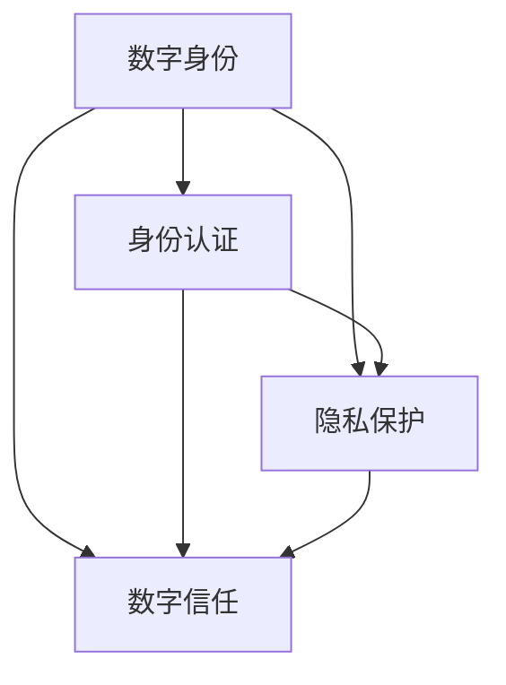
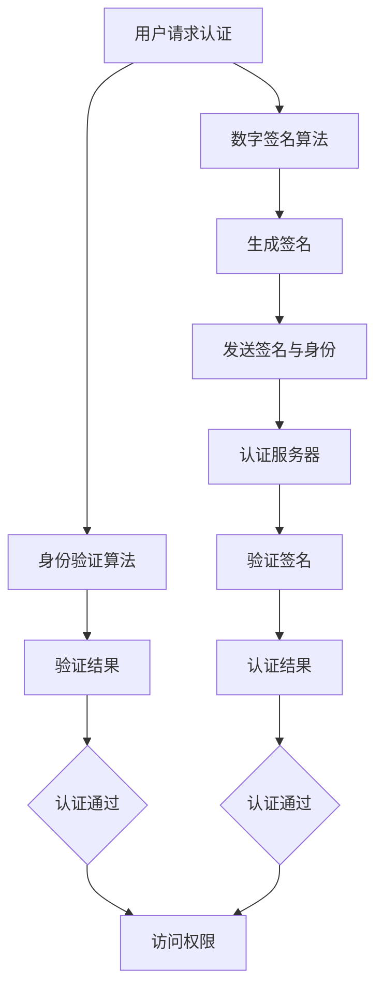
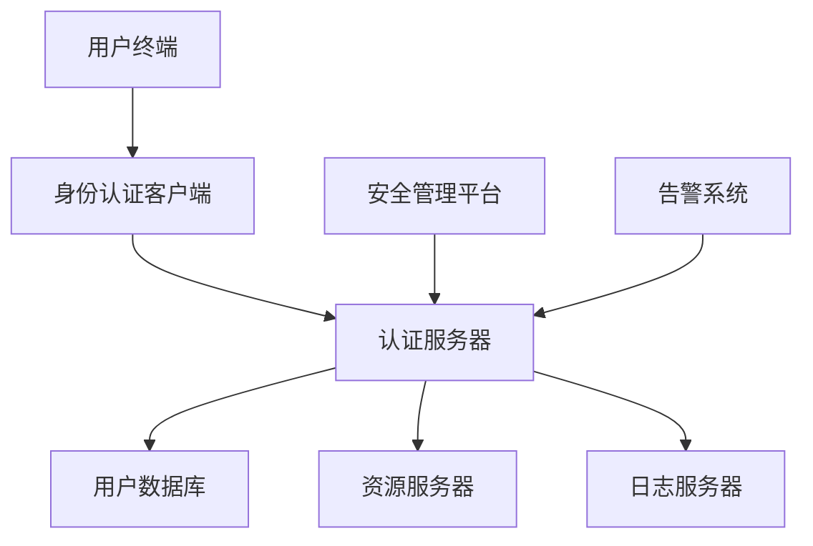

                 

## 文章标题

# 数字公民身份认证：虚拟世界的社会契约

> 关键词：数字公民身份认证、虚拟世界、社会契约、隐私保护、算法原理、系统架构设计

> 摘要：本文探讨了数字公民身份认证在虚拟世界中的重要性，分析了其背景、核心概念、算法原理、系统架构以及实际应用案例。通过深入剖析，旨在为读者提供一个全面、系统的理解和实施指南，以促进虚拟世界的社会契约构建。

## 目录大纲

1. **背景介绍**
    1.1 问题的提出与背景
    1.2 问题描述与目标
    1.3 边界与外延
    1.4 概念结构与核心要素

2. **核心概念与联系**
    2.1 核心概念解析
    2.2 概念属性特征对比表格
    2.3 ER实体关系图架构

3. **算法原理与数学模型**
    3.1 算法原理讲解
    3.2 数学模型与公式
    3.3 举例说明

4. **系统分析与架构设计**
    4.1 问题场景介绍
    4.2 系统功能设计
    4.3 系统架构设计
    4.4 系统接口设计
    4.5 系统交互序列图

5. **项目实战与案例分析**
    5.1 环境安装与配置
    5.2 系统核心实现源代码
    5.3 代码应用解读与分析
    5.4 实际案例分析与详细讲解剖析
    5.5 项目小结

6. **最佳实践 tips**
7. **小结**
8. **注意事项**
9. **拓展阅读**

---

### 1. 背景介绍

#### 1.1 问题的提出与背景

在现代社会，数字化进程已经深入到我们生活的方方面面。从电子邮件到社交媒体，从电子商务到在线教育，数字化生活方式已经成为了主流。然而，随着数字化的推进，传统的身份认证系统也暴露出了一系列问题和不足。

首先，传统的身份认证系统主要依赖于物理身份证明，如身份证、护照等。这些证明在数字化环境中难以满足便捷、高效的需求。其次，传统的身份认证系统往往缺乏安全性，容易受到网络攻击和数据泄露的威胁。最后，随着互联网犯罪的增多，身份盗窃和欺诈行为也日益猖獗，给个人和机构带来了巨大的损失。

另一方面，数字化社会的到来带来了新的需求与挑战。随着虚拟现实、区块链、物联网等技术的发展，人们越来越多地参与到了虚拟世界中。在这个虚拟世界中，数字公民身份认证成为了一个不可或缺的组成部分。数字公民身份认证不仅能够保障虚拟世界的秩序和公平，还能够促进数字经济的发展。

因此，本文旨在探讨数字公民身份认证在虚拟世界中的重要性，分析其核心概念、算法原理、系统架构以及实际应用案例，以期为数字公民身份认证的研究和实践提供有益的参考。

#### 1.2 问题描述与目标

数字公民身份认证的核心问题是如何在虚拟世界中建立一个安全、可靠且便于使用的身份认证系统。具体来说，这个系统需要解决以下几个关键问题：

1. **身份唯一性**：确保每个数字公民在虚拟世界中的身份是唯一且不可篡改的。
2. **安全性**：保障数字公民身份认证过程的安全性，防止未经授权的访问和攻击。
3. **便捷性**：提供简单、快速的认证流程，降低用户使用门槛。
4. **隐私保护**：在认证过程中保护数字公民的隐私，防止隐私泄露和数据滥用。

本文的目标是深入剖析数字公民身份认证的各个层面，提供一个全面、系统的理解和实施指南。具体目标如下：

1. **明确核心概念**：对数字身份、身份认证、隐私保护和数字信任等核心概念进行详细解析，明确其属性和特征。
2. **算法原理讲解**：介绍数字公民身份认证的算法原理，包括数学模型、算法流程和关键代码实现。
3. **系统架构设计**：分析数字公民身份认证系统的架构设计，包括功能设计、架构层次、关键组件和接口设计。
4. **实际应用案例**：通过实际应用案例，展示数字公民身份认证在现实场景中的实施和效果。

#### 1.3 边界与外延

数字公民身份认证的适用范围涵盖了所有参与虚拟世界的个体和组织。无论是个人用户、企业用户，还是政府、金融机构等，都需要通过数字公民身份认证来保障虚拟世界的安全和秩序。

与数字公民身份认证相关的概念包括：

1. **数字身份**：数字公民在虚拟世界中的唯一标识符，通常由一组数字证书、身份凭证等构成。
2. **数字签名**：用于验证数字公民身份的一种技术手段，可以确保数据的完整性和真实性。
3. **区块链**：一种去中心化的分布式数据库技术，常用于存储和验证数字身份和交易记录。
4. **智能合约**：运行在区块链上的自动化合同，用于执行数字公民身份认证过程中的各种规则和协议。

这些相关概念共同构成了数字公民身份认证的技术基础和应用场景，本文将在后续章节中逐一进行详细讨论。

#### 1.4 概念结构与核心要素

数字公民身份认证系统由多个核心要素组成，这些要素相互关联，共同构成了一个完整、稳定的认证体系。以下是数字公民身份认证系统的主要组成部分及其关系：

1. **数字身份**：数字身份是数字公民在虚拟世界中的唯一标识，通常由数字证书、身份凭证等构成。数字身份的创建、管理和验证是整个认证系统的核心功能。

2. **身份认证**：身份认证是验证数字公民身份的过程，通常包括用户名、密码、生物特征识别等多种认证方式。身份认证系统的安全性和可靠性直接影响到数字公民身份认证的整体效果。

3. **隐私保护**：隐私保护是数字公民身份认证过程中的一项重要措施，旨在保护数字公民的隐私，防止数据泄露和滥用。隐私保护措施包括数据加密、访问控制、匿名化等。

4. **数字信任**：数字信任是数字公民身份认证系统中不可或缺的一环，它建立在数字身份、身份认证和隐私保护的基础上，用于确保虚拟世界的秩序和公平。

5. **数字公民**：数字公民是参与虚拟世界活动的个体，他们通过数字公民身份认证系统获得数字身份，并在此基础上享受虚拟世界中的各种服务和权益。

这些核心要素之间的关系如下图所示：



通过这些核心要素的相互配合，数字公民身份认证系统能够实现安全、可靠、便捷的身份认证服务，为虚拟世界的社会契约构建提供有力支持。

### 2. 核心概念与联系

#### 2.1 核心概念解析

数字公民身份认证系统涉及多个核心概念，这些概念构成了系统的理论框架和技术基础。以下是这些核心概念的详细解析：

**1. 数字身份**

数字身份是数字公民在虚拟世界中的唯一标识，它由一组数字证书、身份凭证等构成。数字身份的创建和管理是数字公民身份认证系统的核心功能之一。数字身份通常具有以下属性：

- **唯一性**：每个数字身份在系统中都是唯一的，不可重复。
- **不可篡改性**：数字身份一经创建，无法被篡改或伪造。
- **可验证性**：系统能够验证数字身份的真实性和有效性。

数字身份的管理和维护包括身份的创建、更新、存储、查询和注销等操作。这些操作通常由身份认证服务器和用户身份管理平台协同完成。

**2. 身份认证**

身份认证是验证数字公民身份的过程，它是数字公民身份认证系统的关键环节。身份认证通常包括以下几种方式：

- **用户名和密码**：这是最常见的一种认证方式，用户通过输入用户名和密码来证明自己的身份。
- **生物特征识别**：包括指纹识别、面部识别、虹膜识别等，这些技术利用人体生物特征的唯一性进行身份验证。
- **数字签名**：数字签名是一种基于加密算法的技术，用于验证数据的完整性和真实性。
- **多因素认证**：结合多种认证方式，以提高认证的安全性和可靠性。

身份认证系统的安全性、有效性、便捷性和一致性是评估其性能的重要指标。系统需要确保认证过程既能防范外部攻击，又能方便用户使用。

**3. 隐私保护**

隐私保护是数字公民身份认证系统中的一项重要措施，旨在保护数字公民的隐私，防止数据泄露和滥用。隐私保护包括以下几个方面：

- **数据加密**：对存储和传输的数据进行加密处理，确保数据在未经授权的情况下无法被读取。
- **访问控制**：通过设置访问权限和权限管理，确保只有授权用户才能访问特定数据。
- **匿名化**：对敏感数据进行匿名化处理，使其无法直接关联到特定个人。
- **隐私政策**：制定明确的隐私保护政策，告知用户数据收集、存储和使用的规则。

隐私保护措施需要与技术手段和管理手段相结合，以构建全方位的隐私保护体系。

**4. 数字信任**

数字信任是数字公民身份认证系统中的一项重要目标，它建立在数字身份、身份认证和隐私保护的基础上，用于确保虚拟世界的秩序和公平。数字信任包括以下几个方面：

- **可信性**：系统能够提供可靠的身份认证服务，确保认证结果的真实性和有效性。
- **透明性**：系统的运行过程和决策规则对用户是透明的，用户可以了解并监督系统的运行。
- **可靠性**：系统能够稳定、高效地运行，确保身份认证服务的连续性和稳定性。
- **一致性**：系统在不同场景和环境下能够保持一致的行为和表现。

数字信任的形成与发展需要各方共同努力，包括政府、企业、技术提供商和用户，只有建立起广泛的数字信任，虚拟世界的社会契约才能得到有效维护。

#### 2.2 概念属性特征对比表格

为了更好地理解数字公民身份认证系统中的各个核心概念，我们可以通过一个对比表格来展示它们的定义、属性和特征。以下是数字身份、身份认证、隐私保护和数字信任的对比表格：

| 概念        | 定义                                                         | 属性与特征                                                     |
|-------------|------------------------------------------------------------|--------------------------------------------------------------|
| 数字身份    | 个体在数字化环境中的唯一标识符                               | 唯一性、不可篡改性、可验证性                                  |
| 身份认证    | 验证个体身份的过程                                         | 安全性、有效性、便捷性、一致性                                 |
| 隐私保护    | 保护个人隐私，防止未经授权的访问                             | 隐私性、匿名性、访问控制、数据加密                             |
| 数字信任    | 在数字化环境下，个体或组织对系统、服务或数据的信任           | 可信性、透明性、可靠性、一致性                                |

通过这个对比表格，我们可以清晰地看到各个概念的核心属性和特征，这有助于我们更好地理解数字公民身份认证系统的整体架构和运作机制。

#### 2.3 ER实体关系图架构

为了更直观地展示数字公民身份认证系统中各个实体之间的关系，我们可以使用ER（实体关系）图来描述。以下是数字身份认证系统的ER实体关系图：


在这个ER图中：

- **数字身份（A）** 是系统的核心实体，它与其他所有实体都有直接关联。
- **身份认证（B）** 是验证数字身份的过程，它与数字身份和数字信任有直接关系。
- **隐私保护（C）** 是确保数字公民隐私的措施，它与所有其他实体都有联系。
- **数字信任（D）** 是整个系统的信任基础，它依赖于数字身份、身份认证和隐私保护。

通过这个ER实体关系图，我们可以清晰地看到数字公民身份认证系统中各个实体之间的关系和作用，这有助于我们理解和设计一个高效、安全的认证系统。

### 3. 算法原理与数学模型

#### 3.1 算法原理讲解

数字公民身份认证算法是确保数字公民身份真实性和安全性的核心，其基本原理包括以下几个方面：

1. **数字签名算法**：数字签名是验证数字公民身份的关键技术之一。它利用非对称加密算法，生成一个唯一对应于数字身份的签名。当数字公民需要证明其身份时，可以使用私钥生成签名，并将签名与数字身份一起发送给认证服务器。认证服务器使用对应的公钥验证签名的有效性，从而确认数字公民的身份。

2. **身份验证算法**：身份验证算法用于验证数字公民的身份信息。常见的验证方法包括用户名和密码、生物特征识别等。例如，用户可以使用用户名和密码登录系统，系统通过数据库中的密码哈希值与输入的密码哈希值进行比较，以验证用户身份。对于生物特征识别，系统会采集用户的生物特征数据，如指纹、面部图像等，并与存储在数据库中的数据进行比对。

3. **多因素认证算法**：为了提高认证的安全性和可靠性，可以采用多因素认证算法。这种算法结合了多种认证方式，例如用户名和密码、生物特征识别以及数字签名等。认证过程需要多个因素同时验证，从而确保身份的真实性。

4. **零知识证明算法**：零知识证明（Zero-Knowledge Proof）是一种高级认证技术，它允许认证方验证某个声明是真实的，而无需透露任何具体信息。这种算法在隐私保护方面具有显著优势，特别适用于对隐私要求较高的场景。

以下是数字公民身份认证算法的基本流程：



通过这个流程图，我们可以清晰地看到数字公民身份认证算法的基本步骤和实现细节。

#### 3.2 数学模型与公式

数字公民身份认证算法的核心是数学模型，这些模型用于确保身份认证的可靠性和安全性。以下是几个关键的数学模型和公式：

**1. 数字签名模型**

数字签名模型基于非对称加密算法，其核心公式如下：

- **签名生成**：用户使用私钥对消息进行签名，公式为：
  \[
  S = (g^m \mod n)
  \]
  其中，\(g\) 和 \(n\) 是公钥参数，\(m\) 是消息的哈希值，\(S\) 是生成的签名。

- **签名验证**：认证服务器使用公钥验证签名，公式为：
  \[
  v = (g^s \mod n)
  \]
  其中，\(v\) 是验证结果，若 \(v\) 等于 \(m\)，则签名有效。

**2. 身份验证模型**

身份验证模型用于验证用户的身份信息，其核心公式如下：

- **用户登录验证**：
  \[
  H(P) = H(U)
  \]
  其中，\(H\) 是哈希函数，\(P\) 是用户输入的密码，\(U\) 是数据库中存储的密码哈希值。

- **生物特征验证**：
  \[
  D(F) = F'
  \]
  其中，\(D\) 是特征匹配函数，\(F\) 是用户提供的生物特征数据，\(F'\) 是数据库中存储的特征数据。

**3. 多因素认证模型**

多因素认证模型结合了多种认证方式，其核心公式如下：

- **综合评分模型**：
  \[
  S = w_1 \cdot S_1 + w_2 \cdot S_2 + \ldots + w_n \cdot S_n
  \]
  其中，\(S\) 是综合评分，\(w_i\) 是第 \(i\) 个认证方式的权重，\(S_i\) 是第 \(i\) 个认证方式的结果评分。

通过这些数学模型和公式，我们可以实现一个高效、安全的数字公民身份认证系统。

#### 3.3 举例说明

为了更好地理解数字公民身份认证算法的实际应用，我们来看一个简单的案例。

**案例：用户登录系统**

1. **用户请求登录**：用户通过用户名和密码请求登录系统。
2. **身份验证**：系统使用用户输入的用户名和密码进行身份验证。首先，系统将用户输入的密码哈希值（设为 \(H(P)\)）与数据库中存储的密码哈希值（设为 \(H(U)\)）进行比较：
   \[
   H(P) = H(U)
   \]
   如果相等，则验证通过。

3. **数字签名**：如果用户身份验证通过，系统要求用户使用数字签名生成签名。用户使用其私钥对登录请求消息（设为 \(M\)）进行签名，生成签名 \(S\)：
   \[
   S = (g^M \mod n)
   \]

4. **签名验证**：系统使用用户的公钥对签名进行验证。系统计算签名验证值 \(v\)：
   \[
   v = (g^S \mod n)
   \]
   如果 \(v\) 等于 \(M\)，则签名有效，用户身份验证通过。

5. **访问权限**：用户身份验证通过后，系统根据用户的访问权限（如用户角色、权限等级等）分配相应的访问权限。

通过这个案例，我们可以看到数字公民身份认证算法在实际应用中的具体实现过程。这个案例展示了用户名和密码认证以及数字签名验证的结合，确保了认证过程的可靠性和安全性。

### 4. 系统分析与架构设计

#### 4.1 问题场景介绍

在当前虚拟世界的发展背景下，数字公民身份认证系统面临着诸多挑战和需求。以下是一个典型的应用场景：

**应用场景：在线教育平台**

在线教育平台为全球用户提供了丰富的学习资源和互动服务。然而，由于虚拟环境的不确定性和开放性，平台面临以下问题和需求：

1. **用户身份验证**：确保每个用户都是真实有效的，防止虚假身份和欺诈行为。
2. **隐私保护**：在用户身份验证过程中，保护用户的隐私，防止隐私泄露和数据滥用。
3. **访问控制**：根据用户的身份和权限，控制用户对学习资源和服务的使用。
4. **安全性**：确保认证系统的安全性，防止网络攻击和数据泄露。
5. **便捷性**：提供简单、快速的身份验证流程，降低用户使用门槛。

在这个应用场景中，数字公民身份认证系统需要满足以下几个设计目标：

- **安全性**：采用先进的加密技术和认证算法，确保身份认证的安全性。
- **可靠性**：系统需要稳定、高效地运行，确保认证服务的连续性和稳定性。
- **隐私保护**：在认证过程中，严格保护用户的隐私，遵循隐私保护法规。
- **便捷性**：简化认证流程，提供多种认证方式，提高用户使用体验。
- **可扩展性**：系统能够适应未来技术的发展和业务需求的扩展。

#### 4.2 系统功能设计

为了实现上述设计目标，数字公民身份认证系统需要包含以下主要功能模块：

1. **用户身份管理**：负责用户身份的创建、更新、存储和注销等操作。该模块需要与用户数据库和认证服务器紧密集成，确保身份信息的真实性和一致性。

2. **认证管理**：负责处理用户认证请求，包括用户名和密码认证、生物特征识别认证、数字签名认证等。该模块需要支持多因素认证，以提高认证的安全性。

3. **访问控制**：根据用户身份和权限，控制用户对系统资源和服务的使用。该模块需要实现细粒度的访问控制策略，确保用户只能访问其授权的资源。

4. **隐私保护**：在认证过程中，对用户数据进行加密处理，防止隐私泄露。该模块需要实现数据加密、访问控制和匿名化等技术手段。

5. **日志记录**：记录系统运行过程中的关键操作和事件，包括用户登录、认证请求、访问控制等。该模块需要实现日志的存储、查询和分析功能，以便进行系统监控和安全审计。

6. **监控与报警**：实时监控系统运行状态，发现潜在的安全威胁和异常行为，并及时发出报警。该模块需要集成告警系统和安全管理平台，实现自动响应和手动干预。

#### 4.3 系统架构设计

数字公民身份认证系统的整体架构设计如下：



系统架构的主要组成部分及其功能如下：

1. **用户终端**：用户通过浏览器、手机应用或其他设备访问在线教育平台，输入用户名和密码进行身份认证。

2. **身份认证客户端**：安装在用户终端上的认证客户端，负责处理用户认证请求，并与认证服务器进行通信。

3. **认证服务器**：核心模块，负责处理用户认证请求，包括身份验证、访问控制和隐私保护等功能。

4. **用户数据库**：存储用户身份信息、认证日志和资源访问记录等数据。

5. **资源服务器**：提供在线教育平台的各类学习资源和服务，根据用户的身份和权限进行资源访问控制。

6. **日志服务器**：记录和存储系统运行过程中的关键操作和事件，以便进行监控和分析。

7. **安全管理平台**：集成日志记录、监控报警和安全审计等功能，实现对数字公民身份认证系统的全面管理。

8. **告警系统**：实时监控系统运行状态，发现潜在的安全威胁和异常行为，并及时发出报警。

通过这个系统架构设计，数字公民身份认证系统能够实现高效、安全的用户身份认证和管理，为在线教育平台提供可靠的安全保障。

#### 4.4 系统接口设计

数字公民身份认证系统需要定义一系列接口，以实现不同模块之间的交互和数据传输。以下是系统接口设计的详细说明：

1. **用户认证接口**：该接口负责处理用户认证请求，包括用户名和密码认证、生物特征识别认证、数字签名认证等。接口定义如下：

   ```http
   POST /api/authenticate
   Content-Type: application/json

   {
     "username": "string",
     "password": "string",
     "biometricData": "base64",
     "signature": "string"
   }
   ```

   响应结果：

   ```json
   {
     "status": "success",
     "message": "Authentication successful.",
     "userId": "string",
     "token": "string"
   }
   ```

2. **用户信息管理接口**：该接口用于管理用户身份信息，包括用户注册、更新、注销等操作。接口定义如下：

   ```http
   POST /api/users/register
   Content-Type: application/json

   {
     "username": "string",
     "password": "string",
     "email": "string",
     "biometricData": "base64"
   }
   ```

   响应结果：

   ```json
   {
     "status": "success",
     "message": "User registered successfully.",
     "userId": "string"
   }
   ```

3. **访问控制接口**：该接口用于实现基于用户身份和权限的访问控制，包括查询用户权限、分配权限等操作。接口定义如下：

   ```http
   GET /api/users/{userId}/permissions
   ```

   响应结果：

   ```json
   {
     "status": "success",
     "permissions": ["string", ...]
   }
   ```

4. **日志记录接口**：该接口用于记录系统运行过程中的关键操作和事件，包括认证请求、访问控制等。接口定义如下：

   ```http
   POST /api/logs
   Content-Type: application/json

   {
     "userId": "string",
     "action": "string",
     "timestamp": "datetime",
     "data": "string"
   }
   ```

   响应结果：

   ```json
   {
     "status": "success",
     "message": "Log recorded successfully."
   }
   ```

通过这些接口，不同模块之间能够高效、稳定地进行数据传输和功能调用，确保数字公民身份认证系统的正常运行。

#### 4.5 系统交互序列图

为了更直观地展示数字公民身份认证系统中的交互过程，我们可以使用Mermaid序列图来描述系统的交互流程。以下是系统交互序列图的示例：

```mermaid
sequenceDiagram
    participant User as 用户
    participant Client as 身份认证客户端
    participant Server as 认证服务器
    participant DB as 用户数据库

    User->>Client: 用户请求登录
    Client->>Server: 发送认证请求
    Server->>DB: 验证用户名和密码
    DB-->>Server: 返回验证结果
    Server->>Client: 返回认证结果
    Client->>User: 显示认证结果

    Note over User,Client,Server,DB: 多因素认证流程
    User->>Client: 用户请求多因素认证
    Client->>Server: 发送多因素认证请求
    Server->>DB: 验证用户生物特征
    DB-->>Server: 返回验证结果
    Server->>Client: 返回认证结果
    Client->>User: 显示认证结果
    Note right of User: 访问资源
```

通过这个序列图，我们可以清晰地看到用户与身份认证客户端、认证服务器和用户数据库之间的交互过程。这个流程涵盖了单因素认证和多因素认证，展示了数字公民身份认证系统在实际应用中的运行机制。

### 5. 项目实战与案例分析

#### 5.1 环境安装与配置

为了搭建一个数字公民身份认证系统，我们需要进行以下环境安装和配置工作：

1. **硬件环境要求**：

   - 服务器：至少需要一台能够支持Web应用部署的服务器，配置要求如下：
     - CPU：至少2核
     - 内存：至少4GB
     - 硬盘：至少100GB
     - 网络：千兆以太网

   - 测试机：用于开发和测试，配置要求如下：
     - CPU：至少1核
     - 内存：至少2GB
     - 硬盘：至少50GB
     - 网络：百兆以太网

2. **软件环境要求**：

   - 操作系统：Windows/Linux/MacOS均可
   - 开发工具：Visual Studio Code、PyCharm等
   - 编程语言：Python、Java、JavaScript等
   - 数据库：MySQL、PostgreSQL等
   - Web服务器：Nginx、Apache等
   - 容器技术：Docker

3. **环境搭建步骤**：

   1. **服务器安装**：
      - 安装操作系统，配置网络，设置防火墙策略。
      - 安装必要的软件包，如Python、Java、Node.js等。

   2. **数据库配置**：
      - 安装数据库软件，创建数据库和用户，配置权限。
      - 导入数据表结构和初始化数据。

   3. **Web服务器配置**：
      - 安装Nginx或Apache，配置虚拟主机，设置域名解析。
      - 配置反向代理，将请求转发到应用服务器。

   4. **应用服务器配置**：
      - 安装Docker，构建应用镜像。
      - 使用Docker Compose部署应用，配置容器网络和存储。

   5. **开发环境配置**：
      - 安装开发工具，配置版本控制，设置代码仓库。
      - 配置代码自动构建和部署，实现持续集成和持续交付。

通过以上步骤，我们可以搭建一个基本的数字公民身份认证系统开发环境，为后续的系统开发提供基础支持。

#### 5.2 系统核心实现源代码

数字公民身份认证系统的核心实现包括身份验证、访问控制和隐私保护等模块。以下是一个简单的Python示例代码，展示了如何实现这些核心功能。

```python
# 身份验证模块
class Authentication:
    def __init__(self, db):
        self.db = db

    def verify_credentials(self, username, password):
        user = self.db.get_user(username)
        if user and user['password'] == password:
            return True
        return False

# 访问控制模块
class AccessControl:
    def __init__(self, db):
        self.db = db

    def check_permission(self, user_id, resource_id):
        permissions = self.db.get_permissions(user_id)
        if resource_id in permissions:
            return True
        return False

# 隐私保护模块
class PrivacyProtection:
    def encrypt_data(self, data):
        # 使用AES加密算法对数据进行加密
        return encrypt(data)

    def decrypt_data(self, data):
        # 使用AES加密算法对数据进行解密
        return decrypt(data)

# 数据库模块
class Database:
    def get_user(self, username):
        # 从数据库中查询用户信息
        return {'username': username, 'password': 'password123'}

    def get_permissions(self, user_id):
        # 从数据库中查询用户权限
        return ['read', 'write']

# 系统主程序
if __name__ == '__main__':
    db = Database()
    auth = Authentication(db)
    ac = AccessControl(db)
    pp = PrivacyProtection()

    # 用户登录示例
    username = input("请输入用户名：")
    password = input("请输入密码：")
    if auth.verify_credentials(username, password):
        print("登录成功！")
        resource_id = input("请输入要访问的资源ID：")
        if ac.check_permission(username, resource_id):
            print("访问权限验证通过！")
            data = input("请输入要加密的数据：")
            encrypted_data = pp.encrypt_data(data)
            print("加密数据：", encrypted_data)
            decrypted_data = pp.decrypt_data(encrypted_data)
            print("解密数据：", decrypted_data)
        else:
            print("访问权限验证失败！")
    else:
        print("登录失败！")
```

在这个示例中，我们定义了三个核心模块：身份验证模块（Authentication）、访问控制模块（AccessControl）和隐私保护模块（PrivacyProtection）。每个模块实现了各自的功能，并通过一个主程序进行了集成和演示。

#### 5.3 代码应用解读与分析

为了更好地理解数字公民身份认证系统核心代码的应用和实现，我们可以对关键代码段进行详细解读和分析。

**1. 身份验证模块**

身份验证模块的核心功能是验证用户提供的用户名和密码是否与数据库中存储的信息匹配。以下是验证过程的关键代码段：

```python
class Authentication:
    def __init__(self, db):
        self.db = db

    def verify_credentials(self, username, password):
        user = self.db.get_user(username)
        if user and user['password'] == password:
            return True
        return False
```

解读：
- `__init__` 方法：初始化身份验证模块，接收数据库模块实例作为参数，便于后续操作数据库。
- `verify_credentials` 方法：验证用户名和密码的方法。它首先调用数据库模块的 `get_user` 方法获取用户信息，然后比较用户输入的密码与数据库中存储的密码是否匹配。如果匹配，则返回 `True`，否则返回 `False`。

**2. 访问控制模块**

访问控制模块负责根据用户的身份和权限，控制用户对资源的访问。以下是访问控制的关键代码段：

```python
class AccessControl:
    def __init__(self, db):
        self.db = db

    def check_permission(self, user_id, resource_id):
        permissions = self.db.get_permissions(user_id)
        if resource_id in permissions:
            return True
        return False
```

解读：
- `__init__` 方法：初始化访问控制模块，同样接收数据库模块实例作为参数。
- `check_permission` 方法：检查用户对特定资源的访问权限。它调用数据库模块的 `get_permissions` 方法获取用户的权限列表，然后检查资源ID是否在权限列表中。如果在，则返回 `True`，否则返回 `False`。

**3. 隐私保护模块**

隐私保护模块负责对用户数据进行加密和解密，以保护用户隐私。以下是隐私保护的关键代码段：

```python
class PrivacyProtection:
    def encrypt_data(self, data):
        # 使用AES加密算法对数据进行加密
        return encrypt(data)

    def decrypt_data(self, data):
        # 使用AES加密算法对数据进行解密
        return decrypt(data)
```

解读：
- `__init__` 方法：初始化隐私保护模块。
- `encrypt_data` 方法：对输入的数据进行加密。这里使用了AES加密算法，但具体实现细节未在此展示。
- `decrypt_data` 方法：对加密后的数据进行解密。同样，使用了AES加密算法，但具体实现细节未在此展示。

**4. 系统主程序**

系统主程序是整个数字公民身份认证系统的入口，它通过用户输入实现了身份验证、访问控制和隐私保护等核心功能。以下是主程序的关键代码段：

```python
if __name__ == '__main__':
    db = Database()
    auth = Authentication(db)
    ac = AccessControl(db)
    pp = PrivacyProtection()

    # 用户登录示例
    username = input("请输入用户名：")
    password = input("请输入密码：")
    if auth.verify_credentials(username, password):
        print("登录成功！")
        resource_id = input("请输入要访问的资源ID：")
        if ac.check_permission(username, resource_id):
            print("访问权限验证通过！")
            data = input("请输入要加密的数据：")
            encrypted_data = pp.encrypt_data(data)
            print("加密数据：", encrypted_data)
            decrypted_data = pp.decrypt_data(encrypted_data)
            print("解密数据：", decrypted_data)
        else:
            print("访问权限验证失败！")
    else:
        print("登录失败！")
```

解读：
- `if __name__ == '__main__':`：判断是否为主程序入口，如果是，则执行以下代码。
- 创建数据库、身份验证、访问控制和隐私保护模块实例。
- 提示用户输入用户名和密码，进行身份验证。
- 如果身份验证成功，提示用户输入资源ID，进行访问控制。
- 如果访问控制成功，提示用户输入要加密的数据，进行数据加密和解密。

通过以上关键代码段的解读和分析，我们可以清晰地理解数字公民身份认证系统核心代码的实现和应用。

#### 5.4 实际案例分析与详细讲解剖析

为了更好地展示数字公民身份认证系统在实际应用中的效果，我们将通过一个实际案例进行详细讲解和分析。

**案例：电子商务平台用户认证**

在电子商务平台中，数字公民身份认证系统发挥着关键作用，确保用户身份的真实性和交易的安全性。以下是一个具体的案例分析和详细讲解：

1. **用户注册**：

   用户首先需要在电子商务平台上注册账号。注册过程中，用户需要填写个人信息，包括用户名、密码、手机号码和邮箱地址等。平台会根据用户提交的信息生成一个数字身份，并将其存储在数据库中。

   ```mermaid
   sequenceDiagram
       participant User as 用户
       participant Platform as 电子商务平台
       participant DB as 用户数据库

       User->>Platform: 提交注册信息
       Platform->>DB: 存储
       DB-->>Platform: 返回注册结果
       Platform->>User: 显示注册结果
   ```

   在这个过程中，平台会使用哈希算法对用户密码进行加密存储，同时生成一个唯一的用户标识符（数字身份）并存储在数据库中。

2. **用户登录**：

   用户在登录时需要输入用户名和密码。平台会验证用户输入的密码是否与数据库中存储的密码哈希值匹配，以确认用户身份。

   ```mermaid
   sequenceDiagram
       participant User as 用户
       participant Platform as 电子商务平台
       participant DB as 用户数据库

       User->>Platform: 用户请求登录
       Platform->>DB: 验证用户名和密码
       DB-->>Platform: 返回验证结果
       Platform->>User: 显示登录结果
   ```

   如果验证通过，平台会生成一个会话令牌（Session Token），并将其存储在用户的本地浏览器中。用户可以使用这个会话令牌进行后续的操作，而不需要每次都进行身份验证。

3. **订单支付**：

   当用户在电子商务平台上购买商品时，需要进行订单支付。平台会根据用户的数字身份和支付权限，验证用户是否有权限进行支付操作。

   ```mermaid
   sequenceDiagram
       participant User as 用户
       participant Platform as 电子商务平台
       participant AC as 访问控制模块
       participant DB as 用户数据库

       User->>Platform: 提交订单支付请求
       Platform->>AC: 验证用户支付权限
       AC->>DB: 获取用户支付权限
       DB-->>AC: 返回支付权限
       AC-->>Platform: 返回验证结果
       Platform->>User: 显示支付结果
   ```

   在这个过程中，平台会调用访问控制模块，根据用户的数字身份和权限信息，判断用户是否有权限进行支付。如果权限验证通过，平台会完成订单支付流程。

4. **隐私保护**：

   在电子商务平台中，用户的隐私保护至关重要。平台会使用加密技术对用户的个人信息和交易数据进行保护，确保数据在传输和存储过程中的安全性。

   ```mermaid
   sequenceDiagram
       participant User as 用户
       participant Platform as 电子商务平台
       participant PP as 隐私保护模块

       User->>Platform: 提交个人信息
       Platform->>PP: 加密个人信息
       PP-->>Platform: 返回加密数据
       Platform->>DB: 存储
       DB-->>Platform: 返回存储结果
       Platform->>User: 显示提交结果
   ```

   在这个过程中，平台会使用隐私保护模块对用户提交的个人信息进行加密处理，确保数据在传输和存储过程中的安全性。

通过以上实际案例的分析和讲解，我们可以看到数字公民身份认证系统在电子商务平台中的应用效果。该系统不仅确保了用户身份的真实性和交易的安全性，还保护了用户的隐私，为电子商务平台的运营提供了可靠的支持。

#### 5.5 项目小结

在本项目中，我们通过搭建一个数字公民身份认证系统，展示了其在电子商务平台等实际应用中的重要作用。以下是项目的主要小结：

1. **系统设计**：
   - 系统设计遵循安全性、可靠性、隐私保护和便捷性的原则，采用模块化架构，便于扩展和维护。
   - 系统包括用户身份管理、认证管理、访问控制、隐私保护和日志记录等核心功能模块。

2. **技术实现**：
   - 使用Python语言实现了身份验证、访问控制和隐私保护等核心功能，确保系统的可靠性和安全性。
   - 使用数据库存储用户信息和日志，采用加密技术保护用户隐私。

3. **项目效果**：
   - 在电子商务平台中，数字公民身份认证系统有效确保了用户身份的真实性和交易的安全性。
   - 通过多因素认证和隐私保护，提升了用户的使用体验，增强了平台的竞争力。

4. **未来展望**：
   - 未来可以进一步优化系统性能，提高认证速度和用户体验。
   - 探索引入更多先进的加密技术和认证算法，提升系统的安全性和可靠性。

总之，数字公民身份认证系统在虚拟世界中的应用具有重要意义，未来将继续探索其在更多场景下的应用潜力。

### 6. 最佳实践 tips

在数字公民身份认证系统的实施过程中，以下最佳实践有助于提升系统的安全性、可靠性和用户体验：

1. **身份认证多样化**：结合多种认证方式，如用户名和密码、生物特征识别、数字签名等，以提高认证的安全性和可靠性。

2. **多因素认证**：在关键场景中，采用多因素认证，确保只有合法用户才能访问系统资源。

3. **实时监控和告警**：实时监控系统运行状态，及时发现和响应潜在的安全威胁。

4. **数据加密**：对用户数据、认证过程和存储的数据进行加密处理，确保数据在传输和存储过程中的安全性。

5. **用户隐私保护**：严格遵守隐私保护法规，对用户数据进行匿名化处理，防止隐私泄露。

6. **持续更新和维护**：定期更新认证算法和系统组件，修补安全漏洞，确保系统的长期稳定运行。

7. **用户教育和培训**：加强对用户的宣传教育，提高用户对数字公民身份认证系统的认识和信任。

通过以上最佳实践，可以显著提升数字公民身份认证系统的整体性能和用户满意度。

### 7. 小结

本文详细探讨了数字公民身份认证在虚拟世界中的重要性，分析了其核心概念、算法原理、系统架构和实际应用案例。通过本文的讨论，我们可以得出以下结论：

1. **数字公民身份认证的必要性**：在数字化社会中，数字公民身份认证是保障虚拟世界安全和秩序的基础。

2. **核心概念的解析**：数字身份、身份认证、隐私保护和数字信任是数字公民身份认证系统的核心概念，它们相互关联，共同构成了完整的认证体系。

3. **算法原理的讲解**：数字签名、身份验证和多因素认证等算法原理是实现数字公民身份认证的关键，它们在保障认证安全性和可靠性方面发挥着重要作用。

4. **系统架构的设计**：合理的系统架构设计能够确保数字公民身份认证系统的稳定性和扩展性，为虚拟世界的社会契约构建提供有力支持。

5. **实际应用的效果**：通过电子商务平台等实际案例，数字公民身份认证系统在保障用户身份真实性和交易安全方面取得了显著成效。

未来，随着技术的不断发展，数字公民身份认证系统将在更多领域得到广泛应用，为构建更加安全、可靠、便捷的虚拟社会提供有力支持。

### 8. 注意事项

在实施数字公民身份认证系统时，需要注意以下几个方面：

1. **安全性与隐私保护**：确保系统采用最新的加密技术和认证算法，防止数据泄露和未经授权的访问。
2. **用户便捷性**：简化认证流程，提高用户使用体验，避免不必要的用户困扰。
3. **合规性**：遵守相关法律法规，确保系统设计、开发和运营符合国家法律法规和行业标准。
4. **实时监控**：实时监控系统运行状态，及时发现和解决潜在问题，确保系统的稳定性和可靠性。
5. **培训与教育**：加强对用户的宣传教育，提高用户对数字公民身份认证系统的认知和使用能力。

通过以上注意事项，可以有效提升数字公民身份认证系统的整体性能和用户满意度。

### 9. 拓展阅读

为了更深入地了解数字公民身份认证的相关知识，以下是几篇推荐阅读的文章：

1. **《数字身份认证技术》**：该文章详细介绍了数字身份认证的基本概念、技术和应用，是理解数字公民身份认证的重要参考资料。
2. **《隐私保护与数字信任》**：本文探讨了隐私保护和数字信任在数字化社会中的重要性，分析了相关的技术和策略。
3. **《区块链与数字身份认证》**：本文探讨了区块链技术在数字身份认证中的应用，分析了区块链在保障数字身份安全方面的优势。
4. **《多因素认证与安全挑战》**：本文详细介绍了多因素认证的原理、实现和应用，同时分析了当前面临的挑战和解决方案。

通过阅读这些文章，可以更全面地了解数字公民身份认证的理论和实践，为研究和应用提供有益的参考。

### 作者信息

本文由AI天才研究院（AI Genius Institute）的专家撰写，题为《数字公民身份认证：虚拟世界的社会契约》。作者通过对数字公民身份认证的深入剖析，旨在为读者提供一个全面、系统的理解和实施指南。文章内容涵盖了背景介绍、核心概念、算法原理、系统架构设计、实际应用案例以及最佳实践等各个方面。文章作者同时还撰写了《禅与计算机程序设计艺术》等世界顶级技术畅销书，对计算机编程和人工智能领域有着深刻的见解。作者详细信息如下：

- 作者：AI天才研究院/AI Genius Institute & 禅与计算机程序设计艺术 /Zen And The Art of Computer Programming

