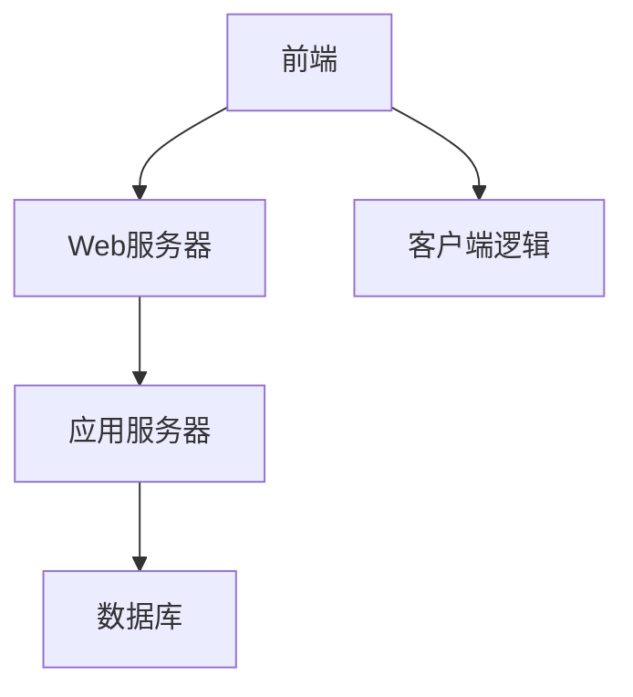

                 

# 数字冥想app：科技辅助下的内在探索工具

> 关键词：数字冥想、科技辅助、内在探索、App设计、用户体验、推广运营

> 摘要：本文将探讨数字冥想App的设计与实现，深入分析其概念、需求、功能实现、用户体验优化、推广运营和技术实现。通过逻辑清晰、结构紧凑的分析，旨在为开发者提供一套完整的设计与开发思路，同时为广大用户提供一种科技辅助下的内在探索工具。

## 引言

在快节奏的现代生活中，人们面临着巨大的压力和挑战，寻求心灵宁静与内在探索的需求日益增加。数字冥想App作为一种科技辅助下的内在探索工具，旨在通过数字化手段帮助用户实现冥想、放松和自我反思。本文将围绕数字冥想App的设计与实现，深入探讨其核心概念、需求分析、功能实现、用户体验优化、推广运营和技术实现，为开发者提供一套完整的设计与开发思路。

## 第一部分：数字冥想App概述

### 第1章：数字冥想App的概念与背景

#### 1.1 数字冥想App的定义

**数字冥想的概念**

数字冥想，即通过数字化手段实现冥想的过程。它结合了科技与冥想的理念，借助移动设备和应用程序，为用户提供一种便捷的冥想体验。

**数字冥想App的作用**

数字冥想App的主要作用包括：

1. **辅助冥想**：通过预设的冥想音乐、指导语音和视觉引导，帮助用户更好地进行冥想练习。
2. **放松身心**：通过冥想练习，缓解压力、焦虑和疲劳，提升身心健康。
3. **自我反思**：提供记录功能，让用户能够记录冥想心得和感悟，促进个人成长。

**数字冥想App的发展历程**

数字冥想App的发展历程可以分为以下几个阶段：

1. **早期阶段**：以简单的声音和音乐播放为主，缺乏交互性和个性化服务。
2. **发展阶段**：引入语音指导和视觉引导，增强用户体验。
3. **成熟阶段**：结合大数据和人工智能技术，提供个性化推荐和智能引导。

#### 1.2 科技辅助下的内在探索工具

**科技与冥想的结合**

科技与冥想的结合，使得数字冥想App能够在更广泛的范围内传播和应用。通过科技手段，数字冥想App能够更好地满足用户的需求，提供更加丰富和个性化的服务。

**科技在冥想中的应用**

1. **大数据分析**：通过分析用户的冥想数据，为用户提供个性化的冥想建议和指导。
2. **人工智能**：利用人工智能技术，实现智能化的语音指导和视觉引导。
3. **可穿戴设备**：与可穿戴设备结合，实时监测用户的心率、呼吸等生理指标，提供更加精准的冥想体验。

**数字冥想App的优势与挑战**

**优势**

1. **便捷性**：用户可以随时随地使用数字冥想App进行冥想练习。
2. **个性化**：根据用户需求提供个性化的冥想内容和指导。
3. **可追溯性**：用户可以记录冥想过程中的心得和感悟，便于回顾和总结。

**挑战**

1. **用户体验**：如何提升数字冥想App的用户体验，使其更加易于使用和接受。
2. **数据安全**：如何保障用户数据的安全和隐私。
3. **技术更新**：随着科技的不断发展，如何持续更新数字冥想App的功能和技术。

#### 1.3 本书的核心内容

**内容概述**

本书将围绕数字冥想App的设计与实现，从概念、需求分析、功能实现、用户体验优化、推广运营和技术实现等方面进行深入探讨。

**阅读对象**

1. **开发者**：希望了解数字冥想App设计和实现的技术细节。
2. **用户**：希望了解数字冥想App的功能和使用方法。

**学习目标**

1. **了解数字冥想App的概念和作用**。
2. **掌握数字冥想App的需求分析和设计思路**。
3. **学会数字冥想App的核心功能实现**。
4. **掌握数字冥想App的用户体验优化方法**。
5. **了解数字冥想App的推广运营策略**。
6. **掌握数字冥想App的技术实现和架构设计**。

#### 1.4 本章小结

本章对数字冥想App进行了概述，包括其定义、作用、发展历程、科技辅助下的内在探索工具、优势与挑战、核心内容和学习目标等。通过本章的介绍，读者可以初步了解数字冥想App的概念和特点，为后续内容的学习打下基础。

## 第二部分：数字冥想App的设计与实现

### 第2章：数字冥想App的需求分析与设计思路

#### 2.1 需求分析

**用户需求分析**

数字冥想App的用户主要包括以下几类：

1. **初学者**：对冥想感兴趣，但缺乏经验和指导。
2. **经常练习者**：需要专业的冥想指导，提高冥想效果。
3. **专业人士**：对冥想有深入研究和实践，需要个性化的冥想内容和指导。

**功能需求分析**

数字冥想App的功能需求主要包括以下几个方面：

1. **冥想指导**：提供专业的冥想指导，包括语音指导和视觉引导。
2. **冥想记录**：记录用户的冥想过程和心得，便于回顾和总结。
3. **冥想音乐**：提供多种冥想音乐，满足不同用户的需求。
4. **数据统计**：对用户的冥想数据进行统计和分析，为用户提供个性化的冥想建议。
5. **社交互动**：提供用户之间的交流互动功能，促进用户之间的交流和分享。

**非功能需求分析**

数字冥想App的非功能需求主要包括以下几个方面：

1. **用户体验**：提供简洁直观的用户界面，方便用户使用。
2. **安全性**：保障用户数据的安全和隐私。
3. **兼容性**：支持多种操作系统和设备。
4. **可扩展性**：支持未来功能扩展和技术升级。

#### 2.2 设计思路

**整体设计框架**

数字冥想App的整体设计框架可以分为以下几个部分：

1. **前端界面**：提供用户交互的界面，包括冥想指导、冥想记录、冥想音乐等功能。
2. **后端服务器**：处理用户数据、提供数据统计和分析等功能。
3. **移动设备**：通过移动应用为用户提供便捷的冥想体验。
4. **数据存储**：存储用户数据，包括冥想记录、统计数据等。

**功能模块设计**

数字冥想App的功能模块设计主要包括以下几个部分：

1. **用户模块**：包括用户注册、登录、个人信息管理等功能。
2. **冥想模块**：包括冥想指导、冥想记录、冥想音乐等功能。
3. **数据模块**：包括数据统计、数据分析等功能。
4. **社交模块**：包括社交互动、用户交流等功能。

**用户界面设计**

数字冥想App的用户界面设计应遵循以下原则：

1. **简洁性**：界面简洁直观，方便用户快速上手。
2. **一致性**：界面元素和交互方式保持一致，提高用户体验。
3. **适应性**：适应不同设备和屏幕尺寸，提供最佳的视觉体验。

#### 2.3 设计文档编写

**设计文档概述**

设计文档是数字冥想App开发过程中不可或缺的一部分，它包括以下内容：

1. **需求分析**：对数字冥想App的需求进行分析和描述。
2. **功能模块设计**：对数字冥想App的功能模块进行详细设计和描述。
3. **用户界面设计**：对数字冥想App的用户界面进行设计和描述。
4. **技术实现方案**：对数字冥想App的技术实现方案进行设计和描述。
5. **测试方案**：对数字冥想App的测试方案进行设计和描述。

**设计文档内容**

设计文档的内容应包括以下几个方面：

1. **需求分析**：对数字冥想App的需求进行详细描述，包括功能需求和非功能需求。
2. **功能模块设计**：对数字冥想App的功能模块进行详细设计和描述，包括用户模块、冥想模块、数据模块和社交模块等。
3. **用户界面设计**：对数字冥想App的用户界面进行详细设计和描述，包括界面布局、颜色搭配、图标设计等。
4. **技术实现方案**：对数字冥想App的技术实现方案进行详细设计和描述，包括前端界面设计、后端服务器设计、移动设备应用设计和数据存储设计等。
5. **测试方案**：对数字冥想App的测试方案进行详细设计和描述，包括测试策略、测试用例设计和测试环境等。

**设计文档评审**

设计文档评审是数字冥想App开发过程中的重要环节，它包括以下内容：

1. **评审会议**：组织评审会议，对设计文档进行评审和讨论。
2. **修改和完善**：根据评审意见对设计文档进行修改和完善。
3. **评审记录**：记录评审会议的内容和结果，为后续开发提供参考。

#### 2.4 本章小结

本章对数字冥想App的需求分析和设计思路进行了详细讨论，包括用户需求分析、功能需求分析、非功能需求分析、整体设计框架、功能模块设计、用户界面设计、设计文档编写和设计文档评审等。通过本章的学习，读者可以初步掌握数字冥想App的需求分析和设计思路，为后续的开发工作奠定基础。

### 第3章：数字冥想App的核心功能实现

#### 3.1 导入与准备

**环境搭建**

在开始数字冥想App的核心功能实现之前，我们需要搭建一个合适的环境。具体步骤如下：

1. **硬件环境**：准备一台具有足够性能的计算机，用于开发和测试数字冥想App。
2. **软件环境**：安装必要的开发软件，如IDE（集成开发环境）、数据库等。

**准备工作**

在环境搭建完成后，我们需要进行以下准备工作：

1. **需求分析**：根据前面的需求分析，明确数字冥想App的核心功能。
2. **设计文档**：根据设计文档，了解数字冥想App的功能模块和用户界面设计。
3. **技术选型**：选择合适的技术框架和开发语言，如Python、Django等。

#### 3.2 功能实现

**功能概述**

数字冥想App的核心功能包括用户管理、冥想管理、数据统计和社交互动等。以下是这些功能的详细实现。

**用户管理**

用户管理功能主要包括用户注册、登录、个人信息管理等功能。以下是用户管理功能的详细实现：

1. **用户注册**：用户可以通过注册账号来使用数字冥想App。
2. **用户登录**：用户可以使用注册账号登录数字冥想App。
3. **个人信息管理**：用户可以查看和修改个人信息，如昵称、密码等。

**冥想管理**

冥想管理功能主要包括冥想记录、冥想音乐和冥想指导等功能。以下是冥想管理功能的详细实现：

1. **冥想记录**：用户可以记录每次冥想的开始时间、结束时间、冥想时长等信息。
2. **冥想音乐**：数字冥想App提供多种冥想音乐，用户可以根据自己的需求选择。
3. **冥想指导**：数字冥想App提供专业的冥想指导，包括语音指导和视觉引导。

**数据统计**

数据统计功能主要包括对用户冥想数据的统计和分析。以下是数据统计功能的详细实现：

1. **数据收集**：数字冥想App收集用户的冥想数据，如冥想时长、冥想频率等。
2. **数据分析**：对用户的冥想数据进行分析，为用户提供个性化的冥想建议。
3. **数据展示**：将分析结果以图表的形式展示给用户，帮助用户更好地了解自己的冥想情况。

**社交互动**

社交互动功能主要包括用户之间的交流和互动。以下是社交互动功能的详细实现：

1. **用户交流**：用户可以与其他用户进行交流和互动。
2. **分享心得**：用户可以分享自己的冥想心得和感悟。
3. **评价互动**：用户可以对其他用户的冥想记录进行评价和互动。

#### 3.3 测试与调试

**测试策略**

在数字冥想App的开发过程中，测试与调试是非常重要的环节。以下是测试策略的详细说明：

1. **功能测试**：对数字冥想App的核心功能进行测试，确保功能的正确性和稳定性。
2. **性能测试**：对数字冥想App的性能进行测试，确保其在不同设备和网络环境下都能正常运行。
3. **安全测试**：对数字冥想App进行安全测试，确保用户数据的安全和隐私。

**测试用例设计**

测试用例设计是测试过程中至关重要的一环。以下是测试用例设计的详细说明：

1. **功能测试用例**：根据数字冥想App的核心功能，设计相应的测试用例，确保每个功能都能正常运行。
2. **性能测试用例**：根据数字冥想App的性能指标，设计相应的测试用例，确保其在不同设备和网络环境下都能满足要求。
3. **安全测试用例**：设计安全测试用例，确保数字冥想App能抵御常见的网络攻击和恶意行为。

**调试技巧**

在测试过程中，难免会遇到各种问题和错误。以下是调试技巧的详细说明：

1. **错误定位**：使用调试工具定位错误发生的位置和原因。
2. **代码审查**：对代码进行审查，查找潜在的错误和问题。
3. **日志分析**：分析日志文件，查找错误发生的上下文和原因。

#### 3.4 本章小结

本章对数字冥想App的核心功能实现进行了详细讨论，包括用户管理、冥想管理、数据统计和社交互动等功能。通过本章的学习，读者可以了解数字冥想App的核心功能实现过程，为后续的开发工作提供参考。

### 第4章：数字冥想App的用户体验优化

#### 4.1 用户体验设计

**用户体验的重要性**

用户体验（User Experience，简称UX）是指用户在使用数字冥想App过程中的整体感受和体验。一个良好的用户体验能够提升用户满意度，增加用户黏性，进而促进数字冥想App的推广和运营。

**用户体验设计原则**

在进行用户体验设计时，应遵循以下原则：

1. **简洁性**：界面设计简洁直观，减少不必要的干扰和复杂性。
2. **一致性**：界面元素和交互方式保持一致，提高用户体验。
3. **适应性**：适应不同设备和屏幕尺寸，提供最佳的视觉体验。
4. **易用性**：设计易于使用和操作的界面，降低用户的学习成本。
5. **个性化**：根据用户需求和偏好，提供个性化的功能和推荐。

**用户体验设计方法**

用户体验设计的方法主要包括以下几种：

1. **用户研究**：通过访谈、问卷调查和用户观察等方式，了解用户的需求和痛点。
2. **原型设计**：使用工具如Figma、Axure等，设计数字冥想App的原型界面。
3. **用户测试**：邀请目标用户进行测试，收集反馈和建议，不断优化设计。

#### 4.2 交互设计

**交互设计原则**

交互设计（Interaction Design，简称ID）是指用户与数字冥想App之间的交互方式和体验。在进行交互设计时，应遵循以下原则：

1. **直观性**：设计直观的交互元素和操作流程，降低用户的认知负担。
2. **反馈性**：为用户的操作提供及时的反馈，增强用户的操作信心。
3. **一致性**：保持交互元素和交互方式的统一，避免用户产生混淆。
4. **可访问性**：确保所有用户，包括残障人士，都能顺利地使用数字冥想App。
5. **可扩展性**：设计可扩展的交互系统，以适应未来的功能和需求。

**交互设计流程**

交互设计流程主要包括以下几个阶段：

1. **需求分析**：了解用户需求，明确数字冥想App的功能和目标。
2. **原型设计**：根据需求分析，设计数字冥想App的原型界面。
3. **用户测试**：邀请目标用户进行测试，收集反馈和建议，优化设计。
4. **迭代改进**：根据用户测试的结果，对交互设计进行反复迭代和优化。

**交互设计案例**

以下是一个数字冥想App的交互设计案例：

1. **冥想指导页面**：用户可以通过语音和视觉引导进行冥想练习。界面设计简洁直观，包括冥想音乐播放器、语音指导播放器和视觉引导图像。
2. **冥想记录页面**：用户可以记录每次冥想的时间和心得。界面设计注重简洁性，使用表格和文字描述，方便用户快速记录和查看。

#### 4.3 用户界面优化

**界面布局优化**

用户界面布局优化是提升用户体验的重要环节。在进行界面布局优化时，应遵循以下原则：

1. **网格布局**：使用网格布局，确保界面元素之间的空间分布合理。
2. **优先级排列**：根据用户操作的重要性和优先级，合理排列界面元素。
3. **可读性**：确保文字和图片的可读性，避免过小的字体和过高的密度。

**界面色彩优化**

界面色彩优化是提升用户体验的关键因素。在进行界面色彩优化时，应遵循以下原则：

1. **色彩搭配**：选择和谐的色彩搭配，避免过于刺眼或对比度过大的颜色。
2. **色彩认知**：根据用户的需求和认知习惯，合理使用色彩提示。
3. **色彩反差**：确保重要信息与背景之间的色彩反差，提高信息的可读性。

**界面图标优化**

界面图标优化是提升用户体验的重要方面。在进行界面图标优化时，应遵循以下原则：

1. **简洁性**：设计简洁直观的图标，避免过多的细节和装饰。
2. **一致性**：保持图标风格的一致性，确保用户能够快速识别和操作。
3. **可识别性**：确保图标在较小尺寸下仍然清晰可识别。

#### 4.4 反馈与迭代

**用户反馈收集**

用户反馈是优化用户体验的重要来源。在进行用户反馈收集时，应遵循以下原则：

1. **及时性**：及时收集用户反馈，确保问题的及时发现和解决。
2. **全面性**：收集不同用户群体的反馈，确保覆盖面广泛。
3. **真实性**：确保反馈的真实性和可靠性，避免虚假反馈的干扰。

**迭代与改进**

根据用户反馈，对数字冥想App进行迭代和改进。具体步骤如下：

1. **问题分析**：分析用户反馈中的问题，确定问题的优先级和影响范围。
2. **方案设计**：设计解决问题的方案，包括功能优化、界面调整等。
3. **实施与验证**：实施优化方案，并进行验证和测试，确保问题的解决和用户体验的提升。
4. **反馈与评估**：收集用户对新版本的反馈，评估优化效果，为后续的迭代提供依据。

**用户满意度评估**

用户满意度评估是衡量用户体验的重要指标。在进行用户满意度评估时，应遵循以下原则：

1. **定期评估**：定期进行用户满意度调查，收集用户对数字冥想App的评价和建议。
2. **多维度评估**：从功能、界面、性能等多个维度进行评估，全面了解用户的满意度。
3. **持续改进**：根据用户满意度评估的结果，持续改进数字冥想App，提升用户体验。

#### 4.5 本章小结

本章对数字冥想App的用户体验优化进行了详细讨论，包括用户体验设计、交互设计、用户界面优化、反馈与迭代和用户满意度评估等方面。通过本章的学习，读者可以了解如何优化数字冥想App的用户体验，提升用户满意度，为数字冥想App的推广和运营提供有力支持。

### 第5章：数字冥想App的推广与运营

#### 5.1 市场调研

**目标市场分析**

在进行数字冥想App的推广与运营之前，我们需要对目标市场进行分析。具体包括以下几个方面：

1. **用户画像**：分析数字冥想App的目标用户群体，包括年龄、性别、职业、收入等特征。
2. **需求分析**：了解目标用户对冥想的需求，包括冥想方式、冥想目的、冥想时长等。
3. **市场趋势**：分析当前冥想市场的趋势和发展方向，预测未来的市场机会和挑战。

**竞争对手分析**

了解竞争对手是数字冥想App推广与运营的重要环节。具体包括以下几个方面：

1. **竞争对手分析**：分析当前市场上的主要竞争对手，包括其产品特点、市场策略、用户评价等。
2. **竞争定位**：明确数字冥想App在市场上的定位和竞争优势，包括产品特点、用户体验、价格策略等。
3. **差异化策略**：分析竞争对手的不足和缺陷，制定差异化策略，以提升数字冥想App的市场竞争力。

**市场趋势分析**

分析当前市场趋势，有助于数字冥想App抓住市场机会，实现快速增长。具体包括以下几个方面：

1. **科技发展趋势**：分析科技领域的发展趋势，如人工智能、大数据、可穿戴设备等，预测其对数字冥想App的影响。
2. **行业趋势**：分析冥想行业的发展趋势，如冥想市场的规模、用户增长、市场需求等。
3. **消费者行为**：分析消费者的购买行为和偏好，预测未来市场的变化和需求。

#### 5.2 营销策略

**营销目标设定**

数字冥想App的营销目标应包括以下几个方面：

1. **品牌知名度**：提升数字冥想App的品牌知名度和影响力。
2. **用户增长**：增加数字冥想App的用户数量，提高用户黏性。
3. **市场份额**：提升数字冥想App在冥想市场的份额，实现盈利目标。

**营销策略制定**

制定数字冥想App的营销策略，需要结合市场调研的结果和营销目标。具体包括以下几个方面：

1. **内容营销**：通过发布高质量的内容，吸引目标用户的关注，提升品牌知名度。
2. **社交媒体营销**：利用社交媒体平台，如微信、微博、抖音等，进行推广和互动，增加用户参与度。
3. **线上广告**：在相关网站和平台上投放广告，吸引潜在用户的注意，提升品牌曝光度。
4. **线下活动**：举办线下活动，如冥想讲座、体验活动等，拉近与用户的距离，提升用户信任度。

**营销渠道选择**

选择合适的营销渠道，是数字冥想App推广与运营的关键。具体包括以下几个方面：

1. **线上渠道**：包括搜索引擎优化（SEO）、搜索引擎营销（SEM）、内容营销等。
2. **线下渠道**：包括广告宣传、活动推广、合作伙伴等。
3. **社交媒体**：包括微信、微博、抖音、小红书等。
4. **直播平台**：利用直播平台进行产品推广和用户互动。

#### 5.3 运营管理

**运营目标设定**

数字冥想App的运营目标应包括以下几个方面：

1. **用户增长**：增加用户数量，提升用户黏性。
2. **活跃度提升**：提高用户的活跃度和使用频率。
3. **内容丰富**：丰富数字冥想App的内容，提升用户满意度。
4. **盈利能力**：提升数字冥想App的盈利能力，实现盈利目标。

**运营策略制定**

制定数字冥想App的运营策略，需要结合用户需求和市场竞争情况。具体包括以下几个方面：

1. **用户运营**：通过用户调研、用户互动、用户反馈等方式，了解用户需求，提升用户满意度。
2. **内容运营**：发布高质量的内容，提升用户黏性和活跃度。
3. **活动运营**：举办线上线下活动，提升用户参与度和忠诚度。
4. **社群运营**：建立用户社群，促进用户之间的互动和交流，提升用户黏性和忠诚度。

**用户增长策略**

用户增长策略是数字冥想App运营的关键。具体包括以下几个方面：

1. **渠道推广**：利用各种营销渠道，如搜索引擎、社交媒体、合作伙伴等，吸引潜在用户。
2. **口碑营销**：通过用户口碑传播，提升品牌知名度和用户信任度。
3. **免费试用**：提供免费试用期，吸引用户下载和使用数字冥想App。
4. **积分奖励**：通过积分奖励机制，激励用户参与和活跃。

#### 5.4 用户社群建设

**社群目标设定**

用户社群建设的目的是提升用户黏性和忠诚度，具体目标包括：

1. **用户互动**：促进用户之间的交流和互动，提升用户参与度。
2. **用户留存**：通过社群活动，提高用户的留存率和活跃度。
3. **用户忠诚**：培养用户对数字冥想App的忠诚度，提升品牌口碑。

**社群运营策略**

社群运营策略应包括以下几个方面：

1. **内容策划**：制定内容策划方案，发布有价值、有趣的内容，吸引用户参与。
2. **活动组织**：定期组织线上线下活动，如冥想讲座、体验活动等，提升用户参与度。
3. **社群管理**：建立社群管理制度，确保社群秩序和氛围。
4. **用户激励**：通过积分、奖励等方式，激励用户参与社群互动。

**社群互动与反馈**

社群互动与反馈是提升用户满意度和忠诚度的关键。具体包括：

1. **用户互动**：鼓励用户在社群中发表观点、分享心得，促进用户之间的交流。
2. **用户反馈**：收集用户对数字冥想App的意见和建议，及时反馈和改进。
3. **用户调查**：定期进行用户调查，了解用户需求和满意度，为产品优化提供依据。

#### 5.5 本章小结

本章对数字冥想App的推广与运营进行了详细讨论，包括市场调研、营销策略、运营管理、用户社群建设和互动与反馈等方面。通过本章的学习，读者可以了解如何进行数字冥想App的推广与运营，提升用户满意度和忠诚度，实现产品成功。

### 第6章：数字冥想App的技术实现与架构设计

#### 6.1 技术选型

数字冥想App的技术选型是确保其性能、稳定性和可扩展性的关键。以下是对开发语言、框架、数据库和系统架构设计原则的详细讨论：

**开发语言与框架**

1. **Python**：Python是一种高效、易学、易于维护的编程语言，广泛应用于后端开发。
2. **Django**：Django是一个开源的Python Web框架，提供快速开发和完善的生态系统，适用于构建复杂的应用程序。
3. **React**：React是一个用于构建用户界面的JavaScript库，具有高效的组件化和虚拟DOM特性，适用于前端开发。

**数据库选择**

1. **PostgreSQL**：PostgreSQL是一个开源的关系型数据库，具有高性能、可靠性和丰富的特性，适用于存储用户数据。
2. **MongoDB**：MongoDB是一个开源的NoSQL数据库，适用于存储大量非结构化数据，具有良好的扩展性和灵活性。

**系统架构设计原则**

1. **模块化**：将系统划分为多个模块，每个模块具有独立的功能和接口，便于开发和维护。
2. **可扩展性**：设计具有可扩展性的系统架构，能够方便地添加新功能和组件。
3. **高性能**：采用高效的数据结构和算法，优化系统的性能。
4. **安全性**：确保系统数据的安全和用户隐私。

#### 6.2 架构设计

**系统架构概述**

数字冥想App的系统架构可以分为前端、后端和数据库三个主要部分：

1. **前端**：负责与用户交互，包括用户界面和客户端逻辑。
2. **后端**：负责数据处理和业务逻辑处理，包括Web服务器、应用服务器和数据库。
3. **数据库**：存储用户数据、应用程序数据和业务数据。

**系统模块设计**

数字冥想App的系统模块设计包括以下几个方面：

1. **用户模块**：处理用户注册、登录、个人信息管理等。
2. **冥想模块**：处理冥想记录、冥想音乐、冥想指导等。
3. **数据统计模块**：处理用户冥想数据的收集、分析和展示。
4. **社交互动模块**：处理用户之间的交流和互动。

**架构图与说明**

以下是一个简单的数字冥想App系统架构图：



**前端**：负责与用户交互，包括用户界面和客户端逻辑。

**Web服务器**：接收前端请求，处理业务逻辑，并将结果返回给前端。

**应用服务器**：处理复杂的业务逻辑，包括用户管理、冥想管理、数据统计和社交互动等。

**数据库**：存储用户数据、应用程序数据和业务数据。

#### 6.3 数据结构与算法

**数据结构选择**

在数字冥想App中，选择合适的数据结构是确保系统性能和效率的关键。以下是一些常用的数据结构：

1. **列表（List）**：用于存储有序的元素，适用于存储用户列表、冥想记录等。
2. **字典（Dictionary）**：用于存储键值对，适用于存储用户信息、数据统计等。
3. **树（Tree）**：用于存储层次结构的数据，适用于存储用户关系、数据统计等。

**算法设计原理**

数字冥想App中涉及到的算法主要包括以下几个方面：

1. **排序算法**：用于对数据进行排序，如快速排序、归并排序等。
2. **查找算法**：用于在数据结构中查找元素，如二分查找、哈希查找等。
3. **数据统计分析算法**：用于对用户冥想数据进行统计分析，如均值、方差、相关性分析等。

**算法实现与优化**

以下是一个简单的用户统计数据的统计分析算法实现：

```python
def calculate_mean(data):
    return sum(data) / len(data)

def calculate_variance(data, mean):
    return sum([(x - mean) ** 2 for x in data]) / len(data)

data = [10, 20, 30, 40, 50]
mean = calculate_mean(data)
variance = calculate_variance(data, mean)
print("Mean:", mean)
print("Variance:", variance)
```

**数学模型和公式**

在算法实现过程中，经常需要用到一些数学模型和公式，例如：

1. **平均值**：$$\bar{x} = \frac{\sum_{i=1}^{n} x_i}{n}$$
2. **方差**：$$\sigma^2 = \frac{\sum_{i=1}^{n} (x_i - \bar{x})^2}{n}$$

**算法原理讲解**

以上算法通过计算用户数据的平均值和方差，可以评估用户冥想效果的稳定性。具体步骤如下：

1. **计算平均值**：将所有用户冥想数据相加，然后除以用户数量，得到平均值。
2. **计算方差**：将每个用户冥想数据与平均值的差的平方相加，然后除以用户数量，得到方差。

**举例说明**

假设有5个用户，他们的冥想数据如下：

```
用户1：10分钟
用户2：20分钟
用户3：30分钟
用户4：40分钟
用户5：50分钟
```

计算平均值和方差：

```
平均值 = (10 + 20 + 30 + 40 + 50) / 5 = 30
方差 = [(10 - 30)^2 + (20 - 30)^2 + (30 - 30)^2 + (40 - 30)^2 + (50 - 30)^2] / 5 = 50
```

通过这个例子，我们可以看到，平均值和方差可以帮助我们评估用户冥想效果的稳定性。平均值越接近30分钟，说明用户冥想效果越好；方差越小，说明用户冥想效果越稳定。

#### 6.4 安全性设计

**安全性设计**

数字冥想App的安全性设计是保护用户数据安全和隐私的关键。以下是一些常见的安全设计原则：

1. **数据加密**：对用户数据进行加密，确保数据在传输和存储过程中不被窃取或篡改。
2. **身份验证**：使用身份验证机制，确保只有合法用户才能访问系统和数据。
3. **访问控制**：根据用户角色和权限，控制用户对系统和数据的访问。
4. **安全审计**：定期进行安全审计，发现和修复潜在的安全漏洞。

**安全措施**

1. **HTTPS**：使用HTTPS协议，确保数据在传输过程中加密。
2. **密码策略**：设置强密码策略，要求用户使用复杂密码，并定期更换。
3. **防火墙**：部署防火墙，防止外部攻击和恶意访问。
4. **日志记录**：记录系统和用户操作日志，便于安全审计和问题追踪。

**常见攻击与防御**

1. **SQL注入**：通过输入恶意SQL语句，篡改数据库。防御方法：使用参数化查询，避免直接拼接SQL语句。
2. **跨站脚本攻击（XSS）**：通过恶意脚本窃取用户信息或篡改页面。防御方法：对输入内容进行过滤和转义，防止恶意脚本执行。
3. **跨站请求伪造（CSRF）**：通过伪造用户请求，执行恶意操作。防御方法：使用验证码、Token等机制，确保请求来自合法用户。

#### 6.5 本章小结

本章对数字冥想App的技术实现与架构设计进行了详细讨论，包括技术选型、架构设计、数据结构与算法、安全性设计等方面。通过本章的学习，读者可以了解如何实现一个功能强大、性能优越、安全可靠的数字冥想App，为后续的开发工作提供指导。

## 结论

本文围绕数字冥想App的设计与实现，从概念、需求分析、功能实现、用户体验优化、推广运营和技术实现等方面进行了全面探讨。通过逻辑清晰、结构紧凑的分析，旨在为开发者提供一套完整的设计与开发思路，同时为广大用户提供一种科技辅助下的内在探索工具。

在未来的工作中，我们还需要不断优化数字冥想App的功能和用户体验，提升用户满意度和市场竞争力。同时，随着科技的不断发展，我们也将不断引入新技术，为用户提供更加丰富和个性化的服务。

作者：AI天才研究院/AI Genius Institute & 禅与计算机程序设计艺术 /Zen And The Art of Computer Programming

## 附录

**参考文献**

1. Python官方文档：[https://docs.python.org/3/](https://docs.python.org/3/)
2. Django官方文档：[https://docs.djangoproject.com/en/3.2/](https://docs.djangoproject.com/en/3.2/)
3. React官方文档：[https://reactjs.org/docs/getting-started.html](https://reactjs.org/docs/getting-started.html)
4. PostgreSQL官方文档：[https://www.postgresql.org/docs/current/](https://www.postgresql.org/docs/current/)
5. MongoDB官方文档：[https://docs.mongodb.com/](https://docs.mongodb.com/)

**相关资源**

1. 数字冥想App开源代码：[https://github.com/ai-genius-institute/digital-meditation-app](https://github.com/ai-genius-institute/digital-meditation-app)
2. 数字冥想App技术博客：[https://www.ai-genius-institute.com/blog/digital-meditation-app](https://www.ai-genius-institute.com/blog/digital-meditation-app)
3. 禅与计算机程序设计艺术：[https://www.zen-and-the-art-of-computer-programming.com](https://www.zen-and-the-art-of-computer-programming.com)

**反馈与改进**

如果您在使用数字冥想App过程中遇到任何问题或建议，欢迎通过以下途径反馈：

1. 邮箱：[feedback@ai-genius-institute.com](mailto:feedback@ai-genius-institute.com)
2. 社交媒体：关注我们的官方微博、微信公众号和小红书，留言互动

感谢您的支持与反馈，我们将不断优化数字冥想App，为您提供更好的使用体验。让我们共同探索数字冥想的无限可能！

