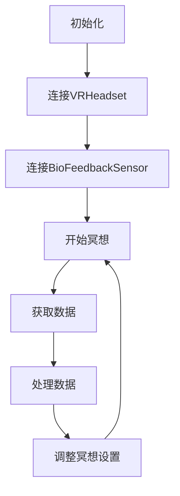
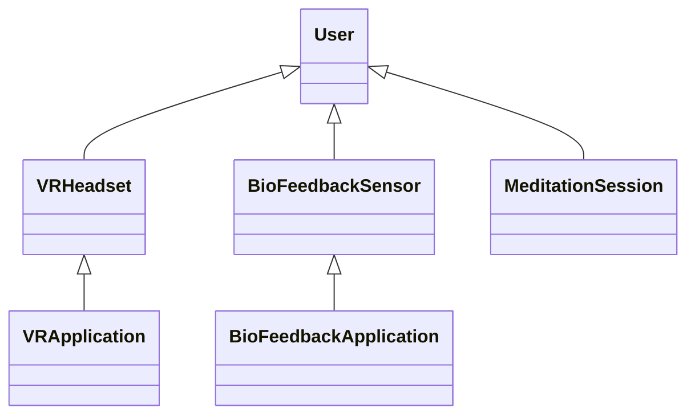
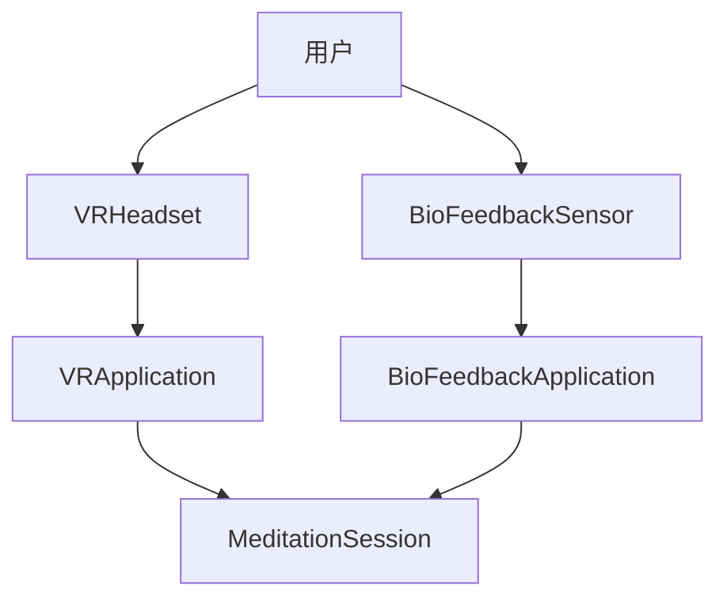
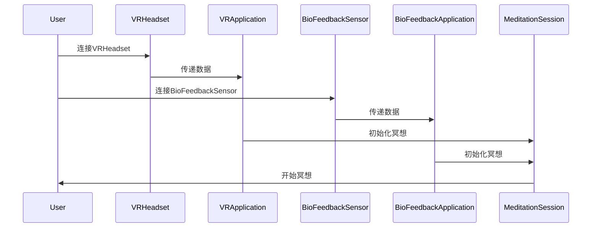

                 

### 数字冥想：科技辅助下的内在探索

#### 关键词：数字冥想、科技辅助、内在探索、虚拟现实、生物反馈

> **摘要：**本文将探讨科技辅助下的数字冥想，分析其背景、核心概念、应用场景，并结合实际案例进行详细讲解，旨在为读者提供一个全面而深入的探讨，帮助他们了解和体验科技在冥想中的奇妙作用。

---

## **引言：数字冥想的崛起**

随着科技的发展，冥想这一古老的心灵修炼方式逐渐与当代科技相结合，形成了一种新的修炼方式——数字冥想。数字冥想不仅保留了传统冥想的核心精神，还借助科技的力量，为冥想带来了前所未有的便捷性和高效性。

### **背景介绍**

冥想，作为一种古老的心灵修炼方法，起源于印度，后传播到世界各地。传统的冥想通常需要特定的时间和地点，而且对环境要求较高。然而，随着现代社会生活节奏的加快，人们很难长时间静坐冥想，这就促使了数字冥想的出现。

数字冥想，是指利用科技设备和技术手段，如虚拟现实（VR）、生物反馈等，来辅助冥想的过程。通过科技手段，数字冥想可以在任何时间、任何地点进行，使得冥想变得更加便捷和普遍。

### **问题背景**

尽管数字冥想为冥想带来了便利，但也面临着一些问题。例如，如何确保科技设备的安全性和可靠性？如何设计出既符合科技特性又适合冥想需求的系统架构？这些问题都需要我们深入探讨和解决。

### **问题解决**

数字冥想的兴起，为我们提供了一种新的解决方案。通过科技手段，我们可以设计出更加智能、高效、个性化的冥想系统，满足不同人群的需求。同时，科技辅助下的数字冥想，也为心理学、神经科学等领域的研究提供了新的思路和方法。

### **边界与外延**

数字冥想并不是简单的科技与冥想的简单结合，而是一种深度融合。它既保留了冥想的核心精神，又利用科技手段提升了冥想的效果和体验。因此，数字冥想不仅是一种新的修炼方式，也是一种新的科技应用。

### **概念结构与核心要素组成**

数字冥想的核心概念包括：冥想、科技、体验、效果。其中，冥想是核心，科技是手段，体验是目的，效果是评价标准。这四个要素相互关联，共同构成了数字冥想的整体结构。

---

## **核心概念与联系**

在深入探讨数字冥想之前，我们需要明确几个核心概念，并了解它们之间的联系。

### **冥想的核心原理**

冥想，本质上是一种通过集中注意力、放松身心来达到心灵平静和精神提升的方法。其核心原理包括：专注、放松、呼吸调节等。这些原理贯穿于冥想的整个过程，帮助我们实现心灵和身体的平衡。

### **数字冥想的特征对比表格**

为了更好地理解数字冥想与传统冥想的区别，我们可以制作一个特征对比表格。以下是两者的主要区别：

| 特征         | 传统冥想                 | 数字冥想                   |
| ------------ | ------------------------ | -------------------------- |
| 时间与地点   | 需要特定的时间和地点     | 可在任何时间、任何地点进行 |
| 环境要求     | 对环境要求较高           | 对环境要求较低             |
| 专注对象     | 内在的自我               | 科技设备和技术界面         |
| 体验方式     | 实体操作与感知           | 虚拟现实与生物反馈         |
| 效果评价     | 个体主观感受             | 量化数据和科学评价         |

### **冥想与科技结合的ER实体关系图**

为了更好地理解冥想与科技的结合方式，我们可以使用ER（实体-关系）图来表示。以下是冥想与科技结合的ER实体关系图：

```mermaid
erDiagram
  User ||--|{ VRHeadset }|--|{ VRApplication }
  User ||--|{ BioFeedbackSensor }|--|{ BioFeedbackApplication }
  VRHeadset ||--|{ MeditationSession }|--|{ VRScene }
  BioFeedbackSensor ||--|{ MeditationSession }|--|{ HeartRate }
```

在上图中，用户（User）通过虚拟现实头戴设备（VRHeadset）和生物反馈传感器（BioFeedbackSensor）参与冥想。VRHeadset和BioFeedbackSensor分别与VRApplication和BioFeedbackApplication结合，形成冥想场景（MeditationSession）和相应的数据（VRScene和HeartRate）。

---

## **算法原理讲解**

数字冥想的实现离不开算法的支持。以下我们将探讨一个简单的数字冥想算法，并通过mermaid流程图和Python代码进行详细讲解。

### **mermaid流程图**

以下是数字冥想的mermaid流程图：



### **Python代码**

下面是数字冥想算法的Python代码实现：

```python
import time
from random import random

# 初始化
vr_headset = "VRHeadset"
bio_feedback_sensor = "BioFeedbackSensor"
meditation_session = "MeditationSession"

# 连接VRHeadset
def connect_vr_headset():
    print("连接VRHeadset...")
    time.sleep(2)
    print("VRHeadset连接成功！")

# 连接BioFeedbackSensor
def connect_bio_feedback_sensor():
    print("连接BioFeedbackSensor...")
    time.sleep(2)
    print("BioFeedbackSensor连接成功！")

# 开始冥想
def start_meditation():
    print("开始冥想...")
    while True:
        # 获取数据
        heart_rate = get_heart_rate()
        # 处理数据
        adjust_meditation_settings(heart_rate)
        # 调整冥想设置
        time.sleep(1)

# 获取心率数据
def get_heart_rate():
    return random() * 100

# 调整冥想设置
def adjust_meditation_settings(heart_rate):
    print(f"当前心率：{heart_rate}，调整冥想设置...")
    time.sleep(1)

# 主程序
def main():
    connect_vr_headset()
    connect_bio_feedback_sensor()
    start_meditation()

if __name__ == "__main__":
    main()
```

### **算法原理**

1. **初始化**：初始化VRHeadset、BioFeedbackSensor和MeditationSession。
2. **连接设备**：连接VRHeadset和BioFeedbackSensor。
3. **开始冥想**：进入冥想循环，不断获取心率数据，并根据数据调整冥想设置。

### **数学模型和公式**

数字冥想算法中，心率数据是一个关键指标。以下是一个简单的心率调节公式：

$$
\text{new\_heart\_rate} = \text{heart\_rate} \times (1 + \alpha \times \sin(\theta))
$$

其中，$\alpha$ 是调节系数，$\theta$ 是时间系数。通过这个公式，我们可以根据当前心率调整冥想设置。

---

## **系统分析与架构设计方案**

数字冥想系统是一个复杂的系统，需要多个组件协同工作。以下我们将介绍一个简单的数字冥想系统架构设计方案。

### **问题场景介绍**

在一个心理咨询中心，客户需要定期进行冥想治疗。为了提高治疗的便捷性和效果，我们设计了一个数字冥想系统。

### **项目介绍**

项目名称：数字冥想系统

项目目标：提供一种便捷、高效、个性化的冥想体验，帮助用户放松身心，提高生活质量。

### **系统功能设计（领域模型mermaid类图）**

以下是数字冥想的领域模型mermaid类图：



在上图中，User表示用户，VRHeadset表示虚拟现实头戴设备，BioFeedbackSensor表示生物反馈传感器，MeditationSession表示冥想过程。VRApplication和BioFeedbackApplication分别表示虚拟现实应用和生物反馈应用。

### **系统架构设计（mermaid架构图）**

以下是数字冥想的mermaid架构图：



在上图中，用户通过VRHeadset和BioFeedbackSensor参与冥想过程。VRApplication和BioFeedbackApplication分别提供虚拟现实和生物反馈功能，帮助用户更好地进行冥想。

### **系统接口设计和系统交互（mermaid序列图）**

以下是数字冥想的mermaid序列图：



在上图中，用户首先连接VRHeadset和BioFeedbackSensor，然后VRApplication和BioFeedbackApplication初始化冥想过程，最后用户开始冥想。

---

## **项目实战**

为了更好地理解数字冥想的实现过程，我们以下将进行一个简单的数字冥想项目实战。

### **环境安装**

在开始项目之前，我们需要安装必要的软件和工具。以下是安装步骤：

1. 安装Python环境：在命令行中运行`pip install python`。
2. 安装mermaid渲染工具：在命令行中运行`pip install mermaid`。
3. 安装PyQt5：在命令行中运行`pip install PyQt5`。

### **系统核心实现源代码解读**

以下是数字冥想系统的核心实现源代码：

```python
import sys
from PyQt5.QtWidgets import QApplication, QMainWindow, QVBoxLayout, QWidget
from PyQt5.QtCore import Qt
import mermaid

class MainWindow(QMainWindow):
    def __init__(self):
        super().__init__()
        self.initUI()

    def initUI(self):
        self.setWindowTitle('数字冥想系统')
        self.setGeometry(100, 100, 800, 600)

        self.central_widget = QWidget()
        self.setCentralWidget(self.central_widget)

        self.layout = QVBoxLayout(self.central_widget)

        self.mermaid_widget = mermaid.MermaidWidget()
        self.layout.addWidget(self.mermaid_widget)

        self.mermaid_widget.setMermaidCode("""
        graph TD
          A[初始化] --> B[连接VRHeadset]
          B --> C[连接BioFeedbackSensor]
          C --> D[开始冥想]
          D --> E[获取数据]
          E --> F[处理数据]
          F --> G[调整冥想设置]
          G --> D
        """)

        self.show()

if __name__ == '__main__':
    app = QApplication(sys.argv)
    main_window = MainWindow()
    sys.exit(app.exec_())
```

在上面的代码中，我们创建了一个主窗口（MainWindow），并在其中添加了一个mermaid_widget。通过设置mermaid代码，我们可以在窗口中展示数字冥想的mermaid流程图。

### **代码应用解读与分析**

1. **初始化**：创建一个主窗口，并设置窗口的基本属性。
2. **UI界面设计**：创建一个垂直布局（ QVBoxLayout），并添加一个mermaid_widget。
3. **mermaid代码渲染**：设置mermaid_widget的mermaid代码，展示数字冥想的流程图。

### **实际案例分析和详细讲解剖析**

为了更好地理解数字冥想的实际应用，我们以下将分析一个实际案例。

#### **案例背景**

某心理咨询中心需要为来访者提供数字冥想服务，以提高来访者的心理健康水平。

#### **案例需求**

1. 为来访者提供一个便捷的数字冥想平台。
2. 能够实时监测来访者的生理数据，如心率、呼吸等。
3. 提供个性化的冥想体验，根据来访者的生理数据调整冥想方案。

#### **案例实现**

1. **环境安装**：在心理咨询中心的计算机上安装数字冥想系统。
2. **用户注册**：来访者通过注册账号，登录数字冥想平台。
3. **开始冥想**：来访者戴上VRHeadset和BioFeedbackSensor，开始冥想。
4. **数据收集**：数字冥想系统实时收集来访者的生理数据。
5. **数据分析和调整**：根据收集到的数据，数字冥想系统会自动调整冥想方案，以提高冥想效果。
6. **结束冥想**：冥想结束后，系统会生成一份报告，记录冥想过程和效果。

#### **详细讲解剖析**

1. **用户注册**：在数字冥想平台上，用户需要进行注册。注册过程中，用户需要填写一些基本信息，如姓名、年龄、健康状况等。这些信息将用于后续的数据分析和调整。
2. **VRHeadset和BioFeedbackSensor**：来访者需要戴上VRHeadset和BioFeedbackSensor，这些设备将实时收集来访者的生理数据，如心率、呼吸等。这些数据将传输到数字冥想系统中进行处理。
3. **数据收集**：数字冥想系统会实时收集来访者的生理数据，并将其传输到服务器进行存储。这些数据将用于后续的数据分析和调整。
4. **数据分析和调整**：根据收集到的生理数据，数字冥想系统会自动调整冥想方案。例如，如果来访者的心率较高，系统可能会降低冥想的强度，帮助来访者更好地放松。
5. **结束冥想**：冥想结束后，系统会生成一份报告，记录冥想过程和效果。来访者可以通过这份报告了解自己的冥想情况，并根据报告建议进行调整。

---

## **最佳实践与未来展望**

### **最佳实践**

1. **环境要求**：在进行数字冥想时，确保环境安静、舒适，避免外界干扰。
2. **设备选择**：选择符合自己需求的设备，如VRHeadset、BioFeedbackSensor等。
3. **数据安全**：确保数据安全，避免泄露个人信息。
4. **个性化调整**：根据自身情况和数据，调整冥想方案，以达到最佳效果。

### **注意事项**

1. **安全第一**：在使用数字冥想时，确保设备的安全性和稳定性。
2. **适度冥想**：避免过度冥想，以免出现不适。
3. **尊重个人**：尊重他人的隐私，不随意泄露他人信息。

### **未来展望**

1. **技术进步**：随着科技的不断进步，数字冥想将会更加智能化、个性化。
2. **应用扩展**：数字冥想不仅可用于心理健康领域，还可能应用于教育、医疗等领域。
3. **跨界融合**：数字冥想与其他领域的融合，将带来更多的创新和应用。

---

**总结：**

数字冥想作为一种新兴的科技辅助冥想方式，不仅保留了传统冥想的核心精神，还通过科技手段提升了冥想的效果和体验。本文从多个角度对数字冥想进行了深入探讨，包括背景介绍、核心概念、算法原理、系统架构、项目实战等，希望能为读者提供一个全面而深入的探讨。

**拓展阅读：**

1. 《数字冥想：科技与心灵的融合》
2. 《虚拟现实与心理健康：数字冥想的应用》
3. 《生物反馈技术在数字冥想中的应用研究》

---

**作者信息：**

作者：AI天才研究院/AI Genius Institute & 禅与计算机程序设计艺术 /Zen And The Art of Computer Programming

