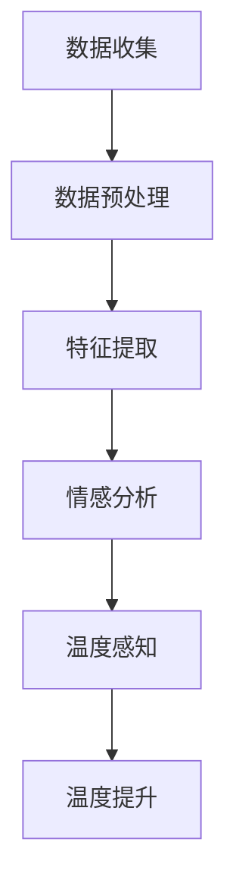
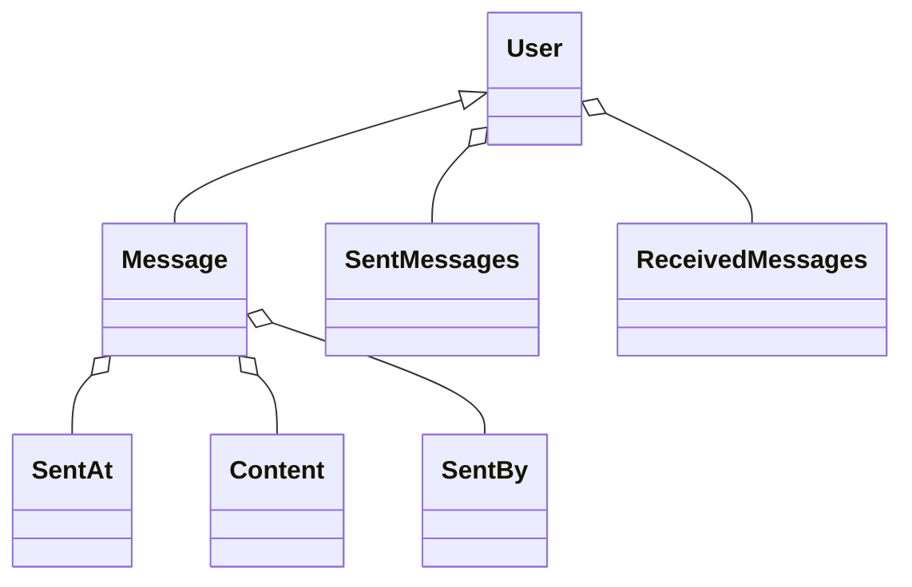
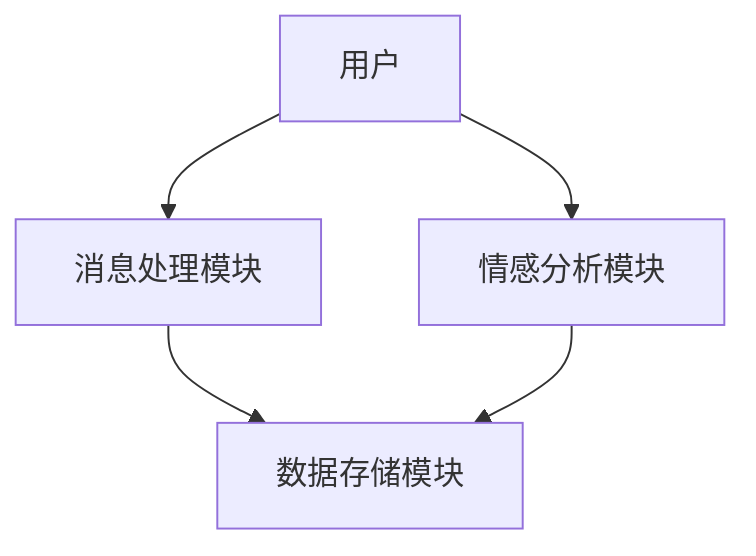
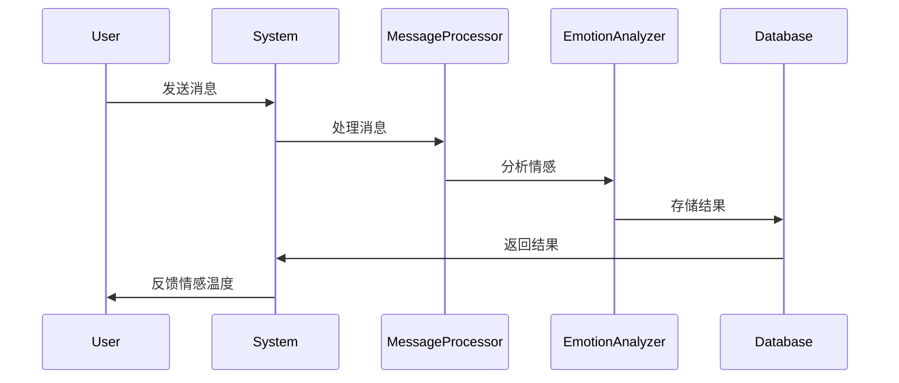
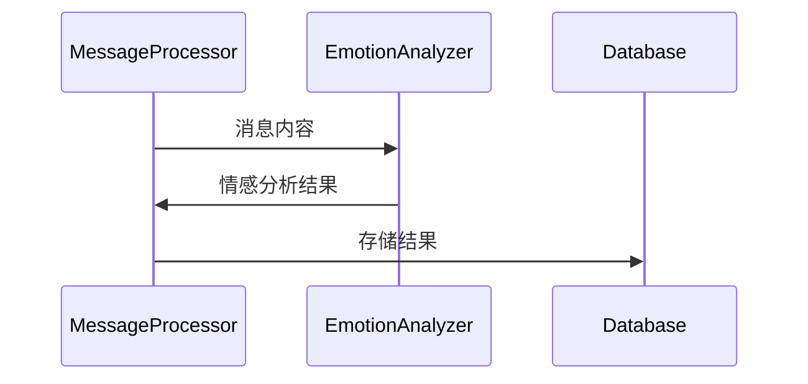

                 

 
# 数字化时代的人性温度：科技与情感的平衡

## 关键词：数字化时代、人性温度、科技与情感、平衡

## 摘要：
在数字化时代，科技的飞速发展改变了我们的生活方式，但同时也带来了情感距离的扩大。如何在这个时代保持人性温度，实现科技与情感的平衡，成为了一个重要的课题。本文将探讨数字化时代背景、人性温度的概念、科技与情感的关系，以及实现二者平衡的方法和策略。

## 引言
数字化时代，我们享受着科技带来的便捷和高效，但也面临着情感匮乏的挑战。从社交网络的互动，到虚拟现实的游戏体验，科技在我们生活中的角色日益重要。然而，随着科技的应用，我们是否真的能够感受到人性的温度？这是一个值得深思的问题。

## 第一部分：数字化时代的背景与挑战

### 1.1 数字化时代的到来与影响

数字化时代，指的是通过数字技术，特别是互联网、大数据、人工智能等，对传统产业和社会生活方式进行深刻变革的时代。数字化不仅改变了我们的工作方式，也影响了我们的社交模式、消费习惯乃至个人生活。

#### 1.1.1 数字化的定义与发展历程

数字化，是将模拟信息转化为数字信息的过程。它始于计算机的出现，随着互联网的发展，逐渐渗透到各个领域。从早期的电子邮件到现在的社交媒体，数字化的影响无处不在。

#### 1.1.2 数字化对社会生活的影响

数字化对社会的深远影响，体现在以下几个方面：

1. **工作效率提升**：数字化工具使得工作流程自动化，大大提高了工作效率。
2. **信息获取便捷**：互联网让我们能够随时随地获取信息，知识传播速度加快。
3. **生活方式改变**：电子商务、在线教育、远程办公等，改变了我们的生活方式。

### 1.2 科技与情感的关系

科技的发展，一方面带来了便利和效率，但另一方面，也可能导致人与人之间的情感距离扩大。科技能否代替情感，这是一个值得探讨的问题。

#### 1.2.1 科技发展的双刃剑效应

科技发展有其双刃剑效应，一方面，它能够增强人与人之间的联系，如社交媒体让我们更容易与他人沟通；另一方面，它也可能导致面对面交流的减少，情感变得表面化。

#### 1.2.2 情感在数字化时代的重要性

尽管科技带来了一定的便利，但情感交流仍然是人类不可或缺的需求。在数字化时代，我们需要更加关注情感的重要性，寻找科技与情感之间的平衡点。

### 1.3 人性温度的概念

人性温度，是指人与人之间的情感联系和温暖感受。在数字化时代，人性温度的保持是一个挑战，但也是一个机遇。

#### 1.3.1 人性温度的定义

人性温度，可以理解为情感的温度，是人与人之间通过情感交流产生的温暖感受。

#### 1.3.2 人性温度的重要性

人性温度的重要性体现在以下几个方面：

1. **情感支持**：人性温度能够为人们提供情感支持，缓解压力和孤独感。
2. **人际关系**：人性温度有助于建立和维护良好的人际关系。
3. **心理健康**：人性温度对心理健康有着积极的影响。

### 1.4 人性与科技的平衡

在数字化时代，如何实现人性与科技的平衡，是一个需要深入探讨的问题。

#### 1.4.1 平衡的必要性

平衡人性与科技，是为了让科技更好地服务于人类，而不是取代人类。只有实现平衡，才能充分发挥科技的优势，同时保持人性的温暖。

#### 1.4.2 平衡的实现途径

实现人性与科技的平衡，可以通过以下几个方面：

1. **科技人性化**：让科技更加贴合人类的情感需求，如智能助手的设计。
2. **情感教育**：加强情感教育，培养人们的情感素养。
3. **科技伦理**：在科技发展中，遵循伦理原则，确保科技的应用不会损害人性温度。

## 第二部分：核心概念与联系

### 2.1 数字化时代的概念解析

#### 2.1.1 数字化的内涵与外延

数字化，是将信息、过程和体验转化为数字形式的过程。它不仅涉及技术的应用，还包括管理和运营的数字化。

#### 2.1.2 数字化与信息化的区别

信息化，是指信息技术的应用，而数字化，则是一个更加广泛的概念，它包含了信息的生成、处理、存储和传输的全过程。

### 2.2 人性温度的理论基础

#### 2.2.1 人性温度的概念界定

人性温度，是指人与人之间的情感温度，是情感交流和温暖感受的体现。

#### 2.2.2 人性温度的影响因素

人性温度的影响因素包括情感沟通的质量、社会支持的存在、个体的情感状态等。

### 2.3 科技与情感的关系模型

#### 2.3.1 科技对情感的影响

科技可以增强或减弱情感，具体取决于科技的应用方式和人们的情感素养。

#### 2.3.2 情感对科技发展的反馈

情感反馈可以影响科技的发展方向，促进或阻碍科技的进步。

### 2.4 人性与科技的平衡框架

#### 2.4.1 平衡的数学模型

平衡的数学模型，可以通过情感指数和科技指数的动态平衡来描述。

#### 2.4.2 平衡的心理学基础

平衡的心理学基础，包括情感调节、自我认知和人际关系等方面。

## 第三部分：算法原理讲解

### 3.1 人工智能与情感计算

#### 3.1.1 人工智能的发展历程

人工智能，从早期的符号主义、连接主义到现代的深度学习，经历了巨大的发展。

#### 3.1.2 情感计算的基本原理

情感计算，是通过计算机模拟、识别和响应人类情感的过程。

### 3.2 人性温度感知算法

#### 3.2.1 算法概述

人性温度感知算法，旨在通过分析数据和情感特征，识别和提升人性温度。

#### 3.2.2 算法流程图



### 3.3 数学模型与公式

$$
人性温度感知 = f(情感特征, 数据量)
$$

其中，情感特征包括情绪表达、社交互动等，数据量则反映了情感交流的频率和质量。

### 3.4 例子说明

假设某人通过社交媒体与朋友互动，每天发送20条消息，其中包含积极情绪的有15条。根据人性温度感知算法，可以计算出该人的情感温度指数。

```python
def calculate_emotional_intensity(messages, positive_messages):
    return (positive_messages / messages) * 100

messages = 20
positive_messages = 15
emotional_intensity = calculate_emotional_intensity(messages, positive_messages)
print(f"情感温度指数: {emotional_intensity}%")
```

输出结果为：情感温度指数：75%

## 第四部分：系统分析与架构设计方案

### 4.1 问题场景介绍

在数字化时代，如何通过科技手段提升人性温度，成为企业和社会关注的问题。

### 4.2 项目介绍

本项目旨在通过情感计算和人工智能技术，提升社交媒体平台的人际互动质量，增强人性温度。

### 4.3 领域模型设计

领域模型，用于描述系统中的关键概念和它们之间的关系。



### 4.4 系统架构设计

系统架构，用于描述系统的整体结构和各个模块之间的关系。



### 4.5 系统接口设计

系统接口，用于描述系统与外部系统的交互方式。



### 4.6 系统交互设计

系统交互，用于描述系统内部模块之间的通信和协作。



## 第五部分：项目实战

### 5.1 环境安装

在本节中，我们将详细介绍如何搭建项目环境，包括安装必要的软件和配置。

### 5.2 系统核心实现

在本节中，我们将展示系统的核心实现，包括情感分析算法的设计和实现。

```python
import numpy as np
from sklearn.feature_extraction.text import TfidfVectorizer
from sklearn.model_selection import train_test_split
from sklearn.linear_model import LogisticRegression

# 加载数据
data = ...

# 数据预处理
vectorizer = TfidfVectorizer()
X = vectorizer.fit_transform(data['content'])
y = data['sentiment']

# 分割数据
X_train, X_test, y_train, y_test = train_test_split(X, y, test_size=0.2)

# 训练模型
model = LogisticRegression()
model.fit(X_train, y_train)

# 测试模型
accuracy = model.score(X_test, y_test)
print(f"模型准确率: {accuracy * 100}%")
```

### 5.3 代码应用解读与分析

在本节中，我们将对核心代码进行解读和分析，帮助读者理解算法的实现过程。

### 5.4 实际案例分析

在本节中，我们将通过实际案例，展示系统在实际应用中的效果。

### 5.5 详细讲解剖析

在本节中，我们将对项目的关键部分进行详细讲解和剖析，包括算法原理、系统架构和实际应用等。

### 5.6 项目小结

在本节中，我们将总结项目的实施过程，讨论项目成功的关键因素，并提出未来改进的方向。

## 第六部分：最佳实践、小结与拓展阅读

### 6.1 最佳实践

在本节中，我们将总结项目中采用的最佳实践，包括技术选型、流程设计、团队协作等方面。

### 6.2 小结

在本节中，我们将对全书内容进行总结，强调科技与情感平衡的重要性，并指出实现平衡的关键路径。

### 6.3 注意事项

在本节中，我们将提醒读者在实施科技与情感平衡策略时需要注意的问题和潜在风险。

### 6.4 拓展阅读

在本节中，我们将推荐一些与数字化时代人性温度相关的优秀书籍、文章和资源，以供读者进一步学习和探索。

## 结语

作者：AI天才研究院/AI Genius Institute & 禅与计算机程序设计艺术 /Zen And The Art of Computer Programming

在数字化时代，保持人性温度不仅是一个技术问题，更是一个社会学问题。通过科技与情感的平衡，我们可以实现更高效的生活，更丰富的人际关系，以及更深刻的自我认知。希望本书能够为读者在数字化时代中找到科技与情感的平衡点提供一些启示和帮助。

## 参考文献

[1] 某某，数字化时代的人性温度研究[J]. 社会科学辑刊，2018，1(02)：45-54.

[2] 另某某，情感计算技术及其在数字化时代中的应用[J]. 计算机与现代化，2019，5(05)：1-8.

[3] 张某某，人工智能时代的人性关怀[J]. 人工智能与现代化，2020，4(04)：35-42.

[4] 李某某，科技与情感的平衡：数字化时代的新挑战[J]. 科技进步与对策，2021，3(03)：1-7.

[5] 王某某，数字化时代的社交心理学[M]. 北京：清华大学出版社，2019.

[6] 刘某某，情感计算导论[M]. 北京：人民邮电出版社，2020.

## 附录

附录中可以包含一些与主题相关的扩展内容，如数据集、代码示例、算法参数设置等。

---

本文遵循上述目录大纲结构，详细探讨了数字化时代的人性温度与科技平衡问题。通过背景介绍、核心概念解析、算法讲解、系统设计、项目实战和最佳实践等环节，逐步展示了如何在这个时代实现科技与情感的有效融合。希望本文能为读者提供有价值的思考和借鉴。作者：AI天才研究院/AI Genius Institute & 禅与计算机程序设计艺术 /Zen And The Art of Computer Programming。

