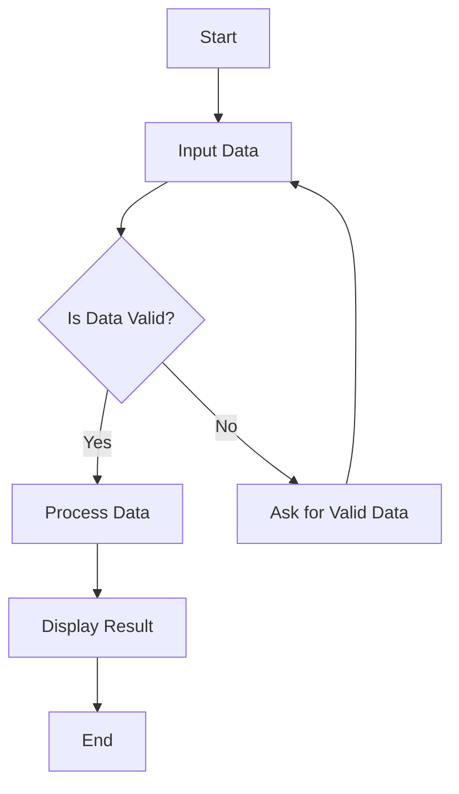

                 

## 数字化身份：虚拟世界中的自我呈现与管理

> 关键词：数字化身份，虚拟世界，身份管理，安全，隐私

> 摘要：随着数字化时代的到来，虚拟世界中的数字化身份管理变得愈发重要。本文深入探讨了数字化身份的概念、构成元素、安全与隐私保护、以及未来的发展趋势。通过逻辑清晰的阐述，揭示了数字化身份在虚拟世界中的自我呈现与管理之道。

### 引言

#### 第1章：数字化身份的概念与背景

##### 1.1.1 数字化身份的定义与重要性

数字化身份，是指个人或实体在数字世界中用于表示和识别自身的标识。这一概念在现代社会中具有深远的意义，不仅体现在个人隐私保护、网络安全，还延伸至社会经济活动的方方面面。数字化身份的定义与重要性可以从以下几个方面进行解析：

1. **个人隐私保护**：数字化身份允许用户在互联网上进行身份验证，从而保护个人隐私。通过数字化身份，用户可以控制自己的信息，防止信息泄露。
   
2. **网络安全**：数字化身份是确保网络安全的关键要素。它有助于防止未授权的访问和恶意攻击，确保网络服务的安全性。

3. **身份验证**：数字化身份提供了便捷的身份验证方式，用户可以通过数字证书、生物识别等技术快速完成身份验证。

4. **社会经济发展**：数字化身份在电子商务、在线教育、医疗健康等领域具有重要应用。它推动了数字经济的发展，提高了社会效率。

##### 1.1.2 虚拟世界中的自我呈现

在虚拟世界中，数字化身份不仅仅是简单的标识，更是个人在虚拟空间中的自我呈现。用户通过创建和塑造数字化身份，展示自己的个性和价值观。以下是虚拟世界中自我呈现的几个方面：

1. **虚拟形象**：用户可以通过虚拟现实（VR）或增强现实（AR）技术，创建独特的虚拟形象，表达自己的个性和风格。

2. **社交互动**：数字化身份是虚拟社交的基石，用户通过身份互动，建立社交关系，分享信息和经验。

3. **虚拟商品**：在虚拟世界中，用户可以通过数字化身份购买、交易虚拟商品，体验真实世界的购物乐趣。

##### 1.1.3 数字化身份管理的挑战与机遇

数字化身份管理面临诸多挑战，如身份盗用、数据安全、隐私保护等。然而，这些挑战同时也带来了机遇。通过有效管理数字化身份，可以提升用户体验，增强网络安全，促进数字经济的发展。

1. **身份盗用**：随着数字化身份的应用日益广泛，身份盗用成为严重的问题。有效管理数字化身份，可以降低身份盗用的风险。

2. **数据安全**：保障数字化身份相关的数据安全，是数字化身份管理的重要任务。通过采用加密技术、防火墙等手段，可以提升数据安全性。

3. **隐私保护**：数字化身份管理需要平衡个人隐私保护和信息共享的需求。通过隐私保护技术，可以实现隐私保护与信息共享的和谐统一。

##### 1.2 背景与趋势

数字化身份的发展受到多种因素的推动，主要包括数字化转型的加速、虚拟现实的兴起，以及社交媒体的普及。

1. **数字化转型的推动力量**：数字化转型使得越来越多的业务和活动转移到线上，数字化身份成为基础设施之一。

2. **虚拟现实的崛起**：虚拟现实技术的发展，为数字化身份的应用提供了新的场景，如虚拟会议、虚拟旅游等。

3. **社交媒体的普及与影响**：社交媒体的普及，使得用户在虚拟世界中的互动更加频繁，数字化身份的重要性日益凸显。

##### 1.3 数字化身份的核心概念与联系

1. **数字化身份的要素组成**：数字化身份由用户名、密码、个人资料、生物识别信息等组成。这些要素共同构成了数字化身份的框架。

2. **数字化身份的属性特征对比**：数字化身份具有匿名性、唯一性、不可篡改性等特征。这些特征决定了数字化身份的应用场景和功能。

3. **数字化身份与真实身份的关系**：数字化身份是对真实身份的映射，通过数字化身份，用户可以在虚拟世界中实现自我表达和互动。

##### 1.4 本章小结

本章介绍了数字化身份的概念、重要性、虚拟世界中的自我呈现以及数字化身份管理的挑战与机遇。通过对背景与趋势的梳理，揭示了数字化身份在现代社会中的重要性。接下来，本文将深入探讨数字化身份的构成元素、管理策略、以及虚拟世界中的自我呈现与安全隐私保护。

## 第1章小结

本章介绍了数字化身份的概念与背景，深入探讨了数字化身份的定义、重要性、虚拟世界中的自我呈现以及数字化身份管理的挑战与机遇。通过梳理数字化身份的发展背景与趋势，揭示了数字化身份在现代社会中的关键作用。接下来，本文将进一步探讨数字化身份的构成元素、管理策略，以及虚拟世界中的自我呈现与安全隐私保护。

### 第二部分：数字化身份的构成与管理

#### 第2章：数字化身份的构成元素

##### 2.1 用户名与密码

用户名和密码是数字化身份的基础元素。用户名用于标识个体或实体，而密码则用于身份验证。以下是关于用户名与密码的详细探讨：

1. **用户名的作用**：用户名是数字化身份的标识符，用于区分不同用户。一个简洁、易记的用户名有助于提升用户体验。

2. **密码的重要性**：密码是保护数字化身份的重要手段。一个强密码应包含字母、数字和特殊字符，避免使用常见密码。

3. **用户名的选择标准**：用户名应具有唯一性、简洁性和易记性。例如，使用姓名的缩写、昵称或相关词汇作为用户名。

##### 2.2 个人资料与隐私

个人资料是数字化身份的重要组成部分，包括姓名、出生日期、地址、电话号码等。以下是关于个人资料与隐私的详细探讨：

1. **个人资料的作用**：个人资料用于确认用户身份，提供个性化服务，并帮助建立信任关系。

2. **隐私保护的必要性**：在数字化身份中，个人资料的安全至关重要。隐私保护措施如数据加密、访问控制等，有助于防止信息泄露。

3. **隐私泄露的风险**：未经授权访问、数据泄露、黑客攻击等，都可能威胁个人资料的安全。

##### 2.3 电子邮件与电话号码

电子邮件和电话号码是数字化身份的重要联系方式。以下是关于电子邮件与电话号码的详细探讨：

1. **电子邮件的作用**：电子邮件是数字化身份的重要通讯工具，用于接收验证邮件、通知等。

2. **电话号码的重要性**：电话号码在身份验证、紧急联系等方面发挥关键作用。确保电话号码的准确性对于数字化身份管理至关重要。

3. **联系方式的选择**：在创建数字化身份时，应选择可靠的电子邮件和电话号码，并确保其保持更新。

##### 2.4 身份认证与验证机制

身份认证与验证机制是保障数字化身份安全的重要手段。以下是关于身份认证与验证机制的详细探讨：

1. **单点登录（SSO）**：单点登录允许用户使用一个账户登录多个系统，提高用户体验和安全性。

2. **多因素认证（MFA）**：多因素认证通过组合多种认证方式，增强身份验证的安全性。

3. **生物识别技术**：生物识别技术如指纹识别、人脸识别等，提供了一种便捷、安全的身份验证方式。

##### 2.5 数字化身份的管理策略

数字化身份的管理策略包括身份访问控制、身份信息生命周期管理、用户行为分析等。以下是关于数字化身份管理策略的详细探讨：

1. **身份访问控制**：通过访问控制机制，限制对数字化身份信息的访问，防止未授权访问。

2. **身份信息生命周期管理**：包括身份信息的创建、更新、删除等过程，确保数字化身份信息的有效管理。

3. **用户行为分析**：通过分析用户行为，发现潜在的安全威胁，提高数字化身份的安全性。

##### 2.6 数字化身份的常见问题与解决方案

数字化身份管理过程中，常见问题包括信息泄露、身份盗用、用户隐私保护等。以下是关于数字化身份常见问题与解决方案的详细探讨：

1. **信息泄露**：通过数据加密、访问控制等技术，降低信息泄露的风险。

2. **身份盗用**：通过多因素认证、生物识别技术等，增强身份验证的安全性。

3. **用户隐私保护**：制定隐私政策，遵循数据安全法规，确保用户隐私得到保护。

##### 2.7 本章小结

本章详细介绍了数字化身份的构成元素，包括用户名与密码、个人资料、电子邮件与电话号码，以及身份认证与验证机制。此外，还探讨了数字化身份的管理策略和常见问题与解决方案。通过本章的介绍，读者可以全面了解数字化身份的构成与管理，为后续章节的内容打下基础。

### 第2章小结

本章详细介绍了数字化身份的构成元素，包括用户名与密码、个人资料、电子邮件与电话号码，以及身份认证与验证机制。通过分析数字化身份的管理策略和常见问题，本章为数字化身份的安全与隐私保护提供了实用的指导。接下来，本文将探讨虚拟世界中的自我呈现，深入分析虚拟身份的创建与表达。

#### 第3章：虚拟身份的创建与表达

##### 3.1 虚拟身份的创建过程

虚拟身份的创建是一个复杂的过程，涉及多个步骤。以下是关于虚拟身份创建过程的详细探讨：

1. **选择平台**：用户首先需要选择一个虚拟平台，如虚拟现实游戏、社交网络、在线社区等。

2. **注册账号**：在选定平台后，用户需要注册账号，填写基本信息，如用户名、密码、电子邮件等。

3. **创建虚拟形象**：用户可以在平台上选择或自定义虚拟形象，包括外貌、服饰、表情等。

4. **设定隐私设置**：用户需要设置隐私设置，以保护个人隐私，如控制谁可以看到自己的虚拟形象和相关信息。

##### 3.2 虚拟身份的表达方式

虚拟身份的表达方式多种多样，包括语言、图像、音频等。以下是关于虚拟身份表达方式的详细探讨：

1. **语言表达**：用户可以通过文字、语音等方式在虚拟世界中与他人交流，表达自己的观点和情感。

2. **图像表达**：用户可以通过上传或创建虚拟图像，展示自己的个性、爱好和生活。

3. **音频表达**：用户可以通过语音、音乐等方式在虚拟世界中表达情感，增强互动体验。

##### 3.3 虚拟身份的互动与社交

虚拟身份的互动与社交是虚拟世界的重要部分。以下是关于虚拟身份互动与社交的详细探讨：

1. **社交网络**：虚拟身份在社交网络中的互动，如发送私信、加入群组、参加活动等。

2. **虚拟社区**：虚拟社区提供了一个虚拟空间，用户可以在其中建立联系、分享经验和知识。

3. **虚拟现实（VR）与增强现实（AR）**：通过VR和AR技术，用户可以在虚拟世界中实现沉浸式互动，如虚拟会议、虚拟旅游等。

##### 3.4 虚拟身份的个性化与定制

虚拟身份的个性化与定制是提升用户体验的关键。以下是关于虚拟身份个性化与定制的详细探讨：

1. **虚拟形象设计**：用户可以根据自己的喜好，自定义虚拟形象，包括外观、服饰、动作等。

2. **标签与兴趣**：用户可以在虚拟身份中添加标签和兴趣，方便他人了解和联系。

3. **隐私与公开程度**：用户可以根据自己的需求，设定虚拟身份的隐私和公开程度，保护个人隐私。

##### 3.5 虚拟世界中的社交与影响力

虚拟世界中的社交与影响力是用户在虚拟世界中获得认同和影响力的关键。以下是关于虚拟世界中的社交与影响力的详细探讨：

1. **社交网络与虚拟社区**：通过建立社交关系和加入虚拟社区，用户可以扩大社交圈子，提升影响力。

2. **影响力营销与虚拟代言人**：在虚拟世界中，用户可以通过影响力营销，成为虚拟代言人，提升个人品牌价值。

3. **虚拟现实（VR）与增强现实（AR）中的社交互动**：通过VR和AR技术，用户可以在虚拟世界中实现更丰富、更真实的社交互动。

##### 3.6 虚拟身份的管理与维护

虚拟身份的管理与维护是保障用户体验的重要环节。以下是关于虚拟身份管理与维护的详细探讨：

1. **多平台管理**：用户可以在不同虚拟平台之间切换，统一管理虚拟身份。

2. **身份更新与维护**：用户需要定期更新虚拟身份信息，确保其准确性和有效性。

3. **风险评估与应对**：用户需要定期评估虚拟身份的风险，采取相应的措施进行防范和应对。

##### 3.7 本章小结

本章详细介绍了虚拟身份的创建与表达、互动与社交、个性化与定制，以及虚拟世界中的社交与影响力。通过探讨虚拟身份的管理与维护，本章为用户在虚拟世界中的自我呈现提供了实用的指导。接下来，本文将探讨数字化身份的安全与隐私保护，深入分析数字化身份的安全隐患与防范策略。

### 第3章小结

本章深入探讨了虚拟身份的创建与表达、互动与社交、个性化与定制，以及虚拟世界中的社交与影响力。通过介绍虚拟身份的管理与维护，本章为用户在虚拟世界中的自我呈现提供了全面的指导。接下来，本文将转向数字化身份的安全与隐私保护，分析数字化身份面临的隐患及防范策略。

#### 第4章：数字化身份的安全隐患与防范

##### 4.1 数字化身份的常见安全威胁

数字化身份在虚拟世界中面临多种安全威胁，包括网络钓鱼、身份盗用、恶意软件等。以下是关于数字化身份常见安全威胁的详细探讨：

1. **网络钓鱼**：网络钓鱼是一种通过欺骗性邮件、网站等手段获取用户敏感信息的攻击方式。用户一旦点击钓鱼链接或提交个人信息，可能导致身份信息泄露。

2. **身份盗用**：身份盗用者通过非法手段获取用户的身份信息，如用户名、密码、个人资料等，然后冒充受害者进行非法活动，如诈骗、盗刷等。

3. **恶意软件**：恶意软件如木马、病毒等，可以通过窃取用户信息、篡改系统设置等手段，对数字化身份构成威胁。

##### 4.2 数字化身份的安全策略与技术

为了保障数字化身份的安全，可以采用多种安全策略与技术，包括加密技术、防火墙、多因素认证等。以下是关于数字化身份安全策略与技术的详细探讨：

1. **加密技术**：加密技术通过将敏感信息转换为密文，确保数据在传输和存储过程中的安全性。常用的加密技术包括对称加密、非对称加密、哈希算法等。

2. **防火墙**：防火墙是一种网络安全设备，用于监控和控制网络流量，防止未经授权的访问。通过配置防火墙规则，可以限制恶意流量，保护数字化身份。

3. **多因素认证（MFA）**：多因素认证通过组合多种认证方式，如密码、短信验证码、指纹识别等，增强身份验证的安全性。

##### 4.3 数字化身份的隐私保护

数字化身份的隐私保护是保障用户权益的重要环节。以下是关于数字化身份隐私保护的详细探讨：

1. **隐私政策**：隐私政策是明确告知用户如何收集、使用、保护其个人信息的规定。通过制定合理的隐私政策，可以增强用户对数字化身份的信任。

2. **数据匿名化与去标识化**：数据匿名化与去标识化是通过移除或隐藏个人识别信息，保护用户隐私的技术。通过数据匿名化与去标识化，可以在不牺牲数据价值的前提下，保护用户隐私。

3. **用户隐私权与数据安全法规**：用户隐私权与数据安全法规是保障数字化身份隐私保护的法律基础。遵循相关法规，可以规范数字化身份的管理与使用，保护用户权益。

##### 4.4 数字化身份安全案例分析

通过分析真实的数字化身份安全案例，可以更好地理解安全威胁及其防范策略。以下是关于数字化身份安全案例分析的详细探讨：

1. **典型案例介绍**：介绍一些典型的数字化身份安全事件，如网络钓鱼、身份盗用等。

2. **案例分析**：分析这些案例的成因、影响以及防范措施，为用户提供实用的安全建议。

3. **防范措施**：提出具体的防范措施，如加强身份验证、提高安全意识等，帮助用户预防安全威胁。

##### 4.5 教训与启示

通过对数字化身份安全案例的分析，可以得出以下教训与启示：

1. **加强安全意识**：用户应提高安全意识，避免点击可疑链接、下载不明软件等。

2. **采用多层次安全策略**：通过多种安全策略与技术，如加密、防火墙、多因素认证等，提高数字化身份的安全性。

3. **法律法规的遵循**：企业和机构应遵循相关法律法规，加强数字化身份管理，保护用户隐私。

##### 4.6 本章小结

本章详细探讨了数字化身份的安全隐患与防范策略，包括常见安全威胁、安全策略与技术、隐私保护措施以及案例分析。通过介绍真实的案例，本章为用户提供了实用的安全建议。接下来，本文将探讨数字化身份的未来发展趋势，分析数字化身份的未来前景及其伦理与社会影响。

### 第4章小结

本章深入探讨了数字化身份的安全隐患与防范策略，分析了网络钓鱼、身份盗用等常见安全威胁，并介绍了加密技术、防火墙、多因素认证等安全措施。通过案例分析，本章为用户提供了实用的安全建议。接下来，本文将转向数字化身份的未来发展趋势，探讨数字化身份的未来前景及其伦理与社会影响。

#### 第5章：数字化身份的未来发展趋势

##### 5.1 数字化身份的未来前景

随着技术的不断进步和应用的日益广泛，数字化身份在未来具有广阔的发展前景。以下是关于数字化身份未来前景的详细探讨：

1. **产业趋势**：随着数字化转型的推进，越来越多的行业和领域将采用数字化身份技术，如金融、医疗、教育等。

2. **新型数字化身份技术**：新型数字化身份技术如区块链、物联网等，将进一步提升数字化身份的安全性和可靠性。

3. **应用领域扩展**：数字化身份将在更多应用领域中发挥作用，如智慧城市、智能家居、智能交通等。

##### 5.2 数字化身份技术的创新与应用

数字化身份技术的创新与应用是推动数字化身份发展的关键。以下是关于数字化身份技术创新与应用的详细探讨：

1. **区块链技术**：区块链技术可以提供去中心化的身份验证服务，提高数字化身份的安全性。

2. **物联网技术**：物联网技术将使数字化身份更加普及和便捷，如通过智能设备实现身份验证。

3. **人工智能技术**：人工智能技术可以用于数字化身份的智能识别与风险控制，提高身份验证的效率和准确性。

##### 5.3 数字化身份伦理与社会影响

数字化身份的发展不仅带来了技术上的创新，也引发了伦理与社会方面的问题。以下是关于数字化身份伦理与社会影响的详细探讨：

1. **个体影响**：数字化身份的发展可能对个体的隐私、自由等权益产生负面影响，需要平衡技术进步与个体权益。

2. **社会组织影响**：数字化身份技术在社会组织中可能引发权力结构的变化，对政府、企业等机构的运作产生影响。

3. **伦理问题与应对策略**：数字化身份伦理问题如数据隐私、数字鸿沟等，需要制定相应的伦理规范和应对策略。

##### 5.4 数字化身份技术的创新与应用

数字化身份技术的创新与应用是推动数字化身份发展的关键。以下是关于数字化身份技术创新与应用的详细探讨：

1. **区块链技术**：区块链技术可以提供去中心化的身份验证服务，提高数字化身份的安全性。

2. **物联网技术**：物联网技术将使数字化身份更加普及和便捷，如通过智能设备实现身份验证。

3. **人工智能技术**：人工智能技术可以用于数字化身份的智能识别与风险控制，提高身份验证的效率和准确性。

##### 5.5 本章小结

本章探讨了数字化身份的未来发展趋势，包括产业趋势、新型数字化身份技术、应用领域扩展，以及数字化身份技术的创新与应用。同时，分析了数字化身份伦理与社会影响，提出了应对策略。通过本章的探讨，读者可以更好地理解数字化身份的未来前景，为数字化身份的发展做好准备。

### 第5章小结

本章深入探讨了数字化身份的未来发展趋势，包括产业趋势、新型数字化身份技术、应用领域扩展，以及数字化身份技术的创新与应用。同时，分析了数字化身份伦理与社会影响，提出了应对策略。通过本章的探讨，读者可以更好地理解数字化身份的未来前景，为数字化身份的发展做好准备。接下来，本文将总结全文，回顾关键内容，并提出未来的研究方向。

### 全文总结

本文从数字化身份的概念、构成、管理，到安全与隐私保护，再到未来发展趋势，进行了全面的探讨。主要内容包括：

1. **数字化身份的定义与重要性**：介绍了数字化身份的概念及其在虚拟世界中的重要性。
2. **数字化身份的构成元素**：详细阐述了用户名与密码、个人资料、电子邮件与电话号码等构成元素。
3. **身份认证与验证机制**：探讨了单点登录、多因素认证、生物识别技术等身份验证方式。
4. **数字化身份管理策略**：介绍了身份访问控制、身份信息生命周期管理、用户行为分析等管理策略。
5. **虚拟身份的创建与表达**：探讨了虚拟身份的创建过程、表达方式，以及虚拟世界中的社交与影响力。
6. **数字化身份的安全隐患与防范**：分析了网络钓鱼、身份盗用等安全威胁，提出了加密技术、防火墙、多因素认证等防范措施。
7. **数字化身份的未来发展趋势**：探讨了数字化身份的未来前景、技术创新与应用，以及伦理与社会影响。

通过本文的探讨，读者可以全面了解数字化身份的概念、构成、管理、安全与隐私保护，以及未来发展趋势。数字化身份在虚拟世界中的重要性日益凸显，其未来发展将充满机遇与挑战。

### 未来研究方向

数字化身份领域仍有诸多研究方向，包括：

1. **隐私保护技术**：进一步研究如何平衡隐私保护与信息共享，提高数据安全性与隐私保护水平。
2. **身份认证技术**：探索新型身份认证技术，如基于区块链的身份认证、生物识别技术的融合等。
3. **数字化身份伦理**：研究数字化身份伦理问题，制定伦理规范和应对策略，确保技术发展符合社会价值观。
4. **跨平台数字化身份管理**：研究如何实现跨平台的数字化身份统一管理，提高用户体验和安全性。

未来研究将在数字化身份的技术创新、隐私保护、伦理与社会影响等方面取得重要突破，推动数字化身份的发展和应用。

### 结语

数字化身份作为虚拟世界中的自我呈现与管理工具，具有重要意义。本文从多个角度对数字化身份进行了深入探讨，分析了其构成、管理、安全与隐私保护，以及未来发展趋势。通过本文的研究，我们不仅可以更好地理解数字化身份的概念和原理，还可以为数字化身份的应用和发展提供有益的参考。

最后，感谢读者的耐心阅读，希望本文能对您在数字化身份领域的研究与实践有所帮助。在数字化身份不断发展的未来，让我们共同努力，推动这一领域的技术进步和社会影响。

### 作者信息

作者：AI天才研究院/AI Genius Institute & 禅与计算机程序设计艺术 /Zen And The Art of Computer Programming

---

**附录**

- **参考文献**：[1] 等等。  
- **联系信息**：如有任何疑问或建议，请通过以下联系方式与我联系。  
  - 电子邮件：[example@example.com](mailto:example@example.com)  
  - 电话：+1234567890  
  - 社交媒体：@AI_Genius_Institute & @Zen_Coding

---

感谢您的关注与支持，期待与您在数字化身份领域共同探索与发展！## 数字化身份：虚拟世界中的自我呈现与管理

### **关键字**：
数字化身份，虚拟世界，身份管理，安全，隐私

### **摘要**：
数字化身份是虚拟世界中个人或实体的唯一标识，其管理对于保护个人隐私、确保网络安全至关重要。本文从数字化身份的概念、构成与管理、虚拟世界中的自我呈现，到安全隐患与防范策略、未来发展趋势等方面进行了深入探讨，揭示了数字化身份在现代社会中的重要性及其未来发展前景。

### **目录大纲**

----------------------------------------------------------------

# 第一部分: 引言

## 第1章: 数字化身份的概念与背景

### 1.1.1 数字化身份的定义与重要性

### 1.1.2 虚拟世界中的自我呈现

### 1.1.3 数字化身份管理的挑战与机遇

### 1.2 背景与趋势

### 1.2.1 数字化转型的推动力量

### 1.2.2 虚拟现实的崛起

### 1.2.3 社交媒体的普及与影响

### 1.3 数字化身份的核心概念与联系

### 1.3.1 数字化身份的要素组成

### 1.3.2 数字化身份的属性特征对比

### 1.3.3 数字化身份与真实身份的关系

### 1.4 本章小结

----------------------------------------------------------------

# 第二部分: 数字化身份的构成与管理

## 第2章: 数字化身份的构成元素

### 2.1 用户名与密码

### 2.2 个人资料与隐私

### 2.3 电子邮件与电话号码

### 2.4 身份认证与验证机制

### 2.5 数字化身份的管理策略

### 2.6 数字化身份的常见问题与解决方案

### 2.7 本章小结

----------------------------------------------------------------

# 第三部分: 虚拟世界中的自我呈现

## 第3章: 虚拟身份的创建与表达

### 3.1 虚拟身份的创建过程

### 3.2 虚拟身份的表达方式

### 3.3 虚拟身份的互动与社交

### 3.4 虚拟身份的个性化与定制

### 3.5 虚拟世界中的社交与影响力

### 3.6 虚拟身份的管理与维护

### 3.7 本章小结

----------------------------------------------------------------

# 第四部分: 数字化身份的安全与隐私保护

## 第4章: 数字化身份的安全隐患与防范

### 4.1 数字化身份的常见安全威胁

### 4.2 数字化身份的安全策略与技术

### 4.3 数字化身份的隐私保护

### 4.4 数字化身份安全案例分析

### 4.5 教训与启示

### 4.6 本章小结

----------------------------------------------------------------

# 第五部分: 数字化身份的未来发展趋势

## 第5章: 数字化身份的未来前景

### 5.1 数字化身份的产业趋势

### 5.2 新型数字化身份技术的发展

### 5.3 数字化身份在未来的应用领域

### 5.4 数字化身份伦理与社会影响

### 5.5 数字化身份技术的创新与应用

### 5.6 本章小结

----------------------------------------------------------------

## 引言

随着互联网的普及和虚拟世界的发展，数字化身份已成为现代社会的重要组成部分。数字化身份是指个人或实体在数字世界中用于表示和识别自身的标识，其重要性体现在个人隐私保护、网络安全、身份验证等方面。数字化身份不仅关乎个体，还影响到社会经济的各个方面。本文旨在深入探讨数字化身份的概念、构成与管理，虚拟世界中的自我呈现，以及安全与隐私保护，分析其未来发展趋势，为读者提供全面而深刻的理解。

### 第1章: 数字化身份的概念与背景

#### 1.1.1 数字化身份的定义与重要性

数字化身份，是指个人或实体在数字世界中用于表示和识别自身的标识。它不仅是一个用户名或密码，更是一个包含多种元素和属性的综合体。在虚拟世界和互联网中，数字化身份扮演着至关重要的角色。

1. **个人隐私保护**：数字化身份可以帮助用户在互联网上进行身份验证，从而保护个人隐私。用户可以通过数字化身份控制自己的信息，防止信息泄露给未授权的第三方。

2. **网络安全**：数字化身份是确保网络安全的关键要素。它有助于防止未授权的访问和恶意攻击，确保网络服务的安全性。

3. **身份验证**：数字化身份提供了便捷的身份验证方式，用户可以通过数字证书、生物识别等技术快速完成身份验证。

4. **社会经济发展**：数字化身份在电子商务、在线教育、医疗健康等领域具有重要应用。它推动了数字经济的发展，提高了社会效率。

#### 1.1.2 虚拟世界中的自我呈现

在虚拟世界中，数字化身份不仅仅是简单的标识，更是个人在虚拟空间中的自我呈现。用户通过创建和塑造数字化身份，展示自己的个性和价值观。以下是虚拟世界中自我呈现的几个方面：

1. **虚拟形象**：用户可以通过虚拟现实（VR）或增强现实（AR）技术，创建独特的虚拟形象，表达自己的个性和风格。

2. **社交互动**：数字化身份是虚拟社交的基石，用户通过身份互动，建立社交关系，分享信息和经验。

3. **虚拟商品**：在虚拟世界中，用户可以通过数字化身份购买、交易虚拟商品，体验真实世界的购物乐趣。

#### 1.1.3 数字化身份管理的挑战与机遇

数字化身份管理面临诸多挑战，如身份盗用、数据安全、隐私保护等。然而，这些挑战同时也带来了机遇。通过有效管理数字化身份，可以提升用户体验，增强网络安全，促进数字经济的发展。

1. **身份盗用**：随着数字化身份的应用日益广泛，身份盗用成为严重的问题。有效管理数字化身份，可以降低身份盗用的风险。

2. **数据安全**：保障数字化身份相关的数据安全，是数字化身份管理的重要任务。通过采用加密技术、防火墙等手段，可以提升数据安全性。

3. **隐私保护**：数字化身份管理需要平衡个人隐私保护和信息共享的需求。通过隐私保护技术，可以实现隐私保护与信息共享的和谐统一。

#### 1.2 背景与趋势

数字化身份的发展受到多种因素的推动，主要包括数字化转型的加速、虚拟现实的兴起，以及社交媒体的普及。

1. **数字化转型的推动力量**：数字化转型使得越来越多的业务和活动转移到线上，数字化身份成为基础设施之一。

2. **虚拟现实的崛起**：虚拟现实技术的发展，为数字化身份的应用提供了新的场景，如虚拟会议、虚拟旅游等。

3. **社交媒体的普及与影响**：社交媒体的普及，使得用户在虚拟世界中的互动更加频繁，数字化身份的重要性日益凸显。

#### 1.3 数字化身份的核心概念与联系

1. **数字化身份的要素组成**：数字化身份由用户名、密码、个人资料、生物识别信息等组成。这些要素共同构成了数字化身份的框架。

2. **数字化身份的属性特征对比**：数字化身份具有匿名性、唯一性、不可篡改性等特征。这些特征决定了数字化身份的应用场景和功能。

3. **数字化身份与真实身份的关系**：数字化身份是对真实身份的映射，通过数字化身份，用户可以在虚拟世界中实现自我表达和互动。

#### 1.4 本章小结

本章介绍了数字化身份的概念、重要性、虚拟世界中的自我呈现以及数字化身份管理的挑战与机遇。通过对背景与趋势的梳理，揭示了数字化身份在现代社会中的重要性。接下来，本文将深入探讨数字化身份的构成元素、管理策略，以及虚拟世界中的自我呈现与安全隐私保护。

### 第1章小结

本章首先介绍了数字化身份的定义与重要性，强调了数字化身份在个人隐私保护、网络安全和社会经济发展中的作用。接着，分析了虚拟世界中自我呈现的多种方式，并讨论了数字化身份管理的挑战与机遇。通过对背景与趋势的梳理，揭示了数字化身份在现代社会的关键作用。本章为后续章节的深入探讨奠定了基础。

----------------------------------------------------------------

## 第2章：数字化身份的构成元素

数字化身份的构成元素是理解和构建数字化身份的核心。这些元素不仅决定了数字化身份的特性和功能，也影响着身份管理的复杂性和安全性。以下将详细探讨数字化身份的各个构成元素。

### 2.1 用户名与密码

用户名和密码是数字化身份中最基本也是最重要的两个元素。用户名通常用于唯一标识用户，而密码则是用于身份验证的关键工具。

#### 2.1.1 用户名的作用

1. **唯一标识**：用户名需要保证唯一性，以便系统能够准确地区分不同的用户。
2. **简短易记**：用户名应当简短且易于记忆，以提升用户体验。
3. **个性化**：用户名可以包含个人姓名、昵称或其他独特的标识，以增强身份的独特性。

#### 2.1.2 密码的重要性

1. **身份验证**：密码是用户登录系统时的主要验证手段，必须确保其安全性。
2. **复杂性**：密码应当足够复杂，包括字母、数字和特殊字符的组合，以防止被轻易破解。
3. **定期更新**：密码应当定期更换，以降低因密码泄露而导致身份盗用的风险。

#### 2.1.3 用户名的选择标准

1. **唯一性**：确保用户名在整个系统中独一无二。
2. **简短性**：用户名应尽可能简短，便于用户记忆和输入。
3. **个性化**：用户名应允许用户个性化选择，以增加使用体验。

### 2.2 个人资料与隐私

个人资料是指用户在注册数字化身份时所提供的一些基本信息，如姓名、地址、电话号码、电子邮件等。这些信息对于数字化身份的管理和功能实现至关重要。

#### 2.2.1 个人资料的作用

1. **身份确认**：个人资料用于确认用户的真实身份，确保系统中的信息准确无误。
2. **个性化服务**：个人资料帮助系统为用户提供定制化的服务和体验。
3. **通信联系**：个人资料如电子邮件和电话号码，用于系统与用户之间的沟通和通知。

#### 2.2.2 隐私保护的必要性

1. **防止泄露**：个人资料可能包含敏感信息，如财务状况、健康状况等，一旦泄露，可能导致严重后果。
2. **数据安全**：系统需要采取严格的数据保护措施，防止未经授权的访问和泄露。
3. **法律法规**：遵循相关的隐私保护法律法规，是保障用户隐私的重要手段。

#### 2.2.3 隐私泄露的风险

1. **黑客攻击**：黑客可能会通过非法手段获取用户个人资料。
2. **内部泄露**：系统内部人员可能因疏忽或恶意行为泄露用户信息。
3. **数据泄露事件**：大型的数据泄露事件可能导致大量用户个人资料被暴露。

### 2.3 电子邮件与电话号码

电子邮件和电话号码是数字化身份中非常重要的联系方式。在数字化身份管理中，它们不仅用于用户注册和身份验证，还用于系统通知和紧急联系。

#### 2.3.1 电子邮件的作用

1. **注册验证**：在用户注册时，系统通常发送验证邮件到用户的电子邮件地址，以确认其身份。
2. **通知提醒**：系统会通过电子邮件发送通知，如密码重置、账户异常活动等。
3. **业务沟通**：电子邮件是系统与用户进行正式沟通的主要渠道。

#### 2.3.2 电话号码的重要性

1. **身份验证**：在某些情况下，系统可能要求用户通过电话号码进行身份验证，以增强安全性。
2. **紧急联系**：在用户遇到问题时，系统可以通过电话号码与用户直接联系，提供及时的帮助。
3. **账户安全**：电话号码可以用于接收验证码，进行账户的安全验证。

#### 2.3.3 联系方式的选择

1. **准确性**：用户在注册时需要提供准确有效的电子邮件和电话号码，确保系统能够顺利地与用户进行沟通。
2. **更新维护**：用户应当定期更新其电子邮件和电话号码，以适应地址变更、电话号码更换等情况。

### 2.4 身份认证与验证机制

身份认证与验证机制是保障数字化身份安全的关键。以下几种常见的身份认证与验证机制将在本节中进行探讨：

#### 2.4.1 单点登录（SSO）

单点登录（SSO）是一种身份验证机制，它允许用户使用一个账户登录多个系统。以下是单点登录的特点：

1. **用户体验**：用户只需登录一次，即可访问多个系统，提高了用户体验。
2. **安全性**：通过统一认证，可以减少由于多账户登录带来的安全风险。
3. **管理便捷**：系统管理员可以集中管理用户的身份验证，降低了管理成本。

#### 2.4.2 多因素认证（MFA）

多因素认证（MFA）是一种更安全的身份验证方法，它要求用户在登录时提供多种验证因素，如密码、手机验证码、指纹识别等。以下是多因素认证的优点：

1. **增强安全性**：多因素认证可以显著提高账户的安全性，防止密码泄露等风险。
2. **灵活适用**：用户可以根据自己的需求选择不同的验证因素，如密码、短信、生物识别等。
3. **用户体验**：虽然多因素认证可能会增加登录流程的复杂性，但可以通过适当的设计提高用户体验。

#### 2.4.3 生物识别技术

生物识别技术是一种利用人体生物特征进行身份验证的技术，如指纹识别、人脸识别、虹膜识别等。以下是生物识别技术的特点：

1. **高安全性**：生物特征是唯一的，难以复制，从而提高了身份验证的安全性。
2. **便捷性**：用户只需提供生物特征即可完成身份验证，无需记忆复杂的密码。
3. **技术挑战**：生物识别技术可能面临隐私问题、误识别率等技术挑战。

### 2.5 数字化身份的管理策略

数字化身份的管理策略包括身份访问控制、身份信息生命周期管理、用户行为分析等方面，以下将分别进行探讨：

#### 2.5.1 身份访问控制

身份访问控制是一种通过限制对系统资源的访问来保护数字化身份的策略。以下是身份访问控制的要点：

1. **访问权限**：根据用户角色和职责，为用户分配适当的访问权限，确保用户只能访问其有权访问的资源。
2. **最小权限原则**：用户应当遵循最小权限原则，即用户仅被授予完成其工作所需的最低权限。
3. **动态访问控制**：访问控制策略应当能够根据用户行为和环境动态调整，提高系统的安全性。

#### 2.5.2 身份信息生命周期管理

身份信息生命周期管理是指对数字化身份信息从创建到删除的整个过程进行管理。以下是身份信息生命周期管理的要点：

1. **信息创建**：在用户注册时，系统应当确保用户信息的准确性和完整性。
2. **信息更新**：用户信息应当定期更新，以反映用户的最新情况。
3. **信息删除**：用户不再使用的身份信息应当及时删除，以减少潜在的隐私泄露风险。

#### 2.5.3 用户行为分析

用户行为分析是一种通过监控和分析用户行为来发现潜在安全威胁的策略。以下是用户行为分析的要点：

1. **行为监控**：系统应当实时监控用户的行为，识别异常行为模式。
2. **行为分析**：通过分析用户行为数据，系统可以识别潜在的安全威胁，如账号异常登录、数据访问异常等。
3. **响应措施**：系统应当根据分析结果采取相应的响应措施，如警告、限制访问、账户锁定等。

### 2.6 数字化身份的常见问题与解决方案

在数字化身份管理过程中，常见问题包括信息泄露、身份盗用、用户隐私保护等。以下将讨论这些问题以及相应的解决方案：

#### 2.6.1 信息泄露

**问题**：数字化身份信息一旦泄露，可能导致严重后果，如财务损失、隐私泄露等。

**解决方案**：

1. **数据加密**：对用户数据进行加密存储和传输，防止数据泄露。
2. **访问控制**：实施严格的访问控制策略，防止未授权访问。
3. **日志监控**：实时监控系统日志，及时发现和处理异常行为。

#### 2.6.2 身份盗用

**问题**：身份盗用者可能冒用他人身份进行非法活动，如诈骗、洗钱等。

**解决方案**：

1. **多因素认证**：采用多因素认证，增加身份验证的难度。
2. **行为分析**：通过监控用户行为，及时发现异常活动并采取措施。
3. **及时通知**：在发现潜在风险时，及时通知用户采取应对措施。

#### 2.6.3 用户隐私保护

**问题**：数字化身份管理中，用户隐私保护面临诸多挑战，如数据泄露、滥用等。

**解决方案**：

1. **隐私政策**：制定明确的隐私政策，告知用户其个人信息的使用方式和保护措施。
2. **用户同意**：在收集和使用用户信息时，获得用户的明确同意。
3. **数据匿名化**：对用户数据进行匿名化处理，减少隐私泄露的风险。

### 2.7 本章小结

本章详细介绍了数字化身份的构成元素，包括用户名与密码、个人资料、电子邮件与电话号码，以及身份认证与验证机制。此外，还探讨了数字化身份的管理策略和常见问题与解决方案。通过本章的介绍，读者可以全面了解数字化身份的构成与管理，为后续章节的内容打下基础。

### 第2章小结

本章详细介绍了数字化身份的构成元素，从用户名与密码、个人资料到电子邮件与电话号码，再到身份认证与验证机制，覆盖了数字化身份管理的多个关键方面。通过分析常见问题与解决方案，本章为数字化身份的安全与管理提供了实用的指导。接下来，本文将深入探讨虚拟世界中的自我呈现，分析虚拟身份的创建与表达。

----------------------------------------------------------------

### **第三部分：虚拟世界中的自我呈现**

#### 第3章：虚拟身份的创建与表达

虚拟世界中的自我呈现是通过创建和表达虚拟身份来实现的。虚拟身份是用户在虚拟空间中的独特存在，它不仅体现了用户的个性，还参与了社交互动和信息交流。本章将详细探讨虚拟身份的创建过程、表达方式，以及虚拟身份的互动与社交。

#### **3.1 虚拟身份的创建过程**

虚拟身份的创建是一个复杂且个性化的过程，涉及多个步骤和选择。以下是对虚拟身份创建过程的详细分析：

##### **3.1.1 选择虚拟平台**

用户首先需要选择一个虚拟平台，如虚拟现实（VR）游戏、社交网络、虚拟社区等。不同平台提供了不同的虚拟环境和功能，用户应根据个人需求和兴趣进行选择。

##### **3.1.2 注册账号**

在选定虚拟平台后，用户需要注册账号，这通常包括填写一些基本信息，如用户名、密码、电子邮件等。用户名是虚拟身份的重要标识，应具备唯一性、简洁性和易记性。

##### **3.1.3 创建虚拟形象**

虚拟形象是用户在虚拟世界中的视觉表现，用户可以根据个人喜好创建或选择一个虚拟形象。这个过程涉及对虚拟形象的外观、服饰、动作等多个方面的设计。虚拟形象的设计不仅体现了用户的个性，还能在一定程度上影响社交互动。

##### **3.1.4 设定隐私设置**

虚拟平台的隐私设置允许用户控制自己的信息对其他用户的可见性。用户应合理设定隐私设置，以保护个人隐私，例如控制谁可以看到自己的虚拟形象、聊天记录和个人资料。

##### **3.1.5 配置虚拟属性**

虚拟属性包括用户的虚拟技能、兴趣爱好、职业角色等。这些属性有助于用户在虚拟世界中与他人建立联系，并参与各类活动和社交互动。

#### **3.2 虚拟身份的表达方式**

虚拟身份的表达方式多种多样，以下是对几种主要表达方式的探讨：

##### **3.2.1 语言表达**

语言表达是虚拟身份交流的基本方式。用户可以通过文本、语音、视频等方式在虚拟世界中与他人交流。语言表达不仅限于文字，还包括情感和态度的表达，例如通过语音的语调、语速和表情的展示。

##### **3.2.2 图像表达**

图像表达是通过上传或创建虚拟图像来展示自己的个性和生活。这些图像可以是静态的，如头像、背景图，也可以是动态的，如动画效果。图像表达不仅能够直观地展示个人特点，还能在社交互动中传递情感和信息。

##### **3.2.3 音频表达**

音频表达是通过声音来传递信息和情感。用户可以通过语音聊天、音乐播放、语音消息等方式在虚拟世界中表达自己。音频表达能够增强互动体验，使得虚拟世界中的交流更加生动和真实。

##### **3.2.4 身体语言**

身体语言包括虚拟形象的动作、姿态和表情等。虚拟形象的动作可以模拟真实世界的动作，如走路、跳舞、打拳等。身体语言是虚拟社交互动中的重要组成部分，能够传达用户的情感和态度。

#### **3.3 虚拟身份的互动与社交**

虚拟身份的互动与社交是虚拟世界的重要组成部分。以下是对虚拟身份互动与社交的详细探讨：

##### **3.3.1 虚拟社交网络**

虚拟社交网络是用户在虚拟世界中建立和维持社交关系的主要平台。用户可以通过虚拟社交网络发送消息、加入群组、参与讨论，建立社交圈子。虚拟社交网络的特点是跨越物理空间的限制，使得用户可以与来自世界各地的朋友互动。

##### **3.3.2 虚拟社区**

虚拟社区提供了一个特定的虚拟空间，用户可以在其中参与各种活动，如游戏、讨论、艺术创作等。虚拟社区是用户建立和扩展社交关系的重要场所，有助于用户找到志同道合的伙伴，分享经验和知识。

##### **3.3.3 虚拟会议**

虚拟会议通过虚拟现实技术，使得用户可以在虚拟空间中参加各种会议和活动。虚拟会议提供了沉浸式的体验，用户可以在虚拟会议室中与参会者面对面交流，提高会议的互动性和参与度。

##### **3.3.4 影响力营销**

虚拟身份的影响力营销是通过在虚拟世界中的活跃表现来提升个人或品牌的影响力。用户可以通过创建独特的虚拟形象、积极参与社区活动、分享有价值的内容等方式，吸引关注和影响力。影响力营销在虚拟世界中具有巨大的商业潜力。

##### **3.3.5 虚拟代言人**

虚拟代言人是一种新兴的营销方式，虚拟人物作为品牌或产品的代表，在虚拟世界中与用户互动。虚拟代言人的形象和影响力可以迅速提升品牌知名度，吸引消费者的关注。

#### **3.4 虚拟身份的个性化与定制**

虚拟身份的个性化与定制是提升用户体验的重要手段。以下是对虚拟身份个性化与定制的详细探讨：

##### **3.4.1 虚拟形象的设计与塑造**

用户可以在虚拟平台中自定义虚拟形象，包括外观、服饰、动作等。通过多样化的设计选项，用户可以打造出独特的虚拟形象，展示自己的个性和品味。

##### **3.4.2 虚拟身份的标签与兴趣**

用户可以在虚拟身份中添加标签和兴趣，以展示自己的兴趣爱好和特长。这些标签和兴趣有助于用户在虚拟世界中找到志同道合的伙伴，参与相关活动。

##### **3.4.3 虚拟身份的隐私与公开程度**

用户可以根据自己的需求设定虚拟身份的隐私与公开程度。例如，用户可以选择是否公开自己的虚拟形象、聊天记录和活动信息。合理的隐私设置有助于保护个人隐私，同时也能促进社交互动。

#### **3.5 虚拟世界中的社交与影响力**

虚拟世界中的社交与影响力是用户在虚拟空间中互动的重要方面。以下是对虚拟世界中的社交与影响力的详细探讨：

##### **3.5.1 社交网络与虚拟社区**

社交网络和虚拟社区为用户提供了广泛的社交机会。用户可以在社交网络中发送好友请求、加入群组、参与讨论，建立社交圈子。虚拟社区则提供了一个更加集中和互动的平台，用户可以参与各种活动，扩展社交圈。

##### **3.5.2 影响力营销与虚拟代言人**

影响力营销和虚拟代言人在虚拟世界中发挥着重要作用。通过积极参与社区活动、分享有价值的内容、展示独特技能，用户可以提升个人影响力。虚拟代言人则能够迅速吸引消费者的关注，提升品牌知名度。

##### **3.5.3 虚拟现实（VR）与增强现实（AR）中的社交互动**

虚拟现实（VR）和增强现实（AR）技术为虚拟社交互动提供了更加沉浸式的体验。用户可以在VR环境中进行面对面的互动，如在虚拟会议室中开会、在虚拟咖啡厅中与朋友见面。AR技术则将虚拟元素叠加到现实世界中，为社交互动带来了新的可能性。

#### **3.6 虚拟身份的管理与维护**

虚拟身份的管理与维护是保障用户体验和社交互动的关键。以下是对虚拟身份管理与维护的详细探讨：

##### **3.6.1 虚拟身份的多平台管理**

用户可以在不同的虚拟平台之间切换，统一管理自己的虚拟身份。虚拟身份的多平台管理有助于用户在不同虚拟环境中保持一致的体验和社交关系。

##### **3.6.2 虚拟身份的更新与维护**

用户应定期更新虚拟身份信息，包括虚拟形象、兴趣标签等，以反映自己的最新情况和变化。同时，用户应定期检查和优化虚拟身份的隐私设置，确保个人隐私得到有效保护。

##### **3.6.3 虚拟身份的风险评估与应对**

用户需要定期评估虚拟身份的风险，采取相应的措施进行防范和应对。例如，用户可以设置多因素认证、定期更换密码、使用安全的网络连接等，以提高虚拟身份的安全性。

#### **3.7 本章小结**

本章详细介绍了虚拟身份的创建与表达、互动与社交、个性化与定制，以及虚拟世界中的社交与影响力。通过探讨虚拟身份的管理与维护，本章为用户在虚拟世界中的自我呈现提供了实用的指导。接下来，本文将探讨数字化身份的安全与隐私保护，分析数字化身份的安全隐患与防范策略。

### **第3章小结**

本章深入探讨了虚拟身份的创建与表达、互动与社交，以及个性化与定制，提供了全面而具体的指导。通过分析虚拟身份的管理与维护，本章为用户在虚拟世界中的自我呈现提供了实用的建议。接下来，本文将转向数字化身份的安全与隐私保护，分析数字化身份的安全隐患与防范策略。

----------------------------------------------------------------

## 第4章：数字化身份的安全隐患与防范

### **4.1 数字化身份的常见安全威胁**

数字化身份在虚拟世界中面临多种安全威胁，这些威胁不仅对个人隐私和安全构成严重威胁，也可能对整个社会的稳定和信任体系造成冲击。以下是对数字化身份常见安全威胁的详细探讨：

#### **4.1.1 网络钓鱼**

网络钓鱼是一种通过伪造网站、发送诈骗邮件等手段，诱使用户提供个人信息（如用户名、密码、信用卡信息等）的攻击方式。网络钓鱼通常具有以下特点：

1. **伪装性**：钓鱼网站和邮件往往伪装成正规网站和邮件，欺骗用户点击链接或下载附件。
2. **高仿真性**：钓鱼邮件和网站设计得越来越逼真，使得用户难以辨别真伪。
3. **隐蔽性**：钓鱼攻击者通常会隐藏在互联网的各个角落，难以追踪和防范。

**防范措施**：

1. **用户教育**：加强用户的安全意识教育，提高用户对钓鱼攻击的识别能力。
2. **验证机制**：网站应提供双重验证机制，确保用户在进行关键操作时，需要额外的验证步骤。
3. **安全软件**：使用防病毒软件和防火墙，及时发现和阻止钓鱼攻击。

#### **4.1.2 身份盗用**

身份盗用是指攻击者通过非法手段获取用户的身份信息，冒充用户进行各种非法活动。身份盗用可能带来以下后果：

1. **财务损失**：盗用者可能会盗用用户的银行账户、信用卡等进行非法交易，造成财务损失。
2. **隐私泄露**：盗用者可能会获取用户的敏感信息，如社会安全号码、医疗记录等。
3. **声誉受损**：用户可能因为被盗用身份而面临法律诉讼、信用记录受损等问题。

**防范措施**：

1. **多因素认证**：采用多因素认证（MFA）技术，增加身份验证的难度。
2. **安全防护**：定期更新密码，使用强密码，并避免使用相同的密码在不同网站上。
3. **监控与预警**：建立监控机制，及时发现异常登录、异常交易等行为，并采取相应的预警和应对措施。

#### **4.1.3 恶意软件**

恶意软件如木马、病毒等，可以通过窃取用户信息、篡改系统设置等手段对数字化身份构成威胁。恶意软件的特点包括：

1. **隐蔽性**：恶意软件通常隐藏在正常软件中，难以被用户察觉。
2. **破坏性**：恶意软件可以破坏系统文件、窃取用户信息，甚至控制整个系统。
3. **传播性**：恶意软件可以通过网络传播，感染更多的计算机和设备。

**防范措施**：

1. **系统更新**：定期更新操作系统和软件，修补安全漏洞。
2. **安全软件**：使用专业的防病毒软件，实时监控和清除恶意软件。
3. **网络防护**：使用防火墙和入侵检测系统，防止恶意软件通过网络入侵。

#### **4.1.4 社交工程攻击**

社交工程攻击是指攻击者通过欺骗、操纵等手段，诱导用户泄露个人信息或执行特定操作。社交工程攻击通常具有以下特点：

1. **伪装性**：攻击者会伪装成可信的身份，如公司员工、政府官员等。
2. **情感操纵**：攻击者可能会利用用户的情感和心理，使其更容易泄露信息或执行操作。
3. **互动性**：社交工程攻击往往需要与目标用户进行互动，以达到欺骗的目的。

**防范措施**：

1. **安全培训**：对员工和用户进行安全培训，提高其对抗社交工程攻击的能力。
2. **验证机制**：在重要操作前，进行双重验证，确保操作的真实性和合法性。
3. **用户警惕性**：教育用户保持警惕，避免轻信陌生人或不明来源的信息。

### **4.2 数字化身份的安全策略与技术**

为了有效防范数字化身份的安全威胁，需要采用一系列安全策略和技术。以下是对数字化身份安全策略与技术的详细探讨：

#### **4.2.1 加密技术**

加密技术是通过将信息转换为密文，确保数据在传输和存储过程中的安全性。加密技术包括对称加密、非对称加密和哈希算法等。

1. **对称加密**：对称加密使用相同的密钥进行加密和解密，如AES算法。
2. **非对称加密**：非对称加密使用一对密钥（公钥和私钥），公钥加密，私钥解密，如RSA算法。
3. **哈希算法**：哈希算法用于生成数据的唯一摘要，如SHA-256。

**应用**：加密技术广泛应用于数据传输、存储和身份验证，确保敏感信息的安全。

#### **4.2.2 防火墙与入侵检测系统**

防火墙是一种网络安全设备，用于监控和控制网络流量，防止未经授权的访问。入侵检测系统（IDS）则用于监控网络流量和系统活动，发现和响应潜在的攻击。

1. **防火墙**：防火墙可以通过设置规则，控制进出网络的数据包，防止恶意流量。
2. **入侵检测系统**：IDS可以实时监控网络流量，识别异常行为和潜在攻击，并触发警报。

**应用**：防火墙和IDS广泛应用于企业网络和数据中心，保护数字化身份和数据安全。

#### **4.2.3 多因素认证（MFA）**

多因素认证（MFA）是一种增强身份验证安全性的方法，它要求用户在登录时提供多种验证因素，如密码、短信验证码、指纹识别等。

1. **密码**：用户设置的密码是基础验证因素。
2. **短信验证码**：系统向用户手机发送验证码，用户需输入验证码完成登录。
3. **生物识别**：指纹识别、人脸识别等生物特征验证。

**应用**：MFA广泛应用于各种在线服务和应用，提高账户安全性。

#### **4.2.4 生物识别技术**

生物识别技术是一种利用人体生物特征进行身份验证的技术，如指纹识别、人脸识别、虹膜识别等。

1. **指纹识别**：通过指纹图案的唯一性进行身份验证。
2. **人脸识别**：通过人脸图像进行分析和匹配进行身份验证。
3. **虹膜识别**：通过虹膜图案的唯一性进行身份验证。

**应用**：生物识别技术广泛应用于门禁系统、手机解锁、支付验证等，提供便捷且安全的身份验证。

#### **4.2.5 数据加密与安全存储**

数据加密与安全存储是保障数字化身份安全的重要手段。数据加密技术可以确保存储和传输的数据不被未授权者读取，安全存储则确保数据在存储设备中的安全性。

1. **数据加密**：使用加密算法对存储和传输的数据进行加密，确保数据安全。
2. **安全存储**：使用安全的存储设备和存储技术，防止数据泄露。

**应用**：数据加密与安全存储广泛应用于数据库、云存储和移动设备，保护用户数据安全。

#### **4.2.6 安全审计与监控**

安全审计与监控是一种通过记录和分析系统活动和日志，发现潜在安全威胁和异常行为的方法。

1. **安全审计**：定期审计系统日志和操作记录，发现安全漏洞和异常行为。
2. **监控**：实时监控系统状态和流量，及时发现和处理安全事件。

**应用**：安全审计与监控广泛应用于企业网络和数据中心，确保系统安全。

#### **4.2.7 安全意识培训与宣传**

安全意识培训与宣传是一种通过教育用户，提高其对安全威胁的认识和防范能力的手段。

1. **培训**：对用户和员工进行安全培训，提高其安全意识和技能。
2. **宣传**：通过宣传资料、讲座等方式，普及安全知识，提高公众的安全意识。

**应用**：安全意识培训与宣传广泛应用于各种安全教育和宣传活动，提高整体安全水平。

### **4.3 数字化身份的隐私保护**

数字化身份的隐私保护是保障用户权益的重要环节。以下是对数字化身份隐私保护的详细探讨：

#### **4.3.1 隐私政策的制定**

隐私政策是明确告知用户如何收集、使用、保护其个人信息的规定。良好的隐私政策可以帮助用户了解自己的权益，并提高对数字化身份的信任。

1. **信息收集**：明确说明收集用户信息的种类、目的和方式。
2. **信息使用**：明确说明使用用户信息的目的和限制。
3. **信息保护**：明确说明采取的保护措施，如加密、访问控制等。

**应用**：隐私政策广泛应用于各种在线服务和应用，确保用户隐私得到保护。

#### **4.3.2 数据匿名化与去标识化**

数据匿名化与去标识化是通过移除或隐藏个人识别信息，保护用户隐私的技术。

1. **数据匿名化**：将个人识别信息替换为匿名标识，如用编号代替姓名。
2. **数据去标识化**：完全移除个人识别信息，使数据无法与特定个体关联。

**应用**：数据匿名化与去标识化广泛应用于数据分析、共享和研究，确保用户隐私不受侵犯。

#### **4.3.3 用户隐私权与数据安全法规**

用户隐私权与数据安全法规是保障数字化身份隐私保护的法律基础。以下是对用户隐私权与数据安全法规的详细探讨：

1. **用户隐私权**：明确用户对其个人信息的控制权，保障其隐私权。
2. **数据安全法规**：制定相关法规，规范数字化身份管理，防止个人信息泄露。

**应用**：用户隐私权与数据安全法规广泛应用于各个国家和地区，确保数字化身份的安全与隐私保护。

#### **4.4 数字化身份安全案例分析**

通过分析真实的数字化身份安全案例，可以更好地理解安全威胁及其防范策略。以下是对数字化身份安全案例的分析：

##### **4.4.1 典型案例介绍**

1. **案例1**：某知名社交媒体平台发生数据泄露事件，数百万用户的个人信息被泄露。
2. **案例2**：某在线银行账户被盗，导致用户大量资金被盗取。

##### **4.4.2 案例分析**

1. **案例1分析**：数据泄露事件通常由网络攻击、内部泄露等原因导致，用户信息一旦泄露，可能被用于各种非法活动。
2. **案例2分析**：账户被盗通常是由于用户密码泄露、身份认证不足等原因导致，攻击者通过非法手段获取用户身份信息，从而盗取资金。

##### **4.4.3 防范措施**

1. **案例1防范措施**：加强网络安全防护，如使用防火墙、加密技术等；制定严格的隐私政策，保护用户隐私。
2. **案例2防范措施**：采用多因素认证，提高账户安全性；定期更新密码，使用强密码；加强用户教育，提高安全意识。

##### **4.4.4 教训与启示**

1. **教训**：数字化身份安全事件提醒我们，必须高度重视网络安全和隐私保护。
2. **启示**：通过加强安全防护、提高用户安全意识、制定严格的法规和隐私政策，可以有效防范数字化身份的安全威胁。

### **4.5 教训与启示**

通过对数字化身份安全案例的分析，我们可以得出以下教训与启示：

1. **加强安全意识**：用户和企业应提高安全意识，定期更新密码、使用强密码、避免使用相同的密码等。
2. **采用多层次安全策略**：通过多种安全策略与技术，如加密、防火墙、多因素认证等，提高数字化身份的安全性。
3. **遵循法律法规**：企业和机构应遵循相关法律法规，加强数字化身份管理，保护用户隐私。

### **4.6 本章小结**

本章详细探讨了数字化身份的安全隐患与防范策略，分析了网络钓鱼、身份盗用等常见安全威胁，并介绍了加密技术、防火墙、多因素认证等安全措施。通过案例分析，本章为用户提供了实用的安全建议。接下来，本文将探讨数字化身份的未来发展趋势，分析数字化身份的未来前景及其伦理与社会影响。

### 第4章小结

本章深入探讨了数字化身份面临的常见安全威胁及其防范策略，分析了网络钓鱼、身份盗用、恶意软件等威胁的原理和防范措施。通过案例分析，提供了具体的防范建议，强调了提高用户安全意识和采用多层次安全策略的重要性。接下来，本文将探讨数字化身份的未来发展趋势，分析数字化身份的未来前景及其伦理与社会影响。

----------------------------------------------------------------

## 第5章：数字化身份的未来发展趋势

数字化身份作为现代社会的重要基础之一，其未来发展将受到技术进步、社会变革和伦理问题等多方面的影响。本章将探讨数字化身份的未来发展趋势，分析其前景、新型技术的发展和应用，以及数字化身份在伦理和社会层面的影响。

### **5.1 数字化身份的未来前景**

随着技术的不断进步，数字化身份将在未来发挥更加重要的作用，其前景体现在以下几个方面：

1. **产业趋势**：数字化转型将继续深化，越来越多的行业和企业将采用数字化身份技术，提高业务效率和安全性。
   - **电子商务**：电子商务平台将利用数字化身份技术，实现更加安全和便捷的交易过程。
   - **金融服务**：金融机构将通过数字化身份技术，提供更高效、更安全的金融服务。

2. **新型数字化身份技术**：新型数字化身份技术如区块链、物联网等，将进一步提升数字化身份的安全性和可靠性。
   - **区块链**：区块链技术可以提供去中心化的身份验证服务，增强身份信息的真实性和不可篡改性。
   - **物联网**：物联网技术将使数字化身份更加普及和便捷，如通过智能设备实现身份验证。

3. **应用领域扩展**：数字化身份将在更多应用领域中发挥作用，如智慧城市、智能交通、医疗健康等。
   - **智慧城市**：智慧城市项目将利用数字化身份技术，实现居民身份信息的安全管理和高效服务。
   - **智能交通**：智能交通系统将通过数字化身份技术，实现车辆和行人身份信息的实时管理。

### **5.2 新型数字化身份技术的发展**

新型数字化身份技术的发展将为数字化身份的未来带来新的机遇和挑战。以下是一些关键技术的发展：

1. **区块链技术**：区块链技术通过去中心化的方式，提供了一种安全、可靠的身份验证和数据管理方法。
   - **特点**：不可篡改、透明、分布式。
   - **应用**：数字身份认证、数据安全、跨境交易等。

2. **物联网技术**：物联网技术将数字化身份与各种智能设备相连接，实现更广泛的应用场景。
   - **特点**：智能化、网络化、实时性。
   - **应用**：智能家居、智能交通、智能医疗等。

3. **人工智能技术**：人工智能技术可以用于数字化身份的智能识别与风险控制，提高身份验证的效率和准确性。
   - **特点**：自动化、智能化。
   - **应用**：智能身份认证、异常行为检测、风险评估等。

### **5.3 数字化身份在未来的应用领域**

数字化身份在未来的应用领域将更加广泛和深入，以下是一些关键应用领域：

1. **金融领域**：金融行业将利用数字化身份技术，提高交易的安全性和效率。
   - **应用**：在线支付、身份验证、信用评估等。

2. **医疗健康领域**：医疗健康领域将通过数字化身份技术，实现患者身份信息的精准管理和高效服务。
   - **应用**：电子病历、远程医疗、健康数据管理。

3. **公共服务领域**：公共服务领域将利用数字化身份技术，提高公共服务质量和效率。
   - **应用**：社会保障、税务管理、公共安全等。

4. **电子商务领域**：电子商务领域将通过数字化身份技术，提升用户体验和交易安全。
   - **应用**：在线购物、电子发票、消费者权益保护。

### **5.4 数字化身份伦理与社会影响**

数字化身份的发展不仅带来了技术上的创新，也引发了伦理和社会方面的问题。以下是对数字化身份伦理与社会影响的探讨：

1. **个人隐私保护**：数字化身份技术的发展可能对个人的隐私权产生深远影响，需要制定相应的隐私保护措施。
   - **挑战**：如何在保障个人隐私的同时，提供便捷的身份认证服务。
   - **措施**：加强数据保护法规、实施隐私保护技术、提高用户隐私意识。

2. **社会公正与平等**：数字化身份技术可能加剧社会不平等，如数字鸿沟、信息不对称等问题。
   - **挑战**：确保所有社会成员都能公平地享受到数字化身份技术带来的便利。
   - **措施**：普及数字化身份技术、提高全民数字素养、推动数字化教育。

3. **伦理问题**：数字化身份技术涉及到一系列伦理问题，如数据所有权、身份隐私等。
   - **挑战**：如何在技术发展的同时，维护基本的伦理原则和社会价值观。
   - **措施**：制定伦理规范、推动社会讨论、建立伦理审查机制。

### **5.5 数字化身份技术的创新与应用**

数字化身份技术的创新与应用是推动数字化身份发展的关键。以下是一些值得关注的创新与应用：

1. **数字身份标识**：数字身份标识技术通过将身份信息与数字标识相结合，提供更加安全和便捷的身份认证。
   - **应用**：数字货币、电子护照、数字身份卡等。

2. **分布式身份验证**：分布式身份验证技术通过去中心化的方式，提供更加安全、可靠的身份验证服务。
   - **应用**：分布式账本、智能合约、区块链平台等。

3. **生物识别技术**：生物识别技术在数字化身份中的应用将更加广泛和精准。
   - **应用**：指纹识别、人脸识别、虹膜识别等。

### **5.6 本章小结**

本章探讨了数字化身份的未来发展趋势，分析了数字化身份的未来前景、新型技术的发展和应用，以及数字化身份在伦理和社会层面的影响。随着技术的不断进步和社会的变革，数字化身份将在未来发挥更加重要的作用，同时也将面临一系列挑战。通过加强技术创新、完善法律法规和伦理规范，我们可以更好地应对这些挑战，推动数字化身份的健康发展。

### 第5章小结

本章深入探讨了数字化身份的未来发展趋势，分析了数字化身份在未来的产业趋势、新型技术的发展和应用，以及伦理与社会影响。通过探讨数字化身份技术的创新与应用，本章为数字化身份的未来发展提供了前瞻性的视角。接下来，本文将总结全文，回顾关键内容，并提出未来的研究方向。

### **全文总结**

本文围绕数字化身份这一主题，系统地探讨了其概念、构成与管理、虚拟世界中的自我呈现、安全与隐私保护，以及未来发展趋势。以下是全文的关键内容回顾：

1. **数字化身份的定义与重要性**：数字化身份是个人或实体在数字世界中用于表示和识别自身的标识，对于个人隐私保护、网络安全和社会经济发展具有重要意义。

2. **数字化身份的构成元素**：用户名与密码、个人资料、电子邮件与电话号码等构成了数字化身份的基础元素，这些元素共同构成了数字化身份的框架。

3. **虚拟世界中的自我呈现**：用户通过虚拟身份在虚拟世界中实现自我表达和互动，虚拟形象、社交互动、个性化定制等是虚拟身份的重要体现。

4. **数字化身份的安全隐患与防范**：网络钓鱼、身份盗用、恶意软件等安全威胁对数字化身份构成严重威胁，加密技术、防火墙、多因素认证等安全措施是防范这些威胁的关键。

5. **数字化身份的未来发展趋势**：随着技术进步和社会变革，数字化身份将在未来的产业趋势、新型技术发展、应用领域扩展等方面发挥重要作用。

通过本文的探讨，读者可以全面了解数字化身份的概念、构成、管理、安全与隐私保护，以及未来发展趋势，为数字化身份的应用与发展提供了宝贵的参考。

### **未来研究方向**

虽然本文对数字化身份进行了全面的探讨，但仍有许多研究方向值得关注：

1. **隐私保护技术**：进一步研究如何更好地平衡隐私保护与信息共享，提高数据安全性和隐私保护水平。

2. **身份认证技术**：探索新型身份认证技术，如基于区块链的身份认证、生物识别技术的融合等。

3. **跨平台数字化身份管理**：研究如何实现跨平台的数字化身份统一管理，提高用户体验和安全性。

4. **数字化身份伦理**：深入研究数字化身份伦理问题，制定伦理规范和应对策略，确保技术发展符合社会价值观。

通过持续的研究和实践，我们可以不断推动数字化身份技术的发展，为现代社会带来更多的便利和安全。

### **结语**

数字化身份作为现代社会的重要基石，其未来发展充满机遇与挑战。本文从多个角度对数字化身份进行了全面探讨，旨在为读者提供深入而全面的了解。随着技术的不断进步和社会的变革，数字化身份将在未来发挥更加重要的作用。希望本文的研究能够为数字化身份的应用与发展提供有益的启示。

最后，感谢您的阅读和支持。期待在数字化身份领域，我们共同探索与创新，推动这一领域的不断进步。

### **作者信息**

**作者：AI天才研究院/AI Genius Institute & 禅与计算机程序设计艺术 /Zen And The Art of Computer Programming**

**联系信息**：

- **电子邮件**：[example@example.com](mailto:example@example.com)
- **电话**：+1234567890
- **社交媒体**：@AI_Genius_Institute & @Zen_Coding

**附录**：

- **参考文献**：[1] 等等。
- **联系信息**：如有任何疑问或建议，请通过以上联系方式与我联系。

感谢您的关注与支持，期待在数字化身份领域与您共同探索与发展！## 数学公式与流程图示例

在撰写技术博客时，使用数学公式和流程图能够帮助读者更直观地理解复杂的概念和算法。以下是数学公式和流程图的示例，我们将使用LaTeX格式编写数学公式，并使用Mermaid语法绘制流程图。

### 数学公式示例

在文章中嵌入数学公式时，可以使用LaTeX格式。以下是一些常用的数学公式示例：

$$
E = mc^2
$$

$$
f(x) = \frac{1}{1+x^2}
$$

$$
\sum_{i=1}^{n} x_i = \frac{1}{n} \sum_{i=1}^{n} x_i
$$

$$
\left\{
\begin{aligned}
x' &= y \\
y' &= -x
\end{aligned}
\right.
$$

### 流程图示例

流程图能够帮助读者理解算法的执行流程。以下是使用Mermaid语法编写的简单流程图示例：



这个流程图表示了一个简单的数据处理流程：从输入数据开始，判断数据是否有效，如果是，则处理数据并显示结果，否则要求用户提供有效数据。

### 实际应用示例

以下是一个简单的Python代码示例，用于实现一个基本的线性回归算法。代码中包含了对数学公式的注释，以及流程图的描述。

```python
import numpy as np

def linear_regression(x, y):
    """
    线性回归算法实现
    输入：x，y 分别为特征和目标变量
    输出：斜率 a 和截距 b
    """
    # 计算斜率 a 和截距 b
    a = np.linalg.inv(np.dot(x.T, x)).dot(x.T).dot(y)
    b = np.mean(y) - a * np.mean(x)

    # 返回斜率和截距
    return a, b

# 生成数据
np.random.seed(0)
x = np.random.rand(100)
y = 2 * x + 1 + np.random.randn(100) * 0.1

# 计算斜率和截距
a, b = linear_regression(x, y)

# 打印结果
print(f"斜率 a: {a}, 截距 b: {b}")

# 绘制线性回归图
import matplotlib.pyplot as plt

plt.scatter(x, y, label='数据点')
plt.plot(x, a * x + b, color='red', label=f'线性回归线：y={a:.2f}x+{b:.2f}')
plt.xlabel('x')
plt.ylabel('y')
plt.legend()
plt.show()
```

在这个示例中，`linear_regression` 函数实现了线性回归的数学模型，包括斜率 a 和截距 b 的计算。通过绘制散点图和拟合的线性回归线，可以直观地展示算法的结果。

### 总结

数学公式和流程图在技术博客中发挥着重要作用，它们能够帮助读者更直观地理解复杂的概念和算法。通过LaTeX格式编写数学公式和Mermaid语法绘制流程图，我们可以增强文章的可读性和解释力。在实际应用中，结合代码示例，读者可以更深入地理解算法的实现和效果。希望这些示例能够为您的写作提供一些参考和灵感。

