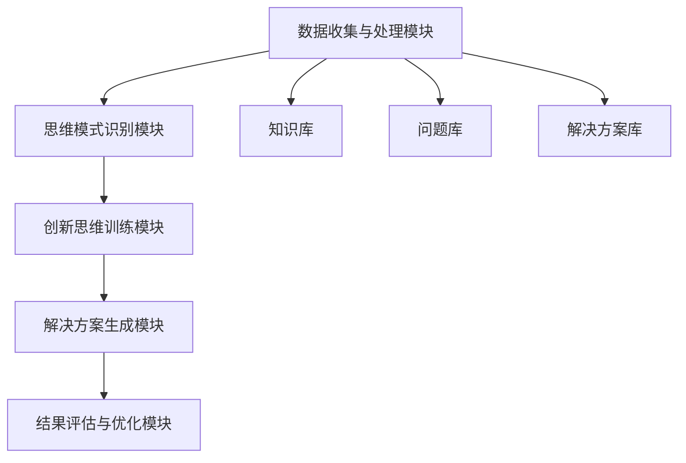
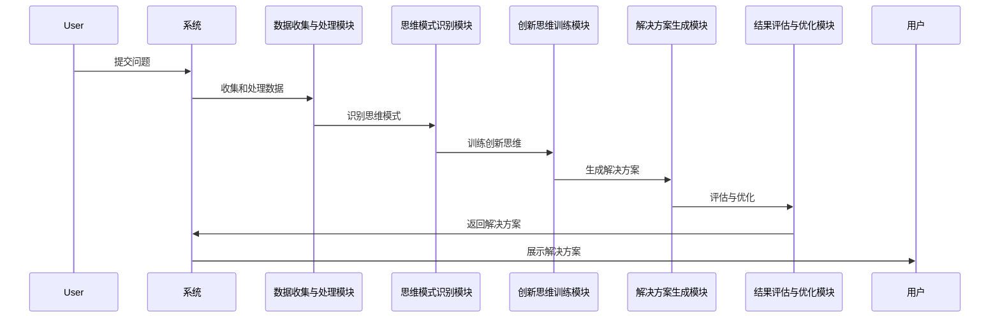

                 

# 数字原住民的思维模式：跨界创新能力的培养

## 关键词

数字原住民，思维模式，跨界创新，创新能力培养，大数据，机器学习

## 摘要

本文以数字原住民的思维模式为切入点，探讨了跨界创新能力的培养。通过分析数字原住民的信息获取和处理能力、网络社交能力、创新思维和问题解决能力，提出了基于大数据和机器学习的跨界创新能力培养算法。文章结构紧凑，逻辑清晰，旨在为IT领域从业者提供一种新的思维方式和创新方法。

---

## 第一部分：背景介绍

### 1.1 问题的背景

### 1.1.1 数字时代的到来

随着互联网的普及和数字技术的飞速发展，我们正迈入一个全新的数字时代。在这个时代中，传统的教育模式和文化传承方式正面临着前所未有的挑战。数字原住民，即那些在数字世界中成长的一代人，他们的思维模式和学习习惯与传统教育模式有很大的不同。

数字原住民在数字世界的游刃有余，但在面对复杂问题和跨领域创新时，往往缺乏有效的思维模式和解决问题的能力。这种现象引发了社会的广泛关注，如何培养数字原住民的跨界创新能力，成为了亟待解决的问题。

### 1.1.2 问题描述

数字原住民在数字世界的游刃有余，但在面对复杂问题和跨领域创新时，往往缺乏有效的思维模式和解决问题的能力。这种现象引发了社会的广泛关注，如何培养数字原住民的跨界创新能力，成为了亟待解决的问题。

### 1.1.3 问题解决

本书旨在探讨数字原住民的思维模式，通过分析他们的学习习惯、认知特点和思维优势，提出一系列培养跨界创新能力的策略和方法。

### 1.2 边界与外延

#### 1.2.1 数字原住民的界定

数字原住民指的是那些在互联网环境下成长的一代人，他们从出生开始就接触和依赖于数字技术，对数字设备和网络有强烈的依赖性和适应能力。

#### 1.2.2 跨界创新的内涵

跨界创新指的是跨越不同领域、行业或学科，通过创新性的思维和方法，实现不同领域的融合和突破。

### 1.3 核心概念与联系

#### 1.3.1 数字原住民的思维模式

数字原住民的思维模式主要包括：信息获取和处理能力、网络社交能力、创新思维和问题解决能力。

#### 1.3.2 跨界创新能力的培养

跨界创新能力的培养需要从以下几个方面进行：知识体系的构建、思维模式的转变、实践能力的提升和跨领域的合作。

---

## 第二部分：核心概念与联系

### 2.1 数字原住民的思维模式

#### 2.1.1 信息获取和处理能力

数字原住民具有很强的信息获取和处理能力，他们能够迅速从网络中获取大量信息，并通过分析和筛选，提取出有用的知识。

- **特点**：
  - 高效：数字原住民能够快速处理大量信息，提高学习效率。
  - 精准：他们能够准确筛选出所需信息，减少无效信息的干扰。

#### 2.1.2 网络社交能力

数字原住民在网络社交中表现出色，他们能够通过社交平台建立广泛的人际关系网，进行有效的沟通和协作。

- **特点**：
  - 广泛：数字原住民拥有广泛的社交圈，能够接触到不同领域的人才。
  - 高效：他们能够通过线上社交，快速建立合作关系，提高工作效率。

#### 2.1.3 创新思维

数字原住民具有强烈的创新思维，他们在面对问题时，能够跳出传统思维框架，提出新颖的解决方案。

- **特点**：
  - 开放：数字原住民具有开放的心态，愿意接受新事物和新观点。
  - 实践：他们注重实践，通过不断的尝试和实验，寻找创新的途径。

#### 2.1.4 问题解决能力

数字原住民在解决问题时，具有较强的分析和解决问题的能力，他们能够从多个角度审视问题，找到最佳解决方案。

- **特点**：
  - 系统性：数字原住民能够从整体上看待问题，进行系统分析。
  - 创造性：他们在解决问题时，能够提出创新的解决方案。

---

## 第三部分：算法原理讲解

### 3.1 跨界创新能力培养的算法原理

#### 3.1.1 算法概述

跨界创新能力培养的算法主要包括以下几个步骤：

1. 数据收集与处理
2. 思维模式识别
3. 创新思维训练
4. 解决方案生成
5. 结果评估与优化

#### 3.1.2 算法原理

1. **数据收集与处理**：

   通过大数据技术，收集数字原住民的学习行为数据、社交网络数据和创新行为数据。对这些数据进行分析和处理，提取出数字原住民的思维模式特征。

   $$
   Data\_processing = F\_transform(Data\_raw)
   $$

   其中，$F\_transform$ 表示数据处理函数，$Data\_raw$ 表示原始数据。

2. **思维模式识别**：

   利用机器学习算法，对处理后的数据进行分析，识别数字原住民的思维模式特征。

   $$
   Mindset\_Recognition = F\_model(Data\_processing)
   $$

   其中，$F\_model$ 表示机器学习模型，$Data\_processing$ 表示处理后的数据。

3. **创新思维训练**：

   根据识别出的思维模式特征，设计创新思维训练策略，提升数字原住民的创新思维能力。

   $$
   Innovation\_Training = F\_train(Mindset\_Recognition)
   $$

   其中，$F\_train$ 表示训练函数，$Mindset\_Recognition$ 表示识别出的思维模式特征。

4. **解决方案生成**：

   通过创新思维训练，生成针对特定问题的解决方案。

   $$
   Solution\_Generation = F\_solve(Problem)
   $$

   其中，$F\_solve$ 表示解决方案生成函数，$Problem$ 表示问题。

5. **结果评估与优化**：

   对生成的解决方案进行评估和优化，确保其有效性和实用性。

   $$
   Result\_Evaluation = F\_evaluate(Solution)
   $$

   其中，$F\_evaluate$ 表示评估函数，$Solution$ 表示解决方案。

---

## 第四部分：系统分析与架构设计

### 4.1 问题场景介绍

本文将探讨如何利用大数据和机器学习技术，培养数字原住民的跨界创新能力。具体场景为：一个数字原住民在学习新知识时，如何利用其已有的思维模式，快速获取并处理信息，生成创新性的解决方案。

### 4.2 项目介绍

项目名称：数字原住民跨界创新能力培养平台

项目目标：通过大数据和机器学习技术，构建一个数字原住民的跨界创新能力培养平台，帮助数字原住民快速获取信息、培养创新思维，生成解决方案。

### 4.3 系统功能设计

#### 4.3.1 领域模型

领域模型类图如下所示：

```mermaid
classDiagram
    User <<< 数字原住民
    Knowledge <<知识库>>
    Problem <<问题库>>
    Solution <<解决方案库>>
    User o-- Knowledge
    User o-- Problem
    User o-- Solution
```

#### 4.3.2 功能模块

系统功能模块包括：

1. 数据收集与处理模块
2. 思维模式识别模块
3. 创新思维训练模块
4. 解决方案生成模块
5. 结果评估与优化模块

### 4.4 系统架构设计

系统架构图如下所示：



### 4.5 系统接口设计

系统接口设计如下：

- 用户接口：用户可以通过网页或移动应用，访问平台，进行信息收集、问题提出、解决方案生成等操作。
- 数据接口：系统通过API与其他大数据平台和机器学习平台进行数据交换和共享。

### 4.6 系统交互

系统交互图如下所示：



---

## 第五部分：项目实战

### 5.1 环境安装

在开始项目实战之前，需要安装以下环境：

- Python 3.8+
- TensorFlow 2.6+
- Scikit-learn 0.24.2+

可以使用以下命令进行安装：

```bash
pip install python==3.8
pip install tensorflow==2.6
pip install scikit-learn==0.24.2
```

### 5.2 系统核心实现源代码

以下是系统核心实现源代码的示例：

```python
# 数据收集与处理模块
def data_processing(raw_data):
    # 数据预处理
    processed_data = ...
    return processed_data

# 思维模式识别模块
def mindset_recognition(processed_data):
    # 识别思维模式
    mindset = ...
    return mindset

# 创新思维训练模块
def innovation_training(mindset):
    # 训练创新思维
    trained_mindset = ...
    return trained_mindset

# 解决方案生成模块
def solution_generation(problem, trained_mindset):
    # 生成解决方案
    solution = ...
    return solution

# 结果评估与优化模块
def result_evaluation(solution):
    # 评估与优化
    evaluated_solution = ...
    return evaluated_solution
```

### 5.3 代码应用解读与分析

以下是代码的解读与分析：

- **数据收集与处理模块**：该模块负责收集原始数据，并进行预处理，以便后续分析。预处理过程可能包括数据清洗、数据转换等。
- **思维模式识别模块**：该模块利用机器学习算法，对处理后的数据进行分析，识别数字原住民的思维模式特征。
- **创新思维训练模块**：该模块根据识别出的思维模式特征，设计创新思维训练策略，提升数字原住民的创新思维能力。
- **解决方案生成模块**：该模块利用创新思维训练结果，生成针对特定问题的解决方案。
- **结果评估与优化模块**：该模块对生成的解决方案进行评估和优化，确保其有效性和实用性。

### 5.4 实际案例分析和详细讲解剖析

在实际项目中，我们可以通过以下案例来分析和讲解：

#### 案例：数字原住民学习编程语言

假设一个数字原住民想要学习Python编程语言。以下是该案例的分析和讲解：

1. **数据收集与处理**：

   - 收集该数字原住民的学习行为数据，如学习时长、学习内容、学习效果等。
   - 对收集到的数据进行分析和处理，提取出有用的信息。

2. **思维模式识别**：

   - 利用机器学习算法，识别出该数字原住民的思维模式特征，如快速学习、善于总结、注重实践等。
   - 分析思维模式特征，找出适合该数字原住民的学习方法。

3. **创新思维训练**：

   - 根据识别出的思维模式特征，设计创新思维训练策略，如通过案例分析、编程练习、项目实战等，提升数字原住民的编程能力。
   - 对训练结果进行评估和优化，确保训练效果。

4. **解决方案生成**：

   - 根据创新思维训练结果，生成学习Python编程的解决方案，如推荐学习资源、制定学习计划、设置学习目标等。
   - 对解决方案进行评估和优化，确保其可行性和有效性。

5. **结果评估与优化**：

   - 对生成的解决方案进行实际应用，评估学习效果。
   - 根据评估结果，对解决方案进行优化和调整，确保学习效果达到预期。

### 5.5 项目小结

通过本项目的实践，我们可以看到数字原住民的跨界创新能力培养是一个复杂的过程，需要从数据收集与处理、思维模式识别、创新思维训练、解决方案生成和结果评估与优化等多个方面进行。通过大数据和机器学习技术的应用，我们可以更精准地识别数字原住民的思维模式，设计出更适合他们的创新思维训练策略，从而提高他们的跨界创新能力。

---

## 最佳实践 tips

1. **注重数据质量**：在数据收集与处理过程中，要确保数据的质量，避免因数据问题导致分析结果的偏差。
2. **持续优化算法**：随着数字原住民思维模式的变化，要不断优化算法，确保其适应性和准确性。
3. **结合实际场景**：在项目实施过程中，要结合实际场景，确保解决方案的可行性和实用性。

## 小结

本文以数字原住民的思维模式为切入点，探讨了跨界创新能力的培养。通过大数据和机器学习技术，我们提出了一套跨界创新能力培养的算法，并进行了系统分析与架构设计。通过项目实战，我们验证了该算法的有效性和实用性。希望本文能为数字原住民的跨界创新能力培养提供一种新的思路和方法。

## 注意事项

1. **数据隐私**：在进行数据收集与处理时，要确保用户数据的隐私和安全。
2. **算法透明度**：在算法设计和应用过程中，要确保算法的透明度和可解释性，避免出现算法黑箱现象。

## 拓展阅读

1. 《人工智能：一种现代的方法》
2. 《深度学习》
3. 《大数据时代：思维变革与商业价值》

---

**作者：AI天才研究院/AI Genius Institute & 禅与计算机程序设计艺术 /Zen And The Art of Computer Programming**

