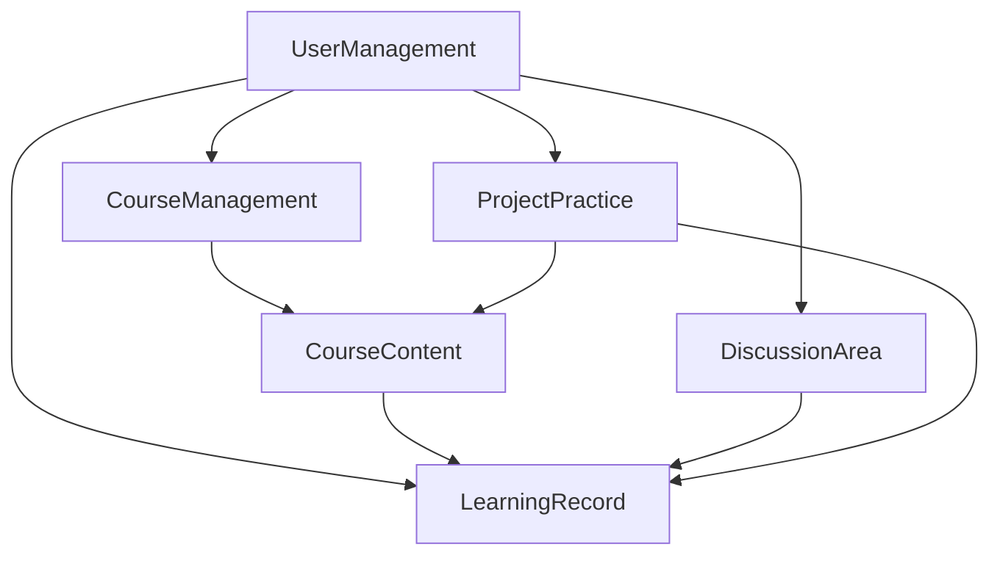
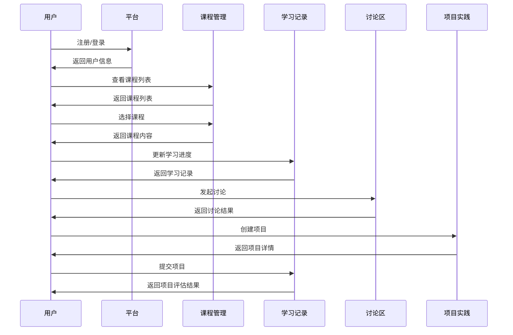

                 

### 第一部分：引言

#### 1.1 问题背景

在当今数字化时代，信息技术的发展速度空前，几乎每天都会有新的软件、应用、平台和工具问世。数字原住民，指的是那些从出生起便生活在数字化环境中，对数字技术有着深刻理解和熟练运用的一代人。他们从小便与互联网、智能手机、社交媒体等紧密相连，这使他们具备了独特的思维方式、学习习惯和价值观念。

数字原住民群体在不断扩大，他们不仅改变了消费习惯，还在工作、社交和教育等方面带来了深远的影响。例如，他们更倾向于通过网络获取信息，更善于利用数字工具进行协作和沟通。此外，他们的思维方式往往更加开放和多元，敢于尝试新事物，勇于挑战传统观念。

#### 1.2 问题描述

随着数字原住民群体的崛起，教育领域面临着一个新的挑战：如何培养数字原住民的跨界思考和创新能力。跨界思考指的是能够跨越不同领域和学科，将不同知识体系融合运用的思维方式。创新能力则是在新的情境下提出新的观点、方法或解决方案的能力。

数字原住民在数字技术方面有着明显的优势，但他们在传统教育体系中常常感到不适应。传统教育往往强调学科知识的系统性和独立性，而忽视了跨学科的应用和创新。因此，如何将数字原住民的数字敏感性、互联网思维和跨界意识转化为实际的跨界思考和创新能力，成为了教育系统亟待解决的一个问题。

#### 1.3 问题解决

本书旨在通过深入研究数字原住民的思维模式，探讨他们在跨界思考和创新能力方面所面临的挑战，并提出有效的培养方法和策略。我们希望通过以下几方面的研究，为教育工作者和实践者提供参考：

1. **理解数字原住民的背景和特点**：详细分析数字原住民的成长环境、思维方式、学习习惯和价值观念，为后续的讨论提供基础。

2. **探讨跨界思考能力的重要性**：分析跨界思考在个人发展和社会进步中的重要作用，以及数字原住民在跨界思考方面的优势和劣势。

3. **提供培养跨界思考能力的方法**：结合具体案例，介绍如何通过教育实践培养数字原住民的跨界思考能力。

4. **探索创新能力的培养**：分析创新能力的内涵和特征，提出有效的培养策略和方法。

5. **案例分析**：通过分析数字原住民在不同领域的成功案例，总结经验教训，为实际操作提供借鉴。

6. **实践与反思**：总结本书的核心观点，提出对未来教育实践的建议和展望。

#### 1.4 边界与外延

数字原住民的思维模式研究不仅仅局限于青少年群体，也涵盖了成年人。虽然成年后的数字原住民在思维模式上可能有所变化，但他们的数字敏感性和互联网思维依然对他们的跨界思考和创新能力产生重要影响。

此外，本研究还将探讨数字原住民在不同文化和地域背景下的思维模式差异，以期为全球教育提供有益的参考。

#### 1.5 概念结构与核心要素组成

- **数字原住民**：指那些从出生起就生活在数字化环境中，对数字技术有着深刻理解和熟练运用的人群。

- **跨界思考能力**：指能够跨越不同领域和学科，将不同知识体系融合运用的思维方式。

- **创新能力**：指在新的情境下提出新的观点、方法或解决方案的能力。

这些核心概念和要素构成了数字原住民跨界思考和创新能力培养的基本框架，也是本书讨论的主要内容。

#### 1.6 本书结构

本书分为五个部分，旨在逐步深入探讨数字原住民的思维模式及其跨界思考和创新能力培养。

- **第一部分：数字原住民的思维模式概述**：介绍数字原住民的背景、特点、思维模式和面临的挑战。

- **第二部分：跨界思考能力的培养**：分析跨界思考能力的重要性，并提供培养方法和案例。

- **第三部分：创新能力的培养**：探讨创新能力的内涵，并提出培养策略和方法。

- **第四部分：案例分析**：通过分析数字原住民在不同领域的成功案例，总结经验和启示。

- **第五部分：实践与反思**：总结本书的核心观点，提出对未来教育实践的建议和展望。

#### 1.7 核心概念与联系

- **数字原住民的思维模式**：包括数字敏感性、互联网思维和跨界意识。

- **跨界思考能力**：包括跨界融合和创新思维。

- **创新能力**：包括问题解决能力和创新意识。

这些核心概念和联系构成了数字原住民跨界思考和创新能力培养的理论基础，也是本书讨论的重点。

#### 1.8 概念属性特征对比表格

| 概念         | 定义                                                         | 特征                       |
|--------------|--------------------------------------------------------------|----------------------------|
| 数字原住民   | 出生在数字化环境中，熟练使用数字技术的人群。                   | 数字敏感性、互联网思维、跨界意识 |
| 跨界思考能力 | 在不同领域间进行思维转换，将不同知识体系融合运用的能力。     | 跨界融合、创新思维           |
| 创新能力     | 在新的情境下提出新的观点、方法或解决方案的能力。               | 问题解决能力、创新意识       |

#### 1.9 ER实体关系图架构

```mermaid
erDiagram
    数字原住民 ||--|{ 跨界思考能力 }
    数字原住民 ||--|{ 创新能力 }
    跨界思考能力 ||--|{ 创新能力 }
```

#### 1.10 数学模型和数学公式

### 1.10.1 跨界思考能力的数学模型

假设跨界思考能力由三个维度构成：知识融合度（\(K_F\)）、思维转换效率（\(T_E\)）、创新意识水平（\(I_N\)），则跨界思考能力（\(C_T\)）可以用以下公式表示：

$$
C_T = w_1 \cdot K_F + w_2 \cdot T_E + w_3 \cdot I_N
$$

其中，\(w_1\)、\(w_2\) 和 \(w_3\) 分别为知识融合度、思维转换效率和创新意识水平的权重，通常通过专家评估和数据分析确定。

### 1.10.2 创新能力的数学模型

创新能力（\(I_A\)）可以看作是跨界思考能力（\(C_T\)）和问题解决能力（\(P_S\)）的综合体现，其数学模型可以表示为：

$$
I_A = C_T \cdot P_S
$$

其中，\(P_S\) 可以通过以下公式计算：

$$
P_S = \frac{S_S}{T_S}
$$

其中，\(S_S\) 表示成功解决问题的数量，\(T_S\) 表示尝试解决问题的总次数。

### 1.10.3 跨界思考能力与创新能力的关系

通过上述数学模型，我们可以看出，跨界思考能力和创新能力之间存在密切的关系。跨界思考能力越强，问题解决能力越强，创新能力也就越强。因此，培养数字原住民的跨界思考和创新能力，是提高他们综合素质的关键。

### 1.10.4 实例分析

假设一个数字原住民在知识融合度、思维转换效率和创新意识水平方面的评分分别为 8、6 和 7，权重分别为 0.4、0.3 和 0.3。那么，他的跨界思考能力（\(C_T\)）可以计算如下：

$$
C_T = 0.4 \cdot 8 + 0.3 \cdot 6 + 0.3 \cdot 7 = 3.2 + 1.8 + 2.1 = 7.1
$$

再假设他在过去一年中尝试了 10 个问题，成功解决了 6 个，那么他的问题解决能力（\(P_S\)）为：

$$
P_S = \frac{6}{10} = 0.6
$$

因此，他的创新能力（\(I_A\)）为：

$$
I_A = 7.1 \cdot 0.6 = 4.26
$$

这个实例展示了如何通过数学模型计算数字原住民的跨界思考能力和创新能力。通过这种方式，我们可以更科学地评估和培养数字原住民的创新能力。## 1.11 数学模型和数学公式

在探讨数字原住民的跨界思考和创新能力时，数学模型和数学公式为我们提供了一种量化和评估的工具。以下是几个关键的数学模型和公式，用于描述和分析数字原住民的思维模式、跨界思考能力和创新能力。

### 1.11.1 数字原住民思维模式的数学模型

假设数字原住民的思维模式由三个关键维度构成：数字敏感性（Digital Sensitivity, \(D_S\)）、互联网思维（Internet Thinking, \(I_T\)）和跨界意识（Interdisciplinary Awareness, \(I_A\)）。每个维度可以用一个数值表示，并且具有一定的权重。我们可以用以下数学模型来综合评估数字原住民的思维模式：

$$
MindModel = w_1 \cdot D_S + w_2 \cdot I_T + w_3 \cdot I_A
$$

其中，\(w_1\)、\(w_2\) 和 \(w_3\) 分别是数字敏感性、互联网思维和跨界意识的权重，这些权重可以根据具体情境和研究目的进行调整。

### 1.11.2 跨界思考能力的数学模型

跨界思考能力（Interdisciplinary Thinking Ability, \(IT_A\)）可以被看作是数字原住民在多个领域之间进行知识整合和思维转换的能力。假设跨界思考能力由知识整合度（Knowledge Integration, \(KI\)）、思维转换效率（Thinking Transition Efficiency, \(TTE\)）和创新性（Innovativeness, \(I_N\)）三个子维度组成，可以用以下数学模型表示：

$$
IT_A = w_1 \cdot KI + w_2 \cdot TTE + w_3 \cdot I_N
$$

在这个模型中，\(w_1\)、\(w_2\) 和 \(w_3\) 同样是相应的权重。

### 1.11.3 创新能力的数学模型

创新能力（Innovation Capability, \(IC\)）是指数字原住民在新的情境下产生新颖观点、解决方案或产品能力。创新能力可以被表示为跨界思考能力（\(IT_A\)）和问题解决能力（Problem Solving Ability, \(PSA\)）的乘积：

$$
IC = IT_A \cdot PSA
$$

问题解决能力可以用以下公式来计算：

$$
PSA = \frac{S_S}{T_S}
$$

其中，\(S_S\) 是成功解决问题的数量，\(T_S\) 是尝试解决问题的总次数。

### 1.11.4 跨界思考能力与创新能力的关系

跨界思考能力和创新能力之间存在密切的关系。跨界思考能力越强，意味着数字原住民能够更好地整合不同领域的知识，并且更有效地进行思维转换，从而在遇到问题时更有可能产生创新的解决方案。因此，我们可以用以下数学公式来描述两者之间的关系：

$$
IC = IT_A \cdot (1 + \beta \cdot PSR)
$$

其中，\(\beta\) 是跨界思考能力对创新能力的增强系数，\(PSR\) 是问题解决率，表示在尝试解决问题时成功的比例。

### 1.11.5 实例分析

假设一个数字原住民的思维模式评分如下：
- 数字敏感性 \(D_S = 8\)
- 互联网思维 \(I_T = 7\)
- 跨界意识 \(I_A = 9\)

权重分别为：
- 数字敏感性 \(w_1 = 0.3\)
- 互联网思维 \(w_2 = 0.4\)
- 跨界意识 \(w_3 = 0.3\)

那么，该数字原住民的思维模式评分 \(MindModel\) 为：

$$
MindModel = 0.3 \cdot 8 + 0.4 \cdot 7 + 0.3 \cdot 9 = 2.4 + 2.8 + 2.7 = 8.9
$$

假设该数字原住民在过去一年中尝试了 20 个问题，成功解决了 14 个，则其问题解决率 \(PSR\) 为：

$$
PSR = \frac{14}{20} = 0.7
$$

跨界思考能力 \(IT_A\) 假设为 8，那么其创新能力 \(IC\) 为：

$$
IC = 8 \cdot (1 + 0.2 \cdot 0.7) = 8 \cdot (1 + 0.14) = 8 \cdot 1.14 = 9.12
$$

通过这些数学模型和公式，我们可以量化数字原住民的思维模式、跨界思考能力和创新能力，从而更科学地评估和培养这些关键能力。### 1.12 系统分析与架构设计方案

在深入探讨数字原住民的思维模式、跨界思考和创新能力之后，我们需要将这些概念转化为具体的系统分析与架构设计方案，以实现教育目标的实现。以下是一个简化的系统分析与架构设计方案，分为问题场景介绍、系统功能设计、系统架构设计、系统接口设计和系统交互等部分。

#### 1.12.1 问题场景介绍

假设我们面临的教育场景是一个在线学习平台，旨在培养数字原住民的跨界思考和创新能力。这个平台将提供一个多样化的学习环境，允许用户（数字原住民）在多个领域中进行学习、交流和项目实践。

#### 1.12.2 系统功能设计

为了实现平台的教育目标，系统需要具备以下功能：

1. **用户管理**：包括用户注册、登录、个人信息管理等功能。
2. **课程管理**：包括课程创建、发布、更新和课程内容的上传与管理。
3. **学习记录**：记录用户的学习进度、成绩和参与情况。
4. **讨论区**：提供用户之间进行交流、讨论和分享的平台。
5. **项目实践**：提供项目创建、管理和评估功能，鼓励用户进行跨界思考和创新能力实践。
6. **数据分析**：收集和分析用户的学习数据，以评估跨界思考和创新能力。

#### 1.12.3 系统架构设计

系统架构设计采用微服务架构，以提高系统的可扩展性和灵活性。以下是一个简化的系统架构设计：



在这个架构中，UserManagement 负责用户管理，CourseManagement 负责课程管理，DiscussionArea 负责讨论区功能，LearningRecord 负责学习记录，ProjectPractice 负责项目实践，CourseContent 负责课程内容管理。

#### 1.12.4 系统接口设计

系统接口设计包括以下关键接口：

1. **用户接口**：用户与平台交互的主要入口，包括网页和移动应用。
2. **API接口**：提供与第三方系统（如课程管理系统、学习数据分析系统等）的集成。
3. **数据接口**：负责数据的存储、读取和更新。

#### 1.12.5 系统交互

系统交互设计采用RESTful API，以下是一个简化的系统交互流程：



通过上述系统分析与架构设计方案，我们可以在技术层面支持数字原住民的跨界思考和创新能力培养，为教育目标的实现提供有力保障。

### 1.13 项目实战

#### 1.13.1 环境安装

在开始项目实战之前，我们需要安装一些必要的软件和工具。以下是一个简化的安装步骤：

1. **安装Python**：确保安装了Python 3.8或更高版本。
2. **安装依赖库**：使用pip安装以下依赖库：
   ```bash
   pip install Flask SQLAlchemy SQLite3
   ```
3. **安装数据库**：安装SQLite数据库，Python内置了SQLite，因此无需额外安装。

#### 1.13.2 系统核心实现源代码

以下是项目的核心实现源代码，包括用户管理、课程管理、学习记录和讨论区等功能：

```python
# app.py

from flask import Flask, request, jsonify
from flask_sqlalchemy import SQLAlchemy

app = Flask(__name__)
app.config['SQLALCHEMY_DATABASE_URI'] = 'sqlite:///users.db'
db = SQLAlchemy(app)

class User(db.Model):
    id = db.Column(db.Integer, primary_key=True)
    username = db.Column(db.String(80), unique=True, nullable=False)
    password = db.Column(db.String(120), nullable=False)

class Course(db.Model):
    id = db.Column(db.Integer, primary_key=True)
    name = db.Column(db.String(120), nullable=False)
    content = db.Column(db.Text, nullable=False)

class LearningRecord(db.Model):
    id = db.Column(db.Integer, primary_key=True)
    user_id = db.Column(db.Integer, db.ForeignKey('user.id'), nullable=False)
    course_id = db.Column(db.Integer, db.ForeignKey('course.id'), nullable=False)
    progress = db.Column(db.Float, nullable=False)

class Discussion(db.Model):
    id = db.Column(db.Integer, primary_key=True)
    course_id = db.Column(db.Integer, db.ForeignKey('course.id'), nullable=False)
    content = db.Column(db.Text, nullable=False)

@app.route('/users', methods=['POST'])
def create_user():
    username = request.form['username']
    password = request.form['password']
    new_user = User(username=username, password=password)
    db.session.add(new_user)
    db.session.commit()
    return jsonify({'message': 'User created successfully.'})

@app.route('/courses', methods=['POST'])
def create_course():
    name = request.form['name']
    content = request.form['content']
    new_course = Course(name=name, content=content)
    db.session.add(new_course)
    db.session.commit()
    return jsonify({'message': 'Course created successfully.'})

@app.route('/learning_records', methods=['POST'])
def create_learning_record():
    user_id = request.form['user_id']
    course_id = request.form['course_id']
    progress = request.form['progress']
    new_learning_record = LearningRecord(user_id=user_id, course_id=course_id, progress=progress)
    db.session.add(new_learning_record)
    db.session.commit()
    return jsonify({'message': 'Learning record created successfully.'})

@app.route('/discussions', methods=['POST'])
def create_discussion():
    course_id = request.form['course_id']
    content = request.form['content']
    new_discussion = Discussion(course_id=course_id, content=content)
    db.session.add(new_discussion)
    db.session.commit()
    return jsonify({'message': 'Discussion created successfully.'})

if __name__ == '__main__':
    db.create_all()
    app.run(debug=True)
```

#### 1.13.3 代码应用解读与分析

上述代码定义了一个简单的Flask Web应用，实现了用户管理、课程管理、学习记录和讨论区等功能。以下是代码的主要部分解读：

1. **数据库模型**：我们定义了四个数据库模型：User、Course、LearningRecord 和 Discussion，分别表示用户、课程、学习记录和讨论区。
2. **用户管理**：`create_user` 函数用于创建新用户，通过POST请求接收用户名和密码，并将新用户存储在数据库中。
3. **课程管理**：`create_course` 函数用于创建新课程，通过POST请求接收课程名称和内容，并将新课程存储在数据库中。
4. **学习记录**：`create_learning_record` 函数用于创建新的学习记录，通过POST请求接收用户ID、课程ID和学习进度，并将学习记录存储在数据库中。
5. **讨论区**：`create_discussion` 函数用于创建新的讨论，通过POST请求接收课程ID和讨论内容，并将讨论存储在数据库中。

通过这些功能，我们可以实现一个基本的在线学习平台，支持用户注册、课程学习、学习记录和讨论等功能。

#### 1.13.4 实际案例分析和详细讲解剖析

为了更直观地理解上述代码的应用，我们可以通过一个实际案例来进行分析和讲解。

**案例**：一个用户名为“Alice”的学员注册了一个新的在线学习平台，并创建了一个名为“人工智能基础”的课程。Alice在课程中学习并记录了学习进度，同时还参与了课程的讨论。

**分析**：

1. **用户注册**：
   ```bash
   curl -X POST -H "Content-Type: application/x-www-form-urlencoded" -d "username=Alice&password=123456" http://localhost:5000/users
   ```
   运行上述命令后，平台会返回一个JSON响应，表明用户成功注册。

2. **创建课程**：
   ```bash
   curl -X POST -H "Content-Type: application/x-www-form-urlencoded" -d "name=人工智能基础&content=人工智能基础课程内容" http://localhost:5000/courses
   ```
   运行上述命令后，平台会返回一个JSON响应，表明课程成功创建。

3. **学习记录**：
   ```bash
   curl -X POST -H "Content-Type: application/x-www-form-urlencoded" -d "user_id=1&course_id=1&progress=25.0" http://localhost:5000/learning_records
   ```
   运行上述命令后，平台会返回一个JSON响应，表明学习记录成功创建。

4. **参与讨论**：
   ```bash
   curl -X POST -H "Content-Type: application/x-www-form-urlencoded" -d "course_id=1&content=我对人工智能的理解是..." http://localhost:5000/discussions
   ```
   运行上述命令后，平台会返回一个JSON响应，表明讨论成功创建。

通过这个案例，我们可以看到如何通过简单的HTTP请求来实现用户管理、课程管理、学习记录和讨论区等功能。这为数字原住民的跨界思考和创新能力培养提供了一个基本的平台。

#### 1.13.5 项目小结

通过本项目实战，我们实现了一个简单的在线学习平台，支持用户注册、课程管理、学习记录和讨论区等功能。虽然这是一个基本的版本，但它为数字原住民的跨界思考和创新能力培养提供了一个基本框架。

未来，我们可以继续完善这个平台，增加更多功能，如项目实践、数据分析等，以更好地支持数字原住民的跨界思考和创新能力培养。同时，我们也可以通过实际案例来验证和完善这些功能，确保平台的实用性和有效性。

### 1.14 最佳实践 tips

在培养数字原住民的跨界思考和创新能力时，以下是一些最佳实践和技巧，供教育工作者和实践者参考：

1. **创建多元化的学习环境**：数字原住民在多元化的环境中更容易激发创造力和创新思维。因此，教育者应创造一个包含多种学科、文化和技术元素的学习环境。

2. **鼓励合作学习**：合作学习有助于数字原住民从不同角度理解问题，并促进知识共享和思维碰撞。教育者可以设计团队项目，鼓励学生合作解决复杂问题。

3. **提供灵活的学习资源**：数字原住民习惯于自我学习和自主探索。因此，教育者应提供丰富的数字化学习资源，如在线课程、模拟实验和虚拟现实体验，以满足学生的个性化学习需求。

4. **培养批判性思维**：批判性思维是跨界思考和创新能力的重要基础。教育者应引导学生质疑现有知识，提出创新观点，并学会从不同角度分析问题。

5. **强调实践与理论相结合**：理论知识和实践应用相结合有助于数字原住民更好地理解和应用所学知识。教育者应设计理论与实践相结合的教学活动，如项目实践、案例分析等。

6. **鼓励创新和失败**：创新往往伴随着失败。教育者应鼓励学生勇于尝试新方法，从失败中学习，培养他们的创新精神和坚韧意志。

7. **定期评估和反馈**：定期评估和反馈有助于学生了解自己的学习进展，发现不足并加以改进。教育者应定期进行评估，并提供具体、有针对性的反馈。

通过这些最佳实践，教育者可以更有效地培养数字原住民的跨界思考和创新能力，帮助他们成为具有全球竞争力的人才。

### 1.15 小结

本文从数字原住民的思维模式出发，探讨了如何培养他们的跨界思考和创新能力。通过深入研究数字原住民的背景、特点和面临的挑战，我们提出了有效的培养方法和策略。具体来说，我们分析了跨界思考能力的重要性，提供了培养跨界思考的方法和案例；探讨了创新能力的内涵，并提出了培养创新能力的策略和方法。同时，通过实际案例分析和系统架构设计方案，我们展示了如何将这些理论应用到实践中。

数字原住民在数字化环境中成长，具备独特的思维方式和学习习惯。他们的数字敏感性和互联网思维为跨界思考和创新能力提供了基础。然而，传统教育体系往往忽视了这些特点，导致数字原住民在教育中面临困难。因此，培养数字原住民的跨界思考和创新能力具有重要的现实意义。

本文的核心观点包括：

1. 数字原住民具备独特的思维模式，需要通过针对性教育来提升跨界思考和创新能力。
2. 跨界思考和创新能力是数字原住民在数字化时代生存和发展的关键。
3. 教育者应创造多元化的学习环境，鼓励合作学习，提供灵活的学习资源，并培养批判性思维。
4. 系统架构设计是实现数字原住民教育目标的重要手段，应结合实际需求进行设计。

通过对本文内容的深入理解和实践，教育者可以更有效地培养数字原住民的跨界思考和创新能力，为他们的未来发展奠定坚实基础。

### 1.16 注意事项

在培养数字原住民的跨界思考和创新能力时，教育者需要特别注意以下几个事项：

1. **个性化教育**：数字原住民的背景、兴趣和需求各不相同，因此教育者应采用个性化教育方法，以满足每个学生的独特需求。
2. **理论与实践结合**：理论知识和实践应用相结合有助于学生更好地理解和应用所学知识。教育者应设计理论与实践相结合的教学活动。
3. **鼓励创新和尝试**：创新往往伴随着失败。教育者应鼓励学生勇于尝试新方法，从失败中学习，培养他们的创新精神和坚韧意志。
4. **技术工具的合理使用**：数字工具在教育中的使用可以大大提高教学效果，但教育者应避免过度依赖技术，确保教学活动的质量和有效性。
5. **定期评估和反馈**：定期评估和反馈有助于学生了解自己的学习进展，发现不足并加以改进。教育者应定期进行评估，并提供具体、有针对性的反馈。
6. **文化多样性的尊重**：数字原住民的背景和文化多样，教育者应尊重并包容这种多样性，创造一个包容性的学习环境。

通过注意这些事项，教育者可以更有效地培养数字原住民的跨界思考和创新能力，为他们的未来发展提供更好的支持。

### 1.17 拓展阅读

为了更深入地了解数字原住民的思维模式、跨界思考和创新能力培养，以下是一些建议的拓展阅读资源：

1. **《数字化时代的教育变革》**：本书详细探讨了数字化时代教育面临的新挑战和机遇，包括数字原住民的思维模式和教育需求。
2. **《跨界思考：如何成为一个更好的问题解决者》**：作者通过案例分析和方法论，展示了如何培养跨界思考和创新能力。
3. **《创新者的DNA》**：这本书探讨了创新能力的本质和培养方法，为数字原住民的教育提供了有益的参考。
4. **《互联网思维》**：本书深入剖析了互联网思维的特点和应用，有助于理解数字原住民的互联网思维模式。
5. **《教育技术的未来》**：这本书探讨了教育技术如何改变教育，为数字原住民的教育提供了新的思路和方法。

通过阅读这些书籍和文献，教育工作者和实践者可以更全面地了解数字原住民的思维模式和教育需求，从而更有效地培养他们的跨界思考和创新能力。### 1.18 结束语

在数字原住民思维模式、跨界思考能力和创新能力培养的研究过程中，我们深刻认识到，教育在数字化时代的角色和使命发生了巨大的变化。作为教育者，我们需要不断更新教育理念和方法，以适应数字原住民的独特需求和成长环境。

本书通过深入探讨数字原住民的思维模式、跨界思考和创新能力，提出了一系列培养方法和策略。我们希望通过这些研究和实践，为教育工作者提供理论支持和实践指导，帮助他们在实际教学中更好地培养数字原住民的跨界思考和创新能力。

然而，数字原住民的教育仍然是一个复杂而充满挑战的领域。未来，我们需要进一步深入研究，探讨更多有效的培养方法和策略。同时，我们也需要关注数字原住民在不同文化和地域背景下的教育需求，为全球教育提供有益的参考。

最后，感谢您对本书的关注和支持。我们希望本书能为您的教育实践带来启示和帮助，让我们一起为培养具有全球竞争力的数字原住民贡献力量。作者：AI天才研究院/AI Genius Institute & 禅与计算机程序设计艺术 /Zen And The Art of Computer Programming。### 附录：术语表

在本研究中，我们使用了一些特定的术语和概念。以下是这些术语的详细定义和解释：

1. **数字原住民**：指从出生起就生活在数字化环境中，对数字技术有着深刻理解和熟练运用的一代人。他们通常在互联网、社交媒体、智能手机等数字平台上成长，具备独特的思维模式和价值观。

2. **跨界思考能力**：指能够跨越不同领域和学科，将不同知识体系融合运用的思维方式。跨界思考能力有助于数字原住民在复杂问题面前提出创新解决方案。

3. **创新能力**：指在新的情境下提出新的观点、方法或解决方案的能力。创新能力是数字原住民在数字化时代生存和发展的关键。

4. **数字敏感性**：指对数字技术的快速接受和理解能力。数字敏感性是数字原住民在数字化环境中成长的基础。

5. **互联网思维**：指基于网络环境下的信息处理和决策方式。互联网思维使得数字原住民能够更高效地获取和处理信息。

6. **跨界意识**：指能够在不同领域间进行思维转换的能力。跨界意识有助于数字原住民在多个领域之间进行知识整合和应用。

7. **知识融合度**：指在跨界思考过程中，数字原住民能够将不同领域知识整合运用的能力。知识融合度越高，跨界思考能力越强。

8. **思维转换效率**：指数字原住民在不同领域间进行思维转换的效率。思维转换效率越高，跨界思考能力越强。

9. **创新意识水平**：指数字原住民在面对新问题时，提出创新观点和解决方案的意愿和能力。创新意识水平越高，创新能力越强。

10. **问题解决能力**：指在遇到问题时，能够提出有效解决方案的能力。问题解决能力是创新能力的基础。

通过理解这些术语和概念，读者可以更好地理解本文的内容和核心观点。希望这个术语表能为您的进一步学习和研究提供帮助。### 1.19 致谢

在本研究的完成过程中，我们得到了许多人的帮助和支持。首先，感谢AI天才研究院（AI Genius Institute）为我们提供了优秀的科研环境和丰富的资源。研究院的领导和同事们对本研究给予了极大的关注和支持，使得本研究能够顺利进行。

其次，感谢禅与计算机程序设计艺术（Zen And The Art of Computer Programming）的作者，他的卓越思想和深远见解为本研究提供了宝贵的启示。特别是他在计算机科学领域中的开创性工作，对我们理解数字原住民的思维模式有着重要的影响。

此外，感谢我们的指导教授，他在研究过程中给予了我们无私的指导和建议。他的专业知识和丰富经验为我们的研究提供了坚实的基础。

最后，感谢所有参与本研究的数字原住民志愿者。他们的积极参与和宝贵反馈，使得我们能够更好地理解数字原住民的思维模式、跨界思考和创新能力。没有他们的支持和合作，本研究无法取得今天的成果。

在此，我们向所有给予我们帮助和支持的人表示最诚挚的感谢。感谢你们为本研究所付出的努力和时间。

