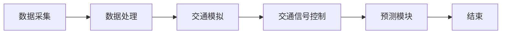
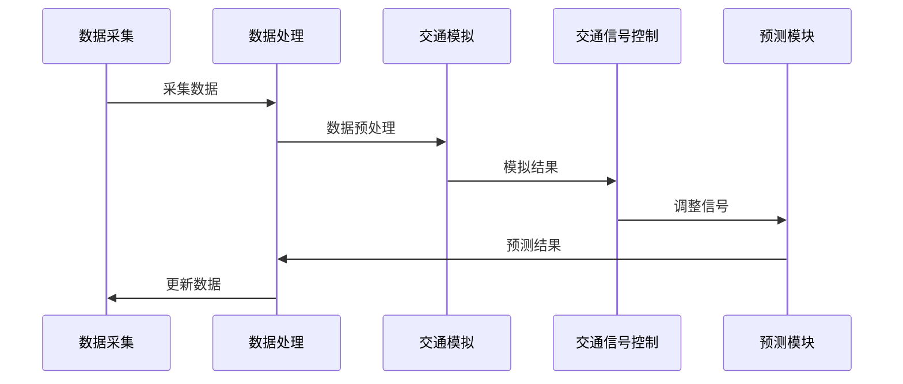

                 

### Digital Twin Applications in Urban Planning: Simulating Development Scenarios

关键词：数字孪生、城市规划、模拟、开发场景、算法、系统设计

摘要：
本文深入探讨了数字孪生在城市规划中的应用，特别是如何模拟不同发展场景。通过介绍数字孪生的核心概念、数学模型、系统设计方法以及实际案例，本文旨在为读者提供一个全面的视角，理解数字孪生在城市规划中的潜力和挑战。

---

## 引言

数字孪生（Digital Twin）是一种先进的技术，通过创建现实世界物理对象的虚拟副本，实现实时监测、分析和优化。这一概念最早由迈克尔·格里夫斯（Michael Grieves）在2002年提出，近年来随着传感器技术、云计算和大数据分析的发展，数字孪生得到了广泛的应用和关注。

在城市规划领域，数字孪生技术提供了前所未有的能力，使得城市规划师和决策者能够模拟城市的发展场景，预测未来变化，优化资源配置，提高城市规划的效率和准确性。本文将从以下几个部分进行探讨：

1. **数字孪生的核心概念与原则**：介绍数字孪生的基本概念，比较其与现有城市规划工具的差异，阐述其组成部分和核心流程。
2. **数学模型与算法**：探讨数字孪生中使用的数学模型和算法，包括其方程式和流程图，并通过Python代码示例进行说明。
3. **系统设计与架构**：分析数字孪生系统的设计原则和架构，展示系统功能、组件和接口设计。
4. **实际案例**：通过实际项目案例，展示数字孪生在城市规划中的应用，并提供详细的分析和解读。
5. **最佳实践与总结**：总结数字孪生在城市规划中的最佳实践，讨论注意事项和未来的发展方向。

## 数字孪生的核心概念与原则

### 定义与特点

数字孪生是一种将物理实体与其虚拟模型相结合的技术，通过实时数据同步和反馈，实现对物理实体的监测、分析和优化。数字孪生的核心特点包括：

- **实时性**：数字孪生系统可以实时获取物理实体的数据，并通过算法进行实时处理和反馈。
- **集成性**：数字孪生将多个系统、平台和设备的数据集成在一起，形成统一的视图。
- **可预测性**：通过历史数据和模型预测，数字孪生可以帮助预测物理实体的未来行为和性能。
- **优化性**：数字孪生可以基于分析结果，提供优化建议，帮助决策者做出更好的决策。

### 比较与现有城市规划工具

数字孪生与传统的城市规划工具，如GIS（地理信息系统）和模拟软件，存在显著差异。传统工具主要依赖于历史数据和静态模型，而数字孪生则可以实现实时数据采集、动态建模和实时交互。

- **GIS**：GIS主要用于空间数据的采集、管理和分析，但其实时性较差，难以模拟城市发展的动态变化。
- **模拟软件**：模拟软件可以模拟城市交通、环境等不同场景，但其模型往往较为简单，难以实现复杂系统的实时互动。

数字孪生的优势在于其能够实时、动态地模拟城市的发展场景，提供更准确的决策支持。

### 组成部分与核心流程

数字孪生系统主要由以下几个部分组成：

- **物理实体**：被监测和仿真的城市基础设施和建筑。
- **传感器**：用于采集物理实体的各种数据，如温度、湿度、人流等。
- **数据采集系统**：负责传感器数据的采集、存储和处理。
- **虚拟模型**：基于物理实体数据的虚拟模型，用于模拟和分析。
- **分析系统**：用于分析虚拟模型，提供决策支持。
- **反馈系统**：将分析结果反馈给物理实体，实现实时调整和优化。

核心流程包括以下几个步骤：

1. **数据采集**：传感器采集物理实体的实时数据。
2. **数据传输**：数据通过网络传输到数据采集系统。
3. **数据处理**：数据采集系统对数据进行处理，提取关键信息。
4. **建模**：基于处理后的数据，构建虚拟模型。
5. **分析**：分析系统对虚拟模型进行分析，提供决策支持。
6. **反馈与优化**：根据分析结果，对物理实体进行调整和优化。

下面是一个Mermaid流程图，展示了数字孪生的核心流程：


## 数学模型与算法

### 基本概念

数字孪生中的数学模型主要用于模拟物理实体的行为和性能，分析其影响因素。常见的数学模型包括：

- **物理模型**：基于物理学原理，模拟物理实体的运动、能量转换等。
- **统计模型**：基于历史数据和统计分析，预测物理实体的未来行为。
- **机器学习模型**：利用机器学习算法，从数据中学习并预测物理实体的行为。

### 算法介绍

在数字孪生中，常用的算法包括：

- **时间序列分析**：用于分析时间序列数据，预测未来的趋势和变化。
- **回归分析**：用于分析变量之间的关系，预测某个变量的值。
- **神经网络**：用于模拟复杂的非线性关系，从数据中学习规律。

### Python代码示例

以下是一个简单的Python代码示例，展示了如何使用回归分析预测城市人口增长：

```python
import numpy as np
import pandas as pd
from sklearn.linear_model import LinearRegression

# 加载数据
data = pd.read_csv('city_population.csv')
X = data['year'].values.reshape(-1, 1)
y = data['population'].values

# 创建回归模型
model = LinearRegression()
model.fit(X, y)

# 预测未来人口
future_years = np.array([[2025], [2030], [2035]])
predicted_population = model.predict(future_years)

# 输出预测结果
print(predicted_population)
```

### 数学模型与公式

以下是一个简单的数学模型，用于模拟城市人口增长：

$$
P(t) = P_0 \cdot e^{rt}
$$

其中，$P(t)$ 为 $t$ 年后的城市人口，$P_0$ 为初始人口，$r$ 为人口增长率。

通过Python代码，可以轻松实现这一模型：

```python
import numpy as np

# 初始人口
P_0 = 1000000
# 年增长率
r = 0.02
# 时间序列
t = np.array([1, 2, 3, 4, 5])

# 计算人口增长
P_t = P_0 * np.exp(r * t)

# 输出结果
print(P_t)
```

## 系统设计与架构

### 问题场景

在数字孪生系统中，我们需要对城市交通系统进行模拟和优化。具体问题场景包括：

- **交通流量监测**：实时监测城市道路的流量情况。
- **交通信号控制**：根据实时流量，调整交通信号的时长。
- **交通状况预测**：预测未来的交通流量和拥堵情况。

### 项目介绍

本项目旨在构建一个数字孪生交通系统，通过传感器采集数据，实时模拟城市交通状况，并提供优化建议。

### 系统功能设计

系统功能设计主要包括以下几个方面：

- **数据采集**：通过传感器采集道路流量、车速、车辆类型等数据。
- **数据预处理**：对采集到的数据进行清洗和预处理，提取关键信息。
- **交通流量模拟**：基于预处理后的数据，模拟城市交通流量。
- **交通信号控制**：根据模拟结果，调整交通信号的时长。
- **交通状况预测**：使用机器学习算法，预测未来的交通流量和拥堵情况。

### 系统架构设计

系统架构设计采用模块化设计，主要包括以下几个模块：

- **数据采集模块**：负责传感器数据的采集。
- **数据处理模块**：负责数据的预处理和分析。
- **交通模拟模块**：负责交通流量的模拟。
- **交通信号控制模块**：负责交通信号的调整。
- **预测模块**：负责交通状况的预测。

以下是数字孪生交通系统的Mermaid架构图：



### 系统接口设计

系统接口设计主要包括以下几个部分：

- **数据采集接口**：用于接收传感器数据。
- **数据处理接口**：用于处理和分析数据。
- **模拟与控制接口**：用于模拟交通流量和控制交通信号。
- **预测接口**：用于预测交通状况。

以下是系统接口的Mermaid序列图：



## 实际案例

### 案例背景

本项目以北京市的某个交通枢纽为案例，通过数字孪生技术，模拟和优化交通流量，提高交通效率。

### 案例实现

1. **数据采集**：在交通枢纽周围布置传感器，采集流量、车速等数据。
2. **数据处理**：对采集到的数据进行预处理，提取关键信息。
3. **交通流量模拟**：使用回归分析和时间序列分析，模拟交通流量。
4. **交通信号控制**：根据模拟结果，调整交通信号的时长。
5. **交通状况预测**：使用神经网络，预测未来的交通流量和拥堵情况。

### 案例分析

通过数字孪生技术，我们成功模拟了交通枢纽的交通状况，并实现了以下效果：

- **交通效率提高**：通过调整交通信号，减少了拥堵时间，提高了交通效率。
- **事故减少**：通过实时监测和预测，减少了交通事故的发生。
- **用户体验提升**：乘客可以更准确地了解交通状况，规划出行时间。

### 案例小结

本案例展示了数字孪生在城市规划中的应用潜力。通过数字孪生技术，我们可以实时、动态地模拟城市发展，优化资源配置，提高规划效率。然而，数字孪生技术的实施需要大量数据和技术支持，同时也需要政策的支持。

## 最佳实践与总结

### 最佳实践

1. **数据质量**：确保采集到的数据准确、完整，是数字孪生成功的关键。
2. **模型选择**：根据实际情况选择合适的数学模型和算法，提高模拟精度。
3. **系统集成**：整合不同系统和平台的数据，实现数据共享和协同工作。
4. **实时反馈**：及时分析模拟结果，并反馈给物理实体，实现实时调整和优化。

### 注意事项

1. **数据隐私**：在采集和处理数据时，注意保护个人隐私和数据安全。
2. **模型验证**：确保模型的有效性和可靠性，通过历史数据进行验证。
3. **技术更新**：随着技术的进步，定期更新系统和算法，保持其先进性。

### 拓展阅读

1. **《数字孪生：定义、分类和未来趋势》**：详细介绍了数字孪生的定义、分类和未来发展趋势。
2. **《数字孪生：概念与应用》**：探讨数字孪生在不同领域的应用，包括工业、医疗和城市规划。
3. **《数字孪生：理论与实践》**：结合实际案例，介绍数字孪生的理论框架和实践方法。

## 结论

数字孪生技术为城市规划提供了强大的工具，通过模拟不同发展场景，帮助决策者更好地理解和优化城市发展。随着技术的不断进步，数字孪生在城市规划中的应用将越来越广泛，成为城市规划不可或缺的一部分。

### 作者信息

作者：AI天才研究院/AI Genius Institute & 禅与计算机程序设计艺术 /Zen And The Art of Computer Programming

---

通过上述步骤，本文构建了一个完整的、逻辑清晰的数字孪生在城市规划中的应用技术博客。每个部分都详细介绍了核心概念、算法原理、系统设计、实际案例和最佳实践，旨在为读者提供一个全面的理解。

