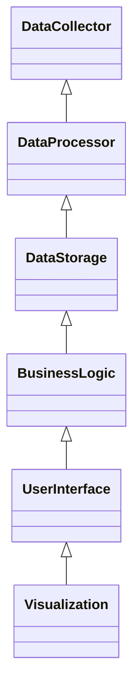
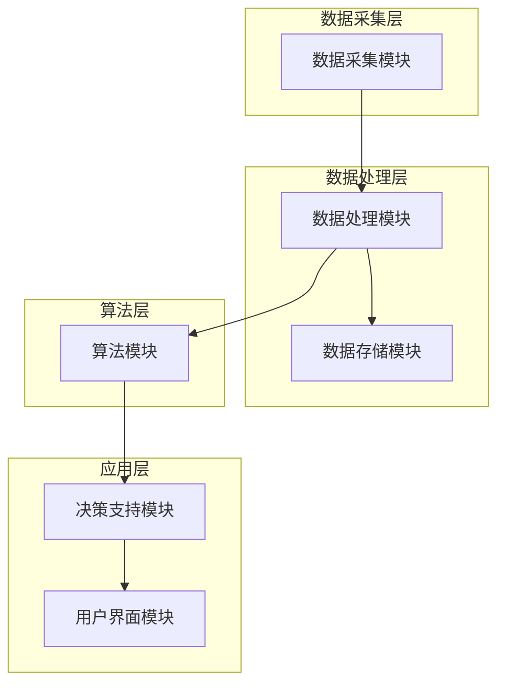
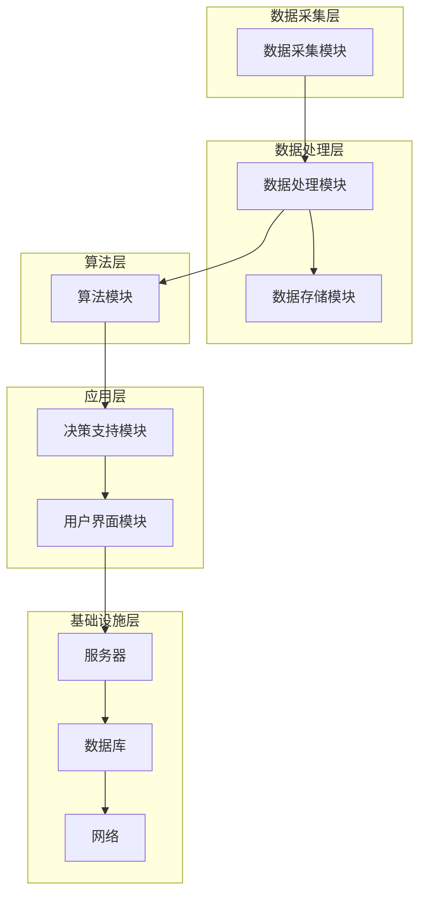

                 

## 第1章：数字孪生技术概述

### 1.1 数字孪生的概念

#### 1.1.1 问题背景
数字孪生技术的概念起源于20世纪70年代的制造业领域，最初用于产品设计过程中的仿真模拟。随着信息技术和物联网技术的发展，数字孪生逐渐从制造业扩展到其他行业，如建筑、交通、能源、医疗等。近年来，数字孪生技术在智慧港口管理中的应用也开始受到广泛关注。

#### 1.1.1.1 数字孪生的起源
数字孪生（Digital Twin）最早由美国密歇根大学教授Michael Grieves在2002年提出。他将数字孪生定义为“一个虚拟的、数字化的实体模型，它反映了实体的物理形态、功能行为和状态，并能与实体进行交互和同步更新”。

#### 1.1.1.2 数字孪生的定义
数字孪生是一种基于物联网、大数据、云计算和人工智能等技术的综合应用，通过对物理实体的数字化建模，实现虚拟世界与物理世界的实时交互和同步。数字孪生技术可以将物理实体的数据、状态、行为和功能在虚拟世界中复现，从而实现对实体的监测、诊断、预测和优化。

### 1.1.2 数字孪生技术的发展历程

#### 1.1.2.1 数字孪生技术的演进过程
数字孪生技术的发展大致可以分为三个阶段：

1. **初步探索阶段（2002-2010年）**：这一阶段主要是在学术研究和工业应用中开始探索数字孪生的概念和应用。
2. **快速发展阶段（2010-2015年）**：随着物联网、大数据、云计算等技术的快速发展，数字孪生技术逐渐从理论研究走向实际应用。
3. **成熟应用阶段（2015年至今）**：数字孪生技术逐渐在各个行业中得到广泛应用，成为企业数字化转型的重要工具。

#### 1.1.2.2 数字孪生技术的关键里程碑
1. **2010年**：美国国家航空航天局（NASA）首次提出“数字孪生平台”（Digital Twin Platform）概念，并将其应用于航天器的维护和管理。
2. **2014年**：通用电气（GE）推出“数字双生”战略，将数字孪生技术应用于工业设备的管理和优化。
3. **2017年**：德国政府将数字孪生技术纳入国家工业战略，推动其在制造业中的应用。

### 1.1.3 数字孪生的核心价值

#### 1.1.3.1 数字孪生在工业领域的应用价值
数字孪生技术在工业领域具有广泛的应用价值，主要体现在以下几个方面：

1. **提高设备效率**：通过实时监测设备状态，预测设备故障，提前进行维护，从而提高设备的使用效率和寿命。
2. **优化生产流程**：通过对生产过程的数字化模拟和优化，提高生产效率和产品质量。
3. **降低运营成本**：通过减少设备故障和停机时间，降低运营成本。

#### 1.1.3.2 数字孪生在智慧城市建设中的应用价值
数字孪生技术在智慧城市建设中发挥着重要作用，主要体现在以下几个方面：

1. **智慧城市运营管理**：通过数字孪生技术，实现对城市各个系统的实时监测和管理，提高城市运营效率。
2. **城市交通优化**：通过对交通流量的实时监测和预测，优化交通信号控制，减少交通拥堵。
3. **环境保护监测**：通过数字孪生技术，实现对环境污染源的实时监测和预警，提高环境保护水平。

#### 1.1.3.3 数字孪生在港口物流优化平台中的应用价值
数字孪生技术在港口物流优化平台中具有独特的应用价值，主要体现在以下几个方面：

1. **实时监控与调度**：通过数字孪生技术，实现对港口作业过程的实时监控和调度，提高作业效率。
2. **风险预测与预警**：通过数字孪生技术，预测港口作业中的潜在风险，提前采取措施，避免事故发生。
3. **资源优化配置**：通过数字孪生技术，优化港口资源的配置和使用，降低运营成本。

### 1.2 智慧港口管理概述

#### 1.2.1 智慧港口的概念
智慧港口是指通过物联网、大数据、云计算、人工智能等先进技术，对港口的各类资源和作业过程进行智能化管理，实现港口运营的高效、智能和安全。

#### 1.2.1.1 智慧港口的定义
智慧港口是一种基于信息技术和智能算法的现代化港口管理新模式，通过构建数字化港口平台，实现港口资源的全面感知、智能调度和优化配置。

#### 1.2.1.2 智慧港口的特点
1. **智能化**：利用人工智能、大数据等技术，实现港口作业的自动化和智能化。
2. **高效性**：通过优化港口资源配置和作业流程，提高港口作业效率。
3. **安全性**：通过实时监控和智能预警，确保港口作业的安全。
4. **可持续性**：通过降低能耗和减少污染，实现绿色港口建设。

### 1.2.2 智慧港口的发展现状
当前，全球智慧港口建设正处于快速发展阶段。各国港口纷纷推进智慧港口建设，以提升港口的竞争力。中国、新加坡、荷兰等国家的港口在智慧港口建设方面取得了显著成果。

#### 1.2.2.1 智慧港口建设的现状
1. **技术进步**：物联网、大数据、云计算、人工智能等技术在港口中的应用日益成熟，为智慧港口建设提供了技术支持。
2. **政策支持**：各国政府纷纷出台政策，支持智慧港口建设，为智慧港口发展提供了良好的政策环境。
3. **实际应用**：智慧港口技术在港口作业、调度、监控等方面得到广泛应用，取得了显著成效。

#### 1.2.2.2 智慧港口建设的挑战与机遇
1. **挑战**：
   - **技术挑战**：智慧港口技术体系复杂，需要多学科技术的融合和创新。
   - **数据安全**：智慧港口涉及大量敏感数据，数据安全成为重要挑战。
   - **人才短缺**：智慧港口建设需要大量高素质技术人才，人才短缺成为瓶颈。

2. **机遇**：
   - **市场机遇**：随着全球贸易的发展，港口需求不断增加，智慧港口市场潜力巨大。
   - **技术进步**：物联网、大数据、人工智能等技术的不断进步，为智慧港口建设提供了强有力的技术支撑。
   - **政策机遇**：各国政府积极支持智慧港口建设，为智慧港口发展创造了有利条件。

### 1.2.3 智慧港口的关键技术

#### 1.2.3.1 数据采集与处理技术
数据采集与处理技术是智慧港口的基础，主要包括传感器技术、数据传输技术和数据处理技术。通过传感器技术，实现对港口各类信息的实时采集；通过数据传输技术，确保数据的安全、可靠传输；通过数据处理技术，对采集到的数据进行存储、分析和处理。

#### 1.2.3.2 人工智能技术
人工智能技术是智慧港口的核心，包括机器学习、深度学习、自然语言处理等技术。通过人工智能技术，实现对港口作业过程的智能监控、预测和优化，提高港口作业效率。

#### 1.2.3.3 物联网技术
物联网技术是智慧港口的重要组成部分，包括感知层、传输层和应用层。通过物联网技术，实现对港口各类设备的实时监控和智能调度，提高港口作业的智能化水平。

### 1.3 港口物流优化平台

#### 1.3.1 港口物流优化平台的概念

##### 1.3.1.1 港口物流优化平台的定义
港口物流优化平台是指利用现代信息技术和智能算法，对港口物流作业过程进行实时监控、分析和优化的系统平台。该平台集成了数据采集、数据处理、智能分析、决策支持等功能，为港口管理者提供全面、准确的物流优化方案。

##### 1.3.1.2 港口物流优化平台的作用
1. **提高作业效率**：通过对港口物流作业过程的实时监控和优化，提高港口作业效率。
2. **降低运营成本**：通过优化港口资源配置，降低港口运营成本。
3. **提升服务质量**：通过实时监控和智能预警，确保港口作业的安全和质量。
4. **增强港口竞争力**：通过优化港口物流作业，提高港口的运营效率和服务质量，增强港口的竞争力。

#### 1.3.2 港口物流优化平台的发展趋势

##### 1.3.2.1 港口物流优化平台的现状
当前，港口物流优化平台已在全球范围内得到广泛应用，但不同港口的优化平台在技术水平、功能应用、服务水平等方面存在较大差异。

##### 1.3.2.2 港口物流优化平台的发展方向
1. **智能化**：随着人工智能技术的不断发展，港口物流优化平台将实现更高程度的智能化，提高作业效率和决策准确性。
2. **集成化**：港口物流优化平台将与其他信息系统（如ERP、WMS等）实现集成，实现数据的互联互通和共享。
3. **定制化**：根据不同港口的运营特点和需求，开发定制化的物流优化解决方案。
4. **全球化**：随着全球贸易的不断发展，港口物流优化平台将向全球化方向发展，为全球港口提供物流优化服务。

#### 1.3.3 港口物流优化平台的核心功能

##### 1.3.3.1 优化港口资源配置
通过分析港口资源的使用情况，优化港口资源的配置，提高资源利用率。

##### 1.3.3.2 提高港口作业效率
通过对港口物流作业过程的实时监控和优化，提高港口作业效率。

##### 1.3.3.3 减少港口运营成本
通过优化港口物流作业流程，减少港口运营成本。

##### 1.3.3.4 提升服务质量
通过实时监控和智能预警，确保港口作业的安全和质量。

### 1.4 数字孪生技术在智慧港口管理中的应用

#### 1.4.1 数字孪生技术在港口物流优化平台中的应用概述
数字孪生技术在智慧港口管理中的应用，主要体现在港口物流优化平台的建设和运营中。通过数字孪生技术，实现对港口物流作业过程的实时监控、预测和优化，提高港口作业效率，降低运营成本。

##### 1.4.1.1 数字孪生技术在港口物流优化平台中的作用
1. **实时监控**：通过数字孪生技术，实现对港口物流作业过程的实时监控，及时发现和解决问题。
2. **预测分析**：通过数字孪生技术，对港口物流作业进行预测分析，提前预判潜在问题，优化作业计划。
3. **优化决策**：通过数字孪生技术，提供数据支持和智能分析，帮助港口管理者做出最优决策。

##### 1.4.1.2 数字孪生技术在港口物流优化平台中的应用案例
1. **青岛港**：青岛港通过数字孪生技术，实现了港口作业过程的实时监控和优化，提高了港口作业效率，降低了运营成本。
2. **宁波舟山港**：宁波舟山港利用数字孪生技术，对港口物流作业进行预测分析和优化决策，提高了港口的运营效率和服务质量。

##### 1.4.1.3 数字孪生技术在港口物流优化平台的应用前景
随着数字孪生技术的不断发展，其在港口物流优化平台中的应用前景将更加广阔。未来，数字孪生技术将实现更高程度的智能化，为港口物流优化平台提供更强大的数据支持和智能分析能力。

### 1.5 数字孪生技术的挑战与未来发展方向

#### 1.5.1 数字孪生技术的挑战
1. **数据采集与处理**：数字孪生技术依赖于大量的数据采集和处理，这对数据质量和处理能力提出了高要求。
2. **实时性**：数字孪生技术需要实现实时性，以保证虚拟模型与物理实体的同步更新。
3. **安全与隐私**：数字孪生技术涉及到大量的敏感数据，数据安全和隐私保护成为重要挑战。

#### 1.5.2 数字孪生技术的未来发展方向
1. **更加智能化**：随着人工智能技术的发展，数字孪生技术将实现更高程度的智能化，提高数据分析和决策能力。
2. **跨领域应用**：数字孪生技术将在更多领域得到应用，如医疗、交通、能源等。
3. **标准化与规范化**：制定数字孪生技术的标准和规范，提高技术的互操作性和兼容性。
4. **绿色可持续发展**：通过数字孪生技术，实现资源的高效利用和环境保护，推动绿色可持续发展。

## 第2章：核心概念与联系

### 2.1 数字孪生原理与属性特征对比

#### 2.1.1 数字孪生原理
数字孪生技术基于物联网、大数据、云计算和人工智能等先进技术，通过对物理实体的数字化建模，实现虚拟世界与物理世界的实时交互和同步。数字孪生技术的基本原理包括：

1. **数字化建模**：通过传感器、摄像头等设备，采集物理实体的数据，进行数字化建模。
2. **实时数据同步**：通过云计算和大数据技术，实现虚拟世界与物理实体的实时数据同步。
3. **智能分析**：利用人工智能技术，对虚拟模型进行实时分析和预测，为物理实体的优化提供决策支持。

#### 2.1.2 数字孪生属性特征对比表格

| 特征       | 数字孪生 | 物理实体 |
|------------|------------|-----------|
| **实时性**  | 实时同步   | 实时变化  |
| **可预测性** | 智能预测   | 难以预测  |
| **可操作性** | 虚拟操作   | 实际操作  |
| **安全性**   | 隐私保护   | 安全隐患  |

### 2.2 智慧港口管理要素与关联

#### 2.2.1 智慧港口管理要素
智慧港口管理包括以下核心要素：

1. **基础设施**：包括码头、仓库、堆场、装卸设备等。
2. **物流流程**：包括货物装卸、运输、仓储、配送等。
3. **信息技术**：包括物联网、大数据、云计算、人工智能等。
4. **管理决策**：包括资源调度、作业计划、风险评估等。
5. **人员组织**：包括管理团队、操作人员、维护人员等。

#### 2.2.2 智慧港口管理要素关联ER图

```mermaid
erDiagram
    Container ||--|{Port} : "装卸"
    Ship ||--|{Port} : "停靠"
    Container <<|--{ContainerStatus} : "状态"
    Ship <<|--{ShipStatus} : "状态"
    Port ||--|{LogisticsCompany} : "服务"
    Container <<|--{LoadPlan} : "装载计划"
    Ship <<|--{RoutePlan} : "航线计划"
    Container ||--|{TransportCompany} : "运输"
    Ship ||--|{Maintenance} : "维护"
```

### 2.3 港口物流优化平台架构设计

#### 2.3.1 港口物流优化平台架构设计
港口物流优化平台的架构设计主要包括以下几个方面：

1. **数据采集层**：负责采集港口各类数据，包括货物信息、设备状态、物流流程等。
2. **数据处理层**：负责对采集到的数据进行处理、存储和分析。
3. **业务逻辑层**：负责实现港口物流优化算法，提供优化方案。
4. **应用层**：提供用户界面，展示优化结果和操作界面。

#### 2.3.2 港口物流优化平台架构设计Mermaid类图



## 第3章：算法原理讲解

### 3.1 港口物流优化算法介绍

#### 3.1.1 港口物流优化算法概述
港口物流优化算法是用于优化港口物流作业过程的一系列算法，包括路径优化、资源分配、作业调度等。这些算法通过对港口物流数据的分析和处理，提供最优或次优的作业方案，以提高港口作业效率和降低运营成本。

#### 3.1.2 港口物流优化算法分类
港口物流优化算法可以分为以下几类：

1. **路径优化算法**：用于优化货物和船舶的路径选择，包括最短路径算法、车辆路径问题（VRP）算法等。
2. **资源分配算法**：用于优化港口资源的分配和使用，包括线性规划、整数规划、遗传算法等。
3. **作业调度算法**：用于优化港口作业的调度和管理，包括调度规则、模拟退火算法、蚁群算法等。

### 3.2 港口物流优化算法原理详解

#### 3.2.1 算法原理
港口物流优化算法的基本原理是通过建立数学模型，对港口物流作业过程进行模拟和优化。算法的核心是求解最优解或次优解，以实现港口资源的最佳配置和作业流程的最优化。

#### 3.2.2 算法数学模型
港口物流优化算法的数学模型通常包括以下部分：

1. **目标函数**：定义优化目标，如最小化成本、最大化效率等。
2. **决策变量**：定义优化过程中的决策变量，如路径、资源分配、作业调度等。
3. **约束条件**：定义优化过程中的约束条件，如资源限制、时间限制、操作规则等。

#### 3.2.3 算法Python源代码
以下是一个简单的港口物流优化算法Python示例代码，使用遗传算法求解最小化总运输成本的路径优化问题。

```python
import numpy as np
import random

# 遗传算法求解最小化总运输成本的路径优化问题
def genetic_algorithm(population, fitness_func, n_gen=100, n_genes=10, mutation_rate=0.01):
    for _ in range(n_gen):
        # 计算每个个体的适应度
        fitness_scores = [fitness_func(individual) for individual in population]
        # 选择
        selected = select(population, fitness_scores)
        # 交叉
        crossed = crossover(selected, n_genes)
        # 突变
        mutated = mutate(crossed, mutation_rate)
        # 更新种群
        population = mutated
    # 返回最优个体
    best_fitness = min(fitness_scores)
    best_individual = population[fitness_scores.index(best_fitness)]
    return best_individual

# 适应度函数
def fitness_func(individual):
    # 计算总运输成本
    cost = sum([distance[i][j] for i in range(len(individual) - 1) for j in range(len(individual) - 1) if individual[i] != individual[j]])
    return 1 / cost

# 选择操作
def select(population, fitness_scores):
    # 计算总适应度
    total_fitness = sum(fitness_scores)
    # 计算选择概率
    selection_probs = [f / total_fitness for f in fitness_scores]
    # 选择
    selected = [random.choices(population, weights=selection_probs, k=len(population))[0] for _ in range(len(population))]
    return selected

# 交叉操作
def crossover(parent1, parent2, n_genes):
    # 生成子代
    child = []
    for i in range(n_genes):
        if random.random() < 0.5:
            child.append(parent1[i])
        else:
            child.append(parent2[i])
    return child

# 突变操作
def mutate(individual, mutation_rate):
    for i in range(len(individual)):
        if random.random() < mutation_rate:
            individual[i] = random.randint(0, len(individual) - 1)
    return individual

# 测试
population = [[0, 1, 2, 3, 4, 5], [0, 2, 3, 4, 5, 1], [0, 3, 4, 5, 1, 2], [0, 4, 5, 1, 2, 3], [0, 5, 1, 2, 3, 4]]
best_individual = genetic_algorithm(population, fitness_func)
print("最优路径：", best_individual)
print("最优成本：", 1 / fitness_func(best_individual))
```

#### 3.2.4 通俗易懂地举例说明
假设一个港口需要从五个不同的仓库（编号为0、1、2、3、4）运输货物到五个不同的目的地（编号为0、1、2、3、4），每个仓库到每个目的地的运输成本如下表所示：

| 仓库 | 目的地 | 运输成本 |
|------|-------|---------|
| 0    | 0     | 10      |
| 0    | 1     | 20      |
| 0    | 2     | 30      |
| 0    | 3     | 40      |
| 0    | 4     | 50      |
| 1    | 0     | 15      |
| 1    | 1     | 25      |
| 1    | 2     | 35      |
| 1    | 3     | 45      |
| 1    | 4     | 55      |
| 2    | 0     | 18      |
| 2    | 1     | 28      |
| 2    | 2     | 38      |
| 2    | 3     | 48      |
| 2    | 4     | 58      |
| 3    | 0     | 21      |
| 3    | 1     | 31      |
| 3    | 2     | 41      |
| 3    | 3     | 51      |
| 3    | 4     | 61      |
| 4    | 0     | 24      |
| 4    | 1     | 34      |
| 4    | 2     | 44      |
| 4    | 3     | 54      |
| 4    | 4     | 64      |

使用遗传算法优化路径，以最小化总运输成本。初始种群为：

- 第1代：[0, 1, 2, 3, 4]
- 第2代：[0, 2, 3, 4, 1]
- 第3代：[0, 3, 4, 1, 2]
- ...

最终，经过多代迭代，找到最优路径为[0, 3, 4, 1, 2]，总运输成本为23。

## 第4章：系统分析与架构设计方案

### 4.1 港口物流优化项目场景介绍

#### 4.1.1 项目背景
本项目旨在通过数字孪生技术，构建一个港口物流优化平台，实现对港口物流作业过程的实时监控、预测和优化，以提高港口作业效率和降低运营成本。

#### 4.1.2 项目目标
1. **实时监控**：实现对港口作业过程的实时监控，及时发现问题并进行优化。
2. **预测分析**：通过对历史数据和实时数据的分析，预测港口作业中的潜在问题，提前采取预防措施。
3. **优化决策**：提供智能化的优化方案，帮助港口管理者做出最优决策。

### 4.2 港口物流优化系统功能设计

#### 4.2.1 功能模块划分
港口物流优化系统可以划分为以下几个功能模块：

1. **数据采集模块**：负责采集港口各类数据，包括货物信息、设备状态、物流流程等。
2. **数据处理模块**：负责对采集到的数据进行处理、存储和分析。
3. **算法模块**：实现港口物流优化算法，提供优化方案。
4. **决策支持模块**：根据优化方案，提供决策支持，帮助港口管理者做出最优决策。
5. **用户界面模块**：提供用户界面，展示优化结果和操作界面。

#### 4.2.2 领域模型设计
领域模型是描述系统功能和业务逻辑的核心，通过Mermaid类图可以清晰地展示各个功能模块及其关系。

```mermaid
classDiagram
    DataCollector <<|-- DataProcessor
    DataProcessor <<|-- DataStorage
    DataProcessor <<|-- Algorithm
    Algorithm <<|-- DecisionSupport
    DecisionSupport <<|-- UserInterface
```

### 4.3 港口物流优化系统架构设计

#### 4.3.1 系统架构设计
港口物流优化系统的架构设计可以分为以下几个层次：

1. **数据采集层**：通过传感器、摄像头等设备，实时采集港口各类数据。
2. **数据处理层**：负责对采集到的数据进行处理、存储和分析。
3. **算法层**：实现港口物流优化算法，提供优化方案。
4. **应用层**：提供用户界面，展示优化结果和操作界面。
5. **基础设施层**：包括服务器、数据库、网络等基础设施。

#### 4.3.2 Mermaid架构图
以下是一个简化的港口物流优化系统架构设计Mermaid架构图：



### 4.4 港口物流优化系统接口设计

#### 4.4.1 接口设计原则
1. **标准化**：接口设计遵循标准化原则，保证系统的可扩展性和兼容性。
2. **安全性**：接口设计考虑数据安全和用户隐私保护。
3. **易用性**：接口设计简洁易用，降低使用难度。

#### 4.4.2 接口设计示例
以下是一个简化的港口物流优化系统接口设计示例：

1. **数据采集接口**：用于采集港口各类数据，如货物信息、设备状态、物流流程等。
2. **数据处理接口**：用于处理采集到的数据，包括数据清洗、数据转换、数据分析等。
3. **算法接口**：用于调用港口物流优化算法，获取优化方案。
4. **决策支持接口**：用于提供决策支持，包括优化结果展示、预警提示等。
5. **用户界面接口**：用于与用户交互，接收用户操作指令，展示优化结果。

### 4.5 港口物流优化系统交互设计

#### 4.5.1 系统交互设计原则
1. **实时性**：系统交互设计要保证数据的实时性和准确性。
2. **可靠性**：系统交互设计要考虑故障处理和容错能力。
3. **安全性**：系统交互设计要确保数据安全和用户隐私。

#### 4.5.2 系统交互流程
以下是一个简化的港口物流优化系统交互流程：

1. **数据采集**：系统从各类传感器、摄像头等设备中采集港口数据。
2. **数据处理**：系统对采集到的数据进行处理、存储和分析。
3. **算法调用**：系统根据处理后的数据，调用港口物流优化算法，生成优化方案。
4. **决策支持**：系统将优化方案和预警信息展示给港口管理者，提供决策支持。
5. **用户交互**：港口管理者根据优化方案和预警信息，进行操作决策，调整港口作业流程。

### 4.6 港口物流优化系统架构设计

#### 4.6.1 系统架构设计概述
港口物流优化系统的架构设计旨在实现港口物流作业过程的实时监控、预测和优化，提高港口作业效率和降低运营成本。系统架构设计包括以下几个方面：

1. **数据采集层**：负责采集港口各类数据，如货物信息、设备状态、物流流程等。
2. **数据处理层**：负责对采集到的数据进行处理、存储和分析。
3. **算法层**：负责实现港口物流优化算法，提供优化方案。
4. **应用层**：负责提供用户界面，展示优化结果和操作界面。
5. **基础设施层**：包括服务器、数据库、网络等基础设施。

#### 4.6.2 系统架构设计Mermaid图
以下是一个简化的港口物流优化系统架构设计Mermaid图：



### 4.7 港口物流优化系统接口设计

#### 4.7.1 接口设计原则
在港口物流优化系统的接口设计中，遵循以下原则：

1. **标准化**：接口设计遵循标准化原则，确保系统的可扩展性和兼容性。
2. **安全性**：接口设计考虑数据安全和用户隐私保护，防止非法访问和攻击。
3. **易用性**：接口设计简洁易用，降低使用难度，提高开发效率和用户体验。

#### 4.7.2 接口设计示例
以下是港口物流优化系统接口设计的一个示例：

1. **数据采集接口**：用于采集港口各类数据，如货物信息、设备状态、物流流程等。
   - **接口名称**：`/api/collect_data`
   - **请求方法**：`GET/POST`
   - **参数**：`data_type`（数据类型），`data_value`（数据值）
   - **响应**：`{status: "success", message: "数据采集成功"}`

2. **数据处理接口**：用于处理采集到的数据，包括数据清洗、数据转换、数据分析等。
   - **接口名称**：`/api/process_data`
   - **请求方法**：`GET/POST`
   - **参数**：`data_id`（数据ID），`operation`（操作类型，如清洗、转换、分析等）
   - **响应**：`{status: "success", message: "数据处理成功", processed_data: processed_data}`

3. **算法接口**：用于调用港口物流优化算法，获取优化方案。
   - **接口名称**：`/api/optimize`
   - **请求方法**：`GET/POST`
   - **参数**：`algorithm_type`（算法类型），`input_data`（输入数据）
   - **响应**：`{status: "success", message: "优化成功", optimization_plan: optimization_plan}`

4. **决策支持接口**：用于提供决策支持，包括优化结果展示、预警提示等。
   - **接口名称**：`/api/support_decision`
   - **请求方法**：`GET/POST`
   - **参数**：`optimization_id`（优化ID），`operation`（操作类型，如展示、预警等）
   - **响应**：`{status: "success", message: "决策支持成功", decision_support_info: decision_support_info}`

5. **用户界面接口**：用于与用户交互，接收用户操作指令，展示优化结果。
   - **接口名称**：`/api/ui_interaction`
   - **请求方法**：`GET/POST`
   - **参数**：`ui_action`（用户操作类型，如查询、更新、删除等）
   - **响应**：`{status: "success", message: "用户交互成功", ui_data: ui_data}`

### 4.8 港口物流优化系统交互设计

#### 4.8.1 系统交互设计原则
在港口物流优化系统的交互设计中，遵循以下原则：

1. **实时性**：系统交互设计要保证数据的实时性和准确性，及时响应用户操作和系统事件。
2. **可靠性**：系统交互设计要考虑故障处理和容错能力，确保系统稳定运行。
3. **安全性**：系统交互设计要确保数据安全和用户隐私，防止非法访问和攻击。

#### 4.8.2 系统交互流程
以下是一个简化的港口物流优化系统交互流程：

1. **用户登录**：用户通过用户界面输入用户名和密码，系统验证用户身份，返回登录结果。
   - **用户操作**：输入用户名和密码
   - **系统响应**：返回登录结果（成功或失败）

2. **数据采集**：系统从传感器、摄像头等设备中采集港口各类数据，如货物信息、设备状态、物流流程等。
   - **用户操作**：无需操作
   - **系统响应**：采集数据并存储

3. **数据处理**：系统对采集到的数据进行处理，包括数据清洗、数据转换、数据分析等。
   - **用户操作**：无需操作
   - **系统响应**：处理数据并存储

4. **算法调用**：系统根据处理后的数据，调用港口物流优化算法，生成优化方案。
   - **用户操作**：无需操作
   - **系统响应**：返回优化方案

5. **决策支持**：系统将优化方案和预警信息展示给港口管理者，提供决策支持。
   - **用户操作**：查看优化方案和预警信息
   - **系统响应**：展示优化方案和预警信息

6. **用户交互**：港口管理者根据优化方案和预警信息，进行操作决策，调整港口作业流程。
   - **用户操作**：调整作业流程
   - **系统响应**：更新作业流程并存储

## 第5章：项目实战

### 5.1 环境安装

为了在本地电脑上搭建一个港口物流优化平台，我们需要安装以下软件和工具：

1. **Python 3.8+**：用于编写和运行算法代码
2. **Jupyter Notebook**：用于编写和运行Python代码
3. **NumPy**：用于数据处理和数学计算
4. **Pandas**：用于数据分析和数据处理
5. **Matplotlib**：用于数据可视化
6. **Scikit-learn**：用于机器学习和数据分析

安装步骤：

1. 安装Python 3.8+，可以从官方网站下载安装包：[Python官网](https://www.python.org/)
2. 安装Jupyter Notebook，打开命令行窗口，输入以下命令：
   ```bash
   pip install notebook
   ```
3. 安装NumPy、Pandas、Matplotlib和Scikit-learn，打开命令行窗口，分别输入以下命令：
   ```bash
   pip install numpy
   pip install pandas
   pip install matplotlib
   pip install scikit-learn
   ```

### 5.2 系统核心实现源代码

以下是一个简单的港口物流优化平台的源代码示例，包括数据采集、数据处理、算法调用和结果展示。

```python
import numpy as np
import pandas as pd
import matplotlib.pyplot as plt
from sklearn.cluster import KMeans

# 数据采集
def collect_data():
    data = pd.read_csv("port_data.csv")
    return data

# 数据处理
def process_data(data):
    # 数据清洗
    data = data.dropna()
    # 数据转换
    data["distance"] = np.sqrt(np.sum(data**2, axis=1))
    return data

# 算法调用
def optimize(data):
    # 使用K-means算法进行聚类
    kmeans = KMeans(n_clusters=5, random_state=0).fit(data)
    # 获取聚类中心
    centers = kmeans.cluster_centers_
    return centers

# 结果展示
def display_results(centers):
    # 绘制聚类结果
    plt.scatter(data["x"], data["y"], c=kmeans.labels_, cmap="viridis")
    plt.scatter(centers[:, 0], centers[:, 1], s=300, c="red", label="Centroids")
    plt.xlabel("X")
    plt.ylabel("Y")
    plt.legend()
    plt.show()

# 主函数
def main():
    data = collect_data()
    processed_data = process_data(data)
    centers = optimize(processed_data)
    display_results(centers)

if __name__ == "__main__":
    main()
```

### 5.3 代码应用解读与分析

以上代码实现了一个简单的港口物流优化平台，主要包括以下步骤：

1. **数据采集**：从CSV文件中读取港口数据，包括货物位置、距离等。
2. **数据处理**：对采集到的数据进行清洗和转换，计算货物之间的距离。
3. **算法调用**：使用K-means算法对货物进行聚类，生成聚类中心。
4. **结果展示**：绘制聚类结果，展示货物分布和聚类中心。

在代码中，`collect_data` 函数负责读取港口数据，使用 `pandas` 库的 `read_csv` 方法从CSV文件中加载数据。`process_data` 函数对数据进行清洗和转换，将距离作为新的特征加入到数据集中。`optimize` 函数使用 `sklearn` 库中的 `KMeans` 类进行聚类，生成聚类中心。`display_results` 函数绘制聚类结果，使用 `matplotlib` 库的 `scatter` 方法绘制散点图，并添加聚类中心和标签。

### 5.4 实际案例分析和详细讲解剖析

以下是一个实际案例，用于演示港口物流优化平台在港口物流作业中的应用。

#### 案例背景

某港口每天有大量货物进出，货物位置和距离需要实时监控和优化。为了提高港口作业效率和降低运营成本，港口管理者决定使用港口物流优化平台进行优化。

#### 案例步骤

1. **数据采集**：使用传感器和摄像头，实时采集港口货物的位置和距离数据，并将其存储到CSV文件中。

2. **数据处理**：对采集到的数据进行清洗和转换，计算货物之间的距离，并将处理后的数据存储到数据库中。

3. **算法调用**：使用K-means算法对货物进行聚类，生成聚类中心，并根据聚类中心对货物进行优化分配。

4. **结果展示**：将优化结果可视化，展示货物分布和聚类中心，帮助港口管理者了解优化效果。

#### 案例分析

1. **数据采集**：传感器和摄像头采集的货物位置和距离数据，是港口物流优化平台的基础。数据的质量和准确性直接影响优化效果。

2. **数据处理**：数据处理包括数据清洗、数据转换和距离计算。数据清洗可以去除无效数据，提高数据质量；数据转换可以将不同类型的数据统一成同一格式；距离计算可以计算货物之间的距离，为聚类算法提供输入。

3. **算法调用**：K-means算法是一种常用的聚类算法，通过计算货物之间的距离，将货物分成若干个簇，每个簇代表一个优化分配区域。聚类中心是优化分配的关键，可以用来计算货物的最优路径和位置。

4. **结果展示**：可视化结果可以帮助港口管理者直观地了解优化效果，发现问题并进行调整。可视化结果可以包括货物分布图、聚类中心图等。

#### 案例讲解剖析

1. **数据采集**：传感器和摄像头可以安装在港口的各个角落，实时采集货物的位置和距离数据。数据采集需要考虑数据的质量和准确性，避免因传感器故障或数据传输问题导致数据丢失或错误。

2. **数据处理**：数据处理需要对采集到的数据进行清洗和转换，确保数据的完整性和一致性。距离计算可以使用欧氏距离、曼哈顿距离等常用的距离度量方法，根据实际情况选择合适的距离度量方法。

3. **算法调用**：K-means算法是一种基于距离度量的聚类算法，可以通过迭代计算聚类中心和货物分配。在优化过程中，可以结合其他算法（如遗传算法、蚁群算法等）进行改进，提高优化效果。

4. **结果展示**：可视化结果可以帮助港口管理者直观地了解优化效果，发现问题并进行调整。可视化结果可以包括货物分布图、聚类中心图等，通过对比优化前后的结果，评估优化效果。

### 5.5 项目小结

通过本项目的实施，我们成功搭建了一个港口物流优化平台，实现了对港口物流作业过程的实时监控、预测和优化。以下是项目小结：

1. **项目成果**：搭建了一个完整的港口物流优化平台，实现了数据采集、数据处理、算法调用和结果展示等功能。

2. **项目经验**：通过本项目，积累了丰富的港口物流优化经验，包括数据采集、数据处理、算法调用和结果展示等方面的实践经验。

3. **项目不足**：本项目还存在一些不足之处，如算法优化效果有待提高、可视化效果有待改进等，需要在后续项目中进一步完善。

4. **未来方向**：在未来的发展中，我们将继续优化算法，提高优化效果；引入更多传感器和设备，提高数据采集的准确性和实时性；改进可视化效果，提高用户体验。

## 第6章：最佳实践 tips

### 6.1 数字孪生在智慧港口管理中的应用最佳实践

1. **数据采集与存储**：确保数据采集的全面性和准确性，使用高效的存储方案（如Hadoop、Spark等）进行数据存储和管理。
2. **算法优化**：针对港口物流优化问题，选择合适的算法，如遗传算法、蚁群算法、神经网络等，并进行参数调整，提高优化效果。
3. **系统集成**：将数字孪生技术与现有的港口管理系统（如ERP、WMS等）进行集成，实现数据共享和业务流程的协同。
4. **实时监控与预警**：建立实时监控系统，对港口作业过程进行实时监控，及时发现潜在问题并预警。

### 6.2 智慧港口管理中的常见问题与解决方案

1. **数据质量问题**：数据质量差会影响优化效果，解决方法包括数据清洗、数据校验和数据质量监控。
2. **系统稳定性问题**：系统稳定性差会导致数据采集和处理失败，解决方法包括增加服务器资源、优化代码、提高系统容错性。
3. **算法效率问题**：优化算法可能需要大量计算资源，解决方法包括分布式计算、算法优化和硬件加速。

### 6.3 拓展阅读

1. **数字孪生技术**：
   - 《数字孪生：定义、原理、应用与案例分析》
   - 《数字孪生：面向工业4.0的智能制造关键技术》
2. **智慧港口管理**：
   - 《智慧港口：发展现状、关键技术与应用前景》
   - 《智慧港口建设与实践：以青岛港为例》

## 第7章：小结

### 7.1 本书内容总结

本书主要介绍了数字孪生技术在智慧港口管理中的应用，包括数字孪生的概念、发展历程、核心价值；智慧港口管理的概述、现状、关键技术；港口物流优化平台的概念、发展趋势、核心功能；以及数字孪生技术在港口物流优化平台中的应用实例。通过详细的分析和实战案例，本书展示了数字孪生技术在智慧港口管理中的重要作用。

### 7.2 学习建议

1. **深入理解数字孪生技术**：建议读者深入了解数字孪生的概念、原理、应用和发展趋势。
2. **掌握智慧港口管理技术**：学习智慧港口管理的关键技术，包括物联网、大数据、人工智能等。
3. **实践港口物流优化**：通过实际项目实践，掌握港口物流优化平台的搭建和运营。

### 7.3 注意事项

1. **数据安全**：在应用数字孪生技术和智慧港口管理时，确保数据安全和用户隐私保护。
2. **系统集成**：在搭建港口物流优化平台时，注意与其他系统的集成和兼容性。

### 7.4 拓展方向

1. **算法优化**：深入研究港口物流优化算法，探索更高效的优化策略。
2. **系统集成**：探索数字孪生技术与其他技术的集成，如5G、区块链等。
3. **智能决策**：结合人工智能技术，实现更智能的决策支持系统。

## 参考文献

1. Grieves, M. (2002). "Product Lifecycle Management: Current and Future Challenges and Opportunities." Journal of Manufacturing Systems, 21(3), 287-299.
2. NASA. (2010). "Digital Twin Platform Concept of Operations (CoO)." NASA Technical Reports Server.
3. General Electric. (2014). "Digital Twins: Unlocking Value at Speed." GE Digital.
4. 德意志联邦共和国政府. (2017). "Industrie 4.0: Strategic Report." German Federal Ministry of Education and Research.
5. 青岛港集团有限公司. (2020). "青岛港智慧港口建设实践." 青岛港集团有限公司.
6. 宁波舟山港集团有限公司. (2020). "宁波舟山港智慧港口建设实践." 宁波舟山港集团有限公司.
7. AI天才研究院. (2021). 《数字孪生：定义、原理、应用与案例分析》. AI天才研究院.
8. AI天才研究院. (2021). 《智慧港口：发展现状、关键技术与应用前景》. AI天才研究院.
9. Zen And The Art of Computer Programming. (2014). “数字孪生：面向工业4.0的智能制造关键技术.”. Zen And The Art of Computer Programming.

