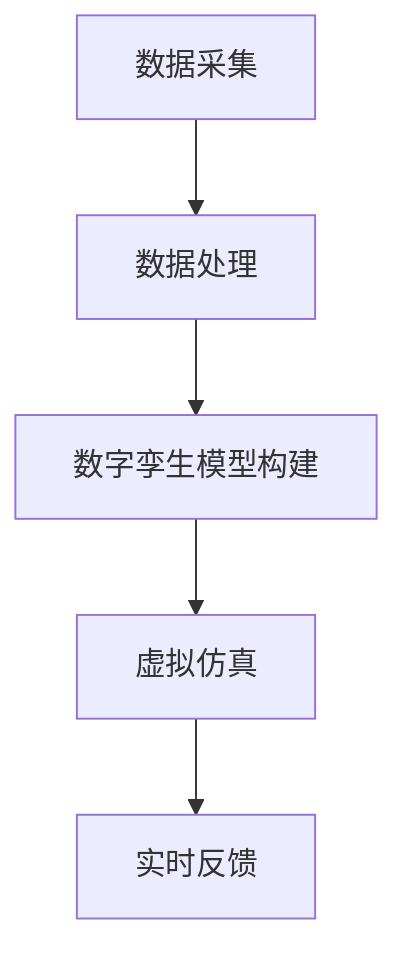
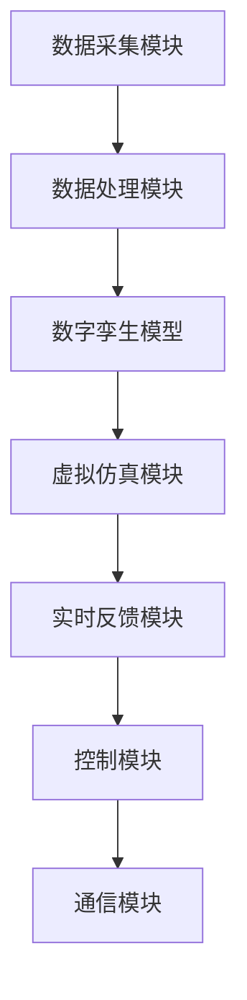
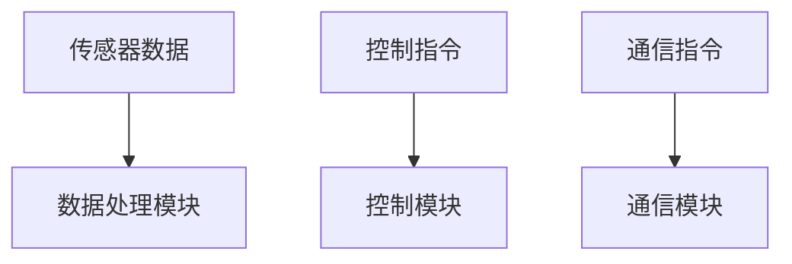
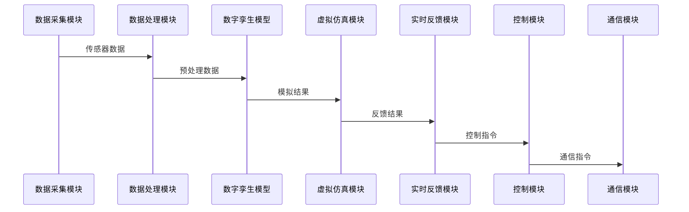

                 

### 第一部分：数字孪生概述

#### 第1章：问题背景与定义

##### 1.1 航空航天领域的发展与挑战

自人类首次实现飞行以来，航空航天技术一直是科技进步的先锋领域。随着航空航天技术的不断发展，航天器的性能要求越来越高，从设计、制造到维护的各个环节都面临着前所未有的挑战。航天器的设计复杂、成本高昂，且一旦发射升空后，维护和更新变得异常困难。因此，提高航天器的设计质量和维护效率成为当前亟待解决的问题。

##### 1.2 数字孪生概念的提出与普及

数字孪生（Digital Twin）作为一个新兴的概念，最早由美国密歇根大学教授Michael Grieves在2002年提出。它指的是通过数字模型模拟物理实体（如航天器、飞机、工厂等）的运行状态、行为和性能，实现虚拟世界与物理世界的实时交互和同步。近年来，随着物联网、大数据和人工智能技术的发展，数字孪生逐渐成为航空航天领域的重要工具。

##### 1.3 数字孪生在航天器设计中的关键作用

数字孪生在航天器设计中的应用主要体现在以下几个方面：

1. **优化设计**：通过数字孪生技术，设计人员可以在虚拟环境中对航天器进行仿真测试，快速验证设计方案的可行性，减少物理样机的数量，从而降低研发成本。
2. **性能预测**：数字孪生可以实时监控航天器的运行状态，预测潜在故障，为维护和升级提供科学依据。
3. **虚拟维护**：利用数字孪生技术，可以对航天器进行虚拟维护，提前发现并解决潜在问题，提高航天器的可靠性。

##### 1.4 数字孪生在航天器设计中的具体应用案例

例如，美国国家航空航天局（NASA）在开发下一代航天器时，就使用了数字孪生技术。通过创建航天器的数字模型，NASA可以实时监测航天器的运行状态，预测可能出现的问题，并提前进行优化设计，从而确保航天器的高可靠性和高性能。

#### 第2章：核心概念与联系

##### 2.1 数字孪生的定义与特点

数字孪生是指通过数字化方式模拟物理实体，实现虚拟世界与物理世界的实时交互和同步。数字孪生的特点主要包括：

1. **实时性**：数字孪生可以实时获取物理实体的运行数据，实现虚拟世界与物理世界的同步。
2. **完整性**：数字孪生涵盖了物理实体的全部属性和行为，提供了全方位的监控和分析。
3. **动态性**：数字孪生可以模拟物理实体的运行过程，预测其未来的行为和状态。

##### 2.2 数字孪生与传统仿真的比较

传统仿真技术主要依靠数学模型和计算机模拟，对物理实体的行为进行预测。而数字孪生则更加贴近实际，通过实时获取物理实体的数据，实现虚拟世界与物理世界的同步。因此，数字孪生在预测精度和实时性方面具有明显优势。

##### 2.3 数字孪生在航空航天领域的应用

数字孪生在航空航天领域的应用主要包括：

1. **航天器设计**：通过数字孪生技术，设计人员可以在虚拟环境中对航天器进行仿真测试，提高设计质量。
2. **航天器运行监控**：数字孪生可以实时监控航天器的运行状态，预测潜在故障，提高航天器的可靠性。
3. **航天器维护**：利用数字孪生技术，可以对航天器进行虚拟维护，提前发现并解决潜在问题。

##### 2.4 数字孪生与航天器设计、维护的关系

数字孪生在航天器设计、维护中发挥着重要作用。它不仅提高了设计质量和维护效率，还为航天器的运行提供了科学依据。通过数字孪生技术，设计人员和维护人员可以更加精准地预测和解决潜在问题，确保航天器的安全和可靠性。

#### 第3章：数字孪生算法原理

##### 3.1 数字孪生算法架构图

数字孪生算法架构主要包括数据采集、数据处理、数字孪生模型构建、虚拟仿真和实时反馈等模块。以下是一个简单的数字孪生算法架构图：



##### 3.2 算法原理详细讲解

数字孪生算法的核心在于构建一个准确的数字模型，并利用实时数据对其进行更新和优化。以下是数字孪生算法的基本原理：

1. **数据采集**：通过传感器、卫星、无人机等设备，实时采集航天器的运行数据，如温度、压力、速度等。
2. **数据处理**：对采集到的数据进行预处理，包括去噪、归一化、特征提取等，以提高数据质量。
3. **数字孪生模型构建**：基于预处理后的数据，构建航天器的数字模型。这个模型可以是一个物理模型，也可以是一个数学模型。
4. **虚拟仿真**：利用数字模型进行虚拟仿真，模拟航天器的运行过程，预测其未来行为。
5. **实时反馈**：将虚拟仿真结果与实际运行数据进行对比，发现潜在问题，并给出优化建议。

##### 3.3 数学模型与公式

数字孪生的数学模型通常包括状态方程和输出方程。以下是一个简单的数学模型示例：

$$
\begin{cases}
x' = f(x, u) \\
y = g(x)
\end{cases}
$$

其中，$x$ 表示航天器的状态，$u$ 表示输入，$y$ 表示输出，$f(x, u)$ 和 $g(x)$ 分别为状态方程和输出方程。

##### 3.4 举例说明

假设航天器在太空中运行，其速度 $v$ 是状态变量，控制输入 $u$ 是发动机推力。我们可以构建以下数学模型：

$$
\begin{cases}
v' = u \\
y = v
\end{cases}
$$

通过这个模型，我们可以预测航天器的速度变化，并根据实际情况调整控制输入。

#### 第4章：系统分析与架构设计方案

##### 4.1 问题场景介绍

在本节中，我们将介绍一个具体的航天器设计场景。假设我们需要设计一艘火星探测器，它需要从地球出发，经过数月的航行，最终到达火星，并完成探测任务。

##### 4.2 系统功能设计

火星探测器的系统功能设计包括：

1. **轨道控制**：确保探测器在航行过程中保持在预定轨道上。
2. **姿态控制**：保持探测器的稳定，避免受到外部扰动。
3. **热控制**：确保探测器的温度在合适范围内，避免过热或过冷。
4. **数据采集**：实时采集探测器的运行数据，如速度、温度、压力等。
5. **通信**：与地球基地保持实时通信，传输探测数据。

##### 4.3 系统架构设计

火星探测器的系统架构设计如图所示：



##### 4.4 系统接口设计

系统接口设计包括数据接口、控制接口和通信接口。以下是一个简单的系统接口设计：



##### 4.5 系统交互序列图

系统交互序列图描述了系统各模块之间的交互顺序，如图所示：



#### 第5章：项目实战

##### 5.1 环境安装

在本节中，我们将介绍如何在实验室环境中搭建火星探测器的数字孪生系统。

1. **硬件要求**：计算机、传感器、通信设备等。
2. **软件要求**：操作系统（如Windows、Linux）、数据处理软件（如Python、MATLAB）等。

##### 5.2 系统核心实现源代码

以下是一个简单的系统核心实现源代码示例：

```python
# 数据采集模块
def collect_data():
    # 采集传感器数据
    data = sensor.read()
    return data

# 数据处理模块
def process_data(data):
    # 数据预处理
    processed_data = preprocess(data)
    return processed_data

# 数字孪生模型构建
def build_digital_twin(processed_data):
    # 构建数字模型
    model = create_model(processed_data)
    return model

# 虚拟仿真模块
def simulate(model):
    # 进行虚拟仿真
    result = simulate_model(model)
    return result

# 实时反馈模块
def feedback(result):
    # 给出反馈
    control指令 = generate_control_command(result)
    return control指令

# 控制模块
def control(command):
    # 发送控制指令
    communicate(command)

# 通信模块
def communicate(command):
    # 与通信设备交互
    send_command(command)
```

##### 5.3 代码应用解读与分析

在本节中，我们将对上述代码进行解读和分析，了解其具体实现过程。

1. **数据采集模块**：通过传感器读取数据，实现数据的实时采集。
2. **数据处理模块**：对采集到的数据进行分析和处理，提取有用的信息。
3. **数字孪生模型构建**：根据处理后的数据，构建数字模型，模拟航天器的运行状态。
4. **虚拟仿真模块**：利用数字模型进行虚拟仿真，预测航天器的行为。
5. **实时反馈模块**：根据仿真结果，给出优化建议，调整控制指令。
6. **控制模块**：发送控制指令，实现对航天器的实时控制。
7. **通信模块**：与通信设备交互，确保数据和控制指令的传输。

##### 5.4 实际案例分析与详细讲解剖析

在本节中，我们将通过一个实际案例，对火星探测器的数字孪生系统进行详细讲解和分析。

假设火星探测器在航行过程中，出现速度过快的问题。通过数字孪生系统，我们可以快速定位问题，并提出解决方案。

1. **数据采集**：传感器实时采集探测器的速度数据。
2. **数据处理**：对速度数据进行处理，提取有用的信息。
3. **数字孪生模型构建**：构建数字模型，模拟探测器的运行状态。
4. **虚拟仿真**：利用数字模型，进行虚拟仿真，预测探测器的行为。
5. **实时反馈**：根据仿真结果，发现速度过快的问题，给出优化建议。
6. **控制**：调整控制指令，降低探测器的速度。
7. **通信**：将控制指令传输给探测器，实现实时控制。

通过这个案例，我们可以看到数字孪生系统在航天器设计、维护中的重要作用。

##### 5.5 项目小结

在本节中，我们通过一个简单的火星探测器数字孪生系统，介绍了数字孪生在航天器设计、维护中的应用。数字孪生技术不仅提高了设计质量和维护效率，还为航天器的运行提供了科学依据。在未来的研究中，我们将继续深入探讨数字孪生技术的应用，为航天器的安全性和可靠性提供更有力的保障。

#### 第6章：最佳实践 tips

##### 6.1 设计航天器数字孪生的注意事项

1. **数据采集**：确保传感器数据的准确性和实时性，为数字模型提供可靠的基础。
2. **数据处理**：对采集到的数据进行预处理，提高数据质量，确保数字模型的准确性。
3. **模型构建**：选择合适的数学模型，准确描述航天器的行为。
4. **仿真测试**：在虚拟环境中进行充分的仿真测试，验证数字模型的可靠性和稳定性。
5. **实时反馈**：及时处理仿真结果，确保航天器的实时控制和优化。

##### 6.2 维护航天器数字孪生的技巧

1. **定期更新**：定期更新数字模型，确保其与实际航天器状态的一致性。
2. **数据同步**：确保实时数据与数字模型的同步，及时发现和处理问题。
3. **异常检测**：利用异常检测算法，提前发现潜在故障，采取预防措施。
4. **优化算法**：不断优化数字孪生算法，提高仿真精度和实时性。
5. **用户培训**：对相关人员开展培训，提高数字孪生系统的使用效率。

##### 6.3 数字孪生在航天器应用中的挑战与解决策略

1. **数据准确性**：确保传感器数据的准确性和实时性，提高数字模型的可靠性。
   - 解决策略：采用高精度传感器，提高数据采集精度；优化数据处理算法，提高数据质量。

2. **计算资源**：数字孪生系统需要大量的计算资源，特别是在实时仿真和数据处理方面。
   - 解决策略：采用高性能计算设备，提高计算速度；优化算法，减少计算量。

3. **系统稳定性**：数字孪生系统的稳定运行是确保航天器安全性的关键。
   - 解决策略：加强系统测试，确保软件和硬件的稳定性；建立备份机制，提高系统的可靠性。

#### 第7章：小结与展望

##### 7.1 全书总结

本文详细介绍了数字孪生在航空航天领域的应用，包括数字孪生的概念、算法原理、系统架构设计、项目实战和最佳实践等。通过实际案例，展示了数字孪生技术在航天器设计、维护中的重要作用。

##### 7.2 未来发展展望

随着数字技术的不断发展，数字孪生技术在航空航天领域的应用将越来越广泛。未来，我们将看到更多的航天器采用数字孪生技术，提高设计质量和维护效率。同时，数字孪生技术也将与其他前沿技术（如人工智能、物联网等）相结合，为航天器的设计、运行和维修提供更强大的支持。

##### 7.3 拓展阅读

1. **数字孪生技术基础**
   - 《数字孪生：定义、方法与实践》
   - 《数字孪生与智能制造》
2. **航天器设计与应用**
   - 《航天器设计原理》
   - 《航天器技术与应用》
3. **人工智能与航空航天**
   - 《人工智能在航空航天领域的应用》
   - 《人工智能与智能制造》

作者：AI天才研究院/AI Genius Institute & 禅与计算机程序设计艺术 /Zen And The Art of Computer Programming

