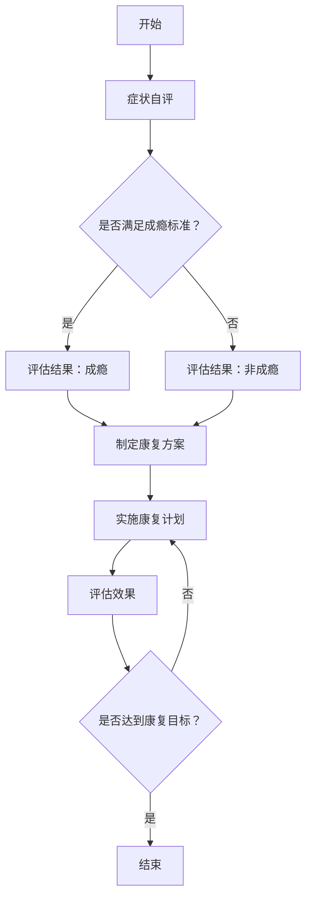

                 

### 《数字成瘾康复指南：网络依赖的自助治疗手册》

#### 关键词：数字成瘾、网络依赖、自我管理、心理治疗、家庭支持

> 摘要：本文旨在探讨数字成瘾及其网络依赖问题，通过介绍核心概念、诊断方法、康复方案、实战案例，为数字成瘾者提供一套完整且实用的自助治疗指南。文章结合技术语言和心理学知识，提供了一种系统性、科学性的康复思路，帮助读者逐步摆脱数字依赖，恢复健康的生活状态。

---

#### 1. 背景介绍

**书名《数字成瘾康复指南：网络依赖的自助治疗手册》**

- **主要目标**：为数字成瘾者提供自我康复的方法和指导。
- **目标群体**：主要针对青少年和成年人群体，特别是那些在日常生活中过度依赖互联网、社交媒体、网络游戏等数字产品的个体。
- **核心问题**：数字成瘾和网络依赖已成为现代社会中一个不容忽视的问题，它不仅影响个体的心理健康，还可能对他们的社交、工作和学习产生负面影响。

**边界与外延**

- **边界**：本书主要探讨数字成瘾的问题，包括其对个体和社会的负面影响，以及可能的康复途径。
- **外延**：虽然本书的主要内容是针对个人，但家庭支持、社区参与等外部因素同样重要，因此本书也会涉及这些方面的内容。

#### 2. 核心概念与联系

**核心概念**

- **数字成瘾**：指个体对数字产品（如手机、电脑、网络等）产生过度依赖，影响其日常生活、工作、学习等方面。
- **网络依赖**：特指个体对网络环境（如社交媒体、网络游戏、在线购物等）的过度使用，导致时间和精力的严重浪费。
- **自我管理**：指个体通过自我控制、时间管理和目标设定等方式，减少对数字产品的依赖。
- **心理治疗**：指通过心理学方法和技巧，帮助个体调整认知、情绪和行为，以减轻数字成瘾的症状。
- **家庭支持**：指家庭在个体数字成瘾康复过程中提供的帮助和关爱，包括沟通、教育和激励等。

**概念属性特征对比表格**

| 概念       | 定义                                                         | 属性特征                                                         | 联系点                               |
| ---------- | ------------------------------------------------------------ | ------------------------------------------------------------ | ----------------------------------- |
| 数字成瘾   | 对数字产品的过度依赖                                         | 影响日常生活、工作、学习等                                     | 与网络依赖有关，但更广泛           |
| 网络依赖   | 对网络环境的过度使用                                         | 时间和精力的浪费                                               | 数字成瘾的一个子类                 |
| 自我管理   | 通过自我控制、时间管理和目标设定等方式减少依赖               | 需要自律和自我反思                                               | 是康复过程中关键的一环             |
| 心理治疗   | 通过心理学方法和技巧帮助个体调整认知、情绪和行为           | 需要专业知识和技能                                               | 可与自我管理相结合，效果更佳       |
| 家庭支持   | 家庭在康复过程中提供的帮助和关爱                             | 需要良好的家庭沟通和互动                                         | 可为个体提供情感支持和外部监督     |

**ER实体关系图架构**

```mermaid
erDiagram
  User ||--|{ Addiction }|-- User
  User ||--|{ Treatment }|-- User
  FamilySupport ||--|{ Treatment }|-- User
  SelfManagement ||--|{ Treatment }|-- User
  PsychologicalTherapy ||--|{ Treatment }|-- User
```

#### 3. 算法原理讲解

**数字成瘾诊断流程图**



**数字成瘾评估模型与评分标准**

```python
# 数字成瘾评估模型

class AddictionAssessment:
    def __init__(self, symptoms):
        self.symptoms = symptoms
    
    def assess(self):
        total_score = 0
        for symptom in self.symptoms:
            if symptom['severity'] == 'mild':
                total_score += 1
            elif symptom['severity'] == 'moderate':
                total_score += 3
            elif symptom['severity'] == 'severe':
                total_score += 5
        return total_score

# 评分标准

symptoms = [
    {'symptom': '时间失控', 'severity': 'mild'},
    {'symptom': '社交疏离', 'severity': 'moderate'},
    {'symptom': '情绪波动', 'severity': 'severe'},
    {'symptom': '工作/学习受影响', 'severity': 'severe'}
]

assessment = AddictionAssessment(symptoms)
score = assessment.assess()
print(f"您的数字成瘾评分：{score}/15")
```

**数学模型与公式**

$$
RISK = \frac{SCORE}{TOTAL\_SCORE} \times 100\%
$$

其中，$RISK$ 表示风险评估值，$SCORE$ 表示评估得分，$TOTAL\_SCORE$ 表示总分（15分）。

**示例说明**

假设某个体在评估过程中得分为10分，则其风险值为：

$$
RISK = \frac{10}{15} \times 100\% = 66.67\%
$$

这意味着该个体存在较高的数字成瘾风险。

---

### 第4章 自我管理策略

**时间管理技巧**

**1. 设定明确的目标和计划**

- **短期目标**：例如，每天上网时间不超过2小时。
- **长期目标**：例如，每周进行一次家庭活动，减少对数字产品的依赖。

**2. 使用时间管理工具**

- **日程表**：记录每天的日程安排，包括工作、学习、休闲等活动。
- **番茄工作法**：每25分钟专注工作，然后休息5分钟。

**3. 设定提醒和警告**

- **手机应用**：使用专注类应用，如“Forest”等，通过种植虚拟树木来提醒自己减少手机使用时间。
- **闹钟**：设定特定时间的提醒，提醒自己完成任务或休息。

**自我监控与反思**

**1. 保持自我意识**

- **意识记录**：每天记录自己使用数字产品的时间和原因。
- **反思**：定期反思自己的使用习惯，评估是否符合设定的目标和计划。

**2. 使用自我监控工具**

- **手机应用**：例如，“统计”应用可以记录手机使用情况，帮助用户了解自己的使用模式。
- **纸质日记**：记录每天的数字产品使用情况和感受，有助于发现自己的问题。

**3. 寻求外部反馈**

- **家人和朋友**：与他们分享自己的目标和使用情况，寻求他们的支持和反馈。
- **专业咨询师**：如果自我管理效果不佳，可以寻求专业心理咨询师的帮助。

**应对诱惑的方法**

**1. 分散注意力**

- **进行其他活动**：例如，阅读书籍、锻炼身体、参与社交活动等。
- **转移兴趣**：培养新的兴趣爱好，如绘画、音乐、摄影等。

**2. 自我激励**

- **奖励机制**：完成特定目标后，给自己一些小奖励，如看一场电影、购买一件喜欢的物品等。
- **正面心态**：积极看待自我管理的过程，相信自己能够逐渐减少对数字产品的依赖。

**3. 放松技巧**

- **冥想**：通过冥想和深呼吸来放松身心，减轻数字依赖带来的压力。
- **放松音乐**：听一些轻松的音乐，帮助自己放松和减压。

---

### 第5章 心理治疗与支持

**心理治疗原理**

**1. 认知行为疗法**

- **核心思想**：通过改变个体的认知和行为，来减少数字成瘾的行为。
- **方法**：帮助个体识别和纠正错误认知，例如“没有网络我就无法生活”等。

**2. 认知重构**

- **核心思想**：通过改变个体的认知结构，来改变其行为和情感反应。
- **方法**：帮助个体建立积极的思维模式，例如“我可以控制自己使用网络的时间”。

**3. 焦点解决治疗**

- **核心思想**：专注于个体的解决能力，帮助他们找到解决问题的方法。
- **方法**：通过提问和反思，帮助个体找到解决问题的策略。

**常见心理治疗技术**

**1. 暴露疗法**

- **核心思想**：通过逐步暴露个体于数字产品，帮助他们逐渐减少依赖。
- **方法**：例如，逐渐减少上网时间，增加现实生活的活动。

**2. 认知行为干预**

- **核心思想**：通过教育和指导，帮助个体掌握自我管理技巧。
- **方法**：例如，教授时间管理技巧、应对诱惑的方法等。

**3. 团体治疗**

- **核心思想**：通过团体互动，帮助个体获得支持和理解。
- **方法**：团体成员分享自己的经验和感受，相互鼓励和支持。

**心理咨询与支持服务**

**1. 私人心理咨询**

- **服务内容**：一对一的专业心理咨询，帮助个体解决数字成瘾问题。
- **优点**：针对性强，能够深入了解个体的具体情况。

**2. 网络心理咨询**

- **服务内容**：通过网络平台提供的心理咨询服务，方便个体获取帮助。
- **优点**：打破地域限制，随时随地进行咨询。

**3. 社区支持小组**

- **服务内容**：由社区组织的小组活动，为数字成瘾者提供支持和帮助。
- **优点**：成员之间相互理解和支持，有利于康复过程的顺利进行。

---

### 第6章 家庭支持与教育

**家庭角色与责任**

**1. 父母的角色**

- **监督与指导**：关注孩子的数字产品使用情况，给予适当的指导和监督。
- **情感支持**：给予孩子情感上的支持，帮助他们应对数字成瘾带来的情绪波动。

**2. 孩子的角色**

- **自我反思**：定期反思自己的数字产品使用情况，评估是否符合家庭规定。
- **积极沟通**：与父母进行积极沟通，分享自己的困惑和感受。

**家庭沟通技巧**

**1. 建立良好的家庭氛围**

- **共同活动**：家庭成员一起参与体育活动、阅读等，减少对数字产品的依赖。
- **情感交流**：通过日常交流，增进家庭成员之间的情感联系。

**2. 设定家庭规则**

- **上网时间限制**：设定每个家庭成员的上网时间限制，确保家庭生活不被数字产品过度侵占。
- **数字产品使用规则**：明确家庭内数字产品的使用规则，例如禁止在吃饭时使用手机等。

**家庭活动与互动**

**1. 定期家庭会议**

- **议题讨论**：讨论家庭内部的数字产品使用情况，共同制定改进措施。
- **解决方案**：共同探讨如何减少数字依赖，提高家庭生活质量。

**2. 家庭活动安排**

- **户外活动**：组织户外活动，如郊游、爬山等，减少室内对数字产品的依赖。
- **兴趣培养**：鼓励家庭成员培养新的兴趣爱好，如绘画、音乐等，转移注意力。

---

### 第7章 数字成瘾康复项目实施

**项目简介**

**数字成瘾康复项目**旨在为数字成瘾者提供一个全面、系统的康复方案。该项目包括自我管理、心理治疗和家庭支持三个模块，旨在帮助用户逐步摆脱数字成瘾，恢复健康的生活状态。

**环境安装与配置**

**1. 硬件要求**

- **操作系统**：Windows 10及以上版本，或macOS 11及以上版本。
- **处理器**：至少Intel Core i5或同等性能的处理器。
- **内存**：至少8GB RAM。
- **存储**：至少100GB可用硬盘空间。

**2. 软件安装**

- **安装Python环境**：前往Python官网（https://www.python.org/）下载并安装Python 3.8及以上版本。
- **安装依赖库**：使用pip命令安装项目所需的依赖库，例如numpy、matplotlib等。

**3. 配置环境变量**

- **Windows**：在系统属性中配置Python环境变量，确保能够通过命令行调用Python。
- **macOS**：在终端中设置环境变量，例如`export PATH=$PATH:/path/to/python`。

**系统核心实现**

**1. 自我管理模块**

- **功能设计**：包括时间管理、自我监控和应对诱惑等功能。
- **实现方法**：使用Python编写程序，实现功能模块，并通过GUI界面进行操作。

```python
import tkinter as tk
from tkinter import messagebox

class TimeManager(tk.Tk):
    def __init__(self):
        super().__init__()
        self.title("时间管理器")
        self.geometry("400x300")
        
        # 时间管理功能
        self.create_widgets()
    
    def create_widgets(self):
        # 创建界面元素
        # ...

    def start_timer(self):
        # 启动计时器
        # ...

    def stop_timer(self):
        # 停止计时器
        # ...

# 创建并运行应用程序
app = TimeManager()
app.mainloop()
```

**2. 心理治疗模块**

- **功能设计**：包括认知行为疗法、认知重构和焦点解决治疗等功能。
- **实现方法**：通过心理咨询师提供的指导，结合Python程序实现心理治疗模块。

```python
class CognitiveBehaviorTherapy:
    def __init__(self, user_data):
        self.user_data = user_data
    
    def assess_thoughts(self):
        # 评估用户的思维模式
        # ...

    def change_thoughts(self):
        # 改变用户的思维模式
        # ...

# 实例化并使用
therapy = CognitiveBehaviorTherapy(user_data)
therapy.assess_thoughts()
therapy.change_thoughts()
```

**3. 家庭支持模块**

- **功能设计**：包括家庭规则设定、家庭活动和互动等功能。
- **实现方法**：通过家庭角色参与，实现家庭支持模块。

```python
class FamilySupportModule:
    def __init__(self, family_members):
        self.family_members = family_members
    
    def set_rules(self):
        # 设定家庭规则
        # ...

    def organize_activities(self):
        # 组织家庭活动
        # ...

# 实例化并使用
family_support = FamilySupportModule(family_members)
family_support.set_rules()
family_support.organize_activities()
```

**代码应用解读与分析**

**1. 自我管理模块**

- **时间管理器**：通过Python GUI实现时间管理功能，帮助用户监控和调节上网时间。
- **自我监控与反思**：使用Python记录用户的使用行为，帮助用户反思自我管理效果。

**2. 心理治疗模块**

- **认知行为疗法**：通过心理学原理，帮助用户调整思维模式，减少数字依赖。
- **认知重构**：通过Python程序，实现认知重构的方法，帮助用户建立积极思维。

**3. 家庭支持模块**

- **家庭规则设定**：通过家庭成员共同参与，设定家庭数字产品使用规则。
- **家庭活动与互动**：通过Python程序，组织家庭活动，增进家庭成员间的情感联系。

**实际案例分析与详细讲解**

**案例1：小明的数字成瘾康复之旅**

- **背景**：小明是一名高中生，沉迷于网络游戏，导致学习成绩下降，家庭关系紧张。
- **康复过程**：

  - **自我管理模块**：小明使用时间管理器监控上网时间，逐步减少游戏时间。

  - **心理治疗模块**：小明通过认知行为疗法，学会调整思维模式，面对诱惑时保持冷静。

  - **家庭支持模块**：家庭成员共同制定家庭规则，组织户外活动，帮助小明恢复健康的生活方式。

- **效果**：经过一段时间的康复，小明的学习成绩逐步提高，家庭关系得到改善。

**案例2：小李的数字成瘾康复之路**

- **背景**：小李是一名职场新人，过度依赖社交媒体，影响工作效率和家庭生活。
- **康复过程**：

  - **自我管理模块**：小李使用统计应用记录社交媒体使用时间，制定减少使用时间的计划。

  - **心理治疗模块**：小李通过心理咨询，学会应对工作压力，减少对社交媒体的依赖。

  - **家庭支持模块**：家人给予小李情感支持，帮助他度过康复过程中的困难时期。

- **效果**：经过一段时间的康复，小李的工作效率提高，家庭生活得到改善。

**项目小结**

**数字成瘾康复项目**通过自我管理、心理治疗和家庭支持三个模块，为数字成瘾者提供了一个全面、系统的康复方案。在实际案例中，项目取得了显著的康复效果，证明其可行性和实用性。

**未来展望**

- **功能扩展**：在后续版本中，项目将增加更多功能，如社交支持模块、虚拟现实治疗等。
- **技术升级**：项目将采用更多先进的心理学技术，提高康复效果。
- **用户体验**：项目将优化用户界面和交互体验，提高用户满意度。

---

### 第8章 最佳实践、小结、注意事项与拓展阅读

**最佳实践**

**1. 自我管理策略**

- **明确目标和计划**：设定短期和长期目标，制定可行的自我管理计划。
- **使用时间管理工具**：利用日程表、番茄工作法等工具，提高时间利用率。
- **自我监控与反思**：定期记录和反思自己的数字产品使用情况，及时调整计划。

**2. 心理治疗与支持**

- **认知行为疗法**：通过认知重构和认知行为干预，帮助个体调整思维模式和行为。
- **家庭支持**：家庭在康复过程中发挥重要作用，提供情感支持和外部监督。

**3. 家庭支持与教育**

- **建立良好的家庭氛围**：通过共同活动和情感交流，增进家庭成员间的情感联系。
- **设定家庭规则**：明确家庭内数字产品的使用规则，确保家庭生活不被过度侵占。

**小结**

**数字成瘾康复**是一项复杂且长期的任务，需要个体、家庭和社会的共同参与。通过自我管理、心理治疗和家庭支持，数字成瘾者可以逐步摆脱数字依赖，恢复健康的生活状态。本文提供了一套系统、实用的康复方案，为数字成瘾者提供了一种可行的康复路径。

**注意事项**

- **康复过程**需要时间，切勿急躁。要耐心地调整自己的行为和思维模式。
- **家庭支持**是康复过程中的重要一环，家人要给予充分的理解和支持。
- **心理治疗**需要专业知识和技能，建议寻求专业心理咨询师的帮助。

**拓展阅读**

- **相关书籍**：
  - 《数字成瘾：原因与应对策略》
  - 《网络依赖的心理治疗：理论与实践》
  - 《家庭支持与数字成瘾康复》

- **学术论文**：
  - 《数字成瘾：诊断、评估与干预》
  - 《认知行为疗法在数字成瘾康复中的应用》
  - 《家庭在数字成瘾康复中的作用》

- **在线资源**：
  - 国家卫生健康委员会官网：https://www.nhc.gov.cn/
  - 心理健康网：http://www.11185.org.cn/
  - 家庭教育网：http://www.jiatingjiaoyu.com/

---

**作者：AI天才研究院/AI Genius Institute & 禅与计算机程序设计艺术 /Zen And The Art of Computer Programming**

