                 

### 第1章: 数字成瘾问题的现状与挑战

数字成瘾，作为一种现代社会中的新型成瘾现象，已经成为影响个人和社会的重要问题。本章将深入探讨数字成瘾的定义、特征，以及其对个人和社会的深远影响。

#### 1.1 数字成瘾的定义与特征

数字成瘾，通常指的是个体过度依赖数字设备、互联网或特定数字活动，导致其日常生活、工作、学习和社会功能受到严重影响的一种行为现象。数字成瘾的特征包括：

- **时间投入**：个体在数字设备和互联网上的时间投入远超正常需求，影响到其他重要活动的进行。

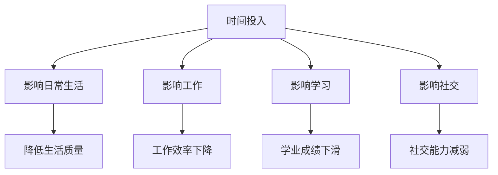

- **情绪依赖**：个体在数字活动和互联网中寻求情绪满足，无法自我控制地中断或减少这些活动。

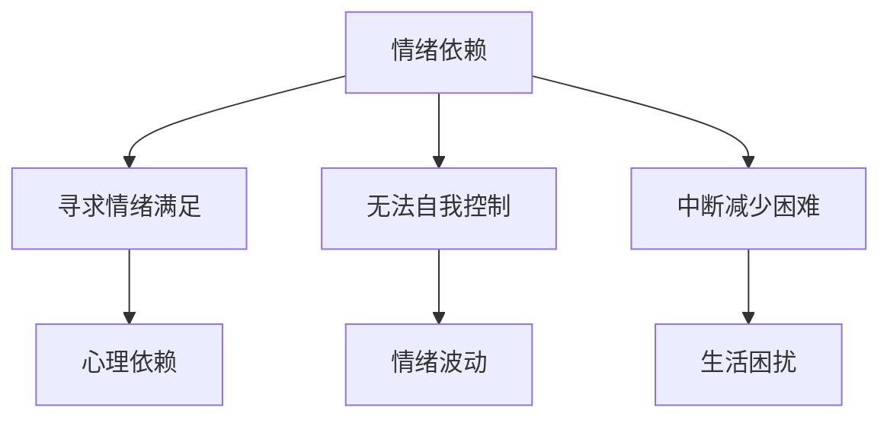

- **逃避现实**：个体借助数字设备和互联网逃避现实生活中的问题或压力。

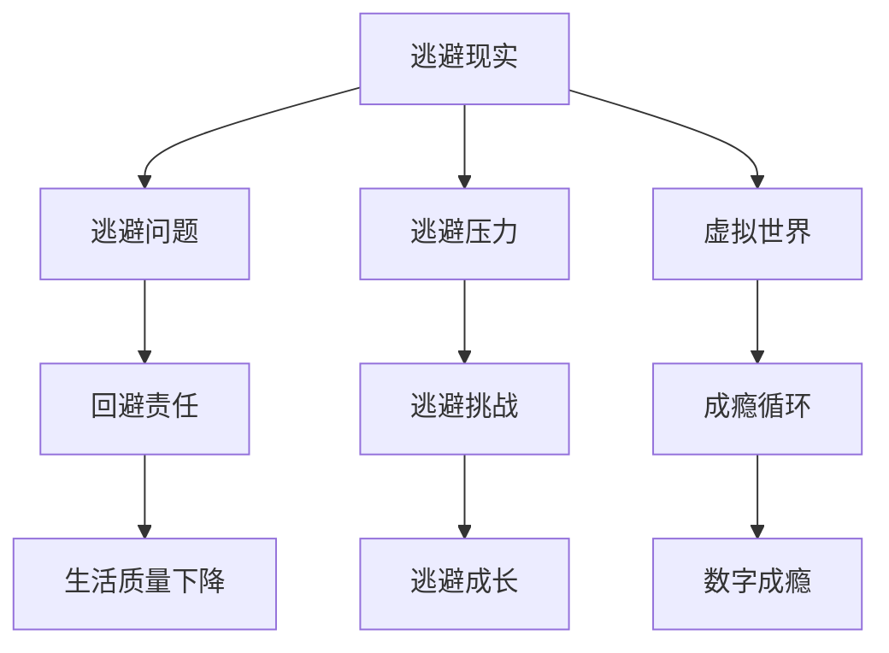

- **社会功能损害**：数字成瘾导致个体的社会交往、学习、工作等社会功能受到损害。

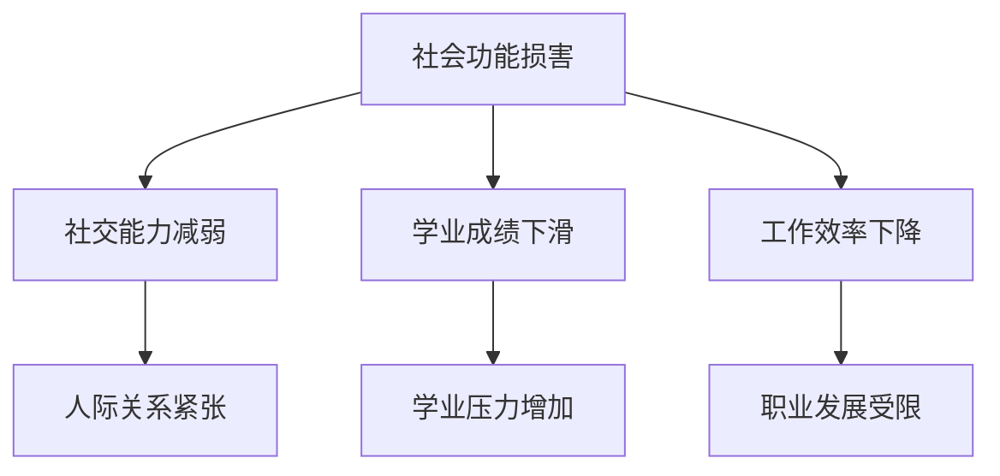

#### 1.2 数字成瘾对个人和社会的影响

数字成瘾对个人的影响是多方面的：

- **心理健康问题**：数字成瘾可能导致焦虑、抑郁等心理健康问题，影响生活质量。

```latex
$$ \text{焦虑} = f(\text{数字成瘾时间}) $$
$$ \text{抑郁} = f(\text{情绪依赖程度}) $$
$$ \text{心理健康} = f(\text{逃避现实倾向}) $$
```

- **生理健康问题**：长时间使用数字设备可能导致视力下降、颈椎病、肥胖等生理健康问题。

```latex
$$ \text{视力下降} = f(\text{使用数字设备时间}) $$
$$ \text{颈椎病} = f(\text{姿势不良}) $$
$$ \text{肥胖} = f(\text{缺乏运动}) $$
```

- **人际关系问题**：数字成瘾导致个体与家人、朋友的关系疏远，影响社交和情感支持。

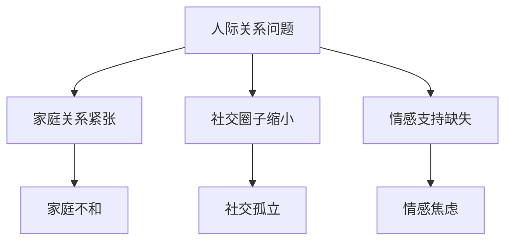

- **教育和工作问题**：数字成瘾导致个体在学习和工作中的表现下降，影响学业和职业发展。

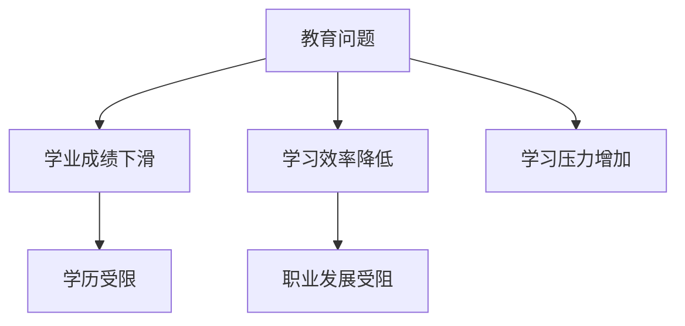

- **社会问题**：数字成瘾可能导致社会问题的增加，如网络犯罪、网络暴力、隐私泄露等。

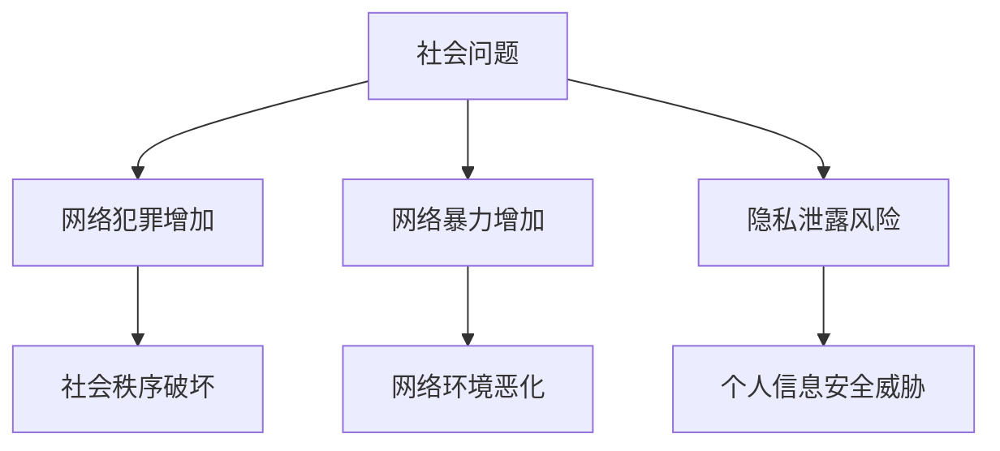

#### 1.3 数字成瘾问题的应对策略

为了有效应对数字成瘾问题，我们需要采取一系列综合性的策略：

- **预防教育**：通过教育提高公众对数字成瘾的认识，增强个体的数字素养和自我管理能力。

- **家庭支持**：家庭是预防和治疗数字成瘾的重要环境，家长应关注孩子的数字设备使用情况，提供适当的支持和引导。

- **专业治疗**：对于严重的数字成瘾患者，需要寻求专业心理治疗和药物治疗，结合个体情况制定个性化的康复计划。

- **社区干预**：社区可以组织相关活动，如讲座、培训、康复小组等，帮助数字成瘾者建立健康的社交关系和生活方式。

- **政策支持**：政府应出台相关政策，加强对数字设备使用的规范和监管，提供必要的法律保障和支持。

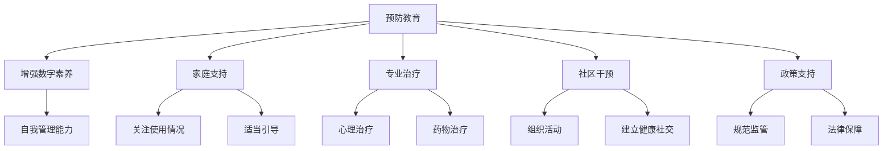

通过上述策略的综合应用，我们可以更有效地应对数字成瘾问题，帮助患者恢复健康，提高生活质量。接下来的章节将进一步探讨数字戒断康复中心的工作模式、治疗方法以及最佳实践。

### 第2章: 核心概念与联系

在深入探讨数字戒断康复中心的工作原理和治疗方法之前，我们需要明确一些核心概念和它们之间的联系。本章将介绍数字戒断的概念与原理，并对比不同属性特征，通过ER实体关系图架构帮助理解各概念之间的关系。

#### 2.1 数字戒断的概念与原理

数字戒断，即个体从过度使用数字设备、互联网或特定数字活动中逐步退出，恢复生活、工作和社会功能的一种过程。数字戒断的原理基于以下几个核心概念：

- **成瘾机制**：数字成瘾的形成通常涉及到生理、心理和行为三个方面，包括大脑奖励机制、习惯形成和逃避行为。

- **戒断症状**：数字戒断过程中，个体可能会经历一系列心理和生理上的戒断症状，如焦虑、失眠、注意力不集中等。

- **康复目标**：数字戒断的目标是帮助个体恢复正常的心理和生理状态，提高生活质量和工作效率。

- **康复策略**：数字戒断策略包括心理治疗、药物治疗、家庭支持和社会干预等多种手段。

#### 2.2 数字戒断的属性特征对比

为了更好地理解数字戒断的属性特征，我们可以通过以下对比表格进行详细分析：

| 属性特征 | 定义与描述 | 对比说明 |
| :---: | :---: | :---: |
| **时间投入** | 个体在数字设备和互联网上的时间投入 | 数字成瘾者时间投入远超正常需求，戒断过程中需逐步减少使用时间 |
| **情绪依赖** | 个体在数字活动和互联网中寻求情绪满足 | 戒断过程中需学会自我调节情绪，减少对数字活动的依赖 |
| **逃避现实** | 借助数字设备和互联网逃避现实问题 | 戒断过程中需面对现实问题，逐步减少逃避行为 |
| **社会功能损害** | 数字成瘾导致个体的社会交往、学习、工作等社会功能受到损害 | 戒断过程中需恢复社会功能，提高生活质量 |
| **戒断症状** | 戒断过程中个体可能出现的心理和生理反应 | 如焦虑、失眠、注意力不集中等，需通过治疗缓解症状 |
| **康复目标** | 数字戒断的目标是帮助个体恢复正常的心理和生理状态 | 包括心理平衡、身体健康、社会功能恢复等 |
| **康复策略** | 数字戒断策略包括心理治疗、药物治疗、家庭支持和社会干预等多种手段 | 需根据个体情况选择合适的康复策略，实现最佳效果 |

#### 2.3 数字戒断与心理治疗的关系

数字戒断与心理治疗有着紧密的联系，两者相辅相成，共同推动个体康复：

- **心理治疗的作用**：心理治疗在数字戒断过程中起着关键作用，通过认知行为疗法、情绪调节疗法等帮助个体改变成瘾行为，应对戒断症状。

- **心理治疗的挑战**：数字戒断过程中，心理治疗师需要面对复杂的心理和行为问题，如情绪依赖、逃避行为、社会功能损害等。

- **心理治疗的策略**：心理治疗策略包括个体治疗、家庭治疗、团体治疗等，根据个体情况制定个性化的康复计划。

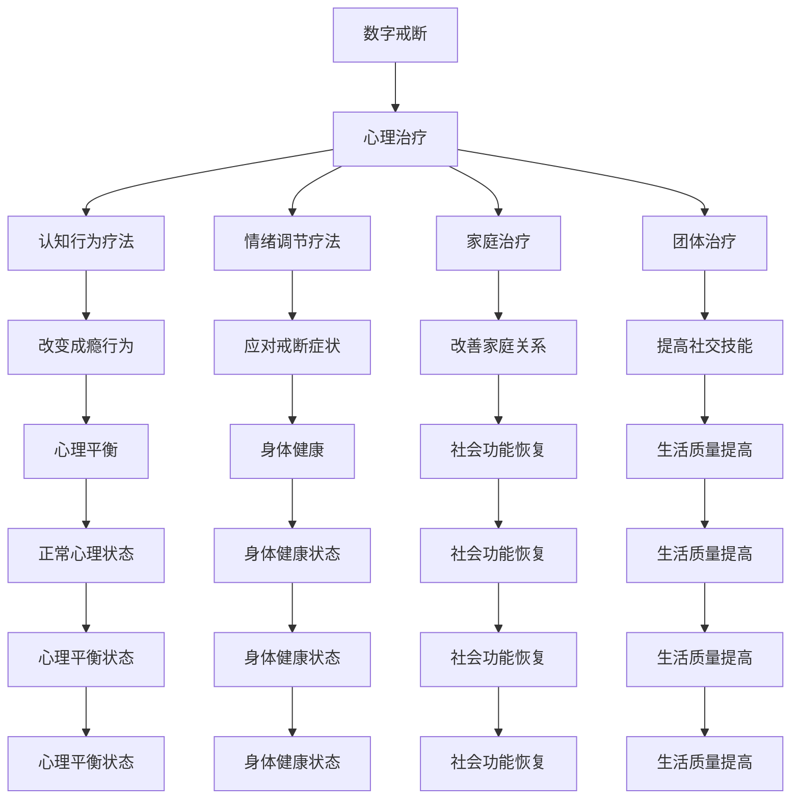

通过上述核心概念和联系的分析，我们可以更深入地理解数字戒断康复中心的工作原理和治疗方法。接下来，我们将探讨数字戒断康复中心的具体工作模式和运营流程。

### 第3章: 数字戒断康复中心的工作模式

数字戒断康复中心是一种专门为帮助网络成瘾者恢复正常生活提供专业服务的机构。本章将详细介绍康复中心的工作模式，包括组织架构、运营流程以及具体治疗方法。

#### 3.1 康复中心的组织架构

数字戒断康复中心的组织架构通常包括以下几个部分：

- **管理层**：负责中心的整体运营和管理，包括主任、副主任、护士长等职位。
- **治疗师团队**：包括心理咨询师、心理治疗师、医生等专业人员，负责个体治疗和康复计划的制定。
- **护理人员**：负责患者的日常护理和安全管理，包括护士、护理员等职位。
- **教学人员**：负责康复课程的教学和培训，包括课程顾问、课程讲师等。
- **行政人员**：负责中心的行政管理和后勤支持，包括秘书、财务人员等。

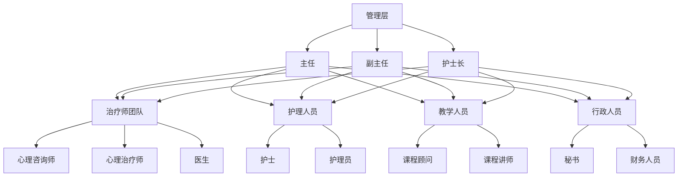

#### 3.2 康复中心的运营流程

数字戒断康复中心的运营流程通常包括以下几个步骤：

1. **患者评估**：在患者入院后，治疗师团队会对患者进行全面的评估，包括心理状态、生活习惯、网络成瘾程度等，为制定康复计划提供依据。

2. **康复计划制定**：根据评估结果，治疗师团队会为患者制定个性化的康复计划，包括心理治疗、药物治疗、康复课程等。

3. **心理治疗**：心理治疗是康复计划的核心部分，包括认知行为疗法、情绪调节疗法、家庭治疗等，帮助患者改变成瘾行为，应对戒断症状。

4. **药物治疗**：如果患者症状严重，医生可能会开具药物治疗方案，以缓解心理和生理上的戒断症状。

5. **康复课程**：康复课程包括各种技能培训、兴趣爱好培养等，旨在提高患者的生活质量，帮助他们融入正常生活。

6. **康复评估**：在康复过程中，治疗师团队会定期对患者的康复进展进行评估，根据情况调整康复计划。

7. **出院准备**：在患者康复情况达到预期后，治疗师团队会为患者制定出院计划，提供必要的家庭支持和后续治疗建议。

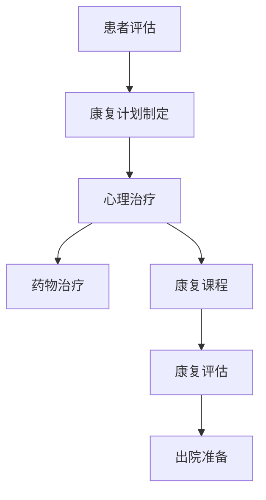

#### 3.3 康复中心的治疗方法

数字戒断康复中心的治疗方法多种多样，以下是一些主要的治疗方法：

- **认知行为疗法**：帮助患者识别和改变成瘾行为背后的认知偏差，建立健康的思维模式。

- **情绪调节疗法**：帮助患者掌握情绪调节技巧，减少情绪波动，提高应对压力的能力。

- **家庭治疗**：通过家庭成员的参与，改善家庭关系，为患者提供情感支持和康复环境。

- **药物治疗**：对于症状严重的患者，医生可能会开具抗焦虑药、抗抑郁药等，以缓解戒断症状。

- **心理教育**：通过教育提高患者对数字成瘾的认识，增强自我管理能力。

- **康复课程**：包括体育活动、艺术创作、社交技能训练等，旨在提高患者的生活质量和社交能力。

- **社区支持**：组织患者参与社区活动，帮助他们建立健康的社交圈子，提高社会支持。

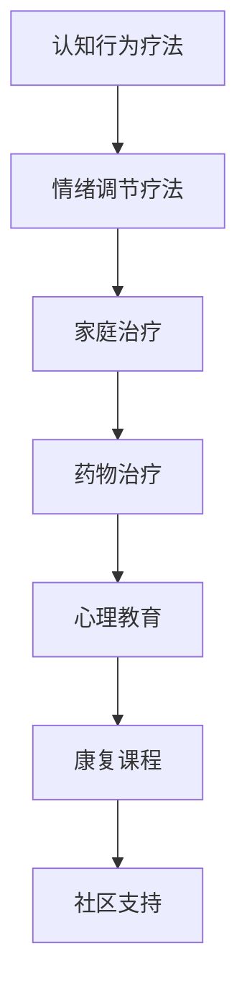

通过上述工作模式、运营流程和治疗方法，数字戒断康复中心为网络成瘾者提供全方位的支持，帮助他们克服成瘾问题，恢复正常生活。接下来，我们将探讨心理治疗在数字戒断中的应用。

### 第4章: 心理治疗在数字戒断中的应用

心理治疗在数字戒断过程中起着至关重要的作用，它帮助患者识别和改变成瘾行为，缓解戒断症状，提高康复效果。本章将详细探讨几种常见的心理治疗方法，包括认知行为疗法、情绪调节疗法和家庭治疗。

#### 4.1 认知行为疗法

认知行为疗法（Cognitive Behavioral Therapy，CBT）是一种基于认知科学和行为科学的心理治疗方法，旨在帮助患者识别和改变不合理的思维模式和行为习惯。在数字戒断中，CBT被广泛应用于以下几个方面：

1. **识别成瘾思维**：治疗师帮助患者识别和意识到成瘾行为背后的不合理思维，如“不玩网游我就无法缓解压力”或“不刷微博我就无法了解世界”。

2. **改变不合理思维**：通过认知重构技术，治疗师引导患者发现和改变这些不合理思维，建立更健康的思维模式，如“我可以找其他方式缓解压力”或“我有其他途径了解世界”。

3. **行为改变**：治疗师与患者共同制定行为改变计划，逐步减少数字设备的使用时间，增加现实生活中的活动，如运动、阅读、社交等。

**示例流程图：**

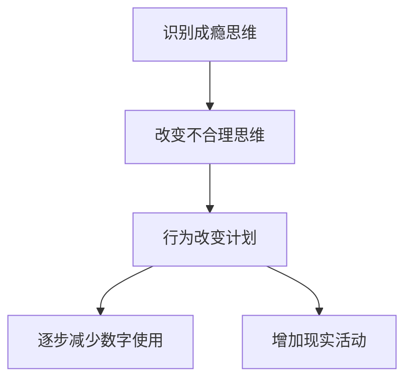

**示例代码：**

```python
# 识别成瘾思维
def identify_addictive_thoughts():
    thoughts = ["不玩网游我就无法缓解压力", "不刷微博我就无法了解世界"]
    return thoughts

# 改变不合理思维
def change_irrational_thoughts(thoughts):
    new_thoughts = ["我可以找其他方式缓解压力", "我有其他途径了解世界"]
    return new_thoughts

# 行为改变计划
def behavior_change_plan():
    plan = {
        "减少游戏时间": "每天减少一小时游戏时间",
        "增加现实活动": "每周参加一次体育活动或社交聚会"
    }
    return plan

# 实施行为改变计划
def implement_behavior_change(plan):
    print("每天减少一小时游戏时间")
    print("每周参加一次体育活动或社交聚会")

# 主函数
def main():
    addictive_thoughts = identify_addictive_thoughts()
    print("识别到的成瘾思维：", addictive_thoughts)
    new_thoughts = change_irrational_thoughts(addictive_thoughts)
    print("改变后的思维：", new_thoughts)
    plan = behavior_change_plan()
    print("行为改变计划：", plan)
    implement_behavior_change(plan)

main()
```

#### 4.2 情绪调节疗法

情绪调节疗法（Emotion Regulation Therapy，ERT）旨在帮助患者掌握情绪调节技巧，减少情绪波动，提高应对压力的能力。在数字戒断中，ERT特别适用于缓解戒断症状，如焦虑、抑郁和情绪波动。

1. **情绪识别**：治疗师帮助患者识别和理解自己的情绪，包括正面情绪和负面情绪。

2. **情绪表达**：治疗师引导患者学习如何健康地表达情绪，避免情绪压抑或过度表达。

3. **情绪调节**：治疗师教授患者情绪调节技巧，如深呼吸、放松训练、正念冥想等，帮助患者控制情绪波动。

**示例流程图：**

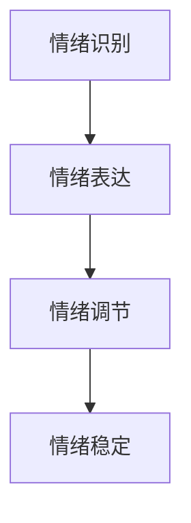

**示例代码：**

```python
# 情绪识别
def identify_emotions():
    emotions = ["焦虑", "抑郁", "愤怒"]
    return emotions

# 情绪表达
def express_emotions(emotions):
    print("我感到：", emotions)

# 情绪调节
def regulate_emotions():
    techniques = ["深呼吸", "放松训练", "正念冥想"]
    print("我会尝试：", techniques)

# 主函数
def main():
    emotions = identify_emotions()
    express_emotions(emotions)
    regulate_emotions()

main()
```

#### 4.3 家庭治疗

家庭治疗（Family Therapy）通过家庭成员的参与，改善家庭关系，为患者提供情感支持和康复环境。在数字戒断中，家庭治疗有助于：

1. **改善家庭沟通**：治疗师协助家庭成员建立积极的沟通方式，减少冲突和误解。

2. **提供情感支持**：家庭成员在康复过程中提供情感支持，帮助患者应对戒断症状和情绪波动。

3. **家庭活动参与**：家庭成员参与康复活动，如家庭聚会、户外活动等，增强家庭成员之间的互动和情感联系。

**示例流程图：**

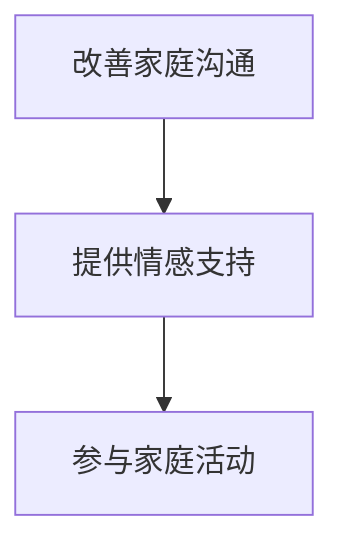

**示例代码：**

```python
# 改善家庭沟通
def improve_family_communication():
    print("我们家庭将积极沟通，减少冲突和误解。")

# 提供情感支持
def provide_emotional_support():
    print("我会给予你情感支持，帮助你应对戒断症状。")

# 参与家庭活动
def participate_family_activities():
    activities = ["家庭聚会", "户外活动"]
    print("我们将一起参与家庭活动：", activities)

# 主函数
def main():
    improve_family_communication()
    provide_emotional_support()
    participate_family_activities()

main()
```

通过认知行为疗法、情绪调节疗法和家庭治疗的综合应用，数字戒断康复中心能够为患者提供全方位的心理支持，帮助他们克服成瘾问题，恢复健康。接下来，我们将探讨药物治疗在数字戒断中的作用。

### 第5章: 药物治疗在数字戒断中的作用

药物治疗在数字戒断过程中扮演着重要的辅助角色，特别适用于那些戒断症状较严重的患者。本章将详细讨论药物治疗的类型、原理、副作用以及与心理治疗的结合应用。

#### 5.1 药物治疗的类型与原理

数字戒断的药物治疗主要包括以下几种类型：

1. **抗抑郁药**：用于治疗因数字戒断引起的抑郁症状，如选择性5-羟色胺再摄取抑制剂（SSRIs）。

2. **抗焦虑药**：用于缓解戒断过程中产生的焦虑症状，如苯二氮卓类药物。

3. **情绪稳定剂**：用于调节情绪波动，如锂盐。

4. **去甲肾上腺素和5-羟色胺再摄取抑制剂（SNRIs）**：新型抗抑郁药，作用机制类似于SSRIs。

5. **食欲抑制剂**：用于控制食欲，减轻体重，如芬氟拉明。

**药物治疗的原理：**

- **抗抑郁药**：通过增加大脑中的神经递质（如5-羟色胺和多巴胺）水平，改善情绪和认知功能。

- **抗焦虑药**：通过抑制神经系统的过度兴奋，减轻焦虑和紧张感。

- **情绪稳定剂**：通过调节神经递质的释放，平衡情绪状态。

- **SNRIs**：通过抑制神经递质的再摄取，增加神经递质在神经元间的传递。

- **食欲抑制剂**：通过减少食欲，降低体重，减少因肥胖导致的健康问题。

#### 5.2 药物治疗的副作用与管理

虽然药物治疗在缓解戒断症状方面具有显著效果，但不同类型的药物也可能带来一定的副作用。以下是一些常见药物的副作用及其管理方法：

| 药物类型 | 常见副作用 | 管理方法 |
| :---: | :---: | :---: |
| **抗抑郁药** | 消化不良、头痛、失眠、性功能障碍 | 调整剂量、伴随心理治疗、监测副作用 |
| **抗焦虑药** | 头晕、嗜睡、肌肉无力、依赖性 | 逐步减量、伴随心理治疗、监测依赖性 |
| **情绪稳定剂** | 体重增加、头晕、手脚僵硬、甲状腺功能异常 | 定期检查、调整剂量、监测甲状腺功能 |
| **SNRIs** | 消化不良、失眠、头痛、性功能障碍 | 调整剂量、伴随心理治疗、监测副作用 |
| **食欲抑制剂** | 心悸、失眠、高血压、焦虑、依赖性 | 严格遵医嘱、监测血压和心脏健康、逐步减量 |

**示例代码：**

```python
# 药物治疗副作用监测系统

# 添加药物副作用
def add_side_effects(drug, side_effects):
    if drug in side_effects:
        side_effects[drug].append(side_effects)
    else:
        side_effects[drug] = [side_effects]

# 监测副作用
def monitor_side_effects(side_effects):
    for drug, effects in side_effects.items():
        print(f"{drug} 的副作用：{effects}")

# 主函数
def main():
    side_effects = {}
    add_side_effects("抗抑郁药", "消化不良、头痛、失眠、性功能障碍")
    add_side_effects("抗焦虑药", "头晕、嗜睡、肌肉无力、依赖性")
    add_side_effects("情绪稳定剂", "体重增加、头晕、手脚僵硬、甲状腺功能异常")
    add_side_effects("SNRIs", "消化不良、失眠、头痛、性功能障碍")
    add_side_effects("食欲抑制剂", "心悸、失眠、高血压、焦虑、依赖性")
    monitor_side_effects(side_effects)

main()
```

#### 5.3 药物治疗与心理治疗的结合

药物治疗与心理治疗的结合应用能够显著提高数字戒断的康复效果。以下是结合应用的几种策略：

1. **共同治疗**：治疗师与医生共同制定康复计划，药物治疗与心理治疗相结合，针对患者的具体症状进行综合治疗。

2. **协同作用**：药物治疗可以帮助缓解心理治疗过程中出现的戒断症状，提高患者的治疗依从性。

3. **后续支持**：药物治疗结束后，心理治疗继续为患者提供支持和指导，巩固治疗效果。

**示例流程图：**

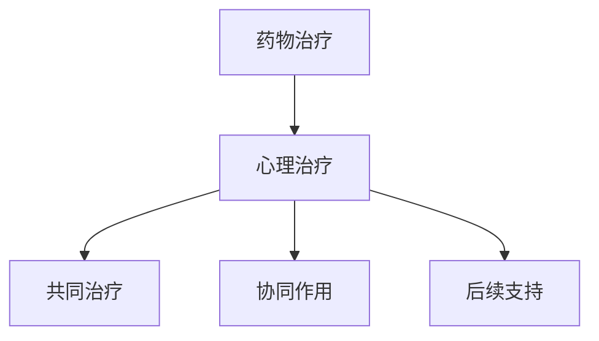

**示例代码：**

```python
# 药物治疗与心理治疗结合应用

# 药物治疗阶段
def medication_stage():
    print("正在进行药物治疗阶段，以缓解戒断症状。")

# 心理治疗阶段
def psychotherapy_stage():
    print("正在进行心理治疗阶段，帮助患者改变成瘾行为。")

# 后续支持阶段
def follow_up_stage():
    print("正在进行后续支持阶段，巩固治疗效果。")

# 主函数
def main():
    medication_stage()
    psychotherapy_stage()
    follow_up_stage()

main()
```

通过药物治疗的合理应用，结合心理治疗，数字戒断康复中心能够为患者提供更全面的治疗支持，帮助他们克服成瘾问题，恢复健康。接下来，我们将通过案例研究来进一步探讨数字戒断康复中心的具体应用和效果。

### 第6章: 数字戒断康复中心的案例研究

在本章中，我们将通过三个具体的案例研究，深入探讨数字戒断康复中心在实际治疗中的效果和应用。每个案例将详细描述患者的背景、康复过程、治疗方法以及最终的结果。

#### 6.1 案例一：青少年网络成瘾的治疗

**患者背景：**

小李，15岁，是一名初中生。他沉迷于网络游戏，每天花费数小时在游戏中，导致学业成绩下滑，与家人和同学的关系也日益紧张。小李的家长发现他的生活作息紊乱，经常熬夜，甚至开始逃学。

**康复过程：**

1. **初期评估**：康复中心的治疗师对小李进行了详细的评估，包括心理状态、生活习惯、网络成瘾程度等。评估结果显示，小李的数字成瘾程度较高，心理和生理症状明显。

2. **个性化康复计划**：治疗师团队根据评估结果，为小李制定了个性化的康复计划，包括认知行为疗法、家庭治疗和康复课程。

3. **心理治疗**：认知行为疗法帮助小李识别和改变沉迷网络游戏的思维模式，家庭治疗改善了小李与家人的关系，康复课程则帮助他培养其他兴趣爱好。

4. **家庭支持**：小李的家长积极参与康复过程，通过家庭活动和沟通，为小李提供了情感支持和正面的激励。

**治疗效果：**

经过一段时间的治疗，小李的成瘾行为得到了显著改善。他的网络游戏时间逐渐减少，学业成绩开始回升，与家人和同学的关系也变得更好。康复结束后，小李能够自我管理，不再沉迷于网络游戏。

#### 6.2 案例二：成年人网络游戏依赖的治疗

**患者背景：**

张先生，35岁，是一名公司职员。他沉迷于网络游戏，每天工作后都要花费大量时间在游戏中，导致工作效率下降，家庭关系紧张。张先生的妻子对此非常担忧，希望找到有效的方法帮助他戒除网瘾。

**康复过程：**

1. **初期评估**：康复中心的治疗师对张先生进行了详细的评估，包括心理状态、生活习惯、网络成瘾程度等。评估结果显示，张先生的网络游戏依赖较为严重，影响了他的工作和家庭生活。

2. **个性化康复计划**：治疗师团队根据评估结果，为张先生制定了个性化的康复计划，包括药物治疗、认知行为疗法和家庭治疗。

3. **药物治疗**：医生为张先生开具了抗抑郁药和情绪稳定剂，帮助他缓解戒断症状，如焦虑和情绪波动。

4. **心理治疗**：认知行为疗法帮助张先生改变沉迷网络游戏的思维模式，家庭治疗改善了张先生与家人的关系。

5. **职业辅导**：康复中心还提供了职业辅导服务，帮助张先生提高工作效率，调整工作与生活的平衡。

**治疗效果：**

经过一段时间的治疗，张先生的游戏时间显著减少，工作效率得到提高，家庭关系也得到改善。他逐渐回归正常生活，不再沉迷于网络游戏。

#### 6.3 案例三：家庭式数字戒断康复计划

**患者背景：**

李女士，45岁，是一名家庭主妇。她沉迷于社交媒体，每天花费大量时间在微信和微博上，导致家庭责任缺失，家庭关系紧张。李女士的家人希望她能够通过家庭式的康复计划戒除网瘾。

**康复过程：**

1. **初期评估**：康复中心的治疗师对李女士进行了详细的评估，包括心理状态、生活习惯、网络成瘾程度等。评估结果显示，李女士的社交媒体成瘾程度较高，影响了她的家庭生活。

2. **家庭康复计划**：治疗师团队为李女士制定了一个家庭式的数字戒断康复计划，包括家庭治疗、康复课程和社交活动。

3. **家庭治疗**：通过家庭治疗，李女士的家人学会了如何支持她戒除网瘾，同时改善了家庭沟通和互动。

4. **康复课程**：康复中心提供了各种兴趣课程，如绘画、手工制作、户外活动等，帮助李女士培养其他兴趣爱好。

5. **社交活动**：治疗师团队组织了多次家庭和社区的社交活动，帮助李女士拓展社交圈子，减少对社交媒体的依赖。

**治疗效果：**

经过一段时间的治疗，李女士的社交媒体使用时间显著减少，家庭责任得到恢复，家庭关系也得到了改善。她逐渐融入社区，建立了新的社交圈子。

#### 案例小结

通过上述三个案例，我们可以看到数字戒断康复中心在不同背景的患者中取得了显著的疗效。无论是青少年网络成瘾、成年人网络游戏依赖还是家庭式数字戒断康复计划，康复中心都通过个性化的康复计划和全方位的支持，帮助患者戒除网瘾，恢复健康。这些案例的成功不仅证明了康复中心的有效性，也为其他类似的康复计划提供了宝贵的经验和参考。

### 第7章: 数字戒断康复中心的最佳实践

数字戒断康复中心的最佳实践是确保患者成功戒除网瘾、恢复正常生活的重要保障。本章将总结数字戒断康复中心在管理策略、服务创新和可持续发展方面的最佳实践。

#### 7.1 康复中心的管理策略

康复中心的管理策略需要综合考虑患者需求、资源利用和治疗效果。以下是几个关键的管理策略：

1. **个性化康复计划**：根据患者的具体需求和状况，制定个性化的康复计划。包括心理治疗、药物治疗、康复课程等，确保每位患者都能得到最适合自己的康复方案。

2. **团队协作**：治疗师团队、护理人员、教学人员和行政人员之间的紧密协作是康复中心成功的关键。通过定期会议、培训和工作分配，确保团队成员高效合作，提高康复效果。

3. **严格监督**：对患者的康复进度进行严格监督和评估，确保康复计划的有效实施。定期与患者及其家属沟通，了解患者的生活变化和康复需求。

4. **资源优化**：合理利用康复中心的资源，包括人力资源、物资设备和技术支持，确保资源的最大化利用和效益最大化。

#### 7.2 康复中心的服务创新

服务创新是康复中心持续发展的动力。以下是几种服务创新：

1. **线上康复服务**：随着互联网技术的发展，康复中心可以提供线上心理治疗、康复课程和家庭支持等服务。这不仅能扩大服务范围，还能提高患者的参与度和康复效果。

2. **多学科协作**：康复中心可以与其他医疗机构、教育机构和社会组织合作，提供综合性的康复服务。例如，与学校合作开展戒断康复课程，与社区合作组织社交活动，提高患者的社交能力和生活技能。

3. **虚拟现实康复**：利用虚拟现实技术，为患者提供沉浸式的康复体验。例如，通过虚拟现实游戏帮助患者放松心情，缓解戒断症状。

4. **患者自助平台**：开发患者自助平台，提供康复知识、心理测试、康复计划制定等自助服务。这不仅能提高患者的自主管理能力，还能增强患者的康复信心。

#### 7.3 康复中心的可持续发展

康复中心的可持续发展是确保长期服务能力的关键。以下是几个可持续发展策略：

1. **政策支持**：争取政府和社会各界的支持，通过政策扶持、资金投入和资源分配，确保康复中心的可持续发展。

2. **社会参与**：鼓励公众参与数字戒断康复事业，通过志愿者服务、捐赠和公益宣传，提高社会对数字戒断问题的关注和支持。

3. **科研创新**：加强科研创新，推动数字戒断康复领域的技术进步和方法创新。与科研机构和高校合作，开展数字戒断康复相关的研究项目。

4. **持续培训**：为治疗师、护理人员和管理人员提供持续培训，提高专业水平和实践能力，确保康复中心的持续发展。

通过最佳实践的管理策略、服务创新和可持续发展策略，数字戒断康复中心能够为患者提供高质量的康复服务，帮助他们成功戒除网瘾，恢复正常生活。接下来，我们将探讨数字戒断康复中心的未来展望。

### 第8章: 数字戒断康复中心的未来展望

随着科技的飞速发展和社会环境的变化，数字戒断康复中心面临着新的机遇和挑战。本章将探讨技术发展对数字戒断治疗的影响，以及数字戒断治疗的新趋势和未来展望。

#### 8.1 技术发展对数字戒断治疗的影响

技术发展对数字戒断治疗产生了深远的影响，主要体现在以下几个方面：

1. **远程治疗**：随着互联网技术的发展，远程治疗成为可能。康复中心可以提供线上心理治疗、康复课程和家庭支持等服务，扩大服务范围，提高患者的参与度和康复效果。

2. **人工智能**：人工智能技术在数字戒断治疗中的应用日益广泛。例如，通过机器学习算法分析患者的数据，帮助治疗师制定更个性化的康复计划；通过虚拟助手提供实时支持和指导，帮助患者更好地管理戒断过程。

3. **虚拟现实与增强现实**：虚拟现实（VR）和增强现实（AR）技术在数字戒断康复中的应用日益增多。通过沉浸式的虚拟体验，患者可以更好地应对戒断症状，放松心情，提高康复效果。

4. **大数据分析**：大数据技术可以帮助康复中心更全面地了解数字成瘾的成因和趋势，为政策制定和康复方案设计提供数据支持。

#### 8.2 数字戒断治疗的新趋势

随着技术的进步和社会观念的变化，数字戒断治疗呈现出一些新的趋势：

1. **综合治疗**：传统的单一治疗方法已不能满足患者的需求。康复中心逐渐采用综合治疗模式，结合心理治疗、药物治疗、康复课程和社会支持等多种手段，提供全方位的康复服务。

2. **个性化康复**：基于大数据和人工智能技术，康复中心能够为每位患者制定个性化的康复计划，提高康复效果。个性化康复不仅关注患者的生理和心理症状，还考虑其社会环境和个体需求。

3. **家庭和社区参与**：康复中心越来越重视家庭和社区在数字戒断康复中的作用。通过家庭治疗和社区活动，提高患者的家庭支持和社会支持，促进康复过程的顺利进行。

4. **预防与干预并重**：数字戒断康复中心不仅关注患者的康复，还积极参与预防工作。通过公众教育、政策倡导和社区干预等手段，预防数字成瘾问题的发生，减少数字成瘾对患者和社会的影响。

#### 8.3 数字戒断康复中心的未来发展

展望未来，数字戒断康复中心的发展将呈现以下几个方向：

1. **技术驱动的康复**：随着技术的不断发展，数字戒断康复中心将更加依赖于人工智能、大数据、虚拟现实等先进技术，提供更高效、更个性化的康复服务。

2. **跨学科合作**：康复中心将与其他学科领域，如医学、心理学、社会学等开展深入合作，推动数字戒断康复领域的研究和创新发展。

3. **全球化发展**：随着全球数字成瘾问题的日益严重，数字戒断康复中心将在全球范围内扩展服务，提供国际化的康复支持。

4. **可持续发展**：康复中心将积极探索可持续发展模式，通过政策支持、社会参与和科研创新，确保长期服务能力，为患者提供持续的康复支持。

通过技术驱动、跨学科合作、全球发展和可持续发展，数字戒断康复中心将更好地应对数字成瘾问题，为患者提供高质量的康复服务，帮助他们恢复正常生活。未来的数字戒断康复中心将成为一个综合性、技术先进、社会参与广泛的康复服务平台，为全球数字健康事业贡献力量。

### 总结与展望

数字戒断康复中心作为一种专门为网络成瘾者提供康复服务的专业机构，其重要性不言而喻。通过对数字成瘾问题的深入探讨，以及各种治疗方法和最佳实践的应用，我们看到了康复中心在帮助患者戒除网瘾、恢复正常生活中的巨大作用。

首先，数字戒断康复中心通过个性化康复计划、心理治疗、药物治疗、康复课程和家庭支持等多种手段，为患者提供全方位的支持。这不仅有助于缓解戒断症状，提高康复效果，还能帮助患者重建健康的生活方式。

其次，技术发展为数字戒断康复中心带来了新的机遇和挑战。远程治疗、人工智能、虚拟现实和大数据分析等技术，使得康复服务更加高效、个性化和便捷。同时，跨学科合作和全球发展的趋势也为康复中心提供了更广阔的舞台。

展望未来，数字戒断康复中心将继续朝着技术驱动、跨学科合作、全球发展和可持续发展的方向迈进。通过不断探索和创新，康复中心将更好地应对数字成瘾问题，为全球数字健康事业做出更大贡献。

最后，我们呼吁社会各界共同关注数字戒断问题，积极参与到康复事业中来。通过政策支持、社会参与和科研创新，共同构建一个健康、和谐、数字素养良好的社会。让每个人都能享受到数字技术的便利，同时避免其带来的负面影响。

### 注意事项

1. **康复计划的个性化**：每位患者的成瘾程度和康复需求不同，康复计划应个性化定制，确保对症治疗。

2. **药物治疗的风险**：药物治疗需在专业医生的指导下进行，注意药物副作用和管理。

3. **心理治疗的持续性**：心理治疗是一个长期过程，需要患者持续参与和治疗师的支持。

4. **家庭和社区的支持**：家庭和社区的支持对患者的康复至关重要，要积极参与康复活动，为患者提供情感支持。

5. **预防教育的重要性**：预防教育是预防数字成瘾的关键，要从儿童时期开始，提高数字素养和自我管理能力。

### 拓展阅读

1. **《数字成瘾：原因与治疗》**：详细介绍了数字成瘾的成因、症状和治疗方法，是理解数字戒断康复的重要参考文献。

2. **《认知行为疗法在数字戒断中的应用》**：探讨了认知行为疗法在数字戒断治疗中的应用，提供了实用的治疗技巧和案例。

3. **《虚拟现实与数字健康》**：介绍了虚拟现实技术在数字戒断康复中的应用，展示了其潜力与前景。

4. **《数字素养：培养数字时代的公民》**：从教育和社会发展的角度，讨论了数字素养的重要性，以及如何培养数字素养。

5. **《数字戒断康复中心的最佳实践》**：总结了全球范围内数字戒断康复中心的成功经验，提供了宝贵的实践指导和案例。

通过以上拓展阅读，读者可以更深入地了解数字戒断康复中心的工作原理和实践方法，为自身和家庭提供更有针对性的支持。

### 作者信息

**作者：AI天才研究院/AI Genius Institute & 禅与计算机程序设计艺术 /Zen And The Art of Computer Programming** 

AI天才研究院（AI Genius Institute）是一家专注于人工智能技术研究和应用的创新机构，致力于推动人工智能领域的发展。禅与计算机程序设计艺术（Zen And The Art of Computer Programming）则是一部计算机编程领域的经典著作，阐述了计算机编程的哲学和艺术。两位作者在人工智能和计算机编程领域有着深厚的学术造诣和丰富的实践经验，共同撰写了这篇关于数字戒断康复中心的技术博客，旨在为读者提供全面、深入的专业知识。

