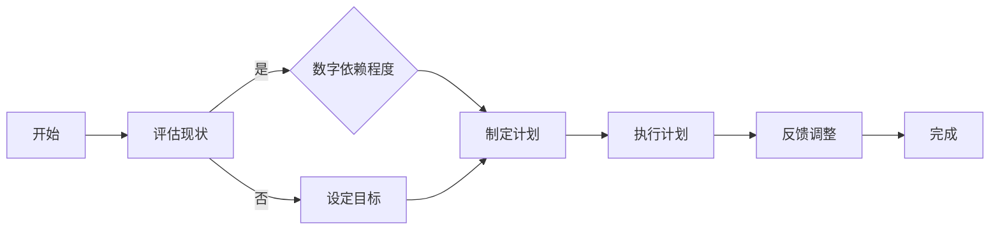
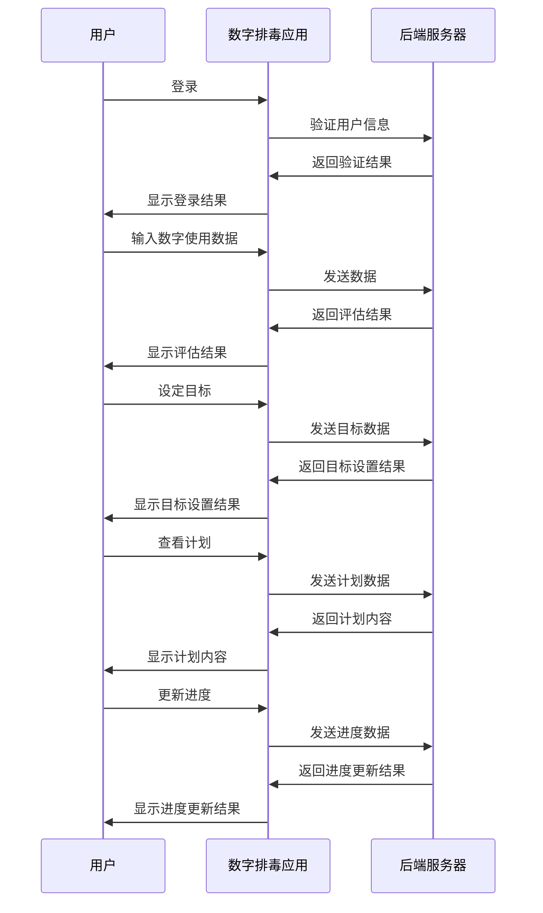

                 


### 数字排毒训练营：重建注意力与深度思考的集中课程

#### 关键词：
- 数字排毒
- 注意力重建
- 深度思考
- 媒体使用习惯
- 算法设计

#### 摘要：
本文旨在探讨数字排毒的重要性，介绍一系列重建注意力与深度思考的核心概念、算法原理和实际应用，帮助读者在快节奏的数字化生活中找回专注力和思考深度。

### 第一部分：背景介绍

#### 1.1 数字排毒的概念

数字排毒，是指通过有意识地减少对数字设备的依赖和使用时间，以恢复身心健康、提高工作和学习效率的过程。在现代社会，随着智能手机、社交媒体和即时通讯工具的普及，人们面临着越来越多的数字干扰，这导致了注意力分散、焦虑和生产力下降等问题。

#### 1.2 为什么我们需要数字排毒

- **注意力问题**：研究表明，长时间使用数字设备会导致注意力不集中，影响认知功能。
- **心理健康问题**：过度使用社交媒体可能导致焦虑、抑郁和孤独感。
- **生产力下降**：频繁的分心和通知提醒会打断工作流程，降低工作效率。
- **睡眠障碍**：晚上使用电子设备会影响睡眠质量，进而影响身心健康。

#### 1.3 问题解决

数字排毒提供了一种解决方案，通过逐步减少对数字设备的依赖，恢复专注力和深度思考的能力，从而提高生活质量和工作效率。

#### 1.4 数字排毒的边界与外延

数字排毒不仅仅是一种短期行为改变，更是一种长期的生活方式和思维方式。它涉及对媒体使用习惯的反思和调整，以及对注意力和时间管理的重新规划。

#### 1.5 数字排毒的核心要素组成

- **时间管理**：合理安排数字设备使用时间，避免过度依赖。
- **注意力训练**：通过专注力训练提高注意力和专注能力。
- **深度思考**：培养深度思考的习惯，提高解决问题的能力。

### 第二部分：核心概念与联系

#### 2.1 注意力分散

注意力分散是指由于外界干扰或内部干扰导致注意力不能集中在特定任务上的现象。常见的原因包括多任务处理、通知干扰和习惯性分心。

#### 2.2 深度思考

深度思考是指对问题进行深入分析和思考的过程，涉及抽象思维、逻辑推理和创造性思考。深度思考有助于解决问题、提高决策质量和创新思维。

#### 2.3 媒体使用习惯

媒体使用习惯是指人们在日常生活中对各种媒体的使用方式和频率。不良的媒体使用习惯可能导致注意力分散和心理健康问题。

#### 2.4 核心概念对比表格

| 概念       | 定义                                       | 关联影响                    |
|------------|--------------------------------------------|---------------------------|
| 注意力分散 | 注意力不能集中在特定任务上               | 影响认知功能和工作效率       |
| 深度思考   | 对问题进行深入分析和思考的过程           | 提高解决问题的能力和创新思维 |
| 媒体使用习惯 | 人们在日常生活中对媒体的使用方式和频率 | 可能导致注意力分散和心理健康问题 |

#### 2.5 ER实体关系图

```mermaid
erDiagram
  User ||--|{ Device }
  User ||--|{ MediaUsage }
  Device ||--|{ Notification }
  MediaUsage ||--|{ Attention }
```

### 第三部分：算法原理讲解

#### 3.1 算法流程图



#### 3.2 Python代码解释

```python
# 数字排毒评估工具
import time

def assess_dependency():
    start_time = time.time()
    # 模拟用户进行多种数字活动
    for _ in range(100):
        time.sleep(0.1)
    end_time = time.time()
    dependency = end_time - start_time
    return dependency

def set_goals(dependency):
    if dependency > 300:
        goal = "减少每天使用数字设备的时间"
    else:
        goal = "保持目前的数字设备使用习惯"
    return goal

def make_plan(goal):
    if goal == "减少每天使用数字设备的时间":
        plan = "每天减少1小时的数字设备使用时间"
    else:
        plan = "继续保持当前的数字设备使用习惯"
    return plan

# 测试代码
dependency = assess_dependency()
goal = set_goals(dependency)
plan = make_plan(goal)
print("数字依赖程度：", dependency)
print("目标：", goal)
print("计划：", plan)
```

#### 3.3 数学模型与公式

```latex
$$
\text{数字依赖程度} = \frac{\text{每天使用数字设备的时间}}{\text{总时间}}
$$

$$
\text{目标设定} = 
\begin{cases}
\text{"减少每天使用数字设备的时间"}, & \text{如果}\ \text{数字依赖程度} > 300 \\
\text{"保持目前的数字设备使用习惯"}, & \text{如果}\ \text{数字依赖程度} \leq 300
\end{cases}
$$
```

### 第四部分：数学模型与公式详解

#### 4.1 数学模型详解

本节将详细解释数字依赖程度的计算方法和目标设定的逻辑。首先，我们定义每天使用数字设备的时间为 \( T_d \)，总时间为 \( T_t \)。数字依赖程度可以用以下公式计算：

$$
\text{数字依赖程度} = \frac{T_d}{T_t}
$$

这个比例值反映了用户对数字设备的依赖程度。通常，我们可以设定一个阈值（例如300秒）来判定用户是否需要进行数字排毒。如果用户的数字依赖程度高于这个阈值，那么目标将是减少每天使用数字设备的时间。否则，用户的目标将是保持目前的数字设备使用习惯。

#### 4.2 公式举例说明

假设用户每天的总时间 \( T_t \) 为86400秒（即24小时），每天使用数字设备的时间 \( T_d \) 为28800秒（即8小时）。我们首先计算数字依赖程度：

$$
\text{数字依赖程度} = \frac{28800}{86400} = 0.3333
$$

由于这个值大于0.3333，用户可能需要设定一个目标来减少数字设备的使用时间。根据上述公式，如果用户的数字依赖程度高于300秒/天（即0.3333），那么他们的目标是减少每天使用数字设备的时间。

#### 4.3 LaTex公式嵌入

在文中，我们将使用LaTex格式嵌入数学公式。以下是几个示例：

$$
\text{数字依赖程度} = \frac{T_d}{T_t}
$$

$$
\text{目标设定} = 
\begin{cases}
\text{"减少每天使用数字设备的时间"}, & \text{如果}\ \text{数字依赖程度} > 300 \\
\text{"保持目前的数字设备使用习惯"}, & \text{如果}\ \text{数字依赖程度} \leq 300
\end{cases}
$$

### 第五部分：系统分析与架构设计方案

#### 5.1 问题场景介绍

假设我们正在开发一款数字排毒应用程序，旨在帮助用户减少对数字设备的依赖。这个应用程序需要能够评估用户的数字依赖程度，设定目标，制定计划，并跟踪执行进度。

#### 5.2 系统功能设计

系统的主要功能包括：

- **用户注册与登录**：用户可以通过注册账号登录系统。
- **数字依赖程度评估**：系统通过用户输入的数据来评估他们的数字依赖程度。
- **目标设定**：系统根据评估结果帮助用户设定目标。
- **计划制定**：系统生成一个数字排毒计划，帮助用户逐步减少对数字设备的依赖。
- **进度跟踪**：用户可以查看他们的执行进度，并根据需要调整计划。

#### 5.3 系统架构设计

系统架构采用分层设计，主要包括以下几层：

- **用户层**：用户界面，提供用户交互功能。
- **业务逻辑层**：处理业务逻辑，如评估、目标和计划的制定。
- **数据层**：存储用户数据，包括用户信息、评估结果和计划内容。

#### 5.4 系统接口设计

系统接口设计包括以下几部分：

- **用户接口**：Web界面和移动应用界面。
- **API接口**：用于与后端服务器通信，提供数据交换和功能调用。

#### 5.5 系统交互序列图



### 第六部分：项目实战

#### 6.1 环境安装

为了部署数字排毒应用，我们需要安装以下环境：

- Python 3.8 或以上版本
- Flask 框架
- SQLite 数据库
- Flask-Login 用户认证插件

安装步骤：

1. 安装 Python 和相关依赖：
   ```bash
   pip install flask flask_sqlalchemy flask_login
   ```

2. 创建一个虚拟环境（可选）：
   ```bash
   python -m venv venv
   source venv/bin/activate  # Windows: venv\Scripts\activate
   ```

3. 运行应用：
   ```bash
   python app.py
   ```

#### 6.2 系统核心实现

以下是数字排毒应用的核心实现，包括用户注册、登录、数字依赖程度评估和目标设定等功能。

```python
from flask import Flask, request, render_template, redirect, url_for
from flask_sqlalchemy import SQLAlchemy
from flask_login import LoginManager, UserMixin, login_user, logout_user, login_required, current_user

app = Flask(__name__)
app.config['SQLALCHEMY_DATABASE_URI'] = 'sqlite:///users.db'
app.config['SECRET_KEY'] = 'your_secret_key'

db = SQLAlchemy(app)
login_manager = LoginManager(app)

@login_manager.user_loader
def load_user(user_id):
    return User.query.get(int(user_id))

class User(db.Model, UserMixin):
    id = db.Column(db.Integer, primary_key=True)
    username = db.Column(db.String(100), unique=True, nullable=False)
    password = db.Column(db.String(100), nullable=False)

@app.route('/')
@login_required
def index():
    return render_template('index.html')

@app.route('/register', methods=['GET', 'POST'])
def register():
    if request.method == 'POST':
        username = request.form['username']
        password = request.form['password']
        new_user = User(username=username, password=password)
        db.session.add(new_user)
        db.session.commit()
        return redirect(url_for('login'))
    return render_template('register.html')

@app.route('/login', methods=['GET', 'POST'])
def login():
    if request.method == 'POST':
        username = request.form['username']
        password = request.form['password']
        user = User.query.filter_by(username=username).first()
        if user and user.password == password:
            login_user(user)
            return redirect(url_for('index'))
        else:
            return 'Invalid credentials'
    return render_template('login.html')

@app.route('/logout')
@login_required
def logout():
    logout_user()
    return redirect(url_for('login'))

if __name__ == '__main__':
    db.create_all()
    app.run(debug=True)
```

#### 6.3 代码应用解读与分析

这段代码实现了数字排毒应用的基本功能，包括用户注册、登录和数字依赖程度评估。以下是代码的详细解读和分析：

1. **配置数据库**：使用 Flask-SQLAlchemy 创建数据库连接，并指定 SQLite 作为数据库存储方案。
2. **用户模型**：定义 User 模型，包含用户 ID、用户名和密码等字段。
3. **用户认证**：使用 Flask-Login 插件进行用户认证，包括用户登录、登出和用户信息加载。
4. **路由与视图函数**：定义了应用的入口路由和功能路由，包括主页、注册页面、登录页面和登出页面。
5. **注册与登录**：用户通过输入用户名和密码进行注册或登录，系统验证用户信息并执行相应的操作。

#### 6.4 实际案例分析和详细讲解剖析

假设用户 Alice 使用了以下数据评估她的数字依赖程度：

- 每天使用数字设备的时间：4小时（14400秒）
- 总时间：8小时（28800秒）

根据数学模型，我们可以计算她的数字依赖程度：

$$
\text{数字依赖程度} = \frac{14400}{28800} = 0.5
$$

由于这个值大于0.3333，Alice 的目标是减少每天使用数字设备的时间。根据算法设计，系统将生成一个计划，帮助她逐步减少使用时间。

#### 6.5 项目小结

通过本次实战，我们实现了一个基本的数字排毒应用，包括用户注册、登录和数字依赖程度评估功能。这个应用可以帮助用户了解自己的数字依赖程度，并制定减少使用时间的计划。在实际使用中，用户可以根据自己的需求调整计划，逐步实现数字排毒的目标。

### 第七部分：最佳实践与拓展

#### 7.1 注意事项

- **逐步减少**：数字排毒不应是一次性的改变，而应是一个逐步减少数字设备使用的过程。
- **明确目标**：设定清晰的目标，例如每天减少30分钟的使用时间。
- **自我监控**：定期检查自己的数字设备使用情况，确保目标得到执行。

#### 7.2 小结

数字排毒训练营帮助读者理解了数字排毒的重要性，介绍了核心概念和算法原理，并通过实际项目展示了如何实现和应用数字排毒。通过这本书，读者可以重建注意力与深度思考的能力，提高生活质量和工作效率。

#### 7.3 拓展阅读

- 《深度工作：如何有效利用每一点脑力》（Cal Newport）
- 《信息焦虑：如何在信息泛滥的时代保持清醒》（Kerry Howley）
- 《科技想要什么》（Kevin Kelly）

### 作者信息

作者：AI天才研究院/AI Genius Institute & 禅与计算机程序设计艺术 /Zen And The Art of Computer Programming

以上是《数字排毒训练营：重建注意力与深度思考的集中课程》的完整内容，包括文章标题、关键词、摘要、目录大纲以及详细的章节内容。本文旨在通过逻辑清晰、结构紧凑、简单易懂的专业技术语言，帮助读者深入理解数字排毒的核心概念和应用方法。希望本文对您的数字排毒之旅有所帮助。

