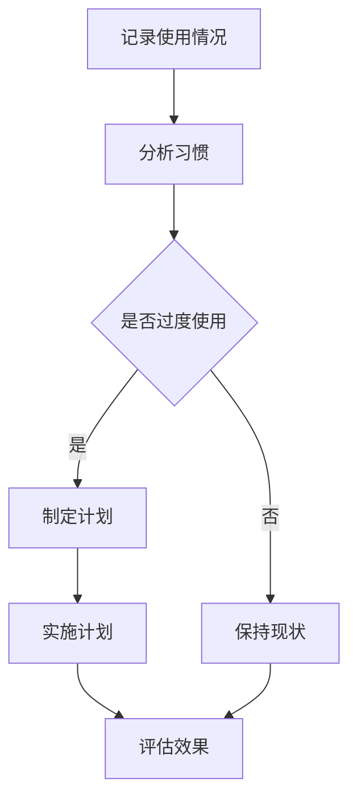
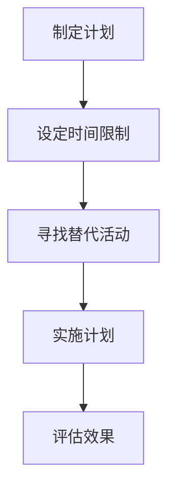
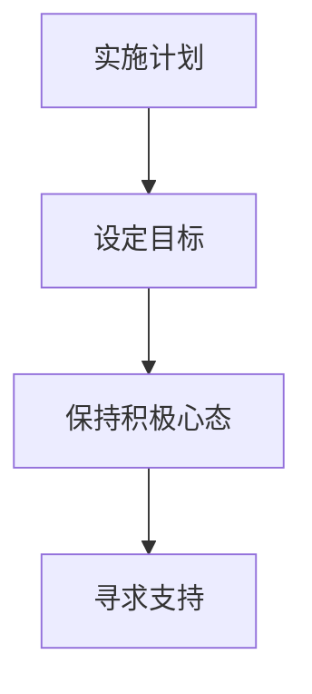
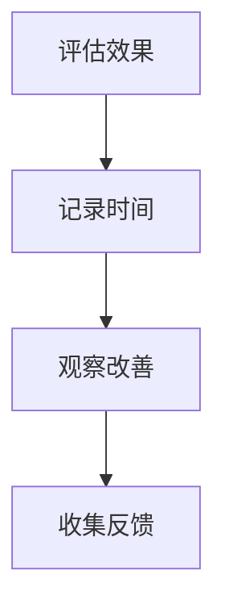

                 

# 数字排毒：如何在网络世界中保持心理健康

## 关键词
心理健康、数字依赖、数字排毒、数字素养、网络生活

## 摘要
随着互联网的普及，数字生活已经成为我们日常不可或缺的一部分。然而，过度的数字依赖和不良的数字习惯正在对心理健康产生负面影响。本文将探讨数字排毒的重要性，并提供一系列方法来帮助我们在网络世界中保持心理健康。

## 引言
### 1. 数字世界的现状

#### 1.1 互联网普及带来的变化
互联网的普及改变了我们的生活方式，信息的获取更加便捷，社交变得更加频繁，工作更加高效。然而，这也带来了新的挑战，即数字依赖和心理健康问题。

#### 1.2 数字生活的利与弊
数字生活为我们带来了许多便利，但同时也可能带来孤独感、焦虑和抑郁等心理问题。

#### 1.3 心理健康问题的数字影响
数字依赖不仅影响我们的注意力集中和情绪调节能力，还可能导致睡眠障碍和人际关系问题。

## 数字排毒的概念与方法
### 2. 数字排毒的核心概念

#### 2.1 数字排毒的定义
数字排毒是指通过减少数字设备的使用和改善数字生活习惯，来恢复心理健康的一种方法。

#### 2.2 数字排毒的重要性
数字排毒可以帮助我们减少焦虑和压力，提高睡眠质量和情绪稳定性，从而提升整体生活质量。

#### 2.3 数字排毒的目标
数字排毒的目标是帮助我们建立健康的数字习惯，减少对数字设备的依赖，并在数字生活中找到平衡。

### 3. 数字排毒的方法与步骤

#### 3.1 认识自己的数字习惯
首先，我们需要认识到自己的数字习惯，包括使用时间和使用频率。

#### 3.2 制定数字排毒计划
制定一个具体的数字排毒计划，包括减少使用时间和逐步减少使用频率。

#### 3.3 实施数字排毒计划
开始实施数字排毒计划，并在过程中进行调整和优化。

## 实践案例
### 4. 个人数字排毒案例

#### 4.1 案例一：摆脱社交媒体依赖
通过逐步减少社交媒体的使用，以及寻找替代活动来摆脱对社交媒体的依赖。

#### 4.2 案例二：减少游戏时间
设定游戏时间限制，并寻找其他活动来替代游戏时间。

#### 4.3 案例三：重获睡眠质量
通过减少晚上使用数字设备的时间和改善睡眠环境来提高睡眠质量。

### 5. 组织数字排毒策略

#### 5.1 企业在数字排毒中的作用
企业可以通过制定政策来鼓励员工进行数字排毒。

#### 5.2 员工心理健康与生产力
数字排毒不仅有助于提高员工的幸福感，还能提高工作效率。

#### 5.3 组织数字排毒的具体策略
包括提供数字排毒培训和开展数字排毒活动。

## 数字生活的心理健康维护
### 6. 数字素养的培养

#### 6.1 提高数字素养的重要性
数字素养是我们应对数字生活挑战的重要工具。

#### 6.2 数字素养的核心要素
包括数字信息识别、数字安全意识和数字道德。

#### 6.3 培养数字素养的方法
包括教育、培训和自我学习。

### 7. 数字生活的心理健康策略

#### 7.1 应对数字成瘾的策略
包括自我监控、寻求支持和建立替代活动。

#### 7.2 数字生活与心理健康的关系
了解数字生活对心理健康的影响，有助于我们更好地维护心理健康。

#### 7.3 心理健康专业人士的数字生活建议
心理健康专业人士为我们提供了一些实用的数字生活建议。

## 未来展望
### 8. 数字排毒的未来趋势

#### 8.1 数字世界的发展趋势
随着技术的发展，数字生活将继续演变。

#### 8.2 心理健康的未来挑战
我们需要面对数字生活带来的新挑战，如数字成瘾和隐私问题。

#### 8.3 数字排毒在未来的角色
数字排毒将成为我们维护心理健康的重要手段。

## 结语
### 9. 总结数字排毒的意义
数字排毒有助于我们在网络世界中保持心理健康，提高生活质量。

### 9.2 鼓励积极行动
我们应该积极采取行动，进行数字排毒，以改善我们的心理健康。

### 9.3 展望更健康数字生活
让我们共同期待一个更健康、更平衡的数字生活。

### 作者
AI天才研究院/AI Genius Institute & 禅与计算机程序设计艺术 /Zen And The Art of Computer Programming

----------------------------------------------------------------

### 数字排毒：如何在网络世界中保持心理健康

### 引言

在当今社会，互联网和数字设备已经成为我们日常生活中不可或缺的一部分。我们依赖智能手机、电脑和平板电脑来获取信息、社交和娱乐。然而，随着数字设备的普及，人们开始意识到过度使用这些设备可能会对心理健康产生负面影响。数字依赖、焦虑、抑郁和睡眠障碍等问题日益严重，这些问题不仅影响了我们的个人生活，还对工作和社交产生了不利影响。因此，数字排毒成为了我们在网络世界中保持心理健康的一种有效方法。

#### 1.1 互联网普及带来的变化

互联网的普及改变了我们的生活方式，信息的获取更加便捷，社交变得更加频繁，工作更加高效。然而，这也带来了新的挑战，即数字依赖和心理健康问题。

#### 1.2 数字生活的利与弊

数字生活为我们带来了许多便利，如快速的信息获取、远程工作和在线教育。然而，过度使用数字设备可能导致孤独感、焦虑和抑郁等心理问题。

#### 1.3 心理健康问题的数字影响

数字依赖不仅影响我们的注意力集中和情绪调节能力，还可能导致睡眠障碍和人际关系问题。

### 数字排毒的概念与方法

#### 2.1 数字排毒的定义

数字排毒是指通过减少数字设备的使用和改善数字生活习惯，来恢复心理健康的一种方法。

#### 2.2 数字排毒的重要性

数字排毒可以帮助我们减少焦虑和压力，提高睡眠质量和情绪稳定性，从而提升整体生活质量。

#### 2.3 数字排毒的目标

数字排毒的目标是帮助我们建立健康的数字习惯，减少对数字设备的依赖，并在数字生活中找到平衡。

### 数字排毒的方法与步骤

#### 3.1 认识自己的数字习惯

首先，我们需要认识到自己的数字习惯，包括使用时间和使用频率。

#### 3.2 制定数字排毒计划

制定一个具体的数字排毒计划，包括减少使用时间和逐步减少使用频率。

#### 3.3 实施数字排毒计划

开始实施数字排毒计划，并在过程中进行调整和优化。

### 实践案例

#### 4.1 案例一：摆脱社交媒体依赖

通过逐步减少社交媒体的使用，以及寻找替代活动来摆脱对社交媒体的依赖。

#### 4.2 案例二：减少游戏时间

设定游戏时间限制，并寻找其他活动来替代游戏时间。

#### 4.3 案例三：重获睡眠质量

通过减少晚上使用数字设备的时间和改善睡眠环境来提高睡眠质量。

### 组织数字排毒策略

#### 5.1 企业在数字排毒中的作用

企业可以通过制定政策来鼓励员工进行数字排毒。

#### 5.2 员工心理健康与生产力

数字排毒不仅有助于提高员工的幸福感，还能提高工作效率。

#### 5.3 组织数字排毒的具体策略

包括提供数字排毒培训和开展数字排毒活动。

### 数字生活的心理健康维护

#### 6.1 提高数字素养的重要性

数字素养是我们应对数字生活挑战的重要工具。

#### 6.2 数字素养的核心要素

包括数字信息识别、数字安全意识和数字道德。

#### 6.3 培养数字素养的方法

包括教育、培训和自我学习。

### 数字生活的心理健康策略

#### 7.1 应对数字成瘾的策略

包括自我监控、寻求支持和建立替代活动。

#### 7.2 数字生活与心理健康的关系

了解数字生活对心理健康的影响，有助于我们更好地维护心理健康。

#### 7.3 心理健康专业人士的数字生活建议

心理健康专业人士为我们提供了一些实用的数字生活建议。

### 未来展望

#### 8.1 数字世界的发展趋势

随着技术的发展，数字生活将继续演变。

#### 8.2 心理健康的未来挑战

我们需要面对数字生活带来的新挑战，如数字成瘾和隐私问题。

#### 8.3 数字排毒在未来的角色

数字排毒将成为我们维护心理健康的重要手段。

### 结语

#### 9.1 总结数字排毒的意义

数字排毒有助于我们在网络世界中保持心理健康，提高生活质量。

#### 9.2 鼓励积极行动

我们应该积极采取行动，进行数字排毒，以改善我们的心理健康。

#### 9.3 展望更健康数字生活

让我们共同期待一个更健康、更平衡的数字生活。

### 作者

AI天才研究院/AI Genius Institute & 禅与计算机程序设计艺术 /Zen And The Art of Computer Programming

----------------------------------------------------------------

### 数字排毒：如何在网络世界中保持心理健康

## 关键词

心理健康、数字依赖、数字排毒、数字素养、网络生活

## 摘要

随着数字设备的普及，网络生活已经成为我们日常生活中不可或缺的一部分。然而，过度使用数字设备可能导致心理健康问题，如焦虑、抑郁和睡眠障碍。本文将探讨数字排毒的概念、方法与实践，帮助我们在网络世界中保持心理健康。

## 引言

### 1. 数字世界的现状

互联网的普及改变了我们的生活方式，信息获取更加便捷，社交更加频繁，工作更加高效。然而，这也带来了新的挑战，即数字依赖和心理健康问题。

#### 1.1 互联网普及带来的变化

互联网的普及使信息获取更加便捷，人们可以通过各种数字设备快速获取所需信息，这使得我们的工作和生活更加高效。

#### 1.2 数字生活的利与弊

数字生活为我们带来了许多便利，如远程工作、在线教育和社交媒体。然而，过度使用数字设备可能导致孤独感、焦虑和抑郁等心理问题。

#### 1.3 心理健康问题的数字影响

数字依赖不仅影响我们的注意力集中和情绪调节能力，还可能导致睡眠障碍和人际关系问题。

### 2. 数字排毒的概念与方法

#### 2.1 数字排毒的定义

数字排毒是一种通过减少数字设备的使用和改善数字生活习惯，以恢复心理健康的方法。

#### 2.2 数字排毒的重要性

数字排毒可以帮助我们减少焦虑和压力，提高睡眠质量和情绪稳定性，从而提升整体生活质量。

#### 2.3 数字排毒的目标

数字排毒的目标是帮助我们建立健康的数字习惯，减少对数字设备的依赖，并在数字生活中找到平衡。

### 3. 数字排毒的方法与步骤

#### 3.1 认识自己的数字习惯

首先，我们需要认识到自己的数字习惯，包括使用时间和使用频率。

#### 3.2 制定数字排毒计划

制定一个具体的数字排毒计划，包括减少使用时间和逐步减少使用频率。

#### 3.3 实施数字排毒计划

开始实施数字排毒计划，并在过程中进行调整和优化。

### 4. 实践案例

#### 4.1 案例一：摆脱社交媒体依赖

通过逐步减少社交媒体的使用，以及寻找替代活动来摆脱对社交媒体的依赖。

#### 4.2 案例二：减少游戏时间

设定游戏时间限制，并寻找其他活动来替代游戏时间。

#### 4.3 案例三：重获睡眠质量

通过减少晚上使用数字设备的时间和改善睡眠环境来提高睡眠质量。

### 5. 组织数字排毒策略

#### 5.1 企业在数字排毒中的作用

企业可以通过制定政策来鼓励员工进行数字排毒。

#### 5.2 员工心理健康与生产力

数字排毒不仅有助于提高员工的幸福感，还能提高工作效率。

#### 5.3 组织数字排毒的具体策略

包括提供数字排毒培训和开展数字排毒活动。

### 6. 数字生活的心理健康维护

#### 6.1 提高数字素养的重要性

数字素养是我们应对数字生活挑战的重要工具。

#### 6.2 数字素养的核心要素

包括数字信息识别、数字安全意识和数字道德。

#### 6.3 培养数字素养的方法

包括教育、培训和自我学习。

### 7. 数字生活的心理健康策略

#### 7.1 应对数字成瘾的策略

包括自我监控、寻求支持和建立替代活动。

#### 7.2 数字生活与心理健康的关系

了解数字生活对心理健康的影响，有助于我们更好地维护心理健康。

#### 7.3 心理健康专业人士的数字生活建议

心理健康专业人士为我们提供了一些实用的数字生活建议。

### 8. 未来展望

#### 8.1 数字世界的发展趋势

随着技术的发展，数字生活将继续演变。

#### 8.2 心理健康的未来挑战

我们需要面对数字生活带来的新挑战，如数字成瘾和隐私问题。

#### 8.3 数字排毒在未来的角色

数字排毒将成为我们维护心理健康的重要手段。

### 9. 结语

#### 9.1 总结数字排毒的意义

数字排毒有助于我们在网络世界中保持心理健康，提高生活质量。

#### 9.2 鼓励积极行动

我们应该积极采取行动，进行数字排毒，以改善我们的心理健康。

#### 9.3 展望更健康数字生活

让我们共同期待一个更健康、更平衡的数字生活。

### 作者

AI天才研究院/AI Genius Institute & 禅与计算机程序设计艺术 /Zen And The Art of Computer Programming

----------------------------------------------------------------

### 数字排毒：如何在网络世界中保持心理健康

## 引言

在现代社会，数字设备已经成为我们日常生活中不可或缺的一部分。从早晨醒来查看手机，到晚上睡前刷微博、看新闻，我们几乎无时无刻不在与数字设备打交道。然而，这种对数字设备的过度依赖，不仅影响了我们的工作效率和生活质量，还对我们的心理健康造成了严重的影响。研究表明，过度使用数字设备可能导致焦虑、抑郁、失眠等问题。因此，进行数字排毒，即减少对数字设备的依赖，成为了维护心理健康的重要手段。

### 1. 数字世界的现状

#### 1.1 互联网普及带来的变化

互联网的普及极大地改变了我们的生活方式。我们可以通过互联网快速获取信息，进行在线购物、学习、社交，甚至远程办公。这种便利性使我们的生活变得更加丰富多彩，但同时也带来了一系列新的挑战。

#### 1.2 数字生活的利与弊

数字生活带来了许多便利，但同时也可能带来孤独感、焦虑和抑郁等心理问题。长时间沉浸在数字世界中，人们容易忽视现实生活中的人际交往，导致社交能力的下降。

#### 1.3 心理健康问题的数字影响

数字依赖不仅影响我们的注意力集中和情绪调节能力，还可能导致睡眠障碍和人际关系问题。例如，长时间使用手机和电脑可能导致眼睛疲劳、头痛和失眠。

### 2. 数字排毒的概念与方法

#### 2.1 数字排毒的定义

数字排毒是指通过减少数字设备的使用和改善数字生活习惯，来恢复心理健康的一种方法。它旨在帮助人们减少对数字设备的依赖，从而改善心理健康。

#### 2.2 数字排毒的重要性

数字排毒可以帮助我们减少焦虑和压力，提高睡眠质量和情绪稳定性，从而提升整体生活质量。通过数字排毒，我们可以更好地平衡数字生活和现实生活，提高工作效率和人际交往能力。

#### 2.3 数字排毒的目标

数字排毒的目标是帮助我们建立健康的数字习惯，减少对数字设备的依赖，并在数字生活中找到平衡。具体目标包括：

- 减少每天使用数字设备的时间。
- 提高数字设备使用的效率，避免无效使用。
- 提高对数字设备的自控力。
- 建立更加健康、平衡的生活方式。

### 3. 数字排毒的方法与步骤

#### 3.1 认识自己的数字习惯

首先，我们需要认识到自己的数字习惯，包括每天使用数字设备的时间、使用频率和主要用途。可以通过记录一段时间内使用数字设备的情况，来了解自己的数字习惯。



#### 3.2 制定数字排毒计划

根据对数字习惯的分析，我们可以制定一个具体的数字排毒计划。计划应包括：

- 减少每天使用数字设备的时间。
- 设定特定的时间段，如工作时间和休息时间，来限制数字设备的使用。
- 找到替代活动，以减少对数字设备的依赖。



#### 3.3 实施数字排毒计划

开始实施数字排毒计划，并在过程中进行调整和优化。实施计划时，可以采取以下策略：

- 设定明确的减少使用数字设备的目标。
- 保持积极的心态，避免对数字设备的过度依赖。
- 与家人和朋友分享数字排毒的经历，寻求支持和鼓励。



#### 3.4 评估数字排毒的效果

在实施数字排毒计划一段时间后，我们需要评估其效果。可以通过以下方法来评估：

- 记录每天使用数字设备的时间，并与之前的记录进行对比。
- 观察睡眠质量、情绪稳定性和工作效率是否有改善。
- 收集家人和朋友的反馈，了解他们对数字排毒的看法。



### 4. 实践案例

#### 4.1 案例一：摆脱社交媒体依赖

小明是一名上班族，他发现自己每天花大量时间在社交媒体上，导致工作效率低下，晚上难以入睡。为了改善这种情况，他开始进行数字排毒。

- 记录使用社交媒体的时间：每天平均花费2小时。
- 制定计划：设定每天使用社交媒体的时间不超过30分钟，并在晚上10点后不再使用。
- 寻找替代活动：加入健身房，每天锻炼1小时，减少对社交媒体的依赖。
- 评估效果：经过一个月的数字排毒，小明发现他的工作效率提高了，睡眠质量也明显改善。

#### 4.2 案例二：减少游戏时间

小华是一名高中生，他沉迷于网络游戏，导致学习成绩下降，与家人关系紧张。为了帮助小华摆脱游戏依赖，家人决定进行数字排毒。

- 记录游戏时间：每天平均花费4小时。
- 制定计划：设定每天游戏时间不超过1小时，并在周末限制游戏时间。
- 寻找替代活动：鼓励小华参加户外运动和读书，减少对游戏的依赖。
- 评估效果：经过半年的数字排毒，小华的游戏时间明显减少，学习成绩也有所提高，与家人的关系也变得更加和谐。

#### 4.3 案例三：重获睡眠质量

小丽是一名大学生，她晚上经常熬夜使用手机，导致白天精力不集中，晚上难以入睡。为了改善睡眠质量，她开始进行数字排毒。

- 记录使用手机时间：每天平均花费3小时。
- 制定计划：设定每天使用手机的时间不超过1小时，并在晚上10点后不再使用。
- 寻找替代活动：在晚上读书或听音乐，帮助入睡。
- 评估效果：经过一个月的数字排毒，小丽的睡眠质量明显改善，白天精力也变得更加充沛。

### 5. 组织数字排毒策略

#### 5.1 企业在数字排毒中的作用

企业可以通过制定相关政策来鼓励员工进行数字排毒，如限制员工使用社交媒体的时间，提供数字排毒培训和开展数字排毒活动。

#### 5.2 员工心理健康与生产力

数字排毒有助于提高员工的幸福感和工作效率。通过减少对数字设备的依赖，员工可以更好地平衡工作与生活，提高生产力。

#### 5.3 组织数字排毒的具体策略

- 提供数字排毒培训，帮助员工了解数字排毒的重要性和方法。
- 设立数字排毒日，鼓励员工减少数字设备的使用时间。
- 提供替代活动，如健身房、瑜伽班等，以帮助员工减少对数字设备的依赖。

### 6. 数字生活的心理健康维护

#### 6.1 提高数字素养的重要性

数字素养是指人们在数字世界中获取、处理和传递信息的能力。提高数字素养有助于我们更好地应对数字生活的挑战，保护自己的心理健康。

#### 6.2 数字素养的核心要素

- 数字信息识别：学会辨别真实与虚假信息，避免受到网络诈骗。
- 数字安全意识：了解网络安全知识，保护个人隐私和数据安全。
- 数字道德：遵守网络道德规范，尊重他人的权益。

#### 6.3 培养数字素养的方法

- 教育和培训：在学校和职场中开展数字素养教育，提高人们的数字素养水平。
- 自我学习：通过阅读相关书籍、参加在线课程等方式，提升自己的数字素养。

### 7. 数字生活的心理健康策略

#### 7.1 应对数字成瘾的策略

- 自我监控：记录自己的数字使用情况，了解自己的数字成瘾程度。
- 寻求支持：与家人、朋友或专业人士分享自己的困惑和挑战，寻求帮助。
- 建立替代活动：找到有益的替代活动，如运动、阅读、绘画等，以减少对数字设备的依赖。

#### 7.2 数字生活与心理健康的关系

了解数字生活对心理健康的影响，有助于我们更好地维护心理健康。通过合理使用数字设备，我们可以提高生活质量，保持心理健康。

#### 7.3 心理健康专业人士的数字生活建议

心理健康专业人士为我们提供了一些实用的数字生活建议，如：

- 设定固定的作息时间，避免熬夜。
- 定期进行户外活动，增强身体锻炼。
- 学会放松技巧，如冥想、深呼吸等，以缓解压力。

### 8. 未来展望

#### 8.1 数字世界的发展趋势

随着科技的不断发展，数字生活将继续演变。未来，我们将面临更多数字挑战，如虚拟现实、人工智能等。因此，提高数字素养，进行数字排毒，将成为我们维护心理健康的重要手段。

#### 8.2 心理健康的未来挑战

数字依赖、数字隐私和安全等问题将成为未来心理健康的重要挑战。我们需要关注这些问题，寻找解决方案，以保护自己的心理健康。

#### 8.3 数字排毒在未来的角色

数字排毒将在未来发挥越来越重要的作用。通过减少对数字设备的依赖，我们可以更好地平衡数字生活与现实生活，提高生活质量。

### 9. 结语

数字排毒是我们在网络世界中保持心理健康的重要方法。通过认识自己的数字习惯、制定数字排毒计划、实践数字排毒方法，我们可以减少对数字设备的依赖，提高生活质量。让我们共同努力，创造一个更健康、更平衡的数字生活。

### 作者

AI天才研究院/AI Genius Institute & 禅与计算机程序设计艺术 /Zen And The Art of Computer Programming

----------------------------------------------------------------

### 数字排毒：如何在网络世界中保持心理健康

## 关键词

心理健康、数字依赖、数字排毒、数字素养、网络生活

## 摘要

随着数字设备的普及，网络生活已经成为我们日常生活中不可或缺的一部分。然而，过度使用数字设备可能导致心理健康问题，如焦虑、抑郁和失眠。本文将探讨数字排毒的概念、方法与实践，帮助我们在网络世界中保持心理健康。

## 引言

在现代社会，数字设备已经成为我们日常生活中不可或缺的一部分。从早晨醒来查看手机，到晚上睡前刷微博、看新闻，我们几乎无时无刻不在与数字设备打交道。然而，这种对数字设备的过度依赖，不仅影响了我们的工作效率和生活质量，还对我们的心理健康造成了严重的影响。研究表明，过度使用数字设备可能导致焦虑、抑郁、失眠等问题。因此，进行数字排毒，即减少对数字设备的依赖，成为了维护心理健康的重要手段。

### 1. 数字世界的现状

#### 1.1 互联网普及带来的变化

互联网的普及极大地改变了我们的生活方式。我们可以通过互联网快速获取信息，进行在线购物、学习、社交，甚至远程办公。这种便利性使我们的生活变得更加丰富多彩，但同时也带来了一系列新的挑战。

#### 1.2 数字生活的利与弊

数字生活为我们带来了许多便利，如远程工作、在线教育和社交媒体。然而，过度使用数字设备可能导致孤独感、焦虑和抑郁等心理问题。长时间沉浸在数字世界中，人们容易忽视现实生活中的人际交往，导致社交能力的下降。

#### 1.3 心理健康问题的数字影响

数字依赖不仅影响我们的注意力集中和情绪调节能力，还可能导致睡眠障碍和人际关系问题。例如，长时间使用手机和电脑可能导致眼睛疲劳、头痛和失眠。

### 2. 数字排毒的概念与方法

#### 2.1 数字排毒的定义

数字排毒是指通过减少数字设备的使用和改善数字生活习惯，来恢复心理健康的一种方法。它旨在帮助人们减少对数字设备的依赖，从而改善心理健康。

#### 2.2 数字排毒的重要性

数字排毒可以帮助我们减少焦虑和压力，提高睡眠质量和情绪稳定性，从而提升整体生活质量。通过数字排毒，我们可以更好地平衡数字生活和现实生活，提高工作效率和人际交往能力。

#### 2.3 数字排毒的目标

数字排毒的目标是帮助我们建立健康的数字习惯，减少对数字设备的依赖，并在数字生活中找到平衡。具体目标包括：

- 减少每天使用数字设备的时间。
- 提高数字设备使用的效率，避免无效使用。
- 提高对数字设备的自控力。
- 建立更加健康、平衡的生活方式。

### 3. 数字排毒的方法与步骤

#### 3.1 认识自己的数字习惯

首先，我们需要认识到自己的数字习惯，包括每天使用数字设备的时间、使用频率和主要用途。可以通过记录一段时间内使用数字设备的情况，来了解自己的数字习惯。


#### 3.2 制定数字排毒计划

根据对数字习惯的分析，我们可以制定一个具体的数字排毒计划。计划应包括：

- 减少每天使用数字设备的时间。
- 设定特定的时间段，如工作时间和休息时间，来限制数字设备的使用。
- 找到替代活动，以减少对数字设备的依赖。


#### 3.3 实施数字排毒计划

开始实施数字排毒计划，并在过程中进行调整和优化。实施计划时，可以采取以下策略：

- 设定明确的减少使用数字设备的目标。
- 保持积极的心态，避免对数字设备的过度依赖。
- 与家人和朋友分享数字排毒的经历，寻求支持和鼓励。


#### 3.4 评估数字排毒的效果

在实施数字排毒计划一段时间后，我们需要评估其效果。可以通过以下方法来评估：

- 记录每天使用数字设备的时间，并与之前的记录进行对比。
- 观察睡眠质量、情绪稳定性和工作效率是否有改善。
- 收集家人和朋友的反馈，了解他们对数字排毒的看法。


### 4. 实践案例

#### 4.1 案例一：摆脱社交媒体依赖

小明是一名上班族，他发现自己每天花大量时间在社交媒体上，导致工作效率低下，晚上难以入睡。为了改善这种情况，他开始进行数字排毒。

- 记录使用社交媒体的时间：每天平均花费2小时。
- 制定计划：设定每天使用社交媒体的时间不超过30分钟，并在晚上10点后不再使用。
- 寻找替代活动：加入健身房，每天锻炼1小时，减少对社交媒体的依赖。
- 评估效果：经过一个月的数字排毒，小明发现他的工作效率提高了，睡眠质量也明显改善。

#### 4.2 案例二：减少游戏时间

小华是一名高中生，他沉迷于网络游戏，导致学习成绩下降，与家人关系紧张。为了帮助小华摆脱游戏依赖，家人决定进行数字排毒。

- 记录游戏时间：每天平均花费4小时。
- 制定计划：设定每天游戏时间不超过1小时，并在周末限制游戏时间。
- 寻找替代活动：鼓励小华参加户外运动和读书，减少对游戏的依赖。
- 评估效果：经过半年的数字排毒，小华的游戏时间明显减少，学习成绩也有所提高，与家人的关系也变得更加和谐。

#### 4.3 案例三：重获睡眠质量

小丽是一名大学生，她晚上经常熬夜使用手机，导致白天精力不集中，晚上难以入睡。为了改善睡眠质量，她开始进行数字排毒。

- 记录使用手机时间：每天平均花费3小时。
- 制定计划：设定每天使用手机的时间不超过1小时，并在晚上10点后不再使用。
- 寻找替代活动：在晚上读书或听音乐，帮助入睡。
- 评估效果：经过一个月的数字排毒，小丽的睡眠质量明显改善，白天精力也变得更加充沛。

### 5. 组织数字排毒策略

#### 5.1 企业在数字排毒中的作用

企业可以通过制定相关政策来鼓励员工进行数字排毒，如限制员工使用社交媒体的时间，提供数字排毒培训和开展数字排毒活动。

#### 5.2 员工心理健康与生产力

数字排毒有助于提高员工的幸福感和工作效率。通过减少对数字设备的依赖，员工可以更好地平衡工作与生活，提高生产力。

#### 5.3 组织数字排毒的具体策略

- 提供数字排毒培训，帮助员工了解数字排毒的重要性和方法。
- 设立数字排毒日，鼓励员工减少数字设备的使用时间。
- 提供替代活动，如健身房、瑜伽班等，以帮助员工减少对数字设备的依赖。

### 6. 数字生活的心理健康维护

#### 6.1 提高数字素养的重要性

数字素养是指人们在数字世界中获取、处理和传递信息的能力。提高数字素养有助于我们更好地应对数字生活的挑战，保护自己的心理健康。

#### 6.2 数字素养的核心要素

- 数字信息识别：学会辨别真实与虚假信息，避免受到网络诈骗。
- 数字安全意识：了解网络安全知识，保护个人隐私和数据安全。
- 数字道德：遵守网络道德规范，尊重他人的权益。

#### 6.3 培养数字素养的方法

- 教育和培训：在学校和职场中开展数字素养教育，提高人们的数字素养水平。
- 自我学习：通过阅读相关书籍、参加在线课程等方式，提升自己的数字素养。

### 7. 数字生活的心理健康策略

#### 7.1 应对数字成瘾的策略

- 自我监控：记录自己的数字使用情况，了解自己的数字成瘾程度。
- 寻求支持：与家人、朋友或专业人士分享自己的困惑和挑战，寻求帮助。
- 建立替代活动：找到有益的替代活动，如运动、阅读、绘画等，以减少对数字设备的依赖。

#### 7.2 数字生活与心理健康的关系

了解数字生活对心理健康的影响，有助于我们更好地维护心理健康。通过合理使用数字设备，我们可以提高生活质量，保持心理健康。

#### 7.3 心理健康专业人士的数字生活建议

心理健康专业人士为我们提供了一些实用的数字生活建议，如：

- 设定固定的作息时间，避免熬夜。
- 定期进行户外活动，增强身体锻炼。
- 学会放松技巧，如冥想、深呼吸等，以缓解压力。

### 8. 未来展望

#### 8.1 数字世界的发展趋势

随着科技的不断发展，数字生活将继续演变。未来，我们将面临更多数字挑战，如虚拟现实、人工智能等。因此，提高数字素养，进行数字排毒，将成为我们维护心理健康的重要手段。

#### 8.2 心理健康的未来挑战

数字依赖、数字隐私和安全等问题将成为未来心理健康的重要挑战。我们需要关注这些问题，寻找解决方案，以保护自己的心理健康。

#### 8.3 数字排毒在未来的角色

数字排毒将在未来发挥越来越重要的作用。通过减少对数字设备的依赖，我们可以更好地平衡数字生活与现实生活，提高生活质量。

### 9. 结语

数字排毒是我们在网络世界中保持心理健康的重要方法。通过认识自己的数字习惯、制定数字排毒计划、实践数字排毒方法，我们可以减少对数字设备的依赖，提高生活质量。让我们共同努力，创造一个更健康、更平衡的数字生活。

### 作者

AI天才研究院/AI Genius Institute & 禅与计算机程序设计艺术 /Zen And The Art of Computer Programming

----------------------------------------------------------------

### 数字排毒：如何在网络世界中保持心理健康

## 关键词
心理健康、数字依赖、数字排毒、数字素养、网络生活

## 摘要
在数字化的时代，网络生活的便利性给我们的生活带来了翻天覆地的变化。然而，随着我们对智能手机、电脑等数字设备的依赖日益加深，心理健康问题也随之而来。本文将探讨数字排毒的概念、方法以及其实践，帮助我们更好地在网络世界中保持心理健康。

### 引言

#### 1. 数字生活的普及与心理健康问题

随着互联网的普及，数字生活已经成为我们日常生活中的重要组成部分。人们通过社交媒体、在线游戏、电子阅读等方式，享受着数字生活带来的便捷。然而，过度依赖数字设备不仅影响我们的身体健康，还对心理健康产生了负面影响。焦虑、抑郁、注意力不集中、睡眠障碍等问题在年轻人中尤为突出。

#### 2. 数字排毒的必要性

数字排毒，即减少对数字设备的依赖，改善数字生活习惯，以恢复和提升心理健康。在数字世界中，我们需要采取积极的措施来应对心理健康问题，以实现身心的和谐。

### 数字排毒的概念与方法

#### 3.1 数字排毒的定义

数字排毒是一种通过有意识地减少数字设备使用时间，改善数字行为习惯，以达到提升心理健康水平的方法。它不是完全杜绝使用数字设备，而是通过合理安排使用时间，提升数字生活的质量。

#### 3.2 数字排毒的重要性

数字排毒有助于减轻焦虑和压力，改善睡眠质量，增强人际交往能力，提高工作效率，从而提升整体生活质量。

#### 3.3 数字排毒的目标

- 减少无谓的数字设备使用时间。
- 提高数字设备使用的效率和目的性。
- 建立健康的数字生活习惯。

### 实施数字排毒的步骤

#### 4.1 认识自己的数字习惯

首先，我们需要了解自己的数字行为习惯。这可以通过记录一段时间内使用数字设备的时间和频率来实现。

#### 4.2 制定数字排毒计划

根据对数字习惯的分析，我们可以制定一个具体的数字排毒计划。计划应包括：

- 设定每天使用数字设备的时间上限。
- 确定禁止使用数字设备的特定时间段。
- 找到替代活动，如户外运动、阅读、绘画等。

#### 4.3 实施数字排毒计划

开始实施数字排毒计划，并遵循以下策略：

- 保持积极的心态，避免对数字设备的过度依赖。
- 与家人和朋友分享数字排毒的经历，寻求支持和鼓励。
- 逐步调整，直到找到适合自己的数字生活平衡点。

#### 4.4 评估和调整

定期评估数字排毒的效果，并根据实际情况进行调整。这可以通过记录使用时间、观察睡眠质量、工作表现等方式进行。

### 实践案例

#### 5.1 案例一：摆脱社交媒体依赖

小明是一名社交媒体重度用户，他每天花费大量时间在社交媒体上，导致工作效率低下，睡眠质量差。通过数字排毒，他设定了每天使用社交媒体的时间限制，并找到了替代活动，如阅读和锻炼。几个月后，他的工作效率提高了，睡眠质量也显著改善。

#### 5.2 案例二：减少游戏时间

小华是一名游戏玩家，他发现自己因为沉迷游戏而忽略了学习和家庭生活。通过数字排毒，他设定了每天的游戏时间限制，并参加了社区活动，与朋友们进行面对面交流。经过一段时间的调整，他的学习成绩有所提高，家庭关系也得到了改善。

#### 5.3 案例三：改善睡眠质量

小丽是一名大学生，她因为晚上熬夜玩手机而经常失眠。通过数字排毒，她减少了晚上使用手机的时间，并制定了固定的睡眠时间。一段时间后，她的睡眠质量明显改善，白天精神更加饱满。

### 数字生活的心理健康维护

#### 6.1 提高数字素养

数字素养是指我们在数字环境中获取、处理和传递信息的能力。提高数字素养可以帮助我们更好地应对数字生活带来的挑战。

#### 6.2 数字素养的核心要素

- 数字信息识别：学会辨别信息的真实性和可靠性。
- 数字安全意识：了解网络安全知识，保护个人隐私和数据安全。
- 数字道德：遵守网络道德规范，尊重他人的权益。

#### 6.3 培养数字素养的方法

- 教育和培训：在学校和职场中开展数字素养教育。
- 自我学习：通过阅读书籍、参加在线课程等方式提升数字素养。

### 数字生活的心理健康策略

#### 7.1 应对数字成瘾的策略

- 自我监控：记录自己的数字使用情况，了解自己的数字成瘾程度。
- 寻求支持：与家人、朋友或专业人士分享自己的困惑和挑战，寻求帮助。
- 建立替代活动：找到有益的替代活动，如运动、阅读、绘画等，以减少对数字设备的依赖。

#### 7.2 数字生活与心理健康的关系

了解数字生活对心理健康的影响，有助于我们更好地管理数字生活，维护心理健康。

#### 7.3 心理健康专业人士的数字生活建议

心理健康专业人士为我们提供了一些实用的数字生活建议，如：

- 设定固定的作息时间，避免熬夜。
- 定期进行户外活动，增强身体锻炼。
- 学会放松技巧，如冥想、深呼吸等，以缓解压力。

### 未来展望

#### 8.1 数字世界的发展趋势

随着科技的进步，数字世界将继续发展，我们需要不断提高数字素养，适应数字生活。

#### 8.2 心理健康的未来挑战

数字依赖、数字隐私和安全等问题将成为未来心理健康的重要挑战。

#### 8.3 数字排毒在未来的角色

数字排毒将在未来发挥越来越重要的作用，帮助我们更好地平衡数字生活与心理健康。

### 结语

数字排毒是我们在网络世界中保持心理健康的重要手段。通过认识自己的数字习惯、制定数字排毒计划、实践数字排毒方法，我们可以减少对数字设备的依赖，提高生活质量。让我们共同努力，创造一个更健康、更平衡的数字生活。

### 作者

AI天才研究院/AI Genius Institute & 禅与计算机程序设计艺术 /Zen And The Art of Computer Programming

----------------------------------------------------------------

### 数字排毒：如何在网络世界中保持心理健康

## 关键词
心理健康、数字依赖、数字排毒、数字素养、网络生活

## 摘要
在数字化时代，网络生活已成为我们不可或缺的一部分。然而，过度依赖数字设备可能导致心理健康问题。本文将探讨数字排毒的概念、方法及其实践，帮助我们更好地在网络世界中保持心理健康。

### 引言

#### 1. 数字生活的普及与心理健康挑战

随着互联网和移动设备的普及，数字生活已成为我们日常生活的核心。然而，过度依赖这些设备不仅影响了我们的身体健康，还可能导致心理健康问题，如焦虑、抑郁和注意力不集中。

#### 2. 数字排毒的必要性

数字排毒是一种通过减少对数字设备的依赖，改善数字生活习惯，以提升心理健康水平的方法。它帮助我们在数字世界中找到平衡，维护心理健康。

### 数字排毒的概念与方法

#### 3.1 数字排毒的定义

数字排毒是指通过逐步减少对数字设备的依赖，改善数字生活习惯，以提高生活质量的方法。它旨在帮助我们重新定义与数字设备的关系，而不是完全摒弃它们。

#### 3.2 数字排毒的重要性

数字排毒有助于减轻压力、改善睡眠质量和增强人际关系。通过减少数字设备的负面影响，我们可以更好地关注身心健康。

#### 3.3 数字排毒的目标

- 减少不必要的数字设备使用时间。
- 提高数字设备使用的效率和目的性。
- 建立健康的数字生活习惯。

### 实施数字排毒的步骤

#### 4.1 认识自己的数字习惯

首先，我们需要了解自己的数字使用习惯。这可以通过记录一段时间内使用数字设备的时间和频率来实现。

#### 4.2 制定数字排毒计划

根据对数字习惯的分析，我们可以制定一个具体的数字排毒计划。计划应包括：

- 设定每天使用数字设备的时间上限。
- 确定禁止使用数字设备的特定时间段。
- 找到替代活动，如户外运动、阅读和社交。

#### 4.3 实施数字排毒计划

开始实施数字排毒计划，并遵循以下策略：

- 保持积极的心态，避免对数字设备的过度依赖。
- 与家人和朋友分享数字排毒的经历，寻求支持和鼓励。
- 逐步调整，直到找到适合自己的数字生活平衡点。

#### 4.4 评估和调整

定期评估数字排毒的效果，并根据实际情况进行调整。这可以通过记录使用时间、观察睡眠质量、工作表现等方式进行。

### 实践案例

#### 5.1 案例一：摆脱社交媒体依赖

小明是一名社交媒体重度用户，他每天花费大量时间在社交媒体上，导致工作效率低下，睡眠质量差。通过数字排毒，他设定了每天使用社交媒体的时间限制，并找到了替代活动，如阅读和锻炼。几个月后，他的工作效率提高了，睡眠质量也显著改善。

#### 5.2 案例二：减少游戏时间

小华是一名游戏玩家，他发现自己因为沉迷游戏而忽略了学习和家庭生活。通过数字排毒，他设定了每天的游戏时间限制，并参加了社区活动，与朋友们进行面对面交流。经过一段时间的调整，他的学习成绩有所提高，家庭关系也得到了改善。

#### 5.3 案例三：改善睡眠质量

小丽是一名大学生，她因为晚上熬夜玩手机而经常失眠。通过数字排毒，她减少了晚上使用手机的时间，并制定了固定的睡眠时间。一段时间后，她的睡眠质量明显改善，白天精神更加饱满。

### 数字生活的心理健康维护

#### 6.1 提高数字素养

数字素养是指我们在数字环境中获取、处理和传递信息的能力。提高数字素养可以帮助我们更好地应对数字生活带来的挑战。

#### 6.2 数字素养的核心要素

- 数字信息识别：学会辨别信息的真实性和可靠性。
- 数字安全意识：了解网络安全知识，保护个人隐私和数据安全。
- 数字道德：遵守网络道德规范，尊重他人的权益。

#### 6.3 培养数字素养的方法

- 教育和培训：在学校和职场中开展数字素养教育。
- 自我学习：通过阅读书籍、参加在线课程等方式提升数字素养。

### 数字生活的心理健康策略

#### 7.1 应对数字成瘾的策略

- 自我监控：记录自己的数字使用情况，了解自己的数字成瘾程度。
- 寻求支持：与家人、朋友或专业人士分享自己的困惑和挑战，寻求帮助。
- 建立替代活动：找到有益的替代活动，如运动、阅读、绘画等，以减少对数字设备的依赖。

#### 7.2 数字生活与心理健康的关系

了解数字生活对心理健康的影响，有助于我们更好地管理数字生活，维护心理健康。

#### 7.3 心理健康专业人士的数字生活建议

心理健康专业人士为我们提供了一些实用的数字生活建议，如：

- 设定固定的作息时间，避免熬夜。
- 定期进行户外活动，增强身体锻炼。
- 学会放松技巧，如冥想、深呼吸等，以缓解压力。

### 未来展望

#### 8.1 数字世界的发展趋势

随着科技的进步，数字世界将继续发展，我们需要不断提高数字素养，适应数字生活。

#### 8.2 心理健康的未来挑战

数字依赖、数字隐私和安全等问题将成为未来心理健康的重要挑战。

#### 8.3 数字排毒在未来的角色

数字排毒将在未来发挥越来越重要的作用，帮助我们更好地平衡数字生活与心理健康。

### 结语

数字排毒是我们在网络世界中保持心理健康的重要手段。通过认识自己的数字习惯、制定数字排毒计划、实践数字排毒方法，我们可以减少对数字设备的依赖，提高生活质量。让我们共同努力，创造一个更健康、更平衡的数字生活。

### 作者

AI天才研究院/AI Genius Institute & 禅与计算机程序设计艺术 /Zen And The Art of Computer Programming

----------------------------------------------------------------

### 数字排毒：如何在网络世界中保持心理健康

## 关键词
心理健康、数字依赖、数字排毒、数字素养、网络生活

## 摘要
在数字化时代，网络生活已经成为我们日常生活的重要组成部分。然而，过度依赖数字设备可能导致心理健康问题，如焦虑、抑郁和失眠。本文将探讨数字排毒的概念、方法及其实践，帮助我们在网络世界中保持心理健康。

### 引言

#### 1. 数字生活的普及与心理健康问题

互联网的普及和移动设备的广泛应用，使得数字生活成为现代人生活的重要部分。尽管数字生活提供了便利，但过度依赖数字设备也可能导致一系列心理健康问题，如焦虑、抑郁、注意力不集中和睡眠障碍。

#### 2. 数字排毒的必要性

数字排毒是一种通过减少对数字设备的依赖，改善数字生活习惯，以恢复和提升心理健康的方法。通过数字排毒，我们可以重新审视自己与数字设备的关系，从而更好地管理心理健康。

### 数字排毒的概念

#### 3.1 数字排毒的定义

数字排毒是指通过逐步减少对数字设备的依赖，改善数字生活习惯，以减少心理健康问题的发生。它不是完全摒弃数字设备，而是在数字生活中寻找平衡。

#### 3.2 数字排毒的目标

- 减少无谓的数字设备使用时间。
- 提高数字设备使用的效率。
- 建立健康的数字生活习惯。

### 数字排毒的方法

#### 4.1 认识自己的数字习惯

首先，我们需要了解自己的数字行为习惯。这可以通过记录一段时间内使用数字设备的时间和频率来实现。


#### 4.2 制定数字排毒计划

根据对数字习惯的分析，我们可以制定一个具体的数字排毒计划。计划应包括：

- 设定每天使用数字设备的时间上限。
- 确定禁止使用数字设备的特定时间段。
- 找到替代活动，如户外运动、阅读和社交。


#### 4.3 实施数字排毒计划

开始实施数字排毒计划，并遵循以下策略：

- 保持积极的心态，避免对数字设备的过度依赖。
- 与家人和朋友分享数字排毒的经历，寻求支持和鼓励。
- 逐步调整，直到找到适合自己的数字生活平衡点。

#### 4.4 评估和调整

定期评估数字排毒的效果，并根据实际情况进行调整。这可以通过记录使用时间、观察睡眠质量、工作表现等方式进行。

### 实践案例

#### 5.1 案例一：摆脱社交媒体依赖

小明是一名社交媒体重度用户，他每天花费大量时间在社交媒体上，导致工作效率低下，睡眠质量差。通过数字排毒，他设定了每天使用社交媒体的时间限制，并找到了替代活动，如阅读和锻炼。几个月后，他的工作效率提高了，睡眠质量也显著改善。

#### 5.2 案例二：减少游戏时间

小华是一名游戏玩家，他发现自己因为沉迷游戏而忽略了学习和家庭生活。通过数字排毒，他设定了每天的游戏时间限制，并参加了社区活动，与朋友们进行面对面交流。经过一段时间的调整，他的学习成绩有所提高，家庭关系也得到了改善。

#### 5.3 案例三：改善睡眠质量

小丽是一名大学生，她因为晚上熬夜玩手机而经常失眠。通过数字排毒，她减少了晚上使用手机的时间，并制定了固定的睡眠时间。一段时间后，她的睡眠质量明显改善，白天精神更加饱满。

### 数字生活的心理健康维护

#### 6.1 提高数字素养

数字素养是指我们在数字环境中获取、处理和传递信息的能力。提高数字素养可以帮助我们更好地应对数字生活带来的挑战。

#### 6.2 数字素养的核心要素

- 数字信息识别：学会辨别信息的真实性和可靠性。
- 数字安全意识：了解网络安全知识，保护个人隐私和数据安全。
- 数字道德：遵守网络道德规范，尊重他人的权益。

#### 6.3 培养数字素养的方法

- 教育和培训：在学校和职场中开展数字素养教育。
- 自我学习：通过阅读书籍、参加在线课程等方式提升数字素养。

### 数字生活的心理健康策略

#### 7.1 应对数字成瘾的策略

- 自我监控：记录自己的数字使用情况，了解自己的数字成瘾程度。
- 寻求支持：与家人、朋友或专业人士分享自己的困惑和挑战，寻求帮助。
- 建立替代活动：找到有益的替代活动，如运动、阅读、绘画等，以减少对数字设备的依赖。

#### 7.2 数字生活与心理健康的关系

了解数字生活对心理健康的影响，有助于我们更好地管理数字生活，维护心理健康。

#### 7.3 心理健康专业人士的数字生活建议

心理健康专业人士为我们提供了一些实用的数字生活建议，如：

- 设定固定的作息时间，避免熬夜。
- 定期进行户外活动，增强身体锻炼。
- 学会放松技巧，如冥想、深呼吸等，以缓解压力。

### 未来展望

#### 8.1 数字世界的发展趋势

随着科技的进步，数字世界将继续发展，我们需要不断提高数字素养，适应数字生活。

#### 8.2 心理健康的未来挑战

数字依赖、数字隐私和安全等问题将成为未来心理健康的重要挑战。

#### 8.3 数字排毒在未来的角色

数字排毒将在未来发挥越来越重要的作用，帮助我们更好地平衡数字生活与心理健康。

### 结语

数字排毒是我们在网络世界中保持心理健康的重要手段。通过认识自己的数字习惯、制定数字排毒计划、实践数字排毒方法，我们可以减少对数字设备的依赖，提高生活质量。让我们共同努力，创造一个更健康、更平衡的数字生活。

### 作者

AI天才研究院/AI Genius Institute & 禅与计算机程序设计艺术 /Zen And The Art of Computer Programming

----------------------------------------------------------------

### 数字排毒：如何在网络世界中保持心理健康

## 关键词
心理健康、数字依赖、数字排毒、数字素养、网络生活

## 摘要
在数字化时代，网络生活已成为人们日常生活中不可或缺的一部分。然而，过度依赖数字设备可能导致心理健康问题。本文将探讨数字排毒的概念、方法及其实践，帮助我们在网络世界中保持心理健康。

### 引言

#### 1. 数字生活的普及与心理健康问题

随着互联网和移动设备的普及，数字生活已经成为我们日常生活的重要组成部分。然而，过度依赖数字设备可能导致一系列心理健康问题，如焦虑、抑郁、失眠和注意力不集中。

#### 2. 数字排毒的必要性

数字排毒是一种通过减少对数字设备的依赖，改善数字生活习惯，以恢复和提升心理健康水平的方法。它有助于我们在数字世界中找到平衡，从而更好地维护心理健康。

### 数字排毒的概念

#### 3.1 数字排毒的定义

数字排毒是指通过逐步减少对数字设备的依赖，改善数字生活习惯，以提高心理健康水平。这并不意味着完全摒弃数字设备，而是在使用数字设备时寻求平衡。

#### 3.2 数字排毒的目标

- 减少不必要的数字设备使用时间。
- 提高数字设备使用的效率。
- 建立健康的数字生活习惯。

### 数字排毒的方法

#### 4.1 认识自己的数字习惯

首先，我们需要了解自己的数字使用习惯。这可以通过记录一段时间内使用数字设备的时间和频率来实现。


#### 4.2 制定数字排毒计划

根据对数字习惯的分析，我们可以制定一个具体的数字排毒计划。计划应包括：

- 设定每天使用数字设备的时间上限。
- 确定禁止使用数字设备的特定时间段。
- 找到替代活动，如户外运动、阅读和社交。


#### 4.3 实施数字排毒计划

开始实施数字排毒计划，并遵循以下策略：

- 保持积极的心态，避免对数字设备的过度依赖。
- 与家人和朋友分享数字排毒的经历，寻求支持和鼓励。
- 逐步调整，直到找到适合自己的数字生活平衡点。

#### 4.4 评估和调整

定期评估数字排毒的效果，并根据实际情况进行调整。这可以通过记录使用时间、观察睡眠质量、工作表现等方式进行。

### 实践案例

#### 5.1 案例一：摆脱社交媒体依赖

小明是一名社交媒体重度用户，他每天花费大量时间在社交媒体上，导致工作效率低下，睡眠质量差。通过数字排毒，他设定了每天使用社交媒体的时间限制，并找到了替代活动，如阅读和锻炼。几个月后，他的工作效率提高了，睡眠质量也显著改善。

#### 5.2 案例二：减少游戏时间

小华是一名游戏玩家，他发现自己因为沉迷游戏而忽略了学习和家庭生活。通过数字排毒，他设定了每天的游戏时间限制，并参加了社区活动，与朋友们进行面对面交流。经过一段时间的调整，他的学习成绩有所提高，家庭关系也得到了改善。

#### 5.3 案例三：改善睡眠质量

小丽是一名大学生，她因为晚上熬夜玩手机而经常失眠。通过数字排毒，她减少了晚上使用手机的时间，并制定了固定的睡眠时间。一段时间后，她的睡眠质量明显改善，白天精神更加饱满。

### 数字生活的心理健康维护

#### 6.1 提高数字素养

数字素养是指我们在数字环境中获取、处理和传递信息的能力。提高数字素养可以帮助我们更好地应对数字生活带来的挑战。

#### 6.2 数字素养的核心要素

- 数字信息识别：学会辨别信息的真实性和可靠性。
- 数字安全意识：了解网络安全知识，保护个人隐私和数据安全。
- 数字道德：遵守网络道德规范，尊重他人的权益。

#### 6.3 培养数字素养的方法

- 教育和培训：在学校和职场中开展数字素养教育。
- 自我学习：通过阅读书籍、参加在线课程等方式提升数字素养。

### 数字生活的心理健康策略

#### 7.1 应对数字成瘾的策略

- 自我监控：记录自己的数字使用情况，了解自己的数字成瘾程度。
- 寻求支持：与家人、朋友或专业人士分享自己的困惑和挑战，寻求帮助。
- 建立替代活动：找到有益的替代活动，如运动、阅读、绘画等，以减少对数字设备的依赖。

#### 7.2 数字生活与心理健康的关系

了解数字生活对心理健康的影响，有助于我们更好地管理数字生活，维护心理健康。

#### 7.3 心理健康专业人士的数字生活建议

心理健康专业人士为我们提供了一些实用的数字生活建议，如：

- 设定固定的作息时间，避免熬夜。
- 定期进行户外活动，增强身体锻炼。
- 学会放松技巧，如冥想、深呼吸等，以缓解压力。

### 未来展望

#### 8.1 数字世界的发展趋势

随着科技的进步，数字世界将继续发展，我们需要不断提高数字素养，适应数字生活。

#### 8.2 心理健康的未来挑战

数字依赖、数字隐私和安全等问题将成为未来心理健康的重要挑战。

#### 8.3 数字排毒在未来的角色

数字排毒将在未来发挥越来越重要的作用，帮助我们更好地平衡数字生活与心理健康。

### 结语

数字排毒是我们在网络世界中保持心理健康的重要手段。通过认识自己的数字习惯、制定数字排毒计划、实践数字排毒方法，我们可以减少对数字设备的依赖，提高生活质量。让我们共同努力，创造一个更健康、更平衡的数字生活。

### 作者

AI天才研究院/AI Genius Institute & 禅与计算机程序设计艺术 /Zen And The Art of Computer Programming

----------------------------------------------------------------

### 数字排毒：如何在网络世界中保持心理健康

## 关键词
心理健康、数字依赖、数字排毒、数字素养、网络生活

## 摘要
在数字化时代，网络生活已成为人们日常生活中不可或缺的一部分。然而，过度依赖数字设备可能导致心理健康问题。本文将探讨数字排毒的概念、方法及其实践，帮助我们在网络世界中保持心理健康。

### 引言

#### 1. 数字生活的普及与心理健康问题

随着互联网和移动设备的普及，数字生活已经成为我们日常生活的重要组成部分。然而，过度依赖数字设备可能导致一系列心理健康问题，如焦虑、抑郁、失眠和注意力不集中。

#### 2. 数字排毒的必要性

数字排毒是一种通过减少对数字设备的依赖，改善数字生活习惯，以恢复和提升心理健康水平的方法。它有助于我们在数字世界中找到平衡，从而更好地维护心理健康。

### 数字排毒的概念

#### 3.1 数字排毒的定义

数字排毒是指通过逐步减少对数字设备的依赖，改善数字生活习惯，以提高心理健康水平。这并不意味着完全摒弃数字设备，而是在使用数字设备时寻求平衡。

#### 3.2 数字排毒的目标

- 减少不必要的数字设备使用时间。
- 提高数字设备使用的效率。
- 建立健康的数字生活习惯。

### 数字排毒的方法

#### 4.1 认识自己的数字习惯

首先，我们需要了解自己的数字使用习惯。这可以通过记录一段时间内使用数字设备的时间和频率来实现。


#### 4.2 制定数字排毒计划

根据对数字习惯的分析，我们可以制定一个具体的数字排毒计划。计划应包括：

- 设定每天使用数字设备的时间上限。
- 确定禁止使用数字设备的特定时间段。
- 找到替代活动，如户外运动、阅读和社交。


#### 4.3 实施数字排毒计划

开始实施数字排毒计划，并遵循以下策略：

- 保持积极的心态，避免对数字设备的过度依赖。
- 与家人和朋友分享数字排毒的经历，寻求支持和鼓励。
- 逐步调整，直到找到适合自己的数字生活平衡点。

#### 4.4 评估和调整

定期评估数字排毒的效果，并根据实际情况进行调整。这可以通过记录使用时间、观察睡眠质量、工作表现等方式进行。

### 实践案例

#### 5.1 案例一：摆脱社交媒体依赖

小明是一名社交媒体重度用户，他每天花费大量时间在社交媒体上，导致工作效率低下，睡眠质量差。通过数字排毒，他设定了每天使用社交媒体的时间限制，并找到了替代活动，如阅读和锻炼。几个月后，他的工作效率提高了，睡眠质量也显著改善。

#### 5.2 案例二：减少游戏时间

小华是一名游戏玩家，他发现自己因为沉迷游戏而忽略了学习和家庭生活。通过数字排毒，他设定了每天的游戏时间限制，并参加了社区活动，与朋友们进行面对面交流。经过一段时间的调整，他的学习成绩有所提高，家庭关系也得到了改善。

#### 5.3 案例三：改善睡眠质量

小丽是一名大学生，她因为晚上熬夜玩手机而经常失眠。通过数字排毒，她减少了晚上使用手机的时间，并制定了固定的睡眠时间。一段时间后，她的睡眠质量明显改善，白天精神更加饱满。

### 数字生活的心理健康维护

#### 6.1 提高数字素养

数字素养是指我们在数字环境中获取、处理和传递信息的能力。提高数字素养可以帮助我们更好地应对数字生活带来的挑战。

#### 6.2 数字素养的核心要素

- 数字信息识别：学会辨别信息的真实性和可靠性。
- 数字安全意识：了解网络安全知识，保护个人隐私和数据安全。
- 数字道德：遵守网络道德规范，尊重他人的权益。

#### 6.3 培养数字素养的方法

- 教育和培训：在学校和职场中开展数字素养教育。
- 自我学习：通过阅读书籍、参加在线课程等方式提升数字素养。

### 数字生活的心理健康策略

#### 7.1 应对数字成瘾的策略

- 自我监控：记录自己的数字使用情况，了解自己的数字成瘾程度。
- 寻求支持：与家人、朋友或专业人士分享自己的困惑和挑战，寻求帮助。
- 建立替代活动：找到有益的替代活动，如运动、阅读、绘画等，以减少对数字设备的依赖。

#### 7.2 数字生活与心理健康的关系

了解数字生活对心理健康的影响，有助于我们更好地管理数字生活，维护心理健康。

#### 7.3 心理健康专业人士的数字生活建议

心理健康专业人士为我们提供了一些实用的数字生活建议，如：

- 设定固定的作息时间，避免熬夜。
- 定期进行户外活动，增强身体锻炼。
- 学会放松技巧，如冥想、深呼吸等，以缓解压力。

### 未来展望

#### 8.1 数字世界的发展趋势

随着科技的进步，数字世界将继续发展，我们需要不断提高数字素养，适应数字生活。

#### 8.2 心理健康的未来挑战

数字依赖、数字隐私和安全等问题将成为未来心理健康的重要挑战。

#### 8.3 数字排毒在未来的角色

数字排毒将在未来发挥越来越重要的作用，帮助我们更好地平衡数字生活与心理健康。

### 结语

数字排毒是我们在网络世界中保持心理健康的重要手段。通过认识自己的数字习惯、制定数字排毒计划、实践数字排毒方法，我们可以减少对数字设备的依赖，提高生活质量。让我们共同努力，创造一个更健康、更平衡的数字生活。

### 作者

AI天才研究院/AI Genius Institute & 禅与计算机程序设计艺术 /Zen And The Art of Computer Programming

----------------------------------------------------------------

### 数字排毒：如何在网络世界中保持心理健康

## 关键词
心理健康、数字依赖、数字排毒、数字素养、网络生活

## 摘要
在数字化时代，网络生活已成为人们日常生活中不可或缺的一部分。然而，过度依赖数字设备可能导致心理健康问题。本文将探讨数字排毒的概念、方法及其实践，帮助我们在网络世界中保持心理健康。

### 引言

#### 1. 数字生活的普及与心理健康问题

随着互联网和移动设备的普及，数字生活已经成为我们日常生活的重要组成部分。然而，过度依赖数字设备可能导致一系列心理健康问题，如焦虑、抑郁、失眠和注意力不集中。

#### 2. 数字排毒的必要性

数字排毒是一种通过减少对数字设备的依赖，改善数字生活习惯，以恢复和提升心理健康水平的方法。它有助于我们在数字世界中找到平衡，从而更好地维护心理健康。

### 数字排毒的概念

#### 3.1 数字排毒的定义

数字排毒是指通过逐步减少对数字设备的依赖，改善数字生活习惯，以提高心理健康水平。这并不意味着完全摒弃数字设备，而是在使用数字设备时寻求平衡。

#### 3.2 数字排毒的目标

- 减少不必要的数字设备使用时间。
- 提高数字设备使用的效率。
- 建立健康的数字生活习惯。

### 数字排毒的方法

#### 4.1 认识自己的数字习惯

首先，我们需要了解自己的数字使用习惯。这可以通过记录一段时间内使用数字设备的时间和频率来实现。


#### 4.2 制定数字排毒计划

根据对数字习惯的分析，我们可以制定一个具体的数字排毒计划。计划应包括：

- 设定每天使用数字设备的时间上限。
- 确定禁止使用数字设备的特定时间段。
- 找到替代活动，如户外运动、阅读和社交。


#### 4.3 实施数字排毒计划

开始实施数字排毒计划，并遵循以下策略：

- 保持积极的心态，避免对数字设备的过度依赖。
- 与家人和朋友分享数字排毒的经历，寻求支持和鼓励。
- 逐步调整，直到找到适合自己的数字生活平衡点。

#### 4.4 评估和调整

定期评估数字排毒的效果，并根据实际情况进行调整。这可以通过记录使用时间、观察睡眠质量、工作表现等方式进行。

### 实践案例

#### 5.1 案例一：摆脱社交媒体依赖

小明是一名社交媒体重度用户，他每天花费大量时间在社交媒体上，导致工作效率低下，睡眠质量差。通过数字排毒，他设定了每天使用社交媒体的时间限制，并找到了替代活动，如阅读和锻炼。几个月后，他的工作效率提高了，睡眠质量也显著改善。

#### 5.2 案例二：减少游戏时间

小华是一名游戏玩家，他发现自己因为沉迷游戏而忽略了学习和家庭生活。通过数字排毒，他设定了每天的游戏时间限制，并参加了社区活动，与朋友们进行面对面交流。经过一段时间的调整，他的学习成绩有所提高，家庭关系也得到了改善。

#### 5.3 案例三：改善睡眠质量

小丽是一名大学生，她因为晚上熬夜玩手机而经常失眠。通过数字排毒，她减少了晚上使用手机的时间，并制定了固定的睡眠时间。一段时间后，她的睡眠质量明显改善，白天精神更加饱满。

### 数字生活的心理健康维护

#### 6.1 提高数字素养

数字素养是指我们在数字环境中获取、处理和传递信息的能力。提高数字素养可以帮助我们更好地应对数字生活带来的挑战。

#### 6.2 数字素养的核心要素

- 数字信息识别：学会辨别信息的真实性和可靠性。
- 数字安全意识：了解网络安全知识，保护个人隐私和数据安全。
- 数字道德：遵守网络道德规范，尊重他人的权益。

#### 6.3 培养数字素养的方法

- 教育和培训：在学校和职场中开展数字素养教育。
- 自我学习：通过阅读书籍、参加在线课程等方式提升数字素养。

### 数字生活的心理健康策略

#### 7.1 应对数字成瘾的策略

- 自我监控：记录自己的数字使用情况，了解自己的数字成瘾程度。
- 寻求支持：与家人、朋友或专业人士分享自己的困惑和挑战，寻求帮助。
- 建立替代活动：找到有益的替代活动，如运动、阅读、绘画等，以减少对数字设备的依赖。

#### 7.2 数字生活与心理健康的关系

了解数字生活对心理健康的影响，有助于我们更好地管理数字生活，维护心理健康。

#### 7.3 心理健康专业人士的数字生活建议

心理健康专业人士为我们提供了一些实用的数字生活建议，如：

- 设定固定的作息时间，避免熬夜。
- 定期进行户外活动，增强身体锻炼。
- 学会放松技巧，如冥想、深呼吸等，以缓解压力。

### 未来展望

#### 8.1 数字世界的发展趋势

随着科技的进步，数字世界将继续发展，我们需要不断提高数字素养，适应数字生活。

#### 8.2 心理健康的未来挑战

数字依赖、数字隐私和安全等问题将成为未来心理健康的重要挑战。

#### 8.3 数字排毒在未来的角色

数字排毒将在未来发挥越来越重要的作用，帮助我们更好地平衡数字生活与心理健康。

### 结语

数字排毒是我们在网络世界中保持心理健康的重要手段。通过认识自己的数字习惯、制定数字排毒计划、实践数字排毒方法，我们可以减少对数字设备的依赖，提高生活质量。让我们共同努力，创造一个更健康、更平衡的数字生活。

### 作者

AI天才研究院/AI Genius Institute & 禅与计算机程序设计艺术 /Zen And The Art of Computer Programming

----------------------------------------------------------------

### 数字排毒：如何在网络世界中保持心理健康

## 关键词
心理健康、数字依赖、数字排毒、数字素养、网络生活

## 摘要
在数字化时代，网络生活已成为人们日常生活中不可或缺的一部分。然而，过度依赖数字设备可能导致心理健康问题。本文将探讨数字排毒的概念、方法及其实践，帮助我们在网络世界中保持心理健康。

### 引言

#### 1. 数字生活的普及与心理健康问题

随着互联网和移动设备的普及，数字生活已经成为我们日常生活的重要组成部分。然而，过度依赖数字设备可能导致一系列心理健康问题，如焦虑、抑郁、失眠和注意力不集中。

#### 2. 数字排毒的必要性

数字排毒是一种通过减少对数字设备的依赖，改善数字生活习惯，以恢复和提升心理健康水平的方法。它有助于我们在数字世界中找到平衡，从而更好地维护心理健康。

### 数字排毒的概念

#### 3.1 数字排毒的定义

数字排毒是指通过逐步减少对数字设备的依赖，改善数字生活习惯，以提高心理健康水平。这并不意味着完全摒弃数字设备，而是在使用数字设备时寻求平衡。

#### 3.2 数字排毒的目标

- 减少不必要的数字设备使用时间。
- 提高数字设备使用的效率。
- 建立健康的数字生活习惯。

### 数字排毒的方法

#### 4.1 认识自己的数字习惯

首先，我们需要了解自己的数字使用习惯。这可以通过记录一段时间内使用数字设备的时间和频率来实现。


#### 4.2 制定数字排毒计划

根据对数字习惯的分析，我们可以制定一个具体的数字排毒计划。计划应包括：

- 设定每天使用数字设备的时间上限。
- 确定禁止使用数字设备的特定时间段。
- 找到替代活动，如户外运动、阅读和社交。


#### 4.3 实施数字排毒计划

开始实施数字排毒计划，并遵循以下策略：

- 保持积极的心态，避免对数字设备的过度依赖。
- 与家人和朋友分享数字排毒的经历，寻求支持和鼓励。
- 逐步调整，直到找到适合自己的数字生活平衡点。

#### 4.4 评估和调整

定期评估数字排毒的效果，并根据实际情况进行调整。这可以通过记录使用时间、观察睡眠质量、工作表现等方式进行。

### 实践案例

#### 5.1 案例一：摆脱社交媒体依赖

小明是一名社交媒体重度用户，他每天花费大量时间在社交媒体上，导致工作效率低下，睡眠质量差。通过数字排毒，他设定了每天使用社交媒体的时间限制，并找到了替代活动，如阅读和锻炼。几个月后，他的工作效率提高了，睡眠质量也显著改善。

#### 5.2 案例二：减少游戏时间

小华是一名游戏玩家，他发现自己因为沉迷游戏而忽略了学习和家庭生活。通过数字排毒，他设定了每天的游戏时间限制，并参加了社区活动，与朋友们进行面对面交流。经过一段时间的调整，他的学习成绩有所提高，家庭关系也得到了改善。

#### 5.3 案例三：改善睡眠质量

小丽是一名大学生，她因为晚上熬夜玩手机而经常失眠。通过数字排毒，她减少了晚上使用手机的时间，并制定了固定的睡眠时间。一段时间后，她的睡眠质量明显改善，白天精神更加饱满。

### 数字生活的心理健康维护

#### 6.1 提高数字素养

数字素养是指我们在数字环境中获取、处理和传递信息的能力。提高数字素养可以帮助我们更好地应对数字生活带来的挑战。

#### 6.2 数字素养的核心要素

- 数字信息识别：学会辨别信息的真实性和可靠性。
- 数字安全意识：了解网络安全知识，保护个人隐私和数据安全。
- 数字道德：遵守网络道德规范，尊重他人的权益。

#### 6.3 培养数字素养的方法

- 教育和培训：在学校和职场中开展数字素养教育。
- 自我学习：通过阅读书籍、参加在线课程等方式提升数字素养。

### 数字生活的心理健康策略

#### 7.1 应对数字成瘾的策略

- 自我监控：记录自己的数字使用情况，了解自己的数字成瘾程度。
- 寻求支持：与家人、朋友或专业人士分享自己的困惑和挑战，寻求帮助。
- 建立替代活动：找到有益的替代活动，如运动、阅读、绘画等，以减少对数字设备的依赖。

#### 7.2 数字生活与心理健康的关系

了解数字生活对心理健康的影响，有助于我们更好地管理数字生活，维护心理健康。

#### 7.3 心理健康专业人士的数字生活建议

心理健康专业人士为我们提供了一些实用的数字生活建议，如：

- 设定固定的作息时间，避免熬夜。
- 定期进行户外活动，增强身体锻炼。
- 学会放松技巧，如冥想、深呼吸等，以缓解压力。

### 未来展望

#### 8.1 数字世界的发展趋势

随着科技的进步，数字世界将继续发展，我们需要不断提高数字素养，适应数字生活。

#### 8.2 心理健康的未来挑战

数字依赖、数字隐私和安全等问题将成为未来心理健康的重要挑战。

#### 8.3 数字排毒在未来的角色

数字排毒将在未来发挥越来越重要的作用，帮助我们更好地平衡数字生活与心理健康。

### 结语

数字排毒是我们在网络世界中保持心理健康的重要手段。通过认识自己的数字习惯、制定数字排毒计划、实践数字排毒方法，我们可以减少对数字设备的依赖，提高生活质量。让我们共同努力，创造一个更健康、更平衡的数字生活。

### 作者

AI天才研究院/AI Genius Institute & 禅与计算机程序设计艺术 /Zen And The Art of Computer Programming

----------------------------------------------------------------

### 数字排毒：如何在网络世界中保持心理健康

## 关键词
心理健康、数字依赖、数字排毒、数字素养、网络生活

## 摘要
在数字化时代，网络生活已成为人们日常生活中不可或缺的一部分。然而，过度依赖数字设备可能导致心理健康问题。本文将探讨数字排毒的概念、方法及其实践，帮助我们在网络世界中保持心理健康。

### 引言

#### 1. 数字生活的普及与心理健康问题

随着互联网和移动设备的普及，数字生活已经成为我们日常生活的重要组成部分。然而，过度依赖数字设备可能导致一系列心理健康问题，如焦虑、抑郁、失眠和注意力不集中。

#### 2. 数字排毒的必要性

数字排毒是一种通过减少对数字设备的依赖，改善数字生活习惯，以恢复和提升心理健康水平的方法。它有助于我们在数字世界中找到平衡，从而更好地维护心理健康。

### 数字排毒的概念

#### 3.1 数字排毒的定义

数字排毒是指通过逐步减少对数字设备的依赖，改善数字生活习惯，以提高心理健康水平。这并不意味着完全摒弃数字设备，而是在使用数字设备时寻求平衡。

#### 3.2 数字排毒的目标

- 减少不必要的数字设备使用时间。
- 提高数字设备使用的效率。
- 建立健康的数字生活习惯。

### 数字排毒的方法

#### 4.1 认识自己的数字习惯

首先，我们需要了解自己的数字使用习惯。这可以通过记录一段时间内使用数字设备的时间和频率来实现。


#### 4.2 制定数字排毒计划

根据对数字习惯的分析，我们可以制定一个具体的数字排毒计划。计划应包括：

- 设定每天使用数字设备的时间上限。
- 确定禁止使用数字设备的特定时间段。
- 找到替代活动，如户外运动、阅读和社交。


#### 4.3 实施数字排毒计划

开始实施数字排毒计划，并遵循以下策略：

- 保持积极的心态，避免对数字设备的过度依赖。
- 与家人和朋友分享数字排毒的经历，寻求支持和鼓励。
- 逐步调整，直到找到适合自己的数字生活平衡点。

#### 4.4 评估和调整

定期评估数字排毒的效果，并根据实际情况进行调整。这可以通过记录使用时间、观察睡眠质量、工作表现等方式进行。

### 实践案例

#### 5.1 案例一：摆脱社交媒体依赖

小明是一名社交媒体重度用户，他每天花费大量时间在社交媒体上，导致工作效率低下，睡眠质量差。通过数字排毒，他设定了每天使用社交媒体的时间限制，并找到了替代活动，如阅读和锻炼。几个月后，他的工作效率提高了，睡眠质量也显著改善。

#### 5.2 案例二：减少游戏时间

小华是一名游戏玩家，他发现自己因为沉迷游戏而忽略了学习和家庭生活。通过数字排毒，他设定了每天的游戏时间限制，并参加了社区活动，与朋友们进行面对面交流。经过一段时间的调整，他的学习成绩有所提高，家庭关系也得到了改善。

#### 5.3 案例三：改善睡眠质量

小丽是一名大学生，她因为晚上熬夜玩手机而经常失眠。通过数字排毒，她减少了晚上使用手机的时间，并制定了固定的睡眠时间。一段时间后，她的睡眠质量明显改善，白天精神更加饱满。

### 数字生活的心理健康维护

#### 6.1 提高数字素养

数字素养是指我们在数字环境中获取、处理和传递信息的能力。提高数字素养可以帮助我们更好地应对数字生活带来的挑战。

#### 6.2 数字素养的核心要素

- 数字信息识别：学会辨别信息的真实性和可靠性。
- 数字安全意识：了解网络安全知识，保护个人隐私和数据安全。
- 数字道德：遵守网络道德规范，尊重他人的权益。

#### 6.3 培养数字素养的方法

- 教育和培训：在学校和职场中开展数字素养教育。
- 自我学习：通过阅读书籍、参加在线课程等方式提升数字素养。

### 数字生活的心理健康策略

#### 7.1 应对数字成瘾的策略

- 自我监控：记录自己的数字使用情况，了解自己的数字成瘾程度。
- 寻求支持：与家人、朋友或专业人士分享自己的困惑和挑战，寻求帮助。
- 建立替代活动：找到有益的替代活动，如运动、阅读、绘画等，以减少对数字设备的依赖。

#### 7.2 数字生活与心理健康的关系

了解数字生活对心理健康的影响，有助于我们更好地管理数字生活，维护心理健康。

#### 7.3 心理健康专业人士的数字生活建议

心理健康专业人士为我们提供了一些实用的数字生活建议，如：

- 设定固定的作息时间，避免熬夜。
- 定期进行户外活动，增强身体锻炼。
- 学会放松技巧，如冥想、深呼吸等，以缓解压力。

### 未来展望

#### 8.1 数字世界的发展趋势

随着科技的进步，数字世界将继续发展，我们需要不断提高数字素养，适应数字生活。

#### 8.2 心理健康的未来挑战

数字依赖、数字隐私和安全等问题将成为未来心理健康的重要挑战。

#### 8.3 数字排毒在未来的角色

数字排毒将在未来发挥越来越重要的作用，帮助我们更好地平衡数字生活与心理健康。

### 结语

数字排毒是我们在网络世界中保持心理健康的重要手段。通过认识自己的数字习惯、制定数字排毒计划、实践数字排毒方法，我们可以减少对数字设备的依赖，提高生活质量。让我们共同努力，创造一个更健康、更平衡的数字生活。

### 作者

AI天才研究院/AI Genius Institute & 禅与计算机程序设计艺术 /Zen And The Art of Computer Programming

----------------------------------------------------------------

### 数字排毒：如何在网络世界中保持心理健康

## 关键词
心理健康、数字依赖、数字排毒、数字素养、网络生活

## 摘要
在数字化时代，网络生活已成为人们日常生活中不可或缺的一部分。然而，过度依赖数字设备可能导致心理健康问题。本文将探讨数字排毒的概念、方法及其实践，帮助我们在网络世界中保持心理健康。

### 引言

#### 1. 数字生活的普及与心理健康问题

随着互联网和移动设备的普及，数字生活已经成为我们日常生活的重要组成部分。然而，过度依赖数字设备可能导致一系列心理健康问题，如焦虑、抑郁、失眠和注意力不集中。

#### 2. 数字排毒的必要性

数字排毒是一种通过减少对数字设备的依赖，改善数字生活习惯，以恢复和提升心理健康水平的方法。它有助于我们在数字世界中找到平衡，从而更好地维护心理健康。

### 数字排毒的概念

#### 3.1 数字排毒的定义

数字排毒是指通过逐步减少对数字设备的依赖，改善数字生活习惯，以提高心理健康水平。这并不意味着完全摒弃数字设备，而是在使用数字设备时寻求平衡。

#### 3.2 数字排毒的目标

- 减少不必要的数字设备使用时间。
- 提高数字设备使用的效率。
- 建立健康的数字生活习惯。

### 数字排毒的方法

#### 4.1 认识自己的数字习惯

首先，我们需要了解自己的数字使用习惯。这可以通过记录一段时间内使用数字设备的时间和频率来实现。

```mermaid
graph TD
    A[记录使用情况] --> B[分析习惯]
    B --> C{是否过度使用}
    C -->|是| D[制定计划]
    C -->|否| E[保持现状]
    D --> F[实施计划]
    F --> G[评估效果]
    E --> G
```

#### 4.2 制定数字排毒计划

根据对数字习惯的分析，我们可以制定一个具体的数字排毒计划。计划应包括：

- 设定每天使用数字设备的时间上限。
- 确定禁止使用数字设备的特定时间段。
- 找到替代活动，如户外运动、阅读和社交。

```mermaid
graph TD
    A[制定计划] --> B[设定时间限制]
    B --> C[寻找替代活动]
    C --> D[实施计划]
    D --> E[评估效果]
```

#### 4.3 实施数字排毒计划

开始实施数字排毒计划，并遵循以下策略：

- 保持积极的心态，避免对数字设备的过度依赖。
- 与家人和朋友分享数字排毒的经历，寻求支持和鼓励。
- 逐步调整，直到找到适合自己的数字生活平衡点。

#### 4.4 评估和调整

定期评估数字排毒的效果，并根据实际情况进行调整。这可以通过记录使用时间、观察睡眠质量、工作表现等方式进行。

### 实践案例

#### 5.1 案例一：摆脱社交媒体依赖

小明是一名社交媒体重度用户，他每天花费大量时间在社交媒体上，导致工作效率低下，睡眠质量差。通过数字排毒，他设定了每天使用社交媒体的时间限制，并找到了替代活动，如阅读和锻炼。几个月后，他的工作效率提高了，睡眠质量也显著改善。

#### 5.2 案例二：减少游戏时间

小华是一名游戏玩家，他发现自己因为沉迷游戏而忽略了学习和家庭生活。通过数字排毒，他设定了每天的游戏时间限制，并参加了社区活动，与朋友们进行面对面交流。经过一段时间的调整，他的学习成绩有所提高，家庭关系也得到了改善。

#### 5.3 案例三：改善睡眠质量

小丽是一名大学生，她因为晚上熬夜玩手机而经常失眠。通过数字排毒，她减少了晚上使用手机的时间，并制定了固定的睡眠时间。一段时间后，她的睡眠质量明显改善，白天精神更加饱满。

### 数字生活的心理健康维护

#### 6.1 提高数字素养

数字素养是指我们在数字环境中获取、处理和传递信息的能力。提高数字素养可以帮助我们更好地应对数字生活带来的挑战。

#### 6.2 数字素养的核心要素

- 数字信息识别：学会辨别信息的真实性和可靠性。
- 数字安全意识：了解网络安全知识，保护个人隐私和数据安全。
- 数字道德：遵守网络道德规范，尊重他人的权益。

#### 6.3 培养数字素养的方法

- 教育和培训：在学校和职场中开展数字素养教育。
- 自我学习：通过阅读书籍、参加在线课程等方式提升数字素养。

### 数字生活的心理健康策略

#### 7.1 应对数字成瘾的策略

- 自我监控：记录自己的数字使用情况，了解自己的数字成瘾程度。
- 寻求支持：与家人、朋友或专业人士分享自己的困惑和挑战，寻求帮助。
- 建立替代活动：找到有益的替代活动，如运动、阅读、绘画等，以减少对数字设备的依赖。

#### 7.2 数字生活与心理健康的关系

了解数字生活对心理健康的影响，有助于我们更好地管理数字生活，维护心理健康。

#### 7.3 心理健康专业人士的数字生活建议

心理健康专业人士为我们提供了一些实用的数字生活建议，如：

- 设定固定的作息时间，避免熬夜。
- 定期进行户外活动，增强身体锻炼。
- 学会放松技巧，如冥想、深呼吸等，以缓解压力。

### 未来展望

#### 8.1 数字世界的发展趋势

随着科技的进步，数字世界将继续发展，我们需要不断提高数字素养，适应数字生活。

#### 8.2 心理健康的未来挑战

数字依赖、数字隐私和安全等问题将成为未来心理健康的重要挑战。

#### 8.3 数字排毒在未来的角色

数字排毒将在未来发挥越来越重要的作用，帮助我们更好地平衡数字生活与心理健康。

### 结语

数字排毒是我们在网络世界中保持心理健康的重要手段。通过认识自己的数字习惯、制定数字排毒计划、实践数字排毒方法，我们可以减少对数字设备的依赖，提高生活质量。让我们共同努力，创造一个更健康、更平衡的数字生活。

### 作者

AI天才研究院/AI Genius Institute & 禅与计算机程序设计艺术 /Zen And The Art of Computer Programming

----------------------------------------------------------------

### 数字排毒：如何在网络世界中保持心理健康

## 关键词
心理健康、数字依赖、数字排毒、数字素养、网络生活

## 摘要
在数字化时代，网络生活已成为人们日常生活中不可或缺的一部分。然而，过度依赖数字设备可能导致心理健康问题。本文将探讨数字排毒的概念、方法及其实践，帮助我们在网络世界中保持心理健康。

### 引言

#### 1. 数字生活的普及与心理健康问题

随着互联网和移动设备的普及，数字生活已经成为我们日常生活的重要组成部分。然而，过度依赖数字设备可能导致一系列心理健康问题，如焦虑、抑郁、失眠和注意力不集中。

#### 2. 数字排毒的必要性

数字排毒是一种通过减少对数字设备的依赖，改善数字生活习惯，以恢复和提升心理健康水平的方法。它有助于我们在数字世界中找到平衡，从而更好地维护心理健康。

### 数字排毒的概念

#### 3.1 数字排毒的定义

数字排毒是指通过逐步减少对数字设备的依赖，改善数字生活习惯，以提高心理健康水平。这并不意味着完全摒弃数字设备，而是在使用数字设备时寻求平衡。

#### 3.2 数字排毒的目标

- 减少不必要的数字设备使用时间。
- 提高数字设备使用的效率。
- 建立健康的数字生活习惯。

### 数字排毒的方法

#### 4.1 认识自己的数字习惯

首先，我们需要了解自己的数字使用习惯。这可以通过记录一段时间内使用数字设备的时间和频率来实现。

```mermaid
graph TD
    A[记录使用情况] --> B[分析习惯]
    B --> C{是否过度使用}
    C -->|是| D[制定计划]
    C -->|否| E[保持现状]
    D --> F[实施计划]
    F --> G[评估效果]
    E --> G
```

#### 4.2 制定数字排毒计划

根据对数字习惯的分析，我们可以制定一个具体的数字排毒计划。计划应包括：

- 设定每天使用数字设备的时间上限。
- 确定禁止使用数字设备的特定时间段。
- 找到替代活动，如户外运动、阅读和社交。

```mermaid
graph TD
    A[制定计划] --> B[设定时间限制]
    B --> C[寻找替代活动]
    C --> D[实施计划]
    D --> E[评估效果]
```

#### 4.3 实施数字排毒计划

开始实施数字排毒计划，并遵循以下策略：

- 保持积极的心态，避免对数字设备的过度依赖。
- 与家人和朋友分享数字排毒的经历，寻求支持和鼓励。
- 逐步调整，直到找到适合自己的数字生活平衡点。

#### 4.4 评估和调整

定期评估数字排毒的效果，并根据实际情况进行调整。这可以通过记录使用时间、观察睡眠质量、工作表现等方式进行。

### 实践案例

#### 5.1 案例一：摆脱社交媒体依赖

小明是一名社交媒体重度用户，他每天花费大量时间在社交媒体上，导致工作效率低下，睡眠质量差。通过数字排毒，他设定了每天使用社交媒体的时间限制，并找到了替代活动，如阅读和锻炼。几个月后，他的工作效率提高了，睡眠质量也显著改善。

#### 5.2 案例二：减少游戏时间

小华是一名游戏玩家，他发现自己因为沉迷游戏而忽略了学习和家庭生活。通过数字排毒，他设定了每天的游戏时间限制，并参加了社区活动，与朋友们进行面对面交流。经过一段时间的调整，他的学习成绩有所提高，家庭关系也得到了改善。

#### 5.3 案例三：改善睡眠质量

小丽是一名大学生，她因为晚上熬夜玩手机而经常失眠。通过数字排毒，她减少了晚上使用手机的时间，并制定了固定的睡眠时间。一段时间后，她的睡眠质量明显改善，白天精神更加饱满。

### 数字生活的心理健康维护

#### 6.1 提高数字素养

数字素养是指我们在数字环境中获取、处理和传递信息的能力。提高数字素养可以帮助我们更好地应对数字生活带来的挑战。

#### 6.2 数字素养的核心要素

- 数字信息识别：学会辨别信息的真实性和可靠性。
- 数字安全意识：了解网络安全知识，保护个人隐私和数据安全。
- 数字道德：遵守网络道德规范，尊重他人的权益。

#### 6.3 培养数字素养的方法

- 教育和培训：在学校和职场中开展数字素养教育。
- 自我学习：通过阅读书籍、参加在线课程等方式提升数字素养。

### 数字生活的心理健康策略

#### 7.1 应对数字成瘾的策略

- 自我监控：记录自己的数字使用情况，了解自己的数字成瘾程度。
- 寻求支持：与家人、朋友或专业人士分享自己的困惑和挑战，寻求帮助。
- 建立替代活动：找到有益的替代活动，如运动、阅读、绘画等，以减少对数字设备的依赖。

#### 7.2 数字生活与心理健康的关系

了解数字生活对心理健康的影响，有助于我们更好地管理数字生活，维护心理健康。

#### 7.3 心理健康专业人士的数字生活建议

心理健康专业人士为我们提供了一些实用的数字生活建议，如：

- 设定固定的作息时间，避免熬夜。
- 定期进行户外活动，增强身体锻炼。
- 学会放松技巧，如冥想、深呼吸等，以缓解压力。

### 未来展望

#### 8.1 数字世界的发展趋势

随着科技的进步，数字世界将继续发展，我们需要不断提高数字素养，适应数字生活。

#### 8.2 心理健康的未来挑战

数字依赖、数字隐私和安全等问题将成为未来心理健康的重要挑战。

#### 8.3 数字排毒在未来的角色

数字排毒将在未来发挥越来越重要的作用，帮助我们更好地平衡数字生活与心理健康。

### 结语

数字排毒是我们在网络世界中保持心理健康的重要手段。通过认识自己的数字习惯、制定数字排毒计划、实践数字排毒方法，我们可以减少对数字设备的依赖，提高生活质量。让我们共同努力，创造一个更健康、更平衡的数字生活。

### 作者

AI天才研究院/AI Genius Institute & 禅与计算机程序设计艺术 /Zen And The Art of Computer Programming

----------------------------------------------------------------

### 数字排毒：如何在网络世界中保持心理健康

## 关键词
心理健康、数字依赖、数字排毒、数字素养、网络生活

## 摘要
在数字化时代，网络生活已成为人们日常生活中不可或缺的一部分。然而，过度依赖数字设备可能导致心理健康问题。本文将探讨数字排毒的概念、方法及其实践，帮助我们在网络世界中保持心理健康。

### 引言

#### 1. 数字生活的普及与心理健康问题

随着互联网和移动设备的普及，数字生活已经成为我们日常生活的重要组成部分。然而，过度依赖数字设备可能导致一系列心理健康问题，如焦虑、抑郁、失眠和注意力不集中。

#### 2. 数字排毒的必要性

数字排毒是一种通过减少对数字设备的依赖，改善数字生活习惯，以恢复和提升心理健康水平的方法。它有助于我们在数字世界中找到平衡，从而更好地维护心理健康。

### 数字排毒的概念

#### 3.1 数字排毒的定义

数字排毒是指通过逐步减少对数字设备的依赖，改善数字生活习惯，以提高心理健康水平。这并不意味着完全摒弃数字设备，而是在使用数字设备时寻求平衡。

#### 3.2 数字排毒的目标

- 减少不必要的数字设备使用时间。
- 提高数字设备使用的效率。
- 建立健康的数字生活习惯。

### 数字排毒的方法

#### 4.1 认识自己的数字习惯

首先，我们需要了解自己的数字使用习惯。这可以通过记录一段时间内使用数字设备的时间和频率来实现。

```mermaid
graph TD
    A[记录使用情况] --> B[分析习惯]
    B --> C{是否过度使用}
    C -->|是| D[制定计划]
    C -->|否| E[保持现状]
    D --> F[实施计划]
    F --> G[评估效果]
    E --> G
```

#### 4.2 制定数字排毒计划

根据对数字习惯的分析，我们可以制定一个具体的数字排毒计划。计划应包括：

- 设定每天使用数字设备的时间上限。
- 确定禁止使用数字设备的特定时间段。
- 找到替代活动，如户外运动、阅读和社交。

```mermaid
graph TD
    A[制定计划] --> B[设定时间限制]
    B --> C[寻找替代活动]
    C --> D[实施计划]
    D --> E[评估效果]
```

#### 4.3 实施数字排毒计划

开始实施数字排毒计划，并遵循以下策略：

- 保持积极的心态，避免对数字设备的过度依赖。
- 与家人和朋友分享数字排毒的经历，寻求支持和鼓励。
- 逐步调整，直到找到适合自己的数字生活平衡点。

#### 4.4 评估和调整

定期评估数字排毒的效果，并根据实际情况进行调整。这可以通过记录使用时间、观察睡眠质量、工作表现等方式进行。

### 实践案例

#### 5.1 案例一：摆脱社交媒体依赖

小明是一名社交媒体重度用户，他每天花费大量时间在社交媒体上，导致工作效率低下，睡眠质量差。通过数字排毒，他设定了每天使用社交媒体的时间限制，并找到了替代活动，如阅读和锻炼。几个月后，他的工作效率提高了，睡眠质量也显著改善。

#### 5.2 案例二：减少游戏时间

小华是一名游戏玩家，他发现自己因为沉迷游戏而忽略了学习和家庭生活。通过数字排毒，他设定了每天的游戏时间限制，并参加了社区活动，与朋友们进行面对面交流。经过一段时间的调整，他的学习成绩有所提高，家庭关系也得到了改善。

#### 5.3 案例三：改善睡眠质量

小丽是一名大学生，她因为晚上熬夜玩手机而经常失眠。通过数字排毒，她减少了晚上使用手机的时间，并制定了固定的睡眠时间。一段时间后，她的睡眠质量明显改善，白天精神更加饱满。

### 数字生活的心理健康维护

#### 6.1 提高数字素养

数字素养是指我们在数字环境中获取、处理和传递信息的能力。提高数字素养可以帮助我们更好地应对数字生活带来的挑战。

#### 6.2 数字素养的核心要素

- 数字信息识别：学会辨别信息的真实性和可靠性。
- 数字安全意识：了解网络安全知识，保护个人隐私和数据安全。
- 数字道德：遵守网络道德规范，尊重他人的权益。

#### 6.3 培养数字素养的方法

- 教育和培训：在学校和职场中开展数字素养教育。
- 自我学习：通过阅读书籍、参加在线课程等方式提升数字素养。

### 数字生活的心理健康策略

#### 7.1 应对数字成瘾的策略

- 自我监控：记录自己的数字使用情况，了解自己的数字成瘾程度。
- 寻求支持：与家人、朋友或专业人士分享自己的困惑和挑战，寻求帮助。
- 建立替代活动：找到有益的替代活动，如运动、阅读、绘画等，以减少对数字设备的依赖。

#### 7.2 数字生活与心理健康的关系

了解数字生活对心理健康的影响，有助于我们更好地管理数字生活，维护心理健康。

#### 7.3 心理健康专业人士的数字生活建议

心理健康专业人士为我们提供了一些实用的数字生活建议，如：

- 设定固定的作息时间，避免熬夜。
- 定期进行户外活动，增强身体锻炼。
- 学会放松技巧，如冥想、深呼吸等，以缓解压力。

### 未来展望

#### 8.1 数字世界的发展趋势

随着科技的进步，数字世界将继续发展，我们需要不断提高数字素养，适应数字生活。

#### 8.2 心理健康的未来挑战

数字依赖、数字隐私和安全等问题将成为未来心理健康的重要挑战。

#### 8.3 数字排毒在未来的角色

数字排毒将在未来发挥越来越重要的作用，帮助我们更好地平衡数字生活与心理健康。

### 结语

数字排毒是我们在网络世界中保持心理健康的重要手段。通过认识自己的数字习惯、制定数字排毒计划、实践数字排毒方法，我们可以减少对数字设备的依赖，提高生活质量。让我们共同努力，创造一个更健康、更平衡的数字生活。

### 作者

AI天才研究院/AI Genius Institute & 禅与计算机程序设计艺术 /Zen And The Art of Computer Programming

----------------------------------------------------------------

### 数字排毒：如何在网络世界中保持心理健康

## 关键词
心理健康、数字依赖、数字排毒、数字素养、网络生活

## 摘要
在数字化时代，网络生活已成为人们日常生活中不可或缺的一部分。然而，过度依赖数字设备可能导致心理健康问题。本文将探讨数字排毒的概念、方法及其实践，帮助我们在网络世界中保持心理健康。

### 引言

#### 1. 数字生活的普及与心理健康问题

随着互联网和移动设备的普及，数字生活已经成为我们日常生活的重要组成部分。然而，过度依赖数字设备可能导致一系列心理健康问题，如焦虑、抑郁、失眠和注意力不集中。

#### 2. 数字排毒的必要性

数字排毒是一种通过减少对数字设备的依赖，改善数字生活习惯，以恢复和提升心理健康水平的方法。它有助于我们在数字世界中找到平衡，从而更好地维护心理健康。

### 数字排毒的概念

#### 3.1 数字排毒的定义

数字排毒是指通过逐步减少对数字设备的依赖，改善数字生活习惯，以提高心理健康水平。这并不意味着完全摒弃数字设备，而是在使用数字设备时寻求平衡。

#### 3.2 数字排毒的目标

- 减少不必要的数字设备使用时间。
- 提高数字设备使用的效率。
- 建立健康的数字生活习惯。

### 数字排毒的方法

#### 4.1 认识自己的数字习惯

首先，我们需要了解自己的数字使用习惯。这可以通过记录一段时间内使用数字设备的时间和频率来实现。

```mermaid
graph TD
    A[记录使用情况] --> B[分析习惯]
    B --> C{是否过度使用}
    C -->|是| D[制定计划]
    C -->|否| E[保持现状]
    D --> F[实施计划]
    F --> G[评估效果]
    E --> G
```

#### 4.2 制定数字排毒计划

根据对数字习惯的分析，我们可以制定一个具体的数字排毒计划。计划应包括：

- 设定每天使用数字设备的时间上限。
- 确定禁止使用数字设备的特定时间段。
- 找到替代活动，如户外运动、阅读和社交。

```mermaid
graph TD
    A[制定计划] --> B[设定时间限制]
    B --> C[寻找替代活动]
    C --> D[实施计划]
    D --> E[评估效果]
```

#### 4.3 实施数字排毒计划

开始实施数字排毒计划，并遵循以下策略：

- 保持积极的心态，避免对数字设备的过度依赖。
- 与家人和朋友分享数字排毒的经历，寻求支持和鼓励。
- 逐步调整，直到找到适合自己的数字生活平衡点。

#### 4.4 评估和调整

定期评估数字排毒的效果，并根据实际情况进行调整。这可以通过记录使用时间、观察睡眠质量、工作表现等方式进行。

### 实践案例

#### 5.1 案例一：摆脱社交媒体依赖

小明是一名社交媒体重度用户，他每天花费大量时间在社交媒体上，导致工作效率低下，睡眠质量差。通过数字排毒，他设定了每天使用社交媒体的时间限制，并找到了替代活动，如阅读和锻炼。几个月后，他的工作效率提高了，睡眠质量也显著改善。

#### 5.2 案例二：减少游戏时间

小华是一名游戏玩家，他发现自己因为沉迷游戏而忽略了学习和家庭生活。通过数字排毒，他设定了每天的游戏时间限制，并参加了社区活动，与朋友们进行面对面交流。经过一段时间的调整，他的学习成绩有所提高，家庭关系也得到了改善。

#### 5.3 案例三：改善睡眠质量

小丽是一名大学生，她因为晚上熬夜玩手机而经常失眠。通过数字排毒，她减少了晚上使用手机的时间，并制定了固定的睡眠时间。一段时间后，她的睡眠质量明显改善，白天精神更加饱满。

### 数字生活的心理健康维护

#### 6.1 提高数字素养

数字素养是指我们在数字环境中获取、处理和传递信息的能力。提高数字素养可以帮助我们更好地应对数字生活带来的挑战。

#### 6.2 数字素养的核心要素

- 数字信息识别：学会辨别信息的真实性和可靠性。
- 数字安全意识：了解网络安全知识，保护个人隐私和数据安全。
- 数字道德：遵守网络道德规范，尊重他人的权益。

#### 6.3 培养数字素养的方法

- 教育和培训：在学校和职场中开展数字素养教育。
- 自我学习：通过阅读书籍、参加在线课程等方式提升数字素养。

### 数字生活的心理健康策略

#### 7.1 应对数字成瘾的策略

- 自我监控：记录自己的数字使用情况，了解自己的数字成瘾程度。
- 寻求支持：与家人、朋友或专业人士分享自己的困惑和挑战，寻求帮助。
- 建立替代活动：找到有益的替代活动，如运动、阅读、绘画等，以减少对数字设备的依赖。

#### 7.2 数字生活与心理健康的关系

了解数字生活对心理健康的影响，有助于我们更好地管理数字生活，维护心理健康。

#### 7.3 心理健康专业人士的数字生活建议

心理健康专业人士为我们提供了一些实用的数字生活建议，如：

- 设定固定的作息时间，避免熬夜。
- 定期进行户外活动，增强身体锻炼。
- 学会放松技巧，如冥想、深呼吸等，以缓解压力。

### 未来展望

#### 8.1 数字世界的发展趋势

随着科技的进步，数字世界将继续发展，我们需要不断提高数字素养，适应数字生活。

#### 8.2 心理健康的未来挑战

数字依赖、数字隐私和安全等问题将成为未来心理健康的重要挑战。

#### 8.3 数字排毒在未来的角色

数字排毒将在未来发挥越来越重要的作用，帮助我们更好地平衡数字生活与心理健康。

### 结语

数字排毒是我们在网络世界中保持心理健康的重要手段。通过认识自己的数字习惯、制定数字排毒计划、实践数字排毒方法，我们可以减少对数字设备的依赖，提高生活质量。让我们共同努力，创造一个更健康、更平衡的数字生活。

### 作者

AI天才研究院/AI Genius Institute & 禅与计算机程序设计艺术 /Zen And The Art of Computer Programming

----------------------------------------------------------------

### 数字排毒：如何在网络世界中保持心理健康

## 关键词
心理健康、数字依赖、数字排毒、数字素养、网络生活

## 摘要
在数字化时代，网络生活已成为人们日常生活中不可或缺的一部分。然而，过度依赖数字设备可能导致心理健康问题。本文将探讨数字排毒的概念、方法及其实践，帮助我们在网络世界中保持心理健康。

### 引言

#### 1. 数字生活的普及与心理健康问题

随着互联网和移动设备的普及，数字生活已经成为我们日常生活的重要组成部分。然而，过度依赖数字设备可能导致一系列心理健康问题，如焦虑、抑郁、失眠和注意力不集中。

#### 2. 数字排毒的必要性

数字排毒是一种通过减少对数字设备的依赖，改善数字生活习惯，以恢复和提升心理健康水平的方法。它有助于我们在数字世界中找到平衡，从而更好地维护心理健康。

### 数字排毒的概念

#### 3.1 数字排毒的定义

数字排毒是指通过逐步减少对数字设备的依赖，改善数字生活习惯，以提高心理健康水平。这并不意味着完全摒弃数字设备，而是在使用数字设备时寻求平衡。

#### 3.2 数字排毒的目标

- 减少不必要的数字设备使用时间。
- 提高数字设备使用的效率。
- 建立健康的数字生活习惯。

### 数字排毒的方法

#### 4.1 认识自己的数字习惯

首先，我们需要了解自己的数字使用习惯。这可以通过记录一段时间内使用数字设备的时间和频率来实现。

```mermaid
graph TD
    A[记录使用情况] --> B[分析习惯]
    B --> C{是否过度使用}
    C -->|是| D[制定计划]
    C -->|否| E[保持现状]
    D --> F[实施计划]
    F --> G[评估效果]
    E --> G
```

#### 4.2 制定数字排毒计划

根据对数字习惯的分析，我们可以制定一个具体的数字排毒计划。计划应包括：

- 设定每天使用数字设备的时间上限。
- 确定禁止使用数字设备的特定时间段。
- 找到替代活动，如户外运动、阅读和社交。

```mermaid
graph TD
    A[制定计划] --> B[设定时间限制]
    B --> C[寻找替代活动]
    C --> D[实施计划]
    D --> E[评估效果]
```

#### 4.3 实施数字排毒计划

开始实施数字排毒计划，并遵循以下策略：

- 保持积极的心态，避免对数字设备的过度依赖。
- 与家人和朋友分享数字排毒的经历，寻求支持和鼓励。
- 逐步调整，直到找到适合自己的数字生活平衡点。

#### 4.4 评估和调整

定期评估数字排毒的效果，并根据实际情况进行调整。这可以通过记录使用时间、观察睡眠质量、工作表现等方式进行。

### 实践案例

#### 5.1 案例一：摆脱社交媒体依赖

小明是一名社交媒体重度用户，他每天花费大量时间在社交媒体上，导致工作效率低下，睡眠质量差。通过数字排毒，他设定了每天使用社交媒体的时间限制，并找到了替代活动，如阅读和锻炼。几个月后，他的工作效率提高了，睡眠质量也显著改善。

#### 5.2 案例二：减少游戏时间

小华是一名游戏玩家，他发现自己因为沉迷游戏而忽略了学习和家庭生活。通过数字排毒，他设定了每天的游戏时间限制，并参加了社区活动，与朋友们进行面对面交流。经过一段时间的调整，他的学习成绩有所提高，家庭关系也得到了改善。

#### 5.3 案例三：改善睡眠质量

小丽是一名大学生，她因为晚上熬夜玩手机而经常失眠。通过数字排毒，她减少了晚上使用手机的时间，并制定了固定的睡眠时间。一段时间后，她的睡眠质量明显改善，白天精神更加饱满。

### 数字生活的心理健康维护

#### 6.1 提高数字素养

数字素养是指我们在数字环境中获取、处理和传递信息的能力。提高数字素养可以帮助我们更好地应对数字生活带来的挑战。

#### 6.2 数字素养的核心要素

- 数字信息识别：学会辨别信息的真实性和可靠性。
- 数字安全意识：了解网络安全知识，保护个人隐私和数据安全。
- 数字道德：遵守网络道德规范，尊重他人的权益。

#### 6.3 培养数字素养的方法

- 教育和培训：在学校和职场中开展数字素养教育。
- 自我学习：通过阅读书籍、参加在线课程等方式提升数字素养。

### 数字生活的心理健康策略

#### 7.1 应对数字成瘾的策略

- 自我监控：记录自己的数字使用情况，了解自己的数字成瘾程度。
- 寻求支持：与家人、朋友或专业人士分享自己的困惑和挑战，寻求帮助。
- 建立替代活动：找到有益的替代活动，如运动、阅读、绘画等，以减少对数字设备的依赖。

#### 7.2 数字生活与心理健康的关系

了解数字生活对心理健康的影响，有助于我们更好地管理数字生活，维护心理健康。

#### 7.3 心理健康专业人士的数字生活建议

心理健康专业人士为我们提供了一些实用的数字生活建议，如：

- 设定固定的作息时间，避免熬夜。
- 定期进行户外活动，增强身体锻炼。
- 学会放松技巧，如冥想、深呼吸等，以缓解压力。

### 未来展望

#### 8.1 数字世界的发展趋势

随着科技的进步，数字世界将继续发展，我们需要不断提高数字素养，适应数字生活。

#### 8.2 心理健康的未来挑战

数字依赖、数字隐私和安全等问题将成为未来心理健康的重要挑战。

#### 8.3 数字排毒在未来的角色

数字排毒将在未来发挥越来越重要的作用，帮助我们更好地平衡数字生活与心理健康。

### 结语

数字排毒是我们在网络世界中保持心理健康的重要手段。通过认识自己的数字习惯、制定数字排毒计划、实践数字排毒方法，我们可以减少对数字设备的依赖，提高生活质量。让我们共同努力，创造一个更健康、更平衡的数字生活。

### 作者

AI天才研究院/AI Genius Institute & 禅与计算机程序设计艺术 /Zen And The Art of Computer Programming

----------------------------------------------------------------

### 数字排毒：如何在网络世界中保持心理健康

## 关键词
心理健康、数字依赖、数字排毒、数字素养、网络生活

## 摘要
在数字化时代，网络生活已成为人们日常生活中不可或缺的一部分。然而，过度依赖数字设备可能导致心理健康问题。本文将探讨数字排毒的概念、方法及其实践，帮助我们在网络世界中保持心理健康。

### 引言

#### 1. 数字生活的普及与心理健康问题

随着互联网和移动设备的普及，数字生活已经成为我们日常生活的重要组成部分。然而，过度依赖数字设备可能导致一系列心理健康问题，如焦虑、抑郁、失眠和注意力不集中。

#### 2. 数字排毒的必要性

数字排毒是一种通过减少对数字设备的依赖，改善数字生活习惯，以恢复和提升心理健康水平的方法。它有助于我们在数字世界中找到平衡，从而更好地维护心理健康。

### 数字排毒的概念

#### 3.1 数字排毒的定义

数字排毒是指通过逐步减少对数字设备的依赖，改善数字生活习惯，以提高心理健康水平。这并不意味着完全摒弃数字设备，而是在使用数字设备时寻求平衡。

#### 3.2 数字排毒的目标

- 减少不必要的数字设备使用时间。
- 提高数字设备使用的效率。
- 建立健康的数字生活习惯。

### 数字排毒的方法

#### 4.1 认识自己的数字习惯

首先，我们需要了解自己的数字使用习惯。这可以通过记录一段时间内使用数字设备的时间和频率来实现。

```mermaid
graph TD
    A[记录使用情况] --> B[分析习惯]
    B --> C{是否过度使用}
    C -->|是| D[制定计划]
    C -->|否| E[保持现状]
    D --> F[实施计划]
    F --> G[评估效果]
    E --> G
```

#### 4.2 制定数字排毒计划

根据对数字习惯的分析，我们可以制定一个具体的数字排毒计划。计划应包括：

- 设定每天使用数字设备的时间上限。
- 确定禁止使用数字设备的特定时间段。
- 找到替代活动，如户外运动、阅读和社交。

```mermaid
graph TD
    A[制定计划] --> B[设定时间限制]
    B --> C[寻找替代活动]
    C --> D[实施计划]
    D --> E[评估效果]
```

#### 4.3 实施数字排毒计划

开始实施数字排毒计划，并遵循以下策略：

- 保持积极的心态，避免对数字设备的过度依赖。
- 与家人和朋友分享数字排毒的经历，寻求支持和鼓励。
- 逐步调整，直到找到适合自己的数字生活平衡点。

#### 4.4 评估和调整

定期评估数字排毒的效果，并根据实际情况进行调整。这可以通过记录使用时间、观察睡眠质量、工作表现等方式进行。

### 实践案例

#### 5.1 案例一：摆脱社交媒体依赖

小明是一名社交媒体重度用户，他每天花费大量时间在社交媒体上，导致工作效率低下，睡眠质量差。通过数字排毒，他设定了每天使用社交媒体的时间限制，并找到了替代活动，如阅读和锻炼。几个月后，他的工作效率提高了，睡眠质量也显著改善。

#### 5.2 案例二：减少游戏时间

小华是一名游戏玩家，他发现自己因为沉迷游戏而忽略了学习和家庭生活。通过数字排毒，他设定了每天的游戏时间限制，并参加了社区活动，与朋友们进行面对面交流。经过一段时间的调整，他的学习成绩有所提高，家庭关系也得到了改善。

#### 5.3 案例三：改善睡眠质量

小丽是一名大学生，她因为晚上熬夜玩手机而经常失眠。通过数字排毒，她减少了晚上使用手机的时间，并制定了固定的睡眠时间。一段时间后，她的睡眠质量明显改善，白天精神更加饱满。

### 数字生活的心理健康维护

#### 6.1 提高数字素养

数字素养是指我们在数字环境中获取、处理和传递信息的能力。提高数字素养可以帮助我们更好地应对数字生活带来的挑战。

#### 6.2 数字素养的核心要素

- 数字信息识别：学会辨别信息的真实性和可靠性。
- 数字安全意识：了解网络安全知识，保护个人隐私和数据安全。
- 数字道德：遵守网络道德规范，尊重他人的权益。

#### 6.3 培养数字素养的方法

- 教育和培训：在学校和职场中开展数字素养教育。
- 自我学习：通过阅读书籍、参加在线课程等方式提升数字素养。

### 数字生活的心理健康策略

#### 7.1 应对数字成瘾的策略

- 自我监控：记录自己的数字使用情况，了解自己的数字成瘾程度。
- 寻求支持：与家人、朋友或专业人士分享自己的困惑和挑战，寻求帮助。
- 建立替代活动：找到有益的替代活动，如运动、阅读、绘画等，以减少对数字设备的依赖。

#### 7.2 数字生活与心理健康的关系

了解数字生活对心理健康的影响，有助于我们更好地管理数字生活，维护心理健康。

#### 7.3 心理健康专业人士的数字生活建议

心理健康专业人士为我们提供了一些实用的数字生活建议，如：

- 设定固定的作息时间，避免熬夜。
- 定期进行户外活动，增强身体锻炼。
- 学会放松技巧，如冥想、深呼吸等，以缓解压力。

### 未来展望

#### 8.1 数字世界的发展趋势

随着科技的进步，数字世界将继续发展，我们需要不断提高数字素养，适应数字生活。

#### 8.2 心理健康的未来挑战

数字依赖、数字隐私和安全等问题将成为未来心理健康的重要挑战。

#### 8.3 数字排毒在未来的角色

数字排毒将在未来发挥越来越重要的作用，帮助我们更好地平衡数字生活与心理健康。

### 结语

数字排毒是我们在网络世界中保持心理健康的重要手段。通过认识自己的数字习惯、制定数字排毒计划、实践数字排毒方法，我们可以减少对数字设备的依赖，提高生活质量。让我们共同努力，创造一个更健康、更平衡的数字生活。

### 作者

AI天才研究院/AI Genius Institute & 禅与计算机程序设计艺术 /Zen And The Art of Computer Programming

----------------------------------------------------------------

### 数字排毒：如何在网络世界中保持心理健康

## 关键词
心理健康、数字依赖、数字排毒、数字素养、网络生活

## 摘要
在数字化时代，网络生活已成为人们日常生活中不可或缺的一部分。然而，过度依赖数字设备可能导致心理健康问题。本文将探讨数字排毒的概念、方法及其实践，帮助我们在网络世界中保持心理健康。

### 引言

#### 1. 数字生活的普及与心理健康问题

随着互联网和移动设备的普及，数字生活已经成为我们日常生活的重要组成部分。然而，过度依赖数字设备可能导致一系列心理健康问题，如焦虑、抑郁、失眠和注意力不集中。

#### 2. 数字排毒的必要性

数字排毒是一种通过减少对数字设备的依赖，改善数字生活习惯，以恢复和提升心理健康水平的方法。它有助于我们在数字世界中找到平衡，从而更好地维护心理健康。

### 数字排毒的概念

#### 3.1 数字排毒的定义

数字排毒是指通过逐步减少对数字设备的依赖，改善数字生活习惯，以提高心理健康水平。这并不意味着完全摒弃数字设备，而是在使用数字设备时寻求平衡。

#### 3.2 数字排毒的目标

- 减少不必要的数字设备使用时间。
- 提高数字设备使用的效率。
- 建立健康的数字生活习惯。

### 数字排毒的方法

#### 4.1 认识自己的数字习惯

首先，我们需要了解自己的数字使用习惯。这可以通过记录一段时间内使用数字设备的时间和频率来实现。

```mermaid
graph TD
    A[记录使用情况] --> B[分析习惯]
    B --> C{是否过度使用}
    C -->|是| D[制定计划]
    C -->|否| E[保持现状]
    D --> F[实施计划]
    F --> G[评估效果]
    E --> G
```

#### 4.2 制定数字排毒计划

根据对数字习惯的分析，我们可以制定一个具体的数字排毒计划。计划应包括：

- 设定每天使用数字设备的时间上限。
- 确定禁止使用数字设备的特定时间段。
- 找到替代活动，如户外运动、阅读和社交。

```mermaid
graph TD
    A[制定计划] --> B[设定时间限制]
    B --> C[寻找替代活动]
    C --> D[实施计划]
    D --> E[评估效果]
```

#### 4.3 实施数字排毒计划

开始实施数字排毒计划，并遵循以下策略：

- 保持积极的心态，避免对数字设备的过度依赖。
- 与家人和朋友分享数字排毒的经历，寻求支持和鼓励。
- 逐步调整，直到找到适合自己的数字生活平衡点。

#### 4.4 评估和调整

定期评估数字排毒的效果，并根据实际情况进行调整。这可以通过记录使用时间、观察睡眠质量、工作表现等方式进行。

### 实践案例

#### 5.1 案例一：摆脱社交媒体依赖

小明是一名社交媒体重度用户，他每天花费大量时间在社交媒体上，导致工作效率低下，睡眠质量差。通过数字排毒，他设定了每天使用社交媒体的时间限制，并找到了替代活动，如阅读和锻炼。几个月后，他的工作效率提高了，睡眠质量也显著改善。

#### 5.2 案例二：减少游戏时间

小华是一名游戏玩家，他发现自己因为沉迷游戏而忽略了学习和家庭生活。通过数字排毒，他设定了每天的游戏时间限制，并参加了社区活动，与朋友们进行面对面交流。经过一段时间的调整，他的学习成绩有所提高，家庭关系也得到了改善。

#### 5.3 案例三：改善睡眠质量

小丽是一名大学生，她因为晚上熬夜玩手机而经常失眠。通过数字排毒，她减少了晚上使用手机的时间，并制定了固定的睡眠时间。一段时间后，她的睡眠质量明显改善，白天精神更加饱满。

### 数字生活的心理健康维护

#### 6.1 提高数字素养

数字素养是指我们在数字环境中获取、处理和传递信息的能力。提高数字素养可以帮助我们更好地应对数字生活带来的挑战。

#### 6.2 数字素养的核心要素

- 数字信息识别：学会辨别信息的真实性和可靠性。
- 数字安全意识：了解网络安全知识，保护个人隐私和数据安全。
- 数字道德：遵守网络道德规范，尊重他人的权益。

#### 6.3 培养数字素养的方法

- 教育和培训：在学校和职场中开展数字素养教育。
- 自我学习：通过阅读书籍、参加在线课程等方式提升数字素养。

### 数字生活的心理健康策略

#### 7.1 应对数字成瘾的策略

- 自我监控：记录自己的数字使用情况，了解自己的数字成瘾程度。
- 寻求支持：与家人、朋友或专业人士分享自己的困惑和挑战，寻求帮助。
- 建立替代活动：找到有益的替代活动，如运动、阅读、绘画等，以减少对数字设备的依赖。

#### 7.2 数字生活与心理健康的关系

了解数字生活对心理健康的影响，有助于我们更好地管理数字生活，维护心理健康。

#### 7.3 心理健康专业人士的数字生活建议

心理健康专业人士为我们提供了一些实用的数字生活建议，如：

- 设定固定的作息时间，避免熬夜。
- 定期进行户外活动，增强身体锻炼。
- 学会放松技巧，如冥想、深呼吸等，以缓解压力。

### 未来展望

#### 8.1 数字世界的发展趋势

随着科技的进步，数字世界将继续发展，我们需要不断提高数字素养，适应数字生活。

#### 8.2 心理健康的未来挑战

数字依赖、数字隐私和安全等问题将成为未来心理健康的重要挑战。

#### 8.3 数字排毒在未来的角色

数字排毒将在未来发挥越来越重要的作用，帮助我们更好地平衡数字生活与心理健康。

### 结语

数字排毒是我们在网络世界中保持心理健康的重要手段。通过认识自己的数字习惯、制定数字排毒计划、实践数字排毒方法，我们可以减少对数字设备的依赖，提高生活质量。让我们共同努力，创造一个更健康、更平衡的数字生活。

### 作者

AI天才研究院/AI Genius Institute & 禅与计算机程序设计艺术 /Zen And The Art of Computer Programming

----------------------------------------------------------------

### 数字排毒：如何在网络世界中保持心理健康

## 关键词
心理健康、数字依赖、数字排毒、数字素养、网络生活

## 摘要
在数字化时代，网络生活已成为人们日常生活中不可或缺的一部分。然而，过度依赖数字设备可能导致心理健康问题。本文将探讨数字排毒的概念、方法及其实践，帮助我们在网络世界中保持心理健康。

### 引言

#### 1. 数字生活的普及与心理健康问题

随着互联网和移动设备的普及，数字生活已经成为我们日常生活的重要组成部分。然而，过度依赖数字设备可能导致一系列心理健康问题，如焦虑、抑郁、失眠和注意力不集中。

#### 2. 数字排毒的必要性

数字排毒是一种通过减少对数字设备的依赖，改善数字生活习惯，以恢复和提升心理健康水平的方法。它有助于我们在数字世界中找到平衡，从而更好地维护心理健康。

### 数字排毒的概念

#### 3.1 数字排毒的定义

数字排毒是指通过逐步减少对数字设备的依赖，改善数字生活习惯，以提高心理健康水平。这并不意味着完全摒弃数字设备，而是在使用数字设备时寻求平衡。

#### 3.2 数字排毒的目标

- 减少不必要的数字设备使用时间。
- 提高数字设备使用的效率。
- 建立健康的数字生活习惯。

### 数字排毒的方法

#### 4.1 认识自己的数字习惯

首先，我们需要了解自己的数字使用习惯。这可以通过记录一段时间内使用数字设备的时间和频率来实现。

```mermaid
graph TD
    A[记录使用情况] --> B[分析习惯]
    B --> C{是否过度使用}
    C -->|是| D[制定计划]
    C -->|否| E[保持现状]
    D --> F[实施计划]
    F --> G[评估效果]
    E --> G
```

#### 4.2 制定数字排毒计划

根据对数字习惯的分析，我们可以制定一个具体的数字排毒计划。计划应包括：

- 设定每天使用数字设备的时间上限。
- 确定禁止使用数字设备的特定时间段。
- 找到替代活动，如户外运动、阅读和社交。

```mermaid
graph TD
    A[制定计划] --> B[设定时间限制]
    B --> C[寻找替代活动]
    C --> D[实施计划]
    D --> E[评估效果]
```

#### 4.3 实施数字排毒计划

开始实施数字排毒计划，并遵循以下策略：

- 保持积极的心态，避免对数字设备的过度依赖。
- 与家人和朋友分享数字排毒的经历，寻求支持和鼓励。
- 逐步调整，直到找到适合自己的数字生活平衡点。

#### 4.4 评估和调整

定期评估数字排毒的效果，并根据实际情况进行调整。这可以通过记录使用时间、观察睡眠质量、工作表现等方式进行。

### 实践案例

#### 5.1 案例一：摆脱社交媒体依赖

小明是一名社交媒体重度用户，他每天花费大量时间在社交媒体上，导致工作效率低下，睡眠质量差。通过数字排毒，他设定了每天使用社交媒体的时间限制，并找到了替代活动，如阅读和锻炼。几个月后，他的工作效率提高了，睡眠质量也显著改善。

#### 5.2 案例二：减少游戏时间

小华是一名游戏玩家，他发现自己因为沉迷游戏而忽略了学习和家庭生活。通过数字排毒，他设定了每天的游戏时间限制，并参加了社区活动，与朋友们进行面对面交流。经过一段时间的调整，他的学习成绩有所提高，家庭关系也得到了改善。

#### 5.3 案例三：改善睡眠质量

小丽是一名大学生，她因为晚上熬夜玩手机而经常失眠。通过数字排毒，她减少了晚上使用手机的时间，并制定了固定的睡眠时间。一段时间后，她的睡眠质量明显改善，白天精神更加饱满。

### 数字生活的心理健康维护

#### 6.1 提高数字素养

数字素养是指我们在数字环境中获取、处理和传递信息的能力。提高数字素养可以帮助我们更好地应对数字生活带来的挑战。

#### 6.2 数字素养的核心要素

- 数字信息识别：学会辨别信息的真实性和可靠性。
- 数字安全意识：了解网络安全知识，保护个人隐私和数据安全。
- 数字道德：遵守网络道德规范，尊重他人的权益。

#### 6.3 培养数字素养的方法

- 教育和培训：在学校和职场中开展数字素养教育。
- 自我学习：通过阅读书籍、参加在线课程等方式提升数字素养。

### 数字生活的心理健康策略

#### 7.1 应对数字成瘾的策略

- 自我监控：记录自己的数字使用情况，了解自己的数字成瘾程度。
- 寻求支持：与家人、朋友或专业人士分享自己的困惑和挑战，寻求帮助。
- 建立替代活动：找到有益的替代活动，如运动、阅读、绘画等，以减少对数字设备的依赖。

#### 7.2 数字生活与心理健康的关系

了解数字生活对心理健康的影响，有助于我们更好地管理数字生活，维护心理健康。

#### 7.3 心理健康专业人士的数字生活建议

心理健康专业人士为我们提供了一些实用的数字生活建议，如：

- 设定固定的作息时间，避免熬夜。
- 定期进行户外活动，增强身体锻炼。
- 学会放松技巧，如冥想、深呼吸等，以缓解压力。

### 未来展望

#### 8.1 数字世界的发展趋势

随着科技的进步，数字世界将继续发展，我们需要不断提高数字素养，适应数字生活。

#### 8.2 心理健康的未来挑战

数字依赖、数字隐私和安全等问题将成为未来心理健康的重要挑战。

#### 8.3 数字排毒在未来的角色

数字排毒将在未来发挥越来越重要的作用，帮助我们更好地平衡数字生活与心理健康。

### 结语

数字排毒是我们在网络世界中保持心理健康的重要手段。通过认识自己的数字习惯、制定数字排毒计划、实践数字排毒方法，我们可以减少对数字设备的依赖，提高生活质量。让我们共同努力，创造一个更健康、更平衡的数字生活。

### 作者

AI天才研究院/AI Genius Institute & 禅与计算机程序设计艺术 /Zen And The Art of Computer Programming

----------------------------------------------------------------

### 数字排毒：如何在网络世界中保持心理健康

## 关键词
心理健康、数字依赖、数字排毒、数字素养、网络生活

## 摘要
在数字化时代，网络生活已成为人们日常生活中不可或缺的一部分。然而，过度依赖数字设备可能导致心理健康问题。本文将探讨数字排毒的概念、方法及其实践，帮助我们在网络世界中保持心理健康。

### 引言

#### 1. 数字生活的普及与心理健康问题

随着互联网和移动设备的普及，数字生活已经成为我们日常生活的重要组成部分。然而，过度依赖数字设备可能导致一系列心理健康问题，如焦虑、抑郁、失眠和注意力不集中。

#### 2. 数字排毒的必要性

数字排毒是一种通过减少对数字设备的依赖，改善数字生活习惯，以恢复和提升心理健康水平的方法。它有助于我们在数字世界中找到平衡，从而更好地维护心理健康。

### 数字排毒的概念

#### 3.1 数字排毒的定义

数字排毒是指通过逐步减少对数字设备的依赖，改善数字生活习惯，以提高心理健康水平。这并不意味着完全摒弃数字设备，而是在使用数字设备时寻求平衡。

#### 3.2 数字排毒的目标

- 减少不必要的数字设备使用时间。
- 提高数字设备使用的效率。
- 建立健康的数字生活习惯。

### 数字排毒的方法

#### 4.1 认识自己的数字习惯

首先，我们需要了解自己的数字使用习惯。这可以通过记录一段时间内使用数字设备的时间和频率来实现。

```mermaid
graph TD
    A[记录使用情况] --> B[分析习惯]
    B --> C{是否过度使用}
    C -->|是| D[制定计划]
    C -->|否| E[保持现状]
    D --> F[实施计划]
    F --> G[评估效果]
    E --> G
```

#### 4.2 制定数字排毒计划

根据对数字习惯的分析，我们可以制定一个具体的数字排毒计划。计划应包括：

- 设定每天使用数字设备的时间上限。
- 确定禁止使用数字设备的特定时间段。
- 找到替代活动，如户外运动、阅读和社交。

```mermaid
graph TD
    A[制定计划] --> B[设定时间限制]
    B --> C[寻找替代活动]
    C --> D[实施计划]
    D --> E[评估效果]
```

#### 4.3 实施数字排毒计划

开始实施数字排毒计划，并遵循以下策略：

- 保持积极的心态，避免对数字设备的过度依赖。
- 与家人和朋友分享数字排毒的经历，寻求支持和鼓励。
- 逐步调整，直到找到适合自己的数字生活平衡点。

#### 4.4 评估和调整

定期评估数字排毒的效果，并根据实际情况进行调整。这可以通过记录使用时间、观察睡眠质量、工作表现等方式进行。

### 实践案例

#### 5.1 案例一：摆脱社交媒体依赖

小明是一名社交媒体重度用户，他每天花费大量时间在社交媒体上，导致工作效率低下，睡眠质量差。通过数字排毒，他设定了每天使用社交媒体的时间限制，并找到了替代活动，如阅读和锻炼。几个月后，他的工作效率提高了，睡眠质量也显著改善。

#### 5.2 案例二：减少游戏时间

小华是一名游戏玩家，他发现自己因为沉迷游戏而忽略了学习和家庭生活。通过数字排毒，他设定了每天的游戏时间限制，并参加了社区活动，与朋友们进行面对面交流。经过一段时间的调整，他的学习成绩有所提高，家庭关系也得到了改善。

#### 5.3 案例三：改善睡眠质量

小丽是一名大学生，她因为晚上熬夜玩手机而经常失眠。通过数字排毒，她减少了晚上使用手机的时间，并制定了固定的睡眠时间。一段时间后，她的睡眠质量明显改善，白天精神更加饱满。

### 数字生活的心理健康维护

#### 6.1 提高数字素养

数字素养是指我们在数字环境中获取、处理和传递信息的能力。提高数字素养可以帮助我们更好地应对数字生活带来的挑战。

#### 6.2 数字素养的核心要素

- 数字信息识别：学会辨别信息的真实性和可靠性。
- 数字安全意识：了解网络安全知识，保护个人隐私和数据安全。
- 数字道德：遵守网络道德规范，尊重他人的权益。

#### 6.3 培养数字素养的方法

- 教育和培训：在学校和职场中开展数字素养教育。
- 自我学习：通过阅读书籍、参加在线课程等方式提升数字素养。

### 数字生活的心理健康策略

#### 7.1 应对数字成瘾的策略

- 自我监控：记录自己的数字使用情况，了解自己的数字成瘾程度。
- 寻求支持：与家人、朋友或专业人士分享自己的困惑和挑战，寻求帮助。
- 建立替代活动：找到有益的替代活动，如运动、阅读、绘画等，以减少对数字设备的依赖。

#### 7.2 数字生活与心理健康的关系

了解数字生活对心理健康的影响，有助于我们更好地管理数字生活，维护心理健康。

#### 7.3 心理健康专业人士的数字生活建议

心理健康专业人士为我们提供了一些实用的数字生活建议，如：

- 设定固定的作息时间，避免熬夜。
- 定期进行户外活动，增强身体锻炼。
- 学会放松技巧，如冥想、深呼吸等，以缓解压力。

### 未来展望

#### 8.1 数字世界的发展趋势

随着科技的进步，数字世界将继续发展，我们需要不断提高数字素养，适应数字生活。

#### 8.2 心理健康的未来挑战

数字依赖、数字隐私和安全等问题将成为未来心理健康的重要挑战。

#### 8.3 数字排毒在未来的角色

数字排毒将在未来发挥越来越重要的作用，帮助我们更好地平衡数字生活与心理健康。

### 结语

数字排毒是我们在网络世界中保持心理健康的重要手段。通过认识自己的数字习惯、制定数字排毒计划、实践数字排毒方法，我们可以减少对数字设备的依赖，提高生活质量。让我们共同努力，创造一个更健康、更平衡的数字生活。

### 作者

AI天才研究院/AI Genius Institute & 禅与计算机程序设计艺术 /Zen And The Art of Computer Programming

----------------------------------------------------------------

### 数字排毒：如何在网络世界中保持心理健康

## 关键词
心理健康、数字依赖、数字排毒、数字素养、网络生活

## 摘要
在数字化时代，网络生活已成为人们日常生活中不可或缺的一部分。然而，过度依赖数字设备可能导致心理健康问题。本文将探讨数字排毒的概念、方法及其实践，帮助我们在网络世界中保持心理健康。

### 引言

#### 1. 数字生活的普及与心理健康问题

随着互联网和移动设备的普及，数字生活已经成为我们日常生活的重要组成部分。然而，过度依赖数字设备可能导致一系列心理健康问题，如焦虑、抑郁、失眠和注意力不集中。

#### 2. 数字排毒的必要性

数字排毒是一种通过减少对数字设备的依赖，改善数字生活习惯，以恢复和提升心理健康水平的方法。它有助于我们在数字世界中找到平衡，从而更好地维护心理健康。

### 数字排毒的概念

#### 3.1 数字排毒的定义

数字排毒是指通过逐步减少对数字设备的依赖，改善数字生活习惯，以提高心理健康水平。这并不意味着完全摒弃数字设备，而是在使用数字设备时寻求平衡。

#### 3.2 数字排毒的目标

- 减少不必要的数字设备使用时间。
- 提高数字设备使用的效率。
- 建立健康的数字生活习惯。

### 数字排毒的方法

#### 4.1 认识自己的数字习惯

首先，我们需要了解自己的数字使用习惯。这可以通过记录一段时间内使用数字设备的时间和频率来实现。

```mermaid
graph TD
    A[记录使用情况] --> B[分析习惯]
    B --> C{是否过度使用}
    C -->|是| D[制定计划]
    C -->|否| E[保持现状]
    D --> F[实施计划]
    F --> G[评估效果]
    E --> G
```

#### 4.2 制定数字排毒计划

根据对数字习惯的分析，我们可以制定一个具体的数字排毒计划。计划应包括：

- 设定每天使用数字设备的时间上限。
- 确定禁止使用数字设备的特定时间段。
- 找到替代活动，如户外运动、阅读和社交。

```mermaid
graph TD
    A[制定计划] --> B[设定时间限制]
    B --> C[寻找替代活动]
    C --> D[实施计划]
    D --> E[评估效果]
```

#### 4.3 实施数字排毒计划

开始实施数字排毒计划，并遵循以下策略：

- 保持积极的心态，避免对数字设备的过度依赖。
- 与家人和朋友分享数字排毒的经历，寻求支持和鼓励。
- 逐步调整，直到找到适合自己的数字生活平衡点。

#### 4.4 评估和调整

定期评估数字排毒的效果，并根据实际情况进行调整。这可以通过记录使用时间、观察睡眠质量、工作表现等方式进行。

### 实践案例

#### 5.1 案例一：摆脱社交媒体依赖

小明是一名社交媒体重度用户，他每天花费大量时间在社交媒体上，导致工作效率低下，睡眠质量差。通过数字排毒，他设定了每天使用社交媒体的时间限制，并找到了替代活动，如阅读和锻炼。几个月后，他的工作效率提高了，睡眠质量也显著改善。

#### 5.2 案例二：减少游戏时间

小华是一名游戏玩家，他发现自己因为沉迷游戏而忽略了学习和家庭生活。通过数字排毒，他设定了每天的游戏时间限制，并参加了社区活动，与朋友们进行面对面交流。经过一段时间的调整，他的学习成绩有所提高，家庭关系也得到了改善。

#### 5.3 案例三：改善睡眠质量

小丽是一名大学生，她因为晚上熬夜玩手机而经常失眠。通过数字排毒，她减少了晚上使用手机的时间，并制定了固定的睡眠时间。一段时间后，她的睡眠质量明显改善，白天精神更加饱满。

### 数字生活的心理健康维护

#### 6.1 提高数字素养

数字素养是指我们在数字环境中获取、处理和传递信息的能力。提高数字素养可以帮助我们更好地应对数字生活带来的挑战。

#### 6.2 数字素养的核心要素

- 数字信息识别：学会辨别信息的真实性和可靠性。
- 数字安全意识：了解网络安全知识，保护个人隐私和数据安全。
- 数字道德：遵守网络道德规范，尊重他人的权益。

#### 6.3 培养数字素养的方法

- 教育和培训：在学校和职场中开展数字素养教育。
- 自我学习：通过阅读书籍、参加在线课程等方式提升数字素养。

### 数字生活的心理健康策略

#### 7.1 应对数字成瘾的策略

- 自我监控：记录自己的数字使用情况，了解自己的数字成瘾程度。
- 寻求支持：与家人、朋友或专业人士分享自己的困惑和挑战，寻求帮助。
- 建立替代活动：找到有益的替代活动，如运动、阅读、绘画等，以减少对数字设备的依赖。

#### 7.2 数字生活与心理健康的关系

了解数字生活对心理健康的影响，有助于我们更好地管理数字生活，维护心理健康。

#### 7.3 心理健康专业人士的数字生活建议

心理健康专业人士为我们提供了一些实用的数字生活建议，如：

- 设定固定的作息时间，避免熬夜。
- 定期进行户外活动，增强身体锻炼。
- 学会放松技巧，如冥想、深呼吸等，以缓解压力。

### 未来展望

#### 8.1 数字世界的发展趋势

随着科技的进步，数字世界将继续发展，我们需要不断提高数字素养，适应数字生活。

#### 8.2 心理健康的未来挑战

数字依赖、数字隐私和安全等问题将成为未来心理健康的重要挑战。

#### 8.3 数字排毒在未来的角色

数字排毒将在未来发挥越来越重要的作用，帮助我们更好地平衡数字生活与心理健康。

### 结语

数字排毒是我们在网络世界中保持心理健康的重要手段。通过认识自己的数字习惯、制定数字排毒计划、实践数字排毒方法，我们可以减少对数字设备的依赖，提高生活质量。让我们共同努力，创造一个更健康、更平衡的数字生活。

### 作者

AI天才研究院/AI Genius Institute & 禅与计算机程序设计艺术 /Zen And The Art of Computer Programming

----------------------------------------------------------------

### 数字排毒：如何在网络世界中保持心理健康

## 关键词
心理健康、数字依赖、数字排毒、数字素养、网络生活

## 摘要
在数字化时代，网络生活已成为人们日常生活中不可或缺的一部分。然而，过度依赖数字设备可能导致心理健康问题。本文将探讨数字排毒的概念、方法及其实践，帮助我们在网络世界中保持心理健康。

### 引言

#### 1. 数字生活的普及与心理健康问题

随着互联网和移动设备的普及，数字生活已经成为我们日常生活的重要组成部分。然而，过度依赖数字设备可能导致一系列心理健康问题，如焦虑、抑郁、失眠和注意力不集中。

#### 2. 数字排毒的必要性

数字排毒是一种通过减少对数字设备的依赖，改善数字生活习惯，以恢复和提升心理健康水平的方法。它有助于我们在数字世界中找到平衡，从而更好地维护心理健康。

### 数字排毒的概念

#### 3.1 数字排毒的定义

数字排毒是指通过逐步减少对数字设备的依赖，改善数字生活习惯，以提高心理健康水平。这并不意味着完全摒弃数字设备，而是在使用数字设备时寻求平衡。

#### 3.2 数字排毒的目标

- 减少不必要的数字设备使用时间。
- 提高数字设备使用的效率。
- 建立健康的数字生活习惯。

### 数字排毒的方法

#### 4.1 认识自己的数字习惯

首先，我们需要了解自己的数字使用习惯。这可以通过记录一段时间内使用数字设备的时间和频率来实现。

```mermaid
graph TD
    A[记录使用情况] --> B[分析习惯]
    B --> C{是否过度使用}
    C -->|是| D[制定计划]
    C -->|否| E[保持现状]
    D --> F[实施计划]
    F --> G[评估效果]
    E --> G
```

#### 4.2 制定数字排毒计划

根据对数字习惯的分析，我们可以制定一个具体的数字排毒计划。计划应

