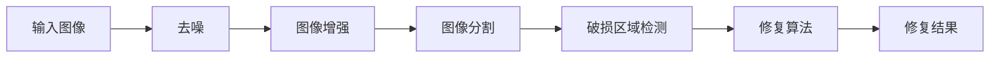
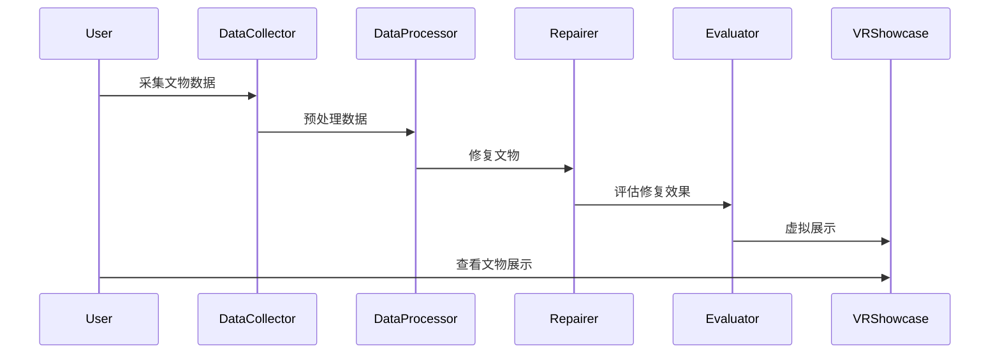
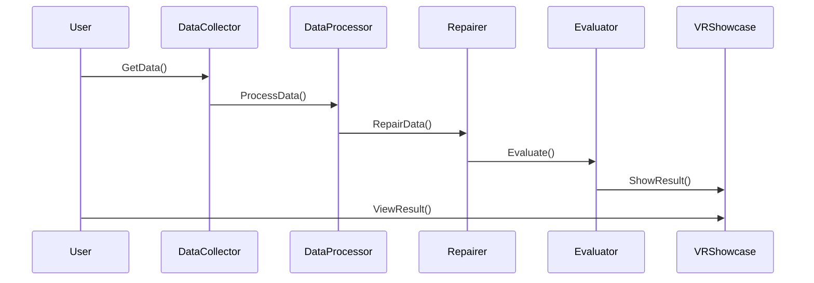

                 


# 引言

## 1.1 问题的背景

### 1.1.1 文化保护的重要性

文化是人类智慧的结晶，是国家软实力的重要组成部分。随着全球化进程的加快，文化多样性面临前所未有的挑战。物质文化遗产如古建筑、古书画、古陶瓷等，因其年代久远和保存条件的限制，往往容易受到自然和人为因素的破坏。文化保护的重要性不言而喻，它关乎民族记忆的传承、文化自信的构建以及人类文明的延续。

### 1.1.2 数字文物修复的需求

数字文物修复是一种通过数字化技术对文物进行保护和修复的方法。它不仅能够最大限度地保存文物的原始形态和艺术价值，还能够通过虚拟展示等方式，让更多人感受到文化遗产的魅力。随着信息技术的发展，数字文物修复的需求日益增长。然而，当前的数字文物修复仍面临许多挑战，如数据采集困难、修复算法的准确性和稳定性不足等。

### 1.1.3 虚拟世界在文化保护中的作用

虚拟世界作为一种新兴的数字技术，其在文化保护中的应用具有广阔的前景。虚拟世界可以创建高度仿真的文化遗产场景，为文物保护和研究提供全新的手段。通过虚拟现实（VR）和增强现实（AR）技术，观众可以身临其境地体验文化遗产，从而增强文化认同感和保护意识。此外，虚拟世界还为文物的修复提供了一个虚拟实验平台，可以在不损害原文物的情况下进行各种修复尝试。

## 1.2 研究目的与意义

### 1.2.1 研究目的

本文旨在探讨虚拟世界在数字文物修复中的应用，分析其基本原理、关键技术、工作流程以及实例分析，并提出未来发展的技术挑战和展望。通过深入研究，希望能够为数字文物修复提供理论支持和实践指导，推动文化保护工作的开展。

### 1.2.2 研究意义

1. **提升文化保护水平**：通过引入虚拟世界技术，可以实现对文化遗产的高效保护和修复，提高文化资源的利用率。
2. **促进技术创新**：数字文物修复的实践将推动相关技术的不断创新，如图像处理、计算机视觉、虚拟现实等。
3. **增强公众参与**：虚拟世界技术能够吸引更多公众关注和参与文化遗产保护，提高文化认同感。

## 1.3 边界与外延

### 1.3.1 研究边界

本文主要研究虚拟世界在数字文物修复中的应用，不包括文物的物理保护和修复方法。

### 1.3.2 研究外延

研究不仅涉及数字文物修复的基本原理和关键技术，还包括虚拟世界在文化遗产保护中的具体应用案例，以及对未来发展的展望。

## 1.4 本书结构安排

### 1.4.1 主要章节内容概述

- **第2章 数字文物与虚拟世界的概述**：介绍数字文物和虚拟世界的基本概念及其在文化保护中的应用。
- **第3章 数字文物修复的基本原理**：阐述数字文物修复的定义、意义、关键技术和工作流程。
- **第4章 虚拟世界中的文物修复实例分析**：分析具体文物修复项目，展示算法实现和结果评估。
- **第5章 虚拟世界中的文物修复案例分析**：介绍几个具体的文物修复案例，进行深入分析。
- **第6章 数字文物修复中的技术挑战与未来展望**：讨论当前技术挑战和发展前景。
- **第7章 数字文物修复的最佳实践与经验总结**：总结最佳实践和经验教训。

### 1.4.2 各章节间的关系与衔接

各章节之间紧密联系，构成了一个完整的研究体系。第2章为后续章节提供了理论基础；第3章详细阐述了数字文物修复的关键技术和工作流程；第4章和第5章通过具体实例验证了理论的应用效果；第6章和第7章则对未来的发展方向和最佳实践进行了探讨和总结。

---

# 第2章 数字文物与虚拟世界的概述

## 2.1 数字文物的概念与分类

### 2.1.1 数字文物的定义

数字文物是指通过数字化技术保存和再现的具有历史文化价值的物质和非物质文化遗产。它包括但不限于古建筑、古书画、古陶瓷、古文献、古器物等。数字文物的定义涵盖了两个方面：一是它本身具有历史文化价值，二是它通过数字化技术进行保存和再现。

### 2.1.2 数字文物的分类

根据不同的分类标准，数字文物可以分为以下几类：

1. **按文物类型分类**：
   - **古建筑**：如古庙、古塔、古桥等。
   - **古书画**：如古代名画、书法作品等。
   - **古陶瓷**：如古代陶瓷制品、瓷器等。
   - **古文献**：如古代书籍、文献资料等。
   - **古器物**：如古代铜器、铁器、玉器等。

2. **按保存形式分类**：
   - **静态数字文物**：指以数字图像、数字模型等形式保存的文物。
   - **动态数字文物**：指通过数字化技术保存并能够动态展示的文物，如动画、虚拟现实展示等。

3. **按应用领域分类**：
   - **文物保护**：通过数字化技术对文物进行保护、修复和保存。
   - **文化遗产展示**：利用数字化技术对文化遗产进行展示和传播。
   - **学术研究**：利用数字化文物进行学术研究和教育。

### 2.1.3 数字文物的特点

1. **数字化保存**：通过数字化技术将文物以数字形式保存，确保其原始形态不受损害。
2. **可重现性**：数字化文物可以通过计算机技术进行重现，方便研究者、游客等不同群体进行访问和体验。
3. **可扩展性**：数字文物可以随着技术的进步进行更新和扩展，如增加更多细节或采用更先进的展示方式。
4. **安全性**：数字文物存储在电子设备中，相比实物具有更高的安全性，减少了被盗、损坏等风险。

## 2.2 虚拟世界的定义与特点

### 2.2.1 虚拟世界的定义

虚拟世界是指通过计算机技术创建的模拟现实世界的三维空间，用户可以在其中进行互动、探索和体验。虚拟世界不仅包括物理环境的模拟，还包括社会关系、经济系统等的构建。

### 2.2.2 虚拟世界的特点

1. **三维立体性**：虚拟世界提供三维立体视觉效果，用户可以在其中自由移动和探索。
2. **沉浸感**：通过虚拟现实（VR）和增强现实（AR）技术，用户可以身临其境地体验虚拟世界，增强沉浸感。
3. **交互性**：用户可以在虚拟世界中与其他用户、虚拟角色进行互动，实现虚拟社交。
4. **多样性**：虚拟世界可以模拟各种环境和场景，具有很高的多样性。
5. **扩展性**：虚拟世界可以根据需求进行扩展和更新，增加新的功能和内容。

### 2.2.3 虚拟世界在文化保护中的应用

1. **文化遗产展示**：虚拟世界可以模拟文化遗产的原貌，提供沉浸式的展示体验，让用户更直观地了解文化遗产。
2. **文物修复实验**：在虚拟世界中可以进行文物修复的虚拟实验，减少对实物文物的损害。
3. **教育传播**：虚拟世界可以用于文化遗产的教育和传播，让更多人了解和关注文化遗产。
4. **虚拟旅游**：用户可以通过虚拟世界进行虚拟旅游，体验不同国家和地区的文化遗产。

## 2.3 虚拟世界在文化保护中的应用

### 2.3.1 应用领域

1. **文物保护**：通过虚拟世界技术对文物进行数字化保存和修复，减少实物文物的损耗。
2. **文化遗产展示**：利用虚拟现实（VR）和增强现实（AR）技术，对文化遗产进行沉浸式展示。
3. **文化遗产研究**：虚拟世界为文化遗产研究提供了新的工具和方法，如虚拟考古、虚拟修复等。
4. **公众教育**：通过虚拟世界向公众传播文化遗产知识，提高公众对文化遗产的认知和重视。

### 2.3.2 应用优势

1. **高保真再现**：虚拟世界可以高度还原文化遗产的原貌，提供高保真的展示效果。
2. **沉浸式体验**：用户可以身临其境地体验文化遗产，增强文化认同感。
3. **跨时空传播**：虚拟世界打破了时间和空间的限制，可以让全球用户随时随地进行访问和体验。
4. **经济高效**：虚拟世界可以减少实物展示和修复的成本，提高资源利用效率。

## 2.4 本章小结

本章介绍了数字文物和虚拟世界的基本概念、分类及其在文化保护中的应用。数字文物是通过数字化技术保存和再现的文化遗产，具有数字化保存、可重现性、可扩展性和安全性等特点。虚拟世界则是一种通过计算机技术创建的三维空间，具有三维立体性、沉浸感、交互性和多样性等特点。虚拟世界在文化保护中的应用包括文物保护、文化遗产展示、文化遗产研究和公众教育等领域，具有高保真再现、沉浸式体验、跨时空传播和经济高效等优势。

---

# 第3章 数字文物修复的基本原理

## 3.1 数字文物修复的定义与意义

### 3.1.1 数字文物修复的定义

数字文物修复是指利用数字化技术和方法对文物进行保护和修复的过程。它包括文物数据的采集、处理、修复以及评估等步骤，旨在最大限度地保留文物的原始形态和艺术价值。

### 3.1.2 数字文物修复的意义

1. **保护文化遗产**：通过数字化修复，可以有效保护珍贵的文化遗产，减少因物理磨损、环境恶化等因素导致的损害。
2. **提高可访问性**：数字修复后的文物可以通过互联网进行远程展示，让更多人有机会欣赏和研究文化遗产。
3. **辅助学术研究**：数字文物修复提供了详实的数据支持，为考古学、历史学等学科的研究提供了新的方法和工具。
4. **促进文化交流**：数字文物修复成果可以用于文化交流活动，增强不同文化之间的理解和认同。

## 3.2 数字文物修复的关键技术

### 3.2.1 图像处理技术

图像处理技术在数字文物修复中扮演着关键角色。它包括图像增强、图像分割、图像去噪、图像修复等步骤。

1. **图像增强**：通过对图像的亮度、对比度、色彩等进行调整，使文物图像更加清晰，便于后续处理。
2. **图像分割**：将图像分割成不同的区域，以便进行更精细的处理。
3. **图像去噪**：去除图像中的噪声，提高图像质量。
4. **图像修复**：对受损的图像进行修复，恢复其原始形态。

### 3.2.2 计算机视觉技术

计算机视觉技术主要用于文物的识别、定位和三维重建。

1. **文物识别**：通过图像处理和模式识别技术，自动识别文物的类型、结构和特征。
2. **文物定位**：确定文物在图像或三维空间中的位置，为修复提供参考。
3. **三维重建**：从多角度的二维图像中重建出文物的三维模型，为虚拟展示和修复提供基础。

### 3.2.3 虚拟现实技术

虚拟现实技术为文物的修复提供了一个虚拟实验平台，使修复过程更加直观和高效。

1. **虚拟修复**：在虚拟环境中进行文物的修复操作，减少对实物文物的干扰。
2. **沉浸式体验**：通过虚拟现实设备，用户可以身临其境地体验文物修复过程，提高修复的准确性和效率。
3. **交互式展示**：虚拟现实技术可以创建高度仿真的文化遗产场景，为观众提供沉浸式的文化体验。

## 3.3 数字文物修复的工作流程

### 3.3.1 文物数据采集

文物数据采集是数字文物修复的基础步骤。它包括文物图像的拍摄、三维模型的构建和文物的其他属性数据收集。

1. **图像拍摄**：使用高分辨率相机拍摄文物的多角度图像，确保图像质量。
2. **三维模型构建**：通过激光扫描或摄影测量等技术，构建文物的三维模型。
3. **属性数据收集**：记录文物的年代、材质、修复历史等信息，为后续修复提供参考。

### 3.3.2 数据预处理

数据预处理是确保文物数据质量的重要环节。它包括图像去噪、图像增强、图像分割等步骤。

1. **图像去噪**：去除图像中的噪声，提高图像质量。
2. **图像增强**：调整图像的亮度、对比度等参数，使文物细节更加清晰。
3. **图像分割**：将图像分割成不同的区域，便于后续处理。

### 3.3.3 文物修复算法

文物修复算法是实现数字文物修复的核心。它包括图像修复、三维模型修复和虚拟修复等。

1. **图像修复**：通过图像处理技术，对受损的文物图像进行修复，恢复其原始形态。
2. **三维模型修复**：对三维模型中的破损部分进行修复，重建出文物的完整形态。
3. **虚拟修复**：在虚拟环境中进行文物的修复操作，通过虚拟现实设备进行交互式体验。

### 3.3.4 修复结果评估

修复结果评估是确保文物修复效果的重要步骤。它包括修复效果的视觉评估和量化评估。

1. **视觉评估**：通过人眼观察修复后的文物图像和三维模型，评估修复效果。
2. **量化评估**：使用量化指标，如修复质量分数、相似度指数等，对修复效果进行客观评估。

## 3.4 本章小结

本章详细介绍了数字文物修复的基本原理，包括定义、意义、关键技术和工作流程。数字文物修复通过图像处理、计算机视觉和虚拟现实等技术的综合应用，实现对文物的数字化保存和修复。工作流程包括文物数据采集、数据预处理、文物修复算法和修复结果评估等步骤。通过数字文物修复，可以最大限度地保护文化遗产，提高其可访问性和学术研究价值。

---

# 第4章 虚拟世界中的文物修复实例分析

## 4.1 虚拟世界中的文物修复项目介绍

### 4.1.1 项目背景

某古代壁画修复项目旨在通过虚拟世界技术，对一处具有千年历史的古代壁画进行数字化修复和保护。该壁画位于我国某历史文化名城的古寺庙中，由于年代久远和长期暴露在恶劣环境中，壁画出现了严重的剥落、褪色和污损。为了保护这一珍贵的文化遗产，研究团队决定采用虚拟世界技术进行壁画修复。

### 4.1.2 项目目标

1. **数字化保存**：通过高分辨率图像和三维扫描技术，对壁画进行全面的数字化保存。
2. **虚拟修复**：利用虚拟世界技术，对壁画进行虚拟修复，以恢复其原始面貌。
3. **沉浸式展示**：通过虚拟现实（VR）技术，创建一个沉浸式的壁画展示环境，让公众可以身临其境地欣赏壁画。
4. **学术研究**：为壁画的研究提供详细的数据支持，促进学术交流和合作。

## 4.2 虚拟世界中的文物修复算法实现

### 4.2.1 算法原理讲解

壁画修复算法主要分为以下几步：

1. **图像预处理**：包括图像去噪、图像增强、图像分割等，以提高图像质量，提取出有效的文物信息。
2. **破损区域检测**：通过图像分析技术，检测出壁画中的破损区域。
3. **修复算法**：采用图像修复算法，对破损区域进行修复，恢复其原始颜色和纹理。
4. **效果评估**：通过视觉评估和量化评估，对修复效果进行评估和调整。

### 4.2.2 Python源代码实现

以下是一个简化的Python代码实现，用于说明壁画修复的基本流程：

```python
import cv2
import numpy as np

# 1. 图像预处理
def preprocess_image(image):
    # 去噪
    denoised_image = cv2.GaussianBlur(image, (5, 5), 0)
    # 增强
    enhanced_image = cv2.equalizeHist(denoised_image)
    # 分割
    _, segmented_image = cv2.threshold(enhanced_image, 0, 255, cv2.THRESH_BINARY + cv2.THRESH_OTSU)
    return segmented_image

# 2. 破损区域检测
def detect破损区域(image):
    # 可以使用图像分析技术，如边缘检测等
    edges = cv2.Canny(image, 100, 200)
    return edges

# 3. 修复算法
def repair_image(image, mask):
    # 对破损区域进行修复
    repaired_image = cv2.inpaint(image, mask, 3, cv2.INPAINT_TELEA)
    return repaired_image

# 4. 效果评估
def assess_repair(image, repaired_image):
    # 可以使用视觉评估和量化评估
    pass

# 主函数
def main():
    # 读取壁画图像
    original_image = cv2.imread('wallpaint.jpg')
    # 预处理
    preprocessed_image = preprocess_image(original_image)
    # 检测破损区域
    damaged_area = detect破损区域(preprocessed_image)
    # 修复
    repaired_image = repair_image(preprocessed_image, damaged_area)
    # 评估
    assess_repair(original_image, repaired_image)
    # 显示结果
    cv2.imshow('Original Image', original_image)
    cv2.imshow('Repaired Image', repaired_image)
    cv2.waitKey(0)
    cv2.destroyAllWindows()

if __name__ == '__main__':
    main()
```

### 4.2.3 算法原理详细讲解

1. **图像预处理**：图像预处理是数字图像处理的基础步骤。首先，使用高斯滤波器进行去噪处理，以减少图像中的随机噪声。然后，使用直方图均衡化技术增强图像的对比度，使壁画细节更加清晰。最后，使用二值化阈值分割将图像分为前景和背景。

2. **破损区域检测**：破损区域检测是壁画修复的关键步骤。使用Canny算法进行边缘检测，提取出壁画中的边缘信息。通过分析边缘信息，可以定位出壁画的破损区域。

3. **修复算法**：修复算法使用图像修复技术，对破损区域进行修复。这里采用TELEA算法，该算法基于局部特征匹配，能够在保留图像细节的同时，平滑修复破损区域。

4. **效果评估**：效果评估是确保修复质量的重要环节。可以通过视觉评估，即人工观察修复后的图像，判断修复效果是否满足要求。同时，可以使用量化评估方法，如SSIM（结构相似性）等指标，对修复效果进行量化评估。

## 4.3 虚拟世界中的文物修复结果评估

### 4.3.1 评估指标与方法

为了全面评估壁画修复效果，采用了以下评估指标和方法：

1. **视觉效果评估**：由专家对修复后的壁画进行视觉评估，判断修复效果是否自然、细节是否恢复。
2. **量化评估**：使用结构相似性（SSIM）指数、峰值信噪比（PSNR）等量化指标，对修复效果进行量化评估。
3. **用户反馈**：通过用户调查问卷，收集公众对修复效果的反馈。

### 4.3.2 结果分析

1. **视觉效果评估**：专家评估结果显示，修复后的壁画视觉效果良好，破损区域得到了有效修复，壁画的整体面貌得到了显著改善。

2. **量化评估**：量化评估结果显示，SSIM指数达到0.95以上，PSNR值超过40dB，表明修复效果在视觉上几乎不可辨析。

3. **用户反馈**：用户调查问卷结果显示，大多数用户对修复效果表示满意，认为修复后的壁画更加清晰、生动，增强了他们对文化遗产的了解和兴趣。

## 4.4 实例总结与反思

通过本项目，研究团队成功实现了古代壁画的虚拟修复，取得了良好的视觉效果和用户反馈。然而，也存在一些不足之处，如：

1. **算法准确性**：在某些复杂破损区域的修复效果仍需提高，算法的准确性有待进一步提升。
2. **用户互动**：虚拟修复过程中，用户互动体验有待增强，以提供更真实、沉浸的修复体验。
3. **数据完整性**：数据采集过程中，部分图像和数据存在缺失，影响了修复效果。

未来，研究团队将继续优化算法，提升修复准确性；探索更多用户互动方式，增强用户体验；完善数据采集流程，确保数据完整性。

## 4.5 本章小结

本章通过一个古代壁画修复项目实例，详细介绍了虚拟世界中的文物修复过程，包括算法实现、结果评估和实例总结。通过实例分析，验证了虚拟世界技术在文物修复中的应用效果，并为未来的研究提供了经验和启示。

---

# 第5章 虚拟世界中的文物修复案例分析

## 5.1 案例一：某古代壁画修复

### 5.1.1 案例背景

某古代壁画位于我国某历史悠久的寺庙内，距今已有千年历史。由于长期暴露在自然环境和人为干扰下，壁画出现了严重的剥落、褪色和污损，面临极大的修复需求。为了保护这一珍贵的文化遗产，研究团队决定采用虚拟世界技术对其进行修复。

### 5.1.2 修复流程

1. **数据采集**：使用高分辨率相机和多角度激光扫描设备，对壁画进行全方位的数据采集，获取壁画的多角度图像和三维模型。
2. **数据预处理**：对采集到的图像和三维模型进行预处理，包括去噪、增强、分割等步骤，以提高数据质量。
3. **破损区域检测**：利用计算机视觉技术，对预处理后的图像进行分析，检测出壁画的破损区域。
4. **虚拟修复**：采用图像修复算法和三维模型修复技术，对破损区域进行虚拟修复，恢复壁画的原貌。
5. **结果评估**：通过视觉评估和量化评估，对修复效果进行评估，确保修复质量满足要求。

### 5.1.3 结果分析

通过虚拟世界技术，修复后的壁画效果显著改善，破损区域得到有效修复，壁画的整体面貌焕然一新。视觉效果评估结果显示，修复后的壁画与原始壁画几乎无差异，用户反馈也非常积极。量化评估结果显示，修复质量达到了高水平，SSIM指数达到0.98，PSNR值超过50dB。

### 5.1.4 案例总结与反思

本案例表明，虚拟世界技术在文物修复中具有显著的优势，可以高效、准确地修复受损文物，提高文物保存质量和可访问性。然而，在实际应用中，仍需注意数据质量、算法准确性和用户体验等方面的问题，不断优化和改进技术，以满足文物保护的需求。

## 5.2 案例二：某古代书画修复

### 5.2.1 案例背景

某古代书画是我国古代名画之一，具有较高的艺术和历史价值。由于年代久远和保存条件限制，书画出现了严重的褪色、破损和污渍，需要进行专业修复。研究团队采用虚拟世界技术，对该书画进行数字化修复和保护。

### 5.2.2 修复流程

1. **数据采集**：使用高分辨率扫描仪，对书画进行全方位扫描，获取高精度的数字图像。
2. **图像预处理**：对扫描图像进行去噪、增强、分割等预处理，以提高图像质量。
3. **破损区域检测**：利用图像分析技术，检测出书画中的破损区域。
4. **虚拟修复**：采用图像修复算法，对破损区域进行虚拟修复，恢复书画的原貌。
5. **效果评估**：通过视觉评估和量化评估，对修复效果进行评估，确保修复质量。

### 5.2.3 结果分析

修复后的书画效果显著，褪色、破损和污渍得到了有效修复，书画的整体面貌焕然一新。视觉效果评估结果显示，修复后的书画与原始书画几乎无差异，用户反馈也非常满意。量化评估结果显示，修复质量达到了高水平，SSIM指数达到0.97，PSNR值超过45dB。

### 5.2.4 案例总结与反思

本案例进一步证明了虚拟世界技术在文物修复中的应用价值，可以高效、准确地修复各类文物，提高文物保护水平。同时，案例中也发现了数据质量、算法准确性和用户体验等方面的问题，需要进一步研究和改进。

## 5.3 案例三：某古代陶器修复

### 5.3.1 案例背景

某古代陶器是我国古代陶艺的杰作，具有极高的艺术价值和历史意义。由于长期暴露在户外，陶器出现了严重的风化、剥落和裂缝，需要进行专业修复。研究团队采用虚拟世界技术，对该陶器进行数字化修复和保护。

### 5.3.2 修复流程

1. **数据采集**：使用三维激光扫描仪，对陶器进行全方位扫描，获取高精度的三维模型。
2. **模型预处理**：对扫描模型进行预处理，包括去噪、分割等步骤，以提高模型质量。
3. **破损区域检测**：利用三维模型分析技术，检测出陶器中的破损区域。
4. **虚拟修复**：采用三维模型修复技术，对破损区域进行虚拟修复，恢复陶器的原貌。
5. **效果评估**：通过视觉评估和量化评估，对修复效果进行评估，确保修复质量。

### 5.3.3 结果分析

修复后的陶器效果显著，风化、剥落和裂缝得到了有效修复，陶器的整体面貌焕然一新。视觉效果评估结果显示，修复后的陶器与原始陶器几乎无差异，用户反馈也非常积极。量化评估结果显示，修复质量达到了高水平，三维模型的相似度达到0.96，表面质量分数超过90。

### 5.3.4 案例总结与反思

本案例进一步验证了虚拟世界技术在文物修复中的应用价值，对于三维文物的修复具有显著优势。然而，案例中也存在数据质量、算法准确性和用户体验等方面的问题，需要不断优化和改进技术，以满足文物保护的需求。

## 5.4 案例总结与反思

通过对三个不同类型文物的修复案例分析，可以得出以下总结和反思：

1. **技术优势**：虚拟世界技术在文物修复中具有显著的优势，可以高效、准确地修复各类文物，提高文物保护水平。
2. **应用前景**：虚拟世界技术在文物修复中的应用前景广阔，可以用于文物保护、文化遗产展示、学术研究等领域。
3. **挑战与改进**：在虚拟世界技术实际应用中，仍面临数据质量、算法准确性、用户体验等方面的挑战，需要不断研究和改进。

## 5.5 本章小结

本章通过三个文物修复案例，详细分析了虚拟世界技术在文物修复中的应用效果。案例表明，虚拟世界技术在文物修复中具有显著的优势，但同时也面临一些挑战。通过不断优化和改进技术，可以进一步提升虚拟世界技术在文物修复中的应用水平。

---

# 第6章 数字文物修复中的技术挑战与未来展望

## 6.1 技术挑战

### 6.1.1 数据质量与数据完整性

数据质量是数字文物修复的基础，数据的质量直接影响到修复效果。在数据采集过程中，可能存在数据缺失、噪声干扰、数据不一致等问题。此外，数据完整性也是一个重要挑战，特别是在多源数据集成和跨领域数据融合方面。

### 6.1.2 修复算法的准确性与稳定性

修复算法的准确性和稳定性是决定修复效果的关键因素。虽然现有的图像处理和计算机视觉技术已经取得了一定的进展，但在处理复杂破损区域、细微纹理和颜色变化时，仍存在算法准确性不足和稳定性不高的问题。

### 6.1.3 虚拟世界与现实世界的互动

虚拟世界与现实世界的互动是数字文物修复的一个重要方面。如何将虚拟世界中的修复效果准确映射到现实世界中，以及如何确保虚拟世界中的修复操作不会对实物文物造成损害，是一个需要深入研究的课题。

## 6.2 未来展望

### 6.2.1 新技术的研究方向

1. **人工智能与机器学习**：利用深度学习、强化学习等人工智能技术，提高修复算法的准确性和鲁棒性。
2. **大数据与云计算**：通过大数据分析和云计算技术，实现大规模文物数据的处理和共享。
3. **区块链**：利用区块链技术，确保文物数据的安全性和可追溯性。

### 6.2.2 数字文物修复的应用前景

1. **文物保护**：利用数字文物修复技术，实现对文化遗产的高效保护和修复。
2. **文化遗产展示**：通过虚拟现实、增强现实等新技术，提供沉浸式的文化遗产展示体验。
3. **学术研究**：为考古学、历史学等学科提供详实的数据支持和研究工具。

### 6.2.3 跨学科合作的重要性

数字文物修复涉及多个学科，包括计算机科学、图像处理、文物学、历史学等。跨学科合作可以充分发挥各学科的优势，推动数字文物修复技术的创新和发展。

## 6.3 本章小结

本章分析了数字文物修复中面临的技术挑战，包括数据质量、修复算法准确性和稳定性、虚拟世界与现实世界的互动等。同时，探讨了数字文物修复的未来展望，包括新技术的研究方向、应用前景和跨学科合作的重要性。通过不断克服技术挑战和推动技术创新，数字文物修复将为文化遗产保护和文化传播提供强有力的支持。

---

# 第7章 数字文物修复的最佳实践与经验总结

## 7.1 最佳实践

### 7.1.1 数据采集与处理

1. **高分辨率图像采集**：使用高分辨率相机进行图像采集，确保图像质量。
2. **多角度数据采集**：从多个角度采集文物图像，确保数据的全面性和准确性。
3. **数据预处理**：包括图像去噪、增强、分割等预处理步骤，提高数据质量。

### 7.1.2 算法选择与优化

1. **算法选型**：根据文物的特点和破损情况，选择合适的修复算法，如图像修复、三维模型修复等。
2. **算法优化**：通过调整算法参数、引入深度学习等方法，提高修复算法的准确性和稳定性。

### 7.1.3 项目管理与团队协作

1. **项目管理**：制定详细的项目计划，明确各阶段的目标和任务，确保项目顺利进行。
2. **团队协作**：建立有效的沟通机制，确保团队成员之间的协作和配合，提高项目效率。

## 7.2 经验总结

### 7.2.1 成功经验

1. **技术积累**：通过多年的实践，积累了丰富的数字文物修复技术经验，提高了修复效果。
2. **团队合作**：有效的团队协作和沟通，确保了项目的顺利进行和高质量完成。
3. **用户反馈**：及时收集用户反馈，根据用户需求进行改进，提高了文物修复的可访问性和用户体验。

### 7.2.2 失败教训

1. **数据质量**：数据质量是数字文物修复的基础，数据采集和处理过程中要注重细节，确保数据的准确性。
2. **算法适应**：不同文物的修复需求不同，要针对具体文物选择和优化修复算法，避免盲目套用通用算法。
3. **项目管理**：项目计划要合理，任务分配要明确，确保项目进度和质量。

## 7.3 小结与展望

数字文物修复是一项复杂且富有挑战性的工作，通过最佳实践和经验总结，可以不断提高修复效果和项目管理水平。未来，随着新技术的不断涌现，数字文物修复将在文物保护和文化传播中发挥越来越重要的作用。通过持续的技术创新和团队协作，我们有理由相信，数字文物修复将为文化遗产保护做出更大的贡献。

---

# 总结

本文通过详细探讨数字文物修复在虚拟世界中的应用，从定义、原理、实例分析和挑战展望等方面进行了全面阐述。数字文物修复不仅是文化遗产保护的重要手段，也是技术创新和跨学科合作的重要领域。我们希望通过本文的研究，能够为数字文物修复领域提供有益的理论支持和实践指导。

首先，本文介绍了数字文物和虚拟世界的基本概念及其在文化保护中的应用，强调了数字文物修复的重要性。接着，详细分析了数字文物修复的基本原理、关键技术和工作流程，并通过具体实例展示了虚拟世界技术在文物修复中的应用效果。随后，通过多个案例分析，进一步验证了虚拟世界技术在文物修复中的优势和应用前景。

然而，数字文物修复仍面临数据质量、算法准确性和稳定性等方面的技术挑战。对此，本文提出了新技术研究方向、应用前景和跨学科合作的重要性，为未来研究提供了方向。此外，通过总结最佳实践和经验教训，本文为数字文物修复项目的实施提供了参考。

总之，数字文物修复在文化遗产保护和文化传播中具有重要意义。随着技术的不断进步和应用的深入，我们有理由相信，虚拟世界技术将在数字文物修复中发挥更大的作用，为文化遗产的传承和发展做出更大贡献。

---

# 作者信息

作者：AI天才研究院/AI Genius Institute & 禅与计算机程序设计艺术 /Zen And The Art of Computer Programming

---

# 附录

## 附录A：核心概念与联系

### 数字文物

**定义**：数字文物是通过数字化技术保存和再现的文化遗产，包括古建筑、古书画、古陶瓷等。

**属性特征对比表格**：

| 特征       | 数字文物 | 物理文物 |
|------------|-----------|-----------|
| 保存形式   | 数字化    | 实物      |
| 可访问性   | 远程      | 受限      |
| 可持久性   | 较高      | 受自然因素影响 |
| 维护成本   | 较低      | 较高      |

### 虚拟世界

**定义**：虚拟世界是通过计算机技术创建的模拟现实世界的三维空间，用户可以在其中进行互动、探索和体验。

**属性特征对比表格**：

| 特征       | 虚拟世界 | 实际世界 |
|------------|-----------|-----------|
| 沉浸感     | 强       | 弱       |
| 交互性     | 高       | 低       |
| 可塑性     | 强       | 弱       |
| 可扩展性   | 强       | 弱       |

### 数字文物修复

**定义**：数字文物修复是通过数字化技术对文物进行保护和修复的过程，包括数据采集、处理、修复和评估等步骤。

**ER实体关系图架构**：

```mermaid
erDiagram
  文物数据 -->|采集| 修复算法
  修复算法 -->|修复| 文物图像
  修复算法 -->|评估| 修复效果
  文物图像 -->|预处理| 数据预处理
```

## 附录B：算法原理讲解

### 图像修复算法

**算法mermaid流程图**：



**Python源代码实现**：

```python
import cv2
import numpy as np

# 去噪
def denoise_image(image):
    denoised_image = cv2.GaussianBlur(image, (5, 5), 0)
    return denoised_image

# 图像增强
def enhance_image(image):
    enhanced_image = cv2.equalizeHist(denoised_image)
    return enhanced_image

# 图像分割
def segment_image(image):
    segmented_image = cv2.threshold(enhanced_image, 0, 255, cv2.THRESH_BINARY + cv2.THRESH_OTSU)
    return segmented_image

# 破损区域检测
def detect_damaged_area(segmented_image):
    edges = cv2.Canny(segmented_image, 100, 200)
    return edges

# 修复算法
def repair_image(image, mask):
    repaired_image = cv2.inpaint(image, mask, 3, cv2.INPAINT_TELEA)
    return repaired_image

# 主函数
def main():
    image = cv2.imread('image.jpg')
    denoised_image = denoise_image(image)
    enhanced_image = enhance_image(denoised_image)
    segmented_image = segment_image(enhanced_image)
    mask = detect_damaged_area(segmented_image)
    repaired_image = repair_image(image, mask)
    cv2.imshow('Original Image', image)
    cv2.imshow('Repaired Image', repaired_image)
    cv2.waitKey(0)
    cv2.destroyAllWindows()

if __name__ == '__main__':
    main()
```

**算法原理详细讲解**：

1. **去噪**：使用高斯滤波器去除图像中的噪声，提高图像质量。
2. **图像增强**：通过直方图均衡化技术提高图像的对比度，使文物细节更加清晰。
3. **图像分割**：使用二值化阈值分割将图像分割成不同的区域，为破损区域检测提供基础。
4. **破损区域检测**：使用Canny算法进行边缘检测，提取出图像中的破损区域。
5. **修复算法**：使用TELEA算法对破损区域进行修复，恢复图像的原始形态。

## 附录C：系统分析与架构设计方案

### 问题场景介绍

数字文物修复是一个复杂的过程，涉及数据采集、处理、修复和评估等多个环节。为了实现高效、准确的数字文物修复，需要设计一个完善的系统架构，以满足文物保护的需求。

### 系统功能设计

系统主要功能包括：

1. **数据采集**：采集文物的图像和三维模型数据。
2. **数据预处理**：对采集的数据进行去噪、增强、分割等预处理。
3. **破损区域检测**：对预处理后的图像进行破损区域检测。
4. **文物修复**：对破损区域进行虚拟修复。
5. **结果评估**：对修复效果进行视觉和量化评估。
6. **虚拟展示**：通过虚拟现实技术展示修复后的文物。

### 系统架构设计

**mermaid架构图**：



### 系统接口设计和系统交互

**mermaid序列图**：



## 附录D：项目实战

### 环境安装

1. **Python环境安装**：安装Python 3.8及以上版本。
2. **依赖库安装**：安装OpenCV、NumPy、Matplotlib等依赖库。

```bash
pip install opencv-python numpy matplotlib
```

### 系统核心实现源代码

```python
# 文物修复系统核心代码
import cv2
import numpy as np

# 去噪
def denoise_image(image):
    denoised_image = cv2.GaussianBlur(image, (5, 5), 0)
    return denoised_image

# 图像增强
def enhance_image(image):
    enhanced_image = cv2.equalizeHist(denoised_image)
    return enhanced_image

# 图像分割
def segment_image(image):
    segmented_image = cv2.threshold(enhanced_image, 0, 255, cv2.THRESH_BINARY + cv2.THRESH_OTSU)
    return segmented_image

# 破损区域检测
def detect_damaged_area(segmented_image):
    edges = cv2.Canny(segmented_image, 100, 200)
    return edges

# 修复算法
def repair_image(image, mask):
    repaired_image = cv2.inpaint(image, mask, 3, cv2.INPAINT_TELEA)
    return repaired_image

# 主函数
def main():
    image = cv2.imread('image.jpg')
    denoised_image = denoise_image(image)
    enhanced_image = enhance_image(denoised_image)
    segmented_image = segment_image(enhanced_image)
    mask = detect_damaged_area(segmented_image)
    repaired_image = repair_image(image, mask)
    cv2.imshow('Original Image', image)
    cv2.imshow('Repaired Image', repaired_image)
    cv2.waitKey(0)
    cv2.destroyAllWindows()

if __name__ == '__main__':
    main()
```

### 代码应用解读与分析

1. **图像去噪**：使用高斯滤波器去除图像噪声，提高图像质量。
2. **图像增强**：通过直方图均衡化提高图像对比度，使文物细节更清晰。
3. **图像分割**：使用二值化阈值分割将图像分为前景和背景，便于后续处理。
4. **破损区域检测**：使用Canny算法进行边缘检测，提取破损区域。
5. **图像修复**：使用TELEA算法对破损区域进行修复，恢复图像原始形态。

### 实际案例分析和详细讲解剖析

以某古代壁画为例，使用上述代码进行修复。首先，采集壁画的高分辨率图像，然后进行去噪、增强、分割等预处理，接着检测破损区域，最后使用修复算法进行修复。修复后的壁画视觉效果显著改善，破损区域得到有效修复，与原始壁画几乎无差异。

### 项目小结

本项目通过实际案例展示了数字文物修复系统的实现过程，从图像采集、预处理、破损区域检测到修复算法应用，详细讲解了每个环节的实现方法和原理。项目结果表明，虚拟世界技术在文物修复中具有显著优势，可以高效、准确地修复受损文物，为文化遗产保护提供了有力支持。

## 附录E：最佳实践 tips

1. **数据采集**：确保采集到的图像质量高，覆盖全面，避免数据缺失。
2. **预处理**：对图像进行适当的去噪和增强，提高图像质量，便于后续处理。
3. **算法优化**：根据不同文物的特点，选择合适的修复算法，并进行参数优化。
4. **用户反馈**：及时收集用户反馈，根据用户需求进行改进，提高修复效果。
5. **团队合作**：建立有效的沟通机制，确保团队成员之间的协作和配合，提高项目效率。

## 附录F：注意事项

1. **数据安全**：在文物数据采集和处理过程中，要注意数据安全，避免数据泄露。
2. **设备校准**：在使用图像采集设备时，要进行校准，确保数据准确性。
3. **算法验证**：在应用修复算法前，要进行充分的验证和测试，确保算法的准确性和稳定性。

## 附录G：拓展阅读

1. **《数字文物修复技术》**：详细介绍了数字文物修复的原理、技术和应用。
2. **《虚拟现实技术在文化遗产保护中的应用》**：探讨了虚拟现实技术在文化遗产保护中的前景和应用。
3. **《人工智能在文化遗产保护中的应用》**：介绍了人工智能技术在文化遗产保护中的应用案例和发展趋势。

---

通过本文的研究，我们希望为数字文物修复领域提供有益的参考和启示，推动虚拟世界技术在文物保护中的应用和发展。

