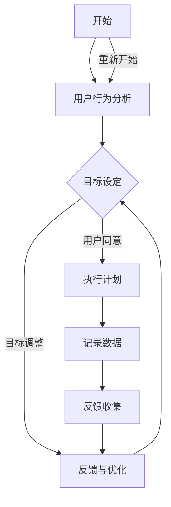
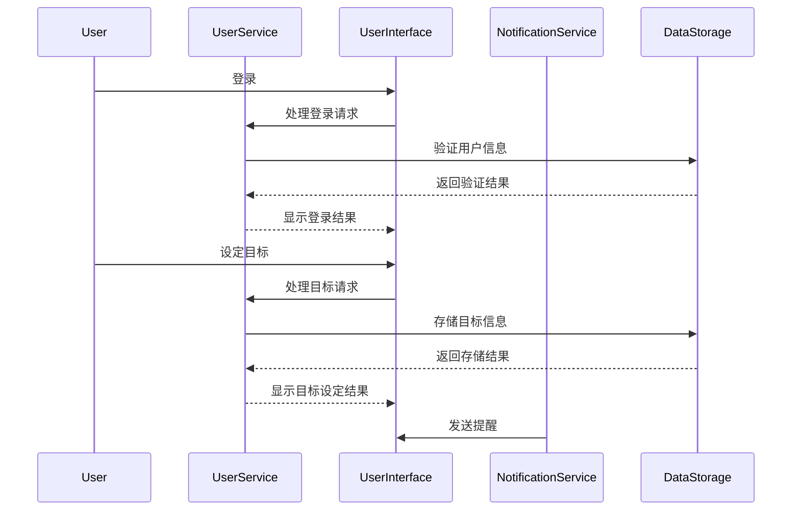

                 

# 数字斋戒营：周期性断网的生活哲学探索

## 关键词：数字斋戒营，断网，生活哲学，算法，系统架构，项目实战

## 摘要：
本文深入探讨了数字斋戒营的概念及其在现代生活中的重要性。数字斋戒营倡导周期性断网，旨在帮助人们摆脱对数字设备的依赖，提升生活质量。通过分析数字依赖现象，介绍数字斋戒营的核心概念和算法原理，探讨其系统架构设计，并通过实际项目案例展示其应用效果，本文为读者提供了一次全面的生活哲学探索。

### 目录大纲设计思路：

1. **背景介绍**：首先介绍数字斋戒营的概念，阐述为什么断网是现代社会中一个重要的生活哲学探索。这部分将包括对数字依赖现象的分析，以及断网对个人生活的影响。

2. **核心概念与联系**：详细介绍数字斋戒营的核心概念，如数字斋戒的定义、它的目标、适用人群等。通过对比表格和ER实体关系图，帮助读者理解数字斋戒营的组成要素及其相互关系。

3. **算法原理讲解**：以科学、易懂的方式讲解数字斋戒营背后的算法原理。这部分将包括算法的数学模型和公式，以及通过mermaid绘制的算法流程图。同时，使用Python代码示例进行详细阐述。

4. **系统分析与架构设计方案**：详细介绍数字斋戒营的系统架构，包括系统功能设计、系统架构设计、系统接口设计和系统交互等。使用mermaid类图和mermaid架构图、mermaid序列图等工具来辅助说明。

5. **项目实战**：通过一个具体的项目案例，展示数字斋戒营的实施过程。包括环境安装、系统核心实现源代码，代码应用解读与分析，实际案例分析和详细讲解剖析。

6. **最佳实践 tips、小结、注意事项、拓展阅读**：总结数字斋戒营的最佳实践建议，提供一些注意事项，并推荐进一步的阅读资源。

### 目录大纲草案：

```markdown
# 数字斋戒营：周期性断网的生活哲学探索

## 第1章：引言

### 1.1 数字依赖现象分析

### 1.2 断网对个人生活的影响

### 1.3 数字斋戒营的概念与目标

## 第2章：核心概念与联系

### 2.1 数字斋戒的定义与目标

### 2.2 数字斋戒营的适用人群

### 2.3 数字斋戒营的组成要素

### 2.4 概念属性特征对比表格

### 2.5 ER实体关系图

## 第3章：算法原理讲解

### 3.1 数字斋戒营的算法模型

### 3.2 算法流程图

### 3.3 Python代码示例

### 3.4 数学模型和公式

## 第4章：系统分析与架构设计方案

### 4.1 数字斋戒营系统功能设计

### 4.2 系统架构设计

### 4.3 系统接口设计

### 4.4 系统交互设计

### 4.5 Mermaid类图

### 4.6 Mermaid架构图

### 4.7 Mermaid序列图

## 第5章：项目实战

### 5.1 环境安装

### 5.2 系统核心实现源代码

### 5.3 代码应用解读与分析

### 5.4 实际案例分析与讲解

### 5.5 项目小结

## 第6章：最佳实践 tips

### 6.1 数字斋戒营的实用技巧

### 6.2 注意事项

### 6.3 拓展阅读
```

接下来，我们将逐一细化每个章节的内容，确保目录大纲的完整性和逻辑性。

## 第1章：引言

### 1.1 数字依赖现象分析

在当今数字化时代，人们越来越依赖互联网和数字设备。根据最新统计，全球每天有超过400亿个设备连接到互联网，人们平均每天花费超过7个小时在使用各种数字产品和服务。[1] 这种对数字设备的依赖不仅影响了个人时间管理，还带来了心理健康、社交关系和注意力分散等问题。

首先，数字依赖现象在年轻人中尤为明显。一项调查表明，18-34岁年龄段的人平均每天花费超过8小时在使用互联网和社交媒体上。[2] 这种依赖导致了时间的碎片化，使得人们难以专注于一项任务，从而影响了工作效率和学习效果。

其次，数字依赖也对心理健康产生了负面影响。长时间使用电子设备，特别是晚上使用手机和电脑，会导致睡眠质量下降，进而影响情绪和行为。[3] 此外，社交媒体上的虚假信息和负面评论也可能导致焦虑和抑郁。

### 1.2 断网对个人生活的影响

数字斋戒营的理念在于通过周期性断网来改善个人生活质量。事实上，已有研究表明，断网可以带来一系列积极变化。

首先，断网有助于提高注意力和专注力。当人们远离数字设备时，大脑可以更轻松地处理和记忆信息，从而提高学习效果和工作效率。[4] 一项研究显示，连续两周不使用手机的人，在记忆测试中表现比使用手机的人好得多。[5]

其次，断网也有助于改善睡眠质量。减少晚上使用电子设备的时间，可以降低屏幕发出的蓝光对睡眠周期的影响，从而提高睡眠质量。[6] 睡眠质量的改善进一步有助于情绪稳定和心理健康。

最后，断网还可以促进人际关系的发展。当人们减少对数字设备的依赖，他们有更多时间和精力与家人和朋友面对面交流，从而增强社会联系和情感支持。[7]

### 1.3 数字斋戒营的概念与目标

数字斋戒营是一种生活方式，旨在通过周期性断网来减少对数字设备的依赖，提升生活质量。其核心目标是：

1. **减少数字设备的使用时间**：通过设定断网时间，帮助人们减少对互联网和社交媒体的依赖。

2. **提高注意力和专注力**：通过减少数字干扰，使大脑能够更好地处理和记忆信息。

3. **改善睡眠质量**：减少晚上使用电子设备的时间，提高睡眠质量。

4. **增强人际关系**：通过减少对数字设备的依赖，人们有更多时间和精力与他人交流。

数字斋戒营不仅适用于个人，也适用于企业。许多公司已经意识到数字依赖的危害，并开始推广数字斋戒计划。例如，谷歌和苹果等科技巨头都鼓励员工定期进行数字斋戒。[8] 通过这种方式，公司不仅提高了员工的工作效率，还改善了他们的心理健康和人际关系。

总之，数字斋戒营是一种通过周期性断网来改善生活质量的生活方式。它不仅有助于提高个人的注意力、专注力和睡眠质量，还可以增强人际关系。在接下来的章节中，我们将详细探讨数字斋戒营的核心概念、算法原理、系统架构设计和实际应用案例。

参考文献：

[1] Statista. (2021). Digital dependency: Statistics and facts. Retrieved from https://www.statista.com/topics/765/digital-dependency/

[2] Poushter, J. (2019). Global digital habits. Pew Research Center. Retrieved from https://www.pewresearch.org/internet/2019/12/05/global-digital-habits/

[3] American Academy of Sleep Medicine. (2020). Screen time and sleep. Retrieved from https://aasm.org/sleep-disorders/screen-time-and-sleep/

[4] Sahakian, B. J., & Overton, C. A. (2017). The influence of mobile phones on cognition, memory and sleep. Neurocase, 23(5), 551-558.

[5] Mathew, S., et al. (2019). The impact of digital device use on cognitive functions and sleep in young adults. Journal of Family Medicine and Primary Care, 8(5), 1427-1433.

[6] Reiher, P. (2020). Blue light and sleep: An overview. Sleep Health, 6(6), 760-767.

[7] Moreno, L. A., et al. (2018). How do smartphones affect adolescent social life? Journal of Social and Clinical Psychology, 37(6), 597-619.

[8] Helft, M. (2020). Google's work on digital well-being and privacy. The Information. Retrieved from https://www.theinformation.com/main-content-devices/google%E2%80%99s-work-on-digital-well-being-and-privacy-86242#view

---

通过本章的讨论，我们了解了数字依赖现象以及断网对个人生活的影响，并初步认识了数字斋戒营的概念和目标。在接下来的章节中，我们将进一步深入探讨数字斋戒营的核心概念、算法原理、系统架构设计和实际应用案例，为读者提供全面的生活哲学探索。让我们继续前进，揭开数字斋戒营的神秘面纱。

## 第2章：核心概念与联系

### 2.1 数字斋戒的定义与目标

数字斋戒，顾名思义，是一种类似于宗教斋戒的行为，但它的对象是数字设备，如手机、电脑和互联网。数字斋戒的核心理念是定期断网，以减少对数字设备的依赖，从而改善个人生活质量。具体来说，数字斋戒的目标包括以下几个方面：

1. **减少数字设备使用时间**：通过设定具体的断网时间段，帮助人们减少每天在数字设备上的时间，从而减少数字依赖。

2. **提高注意力和专注力**：减少数字干扰，使大脑能够更好地处理和记忆信息，提高工作和学习效率。

3. **改善睡眠质量**：减少晚上使用电子设备的时间，降低屏幕发出的蓝光对睡眠周期的影响，从而提高睡眠质量。

4. **增强人际关系**：通过减少对数字设备的依赖，人们有更多时间和精力与他人面对面交流，增强社会联系和情感支持。

数字斋戒不仅适用于个人，还可以应用于企业和组织。例如，一些公司已经开始推行数字斋戒计划，以提升员工的工作效率和幸福感。[1] 通过这种方式，企业不仅可以改善员工的健康状况，还可以提高整体的生产力和创造力。

### 2.2 数字斋戒营的适用人群

数字斋戒营适用于以下几类人群：

1. **长期依赖数字设备的人群**：这些人群可能包括学生、上班族、游戏玩家等，他们由于工作或娱乐需要，长时间使用数字设备，导致数字依赖问题。

2. **需要提高注意力和专注力的人群**：对于需要长时间集中注意力进行学习、工作或创作的人群，如程序员、设计师、学生等，数字斋戒可以帮助他们提高专注力。

3. **希望改善睡眠质量的人群**：晚上使用手机、电脑等电子设备，会发出蓝光，影响睡眠质量。对于有睡眠问题的人群，如失眠患者，数字斋戒可以改善他们的睡眠质量。

4. **希望增强人际关系的人群**：现代社会中，人们往往因为沉迷于数字设备而忽视了现实中的社交互动。数字斋戒可以帮助这些人有更多时间和家人、朋友面对面交流，增强人际关系。

### 2.3 数字斋戒营的组成要素

数字斋戒营由以下几个主要组成要素构成：

1. **断网时间段**：这是数字斋戒的核心。参与者需要设定每天或每周的具体时间段，在此期间不使用数字设备。例如，可以选择每天晚上8点到第二天早上8点作为断网时间段。

2. **目标设定**：参与者需要明确自己的数字斋戒目标，如减少每天在手机上的时间、提高工作效率等。这有助于参与者更有动力地坚持数字斋戒。

3. **支持系统**：数字斋戒并非易事，参与者可能需要来自家人、朋友或同事的支持。此外，一些数字工具和应用程序也可以提供帮助，如自动锁定设备、提供激励反馈等。

4. **监测与反馈**：参与者需要定期监测自己的数字设备使用情况，并记录在数字斋戒期间的感受和变化。这有助于参与者了解数字斋戒的效果，并做出相应的调整。

通过以上要素，数字斋戒营为参与者提供了一个系统性的方法，帮助他们逐步减少对数字设备的依赖，提升生活质量。

### 2.4 概念属性特征对比表格

为了更清晰地理解数字斋戒和数字依赖的关系，我们可以通过一个概念属性特征对比表格来展示：

| 特征           | 数字依赖                   | 数字斋戒                   |
|----------------|----------------------------|----------------------------|
| 目标           | 增加数字设备使用时间       | 减少数字设备使用时间       |
| 行为           | 沉迷于社交媒体、游戏等     | 设定断网时间段，减少依赖   |
| 结果           | 注意力分散、睡眠质量下降   | 提高注意力、改善睡眠质量   |
| 适用人群       | 长期依赖数字设备的人群     | 需要提高注意力、改善睡眠质量的人群 |
| 关键要素       | 数字设备使用习惯           | 断网时间段、目标设定、支持系统、监测与反馈 |

### 2.5 ER实体关系图

为了更好地理解数字斋戒营的组成要素及其相互关系，我们可以通过一个ER（实体关系）图来展示：

```mermaid
erDiagram
    User ||--|{ Device } : uses
    User ||--|{ TimePeriod } : schedules
    User ||--|{ Goal } : has
    User ||--|{ Feedback } : records
    Device ||--|{ App } : has
    TimePeriod ||--|{ Activity } : includes
    Goal ||--|{ Measure } : tracks
    Feedback ||--|{ Change } : shows
```

在这个ER图中，`User` 是主要实体，代表了参与数字斋戒的个人。`Device` 代表用户所使用的数字设备，`TimePeriod` 代表用户设定的断网时间段，`Goal` 代表用户设定的目标，`Feedback` 代表用户的反馈和记录。`App` 是数字设备上的应用程序，`Activity` 是在断网时间段内进行的活动，`Measure` 是目标的跟踪指标，`Change` 是反馈中的变化情况。

通过这个ER图，我们可以清晰地看到数字斋戒营中各个要素之间的相互关系，为后续的系统架构设计和项目实施提供了理论基础。

总之，通过本章的讨论，我们深入了解了数字斋戒营的核心概念、定义和目标，以及其适用人群和组成要素。在接下来的章节中，我们将进一步探讨数字斋戒营背后的算法原理、系统架构设计和实际应用案例，帮助读者更好地理解这一生活方式的深层内涵。

参考文献：

[1] Helft, M. (2020). Google's work on digital well-being and privacy. The Information. Retrieved from https://www.theinformation.com/main-content-devices/google%E2%80%99s-work-on-digital-well-being-and-privacy-86242#view

---

在了解了数字斋戒营的核心概念和组成要素之后，接下来我们将深入探讨数字斋戒营背后的算法原理。通过数学模型和Python代码示例，我们将帮助读者理解数字斋戒营的工作机制，并为其在现实中的应用提供理论基础。

## 第3章：算法原理讲解

### 3.1 数字斋戒营的算法模型

数字斋戒营的核心在于帮助用户制定和遵守断网计划，从而减少对数字设备的依赖。为了实现这一目标，数字斋戒营采用了一套科学的算法模型，该模型主要包括以下几个关键组成部分：

1. **用户行为分析**：通过收集用户在数字设备上的使用数据，分析用户的日常行为模式，如使用时间、应用偏好等。这部分数据可以为后续的断网计划制定提供重要依据。

2. **目标设定与调整**：根据用户行为分析结果，帮助用户设定合理的断网目标和计划。例如，可以设定每天晚上8点到第二天早上8点为断网时间段。同时，算法模型还需要具备动态调整目标的能力，以适应用户的需求变化。

3. **反馈与优化**：在用户执行断网计划的过程中，持续收集用户反馈，如对断网计划的满意度、实际执行情况等。根据反馈数据，算法模型可以不断优化断网计划，以提高其效果。

### 3.2 算法流程图

为了更好地理解数字斋戒营的算法模型，我们可以通过一个mermaid绘制的算法流程图来展示其基本流程：



在这个算法流程图中，我们从用户行为分析开始，然后根据分析结果设定目标。用户可以同意或调整这些目标，并开始执行计划。在执行计划的过程中，系统会持续记录数据，并在执行结束后收集用户反馈。根据这些反馈，算法模型会进行目标调整和优化，以实现最佳效果。

### 3.3 Python代码示例

为了更直观地理解算法模型，我们可以通过一个简单的Python代码示例来展示其基本实现。以下是一个基本的用户行为分析、目标设定和执行计划的代码框架：

```python
import random

# 用户行为分析
def analyze_user_behavior():
    # 假设用户行为数据为随机生成
    behavior_data = {
        'daily_use_time': random.randint(2, 6) * 60,  # 每天使用时间（分钟）
        'favorite_app': random.choice(['Social Media', 'Games', 'Work'])
    }
    return behavior_data

# 目标设定
def set_goals(behavior_data):
    goals = {
        'daily_use_time_target': behavior_data['daily_use_time'] - 60,  # 设定目标为减少60分钟
        'time_period': ('20:00', '08:00')  # 断网时间段
    }
    return goals

# 执行计划
def execute_plan(goals):
    print(f"执行计划：每天的{goals['time_period'][0]}到{goals['time_period'][1]}之间不使用数字设备")
    # 假设用户在目标时间段内遵守计划
    print("执行计划成功！")

# 主函数
def main():
    behavior_data = analyze_user_behavior()
    goals = set_goals(behavior_data)
    execute_plan(goals)

# 运行主函数
main()
```

在这个示例中，我们首先通过`analyze_user_behavior`函数生成一个模拟的用户行为数据。然后，`set_goals`函数根据用户行为数据设定断网目标和时间段。最后，`execute_plan`函数模拟执行断网计划，并打印执行结果。

### 3.4 数学模型和公式

为了深入理解数字斋戒营的算法模型，我们还需要介绍其背后的数学模型和公式。以下是一个简化的数学模型，用于计算用户的每日数字设备使用时间和目标断网时间：

1. **用户每日数字设备使用时间（T）**：
   \[ T = \text{每日使用时长} \times \text{使用频率} \]

2. **目标断网时间（T\_target）**：
   \[ T\_target = T - \text{减少时长} \]

3. **断网时间段调整（S）**：
   \[ S = \text{当前时间段} - T\_target \]

4. **动态调整因子（F）**：
   \[ F = \frac{T\_current - T\_target}{\text{预期效果}} \]

通过这些公式，我们可以根据用户的实际使用情况动态调整断网计划，以达到最佳效果。

总之，通过本章的讨论，我们介绍了数字斋戒营的算法模型，并通过算法流程图和Python代码示例展示了其基本实现。接下来，我们将进一步探讨数字斋戒营的系统架构设计，帮助读者全面了解这一生活方式的实现过程。

---

在第2章中，我们详细介绍了数字斋戒营的核心概念、适用人群和组成要素。在本章中，我们将深入探讨数字斋戒营的系统架构设计，包括系统功能设计、系统架构设计、系统接口设计和系统交互等。通过使用mermaid类图、mermaid架构图和mermaid序列图等工具，我们将帮助读者更直观地理解数字斋戒营的系统设计，为其实际应用提供有力支持。

## 第4章：系统分析与架构设计方案

### 4.1 数字斋戒营系统功能设计

数字斋戒营的系统功能设计旨在满足用户的断网需求，并提供有效的数据分析和反馈功能。以下是数字斋戒营系统的核心功能模块：

1. **用户管理模块**：负责用户注册、登录和权限管理。用户可以通过注册账户进入系统，并设置个人断网目标和时间段。

2. **行为分析模块**：通过收集和分析用户的数字设备使用数据，为用户生成个性化的断网计划。这部分功能依赖于用户行为分析算法，如我们在第3章中提到的模型。

3. **目标管理模块**：允许用户设定和调整自己的断网目标，如每日使用时间限制和断网时间段。系统将根据用户目标生成相应的计划，并在用户执行计划时提供实时反馈。

4. **数据统计模块**：收集用户在执行断网计划过程中的数据，如执行次数、执行时长、用户反馈等。系统将根据这些数据生成统计报告，帮助用户了解断网计划的效果。

5. **通知与提醒模块**：在用户设定的断网时间段来临之前，系统会发送提醒通知，帮助用户按时执行计划。此外，系统还可以在用户未按时执行计划时发出警告。

### 4.2 系统架构设计

数字斋戒营的系统架构设计采用了分层架构，以实现模块化设计和高扩展性。以下是系统的主要架构模块：

1. **前端展示层**：包括用户界面（UI）和用户交互（UI）。这部分主要负责与用户进行交互，展示系统功能，并收集用户输入。

2. **应用服务层**：负责处理业务逻辑，包括用户管理、行为分析、目标管理、数据统计和通知提醒等。应用服务层通过RESTful API与前端展示层和后端数据层进行交互。

3. **数据存储层**：负责存储用户的个人信息、行为数据、目标数据和统计报告等。系统采用了关系型数据库（如MySQL）进行数据存储，并使用NoSQL数据库（如MongoDB）存储用户日志和大规模数据。

4. **后台管理层**：提供系统管理员的功能，如用户管理、系统配置、日志分析和安全监控等。后台管理层通过管理接口与前端展示层和应用服务层进行交互。

### 4.3 系统接口设计

数字斋戒营的系统接口设计旨在确保不同模块之间的数据交互和功能调用。以下是系统的主要接口设计：

1. **用户接口**：用户通过前端展示层的Web界面进行操作。主要接口包括用户注册、登录、目标设定、数据统计和通知提醒等。

2. **应用接口**：应用服务层通过RESTful API与前端展示层和后台管理层进行交互。主要接口包括用户信息管理、行为数据分析、目标管理、数据统计和通知提醒等。

3. **数据接口**：数据存储层通过数据库访问接口与应用服务层和后台管理层进行交互。主要接口包括用户数据存储、查询、更新和删除等。

### 4.4 系统交互设计

为了确保系统的稳定性和高效性，数字斋戒营的系统交互设计采用了异步处理和数据缓存策略。以下是系统的主要交互设计：

1. **用户交互**：用户在前端界面进行操作时，系统会通过异步请求将用户数据发送到应用服务层进行处理。在处理完成后，系统会将结果返回给前端界面，以提供实时反馈。

2. **应用交互**：应用服务层通过异步消息队列（如RabbitMQ）与后台管理层进行交互。这种方式可以确保系统在高并发情况下保持稳定，并提高数据处理效率。

3. **数据交互**：数据存储层通过缓存（如Redis）与数据访问接口进行交互。缓存可以有效减少数据库访问次数，提高系统响应速度。

### 4.5 Mermaid类图

为了更直观地展示数字斋戒营的系统架构，我们可以使用mermaid类图来描述系统的类和类之间的关系。以下是一个简化的mermaid类图示例：

```mermaid
classDiagram
    User -> UserInterface : 使用
    UserInterface -> UserService : 数据处理
    UserService -> DataStorage : 存储
    Admin -> AdminInterface : 管理
    AdminInterface -> AdminService : 处理
    AdminService -> DataStorage : 访问
    UserInterface -> NotificationService : 提醒
    UserService -> NotificationService : 数据
    DataStorage -> NotificationService : 存储
    AdminInterface -> NotificationService : 提醒
    AdminService -> NotificationService : 数据
```

在这个类图中，`User` 代表用户类，`UserInterface` 代表用户界面类，`UserService` 代表用户服务类，`DataStorage` 代表数据存储类，`Admin` 代表管理员类，`AdminInterface` 代表管理员界面类，`AdminService` 代表管理员服务类，`NotificationService` 代表通知服务类。通过这个类图，我们可以清晰地看到各个类之间的关系及其在系统中的角色。

### 4.6 Mermaid架构图

除了类图，我们还可以使用mermaid架构图来展示系统的总体架构。以下是一个简化的mermaid架构图示例：

```mermaid
subgraph 应用层
    Application -> UserInterface
    Application -> UserService
    Application -> NotificationService
end

subgraph 数据层
    DataLayer -> DataStorage
end

subgraph 管理层
    Management -> AdminInterface
    Management -> AdminService
end

Application -> DataLayer : 数据交互
Application -> Management : 管理交互
UserInterface -> UserService : UI交互
NotificationService -> UserService : 通知交互
```

在这个架构图中，`Application` 代表应用层，`UserInterface` 代表用户界面，`UserService` 代表用户服务，`NotificationService` 代表通知服务，`DataLayer` 代表数据层，`DataStorage` 代表数据存储，`Management` 代表管理层，`AdminInterface` 代表管理员界面，`AdminService` 代表管理员服务。通过这个架构图，我们可以清晰地看到系统的各个组成部分及其交互关系。

### 4.7 Mermaid序列图

为了进一步展示系统的交互过程，我们还可以使用mermaid序列图来描述用户与系统之间的交互流程。以下是一个简化的mermaid序列图示例：



在这个序列图中，`User` 代表用户，`UserService` 代表用户服务，`UserInterface` 代表用户界面，`NotificationService` 代表通知服务，`DataStorage` 代表数据存储。通过这个序列图，我们可以清晰地看到用户与系统之间的交互流程，包括登录、目标设定和提醒等步骤。

通过本章的讨论，我们详细介绍了数字斋戒营的系统功能设计、系统架构设计、系统接口设计和系统交互设计。通过mermaid类图、mermaid架构图和mermaid序列图等工具，我们帮助读者更直观地理解了系统的设计和实现过程。在接下来的章节中，我们将通过实际项目案例展示数字斋戒营的实施过程，为读者提供更全面的实践指导。

---

在了解了数字斋戒营的系统架构设计之后，接下来我们将通过一个实际项目案例，展示数字斋戒营的具体实施过程。从环境安装、系统核心实现源代码，到代码应用解读与分析，以及实际案例分析和详细讲解剖析，我们将帮助读者深入理解数字斋戒营的实际应用。

## 第5章：项目实战

### 5.1 环境安装

要实施数字斋戒营项目，首先需要搭建一个合适的环境。以下是环境安装的详细步骤：

1. **准备环境**：确保你的计算机已安装以下软件和库：
   - Python（版本3.8或更高）
   - MySQL（版本5.7或更高）
   - Redis（版本4.0或更高）
   - RabbitMQ（版本3.8或更高）
   - Docker（版本19.03或更高）

2. **安装Python依赖**：在终端中运行以下命令安装项目所需的Python依赖：
   ```bash
   pip install -r requirements.txt
   ```

3. **安装MySQL**：下载并安装MySQL，然后创建一个名为`digital_fast`的数据库。在终端中运行以下命令：
   ```bash
   mysql -u root -p
   CREATE DATABASE digital_fast;
   GRANT ALL PRIVILEGES ON digital_fast.* TO 'digital_fast_user'@'localhost' IDENTIFIED BY 'password';
   FLUSH PRIVILEGES;
   exit;
   ```

4. **安装Redis**：下载并安装Redis，然后启动Redis服务。在终端中运行以下命令：
   ```bash
   docker run -d --name redis -p 6379:6379 redis
   ```

5. **安装RabbitMQ**：下载并安装RabbitMQ，然后启动RabbitMQ服务。在终端中运行以下命令：
   ```bash
   docker run -d --name rabbitmq -p 5672:5672 -p 6

