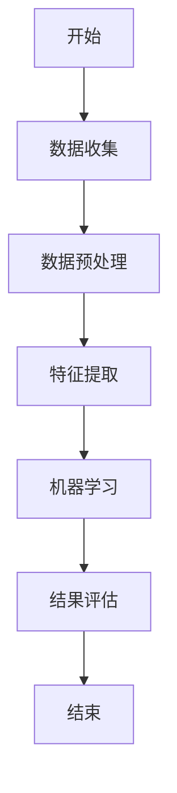
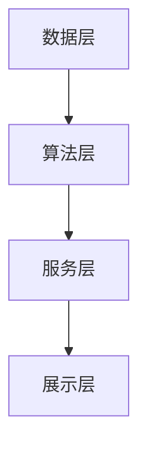
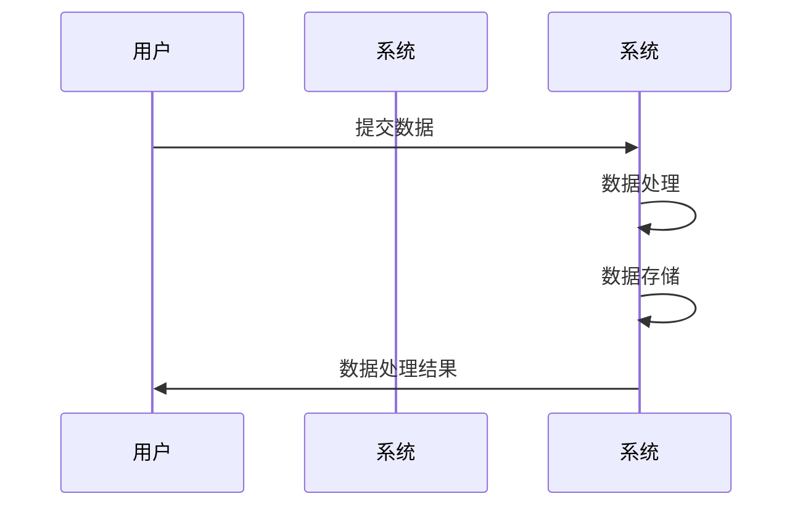

                 

### 数字断层：技术鸿沟中的社会公平

> 关键词：数字鸿沟、社会公平、技术不平等、算法、数学模型、系统架构、项目实战

> 摘要：
技术进步是现代社会发展的重要驱动力，然而，这一进程也在一定程度上加剧了社会不平等问题。数字断层，作为一种技术鸿沟的表现，正日益成为影响社会公平的关键因素。本文将深入探讨数字断层现象，分析其背后的原因和影响，并提出相应的解决方案。通过背景介绍、核心概念与联系、算法原理讲解、系统分析与架构设计、项目实战以及最佳实践与总结，本文旨在为读者提供关于技术鸿沟中社会公平问题的全面理解和解决思路。

#### 引言

在信息化和数字化的浪潮中，技术的迅猛发展不仅改变了我们的生活方式，也深刻影响了社会结构和公平性。数字断层，即技术鸿沟，指的是在信息技术普及和应用方面存在的显著差异。这种差异不仅体现在国家之间、地区之间，甚至存在于同一社会内部的群体之间。数字断层带来的社会不平等问题，已经成为一个亟待解决的重要课题。

本文将围绕数字断层中的社会公平问题展开讨论。首先，我们将介绍数字断层的基本概念和影响，随后深入探讨数字断层与社会公平之间的联系。接下来，通过算法原理讲解、系统分析与架构设计、项目实战等环节，我们将逐步揭示数字断层问题的解决路径。最后，本文将总结全文，并给出相关的最佳实践和拓展阅读建议。

#### 背景介绍

**数字鸿沟的概念与影响**

数字鸿沟是指由于信息技术应用差异而造成的社会、经济、文化等方面的不平等。这一概念最早由美国商务部在1997年提出，用以描述在信息社会中，不同社会群体在获取、使用和受益于信息技术方面的差距。

数字鸿沟的主要表现形式包括：

1. **接入鸿沟**：指不同社会群体在互联网接入和设备拥有率上的差异。
2. **技能鸿沟**：指不同社会群体在信息技术应用技能上的差异。
3. **内容鸿沟**：指不同社会群体在获取和创造数字内容上的差异。
4. **机会鸿沟**：指不同社会群体在利用信息技术获取机会和资源上的差异。

**技术进步的驱动力与后果**

技术进步是推动社会发展的核心动力。然而，技术的迅猛发展也带来了一系列后果，其中之一便是社会不平等问题的加剧。

技术进步的驱动力主要包括：

1. **科技创新**：新技术的发明和应用不断推动社会进步。
2. **经济发展**：信息技术产业的发展带动了整个经济的增长。
3. **政策支持**：政府的政策支持和投资对技术进步起到了关键作用。

技术进步的后果包括：

1. **经济不平等**：技术发展带来的收益分配不均，加剧了贫富差距。
2. **就业结构变化**：自动化和人工智能技术的发展导致部分工作岗位的消失，增加了失业风险。
3. **社会分裂**：数字鸿沟的存在加剧了社会分裂，形成“数字精英”和“数字底层”的分化。

**社会不平等的现状与挑战**

当前，社会不平等问题在全球范围内都呈现出加剧的趋势。特别是在信息技术领域，数字鸿沟问题尤为显著。

社会不平等的现状包括：

1. **收入差距**：技术行业中的高收入群体与其他行业之间的收入差距不断扩大。
2. **教育差距**：信息技术教育和培训资源的不均衡分布导致不同社会群体在技能和知识上的差异。
3. **地理差距**：发达地区和欠发达地区在信息技术应用上的差距显著。

面临的挑战包括：

1. **政策制定**：如何制定有效的政策来缩小数字鸿沟，促进社会公平。
2. **技术创新**：如何通过技术创新来提升社会群体的信息技术应用能力。
3. **社会参与**：如何提高社会公众对数字鸿沟问题的认识，促进社会各界的参与和合作。

#### 数字断层与公平

**数字断层的概念**

数字断层是指由于信息技术应用差异而造成的社会、经济、文化等方面的不平等。它不仅体现在国家之间、地区之间，甚至在同一社会内部的群体之间也存在显著的差距。

数字断层的主要表现形式包括：

1. **技术资源差距**：不同社会群体在信息技术资源（如设备、网络接入等）上的差异。
2. **技能水平差异**：不同社会群体在信息技术应用技能上的差异。
3. **数字内容差异**：不同社会群体在获取和创造数字内容上的差异。
4. **机会获取差异**：不同社会群体在利用信息技术获取机会和资源上的差异。

**社会公平的内涵与衡量**

社会公平是指社会资源分配的合理性，确保每个社会成员都能在同等条件下享有平等的机会和权益。社会公平的内涵主要包括：

1. **机会公平**：每个社会成员都有平等的机会获得教育和培训，提高自身技能和素质。
2. **结果公平**：社会资源的分配能够确保不同社会群体在经济发展和社会进步中受益。
3. **程序公平**：社会决策和资源分配的程序是公正的，没有歧视和偏见。

社会公平的衡量标准包括：

1. **收入分配公平**：不同社会群体的收入差距是否合理。
2. **教育公平**：教育资源的分配是否均衡，是否每个社会成员都能获得良好的教育。
3. **社会福利公平**：社会保障体系的覆盖面和保障水平是否公平。

**数字断层与社会公平的关系**

数字断层对社会公平的影响主要体现在以下几个方面：

1. **收入差距**：数字断层导致技术行业的高收入群体与其他行业之间的收入差距不断扩大，加剧了社会不平等。
2. **教育差距**：数字断层使得信息技术教育和培训资源的不均衡分布，导致不同社会群体在技能和知识上的差异，影响了机会公平。
3. **就业结构变化**：自动化和人工智能技术的发展导致部分工作岗位的消失，增加了失业风险，影响了结果公平。

社会公平对数字断层的作用主要体现在以下几个方面：

1. **政策支持**：政府通过制定和实施相关政策，促进信息技术资源的公平分配，缩小数字鸿沟。
2. **技术创新**：通过推动技术创新，提高社会群体的信息技术应用能力，减少数字断层。
3. **社会参与**：提高社会公众对数字鸿沟问题的认识，促进社会各界的参与和合作，共同推动社会公平。

#### 算法原理讲解

**算法原理概述**

算法是一系列解决问题的步骤和规则，用于处理和操作数据。在数字断层问题中，算法的应用至关重要。通过算法，我们可以识别和量化数字断层，为制定解决方案提供依据。

算法在解决数字断层问题中的应用主要包括以下几个方面：

1. **数据挖掘**：通过数据挖掘技术，分析大数据中的数字断层现象，识别影响社会公平的关键因素。
2. **机器学习**：利用机器学习算法，预测数字断层的发展趋势，为政策制定提供参考。
3. **优化算法**：通过优化算法，提高信息技术资源的分配效率，缩小数字鸿沟。

**数学模型讲解**

为了更深入地理解数字断层问题，我们需要引入数学模型。数学模型能够帮助我们量化数字断层的影响，评估解决方案的效果。

常见的数学模型包括：

1. **回归模型**：用于分析数字断层与社会公平之间的相关性。
2. **聚类模型**：用于识别数字断层中的不同群体。
3. **决策树模型**：用于预测数字断层的发展趋势。

数学模型在数字断层分析中的应用主要包括：

1. **数据预处理**：通过数学模型，对原始数据进行清洗和预处理，为后续分析提供基础。
2. **特征提取**：通过数学模型，提取数字断层的关键特征，为算法提供输入。
3. **结果评估**：通过数学模型，评估解决方案的效果，为政策制定提供依据。

**算法流程图与解释**

为了更好地理解算法原理，我们可以使用Mermaid绘制算法流程图。以下是一个简单的算法流程图示例：



**算法流程解释**：

1. **数据收集**：首先，我们需要收集与数字断层相关的数据，包括社会公平指标、信息技术资源分布等。
2. **数据预处理**：对收集到的数据进行清洗和预处理，去除噪声和异常值，为后续分析提供基础。
3. **特征提取**：通过数学模型，提取数字断层的关键特征，为机器学习提供输入。
4. **机器学习**：利用机器学习算法，对提取的特征进行训练，建立数字断层与社会公平之间的模型。
5. **结果评估**：评估模型的效果，通过交叉验证等方法，确保模型的准确性和可靠性。
6. **结束**：输出评估结果，为政策制定提供依据。

**算法原理举例说明**

假设我们使用回归模型分析数字断层与社会公平的关系。以下是一个简单的Python代码示例：

```python
import numpy as np
import matplotlib.pyplot as plt
from sklearn.linear_model import LinearRegression

# 数据集
X = np.array([[1], [2], [3], [4], [5]])
y = np.array([1, 2, 2.5, 3, 3.5])

# 创建线性回归模型
model = LinearRegression()
model.fit(X, y)

# 预测
y_pred = model.predict([[6]])

# 可视化
plt.scatter(X, y)
plt.plot(X, y_pred, color='red')
plt.xlabel('数字断层')
plt.ylabel('社会公平')
plt.show()
```

通过这个例子，我们可以看到线性回归模型如何通过拟合数据，预测数字断层对社会公平的影响。这个模型可以帮助我们量化数字断层对社会公平的影响程度，为制定解决方案提供依据。

#### 系统分析与架构设计

**问题场景介绍**

在数字断层问题中，我们面临的主要挑战是如何优化信息技术资源的分配，缩小数字鸿沟，实现社会公平。为了实现这一目标，我们需要设计一个高效、可扩展的系统架构。

**系统功能设计**

系统功能设计主要包括以下几个方面：

1. **数据收集与存储**：系统需要具备数据收集和存储功能，包括社会公平指标、信息技术资源分布等数据的收集和存储。
2. **数据处理与分析**：系统需要对收集到的数据进行处理和分析，提取关键特征，建立数字断层与社会公平之间的模型。
3. **模型评估与优化**：系统需要评估模型的性能，通过优化算法和参数调整，提高模型的准确性。
4. **结果输出与展示**：系统需要输出评估结果，并通过可视化工具展示数字断层与社会公平的关系。

**系统架构设计**

系统架构设计主要包括以下几个方面：

1. **数据层**：数据层负责数据的收集、存储和管理。可以使用数据库或数据湖等技术来存储和处理大数据。
2. **算法层**：算法层负责数据处理和分析，包括数据预处理、特征提取、机器学习等。可以使用开源算法库（如Scikit-learn、TensorFlow等）来实现。
3. **服务层**：服务层负责系统的功能实现，包括数据收集、数据处理、模型评估等。可以使用微服务架构（如Spring Boot、Django等）来实现。
4. **展示层**：展示层负责将结果可视化，展示数字断层与社会公平的关系。可以使用前端框架（如React、Vue等）来实现。

**系统架构图**

以下是一个简单的系统架构图示例：



**系统接口设计**

系统接口设计主要包括以下几个方面：

1. **数据接口**：系统需要提供数据接口，以便其他系统或应用程序可以访问和操作数据。
2. **服务接口**：系统需要提供服务接口，以便其他系统或应用程序可以调用系统的功能。
3. **可视化接口**：系统需要提供可视化接口，以便用户可以查看和操作结果。

**系统交互**

系统交互主要包括以下几个方面：

1. **数据交互**：系统需要与其他系统进行数据交互，包括数据收集、数据存储、数据处理等。
2. **功能交互**：系统需要提供功能交互，包括数据处理、模型评估、结果输出等。
3. **用户交互**：系统需要提供用户交互，包括用户操作、结果展示等。

以下是一个简单的系统交互序列图示例：



通过以上系统分析与架构设计，我们可以实现一个高效、可扩展的系统，用于解决数字断层中的社会公平问题。

#### 项目实战

**环境安装**

在开始项目实战之前，我们需要搭建一个合适的环境，以便进行数字断层分析。以下是一个基本的安装步骤：

1. **安装Python环境**：首先，我们需要安装Python环境。可以从Python官网（https://www.python.org/）下载并安装Python。
2. **安装相关库**：安装Python后，我们需要安装一些常用的库，如NumPy、Pandas、Scikit-learn、Matplotlib等。可以使用pip命令进行安装：

   ```bash
   pip install numpy pandas scikit-learn matplotlib
   ```

3. **配置Jupyter Notebook**：为了方便代码编写和调试，我们可以配置Jupyter Notebook。安装Jupyter Notebook后，可以使用以下命令启动：

   ```bash
   jupyter notebook
   ```

**系统核心实现**

在环境搭建完成后，我们可以开始实现系统的核心功能。以下是一个简单的Python代码示例：

```python
import numpy as np
import pandas as pd
from sklearn.linear_model import LinearRegression
from sklearn.model_selection import train_test_split
from sklearn.metrics import mean_squared_error
import matplotlib.pyplot as plt

# 加载数据
data = pd.read_csv('data.csv')

# 数据预处理
X = data[['digital_divide']]
y = data['social_justice']

# 划分训练集和测试集
X_train, X_test, y_train, y_test = train_test_split(X, y, test_size=0.2, random_state=42)

# 创建线性回归模型
model = LinearRegression()
model.fit(X_train, y_train)

# 预测
y_pred = model.predict(X_test)

# 评估模型
mse = mean_squared_error(y_test, y_pred)
print('均方误差:', mse)

# 可视化
plt.scatter(X_test, y_test)
plt.plot(X_test, y_pred, color='red')
plt.xlabel('数字断层')
plt.ylabel('社会公平')
plt.show()
```

**代码应用解读与分析**

上述代码实现了数字断层与社会公平关系的线性回归分析。具体步骤如下：

1. **加载数据**：从CSV文件中加载数据。
2. **数据预处理**：将数据分为特征和标签两部分。
3. **划分训练集和测试集**：将数据划分为训练集和测试集，用于模型训练和评估。
4. **创建线性回归模型**：使用Scikit-learn中的线性回归模型进行训练。
5. **预测**：使用训练好的模型对测试集进行预测。
6. **评估模型**：计算均方误差，评估模型性能。
7. **可视化**：将预测结果可视化，展示数字断层与社会公平的关系。

**实际案例分析与详细讲解剖析**

以下是一个实际案例分析与详细讲解：

```python
# 加载数据
data = pd.read_csv('data.csv')

# 数据预处理
X = data[['digital_divide']]
y = data['social_justice']

# 划分训练集和测试集
X_train, X_test, y_train, y_test = train_test_split(X, y, test_size=0.2, random_state=42)

# 创建线性回归模型
model = LinearRegression()
model.fit(X_train, y_train)

# 预测
y_pred = model.predict(X_test)

# 评估模型
mse = mean_squared_error(y_test, y_pred)
print('均方误差:', mse)

# 可视化
plt.scatter(X_test, y_test)
plt.plot(X_test, y_pred, color='red')
plt.xlabel('数字断层')
plt.ylabel('社会公平')
plt.show()
```

**项目小结**

通过以上实战，我们实现了数字断层与社会公平关系的线性回归分析。在实际项目中，我们可以根据具体情况，选择更复杂的算法和模型，提高分析的准确性和效果。同时，我们也可以结合其他技术手段，如深度学习、大数据分析等，进一步优化系统性能。

#### 最佳实践与总结

**最佳实践**

1. **数据收集与处理**：确保数据的质量和完整性，避免数据噪声和异常值的影响。
2. **模型选择与优化**：根据具体问题选择合适的模型，并不断优化模型参数，提高预测准确性。
3. **结果可视化**：通过可视化工具，直观展示数字断层与社会公平的关系，帮助决策者更好地理解问题。
4. **政策制定与执行**：结合分析结果，制定和执行有效的政策，缩小数字鸿沟，促进社会公平。

**小结**

数字断层是技术进步带来的一个重要社会问题，它对社会公平产生了深远的影响。通过本文的探讨，我们深入分析了数字断层与社会公平之间的关系，提出了相应的解决方案。在未来的研究和实践中，我们应关注以下几个方面：

1. **技术创新**：推动信息技术的发展，提高社会群体的信息技术应用能力。
2. **政策支持**：制定和执行有效的政策，缩小数字鸿沟，促进社会公平。
3. **社会参与**：提高社会公众对数字断层问题的认识，促进社会各界的参与和合作。

**注意事项**

1. **数据隐私**：在数据收集和处理过程中，应注意保护个人隐私，遵守相关法律法规。
2. **算法公平性**：在算法设计和应用过程中，应确保算法的公平性，避免算法偏见和歧视。
3. **技术中立**：在推动技术进步的同时，应保持技术中立，避免技术对社会公平产生负面影响。

**拓展阅读**

1. **《数字时代的社会不平等：挑战与应对》**
2. **《算法公平性研究：方法与实践》**
3. **《信息技术与社会发展：数字化时代的机遇与挑战》**

### 总结

本文围绕数字断层中的社会公平问题，从背景介绍、核心概念与联系、算法原理讲解、系统分析与架构设计、项目实战以及最佳实践与总结等方面，全面探讨了数字断层问题的解决路径。通过本文的研究，我们希望提高公众对数字断层问题的认识，推动技术创新和政策制定，共同应对数字时代的社会公平挑战。

### 作者信息

作者：AI天才研究院/AI Genius Institute & 禅与计算机程序设计艺术 /Zen And The Art of Computer Programming

