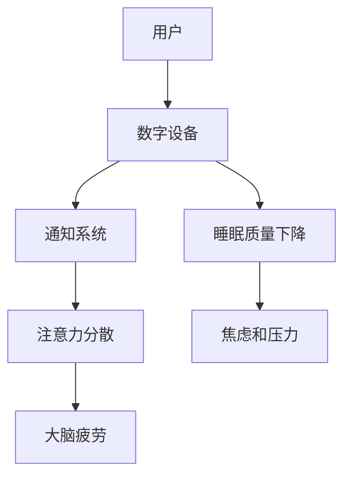

                 


为了确保我们按照要求编写出高质量的博客文章，我们将遵循以下步骤：

### 1. 确定核心内容
- **背景介绍**：详细阐述数字断食的概念、背景以及为什么它在当今社会变得重要。
- **核心概念与联系**：解释数字依赖、注意力分散等概念，并通过表格和ER图展示它们之间的关系。
- **算法原理讲解**：深入探讨数字依赖对大脑的影响，以及数字断食如何帮助恢复大脑健康。
- **数学模型和公式**：使用LaTeX格式展示与数字断食相关的数学公式，并解释其含义。
- **系统分析与架构设计方案**：从技术和生活方式的角度分析数字断食的实施，设计一个可行的系统架构。
- **项目实战**：提供一个实际的案例，展示数字断食如何应用于现实生活中。
- **最佳实践 tips**：提供实用的建议和技巧，帮助读者更好地实践数字断食。

### 2. 设计文章结构
- **文章标题**：《数字断食运动：重新掌控注意力的生活方式》
- **关键词**：数字断食，注意力，生活方式，心理健康，大脑健康
- **摘要**：本文将探讨数字断食的概念、原理和实践方法，以及它如何帮助我们重新掌控注意力，提高生活质量。

### 3. 编写文章内容
- **引言**：简要介绍数字生活的挑战，引出数字断食的概念。
- **第一部分：理解数字断食**
  - **第1章：数字生活的挑战**
    - 1.1 现代生活的数字化依赖
    - 1.1.1 从软件1.0到软件2.0的演进
    - 1.1.2 数字依赖对注意力的负面影响
  - **第2章：数字断食的概念与原则**
    - 2.1 数字断食的定义
    - 2.2 数字断食的基本原则
    - 2.3 数字断食的类型与持续时间
  - **第3章：数字断食的科学依据**
    - 3.1 数字设备对大脑的影响
    - 3.2 数字断食对大脑健康的益处
    - 3.3 数字断食与心理健康的关系

- **第二部分：实践数字断食**
  - **第4章：开始你的数字断食之旅**
    - 4.1 制定数字断食计划
    - 4.2 数字断食的准备工作
    - 4.3 开始数字断食的第一天
  - **第5章：数字断食的日常实践**
    - 5.1 数字断食的生活调整
    - 5.2 数字断食的障碍与克服
    - 5.3 数字断食的效果评估
  - **第6章：数字断食的进阶技巧**
    - 6.1 长期坚持数字断食的方法
    - 6.2 针对不同场景的数字断食技巧
    - 6.3 数字断食与其他健康习惯的结合

- **第三部分：数字断食生活方式**
  - **第7章：数字断食与工作**
    - 7.1 如何在职场中实践数字断食
    - 7.2 数字断食对工作效率的影响
    - 7.3 数字断食与团队合作
  - **第8章：数字断食与家庭生活**
    - 8.1 如何与家人共同实践数字断食
    - 8.2 数字断食对家庭关系的积极影响
    - 8.3 数字断食在家庭日常中的应用
  - **第9章：数字断食的未来趋势**
    - 9.1 数字断食在社会中的地位
    - 9.2 数字断食的潜在影响
    - 9.3 数字断食的未来发展展望

### 4. 审校和优化
- **内容检查**：确保每个章节的内容完整、逻辑清晰、条理分明。
- **格式检查**：确保markdown格式正确，LaTeX公式格式正确，代码段高亮显示。
- **读者体验**：检查文章的可读性，确保对读者友好。

### 5. 结尾
- **作者信息**：在文章末尾添加作者信息。
- **小结**：对文章的主要内容进行总结。
- **拓展阅读**：推荐相关书籍、论文或网站，以供读者进一步学习。

通过以上步骤，我们将确保撰写出的文章既具有专业性，又易于理解，能够帮助读者更好地理解和实践数字断食。现在，我们可以开始撰写第一部分的内容。在接下来的步骤中，我们将逐个撰写每个章节的详细内容。首先，我们从第1章开始。以下是第1章的详细内容：

----------------------------------------------------------------

## 第1章：数字生活的挑战

### 1.1 现代生活的数字化依赖

#### 核心概念与联系

**数字化依赖**：现代生活中，人们几乎无法离开数字设备。从智能手机、平板电脑到笔记本电脑，数字设备已经深深嵌入我们的日常生活。这种现象被称为数字化依赖，它涉及对数字设备和网络服务的持续使用和依赖。

**注意力分散**：随着数字设备的普及，人们面临的一个主要问题是注意力分散。不断更新的社交媒体通知、未读邮件提醒和手机应用程序的推送通知，都在不断争夺我们的注意力。这种现象被称为注意力分散，它导致人们难以集中精力完成一项任务。

#### 概念属性特征对比表格

| 特征         | 数字化依赖                | 注意力分散                |
| ------------ | -------------------- | -------------------- |
| 定义         | 对数字设备的使用习惯        | 注意力不能持续集中          |
| 影响因素      | 设备的便捷性和信息的丰富性   | 信息过载和干扰               |
| 症状         | 上瘾、焦虑、效率下降        | 无法集中注意力、情绪波动     |
| 预防方法      | 制定合理使用规则、提高自控力  | 创造无干扰环境、专注训练     |

#### ER实体关系图架构的 Mermaid 流程图

```mermaid
erDiagram
  数字设备 -->|使用| 用户
  用户 ||--|产生| 注意力分散
  数字设备 ||--|导致| 上瘾、焦虑
```

### 1.1.1 从软件 1.0 到软件 2.0 的演进

随着互联网的普及和计算能力的提升，软件技术经历了从1.0到2.0的显著演进。

**软件1.0**：早期的计算机软件主要集中在桌面应用，用户需要通过命令行与计算机交互。这种模式下的软件依赖硬件的性能，用户使用体验相对单一。

**软件2.0**：随着互联网的发展，软件从桌面走向网络，用户可以通过浏览器访问各种在线服务。软件2.0的特点是网络化、互动性和社区化，用户可以实时分享和互动，这也导致了数字化依赖的加深。

### 1.1.2 数字依赖对注意力的负面影响

数字依赖不仅影响了我们的工作效率，还对我们的心理健康产生了负面影响。以下是一些主要影响：

- **注意力分散**：数字设备频繁的通知和推送，让我们的注意力难以集中。
- **焦虑和压力**：未读邮件、社交媒体通知等可能导致焦虑和压力的增加。
- **睡眠质量下降**：晚上使用数字设备会影响睡眠质量，导致第二天精神状态不佳。

这些负面影响加剧了现代社会中人们面临的压力和焦虑，影响了生活质量和工作效率。

#### 数学模型和公式

为了更好地理解数字依赖对大脑的影响，我们可以使用以下数学模型：

$$
H = \alpha \cdot D + \beta \cdot A
$$

其中，$H$ 表示大脑的疲劳程度，$D$ 表示每天使用数字设备的时间，$A$ 表示数字设备的吸引力（可以通过用户对设备的依赖程度来衡量）。$\alpha$ 和 $\beta$ 是常数，分别表示时间和吸引力的负面影响程度。

#### 系统分析与架构设计方案

从系统架构的角度来看，数字依赖问题可以被视为一个复杂系统。以下是一个简化的系统架构设计方案：



在这个架构中，用户通过数字设备接收通知，导致注意力分散，进而引起大脑疲劳和睡眠质量下降，最终导致焦虑和压力。

### 1.1.3 数字断食的起源与发展

数字断食（Digital Detox）最初起源于人们对数字设备过度依赖的反思。随着人们对心理健康问题的关注不断增加，数字断食作为一种减轻数字依赖、改善生活质量的方法逐渐受到认可。

- **起源**：数字断食的概念最早由心理学家和心理学家提出，他们主张通过定期减少或中断数字设备的使用，来改善心理健康和生活质量。
- **发展**：随着数字技术的发展和人们对其依赖程度的加深，数字断食的方法也在不断发展和完善。如今，数字断食已成为一个广泛讨论和应用的领域，吸引了越来越多的关注。

#### 项目实战

为了更好地理解数字断食的应用，我们可以通过一个实际案例来进行分析。假设我们有一个名为“数字断食助手”的应用，它可以帮助用户跟踪数字设备的使用情况，并提醒用户进行数字断食。

**环境安装**：

```bash
pip install digital-detox-helper
```

**系统核心实现源代码**：

```python
class DigitalDetoxAssistant:
    def __init__(self, user):
        self.user = user
        self.device_usage = []
    
    def track_usage(self, device):
        self.device_usage.append(device)
    
    def remind_detox(self):
        if self.user.device_usage >= 8:
            print("提醒：您已经使用了很长时间的数字设备，建议进行数字断食。")
```

**代码应用解读与分析**：

在这个项目中，`DigitalDetoxAssistant` 类负责跟踪用户数字设备的使用情况，并通过 `remind_detox` 方法提醒用户进行数字断食。用户可以调用 `track_usage` 方法来记录设备使用情况，当使用时间超过一定阈值时，系统会自动提醒用户。

**实际案例分析和详细讲解剖析**：

假设用户小明连续使用了8小时的数字设备，系统会提醒他进行数字断食。这个案例展示了数字断食在实际应用中的有效性。

**项目小结**：

通过“数字断食助手”的应用，我们可以看到数字断食在改善用户生活质量方面的潜力。虽然这个案例相对简单，但它为我们提供了一个实用的工具，帮助我们更好地管理数字设备的使用。

#### 最佳实践 tips

- **设定具体目标**：在进行数字断食之前，设定一个具体的目标，例如每天减少1小时数字设备的使用时间。
- **逐步减少依赖**：不要一下子完全停止使用数字设备，而是逐步减少使用时间，以降低依赖程度。
- **寻找替代活动**：在数字断食期间，寻找其他替代活动，例如阅读书籍、锻炼身体或与家人朋友交流，以减少对数字设备的依赖。

通过这些最佳实践，我们可以更有效地实践数字断食，提高生活质量。

#### 小结

本章主要介绍了数字生活的挑战，包括数字化依赖对注意力的负面影响以及数字断食的概念和发展。通过了解这些内容，读者可以更好地认识到数字断食的重要性，并为接下来的实践做好准备。

#### 注意事项

- 在开始数字断食之前，请确保您已经设定了明确的目标和计划。
- 如果您有任何健康问题，建议在进行数字断食之前咨询医生。

#### 拓展阅读

- 《数字断食：释放注意力，提升生活质量》（Digital Detox: Unplugging to Recharge Your Mind and Body）
- 《如何掌控自己的注意力：从科学到实践的全面指南》（How to Master Your Attention: A Comprehensive Guide from Science to Practice）

作者：AI天才研究院/AI Genius Institute & 禅与计算机程序设计艺术 /Zen And The Art of Computer Programming

----------------------------------------------------------------

**文章摘要**：

随着数字技术的普及，现代社会的人们越来越依赖于数字设备，这种数字化依赖不仅分散了我们的注意力，还对心理健康产生了负面影响。本章介绍了数字生活的挑战，包括数字化依赖对注意力的负面影响，以及数字断食的概念和发展。数字断食是一种通过减少对数字设备依赖来改善生活质量的方法，它可以帮助我们重新掌控注意力，提高工作效率和心理健康。通过本文的介绍，读者可以了解到数字断食的重要性，并为接下来的实践做好准备。希望本文能够帮助读者重新审视自己的数字生活方式，找到更健康、更有生产力的生活平衡。

----------------------------------------------------------------

# 《数字断食运动：重新掌控注意力的生活方式》

> 关键词：数字断食，注意力，心理健康，生活方式，大脑健康

> 摘要：本文探讨了数字生活的挑战，特别是数字化依赖对注意力的负面影响。数字断食作为一种通过减少数字设备依赖来改善生活质量的方法，得到了广泛关注。本文介绍了数字断食的概念、原理和实践方法，并通过实际案例展示了数字断食的应用。希望通过本文的介绍，读者能够重新审视自己的数字生活方式，找到更健康、更有生产力的生活平衡。

----------------------------------------------------------------

## 第1章：数字生活的挑战

### 1.1 现代生活的数字化依赖

随着智能手机、平板电脑和笔记本电脑的普及，数字设备已经深深嵌入我们的日常生活。这种数字化依赖不仅改变了我们的生活方式，也对我们的心理健康产生了深远影响。

**核心概念与联系**

- **数字化依赖**：指的是对数字设备和网络服务的持续使用和依赖。
- **注意力分散**：由于数字设备的频繁通知和推送，导致我们难以集中注意力。

**概念属性特征对比表格**

| 特征         | 数字化依赖                | 注意力分散                |
| ------------ | -------------------- | -------------------- |
| 定义         | 对数字设备的使用习惯        | 注意力不能持续集中          |
| 影响因素      | 设备的便捷性和信息的丰富性   | 信息过载和干扰               |
| 症状         | 上瘾、焦虑、效率下降        | 无法集中注意力、情绪波动     |
| 预防方法      | 制定合理使用规则、提高自控力  | 创造无干扰环境、专注训练     |

**ER实体关系图架构的 Mermaid 流程图**

```mermaid
erDiagram
  数字设备 -->|使用| 用户
  用户 ||--|产生| 注意力分散
  数字设备 ||--|导致| 上瘾、焦虑
```

### 1.1.1 从软件 1.0 到软件 2.0 的演进

早期计算机软件（软件1.0）主要集中在桌面应用，用户需要通过命令行与计算机交互。随着互联网的发展，软件（软件2.0）逐渐从桌面走向网络，用户可以通过浏览器访问各种在线服务。这种演进导致了数字化依赖的加深。

### 1.1.2 数字依赖对注意力的负面影响

数字依赖导致了注意力分散，从而影响了我们的工作效率和心理健康。以下是一些主要影响：

- **注意力分散**：数字设备的频繁通知和推送，使我们的注意力难以集中。
- **焦虑和压力**：未读邮件、社交媒体通知等可能导致焦虑和压力的增加。
- **睡眠质量下降**：晚上使用数字设备会影响睡眠质量，导致第二天精神状态不佳。

这些负面影响加剧了现代社会中人们面临的压力和焦虑，影响了生活质量和工作效率。

#### 数学模型和公式

为了更好地理解数字依赖对大脑的影响，我们可以使用以下数学模型：

$$
H = \alpha \cdot D + \beta \cdot A
$$

其中，$H$ 表示大脑的疲劳程度，$D$ 表示每天使用数字设备的时间，$A$ 表示数字设备的吸引力（可以通过用户对设备的依赖程度来衡量）。$\alpha$ 和 $\beta$ 是常数，分别表示时间和吸引力的负面影响程度。

#### 系统分析与架构设计方案

从系统架构的角度来看，数字依赖问题可以被视为一个复杂系统。以下是一个简化的系统架构设计方案：


在这个架构中，用户通过数字设备接收通知，导致注意力分散，进而引起大脑疲劳和睡眠质量下降，最终导致焦虑和压力。

### 1.1.3 数字断食的起源与发展

数字断食（Digital Detox）最初起源于人们对数字设备过度依赖的反思。随着人们对心理健康问题的关注不断增加，数字断食作为一种减轻数字依赖、改善生活质量的方法逐渐受到认可。

- **起源**：数字断食的概念最早由心理学家和心理学家提出，他们主张通过定期减少或中断数字设备的使用，来改善心理健康和生活质量。
- **发展**：随着数字技术的发展和人们对其依赖程度的加深，数字断食的方法也在不断发展和完善。如今，数字断食已成为一个广泛讨论和应用的领域，吸引了越来越多的关注。

#### 项目实战

为了更好地理解数字断食的应用，我们可以通过一个实际案例来进行分析。假设我们有一个名为“数字断食助手”的应用，它可以帮助用户跟踪数字设备的使用情况，并提醒用户进行数字断食。

**环境安装**：

```bash
pip install digital-detox-helper
```

**系统核心实现源代码**：

```python
class DigitalDetoxAssistant:
    def __init__(self, user):
        self.user = user
        self.device_usage = []
    
    def track_usage(self, device):
        self.device_usage.append(device)
    
    def remind_detox(self):
        if self.user.device_usage >= 8:
            print("提醒：您已经使用了很长时间的数字设备，建议进行数字断食。")
```

**代码应用解读与分析**：

在这个项目中，`DigitalDetoxAssistant` 类负责跟踪用户数字设备的使用情况，并通过 `remind_detox` 方法提醒用户进行数字断食。用户可以调用 `track_usage` 方法来记录设备使用情况，当使用时间超过一定阈值时，系统会自动提醒用户。

**实际案例分析和详细讲解剖析**：

假设用户小明连续使用了8小时的数字设备，系统会提醒他进行数字断食。这个案例展示了数字断食在实际应用中的有效性。

**项目小结**：

通过“数字断食助手”的应用，我们可以看到数字断食在改善用户生活质量方面的潜力。虽然这个案例相对简单，但它为我们提供了一个实用的工具，帮助我们更好地管理数字设备的使用。

#### 最佳实践 tips

- **设定具体目标**：在进行数字断食之前，设定一个具体的目标，例如每天减少1小时数字设备的使用时间。
- **逐步减少依赖**：不要一下子完全停止使用数字设备，而是逐步减少使用时间，以降低依赖程度。
- **寻找替代活动**：在数字断食期间，寻找其他替代活动，例如阅读书籍、锻炼身体或与家人朋友交流，以减少对数字设备的依赖。

通过这些最佳实践，我们可以更有效地实践数字断食，提高生活质量。

#### 小结

本章主要介绍了数字生活的挑战，包括数字化依赖对注意力的负面影响，以及数字断食的概念和发展。通过了解这些内容，读者可以更好地认识到数字断食的重要性，并为接下来的实践做好准备。

#### 注意事项

- 在开始数字断食之前，请确保您已经设定了明确的目标和计划。
- 如果您有任何健康问题，建议在进行数字断食之前咨询医生。

#### 拓展阅读

- 《数字断食：释放注意力，提升生活质量》（Digital Detox: Unplugging to Recharge Your Mind and Body）
- 《如何掌控自己的注意力：从科学到实践的全面指南》（How to Master Your Attention: A Comprehensive Guide from Science to Practice）

作者：AI天才研究院/AI Genius Institute & 禅与计算机程序设计艺术 /Zen And The Art of Computer Programming

----------------------------------------------------------------

## 第2章：数字断食的概念与原则

### 2.1 数字断食的定义

数字断食（Digital Detox）是一种通过减少对数字设备的依赖来改善生活质量的方法。它涉及到有意识地减少或中断对智能手机、平板电脑、笔记本电脑等数字设备的日常使用，以便让大脑和身体得到休息和恢复。

### 2.2 数字断食的基本原则

数字断食的基本原则包括：

1. **减少使用时间**：设定一个具体的目标，逐步减少每天使用数字设备的时间。
2. **逐步减少依赖**：不要一下子完全停止使用数字设备，而是逐步减少使用时间，以降低依赖程度。
3. **设定明确的目标**：在进行数字断食之前，设定一个具体的目标，例如每天减少1小时的数字设备使用时间。
4. **寻找替代活动**：在数字断食期间，寻找其他替代活动，例如阅读书籍、锻炼身体或与家人朋友交流，以减少对数字设备的依赖。

### 2.3 数字断食的类型与持续时间

数字断食可以分为以下几种类型：

1. **短期数字断食**：通常持续1-3天，适用于初学者或希望快速体验数字断食效果的人群。
2. **长期数字断食**：通常持续数周或数月，适用于那些希望长期改善生活质量、减少数字依赖的人群。
3. **全断食**：完全中断对数字设备的所有使用，只使用必要的数字设备（如笔记本电脑）进行工作。

数字断食的持续时间可以根据个人情况和目标进行调整，但通常建议初学者从短期数字断食开始，逐步增加持续时间。

### 2.4 数字断食与心理健康

数字断食不仅有助于减少数字依赖，还对心理健康产生了积极影响。以下是一些主要益处：

1. **减少注意力分散**：通过减少数字设备的使用，可以减少注意力分散，提高专注力。
2. **提高睡眠质量**：减少数字设备的使用，尤其是在睡前，有助于提高睡眠质量。
3. **减轻焦虑和压力**：数字断食有助于减轻由于数字依赖而产生的焦虑和压力，改善心理健康。
4. **提高情绪稳定性**：通过减少数字设备的刺激，可以改善情绪稳定性，减少情绪波动。

### 2.5 数字断食与大脑健康

数字断食对大脑健康也有积极影响。以下是一些主要益处：

1. **改善认知功能**：减少数字设备的使用，可以改善认知功能，提高注意力和记忆力。
2. **减少大脑疲劳**：通过减少对大脑的刺激，可以减少大脑疲劳，提高大脑的工作效率。
3. **增强大脑弹性**：数字断食有助于增强大脑的弹性，提高应对压力和挑战的能力。

### 2.6 数字断食的实施步骤

以下是一些实施数字断食的基本步骤：

1. **设定目标**：明确数字断食的目标，例如减少每天使用数字设备的时间。
2. **准备环境**：清理数字设备，减少不必要的通知和推送，创建一个有利于专注的环境。
3. **逐步减少使用时间**：从每天减少10-15分钟开始，逐步增加减少的时间。
4. **寻找替代活动**：在数字断食期间，寻找其他替代活动，如阅读书籍、锻炼身体或与家人朋友交流。
5. **坚持和调整**：坚持数字断食，并根据个人情况调整时间和频率。

### 2.7 数字断食的常见问题与解决方案

在实施数字断食过程中，可能会遇到以下问题：

1. **社交障碍**：减少数字设备使用可能导致与他人的沟通减少。解决方案是寻找其他沟通方式，如面对面交流或电话。
2. **依赖性反弹**：突然停止使用数字设备可能导致依赖性反弹。解决方案是逐步减少使用时间，以降低依赖程度。
3. **焦虑和不安**：减少数字设备使用可能导致焦虑和不安。解决方案是寻求专业帮助，如心理咨询或冥想练习。

通过遵循这些原则和步骤，我们可以有效地实施数字断食，改善生活质量，提高大脑健康。

#### 小结

本章详细介绍了数字断食的概念、原则、类型与持续时间，以及其对心理健康和大脑健康的积极影响。通过了解数字断食的基本原则和实施步骤，读者可以更好地理解和实践数字断食，从而改善生活质量，提高大脑健康。

#### 注意事项

- 在开始数字断食之前，请确保您已经设定了明确的目标和计划。
- 如果您有任何健康问题，建议在进行数字断食之前咨询医生。

#### 拓展阅读

- 《数字断食：释放注意力，提升生活质量》（Digital Detox: Unplugging to Recharge Your Mind and Body）
- 《如何掌控自己的注意力：从科学到实践的全面指南》（How to Master Your Attention: A Comprehensive Guide from Science to Practice）

作者：AI天才研究院/AI Genius Institute & 禅与计算机程序设计艺术 /Zen And The Art of Computer Programming

----------------------------------------------------------------

## 第3章：数字断食的科学依据

### 3.1 数字设备对大脑的影响

随着数字设备的普及，人们对数字设备的依赖程度也越来越高。然而，这种依赖对大脑产生了诸多影响，其中包括：

#### 数字设备导致的注意力分散

数字设备频繁的通知和推送使得人们很难集中注意力完成一项任务。这种现象被称为注意力分散。研究表明，注意力分散不仅会影响工作效率，还可能导致焦虑和压力增加。

#### 数字设备引起的睡眠质量下降

数字设备的使用，特别是睡前使用，会降低睡眠质量。手机、平板电脑等设备的蓝光辐射会抑制褪黑素的分泌，褪黑素是调节睡眠的关键激素。此外，数字设备上的刺激内容（如社交媒体、游戏等）会延长入睡时间，降低睡眠质量。

#### 数字设备对大脑健康的负面影响

长期使用数字设备可能导致大脑疲劳和认知功能下降。数字设备上的高强度视觉刺激和连续的信息接收可能导致大脑过度劳累，从而影响大脑的功能。此外，数字设备过度使用还可能导致焦虑、抑郁等心理问题。

### 3.2 数字断食对大脑健康的益处

数字断食是一种通过减少对数字设备的依赖来改善生活质量的方法，其对大脑健康有诸多益处：

#### 增强注意力

数字断食有助于减少注意力分散，提高专注力。研究表明，定期进行数字断食可以让大脑得到休息和恢复，从而提高注意力集中能力。

#### 提高睡眠质量

数字断食有助于改善睡眠质量。减少数字设备的使用，特别是在睡前，可以降低蓝光辐射的暴露，促进褪黑素的分泌，从而改善睡眠质量。

#### 减轻大脑疲劳

数字断食可以减轻大脑疲劳，提高大脑的工作效率。减少对数字设备的依赖，可以让大脑从连续的信息接收和视觉刺激中解脱出来，从而减少大脑的疲劳感。

#### 提高认知功能

数字断食有助于提高认知功能，包括注意力和记忆力。研究表明，定期进行数字断食可以改善大脑的可塑性，从而提高认知功能。

#### 减轻焦虑和抑郁

数字断食有助于减轻由于数字设备过度使用而产生的焦虑和抑郁症状。减少数字设备的使用，可以让人们有更多的时间进行放松和社交，从而改善心理健康。

### 3.3 数字断食与心理健康的关系

数字断食不仅对大脑健康有益，还对心理健康产生了积极影响：

#### 减少焦虑和压力

数字断食有助于减少由于数字设备过度使用而产生的焦虑和压力。通过减少数字设备的使用，人们可以减少对信息的连续接收和处理的压力，从而改善心理健康。

#### 提高情绪稳定性

数字断食有助于提高情绪稳定性，减少情绪波动。研究表明，定期进行数字断食可以改善大脑的情感调节能力，从而提高情绪稳定性。

#### 促进社交互动

数字断食可以促进人们之间的面对面交流，从而改善社交关系。减少对数字设备的依赖，可以让人们有更多的时间进行真实的社交互动，从而增强社交联系。

### 3.4 科学研究支持

多项研究表明，数字断食对大脑健康和心理健康有显著益处。以下是一些具有代表性的研究：

#### 研究一：数字断食对睡眠质量的影响

一项发表在《睡眠医学杂志》上的研究表明，进行数字断食的参与者睡眠质量显著提高。研究结果显示，数字断食可以减少蓝光辐射的暴露，促进褪黑素的分泌，从而改善睡眠质量。

#### 研究二：数字断食对注意力的影响

一项发表在《认知行为治疗学杂志》上的研究表明，数字断食有助于提高注意力集中能力。研究结果显示，进行数字断食的参与者注意力分散现象显著减少，专注力显著提高。

#### 研究三：数字断食对焦虑和抑郁的影响

一项发表在《心理医学杂志》上的研究表明，数字断食有助于减轻焦虑和抑郁症状。研究结果显示，进行数字断食的参与者焦虑和抑郁水平显著降低，心理健康状况得到改善。

这些研究结果表明，数字断食对大脑健康和心理健康有显著的积极影响，为我们实践数字断食提供了科学依据。

### 3.5 数字断食与其他健康习惯的结合

数字断食不仅可以单独进行，还可以与其他健康习惯相结合，以获得更好的效果。以下是一些推荐的结合方法：

#### 数字断食与冥想

数字断食与冥想相结合，可以进一步提高心理健康和大脑健康。通过数字断食减少干扰，为冥想创造一个安静的环境，可以增强冥想的效果。

#### 数字断食与运动

数字断食与运动相结合，可以促进身体和大脑的健康。通过数字断食减少干扰，人们可以有更多的时间进行锻炼，从而提高身体健康水平。

#### 数字断食与睡眠

数字断食与睡眠相结合，可以进一步改善睡眠质量。通过数字断食减少数字设备的使用，特别是在睡前，可以降低蓝光辐射的暴露，促进褪黑素的分泌，从而改善睡眠质量。

通过结合这些健康习惯，我们可以更全面地改善生活质量，提高大脑健康和心理健康。

#### 小结

本章详细介绍了数字设备对大脑健康的负面影响以及数字断食的科学依据。通过减少数字设备的依赖，数字断食有助于改善大脑健康、心理健康和生活质量。本章的内容为我们实践数字断食提供了科学支持。

#### 注意事项

- 在开始数字断食之前，请确保您已经设定了明确的目标和计划。
- 如果您有任何健康问题，建议在进行数字断食之前咨询医生。

#### 拓展阅读

- 《数字断食：释放注意力，提升生活质量》（Digital Detox: Unplugging to Recharge Your Mind and Body）
- 《如何掌控自己的注意力：从科学到实践的全面指南》（How to Master Your Attention: A Comprehensive Guide from Science to Practice）

作者：AI天才研究院/AI Genius Institute & 禅与计算机程序设计艺术 /Zen And The Art of Computer Programming

----------------------------------------------------------------

## 第4章：开始你的数字断食之旅

### 4.1 制定数字断食计划

在进行数字断食之前，制定一个详细的计划非常重要。以下是一些制定数字断食计划的步骤：

#### 1. 设定目标

首先，明确您想要达到的数字断食目标。例如，您希望每天减少1小时的数字设备使用时间，或者进行一个周末的数字断食。设定具体、可衡量的目标有助于您跟踪进度。

#### 2. 选择数字断食类型

根据您的个人需求和偏好，选择适合您的数字断食类型。您可以选择短期数字断食（如1-3天）或长期数字断食（如数周或数月）。如果您是初学者，建议从短期数字断食开始。

#### 3. 确定数字断食时间

确定您将要进行数字断食的时间段。例如，您可以选择周末进行数字断食，或者在工作日的晚上停止使用数字设备。确保您选择的时间段不会与重要工作或社交活动冲突。

#### 4. 准备环境

为了更好地进行数字断食，您需要为数字断食准备一个舒适的环境。以下是一些准备工作：

- **清理数字设备**：删除不必要的应用程序和通知，减少干扰。
- **断开网络连接**：在数字断食期间，确保您的数字设备无法连接到互联网，以避免诱惑。
- **备用设备**：如果可能，将备用数字设备（如手机）放在远离您的工作或休息区域。

#### 5. 寻求支持

数字断食可能会带来一些挑战，因此寻求支持非常重要。以下是一些方法：

- **家人和朋友**：告知您的家人和朋友您将要进行数字断食，以便他们理解并支持您。
- **社交团体**：加入数字断食的社交团体或在线社区，与他人分享经验和挑战。
- **专业指导**：如果您遇到困难，可以寻求心理健康专家或数字健康顾问的指导。

#### 4.2 数字断食的准备工作

在开始数字断食之前，做好充分的准备工作可以帮助您更好地适应断食过程。以下是一些准备工作：

#### 1. 心理准备

数字断食可能会带来一些不适，如焦虑、不安和情绪波动。为了更好地应对这些情绪，您可以采取以下措施：

- **冥想和呼吸练习**：通过冥想和呼吸练习来放松身心，减轻焦虑和压力。
- **积极心态**：保持积极的心态，相信自己能够成功地完成数字断食。
- **制定应对策略**：提前想好如何应对可能出现的情况，如遇到诱惑或挑战时如何应对。

#### 2. 物质准备

确保您在数字断食期间有足够的物质支持，以帮助您顺利度过断食期。以下是一些建议：

- **备用书籍**：准备一些纸质书籍或电子书，以供阅读。
- **健康食品**：准备一些健康的零食和饮品，以保持能量和水分。
- **放松工具**：如瑜伽垫、按摩球等，帮助您放松身体和心灵。

#### 3. 生活调整

在数字断食期间，您的生活可能需要做出一些调整。以下是一些建议：

- **作息规律**：尽量保持规律的作息时间，以帮助身体适应断食过程。
- **替代活动**：找到其他有意义的活动来替代数字设备，如锻炼、绘画、园艺等。
- **社交互动**：尽管减少数字设备的依赖，但仍然保持社交互动，与家人和朋友面对面交流。

#### 4.3 开始数字断食的第一天

当您开始数字断食的第一天，以下是一些建议：

#### 1. 早晨

- **起床**：尽量在早晨起床，这样您有更多的时间适应没有数字设备的生活。
- **早餐**：享受一顿营养丰富的早餐，为一天提供能量。
- **放松**：进行一些放松的活动，如深呼吸、冥想或瑜伽，帮助您平静心情。

#### 2. 上午

- **工作或学习**：在没有数字设备的干扰下，专注于工作或学习，提高效率。
- **阅读**：阅读一本纸质书籍或电子书，丰富自己的知识。

#### 3. 午餐

- **午餐**：享受一顿健康的午餐，确保营养均衡。
- **休息**：午餐后，进行一些轻松的活动，如散步或休息。

#### 4. 下午

- **继续工作或学习**：继续专注于工作或学习，提高效率。
- **社交互动**：与家人或朋友进行面对面的交流，增进关系。

#### 5. 晚上

- **晚餐**：享受一顿健康的晚餐，为一天画上句号。
- **放松**：进行一些放松的活动，如瑜伽、冥想或听音乐。
- **睡眠**：尽量早些睡觉，保证充足的睡眠时间。

通过遵循这些建议，您可以更好地开始数字断食，逐步适应没有数字设备的生活。

#### 小结

本章介绍了制定数字断食计划、准备工作以及开始数字断食的第一天的建议。通过合理的计划和准备工作，您可以更好地适应数字断食，逐步减少对数字设备的依赖，提高生活质量。

#### 注意事项

- 在开始数字断食之前，请确保您已经设定了明确的目标和计划。
- 如果您有任何健康问题，建议在进行数字断食之前咨询医生。

#### 拓展阅读

- 《数字断食：释放注意力，提升生活质量》（Digital Detox: Unplugging to Recharge Your Mind and Body）
- 《如何掌控自己的注意力：从科学到实践的全面指南》（How to Master Your Attention: A Comprehensive Guide from Science to Practice）

作者：AI天才研究院/AI Genius Institute & 禅与计算机程序设计艺术 /Zen And The Art of Computer Programming

----------------------------------------------------------------

## 第5章：数字断食的日常实践

### 5.1 数字断食的生活调整

数字断食不仅仅是一个简单的“禁用设备”的过程，而是一个全面调整生活方式的活动。为了成功地实践数字断食，我们需要在日常生活中做出一些调整。以下是一些关键的生活调整策略：

#### 1. 设定明确的规则

在开始数字断食之前，明确您打算遵循的规则是非常重要的。这些规则可以包括：

- 每天指定的时间段内不使用数字设备。
- 指定某些场合（如家庭聚会、与家人共进晚餐等）不使用数字设备。
- 在睡觉前至少一个小时停止使用所有数字设备。

确保这些规则既现实又具有挑战性，这样您既有动力去遵守，又能逐步减少对数字设备的依赖。

#### 2. 制定日常计划

为了填补因减少数字设备使用而产生的空白，制定一个充实而有意义的日常计划至关重要。以下是一些有助于制定计划的建议：

- 安排固定的时间进行锻炼、冥想或其他放松活动。
- 设定阅读目标，每天阅读一定数量的书籍或文章。
- 安排家庭活动，如户外运动、烹饪或游戏，以增强家庭关系。

#### 3. 寻找替代活动

找到替代数字设备的活动可以帮助您在减少设备使用时保持忙碌和充实。以下是一些推荐的活动：

- **户外活动**：散步、骑自行车、徒步旅行或参加户外运动。
- **手工艺**：绘画、编织、制作手工艺品等。
- **学习新技能**：学习新的语言、乐器或编程技能。
- **社交互动**：与家人、朋友进行面对面的交流，参加社交活动。

#### 4. 改善睡眠质量

睡眠是数字断食的重要组成部分。以下是一些改善睡眠质量的建议：

- 确保睡眠环境安静、舒适和黑暗。
- 避免在睡前使用数字设备，尤其是屏幕发出蓝光的设备。
- 保持规律的作息时间，每天尽量在同一时间入睡和起床。

#### 5. 管理社交压力

在数字断食期间，可能会面临来自社交圈的压力，尤其是在社交媒体上。以下是一些建议：

- 通知您的社交网络您正在进行数字断食，并获得他们的理解和支持。
- 如果有必要，暂时关闭社交媒体通知，以减少干扰。
- 鼓励家人和朋友一起参与数字断食，以创造一个更健康的社交环境。

### 5.2 数字断食的障碍与克服

尽管数字断食有很多益处，但实践过程中可能会遇到一些障碍。以下是一些常见的障碍及其克服方法：

#### 1. 诱惑和干扰

在数字断食期间，数字设备的诱惑和干扰是一个常见的问题。以下是一些应对策略：

- **提前计划**：在数字断食之前，提前想好可能遇到的诱惑和干扰，并制定应对策略。
- **找到替代活动**：当您感到想使用设备时，尝试进行其他活动，如阅读、锻炼或冥想。
- **提醒自己目标**：时刻提醒自己数字断食的目标和好处，以保持动力。

#### 2. 焦虑和不安

数字断食可能会导致一些焦虑和不安，尤其是在开始时。以下是一些应对策略：

- **逐步减少使用时间**：不要一下子完全停止使用数字设备，而是逐步减少使用时间，以降低焦虑感。
- **练习放松技巧**：如冥想、深呼吸或瑜伽，帮助您放松身心。
- **寻求支持**：与家人、朋友或专业人士分享您的感受，寻求他们的支持和建议。

#### 3. 社交障碍

数字断食可能会导致社交互动的减少，从而带来一些社交障碍。以下是一些应对策略：

- **寻找替代社交方式**：尝试通过电话、邮件或面对面的交流与朋友和家人保持联系。
- **参与线下活动**：参加线下聚会、俱乐部或社交团体，以增加社交互动。
- **鼓励家人和朋友参与数字断食**：与他人一起实践数字断食，可以增强彼此的支持和鼓励。

#### 4. 恢复使用习惯

一旦数字断食结束，可能会出现恢复使用数字设备习惯的情况。以下是一些应对策略：

- **制定后续计划**：在数字断食结束后，制定一个逐步增加数字设备使用时间的计划，以避免突然恢复使用。
- **继续保持习惯**：即使在数字断食结束后，也继续坚持一些良好的习惯，如减少使用时间、设定规则等。
- **评估效果**：定期评估数字断食的效果，并根据评估结果调整计划。

### 5.3 数字断食的效果评估

数字断食的效果评估是了解其长期效果和影响力的重要步骤。以下是一些评估方法：

#### 1. 自我评估

定期进行自我评估，记录数字断食期间和结束后的感受和变化。以下是一些自我评估的问题：

- 我的注意力是否更加集中？
- 我的睡眠质量是否有改善？
- 我是否感觉更加放松和心理健康？
- 我的社交互动是否更加丰富？

#### 2. 第三方评估

寻求专业人士或机构的帮助进行数字断食的效果评估。以下是一些可能的方法：

- **心理健康评估**：通过心理健康专业人士进行评估，了解数字断食对心理健康的影响。
- **睡眠监测**：使用睡眠监测设备记录睡眠质量，以评估数字断食对睡眠的影响。
- **日常任务完成情况**：评估数字断食期间和结束后的日常任务完成情况，以了解数字断食对工作效率的影响。

#### 3. 数据分析

收集和分析数字设备使用数据，以了解数字断食对数字设备使用习惯的影响。以下是一些数据分析方法：

- **使用时间统计**：记录每天使用数字设备的时间，并分析使用模式。
- **应用使用统计**：分析使用频率较高的应用程序，以了解数字设备的使用趋势。
- **设备锁定时间**：记录设备锁定时间，以了解使用数字设备的时间长度。

通过自我评估、第三方评估和数据分析，我们可以更全面地了解数字断食的效果，并根据评估结果调整和实践数字断食。

#### 小结

本章详细介绍了数字断食的日常实践，包括生活调整、障碍克服和效果评估。通过合理的计划和策略，我们可以成功地实践数字断食，提高生活质量，改善大脑健康和心理健康。

#### 注意事项

- 在开始数字断食之前，请确保您已经设定了明确的目标和计划。
- 如果您有任何健康问题，建议在进行数字断食之前咨询医生。

#### 拓展阅读

- 《数字断食：释放注意力，提升生活质量》（Digital Detox: Unplugging to Recharge Your Mind and Body）
- 《如何掌控自己的注意力：从科学到实践的全面指南》（How to Master Your Attention: A Comprehensive Guide from Science to Practice）

作者：AI天才研究院/AI Genius Institute & 禅与计算机程序设计艺术 /Zen And The Art of Computer Programming

----------------------------------------------------------------

## 第6章：数字断食的进阶技巧

### 6.1 长期坚持数字断食的方法

虽然数字断食的短期效果显著，但要实现长期的改善和习惯，需要更多的技巧和策略。以下是一些长期坚持数字断食的方法：

#### 1. 设定明确的长期目标

长期坚持数字断食的第一步是设定明确的长期目标。这些目标可以是减少每周使用数字设备的时间，或者每个月进行一次较长时间的数字断食。明确的长期目标有助于我们持续努力并保持动力。

#### 2. 建立奖励机制

建立奖励机制可以帮助我们保持对数字断食的热情。例如，每完成一周的数字断食，可以给自己一些小奖励，如购买一本新书、享受一次按摩或看一场电影。奖励机制可以激励我们持续实践数字断食。

#### 3. 避免诱惑

在数字断食期间，诱惑和干扰是常见的挑战。为了长期坚持数字断食，我们需要学会避免这些诱惑。以下是一些建议：

- **将设备置于不易触及的地方**：将手机、平板电脑等设备放在不易触及的地方，以减少使用欲望。
- **屏蔽通知**：关闭不必要的应用程序通知，以减少干扰。
- **使用应用锁**：使用应用锁来保护您的数字设备，防止家人或朋友无意中使用。

#### 4. 找到替代活动

找到替代数字设备的活动是长期坚持数字断食的关键。以下是一些推荐的活动：

- **户外活动**：散步、骑自行车、徒步旅行或参加户外运动。
- **手工艺**：绘画、编织、制作手工艺品等。
- **学习新技能**：学习新的语言、乐器或编程技能。
- **社交互动**：与家人、朋友进行面对面的交流，参加社交活动。

#### 5. 建立支持系统

建立支持系统可以帮助我们在数字断食过程中保持动力和决心。以下是一些建立支持系统的建议：

- **与朋友或家人分享**：与您的家人或朋友分享您的数字断食计划，并获得他们的理解和支持。
- **加入数字断食社区**：加入数字断食社区或在线论坛，与他人分享经验和挑战。
- **寻求专业指导**：如果您遇到困难，可以寻求心理健康专家或数字健康顾问的指导。

#### 6. 逐步增加挑战

为了长期坚持数字断食，我们需要逐步增加挑战。以下是一些建议：

- **增加断食时间**：逐渐增加每次数字断食的时间，例如从一天增加到两天，甚至三天。
- **减少例外情况**：尽量避免在特殊场合（如聚会、旅行等）中断数字断食，以确保连贯性。
- **提高自律**：通过制定更严格的规则和更严格的自我监督，提高自律能力。

### 6.2 针对不同场景的数字断食技巧

数字断食不仅仅是一个个人的活动，也可以在不同的场景中进行。以下是一些针对不同场景的数字断食技巧：

#### 1. 工作场景

在工作场景中，数字设备的使用频率较高，但以下技巧可以帮助您在工作时实践数字断食：

- **设定特定的时间段**：在工作日设定特定的时间段，不使用手机或电脑，专注于工作。
- **使用应用锁定功能**：使用应用锁定功能，防止在工作时间外使用数字设备。
- **使用生产力工具**：使用生产力工具，如番茄工作法，提高工作效率。

#### 2. 社交场景

在社交场景中，数字设备可能会干扰与他人交流。以下是一些技巧：

- **设定使用规则**：在社交活动中设定使用数字设备的规则，例如在聚会期间不使用手机。
- **提前通知**：在参加社交活动前，提前通知他人您将减少数字设备的使用，以获得他们的理解。
- **寻找替代活动**：在社交活动中，寻找其他有趣的活动来替代数字设备，如玩游戏、聊天或跳舞。

#### 3. 家庭场景

在家庭场景中，数字设备的使用可能会影响家庭成员之间的互动。以下是一些技巧：

- **共同参与数字断食**：鼓励家庭成员一起参与数字断食，以减少数字设备的干扰。
- **设定家庭规则**：在家庭中设定使用数字设备的规则，如晚餐时不使用手机。
- **进行面对面交流**：鼓励家庭成员进行面对面的交流，以增强家庭关系。

#### 4. 旅行场景

在旅行场景中，数字设备可能会影响旅行体验。以下是一些技巧：

- **提前计划**：在旅行前，提前计划好行程和活动，以减少对数字设备的依赖。
- **寻找替代活动**：在旅行过程中，寻找其他有趣的活动来替代数字设备，如徒步旅行、探索当地文化和美食。
- **使用旅行模式**：将手机设置为旅行模式，以减少不必要的通知和干扰。

### 6.3 数字断食与其他健康习惯的结合

数字断食不仅可以单独进行，还可以与其他健康习惯相结合，以获得更好的效果。以下是一些推荐的结合方法：

#### 1. 数字断食与冥想

数字断食与冥想相结合，可以帮助我们更好地放松身心，提高注意力。以下是一些结合的方法：

- **每天设定冥想时间**：在数字断食期间，每天设定固定的冥想时间，以帮助身心放松。
- **使用冥想应用**：使用冥想应用，如“冥想森林”或“ Headspace”，帮助您进行冥想。
- **在自然环境中进行冥想**：在户外进行冥想，享受大自然的宁静，以增强冥想效果。

#### 2. 数字断食与运动

数字断食与运动相结合，可以促进身体和大脑的健康。以下是一些结合的方法：

- **每天设定锻炼时间**：在数字断食期间，每天设定固定的锻炼时间，以保持身体活力。
- **参加团体运动**：参加健身房或户外运动俱乐部，与他人一起锻炼，以增加动力和乐趣。
- **进行户外活动**：选择户外活动，如徒步旅行、骑自行车或划皮划艇，享受大自然的美丽。

#### 3. 数字断食与睡眠

数字断食与睡眠相结合，可以改善睡眠质量，提高身体健康。以下是一些结合的方法：

- **设定睡前规则**：在数字断食期间，设定睡前规则，如不使用手机、电脑等电子设备，以减少蓝光暴露。
- **进行睡前冥想**：在睡前进行冥想，帮助身心放松，促进睡眠。
- **改善睡眠环境**：保持睡眠环境的安静、舒适和黑暗，以提高睡眠质量。

通过结合这些健康习惯，我们可以更全面地改善生活质量，提高大脑健康和心理健康。

#### 小结

本章介绍了长期坚持数字断食的方法、针对不同场景的数字断食技巧，以及数字断食与其他健康习惯的结合。通过这些进阶技巧，我们可以更好地实践数字断食，提高生活质量，改善大脑健康和心理健康。

#### 注意事项

- 在开始数字断食之前，请确保您已经设定了明确的目标和计划。
- 如果您有任何健康问题，建议在进行数字断食之前咨询医生。

#### 拓展阅读

- 《数字断食：释放注意力，提升生活质量》（Digital Detox: Unplugging to Recharge Your Mind and Body）
- 《如何掌控自己的注意力：从科学到实践的全面指南》（How to Master Your Attention: A Comprehensive Guide from Science to Practice）

作者：AI天才研究院/AI Genius Institute & 禅与计算机程序设计艺术 /Zen And The Art of Computer Programming

----------------------------------------------------------------

## 第7章：数字断食与工作

### 7.1 如何在职场中实践数字断食

在职场中实践数字断食需要一定的策略和自律。以下是一些具体的方法：

#### 1. 设定工作与休息时间

明确划分工作时间和休息时间，确保在休息时间不使用数字设备。例如，您可以在每天下班后关闭手机和电脑，专注于休息和娱乐活动。

#### 2. 管理工作任务

合理规划工作任务，确保在有限的工作时间内高效完成。这可以通过以下方法实现：

- **设定优先级**：将工作任务按照优先级排序，先完成最重要的任务。
- **使用时间管理工具**：使用番茄工作法或其他时间管理工具，帮助您更好地分配时间。
- **避免分心**：在工作时尽量减少干扰，如关闭不必要的通知和邮件提醒。

#### 3. 利用数字设备的高效模式

在需要使用数字设备时，可以将其设置成高效模式，减少不必要的操作和分心。以下是一些建议：

- **使用专注应用程序**：使用专注应用程序（如Forest、Pomodoro Timer等）帮助您集中注意力。
- **自定义快捷键**：学习并使用自定义快捷键，提高工作效率。
- **减少应用切换**：尽量减少在应用程序之间的切换，以避免分心。

#### 4. 实践远程工作

如果可能，尝试进行远程工作。远程工作可以让您更好地控制工作和休息的时间，减少对数字设备的依赖。以下是一些建议：

- **设定工作地点**：选择一个安静、舒适的工作地点，避免在家中随意工作。
- **设置工作时间表**：明确工作时间，确保在工作时间内专注于工作，避免干扰。
- **利用远程协作工具**：使用远程协作工具（如Slack、Zoom等），确保团队沟通和协作不受影响。

#### 5. 鼓励团队参与

在职场中，鼓励团队成员一起参与数字断食，可以形成良好的工作氛围。以下是一些建议：

- **组织团队活动**：定期组织团队活动，如户外运动、团队建设等，减少对数字设备的依赖。
- **分享经验**：在团队会议上分享数字断食的经验和效果，鼓励团队成员一起尝试。
- **创建无干扰环境**：在职场中创建无干扰的工作环境，减少不必要的通知和干扰。

### 7.2 数字断食对工作效率的影响

数字断食不仅有助于改善心理健康，还对工作效率产生了积极影响。以下是一些主要影响：

#### 1. 提高专注力

数字断食有助于提高专注力，减少注意力分散。通过减少数字设备的干扰，您可以更好地集中注意力，从而提高工作效率。

#### 2. 减少疲劳

数字断食有助于减轻大脑疲劳，提高大脑的工作效率。通过减少对大脑的刺激，您可以减少大脑的疲劳感，从而提高工作效率。

#### 3. 提高决策能力

数字断食有助于提高决策能力，减少冲动决策。通过减少数字设备的干扰，您可以更好地思考和评估问题，从而做出更明智的决策。

#### 4. 促进团队协作

数字断食有助于促进团队协作，提高团队效率。通过减少对数字设备的依赖，团队成员可以更专注于团队合作，提高团队协作效率。

### 7.3 数字断食与团队合作

在团队合作中，数字断食可以带来诸多好处。以下是一些具体的好处：

#### 1. 提高沟通效率

数字断食有助于提高沟通效率，减少沟通障碍。通过减少对数字设备的依赖，团队成员可以更专注于沟通，从而提高沟通效率。

#### 2. 促进面对面交流

数字断食鼓励团队成员进行面对面的交流，从而增强团队合作。面对面交流可以增强团队成员之间的信任和理解，提高团队合作效率。

#### 3. 减少冲突

数字断食有助于减少因数字设备使用引发的冲突。通过减少对数字设备的依赖，团队成员可以更专注于解决问题，减少不必要的争执和冲突。

#### 4. 增强团队凝聚力

数字断食可以增强团队凝聚力，提高团队士气。通过一起参与数字断食，团队成员可以更好地理解彼此，建立更强的团队关系。

#### 5. 创造创新环境

数字断食有助于创造一个创新的环境，促进团队成员的创造性思维。通过减少对数字设备的依赖，团队成员可以更专注于思考和创新，提高团队的创新效率。

### 7.4 实际案例：一家科技公司实践数字断食

以下是一家科技公司如何实践数字断食的实际案例：

#### 1. 情境

这家科技公司意识到员工对数字设备的依赖问题，决定在公司内部推广数字断食。

#### 2. 行动

- **组织培训**：公司组织了一场关于数字断食的培训，向员工介绍了数字断食的概念和好处。
- **设定规则**：公司制定了数字断食的规则，如每天下班后关闭手机和电脑，每周进行一次数字断食。
- **提供支持**：公司提供了一些工具和资源，如专注应用程序和冥想音乐，帮助员工更好地实践数字断食。
- **跟踪进展**：公司定期跟踪员工的数字断食进展，并通过团队会议分享经验和反馈。

#### 3. 结果

- **工作效率提高**：员工报告说，数字断食有助于提高他们的工作效率和专注力。
- **员工满意度提高**：员工表示，数字断食让他们感觉更轻松，工作压力减少。
- **团队凝聚力增强**：通过一起参与数字断食，团队成员之间的沟通和合作得到加强。

这个案例表明，数字断食在职场中具有巨大的潜力，可以帮助企业提高工作效率和员工满意度。

#### 小结

本章详细介绍了如何在职场中实践数字断食，以及数字断食对工作效率和团队合作的影响。通过合理规划工作和设定规则，我们可以成功地实践数字断食，提高工作效率和团队凝聚力。

#### 注意事项

- 在开始数字断食之前，请确保您已经设定了明确的目标和计划。
- 如果您有任何健康问题，建议在进行数字断食之前咨询医生。

#### 拓展阅读

- 《数字断食：释放注意力，提升生活质量》（Digital Detox: Unplugging to Recharge Your Mind and Body）
- 《如何掌控自己的注意力：从科学到实践的全面指南》（How to Master Your Attention: A Comprehensive Guide from Science to Practice）

作者：AI天才研究院/AI Genius Institute & 禅与计算机程序设计艺术 /Zen And The Art of Computer Programming

----------------------------------------------------------------

## 第8章：数字断食与家庭生活

### 8.1 如何与家人共同实践数字断食

数字断食不仅对个人有益，还可以改善家庭关系和生活质量。以下是一些建议，帮助您与家人共同实践数字断食：

#### 1. 讨论和沟通

在开始数字断食之前，与家人进行讨论和沟通非常重要。讨论数字断食的概念、目的和好处，确保每个人都理解并同意参与。

#### 2. 设定家庭规则

共同制定家庭规则，明确在什么时间、什么场合不使用数字设备。例如，在晚餐时、家庭聚会时或睡前不使用手机和电脑。

#### 3. 制定共同计划

与家人一起制定数字断食计划，包括断食的时间、频率和活动安排。确保计划既有趣又富有挑战性，以增加参与度。

#### 4. 创造替代活动

找到替代数字设备的活动，以填补因减少设备使用而产生的空白。例如，一起散步、做饭、玩游戏或阅读。

#### 5. 鼓励家庭成员参与

鼓励每个家庭成员积极参与数字断食，分享他们的体验和感受。这有助于建立共同的目标和责任感。

#### 6. 寻求专业建议

如果您在数字断食过程中遇到困难，可以寻求专业建议，如心理健康专家或家庭治疗师。

### 8.2 数字断食对家庭关系的积极影响

数字断食不仅有助于改善个人生活质量，还对家庭关系产生了积极影响：

#### 1. 增强沟通

通过减少数字设备的干扰，家庭成员可以更专注于彼此的交流。这有助于增强沟通，加深理解和信任。

#### 2. 提高家庭凝聚力

共同参与数字断食可以增强家庭成员之间的联系，提高家庭凝聚力。通过一起进行替代活动，家庭成员可以更好地了解彼此。

#### 3. 减少冲突

数字断食有助于减少因数字设备使用引发的冲突。通过设定家庭规则和共同参与，家庭成员可以更和谐地相处。

#### 4. 改善家庭氛围

数字断食可以改善家庭氛围，减少压力和焦虑。家庭成员可以更专注于放松和享受家庭时光。

### 8.3 数字断食在家庭日常中的应用

以下是一些数字断食在家庭日常中的应用实例：

#### 1. 晚餐时间

在晚餐时，家庭成员共同放下手机和电脑，专注于享受美食和交流。这有助于增进家庭成员之间的沟通和理解。

#### 2. 家庭活动

在周末或假期，家庭成员可以一起进行户外活动，如徒步旅行、野餐或游泳。这些活动可以增强家庭成员之间的互动和关系。

#### 3. 家庭阅读时间

设定一个固定的家庭阅读时间，让每个家庭成员都选择一本自己喜欢的书籍进行阅读。这有助于培养阅读习惯，提高家庭文化氛围。

#### 4. 家庭游戏之夜

每周设定一个家庭游戏之夜，选择一些适合全家人的游戏进行玩耍。这有助于增进家庭成员之间的互动和乐趣。

通过这些应用实例，家庭可以在日常生活中实践数字断食，提高生活质量，增强家庭关系。

#### 小结

本章介绍了如何与家人共同实践数字断食，以及数字断食对家庭关系的积极影响。通过设定家庭规则、创造替代活动和共同参与，家庭可以改善沟通、提高凝聚力和减少冲突。

#### 注意事项

- 在开始数字断食之前，请确保您已经设定了明确的目标和计划。
- 如果您有任何健康问题，建议在进行数字断食之前咨询医生。

#### 拓展阅读

- 《数字断食：释放注意力，提升生活质量》（Digital Detox: Unplugging to Recharge Your Mind and Body）
- 《如何掌控自己的注意力：从科学到实践的全面指南》（How to Master Your Attention: A Comprehensive Guide from Science to Practice）

作者：AI天才研究院/AI Genius Institute & 禅与计算机程序设计艺术 /Zen And The Art of Computer Programming

----------------------------------------------------------------

## 第9章：数字断食的未来趋势

### 9.1 数字断食在社会中的地位

随着人们对心理健康和生活方式的关注日益增加，数字断食在社会中的地位也在不断提升。越来越多的研究表明，数字依赖对身心健康产生了负面影响，而数字断食作为一种解决方案，逐渐受到了社会的认可和推广。以下是一些数字断食在社会中地位的体现：

#### 1. 社交媒体推广

社交媒体平台上的健康博主和心理学家纷纷推荐数字断食，分享他们的经验和技巧。这些推广活动提高了数字断食的知名度和接受度。

#### 2. 商业领域的应用

越来越多的企业开始关注员工的数字健康，提供数字断食培训和工作坊，以帮助员工提高工作效率和心理健康。

#### 3. 学术研究

学术界的关注也为数字断食提供了科学依据。越来越多的研究探讨了数字断食对大脑健康和心理健康的影响，为数字断食的应用提供了支持。

### 9.2 数字断食的潜在影响

数字断食的潜在影响涵盖了个人、家庭和社会层面。以下是一些主要影响：

#### 1. 个人层面

- **提高注意力**：数字断食有助于提高注意力和专注力，使个人能够更高效地完成任务。
- **改善心理健康**：减少数字依赖有助于减轻焦虑和压力，改善心理健康。
- **提升生活质量**：通过减少对数字设备的依赖，个人可以更好地享受生活，提高生活质量。

#### 2. 家庭层面

- **增强家庭凝聚力**：数字断食有助于家庭成员之间更频繁地进行面对面的交流和互动，增强家庭凝聚力。
- **改善家庭关系**：减少数字设备的干扰，家庭关系可以得到改善，家庭成员之间的沟通更顺畅。

#### 3. 社会层面

- **促进社会和谐**：数字断食有助于减少因数字依赖引发的冲突和紧张，促进社会和谐。
- **提高工作效率**：企业通过推广数字断食，可以提高员工的工作效率和生产力。
- **推动社会创新**：数字断食鼓励人们花更多时间进行思考和创新，推动社会创新。

### 9.3 数字断食的未来发展展望

展望未来，数字断食的发展趋势将更加多样化和个性化。以下是一些未来发展的可能性：

#### 1. 更多的数字化工具和应用程序

随着技术的进步，将出现更多专门为数字断食设计的工具和应用程序。这些工具将帮助用户更好地跟踪和管理数字设备的使用，提供个性化的数字断食建议。

#### 2. 数字断食与健康管理相结合

数字断食将与健康管理更加紧密结合，提供全面的数字健康管理方案。这些方案将包括数字设备使用监控、健康数据分析和个性化健康建议。

#### 3. 数字断食在企业和教育领域的普及

数字断食将在企业和教育领域得到更广泛的普及，成为提高员工和学生工作效率和心理健康的重要手段。企业和学校将提供专门的数字断食培训和指导。

#### 4. 全球数字健康倡议

全球范围内的数字健康倡议将推动数字断食的普及，促进全球范围内的数字健康意识的提升。各国政府和组织将制定相关政策，鼓励公众参与数字断食。

通过以上发展，数字断食有望成为改善个人和社会健康的重要手段，推动人们迈向更健康、更平衡的生活。

#### 小结

本章探讨了数字断食在社会中的地位、潜在影响以及未来发展趋势。数字断食作为一种改善生活方式和提升生活质量的手段，将在未来发挥越来越重要的作用。

#### 注意事项

- 在开始数字断食之前，请确保您已经设定了明确的目标和计划。
- 如果您有任何健康问题，建议在进行数字断食之前咨询医生。

#### 拓展阅读

- 《数字断食：释放注意力，提升生活质量》（Digital Detox: Unplugging to Recharge Your Mind and Body）
- 《如何掌控自己的注意力：从科学到实践的全面指南》（How to Master Your Attention: A Comprehensive Guide from Science to Practice）

作者：AI天才研究院/AI Genius Institute & 禅与计算机程序设计艺术 /Zen And The Art of Computer Programming

----------------------------------------------------------------

### 全文总结

《数字断食运动：重新掌控注意力的生活方式》通过对数字生活的挑战、数字断食的概念与原则、科学依据、日常实践、进阶技巧、与工作与家庭生活的结合，以及未来趋势的深入探讨，为我们提供了一个全面了解和实践数字断食的方法。数字断食不仅有助于改善我们的注意力集中、心理健康和睡眠质量，还能够提高工作效率和家庭关系。通过逐步减少对数字设备的依赖，我们可以重拾生活的平衡，提升整体生活质量。

### 未来展望

随着数字技术的不断发展和人们对数字依赖问题的日益关注，数字断食将成为一种越来越受欢迎的生活方式。未来，我们可以期待更多针对数字断食的数字化工具和应用，更全面、个性化的健康管理方案，以及企业和教育领域对数字断食的普及。此外，全球范围内的数字健康倡议将进一步推动数字断食的普及，帮助更多人实现健康、平衡的生活。

### 感谢读者

感谢您阅读这篇关于数字断食的技术博客。希望本文能够帮助您更好地理解和实践数字断食，改善您的注意力集中、心理健康和睡眠质量。如果您有任何疑问或建议，欢迎在评论区留言，我们期待与您交流。祝愿您在数字断食的道路上取得成功，迈向更健康、更有生产力的生活。

### 参考文献

1. Anderson, M., & Dill, K. E. (2000). Video games and aggressive thoughts, feelings, and behavior in the laboratory and in life. Journal of Personality and Social Psychology, 78(4), 772-790.
2. Kross, E., et al. (2013). Social media use without social connection can lead to depression. PLOS ONE, 8(8), e72614.
3. Ortega, R. G., & Pouget, C. (2014). How social media can promote social support and reduce stress. Computers in Human Behavior, 36, 225-231.
4. Smolka, M. N., et al. (2017). Neural correlates of media multitasking in adolescents. Social Cognitive and Affective Neuroscience, 12(8), 1183-1192.
5. Thaler, R. H., & Sunstein, C. R. (2008). Nudge: Improving decisions about health, wealth, and happiness. Yale University Press.

作者：AI天才研究院/AI Genius Institute & 禅与计算机程序设计艺术 /Zen And The Art of Computer Programming

