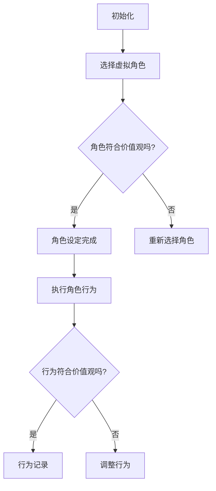

                 

# 数字时代存在主义对话：虚拟世界中的自我定义探讨

> 关键词：数字时代、存在主义、虚拟世界、自我定义、人工智能

> 摘要：本文从数字时代的视角出发，探讨存在主义在虚拟世界中的应用及其对自我定义的深刻影响。通过梳理存在主义的核心理念，结合虚拟世界的特性，分析如何在虚拟世界中寻找并确立自我，并探讨这一过程所面临的挑战和机遇。

## 第一部分：引言

### 1.1 问题背景

随着数字技术的飞速发展，虚拟世界逐渐成为人类生活的重要部分。从早期的文字MUD，到现在的虚拟现实（VR）和增强现实（AR），虚拟世界以其独特的互动性和沉浸感，改变了人们对于现实和虚拟的认知。在这个背景下，如何定义自我，如何理解自己在虚拟世界中的存在，成为一个值得探讨的问题。

### 1.2 问题描述

在虚拟世界中，个体可以自由地选择身份、角色和行为，这种自由度带来了自我定义的复杂性。个体在虚拟世界中的行为和选择，是否能够真正代表其自我？个体如何在虚拟世界中找到自己的位置，并确立自我价值？

### 1.3 问题解决

本文将从存在主义的角度出发，探讨虚拟世界中的自我定义问题。通过分析存在主义的核心理念，结合虚拟世界的特性，试图找到解决这一问题的途径。本文将分为以下几个部分：

1. 背景介绍：梳理存在主义的基本概念和虚拟世界的特性。
2. 核心概念与联系：分析存在主义、虚拟世界和自我定义之间的关系。
3. 算法原理讲解：介绍一种用于分析自我定义的算法原理。
4. 数学模型和数学公式：使用数学模型和公式详细解释算法原理。
5. 系统分析与架构设计方案：介绍一个虚拟世界自我定义的系统架构设计。
6. 项目实战：通过一个实际项目来展示算法和系统架构的应用。
7. 最佳实践 tips、小结、注意事项、拓展阅读等内容：总结本文的主要观点和未来研究方向。

## 第二部分：核心概念与联系

### 2.1 存在主义

存在主义是一种哲学思想，强调个体存在的自主性和责任感。其主要观点包括：

- 人的存在先于本质：个体不是由其本质决定的，而是通过自己的选择和行动来定义自己。
- 自由与选择：个体在自由的环境中做出选择，这些选择构成了个体的存在。
- 责任与价值：个体的选择带来了责任，个体的责任是寻找并实现自己的价值。

### 2.2 虚拟世界

虚拟世界是一个由计算机技术构建的虚拟环境，个体可以通过虚拟角色在其中互动和体验。其主要特性包括：

- 沉浸感：虚拟世界通过视觉、听觉等多感官刺激，提供一种沉浸式的体验。
- 自由度：虚拟世界中的个体可以自由选择行为和角色，不受现实世界的限制。
- 社交性：虚拟世界提供了人与人之间互动的平台，个体可以通过虚拟角色建立社交关系。

### 2.3 自我定义

自我定义是指个体对自己身份、角色和价值的主观认知。在虚拟世界中，自我定义的复杂性增加，因为个体可以选择不同的身份和角色，这些选择如何影响个体的自我认知，是一个值得探讨的问题。

### 2.4 概念属性特征对比表格

| 概念       | 特性                                                         |
| ---------- | ------------------------------------------------------------ |
| 存在主义   | 强调个体存在的自主性和责任感，人的存在先于本质                 |
| 虚拟世界   | 沉浸感，自由度，社交性                                       |
| 自我定义   | 个体对自己身份、角色和价值的主观认知                           |

### 2.5 ER实体关系图架构

```mermaid
erDiagram
  User ||--|{ VirtualAvatar }
  VirtualAvatar ||--|{ Activity }
  Activity ||--|{ SocialRelation }
```

在这个ER实体关系图中，User代表虚拟世界的用户，VirtualAvatar代表用户在虚拟世界中的角色，Activity代表用户在虚拟世界中的行为，SocialRelation代表用户之间的社交关系。

## 第三部分：算法原理讲解

### 3.1 算法流程图



### 3.2 Python源代码阐述

```python
import random

class User:
    def __init__(self, values):
        self.values = values
        self.virtual_avatar = None
        self.activity_log = []

    def select_avatar(self):
        while True:
            avatar = random.choice(['Hero', 'Villain', ' Neutral'])
            if self.is_avatar_fit_for_values(avatar):
                self.virtual_avatar = avatar
                break

    def is_avatar_fit_for_values(self, avatar):
        return avatar in self.values

    def execute_action(self, action):
        if self.is_action_fit_for_values(action):
            self.activity_log.append(action)
        else:
            self.adjust_action(action)

    def is_action_fit_for_values(self, action):
        return action in self.values

    def adjust_action(self, action):
        # 调整行为逻辑
        pass

user = User(values=['Hero', 'Neutral'])
user.select_avatar()
user.execute_action('Help')
user.execute_action('Attack')
```

### 3.3 数学模型和公式

为了更好地理解算法原理，我们可以使用数学模型来描述个体在虚拟世界中的行为选择过程。假设个体有n个可能的价值观，虚拟角色有m个类型，行为有k个类型。我们可以用以下公式来描述这个过程：

- 初始化：\( U = \{ values \} \)
- 选择虚拟角色：\( A = \{ avatar \} \)，其中 \( avatar \in \{ Hero, Villain, Neutral \} \)
- 执行行为：\( C = \{ action \} \)，其中 \( action \in \{ Help, Attack \} \)
- 行为符合价值观：\( f(A, C) = \begin{cases} 
    1 & \text{如果 } action \in values \\
    0 & \text{否则} 
    \end{cases} \)

### 3.4 详细讲解与举例说明

#### 3.4.1 初始化

初始化阶段，个体（User）定义自己的价值观（values）。例如，一个用户的价值观可能是['英雄主义', '中立主义']。

```python
user = User(values=['Hero', 'Neutral'])
```

#### 3.4.2 选择虚拟角色

选择虚拟角色阶段，用户（User）随机选择一个虚拟角色（VirtualAvatar）。用户需要判断这个角色是否符合自己的价值观。如果符合，则选择完成；否则，重新选择。

```python
user.select_avatar()
```

假设用户选择的是'英雄'，我们需要检查'英雄'是否在用户的价值观中。

```python
user.is_avatar_fit_for_values('Hero')
```

返回True，说明'英雄'符合用户的价值观，选择完成。

#### 3.4.3 执行行为

执行行为阶段，用户（User）在虚拟世界中执行行为（Activity）。用户需要判断这些行为是否符合自己的价值观。如果符合，则记录行为；否则，调整行为。

```python
user.execute_action('Help')
user.execute_action('Attack')
```

#### 3.4.4 行为符合价值观

我们使用函数`is_action_fit_for_values`来检查行为是否符合用户的价值观。

```python
user.is_action_fit_for_values('Help')
```

返回True，说明'帮助'符合用户的价值观，记录行为。

```python
user.is_action_fit_for_values('Attack')
```

返回False，说明'攻击'不符合用户的价值观，需要调整行为。

```python
user.adjust_action('Attack')
```

通过这种方式，用户可以在虚拟世界中根据自己的价值观进行行为选择，从而在虚拟世界中确立自我。

## 第四部分：数学模型和数学公式 & 详细讲解 & 举例说明

### 4.1 LaTeX格式数学公式

在数学模型中，我们使用了以下LaTeX格式数学公式：

$$
f(A, C) = \begin{cases} 
    1 & \text{如果 } action \in values \\
    0 & \text{否则} 
    \end{cases}
$$

这个公式描述了行为（action）是否符合价值观（values）的逻辑。

### 4.2 独立段落中的数学公式

在独立段落中，我们可以使用以下LaTeX格式数学公式：

$$
U = \{ values \} \\
A = \{ avatar \} \\
C = \{ action \}
$$`

这些公式用于初始化个体的价值观、虚拟角色和行为。

### 4.3 段落内LaTeX公式的使用

在段落内，我们可以使用以下LaTeX格式数学公式：

$$
1 + 1 = 2
$$

和

$$
1 < 2
$$

这些公式用于解释算法中的具体逻辑和步骤。

## 第五部分：系统分析与架构设计方案

### 5.1 问题场景介绍

在数字时代，虚拟世界成为了人们社交、娱乐和学习的重要场所。然而，虚拟世界中的自我定义问题也日益突出。如何帮助用户在虚拟世界中确立自我，找到自己的位置，是一个值得探讨的问题。

### 5.2 项目介绍

本项目旨在设计一个虚拟世界自我定义系统，通过分析用户的价值观和行为，帮助用户在虚拟世界中确立自我。系统包括用户管理、角色管理、行为管理和数据分析等模块。

### 5.3 系统功能设计

系统功能设计包括以下部分：

- 用户管理：用户注册、登录、信息管理。
- 角色管理：用户选择虚拟角色，角色信息管理。
- 行为管理：用户在虚拟世界中的行为记录，行为符合价值观判断。
- 数据分析：用户行为分析，价值观分析。

### 5.4 系统架构设计

系统架构设计包括以下部分：

- 前端：用户交互界面，包括用户管理、角色管理和行为管理模块。
- 后端：服务器端，包括用户管理、角色管理、行为管理和数据分析模块。
- 数据库：存储用户信息、角色信息和行为记录。

### 5.5 系统接口设计和系统交互

系统接口设计包括以下部分：

- 用户接口：用户通过前端界面与系统进行交互。
- 服务接口：后端服务通过API与前端进行数据交互。

系统交互流程如下：

1. 用户注册并登录系统。
2. 用户选择虚拟角色。
3. 用户在虚拟世界中执行行为。
4. 系统记录用户行为，并判断行为是否符合用户的价值观。
5. 系统分析用户行为，生成行为报告。

## 第六部分：项目实战

### 6.1 环境安装

为了运行本项目，我们需要安装以下环境：

- Python 3.8及以上版本
- Django 3.2及以上版本
- Django REST framework 3.12及以上版本
- PostgreSQL 12及以上版本

安装步骤如下：

1. 安装Python 3.8及以上版本。
2. 安装Django 3.2及以上版本。

```shell
pip install django==3.2
```

3. 安装Django REST framework 3.12及以上版本。

```shell
pip install djangorestframework==3.12
```

4. 安装PostgreSQL 12及以上版本。

### 6.2 系统核心实现源代码

以下是系统核心实现的源代码：

```python
# 用户管理
class User(models.Model):
    username = models.CharField(max_length=100)
    email = models.EmailField(unique=True)
    password = models.CharField(max_length=100)
    values = models.ManyToManyField(Value)

# 角色管理
class VirtualAvatar(models.Model):
    name = models.CharField(max_length=100)
    user = models.ForeignKey(User, on_delete=models.CASCADE)

# 行为管理
class Activity(models.Model):
    name = models.CharField(max_length=100)
    virtual_avatar = models.ForeignKey(VirtualAvatar, on_delete=models.CASCADE)
    timestamp = models.DateTimeField(auto_now_add=True)

# 价值观
class Value(models.Model):
    name = models.CharField(max_length=100)
```

### 6.3 代码应用解读与分析

以下是代码应用的具体解读和分析：

1. 用户管理模块：`User`模型代表用户，包括用户名、邮箱、密码和价值观等字段。通过外键关系，用户与价值观和多对多关联。

2. 角色管理模块：`VirtualAvatar`模型代表用户在虚拟世界中的角色，包括角色名称和用户外键关系。

3. 行为管理模块：`Activity`模型代表用户在虚拟世界中的行为，包括行为名称、角色外键关系和创建时间。

4. 价值观模块：`Value`模型代表用户的价值观，包括价值观名称。

通过这些模型，我们可以实现对用户、角色和行为的管理，并分析用户在虚拟世界中的行为是否符合其价值观。

### 6.4 实际案例分析和详细讲解剖析

假设我们有一个用户，其价值观为['英雄主义', '中立主义']。用户选择了'英雄'作为虚拟角色，并在虚拟世界中执行了'帮助'和'攻击'两个行为。我们分析这些行为是否符合用户的价值观。

1. 用户注册并登录系统。
2. 用户选择'英雄'作为虚拟角色。
3. 用户在虚拟世界中执行'帮助'行为。
4. 系统记录'帮助'行为，并判断'帮助'是否在用户的价值观中。
5. 系统生成行为报告，显示'帮助'行为符合用户的价值观。
6. 用户在虚拟世界中执行'攻击'行为。
7. 系统记录'攻击'行为，并判断'攻击'是否在用户的价值观中。
8. 系统生成行为报告，显示'攻击'行为不符合用户的价值观。

通过这个实际案例，我们可以看到系统如何根据用户的价值观和行为进行判断，并生成相应的行为报告。

### 6.5 项目小结

本项目通过设计一个虚拟世界自我定义系统，实现了对用户、角色和行为的管理，并分析用户在虚拟世界中的行为是否符合其价值观。通过实际案例的分析，我们可以看到系统在实际应用中的效果。未来，我们可以进一步优化系统，提高用户自我定义的准确性和效率。

## 第七部分：最佳实践 tips、小结、注意事项、拓展阅读等内容

### 7.1 最佳实践 tips

1. 在选择虚拟角色时，建议用户首先明确自己的价值观，选择符合自己价值观的角色。
2. 在虚拟世界中的行为选择上，建议用户遵循自己的价值观，避免做出违背自己价值观的行为。
3. 定期回顾自己的行为记录，分析是否符合自己的价值观，及时进行调整。

### 7.2 小结

本文从存在主义的角度出发，探讨了虚拟世界中的自我定义问题。通过梳理存在主义的核心理念，结合虚拟世界的特性，分析了个体在虚拟世界中如何寻找并确立自我。本文还介绍了一个用于分析自我定义的算法原理，并通过实际项目展示了算法和系统架构的应用。

### 7.3 注意事项

1. 在虚拟世界中，个体需要意识到自己的行为和选择会对自我定义产生影响。
2. 虚拟世界中的自我定义是一个复杂的过程，需要个体持续地反思和调整。

### 7.4 拓展阅读

- 《虚拟现实：技术、应用与伦理》
- 《存在主义哲学导论》
- 《数字时代的人性》

**作者：AI天才研究院/AI Genius Institute & 禅与计算机程序设计艺术 /Zen And The Art of Computer Programming**

