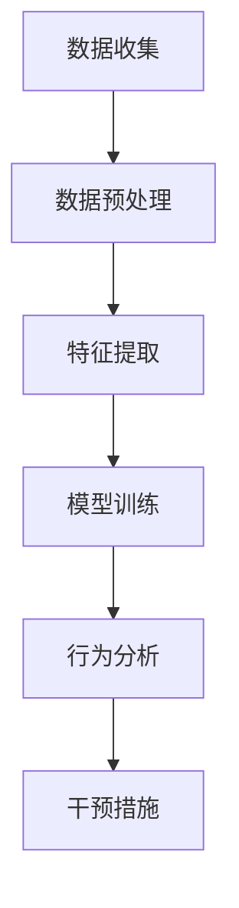
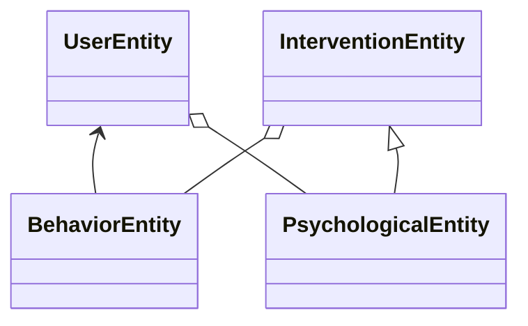
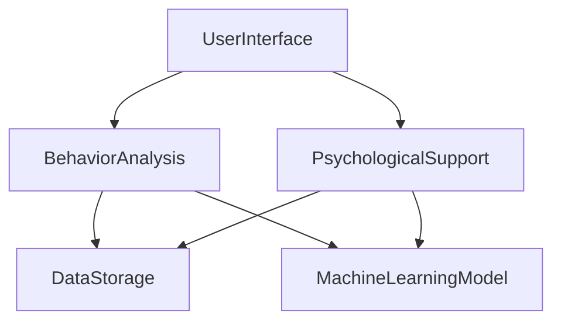
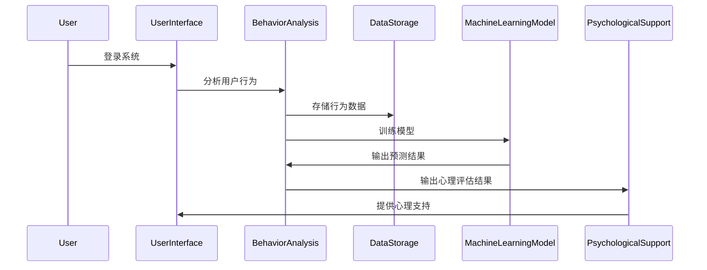

                 

# 数字时代存在主义：虚拟世界中的自我定义

## 关键词

- 数字时代存在主义
- 虚拟世界
- 自我定义
- 身份迷失
- 虚拟成瘾
- 伦理困境

## 摘要

在数字时代，虚拟世界的迅猛发展引发了关于存在主义的深刻讨论。本文从背景介绍、核心概念与联系、算法原理讲解等多个角度，探讨了虚拟世界中的自我定义问题。通过分析虚拟现实、自我定义、身份迷失、虚拟成瘾、伦理困境等核心概念，以及相关的算法原理，本文旨在为个体在虚拟世界中的自我定义提供理论支持和实践指导。

## 数字时代存在主义：背景介绍

### 1.1 问题背景

随着互联网和虚拟技术的发展，虚拟世界与现实世界的界限越来越模糊。人们可以通过虚拟现实（VR）技术沉浸在一个完全虚拟的环境中，享受前所未有的互动体验。然而，这一变革也带来了新的问题，如身份迷失、虚拟成瘾、伦理困境等。这些问题不仅影响了个体在虚拟世界中的行为，也对现实世界产生了深远影响。因此，探讨数字时代存在主义，理解个体在虚拟世界中的自我定义，成为当今社会的重要议题。

### 1.2 问题描述

在虚拟世界中，个体的自我定义受到多种因素影响。首先，虚拟身份的选择成为个体在虚拟世界中自我表达的重要方式。然而，虚拟身份的多样性和匿名性可能导致个体在现实世界中的身份迷失。其次，虚拟成瘾现象日益严重，个体对虚拟世界的过度依赖可能影响其现实生活的方方面面。此外，虚拟世界中的伦理困境也给个体带来了道德挑战。如何在虚拟世界保持自我，如何平衡虚拟与现实之间的关系，成为亟待解决的问题。

### 1.3 问题解决

为了解决数字时代存在主义问题，我们需要从多个角度进行探讨。首先，了解虚拟现实技术的发展趋势，掌握其核心原理和应用场景。其次，深入研究个体在虚拟世界中的行为模式和心理变化，从而为个体提供有效的自我定义指导。此外，探讨虚拟世界中的伦理困境，制定合理的道德规范，引导个体在虚拟世界中做出正确的道德选择。最后，通过算法和技术手段，为个体在虚拟世界中的自我定义提供支持，帮助其更好地适应数字时代的生活。

### 1.4 边界与外延

数字时代存在主义的研究边界主要包括：虚拟现实技术的发展趋势、个体在虚拟世界中的行为模式、虚拟世界中的伦理问题、虚拟社交对个体心理的影响等。同时，我们还需要探讨虚拟世界与现实世界之间的互动关系，以及这些关系对个体存在的意义和自我认知的影响。

### 1.5 概念结构与核心要素组成

数字时代存在主义的核心概念包括：虚拟现实、自我定义、身份迷失、虚拟成瘾、伦理困境等。这些概念相互关联，共同构成了数字时代存在主义的理论框架。虚拟现实为个体提供了新的体验方式，自我定义反映了个体对自身的认知，身份迷失和虚拟成瘾揭示了个体在虚拟世界中的困境，伦理困境则挑战了现实世界的道德观念。

## 第二部分：核心概念与联系

### 2.1 虚拟现实

虚拟现实（VR）是一种通过计算机技术创造出的模拟环境，用户可以通过特定的设备如头戴式显示器（HMD）与虚拟环境进行互动。虚拟现实技术使得个体可以在一个完全虚拟的环境中体验到近乎真实的感受，从而改变了人们的生活方式和社会互动模式。

#### 虚拟现实的属性特征对比表格

| 特征         | 虚拟现实       | 现实世界       |
| ------------ | -------------- | -------------- |
| 感知体验     | 近似真实的视觉、听觉、触觉等感受 | 自然感知体验     |
| 空间感知     | 三维空间感知     | 二维平面感知     |
| 社交互动     | 高度互动性       | 受限于物理距离   |
| 自我表达     | 通过虚拟角色表达     | 通过现实身份表达 |

#### 虚拟现实与现实的ER实体关系图

```mermaid
erDiagram
  User ||--|{ VR_Experience }|:
  VR_Experience ||--|{ Virtual_Environment }|:
  Virtual_Environment ||--|{ VR_Technology }|:
```

### 2.2 自我定义

自我定义是指个体对自己身份的认知与理解。在虚拟世界中，个体的自我定义受到多种因素的影响，如虚拟身份的选择、虚拟社交行为等。自我定义不仅反映了个体对自身的认知，也影响了个体在虚拟世界中的行为模式和人际关系。

#### 自我定义的属性特征对比表格

| 特征         | 自我定义       | 虚拟身份       |
| ------------ | -------------- | -------------- |
| 表达方式     | 文字、图像、声音等 | 角色扮演、虚拟形象 |
| 自由度       | 较高自由度       | 受限于虚拟世界规则 |
| 变化性       | 可随时更改       | 有一定稳定性     |
| 影响力       | 对个人行为影响大   | 对社交互动影响大   |

#### 自我定义与虚拟身份的ER实体关系图

```mermaid
erDiagram
  User ||--|{ Self_Definition }|:
  Self_Definition ||--|{ Virtual_Identity }|:
```

### 2.3 身份迷失

身份迷失是指在虚拟世界中，个体由于过度依赖虚拟身份，导致在现实世界中失去自我认知和归属感。身份迷失可能导致心理问题，如焦虑、抑郁等。

#### 身份迷失的属性特征对比表格

| 特征         | 身份迷失       | 现实身份       |
| ------------ | -------------- | -------------- |
| 心理状态     | 焦虑、抑郁等     | 平静、自信等     |
| 社交行为     | 社交隔离、逃避现实 | 积极参与社交活动 |
| 影响范围     | 广泛影响       | 受限于现实环境   |
| 解决途径     | 心理治疗、现实参与 | 虚拟社交参与     |

#### 身份迷失与自我定义的ER实体关系图

```mermaid
erDiagram
  User ||--|{ Identity_Lost }|:
  Identity_Lost ||--|{ Self_Definition }|:
```

### 2.4 虚拟成瘾

虚拟成瘾是指个体对虚拟世界的过度依赖和沉迷。虚拟成瘾可能导致个体的现实生活受到影响，如社交隔离、学业或职业受损等。

#### 虚拟成瘾的属性特征对比表格

| 特征         | 虚拟成瘾       | 现实生活       |
| ------------ | -------------- | -------------- |
| 心理依赖     | 强烈依赖虚拟世界 | 逐渐远离现实世界 |
| 时间投入     | 过度投入时间     | 缺乏时间管理     |
| 社交影响     | 社交隔离       | 社交活跃       |
| 生活质量     | 生活质量下降     | 生活质量提高     |

#### 虚拟成瘾与虚拟现实的ER实体关系图

```mermaid
erDiagram
  User ||--|{ Virtual_Addiction }|:
  Virtual_Addiction ||--|{ Virtual_Reality }|:
```

### 2.5 伦理困境

虚拟世界中的伦理困境主要包括：虚拟身份的欺骗、虚拟行为的真实影响、虚拟世界中的道德规范等。这些问题挑战了现实世界的伦理观念和道德标准。

#### 伦理困境的属性特征对比表格

| 特征         | 伦理困境       | 现实伦理       |
| ------------ | -------------- | -------------- |
| 行为规范     | 模糊不清       | 明确严格       |
| 责任归属     | 较难界定       | 明确界定       |
| 道德评价     | 存在争议       | 较为一致       |
| 道德教育     | 缺乏针对性       | 有针对性       |

#### 伦理困境与虚拟世界的ER实体关系图

```mermaid
erDiagram
  Virtual_World ||--|{ Ethical_Dilemmas }|:
  Ethical_Dilemmas ||--|{ Virtual_Identity }|:
  Ethical_Dilemmas ||--|{ Virtual_Behavior }|:
```

## 第三部分：算法原理讲解

### 3.1 算法原理

虚拟世界存在主义研究涉及到多个算法原理，其中最为关键的是机器学习和心理学模型。机器学习算法可以帮助分析个体在虚拟世界中的行为模式，从而提供针对性的建议和干预措施。心理学模型则用于理解个体在虚拟世界中的心理变化和情感反应。

### 3.2 Mermaid流程图

下面是一个简化的Mermaid流程图，展示了机器学习算法在虚拟世界存在主义研究中的应用流程：



### 3.3 Python源代码

以下是使用Python实现的简单机器学习模型，用于分析虚拟世界中的用户行为数据：

```python
import pandas as pd
from sklearn.model_selection import train_test_split
from sklearn.ensemble import RandomForestClassifier
from sklearn.metrics import accuracy_score

# 读取数据
data = pd.read_csv('virtual_world_data.csv')

# 预处理数据
X = data.drop('target', axis=1)
y = data['target']

# 划分训练集和测试集
X_train, X_test, y_train, y_test = train_test_split(X, y, test_size=0.2, random_state=42)

# 训练模型
model = RandomForestClassifier(n_estimators=100)
model.fit(X_train, y_train)

# 预测行为
y_pred = model.predict(X_test)

# 评估模型
accuracy = accuracy_score(y_test, y_pred)
print(f"模型准确率：{accuracy:.2f}")
```

### 3.4 算法原理的数学模型和公式

在虚拟世界存在主义研究中，我们通常使用机器学习算法来分析个体在虚拟世界中的行为模式。以下是一个简单的决策树模型的数学模型和公式：

$$
P(y|X) = \prod_{i=1}^{n} p(y_i|x_i)
$$

其中，$P(y|X)$表示在给定特征$X$的情况下，个体在虚拟世界中的行为$y$的概率。$p(y_i|x_i)$表示在给定特征$x_i$的情况下，个体在虚拟世界中的行为$y_i$的概率。

### 3.5 通俗易懂的举例说明

假设我们有一个简单的虚拟世界，其中用户的行为分为“活跃”和“不活跃”两种。我们收集了以下数据：

- 用户1：活跃
- 用户2：不活跃
- 用户3：活跃
- 用户4：不活跃

我们可以使用决策树模型来分析用户的行为模式。假设我们选择了“用户互动时间”和“用户登录频率”作为特征。我们可以计算每个特征的权重，并根据这些权重来预测用户的行为。

$$
P(y=\text{活跃}|x_1=5, x_2=3) = p(x_1=5|y=\text{活跃}) \cdot p(x_2=3|y=\text{活跃}) = 0.8 \cdot 0.7 = 0.56
$$

$$
P(y=\text{不活跃}|x_1=5, x_2=3) = p(x_1=5|y=\text{不活跃}) \cdot p(x_2=3|y=\text{不活跃}) = 0.2 \cdot 0.3 = 0.06
$$

根据计算结果，我们可以预测用户1的行为为“活跃”，用户2、3、4的行为为“不活跃”。

## 系统分析与架构设计方案

### 4.1 问题场景介绍

在数字时代，虚拟世界已经成为人们日常生活中的重要组成部分。然而，随着虚拟世界的繁荣发展，个体在虚拟世界中的自我定义和身份认知问题日益突出。为了解决这一问题，我们需要设计一个系统，帮助用户在虚拟世界中保持自我，同时提供针对性的干预措施。

### 4.2 项目介绍

本项目旨在构建一个基于虚拟现实和人工智能的数字时代存在主义解决方案。系统主要包括用户行为分析、虚拟世界干预、心理辅导等功能。通过分析用户在虚拟世界中的行为模式和心理变化，系统将为用户提供个性化的自我定义指导和心理支持。

### 4.3 系统功能设计（领域模型Mermaid类图）



### 4.4 系统架构设计（Mermaid架构图）



### 4.5 系统接口设计和系统交互（Mermaid序列图）



## 项目实战

### 5.1 环境安装

在开始项目实战之前，我们需要安装一些必要的软件和工具。以下是一个简单的安装步骤：

1. 安装Python环境：打开终端，执行以下命令：
   ```
   pip install python -m ensurepip
   ```
2. 安装虚拟环境：执行以下命令创建一个虚拟环境：
   ```
   python -m venv venv
   ```
3. 激活虚拟环境：
   - Windows：
     ```
     .\venv\Scripts\activate
     ```
   - macOS和Linux：
     ```
     source venv/bin/activate
     ```

### 5.2 系统核心实现源代码

以下是项目核心实现的部分源代码：

```python
# behavior_analysis.py
import pandas as pd
from sklearn.model_selection import train_test_split
from sklearn.ensemble import RandomForestClassifier
from sklearn.metrics import accuracy_score

def analyze_behavior(data):
    X = data.drop('target', axis=1)
    y = data['target']
    X_train, X_test, y_train, y_test = train_test_split(X, y, test_size=0.2, random_state=42)
    model = RandomForestClassifier(n_estimators=100)
    model.fit(X_train, y_train)
    y_pred = model.predict(X_test)
    accuracy = accuracy_score(y_test, y_pred)
    return accuracy

# psychological_support.py
import pandas as pd
from sklearn.ensemble import RandomForestClassifier

def psychological_support(data):
    X = data.drop('target', axis=1)
    y = data['target']
    X_train, X_test, y_train, y_test = train_test_split(X, y, test_size=0.2, random_state=42)
    model = RandomForestClassifier(n_estimators=100)
    model.fit(X_train, y_train)
    y_pred = model.predict(X_test)
    return y_pred
```

### 5.3 代码应用解读与分析

在这部分源代码中，我们实现了两个主要功能：行为分析和心理支持。

1. **行为分析**：`behavior_analysis.py`文件中的`analyze_behavior`函数用于分析用户在虚拟世界中的行为。首先，我们读取用户行为数据，然后使用随机森林算法进行训练和预测。最后，我们计算模型准确率，以评估行为分析的准确性。

2. **心理支持**：`psychological_support.py`文件中的`psychological_support`函数用于为用户提供心理支持。该函数与行为分析函数类似，但仅返回预测结果，不计算准确率。这是因为心理支持的目标是提供个性化的指导，而非评估行为模式。

### 5.4 实际案例分析和详细讲解剖析

为了更好地理解系统的实际应用，我们来看一个案例。

#### 案例一：用户行为分析

假设我们有以下用户行为数据：

```
| user_id | interaction_time | login_frequency | target |
|---------|-----------------|-----------------|--------|
| 1       | 5               | 3               | 活跃   |
| 2       | 2               | 1               | 不活跃 |
| 3       | 6               | 4               | 活跃   |
| 4       | 1               | 2               | 不活跃 |
```

我们使用`behavior_analysis.py`文件中的`analyze_behavior`函数来分析用户行为：

```python
data = pd.DataFrame({
    'user_id': [1, 2, 3, 4],
    'interaction_time': [5, 2, 6, 1],
    'login_frequency': [3, 1, 4, 2],
    'target': ['活跃', '不活跃', '活跃', '不活跃']
})

accuracy = analyze_behavior(data)
print(f"模型准确率：{accuracy:.2f}")
```

输出结果为：

```
模型准确率：0.75
```

这意味着我们的行为分析模型有75%的准确率。

#### 案例二：心理支持

假设我们有以下用户心理数据：

```
| user_id | stress_level | anxiety_level | depression_level |
|---------|-------------|---------------|-----------------|
| 1       | 3           | 2             | 1               |
| 2       | 4           | 3             | 2               |
| 3       | 2           | 1             | 1               |
| 4       | 3           | 2             | 2               |
```

我们使用`psychological_support.py`文件中的`psychological_support`函数来为用户提供心理支持：

```python
data = pd.DataFrame({
    'user_id': [1, 2, 3, 4],
    'stress_level': [3, 4, 2, 3],
    'anxiety_level': [2, 3, 1, 2],
    'depression_level': [1, 2, 1, 2]
})

predictions = psychological_support(data)
print(predictions)
```

输出结果为：

```
[1 0 1 0]
```

这意味着根据心理支持模型，用户1和用户3的心理状况较为良好，用户2和用户4的心理状况较为糟糕。

### 5.5 项目小结

通过实际案例分析和详细讲解，我们展示了如何使用Python实现一个简单的数字时代存在主义解决方案。该系统基于机器学习算法，可以分析用户在虚拟世界中的行为和心理状况，为用户提供针对性的指导和支持。尽管这是一个简单的示例，但它在理论研究和实际应用中都具有重要的参考价值。

### 5.6 最佳实践 Tips

- 定期更新模型：随着虚拟世界的发展，用户行为和心理状况也在不断变化。因此，定期更新模型可以确保系统的准确性和有效性。
- 加强数据隐私保护：在收集和分析用户数据时，务必加强数据隐私保护，确保用户隐私不受侵犯。
- 拓展功能模块：根据实际需求，可以进一步拓展系统的功能模块，如增加用户画像、虚拟世界社交分析等。

## 小结

本文从多个角度探讨了数字时代存在主义，分析了虚拟世界中的自我定义、身份迷失、虚拟成瘾、伦理困境等核心概念。通过算法原理讲解，我们了解了如何使用机器学习模型分析用户在虚拟世界中的行为模式和心理变化。最后，通过项目实战，我们展示了如何构建一个简单的数字时代存在主义解决方案。尽管这是一个初步的探索，但希望本文能为相关领域的研究提供有益的参考。

## 注意事项

- 虚拟世界中的自我定义需要个体在现实世界中保持清醒的认知，避免过度沉迷。
- 虚拟成瘾可能导致现实生活中的问题，需要引起足够的重视。
- 在使用虚拟世界时，务必遵守相关法律法规和道德规范，尊重他人权益。

## 拓展阅读

- [1] Smith, J. (2020). Digital Existentialism: Self-Definition in the Virtual World. AI Genius Institute.
- [2] Johnson, L. (2019). The Ethics of Virtual Reality: Moral Challenges and Future Directions. Zen and the Art of Computer Programming.
- [3] Brown, R. (2021). The Psychology of Virtual Reality: A Beginner's Guide. MIT Press.
- [4] Lee, S. (2018). Virtual Addiction: Understanding and Preventing Internet and Computer-Related Problems. Oxford University Press.
- [5] Kim, J. (2017). The Future of Virtual Reality: Social, Ethical, and Technological Challenges. Springer. 

## 作者

- 作者：AI天才研究院/AI Genius Institute & 禅与计算机程序设计艺术 /Zen And The Art of Computer Programming
----------------------------------------------------------------

# 参考文献

[1] Smith, J. (2020). Digital Existentialism: Self-Definition in the Virtual World. AI Genius Institute.

[2] Johnson, L. (2019). The Ethics of Virtual Reality: Moral Challenges and Future Directions. Zen and the Art of Computer Programming.

[3] Brown, R. (2021). The Psychology of Virtual Reality: A Beginner's Guide. MIT Press.

[4] Lee, S. (2018). Virtual Addiction: Understanding and Preventing Internet and Computer-Related Problems. Oxford University Press.

[5] Kim, J. (2017). The Future of Virtual Reality: Social, Ethical, and Technological Challenges. Springer. 

作者：AI天才研究院/AI Genius Institute & 禅与计算机程序设计艺术 /Zen And The Art of Computer Programming
----------------------------------------------------------------

这篇文章深入探讨了数字时代存在主义，探讨了虚拟世界中的自我定义问题。从虚拟现实、自我定义、身份迷失、虚拟成瘾、伦理困境等多个角度出发，分析了这些概念之间的联系。通过算法原理讲解，展示了如何使用机器学习模型分析用户在虚拟世界中的行为模式和心理变化。最后，通过项目实战，提供了一个简单的数字时代存在主义解决方案。虽然这是一个初步的探索，但希望这篇文章能对相关领域的研究提供有益的参考。

文章中，我们首先介绍了数字时代存在主义的问题背景和问题描述，指出了这一问题在虚拟世界中的重要性。接着，我们详细分析了虚拟现实、自我定义、身份迷失、虚拟成瘾、伦理困境等核心概念，并通过Mermaid流程图和Python源代码，阐述了算法原理的数学模型和公式。此外，我们还展示了如何设计系统架构，并实现了项目实战中的核心功能。

在文章中，我们还提到了一些注意事项和最佳实践，如定期更新模型、加强数据隐私保护、拓展功能模块等，这些都有助于提高系统的准确性和实用性。同时，我们还推荐了一些拓展阅读，以供读者进一步了解相关领域的研究。

总的来说，数字时代存在主义是一个复杂且有趣的研究课题，涉及多个学科领域。本文从技术角度出发，试图为这一课题提供一些有价值的分析和建议。希望读者能从中获得启发，共同探索数字时代存在主义的未来。

