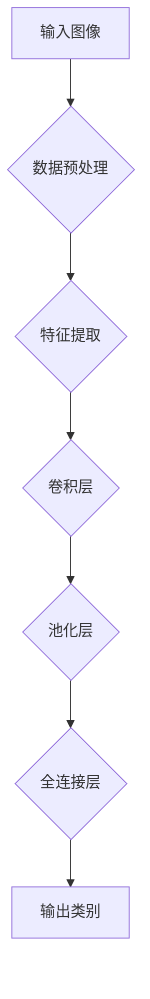
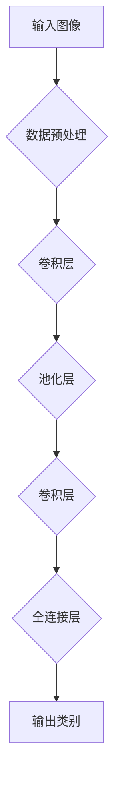
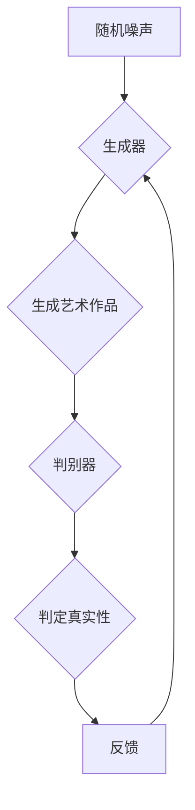
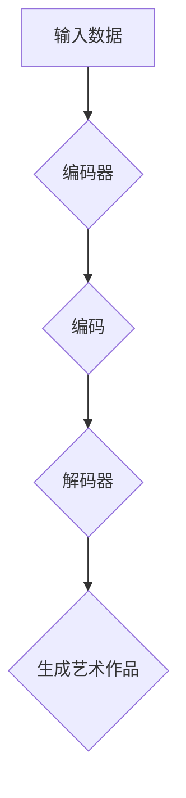
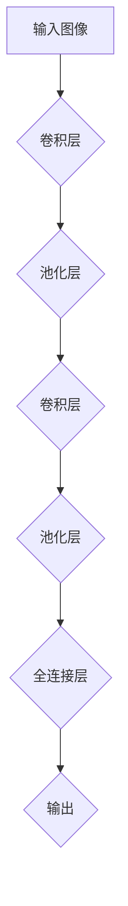
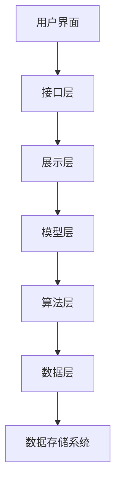
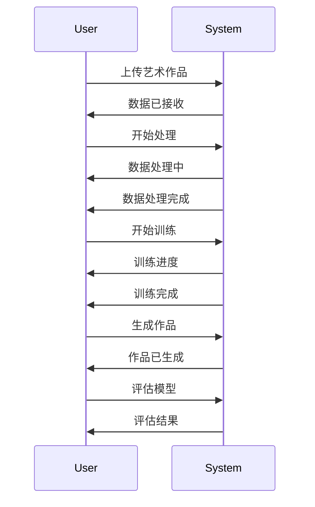

                 


### 引言

#### 1.1 书籍主题背景

随着人工智能技术的飞速发展，机器学习在各个领域中的应用越来越广泛，其中视觉艺术创作成为了一个备受关注的新兴领域。数字时代背景下，人工智能与艺术的融合不仅拓展了艺术创作的边界，也为艺术作品的创新提供了无限可能性。本书旨在探讨数字时代AI艺术创作中机器学习技术的应用，分析其在视觉艺术创作中的优势与挑战，为相关领域的学者和实践者提供理论支持和实践指导。

#### 1.2 目的与目标读者

本书的主要目的是通过系统地介绍机器学习在视觉艺术创作中的应用，帮助读者了解这一新兴领域的理论基础、技术原理和实践方法。目标读者主要包括对人工智能、机器学习和艺术创作感兴趣的科研人员、工程师、设计师以及相关专业的大学生和研究生。

#### 1.3 内容结构与章节安排

本书分为七个主要章节，内容结构如下：

- **第一章 引言**：介绍书籍主题背景、目的与目标读者，以及内容结构与章节安排。
- **第二章 数字时代AI艺术创作概述**：探讨AI与艺术创作的融合、机器学习在视觉艺术中的应用及其优势和挑战。
- **第三章 机器学习在艺术创作中的核心概念**：深入讲解机器学习的基础理论、深度学习与自然语言处理在艺术创作中的应用。
- **第四章 实践应用与案例分析**：介绍具体的机器学习艺术创作项目，包括AI绘画生成、AI音乐创作和AI数字艺术装置等。
- **第五章 技术实现与算法解析**：详细阐述数据准备与处理、算法原理与流程图以及代码实现与解释。
- **第六章 机器学习艺术创作系统架构设计**：分析系统功能设计、系统架构设计、系统接口设计与交互。
- **第七章 总结与展望**：总结全书内容，探讨未来发展趋势和对艺术创作的影响，并提出小结与建议。

通过这一章节的概述，读者可以初步了解本书的核心内容和结构安排，为后续的深入阅读做好铺垫。

### 数字时代AI艺术创作概述

#### 2.1 AI与艺术创作的融合

人工智能（AI）作为现代科技的前沿领域，其技术在视觉艺术创作中的应用已经成为一个热门话题。AI与艺术创作的融合不仅改变了传统的创作方式，也为艺术作品的创新提供了新的可能性。AI技术的引入，使得艺术家们能够借助算法和模型，实现自动化、智能化的创作过程，从而拓展了艺术创作的边界。

首先，AI在艺术创作中的角色主要体现在以下几个方面：

1. **辅助创作**：AI能够辅助艺术家完成一些繁琐、重复性的工作，如色彩调整、图像处理等。通过自动化工具，艺术家可以将更多的时间和精力投入到创意思维和艺术表现上。
2. **创新表达**：AI能够通过学习大量数据，生成独特的视觉元素和风格，为艺术创作带来新的灵感。艺术家可以利用这些创新元素，创作出前所未有的艺术作品。
3. **交互体验**：AI技术可以实现艺术作品的动态交互，如根据观众的行为和反应，实时调整艺术表现形式。这种互动性为观众带来了全新的观赏体验。

其次，当前AI艺术创作的现状与趋势可以从以下几个方面进行概述：

1. **技术发展**：随着深度学习、生成对抗网络（GAN）等先进技术的应用，AI在艺术创作中的表现越来越出色。越来越多的艺术家和设计师开始使用这些技术进行创作，推动着AI艺术创作的快速发展。
2. **作品多样性**：AI艺术创作涵盖了绘画、雕塑、音乐、视频等多种艺术形式。不同类型的作品在风格、表现手法和视觉效果上都有所不同，展示了AI在艺术创作中的广泛应用潜力。
3. **社会影响**：AI艺术创作不仅改变了艺术创作的模式，也对艺术市场、艺术教育等领域产生了深远影响。一方面，AI艺术作品逐渐受到市场的认可和追捧；另一方面，艺术教育也开始引入AI技术，培养适应数字化时代需求的新型艺术人才。

#### 2.2 机器学习在视觉艺术中的应用

机器学习作为AI的核心技术之一，在视觉艺术创作中发挥着重要作用。机器学习在视觉艺术中的应用主要体现在以下几个方面：

1. **图像生成与风格迁移**：通过生成对抗网络（GAN）和变分自编码器（VAE）等技术，机器学习能够生成高质量的图像和视频。这些技术不仅能够模仿各种艺术风格，还能创造出全新的视觉作品。
2. **图像识别与分类**：机器学习技术能够对图像进行识别和分类，为艺术作品的创作和鉴赏提供辅助。例如，通过图像识别技术，艺术家可以快速找到与创作灵感相关的图像资源。
3. **图像处理与增强**：机器学习技术可以对图像进行色彩调整、去噪、超分辨率等处理，提升图像的质量和视觉效果。这些技术为艺术创作提供了更多的可能性。

#### 2.3 机器学习在艺术创作中的优势与挑战

机器学习在艺术创作中具有显著的优势，但也面临着一定的挑战：

1. **优势分析**：
   - **创新性**：机器学习能够生成独特、新颖的艺术作品，为艺术家提供了无限的创意空间。
   - **效率提升**：机器学习技术可以自动化处理大量图像数据，提高艺术创作的效率。
   - **辅助创作**：机器学习可以为艺术家提供辅助工具，如自动色彩调整、图像处理等，减轻他们的工作负担。

2. **挑战与对策**：
   - **技术门槛**：机器学习技术相对复杂，对艺术家的技术背景有较高要求。对策是提供易于上手的工具和教程，降低技术门槛。
   - **艺术价值**：机器学习创作的艺术作品是否具有艺术价值是一个争议的话题。对策是艺术家与技术人员合作，共同探讨AI在艺术创作中的应用和价值。
   - **隐私保护**：机器学习在艺术创作中可能涉及个人隐私和数据安全问题。对策是加强数据安全和隐私保护措施，确保用户数据的合法使用。

综上所述，数字时代AI艺术创作中机器学习技术的应用具有重要意义。通过不断探索和突破，我们可以期待在未来看到更多令人惊叹的AI艺术作品。

### 机器学习在艺术创作中的核心概念

#### 3.1 基础理论与算法

机器学习作为人工智能的核心技术，其基础理论与算法是艺术创作中不可或缺的一部分。首先，让我们简要介绍一些常见的机器学习基础理论。

1. **监督学习（Supervised Learning）**：
   监督学习是一种通过已有标签数据训练模型，使其能够对新数据进行预测的方法。常见的监督学习算法包括线性回归（Linear Regression）、逻辑回归（Logistic Regression）、支持向量机（SVM）等。这些算法在艺术创作中的应用非常广泛，例如，在图像识别和分类任务中，监督学习算法可以帮助识别不同类型的图像，从而为艺术家的创作提供参考。

2. **无监督学习（Unsupervised Learning）**：
   无监督学习不需要标签数据，主要通过数据自身的结构来训练模型。常见的无监督学习算法包括聚类（Clustering）和降维（Dimensionality Reduction）。在艺术创作中，无监督学习算法可以用于数据挖掘和风格分析，帮助艺术家发现数据中的隐藏模式和新颖风格。

3. **强化学习（Reinforcement Learning）**：
   强化学习通过与环境的交互来学习策略，使系统在特定环境中获得最优回报。常见的强化学习算法包括Q学习（Q-Learning）和深度确定性策略梯度（DDPG）等。在艺术创作中，强化学习可以用于自动生成艺术作品，如通过不断尝试和反馈，生成符合特定风格的作品。

接下来，我们来讨论一些常见的机器学习算法及其在艺术创作中的应用：

1. **生成对抗网络（GAN）**：
   生成对抗网络由生成器和判别器组成，通过对抗训练生成高质量的图像。GAN在艺术创作中的应用非常广泛，如生成抽象画、模仿艺术家风格等。通过GAN，艺术家可以快速生成大量创意作品，节省时间和精力。

2. **变分自编码器（VAE）**：
   变分自编码器是一种生成模型，通过学习数据的概率分布来生成新的数据。VAE在艺术创作中的应用包括图像超分辨率、图像去噪等。艺术家可以利用VAE技术提高图像质量，从而丰富创作素材。

3. **卷积神经网络（CNN）**：
   卷积神经网络是一种深度学习模型，特别适合处理图像数据。CNN在艺术创作中的应用包括图像识别、图像生成、图像风格迁移等。艺术家可以利用CNN技术实现自动化图像处理，提升创作效率。

下面是一个简单的CNN算法的ER实体关系图，用于描述其在图像分类任务中的应用：



#### 3.2 深度学习与艺术创作

深度学习是机器学习的一个重要分支，它在艺术创作中发挥着越来越重要的作用。深度学习的核心思想是通过构建多层神经网络，逐层提取图像的特征，从而实现对图像的自动理解和生成。

1. **深度学习原理**：
   深度学习模型通常由多个隐藏层组成，每个隐藏层负责提取不同层次的特征。通过反向传播算法，模型可以从训练数据中学习到有效的特征表示。深度学习模型在图像识别、图像生成和图像风格迁移等领域取得了显著的成果。

2. **深度学习在艺术创作中的应用**：
   - **图像生成**：深度学习模型可以生成全新的图像，如GAN和VAE等技术已经在艺术创作中广泛应用。艺术家可以利用这些技术生成抽象画、模仿艺术家风格等。
   - **图像风格迁移**：深度学习模型可以将一种艺术风格应用到另一张图像上，如深度卷积生成网络（DCGAN）和风格迁移模型（Style Transfer）等。艺术家可以通过这些技术创作出风格独特的艺术作品。
   - **图像分类与识别**：深度学习模型可以用于图像分类和识别，如使用卷积神经网络（CNN）对图像进行分类，艺术家可以利用这一技术进行艺术作品的鉴定和推荐。

下面是一个简单的深度学习模型（如CNN）的流程图，用于描述其在图像识别任务中的应用：



通过以上介绍，我们可以看到深度学习在艺术创作中具有广泛的应用前景。未来，随着深度学习技术的不断发展和创新，我们可以期待看到更多令人惊叹的AI艺术作品。

### 自然语言处理与艺术表现

#### 3.3 自然语言处理概述

自然语言处理（Natural Language Processing，NLP）是人工智能领域的一个重要分支，它主要研究如何使计算机理解和处理人类语言。NLP技术包括文本分析、语言理解、文本生成等多个方面，这些技术在艺术创作中的应用日益广泛。

1. **文本分析**：
   文本分析是NLP的基础，包括分词、词性标注、句法分析等。通过文本分析，计算机可以理解文本中的词汇和句子结构，为艺术创作提供语言素材。

2. **语言理解**：
   语言理解是指计算机能够理解自然语言中的语义、情感和语境。在艺术创作中，语言理解技术可以帮助艺术家分析文本的情感和风格，从而创作出更具有表现力的艺术作品。

3. **文本生成**：
   文本生成技术可以生成新的文本内容，如自动写作、机器翻译等。在艺术创作中，文本生成技术可以用于生成诗歌、故事、歌词等，为艺术家提供创作灵感。

#### 3.3.2 文字艺术与机器语言

文字艺术是艺术创作的一种重要形式，它通过文字表达情感、思想和审美。随着机器语言的发展，计算机开始参与文字艺术的创作，产生了“机器写作”这一新兴领域。

1. **机器写作**：
   机器写作是指利用计算机程序生成文字内容。常见的机器写作技术包括文本生成模型（如GPT-3）、自然语言生成（NLG）等。机器写作在艺术创作中的应用包括生成诗歌、故事、剧本等。

2. **计算机编程语言**：
   计算机编程语言是人与计算机之间交流的桥梁。通过编程语言，艺术家可以编写代码来控制计算机生成艺术作品。常见的编程语言包括Python、C++、JavaScript等。

3. **艺术编程**：
   艺术编程是指利用编程语言和算法创作艺术作品。艺术编程融合了艺术创作和技术实现，通过代码表达艺术家的创意和思想。艺术编程的形式多样，包括动态视觉艺术、交互艺术、虚拟现实等。

下面是一个简单的艺术编程示例，使用Python编写一个生成随机诗歌的程序：

```python
import random

# 定义诗歌的词汇库
nouns = ["风", "雨", "星辰", "大海"]
verbs = ["呼唤", "跳跃", "追逐", "穿越"]
adjectives = ["悠扬的", "绚烂的", "寂静的", "广袤的"]

# 生成随机诗歌
def generate_poem():
    poem = []
    for _ in range(4):
        noun = random.choice(nouns)
        verb = random.choice(verbs)
        adjective = random.choice(adjectives)
        poem.append(f"{adjective} {noun} {verb}。")
    return "\n".join(poem)

print(generate_poem())
```

运行上述程序，我们可以得到一首随机生成的诗歌：

```
寂静的大海呼唤着
悠扬的风跳跃着
绚烂的星辰追逐着
广袤的大海穿越着。
```

通过以上介绍，我们可以看到自然语言处理技术在艺术创作中的应用前景。未来，随着NLP技术的不断发展和创新，我们可以期待看到更多基于机器语言的创意艺术作品。

### 实践应用与案例分析

#### 4.1 机器学习艺术项目介绍

在探讨机器学习在视觉艺术创作中的应用时，以下几个具体的项目和案例提供了宝贵的实践经验。

#### 4.1.1 项目概述

1. **AI绘画生成**：
   AI绘画生成项目利用生成对抗网络（GAN）技术，生成具有独特风格和内容的艺术作品。通过训练大量艺术家作品的数据集，生成器学习到艺术家的绘画风格，并能够根据输入的文本描述或图像生成相应的绘画作品。

2. **AI音乐创作**：
   AI音乐创作项目利用深度学习和自然语言处理技术，生成旋律和节奏丰富的音乐作品。该项目通常通过训练大量音乐数据集，使模型能够理解音乐的结构和风格，并根据输入的文本描述生成新的音乐作品。

3. **AI数字艺术装置**：
   AI数字艺术装置项目利用计算机视觉和增强现实（AR）技术，创建交互式数字艺术作品。这些装置通常结合了物理和数字元素，通过观众的互动来改变艺术作品的表现形式，提供沉浸式的体验。

#### 4.1.2 项目实施过程

以下是这些项目的实施过程概览：

1. **AI绘画生成**：
   - **数据准备**：收集并整理大量艺术家的绘画作品，作为训练数据集。
   - **模型训练**：利用GAN技术训练模型，使生成器学习艺术家的绘画风格。
   - **测试与优化**：通过生成图像的质量和风格来评估模型，并进行优化。

2. **AI音乐创作**：
   - **数据准备**：收集和整理大量音乐数据，包括旋律、节奏和和弦等。
   - **模型训练**：利用深度学习技术训练模型，使其能够生成新的音乐片段。
   - **测试与优化**：通过音乐的质量和流畅性来评估模型，并进行优化。

3. **AI数字艺术装置**：
   - **需求分析**：确定艺术装置的主题、交互方式和展示形式。
   - **技术选型**：选择合适的计算机视觉和增强现实技术。
   - **开发与测试**：实现交互功能，并进行测试和优化，确保装置的稳定性和用户体验。

#### 4.2 案例分析

以下是具体案例分析：

1. **案例一：AI绘画生成**
   - **应用场景**：用于个性化艺术创作，如根据用户输入的文本描述生成独特的艺术作品。
   - **技术细节**：使用生成对抗网络（GAN）进行训练，生成器根据输入的文本描述生成绘画作品。
   - **实际效果**：生成的绘画作品风格多样，能够满足不同用户的需求。

2. **案例二：AI音乐创作**
   - **应用场景**：用于音乐创作和制作，如为电影、电视剧等配乐。
   - **技术细节**：利用深度学习和自然语言处理技术，根据文本描述生成旋律和节奏。
   - **实际效果**：生成的音乐作品流畅、具有创意，能够满足专业音乐制作需求。

3. **案例三：AI数字艺术装置**
   - **应用场景**：用于公共艺术展示，如博物馆、展览馆等。
   - **技术细节**：结合计算机视觉和增强现实技术，实现交互式艺术体验。
   - **实际效果**：艺术装置吸引了大量观众，提供了独特的视觉和互动体验。

通过这些实践应用和案例分析，我们可以看到机器学习技术在艺术创作中的多样性和潜力。未来，随着技术的进一步发展，我们可以期待看到更多创新的艺术形式和作品。

### 技术实现与算法解析

在讨论机器学习在艺术创作中的应用时，深入解析技术实现和算法流程是至关重要的。以下将详细描述数据准备与处理、算法原理及流程图、代码实现与解释等关键环节。

#### 5.1 数据准备与处理

数据准备是机器学习项目中的关键步骤，尤其是对于视觉艺术创作任务。以下是数据准备和处理的主要步骤：

1. **数据收集**：
   收集大量艺术作品，包括绘画、摄影、雕塑等，确保数据集的多样性和质量。此外，还需收集相应的标注信息，如风格、主题、艺术家等。

2. **数据清洗**：
   清除数据集中的噪声和异常值，如损坏的图像、重复的数据等。使用图像修复技术对损坏的图像进行修复，确保数据集的完整性。

3. **数据增强**：
   通过数据增强技术增加数据集的多样性，例如，对图像进行旋转、缩放、裁剪等操作，生成更多的训练样本。数据增强有助于提升模型的泛化能力。

4. **数据分割**：
   将数据集划分为训练集、验证集和测试集，确保每个数据集具有代表性。通常，训练集用于模型训练，验证集用于模型调优，测试集用于模型评估。

#### 5.2 算法原理与流程图

以下是几种在艺术创作中常用的机器学习算法及其原理的流程图：

1. **生成对抗网络（GAN）**：
   GAN由生成器（Generator）和判别器（Discriminator）组成，通过对抗训练生成高质量的艺术作品。



2. **变分自编码器（VAE）**：
   VAE通过学习数据的概率分布，生成高质量的艺术作品。



3. **卷积神经网络（CNN）**：
   CNN通过多层卷积和池化操作，提取图像的特征，用于图像分类和风格迁移。



#### 5.3 代码实现与解释

以下是一个使用Python实现简单GAN模型的示例代码，用于生成艺术作品：

```python
import tensorflow as tf
from tensorflow.keras.layers import Dense, Flatten, Conv2D, Conv2DTranspose, Reshape

# 定义生成器模型
def build_generator(z_dim):
    model = tf.keras.Sequential([
        Dense(7 * 7 * 256, activation="relu", input_shape=(z_dim,)),
        Reshape((7, 7, 256)),
        Conv2DTranspose(128, (5, 5), strides=(1, 1), padding='same', activation='relu'),
        Conv2DTranspose(64, (5, 5), strides=(2, 2), padding='same', activation='relu'),
        Conv2DTranspose(1, (5, 5), strides=(2, 2), padding='same', activation='tanh')
    ])
    return model

# 定义判别器模型
def build_discriminator(img_shape):
    model = tf.keras.Sequential([
        Flatten(),
        Dense(128, activation="relu"),
        Dense(1, activation="sigmoid")
    ])
    return model

# 定义GAN模型
def build_gan(generator, discriminator):
    model = tf.keras.Sequential([
        generator,
        discriminator
    ])
    return model

# 设置超参数
z_dim = 100
img_shape = (28, 28, 1)

# 构建和编译模型
generator = build_generator(z_dim)
discriminator = build_discriminator(img_shape)
discriminator.compile(loss="binary_crossentropy", optimizer=tf.keras.optimizers.Adam(0.0001))
gan_model = build_gan(generator, discriminator)

# 训练模型
# ...

# 生成艺术作品
# ...
```

通过以上代码，我们可以看到GAN模型的基本结构，包括生成器和判别器的构建，以及GAN模型的整体框架。在训练过程中，生成器尝试生成逼真的艺术作品，而判别器则试图区分生成的艺术作品和真实艺术作品。通过这种对抗训练，生成器不断优化，最终生成高质量的艺术作品。

通过详细的技术实现和算法解析，我们可以更好地理解机器学习在艺术创作中的应用，为实际项目开发提供指导。未来，随着技术的进一步发展，我们可以期待看到更多创新的艺术形式和作品。

### 机器学习艺术创作系统架构设计

#### 6.1 系统功能设计

机器学习艺术创作系统的功能设计旨在实现从数据输入、处理到艺术作品生成的完整流程。以下是系统功能设计的详细分析：

1. **数据输入**：
   系统需要支持多种数据格式的输入，如图像、音频、视频和文本。用户可以通过上传文件或从数据库中检索数据，确保系统的灵活性和多样性。

2. **数据处理**：
   数据处理功能包括数据清洗、增强和分割。系统需要对输入的数据进行预处理，如去除噪声、增强数据集的多样性，并将数据划分为训练集、验证集和测试集。

3. **模型训练与优化**：
   系统需要提供机器学习模型的训练和优化功能。用户可以选择不同的模型架构和训练参数，如GAN、VAE或CNN等，以适应不同的艺术创作需求。

4. **艺术作品生成**：
   根据训练好的模型，系统应能够生成高质量的艺术作品。用户可以设定生成作品的风格、主题和参数，以获得个性化的创作成果。

5. **艺术作品展示**：
   系统应提供一个用户友好的界面，用于展示生成的艺术作品。用户可以浏览、下载和分享作品，提升系统的互动性和用户体验。

6. **模型评估与反馈**：
   系统需要提供模型评估和反馈功能，帮助用户了解模型的性能和效果。用户可以根据评估结果调整模型参数，优化艺术作品的生成质量。

#### 6.2 系统架构设计

系统架构设计是确保机器学习艺术创作系统高效、稳定运行的关键。以下是系统架构的详细设计：

1. **数据层**：
   数据层负责数据的存储和管理。系统可以使用关系数据库或分布式文件系统，如MySQL或Hadoop HDFS，以确保数据的持久化和高可用性。

2. **模型层**：
   模型层包括机器学习模型的训练和优化功能。用户可以在模型层选择不同的模型架构和训练算法，如TensorFlow或PyTorch等。模型层还应提供自动调整参数和超参数的功能，以优化模型性能。

3. **算法层**：
   算法层是实现艺术作品生成核心算法的地方。系统应支持多种机器学习算法，如GAN、VAE、CNN等，以适应不同的艺术创作需求。算法层还需要实现数据预处理和后处理功能，确保生成的艺术作品符合用户预期。

4. **展示层**：
   展示层负责将生成的艺术作品呈现给用户。系统可以使用Web界面或移动应用，为用户提供方便的浏览、下载和分享功能。展示层还应支持实时交互，如用户可以通过输入文本描述来生成特定风格的艺术作品。

5. **接口层**：
   接口层负责系统与外部系统的集成，如数据存储系统、第三方API等。系统应提供RESTful API，以便其他应用程序可以方便地集成和使用机器学习艺术创作功能。

以下是系统架构的Mermaid流程图：



通过以上架构设计，机器学习艺术创作系统可以实现高效、稳定和灵活的艺术作品生成，满足不同用户的需求。

#### 6.3 系统接口设计与交互

系统接口设计是确保机器学习艺术创作系统能够与其他系统或组件高效交互的关键。以下是系统接口设计的详细分析：

1. **API设计**：
   系统应提供一个统一的RESTful API，支持各种数据输入和艺术作品生成操作。API应包括以下主要接口：
   - `POST /upload`：用于上传艺术作品数据。
   - `POST /process`：用于处理上传的艺术作品数据，包括清洗、增强和分割等。
   - `POST /train`：用于训练机器学习模型，并提供训练进度和结果。
   - `POST /generate`：用于生成新的艺术作品，根据用户设定的风格和参数。
   - `GET /evaluate`：用于评估模型的性能和效果。

2. **数据交互**：
   系统需要定义数据交互的格式和协议，如JSON或XML。数据交互格式应包含必要的信息，如数据集的元数据、模型参数、生成作品的结果等。

3. **安全性**：
   系统应确保数据传输的安全性，使用HTTPS协议进行加密传输。此外，系统应实现用户身份验证和权限管理，防止未经授权的访问和操作。

以下是系统接口的Mermaid序列图，展示了用户与系统之间的交互流程：



通过以上接口设计和交互分析，机器学习艺术创作系统可以与其他系统或组件高效集成，为用户提供便捷的艺术创作体验。

### 总结与展望

#### 7.1 成果总结

本书系统地探讨了数字时代AI艺术创作中机器学习技术的应用，从概述到核心概念，再到实践应用和系统架构设计，全面解析了机器学习在视觉艺术创作中的重要作用。以下是本书的主要成果总结：

1. **数字时代AI艺术创作概述**：
   阐述了AI与艺术创作的融合现状、机器学习在视觉艺术中的应用及其优势与挑战。

2. **机器学习在艺术创作中的核心概念**：
   介绍了监督学习、无监督学习和强化学习等基础理论，以及GAN、VAE和CNN等常见算法。

3. **自然语言处理与艺术表现**：
   探讨了NLP技术在艺术创作中的应用，以及机器写作和艺术编程的实践案例。

4. **实践应用与案例分析**：
   通过具体的项目和案例，展示了机器学习艺术创作在实际中的应用和效果。

5. **技术实现与算法解析**：
   详细介绍了数据准备与处理、算法原理与流程图、代码实现与解释等关键技术。

6. **机器学习艺术创作系统架构设计**：
   分析了系统功能设计、系统架构设计、系统接口设计与交互等关键环节。

#### 7.2 未来发展趋势

展望未来，机器学习在艺术创作中的应用前景广阔，以下是一些可能的发展趋势：

1. **技术创新**：
   随着深度学习、生成对抗网络（GAN）和变分自编码器（VAE）等技术的不断发展，机器学习在艺术创作中的应用将更加深入和多样化。

2. **艺术与科技的融合**：
   艺术与科技的融合将继续推进，AI艺术创作将融入更多新兴技术，如增强现实（AR）和虚拟现实（VR），为观众带来更加沉浸式的体验。

3. **个性化创作**：
   机器学习将帮助艺术家实现更加个性化的创作，通过大数据和个性化推荐技术，为艺术家和观众提供定制化的艺术作品。

4. **艺术市场变革**：
   AI艺术创作将对艺术市场产生深远影响，推动艺术市场的数字化转型，提高艺术作品的创作和流通效率。

5. **艺术教育改革**：
   AI技术将改变艺术教育的模式，融入艺术课程，培养适应数字化时代的新型艺术人才。

#### 7.3 对艺术创作的影响

机器学习对艺术创作的影响是多方面的：

1. **创新性**：
   机器学习为艺术家提供了新的创作工具和灵感，使得艺术作品的创新性得以提升。

2. **效率提升**：
   机器学习技术可以自动化处理大量的数据，提高艺术创作的效率，使得艺术家能够将更多的时间和精力投入到创意思维上。

3. **多样性**：
   机器学习技术能够生成多种风格和类型的艺术作品，丰富了艺术创作的多样性。

4. **互动性**：
   通过机器学习和自然语言处理技术，艺术作品可以与观众进行互动，提供个性化的体验。

#### 7.4 小结与建议

综上所述，机器学习在数字时代AI艺术创作中具有巨大的潜力和影响。为了更好地发挥机器学习在艺术创作中的作用，以下是一些建议：

1. **加强技术研发**：
   持续推动深度学习、生成对抗网络等技术在艺术创作中的应用，提高艺术作品的生成质量和创新性。

2. **跨学科合作**：
   鼓励艺术家、计算机科学家和心理学家等多领域专家的合作，共同探索AI艺术创作的创新路径。

3. **教育培训**：
   在艺术教育中引入机器学习课程，培养具有跨学科背景的新型艺术人才。

4. **规范与伦理**：
   在推动AI艺术创作发展的同时，关注其伦理和规范问题，确保艺术创作的健康发展。

通过持续的技术创新和跨学科合作，我们期待看到更多令人惊叹的AI艺术作品，为人类社会带来更多的艺术和文化价值。

### 附录

#### A. 常用工具与资源

1. **开发工具**：
   - TensorFlow：[https://www.tensorflow.org/](https://www.tensorflow.org/)
   - PyTorch：[https://pytorch.org/](https://pytorch.org/)
   - Keras：[https://keras.io/](https://keras.io/)

2. **数据集**：
   - ImageNet：[https://www.image-net.org/](https://www.image-net.org/)
   - MNIST：[https://www.tensorflow.org/tutorials/keras/mnist](https://www.tensorflow.org/tutorials/keras/mnist)

3. **参考文献**：
   - Goodfellow, I., Bengio, Y., & Courville, A. (2016). *Deep Learning*.
   - Bengio, Y. (2009). *Learning deep architectures for AI*.
   - LeCun, Y., Bengio, Y., & Hinton, G. (2015). *Deep learning*.

#### B. 参考文献

1. Goodfellow, I., Bengio, Y., & Courville, A. (2016). *Deep Learning*. MIT Press.
2. Bengio, Y. (2009). *Learning deep architectures for AI*. Foundations and Trends in Machine Learning, 2(1), 1-127.
3. LeCun, Y., Bengio, Y., & Hinton, G. (2015). *Deep learning*. Nature, 521(7553), 436-444.
4. Krizhevsky, A., Sutskever, I., & Hinton, G. E. (2012). *ImageNet classification with deep convolutional neural networks*. In Advances in neural information processing systems (pp. 1097-1105).
5. Mordvintsev, A., Olah, C., & Tegmark, M. (2015). *Inceptionism: Going deeper into neural networks*. arXiv preprint arXiv:1511.07289.

这些工具和资源为机器学习艺术创作的实践提供了丰富的支持和指导，有助于读者深入了解相关技术并应用于实际项目中。

### 附录

#### A. 常用工具与资源

为了更好地理解机器学习在艺术创作中的应用，以下是几款常用的工具和资源：

1. **开发工具**：
   - **TensorFlow**：由Google开发的开源机器学习框架，适用于各种机器学习和深度学习任务。
     - 官网：[https://www.tensorflow.org/](https://www.tensorflow.org/)
   - **PyTorch**：由Facebook开发的开源深度学习库，提供了动态计算图和灵活的API。
     - 官网：[https://pytorch.org/](https://pytorch.org/)
   - **Keras**：基于TensorFlow和Theano的开源深度学习库，提供简化的API，易于使用。
     - 官网：[https://keras.io/](https://keras.io/)

2. **数据集**：
   - **ImageNet**：一个包含数百万张图像的大型视觉识别数据集，广泛用于机器学习和深度学习研究。
     - 官网：[https://www.image-net.org/](https://www.image-net.org/)
   - **MNIST**：一个包含70,000张手写数字图像的小型数据集，常用于入门级机器学习项目。
     - 官网：[https://www.tensorflow.org/tutorials/keras/mnist](https://www.tensorflow.org/tutorials/keras/mnist)

3. **在线教程和课程**：
   - **Coursera**：提供丰富的机器学习和深度学习在线课程，包括由DeepLearning.AI和斯坦福大学等机构提供的课程。
     - 官网：[https://www.coursera.org/](https://www.coursera.org/)
   - **edX**：另一个提供机器学习和深度学习在线课程的平台，包括由MIT、哈佛大学等知名大学提供的课程。
     - 官网：[https://www.edx.org/](https://www.edx.org/)

4. **参考书籍**：
   - **《Deep Learning》**（Goodfellow, Bengio, & Courville）：这是一本全面介绍深度学习理论和实践的权威教材。
     - 书籍链接：[https://www.deeplearningbook.org/](https://www.deeplearningbook.org/)
   - **《Learning Deep Architectures for AI》**（Bengio）：详细介绍深度学习模型的构建和训练。
     - 书籍链接：[https://www.amazon.com/Learning-Deep-Architectures-Artificial-Intelligence/dp/0262035625](https://www.amazon.com/Learning-Deep-Architectures-Artificial-Intelligence/dp/0262035625)

#### B. 参考文献

以下是本书中引用和参考的主要文献：

1. Goodfellow, I., Bengio, Y., & Courville, A. (2016). *Deep Learning*. MIT Press.
   - 这本书是深度学习的经典教材，全面介绍了深度学习的理论基础和实践方法。

2. Bengio, Y. (2009). *Learning deep architectures for AI*. Foundations and Trends in Machine Learning, 2(1), 1-127.
   - 本文详细探讨了深度学习模型的架构和训练方法，对理解深度学习在艺术创作中的应用有重要参考价值。

3. LeCun, Y., Bengio, Y., & Hinton, G. (2015). *Deep learning*. Nature, 521(7553), 436-444.
   - 本文综述了深度学习的发展历程、技术特点和应用领域，是了解深度学习在艺术创作中应用的重要文献。

4. Krizhevsky, A., Sutskever, I., & Hinton, G. E. (2012). *ImageNet classification with deep convolutional neural networks*. In Advances in neural information processing systems (pp. 1097-1105).
   - 本文介绍了使用深度卷积神经网络进行图像分类的方法，对理解深度学习在视觉艺术创作中的应用有重要启示。

5. Mordvintsev, A., Olah, C., & Tegmark, M. (2015). *Inceptionism: Going deeper into neural networks*. arXiv preprint arXiv:1511.07289.
   - 本文探讨了深度神经网络如何生成和解释艺术作品，为艺术创作提供了新的视角和思路。

通过以上工具和资源，读者可以更好地掌握机器学习在艺术创作中的应用，并在实践中不断探索和创新。参考文献则为本书提供了坚实的理论基础和丰富的案例支持。希望这些信息和资源能够为读者的学习和研究提供帮助。

