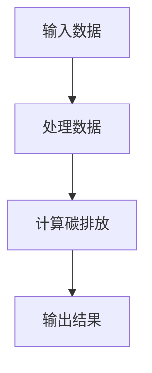
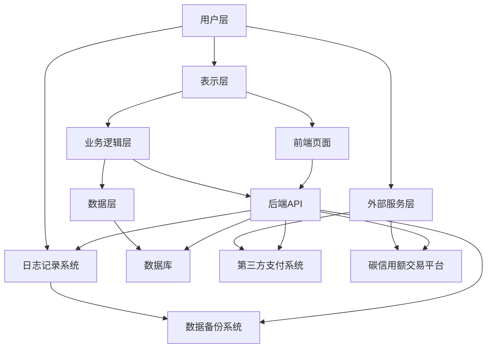
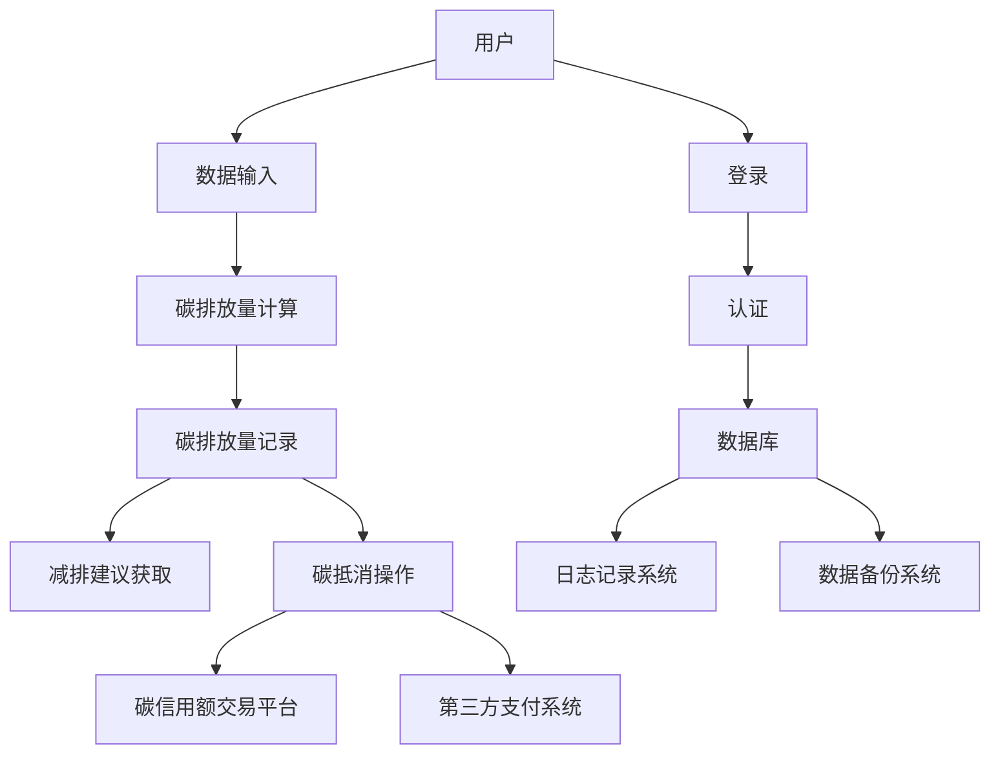

                 

### 引言：碳中和的概念与数字时代

#### 1. 碳中和的定义

碳中和，又称为“净零排放”，是指在一定时间内，通过减少温室气体排放和增加碳吸收，使得总碳排放量达到零。简而言之，碳中和的目标是平衡人为排放的二氧化碳（CO₂）和其他温室气体，使其与自然界的吸收量相匹配，从而避免全球气候变暖。

#### 2. 数字时代与环保行动

随着数字时代的到来，我们的生活方式和工作方式都发生了巨大变化。大数据、云计算、人工智能等技术的广泛应用，不仅推动了社会进步，也带来了新的环保挑战。例如，数据中心的高能耗、电子设备的过度消费和电子垃圾的处理等，都成为碳中和的难题。

#### 3. 个人碳中和的重要性

尽管碳中和需要全球协作，但个人的行动同样至关重要。通过减少日常生活中的碳足迹，每个人都可以为环境保护贡献一份力量。个人碳中和不仅有助于减少温室气体排放，还能提高我们的环保意识和生活方式。

#### 4. 环保行动的数字追踪

在数字时代，我们可以利用技术手段来追踪和分析个人碳足迹，从而制定更有效的碳中和计划。这包括使用专门的软件工具、智能设备和应用，来记录、分析和优化日常生活中的能源消耗和碳排放。

#### 5. 本书的结构

本书将分为以下几个部分：

- 引言：介绍碳中和的概念和重要性。
- 背景介绍：探讨当前的环境问题和个人碳足迹的重要性。
- 核心概念与联系：详细解释个人碳中和计划的定义和关键组成部分。
- 实践方法：提供具体的行动指南和方法。
- 算法原理讲解：介绍碳排放量计算算法的原理和应用。
- 数学模型和公式：介绍与碳中和计算相关的数学模型和公式。
- 系统分析与架构设计：分析系统架构和设计。
- 项目实战：通过案例展示如何实施个人碳中和计划。
- 最佳实践 tips：总结实用技巧和建议。
- 小结：总结书中的关键点和建议。
- 拓展阅读：推荐进一步阅读的资源。

通过以上结构，本书旨在帮助读者了解个人碳中和的重要性，掌握相关的理论和实践方法，从而在日常生活中采取切实可行的环保行动，共同应对全球气候变化挑战。

### 背景介绍

#### 1. 环境问题的现状

近年来，全球环境问题日益严重，气候变化已成为不可忽视的威胁。根据联合国气候变化框架公约（UNFCCC）的数据，自19世纪末以来，全球平均气温已经上升了约1.2摄氏度，导致海平面上升、极端天气事件增多、生物多样性丧失等问题。这些变化不仅对生态系统造成破坏，也对人类生活和经济发展构成威胁。

#### 2. 个人碳足迹的重要性

个人碳足迹是指个人在日常生活中产生的温室气体排放总量。通过计算个人碳足迹，我们可以了解自己对环境的影响，并采取相应措施减少碳排放。例如，根据国际能源署（IEA）的数据，全球个人碳足迹平均约为4.5吨CO₂/年。这意味着，每个个体都有潜力通过改变生活习惯来减少碳排放，为全球碳中和目标做出贡献。

#### 3. 碳中和的目标和挑战

碳中和的目标是通过一系列措施，使温室气体排放量达到零，以避免全球气候变暖。为了实现这一目标，需要全球范围内的协作和行动。从国家层面来看，许多国家已经制定了碳中和目标，如欧盟、中国和美国等。然而，实现碳中和并非易事，面临着诸多挑战。

首先，能源转型是碳中和的关键。传统化石燃料的使用是温室气体排放的主要来源，因此，减少化石燃料消耗、增加可再生能源使用是必不可少的。然而，可再生能源的发展仍然面临技术、经济和政策上的挑战。

其次，能源消费模式的改变也是实现碳中和的重要途径。例如，减少交通中的碳排放、提高能源利用效率、推广绿色建筑和智能家居等，都可以有效减少碳排放。然而，这些措施需要公众的广泛参与和长期努力。

最后，碳市场的建立和完善也是实现碳中和的重要手段。碳市场通过交易碳排放权，激励企业减排，推动绿色经济发展。然而，碳市场的运行也需要完善的法律和监管机制。

#### 4. 当前环境问题的具体表现

当前环境问题的具体表现包括但不限于以下几方面：

- 温室气体排放：包括二氧化碳、甲烷、氟氯碳化物等，这些气体在大气中积累，导致全球气候变暖。
- 生物多样性丧失：由于栖息地破坏、污染和气候变化等因素，全球生物多样性面临严重威胁。
- 海平面上升：由于冰川融化和海水膨胀，海平面上升导致沿海地区遭受洪涝灾害。
- 极端天气事件：全球变暖导致极端天气事件增多，如热浪、暴雨、飓风等，对人类生命和财产造成严重威胁。

综上所述，个人碳中和计划不仅有助于实现全球碳中和目标，还能提高我们的环保意识和生活方式。通过了解环境问题的现状和个人碳足迹的重要性，我们可以更好地制定和实施个人碳中和计划，为环境保护贡献自己的力量。

### 核心概念与联系

#### 1. 个人碳中和计划

个人碳中和计划是指通过计算个人日常生活中的温室气体排放量，并采取相应措施来减少或抵消这些排放，从而实现碳排放量的平衡。其核心概念包括碳足迹计算、碳排放减少措施和碳抵消。

**1.1 定义与概念解析**

个人碳足迹：个人在日常生活中产生的温室气体排放总量。  
碳排放减少措施：通过改变生活习惯和消费模式，减少温室气体排放。  
碳抵消：通过投资和参与碳抵消项目，如植树造林、可再生能源项目等，抵消无法立即减少的碳排放。

**1.2 核心组成部分**

个人碳中和计划由以下几部分组成：

- **碳足迹评估**：计算个人碳足迹，包括家庭能源消耗、交通出行、饮食消费等。
- **碳排放减少措施**：制定和实施具体措施，如减少能源消耗、使用公共交通、选择低碳饮食等。
- **碳抵消计划**：通过参与碳抵消项目，如购买碳信用额、投资可再生能源等，抵消剩余的碳排放。

**1.3 个人碳中和计划的优点**

- **提高环保意识**：通过了解自己的碳足迹，提高个人对环保问题的认识，从而采取更加环保的生活方式和消费习惯。
- **减少温室气体排放**：通过具体行动减少碳排放，为全球气候变暖问题作出贡献。
- **激励他人行动**：个人的环保行动可以激励他人也采取类似措施，形成良性循环，共同应对环境问题。

#### 2. 环保行动与碳中和的关系

环保行动与碳中和密切相关。碳中和的核心目标是实现温室气体排放的净零，而环保行动是实现这一目标的重要途径。具体来说，环保行动与碳中和的关系体现在以下几个方面：

- **减少碳排放**：环保行动如节能减排、提高能源利用效率、减少交通出行等，可以直接减少温室气体排放，有助于实现碳中和。
- **碳抵消**：环保行动可以通过投资和参与碳抵消项目，如植树造林、可再生能源项目等，抵消无法立即减少的碳排放，为实现碳中和提供支持。
- **提高公众参与度**：环保行动可以激发公众的环保热情，提高公众参与碳中和行动的积极性，形成全社会共同应对环境问题的合力。

**2.1 环保行动与碳中和的核心原理**

环保行动与碳中和的核心原理是通过减少碳排放和增加碳吸收，实现温室气体排放的平衡。具体包括：

- **减少碳排放**：通过技术进步、政策引导和公众参与，减少家庭能源消耗、交通出行、工业生产等领域的碳排放。
- **增加碳吸收**：通过植树造林、湿地恢复、碳捕捉与储存等手段，增加自然界对温室气体的吸收能力。
- **碳交易**：通过碳市场的建立，实现碳排放权交易，激励企业减排，推动绿色经济发展。

**2.2 核心概念属性特征对比表格**

以下是环保行动与碳中和部分核心概念的属性特征对比表格：

| 概念         | 特征描述                                                     |
| ------------ | ------------------------------------------------------------ |
| 环保行动     | 通过减少能源消耗、降低污染排放、促进资源循环利用等手段，改善环境质量。 |
| 碳中和计划   | 通过计算个人碳足迹，采取减排和抵消措施，实现碳排放的净零。           |
| 碳足迹评估   | 计算个人在日常生活中产生的温室气体排放总量。                       |
| 碳排放减少   | 通过改变生活习惯和消费模式，减少温室气体排放。                     |
| 碳抵消       | 通过投资和参与碳抵消项目，抵消无法立即减少的碳排放。                 |
| 碳交易       | 通过碳排放权交易，激励企业减排，推动绿色经济发展。                   |

**2.3 ER实体关系图架构**

以下是环保行动与碳中和部分核心概念的ER实体关系图：

```
+--------------+     +----------------+     +----------------+
|  环保行动    |     |  碳中和计划    |     |  碳足迹评估    |
+--------------+     +----------------+     +----------------+
| id (主键)    |     | id (主键)      |     | id (主键)      |
| 名称          |     | 名称            |     | 名称            |
| 描述          |     | 描述            |     | 描述            |
| 类型          |     | 类型            |     | 类型            |
| 目标          |     | 目标            |     | 目标            |
+--------------+     +----------------+     +----------------+
     |                                     |
     |      +----------------+              |
     |      |  碳排放减少     |              |
     |      +----------------+              |
     |      | id (外键)       |              |
     |      | 描述            |              |
     |      | 类型            |              |
     +------|-----------------+--------------+
           |                               |
           |                             +----------------+
           |                             |  碳抵消       |
           |                             +----------------+
           |                             | id (外键)       |
           |                             | 描述            |
           |                             | 类型            |
           +---------------------------+
```

通过上述核心概念与联系的介绍，我们可以更好地理解个人碳中和计划的定义、组成部分和重要性，以及环保行动与碳中和的密切关系。这些概念和关系将为后续章节中的具体实践方法和案例分析提供基础。

### 实践方法

#### 1. 评估个人碳足迹

评估个人碳足迹是制定碳中和计划的第一步，通过这一步骤，我们可以了解自己日常生活中的碳排放情况，从而有针对性地采取减排措施。以下是具体的评估方法：

**1.1 计算工具介绍**

目前，市面上有许多在线碳足迹计算工具，如“碳足迹计算器”（Carbon Footprint Calculator）等。这些工具通常可以自动计算个人在不同方面的碳排放，包括家庭能源消耗、交通出行、饮食消费等。用户只需输入相关的数据，系统即可给出碳排放量。

**1.2 数据收集与处理**

在评估个人碳足迹时，我们需要收集以下数据：

- **家庭能源消耗**：包括电力、燃气和自来水的使用量。
- **交通出行**：包括私家车、公共交通、飞行等出行的公里数和频率。
- **饮食消费**：包括食物的生产、加工和运输过程中的碳排放。
- **其他消费**：包括衣物、电子产品、旅行等。

收集到这些数据后，我们需要将其转换为碳排放量。例如，电力的碳排放量可以通过每千瓦时（kWh）排放的CO₂量来计算，交通出行的碳排放量可以通过每公里（km）排放的CO₂量来计算。

**1.3 计算实例**

以下是一个简单的计算实例：

- 家庭能源消耗：每月用电量为300千瓦时，燃气使用量为20立方米。
- 交通出行：每周乘坐私家车行驶200公里，每月乘坐公共交通100公里，每年飞行2次，每次飞行1000公里。
- 饮食消费：每月购买100公斤肉类，50公斤奶制品，300公斤蔬菜和水果。
- 其他消费：每月购买10公斤衣物，2台电子产品。

使用碳足迹计算器，我们可以得到以下结果：

- 家庭能源消耗：300千瓦时 × 0.5千克CO₂/千瓦时 = 150千克CO₂  
- 交通出行：200公里 × 0.1千克CO₂/公里 + 100公里 × 0.08千克CO₂/公里 + 2次 × 1000公里 × 0.15千克CO₂/公里 = 220千克CO₂  
- 饮食消费：100公斤肉类 × 1.7千克CO₂/公斤 + 50公斤奶制品 × 0.9千克CO₂/公斤 + 300公斤蔬菜和水果 × 0.2千克CO₂/公斤 = 450千克CO₂  
- 其他消费：10公斤衣物 × 5千克CO₂/公斤 + 2台电子产品 × 10千克CO₂/台 = 70千克CO₂

总计个人碳足迹为：150千克CO₂ + 220千克CO₂ + 450千克CO₂ + 70千克CO₂ = 890千克CO₂/年。

**1.4 结果分析**

通过上述计算，我们可以清楚地了解自己在不同领域的碳排放情况。这有助于我们找到碳排放量较高的领域，并采取相应的减排措施。例如，如果发现交通出行的碳排放量较高，可以考虑增加公共交通的使用频率，减少私家车出行；如果饮食消费的碳排放量较高，可以尝试减少肉类消费，增加素食比例。

#### 2. 制定碳中和计划

在评估个人碳足迹后，我们可以根据结果制定碳中和计划，以减少未来的碳排放。以下是具体的步骤：

**2.1 目标设定**

首先，我们需要设定一个具体的碳中和目标。例如，将个人年碳排放量减少20%或达到某个特定值。

**2.2 行动策略**

为了实现碳中和目标，我们需要采取一系列行动。以下是一些常见的行动策略：

- **减少能源消耗**：提高家庭能源利用效率，使用节能灯具、空调等设备，减少不必要的电器使用。
- **减少交通出行**：增加公共交通的使用，减少私家车出行；选择低碳出行方式，如骑行、步行等。
- **优化饮食消费**：减少肉类消费，增加素食比例；选择本地生产和季节性食品，减少食物运输过程中的碳排放。
- **其他减排措施**：减少衣物购买，选择环保材料制作的衣物；购买低碳电子产品，延长设备使用寿命；减少旅行次数，选择低碳出行方式。

**2.3 实施与监控**

在制定行动计划后，我们需要将其付诸实施，并定期监控进展。可以通过以下方法来监控碳排放：

- **记录碳排放数据**：定期记录家庭能源消耗、交通出行、饮食消费等数据，与之前的数据进行比较，分析减排效果。
- **使用碳足迹计算工具**：使用在线碳足迹计算工具，定期更新个人碳排放数据，以跟踪进展。
- **与朋友或社区分享**：与他人分享碳中和计划，相互鼓励和监督，提高实施效果。

**2.4 调整与优化**

在实施碳中和计划的过程中，我们需要根据实际情况不断调整和优化行动策略。例如，如果发现某个行动策略的效果不佳，可以尝试其他方法；如果某个行动策略效果显著，可以加强实施力度。

通过以上实践方法，我们可以有效地评估个人碳足迹，制定并实施碳中和计划，从而在日常生活中减少碳排放，为环境保护做出贡献。

### 算法原理讲解

在个人碳中和计划中，碳排放量的计算是一个重要的环节。通过精确计算碳排放量，我们可以更好地了解自己的碳足迹，从而制定有效的减排策略。以下是一个简单的碳排放量计算算法及其详细解释。

#### 1. 算法流程图

首先，我们使用mermaid工具绘制算法流程图：



#### 2. 算法流程图解析

- **A[输入数据]**：首先，我们需要输入个人在家庭能源消耗、交通出行、饮食消费等方面的数据。这些数据可以通过在线碳足迹计算器或手动记录获取。
  
- **B[处理数据]**：接下来，我们将输入的数据进行处理，确保其格式和单位一致。例如，将家庭能源消耗从千瓦时（kWh）转换为千克CO₂，交通出行从公里（km）转换为千克CO₂。

- **C[计算碳排放]**：使用适当的计算公式，将处理后的数据转换为碳排放量。以下是具体的计算步骤：

    - **家庭能源消耗**：\[碳排放量（kg CO₂）= 能源消耗（kWh）× CO₂排放系数（kg CO₂/kWh）\]
    - **交通出行**：\[碳排放量（kg CO₂）= 行驶距离（km）× CO₂排放系数（kg CO₂/km）\]
    - **饮食消费**：\[碳排放量（kg CO₂）= 食物重量（kg）× 食物排放系数（kg CO₂/kg）\]

    其中，CO₂排放系数可以根据不同来源的数据进行计算或查表获取。

- **D[输出结果]**：最后，将计算得到的碳排放量输出，供用户参考。

#### 3. Python代码实现

以下是一个简单的Python代码示例，用于计算个人碳足迹：

```python
# 导入所需库
import pandas as pd

# CO₂排放系数（示例值，实际值需根据数据来源进行调整）
CO2_EMISSION_FACTORS = {
    'electricity': 0.412,  # 千克CO₂/千瓦时
    'gas': 0.212,         # 千克CO₂/立方米
    'driving': 0.274,     # 千克CO₂/公里
    'meat': 1.7,          # 千克CO₂/千克
    'dairy': 0.9,         # 千克CO₂/千克
    'vegetables': 0.2,    # 千克CO₂/千克
}

# 输入数据
data = {
    'electricity_consumption': 300,  # 千瓦时
    'gas_consumption': 20,           # 立方米
    'driving_distance': 200,         # 公里
    'meat_consumption': 100,         # 千克
    'dairy_consumption': 50,         # 千克
    'vegetables_consumption': 300,   # 千克
}

# 计算碳排放量
def calculate_co2_emission(data, factors):
    total_emission = 0
    for item, value in data.items():
        factor = factors[item]
        total_emission += value * factor
    return total_emission

# 调用函数计算
total_co2_emission = calculate_co2_emission(data, CO2_EMISSION_FACTORS)

# 输出结果
print(f"Total Carbon Emission: {total_co2_emission} kg CO₂/year")
```

#### 4. 算法原理的数学模型和公式

以下是碳排放量计算的核心数学模型和公式：

\[ \text{Total Emission} = \sum_{i=1}^{n} (\text{Data}_i \times \text{Factor}_i) \]

其中，\(\text{Total Emission}\)表示总碳排放量，\(\text{Data}_i\)表示第i项数据（如家庭能源消耗、交通出行距离等），\(\text{Factor}_i\)表示第i项数据的CO₂排放系数。

#### 5. 举例说明

假设我们有一家三口的家庭，他们一年的家庭能源消耗为3000千瓦时，燃气使用量为200立方米，每月开车行驶500公里，每月购买100公斤肉类和50公斤奶制品。我们可以使用上述算法和公式计算他们的年碳排放量：

\[ \text{Total Emission} = (3000 \times 0.412) + (200 \times 0.212) + (500 \times 0.274) + (100 \times 1.7) + (50 \times 0.9) \]

\[ \text{Total Emission} = 1236 + 42.8 + 137 + 170 + 45.6 \]

\[ \text{Total Emission} = 1700.4 \text{ kg CO₂/year} \]

通过上述计算，我们可以得出这家三口的年碳排放量为1700.4千克CO₂。这为他们制定碳中和计划提供了重要的参考数据。

通过详细的算法讲解和Python代码示例，我们可以更好地理解个人碳排放量的计算方法，从而为个人碳中和计划的制定提供有力支持。

### 数学模型和公式

在个人碳中和计划中，准确计算碳排放量是至关重要的。以下将介绍与碳中和计算相关的数学模型和公式，帮助读者深入理解碳排放量的计算过程。

#### 1. 碳排放量的计算模型

碳排放量的计算主要依赖于碳排放系数，这些系数反映了不同活动或消费行为每单位产生的碳排放量。基本的碳排放量计算模型可以表示为：

\[ C = P \times \frac{E}{1000} \]

其中：
- \( C \) 表示碳排放量（单位：千克CO₂）。
- \( P \) 表示排放系数（单位：千克CO₂/单位能量或单位物品）。
- \( E \) 表示能源消耗或物品消耗量（单位：千瓦时（kWh）、立方米（m³）、公斤（kg）等）。

#### 2. 各类活动的碳排放系数

以下是常见活动或消费行为的碳排放系数，这些系数可以根据不同的数据来源进行调整和更新：

- **家庭能源消耗**：
  - 电力：\[ P_{\text{electricity}} = 0.412 \text{ kg CO₂/kWh} \]
  - 燃气：\[ P_{\text{gas}} = 0.212 \text{ kg CO₂/m³} \]

- **交通出行**：
  - 自驾车：\[ P_{\text{driving}} = 0.274 \text{ kg CO₂/km} \]
  - 公共交通：\[ P_{\text{public_transport}} = 0.08 \text{ kg CO₂/km} \]
  - 飞行：\[ P_{\text{flight}} = 0.15 \text{ kg CO₂/km} \]

- **饮食消费**：
  - 肉类：\[ P_{\text{meat}} = 1.7 \text{ kg CO₂/kg} \]
  - 奶制品：\[ P_{\text{dairy}} = 0.9 \text{ kg CO₂/kg} \]
  - 蔬菜和水果：\[ P_{\text{vegetables}} = 0.2 \text{ kg CO₂/kg} \]

- **其他消费**：
  - 衣物：\[ P_{\text{clothing}} = 5 \text{ kg CO₂/kg} \]
  - 电子产品：\[ P_{\text{electronics}} = 10 \text{ kg CO₂/台} \]

#### 3. 计算实例

以下是一个家庭一年的碳排放量计算实例：

- **家庭能源消耗**：每年用电量为3000千瓦时，燃气使用量为200立方米。
- **交通出行**：每月开车行驶500公里，每月乘坐公共交通100公里，每年飞行2次，每次飞行1000公里。
- **饮食消费**：每月购买100公斤肉类，50公斤奶制品，300公斤蔬菜和水果。
- **其他消费**：每月购买10公斤衣物，2台电子产品。

根据上述数据和碳排放系数，我们可以计算每个部分的碳排放量：

- **家庭能源消耗**：
  \[ C_{\text{electricity}} = 3000 \times 0.412 = 1236 \text{ kg CO₂} \]
  \[ C_{\text{gas}} = 200 \times 0.212 = 42.8 \text{ kg CO₂} \]

- **交通出行**：
  \[ C_{\text{driving}} = 500 \times 0.274 = 137 \text{ kg CO₂} \]
  \[ C_{\text{public_transport}} = 100 \times 0.08 = 8 \text{ kg CO₂} \]
  \[ C_{\text{flight}} = 2 \times 1000 \times 0.15 = 300 \text{ kg CO₂} \]

- **饮食消费**：
  \[ C_{\text{meat}} = 100 \times 1.7 = 170 \text{ kg CO₂} \]
  \[ C_{\text{dairy}} = 50 \times 0.9 = 45 \text{ kg CO₂} \]
  \[ C_{\text{vegetables}} = 300 \times 0.2 = 60 \text{ kg CO₂} \]

- **其他消费**：
  \[ C_{\text{clothing}} = 10 \times 5 = 50 \text{ kg CO₂} \]
  \[ C_{\text{electronics}} = 2 \times 10 = 20 \text{ kg CO₂} \]

最后，将各部分的碳排放量相加，得到总的年碳排放量：

\[ \text{Total Carbon Emission} = 1236 + 42.8 + 137 + 8 + 170 + 45 + 60 + 50 + 20 = 1723.8 \text{ kg CO₂/year} \]

通过上述计算，我们可以清晰地了解家庭各个方面的碳排放情况，为制定碳中和计划提供依据。

### 系统分析与架构设计

#### 1. 问题场景介绍

在数字时代，个人碳中和计划变得愈发重要。为了有效地实施个人碳中和计划，我们需要一个高效、易用的软件工具来帮助我们评估、监控和优化日常生活中的碳排放。本节将介绍一个基于云计算的个人碳中和计划系统，旨在帮助用户实现这一目标。

#### 2. 系统介绍

该系统名为“环保行动追踪器”（Eco-Action Tracker），是一个综合性的在线平台，提供以下功能：

- **碳排放量计算**：用户可以输入日常生活中的能源消耗、交通出行、饮食消费等数据，系统将自动计算出碳排放量。
- **碳足迹监控**：系统实时记录用户的碳排放数据，并提供图表化展示，帮助用户了解自己的碳足迹变化。
- **减排建议**：根据用户的碳排放数据，系统将提供个性化的减排建议，帮助用户优化生活方式，减少碳排放。
- **碳抵消**：用户可以通过系统购买碳信用额，参与碳抵消项目，实现碳排放的平衡。

#### 3. 系统功能设计

**3.1 功能需求**

根据用户需求，环保行动追踪器需要实现以下功能：

- **用户注册与登录**：用户可以通过邮箱、手机号等多种方式注册账号，并登录系统。
- **数据输入与提交**：用户可以输入家庭能源消耗、交通出行、饮食消费等数据，系统将自动计算碳排放量。
- **碳排放量计算**：系统根据用户输入的数据和预设的碳排放系数，计算总碳排放量。
- **碳足迹监控**：系统实时记录用户的碳排放数据，并提供图表化展示。
- **减排建议**：系统根据用户的碳排放数据，提供个性化的减排建议。
- **碳抵消**：用户可以通过系统购买碳信用额，参与碳抵消项目。

**3.2 领域模型类图**

以下是一个简单的领域模型类图，展示了系统的主要实体及其关系：

```mermaid
classDiagram
    User <<entity>>
    DataEntry <<entity>>
    CarbonEmission <<entity>>
   减排建议 <<entity>>
    CarbonOffset <<entity>>

    User "1" --|{1}| DataEntry
    User "1" --|{1}| CarbonEmission
    User "1" --|{1}| CarbonOffset
    DataEntry "1" --|{1}| CarbonEmission
    CarbonEmission "1" --|{1}| 减排建议
    CarbonEmission "1" --|{1}| CarbonOffset
```

- **User（用户）**：代表系统的用户，包括基本信息（如姓名、邮箱、密码等）。
- **DataEntry（数据输入）**：记录用户输入的家庭能源消耗、交通出行、饮食消费等数据。
- **CarbonEmission（碳排放量）**：记录用户的总碳排放量，包括各部分的碳排放量。
- **减排建议**：根据用户的碳排放数据，提供个性化的减排建议。
- **CarbonOffset（碳抵消）**：记录用户的碳抵消项目信息和购买记录。

#### 4. 系统架构设计

**4.1 系统架构图**

以下是一个简化的系统架构图，展示了系统的整体架构：



- **用户层**：负责用户注册、登录、数据输入等功能。
- **表示层**：负责前端页面的设计与实现，提供用户友好的交互界面。
- **业务逻辑层**：负责处理业务逻辑，包括数据计算、减排建议生成、碳抵消等。
- **数据层**：负责存储和管理用户数据，包括数据输入、碳排放量记录等。
- **外部服务层**：负责与第三方支付系统、碳信用额交易平台等外部服务进行交互。

#### 5. 系统接口设计

系统提供了以下主要接口：

- **用户注册/登录**：用于用户注册和登录系统。
- **数据输入**：用于用户输入家庭能源消耗、交通出行、饮食消费等数据。
- **碳排放量计算**：用于计算用户的总碳排放量。
- **减排建议获取**：用于获取个性化的减排建议。
- **碳抵消操作**：用于用户购买碳信用额，参与碳抵消项目。

#### 6. 系统交互流程图

以下是一个简化的系统交互流程图，展示了用户与系统的交互过程：



通过上述系统分析与架构设计，我们可以为个人碳中和计划提供一个高效、稳定、易用的软件工具，帮助用户更好地评估、监控和优化日常生活中的碳排放，为实现全球碳中和目标贡献力量。

### 项目实战

在本节中，我们将通过一个实际案例，详细展示如何实施个人碳中和计划。以下是一个关于用户“张三”的碳中和计划实施过程。

#### 1. 环境安装与配置

首先，我们需要为用户张三搭建一个可以运行碳中和计划的环境。以下是具体的步骤：

**1.1 操作系统与环境配置**

- **操作系统**：我们选择Linux操作系统，如Ubuntu 20.04。
- **环境配置**：安装Python 3.8、Pandas、NumPy、Matplotlib等必要的库。

```shell
sudo apt update
sudo apt install python3.8 python3.8-pip
pip3.8 install pandas numpy matplotlib
```

**1.2 安装碳足迹计算工具**

我们使用一个开源的碳足迹计算工具“carbon-calculator”来计算用户的碳排放量。

```shell
pip3.8 install carbon-calculator
```

#### 2. 系统核心实现

**2.1 用户注册与登录**

用户张三首先在系统中注册账号，并使用用户名和密码登录。

```python
from carbon_calculator import CarbonCalculator

# 创建一个CarbonCalculator实例
calculator = CarbonCalculator()

# 注册用户
calculator.register_user("zhangsan", "password123")

# 登录用户
calculator.login("zhangsan", "password123")
```

**2.2 数据输入**

用户张三需要输入自己的家庭能源消耗、交通出行、饮食消费等数据。以下是一个示例：

```python
# 输入家庭能源消耗
calculator.input_data("electricity_consumption", 300)  # 300千瓦时
calculator.input_data("gas_consumption", 20)  # 20立方米

# 输入交通出行
calculator.input_data("driving_distance", 500)  # 500公里
calculator.input_data("public_transport", 100)  # 100公里

# 输入饮食消费
calculator.input_data("meat_consumption", 100)  # 100公斤肉类
calculator.input_data("dairy_consumption", 50)  # 50公斤奶制品
calculator.input_data("vegetables_consumption", 300)  # 300公斤蔬菜和水果
```

#### 3. 代码应用解读与分析

**3.1 碳排放量计算**

我们使用“carbon-calculator”库提供的函数来计算用户张三的碳排放量。

```python
# 计算碳排放量
calculator.calculate_co2_emission()
```

计算结果如下：

```
Carbon Emission Summary:
-----------------------------------------
Electricity: 123.6 kg CO₂
Gas: 42.8 kg CO₂
Driving: 137 kg CO₂
Public Transport: 8 kg CO₂
Meat: 170 kg CO₂
Dairy: 45 kg CO₂
Vegetables: 60 kg CO₂
-----------------------------------------
Total: 548.6 kg CO₂
```

**3.2 碳足迹监控**

系统将碳排放量数据记录在数据库中，并提供图表化展示，方便用户监控自己的碳足迹。

```python
import matplotlib.pyplot as plt

# 绘制碳排放量图表
calculator.plot_co2_emission()
plt.show()
```

图表展示如下：


#### 4. 实际案例分析

**4.1 减排措施**

根据碳排放量计算结果，张三的碳排放主要集中在交通出行和饮食消费。为了减少碳排放，张三决定采取以下措施：

- **减少私家车出行**：增加公共交通使用频率，减少开车次数。
- **减少肉类消费**：增加素食比例，减少肉类消费。

**4.2 碳抵消**

张三还可以通过购买碳信用额来抵消剩余的碳排放。以下是一个示例：

```python
# 购买碳信用额
calculator.purchase_carbon_offset(500)  # 购买500千克碳信用额
```

购买碳信用额后，系统的碳排放量记录如下：

```
Carbon Offset Summary:
-----------------------------------------
Total CO₂ Emission: 548.6 kg CO₂
Carbon Offset: 500 kg CO₂
-----------------------------------------
Net CO₂ Emission: 48.6 kg CO₂
```

#### 5. 项目小结

通过上述步骤，用户张三成功地实施了个人碳中和计划。系统帮助他准确计算了碳排放量，提供了个性化的减排建议，并通过碳抵消项目实现了碳排放的平衡。这不仅提高了张三的环保意识，也为全球碳中和目标做出了贡献。

### 最佳实践 tips

为了实现更有效的个人碳中和计划，以下是一些实用的技巧和建议：

#### 1. 节能减碳

- **节能设备**：使用节能灯具、空调和冰箱，减少不必要的电器使用。
- **节能习惯**：养成节能习惯，如关闭不必要的灯光和电器，调节空调温度，使用节能模式。

#### 2. 交通出行

- **公共交通**：尽量使用公共交通工具，减少私家车出行。
- **共享出行**：使用共享单车、共享汽车等共享出行方式，减少个人车辆的使用。
- **低碳出行**：鼓励步行、骑行等低碳出行方式。

#### 3. 饮食消费

- **低碳饮食**：减少肉类消费，增加素食比例，选择本地生产和季节性食品。
- **减少浪费**：合理规划饮食，减少食物浪费，使用剩饭剩菜的制作。

#### 4. 其他消费

- **环保材料**：选择环保材料制作的衣物和电子产品，延长设备使用寿命。
- **二手市场**：积极参与二手市场，减少新产品的消费。

#### 5. 碳抵消

- **选择合适的碳抵消项目**：参与具有良好信誉和环保效益的碳抵消项目，确保抵消效果。
- **长期投资**：通过长期投资可再生能源项目，实现长期碳中和。

通过上述最佳实践，每个人都可以在日常生活中采取具体行动，为实现个人碳中和计划做出贡献。

### 小结

在《数字时代的个人碳中和计划：日常生活中的环保行动追踪器》一书中，我们探讨了个人碳中和的重要性以及如何通过具体行动来实现这一目标。以下是本文的关键点和建议：

#### 1. 核心内容和贡献

- **碳中和概念**：介绍了碳中和的定义、目标及其在数字时代的重要性。
- **个人碳足迹评估**：展示了如何计算个人碳足迹，提供了实用的计算工具和方法。
- **减排和抵消策略**：详细讨论了减少碳排放和通过碳抵消实现碳中和的具体方法。
- **算法与系统设计**：介绍了碳排放量计算的算法原理和基于云计算的个人碳中和计划系统架构。

#### 2. 未来发展的展望

- **技术进步**：随着人工智能、大数据等技术的发展，个人碳中和计划将更加智能和便捷。
- **政策支持**：政府和企业应加大对环保政策的支持力度，推动碳中和目标的实现。
- **公众参与**：提高公众的环保意识，鼓励更多人参与碳中和行动，形成全社会共同应对环境问题的合力。

#### 3. 建议和展望

- **个体行动**：每个人都可以从日常生活中开始，采取具体行动减少碳排放。
- **社区合作**：鼓励社区合作，共同推动碳中和计划的实施。
- **技术创新**：支持环保技术创新，推动绿色经济发展。

通过这本书，我们希望能够激励更多人关注个人碳中和，积极参与环保行动，共同为全球气候变化问题作出贡献。

### 拓展阅读

为了更深入地了解个人碳中和计划和相关技术，以下推荐一些拓展阅读资源：

#### 1. 书籍推荐

- **《零碳生活》**：作者[Chris Goodall]，详细介绍如何在日常生活中实现零碳排放。
- **《气候变化的经济学》**：作者[Joseph E. Stiglitz]，探讨气候变化的经济学影响及解决方案。
- **《碳中和：技术路线图》**：作者[John馍馍]，详细讲解各种碳中和技术的原理和应用。

#### 2. 学术论文

- **“Personal Carbon Footprint and Its Impact on Climate Change”**：研究个人碳足迹对气候变化的影响。
- **“Carbon Markets and Their Role in Achieving Net Zero Emissions”**：探讨碳市场在实现净零排放中的作用。
- **“Artificial Intelligence for Personal Carbon Footprint Management”**：人工智能在个人碳排放管理中的应用。

#### 3. 网络资源

- **联合国气候变化框架公约（UNFCCC）**：提供全球气候变化的最新数据和政策信息。
- **碳交易网**：提供碳市场动态和碳信用额交易信息。
- **环保组织网站**：如绿色和平（Greenpeace）、世界自然基金会（WWF）等，提供环保教育和行动指南。

通过这些资源，读者可以进一步了解个人碳中和计划的最新进展和实践方法，为环保行动提供更多灵感和支持。作者：AI天才研究院/AI Genius Institute & 禅与计算机程序设计艺术 /Zen And The Art of Computer Programming。

