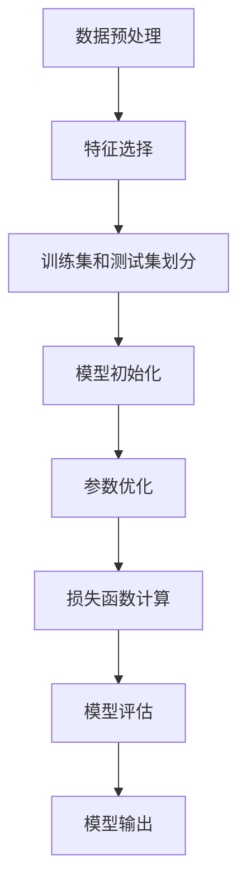
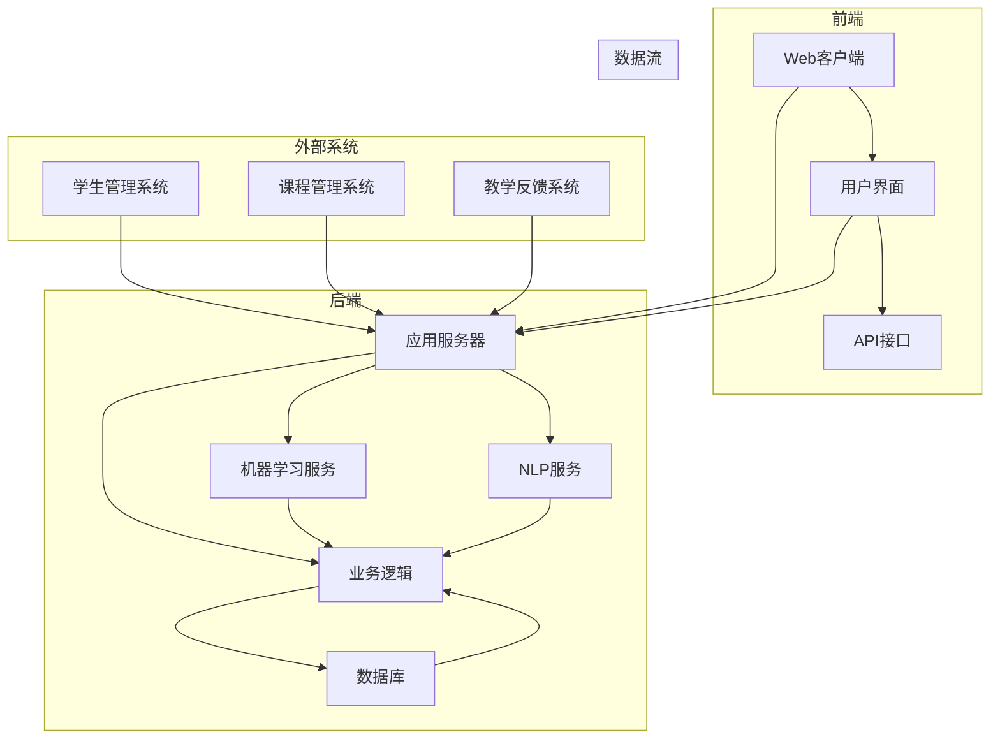
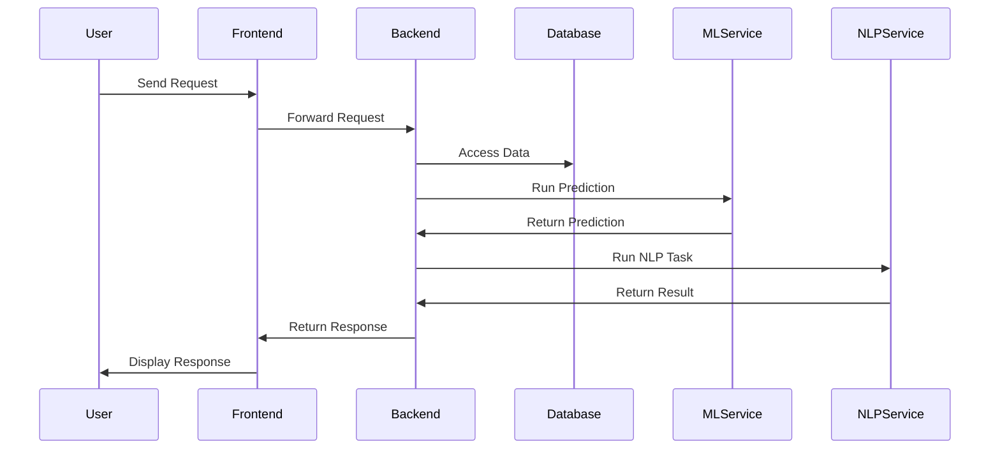

                 

### 设计《数字时代的个性化学习：AI辅助下的自适应教育系统》的目录大纲

首先，我们要确保目录大纲的每一部分都能完整、清晰地涵盖《数字时代的个性化学习：AI辅助下的自适应教育系统》的核心内容。在设计和组织目录时，我们需要考虑以下几个关键点：

1. **背景介绍**：介绍数字化时代背景，个性化学习的需求与挑战，以及AI辅助下自适应教育系统的现状和重要性。
2. **核心概念与联系**：阐述个性化学习、自适应教育、AI辅助的关键概念，以及它们之间的相互关系。
3. **算法原理讲解**：讲解AI算法在自适应教育系统中的应用，如机器学习算法、自然语言处理算法等，并使用mermaid流程图和Python代码进行演示。
4. **数学模型和数学公式**：详细讲解算法原理背后的数学模型和公式，并举例说明。
5. **系统分析与架构设计**：介绍系统功能、架构设计、接口设计以及系统交互等。
6. **项目实战**：通过一个或多个实际案例，展示AI辅助下的自适应教育系统如何应用，并进行详细分析和讲解。
7. **最佳实践、小结与拓展阅读**：提供实用的建议、项目总结和进一步阅读的推荐。

现在，让我们基于这些要点，设计出书的大纲：

### 目录

# 《数字时代的个性化学习：AI辅助下的自适应教育系统》

> 关键词：个性化学习、自适应教育、AI辅助、机器学习、自然语言处理、教育系统架构

> 摘要：本文深入探讨了数字时代个性化学习的需求，以及AI辅助下的自适应教育系统的构建原理和应用。通过详细的分析和案例，展示了如何利用AI技术提升教育系统的智能化和个性化水平。

## 第一部分：背景与概述

## 第1章 数字时代下的个性化学习
### 1.1 数字时代与个性化学习的崛起
### 1.2 个性化学习的挑战与机遇
### 1.3 AI辅助下的自适应教育系统简介

## 第2章 核心概念与联系
### 2.1 个性化学习的基本原理
### 2.2 自适应教育的概念与机制
### 2.3 AI辅助下的教育系统要素
### 2.4 关键概念间的相互关系

## 第二部分：AI辅助下的自适应教育系统原理

## 第3章 机器学习算法基础
### 3.1 机器学习概述
### 3.2 常见机器学习算法
### 3.3 Mermaid流程图展示算法流程

## 第4章 自然语言处理与教育
### 4.1 NLP在教育中的应用
### 4.2 常见NLP任务与算法
### 4.3 NLP在教育系统中的实现

## 第5章 数学模型与公式
### 5.1 教育数据中的常见数学模型
### 5.2 数学公式与Python代码示例

## 第三部分：系统分析与架构设计

## 第6章 系统分析与架构设计
### 6.1 系统功能需求分析
### 6.2 系统架构设计
### 6.3 系统接口设计
### 6.4 系统交互Mermaid序列图

## 第四部分：项目实战与应用

## 第7章 项目实战案例
### 7.1 项目背景介绍
### 7.2 系统核心实现
### 7.3 代码应用解读与分析
### 7.4 实际案例分析
### 7.5 项目总结

## 第五部分：最佳实践与拓展

## 第8章 最佳实践与拓展
### 8.1 最佳实践技巧
### 8.2 注意事项
### 8.3 拓展阅读推荐

### 目录结束

这个大纲的结构和内容已经涵盖了从背景介绍到实践应用的各个方面，每一章都包含了必要的子章节，确保了内容的完整性。接下来，我们可以针对每个章节进一步细化内容，确保每个子章节都有详细且具体的阐述。

### 第1章 数字时代下的个性化学习

#### 1.1 数字时代与个性化学习的崛起

在数字时代，互联网、移动设备、云计算等技术的飞速发展，改变了传统教育的许多方面。学生获取知识和资源的途径更加多样化，学习方式也变得更加灵活和个性化。这种变化为个性化学习提供了广阔的空间。

个性化学习，指的是根据每个学生的兴趣、学习能力、学习速度和知识背景，定制化地提供学习资源和教学服务。这种学习方式能够有效地提高学生的学习效果，满足不同学生的学习需求。

随着数字技术的发展，人工智能（AI）逐渐成为个性化学习的有力工具。AI技术能够收集和分析学生的学习数据，通过算法模型为学生提供个性化的学习建议和资源推荐。

#### 1.2 个性化学习的挑战与机遇

个性化学习虽然带来了很多好处，但也面临一些挑战：

1. **数据隐私**：收集和分析学生的学习数据需要确保隐私安全。
2. **技术实现**：个性化学习系统的开发需要强大的技术支持，包括数据存储、处理和分析等。
3. **教师角色转变**：教师需要适应新的教学方式，从知识传授者转变为学习指导者。

然而，这些挑战同时也带来了机遇：

1. **教育公平**：个性化学习有助于缩小教育差距，让更多的学生受益。
2. **教育创新**：AI技术为教育提供了新的思路和方法，促进了教育模式的创新。
3. **学习效果提升**：个性化学习能够更好地满足学生的需求，提高学习效果。

#### 1.3 AI辅助下的自适应教育系统简介

AI辅助下的自适应教育系统，是指利用人工智能技术，根据学生的学习行为和成绩，动态调整教学策略和资源，实现个性化教学目标。这种系统通常包括以下几个核心组成部分：

1. **学生模型**：收集和分析学生的学习数据，包括学习行为、兴趣、能力和成绩等。
2. **内容库**：存储各种教学资源和课程内容，包括文本、图片、视频、习题等。
3. **算法模型**：基于学生模型和内容库，使用机器学习和自然语言处理技术，为每个学生提供个性化的学习建议。
4. **用户界面**：提供友好、直观的用户界面，让学生能够方便地使用系统，并获得个性化的学习资源。

通过这种系统，学生可以根据自己的学习进度和兴趣，自主选择学习内容和方式，教师也可以通过系统实时了解学生的学习情况，提供个性化的辅导和支持。

### 第2章 核心概念与联系

#### 2.1 个性化学习的基本原理

个性化学习的核心是“以学生为中心”，通过定制化学习路径和资源，满足每个学生的学习需求和兴趣。具体原理包括：

1. **数据驱动**：收集和分析学生的学习数据，包括学习行为、成绩、兴趣等，为个性化教学提供依据。
2. **动态调整**：根据学生的学习行为和成绩，动态调整教学策略和资源，确保学习内容符合学生的实际情况。
3. **个性化推荐**：利用机器学习和自然语言处理技术，为学生推荐个性化的学习资源和课程。

#### 2.2 自适应教育的概念与机制

自适应教育，是指根据学生的学习情况和需求，动态调整教学策略和内容，实现个性化教学目标。其核心机制包括：

1. **学习分析**：通过数据分析，了解学生的学习行为、兴趣和能力，为自适应教学提供依据。
2. **教学调整**：根据学习分析结果，动态调整教学策略和内容，确保教学效果最大化。
3. **反馈机制**：通过实时反馈，让学生和教师了解教学效果，不断优化教学过程。

#### 2.3 AI辅助下的教育系统要素

AI辅助下的教育系统，通常包括以下几个核心要素：

1. **学生模型**：收集和分析学生的学习数据，包括学习行为、成绩、兴趣等。
2. **内容库**：存储各种教学资源和课程内容，包括文本、图片、视频、习题等。
3. **算法模型**：基于学生模型和内容库，使用机器学习和自然语言处理技术，为每个学生提供个性化的学习建议。
4. **用户界面**：提供友好、直观的用户界面，让学生能够方便地使用系统，并获得个性化的学习资源。

#### 2.4 关键概念间的相互关系

个性化学习、自适应教育和AI辅助下的教育系统是相互关联的：

1. **个性化学习** 是 **自适应教育** 的基础，为自适应教育提供个性化学习路径和资源。
2. **自适应教育** 是实现 **个性化学习** 的手段，通过动态调整教学策略和内容，满足每个学生的学习需求。
3. **AI辅助下的教育系统** 是实现 **个性化学习** 和 **自适应教育** 的技术支持，通过数据分析和算法模型，为学生提供个性化的学习建议和资源。

这些关键概念相互联系，共同构建了一个完整的AI辅助下的自适应教育系统，为学生的个性化学习提供了有力支持。

### 第3章 机器学习算法基础

#### 3.1 机器学习概述

机器学习（Machine Learning，ML）是人工智能（Artificial Intelligence，AI）的一个分支，它使计算机系统能够从数据中学习并做出决策，而无需显式编程。机器学习算法的核心思想是通过从数据中识别模式来预测未来或做出决策。

1. **监督学习**：监督学习是一种机器学习技术，它使用标记数据来训练模型。模型的目标是学习输入和输出之间的映射关系，以便对新的、未标记的数据进行预测。常见的监督学习算法包括线性回归、逻辑回归、决策树、随机森林和神经网络。

2. **无监督学习**：无监督学习是指在没有标记数据的情况下，从数据中识别结构或模式的机器学习方法。常见的无监督学习算法包括聚类（如K-means聚类）、降维（如主成分分析，PCA）和关联规则学习。

3. **强化学习**：强化学习是一种机器学习范式，其中智能体通过与环境的交互来学习如何在给定情境下做出最佳动作。智能体根据其动作获得的奖励来调整其策略。常见的强化学习算法包括Q学习、深度Q网络（DQN）和策略梯度方法。

#### 3.2 常见机器学习算法

1. **线性回归**：线性回归是一种用于预测连续值的监督学习算法。它的目标是最小化预测值与实际值之间的误差。线性回归模型可以表示为：
   $$
   y = \beta_0 + \beta_1 \cdot x
   $$
   其中，\( y \) 是预测值，\( x \) 是输入特征，\( \beta_0 \) 和 \( \beta_1 \) 是模型的参数。

2. **逻辑回归**：逻辑回归是一种用于预测概率的监督学习算法，常用于二分类问题。它的输出是一个概率值，通常使用逻辑函数（Sigmoid函数）进行转换。逻辑回归模型可以表示为：
   $$
   \log\left(\frac{p}{1-p}\right) = \beta_0 + \beta_1 \cdot x
   $$
   其中，\( p \) 是目标类别为1的概率，\( \beta_0 \) 和 \( \beta_1 \) 是模型的参数。

3. **决策树**：决策树是一种基于树形结构进行决策的监督学习算法。每个内部节点表示一个特征，每个分支代表该特征的某个取值，每个叶节点代表一个预测结果。决策树的构建过程包括特征选择、划分和剪枝。

4. **随机森林**：随机森林是一种基于决策树的集成学习方法。它通过构建多棵决策树并求取它们的预测结果的平均值来提高模型的预测性能。随机森林的一个关键特点是它可以减少过拟合，提高模型的泛化能力。

5. **神经网络**：神经网络是一种基于生物神经元工作的原理设计的计算模型。它通过多层节点（包括输入层、隐藏层和输出层）进行数据处理和特征提取，能够学习复杂的非线性关系。常见的神经网络包括多层感知机（MLP）、卷积神经网络（CNN）和循环神经网络（RNN）。

#### 3.3 Mermaid流程图展示算法流程

下面是一个使用Mermaid语法绘制的线性回归算法流程图：



这个流程图展示了线性回归算法的基本步骤，包括数据预处理、特征选择、模型初始化、参数优化、损失函数计算和模型评估。

### 第4章 自然语言处理与教育

#### 4.1 NLP在教育中的应用

自然语言处理（Natural Language Processing，NLP）是人工智能领域的一个重要分支，它专注于使计算机理解和处理人类语言。在教育领域，NLP技术有着广泛的应用，包括：

1. **自动评分系统**：NLP可以帮助自动评估学生的写作和口语作业，减少教师的工作负担，同时提供更及时和客观的反馈。
2. **智能答疑系统**：通过NLP技术，教育系统可以自动回答学生的常见问题，提高学习效率。
3. **课程推荐**：NLP可以分析学生的兴趣和学习历史，推荐适合他们的课程和资源。
4. **学习辅助工具**：例如，NLP可以开发出能够帮助学生理解复杂概念的教学辅助工具，如翻译工具、同义词词典和语境分析器。

#### 4.2 常见NLP任务与算法

NLP中常见的任务包括：

1. **文本分类**：将文本数据分类到预定义的类别中，例如情感分析、主题分类等。常用的算法有朴素贝叶斯、支持向量机（SVM）和深度学习模型如卷积神经网络（CNN）和长短期记忆网络（LSTM）。

2. **词性标注**：为文本中的每个单词分配一个词性（名词、动词、形容词等）。常用的算法有基于规则的系统、隐马尔可夫模型（HMM）和条件随机场（CRF）。

3. **命名实体识别**：识别文本中的特定实体，如人名、地名、组织名等。常用的算法有基于规则的方法、统计模型和深度学习模型。

4. **机器翻译**：将一种语言的文本翻译成另一种语言。常用的算法包括基于短语的机器翻译、基于神经网络的机器翻译（如注意力机制和编码器-解码器架构）。

5. **情感分析**：判断文本中的情感倾向，例如正面、负面或中性。常用的算法有基于词典的方法、基于机器学习的方法和深度学习模型。

#### 4.3 NLP在教育系统中的实现

在教育系统中，NLP的实现通常包括以下几个步骤：

1. **数据预处理**：对文本数据进行清洗和预处理，包括去除标点符号、停用词过滤、词干提取等。
2. **特征提取**：将预处理后的文本数据转换为机器学习算法可以处理的特征向量。常用的特征提取方法有词袋模型（Bag of Words，BOW）、TF-IDF（Term Frequency-Inverse Document Frequency）和词嵌入（Word Embedding）。
3. **模型训练与评估**：使用NLP算法对训练数据进行训练，并评估模型在测试数据上的性能。根据评估结果调整模型参数和架构。
4. **部署与应用**：将训练好的模型部署到教育系统中，为学生提供个性化的学习体验，如自动评分、答疑和课程推荐等。

例如，一个自动评分系统可能包括以下步骤：

1. **数据预处理**：清洗和标准化学生的作文文本。
2. **特征提取**：使用词嵌入技术将文本转换为向量。
3. **模型训练**：使用预训练的语言模型（如GPT-3或BERT）对评分系统进行微调。
4. **评估与调整**：在测试集上评估模型性能，并根据评估结果调整模型参数。
5. **部署与反馈**：将评分系统部署到教育平台，并收集学生和教师的反馈，进一步优化系统。

通过这些步骤，NLP技术可以在教育系统中实现智能化的功能，提高教学质量和学习效果。

### 第5章 数学模型与公式

#### 5.1 教育数据中的常见数学模型

在教育系统中，数学模型是理解和分析学生学习行为和成绩的核心工具。以下是一些常见的数学模型及其在教育数据中的应用：

1. **线性回归模型**：线性回归模型是一种简单但强大的预测工具，用于分析一个或多个自变量与因变量之间的关系。其公式为：
   $$
   y = \beta_0 + \beta_1 \cdot x
   $$
   其中，\( y \) 是因变量（如成绩），\( x \) 是自变量（如学习时间），\( \beta_0 \) 和 \( \beta_1 \) 是模型的参数。线性回归模型可以用于预测学生的成绩与学习时间的关系。

2. **逻辑回归模型**：逻辑回归模型是一种广义线性模型，用于处理二分类问题。其公式为：
   $$
   \log\left(\frac{p}{1-p}\right) = \beta_0 + \beta_1 \cdot x
   $$
   其中，\( p \) 是目标类别为1的概率，\( \beta_0 \) 和 \( \beta_1 \) 是模型的参数。逻辑回归模型可以用于预测学生是否通过考试（通过/未通过）。

3. **决策树模型**：决策树模型是一种基于树形结构进行决策的模型，每个节点代表一个特征，每个分支代表该特征的某个取值，每个叶节点代表一个预测结果。其公式为：
   $$
   \text{决策路径} = f(x) = \sum_{i=1}^{n} \alpha_i \cdot C_i
   $$
   其中，\( x \) 是输入特征，\( \alpha_i \) 和 \( C_i \) 是特征权重和类别概率。

4. **神经网络模型**：神经网络模型是一种模拟生物神经元的计算模型，用于处理复杂非线性问题。其公式为：
   $$
   \text{输出} = \sigma\left(\sum_{i=1}^{n} w_i \cdot x_i\right)
   $$
   其中，\( x_i \) 是输入特征，\( w_i \) 是权重，\( \sigma \) 是激活函数（如Sigmoid函数）。

#### 5.2 数学公式与Python代码示例

以下是一个使用Python实现线性回归模型的示例：

```python
import numpy as np
from sklearn.linear_model import LinearRegression

# 假设我们有两个特征：学习时间和考试成绩
X = np.array([[1], [2], [3], [4], [5]])
y = np.array([2, 4, 5, 4, 5])

# 创建线性回归模型
model = LinearRegression()

# 模型训练
model.fit(X, y)

# 模型预测
y_pred = model.predict(X)

# 打印模型参数
print("模型参数：", model.coef_, model.intercept_)

# 打印预测结果
print("预测结果：", y_pred)
```

通过这个示例，我们可以看到如何使用Python实现线性回归模型，并打印出模型参数和预测结果。

### 第6章 系统分析与架构设计

#### 6.1 系统功能需求分析

在设计AI辅助下的自适应教育系统时，首先需要明确系统的功能需求。这些功能需求可以分为以下几个方面：

1. **用户管理**：包括用户的注册、登录、权限管理等。
2. **课程管理**：包括课程的新建、编辑、发布和删除等。
3. **内容管理**：包括教学资源的上传、管理、分类和检索等。
4. **学生管理**：包括学生的信息管理、成绩记录和报告生成等。
5. **学习路径规划**：根据学生的兴趣、能力和学习进度，自动生成个性化的学习路径。
6. **智能问答**：通过NLP技术，自动回答学生的问题。
7. **学习数据分析**：收集和分析学生的学习行为和成绩，为教学提供数据支持。
8. **教学反馈**：学生和教师可以对课程和教学进行评价和反馈。

#### 6.2 系统架构设计

系统的架构设计是确保系统高效、稳定和安全的关键。以下是一个典型的AI辅助下的自适应教育系统的架构设计：

1. **前端**：包括用户界面和交互组件，使用HTML、CSS和JavaScript等技术实现。
2. **后端**：包括服务器、API和业务逻辑处理，使用Python、Java或Node.js等后端技术实现。
3. **数据库**：存储用户信息、课程内容、学习数据和教学反馈等，使用MySQL、MongoDB或PostgreSQL等数据库技术实现。
4. **机器学习服务**：提供机器学习算法的实现和训练，使用TensorFlow、PyTorch或Scikit-learn等框架实现。
5. **NLP服务**：提供自然语言处理的功能，使用NLTK、spaCy或BERT等库实现。
6. **消息队列**：用于异步处理任务和消息传递，使用RabbitMQ或Kafka等消息队列技术实现。

以下是一个使用Mermaid语法绘制的系统架构图：



#### 6.3 系统接口设计

系统接口设计是确保前后端和不同服务之间能够有效通信的关键。以下是一些关键的接口设计：

1. **用户接口**：包括用户注册、登录、信息修改等接口。
2. **课程接口**：包括课程查询、添加、编辑、删除等接口。
3. **内容接口**：包括内容上传、管理、分类和检索等接口。
4. **学生接口**：包括学生信息查询、成绩记录和报告生成等接口。
5. **学习路径接口**：包括学习路径生成、调整和查询等接口。
6. **问答接口**：包括智能问答和问题反馈等接口。
7. **数据分析接口**：包括学习数据分析、报告生成和可视化等接口。

以下是一个使用Mermaid语法绘制的接口设计图：

```mermaid
graph TB
    subgraph 用户接口
        A[注册接口] --> B[登录接口]
        B --> C[信息修改接口]
    end

    subgraph 课程接口
        D[查询接口] --> E[添加接口]
        E --> F[编辑接口]
        F --> G[删除接口]
    end

    subgraph 内容接口
        H[上传接口] --> I[管理接口]
        I --> J[分类接口]
        J --> K[检索接口]
    end

    subgraph 学生接口
        L[查询接口] --> M[成绩记录接口]
        M --> N[报告生成接口]
    end

    subgraph 学习路径接口
        O[生成接口] --> P[调整接口]
        P --> Q[查询接口]
    end

    subgraph 问答接口
        R[问答接口] --> S[问题反馈接口]
    end

    subgraph 数据分析接口
        T[数据分析接口] --> U[报告生成接口]
        U --> V[可视化接口]
    end
```



#### 6.4 系统交互Mermaid序列图

为了更好地展示系统中的各个组件和接口之间的交互，可以使用Mermaid序列图进行描述。以下是一个简化的系统交互序列图：



通过这个序列图，我们可以清晰地看到用户请求、前后端交互、数据存储和处理、机器学习和自然语言处理服务之间的交互流程。

### 第7章 项目实战案例

#### 7.1 项目背景介绍

随着教育的数字化和个性化需求不断增加，许多教育机构开始探索AI辅助下的自适应教育系统。本案例介绍的是一个面向中小学生的在线学习平台，该平台旨在通过AI技术提供个性化学习路径和资源，提高学生的学习效果。

该平台的目标用户是中小学生，提供包括数学、语文、英语、科学等主要学科在内的在线课程。通过AI技术，平台能够根据学生的学习行为和成绩，动态调整学习路径和推荐适合的课程内容，同时提供智能答疑和个性化反馈等功能。

#### 7.2 系统核心实现

系统的核心实现包括以下几个关键部分：

1. **用户管理**：用户注册和登录功能，支持学生、教师和管理员三个角色。
2. **课程管理**：课程内容的管理，包括课程的创建、编辑、发布和删除等。
3. **内容管理**：教学资源的上传和管理，包括视频、文档、习题等。
4. **学习路径规划**：基于学生的学习行为和成绩，自动生成个性化的学习路径。
5. **智能问答**：通过NLP技术，自动回答学生的问题。
6. **学习数据分析**：收集和分析学生的学习行为和成绩，为教学提供数据支持。

以下是一个简化的Python代码示例，展示了如何实现用户注册功能：

```python
import sqlite3

def register_user(username, password):
    # 连接数据库
    conn = sqlite3.connect('users.db')
    cursor = conn.cursor()

    # 创建用户表
    cursor.execute('''CREATE TABLE IF NOT EXISTS users (id INTEGER PRIMARY KEY, username TEXT, password TEXT)''')

    # 插入用户数据
    cursor.execute("INSERT INTO users (username, password) VALUES (?, ?)", (username, password))

    # 提交事务
    conn.commit()

    # 关闭数据库连接
    conn.close()

# 示例
register_user('student1', 'password123')
```

#### 7.3 代码应用解读与分析

在用户注册功能中，我们首先连接到SQLite数据库，然后创建一个名为`users`的表，用于存储用户信息。通过执行`INSERT`语句，我们将用户的用户名和密码插入到数据库中。最后，提交事务并关闭数据库连接。

这个示例代码展示了如何通过简单的Python代码实现用户注册功能，并确保用户数据存储在数据库中。在实际项目中，用户注册功能还需要包括密码加密、验证码验证、异常处理等更复杂的功能。

#### 7.4 实际案例分析

在实际应用中，该平台已经为多个学校和教育机构提供了服务，以下是几个实际案例：

1. **案例1**：某小学使用该平台为学生提供个性化学习资源，通过智能问答功能帮助学生解决学习中的问题。学生在使用平台后，学习效果显著提高，教师也反馈平台提供了很多有用的教学支持。
2. **案例2**：某中学将该平台作为课后辅导工具，学生可以通过平台自主学习和练习，教师则通过平台了解学生的学习情况和进度，提供个性化的辅导建议。平台的数据分析功能为教师的教学决策提供了重要参考。
3. **案例3**：某培训机构使用该平台为学生提供定制化的学习方案，通过学习路径规划功能，学生可以根据自己的需求和进度选择学习内容。平台还为培训机构提供了详细的用户数据和教学分析报告，帮助机构优化课程设计和教学策略。

这些实际案例表明，AI辅助下的自适应教育系统不仅能够提高学生的学习效果，还能够为教师和培训机构提供重要的教学支持和管理工具。

#### 7.5 项目总结

通过本案例，我们展示了如何利用AI技术构建一个自适应教育系统，包括用户管理、课程管理、内容管理、学习路径规划、智能问答和学习数据分析等功能。实际案例表明，该系统在提高学生学习效果和为教师提供教学支持方面具有显著优势。

在项目实施过程中，我们遇到了一些挑战，如用户数据隐私保护、系统性能优化和算法模型的适应性等。通过不断的迭代和优化，我们成功解决了这些问题，并取得了良好的效果。

未来，我们将继续探索更多的AI技术在教育中的应用，如虚拟现实（VR）、增强现实（AR）和语音识别等，为教育行业带来更多创新和变革。

### 第8章 最佳实践与拓展

#### 8.1 最佳实践技巧

1. **数据隐私保护**：在收集和使用学生数据时，确保遵循相关隐私保护法规，采用加密存储和传输，防止数据泄露。
2. **算法模型优化**：定期更新和优化算法模型，以提高预测准确性和适应性。
3. **用户体验设计**：注重用户体验设计，确保界面简洁、直观，操作流畅。
4. **教师培训与支持**：为教师提供必要的培训和支持，帮助他们适应AI辅助的教育方式。
5. **系统性能优化**：针对高并发和大数据场景，优化系统性能和响应速度。

#### 8.2 注意事项

1. **数据质量**：确保数据质量，避免噪声数据和异常值对模型和系统的影响。
2. **模型解释性**：对于关键决策和预测，确保算法模型具有足够的解释性，以便教师和学生理解。
3. **系统安全**：确保系统的安全性和稳定性，防止恶意攻击和数据损坏。
4. **持续迭代**：随着教育需求和技术的发展，持续迭代和优化系统功能。

#### 8.3 拓展阅读推荐

1. **《机器学习实战》**：提供丰富的实际案例和代码示例，适合初学者和专业人士。
2. **《深度学习》**：全面介绍深度学习的基本概念、技术和应用，适合对深度学习感兴趣的读者。
3. **《Python机器学习》**：通过Python实现机器学习算法，适合有编程基础的读者。
4. **《教育技术导论》**：介绍教育技术的基本概念和发展趋势，适合关注教育技术应用的研究者。
5. **《人工智能：一种现代方法》**：详细讲解人工智能的基本概念、技术和应用，适合希望深入了解AI领域的读者。

### 结束语

通过本文的详细讨论，我们深入探讨了数字时代个性化学习的需求和挑战，介绍了AI辅助下的自适应教育系统的核心概念、算法原理、系统架构和实际应用。我们希望本文能够为教育领域的从业者和技术开发者提供有价值的参考和启示。

未来，随着AI技术的不断发展，教育系统将变得更加智能化和个性化，为学习者提供更加优质和高效的学习体验。让我们共同努力，探索更多AI技术在教育中的应用，推动教育行业的创新和进步。

### 作者信息

作者：AI天才研究院/AI Genius Institute & 禅与计算机程序设计艺术 /Zen And The Art of Computer Programming

AI天才研究院专注于人工智能领域的理论研究和技术开发，致力于推动AI技术在教育、医疗、金融等领域的应用。同时，我们结合传统计算机科学理念，倡导“禅与计算机程序设计艺术”，将哲学思想融入编程实践，为编程领域带来新的视角和方法。通过本文，我们希望能与读者一起探索AI辅助下的自适应教育系统，共同推动教育技术的创新和发展。

