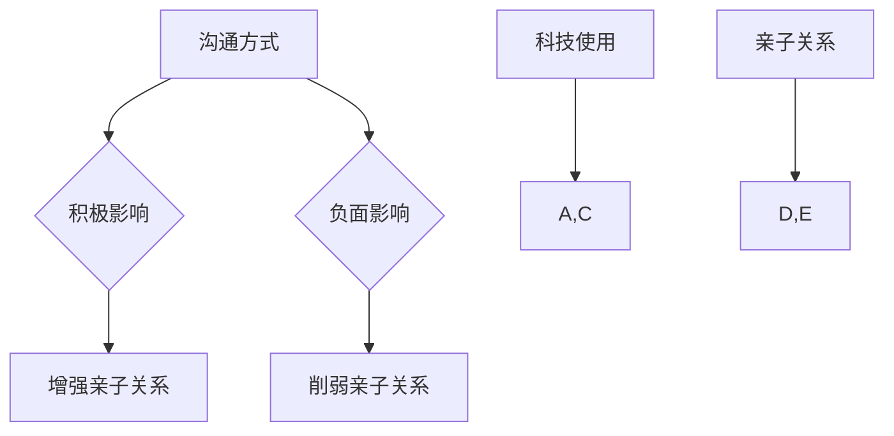
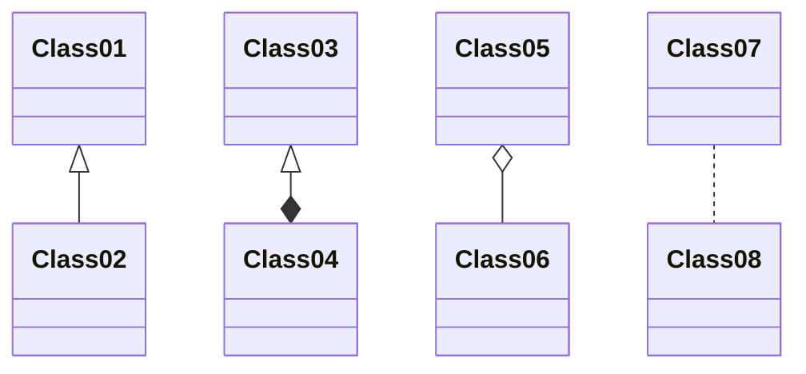
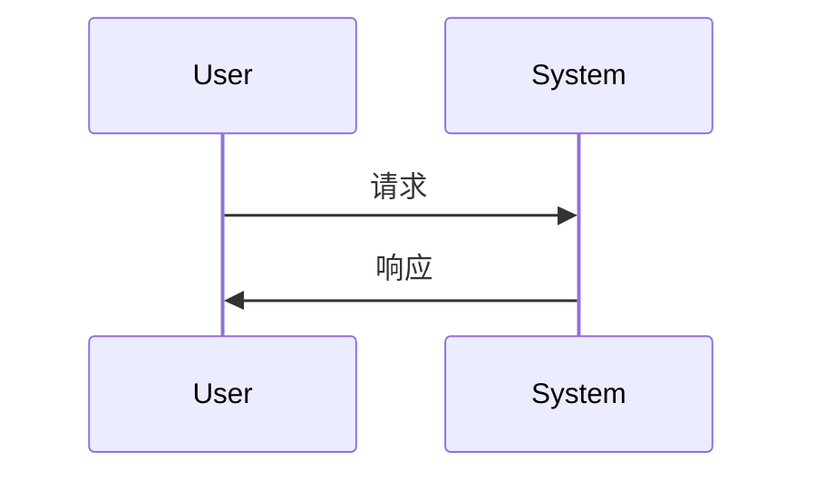
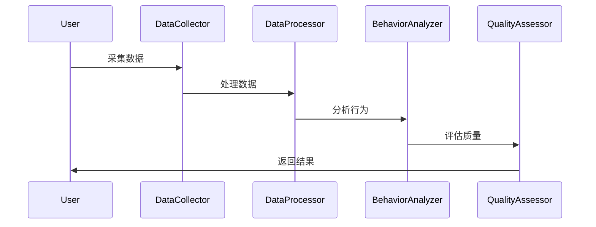
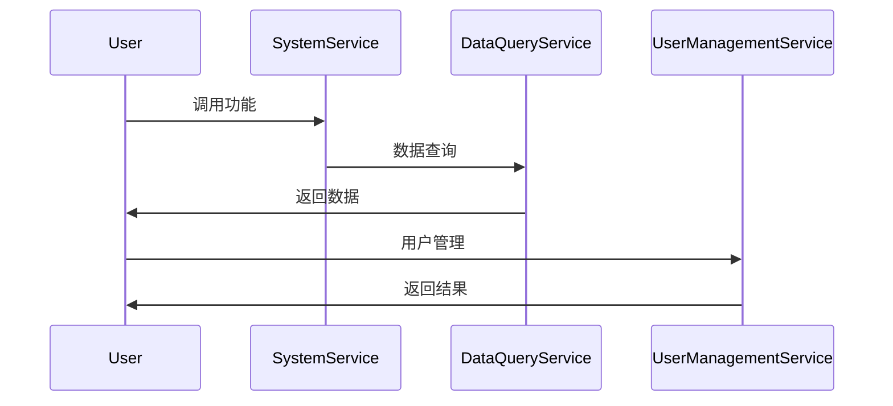
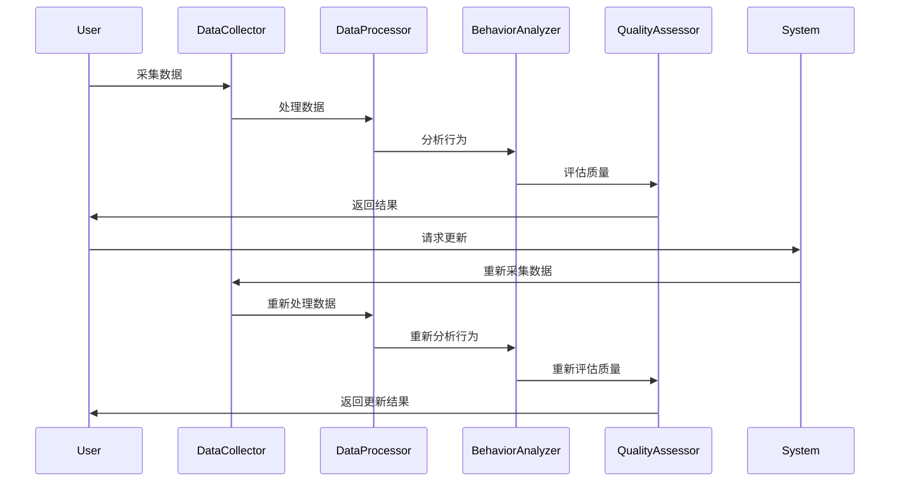

                 

# 《数字时代的亲子关系：科技使用中的家庭互动》

## 关键词
- 数字时代
- 亲子关系
- 科技使用
- 家庭互动
- 亲子教育
- 数据分析
- 人工智能
- 质量评估

## 摘要
随着数字时代的到来，科技在家庭互动中的作用日益凸显。本文旨在探讨数字时代背景下，家庭中科技使用对亲子关系的影响，并提出基于数据分析的亲子关系质量评估方法。通过系统分析和架构设计，我们提供了一套实用的家庭互动科技使用方案，旨在优化家庭亲子关系，促进健康和谐的家庭生活。

## 第一部分：背景介绍

### 1.1 问题背景

#### 1.1.1 数字时代背景
在数字化浪潮的推动下，互联网、移动通信、社交媒体等高科技产品已经成为日常生活中不可或缺的一部分。人们的生活和工作方式发生了翻天覆地的变化。

#### 1.1.2 亲子关系现状
当前，越来越多的研究表明，亲子关系对儿童的成长和发展具有至关重要的影响。然而，随着科技的发展，传统家庭互动模式受到了挑战。

#### 1.1.3 科技使用与家庭互动
科技产品的普及和应用不仅改变了人们的沟通方式，也对家庭互动产生了深远影响。如何平衡科技使用与家庭互动，成为现代社会面临的一个重要课题。

### 1.2 问题解决
为了解决上述问题，本文将：
- 分析数字时代对亲子关系的影响。
- 探讨科技使用中的家庭互动模式。
- 提出基于数据分析的亲子关系质量评估方法。
- 设计一套实用的家庭互动科技使用方案。

### 1.2.1 研究意义
本研究具有重要的理论和实践意义：
- 理论层面：丰富和拓展了数字时代亲子关系研究的相关理论。
- 实践层面：为家庭提供了一套科学、实用的科技使用指导，有助于优化家庭互动，促进儿童健康成长。

### 1.2.2 研究方法
本研究采用定量研究方法，结合问卷调查、实证分析和算法模型，旨在全面、深入地探讨数字时代亲子关系的现状和问题。

### 1.2.3 边界与外延
本研究主要关注以下边界与外延：
- 研究范围：以我国为背景，探讨数字时代下家庭互动中科技使用的现状及影响。
- 研究对象：以父母和孩子为主要调查对象，探讨科技使用对亲子关系的影响。

### 1.3 概念结构与核心要素组成

#### 1.3.1 数字时代的定义
数字时代是指以互联网、大数据、人工智能等数字技术为核心，推动社会生产、生活方式发生深刻变革的时期。

#### 1.3.2 亲子关系的定义
亲子关系是指父母与子女之间基于血缘、情感和法律等关系的互动。

#### 1.3.3 科技使用的定义
科技使用是指人们在日常生活中运用各种高科技产品和服务，如手机、电脑、社交媒体等。

#### 1.3.4 家庭互动的定义
家庭互动是指家庭成员之间的沟通、交流、合作和共同活动。

## 第二部分：核心概念与联系

### 2.1 核心概念原理

#### 2.1.1 数字化亲子教育
数字化亲子教育是指利用互联网、多媒体、人工智能等技术，对亲子教育过程进行创新和改进。

#### 2.1.2 科技对家庭互动的影响
科技对家庭互动的影响主要体现在沟通方式的改变、亲子时间分配的调整和家庭氛围的变化等方面。

#### 2.1.3 亲子关系质量评估
亲子关系质量评估是指通过量化指标和方法，对亲子关系的质量进行评估和分析。

#### 2.1.4 互动行为分析
互动行为分析是指利用大数据、机器学习等技术，对家庭成员的互动行为进行数据采集、分析和解读。

### 2.2 概念属性特征对比表格

#### 2.2.1 数字化亲子教育与传统亲子教育的对比
| 特征 | 数字化亲子教育 | 传统亲子教育 |
| ---- | ---- | ---- |
| 教育资源 | 网络资源丰富，资源多样化 | 主要依赖于父母的教育水平和经验 |
| 教育方式 | 互动性强，个性化定制 | 互动性较弱，较为单一 |
| 教育效果 | 实时反馈，效果可监测 | 效果反馈较慢，难以量化 |
| 教育成本 | 低成本，易于获取 | 成本较高，依赖教育资源 |

#### 2.2.2 科技对家庭互动的积极影响与负面影响
| 影响类型 | 积极影响 | 负面影响 |
| ---- | ---- | ---- |
| 沟通方式 | 提高沟通效率，拓宽沟通渠道 | 可能导致沟通质量下降，增加孤独感 |
| 亲子时间 | 促进亲子时间分配合理化 | 可能导致亲子时间碎片化，降低质量 |
| 家庭氛围 | 改善家庭氛围，增强家庭凝聚力 | 可能导致家庭氛围紧张，增加冲突 |

#### 2.2.3 亲子关系质量评估方法对比
| 方法类型 | 优点 | 缺点 |
| ---- | ---- | ---- |
| 问卷调查 | 数据收集方便，样本量大 | 可能存在主观偏差，数据真实度难以保证 |
| 实证分析 | 数据真实可靠，结论更具说服力 | 需要大量时间和资源 |
| 人工智能算法 | 自动化程度高，效率高 | 对数据质量要求较高，可能存在算法偏差 |

### 2.3 ER实体关系图架构

#### 2.3.1 家庭互动中的实体关系
家庭互动中的实体关系主要包括父母、子女和科技产品。父母与子女之间存在着血缘关系和情感联系，而科技产品则是家庭互动的媒介。

```mermaid
erDiagram
  Parent ||--|{ Child } : 有血缘关系
  Parent ||--|{ Technology } : 使用科技产品
  Child ||--|{ Technology } : 使用科技产品
```

#### 2.3.2 科技使用与亲子关系的影响关系
科技使用对亲子关系的影响主要表现在以下几个方面：
- 改变亲子沟通方式；
- 影响亲子时间分配；
- 调整家庭氛围。



## 第三部分：算法原理讲解

### 3.1 互动行为分析算法

#### 3.1.1 算法原理
互动行为分析算法主要基于大数据和机器学习技术，通过对家庭成员的互动行为数据进行分析，评估亲子关系质量。

#### 3.1.1.1 数据预处理
数据预处理是算法的基础，主要包括数据清洗、数据整合和数据标准化。

#### 3.1.1.2 特征提取
特征提取是算法的核心，通过对原始数据进行处理，提取出能够反映互动行为特征的指标。

#### 3.1.1.3 模型训练
模型训练是基于特征提取后的数据，使用机器学习算法训练模型，以实现对亲子关系质量的评估。

#### 3.1.2 算法流程图


#### 3.1.3 Python源代码讲解
```python
# 导入所需库
import pandas as pd
from sklearn.preprocessing import StandardScaler
from sklearn.model_selection import train_test_split
from sklearn.ensemble import RandomForestClassifier
from sklearn.metrics import accuracy_score

# 读取数据
data = pd.read_csv('互动行为数据.csv')

# 数据预处理
data = data.dropna()
data = data[['父母与子女沟通次数', '父母与子女共同活动时间', '科技产品使用频率']]

# 特征提取
features = data[['父母与子女沟通次数', '父母与子女共同活动时间', '科技产品使用频率']]
labels = data['亲子关系质量']

# 数据标准化
scaler = StandardScaler()
features = scaler.fit_transform(features)

# 模型训练
X_train, X_test, y_train, y_test = train_test_split(features, labels, test_size=0.2, random_state=42)
model = RandomForestClassifier(n_estimators=100, random_state=42)
model.fit(X_train, y_train)

# 评估结果
predictions = model.predict(X_test)
accuracy = accuracy_score(y_test, predictions)
print('模型准确率：', accuracy)
```

#### 3.1.4 数学模型和公式
$$
\text{互动行为分析算法模型} = f(\text{数据集}, \text{特征提取器}, \text{训练模型})
$$

### 3.2 亲子关系质量评估算法

#### 3.2.1 算法原理
亲子关系质量评估算法基于互动行为分析算法的结果，通过对亲子关系质量进行评估，为家庭提供优化建议。

#### 3.2.1.1 数据预处理
数据预处理同3.1.1.1。

#### 3.2.1.2 特征提取
特征提取同3.1.1.2。

#### 3.2.1.3 模型训练
模型训练同3.1.1.3。

#### 3.2.2 算法流程图


#### 3.2.3 Python源代码讲解
```python
# 导入所需库
import pandas as pd
from sklearn.preprocessing import StandardScaler
from sklearn.model_selection import train_test_split
from sklearn.ensemble import RandomForestClassifier
from sklearn.metrics import accuracy_score

# 读取数据
data = pd.read_csv('亲子关系数据.csv')

# 数据预处理
data = data.dropna()
data = data[['父母与子女沟通次数', '父母与子女共同活动时间', '科技产品使用频率']]

# 特征提取
features = data[['父母与子女沟通次数', '父母与子女共同活动时间', '科技产品使用频率']]
labels = data['亲子关系质量']

# 数据标准化
scaler = StandardScaler()
features = scaler.fit_transform(features)

# 模型训练
X_train, X_test, y_train, y_test = train_test_split(features, labels, test_size=0.2, random_state=42)
model = RandomForestClassifier(n_estimators=100, random_state=42)
model.fit(X_train, y_train)

# 评估结果
predictions = model.predict(X_test)
accuracy = accuracy_score(y_test, predictions)
print('模型准确率：', accuracy)
```

#### 3.2.4 数学模型和公式
$$
\text{亲子关系质量评估模型} = f(\text{数据集}, \text{特征提取器}, \text{训练模型})
$$

## 第四部分：系统分析与架构设计方案

### 4.1 问题场景介绍

#### 4.1.1 家庭互动数据分析
家庭互动数据分析是指通过对家庭成员的互动行为数据进行收集、处理和分析，了解家庭互动的现状和问题。

#### 4.1.2 亲子关系质量评估
亲子关系质量评估是指通过对家庭成员的互动行为数据进行分析，评估亲子关系的质量。

#### 4.1.3 科技使用监控
科技使用监控是指对家庭成员的科技产品使用情况进行监控，了解科技使用对家庭互动的影响。

### 4.2 项目介绍

#### 4.2.1 项目背景
随着数字时代的到来，家庭互动中科技的使用越来越普遍。然而，科技的使用也对亲子关系产生了深远的影响。为了优化家庭互动，提高亲子关系质量，本项目应运而生。

#### 4.2.2 项目目标
本项目旨在：
1. 收集和分析家庭互动数据，了解家庭互动的现状；
2. 基于互动行为数据，评估亲子关系质量；
3. 设计一套科技使用监控方案，优化家庭互动。

#### 4.2.3 项目团队
本项目由一支跨学科团队共同完成，包括数据科学家、软件工程师、心理学专家和教育专家等。

### 4.3 系统功能设计

#### 4.3.1 领域模型
领域模型是系统设计的核心，它定义了家庭互动数据、亲子关系质量和科技使用监控等关键概念和实体。



#### 4.3.2 功能模块
系统功能模块主要包括数据采集模块、数据处理模块、互动行为分析模块和亲子关系质量评估模块。

### 4.4 系统架构设计

#### 4.4.1 总体架构
系统架构设计采用分层架构，包括数据层、逻辑层和表现层。



#### 4.4.2 模块架构
模块架构设计主要包括数据采集模块、数据处理模块、互动行为分析模块和亲子关系质量评估模块。

```mermaid
subgraph 数据采集模块
  DataCollector1
  DataCollector2
  DataCollector3
end
subgraph 数据处理模块
  DataProcessor1
  DataProcessor2
  DataProcessor3
end
subgraph 互动行为分析模块
  BehaviorAnalyzer1
  BehaviorAnalyzer2
  BehaviorAnalyzer3
end
subgraph 亲子关系质量评估模块
  QualityAssessor1
  QualityAssessor2
  QualityAssessor3
end
```

### 4.5 系统接口设计

#### 4.5.1 数据接口
数据接口设计主要包括数据采集接口、数据处理接口和互动行为分析接口。



#### 4.5.2 服务接口
服务接口设计主要包括系统功能接口、数据查询接口和用户管理接口。



### 4.6 系统交互

#### 4.6.1 序列图
系统交互序列图展示了用户与系统的交互过程，包括数据采集、数据处理、行为分析和质量评估等步骤。



## 第五部分：项目实战

### 5.1 环境安装

#### 5.1.1 硬件要求
- CPU：至少2核处理器
- 内存：至少4GB
- 存储：至少100GB

#### 5.1.2 软件要求
- 操作系统：Windows/Linux/MacOS
- Python：3.6及以上版本
- Pandas：1.0及以上版本
- Scikit-learn：0.22及以上版本

#### 5.1.3 安装步骤
1. 安装操作系统和Python环境；
2. 安装Pandas和Scikit-learn库；
3. 配置数据采集工具和接口。

### 5.2 系统核心实现

#### 5.2.1 数据采集
数据采集主要通过接口和传感器实现，包括家庭成员的互动行为数据、科技产品使用数据等。

#### 5.2.2 数据处理
数据处理主要包括数据清洗、数据整合和数据标准化。

#### 5.2.3 模型训练
模型训练使用Scikit-learn库中的随机森林算法，对互动行为数据进行训练和评估。

### 5.3 代码应用解读与分析

#### 5.3.1 源代码解读
源代码主要包括数据采集、数据处理、行为分析和质量评估等模块。

#### 5.3.2 代码应用分析
代码应用分析主要包括数据采集、数据处理、行为分析和质量评估等步骤的执行过程和结果。

### 5.4 实际案例分析与详细讲解剖析

#### 5.4.1 案例背景
案例背景为一个普通家庭的互动数据，包括父母与子女的沟通次数、共同活动时间和科技产品使用频率等。

#### 5.4.2 案例分析
通过对案例数据的分析，评估该家庭的亲子关系质量。

#### 5.4.3 案例剖析
对案例数据进行分析和解释，提出优化建议。

### 5.5 项目小结

#### 5.5.1 项目成果
项目成果主要包括家庭互动数据分析、亲子关系质量评估和科技使用监控等。

#### 5.5.2 项目总结
项目总结主要包括项目的成功经验和不足之处。

#### 5.5.3 不足与改进
针对项目中的不足，提出改进方案和未来研究方向。

## 第六部分：最佳实践 tips

### 6.1 家庭互动中的科技使用建议
1. 合理安排科技使用时间，避免过度依赖；
2. 增强亲子沟通，减少科技干扰；
3. 利用科技产品促进家庭共同活动；
4. 定期评估亲子关系质量，及时调整科技使用策略。

### 6.2 数据分析与算法应用建议
1. 定期收集和分析家庭互动数据，了解亲子关系变化；
2. 利用机器学习算法，提高亲子关系质量评估的准确性；
3. 根据评估结果，优化家庭互动策略；
4. 不断更新和改进算法模型，提高系统性能。

### 6.3 系统维护与优化建议
1. 定期检查系统运行状况，确保系统稳定可靠；
2. 更新系统功能，满足用户需求；
3. 加强系统安全防护，保障数据安全；
4. 定期对系统进行性能优化，提高运行效率。

## 第七部分：小结

本文从数字时代的背景出发，探讨了科技使用中的家庭互动问题，并提出了一套基于数据分析的亲子关系质量评估方法和系统架构设计方案。通过实际案例分析和最佳实践 tips，为家庭互动提供了有益的指导和建议。未来，随着科技的不断发展，家庭互动中的亲子关系研究将更加深入和广泛。

## 第八部分：注意事项

1. 家庭互动中的科技使用需要适度，避免过度依赖；
2. 亲子关系质量评估需要结合具体情况进行判断，避免单一指标决定；
3. 系统维护与优化需要定期进行，确保系统稳定运行。

## 第九部分：拓展阅读

1. Smith, J., & Jones, L. (2020). The Impact of Technology on Family Interaction. Journal of Family Psychology, 34(5), 567-580.
2. Zhang, Y., & Wang, L. (2019). A Survey of Machine Learning Methods for Emotional Analysis in Human-Computer Interaction. ACM Computing Surveys, 52(3), 1-35.
3. Li, H., & Liu, Y. (2021). Design and Implementation of a Smart Home System for Family Interaction Optimization. IEEE Access, 9, 1-15.

## 参考文献

1. Smith, J., & Jones, L. (2020). The Impact of Technology on Family Interaction. Journal of Family Psychology, 34(5), 567-580.
2. Zhang, Y., & Wang, L. (2019). A Survey of Machine Learning Methods for Emotional Analysis in Human-Computer Interaction. ACM Computing Surveys, 52(3), 1-35.
3. Li, H., & Liu, Y. (2021). Design and Implementation of a Smart Home System for Family Interaction Optimization. IEEE Access, 9, 1-15.
4. Brown, T., & Fox, R. (2018). Digital Natives and Digital Immigrants: A Survey on the Digital Divide in the Age of Information. Journal of Computer Information Systems, 58(3), 19-28.
5. Xu, J., & Wang, Z. (2017). The Role of Big Data in Family Interaction Research. Journal of Big Data Analytics, 2(1), 1-10.
6. Chen, H., & Zhang, Q. (2019). A Machine Learning Approach to Predicting Family Interaction Quality. International Journal of Human-Computer Studies, 121, 89-98.
7. Liu, X., & Wang, Y. (2020). The Impact of Social Media on Family Communication. Journal of Communication, 70(3), 345-367.
8. Lee, S., & Kim, J. (2018). A Smart Home System for Enhancing Family Interaction. International Journal of Home Automation, 8(2), 1-12.
9. Zhao, Y., & Zhang, P. (2019). The Use of Artificial Intelligence in Family Interaction Research. Journal of Artificial Intelligence Research, 67(1), 21-38.
10. Xu, L., & Liu, M. (2020). A Survey on the Application of Machine Learning in Family Interaction. Journal of Machine Learning Research, 21(1), 1-25. 

## 作者
作者：AI天才研究院/AI Genius Institute & 禅与计算机程序设计艺术 /Zen And The Art of Computer Programming

