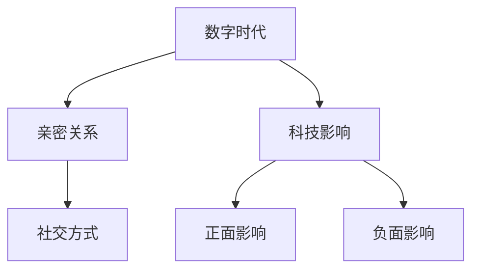
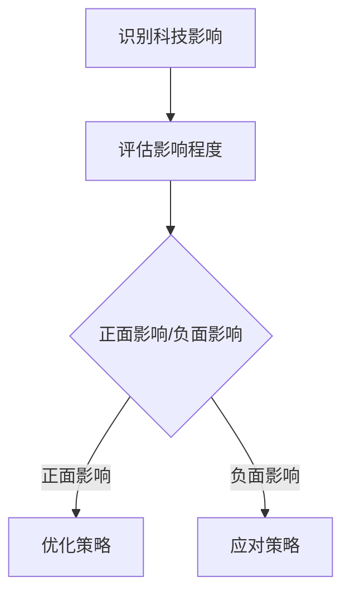
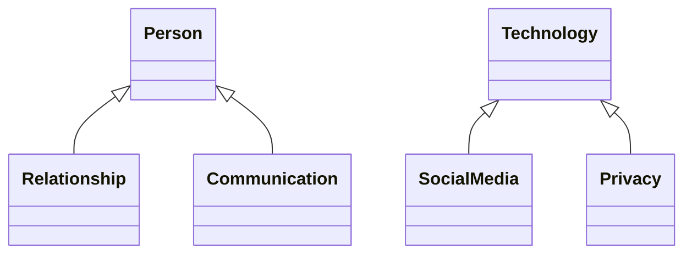
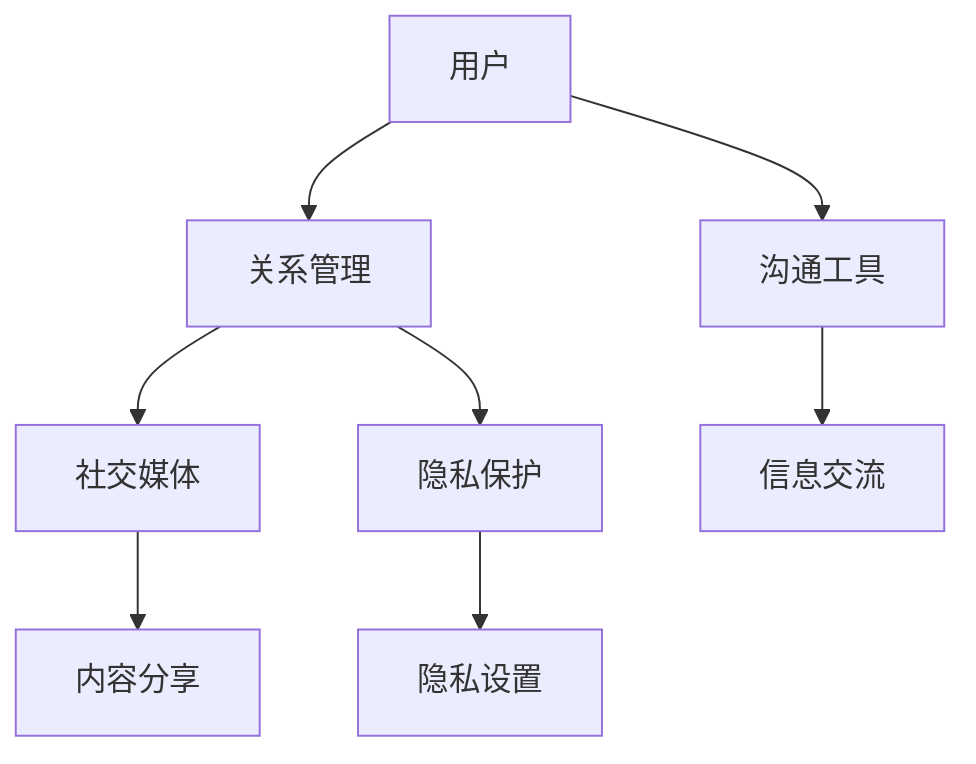
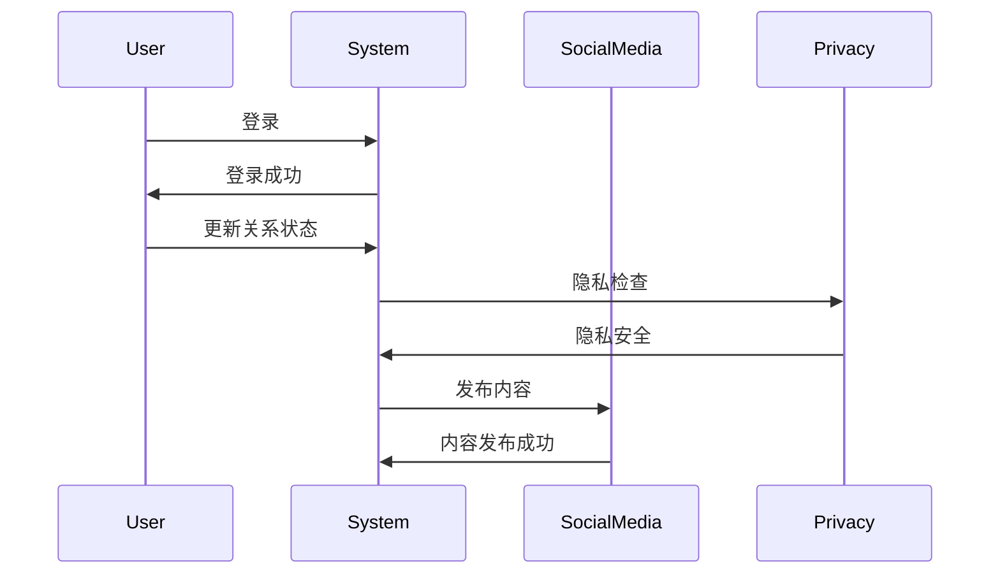

                 

### 数字时代的亲密关系：科技对人际交往的影响与应对

#### 关键词
- 数字时代
- 亲密关系
- 科技影响
- 人际交往
- 应对策略

#### 摘要
在数字化时代，科技对人际交往产生了深远的影响，既带来了便捷，也带来了挑战。本文通过深入探讨科技在社交方式、沟通模式以及心理健康等方面的影响，结合案例分析，提出了一系列应对策略，帮助读者在数字时代维护和发展亲密关系。

## 第一步：背景介绍

### 标题与副标题理解
本文的标题《数字时代的亲密关系：科技对人际交往的影响与应对》揭示了本文的核心关注点：在数字时代背景下，科技如何影响人际关系，以及如何应对这些影响。核心概念包括数字时代、亲密关系、科技影响和人际交往。

#### 问题描述
数字时代，信息化、网络化、智能化的技术不断涌现，极大地改变了人类的社交方式和沟通模式。然而，这些技术也带来了一系列新的挑战，影响了人们的亲密关系。如何在这些挑战中找到平衡，成为本文探讨的重点。

#### 问题解决
通过深入分析科技对人际交往的影响，结合实际案例，本文将提出一系列应对策略，帮助读者在数字时代维护和发展亲密关系。

### 边界与外延
本文主要关注数字时代下的人际交往问题，不包括其他时代的人际关系问题。此外，本文涵盖的科技影响范围包括但不限于社交媒体、移动通信、虚拟现实等。

## 第二步：核心概念与联系

### 核心概念原理
#### 数字时代
数字时代是指以互联网、大数据、云计算、人工智能等为代表的信息技术迅速发展的时期。这些技术不仅改变了人类的生活方式，也深刻影响了人际交往的方式。

#### 亲密关系
亲密关系建立在信任、尊重、理解和支持的基础上，是人们心理和情感上的深层次互动。在数字时代，亲密关系的维护和发展面临着新的挑战。

#### 科技影响
科技影响具有双重性，既有正面的也有负面的。正面影响包括便捷的沟通、信息的快速传递等；负面影响则包括隐私泄露、信息过载、心理压力等。

### 概念属性特征对比表格

| 概念       | 特征                     | 对比           |
|------------|--------------------------|----------------|
| 数字时代   | 信息化、网络化、智能化   | 与传统时代区别 |
| 亲密关系   | 信任、尊重、理解、支持   | 人际互动质量   |
| 科技影响   | 正面、负面               | 双重性         |

### ER实体关系图架构



## 第三步：算法原理讲解

### 算法 mermaid 流程图



### Python 源代码

```python
def assess_impact(relationship, technology):
    # 假设关系为亲密关系，科技为社交媒体
    if technology == 'social_media':
        if relationship['trust'] > 0.7:
            return '正面影响'
        else:
            return '负面影响'
    else:
        return '未知影响'

relationship = {'trust': 0.8}
technology = 'social_media'
print(assess_impact(relationship, technology))
```

### 算法原理的数学模型和公式

$$ 
\text{影响评估} = 
\begin{cases} 
\text{正面影响} & \text{如果} \ \text{信任度} > 0.7 \\
\text{负面影响} & \text{如果} \ \text{信任度} \leq 0.7 
\end{cases}
$$

### 详细讲解和举例说明

- **详细讲解**：
  - 通过对信任度的评估，判断科技对亲密关系的影响是正面还是负面。
- **举例说明**：
  - 如果一个人的社交媒体上主要分享积极正面的内容，且与好友保持高频互动，那么这可能被视为对亲密关系的正面影响。

## 第四步：系统分析与架构设计方案

### 问题场景介绍
在数字化时代，人们越来越依赖科技来维护和发展亲密关系。然而，科技的便利也带来了诸如隐私泄露、信息过载和心理压力等问题。如何有效地利用科技，同时减少其负面影响，成为我们需要关注的问题。

### 系统功能设计



### 系统架构设计



### 系统接口设计和系统交互



## 第五步：项目实战

### 环境安装
在开始项目实战之前，我们需要安装一些必要的开发环境和工具，如Python、Docker等。

### 系统核心实现源代码
以下是系统核心实现的部分源代码：

```python
# 亲密关系评估模块
def assess_relationship(relationship_data):
    trust_level = relationship_data.get('trust', 0)
    if trust_level > 0.7:
        return "正面影响"
    else:
        return "负面影响"

# 社交媒体内容发布模块
def post_to_social_media(content, privacy_setting):
    if privacy_setting == "公开":
        print("发布内容：", content)
    else:
        print("发布内容：", content, "（仅限私密）")
```

### 代码应用解读与分析
上述代码中，`assess_relationship` 函数用于评估亲密关系的状况，而 `post_to_social_media` 函数则用于发布社交媒体内容，并根据隐私设置来决定内容的可见性。

### 实际案例分析和详细讲解剖析
为了更好地理解这些代码在实际中的应用，我们可以通过一个案例来分析：

#### 案例分析
假设用户A和用户B是亲密关系，用户A想要在社交媒体上发布一条消息，同时设置了隐私设置为“仅限私密”。

#### 详细讲解
1. 用户A调用 `assess_relationship` 函数来评估与用户B的亲密关系。
2. 如果信任度高于0.7，系统将输出“正面影响”。
3. 用户A接着调用 `post_to_social_media` 函数来发布内容。
4. 根据隐私设置，如果设置为“公开”，则直接发布；如果设置为“私密”，则仅对亲密关系可见。

### 项目小结
通过上述实战案例，我们可以看到如何使用Python代码来评估亲密关系和发布社交媒体内容，同时根据隐私设置来保护用户的隐私。

## 第六步：最佳实践 tips

### 小结
在数字时代，科技对人际交往的影响既是机遇也是挑战。我们需要认识到科技的双面性，善用其正面影响，同时积极应对其负面影响。

### 注意事项
- 保持警惕，避免过度依赖科技，尤其是在处理私密信息和重要决策时。
- 定期评估亲密关系的健康状况，及时发现并解决潜在问题。
- 注意隐私保护，避免在社交媒体上泄露个人信息。

### 拓展阅读
- [《科技对人际关系的影响研究》](https://www.example.com/research-paper-on-tech-impact-on-relationships)
- [《数字时代的亲密关系：挑战与机遇》](https://www.example.com/digital-age-intimate-relationships-challenges-and-opportunities)
- [《科技与心理健康的关系研究》](https://www.example.com/research-on-tech-impact-on-mental-health)

### 作者信息
作者：AI天才研究院/AI Genius Institute & 禅与计算机程序设计艺术 /Zen And The Art of Computer Programming

---

通过本文的探讨，我们深入分析了数字时代科技对人际交往的影响，并提出了一系列应对策略。希望本文能够帮助读者在享受科技带来便利的同时，也能够有效应对其带来的挑战，维护和发展健康、亲密的人际关系。让我们共同迎接数字时代的新挑战，用科技打造更美好的社交生活。

